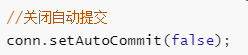
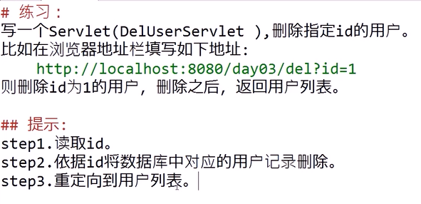
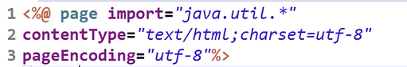
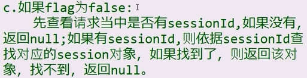
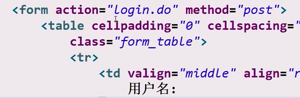
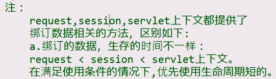

<h1 align="center">JavaWeb</h1>

---
- [JDBC](#jdbc)
	- [JDBC引入](#jdbc引入)
		- [1.JDBC](#1jdbc)
		- [2.为什么使用JDBC](#2为什么使用jdbc)
		- [3.如何使用JDBC连接MySQL数据库](#3如何使用jdbc连接mysql数据库)
		- [4.JUnit Test 单元测试](#4junit-test-单元测试)
		- [5.执行SQL的方法](#5执行sql的方法)
			- [5.1）执行增删改SQL](#51执行增删改sql)
			- [5.2）执行查询SQL](#52执行查询sql)
		- [6.封装DBUtils](#6封装dbutils)
			- [小技巧](#小技巧)
			- [配置DBUtils](#配置dbutils)
		- [7.properties配置文件](#7properties配置文件)
		- [8.完善DBUtils](#8完善dbutils)
		- [9.数据库连接池](#9数据库连接池)
		- [10.PreparedStatement预加载的SQL执行对象](#10preparedstatement预加载的sql执行对象)
			- [SQL注入](#sql注入)
			- [批量操作batch](#批量操作batch)
		- [11.事物](#11事物)
		- [12.获取自增主键的值](#12获取自增主键的值)
		- [13.数据库的元数据和表的元数据](#13数据库的元数据和表的元数据)
- [Servlet+Jsp](#servletjsp)
	- [part 1](#part-1)
		- [1.初识Servlet](#1初识servlet)
		- [2.第一个Servlet程序](#2第一个servlet程序)
		- [3.Servlet运行详解](#3servlet运行详解)
		- [4.常见错误](#4常见错误)
		- [5.Servlet练习1](#5servlet练习1)
		- [6.Servlet练习2](#6servlet练习2)
		- [7.http协议（了解）](#7http协议了解)
		- [8.演示添加用户（day02-lab）](#8演示添加用户day02-lab)
		- [9.访问数据库结合上一节添加用户（day02-lab）](#9访问数据库结合上一节添加用户day02-lab)
		- [10.课程回顾](#10课程回顾)
		- [11.演示查询用户（day03）](#11演示查询用户day03)
			- [一、重定向](#一重定向)
				- [(1) 什么是重定向？](#1-什么是重定向)
				- [（2）如何重定向？](#2如何重定向)
				- [（3）特点](#3特点)
			- [二、查询用户的代码](#二查询用户的代码)
		- [12.演示删除用户（day03）](#12演示删除用户day03)
		- [13.数据访问对象DAO（day03-2）](#13数据访问对象daoday03-2)
			- [（1）DAO是什么？](#1dao是什么)
			- [（2）如何写一个DAO？](#2如何写一个dao)
			- [（3）DAO的优点](#3dao的优点)
		- [14.jsp（day04）](#14jspday04)
			- [（1）jsp是什么？](#1jsp是什么)
			- [（2）如何写一个jsp文件？](#2如何写一个jsp文件)
			- [（3）jsp是如何执行的？](#3jsp是如何执行的)
			- [练习](#练习)
			- [jsp展示表格](#jsp展示表格)
		- [15.请求转发（day05）](#15请求转发day05)
			- [**（1）什么是转发？**](#1什么是转发)
			- [**（2）如何转发？**](#2如何转发)
			- [（3）转发特点](#3转发特点)
		- [16.转发与重定向的区别](#16转发与重定向的区别)
		- [17.相对路径和绝对路径](#17相对路径和绝对路径)
			- [（1）路径问题](#1路径问题)
			- [（2）什么是相对路径？](#2什么是相对路径)
			- [（3）什么是绝对路径？](#3什么是绝对路径)
			- [（4）如何写绝对路径？](#4如何写绝对路径)
		- [18.状态管理(day06)](#18状态管理day06)
			- [（1）什么是状态管理？](#1什么是状态管理)
			- [（2）如何进行状态管理？](#2如何进行状态管理)
			- [（3）Cookie](#3cookie)
				- [**a）什么是Cookie？**](#a什么是cookie)
				- [**b）如何添加Cookie？**](#b如何添加cookie)
				- [**c）Cookie的运作流程**](#ccookie的运作流程)
				- [**d）如何读取Cookie？**](#d如何读取cookie)
				- [**e）练习**](#e练习)
				- [**f）cookie的生存时间**](#fcookie的生存时间)
				- [**g）cookie的编码问题**](#gcookie的编码问题)
				- [**h）cookie的路径问题**](#hcookie的路径问题)
				- [**i）cookie的限制**](#icookie的限制)
				- [**j）演示统计网页访问次数的练习**](#j演示统计网页访问次数的练习)
			- [（4）Session（会话）（day07）](#4session会话day07)
				- [（1）session是什么?](#1session是什么)
				- [（2）如何获得session对象？](#2如何获得session对象)
				- [（3）session对象的常用方法](#3session对象的常用方法)
				- [（4）session超时？](#4session超时)
				- [（5）删除session](#5删除session)
				- [（6）session验证](#6session验证)
				- [（7）演示用户登录](#7演示用户登录)
				- [（8）比较session和cookie](#8比较session和cookie)
		- [19.servlet的生命周期（day08）](#19servlet的生命周期day08)
			- [（1）什么是servlet的生命周期？(面试题)](#1什么是servlet的生命周期面试题)
			- [（2）分成哪几个阶段？](#2分成哪几个阶段)
			- [（3）相关的接口与类](#3相关的接口与类)
				- [补充：将异常抛给容器来处理](#补充将异常抛给容器来处理)
			- [（4）相关练习](#4相关练习)
		- [20.过滤器（day09）](#20过滤器day09)
			- [（1）什么是过滤器？](#1什么是过滤器)
			- [（2）如何写一个过滤器？](#2如何写一个过滤器)
			- [（3）过滤器的优先级](#3过滤器的优先级)
			- [（4）初始化参数](#4初始化参数)
			- [（5）过滤器的优点](#5过滤器的优点)
		- [21.容器如何处理请求资源路径（day09-2）](#21容器如何处理请求资源路径day09-2)
		- [22.如何让一个servlet处理多种请求？](#22如何让一个servlet处理多种请求)
		- [23.监听器与servlet上下文(day10)](#23监听器与servlet上下文day10)
			- [（1）什么是监听器？](#1什么是监听器)
			- [（2）servlet上下文](#2servlet上下文)
				- [1）什么是servlet上下文？](#1什么是servlet上下文)
				- [2）如何获得servlet上下文](#2如何获得servlet上下文)
				- [3）上下文的使用](#3上下文的使用)
			- [（3）如何写一个监听器?](#3如何写一个监听器)
		- [24.servlet的线程安全问题(day10-2)](#24servlet的线程安全问题day10-2)
			- [（1）为什么说servlet会有线程安全问题？（面试题）](#1为什么说servlet会有线程安全问题面试题)
			- [（2）如何解决？](#2如何解决)
		- [25.小结(先看)](#25小结先看)
			- [（1）servlet基础](#1servlet基础)
			- [（2）servlet核心](#2servlet核心)
			- [（3）状态管理](#3状态管理)
			- [（4）数据库访问](#4数据库访问)
			- [（5）过滤器与监听器](#5过滤器与监听器)
			- [（6）典型案例](#6典型案例)
	- [part2 jsp](#part2-jsp)
		- [1.jsp基础（day11）](#1jsp基础day11)
			- [（1）什么是jsp？](#1什么是jsp)
			- [（2）如何写一个jsp文件？](#2如何写一个jsp文件-1)
			- [（3）jsp是如何执行的？](#3jsp是如何执行的-1)
		- [2.JSP标签和EL表达式](#2jsp标签和el表达式)
			- [（1）什么是jsp标签？](#1什么是jsp标签)
			- [（2）什么是EL表达式？](#2什么是el表达式)
			- [（3）EL表达式的使用](#3el表达式的使用)
				- [1）读取bean属性](#1读取bean属性)
				- [2）使用EL表达式做一些简单的运算（e2.jsp）](#2使用el表达式做一些简单的运算e2jsp)
				- [3）读取请求参数值](#3读取请求参数值)
		- [3.JSTL(jsp standard tag lib)(day12)](#3jstljsp-standard-tag-libday12)
			- [（1）什么时jstl？](#1什么时jstl)
			- [（2）如何使用jstl？](#2如何使用jstl)
			- [（3）if标签](#3if标签)
			- [（4）choose标签](#4choose标签)
			- [（5）forEach标签](#5foreach标签)
			- [（6）自定义标签](#6自定义标签)

---


# JDBC


## JDBC引入


通过上图类比下图


---

### 1.JDBC

Java DataBase Connectivity    ,   java数据库连接，实际上jdbc是java中的一套和数据库进行交互的api（ application program interface应用程序编程接口)


### 2.为什么使用JDBC

因为Java程序员需要连接多种数据库，为了避免每一种数据库都学习一套新的api，Sun公司提出了一个JDBC的接口，各个数据库的厂商根据此接口写实现类（驱动），这样java程序员只需要掌握JDBC接口的调用，即可访问任何数据库。


### 3.如何使用JDBC连接MySQL数据库

- 创建Maven工程

  Maven的作用和优势：https://blog.csdn.net/weixin_42225191/article/details/85111288

  ​										https://blog.csdn.net/weixin_38055381/article/details/81180022

- 从https://mvnrepository.com/ 仓库查找对应jar包

  

- 将其xml坐标复制到Maven工程的pom.xml中，注意，要用<dependencies></dependencies>包裹，这表示多个依赖。多个依赖中包含单个依赖(全选代码ctrl+I可格式化代码)

  ```java
  <project xmlns="http://maven.apache.org/POM/4.0.0"
  	xmlns:xsi="http://www.w3.org/2001/XMLSchema-instance"
  	xsi:schemaLocation="http://maven.apache.org/POM/4.0.0 https://maven.apache.org/xsd/maven-4.0.0.xsd">
  	<modelVersion>4.0.0</modelVersion>
  	<groupId>cn.akio</groupId>
  	<artifactId>jdbc01</artifactId>
  	<version>0.0.1-SNAPSHOT</version>
  
  	<!-- https://mvnrepository.com/artifact/mysql/mysql-connector-java -->
  	<dependencies>
  		<dependency>
  			<groupId>mysql</groupId>
  			<artifactId>mysql-connector-java</artifactId>
  			<version>5.1.6</version>
  		</dependency>
  	</dependencies>
  
  </project>
  ```

- 创建一个类

  

- 第一步：先加载驱动

  ```java
  //1.注册驱动
  		Class.forName("com.mysql.jdbc.Driver");
  注意这个com.mysql.jdbc.Driver是哪来的？
  ```

  - 双击打开Driver.class

    

  - 其中绿色框中的就是驱动类

    

- 第二步：获取连接对象

  - 注意导包的时候要选择com.sql的，这是java自己的东西，上面这个就是mysql独有的，选了上面这个以后换数据库这个连接就不通用。

    

  - 获取连接对象

    ```java
    //2.获取连接对象
    		Connection conn = DriverManager.getConnection("jdbc:mysql://localhost:3306/test", "root", "123456");
    ```

- 后面几步：

  ```java
  //3.创建SQL执行对象
  		Statement stat = conn.createStatement();
  		//4.执行SQL
  		String sql = "create table jdbc(id int, name varchar(10))";
  		stat.execute(sql);
  		System.out.println("创建完成");
  		//5.关闭资源，注意，先开的后关，相当于栈的出入
  		stat.close();
  		conn.close();
  ```


### 4.JUnit Test 单元测试

```java
package cn.akio;

import org.junit.Test;

/**
 * 单元测试
 * @author Grant·Vranes
 *
 */
public class Demo02 {
	@Test
	public void test01() {
		System.out.println("方法1");
	}
	
	@Test
	public void test02() {
		System.out.println("方法2");
	}
}
```

当你想执行哪个方法就点击哪个方法的方法名


鼠标放在这个方法名上，然后右键run as


### 5.执行SQL的方法

#### 5.1）执行增删改SQL

- `execute();`此方法可以执行任意的sQL但是推荐执行DL（数据定义语言create drop alter truncate）返回值为 boolean值返回值代表的是是否有结果集（只有查询语句有结果集）
- `executeUpdate();`增刪改操作全部使用此方法，返回一个int，表示生效的行数

- `executeQuery();`此方法执行查询操作，返回ResultSet结果集对象，通过while循环遍历

```java
@Test
	public void insert() throws ClassNotFoundException, SQLException {
		Class.forName("com.mysql.jdbc.Driver");
		Connection conn = DriverManager.getConnection("jdbc:mysql://localhost:3306/test", "root", "123456");
		Statement stat = conn.createStatement();
		String sql = "insert into jdbc(id,name) values(1,'jack')";
		stat.executeUpdate(sql);
		System.out.println("插入完成");
		stat.close();
		conn.close();
	}
	
	@Test
	public void update() throws ClassNotFoundException, SQLException {
		Class.forName("com.mysql.jdbc.Driver");
		Connection conn = DriverManager.getConnection("jdbc:mysql://localhost:3306/test", "root", "123456");
		Statement stat = conn.createStatement();
		String sql = "update jdbc set name='jacks' where id = 1";
		stat.executeUpdate(sql);
		System.out.println("修改完成");
	}
	
	@Test
	public void delete() throws ClassNotFoundException, SQLException {
		Class.forName("com.mysql.jdbc.Driver");
		Connection conn = DriverManager.getConnection("jdbc:mysql://localhost:3306/test", "root", "123456");
		Statement stat = conn.createStatement();
		String sql = "delete from jdbc where id = 1";
		stat.executeUpdate(sql);
		System.out.println("删除成功");
		stat.close();
		conn.close();
	}
```

#### 5.2）执行查询SQL

```java
@Test
	public void select() throws ClassNotFoundException, SQLException {
		Class.forName("com.mysql.jdbc.Driver");
		Connection conn = DriverManager.getConnection("jdbc:mysql://localhost:3306/test", "root", "123456");
		Statement stat = conn.createStatement();
		String sql = "select * from jdbc";
		//执行查询，得到的结果封装在了ReusltSet中
		ResultSet rs = stat.executeQuery(sql);
		//遍历结果集
		while(rs.next()) {
			int id = rs.getInt("id");
			String name = rs.getString("name");
			System.out.println(id+":"+name);
		}
		
		System.out.println("查找成功");
		rs.close();
		stat.close();
		conn.close();
	}
```

>---
>
>**从ResultSet中获取数据的两种方式:**
>
>1.通过表字段的名称获取
>
>​	
>
>2.通过结果字段的位置获取（以本次查询的字段顺序为准，并非表字段的顺序）
>
>​	


### 6.封装DBUtils

---

#### 小技巧

先介绍一个ecplise小技巧：当我们需要一大段代码模板来使用时，我们可以留存模板

- 复制需要存为模板的代码，点击工具栏->window->Preferences->Java->Editor->Templates

  

- 创建模板

  

  

- 直接输入getconn然后alt+/即可立刻补全模板

---


#### 配置DBUtils

```java
package cn.akio;

import java.sql.Connection;
import java.sql.DriverManager;
import java.sql.ResultSet;
import java.sql.SQLException;
import java.sql.Statement;

/**
 * 将数据库连接封装到这个类中
 * @author Grant·Vranes
 *
 */
public class DBUtils {
	//获取连接
	public static Connection getConn() throws ClassNotFoundException, SQLException {
		Class.forName("com.mysql.jdbc.Driver");
		Connection conn = DriverManager.getConnection("jdbc:mysql://localhost:3306/test", "root", "123456");
		return conn;
	}
	
	//关闭资源
	public static void close(Connection conn, Statement stat, ResultSet rs) {
        //为什么要用三段try_catch，因为这可以避免一个连接出错全盘就卡这里的情况
		try {
			//判断有值时关闭
			if(rs != null) {
				rs.close();
			}
		} catch (SQLException e) {
			e.printStackTrace();
		}
		try {
			//判断有值时关闭
			if(stat != null) {
				stat.close();
			}
		} catch (SQLException e) {
			e.printStackTrace();
		}
		try {
			//判断有值时关闭
			if(conn != null) {
				conn.close();
			}
		} catch (SQLException e) {
			e.printStackTrace();
		}
	}
}
```

```java
package cn.akio;

import java.sql.Connection;
import java.sql.ResultSet;
import java.sql.Statement;

import org.junit.Test;

public class Demo3 {
	@Test
	public void insert() {
		Connection conn = null;
		Statement stat = null;
		try {
			conn = DBUtils.getConn();
			stat = conn.createStatement();
			String sql = "insert into jdbc(id,name) values(1,'Rose')";
			stat.executeUpdate(sql);
			System.out.println("执行完成！");
		} catch (Exception e) {
			e.printStackTrace();
		} finally {
			DBUtils.close(conn, stat, null);
		}
	}
	
	@Test
	public void select() {
		Connection conn = null;
		Statement stat = null;
		ResultSet rs = null;
		try {
			conn = DBUtils.getConn();
			stat = conn.createStatement();
			rs = stat.executeQuery("select * from jdbc");
			while(rs.next()) {
				int id = rs.getInt("id");
				String name = rs.getString("name");
				System.out.println(id+":"+name);
			}
		} catch (Exception e) {
			e.printStackTrace();
		} finally {
			DBUtils.close(conn, stat, rs);
		}
	}
}
```


### 7.properties配置文件

创建一个jdbc.properties文件（注意该文件是以键值对存储数据，并且文件编码是ISO8859-1，输入的中文都会变成\u***）


如何使用该文件

```java
package cn.akio;

import java.io.IOException;
import java.io.InputStream;
import java.util.Properties;

public class Demo04 {

	public static void main(String[] args) {
		//创建读取配置文件的属性对象
		Properties prop = new Properties();
		//获取文件的输入流
		InputStream ips = Demo04.class.getClassLoader().getResourceAsStream("jdbc.properties");
		//把文件加载到属性文件中
		try {
			prop.load(ips);
			//获取数据 获取到的数据都为字符串类型
			String name = prop.getProperty("name");
			String age = prop.getProperty("age");
		} catch (IOException e) {
			e.printStackTrace();
		}
	}
}
```


### 8.完善DBUtils

```java
package cn.akio;

import java.io.IOException;
import java.io.InputStream;
import java.sql.Connection;
import java.sql.DriverManager;
import java.sql.ResultSet;
import java.sql.SQLException;
import java.sql.Statement;
import java.util.Properties;

/**
 * 将数据库连接封装到这个类中
 * @author Grant·Vranes
 *
 */
public class DBUtils {
	private static String driver;
	private static String url;
	private static String username;
	private static String password;
	static {//静态块读取Properties文件中的数据
		Properties prop = new Properties();
		//得到文件输入流
		InputStream ips = DBUtils.class.getClassLoader().getResourceAsStream("jdbc.properties");
		//文件加载到对象中
		try {
			prop.load(ips);
			driver = prop.getProperty("driver");
			url = prop.getProperty("url");
			username = prop.getProperty("username");
			password = prop.getProperty("password");
		} catch (IOException e) {
			// TODO Auto-generated catch block
			e.printStackTrace();
		} finally {
			try {
				ips.close();
			} catch (IOException e) {
				e.printStackTrace();
			}
		}
	}
	
	//获取连接
	public static Connection getConn() throws ClassNotFoundException, SQLException, IOException {
		Class.forName(driver);
		Connection conn = DriverManager.getConnection(url, username, password);
		return conn;
	}
	
	//关闭资源
	public static void close(Connection conn, Statement stat, ResultSet rs) {
		//为什么要用三段try_catch，因为这可以避免一个连接出错全盘就卡这里的情况
		try {
			//判断有值时关闭
			if(rs != null) {
				rs.close();
			}
		} catch (SQLException e) {
			e.printStackTrace();
		}
		try {
			//判断有值时关闭
			if(stat != null) {
				stat.close();
			}
		} catch (SQLException e) {
			e.printStackTrace();
		}
		try {
			//判断有值时关闭
			if(conn != null) {
				conn.close();
			}
		} catch (SQLException e) {
			e.printStackTrace();
		}
	}
}
```

```java
package cn.akio;

import java.sql.Connection;
import java.sql.ResultSet;
import java.sql.Statement;

import org.junit.Test;

public class Demo03 {
	@Test
	public void insert() {
		Connection conn = null;
		Statement stat = null;
		try {
			conn = DBUtils.getConn();
			stat = conn.createStatement();
			String sql = "insert into jdbc(id,name) values(1,'Rose')";
			stat.executeUpdate(sql);
			System.out.println("执行完成！");
		} catch (Exception e) {
			e.printStackTrace();
		} finally {
			DBUtils.close(conn, stat, null);
		}
	}
	
	@Test
	public void select() {
		Connection conn = null;
		Statement stat = null;
		ResultSet rs = null;
		try {
			conn = DBUtils.getConn();
			stat = conn.createStatement();
			rs = stat.executeQuery("select * from jdbc");
			while(rs.next()) {
				int id = rs.getInt("id");
				String name = rs.getString("name");
				System.out.println(id+":"+name);
			}
		} catch (Exception e) {
			e.printStackTrace();
		} finally {
			DBUtils.close(conn, stat, rs);
		}
	}
}
```


###  9.数据库连接池

首先我们要导一个包DBCP（DataBase Connection Pool数据库连接池）

https://mvnrepository.com/artifact/commons-dbcp/commons-dbcp/1.4

将xml坐标复制粘贴到pom.xml文件中


**为什么要使用连接池**

> 如果没有连接池，一万次请求会对应一万次和数据库服务器的连接和断开连接操作，使用连接池之后可以将连接池中的连接复用，从而提高执效率


**测试数据库连接池**

```java
package cn.akio;

import java.sql.Connection;
import java.sql.SQLException;

import org.apache.commons.dbcp.BasicDataSource;

/**
 * 	测试数据库连接池
 * @author Grant·Vranes
 *
 */
public class Demo05 {
	public static void main(String[] args) throws SQLException {
		//创建数据源对象
		BasicDataSource dataSource = new BasicDataSource();
		//设置数据库连接信息
		dataSource.setDriverClassName("com.mysql.jdbc.Driver");
		dataSource.setUrl("jdbc:mysql://localhost:3306/test");
		dataSource.setUsername("root");
		dataSource.setPassword("123456");
		//设置初始连接数量
		dataSource.setInitialSize(3);
		//设置最大连接数量
		dataSource.setMaxActive(5);
		
		Connection conn = dataSource.getConnection();
		System.out.println(conn);
	}
}
```

**根据以上知识修改DBUtils**

```java
package cn.akio;

import java.io.IOException;
import java.io.InputStream;
import java.sql.Connection;
import java.sql.ResultSet;
import java.sql.SQLException;
import java.sql.Statement;
import java.util.Properties;

import org.apache.commons.dbcp.BasicDataSource;

/**
 * 将数据库连接封装到这个类中
 * @author Grant·Vranes
 *
 */
public class DBUtils {
	private static String driver;
	private static String url;
	private static String username;
	private static String password;
	private static BasicDataSource dataSource;
	
	static {//静态块读取Properties文件中的数据
		Properties prop = new Properties();
		//得到文件输入流
		InputStream ips = DBUtils.class.getClassLoader().getResourceAsStream("jdbc.properties");
		//文件加载到对象中
		try {
			prop.load(ips);
			driver = prop.getProperty("driver");
			url = prop.getProperty("url");
			username = prop.getProperty("username");
			password = prop.getProperty("password");
			
			//创建数据源对象(连接池)
			dataSource = new BasicDataSource();
			dataSource.setDriverClassName(driver);
			dataSource.setUrl(url);
			dataSource.setUsername(username);
			dataSource.setPassword(password);
			dataSource.setInitialSize(3);
			dataSource.setMaxActive(5);
		} catch (IOException e) {
			// TODO Auto-generated catch block
			e.printStackTrace();
		} finally {
			try {
				ips.close();
			} catch (IOException e) {
				e.printStackTrace();
			}
		}
	}
	
	//获取连接
	public static Connection getConn() throws SQLException{
//		Class.forName(driver);
//		Connection conn = DriverManager.getConnection(url, username, password);
		//以上是旧方法，下列是连接池的新方法
		return dataSource.getConnection();
	}
	
	//关闭资源
	public static void close(Connection conn, Statement stat, ResultSet rs) {
		//为什么要用三段try_catch，因为这可以避免一个连接出错全盘就卡这里的情况
		try {
			//判断有值时关闭
			if(rs != null) {
				rs.close();
			}
		} catch (SQLException e) {
			e.printStackTrace();
		}
		try {
			//判断有值时关闭
			if(stat != null) {
				stat.close();
			}
		} catch (SQLException e) {
			e.printStackTrace();
		}
		try {
			//判断有值时关闭
			if(conn != null) {
				conn.close();
			}
		} catch (SQLException e) {
			e.printStackTrace();
		}
	}
}
```


**连接池的等待问题**

- 当我把DBUtils中这段代码修改为如下（初始连接数和最大连接数都设置为3）

  

- 使用如下代码测试连接池的等待，当下面四个线程同时运行时，只能先允许三个线程运行，多的那个线程就先等待。当这三个线程其中一个运行完毕后，将会归还连接，剩下那一个等待中的线程再运行。

  ```java
  package cn.akio;
  
  import java.sql.Connection;
  /**
   * 线程中详述连接池的等待问题
   * @author Grant·Vranes
   *
   */
  public class Demo07 {
  	public static void main(String[] args) {
  		DemoThread d1 = new DemoThread();
  		d1.start();
  		DemoThread d2 = new DemoThread();
  		d2.start();
  		DemoThread d3 = new DemoThread();
  		d3.start();
  		DemoThread d4 = new DemoThread();
  		d4.start();
  			
  	}
  }
  
  class DemoThread extends Thread {
  	@Override
  	public void run() {
  		//获取连接
  		try {
  			Connection conn = DBUtils.getConn();
  			System.out.println("得到连接");
  			//模拟耗时
  			Thread.sleep(5000);
  			//归还连接
  			conn.close();
  			System.out.println("归还连接");
  		} catch (Exception e) {
  			e.printStackTrace();
  		}
  	}
  }
  ```


### 10.PreparedStatement预加载的SQL执行对象

> 关于插入中文时会出现乱码？
>
> 可以在jdbc.properties中将url后面加上如下列代码中的语句
>
> ```java
> driver=com.mysql.jdbc.Driver
> url=jdbc:mysql://localhost:3306/test?useUnicode=true&characterEncoding=UTF-8
> username=root
> password=123456
> ```

> 关于PreparedStatement的好处：
>
> 1、代码更直观，简洁
>
> 2、可以避免SQL注入，因为在预编译时已经把sql逻辑固定锁死，不会被之后替换进去的值改变原有逻辑

```java
package cn.akio;

import java.sql.Connection;
import java.sql.PreparedStatement;
import java.sql.ResultSet;
import java.util.Scanner;

/**
 * 预编译的应用
 * @author Grant·Vranes
 *
 */
public class Demo08 {
	public static void main(String[] args) {
		/*
		 * 	请输入用户名	李白
		 * 	请输入年龄		20
		 * 	保存成功
		 */
		Scanner sc = new Scanner(System.in);
		System.out.println("请输入名字：");
		String name = sc.nextLine();
		System.out.println("请输入年龄：");
		int age = sc.nextInt();
		
		String sql = "insert into jdbcuser values(?,?)";
		
		Connection conn = null;
		PreparedStatement psta = null;
		ResultSet rs = null;
		try {
			conn = DBUtils.getConn();
			psta = conn.prepareStatement(sql);
			//把?换成正确的内容
			psta.setString(1, name);
			psta.setInt(2, age);
			psta.executeUpdate();
			System.out.println("执行成功");
		} catch (Exception e) {
			e.printStackTrace();
		} finally {
			DBUtils.close(conn, psta, rs);
		}
	}
}
```


#### SQL注入

```java
package cn.akio;

import java.sql.Connection;
import java.sql.ResultSet;
import java.sql.Statement;
import java.util.Scanner;

/**
 * 做这样一个操作：
 * 请输入用户名：libai
 * 请输入密码：123
 * 登陆成功\登录失败
 * @author Grant·Vranes
 *
 */
public class Demo09 {
	public static void main(String[] args) {
		Scanner sc = new Scanner(System.in);
		System.out.println("请输入用户名:");
		String username = sc.nextLine();
		
		System.out.println("请输入密码:");
		String password = sc.nextLine();
		
		boolean b = login(username, password);
		if(b) {
			System.out.println("登陆成功");
		}else {
			System.out.println("登录失败");
		}
	}

	private static boolean login(String username, String password) {
		String sql = "select count(*) from user where username='"+username+"' and password='"+password+"'";
		Connection conn = null;
		Statement stat = null;
		ResultSet rs = null;
		try {
			conn = DBUtils.getConn();
			stat = conn.createStatement();
			rs = stat.executeQuery(sql);
			while(rs.next()) {
				//等到查询的数量
				int count = rs.getInt(1);
				if(count > 0) {//登录成功
					return true;
				}
			}
		} catch (Exception e) {
			e.printStackTrace();
		} finally {
			DBUtils.close(conn, stat, rs);
		}
		return false;
	}
}
```

对于以上代码，当我输入以下数据时，显示登陆成功。这是不正确的，明显的SQL注入


使得她的整个SQL语句变成了

`select count(*) from user where username='随便输入的' and password='' or '1'='1'`

所以无论输入什么都永远满足条件，这就是典型的SQL注入，使用这种拼接的SQL语句就会有这种风险，此时就可以使用PreparedStatement预加载来避免这种情况。如下修改代码。

```java
只需要将login方法修改为
private static boolean login(String username, String password) {
		String sql = "select count(*) from user where username=? and password=?";
		Connection conn = null;
		PreparedStatement psta = null;
		ResultSet rs = null;
		try {
			conn = DBUtils.getConn();
			psta = conn.prepareStatement(sql);
			psta.setString(1, username);
			psta.setNString(2, password);
			rs = psta.executeQuery();
			while(rs.next()) {
				//等到查询的数量
				int count = rs.getInt(1);
				if(count > 0) {//登录成功
					return true;
				}
			}
		} catch (Exception e) {
			e.printStackTrace();
		} finally {
			DBUtils.close(conn, psta, rs);
		}
		return false;
	}
```


> 为什么能阻止SQL注入？
>
> 因为他在执行之前就已经编译了，把sql语句指定部分已经编译好了，剩下部分只是放进去值而已，后面的内容只能以值的形式去添加。也就是说你后面添加的内容是不能再去修改SQL语句的逻辑的。


#### 批量操作batch

因为每次sql的执行都需要和数据库服务器进行数据传输，如果执行的sql多每次和数据库进行交互浪费资源执行效率低，使用批量操作可以把多条SQL语句合并到一次交互中，这样可以提高执行效率。

```java
package cn.akio;

import java.sql.Connection;
import java.sql.PreparedStatement;
import java.sql.ResultSet;
import java.sql.Statement;
import java.util.Iterator;

import org.junit.Test;
/**
 * SQL语句的批处理操作
 * @author Grant·Vranes
 *
 */
public class Demo11 {
	@Test
	public void test01() {
		String sql1 = "insert into user values(null,'王一博','123')";
		String sql2 = "insert into user values(null,'肖战','123')";
		String sql3 = "insert into user values(null,'吴磊','123')";
		
		Connection conn = null;
		Statement stat = null;
		ResultSet rs = null;
		try {
			conn = DBUtils.getConn();
			stat = conn.createStatement();
			/*
			 * 像下面这么写就很浪费资源，一条SQL语句就要执行一次
			 */
//			stat.executeUpdate(sql1);
//			stat.executeUpdate(sql2);
//			stat.executeUpdate(sql3);
			
			/*
			 * 批处理
			 */
			stat.addBatch(sql1);
			stat.addBatch(sql2);
			stat.addBatch(sql3);
			//执行批量操作
			stat.executeBatch();
		} catch (Exception e) {
			e.printStackTrace();
		} finally {
			DBUtils.close(conn, stat, rs);
		}
	}
	
	@Test
	public void test02() {
		String sql = "insert into user values(null,?,?)";
		Connection conn = null;
		PreparedStatement psta = null;
		ResultSet rs = null;
		try {
			conn = DBUtils.getConn();
			psta = conn.prepareStatement(sql);
			psta.setString(1, "喜羊羊");
			psta.setString(2, "123");
			//添加到批量处理
			psta.addBatch();
			
			psta.setString(1, "美羊羊");
			psta.setString(2, "123");
			//添加到批量处理
			psta.addBatch();
			
			psta.setString(1, "懒羊羊");
			psta.setString(2, "123");
			//添加到批量处理
			psta.addBatch();
			
			//执行
			psta.executeBatch();
		} catch (Exception e) {
			e.printStackTrace();
		}
	}
	
	@Test
	public void test03() {
		String sql = "insert into user values(null,?,?)";
		Connection conn = null;
		PreparedStatement psta = null;
		ResultSet rs = null;
		try {
			conn = DBUtils.getConn();
			psta = conn.prepareStatement(sql);
			for (int i = 0; i < 100; i++) {
				psta.setString(1, "name_"+i);
				psta.setString(2, "123");
				psta.addBatch();
				/*
				 * 如果我一下要执行十万条SQL语句，此时内存会爆炸
				 * 下面的写法可以避免内存溢出
				 */
				if(i%20==0) {
					psta.executeBatch();
					//清除批处理内容
					psta.clearBatch();
				}
			}
			psta.executeBatch();
		} catch (Exception e) {
			e.printStackTrace();
		}
	}
}
```

---

使用SQL语句实现一个简单的小分页查询

```java
package cn.akio;

import java.sql.Connection;
import java.sql.PreparedStatement;
import java.sql.ResultSet;
import java.util.Scanner;

public class Demo12 {
	public static void main(String[] args) {
		//查询第?页数据，每页?条数据
		//请输入页数
		//请输入条数
		Scanner sc = new Scanner(System.in);
		System.out.println("请输入页数：");
		int page = sc.nextInt();
		System.out.println("请输入条数：");
		int count = sc.nextInt();
		String sql = "select * from user limit ?,?";
		
		Connection conn = null;
		PreparedStatement psta = null;
		ResultSet rs = null;
		try {
			conn = DBUtils.getConn();
			psta = conn.prepareStatement(sql);
			psta.setInt(1, (page-1)*count);
			psta.setInt(2, count);
			//执行查询
			rs = psta.executeQuery();
			while(rs.next()) {
				int id = rs.getInt("id");
				String username = rs.getString("username");
				System.out.println(id+":"+username);
			}
			
		} catch (Exception e) {
			e.printStackTrace();
		} finally {
			DBUtils.close(conn, psta, rs);
		}
	}
}
```

---


### 11.事物

> 1、关闭自动提交`conn.setAutoCommit(false);`
>
> 2、提交`conn.commit();`
>
> 3、回滚`conn.rollback();`

案例：

```java
package cn.akio;

import java.sql.Connection;
import java.sql.ResultSet;
import java.sql.Statement;
/**
 * 
 * 数据库：
 * create table person(id int, name varchar(10), money int);
 * insert into person values(1,'大潮',50000),(2,'刘家营',30000);
 * @author Grant·Vranes
 *
 */
public class Demo13 {
	public static void main(String[] args) {
		String sql1 = "update person set money=money+20000 where id=1";
		String sql2 = "update person set money=money-20000 where id=2";
		Connection conn = null;
		Statement stat = null;
		ResultSet rs = null;
		try {
			conn = DBUtils.getConn();
			stat = conn.createStatement();
			//关闭自动提交
			conn.setAutoCommit(false);
			//让大潮+20000
			stat.executeUpdate(sql1);
			//让刘家营-20000
			stat.executeUpdate(sql2);
			//查询刘家营剩余的签是否>=0
			rs = stat.executeQuery("select money from person where id=2");
			while(rs.next()) {
				int money = rs.getInt("money");
				if(money>=0) {
					//提交
					conn.commit();
					System.out.println("转账成功");
				}else {
					conn.rollback();//事物回滚
					System.out.println("刘家营钱也不够了");
				}
			}
		} catch (Exception e) {
			e.printStackTrace();
		} finally {
			DBUtils.close(conn, stat, rs);
		}
	}
}
```

> 以上程序就是一个简单的事物，刘家营每次转账20000给大潮，可以就转，不可以就显示钱不够。利用了SQL语法中的事物的提交和回滚原理。需要注意的是以下代码
>
> 
>
> 的使用必须要求再关闭的conn的时候要是自动提交开着的，这样才能正确关闭，所以在DBUtils类中
>
> 


### 12.获取自增主键的值

```java
package cn.akio;

import java.sql.Connection;
import java.sql.ResultSet;
import java.sql.Statement;

/**
 * 获取自增主键的值
 * @author Grant·Vranes
 *
 */
public class Demo14 {
	public static void main(String[] args) {
		Connection conn = null;
		Statement stat = null;
		ResultSet rs = null;
		try {
			conn = DBUtils.getConn();
			stat = conn.createStatement();
			String sql = "insert into user values(null,'刘德华','123')";
			//执行SQL 并且指定需要获取自增主键值
			stat.executeUpdate(sql, Statement.RETURN_GENERATED_KEYS);
			//获取返回的主键值
			rs = stat.getGeneratedKeys();
			while(rs.next()) {
				int id = rs.getInt(1);
				System.out.println("自增主键："+id);
			}
			
		} catch (Exception e) {
			e.printStackTrace();
		} finally {
			DBUtils.close(conn, stat, rs);
		}
	}
}
```

小案例

```java
package cn.akio;

import java.sql.Connection;
import java.sql.PreparedStatement;
import java.sql.ResultSet;
import java.sql.Statement;
import java.util.Scanner;

/**
 * 数据库中，创建一个球队表和一个球员表
 * create table team(id int primary key auto_increment, name varchar(10));
 * create table player(id int primary key auto_increment, name varchar(10), teamid int);
 * 
 * 当输入的是一个新球队，会自动插入team表并生成一个自增主键，然后输入球员其teamid等于球队主键id
 * 当输入的是一个已经存入的球队，会查询这个球队的id，然后输入的球员的teamid就是这个查询到的id
 * @author Grant·Vranes
 *
 */
public class Demo15 {
	public static void main(String[] args) {
		Scanner sc = new Scanner(System.in);
		System.out.println("请输入球队名称：");
		String teamName = sc.nextLine();
		System.out.println("请输入球员名称：");
		String playerName = sc.nextLine();
		
		Connection conn = null;
		PreparedStatement psta = null;
		ResultSet rs = null;
		try {
			conn = DBUtils.getConn();
			//查询球队是否存在
			String sql1 = "select id from team where name=?";
			psta = conn.prepareStatement(sql1);
			psta.setString(1, teamName);
			rs = psta.executeQuery();
			int teamId = -1;
			while(rs.next()) {
				//得到球队id
				teamId = rs.getInt("id");
			}
			if(teamId==-1) {//这个球队没有存过
				//保存球队
				String sql2 = "insert into team values(null,?)";
				psta.close();
				psta = conn.prepareStatement(sql2, Statement.RETURN_GENERATED_KEYS);
				psta.setString(1, teamName);
				//执行保存球队操作
				psta.executeUpdate();
				//获取自增主键值
				rs.close();
				rs = psta.getGeneratedKeys();
				while(rs.next()) {
					teamId = rs.getInt(1);//得到球队id
				}
			}
			//保存球员 并通过teamId建立联系
			String sql3 = "insert into player values(null,?,?)";
			psta.close();
			psta = conn.prepareStatement(sql3);
			psta.setString(1, playerName);
			psta.setInt(2, teamId);
			//执行SQL
			psta.executeUpdate();
			
		} catch (Exception e) {
			e.printStackTrace();
		} finally {
			DBUtils.close(conn, psta, rs);
		}
	}
}
```


### 13.数据库的元数据和表的元数据

:watch:一般用的不多

```java
package cn.akio;

import java.sql.Connection;
import java.sql.DatabaseMetaData;
import java.sql.ResultSet;
import java.sql.ResultSetMetaData;
import java.sql.Statement;


public class Demo16 {
	public static void main(String[] args) {
		Connection conn = null;
		Statement stat = null;
		ResultSet rs = null;
		try {
			conn = DBUtils.getConn();
			stat = conn.createStatement();
			//得到数据库的元数据
			DatabaseMetaData daData = conn.getMetaData();
			System.out.println("驱动版本："+daData.getDriverVersion());
			System.out.println("用户名："+daData.getUserName());
			System.out.println("链接地址："+daData.getURL());
			System.out.println("数据库名称："+daData.getDatabaseProductName());
		
			//获取表相关的元数据
			rs = stat.executeQuery("select * from team");
			ResultSetMetaData rsData = rs.getMetaData();
			//得到表的字段数量
			int count = rsData.getColumnCount();
			for (int i = 0; i < count; i++) {
				String name = rsData.getColumnClassName(i+1);
				String type = rsData.getColumnTypeName(i+1);
				System.out.println(name+":"+type);
			}
		} catch (Exception e) {
			e.printStackTrace();
		} finally {
			DBUtils.close(conn, stat, rs);
		}
	}
}
```


# Servlet+Jsp

## part 1

### 1.初识Servlet

- 什么是Servlet? 

  > sun公司制订的一种用来<u>**扩展web服务器功能**</u>的<u>**组件规范**</u>。
  >
  > > 1）扩展web服务器功能?
  > >
  > > web服务器只能够处理静态资源的请求（即需要事先将静态页面写好），不能够处理动态资源的请求（即需要进行计算，生成动态页面），所以，需要扩展其功能。
  > > 可以使用servlet来扩展web服务器功能，web服务器收到请求之后，如果需要计算，则调用Servlet来处理。
  >
  > > 2）组件规范?
  > >
  > > > 2.1）什么是组件？
  > > >
  > > > 符合规范、实现部分功能，并且需要部署到相应的容器当中才能运行的软件模块。
  > > >
  > > > :rabbit:Servlet必须符合servlet规范，并且需要部署到Servlet容器当中才能运行。
  > > >
  > > > 2.2）什么是容器?
  > > >
  > > > 符合规范、提供组件运行环境的程序。
  > > >
  > > > Servlet容器（比如 Tomcat）为Servlet提供运行环境（主要是提供网络相关的服务）

- 如何写一个Servlet？

  - [ ] step1:写一个java类，实现servlet接口或者继承Httpservlet。

  - [ ] step2:编译

  - [ ] step3:打包 （即建立一个具有如下结构的文件夹）

    

  - [ ] step4:部署

    

  - [ ] step5:启动容器，访问Servlet

    

    

### 2.第一个Servlet程序


```java
package web;

import java.io.IOException;
import java.io.PrintWriter;

import javax.servlet.http.HttpServlet;
import javax.servlet.http.HttpServletRequest;
import javax.servlet.http.HttpServletResponse;

public class HelloServlet extends HttpServlet{
	/**
	 * 1.该方法用来处理请求（即容器收到请求之后，会调用Servlet的service方法来处理请求）。
	 * 2.容器在调用service方法时，会将request对象和response对象作为参数传进来
	 * 注：
	 * 		request对象：容器收到请求之后，会解析请求数据包，然后将解析到的数据存
	 * 					放到request对象里面，开发人员只需要调用request对象的方法
	 * 					就可以获得请求数据包中的数据。
	 * 		response对象：开发人员只需要将处理结果添加到response对象上即可，容器会
	 * 					从response对象上获得处理结果，然后创建响应数据包并发送给浏览器
	 * @throws IOException 
	 */
	public void service(HttpServletRequest request, HttpServletResponse response) throws IOException {
		/*
		 * 设置content-type消息头的值，告诉浏览器，服务器返回的数据类型。
		 */
		response.setContentType("text/html");
		/*
		 * 通过response对象获得输出流
		 */
		PrintWriter out = response.getWriter();
		/*
		 * 通过流将处理结果添加到了response对象上。
		 */
		out.println("<h1>Hello Akio</h1>");
		/*
		 * 关闭流
		 * 容器在关闭流之前，会将response对象上存放的数据取出来，创建响应数据
		 * 包，然后发送浏览器。
		 */
		out.close();
	}
}
```

```java
web.xml文件
<?xml version="1.0" encoding="UTF-8"?>
<web-app xmlns:xsi="http://www.w3.org/2001/XMLSchema-instance" xmlns="http://java.sun.com/xml/ns/javaee" xsi:schemaLocation="http://java.sun.com/xml/ns/javaee http://java.sun.com/xml/ns/javaee/web-app_2_5.xsd" version="2.5">
	<servlet>
		<servlet-name>helloServlet</servlet-name>
		<!-- 
			这里要写Servlet的完整的类名。Servlet容器会利用
			java的反射来创建Servlet实例。
		 -->
		<servlet-class>web.HelloServlet</servlet-class>
	</servlet>
	<servlet-mapping>
		<servlet-name>helloServlet</servlet-name>
		<!-- 
			url-pattern用来告诉容器，请求路径与Servlet的对应关系。
		 -->
		<url-pattern>/hello</url-pattern>
	</servlet-mapping>
</web-app>
```


### 3.Servlet运行详解

当你在浏览器地址栏中输入`http://localhost:8080/day01/hello`

- [ ] step1：浏览器依据ip和port（端口号）建立连接

- [ ] step2：浏览器将相关数据放到请求数据包，然后将请求数据包发送给服务器

- [ ] step3：服务器解析请求数据包，将解析到的结果放到request对象里面，同时，创建一个 response对象

- [ ] step4：服务器依据请求路径，创建servlet对象，然后调用该对象的 service方法

  :sa:注：

  开发人员只需要调用 request对象的方法，就可以获得请求数据包中的数据。类似的，只需要调用response对象的方法，就可以将处理结果写到response对象里面，容器会从 response对象中取出处理结果，然后创建响应数据包并发送给浏览器

- [ ] step5：容器从 response对象中取出处理结果，然后创建响应数据包并发送给浏览器

- [ ] step6：浏览器解析响应数据包，生成结果页面


### 4.常见错误

1. 404

   > 含义：服务器依据请求路径，找不到对应的资源
   >
   > 错误原因：
   >
   > ​	a）请求路径写错
   >
   > ​	b）应用没有部署或者部署失败

2. 500

   > 含义：服务器端程序运行发生问题。
   >
   > 错误原因：
   >
   > ​	a）没有严格按照规范来写代码。
   > ​		比如：没有继承HttpServlet或者实现Servlet接口；又或者部署描述文件写错。
   >
   > ​	b）代码写得不严谨。

3. 405

   > 含义：服务器找不到处理方法
   >
   > 错误原因：service方法没有按照规范来写


### 5.Servlet练习1


- [ ] step1：创建一个maven工程

  

  注意：有可能webapp下面没有WEB-INF/web.xml文件，如下

  

  此时，右击Deployment选择Generate Deployment Descriptor Stub，即可

  

  

  

  

- [ ] step2：右击项目，选择Properties->Targeted Runtimes将项目部署到服务器

  注意：你只有做了这一步，将项目部署到了服务器，后面extends HttpServlet才有能导入的包

  

  

- [ ] step3：创建DataServlet类

  

  ```java
  package web;
  
  import java.io.IOException;
  import java.io.PrintWriter;
  import java.text.SimpleDateFormat;
  import java.util.Date;
  
  import javax.servlet.ServletException;
  import javax.servlet.http.HttpServlet;
  import javax.servlet.http.HttpServletRequest;
  import javax.servlet.http.HttpServletResponse;
  
  public class DateServlet extends HttpServlet{
  	@Override
  	public void service(HttpServletRequest request, HttpServletResponse response) throws ServletException, IOException {
  		//生成日期信息
  		Date date = new Date();
  		SimpleDateFormat sdf = new SimpleDateFormat("yyyy-MM-dd HH:mm:ss");
  		String dateInfo = sdf.format(date);
  		//输出日期
  		response.setContentType("text/html");
  		PrintWriter out = response.getWriter();
  		out.println(dateInfo);
  		out.close();
  	}
  }
  
  ```

- [ ] step4：修改web.xml

  ```java
  <?xml version="1.0" encoding="UTF-8"?>
  <web-app xmlns:xsi="http://www.w3.org/2001/XMLSchema-instance" xmlns="http://JAVA.sun.com/xml/ns/javaee" xsi:schemaLocation="http://java.sun.com/xml/ns/javaee http://java.sun.com/xml/ns/javaee/web-app_2_5.xsd" version="2.5">
    <servlet>
    	<servlet-name>dateServlet</servlet-name>
    	<servlet-class>web.DateServlet</servlet-class>
    </servlet>
    <servlet-mapping>
    	<servlet-name>dateServlet</servlet-name>
    	<url-pattern>/date</url-pattern>
    </servlet-mapping>
  </web-app>
  ```

- [ ] 运行服务器

  


### 6.Servlet练习2


完成练习需要做三件事情

1、创建BMIServlet类

​	

```java
package web;

import java.io.IOException;
import java.io.PrintWriter;

import javax.servlet.ServletException;
import javax.servlet.http.HttpServlet;
import javax.servlet.http.HttpServletRequest;
import javax.servlet.http.HttpServletResponse;

public class BMIServlet extends HttpServlet{
	@Override
	protected void service(HttpServletRequest request, HttpServletResponse response) throws ServletException, IOException {
		int weight = Integer.parseInt(request.getParameter("weight"));
		double height = Double.parseDouble(request.getParameter("height"));
		
		//设置content-type消息头的值，告诉浏览器，服务器返回的数据类型。
		response.setContentType("text/html");
		PrintWriter out = response.getWriter();
		out.println("<h1>BMI:"+weight/(height*2.0)+"<h1>");
		out.close();
	}
}
```


2、创建BMIComputer.html

​	

```html
<html>
	<head>
		<meta charset="UTF-8">
		<title>BMI指标计算</title>
	</head>
	<body>
		<form action="BMIComputer"> 
			你的体重（公斤）:<input name="weight"/><br/>
			你的身高（米）:<input name="height"/><br/>
			<input type="submit" value="确定"/>
		</form>
	</body>
</html>
```


3、编辑web.xml

```xml
<?xml version="1.0" encoding="UTF-8"?>
<web-app xmlns:xsi="http://www.w3.org/2001/XMLSchema-instance" xmlns="http://JAVA.sun.com/xml/ns/javaee" xsi:schemaLocation="http://java.sun.com/xml/ns/javaee http://java.sun.com/xml/ns/javaee/web-app_2_5.xsd" version="2.5">
  <servlet>
  	<servlet-name>dateServlet</servlet-name>
  	<servlet-class>web.DateServlet</servlet-class>
  </servlet>
  <servlet-mapping>
  	<servlet-name>dateServlet</servlet-name>
  	<url-pattern>/date</url-pattern>
  </servlet-mapping>
  
  <servlet>
  	<servlet-name>BMIServlet</servlet-name>
  	<servlet-class>web.BMIServlet</servlet-class>
  </servlet>
  <servlet-mapping>
  	<servlet-name>BMIServlet</servlet-name>
  	<url-pattern>/BMIComputer</url-pattern>
  </servlet-mapping>
</web-app>
```


### 7.http协议（了解）

视频暂时还没有看508集~511集

- 什么是http协议？

  是一种网络应用层协议、规定了浏览器与web服务器之间如何通信以及相应的数据包的格式。

  - 如何通信？

    

    

    

  - 数据包的格式

    - a.请求数据包
    - b.响应数据包


### 8.演示添加用户（day02-lab）


```java
package web;

import java.io.IOException;
import java.io.PrintWriter;

import javax.servlet.ServletException;
import javax.servlet.http.HttpServlet;
import javax.servlet.http.HttpServletRequest;
import javax.servlet.http.HttpServletResponse;

public class AddUserServlet extends HttpServlet{

	@Override
	protected void service(HttpServletRequest request, HttpServletResponse response) throws ServletException, IOException {

		//处理表单中文参数值的问题
		request.setCharacterEncoding("utf-8");
		//读取用户信息
		String username = request.getParameter("username");
		String password = request.getParameter("password");
		String email = request.getParameter("email");
		 
		//输出用户信息
		/*
		 * 设置content-type消息头的值
		 * out.println方法在输出时，会使用charset指定字符集来编码
		 */
		response.setContentType("text/html;charset=utf-8");
		PrintWriter out = response.getWriter();
		out.println(username+" "+password+" "+email);
	}	
}
```

```java
<!DOCTYPE html>
<html>
<head>
<meta charset="UTF-8">
<title>添加用户</title>
</head>
<body style="font-size:30px">
	<form action="add" method="post">
		<fieldset>
			<legend>添加用户</legend>
			用户名：<input name="username"/><br/>
			密码：<input type="password" name="password"/><br/>
			邮箱：<input name="email"/><br/>
			<input type="submit" value="确定"/>
		</fieldset>
	</form>
</body>
</html>
```

```java
<?xml version="1.0" encoding="UTF-8"?>
<web-app xmlns:xsi="http://www.w3.org/2001/XMLSchema-instance" xmlns="http://java.sun.com/xml/ns/javaee" xsi:schemaLocation="http://Java.sun.com/xml/ns/javaee http://java.sun.com/xml/ns/javaee/web-app_2_5.xsd" version="2.5">
  <servlet>
  	<servlet-name>addUserServlet</servlet-name>
 	<servlet-class>web.AddUserServlet</servlet-class>
  </servlet>
  <servlet-mapping>
  	<servlet-name>addUserServlet</servlet-name>
  	<url-pattern>/add</url-pattern>
  </servlet-mapping>
</web-app>
```


### 9.访问数据库结合上一节添加用户（day02-lab）

- [ ] 第一步：导包，在pom.xml中添加如下代码

  ```java
  <dependencies>
  		<!-- https://mvnrepository.com/artifact/mysql/mysql-connector-java -->
  		<dependency>
  			<groupId>mysql</groupId>
  			<artifactId>mysql-connector-java</artifactId>
  			<version>5.1.6</version>
  		</dependency>
  		
  		<!-- https://mvnrepository.com/artifact/commons-dbcp/commons-dbcp -->
  		<dependency>
  			<groupId>commons-dbcp</groupId>
  			<artifactId>commons-dbcp</artifactId>
  			<version>1.4</version>
  		</dependency>
  	</dependencies>
  ```

- [ ] 第二步：添加jdbc.properties文件

  

- [ ] 第三步：添加DBUtils类

  

  

- [ ] 第四步：添加一张表（t_user）

  

- [ ] 第五步：在service方法里面，使用jdbc api访问数据库，以下重新修改AddUserServlet

  ```java
  package web;
  
  import java.io.IOException;
  import java.io.PrintWriter;
  import java.sql.Connection;
  import java.sql.PreparedStatement;
  
  import javax.servlet.ServletException;
  import javax.servlet.http.HttpServlet;
  import javax.servlet.http.HttpServletRequest;
  import javax.servlet.http.HttpServletResponse;
  
  import util.DBUtils;
  
  public class AddUserServlet extends HttpServlet{
  
  	@Override
  	protected void service(HttpServletRequest request, HttpServletResponse response) throws ServletException, IOException {
  
  		//处理表单中文参数值的问题
  		request.setCharacterEncoding("utf-8");
  		//读取用户信息
  		String username = request.getParameter("username");
  		String password = request.getParameter("password");
  		String email = request.getParameter("email");
  		
  		//输出用户信息
  		/*
  		 * 设置content-type消息头的值
  		 * out.println方法在输出时，会使用charset指定字符集来编码
  		 */
  		response.setContentType("text/html;charset=utf-8");
  		PrintWriter out = response.getWriter();
  		
  		//将用户信息插入到数据库
  		Connection conn = null;
  		PreparedStatement psta = null;
  		try {
  			conn = DBUtils.getConn();
  			String sql = "insert into t_user values(null,?,?,?)";
  			psta = conn.prepareStatement(sql);
  			psta.setString(1, username);
  			psta.setString(2, password);
  			psta.setString(3, email);
  			psta.executeUpdate();
  			out.println("添加成功");
  		} catch (Exception e) {
  			/*
  			 * step1:记日志（保留现场）
  			 * 注：在实际项目中，经常需要将异常信息写入到文件里面。
  			 */
  			e.printStackTrace();
  			/*
  			 * step2:看异常能否恢复，如果异常不能够恢复（比如数据库服务停止、
  			 * 		网络中断等等，这样的异常我们一般称之为系统异常），则提示
  			 * 		用户稍后重试；
  			 * 		如果能够恢复，则立即恢复
  			 */
  			out.println("系统繁忙，稍后重试");
  		} finally {
  			DBUtils.close(conn, psta, null);
  		}
  		
  		out.println(username+" "+password+" "+email);
  	}
  }
  ```


### 10.课程回顾


### 11.演示查询用户（day03）

day03拷贝自day02-lab，但是现在有一个问题，就是这两个项目的map都是样的，day03的应用名是day02-lab的，此时这个项目是运行不起来的，所以这个时候要修改一下day03的信息

- 右键Properties

  

- Web Project Settings修改这一项，默认是当前的工程名

  


---

**查询用户**

效果图


####  一、重定向


##### (1) 什么是重定向？

服务器通知浏览器向某个地址发送请求。

注：服务器可以发送302状态码和Location消息头（该消息头的值是一个地址，一般称之为重定向地址）给浏览器，浏览器收到 之后，会立即向重定向地址发送请求。

##### （2）如何重定向？

```java
response.sendRedirect(String url);
注：url是重定向地址
    容器在重定向之前，会清空response对象上存放的所有数据。
```

##### （3）特点

- 重定向之后，浏览器地址栏的地址会发生改变
- 重定向的地址是任意的（可以到任何地址）

---

#### 二、查询用户的代码

```java
package web;

import java.io.IOException;
import java.io.PrintWriter;
import java.sql.Connection;
import java.sql.PreparedStatement;
import java.sql.ResultSet;

import javax.servlet.ServletException;
import javax.servlet.http.HttpServlet;
import javax.servlet.http.HttpServletRequest;
import javax.servlet.http.HttpServletResponse;

import util.DBUtils;

public class ListUserServlet extends HttpServlet{

	@Override
	protected void service(HttpServletRequest req, HttpServletResponse resp) throws ServletException, IOException {
		resp.setContentType("text/html;charset=utf-8");
		PrintWriter out = resp.getWriter();
		
		//查询出所有用户的信息
		Connection conn = null;
		PreparedStatement psta = null;
		ResultSet rs = null;
		try {
			conn = DBUtils.getConn();
			String sql = "select * from t_user";
			psta = conn.prepareStatement(sql);
			rs = psta.executeQuery();
			//依据查询到的用户信息输出表格
			out.println("<table border='1' width='60%' cellpadding='0' cellspacing='0'>");
			out.println("<tr><td>ID</td> <td>用户名</td> <td>密码</td> <td>邮箱</td></tr>");
			while(rs.next()) {
				out.println("<tr><td>"+rs.getInt("id")+"</td><td>"+rs.getString("username")+"</td><td>"+rs.getString("password")+"</td><td>"+rs.getString("email")+"</td></tr>");
			}
			out.println("</table>");
			out.println("<a href='addUser.html'>添加用户</a>");
		} catch (Exception e) {
			e.printStackTrace();
			out.println("系统繁忙，稍后重试");
		} finally {
			DBUtils.close(conn, psta, rs);
		}
	}	
}
```

AddUserServlet中将重定向运用到其中，添加用户后立即重定向到用户列表


### 12.演示删除用户（day03）



**效果图**


```java
package web;

import java.io.IOException;
import java.io.PrintWriter;
import java.sql.Connection;
import java.sql.PreparedStatement;
import java.sql.ResultSet;

import javax.servlet.ServletException;
import javax.servlet.http.HttpServlet;
import javax.servlet.http.HttpServletRequest;
import javax.servlet.http.HttpServletResponse;

import util.DBUtils;

public class DelUserServlet extends HttpServlet{

	@Override
	protected void service(HttpServletRequest req, HttpServletResponse resp) throws ServletException, IOException {
		resp.setContentType("text/html;charset=utf-8");
		PrintWriter out = resp.getWriter();
		
		//读取要删除的用户id
		int id = Integer.parseInt(req.getParameter("id"));
		//从数据库中删除指定id的用户
		Connection conn = null;
		PreparedStatement psta = null;
		ResultSet rs = null;
		try {
			conn = DBUtils.getConn();
			String sql = "delete from t_user where id = ?";
			psta = conn.prepareStatement(sql);
			psta.setInt(1, id);
			psta.executeUpdate();
			resp.sendRedirect("list");

		} catch (Exception e) {
			e.printStackTrace();
			out.println("系统繁忙，稍后重试");
		} finally {
			DBUtils.close(conn, psta, rs);
		}
	}	
}
```


### 13.数据访问对象DAO（day03-2）


#### （1）DAO是什么？

​		是一个封装了数据访问逻辑的对象。

#### （2）如何写一个DAO？

> step1:写一个java类（一般称为实体类），关系数据库里面存放的是一条条记录，而java是面向对象的语言。 在设计DAO时，我们经常将查询到的记录转换成一个对应的java对象。如User
>
> 
>
> ```java
> package entity;
> 
> public class User {
> 	private int id;
> 	private String username;
> 	private String password;
> 	private String email;
> 	public int getId() {
> 		return id;
> 	}
> 	public void setId(int id) {
> 		this.id = id;
> 	}
> 	public String getUsername() {
> 		return username;
> 	}
> 	public void setUsername(String username) {
> 		this.username = username;
> 	}
> 	public String getPassword() {
> 		return password;
> 	}
> 	public void setPassword(String password) {
> 		this.password = password;
> 	}
> 	public String getEmail() {
> 		return email;
> 	}
> 	public void setEmail(String email) {
> 		this.email = email;
> 	}
> 	
> 	@Override
> 	public String toString() {
> 		return "User [id=" + id + ", username=" + username + ", password=" + password + ", email=" + email + "]";
> 	}
> }
> ```
>
> 
>
> step2:写一个java类，提供一些访问数据库的方法。如UserDao
>
> 
>
> ```java
> package dao;
> 
> import java.sql.Connection;
> import java.sql.PreparedStatement;
> import java.sql.ResultSet;
> import java.util.ArrayList;
> import java.util.List;
> 
> import entity.User;
> import util.DBUtils;
> 
> public class UserDao {
> 	/**
> 	 * 查询出所有用户的信息。
> 	 * 注：
> 	 * 关系数据库里面存放的是一条条记录，而java是面向对象的语言。
> 	 * 在设计DAO时，我们经常将查询到的记录转换成一个对应的java对象。
> 	 * @return
> 	 */
> 	public List<User> findAll(){
> 		List<User> users = new ArrayList<User>();
> 		Connection conn = null;
> 		PreparedStatement psta = null;
> 		ResultSet rs = null;
> 		try {
> 			conn = DBUtils.getConn();
> 			String sql = "select * from t_user";
> 			psta = conn.prepareStatement(sql);
> 			rs = psta.executeQuery();
> 			while(rs.next()) {
> 				User user = new User();
> 				user.setId(rs.getInt("id"));
> 				user.setUsername(rs.getString("username"));
> 				user.setPassword(rs.getString("password"));
> 				user.setEmail(rs.getString("email"));
> 				users.add(user);
> 			}
> 		} catch (Exception e) {
> 			e.printStackTrace();
> 		} finally {
> 			DBUtils.close(conn, psta, rs);
> 		}
> 		return users;
> 	}
> }
> ```

修改一下ListUserServlet中的代码就可以实现了

```java
package web;

import java.io.IOException;
import java.io.PrintWriter;
import java.util.List;

import javax.servlet.ServletException;
import javax.servlet.http.HttpServlet;
import javax.servlet.http.HttpServletRequest;
import javax.servlet.http.HttpServletResponse;

import dao.UserDao;
import entity.User;

public class ListUserServlet extends HttpServlet{

	@Override
	protected void service(HttpServletRequest req, HttpServletResponse resp) throws ServletException, IOException {
		resp.setContentType("text/html;charset=utf-8");
		PrintWriter out = resp.getWriter();
		
		//查询出所有用户的信息
		UserDao dao = new UserDao();
		try {
			List<User> users = dao.findAll();
			//依据查询到的用户信息输出表格
			out.println("<table border='1' width='60%' cellpadding='0' cellspacing='0'>");
			out.println("<tr><td>ID</td> <td>用户名</td> <td>密码</td> <td>邮箱</td> <td>操作</td></tr>");
			for (User user : users) {
				int id = user.getId();
				String username = user.getUsername();
				String password = user.getPassword();
				String email = user.getEmail();
				out.println("<tr><td>"+id+"</td><td>"+username+"</td><td>"+password+"</td><td>"+email+"<td><a href='del?id="+id+"'>删除</a></tr>");
			}	
			out.println("</table>");
			out.println("<a href='addUser.html'>添加用户</a>");
		} catch (Exception e) {
			e.printStackTrace();
			out.println("系统繁忙，稍后重试");
		}
	}
}
```


#### （3）DAO的优点


### 14.jsp（day04）

#### （1）jsp是什么？

​			sun公司制订的一种服务器端动态页面技术规范。

​			

#### （2）如何写一个jsp文件？

​			

> - step1. 添加一个以.jsp为后缀的文件
>
> - step2. 在该文件里面，可以使用如下元素：
>   - 1）html(css,javascript)：直接写即可
>
>   - 2）java代码
>
>     - 方式一：java代码片段
>
>       > `<% java代码段 %>`
>
>     - 方式二：jsp表达式
>
>       > `<%= java表达式 %>`
>       >
>       > 
>
>   - 3）隐含对象
>
>     > 
>
>   - 4）指令
>
>     > 
>     >
>     > 
>     >
>     > > contentType属性：设置resposne.setContentType方法的内容
>     > >
>     > > pageEncoding属性：告诉容器，在读取jsp文件的内容时，使用指定的字符集来编码
>     > >
>     > > 
>     > >
>     > > 


#### （3）jsp是如何执行的？

- [ ] 阶段一：容器将.jsp文件转换成一个Servlet类

  

  

- [ ] 阶段二：容器调用该Servlet

  

  

#### 练习


```java
<%@page import="java.text.SimpleDateFormat"%>
<%@ page import="java.util.Date" %>
<html>
	<head ></head>
	<body style="font-size:30px;">
		time:
		<%
			Date date = new Date();
			SimpleDateFormat sdf = new SimpleDateFormat("yyyy-MM-dd");
			
		%>
		<%=sdf.format(date) %>
	</body>
</html>
```


#### jsp展示表格

```java
<%@ page contentType="text/html;charset=utf-8" pageEncoding="utf-8" %>
<%@ page import="dao.*,entity.*,java.util.*" %>
<html>
	<head>
		<style type="text/css">
			.row1{background-color:#fff8dc;}
			.row2{background-color:#f0f0f0;}
			table{font-size:24px;}
		</style>
	</head>
	<body style="font-size：30px；">
		<table border="1" width="60%" cellpadding="0" cellspacing="0">
			<tr>
				<td>ID</td>
				<td>用户名</td>
				<td>密码</td>
				<td>email</td>
			</tr>
			<%
				UserDao dao = new UserDao();
				List<User> users = dao.findAll();
				for(int i=0; i<users.size(); i++){
					User user = users.get(i);
					%>
					<tr class="row<%=i%2+1%>">
						<td><%=user.getId() %></td>
						<td><%=user.getUsername() %></td>
						<td><%=user.getPassword() %></td>
						<td><%=user.getEmail() %></td>
					</tr>
					<%
				}
			%>
		</table>
	</body>
</htmI>
```


### 15.请求转发（day05）

#### **（1）什么是转发？**

一个web组件将未完成的处理交给另外—个web组件继续做。


#### **（2）如何转发？**

- step1：绑定数据到request对象上
  

- step2：获得转发器
  

- step3：转发

  

  以上第二三步骤可以合并为：`req.getRequestDispatcher("").forward(req, resp)`

  **执行转发**

  ```java
  package web;
  
  import java.io.IOException;
  import java.io.PrintWriter;
  import java.util.List;
  
  import javax.servlet.RequestDispatcher;
  import javax.servlet.ServletException;
  import javax.servlet.http.HttpServlet;
  import javax.servlet.http.HttpServletRequest;
  import javax.servlet.http.HttpServletResponse;
  
  import dao.UserDao;
  import entity.User;
  
  public class ListUserServlet extends HttpServlet{
  
  	@Override
  	protected void service(HttpServletRequest req, HttpServletResponse resp) throws ServletException, IOException {
  		resp.setContentType("text/html;charset=utf-8");
  		PrintWriter out = resp.getWriter();
  		
  		//查询出所有用户的信息
  		UserDao dao = new UserDao();
  		try {
  			List<User> users = dao.findAll();
  			//依据查询到的用户信息输出表格
  			/*
  			 * 因为 Servlet不擅长处理复杂的页面，所以，我们使用
  			 * 转发机制，将数据绑订到request对象上，然后转发给
  			 * jsp来展现。
  			 */
  			//step1.将数据绑订到 request对象上
  			req.setAttribute("users",users);
  			//step2.获得转发器
  			RequestDispatcher rd = req.getRequestDispatcher("listUser.jsp");
  			//step3.转发
  			rd.forward(req, resp);
  		} catch (Exception e) {
  			e.printStackTrace();
  			out.println("系统繁忙，稍后重试");
  		}
  	}
  	
  }
  
  ```

  **显示转发信息**

  ```java
  <%@ page contentType="text/html;charset=utf-8" pageEncoding="utf-8" %>
  <%@ page import="entity.*,java.util.*" %>
  <html>
  	<head>
  		<style type="text/css">
  			.row1{background-color:#fff8dc;}
  			.row2{background-color:#f0f0f0;}
  			table{font-size:24px;}
  		</style>
  	</head>
  	<body style="font-size：30px；">
  		<table border="1" width="60%" cellpadding="0" cellspacing="0">
  			<tr>
  				<td>ID</td>
  				<td>用户名</td>
  				<td>密码</td>
  				<td>email</td>
  			</tr>
  			<%
  				List<User> users = (List<User>)request.getAttribute("users");
  				for(int i=0; i<users.size(); i++){
  					User user = users.get(i);
  					%>
  					<tr class="row<%=i%2+1%>">
  						<td><%=user.getId() %></td>
  						<td><%=user.getUsername() %></td>
  						<td><%=user.getPassword() %></td>
  						<td><%=user.getEmail() %></td>
  					</tr>
  					<%
  				}
  			%>
  			
  		</table>
  	</body>
  </htmI>
  ```

  


#### （3）转发特点

- a）转发之后，浏览器地址栏的地址不变
- b）转发的目的地有限制，要求属于同一个web应用


### 16.转发与重定向的区别

我们从四个方向去比较

- （1）地址栏地址有无变化

  - 转发之后，浏览器地址栏地址不变

    

  - 重定向之后，浏览器地址栏地址会发生改变

    

    

- （2）目的地有无限制

  - 转发有限制，要求属于同一个web应用

  - 重定向没有任何限制

    

- （3）能否共享request对象和response对象

  - 转发可以共享

  - 重定向不行（重定向是通知浏览器向服务端发送请求，等于是发送了一个新的请求，所以request和response对象会新创建，就是两次请求）

    

    

- （4）一件事情是否做完

  - 转发是一件事情未做完，让另外一个web组件继续做

  - 重定向是一件事情已经完成，再做另外一件独立的事情

    例如：功能模块间的跳转用重定向，例如当添加用户后跳转到另一个查询功能页面这就是一个独立的事情，应该用重定向。
    功能模块内的跳转用转发，例如Servlet将数据转发给展示的jsp页面

  


### 17.相对路径和绝对路径

#### （1）路径问题

> 链接、表单提交、重定向和转发如何填写相应的路径
> 


#### （2）什么是相对路径？

> 不以“/”开头的路径


#### （3）什么是绝对路径？

> 以“/”开头的路径


#### （4）如何写绝对路径？

> 链接、表单提交、重定向从应用名开始写；转发从应用名之后开始写
>
> 
>
> 举个例子
>
> 
>
> 


### 18.状态管理(day06)

#### （1）什么是状态管理？

将浏览器与Web服务器之间多次<u>交互（一次请求与响应）</u>当做一个整体来处理，并且将多次交互所产生的数据（即状态）保存下来。

#### （2）如何进行状态管理？

- a）方式一：将状态保存在浏览器端
  - 通常使用Cookie技术
- b）方式二：将状态保存在服务器端
  - 通常使用Session技术

#### （3）Cookie

##### **a）什么是Cookie？**

服务器临时存放在浏览器端的少量数据(最大4KB)，用于跟踪用户的状态


##### **b）如何添加Cookie？**


##### **c）Cookie的运作流程**


##### **d）如何读取Cookie？**


##### **e）练习**


```java
package web;

import java.io.IOException;
import java.io.PrintWriter;

import javax.servlet.ServletException;
import javax.servlet.http.Cookie;
import javax.servlet.http.HttpServlet;
import javax.servlet.http.HttpServletRequest;
import javax.servlet.http.HttpServletResponse;

public class Find_AddCookieServlet extends HttpServlet{
	@Override
	protected void service(HttpServletRequest req, HttpServletResponse resp) throws ServletException, IOException {
		resp.setContentType("text/html;charset=utf-8");
		PrintWriter out = resp.getWriter();
		Cookie[] cookies = req.getCookies();
		if(cookies != null) {
			boolean flag = false;
			for (Cookie cookie : cookies) {
				String name = cookie.getName();
				if("cart".equals(name)) {
					//找到了，显示该cookie的值
					out.println(cookie.getValue());
					flag = true;
				}
			}
			if(!false) {
				//没有找到，需要添加
				Cookie c = new Cookie("cart","123");
				resp.addCookie(c);
			}
		} else {
			//没有cookie，需要添加
			Cookie c = new Cookie("cart","123");
			resp.addCookie(c);
		}
	}
}
```


##### **f）cookie的生存时间**

- 默认情况下，浏览器会将cookie保存在内存中，浏览器只要关闭，cookie就会被删除。

- 可以调用setMaxAge方法来设置cookie的生存时间
  

  ```java
  Cookie c = new Cookie("username","Sally");
  //设置cookie生存时间
  c.setMaxAge(40);//cookie生存40秒
  resp.addCookie(c);
  ```


##### **g）cookie的编码问题**

- 什么是cookie的编码问题？
  

- 如何处理？
  

  ```java
  		/*
  		 * cookiez只能存放合法的ascii字符，中文要转换成合法的ascii字符的形式。
  		 */
  		String  city = URLEncoder.encode("北京","utf-8");//转成加上%的16进制，如下图
  		Cookie c2 = new Cookie("city","北京");
  		resp.addCookie(c2);
  ```

  

  ```java
  //读取浏览器发送过来的cookie
  		Cookie[] cookies = req.getCookies();
  		if(cookies != null) {
  			for (Cookie cookie : cookies) {
  				String name = cookie.getName();
  				String value = URLDecoder.decode(cookie.getValue(),"utf-8");
  				out.println(name+":"+value+"<br/>");
  			}
  		}else {
  			out.println("没有Cookie");
  		}
  ```

  

  

  

##### **h）cookie的路径问题**

- i）什么是cookie的路径问题？
  

  >先看下一小点再看这里
  >
  >
  >
  >

- ii）cookie的默认路径
  

  > 例如在webapps下创建一个biz01文件夹，文件夹下新建一个addCookie.jsp
  > 
  >
  > 
  >
  > 部署运行addCookie.jsp后的浏览器中这个添加的cookie信息如下
  >
  > 

- iii）匹配规则
  
- iiii）修改cookie路径
  


##### **i）cookie的限制**

- cookie可以被用户禁止
- cookie不安全（对于敏感数据，一定要加密）
- cookie只能保存少量数据（大约4k左右）
- cookie的数量也有限制（大约是几百个）
- cookie只能保存字符串


##### **j）演示统计网页访问次数的练习**


```java
这个工具类中封装了关于cookie的添加读取和删除方法
package util;

import java.io.UnsupportedEncodingException;
import java.net.URLDecoder;
import java.net.URLEncoder;

import javax.servlet.http.Cookie;
import javax.servlet.http.HttpServletRequest;
import javax.servlet.http.HttpServletResponse;

/**
 * Cookie工具类，提供了添加cookie、读取cookie、删除cookie的方法
 * @author Grant·Vranes
 *
 */
public class CookieUtil {
	/**
	 * 添加cookie的方法
	 * @param name
	 * @param value
	 * @param age
	 * @param path
	 * @param resp
	 * @throws UnsupportedEncodingException 
	 */
	public static void addCookie(String name, String value, int age, String path,HttpServletResponse resp) throws UnsupportedEncodingException {
		/*
		 * cookie只能保存合法的ascii字符，建议在添加cookie时，最好使用
		 * URLEncoder.encode方法进行统一的编码处理。
		 */
		Cookie c = new Cookie(name, URLEncoder.encode(value,"utf-8"));
		c.setMaxAge(age);
		c.setPath(path);
		resp.addCookie(c);
	}
	
	/**
	 * 依据cookie名称读取对应的cookie的值，如果找不到，返回null
	 * @param name
	 * @param req
	 * @return
	 * @throws UnsupportedEncodingException
	 */
	public static String findCookie(String name, HttpServletRequest req) throws UnsupportedEncodingException {
		String value = null;
		Cookie[] cookies = req.getCookies();
		if(cookies != null) {
			for (Cookie c : cookies) {
				String nameCap = c.getName();
				if(name.equals(nameCap)) {
					value = URLDecoder.decode(c.getValue(),"utf-8");
				}
			}
		}
		return value;
	}
	
	/**
	 * 删除某个cookie
	 * @param name
	 * @param path
	 * @param resp
	 */
	public static void deleteCookie(String name, String path, HttpServletResponse resp) {
		Cookie c = new Cookie(name,"");
		c.setMaxAge(0);
		c.setPath(path);
	}
}
```

```java
package web;

import java.io.IOException;
import java.io.PrintWriter;

import javax.servlet.ServletException;
import javax.servlet.http.HttpServlet;
import javax.servlet.http.HttpServletRequest;
import javax.servlet.http.HttpServletResponse;

import util.CookieUtil;

public class CountServlet extends HttpServlet{
	@Override
	protected void service(HttpServletRequest req, HttpServletResponse resp) throws ServletException, IOException {
		resp.setContentType("text/html;charset=utf-8");
		PrintWriter out = resp.getWriter();
		/*
		 * 先查看有没有一个名称为"count"的cookie，如果没有（该用户是第1次
		 * 访问），则添加一个名称为"count"的 cookie，值设置为1。如果有（该
		 * 用户已经访问过），则将cookie的值加1，然后重新添加该cookie. 
		 */
		String count = CookieUtil.findCookie("count", req);
		if(count == null) {
			CookieUtil.addCookie("count", "1", 30*24*60*60, "/day06", resp);
			out.println("欢迎您的第一次访问");
		}else {
			int countW = Integer.parseInt(count)+1;
			CookieUtil.addCookie("count", countW+"", 30*24*60*60, "/day06", resp);
			out.println("你是第"+countW+"次访问");
		}
	}
}
```


#### （4）Session（会话）（day07）

##### （1）session是什么?

> 服务端为了保存状态而创建的一个特殊的对象
>
> 


##### （2）如何获得session对象？

> - **方式一：**
>   
>   
>   
>   例子：
>   
>   ```java
>   package web;
>             
>   import java.io.IOException;
>             
>   import javax.servlet.ServletException;
>   import javax.servlet.http.HttpServlet;
>   import javax.servlet.http.HttpServletRequest;
>   import javax.servlet.http.HttpServletResponse;
>   import javax.servlet.http.HttpSession;
>             
>   public class SomeServlet extends HttpServlet{
>   	@Override
>   	protected void service(HttpServletRequest req, HttpServletResponse resp) throws ServletException, IOException {
>   		//获取session对象
>   		HttpSession session = req.getSession(true);
>   		//获得sessionId
>   		String sessionId = session.getId();
>   		System.out.println("sessionId:"+sessionId);
>   	}
>   }
>   ```
>   
>   
>   
>   
>   
> - **方式二：**意思就是说写不写true，都是默认写了true的
>
>   


##### （3）session对象的常用方法

> - a）`session.setAttribute(String name, object obj);`绑定数据
>
>   
>
> - b）`Object   session.getAttribute(String name);`依据绑定名获取绑定值
>
>   
>
> - c）`session.removeAttribute(String name);`解除绑定
>
> 
>
> 练习
>
> 
>
> ```java
> package web;
> 
> import java.io.IOException;
> import java.io.PrintWriter;
> import java.text.SimpleDateFormat;
> import java.util.Date;
> 
> import javax.servlet.ServletException;
> import javax.servlet.http.HttpServlet;
> import javax.servlet.http.HttpServletRequest;
> import javax.servlet.http.HttpServletResponse;
> import javax.servlet.http.HttpSession;
> 
> public class DateServlet extends HttpServlet{
> 	@Override
> 	protected void service(HttpServletRequest req, HttpServletResponse resp) throws ServletException, IOException {
> 		resp.setContentType("text/html;charset=utf-8");
> 		PrintWriter out = resp.getWriter();
> 		
> 		//获取session对象,看请求里面有没有session对象,没有则创建
> 		HttpSession session = req.getSession();
> 		
> 		Date date = (Date)session.getAttribute("date");
> 		if(date==null) {
> 			out.println("这是第一次访问");
> 		}else {
> 			out.println("您上一次访问时间是"+new SimpleDateFormat("yyyy-MM-dd HH:mm:ss").format(date));
> 		}
> 		session.setAttribute("date",new Date());	
> 	}
> }
> ```


##### （4）session超时？

> - a）什么是session超时？
>   
> - b）如何修改超时时间长度？（一般来说不用改）
>   - 方式一：修改web.xml配置文件，（注意这个配置文件一旦修改，所有部署到这个服务器上的项目都会受到影响），如果不想这样可以找到一个单独项目的web.xml文件将<session-config>添加进去就可以了，这样只有这个项目的session会受影响
>     
>     
>   - 方式二：
>     


##### （5）删除session

> `session.invalidate();`


##### （6）session验证

> - step1：登录成功之后，在session对象上绑定一些数据，比如：
>   
>
> - step2：当用户访问受保护的资源时（即只有登录成功之后才能访问的资源，比如success.jsp），进行session验证，比如：
>   


---

##### （7）演示用户登录

系统结构图


代码

```java
login.jsp
<%@ page language="java" contentType="text/html; charset=utf-8"
    pageEncoding="utf-8"%>
<!DOCTYPE html>
<html>
<head>
<meta charset="utf-8">
<title>Insert title here</title>
</head>
<body style="fonr-size:30px;">
	<form action="login" method="post">
		<fieldset>
			<legend>登录</legend>
			用户名：<input name="username"/>
			<%
				String msg = (String)request.getAttribute("login_failed");
			%>
			<span style="color:red;">
				<%=msg==null? "":msg %>
			</span><br/>
			密码：<input name="pwd" type="password"/><br/>
			<input type="submit" value="确定"/>
		</fieldset>
	</form>
</body>
</html>
```

```java
LoginServlet.java
package web;

import java.io.IOException;

import javax.servlet.ServletException;
import javax.servlet.http.HttpServlet;
import javax.servlet.http.HttpServletRequest;
import javax.servlet.http.HttpServletResponse;
import javax.servlet.http.HttpSession;

import dao.UserDao;
import entity.User;

public class LoginServlet extends HttpServlet{
	@Override
	protected void service(HttpServletRequest req, HttpServletResponse resp) throws ServletException, IOException {
		req.setCharacterEncoding("utf-8");
		String username = req.getParameter("pwd");
		String pwd = req.getParameter("pwd");
		/*
		 * 查询数据库，看是否有匹配的记录，如果有，则登录成功，
		 * 重定向到 success.jsp如果没有，则登录失败，转发
		 * 到1ogin.jsp，并提示"用户名或密码错误"。
		 */
		UserDao dao = new UserDao();
		try {
			User user = dao.findByUsername(username);
			if(user != null && pwd.equals(user.getPassword())) {
				//登陆成功,将一些数据绑定到session对象上，为session验证做准备
				HttpSession session = req.getSession();
				session.setAttribute("user", user);
				//，重定向到success.jsp
				resp.sendRedirect("success.jsp");
			}else {
				//登录失败
				req.setAttribute("login_failed", "用户名或密码错误");
				req.getRequestDispatcher("login.jsp").forward(req, resp);
			}
		} catch (Exception e) {
			e.printStackTrace();
		}
	}
}
```

```java
success.jsp
<%@ page language="java" contentType="text/html; charset=utf-8"
    pageEncoding="utf-8"%>
<!DOCTYPE html>
<html>
<head>
<meta charset="utf-8">
<title>Insert title here</title>
</head>
<body>
	<%
		//如果用户访问需要保护的资源
		//session验证
		Object obj = session.getAttribute("user");
		if(obj==null){
			//没有登录，重定向到登录页面
			response.sendRedirect("login.jsp");
			return;
		}
	%>
	<h1>登录成功</h1>
</body>
</html>
```


##### （8）比较session和cookie

https://blog.csdn.net/weixin_41910244/article/details/80287527


https://blog.csdn.net/jnshu_it/article/details/84783183


> - session相对于cookie优点是
>   - 更安全，因为session把数据保存在服务器端
>   - 可以保存更多的数据
>   - 支持更丰富的数据类型
> - 缺点是需要占用服务器端的内存空间


### 19.servlet的生命周期（day08）

https://blog.csdn.net/czh500/article/details/79549073

#### （1）什么是servlet的生命周期？(面试题)

> 


#### （2）分成哪几个阶段？

> **分为四个阶段：**
>
> - 1）实例化
>
>   - a.什么是实例化？
>     
>
>   - b.什么时候实例化？
>     
>
>     
>
> 
>
> 
>
> - 2）初始化
>
>   > 在Servlet实例化之后，容器将调用Servlet的init()方法初始化这个对象。初始化的目的是为了让Servlet对象在处理客户端请求前完成一些初始化的工作，
>   >
>   > 如建立数据库的连接，获取配置信息等。对于每一个Servlet实例，init()方法只被调用一次。在初始化期间，Servlet实例可以使用容器为它准备的ServletConfig对象从Web应用程序的配置信息（在web.xml中配置）中获取初始化的参数信息。在初始化期间，如果发生错误，Servlet实例可以抛出ServletException异常或者UnavailableException异常来通知容器。ServletException异常用于指明一般的初始化失败，例如没有找到初始化参数；而
>   >
>   > UnavailableException异常用于通知容器该Servlet实例不可用。例如，数据库服务器没有启动，数据库连接无法建立，Servlet就可以抛出
>   >
>   > UnavailableException异常向容器指出它暂时或永久不可用。
>
>   - a.什么是初始化？
>     
>
>   - b.GenericServlet已经提供了init方法的实现：
>     
>
>   - c.如何实现自己的初始化处理逻辑？
>     
>
>   - d.初始化参数
>     
>
>     ```java
>     ServletConfig config = getServletConfig();
>     //读取初始化参数
>     String city = config.getInitParameter("city");
>     System.out.println("city:"+city);
>     ```
>
>  打个桩：servlet的初始化参数讲解在此，一定要注意后面过滤器还有一个初始化参数，和servlet的这个使用起来还是有区别的。这是在init的重写方法中，那个在init的原生方法中。
>
> 
>
> - 3）就绪（调用）
>
>   > Servlet容器调用Servlet的service()方法对请求进行处理。要注意的是，在service()方法调用之前，init()方法必须成功执行。在service()方法中，
>   >
>   > Servlet实例通过ServletRequest对象得到客户端的相关信息和请求信息，在对请求进行处理后，调用ServletResponse对象的方法设置响应信息。在service()方法执行期间，如果发生错误，Servlet实例可以抛出ServletException异常或者UnavailableException异常。如果UnavailableException异常指示了该实例永久不可用，Servlet容器将调用实例的destroy()方法，释放该实例。此后对该实例的任何请求，都将收到容器发送的HTTP 404（请求的资源不可用）响应。如果UnavailableException异常指示了该实例暂时不可用，那么在暂时不可用的时间段内，对该实例的任何请求，都将收到容器发送的HTTP 503（服务器暂时忙，不能处理请求）响应。
>
>   - a.什么是就绪？
>     
>     
>   - b.HttpServlet已经提供了service方法的实现：
>     
>     
>   - c.开发人员可以override  HttpServlet的service方法，也可以override  doXXX方法
>
>     
>
> - 4）销毁
>
>   > 当容器检测到一个Servlet实例应该从服务中被移除的时候，容器就会调用实例的destroy()方法，以便让该实例可以释放它所使用的资源，保存数据到持久存储设备中。当需要释放内存或者容器关闭时，容器就会调用Servlet实例的destroy()方法。在destroy()方法调用之后，容器会释放这个Servlet实例，该实例随后会被Java的垃圾收集器所回收。如果再次需要这个Servlet处理请求，Servlet容器会创建一个新的Servlet实例。在整个Servlet的生命周期过程中，创建Servlet实例、**调用实例的init()和destroy()方法都只进行一次**，当初始化完成后，Servlet容器会将该实例保存在内存中，通过调用它的service()方法，为接收到的请求服务。
>
>   - a.什么时销毁？
>     
>
>   - b.GenericServlet已经提供了destroy方法的实现：
>     
>
> 
>
>   


#### （3）相关的接口与类

> ##### a.Servlet接口
>
> 
>
> ##### b.GenericServlet抽象类
>
> 
>
> ##### c.HttpServlet抽象类
>
> 

---

##### 补充：将异常抛给容器来处理

**补充一个小知识**

关于安全问题，我们编程时不能，可能有些抛出某些异常，但我们不能直接将这些异常抛出给用户，就向如下图：


在处理异常的时候就可以将异常抛出给容器，由容器来处理


所以我们可以在项目的web.xml文件中，去配置处理异常页面，如下

```xml
<!-- 配置异常处理页面 -->
	<error-page>
        <!-- 注意这里可以用状态码也可以用异常类型，两者取其一
 		<error-code>500</error-code>
		-->
		<exception-type>javax.servlet.ServletException</exception-type>
		<location>/error.jsp</location>
	</error-page>
```


根据不同的异常抛出类型或状态码去导向不同的页面


---

#### （4）相关练习


```java
bmi.jsp
<%@ page language="java" contentType="text/html; charset=utf-8"
    pageEncoding="utf-8"%>
<!DOCTYPE html>
<html>
<head>
<meta charset="utf-8">
<title>Insert title here</title>
</head>
<body style="font-size:30px;">
	<form action="bmi" method="post">
		<fieldset>
			<legend>计算BMI指数</legend>
			身高（米）:<input name="height"/><br/>
			体重（公斤）:<input name="weight"/><br/>
			<input type="submit" value="提交"/>
		</fieldset>
	</form>
</body>
</html>
```

```java
view.jsp
<%@ page language="java" contentType="text/html; charset=UTF-8"
    pageEncoding="UTF-8"%>
<!DOCTYPE html>
<html>
<head>
<meta charset="UTF-8">
<title>Insert title here</title>
</head>
<body style="font-size:30px;">
	<fieldset>
		<legend>检测结果</legend>
		BMI指数：<%=request.getAttribute("bmi") %><br/>
		体重情况：<%=request.getAttribute("status") %>
	</fieldset>
</body>
</html>
```

```java
BmiServlet.java
package web;

import java.io.IOException;

import javax.servlet.ServletConfig;
import javax.servlet.ServletException;
import javax.servlet.http.HttpServlet;
import javax.servlet.http.HttpServletRequest;
import javax.servlet.http.HttpServletResponse;

/**
 * Servlet implementation class BmiServlet
 */
public class BmiServlet extends HttpServlet {
	private static final long serialVersionUID = 1L;
	private int min;
	private int max;
	
	@Override
	public void init() throws ServletException {
		//读取初始化参数min和max的值，将bmi指数的范围先读出来，避免service方法当中重复读取
		ServletConfig config = getServletConfig();
		min = Integer.parseInt(config.getInitParameter("min"));
		max = Integer.parseInt(config.getInitParameter("max"));
	}

	/**
	 * @see HttpServlet#service(HttpServletRequest request, HttpServletResponse response)
	 */
	protected void service(HttpServletRequest request, HttpServletResponse response) throws ServletException, IOException {
		//读取身高和体重
		String height = request.getParameter("height");
		String weight = request.getParameter("weight");
		
		//计算BMI指数
		double bmi = Double.parseDouble(weight)/Double.parseDouble(height)/Double.parseDouble(height);
		
		//依据BMI指数，判断一个人的体重情况
		String status = "体重正常";
		if(bmi<min) {
			status="体重过轻";
		}
		if(bmi>max){
			status="体重过重";
		}
		
		//输出
		request.setAttribute("bmi", bmi);
		request.setAttribute("status", status);
		request.getRequestDispatcher("view.jsp").forward(request, response);
	}
}
```

```xml
<?xml version="1.0" encoding="UTF-8"?>
<web-app xmlns:xsi="http://www.w3.org/2001/XMLSchema-instance" xmlns="http://Java.sun.com/xml/ns/javaee" xmlns:web="http://java.sun.com/xml/ns/javaee" xsi:schemaLocation="http://java.sun.com/xml/ns/javaee http://java.sun.com/xml/ns/javaee/web-app_2_5.xsd" version="2.5">
  <servlet>
    <description></description>
    <display-name>BmiServlet</display-name>
    <servlet-name>BmiServlet</servlet-name>
    <servlet-class>web.BmiServlet</servlet-class>
        <init-param>
            <param-name>min</param-name>
            <param-value>19</param-value>
        </init-param>
        <init-param>
            <param-name>max</param-name>
            <param-value>25</param-value>
        </init-param>
        <load-on-startup>1</load-on-startup>
  </servlet>
  <servlet-mapping>
    <servlet-name>BmiServlet</servlet-name>
    <url-pattern>/bmi</url-pattern>
  </servlet-mapping>
</web-app>
```


### 20.过滤器（day09）

#### （1）什么是过滤器？

>  servlet规范当中定义的一种特殊的组件，用于拦截servlet容器的调用过程。


#### （2）如何写一个过滤器？

> step1：写一个java类，实现Filter接口
>
> step2：在doFilter方法里面，实现拦截处理逻辑
>
> step3：配置过滤器（web.xml）
>
> 

举个实际例子：


```java
comment.jsp
<%@ page language="java" contentType="text/html; charset=UTF-8"
    pageEncoding="UTF-8"%>
<!DOCTYPE html>
<html>
<head>
<meta charset="UTF-8">
<title>Insert title here</title>
</head>
<body style="font-size:30px;">
	<form action="comment" method="post">
		<fieldset>
		<legend>评论提交</legend>
		请输入你的评论:<br/>
		<textarea name="content" rows="3"></textarea><br/>
		<input type="submit" value="提交评论">
		</fieldset>
	</form>
</body>
</html>
```

```java
CommentSevlet.java
package web;

import java.io.IOException;
import java.io.PrintWriter;

import javax.servlet.ServletException;
import javax.servlet.http.HttpServlet;
import javax.servlet.http.HttpServletRequest;
import javax.servlet.http.HttpServletResponse;

/**
 * Servlet implementation class CommentServlet
 */
public class CommentServlet extends HttpServlet {
	private static final long serialVersionUID = 1L;

	/**
	 * @see HttpServlet#service(HttpServletRequest request, HttpServletResponse response)
	 */
	protected void service(HttpServletRequest request, HttpServletResponse response) throws ServletException, IOException {
		System.out.println("CommentServlet的service方法");
		
		request.setCharacterEncoding("utf-8");
		response.setContentType("text/html;charset=utf-8");
		PrintWriter out = response.getWriter();
		String content = request.getParameter("content");
		out.println("你的看法是："+content);
	}
}
```

```java
CommentFilter.java
package web;

import java.io.IOException;
import java.io.PrintWriter;

import javax.servlet.Filter;
import javax.servlet.FilterChain;
import javax.servlet.FilterConfig;
import javax.servlet.ServletException;
import javax.servlet.ServletRequest;
import javax.servlet.ServletResponse;
import javax.servlet.http.HttpServletRequest;
import javax.servlet.http.HttpServletResponse;

public class CommentFilter implements Filter{

	/**
	 * 容器启动之后，会立即创建过滤器实例。
	 * 注：只会创建一个实例！
	 */
	public CommentFilter() {
		System.out.println("CommentFilter的构造器创建了");
	}
	public void destroy() {
		// TODO Auto-generated method stub
		
	}

	/**
	 * 容器在调用完过滤器的init方法之后，会调用doFilter方法来处理请求
	 * 注：（了解）
	 * 	ServletRequest是HttpServletRequest的父接口，ServletResponse
	 * 	是HttpServletResponse的父接口。
	 * 
	 * FilterChain（过滤器链）:会把这些过滤器对象放到一个数据结构，一个对象一个对象的来调用其doGet方法
	 * 		如果调用了该对象的doFilter方法，表示继续向后调用；否则，中断请求，
	 * 		返回处理结果。
	 */
	public void doFilter(ServletRequest arg0, ServletResponse arg1, FilterChain arg2)
			throws IOException, ServletException {
		System.out.println("CommentFilter的doFilter方法开始执行");
		/*
		 * 因为sun公司过度设计，这里需要做强制转换（我们经常调用的是子接口中的方法）
		 */
		HttpServletRequest request = (HttpServletRequest)arg0;
		HttpServletResponse response = (HttpServletResponse)arg1;
		request.setCharacterEncoding("utf-8");
		PrintWriter out = response.getWriter();
		String content = request.getParameter("content");
		if(content.indexOf("狗") != -1) {
			//包含敏感词，不再向后调用
			//返回处理结果
			out.println("评论包含了敏感词");
		}else {
			//没有敏感词，继续向后调用
			arg2.doFilter(arg0, arg1);
		}
		System.out.println("CommentFilter的doFilter方法执行完毕");
	}

	/**
	 * 容器在创建好过滤器实例之后，会立即调用该实例的init方法
	 * 注：该方法只会调用一次！
	 */
	public void init(FilterConfig arg0) throws ServletException {
		System.out.println("CommentFilter的初始化方法");
	}
}
```

```xml
web.xml
<?xml version="1.0" encoding="UTF-8"?>
<web-app xmlns:xsi="http://www.w3.org/2001/XMLSchema-instance" xmlns="http://Java.sun.com/xml/ns/javaee" xsi:schemaLocation="http://java.sun.com/xml/ns/javaee http://java.sun.com/xml/ns/javaee/web-app_2_5.xsd" version="2.5">
  
  <servlet>
    <description></description>
    <display-name>CommentServlet</display-name>
    <servlet-name>CommentServlet</servlet-name>
    <servlet-class>web.CommentServlet</servlet-class>
  </servlet>
  <servlet-mapping>
    <servlet-name>CommentServlet</servlet-name>
    <url-pattern>/comment</url-pattern>
  </servlet-mapping>
  
  <!-- 过滤器的url要和servlet的url一样，这样在前端页面调用的时候会先从过滤器走一遭-->
  <filter>
  	<filter-name>commentFilter</filter-name>
  	<filter-class>web.CommentFilter</filter-class>
  </filter>
  <filter-mapping>
  	<filter-name>commentFilter</filter-name>
  	<url-pattern>/comment</url-pattern>
  </filter-mapping>
  
</web-app>
```


#### （3）过滤器的优先级


#### （4）初始化参数

> 跟servlet的初始化一样使用
>
> step1：配置初始化参数
>
> 
>
> step2：调用FilterConfig提供的getInitParameter方法来读取初始化参数
>
> ```java
> public class CommentFilter implements Filter{
> 	private FilterConfig config;//设置全局变量
> 	
> 	public void destroy() {
> 		// TODO Auto-generated method stub
> 	}
> 
> 	public void doFilter(ServletRequest arg0, ServletResponse arg1, FilterChain arg2)
> 			throws IOException, ServletException {
> 		HttpServletRequest request = (HttpServletRequest)arg0;
> 		HttpServletResponse response = (HttpServletResponse)arg1;
> 		request.setCharacterEncoding("utf-8");
> 		PrintWriter out = response.getWriter();
> 		String content = request.getParameter("content");
> 		//读取初始化参数
> 		int size = Integer.parseInt(config.getInitParameter("size"));
> 	}
> 
> 	public void init(FilterConfig arg0) throws ServletException {
> 		//将容器传递过来的FilterConfig对象保存下来，赋给全局变量
> 		config = arg0;
> 	}
> }
> ```


#### （5）过滤器的优点

- **a**.可以在不修改源代码的基础上，为应用添加新的功能（比如说我要在原来评论提交的基础功能上加上敏感词的限制）
- **b**.可以将多个组件相同的功能集中写在过滤器里面，方便代码的维护（比如我这边有好几个Servlet需要做session登录验证，就可以把这些Servlet需要的session验证写在过滤器中）


### 21.容器如何处理请求资源路径（day09-2）


实际上访问的步骤是：

- **step1：默认认为访问的是一个servlet，容器会<u>先</u>去查找对应的servlet**


就算我在webapps下有一个abc.html文件，然后web.xml中又配置了如下的servlet

```xml
<servlet>
    <description></description>
    <display-name>SomeServlet</display-name>
    <servlet-name>SomeServlet</servlet-name>
    <servlet-class>web.SomeServlet</servlet-class>
  </servlet>
  <servlet-mapping>
    <servlet-name>SomeServlet</servlet-name>
    <url-pattern>/abc.html</url-pattern>
  </servlet-mapping>
```

但是访问http://localhost:8080/day09-2/abc.html却没有展示我写的abc.html页面内容


因为这个把浏览器关于http://localhost:8080/day09-2/abc.html的请求映射给了SomeServlet.java

---

补充小知识：


---


- **step2：如果没有找到对应的servlet，容器会查找对应位置的文件。**


### 22.如何让一个servlet处理多种请求？

- 在提交表单的时候action选择以`.do`后缀结尾（当然这个可以自己设置）
  

- step1：web.xml采用后缀匹配，映射到SomeServlet.java，这个类去处理。比如：

  ```xml
  <servlet-mapping>
      <servlet-name>SomeServlet</servlet-name>
      <url-pattern>*.do</url-pattern>
    </servlet-mapping>
  ```

- step2：分析请求资源路径，进行相应的处理。这样就可以一个servlet处理多个功能请求。

  ```java
  SomeServlet.java
  //获取请求的路径
  String uri = request.getRequestURI();
  System.out.println("uri:"+uri);
  //为了比较方便，截取请求资源路径的一部分
  String path = uri.substring(uri.lastIndexOf('/'), uri.lastIndexOf('.'));
  System.out.println("path:"+path);
  if("login".equals(path)) {
  	System.out.println("处理登录请求...");
      //可以为其封装一个处理该功能的方法processLogin(request,response);在这调用，就不用写那么多代码
  }else if("list".equals(path)) {
  	System.out.println("处理用户列表请求...");
  }
  ```


### 23.监听器与servlet上下文(day10)

#### （1）什么是监听器？

> Servlet规范当中定义的一种特殊的组件，用于监听servlet容器产生的事件并进行相应的处理。
>
> 
>
> 与生命周期相关的接口
>
> 


#### （2）servlet上下文

##### 1）什么是servlet上下文？

> 容器在启动之后，会为每个web应用创建唯一的一个符合ServletContext接口要求的对象，该对象会一直存在，除非应用被卸载或者容器关闭。
>
> 

##### 2）如何获得servlet上下文

> GenericServlet, ServletConfig, FilterConfig, HttpSession都提供了一个方法（getServletContext）来获得该对象。

##### 3）上下文的使用

- **作用一：绑定数据**
  
  
  
  
  
  
- **作用2：读取全局的初始化参数**

  如下图，是属于AServlet的局部变量，只有其能够访问
  

  而这样写才是全局的初始化参数，所有的Servlet都可以访问
  

  具体读取全局的初始化参数，步骤：

  - step1：配置全局的初始化参数
    

  - step2：调用servlet上下文的方法来读取
    

    

#### （3）如何写一个监听器?

- step1：写一个Java类，依据监听的事件类型选择响应的监听器接口。
  

- step2：在接口方法当中，实现监听处理逻辑。可参见下面案例1的CountListener.java

- step3：配置监听器（web.xml）
  

  --->更多的监听器内容http://doc.canglaoshi.org/tomcat-7.0-doc/servletapi/index.html

  监听器适用场景：

  什么时候适合把数据绑定到监听器中呢？

  - 数据量不大

  - 数据不怎么变化

  - 不是很关键的数据，非敏感数据

    可以将符合以上三个条件数据从数据库里事前查询出来，放到内存里面，从而提升系统性能

  ---

  **案例1：统计在线人数**

  整体逻辑图：

  

  ```java
  welcome.jsp
  <%@ page language="java" contentType="text/html; charset=UTF-8"
      pageEncoding="UTF-8"%>
  <!DOCTYPE html>
  <html>
  <head>
  <meta charset="UTF-8">
  <title>当前在线人数</title>
  </head>
  <body style="font-size:30px;">
      <!-- application代表上下文对象 -->
  	当前在线人数：<%=application.getAttribute("count") %>
  </body>
  </html>
  ```

  ```java
  CountListener.java
  package web;
  
  import javax.servlet.ServletContext;
  import javax.servlet.http.HttpSession;
  import javax.servlet.http.HttpSessionEvent;
  import javax.servlet.http.HttpSessionListener;
  
  /**
   * 用来监听session中保存的人数
   * @author Grant·Vranes
   *
   */
  public class CountListener implements HttpSessionListener{
  
  	/**
  	 * session对象创建之后，容器会调用此方法
  	 * 注：HttpSessionEvent是事件对象
  	 */
  	public void sessionCreated(HttpSessionEvent arg0) {
  		HttpSession session = arg0.getSession();
  		ServletContext sctx = session.getServletContext();
  		
  		//获取上下文中的在线人数
  		Integer count = (Integer)sctx.getAttribute("count");
  		if(count == null) {
  			//第一个在线用户
  			count = 1;
  		} else {
  			count++;
  		}
  		sctx.setAttribute("count", count);
  	}
  
  	/**
  	 * session对象销毁之后，容器会调用此方法
  	 * 注：HttpSessionEvent是事件对象
  	 */
  	public void sessionDestroyed(HttpSessionEvent arg0) {
  		ServletContext sctx = arg0.getSession().getServletContext();
  		Integer count = (Integer)sctx.getAttribute("count");
  		count--;
  		sctx.setAttribute("count", count);
  	}
  }
  ```

  ```xml
  <?xml version="1.0" encoding="UTF-8"?>
  <web-app xmlns:xsi="http://www.w3.org/2001/XMLSchema-instance" xmlns="http://Java.sun.com/xml/ns/javaee" xsi:schemaLocation="http://java.sun.com/xml/ns/javaee http://java.sun.com/xml/ns/javaee/web-app_2_5.xsd" version="2.5">
    <listener>
    	<listener-class>web.CountListener</listener-class>
    </listener>
  </web-app>
  ```


**案例二：**


```java
list.jsp
<%@ page language="java" contentType="text/html; charset=UTF-8"
    pageEncoding="UTF-8"%>
<%@ page import="java.util.*,entity.*" %>
<!DOCTYPE html>
<html>
<head>
<meta charset="UTF-8">
<title>用户展示</title>
</head>
<body style="font-size:30px;">
	<%
		List<User> u = (List<User>)application.getAttribute("users");
		for(User user : u){
			out.println(user.getUsername());
		}
	%>
</body>
</html>
```

```java
CacheListener.java
package web;

import java.util.List;

import javax.servlet.ServletContext;
import javax.servlet.ServletContextEvent;
import javax.servlet.ServletContextListener;

import dao.UserDao;
import entity.User;

public class CacheListener implements ServletContextListener{

	public void contextDestroyed(ServletContextEvent arg0) {
		// TODO Auto-generated method stub
		
	}

	/**
	 * 容器启动之后，会立即常见Servlet上下文，就会产生相应的事件，
	 * 容器就会调用此方法
	 */
	public void contextInitialized(ServletContextEvent arg0) {
		//查询t_user表，将所有用户信息查询出来
		UserDao dao = new UserDao();
		try {
			List<User> users = dao.findAll();
			//将用户信息绑定到servlet上下文
			ServletContext sctx = arg0.getServletContext();
			sctx.setAttribute("users", users);
		} catch (Exception e) {
			e.printStackTrace();
			throw new RuntimeException(e);
		}
	}
}
```

```xml
<?xml version="1.0" encoding="UTF-8"?>
<web-app xmlns:xsi="http://www.w3.org/2001/XMLSchema-instance" xmlns="http://Java.sun.com/xml/ns/javaee" xsi:schemaLocation="http://java.sun.com/xml/ns/javaee http://java.sun.com/xml/ns/javaee/web-app_2_5.xsd" version="2.5">
  <listener>
  	<listener-class>web.CacheListener</listener-class>
  </listener>
</web-app>
```


### 24.servlet的线程安全问题(day10-2)

压力测试工具 Apache Jmeter

#### （1）为什么说servlet会有线程安全问题？（面试题）


#### （2）如何解决？


```java
protected void service(HttpServletRequest request, HttpServletResponse response) throws ServletException, IOException {
		
		synchronized(this) {
			count++;
		System.out.println(Thread.currentThread().getName()+":"+count);
		}
	}
```


### 25.小结(先看)

#### （1）servlet基础

> - 1）什么是servlet？（面试题）
> - 2）如何写一个servlet？
> - 3）servlet是如何运行的？
> - 4）http协议（了解）

#### （2）servlet核心

> - 1）如何读取请求参数值？
> - 2）表单包含有中文参数值，如何处理？
> - 3）servlet输出中文，如何处理？
> - 4）容器如何处理请求资源路径？
> - 5）如何让一个servlet处理多种请求？
> - 6）转发与重定向
>   - a.什么是重定向？
>   - b.如何重定向？
>   - c.重定向的特点？
>   - d.什么是转发？
>   - e.如何转发？
>   - f.转发的特点？
>   - g.比较转发与重定向
> - 7）线程安全问题
> - 8）servlet的生命周期
>   - a.什么是servlet的生命周期？
>   - b.生命周期分为哪几个阶段？
>   - c.容器会创建几个servlet实例？
>   - d.load-on-startup
>   - e.如何实现自己的初始化处理逻辑？
>   - f.初始化方法会执行几次？
>   - g.doGet/doPost方法的作用？
>   - h.相关的接口与类（Servlet，GenericServlet，HttpServlet）
>   - i.ServletConfig
>   - j.初始化参数的配置（基础中的基础）
> - 9）路径问题
> - 10）servlet上下文
>   - a.什么是servlet上下文？
>   - b.有什么特点？
>   - c.如何获得servlet上下文？
>   - d.作用
> - 11）将异常抛给容器来处理


#### （3）状态管理

> 
> 
> 
>
> 

#### （4）数据库访问


#### （5）过滤器与监听器


#### （6）典型案例


## part2 jsp

### 1.jsp基础（day11）

#### （1）什么是jsp？

> 

更多内容可以参见part1的14点


#### （2）如何写一个jsp文件？

> - step1. 添加一个以.jsp为后缀的文件
>
> - step2. 在该文件里面，可以使用如下元素：
>
>   - 1）html(css,javascript)：直接写即可
>
>   - 2）java代码
>
>     - 方式一：java代码片段
>
>       > `<% java代码段 %>`
>
>     - 方式二：jsp表达式
>
>       > `<%= java表达式 %>`
>       >
>       > 
>
>     - 方式三：jsp声明
>
>       > `<%! 声明一个变量或者方法 %>`
>       >
>       > ```java
>       > <body style="font-size:30px;">
>       > 	<%!
>       > 		int i = 100;
>       > 		int sum(int a1, int a2){
>       > 			return a1+a2;
>       > 		}
>       > 	%>
>       > 	<%=i+100 %>
>       > 	<%=sum(1,2) %>
>       > </body>
>       > ```
>
>   - 3）隐含对象
>
>     > 
>     > 
>     >
>     > \
>     >
>     > ```java
>     > a2.jsp
>     > <body style="font-size:30px;">
>     > 	<!-- 这个要和a3.jsp连起来看，目的主要是为了证明pageContext是独属于一个jsp实例的 -->
>     > 	<%
>     > 		pageContext.setAttribute("username","fighting");
>     > 	%>
>     > 	<%=pageContext.getAttribute("username")%>
>     > </body>
>     > ```
>     >
>     > ```java
>     > a3.jsp
>     > <body style="font-size:30px;">
>     > 	<%=pageContext.getAttribute("username")%>
>     > </body>
>     > ```
>     >
>     > 
>     >
>     > ----
>     >
>     > 
>     >
>     > 
>     >
>     > ```java
>     > a4.jsp
>     > <%@ page language="java" contentType="text/html; charset=UTF-8"
>     >     pageEncoding="UTF-8"%>
>     > <!DOCTYPE html>
>     > <html>
>     > <head>
>     > <meta charset="UTF-8">
>     > <title>Insert title here</title>
>     > </head>
>     > <body style="font-size:30px;">
>     > 	<%=config.getInitParameter("company")%>
>     > </body>
>     > </html>
>     > ```
>     >
>     > ```xml
>     > <?xml version="1.0" encoding="UTF-8"?>
>     > <web-app xmlns:xsi="http://www.w3.org/2001/XMLSchema-instance" xmlns="http://Java.sun.com/xml/ns/javaee" xsi:schemaLocation="http://java.sun.com/xml/ns/javaee http://java.sun.com/xml/ns/javaee/web-app_2_5.xsd" version="2.5">
>     >   <servlet>
>     >   	<servlet-name>a4</servlet-name>
>     >   	<jsp-file>/a4.jsp</jsp-file>
>     >   	<init-param>
>     >   		<param-name>company</param-name>
>     >   		<param-value>东方药业</param-value>
>     >   	</init-param>
>     >   </servlet>
>     >   <servlet-mapping>
>     >   	<servlet-name>a4</servlet-name>
>     >   	<url-pattern>/abc.html</url-pattern>
>     >   </servlet-mapping>
>     > </web-app>
>     > ```
>     >
>     > 
>     >
>     > ---
>     >
>     > 
>     >
>     > ```java
>     > a5.jsp
>     > <%@ page language="java" contentType="text/html; charset=UTF-8"
>     >     pageEncoding="UTF-8" errorPage="/a6.jsp"%>
>     >     <!--使用errorPage导向出错后的相应页面页面-->
>     > <!DOCTYPE html>
>     > <html>
>     > <head>
>     > <meta charset="UTF-8">
>     > <title>Insert title here</title>
>     > </head>
>     > <body style="font-size:30px;">
>     > 	<%
>     > 		String qty = request.getParameter("qty");
>     > 		int total = Integer.parseInt(qty) + 100;
>     > 		out.println(total);
>     > 	%>
>     > </body>
>     > </html>
>     > ```
>     >
>     > ```java
>     > a6.jsp
>     > <%@ page language="java" contentType="text/html; charset=UTF-8"
>     >     pageEncoding="UTF-8" isErrorPage="true"%>
>     >     <!--如果要使用exception这个内置对象，上面这个isErrorPage一定要是true-->
>     > <!DOCTYPE html>
>     > <html>
>     > <head>
>     > <meta charset="UTF-8">
>     > <title>Insert title here</title>
>     > </head>
>     > <body style="font-size:30px;">
>     > 	请输入合法的数字
>     > 	<%=exception.getMessage() %>
>     > </body>
>     > </html>
>     > ```
>     >
>     > 
>     >
>     > ---
>     >
>     > 
>     >
>     > 
>
>   - 4）指令
>
>     > 
>     >
>     > > - **page指令**
>     > >
>     > >   import属性：用于指定要导的包名
>     > >   
>     > >
>     > >   contentType属性：设置resposne.setContentType方法的内容
>     > >
>     > >   pageEncoding属性：告诉容器，在读取jsp文件的内容时，使用指定的字符集来编码
>     > >
>     > > 
>     > >
>     > > ​		errorPage属性：指定一个异常处理页面。当jsp运行时发生了异常，容器会调用异常处理页面。
>     > >
>     > > ​		isErrorPage属性：缺省值是false，如果为true，就可以使用exception隐含对象。
>     > >
>     > > ​		（以上这两个属性可以参见例子a5.jsp和a6.jsp）
>     > >
>     > > ​		session属性：缺省值为true，如果为false，则不能够使用session隐含对象了
>     > > 
>     > >
>     > > 
>     > >
>     > > - **include指令**
>     > >   告诉容器，在将jsp转换成servlet时，将file属性指定的文件的内容插入到该指令所在的位置。
>     > >
>     > >   file属性：指定被包含的文件名
>     > >   
>     > >   
>     > >   
>     > >   
>     > >   
>     > >   
>     > >   
>     > >   
>     > > - **taglib指令**
>     > >
>     > >   导入jsp标签
>     >
>     > **e.注释**
>     >
>     > 
>     >
>     > 
>     >
>     > 
>     >
>     > 


#### （3）jsp是如何执行的？

> 


### 2.JSP标签和EL表达式

#### （1）什么是jsp标签？

> 
> 


#### （2）什么是EL表达式？

> 


#### （3）EL表达式的使用

##### 1）读取bean属性

> 
>
> 简单来说bean就是一个实体类，比如我写了一个用户的实体
>
> - **方式一**
>
>   `${user.username}`
>
>   
>   
>   
>
>   
>
>   
>
>   ```java
>   <%@ page language="java" contentType="text/html; charset=UTF-8"
>       pageEncoding="UTF-8"%>
>   <%@ page import="bean.*" %>
>   <!DOCTYPE html>
>   <html>
>   <head>
>   <meta charset="UTF-8">
>   <title>Insert title here</title>
>   </head>
>   <body style="font-size:30px;">
>   	<%
>   		//这是本来在Servlet中的代码
>   		User user = new User();
>   		user.setUsername("king");
>   		user.setAge(22);
>   		request.setAttribute("user",user);
>   	%>
>   	username:<%
>   		//User user1 = (User)request.getAttribute("user");
>   		//out.println(user1.getUsername());
>   	%>
>   	<br/>
>   	username:${user.username}
>   </body>
>   </html>
>   ```
>
>   
>
> - **方式二**
>
>   `${user['username']}`
>
>   这种写法有两种特殊用法：
>   
>
>   ```java
>   <%@ page language="java" contentType="text/html; charset=UTF-8"
>       pageEncoding="UTF-8"%>
>   <%@ page import="bean.*" %><!-- 我在bean包下写了User类 -->
>   <!DOCTYPE html>
>   <html>
>   <head>
>   <meta charset="UTF-8">
>   <title>Insert title here</title>
>   </head>
>   <body style="font-size:30px;">
>   	<%
>   		//这是本来在Servlet中的代码
>   		User user = new User();
>   		user.setUsername("king");
>   		user.setAge(22);
>   		user.setLove(new String[]{"cooking","snooker"});
>   		request.setAttribute("user",user);
>   	%>
>   	username:${user.username}
>   	<br/>
>   	
>   	username:${user['username']} 
>   	<br/>
>   	
>   	<%
>   		pageContext.setAttribute("s1","username");
>   	%>
>   	${user[s1]}
>   	${user[pageScope.s1]}
>   	${user.love[0]}//
>   </body>
>   </html>
>   ```


##### 2）使用EL表达式做一些简单的运算（e2.jsp）

- a.算数运算

  > +,-,*,/,%
  >
  > 注：+ 只能求和
  >
  > 

- b.关系运算

  > \>,<,==,!=,>=,<=
  >
  > 

- c.逻辑运算

  > &&,||, !
  >
  > 

- d.empty运算

  > 判断集合是否为空或者是否为一个空字符串，如果是，返回true
  >
  > 


##### 3）读取请求参数值

> - a. `${param.username}`等价于`request.getParameter("username");`
>
>   
>
>   
>
> - b.  `${paramValues,interest[0]}`等价于`request.getParameterValues("interest")[0];`
>
>   
>
>   
>
>   


### 3.JSTL(jsp standard tag lib)(day12)

#### （1）什么时jstl？

> jsp标准标签库
>
> 


#### （2）如何使用jstl？

> - step1：导包
>
>   ```xml
>   <!-- https://mvnrepository.com/artifact/jstl/jstl -->
>   <dependency>
>       <groupId>jstl</groupId>
>       <artifactId>jstl</artifactId>
>       <version>1.2</version>
>   </dependency>
>   ```
>
> - step2：使用taglib指令导入jsp标签
>
>   
>
>   
>
>   ```java
>   <%@ taglib uri="http://java.sun.com/jsp/jstl/core" prefix="c" %>
>   ```
>
>   


#### （3）if标签

> - 1）语法
>   
>
> - 2）用法
>   
>
>   ```java
>   <%@ page language="java" contentType="text/html; charset=UTF-8"
>       pageEncoding="UTF-8"%>
>   <%@ page import="bean.*" %>
>   <%@ taglib uri="http://java.sun.com/jsp/jstl/core" prefix="c" %>
>   <!DOCTYPE html>
>   <html>
>   <head>
>   <meta charset="UTF-8">
>   <title>Insert title here</title>
>   </head>
>   <body>
>   	<%
>   		User user = new User();
>   		user.setUsername("李白");
>   		user.setGender("m");
>   		request.setAttribute("user",user);
>   	%>
>   	用户名：${user.username}
>   	性别：<c:if test="${user.gender == 'm'}">男</c:if>
>   	性别：<c:if test="${user.gender == 'm'}" var="rs" scope="page">男</c:if>
>   		 <c:if test="${!rs}">女</c:if>
>   </body>
>   </html>
>   ```
>
>   


#### （4）choose标签

> - 1）语法
>   
>
> - 2）用法
>   
>
>   ```java
>   <%@ page language="java" contentType="text/html; charset=UTF-8"
>       pageEncoding="UTF-8"%>
>   <%@ page import="bean.*" %>
>   <%@ taglib uri="http://java.sun.com/jsp/jstl/core" prefix="c" %>
>   <!DOCTYPE html>
>   <html>
>   <head>
>   <meta charset="UTF-8">
>   <title>Insert title here</title>
>   </head>
>   <body>
>   	<%
>   		User user = new User();
>   		user.setGender("x");
>   		request.setAttribute("user",user);
>   	%>
>   	性别：
>   	<c:choose>
>   		<c:when test="${user.gender == 'm'}">男</c:when>
>   		<c:when test="${user.gender == 'f'}">女</c:when>
>   		<c:otherwise>保密</c:otherwise>		
>   	</c:choose>
>   </body>
>   </html>
>   ```
>
>   
>   


#### （5）forEach标签

> - 1）语法
>   
>
> - 2）用法
>   
>   
>
>   ```java
>   <%@ page language="java" contentType="text/html; charset=UTF-8"
>       pageEncoding="UTF-8"%>
>   <%@ page import="bean.*,java.util.*" %>
>   <%@ taglib uri="http://java.sun.com/jsp/jstl/core" prefix="c" %>
>   <!DOCTYPE html>
>   <html>
>   <head>
>   <meta charset="UTF-8">
>   <title>Insert title here</title>
>   <style type="text/css">
>   	.row1{background-color:#fff8dc;}
>   	.row2{backgrounf-color:#f0f0f0;}
>   	
>   </style>
>   </head>
>   <body>
>   	<%
>   		List<User> users = new ArrayList<User>();
>   		for(int i = 0; i < 8; i++){
>   			User user = new User();
>   			user.setUsername("user"+i);
>   			user.setGender("m");
>   			users.add(user);
>   		}
>   		request.setAttribute("users",users);
>   	%>
>   	<table width="80%" border="1" cellpadding="0" cellspacing="0">
>   		<tr>
>   			<td>用户名</td>
>   			<td>性别</td>
>   			<td>下标</td>
>   			<td>序号</td>
>   		</tr>
>   		<c:forEach items="${users}" var="u" varStatus="s">
>   			<tr class="row${s.index%2+1 }">
>   				<td>${u.username }</td>
>   				<td>${u.gender }</td>
>   				<td>${s.index }</td>
>   				<td>${s.count }</td>
>   			</tr>
>   		</c:forEach>
>   	</table>
>   </body>
>   </html>
>   ```
>
>   
>
>   ---
>
>   


#### （6）自定义标签

> - step1：写一个java类，继承SimpleTagSupport类
>   
> - step2：override doTag方法
>   
> - step3：在`.tld`文件里面描述该标签
>
> ---
>
> 这个标签能够做到，根据将msg的值输出qty遍
>
> step1~step2：
>
> 
>
> HelloTag.java
>
> ```java
> package tag;
> 
> import java.io.IOException;
> 
> import javax.servlet.jsp.JspException;
> import javax.servlet.jsp.JspWriter;
> import javax.servlet.jsp.PageContext;
> import javax.servlet.jsp.tagext.SimpleTagSupport;
> 
> /**
>  * 标签类的要求：
>  * 1.继承SimpleTagSupport类
>  * 2.override doTag方法，在该方法中写处理逻辑
>  * 3.标签有哪些属性，标签类也得有对应的属性，并且属性
>  * 名要相同，类型要匹配，带得有对应的set方法。
>  * @author Grant·Vranes
>  *
>  */
> public class HelloTag extends SimpleTagSupport{
> 	private String msg;
> 	private int qty;
> 	
> 	public void setMsg(String msg) {
> 		this.msg = msg;
> 	}
> 
> 	public void setQty(int qty) {
> 		this.qty = qty;
> 	}
> 
> 	@Override
> 	public void doTag() throws JspException, IOException {
> 		/*
> 		 * 通过继承自SimpleTagSupport类提供的方法来获得pageContext。
> 		 * pageContext提供了获得其他所有隐含对象的方法。
> 		 */
> 		PageContext pctx = (PageContext)getJspContext();
> 		JspWriter out = pctx.getOut();
> 				
> 		for(int i = 0; i < qty; i++){
> 			out.println(msg);
> 		}
> 	}
> }
> ```
>
> step3.在项目的WEB-INF文件夹下创建myTag.tld
>
> 
>
> ```xml
> <?xml version="1.0" encoding="UTF-8" ?>
> 
> <taglib xmlns="http://java.sun.com/xml/ns/javaee"
> 	xmlns:xsi="http://www.w3.org/2001/XMLSchema-instance"
> 	xsi:schemaLocation="http://java.sun.com/xml/ns/javaee http://java.sun.com/xml/ns/javaee/web-jsptaglibrary_2_1.xsd"
> 	version="2.1">
> 
> 	<tlib-version>1.1</tlib-version>
> 	<short-name>d</short-name>
> 	<uri>http://tedu.cn/mytag</uri>
> 
> 	<tag>
> 		<description>
>         描述
>    		</description>
> 		<name>hello</name>
>         <!-- 要写明你这个java文件的路径 -->
> 		<tag-class>tag.HelloTag</tag-class>
> 		<!-- 
> 			body-content用来设置标签体
> 			有三个值：
> 			empty：该标签没有标签体,如<d:hello />
> 			scriptless：该标签有标签体，但是，标签体里面不能够出现java代码。
> 						即不能够出现<% %> <%= %> <%! %>
> 			JSP：该标签有标签体，并且标签体里面可以出现java代码。但是，只有复杂
> 				标签技术才支持该值。
> 		 -->
> 		<body-content>empty</body-content>
> 		<attribute>
> 			<name>msg</name>
> 			<!-- 值为true，表示该属性是必须的 -->
> 			<required>true</required>
> 			<!-- 值为true，表示该属性可以动态复制（比如使用EL表达式来赋值） -->
> 			<rtexprvalue>false</rtexprvalue>
> 		</attribute>
> 		<attribute>
> 			<name>qty</name>
> 			<required>true</required>
> 			<rtexprvalue>true</rtexprvalue>
> 		</attribute>
> 	</tag>
> 
> </taglib>
> ```
>
> hello.jsp
>
> ```java
> <%@ page language="java" contentType="text/html; charset=UTF-8"
>     pageEncoding="UTF-8"%>
> <%@ taglib uri="http://tedu.cn/mytag" prefix="d" %>
> <!DOCTYPE html>
> <html>
> <head>
> <meta charset="UTF-8">
> <title>Insert title here</title>
> </head>
> <body>
> 	<d:hello msg="hello kitty" qty="${1+9 }"/>
> </body>
> </html>
> ```
>
> 
>
> ---
>
> 再来一个例子：根据要求的时间格式输出对应时间
>
> step1~step2:DateTag.java
>
> ```java
> package tag;
> 
> import java.io.IOException;
> import java.text.SimpleDateFormat;
> import java.util.Date;
> 
> import javax.servlet.jsp.JspException;
> import javax.servlet.jsp.JspWriter;
> import javax.servlet.jsp.PageContext;
> import javax.servlet.jsp.tagext.SimpleTagSupport;
> 
> public class DateTag extends SimpleTagSupport{
> 	private String pattern;
> 	
> 	public void setPattern(String pattern) {
> 		this.pattern = pattern;
> 	}
> 
> 	@Override
> 	public void doTag() throws JspException, IOException {
> 		PageContext pctx = (PageContext)getJspContext();
> 		JspWriter out = pctx.getOut();
> 		Date date = new Date();
> 		SimpleDateFormat sdf = new SimpleDateFormat(pattern);
> 		out.println(sdf.format(date));
> 	}	
> }
> ```
>
> step3:myTag.tld
>
> ```xml
> <?xml version="1.0" encoding="UTF-8" ?>
> 
> <taglib xmlns="http://java.sun.com/xml/ns/javaee"
> 	xmlns:xsi="http://www.w3.org/2001/XMLSchema-instance"
> 	xsi:schemaLocation="http://java.sun.com/xml/ns/javaee http://java.sun.com/xml/ns/javaee/web-jsptaglibrary_2_1.xsd"
> 	version="2.1">
> 
> 	<tlib-version>1.1</tlib-version>
> 	<short-name>d</short-name>
> 	<uri>http://tedu.cn/mytag</uri>
>     
> 	<tag>
> 		<description>
>         描述
>    		</description>
> 		<name>date</name>
> 		<tag-class>tag.DateTag</tag-class>
> 		<body-content>empty</body-content>
> 		<attribute>
> 			<name>pattern</name>
> 			<required>true</required>
> 			<rtexprvalue>false</rtexprvalue>
> 		</attribute>
> 	</tag>
> </taglib>
> ```
>
> ```java
> <%@ page language="java" contentType="text/html; charset=UTF-8"
>     pageEncoding="UTF-8"%>
> <%@ taglib uri="http://tedu.cn/mytag" prefix="d"%>
> <!DOCTYPE html>
> <html>
> <head>
> <meta charset="UTF-8">
> <title>Insert title here</title>
> </head>
> <body>
> 	<d:date pattern="yyyy-MM-dd"/>
> </body>
> </html>
> ```
>
> 

