<h1 align="center">JavaWeb</h1>

[toc]

---

# 课程介绍

- WEB前端：如何搭建页面
- 数据库：学习如何对数据进行增删改查操作
- SpringBoot：学习如何接受请求，以及如何对请求做出响应
- VRD项目：将本阶段内容进行综合复习并产出项目

网站请求流程


---

# WEB前端

HTML	`HyperTextMarkupLanguage` 超文本标记语言

XML	可扩展标记语言

```xml
<books>
	<book>
    	<name>java</name>
        <page>1000</page>
    </book>
</books>
```


## HTML

### 1.文本相关标签

- ```txt
  <h1></h1>~<h6></h6>	内容标题
  特点：独占一行，字体加粗，自带上下间距
  ```

- ```
  <p></p>	段落标签
  特点：独占一行，自带上下间距,该间距为字体大小值
  ```

- ```
  <hr>	水平分割线
  ```

- ```
  <b></b>	加粗
  ```

- ```
  <i></i>	斜体
  ```

- ```
  <u></u>	下划线
  ```

- ```
  <s></s>	删除线
  ```

- ```
  <br>	换行
  ```


### 2.列表标签

- 无序列表`<ul><li></li></ul>`

  ```html
  <h3>无序列表</h3>
  <ul>
      <li>序1</li>
      <li>序2</li>
      <li>序3</li>
  </ul>
  ```

  

- 有序列表`<ol><li></li></ol>`

  ```html
  <h3>有序列表</h3>
  <ol>
      <li>序1</li>
      <li>序2</li>
      <li>序3</li>
  </ol>
  ```

  

- 列表嵌套

  ```html
  <h3>列表嵌套</h3>
  <ul>
      <li>番茄小说
          <ol>
              <li>奥特赘婿</li>
              <li>我在大唐腌咸菜</li>
          </ol>
      </li>
      <li>Stream
          <ol>
              <li>文字游戏</li>
              <li>小小梦魇</li>
          </ol>
      </li>
  </ul>1
  ```


### 3.图片标签img

``

- src：资源路径
  - 相对路径：访问站内资源时使用
    - 图片和页面同级目录： 直接写图片名
    - 图片在页面的上级目录： ../图片名
    - 图片在页面的下级目录： 文件夹名/图片名 
  - 绝对路径：可以访问站外资源 

- alt：图片资源找不到/不能正常显示的时显示的文本
- titile：鼠标悬停图片上的时显示的文本
- width/height：设置图片宽高，两种赋值方式：像素/百分百，如果设置宽度，高度会等比例缩放


### 4.超链接

`<a href="" >`

- href:资源路径，类似图片标签的src属性
- 页面内部跳转：在目的元素中添加id属性，href="#id"
- 图片超链接：用a标签包裹图片即为图片超链接
- 伪类型选择器（后面要学）：a:`link未访问/visited访问过/hover悬停/active点击{样式代码}`

```java
<body>
<a id="top" href="01文本相关.html">超链接1</a>
<a href="02列表标签.html">超链接2</a>
<a href="03个人简历练习.html">超链接3</a>
<hr>
<h1>番茄书架</h1>
...<br>...<br>...<br>...<br>...<br>...<br>...<br id="center">...<br>...<br>
...<br>...<br>...<br>...<br>...<br>...<br>...<br>...<br>...<br>
...<br>...<br>...<br>...<br>...<br>...<br>...<br>...<br>...<br>
...<br>...<br>...<br>...<br>...<br>...<br>...<br>...<br>...<br>
<a href="#top">回到顶部</a>   <a href="#center">去往中间</a>
</body>
```


### 5.表格标签table

- 相关标签：table表格	tr表示行	td表示列	th表头（加粗并居中）	caption表格标题
- 相关属性：border边框	colspan跨列	rowspan跨行


### 6.表单form

- 作用: 获取用户输入信息并提交给服务器 

- 学习form表单主要学习的就是form表单中有哪些控件

- 控件包括: 文本框,密码框,提交按钮, 单选,多选,下拉选,日期选择器,文件选择器等

- 各种控件:

  ```html
  <form action="http://www.baidu.com">
      <!--placeholder占位文本
      maxlength最大字符长度
      value默认值
      readonly 只读-->
  
      用户名:<input type="text" name="username"
                 placeholder="请输入用户名"
                 maxlength="5" value="xyz"
                 readonly="readonly"><br>
      
      密码:<input type="password" name="password"><br>
      
      <!--单选框 value设置提交内容 没写value提交则显示on checked默认选中-->
      <!--
  		<lable>为input元素定义标注(标记)
  		for属性可把lable绑定到另外一个元素，<lable>标签的for属性应当与相关元素的id属性相同
  	-->
      <!-- 注意：这里写了一个lable，for属性对应了前面这个单选按钮的id，所以点击lable中的这个男字也能选中单选框，扩大了点击范围 	-->
      性别: <input type="radio" name="gender" value="m" id="r1"><label for="r1">男</label>
      	<input type="radio" name="gender" checked value="w">女<br>
      
      <!-- 多选框  -->
      兴趣爱好: <input type="checkbox" name="hobby" value="cy">抽烟
      <input type="checkbox" name="hobby" checked value="hj">喝酒
      <input type="checkbox" name="hobby" value="tt">烫头<br>
      
      <!-- 日期选项卡 -->
      生日: <input type="date" name="birthday"><br>
      
      <!-- 上传文件 -->
      靓照: <input type="file" name="pic"><br>
      
      <!-- 下拉列表框 -->
      所在地:
      <select name="city">
          <option value="bj">北京</option>
          <option value="sh" selected>上海</option>
          <option value="gz">广州</option>
      </select><br>
      <input type="submit" value="注册">
      
      <!--重置按钮-->
      <input type="reset">
      
      <!--自定义按钮-->
      <input type="button" value="按钮">
      
      <!--通过button标签实现上面的效果-->
      <button type="submit">注册</button>
      <button type="reset">重置</button>
      <button type="button">按钮</button>
  </form>
  ```


### 7.分区标签

- 作用: 将多个有相关性的标签添加到一个分区标签里面, 便于统一管理 

- 如何分区? 

  - 一个页面至少分为三大区, 每个大的区域里面有n个小的区域

  ```html
  <div>头</div>
  <div>体</div>
  <div>脚</div>
  ```

- 有哪些分区标签?
  - div:块级分区元素, 特点:<u>独占一行</u> ,是使用频率最高的分区元素 
  - span: 行内分区元素, 特点: <u>共占一行</u> 
  - html5版本新增的分区标签, 作用和div是一样的(独占一行)
    - header 头
    - footer 脚 
    - section区域
    - article文章/正文 
    - nav 导航


## CSS样式

- 层叠样式表
- 作用：用于美化页面


### 1.css的引入方式

- 如何在html页面中添加样式代码?

  - 内联样式：在标签的style属性中添加样式代码, 弊端: 不能复用
  - 内部样式：在head标签里面添加style标签,在标签体内添加样式代码,这种方式可以复用, 但是只能在当前页面复用
  - 外部样式： 在单独的css样式文件中写样式代码, 在html页面中通过link标签引入, 这种方式可以多页面复用,工作中使用最多

  ```css
  <!--my.css-->
  h3{
      color:green;
  }
  ```

  ```html
  <!DOCTYPE html>
  <html lang="en">
  <head>
      <meta charset="UTF-8">
      <title>css样式的引入</title>
      <style>
          /*通过选择器选择到元素，然后再添加样式*/
          /*标签名选择器，通过标签的名字选择元素*/
          h2{color:blue;}
      </style>
      <!--引入外部css文件-->
      <link rel="stylesheet" href="./my.css">
  </head>
  <body>
  <h1 style="color: red">内联样式1</h1>
  
  <h2>内部样式1</h2>
  
  <h3>外部样式2</h3>
  </body>
  </html>
  ```

  

  


### 2.选择器

- 作用: 用来找到页面中的某些元素, 找到后给元素添加样式

1. 标签名选择器

   - 格式: `标签名{样式代码}`

2. id选择器: 当需要选择页面中某一个元素时使用，其是唯一对应的

   - 格式: `#id{样式代码}`

   

3. class选择器: 当需要选择多个不相干元素时给元素添加相同的class 

   - 格式:`.class{样式代码}`

4. 分组选择器: 可以将多个选择器合并成一个选择器（都会有这个样式）

   - 格式: `div,#abc,.xyz{样式代码}`

5. 属性选择器: 通过元素的属性选择元素，包含某一属性的全部被选中

   - 格式: `[属性名]{样式代码} [属性名="值"]{样式代码}`

6. 任意元素选择器

   - 格式: `*{样式代码}`

```html
<!DOCTYPE html>
<html lang="en">
<head>
    <meta charset="UTF-8">
    <title>选择器</title>
    <style>
        #myh1{color:red;}/*id选择器*/
        .c1{color:green;}/*class选择器*/
        #myh1,h3{background-color: yellow}/*分组选择器*/
        /*包含type属性的元素*/
        [type]{color: red}
        [type="text"]{background-color: pink}
        
        /*任意元素选择器*/
        *{
            /*边框:  粗细 实线边框 颜色*/
            border: 1px solid purple;
        }
    </style>
</head>
<body>
<input type="text"><br>
<input type="password">
<h1 id="myh1">张三</h1><!--id唯一-->
<h1 class="c1">王五</h1>
<h1>赵六</h1>
<div class="c1">div1</div>
<div>div2</div>
<div class="c1">div3</div>
<h3>h3</h3>
</body>
</html>
```


#### 选择器练习

```txt
1.修改张学友为绿色
2.修改刘德华和悟空为蓝色
3.修改取经三个人和刘备背景黄色
4.修改两个按钮字体粉色
5.修改提交按钮背景红色
6.给所有元素添加蓝色实线边框
```

```html
<!DOCTYPE html>
<html lang="en">
<head>
    <meta charset="UTF-8">
    <title>Title</title>
    <style>
        #li{color: green}
        * {border: 1px solid blue;}
        .c1{color: blue}
        h1,h2{background-color: yellow;}
        input{color: pink}
        [type="submit"]{background-color: red}
    </style>
</head>
<body>
<ul>
    <li id="li">张学友</li>
    <li class="c1">刘德华</li>
    <li>郭富城</li>
    <li>黎明</li>
</ul>
<h1 class="c1">悟空</h1><h1>八戒</h1><h1>沙僧</h1>
<h2>刘备</h2>
<input type="submit" value="提交按钮">
<input type="button" value="普通按钮">
</body>
</html>
```


### 3.选择器续

1. 子孙后代选择器

   - 格式: `div div p{样式代码}` 

     匹配div里面的div里面的所有p(包含后代)

   ```html
   <!DOCTYPE html>
   <html lang="en">
   <head>
       <meta charset="UTF-8">
       <title>Title</title>
       <style>
           /*子孙后代选择器，选择范围更广*/
           body div div p{
                color: red;
           }
       </style>
   </head>
   <body>
   <p>p1</p>
   <div>
       <p>p2</p>
       <div><p>p3</p></div>
       <div>
           <p>p4</p>
           <div><p>p5</p></div>
       </div>
   </div>
   </body>
   </html>
   ```

   

   

2. 子元素选择器

   - 格式:`div>div>p{样式代码}` 

     精准匹配div里面的div里面的子元素p

   ```html
   <!DOCTYPE html>
   <html lang="en">
   <head>
       <meta charset="UTF-8">
       <title>Title</title>
       <style>
           /*子元素选择器，选择更精确*/
           body>div>p{
               color: red;
           }
       </style>
   </head>
   <body>
   <p>p1</p>
   <div>
       <p>p2</p>
       <div><p>p3</p></div>
       <div>
           <p>p4</p>
           <div><p>p5</p></div>
       </div>
   </div>
   </body>
   </html>
   ```

   

   ```html
   如果修改一下<style></style>
   <style>
           div>div>p{
               color: red;
           }
   </style>
   为什么p5会变红，因为它div查找对应到了二级div
   ```

   

   

   

3. 伪类选择器: 选择的是元素的状态

   - 格式: div/a:`link未访问/visited访问过/hover悬停/active点击{样式代码}`

```html
<!DOCTYPE html>
<html lang="en">
<head>
    <meta charset="UTF-8">
    <title>Title</title>
    <style>
        /*未访问状态*/
        a:link{color: black}
        /*访问过*/
        a:visited{color: yellow}
        /*悬停状态*/
        a:hover{color: green}
        /*点击状态*/
        a:active{color: purple}
    </style>
</head>
<body>
<a href="http://baidu.com">超链接1</a>
<a href="http://utools.com">超链接2</a>
<a href="http://shenhua.com">超链接3</a>
</body>
</html>
```


### 阶段作业

1. 搭建以下页面 按需求添加样式

   

   需求:

   ```
   1.刘备背景色为粉色
   2.张飞,沙僧,黄焖鸡字体绿色
   3.所有吃的和超链接背景蓝色
   4.超链接默认状态绿色,访问
   过蓝色,悬停红色,点击黄色
   5.文本框字体红色,
   密码框背景绿色
   6.p2,p3,p4字体绿色
   7.p2,p3背景红色
   ```

   ```html
   <!DOCTYPE html>
   <html lang="en">
   <head>
       <meta charset="UTF-8">
       <title>Title</title>
       <style>
           #div1{background-color: pink}
           .c1{color: green}
           li,a{background-color: blue}
           a:link{color: green}
           a:visited{color: blue}
           a:hover{color: red}
           a:active{color: yellow}
           [type="text"]{color: red}
           [type="password"]{background-color: green}
           body div p{color: green}
           body>div>div>p{background-color: red}
       </style>
   </head>
   <body>
   <div id="div1">刘备</div><div>关羽</div><div class="c1">张飞</div>
   <p>悟空</p><p>八戒</p><p class="c1">沙僧</p>
   <ul>
       <li>水煮鱼</li><li>红烧肉</li><li class="c1">黄焖鸡</li>
   </ul>
   <input type="text"><input type="password">
   <div>
       <p>p1</p>
       <div><p>p2</p></div>
       <div>
           <p>p3</p>
           <div><p>p4</p></div>
       </div>
       <a href="http://www.tmooc.cn">TMOOC</a>
   </div>
   </body>
   </html>
   ```

   

   


### 4.颜色赋值

- 三原色：红red 绿green 蓝blue	 rgb	每个颜色取值范围0-255
- 几种赋值方式：
  - 颜色单词赋值：red/yellow/pink
  - 6位16进制赋值：#ff0000    红：255  绿：0  蓝：0
  - 3位16进制赋值：#f00   等效#ff0000
  - 3位10进制赋值：rgb(255,0,0)
  - 4位10进制赋值：rgba(255,0,0,0~1)   a=alpha透明度 值越小越透明

```html
<head>
    <style>
        h1{
            /*color: red*/
            /*color: #ff0000*/
            /*color: #0f0*/
            /*color: rgb(0,0,255)*/
            color: rgba(255,0,0,0.1);
        }
    </style>
</head>
<body>
    <h1>颜色测试</h1>
</body>
```


### 5.背景图片

- `background-image:url("路径");` 设置背景图片
- `backgournd-size:100px 200px;` 设置背景图片尺寸
- `background-repeat:no-repeat;` 禁止重复（如果背景图过小，会重复平铺，这个就可以避免其重复平铺）
- `background-position:100px 200px;` 控制背景图片位置, 像素偏移值 或 百分比

```html
<!DOCTYPE html>
<html lang="en">
<head>
    <meta charset="UTF-8">
    <title>01颜色和背景</title>
    <style>
        div{
            /*设置宽高，单位px像素*/
            width: 200px;
            height: 200px;
            background-color: purple;
            /*设置背景图片*/
            background-image: url("./123.jpg");
            /*设置背景图片尺寸,如果过小就重复平铺开*/
            background-size: 50px 50px;
            /*禁止重复平铺*/
            background-repeat: no-repeat;
            /*设置背景图片位置 通过像素偏移值 和 百分比控制位置*/
            /*background-position: 50px 50px;*/
            background-position: 50% 50%;
        }
    </style>
</head>
<body>
<div></div>
</body>
</html>
```


### 6.文本字体相关样式

- `text-align:left/right/center;`水平对齐方式

- `text-decoration:overline/underline/line-through/none; `文本修饰

- `line-height:20px; `设置行高, 单行控制垂直(纵向)居中 多行控制行间距

  ```html
  行高是什么意思?就是一段文本所占一行的高度,如代码展示的效果
  <style>
      div{
          width: 200px;
          height: 50px;/*---*/
          border: 1px solid red;
          line-height: 50px;/*---*/
      }
  </style>
  <body>
     	<div>文本测试</div>
  </body>
  图中展示的就是字体行距50px,同时也实现了纵向居中,因为设置的行高和div盒子的height一致
  ```

  

  

- `text-shadow: 颜色 x偏移值 y偏移值 浓度; `设置阴影

  一定要注意阴影的偏移值是根据text的中心位置来定义的

  

  

- `font-weight: bold加粗/normal去掉加粗`

- `font-style:italic;` 斜体

- `font-size:20px;` 字体大小

- `font-family: xxxx,xxx,xxx;` 设置字体 ,可以设置多个字体,不过都是用来备选的

- `font: 20px xxx,xxx,xxx;` 同时 设置字体大小+设置字体

```html
<!DOCTYPE html>
<html lang="en">
<head>
    <meta charset="UTF-8">
    <title>03文本字体相关</title>
    <style>
        div {
            width: 200px;
            height: 50px;
            border: 1px solid red;
            /*水平对齐方式*/
            text-align: center;
            /*文本修饰
            overline上划线
            underline下划线
            line-through删除线
            */
            text-decoration: underline;
            /*阴影:颜色 x偏移值 y偏移值 浓度*/
            text-shadow: red -10px -10px 3px;
            /*加粗*/
            font-weight: bold;
            /*设置字体*/
            font-family: 黑体;
            /*字体大小*/
            font-size: 30px;
            /*字体大小和字体可以同时设置*/
            font: 10px 华文宋体;
            /*行高,多行文本控制行间距,单行文本可以控制垂直居中*/
            line-height: 50px;/*保证和div高度一样才行*/
        }
        a{
            /*超链接自带文本修饰-下划线，这里可以设置一下把自带的下划线去掉*/
            text-decoration: none;
        }
        h1{
            /*去掉自带加粗效果*/
            font-weight: normal;
            font-style: italic;/*斜体*/
        }
    </style>
</head>
<body>
<h1>h1自带加粗</h1>
<a href="">超链接自带下划线</a>
<div>文本测试</div>
</body>
</html>
```


---

### 练习:

1. div1 宽度100 高度30 绿色背景 红色字体

   横向和纵向居中

2. 苹果和香蕉 字体25px 斜体 

3. 冰箱去掉加粗 蓝色阴影 方向是坐下 浓度3

4. 洗衣机添加下划线字

   ```html
   <!DOCTYPE html>
   <html lang="en">
   <head>
       <meta charset="UTF-8">
       <title>04文本字体相关练习</title>
       <style>
           #div1{
               width: 100px;
               height: 30px;
               background-color: green;
               color: red;
               text-align: center;
               line-height: 30px;/*纵向居中*/
           }
           span{
               font: 25px italic;
           }
           #myh1{
               font-weight: normal;
               text-shadow: blue 0px 10px 3px;
           }
           #myh2{
               text-decoration: underline;
           }
   
       </style>
   </head>
   <body>
   <div id="div1">div1</div>
   <div>div2</div>
   <span>苹果</span>
   <span>香蕉</span>
   <h1 id="myh1">冰箱</h1>
   <h1 id="myh2">洗衣机</h1>
   </body>
   </html>
   ```

   


### 7.元素的显示方式

- block: 块级元素, 特点:**独占**一行并且**可以修改宽高**, 包括: `div,h1-h6,p `
- inline:行内元素, 特点: **共占**一行**不能修改宽高**, 包括: `span,b加粗,i斜体,u下划线,s删除线,a超链接 `
- inline-block: 行内块元素, 特点: **共占**一行并且**可以修改宽高**, 包括: `input,img`
- 行内元素不能修改宽高,如果非要改可以将行内元素改成行内块或块级元素.如display:block/inline-block

```html
<!DOCTYPE html>
<html lang="en">
<head>
    <meta charset="UTF-8">
    <title>05显示方式</title>
    <style>
        div{
            width: 100px;
            height: 100px;
            background-color: red;
        }
        span{
            width: 100px;
            height: 100px;
            background-color: blue;
            /*span默认的display是inline*/
            /*可以修改元素默认的显示方式*/
            display: inline-block;
        }
        img{
            width: 100px;
            height: 100px;
        }
    </style>
</head>
<body>
<div>div1</div>
<div>div2</div>
<div>div3</div>
<span>span1</span>
<span>span2</span>
<span>span3</span>


</body>
</html>
为什么span修改为和img相同的显示方式是这种展示效果?
因为这涉及到了文本与图片的对齐排列方式,我拿红框标识的就是正常的两者对齐排列方式,因为图片
高度固定了,所以在span1\2\3上就会有一大片空白,然而span修改成为inline-block,可以修改
宽高,就会根据span
设置的width和height去扩展出来
如果没有修改span的显示方式就会像第二张图一样,以为inline显示方式不能修改宽高,所以width和
height设置了没用
```


### 8.盒子模型

- 盒子模型=宽/高+外边距+边框+内边距
- 通过盒子模型中的几种样式控制元素的显示效果
- 宽高: 控制元素显示大小
- 外边距: 控制元素的显示位置 
- 边框: 控制边框效果 
- 内边距: 控制元素内容的位置


#### 盒子模型之宽高

- 控制元素的显示大小 

- 赋值方式: width/height

  - 像素

  - <u>上级元素</u>百分比

    为什么称为上级元素的百分比?>可以看如下图,每一个盒子的宽高都是50%,那么这个50%的依据就是上一级元素(包裹它)的这个盒子的宽高的50%

    

- 行内元素不能修改宽高,如果需要修改 必须将display改为block或inline-block


#### 盒子模型之外边距

- 控制元素的显示位置 
- 什么是外边距: 元素距上级元素或相邻兄弟元素的距离称为外边距
- 如下图示,margin就是外边距.


- 赋值方式:
  - `margin-left/right/top/bottom:20px` 单独某个方向赋值
  - `margin:20px; `四个方向 赋值
  - `margin:10px 20px;` 上下10 左右20
  - `margin:10px 20px 30px 40px; `上右下左 顺时针赋值
  
- 行内元素<u>上下外边距</u>无效 ,例如`span`

- 上下相邻两个元素彼此添加外边距 **取最大值** 

- 左右相邻两个元素彼此添加外边距 **两者相加**

- 粘连问题: 当元素的上边缘和上级元素的上边缘重叠时,给元素添加上外边距会出现粘连问题, 通过给上级元素添加overflow:hidden; 解决。

  ```
  /*给上级元素添加边框或浮动或overflow:hidden都能解决
  粘连问题，但只有overflow:hidden是不影响原效果的*/
  ```

```html
<!DOCTYPE html>
<html lang="en">
<head>
    <meta charset="UTF-8">
    <title>06</title>
    <style>
        div {
            width: 100px;
            height: 100px;
            border: 1px solid red;
        }

        #d1 {
            /*外边距*/
            /*margin-left: 10px;*/  /*单独某一方向赋值*/
            /*margin:  50px;*/  /*上下左右全赋值*/
            /*margin: 30px 50px;*/  /*上下/左右赋值*/
            /*margin:10px 20px 30px 40px;*/ /*上右下左顺时针赋值*/
            margin-bottom: 20px;
        }
        #d2{
            /*上下相邻两个元素彼此添加外边距,取最大值*/
            margin-top: 30px;
        }

        span{
            border:1px solid blue;
        }
        #s1{
            margin-left: 30px;
            margin-right: 20px;
            /*行内元素上下外边距无效*/
            margin-top: 50px;
        }
        #s2{
            /*左右相邻彼此添加外边距,两值相加*/
            margin-left: 20px;
        }
    </style>
</head>
<body>
<span id="s1">span1</span><span id="s2">span2</span>
<div id="d1">div1</div>
<div id="d2">div2</div>
</body>
</html>
```


关于粘连问题，看如下代码

```html
<!DOCTYPE html>
<html lang="en">
<head>
    <meta charset="UTF-8">
    <title>07外边距续</title>
    <style>
        body>div{
            width: 200px;
            height: 200px;
            background-color: red;
            overflow: hidden;/*本意控制元素超出范围显示与不显示,这里用于解决粘连问题*/
        }
        div>div{
            width: 50px;
            height: 50px;
            background-color: green;
            margin-left: 50px;
            /*当元素上边缘和上级元素上边缘重叠时 给元素添加上外边距
            会出现"粘连问题",就是两个都一起向下移动,或者都不动
            解决办法:在上级元素中添加overflow:hidden*/
            margin-top: 50px;
        }
    </style>
</head>
<body>
<div>
    <div></div>
</div>
</body>
</html>
```

如果没加`overflow:hidden`，会有粘连效果，这算是一个小bug（如上图），加了之后（如下图）


#### 盒子模型之边框

- 边框赋值:
  - `border:边框粗细 边框样式 颜色;` 四个方向都添加边框
  - `border-left/right/top/bottom:边框粗细 边框样式 颜色; `单独某个方向添加边框
  - 对于属性中的`边框样式`可以设置多种，详参https://www.w3cschool.cn/css/css-border.html

- 圆角: `border-radius:20px; `值越大越圆, 超过宽高一半时为正圆(当然需要原来的div是正方形)

```html
<!DOCTYPE html>
<html lang="en">
<head>
    <meta charset="UTF-8">
    <title>08边框</title>
    <style>
        div{
            width: 200px;
            height: 200px;
            background-color: pink;
            /*border-bottom: 2px solid blue;*/
            border: 10px inset red;
            /*圆角 值越大越圆 超过宽高一半为正圆*/
            border-radius: 10px;
        }
    </style>
</head>
<body>
<div></div>
</body>
</html>
```


#### 盒子模型之内边距

- 用来控制元素内容的位置
- 什么是内边距? 元素边距 距 内容的距离称为内边距
- 赋值方式: 类似外边距
  - `padding-left/right/top/bottom:10px`: 单独某个方向赋值
  - `padding:10px`; 四个方向赋值
  - `padding:10px 20px;` 上下10 左右20px
  - `padding: 10px 20px 30px 40px;` 上右下左  顺时针
- 给元素添加内边距会影响元素的宽高，这点很重要，如果希望宽高不变动，就要进行一点计算，取长补短

```html
<!DOCTYPE html>
<html lang="en">
<head>
    <meta charset="UTF-8">
    <title>09内边距</title>
    <style>
        div{
            width: 100px;
            height: 100px;
            border: 1px solid red;
            /*给元素添加内边距会影响元素的宽高*/
            padding-left: 20px;
            padding-top: 50px;
        }
    </style>
</head>
<body>
<div>内边距</div>
</body>
</html>
```

添加行内元素前后，明显后面这张图就在width上加了20，height上加了50


对于这点，我们就只能进行相应的计算

```css
<style>
div{
            width: 80px;
            height: 50px;
            border: 1px solid red;
            /*给元素添加内边距会影响元素的宽高*/
            padding-left: 20px;
            padding-top: 50px;
        }
</style>
这就是取长补短法，然后这个div元素的宽高就和原来设想的100px 100px保持一致了
```


#### 盒子模型练习

实现如图效果

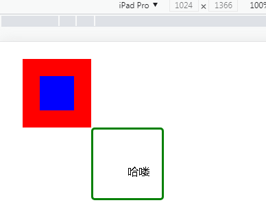

```html
<!DOCTYPE html>
<html lang="en">
<head>
    <meta charset="UTF-8">
    <title>10盒子模型练习</title>
    <style>
        #d1{
            width: 100px;
            height: 100px;
            background-color: red;
            margin:25px 0 0 25px;
            overflow: hidden;
        }
        #d1>div{
            width: 50%;/*上级元素的50%*/
            height: 50%;
            background-color: blue;
            margin: 25px 0 0 25px;
        }
        #d2{
            width: 50px;
            height: 50px;
            border: 3px solid green;
            border-radius: 5px;
            margin-left: 125px;
            padding:50px 0 0 50px;
        }
    </style>
</head>
<body>
<div id="d1">
    <div></div>
</div>
<div id="d2">哈喽</div>
</body>
</html>
```


---

一个小点，希望大家知道

```html
<!DOCTYPE html>
<html lang="en">
<head>
    <meta charset="UTF-8">
    <title>08边框</title>
    <style>
        div{
            width: 200px;
            height: 200px;
            background-color: pink;
            margin: 50px 0 0 50px;
        }
    </style>
</head>
<body>
<div></div>
</body>
</html>
```


有时候会注意到，添加外边距上左都是50px，但最终效果发现上面的空比左边的要小一点？

这还是外边距的一个特性


因为整个浏览器页面就是一个大盒子，外边距有8px，这时候给div添加左右编剧就会产生这种效果，上下相邻取最大50px，左右相邻值相加，58px。所有就有了看起来不对称的效果


### 9.CSS三大特性

- 继承 : 元素可以继承上级元素文本和字体相关的样式, 部分标签自带效果,不受继承影响,比如: `h1~h6字体大小, 超链接字体颜色`
- 层叠 : 多个选择器有可能选择到同一个元素, 当添加不同的样式时, 所有样式全部层叠生效, 如果作用的样式相同则由优先级决定哪个生效
- 优先级 : 作用范围越小优先级越高      id>class>标签名>继承(属于间接选中，永远比直接选中优先级低)

```html
<!DOCTYPE html>
<html lang="en">
<head>
    <meta charset="UTF-8">
    <title>11CSS三大特性</title>
    <style>
        body{
            /*给body添加的样式 页面中所有元素都会继承,除自带效果标签*/
            font-size: 10px;
        }
        #d1{
            color: pink;
        }
        div{
            color: red;
        }
        /*这时候#d1和div就是层叠效果，这个两个选择器选择到同一元素，添加了相同的
        color样式，这时候就是比优先级，id选择器优先级高，所以都是粉色*/
    </style>
</head>
<body>
<div id="d1">
    <p>p标签</p>
    <span>span</span>
    <a href="">超链接</a>
    <h1>这是h1</h1>
</div>
</body>
</html>
```


### 练习

实现如图效果


```html
<!DOCTYPE html>
<html lang="en">
<head>
    <meta charset="UTF-8">
    <title>Title</title>
    <style>
        body{/*继承特性：所有元素继承*/
            font: 12px "simhei", Arial, Helvetica, sans-serif;
            color: #666;
        }
        body>div{
            width: 611px;
            height: 376px;
            background-color: #e8e8e8;
            background-image: url("./img1.png");
            background-repeat: no-repeat;/*图小的话不重复平铺*/
            background-size: 318px 319px;/*背景图大小*/
            background-position: 90% 80%;/*图片位置*/
            overflow: hidden;/*去除粘连效果*/
        }
        div>div{
            width: 245px;
            height: 232px;
            margin: 68px 0 0 36px;/*这个时候不会触发上下相邻取最大，左右相邻值相加，因为是包含关系*/
        }
        .p1{
            font-size: 24px;
            font-weight: bolder;
            /*这个时候就会触发上下相邻取最大，左右相邻值相加*/
            /*去掉下外边界，然后p2标签的12px行距（继承来的）自然因为最大而生效*/
            margin-bottom: 0px;
        }
        .p2{
            /*上下相邻取最大*/
            margin-bottom: 24px;
        }
        /*由于p2标签受继承影响 大小12px 颜色#666 所以不需要额外添加其他样式*/
        .p3{
            font-weight: bold;
            font-size: 20px;
            color: #0aa1ed;
            margin-bottom: 12px;
        }
        a{
            display: inline-block;/*行内样式不能修改宽高，所以修改其显示样式*/
            width: 132px;
            height: 40px;
            background-color: #0aa1ed;
            color: white;
            text-align: center;
            line-height: 40px;
            /*padding: 5px 0 0 5px;*/
            font-size: 24px;
            text-decoration: none;
        }
    </style>
</head>
<body>
<div>
    <div>
        <p class="p1">灵越 燃7000系列</p>
        <p class="p2">
            酷睿双核i5处理器|256GB SSD| 8GB内存<br>
            英特尔HD显卡620含共享显卡内存
        </p>
        <p class="p3">￥4999.00</p>
        <a href="">查看详情</a>
    </div>
</div>
</body>
</html>
```


---

```html
<!DOCTYPE html>
<html lang="en">
<head>
    <meta charset="UTF-8">
    <title>02综合练习</title>
    <style>
        body{
            font: 12px "simhei", Arial, Helvetica, sans-serif;
            color: #666;
        }
        body>div{
            width: 198px;
            height: 233px;
            background-color: #e8e8e8;
            text-align: center;
        }
        body>img{
            width: 198px;
            height: 136px;
        }
        .p1{
            color : #000;
            margin: 0;
        }
        .p2{
            margin: 6px 0;/*上下6px 左右0px*/
            color: #0aa1ed;
            font-weight: bold;
        }
        a{
            /*行内元素或行内块元素，可以给上级元素添加
            text-align:center实现居中，块级元素不能
            块级元素居中需要通过外边距 margin:0 auto;上下0 左右自动*/
            display: inline-block;
            width: 100px;
            height: 24px;
            background-color: #0aa1ed;
            color: white;
            line-height: 24px;
            text-decoration: none;
            border-radius: 5px;
        }
    </style>

</head>
<body>
<div>
    
    <p class="p1">
    戴尔(DELL)XPS13-9360-R1609 13.3英寸微边框笔记本电脑</p>
    </p>
    <p class="p2">￥4999.00</p>
    <a href="">查看详情</a>
</div>
</body>
</html>
```


## 元素的定位方式（CSS续）

- 定位方式包含4~position~+1~float~种， 共5种定位方式
- 包含：
  - 静态定位
  - 相对定位
  - 绝对定位
  - 固定定位
  - 浮动定位


### 1.静态定位（文档流定位）

- 格式: `position:static; ` 这是默认的定位方式，可以不写
- 特点: 默认的定位方式, 元素以左上为基准, <u>块级元素</u>从上到下依次排列, <u>行内元素</u>从左向右依次排列, 不能实现元素层叠效果 
- 如何控制元素位置?   通过外边距控制(margin)


### 2.相对定位（唯一一个不脱离文档流）

- 格式: `position:relative;`

- 特点: 元素不脱离文档流(仍然占着原来的位置)

- 如何控制元素的位置?

  通过`left/right/top/bottom `相对于元素的**初始位置**做偏移

- 应用场景: 当需要移动某个元素,但不影响其它元素时使用相对定位

```html
<!DOCTYPE html>
<html lang="en">
<head>
    <meta charset="UTF-8">
    <title>03相对定位</title>
    <style>
        div {
            width: 100px;
            height: 100px;
            border: 1px solid red;
        }

        div:hover {
            /*margin: 20px 0 0 20px;*//*静态定位，无层叠效果*/
            /*以下三行是相对定位*/
            position: relative;
            left: 20px;
            top: 20px;
        }
    </style>
</head>
<body>
<div>div1</div>
<div>div2</div>
<div>div3</div>
</body>
</html>
```

如果使用注释掉的margin，就属于静态定位，没有层叠效果


使用相对定位，就会有层叠效果


### 3.绝对定位

- 格式: `position:absolute;`

- 特点: 元素脱离文档流(不占位置)，然后其他元素就会认为这里没有元素，就会挤过来

- 如控制元素位置?

  通过`left/right/top/bottom` 相对于浏览器窗口(默认)或某一个<u>上级元素</u>(需设置)做位置偏移

- 如果需要相对于某个上级元素做位置偏移 需要给该上级元素添加 `position:relative`，认定其为参照物

- 应用场景: 当需要往页面中添加一个元素,但不影响其他元素位置时使用绝对定位

```html
<!DOCTYPE html>
<html lang="en">
<head>
    <meta charset="UTF-8">
    <title>04绝对定位</title>
    <style>
        div {
            width: 100px;
            height: 100px;
            border: 1px solid red;
        }
        #d1{
            /*绝对定位，脱离文档流，div2就会觉得上面没东西，就会顶上来，就会有层叠效果*/
            position:absolute;
        }
        #d3{
            position: absolute;
            /*相对于窗口做位置偏移，该div显示再窗口右下角*/
            right: 0;
            bottom: 0;
        }
    </style>
</head>
<body>
<div id="d1">div1</div>
<div>div2</div>
<div id="d3">div3</div>
</body>
</html>
```


---

上面这个案例是相对于浏览器窗口（默认）做位置偏移，下面这个案例就是设置某一上级元素做参照物

需要注意的是，同级元素，即相邻元素做不了参照物

```html
<!DOCTYPE html>
<html lang="en">
<head>
    <meta charset="UTF-8">
    <title>05绝对定位续</title>
    <style>
        body>div{
            width: 200px;
            height: 200px;
            background-color: green;
            margin: 100px 0 0 100px;
            overflow: hidden;
        }
        body>div>div{
            width: 100px;
            height: 100px;
            background-color: blue;
            margin: 50px 0 0 50px;
            position: relative;/*参照物*//*将蓝色div作为红色div的参照物*/
        }
        div>div>div{
            width: 50px;
            height: 50px;
            background-color: red;
            position: absolute;/*绝对定位*/
            /*默认坐标相对于窗口，也可以相对于某一个上级元素
            ，就需要给上级元素添加position:relative，意思是
            设置这个上级元素为参照物，当多个上级元素都有relative
            的时候，采取就近原则选择参照物*/
            left: 0;
            top: 0;
        }
    </style>
</head>
<body>
<div>
    <div>
        <div></div>
    </div>
</div>
</body>
</html>
```


---

```html
<!DOCTYPE html>
<html lang="en">
<head>
    <meta charset="UTF-8">
    <title>06绝对定位练习</title>
    <style>
        div{
            width: 300px;
            background-color: rgba(0,0,0,0.3);
            padding: 10px;/*让div中的 -内容别贴边*//*同时也把内容撑大了*/
            position: relative;/*参照物*/
        }
        input{
            padding: 10px 20px;/*会把整个页面撑大*/
            border: none;/*去掉边框 0或none*/
            width: 260px;
            margin: 0;
        }
        img{
            position: absolute;
            top: 14px;
            right: 30px;
        }
        p{
            margin-top: 5px;
            color: red;
        }
    </style>
</head>
<body>
<div>
    <input type="text" placeholder="请输入用户名">
    
    <p>用户名不能为空</p>
</div>
</body>
</html>
```


左侧是最外侧的div ，右边是input文本框模型图


### 4.固定定位

- 格式: `position:fixed`

- 特点: 脱离文档流

- 如何控制位置? 

  通过`left/right/top/bottom` 相对于窗口做位置偏移

- 应用场景: 当需要将某个元素固定在窗口的某个位置时使用.

```html
<!DOCTYPE html>
<html lang="en">
<head>
    <meta charset="UTF-8">
    <title>07固定定位</title>
    <style>
        #d1 {
            width: 1000px;
            height: 100px;
            background-color: red;
            position: fixed; /*固定定位*/
            top: 0;
        }

        body {
            padding-top: 100px;
        }

        #d2 {
            width: 50px;
            height: 200px;
            background-color: blue;
            position: fixed;/*固定定位*/
            right: 30px;
            bottom: 20px;
        }

    </style>
</head>
<body>
<div id="d1"></div>
<div id="d2"></div>


</body>
</html>
```

通过效果可以看到，红蓝两div设置了`position:fixed`后就定在了这个，不随着页面滚动而动


### 5.浮动定位

- 格式: `float:left/right;`
- 特点: 脱离文档流, 元素从当前所在行向左或向右浮动, 当撞到<u>上级元素边缘</u>或其它<u>浮动元素</u>时停止.
- 应用场景: 当需要将纵向排列改成横向排列时使用浮动定位
- 一行装不下时会自动折行, 有可能会被卡住
- 当元素的所有子元素全部浮动时, 自动识别的高度为0,会导致显示异常(包括边框变成一条线, 还包括后面的元素会顶上来导致元素重叠) 给元素添加overflow:hidden解决 .

---

这个案例解释上面第二点

```html
<!DOCTYPE html>
<html lang="en">
<head>
    <meta charset="UTF-8">
    <title>08浮动定位</title>
    <style>
        body>div{
            width: 200px;
            height: 200px;
            border: 1px solid red;
        }
        #d1{
            width: 80px;
            height: 60px;
            background-color: red;
        }
        #d2{
            width: 80px;
            height: 50px;
            background-color: green;
            float: left;/*浮动左*/
        }
        #d3{
            width: 80px;
            height: 50px;
            background-color: blue;
            float: right;/*浮动右*/
        }
    </style>
</head>
<body>
<div>
    <div id="d1"></div>
    <div id="d2"></div>
    <div id="d3"></div>
</div>
</body>
</html>
为什么绿色和蓝色分别是向左和向右浮动，为什么会在同一行，是因为浮动定位脱离文档流，也就是说绿蓝两个div不占位置，都顶到这一行
```


如果绿蓝两个div都是`floatt:left`则如下


---

来解释第四点，一行装不下会折行，有可能被卡住。看代码

```html
<!DOCTYPE html>
<html lang="en">
<head>
    <meta charset="UTF-8">
    <title>08浮动定位</title>
    <style>
        body>div{
            width: 200px;
            height: 200px;
            border: 1px solid red;
        }
        #d1{
            width: 80px;
            height: 60px;
            background-color: red;
            float:left;
        }
        #d2{
            width: 80px;
            height: 50px;
            background-color: green;
            float: left;
        }
        #d3{
            width: 80px;
            height: 50px;
            background-color: blue;
            float: left;
        }
    </style>
</head>
<body>
<div>
    <div id="d1"></div>
    <div id="d2"></div>
    <div id="d3"></div>
</div>
</body>
</html>
以上代码我3个div都设置了向左浮动，如果上级元素的width够大，按理来说就能够一行显示，但此时我的width不够大，浮动元素只能够折行显示。但是折行也有讲究，蓝色的div是在绿色div后面向下平移到可以向左平移时停止，接着向左平移，结果被红色的卡住了，这个时候就是最终结果
```


---

接下来解释：

当元素的所有子元素全部浮动时, 自动识别的高度为0,会导致显示异常(包括边框变成一条线, 还包括后面的元素会顶上来导致元素重叠) 给元素添加overflow:hidden解决 .

```html
<!DOCTYPE html>
<html lang="en">
<head>
    <meta charset="UTF-8">
    <title>08浮动定位</title>
    <style>
        body>div{
            width: 200px;
            border: 1px solid red;
            /*当元素的所有子元素全部浮动时，自动识别的高度为0*/
            overflow: hidden;/*解决自动高度识别为0的问题*/
        }
        #d1{
            width: 50px;
            height: 50px;
            background-color: red;
            float: left;
        }
        #d2{
            width: 50px;
            height: 50px;
            background-color: green;
            float: left;
        }
        #d3{
            width: 50px;
            height: 50px;
            background-color: blue;
            float: left;
        }
    </style>
</head>
<body>
<div>
    <div id="d1"></div>
    <div id="d2"></div>
    <div id="d3"></div>
</div>
</body>
</html>
```

如果没有写`overflow:hidden;`，如左图，产生这种情况正是因为浮动定位脱离文档流，不占位置，所以最外层的红框div觉得它里面没有元素，所以变成如左图的样子。添加之后如右图


---

练习：实现如图效果：


```html
<!DOCTYPE html>
<html lang="en">
<head>
    <meta charset="UTF-8">
    <title>09浮动定位练习</title>
    <style>
        ul{
            list-style-type: none;/*去掉列表的无序图标*/
            overflow:hidden;
        }
        li{
            float: left;
            margin-right: 20px;
        }
        body>div{
            width: 1000px;
            background-color: #0aa1ed;
            /*让块级元素居中显示 就是当缩放整个页面的时候都保持在居中位置*/
            margin: 0 auto;
        }
        div>div{
            width: 250px;
            background-color: green;
            float: left;
            text-align: center;
        }

    </style>
</head>
<body>
<ul>
    <li>首页</li>
    <li>电竞元素</li>
    <li>直播间</li>
    <li>飞扬极速车间</li>
    <li>星光舞台</li>
</ul>
<hr>
<div>
    <div>
        
        <p>会员特权</p>
    </div>
    <div>
        
        <p>私人订制</p>
    </div>
    <div>
        
        <p>学员特供</p>
    </div>
    <div>
        
        <p>专属特权</p>
    </div>
</div>
</body>
</html>
```


### 综合练习

实现下图效果


```html
<!DOCTYPE html>
<html lang="en">
<head>
    <meta charset="UTF-8">
    <title>Title</title>
    <style>
        body{
            font: 12px "simhei", Arial, Helvetica, sans-serif;
            color: #666;
        }
        body>div{
            width: 366px;
            height: 233px;
            background-color: #e8e8e8;
        }
        #top_div{
            height: 35px;
            background-color: #0aa1ed;
        }
        body>div>div{
            padding-left: 10px;
        }
        #top_div img{
            margin-top: 9px;
        }
        #top_div>span{
            font-size: 16px;
            color: white;
            /*如果对页面中 某个元素位置进行微调，其他元素不受影响时，使用相对定位*/
            position: relative;
            bottom: 3px;
        }
        ul{
            padding: 0;/*去掉自带的40个像素内边距*/
            list-style-type: none;/*去掉图标*/
            overflow: hidden;/*解决全部浮动导致的异常*/
            margin: 0;
        }
        li{
            float: left;
            margin-right: 10px;
        }

        .c1>p{
            color: #62B5EC;
            margin: 18px 0 6px 0;
        }
        li>a{
            text-decoration: none;
            color: #0aa1ed;
        }
    </style>
</head>
<body>
<div>
    <div id="top_div">
        
        <span>电脑,办公/1F</span>
    </div>
    <div class="c1">
        <p>电脑整机</p>
        <ul>
            <li><a href="">笔记本</a></li>
            <li><a href="">游戏机</a></li>
            <li><a href="">台式机</a></li>
            <li><a href="">一体机</a></li>
            <li><a href="">服务器</a></li>
            <li><a href="">联想</a></li>
        </ul>
    </div>
    <div class="c1">
        <p>电脑配件</p>
        <ul>
            <li><a href="">CPU</a></li>
            <li><a href="">SSD硬盘</a></li>
            <li><a href="">显示器</a></li>
            <li><a href="">显卡</a></li>
            <li><a href="">组装电脑</a></li>
            <li><a href="">机箱</a></li>
        </ul>
    </div>
    <div class="c1">
        <p>外设/游戏</p>
        <ul>
            <li><a href="">键盘</a></li>
            <li><a href="">鼠标</a></li>
            <li><a href="">U盘</a></li>
            <li><a href="">移动硬盘</a></li>
            <li><a href="">游戏设备</a></li>
            <li><a href="">智能单车</a></li>
        </ul>
    </div>

</div>
</body>
</html>
```

---

实现如下图的一个效果：


```html
<!DOCTYPE html>
<html lang="en">
<head>
    <meta charset="UTF-8">
    <title>11</title>
    <style>
        body{
            font-family: Microsoft YaHei, Helvetica Neue, Helvetica, STHeiTi, Arial, sans-serif;
            font-size: 12px;
            background-color: black;
        }
        ul{
            list-style-type: none;/*去掉图标*/
            width: 1220px;/*设置总宽 为了居中*//*可以放5个这样的小div*/
            margin: 0 auto;
            background-color: #e8e8e8;
            overflow: hidden;/*所有子元素全部浮动 所以需要添加 解决显示异常*/
            padding: 0;
        }
        li{
            width: 224px;
            margin: 0 10px;/*这样元素总共占宽度为 244 正好是 1220/5的结果*/
            float: left;
            background-color: white;
            border-radius: 5px;
            overflow: hidden;/*如果没有边框 添加圆角 必须结合这个样式才能看到效果*/
        }
        .t_div img{
            width: 100%;/*上级有多宽图片就为多宽*/
        }
        .b_div{
            padding: 15px;/*添加内边距*/
            height: 68px;/*可能会出现文案过短，div会变短*/
        }
        .b_div h4{
            margin-top: 0; /*去掉自带的上外边距*/
            font-size: 14px;
            line-height: 20px;
            font-weight: normal;/*去掉自带的加粗效果*/
        }
        h4>a{
            color: #333;
            text-decoration: none;
        }
        .s1{
            color: #4f8dfe;
        }
        .s2{
            color: #888;
            float: right;
        }
    </style>
</head>
<body>
<ul>
    <li>
        <div class="t_div">
            <a href="">
                
            </a>
        </div>
        <div class="b_div">
            <h4><a href="">Java总监咨询日-如何才能学好Java</a></h4>
            <div>
                <span class="s1">免费</span>
                <span class="s2">292人报名</span>
            </div>
        </div>
    </li>
    /*后面的都是重复的*/
    <li>
        <div class="t_div">
            <a href="">
                
            </a>
        </div>
        <div class="b_div">
            <h4><a href="">Java总监咨询日-如何才能学好Java</a></h4>
            <div>
                <span class="s1">免费</span>
                <span class="s2">292人报名</span>
            </div>
        </div>
    </li>
    <li>
        <div class="t_div">
            <a href="">
                
            </a>
        </div>
        <div class="b_div">
            <h4><a href="">Java总监咨询日-如何才能学好Java</a></h4>
            <div>
                <span class="s1">免费</span>
                <span class="s2">292人报名</span>
            </div>
        </div>
    </li>
</ul>
</body>
</html>
```


---

**超综合页面**


```html
<!DOCTYPE html>
<html lang="en">
<head>
    <meta charset="UTF-8">
    <title>01综合练习</title>
    <style>
        body{
            font: 12px "simhei", Arial, Helvetica, sans-serif;
            color: #666;
        }
        body>div{
            width: 1000px;
            margin: 0 auto;/*居中*/
        }
        body>div>div>div{
            background-color: #e8e8e8;
        }
        #t_left{
            width: 611px;
            height: 376px;
            float: left;
            position: absolute;
        }
        #t_right{
            width: 375px;
            height: 376px;
            float: right;
            position: relative;
        }
        #t_div{
            overflow: hidden;/*为了解决所有子元素全部浮动可能导致的异常*/
            position: relative;
        }
        #b_left{
            width: 366px;
            height: 233px;
            float: left;
            overflow: hidden;
        }
        .b_right{
            width: 198px;
            height: 233px;
            float: right;
            margin-left: 12px;
            text-align: center;
            overflow: hidden;
        }
        #b_div{
            margin-top: 12px;

        }
        /*右下相关样式*/
        .b_right_title{
            margin: 0;/*去掉自带的 外边距*/
            color: #000;
        }
        .b_right_price{
            font-weight: bold;
            color: #0aa1ed;
            margin: 6px 0;
        }
        .b_right a{
            width: 100px;
            height: 24px;
            background-color: #0aa1ed;
            display: inline-block;
            color: white;
            border-radius: 2px;
            line-height: 24px;/*单行行高设置居中*/
            text-decoration: none;/*去掉下划线*/
        }
        /*左上样式*/
        #t_left img{
            width: 318px;
            height: 319px;
            position: absolute;
            right: 30px;
            bottom: 30px;
        }
        #t_left>div{
            width: 245px;
            height: 232px;
            /*给上级元素添加边框或浮动或overflow:hidden都能解决
            粘连问题，但只有overflow:hidden是不影响原效果的*/
            margin: 68px 0 0 36px;
        }
        /*右上样式*/
        #t_right img{
            width: 292px;
            height: 232px;
            position: absolute;
            right: 20px;
            bottom: 20px;
        }
        #t_right>div{
            width: 245px;
            height: 232px;
            /*给上级元素添加边框或浮动或overflow:hidden都能解决
            粘连问题，但只有overflow:hidden是不影响原效果的*/
            margin: 39px 0 0 25px;
            /*因为查看详情这部分的div被图片覆盖点不到，所以调整层级关系*/
            position: relative;
            z-index: 1;
        }
        /*上篇共同拥有 样式*/
        .t_title{
            font-size: 32px;
            color: #333;
            margin-bottom: 12px;
        }
        .t_price{
            font-size: 24px;
            color: #0aa1ed;
            font-weight: bold;
            margin-bottom: 12px;
        }
        #t_div a{
            display: inline-block;
            width: 132px;
            height: 40px;
            color: white;
            font-size: 20px;
            text-align: center;
            line-height: 40px;
            border-radius: 2px;
            text-decoration: none;
            background-color: #0aa1ed;
        }
        /*左下样式*/
        #b_left_top{
            height: 35px;
            background-color: #0aa1ed;
            padding: 5px;
        }
        #b_left>div{
            padding-left: 10px;
        }
        #b_left_top img{
            margin-top: 9px;
        }
        #b_left_top span{
            font-size: 16px;
            color: white;
            position: relative;
            bottom: 5px;
        }

        #b_left ul{
            padding-left: 0;
            list-style-type: none;
            margin: 0;
            overflow: hidden;
        }
        #b_left li{
            float: left;
            margin-right: 10px;
        }
        .c1>p{
            color: #62B5EC;
            margin: 18px 0 6px 0;
        }
        li>a{
            color: #0aa1ed;
            text-decoration: none;
        }
    </style>
</head>
<body>
<div>
    <!--div#t_div按下tab键，自动变如下-->
    <div id="t_div"><!--上半部分的div-->
        <div id="t_left">
            <div>
                <p class="t_title">灵越 燃7000系列</p>
                <p>酷睿双核i5处理器|256GB SSD| 8GB内存<br>
                    英特尔HD显卡620含共享显卡内存</p>
                <p class="t_price">￥4999.00</p>
                <a href="">查看详情</a>
            </div>
            
        </div>
        <div id="t_right">
            <div>
                <p class="t_title">颜值 框不住</p>
                <p>酷睿双核i5处理器|256GB SSD| 8GB内存<br/>
                    英特尔HD显卡620含共享显卡内存</p>
                <p class="t_price">￥6888.00</p>
                <a href="">查看详情</a>
            </div>
            
        </div>
    </div>
    <div id="b_div"><!--下半部分的div-->
        <div id="b_left">
            <div id="b_left_top">
                
                <span>电脑,办公/1F</span>
            </div>
            <div class="c1">
                <p>电脑整机</p>
                <ul>
                    <li><a href="">笔记本</a></li>
                    <li><a href="">游戏机</a></li>
                    <li><a href="">台式机</a></li>
                    <li><a href="">一体机</a></li>
                    <li><a href="">服务器</a></li>
                    <li><a href="">联想</a></li>
                </ul>
            </div>
            <div class="c1">
                <p>电脑配件</p>
                <ul>
                    <li><a href="">CPU</a></li>
                    <li><a href="">SSD硬盘</a></li>
                    <li><a href="">显示器</a></li>
                    <li><a href="">显卡</a></li>
                    <li><a href="">组装电脑</a></li>
                    <li><a href="">机箱</a></li>
                </ul>
            </div>
            <div class="c1">
                <p>外设/游戏</p>
                <ul>
                    <li><a href="">键盘</a></li>
                    <li><a href="">鼠标</a></li>
                    <li><a href="">U盘</a></li>
                    <li><a href="">移动硬盘</a></li>
                    <li><a href="">游戏设备</a></li>
                    <li><a href="">智能单车</a></li>
                </ul>
            </div>
        </div>
        <div class="b_right">
            
            <p class="b_right_title">戴尔(DELL)XPS13-9360-R1609 13.3英寸微边框笔记本电脑</p>
            <p class="b_right_price">￥4600.00</p>
            <a href="">查看详情</a>
        </div>
        <div class="b_right">
            
            <p class="b_right_title">戴尔(DELL)XPS13-9360-R1609 13.3英寸微边框笔记本电脑</p>
            <p class="b_right_price">￥4600.00</p>
            <a href="">查看详情</a>
        </div>
        <div class="b_right">
            
            <p class="b_right_title">戴尔(DELL)XPS13-9360-R1609 13.3英寸微边框笔记本电脑</p>
            <p class="b_right_price">￥4600.00</p>
            <a href="">查看详情</a>
        </div>
    </div>
</div>
</body>
</html>
```


## 显示层级z-index

- 当元素非静态定位时,可能存在层叠的问题, 通过z-index样式可以控制显示的层级,值越大显示层级越靠上.

```html
<!DOCTYPE html>
<html lang="en">
<head>
    <meta charset="UTF-8">
    <title>02显示层级</title>
    <style>
        #d1{
            width: 200px;
            height: 100px;
            background-color: red;
            position: absolute;
            /*值越大显示越靠前,默认是0，要加这个值必须要求这个元素是非静态定位,一般都设置为position:relative;*/
            z-index: 2;
        }
        #d2{
            width: 100px;
            height: 200px;
            background-color: blue;
            position: absolute;
            z-index: 1;
        }
    </style>
</head>
<body>
<div id="d1"></div>
<div id="d2"></div>
</body>
</html>
```


## 溢出设置overflow

- visible: 超出显示(默认)
- hidden: 超出不显示
- scroll: 超出滚动显示

```html
<!DOCTYPE html>
<html lang="en">
<head>
    <meta charset="UTF-8">
    <title>03溢出设置</title>
    <style>
        div{
            width: 200px;
            height: 200px;
            border: 1px solid red;
            /*overflow: hidden;/*超出位置不显示，也正好能解决高度为0和粘连问题*/
            overflow: scroll;/*滚动显示*/
        }
    </style>
</head>
<body>
<div>
    
</div>
</body>
</html>
```

visible状态，可以看到图片过大，溢出了蓝色框的显示范围


hidden状态，溢出部分就会隐藏


scroll状态，可以滚动


## 行内元素垂直对齐方式

如果两个元素都是行内或者是行内块样式，就可以使用这个进行对齐

```html
<!DOCTYPE html>
<html lang="en">
<head>
    <meta charset="UTF-8">
    <title>04垂直对齐方式</title>
    <style>
        img{
            width: 100px;
            /*垂直对齐方式：
            top 上对齐
            bottom 下对齐
            middle 中间对齐
            baseline 基线对齐(默认)*/
            vertical-align: middle;
        }
    </style>
</head>
<body>
<input type="text">
</body>
</html>
```

默认的基线对齐效果


上对齐


下对齐


中间对齐


## 视频播放

```html
<!DOCTYPE html>
<html lang="en">
<head>
    <meta charset="UTF-8">
    <title>05视频播放</title>
</head>
<body>
<!--poster封面图片 autoplay自动播放
loop循环播放 muted静音(必须加了静音才能自动播放)
conrtols显示控制器（就是播放按钮和时长条）
-->
<!--source资源标签 里面装着视频地址-->
<video poster="https://ys.mihoyo.com/main/_nuxt/img/47f71d4.jpg"
       autoplay loop muted controls
       style=" width: 1416.89px; height: 797px;">
    <source src="https://ys.mihoyo.com/main/_nuxt/videos/3e78e80.mp4"
            type="audio/mp4">
    您的浏览器不支持播放此视频.
</video>
</body>
</html>
```


# JavaScript

- 作用：给页面添加动态效果

- 跟java语言没有什么关系

- 语言特点：

  - 属于脚本语言，不需要编译直接解析执行

  - 属于弱类型语言，声明变量时不需要指定类型

    ```
    java: int x=10; String s="abc";  x="abc";编译报错
    js：let x=10; let s="abc";     x="abc";不会报错
    ```

  - 安全性高，JavaScript语言只能访问浏览器内部数据，浏览器以外磁盘上的数据禁止访问

  - 交互性高，因为JavaScript语言是嵌入到html页面中，最终执行在客户端浏览器中，是可以直接和用户进行交互的，而java语言是需要通过网络传输后才能进行交互的语言。


## 引入方式

- 如何在html页面中嵌入JavaScript代码？
  - 内联：在标签的事件属性中添加JavaScript代码，当事件触发时执行
    - 事件：是系统给提供的一些特定时间点，例如点击事件
      - 点击事件: 当用户点击了某个元素的时候会调用某些代码, 这个点击时间点触发代码的行为 称为点击事件.
  - 内部： 在html页面中任意位置添加 script标签 在标签体内添加js代码
  - 外部：在单独的js文件中写JavaScript代码, 在html页面中 通过script标签的src属性引入到页面中


## 注释

- ```html
  HTML :　　　<!--注释内容-->      ctrl+shift+/
  CSS :    /*注释内容*/
  JavaScript:  //单行注释       /*多行注释*/
  ```


## JavaScript语法

### 1、变量

**JavaScript属于弱类型语言**

- Java: `int age=10; String name="Tom"; Person p = new Person()`

- JS: 

  - `let age=10; let name="Tom"; let p = new Person(); `

  - `var age=10; var name="Tom"; var p = new Person();`

  - let和var的区别

    ```javascript
    java:
    for(int i=0;i<10;i++){
    	int y = i+1;
    }
    int z = i-1;    //在Java中编译时会报错,i出了作用域
    ----------------------------------------
    JavaScript:
    for(let i=0;i<10;i++){
    	let y = i+1;
    }
    let z = i-1;  //因为是脚本语言编写过程中不会报错但是运行时i的值得不到,使用let声明变量的作用域和Java中一样
    
    for(var i=0;i<10;i++){
    	var y = i+1;
    }
    var z = i-1;  //使用var声明变量, 不管在什么位置声明的都是一个全局变量
    ```


### 2、数据类型

- JavaScript中只有对象类型
- 常见的几种对象类型：
  - string: 字符串，可以使用单引号或双引号修饰"abc"='abc'
  - number: 数值，相当于java中所有数值类型的总和
  - boolean: 布尔值， true和 false
  - undefined: 未定义，因为js是弱类型语言，当变量只声明不赋值的时候就不知道它是什么类型，即为undefined类型
- `typeof(变量)` ：获取变量的类型


### 3、运算符

- 算数运算符：+ - * / % 

  - 运算会自动根据结果转成整数或小数

    ```
    java：int x=5; int y=2; int z=x/y;   z=2
    js: let x=5; let y=2; let z=x/y;   z=2.5
    ```

- 关系运算符：>  <  >=  <=  !=    =\=和\===

  - ==：先统一两个变量的类型， 再比较值 `"666"==666`   true
  - ===：先比较类型，类型相等后再比较值  `"666"===666`  false

- 赋值运算符：=   +=   -+  \*=  /=  %=  ++   --

- 逻辑运算符：&&   ||  ！

- 三目运算符：`条件?值1:值2`


### 4、各种语句

- if else
- for
- while
- do while
- switch case


### 5、方法

- 方法声明：

  ```
  java：public 返回值类型 方法名(参数列表){方法体}
  JavaScript：function 方法名(参数列表){方法体}
  ```

- 常见的四种方法：

  - 无参无返回值

  - 有参无返回值

  - 无参有返回值

  - 有参有返回值

    ```javascript
    <script>
        //无参无返回值
        function fn1() {
            alert("fn1");
        }
        //调用方法
        fn1();
    
        //有参无返回值
        function fn2(name, age) {
            alert(name+":"+age);
        }
        fn2("东方",18);
    
        //无参有返回值
        function fn3() {
            return "fn3方法返回值"
        }
        let info = fn3();
        alert(info);
    
        //有参有返回值
        function fn4(x,y) {
            return x*y;
        }
        let result = fn4(3,7);
        alert("fn4:"+result);
    
    	//浏览器控制台输出
        console.log(result);
    </script>
    ```

    

- 声明方法的三种方式

  - `function 方法名(参数列表){方法体}`

    ```javascript
    function fn2(name, age) {
        alert(name+":"+age);
    }
    fn2("东方",18);
    ```

    

  - `let 方法名 = function(参数列表){方法体} `

    ```javascript
    let fn5 = function (name, age) {
        alert(name+":"+age);
    }
    fn5("关羽",20);
    ```

  - `let 方法名 = new Function("参数1","参数2","方法体");`

    ```javascript
    let fn6 = new Function("name","age","alert(name+':'+age)");
    fn6("刘备", 25);
    ```

    


### 6、和页面相关的方法

1. 通过选择器获取页面中的元素对象 

   `let d = document.querySelector("选择器");`

2. 获取和修改元素的文本内容

   ```javascript
   d.innerText = "xxx"; 修改
   d.innerText 获取
   ---
   <body>
   <div id="d1">This is div</div>
   <span>this is span</span>
   <script>
       let d = document.querySelector("#d1");
       //修改元素文本内容
       d.innerText = "div被修改了";
   
       let s = document.querySelector("span");
       s.innerText = "span也被修改了"
   </script>
   </body>
   ```

   

   

3. 获取和修改控件**input**的值 

   ```javascript
   控件对象.value="xxx"; 修改
   控件对象.value; 获取
   ---
   <input type="text" id="i1">
   <input type="button" value="按钮" onclick="fn()">
   <script>
       function fn() {
           let i = document.querySelector("#i1");
           //获取文本框的值 , 并弹出
           alert(i.value);
       }
   </script>
   ```

   

   

4. 获取和修改元素的html内容

   ```html
   元素对象.innerHTML; 	获取
   元素对象.innerHTML="xxx"; 	修改
   元素对象.innerHTML+="xxx"; 	追加
   ---
   <!DOCTYPE html>
   <html lang="en">
   <head>
       <meta charset="UTF-8">
       <title>08html相关</title>
   </head>
   <body>
   <div style="border: 1px solid red;"></div>
   
   <script>
        let d = document.querySelector("div");
        //修改元素的html内容，此处即是div中的html内容
       d.innerHTML = "<h1>我是h1</h1>";
       //往页面中追加
       d.innerHTML += "<h2>追加h2</h2>";
   
       //得到body元素对象
       let body = document.querySelector("body");
       body.innerHTML += "<h3>新加h3</h3>";
   
       let arr = [{name:"悟空",age:500},{name:"八戒",age:300}]
       //遍历数组
        for (let i = 0; i < arr.length; i++) {
            let p = arr[i];//得到数组中遍历出的每一个对象
            //把对象中的属性显示到页面中
            body.innerHTML += "<h4>我叫"+p.name+",距今已有"+p.age+"岁</h4>";
        }
   </script>
   </body>
   </html>
   ```

   


### 7、NaN

- Not a Number: 不是一个数 
- `isNaN(变量)` true代表是NaN(不是数)     false代表不是NaN(是数)


### 8、JavaScript中字符串的运算

```html
<!DOCTYPE html>
<html lang="en">
<head>
    <meta charset="UTF-8">
    <title>04平方练习</title>
</head>
<body>
<input type="text" id="i1">
<input type="button" value="平方" onclick="fn()">
<div>结果：0</div>

<script>
    function fn() {
        let number = document.querySelector("#i1");
        let result = document.querySelector("div");
        if (isNaN(number.value)){/*判断用户输入是否是数值*/
            result.innerText = "输入有误";
            return;
        }
        //*.value得到的是字符串。字符串类型在进行-*/的时候会自动把字符串类型转换为数值类型
        result.innerText = "结果："+number.value*number.value;

        //那么如何进行加法运算呢？
        //方法1
        // result.innerText = "结果："+(number.value*1+number.value*1);
        //方法2
        //parseInt(变量) 将字符串或小数转换为整数
        //parseFloat(变量)  将字符串转换为小数
        // result.innerText = "结果：" +  (parseFloat(number.value)+parseFloat(number.value));
    }
</script>
</body>
</html>
```


字符串类型在进行`- * /`的时候会自动把字符串类型转换为数值类型
但在进行加法运算的时候仍然是字符串拼接

那么如何进行加法运算呢？有两种方法

- 方法1：

  ```javascript
  result.innerText = "结果："+(number.value*1+number.value*1);
  这种方式就相当于将其都变成的数值类型后计算
  ```

- 方法2：

  parseInt(变量) 将字符串或小数转换为整数
  parseFloat(变量)  将字符串转换为小数

  ```javascript
  result.innerText = "结果：" + (parseFloat(number.value)+parseFloat(number.value));
  ```

-----

综合例子：简易计算器

```html
<!DOCTYPE html>
<html lang="en">
<head>
    <meta charset="UTF-8">
    <title>05计算器练习</title>
</head>
<body>
<input type="text" id="number1">
<input type="text" id="number2">
<input type="button" value="加" onclick="fn('+')">
<input type="button" value="减" onclick="fn('-')">
<input type="button" value="乘" onclick="fn('*')">
<input type="button" value="除" onclick="fn('/')">
<div>结果：0</div>

<script>

    function fn(str){
        /*
            注意我直接获取到了文本框中的value值，下面这两句是不能写到方法外的，
            因为在方法外是浏览器一刷新就调用，而一刷新的时候我文本框还没有输入值，
            自然是什么值都没有
         */
        let number1 = document.querySelector("#number1").value;
        let number2 = document.querySelector("#number2").value;
        let result = document.querySelector("div");
        if (isNaN(number1) || isNaN( number2)) {
            result.innerText = "输入有误";
            return;
        }
        switch (str) {
            case "+":
                result.innerText = parseFloat(number1) + parseFloat(number2);
                break;
            case "-":
                result.innerText = number1-number2;
                break;
            case "*":
                result.innerText = number1*number2;
                break;
            case "/":
                result.innerText = number1/number2;
                break;
        }
    }
</script>
</body>
</html>
```


### 9、自定义对象

- 做法1：先定义好一个对象，然后实例化

  ```javascript
  //定义一个空的对象(无属性、无方法) 类似java中创建一个Person.java里面什么都不写
      let Person = function () {}
      //实例化对象
      let p1 = new Person();
      //动态给实例化的对象添加属性和方法(java是不支持的)
      p1.name = "张三";
      p1.run = function () {
          alert(this.name);
      }
      //调用方法
      p1.run();
  ```

  

- 做法2：直接实例化对象

  ```javascript
  //直接实例化对象(不用定义)
      let p2 = {
          name:"李艾",
          age:18,
          run:function () {//定义了一个run方法
              alert("name"+this.name+",年龄："+this.age);
          }
      }
      p2.run();
  
      //创建了一个数组，里面装着3个对象
      let arr = [{name:"刘备",type:"射手"},{name:"张飞",type:"狂战士"}];
      //遍历数组
      for (let i = 0; i < arr.length; i++) {
          //取出数组中的对象
          let hero = arr[i];
          console.log("名字:"+hero.name+",属性："+hero.type);
      }
  ```

  

  


### 10、如何查看修改JavaScript代码的错误

因为JavaScript是解释型的语言，不用编译，直接运行，所以JavaScript代码中出现错误一般不会直接报错，可能会出现一些波浪线，我们一般查看JavaScript中的错误是直接去浏览器中的控制台查看js是怎么报错的


## JavaScript对象分类

- 内置对象：包含string number boolean等
- BOM：浏览器对象模型，包含和浏览器相关的内容
- DOM：文档对象模型，包含和页面相关的内容


### 1、BOM浏览器对象模型

- window：该对象中的属性和方法称为全局属性和全局方法，访问时可以省略掉window

- window对象中的常见方法：

  - `alert("xxx")`：弹出提示框

  - `confirm("xxx")`：弹出确认框

    

  - `prompt("xxx")`：弹出文本框

    

  - `parseInt()/parseFloat() `字符串转成整数或小数

  - `isNaN(变量) `判断变量是否是NaN （not a number）

  - `let timer = setInterval(方法,时间间隔) `开启定时器 

  - `clearInterval(timer);` 停止定时器

  - `setTimeout(方法,时间间隔); `只执行一次定时器

    ```html
    <!DOCTYPE html>
    <html lang="en">
    <head>
        <meta charset="UTF-8">
        <title>02定时器</title>
    </head>
    <body>
    <h1>0</h1>
    <script>
        let count = 0;
        //开启定时器  当方法作为另外一个方法的参数进行传递时不带括号，调用时带括号
        let timer = setInterval(fn, 1000);
        function fn() {
            let h1 = document.querySelector("h1");
            console.log("定时器" + count++);
            h1.innerText = count;
            if (count == 30) {
                clearInterval(timer);//停止定时器
            }
        }
    
    
        let body = document.querySelector("body");
        //调用匿名方法
        setInterval(function () {
            body.innerHTML += "<h3>匿名方法</h3>"
        },2000);
    
    
        //开启只执行一次的定时器
        setTimeout(function () {
            alert("时间到");
        },3000)
    </script>
    </body>
    </html>
    ```

    

- window对象中的常见属性

  - `location`：位置

    - `location.href`：获取或修改浏览器请求地址，如果是赋值操作即会直接跳转页面

      

    - `location.reload()`：页面刷新

    - `location.search()`：获取地址栏中的参数

  - history：历史（当前选项卡历史）

    

    - `history.length` 历史页面数量
    - `history.back()` 返回上一页面
    - `history.forwoar() `前往下一页面


### 2、DOM文档对象模型

- 包含和页面相关内容
- `document.querySelector("选择器");`
- innerHTML / innerText / value


## jQuery框架

http://doc.canglaoshi.org/config/CDN.html

- 对原生JavaScript代码进行封装的框架, 作用也是给页面添加动态效果, 可以提高开发效率
- jQuery框架就是一个普通的js文件, 在html页面中引入即可
  - 两种引入框架的方式:
    - 下载框架文件,把文件保存在工程中, 在html页面中引入本地文件 
    - 通过CDN服务器, 使用CDN服务器的好处是会根据客户端网络情况选择更合适的服务器下载框架文件, 而使用第一种的话框架文件只能从自己的服务器中获取,工作中推荐使用cdn的方式


### 1、通过选择器找到元素对象

- 格式: `$("选择器")`
  - 新的选择器写法
    - `$("div:first") `匹配到第一个div 
    - `$("div:last") `匹配到最后一个div
    - `$("div:eq(n)")` 匹配到第n个div n从0开始

### 2、获取和修改元素的文本内容

- 格式: `$("div").text("xxxx"); `修改

  ​		` $("div").text(); `获取

### 3、获取和修改元素的HTML内容

- 格式: `$("div").html("xxxx"); `修改

  ​		 `$("div").html();` 获取

### 4、获取和修改控件的value值

- 格式: `$("input").val("xxx");` 修改

  ​		`$("input").val(); `获取

### 5、给元素添加事件

- 格式：`$("input").click(function(){代码});`

```html
<!DOCTYPE html>
<html lang="en">
<head>
    <meta charset="UTF-8">
    <title>03第一个jq页面</title>
</head>
<body>
<input type="text">
<div>这是div</div>
<input type="button" value="按钮">

<!--引入jQuery框架文件-->
<script src="https://cdn.staticfile.org/jquery/2.1.1/jquery.min.js"></script>

<!--引入本地文件jq.js ,该文件实质上也就是将框架文件复制过来了-->
<script src="jq.js"></script>

<script>
    // let d = document.querySelector("div");
    // d.innerText = "内容修改了！";
    //找到div并修改文本内容，等效上面两行
    $("div").text("内容修改了！");

    //找到div并修改html内容  等效innerHTML
    $("div").html("<h1>我是h1</h1>");

    //找到第一个文本框并修改value值内容  val()等效value
    $("input:first").val("该吃中午饭了！");

    //找到按钮并添加点击事件
    $("input:last").click(function () {
        //取出文本框内容 给到div显示
        $("div").text($("input:first").val());
    });
</script>
</body>
</html>
```


### 6、创建及添加元素对象

- 创建: 

  ```html
  let d = $("<div>xxx</div>");
  ```

- 添加到页面中:

  ```html
  $("body").append(d);  //把元素添加到body里面
  ```

```html
<body>
<!--引入框架-->
<script src="jq.js"></script>
<script>
    //创建元素对象
    let d = $("<div>这是div</div>");
    //添加到body标签里面
    $("body").append(d);
</script>  
</body>
```


```html
<body>
<input type="text">
<input type="button" value="添加">
<ul>
    <li>北京</li>
    <li>上海</li>
    <li>广州</li>
</ul>
<!--引入框架-->
<script src="jq.js"></script>
<script>
/*实现功能，当点击按钮将文本框内容添加到列表当中*/
//给按钮添加点击事件
    $("input:last").click(function () {
        //创建li
        let li = $("<li></li>");
        //把文本框的值给到li
        li.text($("input:first").val());
        //把li添加到ul中
        $("ul").append(li);
    });
</script>
</body>
```


### 7、删除元素

- 格式: `元素对象.remove();`

```html
<body>
<h2>测试删除</h2>
<!--引入框架-->
<script src="jq.js"></script>
<script>
    $("h2").remove();
</script>
</body>
结果：h2标签的内容被成功删除
```


### 8、显示隐藏相关

- 隐藏: `元素对象.hide();`
- 显示: `元素对象.show();`
- 切换: `元素对象.toggle();`

```html
<body>
<button>隐藏</button>
<button>显示</button>
<button>切换</button><br>

<!--引入框架-->
<script src="jq.js"></script>
<script>
    $("button:eq(0)").click(function () {
        $("img").hide();//隐藏
    })
    $("button:eq(1)").click(function () {
        $("img").show();//显示
    })
    $("button:eq(2)").click(function () {
        $("img").toggle();//切换显示状态，即显示和隐藏来回切换
    })
</script>
</body>
```


---


### TEst

**好友分组练习**

```html
<!DOCTYPE html>
<html lang="en">
<head>
    <meta charset="UTF-8">
    <title>05好友分组练习</title>
</head>
<body>
<ul>
    <li>亲戚
        <ul>
            <li>a~</li>
            <li>b~</li>
            <li>c~</li>
        </ul>
    </li>
    <li>朋友
        <ul>
            <li>A</li>
            <li>B</li>
            <li>C</li>
        </ul>
    </li>
    <li>同事
        <ul>
            <li>Q</li>
            <li>W</li>
            <li>E</li>
        </ul>
    </li>
</ul>
<script src="jq.js"></script>
<script>
    //隐藏第二层的ul
    $("li>ul").hide();
    //给所有第一层的li添加点击事件
    $("body>ul>li").click(function () {
        //$(this)代表触发事件的元素对象
        //children()获取元素的子元素
        $(this).children().toggle();
    });
</script>
</body>
</html>
```


---

 **员工列表练习**

```html
<!DOCTYPE html>
<html lang="en">
<head>
    <meta charset="UTF-8">
    <title>06员工列表练习</title>
</head>
<body>
<input type="text" placeholder="员工姓名">
<input type="text" placeholder="工资">
<input type="text" placeholder="工作">
<input type="button" value="添加">
<table border="1" width="50%">
    <caption>员工列表</caption>
    <tr>
        <th>姓名</th>
        <th>工资</th>
        <th>工作</th>
    </tr>
</table>
<script src="jq.js"></script>
<script>
    $("input:last").click(function () {
       if (($("input:eq(0)").val())==null || isNaN($("input:eq(1)").val())==null || isNaN($("input:eq(2)").val())==null) {
            alert("输入信息非空");
            return;
        }
        let tr = $("<tr></tr>");
        for (let i = 0; i < 3; i++) {
            let td = $("<td></td>");
            td.text($("input:eq("+i+")").val());
            tr.append(td);
        }
        $("table").append(tr);
    });
</script>
</body>
</html>
```


### 9、事件相关

- 什么是事件: 事件是系统给提供的一些特定的时间点,包括: 鼠标事件,键盘事件,状态改变事件

- 给元素添加事件的两种方式:

  - 通过事件属性添加: 

    ```html
    <input type="button" onclick="fn()"> 
    ```

  - 动态绑定事件: 在执行JavaScript或jQuery代码过程中添加事件

    ```javascript
    $("input").click(function(){})
    ```

  - 通过以上两种方式你可以看到，通过事件属性添加的都加了on，动态绑定的没有加on

    

- 鼠标事件:
  - onclick 点击事件
  - onmouseover 鼠标移入事件
  - onmouseout 鼠标移出事件
  - onmousedown 鼠标按下事件
  - onmouseup 鼠标抬起事件
  - onmousemove 鼠标移动事件
- 键盘事件：
  - onkeydown：键盘按下事件
  - onkeyup：键盘抬起事件
- 状态改变事件:
  - onblur: 失去焦点事件 
  - onchange: 值改变事件

```html
<!DOCTYPE html>
<html lang="en">
<head>
    <meta charset="UTF-8">
    <title>07事件相关</title>
    <style>
        div{
            width: 200px;
            height: 200px;
            background-color: red;
        }
    </style>
</head>
<body>
<div onmouseover="overfn()" onmouseout="outfn()" onmousedown="downfn()" onmouseup="upfn()" onmousemove="movefn()"></div>
<input type="text" onkeydown="keydownfn()" onkeyup="keyupfn()" onblur="blurfn()">
<script>
    function overfn() {
        console.log("鼠标移入");
    }
    function outfn() {
        console.log("鼠标移出");
    }
    function downfn() {
        console.log("鼠标按下");
    }
    function upfn() {
        console.log("鼠标抬起");
    }
    function movefn() {
        console.log("鼠标移动");
    }

    function keydownfn() {
        //event.keyCode 按键编码
        console.log("键盘按下:" + event.keyCode)
    }
    function keyupfn() {
        //将按键编码转成字符,不过仅限于字母和数字
        console.log("键盘抬起"+String.fromCharCode(event.keyCode));
    }
    function blurfn() {
        alert("编辑完成！");
    }
</script>
</body>
</html>
```

---

**省市联动练习**

```html
<!DOCTYPE html>
<html lang="en">
<head>
    <meta charset="UTF-8">
    <title>08省市联动练习</title>
</head>
<body>
<select>
    <option>请选择</option>
    <option value="0">河北</option>
    <option value="1">北京</option>
    <option value="2">湖北</option>
</select>
<select>
    <option>请选择</option>
</select>

<script src="jq.js"></script>
<script>
    let arr = [["石家庄","唐山","秦皇岛"],["朝阳区","海淀区","大兴区"],["武汉","孝感","津门"]];
    //给第一个下拉选项添加值改变事件
    $("select:first").change(function () {
        //用一个“请选择” 覆盖原有内容
        $("select:last").html("<option>请选择</option>");

        //通过得到的数组的下标 取出arr数组中对应的一组城市
        let cities = arr[$("select:first").val()];
        //遍历数组
        for (let i = 0; i < cities.length; i++) {
            //取出遍历的每一个城市名称
            let city = cities[i];
            //创建option
            let option = $("<option></option>");
            option.text(city);//把城市名称显示到option中
            //把option添加到第二个下拉选项中
            $("select:last").append(option);
        }
    });
</script>
</body>
</html>
```


### 10、动画相关

```html
<!DOCTYPE html>
<html lang="en">
<head>
    <meta charset="UTF-8">
    <title>09动画相关</title>
</head>
<body>
<input type="button" value="隐藏">
<input type="button" value="显示">
<input type="button" value="淡出">
<input type="button" value="淡入">
<input type="button" value="上滑">
<input type="button" value="下滑">
<input type="button" value="自定义">
<hr>
<!--这个style="position:relative"是为自定义按钮加的-->

<script src="jq.js"></script>
<script>
    $("input:eq(0)").click(function () {
        $("img").hide(2000);//隐藏
    });
    $("input:eq(1)").click(function () {
        $("img").show(2000);//显示
    });
    $("input:eq(2)").click(function () {
        $("img").fadeOut(2000);//淡出
    });
    $("input:eq(3)").click(function () {
        $("img").fadeIn(2000);//淡入
    });
    $("input:eq(4)").click(function () {
        $("img").slideUp(2000);//上滑
    });
    $("input:eq(5)").click(function () {
        $("img").slideDown(2000);//下滑
    });
    $("input:eq(6)").click(function () {
        $("img").animate({"left":"200px"},1000)
            .animate({"top":"200px"},1000)
            .animate({"left":"0"},1000)
            .animate({"top":"0"},1000)
            .animate({"width":"200px"},1000)
            .animate({"width":"100px"},1000);//自定义
    });
</script>
</body>
</html>
```


### 10、认真的雪

案例要求：雪花从顶部自由位置落下，大小不一，速度不一，落地后淡出


```html
<!DOCTYPE html>
<html lang="en">
<head>
    <meta charset="UTF-8">
    <title>10晚课雪花练习</title>
    <style>
        body{
            background-color: black;
            /*去掉自带的8px外边距*/
            margin: 0;
        }
        img{
            /*修改定位方式为绝对定位，是为了控制最顶上雪花出现的位置*/
            position:absolute;
        }
    </style>
</head>
<body>

<!--引入jQuery框架-->
<script src="jq.js"></script>
<script>
    //开启定时器添加雪花图片
    setInterval(function () {
        let img = $("");
        //生成20-50之间的随机数用于控制雪花大小
        let size = (Math.random()*31)+ 20;
        //给雪花设置图片尺寸，通过css样式设置*********************
        img.css("width",size+"px");

        // 一个随机的left值（距离屏幕左侧的位置）要求这个值必须要在窗口范围中
        //得到窗口宽度*****************
        let w = $(window).width();
        //取值范围应该是0~（屏幕宽度-雪花尺寸）
        let left = Math.random()*(w-size);
        img.css("left",left+"px");

        //给雪花添加一个往下移动的动画 雪花应该移动的距离为屏幕的高度-雪花尺寸
        //得到屏幕高度*****************
        let h = $(window).height();
        //雪花落地--》淡出--》清除内存痕迹
        //通过设置不同的动画持续事件来控制雪花不一样的速度
        //雪花尺寸越大，移动速度越慢
        //雪花落地后做淡出操作，在淡出动画持续时间1000后面添加方法,此方法在动画做完之后执行******
        img.animate({"top":(h-size)+"px"},size*100).fadeOut(1000,function () {
            img.remove();//从内存中删除 避免因为内存消耗引起卡顿
        })
        //把雪花图片添加到页面中
        $("body").append(img);
    },10);
</script>
</body>
</html>
```


## 前端MVC设计模式

M：Model 模型 ，指数据模型，数据一般来自服务器

V：View 视图， 指页面中的标签

C：Controller 控制器，指将数据呈现到页面中的过程

jQuery遵循此模型

此设计模式中Controller中需要进行大量的dom操作（遍历查找标签），浪费大量资源，MVVM设计模式的出现就是解决这个问题


如上这个例子，Model数据模型就是下面这部分


View视图，就指的是这个页面中的标签

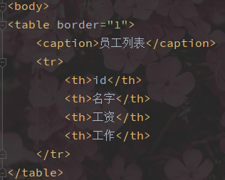


Controller 控制器就是数据和页面交互的这个过程，这个例子中指的就是这个for循环这部分


## 前端MVVM设计模式

M：Model 模型 ，指数据模型，数据一般来自服务器

V：View 视图， 指页面中的标签

VM：ViewModel 视图模型，视图模型负责将页面中的标签和数据进行绑定，当数据发生改变时，会让页面自动跟着改变

由于此模式下将页面中使用的**标签**和**数据变量**在**内存中**进行了**绑定**,需要修改页面时只需要从内存中取出曾经绑定的标签即可, 这样避免了每次去遍历查找标签, 从而提高了执行效率, 而且这种模式下代码量也会降低,从而提高了开发效率


## VUE框架

- 此框架基于MVVM设计模式，是目前比较流行的框架之一

- 此框架类似jQuery就是一个js文件 , 使用时引入此js文件即可

- 如何引用？可以将js文件下载到本地,也可以通过CDN服务器引入

  ```html
  <script src="https://cdn.jsdelivr.net/npm/vue@2/dist/vue.js"></script>
  ```

- 执行原理：

  Vue对象负责将页面元素和数据的对应关系保存，当数据发生改变时会根据内存中保存的关系找到页面元素并进行修改, 避免了遍历查找元素的步骤,从而提高了执行效率


### 1、VUE相关指令

1. `{{变量名}} `, 插值 , 让页面中显示的文本和Vue对象中的变量进行绑定

   ```html
   <!DOCTYPE html>
   <html lang="en">
   <head>
       <meta charset="UTF-8">
       <title>02helloVue</title>
   </head>
   <body>
   <div>
       <h1>{{info}}</h1>
   </div>
   <!--引入vue框架文件-->
   <script src="vue.js"></script>
   <script>
       //创建Vue对象
       let v = new Vue({
           el:"div",//el=element元素  设置vue对象管理的元素  填写选择器
           data:{//页面内容绑定的数据都写在这里面
               info:"Hello Vue!"
           }
       })
       setTimeout(function () {
           //修改Vue对象中的数据  页面会自动跟着变
           v.info = "内容变了！";
       },3000)
   </script>
   </body>
   </html>
   ```

   

   
   
2. `v-text="变量"` 让元素的文本内容和变量进行绑定

3. `v-html="变量"` 让元素的html内容和变量进行绑定，即可以识别html标签

   ```html
   <!DOCTYPE html>
   <html lang="en">
   <head>
       <meta charset="UTF-8">
       <title>03文本相关指令</title>
   </head>
   <body>
   <div>
       <!--让页面中某个位置的文本和info绑定。就算不用标签包裹也可以-->
       <p>{{info}}</p>
       <!--让页面中某个元素的文本内容和info绑定。必须基于标签-->
       <p v-text="info"></p>
       <!--让元素的html内容和info绑定,可识别html标签-->
       <p v-html="info"></p>
   </div>
   <script src="vue.js"></script>
   <script>
       let v = new Vue({
           el:"div",
           data:{
               info:"文本测试<b>加粗内容</b>"
           }
       })
   </script>
   </body>
   </html>
   ```

   

   

4. `v-model="变量"` 让文本框的值和变量进行双向绑定(变量会影响页面,页面也会影响变量)

   ```html
   <!DOCTYPE html>
   <html lang="en">
   <head>
       <meta charset="UTF-8">
       <title>04双向绑定</title>
   </head>
   <body>
   <div>
       <!--让文本框的值和变量进行绑定 变量会影响页面内容，页面也会影响变量-->
       <input type="text" v-model="info">
       <p v-text="info"></p>
   </div>
   <script src="vue.js"></script>
   <script>
       let v = new Vue({
           el:"div",
           data:{
               info:"双向绑定测试"
           }
       })
   </script>
   </body>
   </html>
   文本框中修改值，下面的文本也会跟着变
   ```

   

   

5. `v-bind:属性名="变量"` 让元素的某个属性的值和变量进行绑定

   ` :属性名="变量"`是简写

6. `v-on:事件名="方法"` 给元素添加事件, 这种方式添加事件所调用的方法必须写在Vue对象中methods里面 

   `@事件名="方法"`是简写

   注意：这里的事件可以多多参见JQuery中的9、事件相关，可以以此类推出@blur失焦事件等等

   ```html
   <!DOCTYPE html>
   <html lang="en" xmlns:v-bind="http://www.w3.org/1999/xhtml" xmlns:v-on="http://www.w3.org/1999/xhtml">
   <head>
       <meta charset="UTF-8">
       <title>05属性绑定</title>
   </head>
   <body>
   <div>
       <!--v-bind让元素的某个属性的值和变量进行绑定-->
       <a v-bind:href="url">我是超链接1</a>
       <!--简写-->
       <a :href="url">我是超链接2</a>
   
       <!--v-on给元素绑定事件，@事件名 是简写-->
       <input type="button" value="按钮1" v-on:click="fn()">
       <input type="button" value="按钮2" @click="fn()">
   
       <br/>
       
   </div>
   <script src="vue.js"></script>
   <script>
       let v = new Vue({
           el:"div",
           data:{
               url:"http://www.baidu.com",
               imgName:"men.png"
           },
           methods:{//Vue方式添加的事件 方法必须声明在methods里面
               fn:function () {//格式： 方法名:方法实现
                   alert("按钮点击了");
               }
           }
       })
   </script>
   </body>
   </html>
   ```

   

   

7. `v-for="对象 in 数组"`, 遍历Vue对象中的数组变量, 遍历的过程中 数组中有多个元素,就会在页面中添加多少个标签

   ```html
   <!DOCTYPE html>
   <html lang="en">
   <head>
       <meta charset="UTF-8">
       <title>06循环遍历</title>
   </head>
   <body>
   <div>
       <table border="1">
           <caption>员工列表</caption>
           <tr>
               <th>id</th>
               <th>姓名</th>
               <th>工资</th>
               <th>工作</th>
           </tr>
           <!--v-for 遍历数组，遍历多少次 就会生成多少个当前元素-->
           <!--相当于for(emp in arr){ }-->
           <tr v-for="emp in arr">
               <td>{{emp.id}}</td>
               <td>{{emp.name}}</td>
               <td>{{emp.salary}}</td>
               <td>{{emp.job}}</td>
           </tr>
       </table>
   </div>
   <script src="vue.js"></script>
   <script>
       let v = new Vue({
           el:"div",
           data:{
               arr:[{id:1,name:"张三",salary:50000,job:"HR"},
                   {id:2,name:"张四",salary:120000,job:"执行总裁"},
                   {id:3,name:"张五",salary:340000,job:"董事长"}]
           }
       })
   </script>
   </body>
   </html>
   ```

    

   

8. `v-show="变量"`, 控制元素是否显示, 元素隐藏时 元素仍然被创建,是通过css样式控制的隐藏, 当元素需要频繁切换显示隐藏状态时使用, 因为这样可以避免频繁添加和删除 

9. `v-if="变量"`，控制元素是否显示, 元素隐藏时,元素不会被创建出来.

   ```html
   <!DOCTYPE html>
   <html lang="en">
   <head>
       <meta charset="UTF-8">
       <title>07显示隐藏相关</title>
   </head>
   <body>
   <div>
       <!--v-show绑定的内容为true时元素显示 反之不显示  需要频繁切换显示状态的时候使用-->
       <!--如果元素隐藏，元素会创建并添加，通过css样式控制其隐藏-->
       <h1 v-show="isShow">隐藏内容</h1>
       <!--v-if显示效果和v-show一样，但是如果元素不显示，元素不会被创建-->
       <h1 v-if="isShow">隐藏内容2</h1>
   </div>
   <script src="vue.js"></script>
   <script>
       let v = new Vue({
           el:"div",
           data:{
               isShow:false
           }
       })
   </script>
   </body>
   </html>
   ```

   此时浏览器运行是空白的，看后台代码，虽然都是隐藏的，但是发现第一个h1标签只是修改了样式display:none为不显示，而第二个压根就没有创建标签

   

通过控制台修改`v.isShow=true`，页面内容都显示


### 2、阶段练习题

要求：实现一个页面可登入、登出，未登入状态下，只展示数据，登入后可以通过文本框添加数据，在登入状态下选择登出会有确认框提示。


```html
<!DOCTYPE html>
<html lang="en">
<head>
    <meta charset="UTF-8">
    <title>08综合练习</title>
</head>
<body>
<div>
    <!--如果没登录显示该元素-->
    <!--注意href="#"作用是只跳转当前页面，不刷新，如果不写#就会跳转当前页刷新-->
    <a href="#" v-show="!isLogin" @click="login()">登录</a>
    <!--如果登录了显示该元素-->
    <a href="#" v-show="isLogin" @click="logout()">登出</a>

    <span v-show="isLogin">
        <input type="text" v-model="name"><!--让文本框的值和变量双向绑定-->
        <input type="button" value="添加" @click="addfn()">
    </span>
    <hr>
    <ul>
        <li v-for="name in arr">{{name}}</li>
    </ul>
</div>
<script src="vue.js"></script>
<script>
    let v = new Vue({
        el:"div",
        data:{
            isLogin:false,
            arr:["刘备","关羽","张飞"],
            name:""
        },
        methods:{
            login:function () {
                v.isLogin=!v.isLogin;
            },
            logout:function () {
                if (confirm("您确定退出登录嘛？"))
                v.isLogin=!v.isLogin;
            },
            addfn:function () {
                //把用户输入的名字添加到数组中,js中往数组中添加元素是push方法
                v.arr.push(v.name);
            }
        }
    })
</script>
</body>
</html>
```


## Bootstrap框架

https://www.runoob.com/bootstrap/bootstrap-tutorial.html

上面是菜鸟教程，推荐

http://doc.canglaoshi.org/bootstrap3/index.html

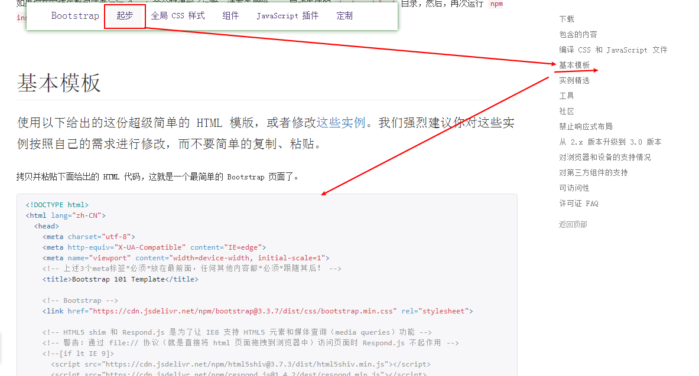

选择`起步>基本模版`，通过这个基本模版来进行构建页面


这两个是经常会使用到的


### 1、字体图标


为什么要叫字体图标，因为你对字体样式的修改也会应用到这个图标上

```html
<!DOCTYPE html>
<html lang="zh-CN">
<head>
    <meta charset="utf-8">
    <meta http-equiv="X-UA-Compatible" content="IE=edge">
    <meta name="viewport" content="width=device-width, initial-scale=1">
    <!-- 上述3个meta标签*必须*放在最前面，任何其他内容都*必须*跟随其后！ -->
    <title>Bootstrap 101 Template</title>

    <!-- Bootstrap -->
    <link href="https://cdn.jsdelivr.net/npm/bootstrap@3.3.7/dist/css/bootstrap.min.css" rel="stylesheet">

    <!-- HTML5 shim 和 Respond.js 是为了让 IE8 支持 HTML5 元素和媒体查询（media queries）功能 -->
    <!-- 警告：通过 file:// 协议（就是直接将 html 页面拖拽到浏览器中）访问页面时 Respond.js 不起作用 -->
    <!--[if lt IE 9]>
    <script src="https://cdn.jsdelivr.net/npm/html5shiv@3.7.3/dist/html5shiv.min.js"></script>
    <script src="https://cdn.jsdelivr.net/npm/respond.js@1.4.2/dest/respond.min.js"></script>
    <![endif]-->
</head>
<body>
----------------------------
<span style="color: red; font-size: 30px" class="glyphicon glyphicon-envelope"></span>
<i class="glyphicon glyphicon-envelope"></i>
<a class="glyphicon glyphicon-envelope">email</a>

-------------------------------
<!-- jQuery (Bootstrap 的所有 JavaScript 插件都依赖 jQuery，所以必须放在前边) -->
<script src="https://cdn.jsdelivr.net/npm/jquery@1.12.4/dist/jquery.min.js"></script>
<!-- 加载 Bootstrap 的所有 JavaScript 插件。你也可以根据需要只加载单个插件。 -->
<script src="https://cdn.jsdelivr.net/npm/bootstrap@3.3.7/dist/js/bootstrap.min.js"></script>
</body>
</html>
```


还有一个地方的字体图标组件库更为丰富，http://doc.canglaoshi.org/fontawesome/faicons/


通过这个引入

```html
<link href="//netdna.bootstrapcdn.com/font-awesome/4.7.0/css/font-awesome.min.css" rel="stylesheet">
```

```html
<!DOCTYPE html>
<html lang="zh-CN">
<head>
    <!--字体图标库-->
    <link href="//netdna.bootstrapcdn.com/font-awesome/4.7.0/css/font-awesome.min.css" rel="stylesheet">
</head>
<body>

<i style="font-size: 30px" class="fa fa-thermometer-three-quarters" aria-hidden="true">温度计</i>

</body>
</html>
```


### 2、栅格系统


栅格系统最多支持12列

不同的class支持不同的设备


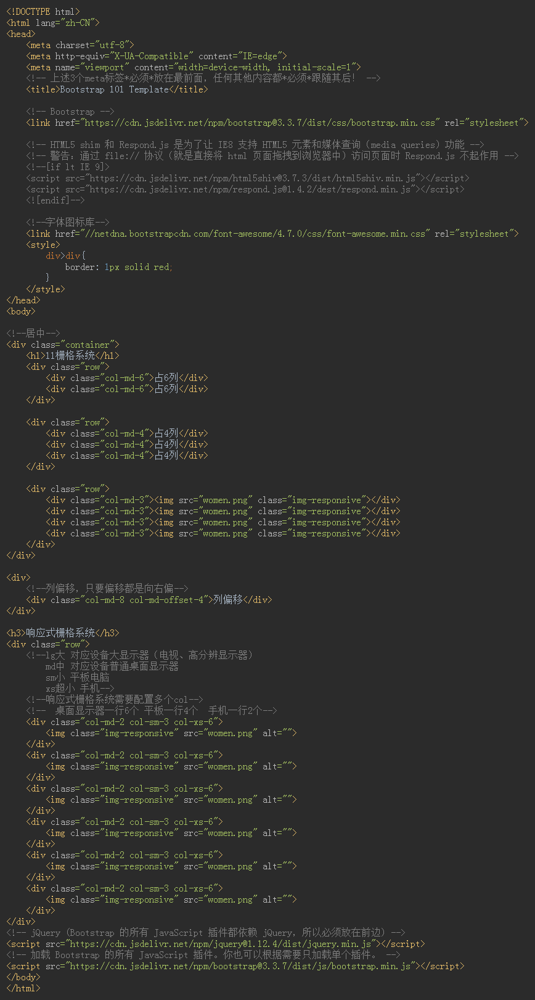


### 3、瀑布流步骤

1. 添加瀑布流相关的各种标签

   ```html
   <!--瀑布流开始-->
   <div class="grid">
       <div class="grid-item">
           
       </div>
       <div class="grid-item">
           
       </div>
       <div class="grid-item">
           
       </div>
       <div class="grid-item">
           
       </div>
   </div>
   <!--瀑布流结束-->
   ```

2. 瀑布流相关CSS样式

   ```css
   /*瀑布流相关样式*/
   .grid-item{
       width: 200px;/*瀑布流中的元素宽度*/
       margin:0 10px 10px 0;/*设置元素之间的间距*/
   }
   ```

3. 页面中引入瀑布流相关js文件

   ```html
   <!--引入瀑布流相关js文件-->
   <script src="js/masonry.pkgd.min.js"></script>
   <script src="js/imagesloaded.pkgd.js"></script>
   ```

4. 瀑布流初始化操作

   ```javascript
   <script>
       //对瀑布流进行初始化操作
       $(".grid").masonry({
           itemSelector:".grid-item",//告诉瀑布流框架如何找到页面中瀑布流里面的元素
           columnWidth:210 //设置瀑布流每一列的宽度(图片200+10间距)
       })
   	/*图片加载完成事件*/
       $(".grid").imagesLoaded().progress(function () {
           /*
               图片加载完之后让瀑布流框架重新计算一下布局,这样就避免一张图
               片没有加载完，后面的就接着上，造成图片层叠问题
            */
           $(".grid").masonry("layout");
       })
   </script>
   ```


# MySQL

## 数据库简介

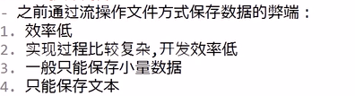

### 1.什么是DB

> DataBase：数据库，数据库是一个文件集合


### 2.什么是DBMS

> DataBaseManagementSystem：数据库管理系统（软件），用于管理数据库文件
>
> - **常见的DBMS有哪些？**Oracle MySQL DB2 SQLServer SQLite
>   - MySQL：Oracle公司产品，08年MySQL被Sun公司收购，09年Sun被Oracle收购，开源产品。MariaDB是MySQL创始人离开Oracle公司后另外搞得  市占率第一
>   - Oracle：Oracle公司产品，闭源产品，性能最强价格最贵  市占率第二
>   - SQLServer：微软公司产品，闭源产品  市占率第三
>   - DB2：IBM公司产品
>   - SQLite：轻量级数据库，应用在一些手机的数据存储，安装包只有几十k, 只具备最基础的增删改查功能
> - 开源和闭源
>   - 开源：源代码，产品免费 ，盈利方式，靠其他服务，会有高人无偿维护升级
>   - 闭源：不公开源代码，产品收费和服务收费


### 3.数据库的分类

> 


### 4.主流关系型数据库的介绍

> 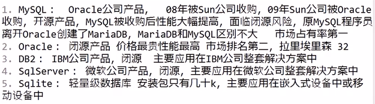


### 5.什么是SQL

> 


### 6.链接数据库

> 
>
> **检测MySQL服务是否开启**
>
> services.msc命令打开服务选项，查看
>
> 


### 7.数据库相关的SQL

> 
> 
> 
>
> 上面这种`charset=`的方式也可行
>
> 
>
> 7.`show variables like '%char%'`，显示当前数据库的字符集


### 8.表相关的SQL

- 执行表相关SQL语句必须使用了某个数据库,如果不使用会报以下错:

  ERROR 1046 (3D000): No database selected

> 
> 创建表的同时也可以指定字符集
> 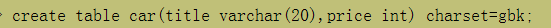
> 
>
> > 
> >
> > 
>
> 
> 
>
> > 
>
> 
> 
> 
> 


### 9.数据相关SQL

> 
>
> - **1、插入数据**
>
>   
>
>   :watermelon:如果使用SQL语句写中文报错 ，可以通过`set names gbk;`语句解决
>   
>   
>   为什么会出现这个问题呢？
>   
>   因为终端和MySQL之间是通过二进制数据来交互信息的，这就涉及到编解码一致的问题，在编解码不一致的情况下就会出现上图的问题。我们在建立数据库、建表的时候使用的UTF-8字符集是用于标识MySQL与磁盘间的编解码。
>   
>   
>
> 
>
> - **2、查询数据**
>
>   
>
> 
>
> - **3、修改数据**
>
>   
>
> 
>
> - **4、删除数据**
>
>   
>
> 


---

```sql
1. 创建数据库day2  字符集utf8并使用
create database day2 charset=utf8;
use day2;
2. 在数据库中创建员工表emp 字段:id,name,sal,deptId(部门id) 字符集utf8
create table emp(id int,name varchar(20),sal int,deptId int)charset=utf8;
3. 创建部门表dept 字段:id,name,loc(部门地址) 字符集utf8
create table dept(id int,name varchar(20),loc varchar(20))charset=utf8;
4. 部门表插入以下数据: 1 神仙部 天庭       2 妖怪部  盘丝洞
insert into dept values(1,'神仙部','天庭'),(2,'妖怪部','盘丝洞');
5. 员工表插入一下数据:  1 悟空 5000 1  ,   2 八戒  2000  1  ,                    3 蜘蛛精 8000  2  ,  4 白骨精 9000  2
insert into emp values(1,'悟空',5000,1),(2,'八戒',2000,1),(3,'蜘蛛精',8000,2),(4,'白骨精',9000,2);
6. 查询工资6000以下的员工姓名和工资	
select name,sal from emp where sal<6000;
7. 修改神仙部的名字为取经部	
update dept set name='取经部' where name='神仙部';
8. 给员工添加奖金comm字段
alter table emp add comm int;
9. 修改员工表中部门id为1的 奖金为500
update emp set comm=500 where deptId=1;
10. 把取经部的地址改成五台山
update dept set loc='五台山' where name='取经部';
11. 修改奖金字段为性别gender字段 类型为varchar
alter table emp change comm gender varchar(10);
12. 修改孙悟空和猪八戒性别为男 
update emp set gender='男' where deptId=1;
13. 删除没有性别的员工
delete from emp where gender is null;
14. 删除性别字段    
alter table emp drop gender;
15. 删除表  和 删除数据库
drop table emp;
drop table dept;
drop database day2;
```


## 数据库

### 1.主键约束

> 
>
> 


### 2.主键约束+自增

> 
>
> 
>
>  自增主键插入null值，会自动触发自增
>
> 自增主键有一个计数器，他永远会按照最大值+1的方式去自增，删掉一条数据记录对这个计数器没有影响，
>
> 插眼：truncate


### 3.注释 comment

> 


### 4.`和单引号的区别

> 


### 5.解决表的数据冗余（拆分表）

> 
>
> 
> 
> 
>
> ---
>
> 
>
> 
> 


### 6.事物

> 事物（transaction）是数据库中**执行同一业务多条SQL语句**的工作单元，事物可以保证多条SQL语句全部执行成功或全部执行失败

> 
>
> > 没有使用事物：
> >
> > 
> > 
>
> > 以下操作有事物保护的步骤：
> >
> > \- 转账失败执行流程：
> >
> > 该业务实现李雷向Lucy转钱，李雷-1000，Lucy+1000，但是前提是两者的账户状态都为正常，但是Lucy的账户状态为冻结，让Lucy+1000的这个操作自然不能正确执行，所以结局就是李雷少了1000，但是Lucy也没有收到钱。这个时候就要使用rollback回滚事物。
> >
> > 
> >
> > 下面这个李雷-1000，韩梅梅+1000都可以正常执行，因为两者账户状态都是正常的。所以commit就可以将改动提交到磁盘中
> >
> > 
> > 
>
> - 和事务相关的SQL语句：
>   
>
> - 第二种开启事物的方式
>
>   因为数据库中事物默认是自动提交的，所以第二种方式就是把默认的改成手动提交
>
>   1、查看数据库自动提交的状态
>   `show variables like '%autocommit%';`
>   
>
>   2、修改自动提交的状态  0关闭   1开启
>   `set autocommit=0;`
>
>   3、修改李雷的钱为50000
>   `update user set money=50000 where id=1;`
>
>   4、手动提交
>   `commit;`

> - savepoint：保存回滚点
>
>   

> **总结事物相关指令：**
>
> 


### 7.SQL分类

#### DDL（Data Definition Language）

> - 数据定义语言
> - 包括：create，alter，drop，truncate
> - 不支持事物

#### DML （Data Manipulation Language）

> - 数据操作语言
> - 包括：insert， delete，update，select
> - 支持事物

#### DQL （Data Query Language）

> - 数据库查询语言
> - 只包括select

 #### TCL （Transaction Control Language）

> - 事物控制语言
> - 包括：begin，rollback，commit，savepoint XXX，rollback to XXX

#### DCL （Data Control Language）

> - 数据控制语言
> - 创建用户，用于分配用户权限的相关的SQL


### 8.数据类型


#### 1）整数类型(int bigint)


> - int(m)对应java中的int
>
> - bigint(m)对应java中的long
>
> - m代表显示长度，需要结合zerofill使用
>   
>   


#### 2）浮点数类型（float和double）


> - double(m,d)  m代表总长度，d代表小数长度。如76.232（m=5，d=3）、
> - decimal 超高精度小数，当涉及超高精度运算时使用。


#### 3）字符串


> - char(m) 固定长度 最大255，如char(10)的类型存入“abc“ 所占长度10
> - varchar(m) 可变长度 最大65535，如varchar(10)类型存入”abc“所占长度3
> - text 可变长度 最大65535
> - 可变长度更节省空间，固定长度执行效率略高
> - varchar虽然最大65535，但是建议保存255以内的长度，超过255使用text


#### 4）日期


> - date：只能保存年月日
>
> - time：只能保存时分秒
>
> - datetime：保存年月日时分秒，最大值9999-12-31，默认null
>
> - timestamp：保存年月日时分秒，最大值2038-1-19，默认为当前时间（用的比较多，因为你给他赋一个null值他就默认是当前事件）
>
>   
>
>   


### 9.导出/入*.sql文件到数据库

##### 导出

`mysqldump -uroot -proot 数据库名>导出文件名.sql`


会将文件导出到当前路径下


##### 导入

先要创建一个数据库，然后使用该数据库

`create database myvrd;   use myvrd;`

- windows系统
  `source d:/tables.sql;`
- linux系统
  `source /home/soft01/桌面/tables.sql;`


### 10.与查询相关的SQL

#### 1）is null 和 is not null


#### 2）别名


#### 3）去重 distinct


#### 4）比较运算符 >,<,>=,<=,=,!=和<>


#### 5）and 和 or


#### 6）in


#### 7）between x and y 包括x和y


#### 8）模糊查询 like

> _：代表单个未知字符
>
> %：代表0或多个未知字符
>
> 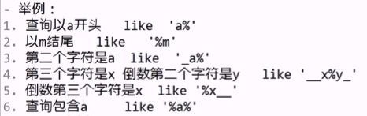


#### 9）排序 order by

- 所有查询都默认是升序排序（从小到大）  asc升序/desc降序


- 多字段排序：order by 字段名1 asc/desc, 字段名2 asc/desc;

  


#### 10）分页查询 limit

- 格式： limit 跳过的条数，请求的数量

- 公式： limit((页数-1)*每页数量，每页数量)

  

- 练习：
  


#### 11）数值计算 + -  * / %   7%2等效于mod(7,2)


#### 12）日期相关的函数


#### 13）ifnull(x,y)函数

> `age = ifnull(x,y)`如果x的值为null则age=y，如果x的值不为null则age=x


#### 14）聚合函数


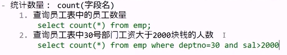


#### 15）与字符串相关


#### 16）数学相关函数


#### 17）分组查询

- 分组查询可以将某一个字段相同的值划分为一组，然后进行统计查询
- 需求中如果出现 每个XXX或每种XXX 一般都使用分组查询，并以XXX作为分组的字段


#### 18）having

having要写在group by字段的后面；可以使用别名来参与having后面的查询


#### 19）子查询（嵌套查询）


---


#### 20）关联查询

同时查询多张表的拆线呢方式称为关联查询


#### 21）笛卡尔积

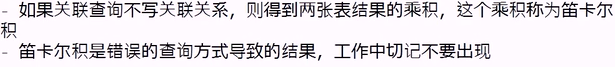


#### 22）等值连接和内连接


注意：等值连接和内连接查询的是两者的交集部分


#### 23）外连接

> 查询A，B两张表的数据，如果查询两张表的**交集数据**使用内连接或等值连接，如果查询某一张表的全部数据和另外一张表的交集数据则用外连接


如上就是需要部门表中的所有数据和员工表中与之对应的数据


#### 24）关联查询总结


关键词的书写顺序


#### 25）练习


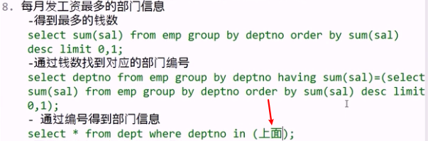


---

### 综合练习题

```sql
1. 查询每个部门的最低工资
   select dept_id,min(sal) from emp group by dept_id;

2. 查询1号部门每种工作的人数
   select job,count(*) from emp where dept_id=1 group by job;

3. 查询只有2个人的工作有哪些
   select job from emp group by job having count(*)=2;

4. 查询平均工资最高的部门编号------
   select dept_id from emp where dept_id is not null group by dept_id order by avg(sal) desc limit 0,1;

5. 查询工资高于2号部门平均工资的员工信息
   select * from emp where sal>(select avg(sal) from emp where dept_id=2);

6. 查询工资高于2000的员工姓名,工资,部门名和部门地点
   select e.name,sal,d.name,loc
   from emp e join dept d on e.dept_id=d.id
   where sal>2000;

7. 查询所有员工姓名和工作地点
   select e.name,loc
   from emp e left join dept d on e.dept_id=d.id;
```


### 11.表设计之关联关系

**什么是主外键**


#### 1）一对一

> - 什么是一对一关系：有A、B两张表，A表中一条数据对应B表中的一条数据，同时B表中一条数据也对应A表中的一条数据，称为一对一关系 
>
> - 应用场景：用户表的用户信息扩展表，商品表和商品信息扩展表
>
> - 如何建立关系：在从表中添加外键指向主表的主键
>
> - 练习：
>   
>
>   
>   

#### 2）一对多

> - 什么是一对多：AB两张表，A表中的一条数据对应B表中的多条数据，同时B表中的一条对应A表中的一条数据
>
> - 应用场景：员工表和部门表	商品表和商品分类表
>
> - 如何建立关系：在多的表中添加外键指向另外一张表的主键
>
> - 练习：
>   
>   
>   


#### 3）多对多

> - 什么是多对多：AB两张表，A表中的一条数据对应B表中的多条数据，同时B表中的一条对应A表中的多条
> - 应用场景：老师表和学生表
> - 如何建立关系：创建一个关系表，两个外键字段，分别指向另外两张表的主键
> - 练习：
>   
>   
>   
>   


### 12.自关联

- 当前表的外键指向当前表的主键，这种关联方式叫做自关联
- 应用场景：需要保存上下级关系时
  


### 13.连接方式和关联关系


### 14.表设计案例：权限管理

> 
>
> 来源思想：一个大型网站肯定会根据用户的不同分配不同的权限，比如说A是一个新用户，拥有少量权限，B是一个高级会员，拥有所有权限。所以用户和权限之间的关系就是多对多，需要一张表来存储他们之间的关系。但是在实际的数据储存中，一个用户对应多个权限，这样存储肯定会很冗余。所以在实际中会将权限分配给角色，如下图
>
> 
>
> 此时我就多了一张角色表，使用用户角色关系表和角色权限关系表建立以上三个表的关系
>
> 


接下来用一个实例讲解：


### 15.面试题


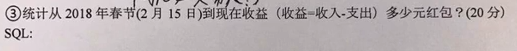


### 16.视图

> - 什么是视图：数据库中的表和视图都是其内部的对象，视图可以理解成一张虚拟的表，视图本质就是取代了一条SQL查询语句 
> - 为什么使用视图：因为有些数据的查询需要书写大量的SQL语句，每次书写效率太低，使用视图可以起到SQL重用的作用，视图可以隐藏敏感信息，如查询员工的时候隐藏工资
>
> - 创建视图的格式：
>   
> - 创建一个10号部门员工的视图
>   
> - 创建一个没有工资展示的员工表视图
>   


#### 视图的分类

- 1、简单视图：创建视图的子查询中不包含：去重、函数、分组、关联查询。可以对视图中的数据进行增删改查操作

- 2、复杂视图：和简单视图相反，只能对视图汇总给的数据进行查询操作

  > - 创建一个复杂视图
  >
  >   


#### 对简单视图进行增删改查，操作方式和table一样


- **1、插入数据（插入完成后，视图和原表里都会有对应数据）**
  
  
  - 如果插入一条在视图中不可见，但在原表中却可见的数据称为 数据污染。如下我插入一条20号部门的数据，但我的视图只是查询10号部门的信息，这个时候这条插入的数据在视图中就不可见，原表中却可见。简单来说：这个视图明明是对10号部门的，你却插入20号部门的数据
    
    :eagle: 可以通过`with check option`在创建视图的时候就解决数据污染问题
    
- **2、修改和删除视图中的数据（只能修改删除视图中有的数据）**
  
- **3、创建或替换视图**
  
- **4、删除视图**
  
- **5、如果创建视图的子查询中使用别名，则对视图操作时只能使用别名**
  


#### 视图总结


### 17.约束

> 什么是约束？
>
> 约束就是给表字段添加的限制条件

#### 主键约束+自增 primary key auto_increment

作用：唯一且非空

#### 非空约束 not null

作用：该字段的值不能为null


#### 唯一约束 unique

作用：该字段的值不能重复
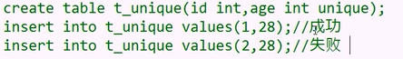

#### 默认约束 default

作用：给字段设置默认值


#### 外键约束

- 外键：用来建立关系的字段称为外键

- 外键约束：添加外键约束的字段，值可以为null，可以重复，但是值不能是关联表中不存在的数据，外键指向的数据不能先删除，外键指向的表也不能先删除
- 如何使用外键约束
  1、创建部门表
  
  2、创建员工表
  
  
- 由于添加外键约束后，会影响测试效率，所以在工作中很少使用，一般都是通过Java代码实现逻辑外键。


### 18.索引

> - 什么是索引？
>   索引时数据库中用来提高查询效率的技术，类似于目录
>
> - 为什么使用索引?
>   如果不使用索引，数据会零散的保存在磁盘块中，查询数据需要挨个遍历每一个磁盘块，直到找到数据为止。使用索引后会将磁盘块以树状结构保存，查询数据时会大大降低磁盘块的访问数量，从而提高查询效率。
>   
> - 有索引就一定好吗？
>   
> - 索引时越多越好吗？
>   

#### 如何创建索引


#### 索引分类

- 聚集索引

  通过主键创建的索引称为聚集索引，聚集索引中保存数据，只要给表添加主键约束，则会自动创建聚集索引

- 非聚集索引：通过非主键字段创建的索引称为非聚集索引，非聚集索引中没有数据，只有地址

#### 如何查看索引


#### 删除索引

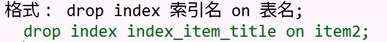

#### 复合索引


#### 索引总结


### 19.事务

> 事务：数据库中执行同一业务多条SQL语句的工作单元，可以保证全部执行成功或全部执行失败

#### 事务的ACID特性

ACID是保证数据库事务正确执行的四大基本要素

- 1、Atomicty：原子性，最小不可拆分，保证全部成功或全部失败
- 2、Consistency：一致性，保证事务从一个一致状态到另外一个一致状态
- 3、Isolation：隔离性：多个事务之间互不影响
- 4、Durablity：持久性，事务提交之后数据保存到数据库文件中持久生效

#### 事务相关的SQL


### 20.组链接group_concat()

会把一个组里的信息<u>显示到一行</u>


#### 面试题


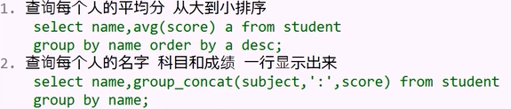


### 21.课程回顾


---

---


---


---


---


---

---

视图、索引


# JDBC


## JDBC引入


通过上图类比下图


---

### 1.JDBC

Java DataBase Connectivity    ,   java数据库连接，实际上jdbc是java中的一套和数据库进行交互的api（ application program interface应用程序编程接口)


### 2.为什么使用JDBC

因为Java程序员需要连接多种数据库，为了避免每一种数据库都学习一套新的api，Sun公司提出了一个JDBC的接口，各个数据库的厂商根据此接口写实现类（驱动），这样java程序员只需要掌握JDBC接口的调用，即可访问任何数据库。


### 3.如何使用JDBC连接MySQL数据库

- 创建Maven工程

  Maven的作用和优势：https://blog.csdn.net/weixin_42225191/article/details/85111288

  ​										https://blog.csdn.net/weixin_38055381/article/details/81180022

- 从https://mvnrepository.com/ 仓库查找对应jar包

  

- 将其xml坐标复制到Maven工程的pom.xml中，注意，要用<dependencies></dependencies>包裹，这表示多个依赖。多个依赖中包含单个依赖(全选代码ctrl+I可格式化代码)

  ```java
  <project xmlns="http://maven.apache.org/POM/4.0.0"
  	xmlns:xsi="http://www.w3.org/2001/XMLSchema-instance"
  	xsi:schemaLocation="http://maven.apache.org/POM/4.0.0 https://maven.apache.org/xsd/maven-4.0.0.xsd">
  	<modelVersion>4.0.0</modelVersion>
  	<groupId>cn.akio</groupId>
  	<artifactId>jdbc01</artifactId>
  	<version>0.0.1-SNAPSHOT</version>
  
  	<!-- https://mvnrepository.com/artifact/mysql/mysql-connector-java -->
  	<dependencies>
  		<dependency>
  			<groupId>mysql</groupId>
  			<artifactId>mysql-connector-java</artifactId>
  			<version>5.1.6</version>
  		</dependency>
  	</dependencies>
  
  </project>
  ```

- 创建一个类

  

- 第一步：先加载驱动

  ```java
  //1.注册驱动
  		Class.forName("com.mysql.jdbc.Driver");
  注意这个com.mysql.jdbc.Driver是哪来的？
  ```

  - 双击打开Driver.class

    

  - 其中绿色框中的就是驱动类

    

- 第二步：获取连接对象

  - 注意导包的时候要选择com.sql的，这是java自己的东西，上面这个就是mysql独有的，选了上面这个以后换数据库这个连接就不通用。

    

  - 获取连接对象

    ```java
    		//2.获取连接对象
    		Connection conn = DriverManager.getConnection("jdbc:mysql://localhost:3306/test", "root", "123456");
    ```

- 后面几步：

  ```java
  		//3.创建SQL执行对象
  		Statement stat = conn.createStatement();
  		//4.执行SQL
  		String sql = "create table jdbc(id int, name varchar(10))";
  		stat.execute(sql);
  		System.out.println("创建完成");
  		//5.关闭资源，注意，先开的后关，相当于栈的出入
  		stat.close();
  		conn.close();
  ```


**在新一版的的教程中idea中的代码如下**

```java
		//1、获取连接对象
        Connection conn = DriverManager.getConnection("jdbc:mysql://localhost:3306/empdb?characterEncoding=utf8&serverTimezone=Asia/Shanghai", "root", "root");
        System.out.println("conn = " + conn);
        //2、创建执行SQL语句的对象
        Statement s = conn.createStatement();
        //3、执行SQl语句
        s.execute("create table jdbc1(name varchar(20))");
        //4、关闭资源
        conn.close();
```


### 4.JUnit Test 单元测试

```java
package cn.akio;

import org.junit.Test;

/**
 * 单元测试
 * @author Grant·Vranes
 *
 */
public class Demo02 {
	@Test
	public void test01() {
		System.out.println("方法1");
	}
	
	@Test
	public void test02() {
		System.out.println("方法2");
	}
}
```

当你想执行哪个方法就点击哪个方法的方法名


鼠标放在这个方法名上，然后右键run as


### 5.执行SQL的方法

#### 5.1）执行增删改SQL

- `execute();`此方法可以执行任意的SQL但是推荐执行DDL（数据定义语言create drop alter truncate）返回值为 boolean值返回值代表的是是否有结果集（只有查询语句有结果集）
- `executeUpdate();`增刪改操作全部使用此方法，返回一个int，表示生效的行数

- `executeQuery();`此方法执行查询操作，返回ResultSet结果集对象，通过while循环遍历

```java
	@Test
	public void insert() throws ClassNotFoundException, SQLException {
		Class.forName("com.mysql.jdbc.Driver");
		Connection conn = DriverManager.getConnection("jdbc:mysql://localhost:3306/test", "root", "123456");
		Statement stat = conn.createStatement();
		String sql = "insert into jdbc(id,name) values(1,'jack')";
		stat.executeUpdate(sql);
		System.out.println("插入完成");
		stat.close();
		conn.close();
	}
	
	@Test
	public void update() throws ClassNotFoundException, SQLException {
		Class.forName("com.mysql.jdbc.Driver");
		Connection conn = DriverManager.getConnection("jdbc:mysql://localhost:3306/test", "root", "123456");
		Statement stat = conn.createStatement();
		String sql = "update jdbc set name='jacks' where id = 1";
		stat.executeUpdate(sql);
		System.out.println("修改完成");
	}
	
	@Test
	public void delete() throws ClassNotFoundException, SQLException {
		Class.forName("com.mysql.jdbc.Driver");
		Connection conn = DriverManager.getConnection("jdbc:mysql://localhost:3306/test", "root", "123456");
		Statement stat = conn.createStatement();
		String sql = "delete from jdbc where id = 1";
		stat.executeUpdate(sql);
		System.out.println("删除成功");
		stat.close();
		conn.close();
	}
```

#### 5.2）执行查询SQL

```java
	@Test
	public void select() throws ClassNotFoundException, SQLException {
		Class.forName("com.mysql.jdbc.Driver");
		Connection conn = DriverManager.getConnection("jdbc:mysql://localhost:3306/test", "root", "123456");
		Statement stat = conn.createStatement();
		String sql = "select * from jdbc";
		//执行查询，得到的结果封装在了ReusltSet中
		ResultSet rs = stat.executeQuery(sql);
		//遍历结果集
		while(rs.next()) {
			int id = rs.getInt("id");
			String name = rs.getString("name");
			System.out.println(id+":"+name);
		}
		
		System.out.println("查找成功");
		rs.close();
		stat.close();
		conn.close();
	}
```

>---
>
>**从ResultSet中获取数据的两种方式:**
>
>1.通过表字段的名称获取
>
>​	
>
>2.通过结果字段的位置获取（以本次查询的字段顺序为准，并非表字段的顺序）
>
>​	


### 6.封装DBUtils

---

#### 小技巧

先介绍一个ecplise小技巧：当我们需要一大段代码模板来使用时，我们可以留存模板

- 复制需要存为模板的代码，点击工具栏->window->Preferences->Java->Editor->Templates

  

- 创建模板

  

  

- 直接输入getconn然后alt+/即可立刻补全模板

---


#### 配置DBUtils

```java
package cn.akio;

import java.sql.Connection;
import java.sql.DriverManager;
import java.sql.ResultSet;
import java.sql.SQLException;
import java.sql.Statement;

/**
 * 将数据库连接封装到这个类中
 * @author Grant·Vranes
 *
 */
public class DBUtils {
	//获取连接
	public static Connection getConn() throws ClassNotFoundException, SQLException {
		Class.forName("com.mysql.jdbc.Driver");
		Connection conn = DriverManager.getConnection("jdbc:mysql://localhost:3306/test", "root", "123456");
		return conn;
	}
	
	//关闭资源
	public static void close(Connection conn, Statement stat, ResultSet rs) {
        //为什么要用三段try_catch，因为这可以避免一个连接出错全盘就卡这里的情况
		try {
			//判断有值时关闭
			if(rs != null) {
				rs.close();
			}
		} catch (SQLException e) {
			e.printStackTrace();
		}
		try {
			//判断有值时关闭
			if(stat != null) {
				stat.close();
			}
		} catch (SQLException e) {
			e.printStackTrace();
		}
		try {
			//判断有值时关闭
			if(conn != null) {
				conn.close();
			}
		} catch (SQLException e) {
			e.printStackTrace();
		}
	}
}
```

```java
package cn.akio;

import java.sql.Connection;
import java.sql.ResultSet;
import java.sql.Statement;

import org.junit.Test;

public class Demo3 {
	@Test
	public void insert() {
		Connection conn = null;
		Statement stat = null;
		try {
			conn = DBUtils.getConn();
			stat = conn.createStatement();
			String sql = "insert into jdbc(id,name) values(1,'Rose')";
			stat.executeUpdate(sql);
			System.out.println("执行完成！");
		} catch (Exception e) {
			e.printStackTrace();
		} finally {
			DBUtils.close(conn, stat, null);
		}
	}
	
	@Test
	public void select() {
		Connection conn = null;
		Statement stat = null;
		ResultSet rs = null;
		try {
			conn = DBUtils.getConn();
			stat = conn.createStatement();
			rs = stat.executeQuery("select * from jdbc");
			while(rs.next()) {
				int id = rs.getInt("id");
				String name = rs.getString("name");
				System.out.println(id+":"+name);
			}
		} catch (Exception e) {
			e.printStackTrace();
		} finally {
			DBUtils.close(conn, stat, rs);
		}
	}
}
```

---

**新版本教程中在Idea中封装DBUtils**

```java
package cn.tedu;

import com.alibaba.druid.pool.DruidDataSource;

import java.sql.Connection;
import java.sql.DriverManager;
import java.sql.SQLException;

/**
 * 封装工具类
 *
 * @author Akio
 * @Create 2021/8/31 10:20
 */
public class DBUtils {
    private static DruidDataSource ds;
    static{
        //创建连接池对象
        ds = new DruidDataSource();
        //设置数据库连接信息
        ds.setUrl("jdbc:mysql://localhost:3306/empdb?characterEncoding=utf8&serverTimezone=Asia/Shanghai");
        ds.setUsername("root");
        ds.setPassword("root");
        //设置初始连接数量
        ds.setInitialSize(3);
        //设置最大连接数量
        ds.setMaxActive(5);
    }
    //把获取连接的代码封装
    public static Connection getConn() throws SQLException {

        //从连接池对象中获取连接
        Connection conn = ds.getConnection();
        return conn;
    }
}
```


### 7.properties配置文件

创建一个jdbc.properties文件（注意该文件是以键值对存储数据，并且文件编码是ISO8859-1，输入的中文都会变成\u***）


如何使用该文件

```java
package cn.akio;

import java.io.IOException;
import java.io.InputStream;
import java.util.Properties;

public class Demo04 {

	public static void main(String[] args) {
		//创建读取配置文件的属性对象
		Properties prop = new Properties();
		//获取文件的输入流
		InputStream ips = Demo04.class.getClassLoader().getResourceAsStream("jdbc.properties");
		//把文件加载到属性文件中
		try {
			prop.load(ips);
			//获取数据 获取到的数据都为字符串类型
			String name = prop.getProperty("name");
			String age = prop.getProperty("age");
		} catch (IOException e) {
			e.printStackTrace();
		}
	}
}
```


### 8.完善DBUtils

```java
package cn.akio;

import java.io.IOException;
import java.io.InputStream;
import java.sql.Connection;
import java.sql.DriverManager;
import java.sql.ResultSet;
import java.sql.SQLException;
import java.sql.Statement;
import java.util.Properties;

/**
 * 将数据库连接封装到这个类中
 * @author Grant·Vranes
 *
 */
public class DBUtils {
	private static String driver;
	private static String url;
	private static String username;
	private static String password;
	static {//静态块读取Properties文件中的数据
		Properties prop = new Properties();
		//得到文件输入流
		InputStream ips = DBUtils.class.getClassLoader().getResourceAsStream("jdbc.properties");
		//文件加载到对象中
		try {
			prop.load(ips);
			driver = prop.getProperty("driver");
			url = prop.getProperty("url");
			username = prop.getProperty("username");
			password = prop.getProperty("password");
		} catch (IOException e) {
			// TODO Auto-generated catch block
			e.printStackTrace();
		} finally {
			try {
				ips.close();
			} catch (IOException e) {
				e.printStackTrace();
			}
		}
	}
	
	//获取连接
	public static Connection getConn() throws ClassNotFoundException, SQLException, IOException {
		Class.forName(driver);
		Connection conn = DriverManager.getConnection(url, username, password);
		return conn;
	}
	
	//关闭资源
	public static void close(Connection conn, Statement stat, ResultSet rs) {
		//为什么要用三段try_catch，因为这可以避免一个连接出错全盘就卡这里的情况
		try {
			//判断有值时关闭
			if(rs != null) {
				rs.close();
			}
		} catch (SQLException e) {
			e.printStackTrace();
		}
		try {
			//判断有值时关闭
			if(stat != null) {
				stat.close();
			}
		} catch (SQLException e) {
			e.printStackTrace();
		}
		try {
			//判断有值时关闭
			if(conn != null) {
				conn.close();
			}
		} catch (SQLException e) {
			e.printStackTrace();
		}
	}
}
```

```java
package cn.akio;

import java.sql.Connection;
import java.sql.ResultSet;
import java.sql.Statement;

import org.junit.Test;

public class Demo03 {
	@Test
	public void insert() {
		Connection conn = null;
		Statement stat = null;
		try {
			conn = DBUtils.getConn();
			stat = conn.createStatement();
			String sql = "insert into jdbc(id,name) values(1,'Rose')";
			stat.executeUpdate(sql);
			System.out.println("执行完成！");
		} catch (Exception e) {
			e.printStackTrace();
		} finally {
			DBUtils.close(conn, stat, null);
		}
	}
	
	@Test
	public void select() {
		Connection conn = null;
		Statement stat = null;
		ResultSet rs = null;
		try {
			conn = DBUtils.getConn();
			stat = conn.createStatement();
			rs = stat.executeQuery("select * from jdbc");
			while(rs.next()) {
				int id = rs.getInt("id");
				String name = rs.getString("name");
				System.out.println(id+":"+name);
			}
		} catch (Exception e) {
			e.printStackTrace();
		} finally {
			DBUtils.close(conn, stat, rs);
		}
	}
}
```


###  9.数据库连接池DBCP

首先我们要导一个包DBCP（DataBase Connection Pool数据库连接池）

https://mvnrepository.com/artifact/commons-dbcp/commons-dbcp/1.4

将xml坐标复制粘贴到pom.xml文件中，以下是Apache的DBCP

```xml
<dependency>
    <groupId>commons-dbcp</groupId>
    <artifactId>commons-dbcp</artifactId>
    <version>1.4</version>
</dependency>
```


**同时在新一版本的教程中使用idea，导入了阿里云的DBCP，因为功能更强大**

```xml
<!-- 数据库连接池 -->
<dependency>
    <groupId>com.alibaba</groupId>
    <artifactId>druid</artifactId>
    <version>1.1.21</version>
</dependency>
```

**为什么要使用连接池**

> 如果没有连接池，一万次请求会对应一万次和数据库服务器的连接和断开连接操作，使用连接池之后可以将连接池中的连接复用，从而提高执效率
>
> 数据库连接池可以将连接重用,避免频繁的开关连接导致的执行效率降低, 从而提高了执行效率
>
> 


**测试数据库连接池**

```java
package cn.akio;

import java.sql.Connection;
import java.sql.SQLException;

import org.apache.commons.dbcp.BasicDataSource;

/**
 * 	测试数据库连接池
 * @author Grant·Vranes
 *
 */
public class Demo05 {
	public static void main(String[] args) throws SQLException {
		//创建数据源对象
		BasicDataSource dataSource = new BasicDataSource();
		//设置数据库连接信息
		dataSource.setDriverClassName("com.mysql.jdbc.Driver");
		dataSource.setUrl("jdbc:mysql://localhost:3306/test");
		dataSource.setUsername("root");
		dataSource.setPassword("123456");
		//设置初始连接数量
		dataSource.setInitialSize(3);
		//设置最大连接数量
		dataSource.setMaxActive(5);
		
		Connection conn = dataSource.getConnection();
		System.out.println(conn);
	}
}
```

**根据以上知识修改DBUtils**

```java
package cn.akio;

import java.io.IOException;
import java.io.InputStream;
import java.sql.Connection;
import java.sql.ResultSet;
import java.sql.SQLException;
import java.sql.Statement;
import java.util.Properties;

import org.apache.commons.dbcp.BasicDataSource;

/**
 * 将数据库连接封装到这个类中
 * @author Grant·Vranes
 *
 */
public class DBUtils {
	private static String driver;
	private static String url;
	private static String username;
	private static String password;
	private static BasicDataSource dataSource;
	
	static {//静态块读取Properties文件中的数据
		Properties prop = new Properties();
		//得到文件输入流
		InputStream ips = DBUtils.class.getClassLoader().getResourceAsStream("jdbc.properties");
		//文件加载到对象中
		try {
			prop.load(ips);
			driver = prop.getProperty("driver");
			url = prop.getProperty("url");
			username = prop.getProperty("username");
			password = prop.getProperty("password");
			
			//创建数据源对象(连接池)
			dataSource = new BasicDataSource();
			dataSource.setDriverClassName(driver);
			dataSource.setUrl(url);
			dataSource.setUsername(username);
			dataSource.setPassword(password);
			dataSource.setInitialSize(3);
			dataSource.setMaxActive(5);
		} catch (IOException e) {
			// TODO Auto-generated catch block
			e.printStackTrace();
		} finally {
			try {
				ips.close();
			} catch (IOException e) {
				e.printStackTrace();
			}
		}
	}
	
	//获取连接
	public static Connection getConn() throws SQLException{
//		Class.forName(driver);
//		Connection conn = DriverManager.getConnection(url, username, password);
		//以上是旧方法，下列是连接池的新方法
		return dataSource.getConnection();
	}
	
	//关闭资源
	public static void close(Connection conn, Statement stat, ResultSet rs) {
		//为什么要用三段try_catch，因为这可以避免一个连接出错全盘就卡这里的情况
		try {
			//判断有值时关闭
			if(rs != null) {
				rs.close();
			}
		} catch (SQLException e) {
			e.printStackTrace();
		}
		try {
			//判断有值时关闭
			if(stat != null) {
				stat.close();
			}
		} catch (SQLException e) {
			e.printStackTrace();
		}
		try {
			//判断有值时关闭
			if(conn != null) {
				conn.close();
			}
		} catch (SQLException e) {
			e.printStackTrace();
		}
	}
}
```

---

**新版本教程中**

```java
package cn.tedu;

import com.alibaba.druid.pool.DruidDataSource;

import java.sql.Connection;
import java.sql.DriverManager;
import java.sql.SQLException;

/**
 * 封装工具类
 *
 * @author Akio
 * @Create 2021/8/31 10:20
 */
public class DBUtils {
    private static DruidDataSource ds;
    static{
        //创建连接池对象
        ds = new DruidDataSource();
        //设置数据库连接信息
        ds.setUrl("jdbc:mysql://localhost:3306/empdb?characterEncoding=utf8&serverTimezone=Asia/Shanghai");
        ds.setUsername("root");
        ds.setPassword("root");
        //设置初始连接数量
        ds.setInitialSize(3);
        //设置最大连接数量
        ds.setMaxActive(5);
    }
    //把获取连接的代码封装
    public static Connection getConn() throws SQLException {

        //从连接池对象中获取连接
        Connection conn = ds.getConnection();
        return conn;
    }
}
```


**连接池的等待问题**

- 当我把DBUtils中这段代码修改为如下（初始连接数和最大连接数都设置为3）

  

- 使用如下代码测试连接池的等待，当下面四个线程同时运行时，只能先允许三个线程运行，多的那个线程就先等待。当这三个线程其中一个运行完毕后，将会归还连接，剩下那一个等待中的线程再运行。

  ```java
  package cn.akio;
  
  import java.sql.Connection;
  /**
   * 线程中详述连接池的等待问题
   * @author Grant·Vranes
   *
   */
  public class Demo07 {
  	public static void main(String[] args) {
  		DemoThread d1 = new DemoThread();
  		d1.start();
  		DemoThread d2 = new DemoThread();
  		d2.start();
  		DemoThread d3 = new DemoThread();
  		d3.start();
  		DemoThread d4 = new DemoThread();
  		d4.start();
  			
  	}
  }
  
  class DemoThread extends Thread {
  	@Override
  	public void run() {
  		//获取连接
  		try {
  			Connection conn = DBUtils.getConn();
  			System.out.println("得到连接");
  			//模拟耗时
  			Thread.sleep(5000);
  			//归还连接
  			conn.close();
  			System.out.println("归还连接");
  		} catch (Exception e) {
  			e.printStackTrace();
  		}
  	}
  }
  ```


### 10.PreparedStatement预加载的SQL执行对象

> 关于插入中文时会出现乱码？
>
> 可以在jdbc.properties中将url后面加上如下列代码中的语句
>
> ```java
> driver=com.mysql.jdbc.Driver
> url=jdbc:mysql://localhost:3306/test?useUnicode=true&characterEncoding=UTF-8
> username=root
> password=123456
> ```

> 关于PreparedStatement的好处：
>
> 1、代码更直观，简洁
>
> 2、可以避免SQL注入，因为在预编译时已经把sql逻辑固定锁死，不会被之后替换进去的值改变原有逻辑

```java
package cn.akio;

import java.sql.Connection;
import java.sql.PreparedStatement;
import java.sql.ResultSet;
import java.util.Scanner;

/**
 * 预编译的应用
 * @author Grant·Vranes
 *
 */
public class Demo08 {
	public static void main(String[] args) {
		/*
		 * 	请输入用户名	李白
		 * 	请输入年龄		20
		 * 	保存成功
		 */
		Scanner sc = new Scanner(System.in);
		System.out.println("请输入名字：");
		String name = sc.nextLine();
		System.out.println("请输入年龄：");
		int age = sc.nextInt();
		
		String sql = "insert into jdbcuser values(?,?)";
		
		Connection conn = null;
		PreparedStatement psta = null;
		ResultSet rs = null;
		try {
			conn = DBUtils.getConn();
			psta = conn.prepareStatement(sql);
			//把?换成正确的内容
			psta.setString(1, name);
			psta.setInt(2, age);
			psta.executeUpdate();
			System.out.println("执行成功");
		} catch (Exception e) {
			e.printStackTrace();
		} finally {
			DBUtils.close(conn, psta, rs);
		}
	}
}
```


#### SQL注入

用户在传值的地方传进了SQL语句的关键字，导致原有的SQL语句的逻辑发生改变，这种过程称为SQL注入

```java
package cn.akio;

import java.sql.Connection;
import java.sql.ResultSet;
import java.sql.Statement;
import java.util.Scanner;

/**
 * 做这样一个操作：
 * 请输入用户名：libai
 * 请输入密码：123
 * 登陆成功\登录失败
 * @author Grant·Vranes
 *
 */
public class Demo09 {
	public static void main(String[] args) {
		Scanner sc = new Scanner(System.in);
		System.out.println("请输入用户名:");
		String username = sc.nextLine();
		
		System.out.println("请输入密码:");
		String password = sc.nextLine();
		
		boolean b = login(username, password);
		if(b) {
			System.out.println("登陆成功");
		}else {
			System.out.println("登录失败");
		}
	}

	private static boolean login(String username, String password) {
		String sql = "select count(*) from user where username='"+username+"' and password='"+password+"'";
		Connection conn = null;
		Statement stat = null;
		ResultSet rs = null;
		try {
			conn = DBUtils.getConn();
			stat = conn.createStatement();
			rs = stat.executeQuery(sql);
			while(rs.next()) {
				//等到查询的数量
				int count = rs.getInt(1);
				if(count > 0) {//登录成功
					return true;
				}
			}
		} catch (Exception e) {
			e.printStackTrace();
		} finally {
			DBUtils.close(conn, stat, rs);
		}
		return false;
	}
}
```

对于以上代码，当我输入以下数据时，显示登陆成功。这是不正确的，明显的SQL注入


使得她的整个SQL语句变成了

`select count(*) from user where username='随便输入的' and password='' or '1'='1'`

所以无论输入什么都永远满足条件，这就是典型的SQL注入，使用这种拼接的SQL语句就会有这种风险，此时就可以使用PreparedStatement预加载来避免这种情况。如下修改代码。

- 如何解决SQL注入问题

  在预编译SQL语句时，将SQL语句的业务逻辑锁死，之后才把用户输入的内容以值的形式替换进去，这样就不会硬席那个原有SQL语句的业务逻辑，从而解决了SQL注入问题

- 什么时候使用PreparedStatement？

  如果SQL语句中存在变量时必须使用PreparedStatement，如果没有变量使用Statement或者PreparedStatement都可以。

```java
只需要将login方法修改为
private static boolean login(String username, String password) {
		String sql = "select count(*) from user where username=? and password=?";
		Connection conn = null;
		PreparedStatement psta = null;
		ResultSet rs = null;
		try {
			conn = DBUtils.getConn();
			psta = conn.prepareStatement(sql);
			psta.setString(1, username);
			psta.setNString(2, password);
			rs = psta.executeQuery();
			while(rs.next()) {
				//等到查询的数量
				int count = rs.getInt(1);
				if(count > 0) {//登录成功
					return true;
				}
			}
		} catch (Exception e) {
			e.printStackTrace();
		} finally {
			DBUtils.close(conn, psta, rs);
		}
		return false;
	}
```


> 为什么能阻止SQL注入？
>
> 因为他在执行之前就已经编译了，把sql语句指定部分已经编译好了，剩下部分只是放进去值而已，后面的内容只能以值的形式去添加。也就是说你后面添加的内容是不能再去修改SQL语句的逻辑的。
>
> 


#### 批量操作batch

因为每次sql的执行都需要和数据库服务器进行数据传输，如果执行的sql多每次和数据库进行交互浪费资源执行效率低，使用批量操作可以把多条SQL语句合并到一次交互中，这样可以提高执行效率。

```java
package cn.akio;

import java.sql.Connection;
import java.sql.PreparedStatement;
import java.sql.ResultSet;
import java.sql.Statement;
import java.util.Iterator;

import org.junit.Test;
/**
 * SQL语句的批处理操作
 * @author Grant·Vranes
 *
 */
public class Demo11 {
	@Test
	public void test01() {
		String sql1 = "insert into user values(null,'王一博','123')";
		String sql2 = "insert into user values(null,'肖战','123')";
		String sql3 = "insert into user values(null,'吴磊','123')";
		
		Connection conn = null;
		Statement stat = null;
		ResultSet rs = null;
		try {
			conn = DBUtils.getConn();
			stat = conn.createStatement();
			/*
			 * 像下面这么写就很浪费资源，一条SQL语句就要执行一次
			 */
//			stat.executeUpdate(sql1);
//			stat.executeUpdate(sql2);
//			stat.executeUpdate(sql3);
			
			/*
			 * 批处理
			 */
			stat.addBatch(sql1);
			stat.addBatch(sql2);
			stat.addBatch(sql3);
			//执行批量操作
			stat.executeBatch();
		} catch (Exception e) {
			e.printStackTrace();
		} finally {
			DBUtils.close(conn, stat, rs);
		}
	}
	
	@Test
	public void test02() {
		String sql = "insert into user values(null,?,?)";
		Connection conn = null;
		PreparedStatement psta = null;
		ResultSet rs = null;
		try {
			conn = DBUtils.getConn();
			psta = conn.prepareStatement(sql);
			psta.setString(1, "喜羊羊");
			psta.setString(2, "123");
			//添加到批量处理
			psta.addBatch();
			
			psta.setString(1, "美羊羊");
			psta.setString(2, "123");
			//添加到批量处理
			psta.addBatch();
			
			psta.setString(1, "懒羊羊");
			psta.setString(2, "123");
			//添加到批量处理
			psta.addBatch();
			
			//执行
			psta.executeBatch();
		} catch (Exception e) {
			e.printStackTrace();
		}
	}
	
	@Test
	public void test03() {
		String sql = "insert into user values(null,?,?)";
		Connection conn = null;
		PreparedStatement psta = null;
		ResultSet rs = null;
		try {
			conn = DBUtils.getConn();
			psta = conn.prepareStatement(sql);
			for (int i = 0; i < 100; i++) {
				psta.setString(1, "name_"+i);
				psta.setString(2, "123");
				psta.addBatch();
				/*
				 * 如果我一下要执行十万条SQL语句，此时内存会爆炸
				 * 下面的写法可以避免内存溢出
				 */
				if(i%20==0) {
					psta.executeBatch();
					//清除批处理内容
					psta.clearBatch();
				}
			}
			psta.executeBatch();
		} catch (Exception e) {
			e.printStackTrace();
		}
	}
}
```

---

使用SQL语句实现一个简单的小分页查询

```java
package cn.akio;

import java.sql.Connection;
import java.sql.PreparedStatement;
import java.sql.ResultSet;
import java.util.Scanner;

public class Demo12 {
	public static void main(String[] args) {
		//查询第?页数据，每页?条数据
		//请输入页数
		//请输入条数
		Scanner sc = new Scanner(System.in);
		System.out.println("请输入页数：");
		int page = sc.nextInt();
		System.out.println("请输入条数：");
		int count = sc.nextInt();
		String sql = "select * from user limit ?,?";
		
		Connection conn = null;
		PreparedStatement psta = null;
		ResultSet rs = null;
		try {
			conn = DBUtils.getConn();
			psta = conn.prepareStatement(sql);
			psta.setInt(1, (page-1)*count);
			psta.setInt(2, count);
			//执行查询
			rs = psta.executeQuery();
			while(rs.next()) {
				int id = rs.getInt("id");
				String username = rs.getString("username");
				System.out.println(id+":"+username);
			}
			
		} catch (Exception e) {
			e.printStackTrace();
		} finally {
			DBUtils.close(conn, psta, rs);
		}
	}
}
```

---


### 11.事物

> 1、关闭自动提交`conn.setAutoCommit(false);`
>
> 2、提交`conn.commit();`
>
> 3、回滚`conn.rollback();`

案例：

```java
package cn.akio;

import java.sql.Connection;
import java.sql.ResultSet;
import java.sql.Statement;
/**
 * 
 * 数据库：
 * create table person(id int, name varchar(10), money int);
 * insert into person values(1,'大潮',50000),(2,'刘家营',30000);
 * @author Grant·Vranes
 *
 */
public class Demo13 {
	public static void main(String[] args) {
		String sql1 = "update person set money=money+20000 where id=1";
		String sql2 = "update person set money=money-20000 where id=2";
		Connection conn = null;
		Statement stat = null;
		ResultSet rs = null;
		try {
			conn = DBUtils.getConn();
			stat = conn.createStatement();
			//关闭自动提交
			conn.setAutoCommit(false);
			//让大潮+20000
			stat.executeUpdate(sql1);
			//让刘家营-20000
			stat.executeUpdate(sql2);
			//查询刘家营剩余的签是否>=0
			rs = stat.executeQuery("select money from person where id=2");
			while(rs.next()) {
				int money = rs.getInt("money");
				if(money>=0) {
					//提交
					conn.commit();
					System.out.println("转账成功");
				}else {
					conn.rollback();//事物回滚
					System.out.println("刘家营钱也不够了");
				}
			}
		} catch (Exception e) {
			e.printStackTrace();
		} finally {
			DBUtils.close(conn, stat, rs);
		}
	}
}
```

> 以上程序就是一个简单的事物，刘家营每次转账20000给大潮，可以就转，不可以就显示钱不够。利用了SQL语法中的事物的提交和回滚原理。需要注意的是以下代码
>
> 
>
> 的使用必须要求再关闭的conn的时候要是自动提交开着的，这样才能正确关闭，所以在DBUtils类中
>
> 


### 12.获取自增主键的值

```java
package cn.akio;

import java.sql.Connection;
import java.sql.ResultSet;
import java.sql.Statement;

/**
 * 获取自增主键的值
 * @author Grant·Vranes
 *
 */
public class Demo14 {
	public static void main(String[] args) {
		Connection conn = null;
		Statement stat = null;
		ResultSet rs = null;
		try {
			conn = DBUtils.getConn();
			stat = conn.createStatement();
			String sql = "insert into user values(null,'刘德华','123')";
			//执行SQL 并且指定需要获取自增主键值
			stat.executeUpdate(sql, Statement.RETURN_GENERATED_KEYS);
			//获取返回的主键值
			rs = stat.getGeneratedKeys();
			while(rs.next()) {
				int id = rs.getInt(1);
				System.out.println("自增主键："+id);
			}
			
		} catch (Exception e) {
			e.printStackTrace();
		} finally {
			DBUtils.close(conn, stat, rs);
		}
	}
}
```

小案例

```java
package cn.akio;

import java.sql.Connection;
import java.sql.PreparedStatement;
import java.sql.ResultSet;
import java.sql.Statement;
import java.util.Scanner;

/**
 * 数据库中，创建一个球队表和一个球员表
 * create table team(id int primary key auto_increment, name varchar(10));
 * create table player(id int primary key auto_increment, name varchar(10), teamid int);
 * 
 * 当输入的是一个新球队，会自动插入team表并生成一个自增主键，然后输入球员其teamid等于球队主键id
 * 当输入的是一个已经存入的球队，会查询这个球队的id，然后输入的球员的teamid就是这个查询到的id
 * @author Grant·Vranes
 *
 */
public class Demo15 {
	public static void main(String[] args) {
		Scanner sc = new Scanner(System.in);
		System.out.println("请输入球队名称：");
		String teamName = sc.nextLine();
		System.out.println("请输入球员名称：");
		String playerName = sc.nextLine();
		
		Connection conn = null;
		PreparedStatement psta = null;
		ResultSet rs = null;
		try {
			conn = DBUtils.getConn();
			//查询球队是否存在
			String sql1 = "select id from team where name=?";
			psta = conn.prepareStatement(sql1);
			psta.setString(1, teamName);
			rs = psta.executeQuery();
			int teamId = -1;
			while(rs.next()) {
				//得到球队id
				teamId = rs.getInt("id");
			}
			if(teamId==-1) {//这个球队没有存过
				//保存球队
				String sql2 = "insert into team values(null,?)";
				psta.close();
				psta = conn.prepareStatement(sql2, Statement.RETURN_GENERATED_KEYS);
				psta.setString(1, teamName);
				//执行保存球队操作
				psta.executeUpdate();
				//获取自增主键值
				rs.close();
				rs = psta.getGeneratedKeys();
				while(rs.next()) {
					teamId = rs.getInt(1);//得到球队id
				}
			}
			//保存球员 并通过teamId建立联系
			String sql3 = "insert into player values(null,?,?)";
			psta.close();
			psta = conn.prepareStatement(sql3);
			psta.setString(1, playerName);
			psta.setInt(2, teamId);
			//执行SQL
			psta.executeUpdate();
			
		} catch (Exception e) {
			e.printStackTrace();
		} finally {
			DBUtils.close(conn, psta, rs);
		}
	}
}
```


### 13.数据库的元数据和表的元数据

:watch:一般用的不多

```java
package cn.akio;

import java.sql.Connection;
import java.sql.DatabaseMetaData;
import java.sql.ResultSet;
import java.sql.ResultSetMetaData;
import java.sql.Statement;


public class Demo16 {
	public static void main(String[] args) {
		Connection conn = null;
		Statement stat = null;
		ResultSet rs = null;
		try {
			conn = DBUtils.getConn();
			stat = conn.createStatement();
			//得到数据库的元数据
			DatabaseMetaData daData = conn.getMetaData();
			System.out.println("驱动版本："+daData.getDriverVersion());
			System.out.println("用户名："+daData.getUserName());
			System.out.println("链接地址："+daData.getURL());
			System.out.println("数据库名称："+daData.getDatabaseProductName());
		
			//获取表相关的元数据
			rs = stat.executeQuery("select * from team");
			ResultSetMetaData rsData = rs.getMetaData();
			//得到表的字段数量
			int count = rsData.getColumnCount();
			for (int i = 0; i < count; i++) {
				String name = rsData.getColumnClassName(i+1);
				String type = rsData.getColumnTypeName(i+1);
				System.out.println(name+":"+type);
			}
		} catch (Exception e) {
			e.printStackTrace();
		} finally {
			DBUtils.close(conn, stat, rs);
		}
	}
}
```


# Servlet+Jsp（艰难困苦）

## part1 Servlet

### 1.初识Servlet

- 什么是Servlet? 

  > sun公司制订的一种用来<u>**扩展/实现web服务器功能**</u>的<u>**组件规范**</u>。
  >
  > > 1）扩展web服务器功能?
  > >
  > > web服务器只能够处理静态资源的请求（即需要事先将静态页面写好），不能够处理动态资源的请求（即需要进行计算，生成动态页面），所以，需要扩展其功能。
  > > 可以使用servlet来扩展web服务器功能，web服务器收到请求之后，如果需要计算，则调用Servlet来处理。
  >
  > > 2）组件规范?
  > >
  > > > 2.1）什么是组件？
  > > >
  > > > 符合规范、实现部分功能，并且需要部署到相应的容器当中才能运行的软件模块。
  > > >
  > > > :rabbit:Servlet必须符合servlet规范，并且需要部署到Servlet容器当中才能运行。
  > > >
  > > > 2.2）什么是容器?
  > > >
  > > > 符合规范、提供组件运行环境的程序。
  > > >
  > > > Servlet容器（比如 Tomcat）为Servlet提供运行环境（主要是提供网络相关的服务）

- 如何写一个Servlet？

  - [ ] step1:写一个java类，实现servlet接口或者继承Httpservlet。

  - [ ] step2:编译

  - [ ] step3:打包 （即建立一个具有如下结构的文件夹）

    

  - [ ] step4:部署

    

  - [ ] step5:启动容器，访问Servlet

    

    

### 2.第一个Servlet程序


```java
package web;

import java.io.IOException;
import java.io.PrintWriter;

import javax.servlet.http.HttpServlet;
import javax.servlet.http.HttpServletRequest;
import javax.servlet.http.HttpServletResponse;

public class HelloServlet extends HttpServlet{
	/**
	 * 1.该方法用来处理请求（即容器收到请求之后，会调用Servlet的service方法来处理请求）。
	 * 2.容器在调用service方法时，会将request对象和response对象作为参数传进来
	 * 注：
	 * 		request对象：容器收到请求之后，会解析请求数据包，然后将解析到的数据存
	 * 					放到request对象里面，开发人员只需要调用request对象的方法
	 * 					就可以获得请求数据包中的数据。
	 * 		response对象：开发人员只需要将处理结果添加到response对象上即可，容器会
	 * 					从response对象上获得处理结果，然后创建响应数据包并发送给浏览器
	 * @throws IOException 
	 */
	public void service(HttpServletRequest request, HttpServletResponse response) throws IOException {
		/*
		 * 设置content-type消息头的值，告诉浏览器，服务器返回的数据类型。
		 */
		response.setContentType("text/html");
		/*
		 * 通过response对象获得输出流
		 */
		PrintWriter out = response.getWriter();
		/*
		 * 通过流将处理结果添加到了response对象上。
		 */
		out.println("<h1>Hello Akio</h1>");
		/*
		 * 关闭流
		 * 容器在关闭流之前，会将response对象上存放的数据取出来，创建响应数据
		 * 包，然后发送浏览器。
		 */
		out.close();
	}
}
```

```java
web.xml文件
<?xml version="1.0" encoding="UTF-8"?>
<web-app xmlns:xsi="http://www.w3.org/2001/XMLSchema-instance" xmlns="http://java.sun.com/xml/ns/javaee" xsi:schemaLocation="http://java.sun.com/xml/ns/javaee http://java.sun.com/xml/ns/javaee/web-app_2_5.xsd" version="2.5">
	<servlet>
		<servlet-name>helloServlet</servlet-name>
		<!-- 
			这里要写Servlet的完整的类名。Servlet容器会利用
			java的反射来创建Servlet实例。
		 -->
		<servlet-class>web.HelloServlet</servlet-class>
	</servlet>
	<servlet-mapping>
		<servlet-name>helloServlet</servlet-name>
		<!-- 
			url-pattern用来告诉容器，请求路径与Servlet的对应关系。
		 -->
		<url-pattern>/hello</url-pattern>
	</servlet-mapping>
</web-app>
```


### 3.Servlet运行详解

当你在浏览器地址栏中输入`http://localhost:8080/day01/hello`

- [ ] step1：浏览器依据ip和port（端口号）建立连接

- [ ] step2：浏览器将相关数据放到请求数据包，然后将请求数据包发送给服务器

- [ ] step3：服务器解析请求数据包，将解析到的结果放到request对象里面，同时，创建一个 response对象

- [ ] step4：服务器依据请求路径，创建servlet对象，然后调用该对象的 service方法

  :sa:注：

  开发人员只需要调用 request对象的方法，就可以获得请求数据包中的数据。类似的，只需要调用response对象的方法，就可以将处理结果写到response对象里面，容器会从 response对象中取出处理结果，然后创建响应数据包并发送给浏览器

- [ ] step5：容器从 response对象中取出处理结果，然后创建响应数据包并发送给浏览器

- [ ] step6：浏览器解析响应数据包，生成结果页面


### 4.常见错误

1. 404

   > 含义：服务器依据请求路径，找不到对应的资源
   >
   > 错误原因：
   >
   > ​	a）请求路径写错
   >
   > ​	b）应用没有部署或者部署失败

2. 500

   > 含义：服务器端程序运行发生问题。
   >
   > 错误原因：
   >
   > ​	a）没有严格按照规范来写代码。
   > ​		比如：没有继承HttpServlet或者实现Servlet接口；又或者部署描述文件写错。
   >
   > ​	b）代码写得不严谨。

3. 405

   > 含义：服务器找不到处理方法
   >
   > 错误原因：service方法没有按照规范来写


### 5.Servlet练习1


- [ ] step1：创建一个maven工程

  

  注意：有可能webapp下面没有WEB-INF/web.xml文件，如下

  

  此时，右击Deployment选择Generate Deployment Descriptor Stub，即可

  

  

  

  

- [ ] step2：右击项目，选择Properties->Targeted Runtimes将项目部署到服务器

  注意：你只有做了这一步，将项目部署到了服务器，后面extends HttpServlet才有能导入的包

  

  

- [ ] step3：创建DataServlet类

  

  ```java
  package web;
  
  import java.io.IOException;
  import java.io.PrintWriter;
  import java.text.SimpleDateFormat;
  import java.util.Date;
  
  import javax.servlet.ServletException;
  import javax.servlet.http.HttpServlet;
  import javax.servlet.http.HttpServletRequest;
  import javax.servlet.http.HttpServletResponse;
  
  public class DateServlet extends HttpServlet{
  	@Override
  	public void service(HttpServletRequest request, HttpServletResponse response) throws ServletException, IOException {
  		//生成日期信息
  		Date date = new Date();
  		SimpleDateFormat sdf = new SimpleDateFormat("yyyy-MM-dd HH:mm:ss");
  		String dateInfo = sdf.format(date);
  		//输出日期
  		response.setContentType("text/html");
  		PrintWriter out = response.getWriter();
  		out.println(dateInfo);
  		out.close();
  	}
  }
  
  ```

- [ ] step4：修改web.xml

  ```java
  <?xml version="1.0" encoding="UTF-8"?>
  <web-app xmlns:xsi="http://www.w3.org/2001/XMLSchema-instance" xmlns="http://JAVA.sun.com/xml/ns/javaee" xsi:schemaLocation="http://java.sun.com/xml/ns/javaee http://java.sun.com/xml/ns/javaee/web-app_2_5.xsd" version="2.5">
    <servlet>
    	<servlet-name>dateServlet</servlet-name>
    	<servlet-class>web.DateServlet</servlet-class>
    </servlet>
    <servlet-mapping>
    	<servlet-name>dateServlet</servlet-name>
    	<url-pattern>/date</url-pattern>
    </servlet-mapping>
  </web-app>
  ```

- [ ] 运行服务器

  


### 6.Servlet练习2


完成练习需要做三件事情

1、创建BMIServlet类

​	

```java
package web;

import java.io.IOException;
import java.io.PrintWriter;

import javax.servlet.ServletException;
import javax.servlet.http.HttpServlet;
import javax.servlet.http.HttpServletRequest;
import javax.servlet.http.HttpServletResponse;

public class BMIServlet extends HttpServlet{
	@Override
	protected void service(HttpServletRequest request, HttpServletResponse response) throws ServletException, IOException {
		int weight = Integer.parseInt(request.getParameter("weight"));
		double height = Double.parseDouble(request.getParameter("height"));
		
		//设置content-type消息头的值，告诉浏览器，服务器返回的数据类型。
		response.setContentType("text/html");
		PrintWriter out = response.getWriter();
		out.println("<h1>BMI:"+weight/(height*2.0)+"<h1>");
		out.close();
	}
}
```


2、创建BMIComputer.html

​	

```html
<html>
	<head>
		<meta charset="UTF-8">
		<title>BMI指标计算</title>
	</head>
	<body>
		<form action="BMIComputer"> 
			你的体重（公斤）:<input name="weight"/><br/>
			你的身高（米）:<input name="height"/><br/>
			<input type="submit" value="确定"/>
		</form>
	</body>
</html>
```


3、编辑web.xml

```xml
<?xml version="1.0" encoding="UTF-8"?>
<web-app xmlns:xsi="http://www.w3.org/2001/XMLSchema-instance" xmlns="http://JAVA.sun.com/xml/ns/javaee" xsi:schemaLocation="http://java.sun.com/xml/ns/javaee http://java.sun.com/xml/ns/javaee/web-app_2_5.xsd" version="2.5">
  <servlet>
  	<servlet-name>dateServlet</servlet-name>
  	<servlet-class>web.DateServlet</servlet-class>
  </servlet>
  <servlet-mapping>
  	<servlet-name>dateServlet</servlet-name>
  	<url-pattern>/date</url-pattern>
  </servlet-mapping>
  
  <servlet>
  	<servlet-name>BMIServlet</servlet-name>
  	<servlet-class>web.BMIServlet</servlet-class>
  </servlet>
  <servlet-mapping>
  	<servlet-name>BMIServlet</servlet-name>
  	<url-pattern>/BMIComputer</url-pattern>
  </servlet-mapping>
</web-app>
```


### 7.http协议（了解）

视频暂时还没有看508集~511集

- 什么是http协议？

  是一种网络应用层协议、规定了浏览器与web服务器之间如何通信以及相应的数据包的格式。

  - 如何通信？

    

    

    

  - 数据包的格式

    - a.请求数据包
    - b.响应数据包


### 8.演示添加用户（day02-lab）


```java
package web;

import java.io.IOException;
import java.io.PrintWriter;

import javax.servlet.ServletException;
import javax.servlet.http.HttpServlet;
import javax.servlet.http.HttpServletRequest;
import javax.servlet.http.HttpServletResponse;

public class AddUserServlet extends HttpServlet{

	@Override
	protected void service(HttpServletRequest request, HttpServletResponse response) throws ServletException, IOException {

		//处理表单中文参数值的问题
		request.setCharacterEncoding("utf-8");
		//读取用户信息
		String username = request.getParameter("username");
		String password = request.getParameter("password");
		String email = request.getParameter("email");
		 
		//输出用户信息
		/*
		 * 设置content-type消息头的值
		 * out.println方法在输出时，会使用charset指定字符集来编码
		 */
		response.setContentType("text/html;charset=utf-8");
		PrintWriter out = response.getWriter();
		out.println(username+" "+password+" "+email);
	}	
}
```

```java
<!DOCTYPE html>
<html>
<head>
<meta charset="UTF-8">
<title>添加用户</title>
</head>
<body style="font-size:30px">
	<form action="add" method="post">
		<fieldset>
			<legend>添加用户</legend>
			用户名：<input name="username"/><br/>
			密码：<input type="password" name="password"/><br/>
			邮箱：<input name="email"/><br/>
			<input type="submit" value="确定"/>
		</fieldset>
	</form>
</body>
</html>
```

```java
<?xml version="1.0" encoding="UTF-8"?>
<web-app xmlns:xsi="http://www.w3.org/2001/XMLSchema-instance" xmlns="http://java.sun.com/xml/ns/javaee" xsi:schemaLocation="http://Java.sun.com/xml/ns/javaee http://java.sun.com/xml/ns/javaee/web-app_2_5.xsd" version="2.5">
  <servlet>
  	<servlet-name>addUserServlet</servlet-name>
 	<servlet-class>web.AddUserServlet</servlet-class>
  </servlet>
  <servlet-mapping>
  	<servlet-name>addUserServlet</servlet-name>
  	<url-pattern>/add</url-pattern>
  </servlet-mapping>
</web-app>
```


### 9.访问数据库结合上一节添加用户（day02-lab）

- [ ] 第一步：导包，在pom.xml中添加如下代码

  ```java
  <dependencies>
  		<!-- https://mvnrepository.com/artifact/mysql/mysql-connector-java -->
  		<dependency>
  			<groupId>mysql</groupId>
  			<artifactId>mysql-connector-java</artifactId>
  			<version>5.1.6</version>
  		</dependency>
  		
  		<!-- https://mvnrepository.com/artifact/commons-dbcp/commons-dbcp -->
  		<dependency>
  			<groupId>commons-dbcp</groupId>
  			<artifactId>commons-dbcp</artifactId>
  			<version>1.4</version>
  		</dependency>
  	</dependencies>
  ```

- [ ] 第二步：添加jdbc.properties文件

  

- [ ] 第三步：添加DBUtils类

  

  

- [ ] 第四步：添加一张表（t_user）

  

- [ ] 第五步：在service方法里面，使用jdbc api访问数据库，以下重新修改AddUserServlet

  ```java
  package web;
  
  import java.io.IOException;
  import java.io.PrintWriter;
  import java.sql.Connection;
  import java.sql.PreparedStatement;
  
  import javax.servlet.ServletException;
  import javax.servlet.http.HttpServlet;
  import javax.servlet.http.HttpServletRequest;
  import javax.servlet.http.HttpServletResponse;
  
  import util.DBUtils;
  
  public class AddUserServlet extends HttpServlet{
  
  	@Override
  	protected void service(HttpServletRequest request, HttpServletResponse response) throws ServletException, IOException {
  
  		//处理表单中文参数值的问题
  		request.setCharacterEncoding("utf-8");
  		//读取用户信息
  		String username = request.getParameter("username");
  		String password = request.getParameter("password");
  		String email = request.getParameter("email");
  		
  		//输出用户信息
  		/*
  		 * 设置content-type消息头的值
  		 * out.println方法在输出时，会使用charset指定字符集来编码
  		 */
  		response.setContentType("text/html;charset=utf-8");
  		PrintWriter out = response.getWriter();
  		
  		//将用户信息插入到数据库
  		Connection conn = null;
  		PreparedStatement psta = null;
  		try {
  			conn = DBUtils.getConn();
  			String sql = "insert into t_user values(null,?,?,?)";
  			psta = conn.prepareStatement(sql);
  			psta.setString(1, username);
  			psta.setString(2, password);
  			psta.setString(3, email);
  			psta.executeUpdate();
  			out.println("添加成功");
  		} catch (Exception e) {
  			/*
  			 * step1:记日志（保留现场）
  			 * 注：在实际项目中，经常需要将异常信息写入到文件里面。
  			 */
  			e.printStackTrace();
  			/*
  			 * step2:看异常能否恢复，如果异常不能够恢复（比如数据库服务停止、
  			 * 		网络中断等等，这样的异常我们一般称之为系统异常），则提示
  			 * 		用户稍后重试；
  			 * 		如果能够恢复，则立即恢复
  			 */
  			out.println("系统繁忙，稍后重试");
  		} finally {
  			DBUtils.close(conn, psta, null);
  		}
  		
  		out.println(username+" "+password+" "+email);
  	}
  }
  ```


### 10.课程回顾


### 11.演示查询用户（day03）

day03拷贝自day02-lab，但是现在有一个问题，就是这两个项目的map都是样的，day03的应用名是day02-lab的，此时这个项目是运行不起来的，所以这个时候要修改一下day03的信息

- 右键Properties

  

- Web Project Settings修改这一项，默认是当前的工程名

  


---

**查询用户**

效果图


####  一、重定向


##### (1) 什么是重定向？

服务器通知浏览器向某个地址发送请求。

注：重定向时，服务器会向客户端浏览器发送302状态码和Location消息头（该消息头的值是一个地址，一般称之为重定向地址）给浏览器，浏览器收到 302之后，会立即向重定向地址发送请求。

##### （2）如何重定向？

```java
response.sendRedirect(String url);
注：url是重定向地址
    容器在重定向之前，会清空response对象上存放的所有数据。
```

##### （3）特点

- 重定向之后，浏览器地址栏的地址会发生改变
- 重定向的地址是任意的（可以到任何地址）

---

#### 二、查询用户的代码

```java
package web;

import java.io.IOException;
import java.io.PrintWriter;
import java.sql.Connection;
import java.sql.PreparedStatement;
import java.sql.ResultSet;

import javax.servlet.ServletException;
import javax.servlet.http.HttpServlet;
import javax.servlet.http.HttpServletRequest;
import javax.servlet.http.HttpServletResponse;

import util.DBUtils;

public class ListUserServlet extends HttpServlet{

	@Override
	protected void service(HttpServletRequest req, HttpServletResponse resp) throws ServletException, IOException {
		resp.setContentType("text/html;charset=utf-8");
		PrintWriter out = resp.getWriter();
		
		//查询出所有用户的信息
		Connection conn = null;
		PreparedStatement psta = null;
		ResultSet rs = null;
		try {
			conn = DBUtils.getConn();
			String sql = "select * from t_user";
			psta = conn.prepareStatement(sql);
			rs = psta.executeQuery();
			//依据查询到的用户信息输出表格
			out.println("<table border='1' width='60%' cellpadding='0' cellspacing='0'>");
			out.println("<tr><td>ID</td> <td>用户名</td> <td>密码</td> <td>邮箱</td></tr>");
			while(rs.next()) {
				out.println("<tr><td>"+rs.getInt("id")+"</td><td>"+rs.getString("username")+"</td><td>"+rs.getString("password")+"</td><td>"+rs.getString("email")+"</td></tr>");
			}
			out.println("</table>");
			out.println("<a href='addUser.html'>添加用户</a>");
		} catch (Exception e) {
			e.printStackTrace();
			out.println("系统繁忙，稍后重试");
		} finally {
			DBUtils.close(conn, psta, rs);
		}
	}	
}
```

AddUserServlet中将重定向运用到其中，添加用户后立即重定向到用户列表


### 12.演示删除用户（day03）


**效果图**


```java
package web;

import java.io.IOException;
import java.io.PrintWriter;
import java.sql.Connection;
import java.sql.PreparedStatement;
import java.sql.ResultSet;

import javax.servlet.ServletException;
import javax.servlet.http.HttpServlet;
import javax.servlet.http.HttpServletRequest;
import javax.servlet.http.HttpServletResponse;

import util.DBUtils;

public class DelUserServlet extends HttpServlet{

	@Override
	protected void service(HttpServletRequest req, HttpServletResponse resp) throws ServletException, IOException {
		resp.setContentType("text/html;charset=utf-8");
		PrintWriter out = resp.getWriter();
		
		//读取要删除的用户id
		int id = Integer.parseInt(req.getParameter("id"));
		//从数据库中删除指定id的用户
		Connection conn = null;
		PreparedStatement psta = null;
		ResultSet rs = null;
		try {
			conn = DBUtils.getConn();
			String sql = "delete from t_user where id = ?";
			psta = conn.prepareStatement(sql);
			psta.setInt(1, id);
			psta.executeUpdate();
			resp.sendRedirect("list");

		} catch (Exception e) {
			e.printStackTrace();
			out.println("系统繁忙，稍后重试");
		} finally {
			DBUtils.close(conn, psta, rs);
		}
	}	
}
```


### 13.数据访问对象DAO（day03-2）


#### （1）DAO是什么？

​		是一个封装了数据访问逻辑的对象。

#### （2）如何写一个DAO？

> step1:写一个java类（一般称为实体类），关系数据库里面存放的是一条条记录，而java是面向对象的语言。 在设计DAO时，我们经常将查询到的记录转换成一个对应的java对象。如User
>
> 
>
> ```java
> package entity;
> 
> public class User {
> 	private int id;
> 	private String username;
> 	private String password;
> 	private String email;
> 	public int getId() {
> 		return id;
> 	}
> 	public void setId(int id) {
> 		this.id = id;
> 	}
> 	public String getUsername() {
> 		return username;
> 	}
> 	public void setUsername(String username) {
> 		this.username = username;
> 	}
> 	public String getPassword() {
> 		return password;
> 	}
> 	public void setPassword(String password) {
> 		this.password = password;
> 	}
> 	public String getEmail() {
> 		return email;
> 	}
> 	public void setEmail(String email) {
> 		this.email = email;
> 	}
> 	
> 	@Override
> 	public String toString() {
> 		return "User [id=" + id + ", username=" + username + ", password=" + password + ", email=" + email + "]";
> 	}
> }
> ```
>
> 
>
> step2:写一个java类，提供一些访问数据库的方法。如UserDao
>
> 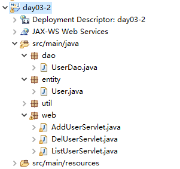
>
> ```java
> package dao;
> 
> import java.sql.Connection;
> import java.sql.PreparedStatement;
> import java.sql.ResultSet;
> import java.util.ArrayList;
> import java.util.List;
> 
> import entity.User;
> import util.DBUtils;
> 
> public class UserDao {
> 	/**
> 	 * 查询出所有用户的信息。
> 	 * 注：
> 	 * 关系数据库里面存放的是一条条记录，而java是面向对象的语言。
> 	 * 在设计DAO时，我们经常将查询到的记录转换成一个对应的java对象。
> 	 * @return
> 	 */
> 	public List<User> findAll(){
> 		List<User> users = new ArrayList<User>();
> 		Connection conn = null;
> 		PreparedStatement psta = null;
> 		ResultSet rs = null;
> 		try {
> 			conn = DBUtils.getConn();
> 			String sql = "select * from t_user";
> 			psta = conn.prepareStatement(sql);
> 			rs = psta.executeQuery();
> 			while(rs.next()) {
> 				User user = new User();
> 				user.setId(rs.getInt("id"));
> 				user.setUsername(rs.getString("username"));
> 				user.setPassword(rs.getString("password"));
> 				user.setEmail(rs.getString("email"));
> 				users.add(user);
> 			}
> 		} catch (Exception e) {
> 			e.printStackTrace();
> 		} finally {
> 			DBUtils.close(conn, psta, rs);
> 		}
> 		return users;
> 	}
> }
> ```

修改一下ListUserServlet中的代码就可以实现了

```java
package web;

import java.io.IOException;
import java.io.PrintWriter;
import java.util.List;

import javax.servlet.ServletException;
import javax.servlet.http.HttpServlet;
import javax.servlet.http.HttpServletRequest;
import javax.servlet.http.HttpServletResponse;

import dao.UserDao;
import entity.User;

public class ListUserServlet extends HttpServlet{

	@Override
	protected void service(HttpServletRequest req, HttpServletResponse resp) throws ServletException, IOException {
		resp.setContentType("text/html;charset=utf-8");
		PrintWriter out = resp.getWriter();
		
		//查询出所有用户的信息
		UserDao dao = new UserDao();
		try {
			List<User> users = dao.findAll();
			//依据查询到的用户信息输出表格
			out.println("<table border='1' width='60%' cellpadding='0' cellspacing='0'>");
			out.println("<tr><td>ID</td> <td>用户名</td> <td>密码</td> <td>邮箱</td> <td>操作</td></tr>");
			for (User user : users) {
				int id = user.getId();
				String username = user.getUsername();
				String password = user.getPassword();
				String email = user.getEmail();
				out.println("<tr><td>"+id+"</td><td>"+username+"</td><td>"+password+"</td><td>"+email+"<td><a href='del?id="+id+"'>删除</a></tr>");
			}	
			out.println("</table>");
			out.println("<a href='addUser.html'>添加用户</a>");
		} catch (Exception e) {
			e.printStackTrace();
			out.println("系统繁忙，稍后重试");
		}
	}
}
```


#### （3）DAO的优点


### 14.jsp（day04）

#### （1）jsp是什么？

​			sun公司制订的一种服务器端动态页面技术规范。

​			

#### （2）如何写一个jsp文件？

​			

> - step1. 添加一个以.jsp为后缀的文件
>
> - step2. 在该文件里面，可以使用如下元素：
>   - 1）html(css,javascript)：直接写即可
>
>   - 2）java代码
>
>     - 方式一：java代码片段
>
>       > `<% java代码段 %>`
>
>     - 方式二：jsp表达式
>
>       > `<%= java表达式 %>`
>       >
>       > 
>
>   - 3）隐含对象
>
>     > 
>
>   - 4）指令
>
>     > 
>     >
>     > 
>     >
>     > > contentType属性：设置resposne.setContentType方法的内容
>     > >
>     > > pageEncoding属性：告诉容器，在读取jsp文件的内容时，使用指定的字符集来编码
>     > >
>     > > 
>     > >
>     > > 


#### （3）jsp是如何执行的？

- [ ] 阶段一：容器将.jsp文件转换成一个Servlet类

  

  

- [ ] 阶段二：容器调用该Servlet

  

  

#### 练习


```java
<%@page import="java.text.SimpleDateFormat"%>
<%@ page import="java.util.Date" %>
<html>
	<head ></head>
	<body style="font-size:30px;">
		time:
		<%
			Date date = new Date();
			SimpleDateFormat sdf = new SimpleDateFormat("yyyy-MM-dd");
			
		%>
		<%=sdf.format(date) %>
	</body>
</html>
```


#### jsp展示表格

```java
<%@ page contentType="text/html;charset=utf-8" pageEncoding="utf-8" %>
<%@ page import="dao.*,entity.*,java.util.*" %>
<html>
	<head>
		<style type="text/css">
			.row1{background-color:#fff8dc;}
			.row2{background-color:#f0f0f0;}
			table{font-size:24px;}
		</style>
	</head>
	<body style="font-size：30px；">
		<table border="1" width="60%" cellpadding="0" cellspacing="0">
			<tr>
				<td>ID</td>
				<td>用户名</td>
				<td>密码</td>
				<td>email</td>
			</tr>
			<%
				UserDao dao = new UserDao();
				List<User> users = dao.findAll();
				for(int i=0; i<users.size(); i++){
					User user = users.get(i);
					%>
					<tr class="row<%=i%2+1%>">
						<td><%=user.getId() %></td>
						<td><%=user.getUsername() %></td>
						<td><%=user.getPassword() %></td>
						<td><%=user.getEmail() %></td>
					</tr>
					<%
				}
			%>
		</table>
	</body>
</htmI>
```


### 15.请求转发（day05）

#### **（1）什么是转发？**

一个web组件将未完成的处理交给另外—个web组件继续做。


#### **（2）如何转发？**

- step1：绑定数据到request对象上
  

- step2：获得转发器
  

- step3：转发

  

  以上第二三步骤可以合并为：`req.getRequestDispatcher("").forward(req, resp)`

  **执行转发**

  ```java
  package web;
  
  import java.io.IOException;
  import java.io.PrintWriter;
  import java.util.List;
  
  import javax.servlet.RequestDispatcher;
  import javax.servlet.ServletException;
  import javax.servlet.http.HttpServlet;
  import javax.servlet.http.HttpServletRequest;
  import javax.servlet.http.HttpServletResponse;
  
  import dao.UserDao;
  import entity.User;
  
  public class ListUserServlet extends HttpServlet{
  
  	@Override
  	protected void service(HttpServletRequest req, HttpServletResponse resp) throws ServletException, IOException {
  		resp.setContentType("text/html;charset=utf-8");
  		PrintWriter out = resp.getWriter();
  		
  		//查询出所有用户的信息
  		UserDao dao = new UserDao();
  		try {
  			List<User> users = dao.findAll();
  			//依据查询到的用户信息输出表格
  			/*
  			 * 因为 Servlet不擅长处理复杂的页面，所以，我们使用
  			 * 转发机制，将数据绑订到request对象上，然后转发给
  			 * jsp来展现。
  			 */
  			//step1.将数据绑订到 request对象上
  			req.setAttribute("users",users);
  			//step2.获得转发器
  			RequestDispatcher rd = req.getRequestDispatcher("listUser.jsp");
  			//step3.转发
  			rd.forward(req, resp);
  		} catch (Exception e) {
  			e.printStackTrace();
  			out.println("系统繁忙，稍后重试");
  		}
  	}
  	
  }
  
  ```

  **显示转发信息**

  ```java
  <%@ page contentType="text/html;charset=utf-8" pageEncoding="utf-8" %>
  <%@ page import="entity.*,java.util.*" %>
  <html>
  	<head>
  		<style type="text/css">
  			.row1{background-color:#fff8dc;}
  			.row2{background-color:#f0f0f0;}
  			table{font-size:24px;}
  		</style>
  	</head>
  	<body style="font-size：30px；">
  		<table border="1" width="60%" cellpadding="0" cellspacing="0">
  			<tr>
  				<td>ID</td>
  				<td>用户名</td>
  				<td>密码</td>
  				<td>email</td>
  			</tr>
  			<%
  				List<User> users = (List<User>)request.getAttribute("users");
  				for(int i=0; i<users.size(); i++){
  					User user = users.get(i);
  					%>
  					<tr class="row<%=i%2+1%>">
  						<td><%=user.getId() %></td>
  						<td><%=user.getUsername() %></td>
  						<td><%=user.getPassword() %></td>
  						<td><%=user.getEmail() %></td>
  					</tr>
  					<%
  				}
  			%>
  			
  		</table>
  	</body>
  </htmI>
  ```

  


#### （3）转发特点

- a）转发之后，浏览器地址栏的地址不变
- b）转发的目的地有限制，要求属于同一个web应用


### 16.转发与重定向的区别

我们从四个方向去比较

- （1）地址栏地址有无变化

  - 转发之后，浏览器地址栏地址不变

    

  - 重定向之后，浏览器地址栏地址会发生改变

    

    

- （2）目的地有无限制

  - 转发有限制，要求属于同一个web应用

  - 重定向没有任何限制

    

- （3）能否共享request对象和response对象

  - 转发可以共享

  - 重定向不行（重定向是通知浏览器向服务端发送请求，等于是发送了一个新的请求，所以request和response对象会新创建，就是两次请求）

    

    

- （4）一件事情是否做完

  - 转发是一件事情未做完，让另外一个web组件继续做

  - 重定向是一件事情已经完成，再做另外一件独立的事情

    例如：功能模块间的跳转用重定向，例如当添加用户后跳转到另一个查询功能页面这就是一个独立的事情，应该用重定向。
    功能模块内的跳转用转发，例如Servlet将数据转发给展示的jsp页面

  


### 17.相对路径和绝对路径

#### （1）路径问题

> 链接、表单提交、重定向和转发如何填写相应的路径
> 


#### （2）什么是相对路径？

> 不以“/”开头的路径


#### （3）什么是绝对路径？

> 以“/”开头的路径


#### （4）如何写绝对路径？

> 链接、表单提交、重定向从应用名开始写；转发从应用名之后开始写
>
> 
>
> 举个例子
>
> 
>
> 


### 18.状态/会话管理(day06)

#### （1）什么是状态/会话管理？

将浏览器与Web服务器之间多次<u>交互（一次请求与响应）</u>当做一个整体来处理，并且将多次交互所产生的数据（即状态）保存下来。

#### （2）如何进行状态/会话管理？

- a）方式一：将状态保存在浏览器端
  - 通常使用Cookie技术
- b）方式二：将状态保存在服务器端
  - 通常使用Session技术

#### （3）Cookie

##### **a）什么是Cookie？**

服务器临时存放在浏览器端的少量数据(最大4KB)，用于跟踪用户的状态


##### **b）如何添加Cookie？**


##### **c）Cookie的运作流程**

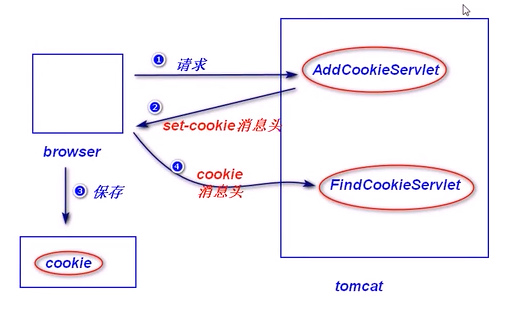

##### **d）如何读取Cookie？**


##### **e）练习**


```java
package web;

import java.io.IOException;
import java.io.PrintWriter;

import javax.servlet.ServletException;
import javax.servlet.http.Cookie;
import javax.servlet.http.HttpServlet;
import javax.servlet.http.HttpServletRequest;
import javax.servlet.http.HttpServletResponse;

public class Find_AddCookieServlet extends HttpServlet{
	@Override
	protected void service(HttpServletRequest req, HttpServletResponse resp) throws ServletException, IOException {
		resp.setContentType("text/html;charset=utf-8");
		PrintWriter out = resp.getWriter();
		Cookie[] cookies = req.getCookies();
		if(cookies != null) {
			boolean flag = false;
			for (Cookie cookie : cookies) {
				String name = cookie.getName();
				if("cart".equals(name)) {
					//找到了，显示该cookie的值
					out.println(cookie.getValue());
					flag = true;
				}
			}
			if(!false) {
				//没有找到，需要添加
				Cookie c = new Cookie("cart","123");
				resp.addCookie(c);
			}
		} else {
			//没有cookie，需要添加
			Cookie c = new Cookie("cart","123");
			resp.addCookie(c);
		}
	}
}
```


##### **f）cookie的生存时间**

- <u>默认情况下，浏览器会将cookie保存在内存中，浏览器只要关闭，cookie就会被删除</u>。

- 可以调用setMaxAge方法来设置cookie的生存时间
  

  ```java
  Cookie c = new Cookie("username","Sally");
  //设置cookie生存时间
  c.setMaxAge(40);//cookie生存40秒
  resp.addCookie(c);
  ```


##### **g）cookie的编码问题**

- 什么是cookie的编码问题？
  

- 如何处理？
  

  ```java
  		/*
  		 * cookie只能存放合法的ascii字符，中文要转换成合法的ascii字符的形式。
  		 */
  		String  city = URLEncoder.encode("北京","utf-8");//转成加上%的16进制，如下图
  		Cookie c2 = new Cookie("city",city);
  		resp.addCookie(c2);
  ```

  

  ```java
  //读取浏览器发送过来的cookie
  		Cookie[] cookies = req.getCookies();
  		if(cookies != null) {
  			for (Cookie cookie : cookies) {
  				String name = cookie.getName();
  				String value = URLDecoder.decode(cookie.getValue(),"utf-8");
  				out.println(name+":"+value+"<br/>");
  			}
  		}else {
  			out.println("没有Cookie");
  		}
  ```

  

  

  

##### **h）cookie的路径问题**

- i）什么是cookie的路径问题？
  

  >先看下一小点再看这里
  >
  >
  >
  >

- ii）cookie的默认路径
  

  > 例如在webapps下day06创建一个biz01文件夹，文件夹下新建一个addCookie.jsp
  > 
  >
  > 
  >
  > 部署运行addCookie.jsp后的浏览器中这个添加的cookie信息如下
  >
  > 

- iii）匹配规则
  
- iiii）修改cookie路径
  


##### **i）cookie的限制**

- cookie可以被用户禁止
- cookie不安全（对于敏感数据，一定要加密）
- cookie只能保存少量数据（大约4k左右）
- cookie的数量也有限制（大约是几百个）
- cookie只能保存字符串


##### **j）演示统计网页访问次数的练习**


```java
这个工具类中封装了关于cookie的添加读取和删除方法
package util;

import java.io.UnsupportedEncodingException;
import java.net.URLDecoder;
import java.net.URLEncoder;

import javax.servlet.http.Cookie;
import javax.servlet.http.HttpServletRequest;
import javax.servlet.http.HttpServletResponse;

/**
 * Cookie工具类，提供了添加cookie、读取cookie、删除cookie的方法
 * @author Grant·Vranes
 *
 */
public class CookieUtil {
	/**
	 * 添加cookie的方法
	 * @param name
	 * @param value
	 * @param age
	 * @param path
	 * @param resp
	 * @throws UnsupportedEncodingException 
	 */
	public static void addCookie(String name, String value, int age, String path,HttpServletResponse resp) throws UnsupportedEncodingException {
		/*
		 * cookie只能保存合法的ascii字符，建议在添加cookie时，最好使用
		 * URLEncoder.encode方法进行统一的编码处理。
		 */
		Cookie c = new Cookie(name, URLEncoder.encode(value,"utf-8"));
		c.setMaxAge(age);
		c.setPath(path);
		resp.addCookie(c);
	}
	
	/**
	 * 依据cookie名称读取对应的cookie的值，如果找不到，返回null
	 * @param name
	 * @param req
	 * @return
	 * @throws UnsupportedEncodingException
	 */
	public static String findCookie(String name, HttpServletRequest req) throws UnsupportedEncodingException {
		String value = null;
		Cookie[] cookies = req.getCookies();
		if(cookies != null) {
			for (Cookie c : cookies) {
				String nameCap = c.getName();
				if(name.equals(nameCap)) {
					value = URLDecoder.decode(c.getValue(),"utf-8");
				}
			}
		}
		return value;
	}
	
	/**
	 * 删除某个cookie
	 * @param name
	 * @param path
	 * @param resp
	 */
	public static void deleteCookie(String name, String path, HttpServletResponse resp) {
		Cookie c = new Cookie(name,"");
		c.setMaxAge(0);
		c.setPath(path);
	}
}
```

```java
package web;

import java.io.IOException;
import java.io.PrintWriter;

import javax.servlet.ServletException;
import javax.servlet.http.HttpServlet;
import javax.servlet.http.HttpServletRequest;
import javax.servlet.http.HttpServletResponse;

import util.CookieUtil;

public class CountServlet extends HttpServlet{
	@Override
	protected void service(HttpServletRequest req, HttpServletResponse resp) throws ServletException, IOException {
		resp.setContentType("text/html;charset=utf-8");
		PrintWriter out = resp.getWriter();
		/*
		 * 先查看有没有一个名称为"count"的cookie，如果没有（该用户是第1次
		 * 访问），则添加一个名称为"count"的 cookie，值设置为1。如果有（该
		 * 用户已经访问过），则将cookie的值加1，然后重新添加该cookie. 
		 */
		String count = CookieUtil.findCookie("count", req);
		if(count == null) {
			CookieUtil.addCookie("count", "1", 30*24*60*60, "/day06", resp);
			out.println("欢迎您的第一次访问");
		}else {
			int countW = Integer.parseInt(count)+1;
			CookieUtil.addCookie("count", countW+"", 30*24*60*60, "/day06", resp);
			out.println("你是第"+countW+"次访问");
		}
	}
}
```


#### （4）Session（会话）（day07）

##### （1）session是什么?

> 服务端为了保存状态而创建的一个特殊的对象
>
> 


##### （2）如何获得session对象？

> - **方式一：**
>   
>   
>   
>   例子：
>   
>   ```java
>   package web;
>                                                                                     
>   import java.io.IOException;
>                                                                                     
>   import javax.servlet.ServletException;
>   import javax.servlet.http.HttpServlet;
>   import javax.servlet.http.HttpServletRequest;
>   import javax.servlet.http.HttpServletResponse;
>   import javax.servlet.http.HttpSession;
>                                                                                     
>   public class SomeServlet extends HttpServlet{
>   	@Override
>   	protected void service(HttpServletRequest req, HttpServletResponse resp) throws ServletException, IOException {
>   		//获取session对象
>   		HttpSession session = req.getSession(true);
>   		//获得sessionId
>   		String sessionId = session.getId();
>   		System.out.println("sessionId:"+sessionId);
>   	}
>   }
>   ```
>   
>   
>   
>   
>   
> - **方式二：**意思就是说写不写true，都是默认写了true的
>
>   


##### （3）session对象的常用方法

> - a）`session.setAttribute(String name, object obj);`绑定数据
>
>   
>
> - b）`Object session.getAttribute(String name);`依据绑定名获取绑定值
>
>   
>
> - c）`session.removeAttribute(String name);`解除绑定
>
> 
>
> 练习
>
> 
>
> ```java
> package web;
> 
> import java.io.IOException;
> import java.io.PrintWriter;
> import java.text.SimpleDateFormat;
> import java.util.Date;
> 
> import javax.servlet.ServletException;
> import javax.servlet.http.HttpServlet;
> import javax.servlet.http.HttpServletRequest;
> import javax.servlet.http.HttpServletResponse;
> import javax.servlet.http.HttpSession;
> 
> public class DateServlet extends HttpServlet{
> 	@Override
> 	protected void service(HttpServletRequest req, HttpServletResponse resp) throws ServletException, IOException {
> 		resp.setContentType("text/html;charset=utf-8");
> 		PrintWriter out = resp.getWriter();
> 		
> 		//获取session对象,看请求里面有没有session对象,没有则创建
> 		HttpSession session = req.getSession();
> 		
> 		Date date = (Date)session.getAttribute("date");
> 		if(date==null) {
> 			out.println("这是第一次访问");
> 		}else {
> 			out.println("您上一次访问时间是"+new SimpleDateFormat("yyyy-MM-dd HH:mm:ss").format(date));
> 		}
> 		session.setAttribute("date",new Date());	
> 	}
> }
> ```


##### （4）session超时？

> - a）什么是session超时？
>   
> - b）如何修改超时时间长度？（一般来说不用改）
>   - 方式一：修改web.xml配置文件，（注意这个配置文件一旦修改，所有部署到这个服务器上的项目都会受到影响），如果不想这样可以找到一个单独项目的web.xml文件将<session-config>添加进去就可以了，这样只有这个项目的session会受影响
>     
>     
>   - 方式二：
>     


##### （5）删除session

> `session.invalidate();`
>
> 将session设置为失效，一般在退出时使用


##### （6）session验证

> - step1：登录成功之后，在session对象上绑定一些数据，比如：
>   
>
> - step2：当用户访问受保护的资源时（即只有登录成功之后才能访问的资源，比如success.jsp），进行session验证，比如：
>   


---

##### （7）演示用户登录

系统结构图


代码

```java
login.jsp
<%@ page language="java" contentType="text/html; charset=utf-8"
    pageEncoding="utf-8"%>
<!DOCTYPE html>
<html>
<head>
<meta charset="utf-8">
<title>Insert title here</title>
</head>
<body style="fonr-size:30px;">
	<form action="login" method="post">
		<fieldset>
			<legend>登录</legend>
			用户名：<input name="username"/>
			<%
				String msg = (String)request.getAttribute("login_failed");
			%>
			<span style="color:red;">
				<%=msg==null? "":msg %>
			</span><br/>
			密码：<input name="pwd" type="password"/><br/>
			<input type="submit" value="确定"/>
		</fieldset>
	</form>
</body>
</html>
```

```java
LoginServlet.java
package web;

import java.io.IOException;

import javax.servlet.ServletException;
import javax.servlet.http.HttpServlet;
import javax.servlet.http.HttpServletRequest;
import javax.servlet.http.HttpServletResponse;
import javax.servlet.http.HttpSession;

import dao.UserDao;
import entity.User;

public class LoginServlet extends HttpServlet{
	@Override
	protected void service(HttpServletRequest req, HttpServletResponse resp) throws ServletException, IOException {
		req.setCharacterEncoding("utf-8");
		String username = req.getParameter("pwd");
		String pwd = req.getParameter("pwd");
		/*
		 * 查询数据库，看是否有匹配的记录，如果有，则登录成功，
		 * 重定向到 success.jsp如果没有，则登录失败，转发
		 * 到1ogin.jsp，并提示"用户名或密码错误"。
		 */
		UserDao dao = new UserDao();
		try {
			User user = dao.findByUsername(username);
			if(user != null && pwd.equals(user.getPassword())) {
				//登陆成功,将一些数据绑定到session对象上，为session验证做准备
				HttpSession session = req.getSession();
				session.setAttribute("user", user);
				//，重定向到success.jsp
				resp.sendRedirect("success.jsp");
			}else {
				//登录失败
				req.setAttribute("login_failed", "用户名或密码错误");
				req.getRequestDispatcher("login.jsp").forward(req, resp);
			}
		} catch (Exception e) {
			e.printStackTrace();
		}
	}
}
```

```java
success.jsp
<%@ page language="java" contentType="text/html; charset=utf-8"
    pageEncoding="utf-8"%>
<!DOCTYPE html>
<html>
<head>
<meta charset="utf-8">
<title>Insert title here</title>
</head>
<body>
	<%
		//如果用户访问需要保护的资源
		//session验证
		Object obj = session.getAttribute("user");
		if(obj==null){
			//没有登录，重定向到登录页面
			response.sendRedirect("login.jsp");
			return;
		}
	%>
	<h1>登录成功</h1>
</body>
</html>
```


##### （8）比较session和cookie

https://blog.csdn.net/weixin_41910244/article/details/80287527


https://blog.csdn.net/jnshu_it/article/details/84783183


> - session相对于cookie优点是
>   - 更安全，因为session把数据保存在服务器端
>   - 可以保存更多的数据
>   - 支持更丰富的数据类型
> - 缺点是需要占用服务器端的内存空间


### 19.servlet的生命周期（day08）

https://blog.csdn.net/czh500/article/details/79549073

#### （1）什么是servlet的生命周期？(面试题)

> 


#### （2）分成哪几个阶段？

> **分为四个阶段：**
>
> - 1）实例化
>
>   - a.什么是实例化？
>     
>
>   - b.什么时候实例化？
>     
>
>     
>
> 
>
> 
>
> - 2）初始化
>
>   > 在Servlet实例化之后，容器将调用Servlet的init()方法初始化这个对象。初始化的目的是为了让Servlet对象在处理客户端请求前完成一些初始化的工作，
>   >
>   > 如建立数据库的连接，获取配置信息等。对于每一个Servlet实例，init()方法只被调用一次。在初始化期间，Servlet实例可以使用容器为它准备的ServletConfig对象从Web应用程序的配置信息（在web.xml中配置）中获取初始化的参数信息。在初始化期间，如果发生错误，Servlet实例可以抛出ServletException异常或者UnavailableException异常来通知容器。ServletException异常用于指明一般的初始化失败，例如没有找到初始化参数；而
>   >
>   > UnavailableException异常用于通知容器该Servlet实例不可用。例如，数据库服务器没有启动，数据库连接无法建立，Servlet就可以抛出
>   >
>   > UnavailableException异常向容器指出它暂时或永久不可用。
>
>   - a.什么是初始化？
>     
>
>   - b.GenericServlet已经提供了init方法的实现：
>     
>
>   - c.如何实现自己的初始化处理逻辑？
>     
>
>   - d.初始化参数
>     
>
>     ```java
>     ServletConfig config = getServletConfig();
>     //读取初始化参数
>     String city = config.getInitParameter("city");
>     System.out.println("city:"+city);
>     ```
>
>  打个桩：servlet的初始化参数讲解在此，一定要注意后面过滤器还有一个初始化参数，和servlet的这个使用起来还是有区别的。这是在init的重写方法中，那个在init的原生方法中。
>
> 
>
> - 3）就绪（调用）
>
>   > Servlet容器调用Servlet的service()方法对请求进行处理。要注意的是，在service()方法调用之前，init()方法必须成功执行。在service()方法中，
>   >
>   > Servlet实例通过ServletRequest对象得到客户端的相关信息和请求信息，在对请求进行处理后，调用ServletResponse对象的方法设置响应信息。在service()方法执行期间，如果发生错误，Servlet实例可以抛出ServletException异常或者UnavailableException异常。如果UnavailableException异常指示了该实例永久不可用，Servlet容器将调用实例的destroy()方法，释放该实例。此后对该实例的任何请求，都将收到容器发送的HTTP 404（请求的资源不可用）响应。如果UnavailableException异常指示了该实例暂时不可用，那么在暂时不可用的时间段内，对该实例的任何请求，都将收到容器发送的HTTP 503（服务器暂时忙，不能处理请求）响应。
>
>   - a.什么是就绪？
>     
>     
>   - b.HttpServlet已经提供了service方法的实现：
>     
>     
>   - c.开发人员可以override  HttpServlet的service方法，也可以override  doXXX方法
>
>     
>
> - 4）销毁
>
>   > 当容器检测到一个Servlet实例应该从服务中被移除的时候，容器就会调用实例的destroy()方法，以便让该实例可以释放它所使用的资源，保存数据到持久存储设备中。当需要释放内存或者容器关闭时，容器就会调用Servlet实例的destroy()方法。在destroy()方法调用之后，容器会释放这个Servlet实例，该实例随后会被Java的垃圾收集器所回收。如果再次需要这个Servlet处理请求，Servlet容器会创建一个新的Servlet实例。在整个Servlet的生命周期过程中，创建Servlet实例、**调用实例的init()和destroy()方法都只进行一次**，当初始化完成后，Servlet容器会将该实例保存在内存中，通过调用它的service()方法，为接收到的请求服务。
>
>   - a.什么时销毁？
>     
>
>   - b.GenericServlet已经提供了destroy方法的实现：
>     
>
> 
>
>   


#### （3）相关的接口与类

> ##### a.Servlet接口
>
> 
>
> ##### b.GenericServlet抽象类
>
> 
>
> ##### c.HttpServlet抽象类
>
> 

---

##### 补充：将异常抛给容器来处理

**补充一个小知识**

关于安全问题，我们编程时不能，可能有些抛出某些异常，但我们不能直接将这些异常抛出给用户，就向如下图：


在处理异常的时候就可以将异常抛出给容器，由容器来处理


所以我们可以在项目的web.xml文件中，去配置处理异常页面，如下

```xml
<!-- 配置异常处理页面 -->
	<error-page>
        <!-- 注意这里可以用状态码也可以用异常类型，两者取其一
 		<error-code>500</error-code>
		-->
		<exception-type>javax.servlet.ServletException</exception-type>
		<location>/error.jsp</location>
	</error-page>
```


根据不同的异常抛出类型或状态码去导向不同的页面


---

#### （4）相关练习


```java
bmi.jsp
<%@ page language="java" contentType="text/html; charset=utf-8"
    pageEncoding="utf-8"%>
<!DOCTYPE html>
<html>
<head>
<meta charset="utf-8">
<title>Insert title here</title>
</head>
<body style="font-size:30px;">
	<form action="bmi" method="post">
		<fieldset>
			<legend>计算BMI指数</legend>
			身高（米）:<input name="height"/><br/>
			体重（公斤）:<input name="weight"/><br/>
			<input type="submit" value="提交"/>
		</fieldset>
	</form>
</body>
</html>
```

```java
view.jsp
<%@ page language="java" contentType="text/html; charset=UTF-8"
    pageEncoding="UTF-8"%>
<!DOCTYPE html>
<html>
<head>
<meta charset="UTF-8">
<title>Insert title here</title>
</head>
<body style="font-size:30px;">
	<fieldset>
		<legend>检测结果</legend>
		BMI指数：<%=request.getAttribute("bmi") %><br/>
		体重情况：<%=request.getAttribute("status") %>
	</fieldset>
</body>
</html>
```

```java
BmiServlet.java
package web;

import java.io.IOException;

import javax.servlet.ServletConfig;
import javax.servlet.ServletException;
import javax.servlet.http.HttpServlet;
import javax.servlet.http.HttpServletRequest;
import javax.servlet.http.HttpServletResponse;

/**
 * Servlet implementation class BmiServlet
 */
public class BmiServlet extends HttpServlet {
	private static final long serialVersionUID = 1L;
	private int min;
	private int max;
	
	@Override
	public void init() throws ServletException {
		//读取初始化参数min和max的值，将bmi指数的范围先读出来，避免service方法当中重复读取
		ServletConfig config = getServletConfig();
		min = Integer.parseInt(config.getInitParameter("min"));
		max = Integer.parseInt(config.getInitParameter("max"));
	}

	/**
	 * @see HttpServlet#service(HttpServletRequest request, HttpServletResponse response)
	 */
	protected void service(HttpServletRequest request, HttpServletResponse response) throws ServletException, IOException {
		//读取身高和体重
		String height = request.getParameter("height");
		String weight = request.getParameter("weight");
		
		//计算BMI指数
		double bmi = Double.parseDouble(weight)/Double.parseDouble(height)/Double.parseDouble(height);
		
		//依据BMI指数，判断一个人的体重情况
		String status = "体重正常";
		if(bmi<min) {
			status="体重过轻";
		}
		if(bmi>max){
			status="体重过重";
		}
		
		//输出
		request.setAttribute("bmi", bmi);
		request.setAttribute("status", status);
		request.getRequestDispatcher("view.jsp").forward(request, response);
	}
}
```

```xml
<?xml version="1.0" encoding="UTF-8"?>
<web-app xmlns:xsi="http://www.w3.org/2001/XMLSchema-instance" xmlns="http://Java.sun.com/xml/ns/javaee" xmlns:web="http://java.sun.com/xml/ns/javaee" xsi:schemaLocation="http://java.sun.com/xml/ns/javaee http://java.sun.com/xml/ns/javaee/web-app_2_5.xsd" version="2.5">
  <servlet>
    <description></description>
    <display-name>BmiServlet</display-name>
    <servlet-name>BmiServlet</servlet-name>
    <servlet-class>web.BmiServlet</servlet-class>
        <init-param>
            <param-name>min</param-name>
            <param-value>19</param-value>
        </init-param>
        <init-param>
            <param-name>max</param-name>
            <param-value>25</param-value>
        </init-param>
        <load-on-startup>1</load-on-startup>
  </servlet>
  <servlet-mapping>
    <servlet-name>BmiServlet</servlet-name>
    <url-pattern>/bmi</url-pattern>
  </servlet-mapping>
</web-app>
```


### 20.过滤器（day09）

#### （1）什么是过滤器？

>  servlet规范当中定义的一种特殊的组件，用于拦截servlet容器的调用过程。


#### （2）如何写一个过滤器？

> step1：写一个java类，实现Filter接口
>
> step2：在doFilter方法里面，实现拦截处理逻辑
>
> step3：配置过滤器（web.xml）
>
> 

举个实际例子：


```java
comment.jsp
<%@ page language="java" contentType="text/html; charset=UTF-8"
    pageEncoding="UTF-8"%>
<!DOCTYPE html>
<html>
<head>
<meta charset="UTF-8">
<title>Insert title here</title>
</head>
<body style="font-size:30px;">
	<form action="comment" method="post">
		<fieldset>
		<legend>评论提交</legend>
		请输入你的评论:<br/>
		<textarea name="content" rows="3"></textarea><br/>
		<input type="submit" value="提交评论">
		</fieldset>
	</form>
</body>
</html>
```

```java
CommentSevlet.java
package web;

import java.io.IOException;
import java.io.PrintWriter;

import javax.servlet.ServletException;
import javax.servlet.http.HttpServlet;
import javax.servlet.http.HttpServletRequest;
import javax.servlet.http.HttpServletResponse;

/**
 * Servlet implementation class CommentServlet
 */
public class CommentServlet extends HttpServlet {
	private static final long serialVersionUID = 1L;

	/**
	 * @see HttpServlet#service(HttpServletRequest request, HttpServletResponse response)
	 */
	protected void service(HttpServletRequest request, HttpServletResponse response) throws ServletException, IOException {
		System.out.println("CommentServlet的service方法");
		
		request.setCharacterEncoding("utf-8");
		response.setContentType("text/html;charset=utf-8");
		PrintWriter out = response.getWriter();
		String content = request.getParameter("content");
		out.println("你的看法是："+content);
	}
}
```

```java
CommentFilter.java
package web;

import java.io.IOException;
import java.io.PrintWriter;

import javax.servlet.Filter;
import javax.servlet.FilterChain;
import javax.servlet.FilterConfig;
import javax.servlet.ServletException;
import javax.servlet.ServletRequest;
import javax.servlet.ServletResponse;
import javax.servlet.http.HttpServletRequest;
import javax.servlet.http.HttpServletResponse;

public class CommentFilter implements Filter{

	/**
	 * 容器启动之后，会立即创建过滤器实例。
	 * 注：只会创建一个实例！
	 */
	public CommentFilter() {
		System.out.println("CommentFilter的构造器创建了");
	}
	public void destroy() {
		// TODO Auto-generated method stub
		
	}

	/**
	 * 容器在调用完过滤器的init方法之后，会调用doFilter方法来处理请求
	 * 注：（了解）
	 * 	ServletRequest是HttpServletRequest的父接口，ServletResponse
	 * 	是HttpServletResponse的父接口。
	 * 
	 * FilterChain（过滤器链）:会把这些过滤器对象放到一个数据结构，一个对象一个对象的来调用其doGet方法
	 * 		如果调用了该对象的doFilter方法，表示继续向后调用；否则，中断请求，
	 * 		返回处理结果。
	 */
	public void doFilter(ServletRequest arg0, ServletResponse arg1, FilterChain arg2)
			throws IOException, ServletException {
		System.out.println("CommentFilter的doFilter方法开始执行");
		/*
		 * 因为sun公司过度设计，这里需要做强制转换（我们经常调用的是子接口中的方法）
		 */
		HttpServletRequest request = (HttpServletRequest)arg0;
		HttpServletResponse response = (HttpServletResponse)arg1;
		request.setCharacterEncoding("utf-8");
		PrintWriter out = response.getWriter();
		String content = request.getParameter("content");
		if(content.indexOf("狗") != -1) {
			//包含敏感词，不再向后调用
			//返回处理结果
			out.println("评论包含了敏感词");
		}else {
			//没有敏感词，继续向后调用
			arg2.doFilter(arg0, arg1);
		}
		System.out.println("CommentFilter的doFilter方法执行完毕");
	}

	/**
	 * 容器在创建好过滤器实例之后，会立即调用该实例的init方法
	 * 注：该方法只会调用一次！
	 */
	public void init(FilterConfig arg0) throws ServletException {
		System.out.println("CommentFilter的初始化方法");
	}
}
```

```xml
web.xml
<?xml version="1.0" encoding="UTF-8"?>
<web-app xmlns:xsi="http://www.w3.org/2001/XMLSchema-instance" xmlns="http://Java.sun.com/xml/ns/javaee" xsi:schemaLocation="http://java.sun.com/xml/ns/javaee http://java.sun.com/xml/ns/javaee/web-app_2_5.xsd" version="2.5">
  
  <servlet>
    <description></description>
    <display-name>CommentServlet</display-name>
    <servlet-name>CommentServlet</servlet-name>
    <servlet-class>web.CommentServlet</servlet-class>
  </servlet>
  <servlet-mapping>
    <servlet-name>CommentServlet</servlet-name>
    <url-pattern>/comment</url-pattern>
  </servlet-mapping>
  
  <!-- 过滤器的url要和servlet的url一样，这样在前端页面调用的时候会先从过滤器走一遭-->
  <filter>
  	<filter-name>commentFilter</filter-name>
  	<filter-class>web.CommentFilter</filter-class>
  </filter>
  <filter-mapping>
  	<filter-name>commentFilter</filter-name>
  	<url-pattern>/comment</url-pattern>
  </filter-mapping>
  
</web-app>
```


#### （3）过滤器的优先级


#### （4）初始化参数

> 跟servlet的初始化一样使用
>
> step1：配置初始化参数
>
> 
>
> step2：调用FilterConfig提供的getInitParameter方法来读取初始化参数
>
> ```java
> public class CommentFilter implements Filter{
> 	private FilterConfig config;//设置全局变量
> 	
> 	public void destroy() {
> 		// TODO Auto-generated method stub
> 	}
> 
> 	public void doFilter(ServletRequest arg0, ServletResponse arg1, FilterChain arg2)
> 			throws IOException, ServletException {
> 		HttpServletRequest request = (HttpServletRequest)arg0;
> 		HttpServletResponse response = (HttpServletResponse)arg1;
> 		request.setCharacterEncoding("utf-8");
> 		PrintWriter out = response.getWriter();
> 		String content = request.getParameter("content");
> 		//读取初始化参数
> 		int size = Integer.parseInt(config.getInitParameter("size"));
> 	}
> 
> 	public void init(FilterConfig arg0) throws ServletException {
> 		//将容器传递过来的FilterConfig对象保存下来，赋给全局变量
> 		config = arg0;
> 	}
> }
> ```


#### （5）过滤器的优点

- **a**.可以在不修改源代码的基础上，为应用添加新的功能（比如说我要在原来评论提交的基础功能上加上敏感词的限制）
- **b**.可以将多个组件相同的功能集中写在过滤器里面，方便代码的维护（比如我这边有好几个Servlet需要做session登录验证，就可以把这些Servlet需要的session验证写在过滤器中）


### 21.容器如何处理请求资源路径（day09-2）


实际上访问的步骤是：

- **step1：默认认为访问的是一个servlet，容器会<u>先</u>去查找对应的servlet**


就算我在webapps下有一个abc.html文件，然后web.xml中又配置了如下的servlet

```xml
<servlet>
    <description></description>
    <display-name>SomeServlet</display-name>
    <servlet-name>SomeServlet</servlet-name>
    <servlet-class>web.SomeServlet</servlet-class>
  </servlet>
  <servlet-mapping>
    <servlet-name>SomeServlet</servlet-name>
    <url-pattern>/abc.html</url-pattern>
  </servlet-mapping>
```

但是访问http://localhost:8080/day09-2/abc.html却没有展示我写的abc.html页面内容


因为这个把浏览器关于http://localhost:8080/day09-2/abc.html的请求映射给了SomeServlet.java

---

补充小知识：


---


- **step2：如果没有找到对应的servlet，容器会查找对应位置的文件。**


### 22.如何让一个servlet处理多种请求？

- 在提交表单的时候action选择以`.do`后缀结尾（当然这个可以自己设置）
  

- step1：web.xml采用后缀匹配，映射到SomeServlet.java，这个类去处理。比如：

  ```xml
  <servlet-mapping>
      <servlet-name>SomeServlet</servlet-name>
      <url-pattern>*.do</url-pattern>
    </servlet-mapping>
  ```

- step2：分析请求资源路径，进行相应的处理。这样就可以一个servlet处理多个功能请求。

  ```java
  SomeServlet.java
  //获取请求的路径
  String uri = request.getRequestURI();
  System.out.println("uri:"+uri);
  //为了比较方便，截取请求资源路径的一部分
  String path = uri.substring(uri.lastIndexOf('/'), uri.lastIndexOf('.'));
  System.out.println("path:"+path);
  if("login".equals(path)) {
  	System.out.println("处理登录请求...");
      //可以为其封装一个处理该功能的方法processLogin(request,response);在这调用，就不用写那么多代码
  }else if("list".equals(path)) {
  	System.out.println("处理用户列表请求...");
  }
  ```


### 23.监听器与servlet上下文(day10)

#### （1）什么是监听器？

> Servlet规范当中定义的一种特殊的组件，用于监听servlet容器产生的事件并进行相应的处理。
>
> 
>
> 与生命周期相关的接口
>
> 


#### （2）servlet上下文

##### 1）什么是servlet上下文？

> 容器在启动之后，会为每个web应用创建唯一的一个符合ServletContext接口要求的对象，该对象会一直存在，除非应用被卸载或者容器关闭。
>
> 

##### 2）如何获得servlet上下文

> GenericServlet, ServletConfig, FilterConfig, HttpSession都提供了一个方法（getServletContext）来获得该对象。

##### 3）上下文的使用

- **作用一：绑定数据**
  
  
  
  
  
  
- **作用2：读取全局的初始化参数**

  如下图，是属于AServlet的局部变量，只有其能够访问
  

  而这样写才是全局的初始化参数，所有的Servlet都可以访问
  

  具体读取全局的初始化参数，步骤：

  - step1：配置全局的初始化参数
    

  - step2：调用servlet上下文的方法来读取
    

    

#### （3）如何写一个监听器?

- step1：写一个Java类，依据监听的事件类型选择响应的监听器接口。
  

- step2：在接口方法当中，实现监听处理逻辑。可参见下面案例1的CountListener.java

- step3：配置监听器（web.xml）
  

  --->更多的监听器内容http://doc.canglaoshi.org/tomcat-7.0-doc/servletapi/index.html

  监听器适用场景：

  什么时候适合把数据绑定到监听器中呢？

  - 数据量不大

  - 数据不怎么变化

  - 不是很关键的数据，非敏感数据

    可以将符合以上三个条件数据从数据库里事前查询出来，放到内存里面，从而提升系统性能

  ---

  **案例1：统计在线人数**

  整体逻辑图：

  

  ```java
  welcome.jsp
  <%@ page language="java" contentType="text/html; charset=UTF-8"
      pageEncoding="UTF-8"%>
  <!DOCTYPE html>
  <html>
  <head>
  <meta charset="UTF-8">
  <title>当前在线人数</title>
  </head>
  <body style="font-size:30px;">
      <!-- application代表上下文对象 -->
  	当前在线人数：<%=application.getAttribute("count") %>
  </body>
  </html>
  ```

  ```java
  CountListener.java
  package web;
  
  import javax.servlet.ServletContext;
  import javax.servlet.http.HttpSession;
  import javax.servlet.http.HttpSessionEvent;
  import javax.servlet.http.HttpSessionListener;
  
  /**
   * 用来监听session中保存的人数
   * @author Grant·Vranes
   *
   */
  public class CountListener implements HttpSessionListener{
  
  	/**
  	 * session对象创建之后，容器会调用此方法
  	 * 注：HttpSessionEvent是事件对象
  	 */
  	public void sessionCreated(HttpSessionEvent arg0) {
  		HttpSession session = arg0.getSession();
  		ServletContext sctx = session.getServletContext();
  		
  		//获取上下文中的在线人数
  		Integer count = (Integer)sctx.getAttribute("count");
  		if(count == null) {
  			//第一个在线用户
  			count = 1;
  		} else {
  			count++;
  		}
  		sctx.setAttribute("count", count);
  	}
  
  	/**
  	 * session对象销毁之后，容器会调用此方法
  	 * 注：HttpSessionEvent是事件对象
  	 */
  	public void sessionDestroyed(HttpSessionEvent arg0) {
  		ServletContext sctx = arg0.getSession().getServletContext();
  		Integer count = (Integer)sctx.getAttribute("count");
  		count--;
  		sctx.setAttribute("count", count);
  	}
  }
  ```

  ```xml
  <?xml version="1.0" encoding="UTF-8"?>
  <web-app xmlns:xsi="http://www.w3.org/2001/XMLSchema-instance" xmlns="http://Java.sun.com/xml/ns/javaee" xsi:schemaLocation="http://java.sun.com/xml/ns/javaee http://java.sun.com/xml/ns/javaee/web-app_2_5.xsd" version="2.5">
    <listener>
    	<listener-class>web.CountListener</listener-class>
    </listener>
  </web-app>
  ```


**案例二：**


```java
list.jsp
<%@ page language="java" contentType="text/html; charset=UTF-8"
    pageEncoding="UTF-8"%>
<%@ page import="java.util.*,entity.*" %>
<!DOCTYPE html>
<html>
<head>
<meta charset="UTF-8">
<title>用户展示</title>
</head>
<body style="font-size:30px;">
	<%
		List<User> u = (List<User>)application.getAttribute("users");
		for(User user : u){
			out.println(user.getUsername());
		}
	%>
</body>
</html>
```

```java
CacheListener.java
package web;

import java.util.List;

import javax.servlet.ServletContext;
import javax.servlet.ServletContextEvent;
import javax.servlet.ServletContextListener;

import dao.UserDao;
import entity.User;

public class CacheListener implements ServletContextListener{

	public void contextDestroyed(ServletContextEvent arg0) {
		// TODO Auto-generated method stub
		
	}

	/**
	 * 容器启动之后，会立即常见Servlet上下文，就会产生相应的事件，
	 * 容器就会调用此方法
	 */
	public void contextInitialized(ServletContextEvent arg0) {
		//查询t_user表，将所有用户信息查询出来
		UserDao dao = new UserDao();
		try {
			List<User> users = dao.findAll();
			//将用户信息绑定到servlet上下文
			ServletContext sctx = arg0.getServletContext();
			sctx.setAttribute("users", users);
		} catch (Exception e) {
			e.printStackTrace();
			throw new RuntimeException(e);
		}
	}
}
```

```xml
<?xml version="1.0" encoding="UTF-8"?>
<web-app xmlns:xsi="http://www.w3.org/2001/XMLSchema-instance" xmlns="http://Java.sun.com/xml/ns/javaee" xsi:schemaLocation="http://java.sun.com/xml/ns/javaee http://java.sun.com/xml/ns/javaee/web-app_2_5.xsd" version="2.5">
  <listener>
  	<listener-class>web.CacheListener</listener-class>
  </listener>
</web-app>
```


### 24.servlet的线程安全问题(day10-2)

压力测试工具 Apache Jmeter

#### （1）为什么说servlet会有线程安全问题？（面试题）


#### （2）如何解决？


```java
protected void service(HttpServletRequest request, HttpServletResponse response) throws ServletException, IOException {
		
		synchronized(this) {
			count++;
		System.out.println(Thread.currentThread().getName()+":"+count);
		}
	}
```


### 25.小结(先看)

#### （1）servlet基础

> - 1）什么是servlet？（面试题）
> - 2）如何写一个servlet？
> - 3）servlet是如何运行的？
> - 4）http协议（了解）

#### （2）servlet核心

> - 1）如何读取请求参数值？
> - 2）表单包含有中文参数值，如何处理？
> - 3）servlet输出中文，如何处理？
> - 4）容器如何处理请求资源路径？
> - 5）如何让一个servlet处理多种请求？
> - 6）转发与重定向
>   - a.什么是重定向？
>   - b.如何重定向？
>   - c.重定向的特点？
>   - d.什么是转发？
>   - e.如何转发？
>   - f.转发的特点？
>   - g.比较转发与重定向
> - 7）线程安全问题
> - 8）servlet的生命周期
>   - a.什么是servlet的生命周期？
>   - b.生命周期分为哪几个阶段？
>   - c.容器会创建几个servlet实例？
>   - d.load-on-startup
>   - e.如何实现自己的初始化处理逻辑？
>   - f.初始化方法会执行几次？
>   - g.doGet/doPost方法的作用？
>   - h.相关的接口与类（Servlet，GenericServlet，HttpServlet）
>   - i.ServletConfig
>   - j.初始化参数的配置（基础中的基础）
> - 9）路径问题
> - 10）servlet上下文
>   - a.什么是servlet上下文？
>   - b.有什么特点？
>   - c.如何获得servlet上下文？
>   - d.作用
> - 11）将异常抛给容器来处理


#### （3）状态管理

> 
> 
> 
>
> 

#### （4）数据库访问


#### （5）过滤器与监听器


#### （6）典型案例


## part2 jsp

### 1.jsp基础（day11）

#### （1）什么是jsp？

> 

更多内容可以参见part1的14点


#### （2）如何写一个jsp文件？

> - step1. 添加一个以.jsp为后缀的文件
>
> - step2. 在该文件里面，可以使用如下元素：
>
>   - 1）html(css,javascript)：直接写即可
>
>   - 2）java代码
>
>     - 方式一：java代码片段
>
>       > `<% java代码段 %>`
>
>     - 方式二：jsp表达式
>
>       > `<%= java表达式 %>`
>       >
>       > 
>
>     - 方式三：jsp声明
>
>       > `<%! 声明一个变量或者方法 %>`
>       >
>       > ```java
>       > <body style="font-size:30px;">
>       > 	<%!
>       > 		int i = 100;
>       > 		int sum(int a1, int a2){
>       > 			return a1+a2;
>       > 		}
>       > 	%>
>       > 	<%=i+100 %>
>       > 	<%=sum(1,2) %>
>       > </body>
>       > ```
>
>   - 3）隐含对象
>
>     > 
>     > 
>     >
>     > \
>     >
>     > ```java
>     > a2.jsp
>     > <body style="font-size:30px;">
>     > 	<!-- 这个要和a3.jsp连起来看，目的主要是为了证明pageContext是独属于一个jsp实例的 -->
>     > 	<%
>     > 		pageContext.setAttribute("username","fighting");
>     > 	%>
>     > 	<%=pageContext.getAttribute("username")%>
>     > </body>
>     > ```
>     >
>     > ```java
>     > a3.jsp
>     > <body style="font-size:30px;">
>     > 	<%=pageContext.getAttribute("username")%>
>     > </body>
>     > ```
>     >
>     > 
>     >
>     > ----
>     >
>     > 
>     >
>     > 
>     >
>     > ```java
>     > a4.jsp
>     > <%@ page language="java" contentType="text/html; charset=UTF-8"
>     >     pageEncoding="UTF-8"%>
>     > <!DOCTYPE html>
>     > <html>
>     > <head>
>     > <meta charset="UTF-8">
>     > <title>Insert title here</title>
>     > </head>
>     > <body style="font-size:30px;">
>     > 	<%=config.getInitParameter("company")%>
>     > </body>
>     > </html>
>     > ```
>     >
>     > ```xml
>     > <?xml version="1.0" encoding="UTF-8"?>
>     > <web-app xmlns:xsi="http://www.w3.org/2001/XMLSchema-instance" xmlns="http://Java.sun.com/xml/ns/javaee" xsi:schemaLocation="http://java.sun.com/xml/ns/javaee http://java.sun.com/xml/ns/javaee/web-app_2_5.xsd" version="2.5">
>     >   <servlet>
>     >   	<servlet-name>a4</servlet-name>
>     >   	<jsp-file>/a4.jsp</jsp-file>
>     >   	<init-param>
>     >   		<param-name>company</param-name>
>     >   		<param-value>东方药业</param-value>
>     >   	</init-param>
>     >   </servlet>
>     >   <servlet-mapping>
>     >   	<servlet-name>a4</servlet-name>
>     >   	<url-pattern>/abc.html</url-pattern>
>     >   </servlet-mapping>
>     > </web-app>
>     > ```
>     >
>     > 
>     >
>     > ---
>     >
>     > 
>     >
>     > ```java
>     > a5.jsp
>     > <%@ page language="java" contentType="text/html; charset=UTF-8"
>     >     pageEncoding="UTF-8" errorPage="/a6.jsp"%>
>     >     <!--使用errorPage导向出错后的相应页面页面-->
>     > <!DOCTYPE html>
>     > <html>
>     > <head>
>     > <meta charset="UTF-8">
>     > <title>Insert title here</title>
>     > </head>
>     > <body style="font-size:30px;">
>     > 	<%
>     > 		String qty = request.getParameter("qty");
>     > 		int total = Integer.parseInt(qty) + 100;
>     > 		out.println(total);
>     > 	%>
>     > </body>
>     > </html>
>     > ```
>     >
>     > ```java
>     > a6.jsp
>     > <%@ page language="java" contentType="text/html; charset=UTF-8"
>     >     pageEncoding="UTF-8" isErrorPage="true"%>
>     >     <!--如果要使用exception这个内置对象，上面这个isErrorPage一定要是true-->
>     > <!DOCTYPE html>
>     > <html>
>     > <head>
>     > <meta charset="UTF-8">
>     > <title>Insert title here</title>
>     > </head>
>     > <body style="font-size:30px;">
>     > 	请输入合法的数字
>     > 	<%=exception.getMessage() %>
>     > </body>
>     > </html>
>     > ```
>     >
>     > 
>     >
>     > ---
>     >
>     > 
>     >
>     > 
>
>   - 4）指令
>
>     > 
>     >
>     > > - **page指令**
>     > >
>     > >   import属性：用于指定要导的包名
>     > >   
>     > >
>     > >   contentType属性：设置resposne.setContentType方法的内容
>     > >
>     > >   pageEncoding属性：告诉容器，在读取jsp文件的内容时，使用指定的字符集来编码
>     > >
>     > > 
>     > >
>     > > ​		errorPage属性：指定一个异常处理页面。当jsp运行时发生了异常，容器会调用异常处理页面。
>     > >
>     > > ​		isErrorPage属性：缺省值是false，如果为true，就可以使用exception隐含对象。
>     > >
>     > > ​		（以上这两个属性可以参见例子a5.jsp和a6.jsp）
>     > >
>     > > ​		session属性：缺省值为true，如果为false，则不能够使用session隐含对象了
>     > > 
>     > >
>     > > 
>     > >
>     > > - **include指令**
>     > >   告诉容器，在将jsp转换成servlet时，将file属性指定的文件的内容插入到该指令所在的位置。
>     > >
>     > >   file属性：指定被包含的文件名
>     > >   
>     > >   
>     > >   
>     > >   
>     > >   
>     > >   
>     > >   
>     > >   
>     > > - **taglib指令**
>     > >
>     > >   导入jsp标签
>     >
>     > **e.注释**
>     >
>     > 
>     >
>     > 
>     >
>     > 
>     >
>     > 


#### （3）jsp是如何执行的？

> 


### 2.JSP标签和EL表达式

#### （1）什么是jsp标签？

> 
> 


#### （2）什么是EL表达式？

> 


#### （3）EL表达式的使用

##### 1）读取bean属性

> 
>
> 简单来说bean就是一个实体类，比如我写了一个用户的实体
>
> - **方式一**
>
>   `${user.username}`
>
>   
>   
>   
>
>   
>
>   
>
>   ```java
>   <%@ page language="java" contentType="text/html; charset=UTF-8"
>       pageEncoding="UTF-8"%>
>   <%@ page import="bean.*" %>
>   <!DOCTYPE html>
>   <html>
>   <head>
>   <meta charset="UTF-8">
>   <title>Insert title here</title>
>   </head>
>   <body style="font-size:30px;">
>   	<%
>   		//这是本来在Servlet中的代码
>   		User user = new User();
>   		user.setUsername("king");
>   		user.setAge(22);
>   		request.setAttribute("user",user);
>   	%>
>   	username:<%
>   		//User user1 = (User)request.getAttribute("user");
>   		//out.println(user1.getUsername());
>   	%>
>   	<br/>
>   	username:${user.username}
>   </body>
>   </html>
>   ```
>
>   
>
> - **方式二**
>
>   `${user['username']}`
>
>   这种写法有两种特殊用法：
>   
>
>   ```java
>   <%@ page language="java" contentType="text/html; charset=UTF-8"
>       pageEncoding="UTF-8"%>
>   <%@ page import="bean.*" %><!-- 我在bean包下写了User类 -->
>   <!DOCTYPE html>
>   <html>
>   <head>
>   <meta charset="UTF-8">
>   <title>Insert title here</title>
>   </head>
>   <body style="font-size:30px;">
>   	<%
>   		//这是本来在Servlet中的代码
>   		User user = new User();
>   		user.setUsername("king");
>   		user.setAge(22);
>   		user.setLove(new String[]{"cooking","snooker"});
>   		request.setAttribute("user",user);
>   	%>
>   	username:${user.username}
>   	<br/>
>   	                                                                        
>   	username:${user['username']} 
>   	<br/>
>   	                                                                        
>   	<%
>   		pageContext.setAttribute("s1","username");
>   	%>
>   	${user[s1]}
>   	${user[pageScope.s1]}
>   	${user.love[0]}//
>   </body>
>   </html>
>   ```


##### 2）使用EL表达式做一些简单的运算（e2.jsp）

- a.算数运算

  > +,-,*,/,%
  >
  > 注：+ 只能求和
  >
  > 

- b.关系运算

  > \>,<,==,!=,>=,<=
  >
  > 

- c.逻辑运算

  > &&,||, !
  >
  > 

- d.empty运算

  > 判断集合是否为空或者是否为一个空字符串，如果是，返回true
  >
  > 


##### 3）读取请求参数值

> - a. `${param.username}`等价于`request.getParameter("username");`
>
>   
>
>   
>
> - b.  `${paramValues,interest[0]}`等价于`request.getParameterValues("interest")[0];`
>
>   
>
>   
>
>   


### 3.JSTL(jsp standard tag lib)(day12)

#### （1）什么时jstl？

> jsp标准标签库
>
> 


#### （2）如何使用jstl？

> - step1：导包
>
>   ```xml
>   <!-- https://mvnrepository.com/artifact/jstl/jstl -->
>   <dependency>
>       <groupId>jstl</groupId>
>       <artifactId>jstl</artifactId>
>       <version>1.2</version>
>   </dependency>
>   ```
>
> - step2：使用taglib指令导入jsp标签
>
>   
>
>   
>
>   ```java
>   <%@ taglib uri="http://java.sun.com/jsp/jstl/core" prefix="c" %>
>   ```
>
>   


#### （3）if标签

> - 1）语法
>   
>
> - 2）用法
>   
>
>   ```java
>   <%@ page language="java" contentType="text/html; charset=UTF-8"
>       pageEncoding="UTF-8"%>
>   <%@ page import="bean.*" %>
>   <%@ taglib uri="http://java.sun.com/jsp/jstl/core" prefix="c" %>
>   <!DOCTYPE html>
>   <html>
>   <head>
>   <meta charset="UTF-8">
>   <title>Insert title here</title>
>   </head>
>   <body>
>   	<%
>   		User user = new User();
>   		user.setUsername("李白");
>   		user.setGender("m");
>   		request.setAttribute("user",user);
>   	%>
>   	用户名：${user.username}
>   	性别：<c:if test="${user.gender == 'm'}">男</c:if>
>   	性别：<c:if test="${user.gender == 'm'}" var="rs" scope="page">男</c:if>
>   		 <c:if test="${!rs}">女</c:if>
>   </body>
>   </html>
>   ```
>
>   


#### （4）choose标签

> - 1）语法
>   
>
> - 2）用法
>   
>
>   ```java
>   <%@ page language="java" contentType="text/html; charset=UTF-8"
>       pageEncoding="UTF-8"%>
>   <%@ page import="bean.*" %>
>   <%@ taglib uri="http://java.sun.com/jsp/jstl/core" prefix="c" %>
>   <!DOCTYPE html>
>   <html>
>   <head>
>   <meta charset="UTF-8">
>   <title>Insert title here</title>
>   </head>
>   <body>
>   	<%
>   		User user = new User();
>   		user.setGender("x");
>   		request.setAttribute("user",user);
>   	%>
>   	性别：
>   	<c:choose>
>   		<c:when test="${user.gender == 'm'}">男</c:when>
>   		<c:when test="${user.gender == 'f'}">女</c:when>
>   		<c:otherwise>保密</c:otherwise>		
>   	</c:choose>
>   </body>
>   </html>
>   ```
>
>   


#### （5）forEach标签

> - 1）语法
>   
>
> - 2）用法
>   
>   
>
>   ```java
>   <%@ page language="java" contentType="text/html; charset=UTF-8"
>       pageEncoding="UTF-8"%>
>   <%@ page import="bean.*,java.util.*" %>
>   <%@ taglib uri="http://java.sun.com/jsp/jstl/core" prefix="c" %>
>   <!DOCTYPE html>
>   <html>
>   <head>
>   <meta charset="UTF-8">
>   <title>Insert title here</title>
>   <style type="text/css">
>   	.row1{background-color:#fff8dc;}
>   	.row2{backgrounf-color:#f0f0f0;}
>   	                                                                        
>   </style>
>   </head>
>   <body>
>   	<%
>   		List<User> users = new ArrayList<User>();
>   		for(int i = 0; i < 8; i++){
>   			User user = new User();
>   			user.setUsername("user"+i);
>   			user.setGender("m");
>   			users.add(user);
>   		}
>   		request.setAttribute("users",users);
>   	%>
>   	<table width="80%" border="1" cellpadding="0" cellspacing="0">
>   		<tr>
>   			<td>用户名</td>
>   			<td>性别</td>
>   			<td>下标</td>
>   			<td>序号</td>
>   		</tr>
>   		<c:forEach items="${users}" var="u" varStatus="s">
>   			<tr class="row${s.index%2+1 }">
>   				<td>${u.username }</td>
>   				<td>${u.gender }</td>
>   				<td>${s.index }</td>
>   				<td>${s.count }</td>
>   			</tr>
>   		</c:forEach>
>   	</table>
>   </body>
>   </html>
>   ```
>
>   
>
>   ---
>
>   


#### （6）自定义标签

> - step1：写一个java类，继承SimpleTagSupport类
>   
> - step2：override doTag方法
>   
> - step3：在`.tld`文件里面描述该标签
>
> ---
>
> 这个标签能够做到，根据将msg的值输出qty遍
>
> step1~step2：
>
> 
>
> HelloTag.java
>
> ```java
> package tag;
> 
> import java.io.IOException;
> 
> import javax.servlet.jsp.JspException;
> import javax.servlet.jsp.JspWriter;
> import javax.servlet.jsp.PageContext;
> import javax.servlet.jsp.tagext.SimpleTagSupport;
> 
> /**
>  * 标签类的要求：
>  * 1.继承SimpleTagSupport类
>  * 2.override doTag方法，在该方法中写处理逻辑
>  * 3.标签有哪些属性，标签类也得有对应的属性，并且属性
>  * 名要相同，类型要匹配，带得有对应的set方法。
>  * @author Grant·Vranes
>  *
>  */
> public class HelloTag extends SimpleTagSupport{
> 	private String msg;
> 	private int qty;
> 	
> 	public void setMsg(String msg) {
> 		this.msg = msg;
> 	}
> 
> 	public void setQty(int qty) {
> 		this.qty = qty;
> 	}
> 
> 	@Override
> 	public void doTag() throws JspException, IOException {
> 		/*
> 		 * 通过继承自SimpleTagSupport类提供的方法来获得pageContext。
> 		 * pageContext提供了获得其他所有隐含对象的方法。
> 		 */
> 		PageContext pctx = (PageContext)getJspContext();
> 		JspWriter out = pctx.getOut();
> 				
> 		for(int i = 0; i < qty; i++){
> 			out.println(msg);
> 		}
> 	}
> }
> ```
>
> step3.在项目的WEB-INF文件夹下创建myTag.tld
>
> 
>
> ```xml
> <?xml version="1.0" encoding="UTF-8" ?>
> 
> <taglib xmlns="http://java.sun.com/xml/ns/javaee"
> 	xmlns:xsi="http://www.w3.org/2001/XMLSchema-instance"
> 	xsi:schemaLocation="http://java.sun.com/xml/ns/javaee http://java.sun.com/xml/ns/javaee/web-jsptaglibrary_2_1.xsd"
> 	version="2.1">
> 
> 	<tlib-version>1.1</tlib-version>
> 	<short-name>d</short-name>
> 	<uri>http://tedu.cn/mytag</uri>
> 
> 	<tag>
> 		<description>
>         描述
>    		</description>
> 		<name>hello</name>
>         <!-- 要写明你这个java文件的路径 -->
> 		<tag-class>tag.HelloTag</tag-class>
> 		<!-- 
> 			body-content用来设置标签体
> 			有三个值：
> 			empty：该标签没有标签体,如<d:hello />
> 			scriptless：该标签有标签体，但是，标签体里面不能够出现java代码。
> 						即不能够出现<% %> <%= %> <%! %>
> 			JSP：该标签有标签体，并且标签体里面可以出现java代码。但是，只有复杂
> 				标签技术才支持该值。
> 		 -->
> 		<body-content>empty</body-content>
> 		<attribute>
> 			<name>msg</name>
> 			<!-- 值为true，表示该属性是必须的 -->
> 			<required>true</required>
> 			<!-- 值为true，表示该属性可以动态复制（比如使用EL表达式来赋值） -->
> 			<rtexprvalue>false</rtexprvalue>
> 		</attribute>
> 		<attribute>
> 			<name>qty</name>
> 			<required>true</required>
> 			<rtexprvalue>true</rtexprvalue>
> 		</attribute>
> 	</tag>
> 
> </taglib>
> ```
>
> hello.jsp
>
> ```java
> <%@ page language="java" contentType="text/html; charset=UTF-8"
>     pageEncoding="UTF-8"%>
> <%@ taglib uri="http://tedu.cn/mytag" prefix="d" %>
> <!DOCTYPE html>
> <html>
> <head>
> <meta charset="UTF-8">
> <title>Insert title here</title>
> </head>
> <body>
> 	<d:hello msg="hello kitty" qty="${1+9 }"/>
> </body>
> </html>
> ```
>
> 
>
> ---
>
> 再来一个例子：根据要求的时间格式输出对应时间
>
> step1~step2:DateTag.java
>
> ```java
> package tag;
> 
> import java.io.IOException;
> import java.text.SimpleDateFormat;
> import java.util.Date;
> 
> import javax.servlet.jsp.JspException;
> import javax.servlet.jsp.JspWriter;
> import javax.servlet.jsp.PageContext;
> import javax.servlet.jsp.tagext.SimpleTagSupport;
> 
> public class DateTag extends SimpleTagSupport{
> 	private String pattern;
> 	
> 	public void setPattern(String pattern) {
> 		this.pattern = pattern;
> 	}
> 
> 	@Override
> 	public void doTag() throws JspException, IOException {
> 		PageContext pctx = (PageContext)getJspContext();
> 		JspWriter out = pctx.getOut();
> 		Date date = new Date();
> 		SimpleDateFormat sdf = new SimpleDateFormat(pattern);
> 		out.println(sdf.format(date));
> 	}	
> }
> ```
>
> step3:myTag.tld
>
> ```xml
> <?xml version="1.0" encoding="UTF-8" ?>
> 
> <taglib xmlns="http://java.sun.com/xml/ns/javaee"
> 	xmlns:xsi="http://www.w3.org/2001/XMLSchema-instance"
> 	xsi:schemaLocation="http://java.sun.com/xml/ns/javaee http://java.sun.com/xml/ns/javaee/web-jsptaglibrary_2_1.xsd"
> 	version="2.1">
> 
> 	<tlib-version>1.1</tlib-version>
> 	<short-name>d</short-name>
> 	<uri>http://tedu.cn/mytag</uri>
>     
> 	<tag>
> 		<description>
>         描述
>    		</description>
> 		<name>date</name>
> 		<tag-class>tag.DateTag</tag-class>
> 		<body-content>empty</body-content>
> 		<attribute>
> 			<name>pattern</name>
> 			<required>true</required>
> 			<rtexprvalue>false</rtexprvalue>
> 		</attribute>
> 	</tag>
> </taglib>
> ```
>
> ```java
> <%@ page language="java" contentType="text/html; charset=UTF-8"
>     pageEncoding="UTF-8"%>
> <%@ taglib uri="http://tedu.cn/mytag" prefix="d"%>
> <!DOCTYPE html>
> <html>
> <head>
> <meta charset="UTF-8">
> <title>Insert title here</title>
> </head>
> <body>
> 	<d:date pattern="yyyy-MM-dd"/>
> </body>
> </html>
> ```
>
> 


# 跨过艰难困苦（新版本）

## 初识SpringBoot

### 什么是服务器?

- 服务器就是一台高性能的电脑, 在这台电脑上安装了提供xxx服务的软件,就可以称为xxx服务器
  - 举例:
    - 邮件服务器: 在电脑上安装了提供邮件收发服务的软件.
    - ftp服务器: 在电脑上安装了提供文件上传下载服务的软件
    - 数据库服务器: 在电脑上安装了MySQL/Oracle...
    - Web服务器: 在电脑上安装了Web服务软件(Tomcat)

### Web服务软件做了哪些事儿?

1. 负责搭建底层的网络连接
2. 负责根据客户端请求的静态资源地址,找到对应的静态资源文件并返回给客户端.
3. 负责根据客户端请求的动态资源地址,找到对应的Servlet并实例化运行 

### 什么是Servlet

- Web服务软件(Tomcat) 不具备任何的业务功能,Servlet是**用于扩展Web服务软件业务功能的组件**, Web服务软件可以理解为一个容器, 每一个业务都需要对应一个Servlet 

### 什么是Controller

- SpringMVC框架中出现的Controller, 这个**Controller的作用是将多个有相关性的Servlet进行了整合**(比如,RegServlet/LoginServlet/AllUserServlet/UpdateServlet/DeleteServlet 使用一个UserController可以将这多个Servlet合并成一个)

### SpringBoot

- SpringBoot是Spring公司提供的一个框架,作用是创建工程时能够非常便捷的引入其它常用框架.

- 为什么使用SpringBoot?

  如果不使用SpringBoot, 从零开始创建一个空工程,在工程中每引入一个框架都需要做大量的配置工作以确保框架正常运行, 这样开发的过程中需要用到大量的框架,这样就需要做大量的配置工作, 非常占用时间而且容易出错,使用SpringBoot框架创建工程,可以非常便捷的引入其它框架,省去了大量的配置工作从而能够提高开发效率

### 通过SpringBoot创建工程

1. 创建工程时选择Spring initalizr , 如果下一步时出现timeout 标示请求超时,换一个路径[https://start.springboot.io](https://start.springboot.io/)

   

2. 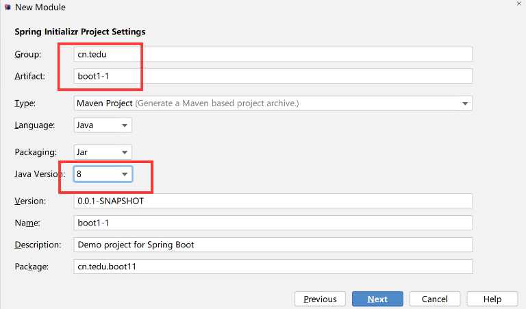

3. 下一步 选择Web->Spring Web 作用是引入Tomcat容器

4. 下一步直到Finish

5. 创建完工程后 检查 Build里面是否显示绿色对钩

   1

6. 如果创建完工程后在Build里面显示错误提示, 进入到maven面板点击刷新,如果问题没有解决删除C盘用户目录下的.m2文件夹下的repository文件夹后 再来刷新,反复操作直到能成功.

### 静态资源和动态资源

- 任何客户端任何时间请求到的内容都是不变的内容称为静态资源
- 请求到的内容会根据不同的用户不同的时间得到不同的数据,这种属于动态资源

### 端口被占用解决方案


1. 检查是否是之前的工程没有停止导致,如果是先关闭之前工程即可 90%

2. 电脑上某个软件占用了8080端口, 修改工程的端口号, 找到工程的application.properties配置文件 添加以下内容: server.port=xxxx

   

3. 重启电脑也可以解决端口被占用


## SpringBoot始发

### 1、如何处理动态请求?

1. 创建controller包以及HelloController.java , controller包一定要创建在cn.tedu.工程名包 的下面

   

2. 使用SpringMVC框架中提供的@Controller注解和@RequestMapping注解修饰Controller类以及Controller中的方法, 作用和传奇老师WebServer工程中注解的作用一样 

   ```java
   @Controller
   public class HelloController {
   
       //http://localhost:8080/hello
       // 当客户端向此地址发请求时下面的hello方法会执行
       @RequestMapping("/hello")
       public void hello(HttpServletResponse response) throws IOException {
           System.out.println("接收到了请求!");
           //设置相应类型 告诉客户端响应的内容为什么类型
           response.setContentType("text/html;charset=utf-8");
           //得到输出对象 异常抛出
           PrintWriter pw = response.getWriter();
           //输出数据
           pw.println("<h1>恭喜你!测试成功!</h1>");
           //关闭资源
           pw.close();
   
       }
   }
   ```


### 2、客户端发出请求的几种方式

1. 在浏览器地址栏中输入请求地址 发出请求 
2. 在html页面中通过超链接发出请求
   - 相对路径: 实际请求路径跟页面所处位置有关系
   - 绝对路径: 和页面所处位置没有关系
3. 在html页面中通过form表单发出请求
4. 通过前端框架发出异步请求.


### 3、服务器端获取参数的几种方式

1. **通过HttpServletRequest对象获取**

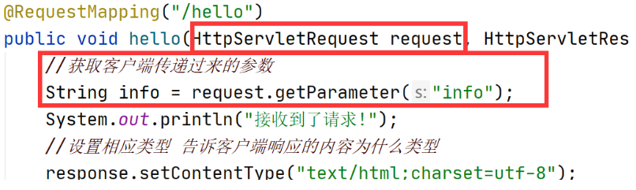


2. **通过在处理请求的方法中直接声明的方式获取参数**（注意参数名要和html文件中的标签name相同）,此种写法支持类型自动转换

   `@ResponseBody`这个注解就可以直接以返回值的形式给客户端发送数据，就不需要使用response进行回应

1

​		为什么说支持类型自动转换，如下图`int age`，在login.html文件中，所有的输入的数据都是文本类型，这里直接写`int age`就可以直接自动转换


​		


3. **通过自定义对象的方式接受参数**

   

   ```java
   package cn.tedu.boot21.entity;
   
   public class User {
       /*注意：实体类中的属性名一定要和emp.html中name一致，这是查找的依据*/
       private String username;
       private String password;
   
       public String getUsername() {
           return username;
       }
   
       public void setUsername(String username) {
           this.username = username;
       }
   
       public String getPassword() {
           return password;
       }
   
       public void setPassword(String password) {
           this.password = password;
       }
   
       @Override
       public String toString() {
           return "User{" +
                   "username='" + username + '\'' +
                   ", password='" + password + '\'' +
                   '}';
       }
   }
   ```

   

   

   

### 小问题

每次在工程中添加新的静态资源文件时 点击idea中的Build->ReBuild 重新编译, 因为idea有时会丢掉新增的文件进行编译, 导致找不到资源 , 重新编译完之后 还需要重新启动工程.


### SpringBoot一个完整运用

#### 1）创建工程

在工程项目中创建一个新模块，选择Spring Initializr。成功创建后需要一段时间下载所有的包和依赖


#### 2）pom.xml中添加数据库所需依赖


```xml
<!-- 连接MySQL数据库的依赖 --><!--后面使用mybatis框架就不需要这两个依赖，因为框架会自动导入-->
<dependency>
    <groupId>mysql</groupId>
    <artifactId>mysql-connector-java</artifactId>
    <version>8.0.15</version>
</dependency>
<!-- 数据库连接池 -->
<dependency>
    <groupId>com.alibaba</groupId>
    <artifactId>druid</artifactId>
    <version>1.1.21</version>
</dependency>
```

注意：点击Maven的刷新


#### 3）实现注册业务

##### 3.1）前提要求

- 数据库中的empdb库创建了user表，用于存储信息，结构如下


- 框架中写一个util工具包，包中DBUtils类用于与数据库进行连接。暂时这么使用，后期框架中会自动根据SQL语句生成


```java
package cn.tedu.boot22.utils;

import com.alibaba.druid.pool.DruidDataSource;
import java.sql.Connection;
import java.sql.SQLException;
/**
 * 封装工具类
 * @author Akio
 * @Create 2021/8/31 10:20
 */
public class DBUtils {
    private static DruidDataSource ds;
    static{
        //创建连接池对象
        ds = new DruidDataSource();
        //设置数据库连接信息
        ds.setUrl("jdbc:mysql://localhost:3306/empdb?characterEncoding=utf8&serverTimezone=Asia/Shanghai");
        ds.setUsername("root");
        ds.setPassword("root");
        //设置初始连接数量
        ds.setInitialSize(3);
        //设置最大连接数量
        ds.setMaxActive(5);
    }
    
    //把获取连接的代码封装
    public static Connection getConn() throws SQLException {
        //从连接池对象中获取连接
        Connection conn = ds.getConnection();
        return conn;
    }
}
```


##### 3.2）正式操作

- 在static包中创建静态资源页面reg.html

  

  ```html
  <!DOCTYPE html>
  <html lang="en">
  <head>
      <meta charset="UTF-8">
      <title>注册页面</title>
  </head>
  <body>
  <h1>注册页面</h1><!--这里输入框所有的name一定要和entity中的User属性名相同，两者息息相关-->
  <form action="/reg"><!--/reg对应着UserController中的注解@RequestMapping("/reg")-->
      <input type="text" name="username" placeholder="用户名"><br>
      <input type="text" name="password" placeholder="密码"><br>
      <input type="text" name="nick" placeholder="昵称"><br>
      <input type="text" name="age" placeholder="年龄"><br>
      <input type="submit" value="注册">
  </form>
  </body>
  </html>
  ```

  

- 创建entity包，其中创建User实体类

  

  ```java
  package cn.tedu.boot22.entity;
  
  public class User {
      /*注意：这几个属性名一定要和html页面中的name相同*/
      private String username;
      private String password;
      private String nick;
      private int age;
  
      public String getUsername() {
          return username;
      }
  
      public void setUsername(String username) {
          this.username = username;
      }
  
      public String getPassword() {
          return password;
      }
  
      public void setPassword(String password) {
          this.password = password;
      }
  
      public String getNick() {
          return nick;
      }
  
      public void setNick(String nick) {
          this.nick = nick;
      }
  
      public int getAge() {
          return age;
      }
  
      public void setAge(int age) {
          this.age = age;
      }
  
      @Override
      public String toString() {
          return "User{" +
                  "username='" + username + '\'' +
                  ", password='" + password + '\'' +
                  ", nick='" + nick + '\'' +
                  ", age=" + age +
                  '}';
      }
  }
  ```


- 创建controller包，其中创建UserController类用于处理所有关于用户信息的操作

  

  ```java
  package cn.tedu.boot22.controller;
  
  import cn.tedu.boot22.entity.User;
  import cn.tedu.boot22.utils.DBUtils;
  import org.springframework.stereotype.Controller;
  import org.springframework.web.bind.annotation.RequestMapping;
  import org.springframework.web.bind.annotation.ResponseBody;
  
  import java.sql.Connection;
  import java.sql.PreparedStatement;
  import java.sql.ResultSet;
  import java.sql.SQLException;
  
  @Controller //-----这些注解一定不能掉，这是框架查找对应功能的关键
  public class UserController {
      //处理注册
      @RequestMapping("/reg")
      @ResponseBody   //这个注解就可以直接以返回值的形式给客户端发送数据，直接响应到页面
      public String reg(User user){//方法名称可以与reg不同
          System.out.println("user = " + user);
          try (Connection conn = DBUtils.getConn()){
              String sql = "insert into user values(null,?,?,?,?)";
              PreparedStatement psta = conn.prepareStatement(sql);
              psta.setString(1,user.getUsername());
              psta.setString(2,user.getPassword());
              psta.setString(3,user.getNick());
              psta.setInt(4,user.getAge());
              int i = psta.executeUpdate();
              System.out.println("i = " + i);
              if (i>0){
                  return "注册成功";
              }else{
                  return "注册失败";
              }
          } catch (SQLException throwables) {
              throwables.printStackTrace();
          }
          return "";
      }
  
      //处理登陆
      @RequestMapping("/login")
      @ResponseBody
      public String login(User user){
          try (Connection conn = DBUtils.getConn()){
              String sql = "select count(*) from user where username=? and password=?";
              PreparedStatement psta = conn.prepareStatement(sql);
              psta.setString(1,user.getUsername());
              psta.setString(2,user.getPassword());
              ResultSet rs = psta.executeQuery();
              rs.next();
              if (rs.getInt(1) > 0){
                  return "登陆成功";
              } else {
                  return "登陆失败<a href='/login.html'>重新登陆</a>";
              }
          } catch (SQLException throwables) {
              throwables.printStackTrace();
          }
          return "登陆失败<a href='/login.html'>重新登陆</a>";
      }
  }
  
  ```

  

  

  

  

  

  

  #### 4）实现动态展示user中的数据

  前端中：

  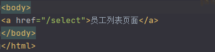

  后端中：依旧是在UserController中添加用户展示方法

  ```java
  package cn.tedu.boot22.controller;
  
  import cn.tedu.boot22.entity.User;
  import cn.tedu.boot22.utils.DBUtils;
  import org.springframework.stereotype.Controller;
  import org.springframework.web.bind.annotation.RequestMapping;
  import org.springframework.web.bind.annotation.ResponseBody;
  
  import java.sql.*;
  
  @Controller
  public class UserController {
      @RequestMapping("/select")
      @ResponseBody
      public String select(User user){
          String html="<table border=1>";
          html+="<caption>用户列表</caption>";
          html+="<tr><th>id</th><th>名字</th><th>密码</th></tr>";
          //获取连接查询数据，后面会直接把所有的数据存入到一个ArrayList集合中
          try (Connection conn = DBUtils.getConn()){
              String sql = "select * from user";
              Statement s = conn.createStatement();
              ResultSet rs = s.executeQuery(sql);
              while(rs.next()){
                  int id = rs.getInt(1);
                  String username= rs.getString(2);
                  String password = rs.getString(3);
                  html+="<tr>";
                  html+="<td>"+id+"</td>";
                  html+="<td>"+username+"</td>";
                  html+="<td>"+password+"</td>";
                  html+="</tr>";
              }
          } catch (SQLException throwables) {
              throwables.printStackTrace();
          }
          html+="</table>";
          return html;
      }
  }
  ```

  

  

  


### 员工管理系统案例


#### **前提操作**

1. 创建工程boot3-1, 11改8 , SpringWeb 打钩,在pom.xml中添加mysql和数据库连接池这两个依赖

2. 创建一个员工表

   ```sql
   create table newemp(id int primary key auto_increment,name varchar(20),job varchar(20),sal int);
   ```

3. 添加数据库连接的DBUtils工具类

   ```java
   package cn.tedu.boot31.utils;
   
   import com.alibaba.druid.pool.DruidDataSource;
   import java.sql.Connection;
   import java.sql.SQLException;
   
   /**
    * @author Akio
    * @create 2021/9/1 18:17
    */
   public class DBUtils {
       private static DruidDataSource ds;
       static{
           //创建连接池对象
           ds = new DruidDataSource();
           //设置数据库连接信息
           ds.setUrl("jdbc:mysql://localhost:3306/empdb?characterEncoding=utf8&serverTimezone=Asia/Shanghai");
           ds.setUsername("root");
           ds.setPassword("root");
           //设置初始连接数量
           ds.setInitialSize(3);
           //设置最大连接数量
           ds.setMaxActive(5);
       }
   
       //将获取连接的代码封装
       public static Connection getConn() throws SQLException {
           //从连接池对象中获取连接
           Connection conn = ds.getConnection();
           return conn;
       }
   }
   ```

   

4. static里面创建index.html页面

   ```html
   <!DOCTYPE html>
   <html lang="en">
   <head>
       <meta charset="UTF-8">
       <title>Title</title>
   </head>
   <body>
   <h1>员工管理系统首页</h1>
   <a href="/add.html">添加员工</a>
   <a href="/select">员工列表</a>
   <a href="/update.html">修改员工</a>
   
   </body>
   </html>
   ```


#### @RestController注解

此注解相当于在每一个处理请求的方法上面都添加一个@Responsebody,
使用此注解后,每个方法都可以通过返回值的方式给客户端响应数据

#### **添加员工**

1. 创建add.html页面 里面添加form表单 提交地址为/add

   ```javascript
   JavaScript中
   history.back()回到上一页面，不会刷新页面
   history.go(int n) n可以为正负值，前进或后退n页面，不会刷新页面 
   ```

   ```java
   <!DOCTYPE html>
   <html lang="en">
   <head>
       <meta charset="UTF-8">
       <title>添加员工</title>
   </head>
   <body>
   <h1>添加员工页面</h1>
   <a href="javascript:history.back()">回到首页</a>
   <form action="/add">
       <input type="text" name="name" placeholder="员工姓名">
       <input type="text" name="job" placeholder="员工工作">
       <input type="text" name="sal" placeholder="员工工资">
       <input type="submit" value="添加">
   </form>
   </body>
   </html>
   ```

   

2. 创建entity.Emp实体类并提供各种方法

   ```java
   package cn.tedu.boot31.entity;
   
   /**
    * @author Akio
    * @create 2021/9/2 9:27
    */
   public class Emp {
       /*一般和数据库相关主键id的都推荐使用包装类型*/
       private Integer id;//如果是int，默认值0；Integer默认值是null
       private String name;
       private String job;
       private int sal;
   
       public Emp() {
       }
   
       public Emp(Integer id, String name, String job, int sal) {
           this.id = id;
           this.name = name;
           this.job = job;
           this.sal = sal;
       }
   
       public Integer getId() {
           return id;
       }
   
       public void setId(Integer id) {
           this.id = id;
       }
   
       public String getName() {
           return name;
       }
   
       public void setName(String name) {
           this.name = name;
       }
   
       public String getJob() {
           return job;
       }
   
       public void setJob(String job) {
           this.job = job;
       }
   
       public int getSal() {
           return sal;
       }
   
       public void setSal(int sal) {
           this.sal = sal;
       }
   
       @Override
       public String toString() {
           return "Emp{" +
                   "id=" + id +
                   ", name='" + name + '\'' +
                   ", job='" + job + '\'' +
                   ", sal=" + sal +
                   '}';
       }
   }
   ```

   

3. 创建controller.EmpController,并添加add方法处理/add请求。在EmpController的add方法参数列表处把接受到的参数封装到Emp对象中, 在方法体将对象中的数据通过jdbc代码把数据保存到newemp表中

   ```java
   package cn.tedu.boot31.controller;
   
   import cn.tedu.boot31.entity.Emp;
   import cn.tedu.boot31.utils.DBUtils;
   import org.springframework.stereotype.Controller;
   import org.springframework.web.bind.annotation.RequestMapping;
   import org.springframework.web.bind.annotation.ResponseBody;
   
   import javax.servlet.http.HttpServletResponse;
   import java.io.IOException;
   import java.sql.*;
   import java.util.ArrayList;
   
   /**
    * @author Akio
    * @create 2021/9/2 9:23
    */
   //@Controller
   @RestController //相当于每个处理请求的方法上面都添加有一个@Responsebody注解
   public class EmpController {
       @RequestMapping("/add")
       //@ResponseBody //以返回值的方式给客户端相应数据
       public String add(Emp emp) {
           System.out.println("emp = " + emp);
           //获取连接
           try (Connection conn = DBUtils.getConn()) {
               //准备插入数据的SQL语句
               String sql = "insert into newemp values(null,?,?,?)";
               //因为有变量， 创建预编译的对象执行SQL
               PreparedStatement psta = conn.prepareStatement(sql);
               psta.setString(1, emp.getName());
               psta.setString(2, emp.getJob());
               psta.setInt(3, emp.getSal());
               //执行SQL语句
               psta.executeUpdate();
   
           } catch (SQLException throwables) {
               throwables.printStackTrace();
           }
           return "添加完成!<a href='javascript:history.go(-2)'>回到首页</a>";
       }
   }
   ```

   

#### **查询员工**

1. 在EmpController中添加select方法处理/select请求, 在方法中创建一个ArrayList集合，把jdbc代码查询到的数据先封装到Emp对象中,再把对象装进list集合中 , 然后遍历集合把数据装进html标签中 最后返回给客户端

   ```java
    @RequestMapping("/select")
       //@ResponseBody
       public String select() {
           //创建一个集合用来装查询到的员工信息
           ArrayList<Emp> list = new ArrayList<>();
           //获取连接
           try (Connection conn = DBUtils.getConn()) {
               String sql = "select * from newemp";
               Statement s = conn.createStatement();
               ResultSet rs = s.executeQuery(sql);
               while (rs.next()) {
                   int id = rs.getInt(1);
                   String name = rs.getString(2);
                   String job = rs.getString(3);
                   int sal = rs.getInt(4);
                   //将查询到的数据装到emp对象中
                   Emp emp = new Emp(id, name, job, sal);
                   list.add(emp);
               }
           } catch (SQLException throwables) {
               throwables.printStackTrace();
           }
   
           String html = "<table border=1>";
           html += "<tr><th>id</th><th>名字</th><th>工作</th><th>工资</th><th>操作</th></tr>";
           //遍历员工对象
           for (Emp e : list) {
               html += "<tr>";
               html += "<td>" + e.getId() + "</td>";
               html += "<td>" + e.getName() + "</td>";
               html += "<td>" + e.getJob() + "</td>";
               html += "<td>" + e.getSal() + "</td>";
               html += "<td><a href='/delete?id="+e.getId()+"'>删除</a></td>";
               html += "</tr>";
           }
           html += "</table>";
           html+="<br><a href='/index.html'>回到首页</a>";
           return html;
       }
   ```


#### 删除员工

```java
//添加处理删除请求的方法,这里接触重定向的知识
    @RequestMapping("/delete")
    public void delete(int id, HttpServletResponse response) throws IOException {
        try (Connection conn = DBUtils.getConn()){
            String sql = "delete from newemp where id=?";
            PreparedStatement psta = conn.prepareStatement(sql);
            psta.setInt(1,id);
            psta.executeUpdate();
        } catch (SQLException throwables) {
            throwables.printStackTrace();
        }
        //重定向
        /*执行流程：服务器会向客户端浏览器返回一个302状态码和一个地址
        *   浏览器接收到302后会立即向指定的地址再次发出请求*/
        response.sendRedirect("/select");
    }
```


#### 修改员工

```html
<!DOCTYPE html>
<html lang="en">
<head>
    <meta charset="UTF-8">
    <title>Title</title>
</head>
<body>
<h1>修改员工页面</h1>
<form action="/update">
    <input type="text" name="id" placeholder="请输入员工id">
    <input type="text" name="name" placeholder="名字">
    <input type="text" name="job" placeholder="工作">
    <input type="text" name="sal" placeholder="工资">
    <input type="submit" value="修改">
</form>
</body>
</html>
```


```java
//修改信息，这个并不是很完善，以后会更进
    @RequestMapping("/update")
    public void update(Emp emp, HttpServletResponse response) throws IOException {
        try (Connection conn = DBUtils.getConn()){
            String sql = "update newemp set name=?,job=?,sal=? where id=?";
            PreparedStatement psta = conn.prepareStatement(sql);
            psta.setString(1,emp.getName());
            psta.setString(2,emp.getJob());
            psta.setInt(3,emp.getSal());
            psta.setInt(4,emp.getId());
            psta.executeUpdate();
        } catch (SQLException throwables) {
            throwables.printStackTrace();
        }
        //重定向到列表页面
        response.sendRedirect("/select");
    }
```


## MyBatis框架

此框架是目前最流行的数据持久化框架使用此框架可以完全免去JDBC代
码操作数据(本质上就是把DBC代码进行了封装),只需要通过xml配置文件
或注解就可以对数据进行增删改査操作


### 如何使用Mybatis框架

1、创建SpringBoot框架的时候，多添加两个框架MyBatis Framework和MySQL Driver


2、创建完包含MyBatis框架的工程时,必须配置数据库的连接信息，否则工程启动不了。即在 `application.properties`配置文件中添加以下代码    *打sdu,sdp就能快捷呼出*


```properties
spring.datasource.url=jdbc:mysql://localhost:3306/empdb?characterEncoding=utf8&serverTimezone=Asia/Shanghai
spring.datasource.username=root
spring.datasource.password=root
```


3、使用MyBatis框架必须创建一个映射，用于建立entity实体类中的属性名和前端页面中的name之间的链接

看一下结构


在这之前先创建一个实体类Emp

```java
package cn.tedu.boot32.entity;

/**
 * @author Akio
 * @create 2021/9/2 14:24
 */
public class Emp {
    private Integer id;
    private String name;
    private String job;
    private int sal;

    public Emp() {
    }

    public Emp(Integer id, String name, String job, int sal) {
        this.id = id;
        this.name = name;
        this.job = job;
        this.sal = sal;
    }

    @Override
    public String toString() {
        return "Emp{" +
                "id=" + id +
                ", name='" + name + '\'' +
                ", job='" + job + '\'' +
                ", sal=" + sal +
                '}';
    }

	所有的getter、setter方法
}
```

然后新建一个包mapper存放所有Mybatis框架所需要的映射，然后新建一个EmpMapper**接口**，mapper主要用于与数据库进行交互

```java
package cn.tedu.boot32.mapper;

import cn.tedu.boot32.entity.Emp;
import org.apache.ibatis.annotations.Insert;
import org.apache.ibatis.annotations.Mapper;

/**
 * 使用Mybatis必须创建映射
 * 映射接口
 * @author Akio
 * @create 2021/9/2 14:27
 */
@Mapper//
public interface EmpMapper {//写数据库的东西一定都是接口

    //声明插入数据的方法
    /*
        MyBatis框架会根据这个抽象方法和注解的内容帮助我们生成一个实例化的对象
        在对象中添加了方法的实现类，这个实现类里面的代码就是之前所写的JDBC代码。
     */
    //#{属性名} 会自动从下面方法的参数列表中查询对应名称的变量，如果没有找到会去找对象里面的属性
    @Insert("insert into newemp values(null,#{name},#{job},#{sal})")
    void insert(Emp emp);
    
    //声明查询数据的方法,会自动把数据装到对象里，把对象装到集合里
    @Select("select * from newemp")
    List<Emp> select();

    @Update("update newemp set name=#{name},job=#{job},sal=#{sal} where id=#{id}")
    void update(Emp emp);

    @Delete("delete from newemp where id=#{id}")
    void delete(int id);
}
```


### @Autowired和@Resource注解的区别和联系

https://blog.csdn.net/qq_45590494/article/details/114444371


### 如何测试

在test文件夹下，我们可以操作这个类，利用@Test单元测试去测试我们上面的操作是否能正常运行


```java
package cn.tedu.boot32;
import ...
@SpringBootTest
class Boot32ApplicationTests {
    /*
        @Autowired自动装配注解，是Spring框架提供的注解
        通过此注解，Spring框架会结合MyBatis框架生成一个
        Mapper接口的实现类并且实例化出一个对象
     */
    //下面mapper会报错是误提示，跟idea有关系，(required = false)可以提醒idea这个不是必须的，可以忽略
    @Autowired(required = false)
    EmpMapper empMapper;

    @Test
    void insert(){
        System.out.println("插入成功");
        Emp emp = new Emp(null,"潘刚","经理",20000);
        //调用插入数据方法
        empMapper.insert(emp);
    }
    
    @Test
    void selectEmp(){
        List<Emp> list = empMapper.select();
        System.out.println(list);
    }

    @Test
    void updateEmp(){
        Emp emp = new Emp(7,"易强","导演",200000);
        empMapper.update(emp);
    }

    @Test
    void deleteEmp(){
        empMapper.delete(7);
    }
}
```


执行insert()

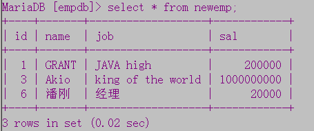

执行selectEmp()


执行updateEmp()


执行deleteEmp()


### 如何结合页面

前提，以下内容已存在


上面的操作仅仅是在控制台测试了，现在我们来进行和前端页面的结合

首先在statics静态资源目录下创建前端页面


然后项目目录下创建controller，在其中创建EmpController类，实现关于英雄的操作


## 后端MVC


M : model 模型, 指开发过程中数据库相关的代码,也就是对应Mapper部分

V : View 视图 , 指开发过程中 前端页面部分

C : Controller控制器, 指开发过程中 Controller部分代码

**实现任何一个业务功能都是由这三部分组成**


### 同步和异步

- 同步: 指单线程依次做几件事 

- 异步: 指多线程同时做几件事 

- 同步请求: 客户端浏览器,只有一个主线程, 主线程负责渲染页面和监听用户的操作,当需要发出请求时,会停止渲染页面(页面清空,原来内容就没了),主线程从服务器获取到数据之后,将得到的数据再次渲染出来, 这样的话同步请求只能实现页面的整体刷新,无法实现局部刷新

- 异步请求: 客户端主线程会一直负责渲染页面相关工作, 由单独的子线程发出请求获取数据, 子线程得到数据后就可以在原页面基础上做出改动,这样就实现了页面的局部刷新. 如下图的效果

  

  

### 如何发出异步请求

- 异步请求是从html页面中通过axios框架发出.

  - 前端页面导入axios框架

    ```html
    <script src="https://cdn.bootcdn.net/ajax/libs/axios/0.21.1/axios.min.js"></script>
    ```

  - 发出异步get请求

    

    静态资源页面axios01.html

    

    HelloController

    

    效果：

    

  - 发出异步post请求，如果需要用到FormData，使用post请求，否则get请求

    

    静态资源页面axios02.html

    

    HelloController

    

    效果：

    


### 代码模版制作


### 操作小案例

#### 登陆和注册

- 案例结构

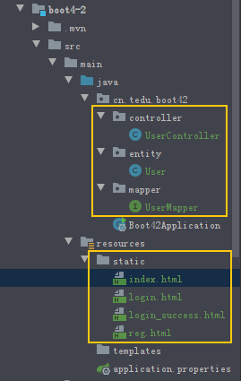

- 案例技术栈：SpringBoot+Mybatis+Vue 

- 主要代码：

  **reg.html**


​	**login.html**


​	**UserMapper.java**


​	**UserController.java**


- 运行流程讲解

  

- 效果展示

  


#### 知识点：JSON

- JSON是一种轻量级数据交换格式(也叫数据封装格式)

  ```java
  Java基础  300    50
  水浒传    1000   200
      
  XML格式封装以上数据:
  <books>
      <book>
      	<name>Java基础</name>
          <page>300</page>
          <price>50</price>
      </book>
      <book>
      	<name>水浒传</name>
          <page>1000</page>
          <price>200</price>
      </book>
  </books>
      
  JSON格式封装上面的数据:
  [{"name":"Java基础","page":300,"price":50},{"name":"水浒传","page":1000,"price":200}]
  
  显而易见，JSON格式封装数据更简洁，更方便传输
  ```

- 为什么使用JSON?

  当客户端和服务器之间进行复杂数据传输时, 需要将数据装进一个特定的格式中, 便于彼此识别传输过来的数据. JSON相比较XML更轻量级(数据量更小)所以使用的场景会更广.例如接下来的用户列表展示操作，就是需要将数据库中的数据通过Controller传到Vue框架中

- 服务器在给客户端响应数据时 如果Controller中添加的注解是@RestController, <u>当处理请求的方法返回值为集合或对象时,SpringMVC框架会自动将返回的集合或对象里面的数据装进JSON格式的字符串中</u>,然后将字符串响应给客户端, 客户端接收到JSON字符串后axios框架会自动再将JSON字符串转成数组或对象

  

  


#### 用户列表展示

要求，一加载页面就要显示数据库中取出来的数据，这就需要用到vue中created钩子函数或mounted钩子函数

https://blog.csdn.net/xdnloveme/article/details/78035065  created与mounted的区别

**list.html**

以下使用了created钩子函数，若要使用mounted函数也是一样的


**UserController.java中添加**


**UserMapper.java中添加**


**效果展示**


#### 修改用户数据

首先需要在list.html中添加跳转链接，如下图

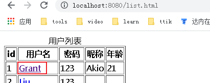


`:href="'/update.html?id='+u.id"`可以达到携带值的效果，同时也可以使用调用方法的形式，如下图

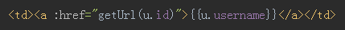


然后新建一个update.html页面


```html
注意：对于获取地址栏携带过来的参数，上图中的方法显然太low，下面介绍一种高级全面点的
<script>
    let v = new Vue({
        el:"form",
        data:{
            user:{}
        },
        methods:{
            update:function () {
                let formData = new FormData(document.querySelector("form"));
                axios.post("/update",formData).then(function (response) {
                    alert("修改完成");
                    location.href="/list.html";
                })
            },
            //获取地址栏传入的参数--------
            getUrlKey: function (name) {
                return decodeURIComponent((new RegExp('[?|&]' + name + '=' + '([^&;]+?)(&|#|;|$)').exec(location.href) || [, ""])[1].replace(/\+/g, '%20')) || null
            }
        },
        created:function () {
            let idValue = this.getUrlKey("id");
            //发出异步请求
            axios.get("/selectById?",{params:{id:idValue}}).then(function (response) {
                v.user = response.data;
            })
        }
    })
</script>
```


**UserMapper**中添加


**UserController**中添加


**效果**


### 前后端分离

- 前后端分离可以让后端程序员不考虑前端到底是浏览器客户端还是手机客户端,一视同仁,返回的内容只有数据, 同步请求返回的是html+数据, 异步请求才是只获取数据的请求, 所以考虑要实现前后端分离,以后客户端发出的所有请求全部为异步请求.


### 文件上传案例

#### 设置静态资源文件夹

在开始案例之前先设置设置静态资源文件夹，我们都知道，在一个SpringBoot项目中，是将static文件夹设定为静态资源文件夹，通过静态资源文件夹，我们可以直接访问静态资源文件夹下的内容


但在我们接下来的案例中我们需要将D:/upload设置为静态资源文件夹，将所有上传的图片都放到其中，同时也要确认能浏览器地址栏也能直接访问到该文件夹下的资源，其实只需要修改配置文件


然后磁盘上的upload也能起到和statis文件夹一样的作用，也可以直接在地址栏上输入访问文件


#### 案例实操：图片上传

需求：上传文件到具体文件夹，上传后展示在当前页

工程结构：


**upload.html**

注意：上传文件必须设置编码类型


此时需要注意：如果上传的时候不选择文件直接点击上传，就会报错


如何解决这个问题呢？

可以通过这个form表单获取到的图片数据，根据其name的不同去判断是否发送了文件


修改代码后


**SendController.java**

注意：使用`MultipartFile`类型去接受传输过来的文件


默认情况下单文件只允许1MB以内，但是我们可以通过配置文件修改


**效果**


### 微博小案例

#### 处理登陆注册业务

**业务要求：**

注册、登陆、登录后使用session保持登陆

**数据库设计：**


**项目结构设计：**


**配置文件内容：**


**User.java实体类**


**index.html**

这个页面中可以根据用户是否登陆去展示不同的功能


**reg.html**


**login.html**


**UserMapper.java**


##### Session会话

- 在服务器端针对于每一个客户端会创建一个Session对象,此对象保存在内存中,重启程序或关闭程序Session则销毁. 

- Session是如何记住登录的信息的?

  客户端第一次发出登录请求时, 登录成功的时候往Session会话对象里面存了一个user对象(登录成功时从数据库中查询到的user对象),当此客户端再次访问服务器时,可以从会话对象中查看是否有user对象, 有 说明当前客户端登陆过,而且取出来的user对象里面装的信息就是该客户端登录的用户信息,如果会话对象中没有user对象说明此客户端没有登录过.

**UserController.java**


**效果：**


#### 处理发表文章和展示文章

**需求：**

用户没有登陆是不能发表文章的，即使直接去send.html页面也会被驳回到登录页面，但未登陆也可以看微博文章，登入后可发表，也可查看自己的文章，对自己的文章进行删除操作。

**数据库：**


**项目结构：**


**index.html**


上面这个页面要非常注意，因为在JSON中会将null转变成空字符串，所以这里根本收不到null，所以要进行三目判断


**send.html**


**myweibo.html**


**Weibo.java**


**WeiboMapper.java**


**WeiboController.java**


**效果展示**


### VRD项目

这个项目的首页展示如下图，我会介绍其中一些比较新颖的点


配置文件：


#### 元素展示


对于这个导航栏的数据是从数据库中读取动态生成的


种类表结构


在index.html页面中引入vue和axios框架，并引入header.js文件，这个文件是通过vue和axios框架取数据的操作


header.js文件，el的作用范围在  class='container' 的标签范围内


CategoryMapper.java


CategoryController.java


index.html对Vue和axios框架中数据的提取使用


同样：对于轮播图的展示


在index.html页面中将数据遍历展示处理


#### 会话管理

- 为什么使用会话管理?

  客户端和服务器之间进行数据通讯遵循的是HTTP协议,而此协议属于无状态协议(一次请求对应一次响应,响应完则断开连接),服务器是无法跟踪客户端请求的, 但是某些具体的业务是需要服务器能够识别客户端的, 会话管理相关知识就是解决此问题, 通过Cookie技术可以让服务器给客户端添加一个标示, 响应完之后,客户端之后每次发请求都会带着这个标示,从而能够让服务器识别此客户端, 但是这种方案数据是保存在客户端的,存在被篡改的风险,Session的出现就是为了安全性的问题, 因为使用Session数据是保存在服务器端,不存在被篡改的可能.

#### Cookie和Session区别

- Cookie:类似于打孔式的会员卡, 数据保存在客户端
  - 保存时间: 默认保存在浏览器的内存中, 会话结束时浏览器会清除掉, 可以修改成任意时间,如果修改了保存时间,数据会保存到磁盘中,时间到了之后才会清除.
  - 使用Cookie只能保存字符串类型的数据
  - 应用场景:记住用户名和密码
- Session: 类似于银行卡, id保存在客户端, 数据保存在服务器
  - 保存时间: 数据是保存在服务器的内存中,默认保存半个小时左右时间, 而且重启程序或关闭程序都会清除.
  - Session可以保存任意对象类型的数据.
  - 应用场景:记住登录状态


#### 排错步骤

1. 出错后在浏览器里面先shift+f5确保运行的是最新的代码
2. 浏览器中F12看控制台报错
   1. 如果是错误码404,检查请求地址和控制器处理地址是否一致,idea中ReBuild然后重新运行工程确保运行的是最新的代码.
   2. 如果有错误码500,和页面部分代码基本没什么关系, 立马查看idea的控制台看报错,错误在提示信息的第一行中有提示


#### 如何根据时间生成文件夹分类存放图片

如果网站存放量巨大，我们需要将图片按照每天为一个分量来存储，如下图，每天上传的图片存放到当天对应的文件夹中


**send.html**


Controller.java文件中


#### 不能正常显示数据的小问题

数据库中的product表，因为在数据库中不区分大小写，所以需要使用下划线


但在其对应Product实体类中写的是驼峰法，java中推荐这么写


然后在Controller控制器中去处理获取所有product数据的业务时，将此转接到productMapper中的select方法


所以为了数据库中查询到的数据能够完整装到Product对象中，就需要使用@Result注解，将字段名和属性名绑定


#### Vue之Updated

```js
当Vue对象中的变量发生改变后执行的方法
let grid_v = new Vue({
    el:".grid",
    data:{
        p_arr:[]
    },
    created:function () {
        //获取所有作品信息
        axios.get("/product/select").then(function (response) {
            grid_v.p_arr = response.data;
        })
    },
    updated:function () {//当Vue对象中的变量发生改变后执行的方法，即created执行完毕,查询到所有数据并赋值给p_arr
        //对瀑布流进行初始化操作
        // $(".grid").masonry({
        //     itemSelector:".grid-item",//告诉瀑布流框架如何找到页面中瀑布流里面的元素
        //     columnWidth:210 //设置瀑布流每一列的宽度(图片200+10间距)
        // })
        // //图片加载完成事件
        // $(".grid").imagesLoaded().progress(function () {
        //     //图片加载完之后让瀑布流框架重新计算一下布局
        //     $(".grid").masonry("layout");
        // })

        $(".grid").imagesLoaded().progress(function () {
            //图片加载完之后让瀑布流框架重新计算一下布局
            $(".grid").masonry({
                itemSelector:".grid-item",
                columnWidth:210 //每一类宽度
            });
        })

        //图片加载完之后给图片添加鼠标移入移出事件
        $(".grid-item").hover(function () {//鼠标移入
            //$(this)得到触发事件的元素
            //.children()获取某个元素的子元素
            // fadeIn()淡入动画
            //stop() 在做新的的动画之前停掉原来的
            $(this).children("div").stop().fadeIn(500);
        },function () {//鼠标移出
            $(this).children("div").stop().fadeOut(500);
        })
    }
})
```

https://blog.csdn.net/sunhuaqiang1/article/details/103000580


#### SQL之concat函数

在Mapper接口中使用@Select注解，如何进行模糊查询


上图就会产生SQL语句的错误，可以通过SQL中的一个函数concat来实现


#### 文本框回车触发提交事件


如上图，我想通过回车来达到搜索的目的，可是地址栏变成了


这肯定就不正常，这是因为对文本框直接回车会触发表单的提交事件，就会产生上图这样的结果

那我们要怎么实现回车等同于点击搜索按钮的效果呢？

即禁止回车触发表单的提交事件，并且将“回车”按钮的按下绑定跟搜索按钮一样的事件


即可正确导向


#### 时间格式转换

http://momentjs.cn/ 此脚本可以提供对时间戳的自定义格式转换


注意：moment.min.js多一个min表示的是脚本是没有任何代码格式的（给计算机看的），变量名都是单个字母，体量更小，但和moment.js的功能没有任何区别，适用于生产运营环境。moment.js适用于开发环境


#### timestamp时间自动更新问题

- 在数据库中使用timestamp类型表达时间, 默认情况下, 当数据发生改变时此字段的时间也会自动改为当前系统时间

  

- 关闭自动更新: 在终端中执行以下代码 

  ```mysql
  alter table product change created created timestamp not null default current_timestamp;
  ```

- 打开自动更新:

  ```mysql
  alter table product change created created timestamp not null default current_timestamp on update current_timestamp;
  ```


#### 读取配置文件中的数据

配置文件中有如下数据

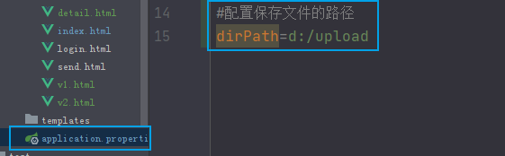

在SpringBoot框架中使用@Value注解即可


#### 删除文件

`new File("文件路径").delete();`


#### 过滤器Filter


- 过滤器和Servlet一样都是Web容器中的组件, 可以在客户端请求之前或之后触发某些代码, 在具体业务中可以将多个Servlet/Controller中重复执行的代码写在过滤器中,这样只需要写一遍即可, 从而提高开发效率。例如载入网站资源页面前进行用户登陆判断

  

**如何使用过滤器？**

- 创建Filter类

  

  

- 如果使用SpringBoot框架，在XXXApplication.java中添加一个注解

  

- Filter代码相关

  ```html
  urlPatterns匹配路径的几种方式:
  
  精确匹配: /send.html   /admin.html
  后缀匹配: *.jpg   *.png   *.html
  路径匹配: /banner/*   /product/*
  全部匹配: /*   匹配客户端发出的所有请求
  ```

  

  


#### VUE自定义模版组件

- 当项目中多个页面需要显示相同内容的时候, 可以将这部分的多个标签封装成一个自定义的组件, 从而提高开发效率

  

**如何自定义模版组件**

想把多个页面的导航栏提取出来，用于简化代码，这种时候就需要VUE的自定义一模板组件


下面来讲讲怎么使用


**v.js**

```javascript
//自定义模版组件，注意，模版一定要写在``中间
Vue.component('mydiv', {
    props: ["arr","fn"],
    template: `			
        <div><!--模版要求有且只有一个根元素-->
            <ul>
            <!--下面的arr不能直接访问Vue对象中的变量，所以需要通过props里面
                定义的变量进行有一个传值操作-->
                <li v-for="name in arr" @click="fn(name)">{{name}}</li>
            </ul>
        </div>
    `
})
let v = new Vue({
    el: "mydiv",//注意，这里的作用域要和自定义模版的相同
    data: {
        arr: ["刘备", "关羽", "张飞"]
    },
    methods:{
        fn:function (name) {
            alert(name);
        }
    }
})
```

**v1.html**

```java
<!DOCTYPE html>
<html lang="en">
<head>
    <meta charset="UTF-8">
    <title>Title</title>
</head>
<body>
<!--:arr对应自定义模板组件中props里面的arr
    等号后面的arr对应的是Vue对象中的arr变量-->
<mydiv :arr="arr" :fn="fn"></mydiv>

<!--引入vue框架-->
<script src="https://cdn.jsdelivr.net/npm/vue@2/dist/vue.js"></script>
<script src="js/v.js"></script>
</body>
</html>
```


## 项目峰会-cherry官网

资源需求：https://chartjs.bootcss.com/  图标插件

### 1、新建项目

作为项目发起人，选择新建new porject项目，不要选择版本控制项目，版本控制后面可以再加


注意，创建父项目时类型一定要选择Maven POM，只有创建子模块的时候才选择Maven Project


然后框架选择中，选择我们的三个起始框架


