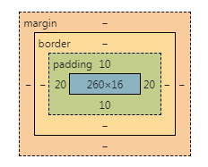
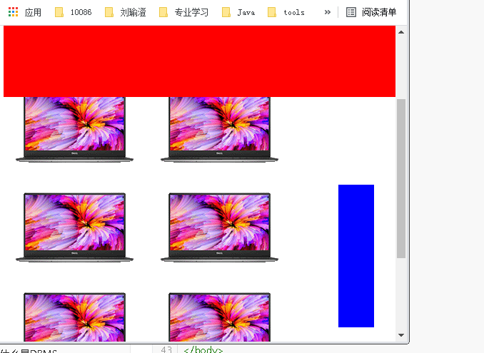
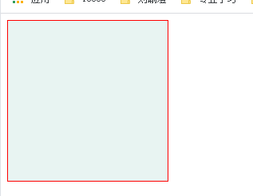
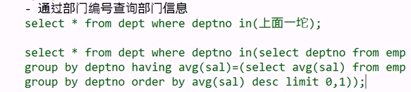
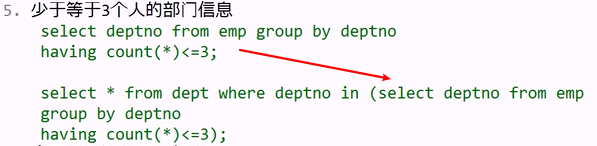
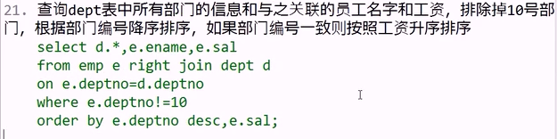
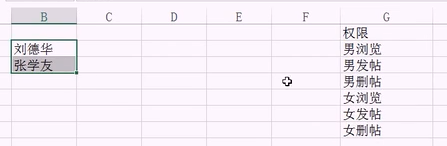
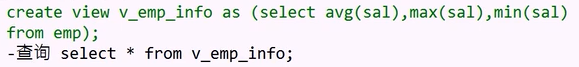

<h1 align="center">JavaWeb</h1>

[toc]

---

# 课程介绍

- WEB前端：如何搭建页面
- 数据库：学习如何对数据进行增删改查操作
- SpringBoot：学习如何接受请求，以及如何对请求做出响应
- VRD项目：将本阶段内容进行综合复习并产出项目

网站请求流程


---

# WEB前端

HTML	`HyperTextMarkupLanguage` 超文本标记语言

XML	可扩展标记语言

```xml
<books>
	<book>
    	<name>java</name>
        <page>1000</page>
    </book>
</books>
```


## HTML

### 1.文本相关标签

- ```txt
  <h1></h1>~<h6></h6>	内容标题
  特点：独占一行，字体加粗，自带上下间距
  ```

- ```
  <p></p>	段落标签
  特点：独占一行，自带上下间距,该间距为字体大小值
  ```

- ```
  <hr>	水平分割线
  ```

- ```
  <b></b>	加粗
  ```

- ```
  <i></i>	斜体
  ```

- ```
  <u></u>	下划线
  ```

- ```
  <s></s>	删除线
  ```

- ```
  <br>	换行
  ```


### 2.列表标签

- 无序列表`<ul><li></li></ul>`

  ```html
  <h3>无序列表</h3>
  <ul>
      <li>序1</li>
      <li>序2</li>
      <li>序3</li>
  </ul>
  ```

  

- 有序列表`<ol><li></li></ol>`

  ```html
  <h3>有序列表</h3>
  <ol>
      <li>序1</li>
      <li>序2</li>
      <li>序3</li>
  </ol>
  ```

  

- 列表嵌套

  ```html
  <h3>列表嵌套</h3>
  <ul>
      <li>番茄小说
          <ol>
              <li>奥特赘婿</li>
              <li>我在大唐腌咸菜</li>
          </ol>
      </li>
      <li>Stream
          <ol>
              <li>文字游戏</li>
              <li>小小梦魇</li>
          </ol>
      </li>
  </ul>1
  ```


### 3.图片标签img

``

- src：资源路径
  - 相对路径：访问站内资源时使用
    - 图片和页面同级目录： 直接写图片名
    - 图片在页面的上级目录： ../图片名
    - 图片在页面的下级目录： 文件夹名/图片名 
  - 绝对路径：可以访问站外资源 

- alt：图片资源找不到/不能正常显示的时显示的文本
- titile：鼠标悬停图片上的时显示的文本
- width/height：设置图片宽高，两种赋值方式：像素/百分百，如果设置宽度，高度会等比例缩放


### 4.超链接

`<a href="" >`

- href:资源路径，类似图片标签的src属性
- 页面内部跳转：在目的元素中添加id属性，href="#id"
- 图片超链接：用a标签包裹图片即为图片超链接
- 伪类型选择器（后面要学）：a:`link未访问/visited访问过/hover悬停/active点击{样式代码}`

```java
<body>
<a id="top" href="01文本相关.html">超链接1</a>
<a href="02列表标签.html">超链接2</a>
<a href="03个人简历练习.html">超链接3</a>
<hr>
<h1>番茄书架</h1>
...<br>...<br>...<br>...<br>...<br>...<br>...<br id="center">...<br>...<br>
...<br>...<br>...<br>...<br>...<br>...<br>...<br>...<br>...<br>
...<br>...<br>...<br>...<br>...<br>...<br>...<br>...<br>...<br>
...<br>...<br>...<br>...<br>...<br>...<br>...<br>...<br>...<br>
<a href="#top">回到顶部</a>   <a href="#center">去往中间</a>
</body>
```


### 5.表格标签table

- 相关标签：table表格	tr表示行	td表示列	th表头（加粗并居中）	caption表格标题
- 相关属性：border边框	colspan跨列	rowspan跨行


### 6.表单form

- 作用: 获取用户输入信息并提交给服务器 

- 学习form表单主要学习的就是form表单中有哪些控件

- 控件包括: 文本框,密码框,提交按钮, 单选,多选,下拉选,日期选择器,文件选择器等

- 各种控件:

  ```html
  <form action="http://www.baidu.com">
      <!--placeholder占位文本
      maxlength最大字符长度
      value默认值
      readonly 只读-->
  
      用户名:<input type="text" name="username"
                 placeholder="请输入用户名"
                 maxlength="5" value="xyz"
                 readonly="readonly"><br>
      
      密码:<input type="password" name="password"><br>
      
      <!--单选框 value设置提交内容 没写value提交则显示on checked默认选中-->
      <!--
  		<lable>为input元素定义标注(标记)
  		for属性可把lable绑定到另外一个元素，<lable>标签的for属性应当与相关元素的id属性相同
  	-->
      <!-- 注意：这里写了一个lable，for属性对应了前面这个单选按钮的id，所以点击lable中的这个男字也能选中单选框，扩大了点击范围 	-->
      性别: <input type="radio" name="gender" value="m" id="r1"><label for="r1">男</label>
      	<input type="radio" name="gender" checked value="w">女<br>
      
      <!-- 多选框  -->
      兴趣爱好: <input type="checkbox" name="hobby" value="cy">抽烟
      <input type="checkbox" name="hobby" checked value="hj">喝酒
      <input type="checkbox" name="hobby" value="tt">烫头<br>
      
      <!-- 日期选项卡 -->
      生日: <input type="date" name="birthday"><br>
      
      <!-- 上传文件 -->
      靓照: <input type="file" name="pic"><br>
      
      <!-- 下拉列表框 -->
      所在地:
      <select name="city">
          <option value="bj">北京</option>
          <option value="sh" selected>上海</option>
          <option value="gz">广州</option>
      </select><br>
      <input type="submit" value="注册">
      
      <!--重置按钮-->
      <input type="reset">
      
      <!--自定义按钮-->
      <input type="button" value="按钮">
      
      <!--通过button标签实现上面的效果-->
      <button type="submit">注册</button>
      <button type="reset">重置</button>
      <button type="button">按钮</button>
  </form>
  ```


### 7.分区标签

- 作用: 将多个有相关性的标签添加到一个分区标签里面, 便于统一管理 

- 如何分区? 

  - 一个页面至少分为三大区, 每个大的区域里面有n个小的区域

  ```html
  <div>头</div>
  <div>体</div>
  <div>脚</div>
  ```

- 有哪些分区标签?
  - div:块级分区元素, 特点:<u>独占一行</u> ,是使用频率最高的分区元素 
  - span: 行内分区元素, 特点: <u>共占一行</u> 
  - html5版本新增的分区标签, 作用和div是一样的(独占一行)
    - header 头
    - footer 脚 
    - section区域
    - article文章/正文 
    - nav 导航


## CSS样式

- 作用：用于美化页面


### 1.css的引入方式

- 如何在html页面中添加样式代码?

  - 内联样式：在标签的style属性中添加样式代码, 弊端: 不能复用
  - 内部样式：在head标签里面添加style标签,在标签体内添加样式代码,这种方式可以复用, 但是只能在当前页面复用
  - 外部样式： 在单独的css样式文件中写样式代码, 在html页面中通过link标签引入, 这种方式可以多页面复用,工作中使用最多

  ```css
  <!--my.css-->
  h3{
      color:green;
  }
  ```

  ```html
  <!DOCTYPE html>
  <html lang="en">
  <head>
      <meta charset="UTF-8">
      <title>css样式的引入</title>
      <style>
          /*通过选择器选择到元素，然后再添加样式*/
          /*标签名选择器，通过标签的名字选择元素*/
          h2{color:blue;}
      </style>
      <!--引入外部css文件-->
      <link rel="stylesheet" href="./my.css">
  </head>
  <body>
  <h1 style="color: red">内联样式1</h1>
  
  <h2>内部样式1</h2>
  
  <h3>外部样式2</h3>
  </body>
  </html>
  ```

  

  


### 2.选择器

- 作用: 用来找到页面中的某些元素, 找到后给元素添加样式

1. 标签名选择器

   - 格式: `标签名{样式代码}`

2. id选择器: 当需要选择页面中某一个元素时使用，其是唯一对应的

   - 格式: `#id{样式代码}`

   

3. class选择器: 当需要选择多个不相干元素时给元素添加相同的class 

   - 格式:`.class{样式代码}`

4. 分组选择器: 可以将多个选择器合并成一个选择器（都会有这个样式）

   - 格式: `div,#abc,.xyz{样式代码}`

5. 属性选择器: 通过元素的属性选择元素

   - 格式: `[属性名]{样式代码} [属性名="值"]{样式代码}`

6. 任意元素选择器

   - 格式: `*{样式代码}`

```html
<!DOCTYPE html>
<html lang="en">
<head>
    <meta charset="UTF-8">
    <title>选择器</title>
    <style>
        #myh1{color:red;}/*id选择器*/
        .c1{color:green;}/*class选择器*/
        #myh1,h3{background-color: yellow}/*分组选择器*/
        /*包含type属性的元素*/
        [type]{color: red}
        [type="text"]{background-color: pink}
        
        /*任意元素选择器*/
        *{
            /*边框:  粗细 实线边框 颜色*/
            border: 1px solid purple;
        }
    </style>
</head>
<body>
<input type="text"><br>
<input type="password">
<h1 id="myh1">张三</h1><!--id唯一-->
<h1 class="c1">王五</h1>
<h1>赵六</h1>
<div class="c1">div1</div>
<div>div2</div>
<div class="c1">div3</div>
<h3>h3</h3>
</body>
</html>
```


#### 选择器练习

```txt
1.修改张学友为绿色
2.修改刘德华和悟空为蓝色
3.修改取经三个人和刘备背景黄色
4.修改两个按钮字体粉色
5.修改提交按钮背景红色
6.给所有元素添加蓝色实线边框
```

```html
<!DOCTYPE html>
<html lang="en">
<head>
    <meta charset="UTF-8">
    <title>Title</title>
    <style>
        #li{color: green}
        * {border: 1px solid blue;}
        .c1{color: blue}
        h1,h2{background-color: yellow;}
        input{color: pink}
        [type="submit"]{background-color: red}
    </style>
</head>
<body>
<ul>
    <li id="li">张学友</li>
    <li class="c1">刘德华</li>
    <li>郭富城</li>
    <li>黎明</li>
</ul>
<h1 class="c1">悟空</h1><h1>八戒</h1><h1>沙僧</h1>
<h2>刘备</h2>
<input type="submit" value="提交按钮">
<input type="button" value="普通按钮">
</body>
</html>
```


### 3.选择器续

1. 子孙后代选择器

   - 格式: `div div p{样式代码}` 

     匹配div里面的div里面的所有p(包含后代)

   ```html
   <!DOCTYPE html>
   <html lang="en">
   <head>
       <meta charset="UTF-8">
       <title>Title</title>
       <style>
           /*子孙后代选择器，选择范围更广*/
           body div div p{
                color: red;
           }
       </style>
   </head>
   <body>
   <p>p1</p>
   <div>
       <p>p2</p>
       <div><p>p3</p></div>
       <div>
           <p>p4</p>
           <div><p>p5</p></div>
       </div>
   </div>
   </body>
   </html>
   ```

   

   

2. 子元素选择器

   - 格式:`div>div>p{样式代码}` 

     精准匹配div里面的div里面的子元素p

   ```html
   <!DOCTYPE html>
   <html lang="en">
   <head>
       <meta charset="UTF-8">
       <title>Title</title>
       <style>
           /*子元素选择器，选择更精确*/
           body>div>p{
               color: red;
           }
       </style>
   </head>
   <body>
   <p>p1</p>
   <div>
       <p>p2</p>
       <div><p>p3</p></div>
       <div>
           <p>p4</p>
           <div><p>p5</p></div>
       </div>
   </div>
   </body>
   </html>
   ```

   

   ```html
   如果修改一下<style></style>
   <style>
           div>div>p{
               color: red;
           }
   </style>
   为什么p5会变红，因为它div查找对应到了二级div
   ```

   

   

   

3. 伪类选择器: 选择的是元素的状态

   - 格式: a:`link未访问/visited访问过/hover悬停/active点击{样式代码}`

```html
<!DOCTYPE html>
<html lang="en">
<head>
    <meta charset="UTF-8">
    <title>Title</title>
    <style>
        /*未访问状态*/
        a:link{color: black}
        /*访问过*/
        a:visited{color: yellow}
        /*悬停状态*/
        a:hover{color: green}
        /*点击状态*/
        a:active{color: purple}
    </style>
</head>
<body>
<a href="http://baidu.com">超链接1</a>
<a href="http://utools.com">超链接2</a>
<a href="http://shenhua.com">超链接3</a>
</body>
</html>
```


### 阶段作业

1. 搭建以下页面 按需求添加样式

   

   需求:

   ```
   1.刘备背景色为粉色
   2.张飞,沙僧,黄焖鸡字体绿色
   3.所有吃的和超链接背景蓝色
   4.超链接默认状态绿色,访问
   过蓝色,悬停红色,点击黄色
   5.文本框字体红色,
   密码框背景绿色
   6.p2,p3,p4字体绿色
   7.p2,p3背景红色
   ```

   ```html
   <!DOCTYPE html>
   <html lang="en">
   <head>
       <meta charset="UTF-8">
       <title>Title</title>
       <style>
           #div1{background-color: pink}
           .c1{color: green}
           li,a{background-color: blue}
           a:link{color: green}
           a:visited{color: blue}
           a:hover{color: red}
           a:active{color: yellow}
           [type="text"]{color: red}
           [type="password"]{background-color: green}
           body div p{color: green}
           body>div>div>p{background-color: red}
       </style>
   </head>
   <body>
   <div id="div1">刘备</div><div>关羽</div><div class="c1">张飞</div>
   <p>悟空</p><p>八戒</p><p class="c1">沙僧</p>
   <ul>
       <li>水煮鱼</li><li>红烧肉</li><li class="c1">黄焖鸡</li>
   </ul>
   <input type="text"><input type="password">
   <div>
       <p>p1</p>
       <div><p>p2</p></div>
       <div>
           <p>p3</p>
           <div><p>p4</p></div>
       </div>
       <a href="http://www.tmooc.cn">TMOOC</a>
   </div>
   </body>
   </html>
   ```

   

   


### 4.颜色赋值

- 三原色：红red 绿green 蓝blue	 rgb	每个颜色取值范围0-255
- 几种赋值方式：
  - 颜色单词赋值：red/yellow/pink
  - 6位16进制赋值：#ff0000    红：255  绿：0  蓝：0
  - 3位16进制赋值：#f00   等效#ff0000
  - 3位10进制赋值：rgb(255,0,0)
  - 4位10进制赋值：rgba(255,0,0,0~1)   a=alpha透明度 值越小越透明

```html
<head>
    <style>
        h1{
            /*color: red*/
            /*color: #ff0000*/
            /*color: #0f0*/
            /*color: rgb(0,0,255)*/
            color: rgba(255,0,0,0.1);
        }
    </style>
</head>
<body>
    <h1>颜色测试</h1>
</body>
```


### 5.背景图片

- `background-image:url("路径");` 设置背景图片
- `backgournd-size:100px 200px;` 设置背景图片尺寸
- `background-repeat:no-repeat;` 禁止重复（如果背景图过小，会重复平铺，这个就可以避免其重复平铺）
- `background-position:100px 200px;` 控制背景图片位置, 像素偏移值 或 百分比

```html
<!DOCTYPE html>
<html lang="en">
<head>
    <meta charset="UTF-8">
    <title>01颜色和背景</title>
    <style>
        div{
            /*设置宽高，单位px像素*/
            width: 200px;
            height: 200px;
            background-color: purple;
            /*设置背景图片*/
            background-image: url("./123.jpg");
            /*设置背景图片尺寸,如果过小就重复平铺开*/
            background-size: 50px 50px;
            /*禁止重复平铺*/
            background-repeat: no-repeat;
            /*设置背景图片位置 通过像素偏移值 和 百分比控制位置*/
            /*background-position: 50px 50px;*/
            background-position: 50% 50%;
        }
    </style>
</head>
<body>
<div></div>
</body>
</html>
```


### 6.文本字体相关样式

- `text-align:left/right/center;`水平对齐方式

- `text-decoration:overline/underline/line-through/none; `文本修饰

- `line-height:20px; `设置行高, 单行控制垂直(纵向)居中 多行控制行间距

  ```html
  行高是什么意思?就是一段文本所占一行的高度,如代码展示的效果
  <style>
      div{
          width: 200px;
          height: 50px;/*---*/
          border: 1px solid red;
          line-height: 50px;/*---*/
      }
  </style>
  <body>
     	<div>文本测试</div>
  </body>
  图中展示的就是字体行距50px,同时也实现了纵向居中,因为设置的行高和div盒子的height一致
  ```

  

  

- `text-shadow: 颜色 x偏移值 y偏移值 浓度; `设置阴影

  一定要注意阴影的偏移值是根据text的中心位置来定义的

  

  

- `font-weight: bold加粗/normal去掉加粗`

- `font-style:italic;` 斜体

- `font-size:20px;` 字体大小

- `font-family: xxxx,xxx,xxx;` 设置字体 ,可以设置多个字体,不过都是用来备选的

- `font: 20px xxx,xxx,xxx; 同时 设置字体大小+设置字体

```html
<!DOCTYPE html>
<html lang="en">
<head>
    <meta charset="UTF-8">
    <title>03文本字体相关</title>
    <style>
        div {
            width: 200px;
            height: 50px;
            border: 1px solid red;
            /*水平对齐方式*/
            text-align: center;
            /*文本修饰
            overline上划线
            underline下划线
            line-through删除线
            */
            text-decoration: underline;
            /*阴影:颜色 x偏移值 y偏移值 浓度*/
            text-shadow: red -10px -10px 3px;
            /*加粗*/
            font-weight: bold;
            /*设置字体*/
            font-family: 黑体;
            /*字体大小*/
            font-size: 30px;
            /*字体大小和字体可以同时设置*/
            font: 10px 华文宋体;
            /*行高,多行文本控制行间距,单行文本可以控制垂直居中*/
            line-height: 50px;/*保证和div高度一样才行*/
        }
        a{
            /*超链接自带文本修饰-下划线，这里可以设置一下把自带的下划线去掉*/
            text-decoration: none;
        }
        h1{
            /*去掉自带加粗效果*/
            font-weight: normal;
            font-style: italic;/*斜体*/
        }
    </style>
</head>
<body>
<h1>h1自带加粗</h1>
<a href="">超链接自带下划线</a>
<div>文本测试</div>
</body>
</html>
```


---

### 练习:

1. div1 宽度100 高度30 绿色背景 红色字体

   横向和纵向居中

2. 苹果和香蕉 字体25px 斜体 

3. 冰箱去掉加粗 蓝色阴影 方向是坐下 浓度3

4. 洗衣机添加下划线字

   ```html
   <!DOCTYPE html>
   <html lang="en">
   <head>
       <meta charset="UTF-8">
       <title>04文本字体相关练习</title>
       <style>
           #div1{
               width: 100px;
               height: 30px;
               background-color: green;
               color: red;
               text-align: center;
               line-height: 30px;/*纵向居中*/
           }
           span{
               font: 25px italic;
           }
           #myh1{
               font-weight: normal;
               text-shadow: blue 0px 10px 3px;
           }
           #myh2{
               text-decoration: underline;
           }
   
       </style>
   </head>
   <body>
   <div id="div1">div1</div>
   <div>div2</div>
   <span>苹果</span>
   <span>香蕉</span>
   <h1 id="myh1">冰箱</h1>
   <h1 id="myh2">洗衣机</h1>
   </body>
   </html>
   ```

   


### 7.元素的显示方式

- block: 块级元素, 特点:**独占**一行并且**可以修改宽高**, 包括: `div,h1-h6,p `
- inline:行内元素, 特点: **共占**一行**不能修改宽高**, 包括: `span,b加粗,i斜体,u下划线,s删除线,a超链接 `
- inline-block: 行内块元素, 特点: **共占**一行并且**可以修改宽高**, 包括: `input,img`
- 行内元素不能修改宽高,如果非要改可以将行内元素改成行内块或块级元素.如display:block/inline-block

```html
<!DOCTYPE html>
<html lang="en">
<head>
    <meta charset="UTF-8">
    <title>05显示方式</title>
    <style>
        div{
            width: 100px;
            height: 100px;
            background-color: red;
        }
        span{
            width: 100px;
            height: 100px;
            background-color: blue;
            /*span默认的display是inline*/
            /*可以修改元素默认的显示方式*/
            display: inline-block;
        }
        img{
            width: 100px;
            height: 100px;
        }
    </style>
</head>
<body>
<div>div1</div>
<div>div2</div>
<div>div3</div>
<span>span1</span>
<span>span2</span>
<span>span3</span>


</body>
</html>
为什么span修改为和img相同的显示方式是这种展示效果?
因为这涉及到了文本与图片的对齐排列方式,我拿红框标识的就是正常的两者对齐排列方式,因为图片
高度固定了,所以在span1\2\3上就会有一大片空白,然而span修改成为inline-block,可以修改
宽高,就会根据span
设置的width和height去扩展出来
如果没有修改span的显示方式就会像第二张图一样,以为inline显示方式不能修改宽高,所以width和
height设置了没用
```


### 8.盒子模型

- 盒子模型=宽/高+外边距+边框+内边距
- 通过盒子模型中的几种样式控制元素的显示效果
- 宽高: 控制元素显示大小
- 外边距: 控制元素的显示位置 
- 边框: 控制边框效果 
- 内边距: 控制元素内容的位置


#### 盒子模型之宽高

- 控制元素的显示大小 

- 赋值方式: width/height

  - 像素

  - <u>上级元素</u>百分比

    为什么称为上级元素的百分比?>可以看如下图,每一个盒子的宽高都是50%,那么这个50%的依据就是上一级元素(包裹它)的这个盒子的宽高的50%

    

- 行内元素不能修改宽高,如果需要修改 必须将display改为block或inline-block


#### 盒子模型之外边距

- 控制元素的显示位置 
- 什么是外边距: 元素距上级元素或相邻兄弟元素的距离称为外边距
- 如下图示,margin就是外边距.


- 赋值方式:
  - `margin-left/right/top/bottom:20px` 单独某个方向赋值
  - `margin:20px; `四个方向 赋值
  - `margin:10px 20px;` 上下10 左右20
  - `margin:10px 20px 30px 40px; `上右下左 顺时针赋值
  
- 行内元素<u>上下外边距</u>无效 ,例如`span`

- 上下相邻两个元素彼此添加外边距 **取最大值** 

- 左右相邻两个元素彼此添加外边距 **两者相加**

- 粘连问题: 当元素的上边缘和上级元素的上边缘重叠时,给元素添加上外边距会出现粘连问题, 通过给上级元素添加overflow:hidden; 解决。

  ```
  /*给上级元素添加边框或浮动或overflow:hidden都能解决
  粘连问题，但只有overflow:hidden是不影响原效果的*/
  ```

```html
<!DOCTYPE html>
<html lang="en">
<head>
    <meta charset="UTF-8">
    <title>06</title>
    <style>
        div {
            width: 100px;
            height: 100px;
            border: 1px solid red;
        }

        #d1 {
            /*外边距*/
            /*margin-left: 10px;*/  /*单独某一方向赋值*/
            /*margin:  50px;*/  /*上下左右全赋值*/
            /*margin: 30px 50px;*/  /*上下/左右赋值*/
            /*margin:10px 20px 30px 40px;*/ /*上右下左顺时针赋值*/
            margin-bottom: 20px;
        }
        #d2{
            /*上下相邻两个元素彼此添加外边距,取最大值*/
            margin-top: 30px;
        }

        span{
            border:1px solid blue;
        }
        #s1{
            margin-left: 30px;
            margin-right: 20px;
            /*行内元素上下外边距无效*/
            margin-top: 50px;
        }
        #s2{
            /*左右相邻彼此添加外边距,两值相加*/
            margin-left: 20px;
        }
    </style>
</head>
<body>
<span id="s1">span1</span><span id="s2">span2</span>
<div id="d1">div1</div>
<div id="d2">div2</div>
</body>
</html>
```


关于粘连问题，看如下代码

```html
<!DOCTYPE html>
<html lang="en">
<head>
    <meta charset="UTF-8">
    <title>07外边距续</title>
    <style>
        body>div{
            width: 200px;
            height: 200px;
            background-color: red;
            overflow: hidden;/*本意控制元素超出范围显示与不显示,这里用于解决粘连问题*/
        }
        div>div{
            width: 50px;
            height: 50px;
            background-color: green;
            margin-left: 50px;
            /*当元素上边缘和上级元素上边缘重叠时 给元素添加上外边距
            会出现"粘连问题",就是两个都一起向下移动,或者都不动
            解决办法:在上级元素中添加overflow:hidden*/
            margin-top: 50px;
        }
    </style>
</head>
<body>
<div>
    <div></div>
</div>
</body>
</html>
```

如果没加`overflow:hidden`，会有粘连效果，这算是一个小bug（如上图），加了之后（如下图）


#### 盒子模型之边框

- 边框赋值:
  - `border:边框粗细 边框样式 颜色;` 四个方向都添加边框
  - `border-left/right/top/bottom:边框粗细 边框样式 颜色; `单独某个方向添加边框
  - 对于属性中的`边框样式`可以设置多种，详参https://www.w3cschool.cn/css/css-border.html

- 圆角: `border-radius:20px; `值越大越圆, 超过宽高一半时为正圆(当然需要原来的div是正方形)

```html
<!DOCTYPE html>
<html lang="en">
<head>
    <meta charset="UTF-8">
    <title>08边框</title>
    <style>
        div{
            width: 200px;
            height: 200px;
            background-color: pink;
            /*border-bottom: 2px solid blue;*/
            border: 10px inset red;
            /*圆角 值越大越圆 超过宽高一半为正圆*/
            border-radius: 10px;
        }
    </style>
</head>
<body>
<div></div>
</body>
</html>
```


#### 盒子模型之内边距

- 用来控制元素内容的位置
- 什么是内边距? 元素边距 距 内容的距离称为内边距
- 赋值方式: 类似外边距
  - `padding-left/right/top/bottom:10px`: 单独某个方向赋值
  - `padding:10px`; 四个方向赋值
  - `padding:10px 20px;` 上下10 左右20px
  - `padding: 10px 20px 30px 40px;` 上右下左  顺时针
- 给元素添加内边距会影响元素的宽高，这点很重要，如果希望宽高不变动，就要进行一点计算，取长补短

```html
<!DOCTYPE html>
<html lang="en">
<head>
    <meta charset="UTF-8">
    <title>09内边距</title>
    <style>
        div{
            width: 100px;
            height: 100px;
            border: 1px solid red;
            /*给元素添加内边距会影响元素的宽高*/
            padding-left: 20px;
            padding-top: 50px;
        }
    </style>
</head>
<body>
<div>内边距</div>
</body>
</html>
```

添加行内元素前后，明显后面这张图就在width上加了20，height上加了50


对于这点，我们就只能进行相应的计算

```css
<style>
div{
            width: 80px;
            height: 50px;
            border: 1px solid red;
            /*给元素添加内边距会影响元素的宽高*/
            padding-left: 20px;
            padding-top: 50px;
        }
</style>
这就是取长补短法，然后这个div元素的宽高就和原来设想的100px 100px保持一致了
```


#### 盒子模型练习

实现如图效果


```html
<!DOCTYPE html>
<html lang="en">
<head>
    <meta charset="UTF-8">
    <title>10盒子模型练习</title>
    <style>
        #d1{
            width: 100px;
            height: 100px;
            background-color: red;
            margin:25px 0 0 25px;
            overflow: hidden;
        }
        #d1>div{
            width: 50%;/*上级元素的50%*/
            height: 50%;
            background-color: blue;
            margin: 25px 0 0 25px;
        }
        #d2{
            width: 50px;
            height: 50px;
            border: 3px solid green;
            border-radius: 5px;
            margin-left: 125px;
            padding:50px 0 0 50px;
        }
    </style>
</head>
<body>
<div id="d1">
    <div></div>
</div>
<div id="d2">哈喽</div>
</body>
</html>
```


---

一个小点，希望大家知道

```html
<!DOCTYPE html>
<html lang="en">
<head>
    <meta charset="UTF-8">
    <title>08边框</title>
    <style>
        div{
            width: 200px;
            height: 200px;
            background-color: pink;
            margin: 50px 0 0 50px;
        }
    </style>
</head>
<body>
<div></div>
</body>
</html>
```


有时候会注意到，添加外边距上左都是50px，但最终效果发现上面的空比左边的要小一点？

这还是外边距的一个特性


因为整个浏览器页面就是一个大盒子，外边距有8px，这时候给div添加左右编剧就会产生这种效果，上下相邻取最大50px，左右相邻值相加，58px。所有就有了看起来不对称的效果


### 9.CSS三大特性

- 继承 : 元素可以继承上级元素文本和字体相关的样式, 部分标签自带效果,不受继承影响,比如: `h1~h6字体大小, 超链接字体颜色`
- 层叠 : 多个选择器有可能选择到同一个元素, 当添加不同的样式时, 所有样式全部层叠生效, 如果作用的样式相同则由优先级决定哪个生效
- 优先级 : 作用范围越小优先级越高      id>class>标签名>继承(属于间接选中，永远比直接选中优先级低)

```html
<!DOCTYPE html>
<html lang="en">
<head>
    <meta charset="UTF-8">
    <title>11CSS三大特性</title>
    <style>
        body{
            /*给body添加的样式 页面中所有元素都会继承,除自带效果标签*/
            font-size: 10px;
        }
        #d1{
            color: pink;
        }
        div{
            color: red;
        }
        /*这时候#d1和div就是层叠效果，这个两个选择器选择到同一元素，添加了相同的
        color样式，这时候就是比优先级，id选择器优先级高，所以都是粉色*/
    </style>
</head>
<body>
<div id="d1">
    <p>p标签</p>
    <span>span</span>
    <a href="">超链接</a>
    <h1>这是h1</h1>
</div>
</body>
</html>
```


### 练习

实现如图效果


```html
<!DOCTYPE html>
<html lang="en">
<head>
    <meta charset="UTF-8">
    <title>Title</title>
    <style>
        body{/*继承特性：所有元素继承*/
            font: 12px "simhei", Arial, Helvetica, sans-serif;
            color: #666;
        }
        body>div{
            width: 611px;
            height: 376px;
            background-color: #e8e8e8;
            background-image: url("./img1.png");
            background-repeat: no-repeat;/*图小的话不重复平铺*/
            background-size: 318px 319px;/*背景图大小*/
            background-position: 90% 80%;/*图片位置*/
            overflow: hidden;/*去除粘连效果*/
        }
        div>div{
            width: 245px;
            height: 232px;
            margin: 68px 0 0 36px;/*这个时候不会触发上下相邻取最大，左右相邻值相加，因为是包含关系*/
        }
        .p1{
            font-size: 24px;
            font-weight: bolder;
            /*这个时候就会触发上下相邻取最大，左右相邻值相加*/
            /*去掉下外边界，然后p2标签的12px行距（继承来的）自然因为最大而生效*/
            margin-bottom: 0px;
        }
        .p2{
            /*上下相邻取最大*/
            margin-bottom: 24px;
        }
        /*由于p2标签受继承影响 大小12px 颜色#666 所以不需要额外添加其他样式*/
        .p3{
            font-weight: bold;
            font-size: 20px;
            color: #0aa1ed;
            margin-bottom: 12px;
        }
        a{
            display: inline-block;/*行内样式不能修改宽高，所以修改其显示样式*/
            width: 132px;
            height: 40px;
            background-color: #0aa1ed;
            color: white;
            text-align: center;
            line-height: 40px;
            /*padding: 5px 0 0 5px;*/
            font-size: 24px;
            text-decoration: none;
        }
    </style>
</head>
<body>
<div>
    <div>
        <p class="p1">灵越 燃7000系列</p>
        <p class="p2">
            酷睿双核i5处理器|256GB SSD| 8GB内存<br>
            英特尔HD显卡620含共享显卡内存
        </p>
        <p class="p3">￥4999.00</p>
        <a href="">查看详情</a>
    </div>
</div>
</body>
</html>
```


---

```html
<!DOCTYPE html>
<html lang="en">
<head>
    <meta charset="UTF-8">
    <title>02综合练习</title>
    <style>
        body{
            font: 12px "simhei", Arial, Helvetica, sans-serif;
            color: #666;
        }
        body>div{
            width: 198px;
            height: 233px;
            background-color: #e8e8e8;
            text-align: center;
        }
        body>img{
            width: 198px;
            height: 136px;
        }
        .p1{
            color : #000;
            margin: 0;
        }
        .p2{
            margin: 6px 0;/*上下6px 左右0px*/
            color: #0aa1ed;
            font-weight: bold;
        }
        a{
            /*行内元素或行内块元素，可以给上级元素添加
            text-align:center实现居中，块级元素不能
            块级元素居中需要通过外边距 margin:0 auto;上下0 左右自动*/
            display: inline-block;
            width: 100px;
            height: 24px;
            background-color: #0aa1ed;
            color: white;
            line-height: 24px;
            text-decoration: none;
            border-radius: 5px;
        }
    </style>

</head>
<body>
<div>
    
    <p class="p1">
    戴尔(DELL)XPS13-9360-R1609 13.3英寸微边框笔记本电脑</p>
    </p>
    <p class="p2">￥4999.00</p>
    <a href="">查看详情</a>
</div>
</body>
</html>
```


## 元素的定位方式（CSS续）

- 定位方式包含4+1种， 共5种定位方式
- 包含：
  - 静态定位
  - 相对定位
  - 绝对定位
  - 固定定位
  - 浮动定位


### 1.静态定位（文档流定位）

- 格式: `position:static; ` 这是默认的定位方式，可以不写
- 特点: 默认的定位方式, 元素以左上为基准, <u>块级元素</u>从上到下依次排列, <u>行内元素</u>从左向右依次排列, 不能实现元素层叠效果 
- 如何控制元素位置?   通过外边距控制(margin)


### 2.相对定位（唯一一个不脱离文档流）

- 格式: `position:relative;`

- 特点: 元素不脱离文档流(仍然占着原来的位置)

- 如何控制元素的位置?

  通过`left/right/top/botttom `相对于元素的**初始位置**做偏移

- 应用场景: 当需要移动某个元素,但不影响其它元素时使用相对定位

```html
<!DOCTYPE html>
<html lang="en">
<head>
    <meta charset="UTF-8">
    <title>03相对定位</title>
    <style>
        div {
            width: 100px;
            height: 100px;
            border: 1px solid red;
        }

        div:hover {
            /*margin: 20px 0 0 20px;*//*静态定位，无层叠效果*/
            /*以下三行是相对定位*/
            position: relative;
            left: 20px;
            top: 20px;
        }
    </style>
</head>
<body>
<div>div1</div>
<div>div2</div>
<div>div3</div>
</body>
</html>
```

如果使用注释掉的margin，就属于静态定位，没有层叠效果


使用相对定位，就会有层叠效果


### 3.绝对定位

- 格式: `position:absolute;`

- 特点: 元素脱离文档流(不占位置)，然后其他元素就会认为这里没有元素，就会挤过来

- 如控制元素位置?

  通过`left/right/top/bottom` 相对于浏览器窗口(默认)或某一个<u>上级元素</u>(需设置)做位置偏移

- 如果需要相对于某个上级元素做位置偏移 需要给该上级元素添加 `position:relative`，认定其为参照物

- 应用场景: 当需要往页面中添加一个元素,但不影响其他元素位置时使用绝对定位

```html
<!DOCTYPE html>
<html lang="en">
<head>
    <meta charset="UTF-8">
    <title>04绝对定位</title>
    <style>
        div {
            width: 100px;
            height: 100px;
            border: 1px solid red;
        }
        #d1{
            /*绝对定位，脱离文档流，div2就会觉得上面没东西，就会顶上来，就会有层叠效果*/
            position:absolute;
        }
        #d3{
            position: absolute;
            /*相对于窗口做位置偏移，该div显示再窗口右下角*/
            right: 0;
            bottom: 0;
        }
    </style>
</head>
<body>
<div id="d1">div1</div>
<div>div2</div>
<div id="d3">div3</div>
</body>
</html>
```


---

上面这个案例是相对于浏览器窗口（默认）做位置偏移，下面这个案例就是设置某一上级元素做参照物

需要注意的是，同级元素，即相邻元素做不了参照物

```html
<!DOCTYPE html>
<html lang="en">
<head>
    <meta charset="UTF-8">
    <title>05绝对定位续</title>
    <style>
        body>div{
            width: 200px;
            height: 200px;
            background-color: green;
            margin: 100px 0 0 100px;
            overflow: hidden;
        }
        body>div>div{
            width: 100px;
            height: 100px;
            background-color: blue;
            margin: 50px 0 0 50px;
            position: relative;/*参照物*//*将蓝色div作为红色div的参照物*/
        }
        div>div>div{
            width: 50px;
            height: 50px;
            background-color: red;
            position: absolute;/*绝对定位*/
            /*默认坐标相对于窗口，也可以相对于某一个上级元素
            ，就需要给上级元素添加position:relative，意思是
            设置这个上级元素为参照物，当多个上级元素都有relative
            的时候，采取就近原则选择参照物*/
            left: 0;
            top: 0;
        }
    </style>
</head>
<body>
<div>
    <div>
        <div></div>
    </div>
</div>
</body>
</html>
```


---

```html
<!DOCTYPE html>
<html lang="en">
<head>
    <meta charset="UTF-8">
    <title>06绝对定位练习</title>
    <style>
        div{
            width: 300px;
            background-color: rgba(0,0,0,0.3);
            padding: 10px;/*让div中的 -内容别贴边*//*同时也把内容撑大了*/
            position: relative;/*参照物*/
        }
        input{
            padding: 10px 20px;/*会把整个页面撑大*/
            border: none;/*去掉边框 0或none*/
            width: 260px;
            margin: 0;
        }
        img{
            position: absolute;
            top: 14px;
            right: 30px;
        }
        p{
            margin-top: 5px;
            color: red;
        }
    </style>
</head>
<body>
<div>
    <input type="text" placeholder="请输入用户名">
    
    <p>用户名不能为空</p>
</div>
</body>
</html>
```


左侧是最外侧的div ，右边是input文本框模型图




### 4.固定定位

- 格式: `position:fixed`

- 特点: 脱离文档流

- 如何控制位置? 

  通过`left/right/top/bottom` 相对于窗口做位置偏移

- 应用场景: 当需要将某个元素固定在窗口的某个位置时使用.

```html
<!DOCTYPE html>
<html lang="en">
<head>
    <meta charset="UTF-8">
    <title>07固定定位</title>
    <style>
        #d1 {
            width: 1000px;
            height: 100px;
            background-color: red;
            position: fixed; /*固定定位*/
            top: 0;
        }

        body {
            padding-top: 100px;
        }

        #d2 {
            width: 50px;
            height: 200px;
            background-color: blue;
            position: fixed;/*固定定位*/
            right: 30px;
            bottom: 20px;
        }

    </style>
</head>
<body>
<div id="d1"></div>
<div id="d2"></div>


</body>
</html>
```

通过效果可以看到，红蓝两div设置了`position:fixed`后就定在了这个，不随着页面滚动而动




### 5.浮动定位

- 格式: `float:left/right;`
- 特点: 脱离文档流, 元素从当前所在行向左或向右浮动, 当撞到<u>上级元素边缘</u>或其它<u>浮动元素</u>时停止.
- 应用场景: 当需要将纵向排列改成横向排列时使用浮动定位
- 一行装不下时会自动折行, 有可能会被卡住
- 当元素的所有子元素全部浮动时, 自动识别的高度为0,会导致显示异常(包括边框变成一条线, 还包括后面的元素会顶上来导致元素重叠) 给元素添加overflow:hidden解决 .

---

这个案例解释上面第二点

```html
<!DOCTYPE html>
<html lang="en">
<head>
    <meta charset="UTF-8">
    <title>08浮动定位</title>
    <style>
        body>div{
            width: 200px;
            height: 200px;
            border: 1px solid red;
        }
        #d1{
            width: 80px;
            height: 60px;
            background-color: red;
        }
        #d2{
            width: 80px;
            height: 50px;
            background-color: green;
            float: left;/*浮动左*/
        }
        #d3{
            width: 80px;
            height: 50px;
            background-color: blue;
            float: right;/*浮动右*/
        }
    </style>
</head>
<body>
<div>
    <div id="d1"></div>
    <div id="d2"></div>
    <div id="d3"></div>
</div>
</body>
</html>
为什么绿色和蓝色分别是向左和向右浮动，为什么会在同一行，是因为浮动定位脱离文档流，也就是说绿蓝两个div不占位置，都顶到这一行
```


如果绿蓝两个div都是`floatt:left`则如下


---

来解释第四点，一行装不下会折行，有可能被卡住。看代码

```html
<!DOCTYPE html>
<html lang="en">
<head>
    <meta charset="UTF-8">
    <title>08浮动定位</title>
    <style>
        body>div{
            width: 200px;
            height: 200px;
            border: 1px solid red;
        }
        #d1{
            width: 80px;
            height: 60px;
            background-color: red;
            float:left;
        }
        #d2{
            width: 80px;
            height: 50px;
            background-color: green;
            float: left;
        }
        #d3{
            width: 80px;
            height: 50px;
            background-color: blue;
            float: left;
        }
    </style>
</head>
<body>
<div>
    <div id="d1"></div>
    <div id="d2"></div>
    <div id="d3"></div>
</div>
</body>
</html>
以上代码我3个div都设置了向左浮动，如果上级元素的width够大，按理来说就能够一行显示，但此时我的width不够大，浮动元素只能够折行显示。但是折行也有讲究，蓝色的div是在绿色div后面向下平移到可以向左平移时停止，接着向左平移，结果被红色的卡住了，这个时候就是最终结果
```


---

接下来解释：

当元素的所有子元素全部浮动时, 自动识别的高度为0,会导致显示异常(包括边框变成一条线, 还包括后面的元素会顶上来导致元素重叠) 给元素添加overflow:hidden解决 .

```html
<!DOCTYPE html>
<html lang="en">
<head>
    <meta charset="UTF-8">
    <title>08浮动定位</title>
    <style>
        body>div{
            width: 200px;
            border: 1px solid red;
            /*当元素的所有子元素全部浮动时，自动识别的高度为0*/
            overflow: hidden;/*解决自动高度识别为0的问题*/
        }
        #d1{
            width: 50px;
            height: 50px;
            background-color: red;
            float: left;
        }
        #d2{
            width: 50px;
            height: 50px;
            background-color: green;
            float: left;
        }
        #d3{
            width: 50px;
            height: 50px;
            background-color: blue;
            float: left;
        }
    </style>
</head>
<body>
<div>
    <div id="d1"></div>
    <div id="d2"></div>
    <div id="d3"></div>
</div>
</body>
</html>
```

如果没有写`overflow:hidden;`，如左图，产生这种情况正是因为浮动定位脱离文档流，不占位置，所以最外层的红框div觉得它里面没有元素，所以变成如左图的样子。添加之后如右图


---

练习：实现如图效果：


```html
<!DOCTYPE html>
<html lang="en">
<head>
    <meta charset="UTF-8">
    <title>09浮动定位练习</title>
    <style>
        ul{
            list-style-type: none;/*去掉列表的无序图标*/
            overflow:hidden;
        }
        li{
            float: left;
            margin-right: 20px;
        }
        body>div{
            width: 1000px;
            background-color: #0aa1ed;
            /*让块级元素居中显示 就是当缩放整个页面的时候都保持在居中位置*/
            margin: 0 auto;
        }
        div>div{
            width: 250px;
            background-color: green;
            float: left;
            text-align: center;
        }

    </style>
</head>
<body>
<ul>
    <li>首页</li>
    <li>电竞元素</li>
    <li>直播间</li>
    <li>飞扬极速车间</li>
    <li>星光舞台</li>
</ul>
<hr>
<div>
    <div>
        
        <p>会员特权</p>
    </div>
    <div>
        
        <p>私人订制</p>
    </div>
    <div>
        
        <p>学员特供</p>
    </div>
    <div>
        
        <p>专属特权</p>
    </div>
</div>
</body>
</html>
```


### 综合练习

实现下图效果


```html
<!DOCTYPE html>
<html lang="en">
<head>
    <meta charset="UTF-8">
    <title>Title</title>
    <style>
        body{
            font: 12px "simhei", Arial, Helvetica, sans-serif;
            color: #666;
        }
        body>div{
            width: 366px;
            height: 233px;
            background-color: #e8e8e8;
        }
        #top_div{
            height: 35px;
            background-color: #0aa1ed;
        }
        body>div>div{
            padding-left: 10px;
        }
        #top_div img{
            margin-top: 9px;
        }
        #top_div>span{
            font-size: 16px;
            color: white;
            /*如果对页面中 某个元素位置进行微调，其他元素不受影响时，使用相对定位*/
            position: relative;
            bottom: 3px;
        }
        ul{
            padding: 0;/*去掉自带的40个像素内边距*/
            list-style-type: none;/*去掉图标*/
            overflow: hidden;/*解决全部浮动导致的异常*/
            margin: 0;
        }
        li{
            float: left;
            margin-right: 10px;
        }

        .c1>p{
            color: #62B5EC;
            margin: 18px 0 6px 0;
        }
        li>a{
            text-decoration: none;
            color: #0aa1ed;
        }
    </style>
</head>
<body>
<div>
    <div id="top_div">
        
        <span>电脑,办公/1F</span>
    </div>
    <div class="c1">
        <p>电脑整机</p>
        <ul>
            <li><a href="">笔记本</a></li>
            <li><a href="">游戏机</a></li>
            <li><a href="">台式机</a></li>
            <li><a href="">一体机</a></li>
            <li><a href="">服务器</a></li>
            <li><a href="">联想</a></li>
        </ul>
    </div>
    <div class="c1">
        <p>电脑配件</p>
        <ul>
            <li><a href="">CPU</a></li>
            <li><a href="">SSD硬盘</a></li>
            <li><a href="">显示器</a></li>
            <li><a href="">显卡</a></li>
            <li><a href="">组装电脑</a></li>
            <li><a href="">机箱</a></li>
        </ul>
    </div>
    <div class="c1">
        <p>外设/游戏</p>
        <ul>
            <li><a href="">键盘</a></li>
            <li><a href="">鼠标</a></li>
            <li><a href="">U盘</a></li>
            <li><a href="">移动硬盘</a></li>
            <li><a href="">游戏设备</a></li>
            <li><a href="">智能单车</a></li>
        </ul>
    </div>

</div>
</body>
</html>
```

---

实现如下图的一个效果：


```html
<!DOCTYPE html>
<html lang="en">
<head>
    <meta charset="UTF-8">
    <title>11</title>
    <style>
        body{
            font-family: Microsoft YaHei, Helvetica Neue, Helvetica, STHeiTi, Arial, sans-serif;
            font-size: 12px;
            background-color: black;
        }
        ul{
            list-style-type: none;/*去掉图标*/
            width: 1220px;/*设置总宽 为了居中*//*可以放5个这样的小div*/
            margin: 0 auto;
            background-color: #e8e8e8;
            overflow: hidden;/*所有子元素全部浮动 所以需要添加 解决显示异常*/
            padding: 0;
        }
        li{
            width: 224px;
            margin: 0 10px;/*这样元素总共占宽度为 244 正好是 1220/5的结果*/
            float: left;
            background-color: white;
            border-radius: 5px;
            overflow: hidden;/*如果没有边框 添加圆角 必须结合这个样式才能看到效果*/
        }
        .t_div img{
            width: 100%;/*上级有多宽图片就为多宽*/
        }
        .b_div{
            padding: 15px;/*添加内边距*/
            height: 68px;/*可能会出现文案过短，div会变短*/
        }
        .b_div h4{
            margin-top: 0; /*去掉自带的上外边距*/
            font-size: 14px;
            line-height: 20px;
            font-weight: normal;/*去掉自带的加粗效果*/
        }
        h4>a{
            color: #333;
            text-decoration: none;
        }
        .s1{
            color: #4f8dfe;
        }
        .s2{
            color: #888;
            float: right;
        }
    </style>
</head>
<body>
<ul>
    <li>
        <div class="t_div">
            <a href="">
                
            </a>
        </div>
        <div class="b_div">
            <h4><a href="">Java总监咨询日-如何才能学好Java</a></h4>
            <div>
                <span class="s1">免费</span>
                <span class="s2">292人报名</span>
            </div>
        </div>
    </li>
    /*后面的都是重复的*/
    <li>
        <div class="t_div">
            <a href="">
                
            </a>
        </div>
        <div class="b_div">
            <h4><a href="">Java总监咨询日-如何才能学好Java</a></h4>
            <div>
                <span class="s1">免费</span>
                <span class="s2">292人报名</span>
            </div>
        </div>
    </li>
    <li>
        <div class="t_div">
            <a href="">
                
            </a>
        </div>
        <div class="b_div">
            <h4><a href="">Java总监咨询日-如何才能学好Java</a></h4>
            <div>
                <span class="s1">免费</span>
                <span class="s2">292人报名</span>
            </div>
        </div>
    </li>
</ul>
</body>
</html>
```


---

**超综合页面**


```html
<!DOCTYPE html>
<html lang="en">
<head>
    <meta charset="UTF-8">
    <title>01综合练习</title>
    <style>
        body{
            font: 12px "simhei", Arial, Helvetica, sans-serif;
            color: #666;
        }
        body>div{
            width: 1000px;
            margin: 0 auto;/*居中*/
        }
        body>div>div>div{
            background-color: #e8e8e8;
        }
        #t_left{
            width: 611px;
            height: 376px;
            float: left;
            position: absolute;
        }
        #t_right{
            width: 375px;
            height: 376px;
            float: right;
            position: relative;
        }
        #t_div{
            overflow: hidden;/*为了解决所有子元素全部浮动可能导致的异常*/
            position: relative;
        }
        #b_left{
            width: 366px;
            height: 233px;
            float: left;
            overflow: hidden;
        }
        .b_right{
            width: 198px;
            height: 233px;
            float: right;
            margin-left: 12px;
            text-align: center;
            overflow: hidden;
        }
        #b_div{
            margin-top: 12px;

        }
        /*右下相关样式*/
        .b_right_title{
            margin: 0;/*去掉自带的 外边距*/
            color: #000;
        }
        .b_right_price{
            font-weight: bold;
            color: #0aa1ed;
            margin: 6px 0;
        }
        .b_right a{
            width: 100px;
            height: 24px;
            background-color: #0aa1ed;
            display: inline-block;
            color: white;
            border-radius: 2px;
            line-height: 24px;/*单行行高设置居中*/
            text-decoration: none;/*去掉下划线*/
        }
        /*左上样式*/
        #t_left img{
            width: 318px;
            height: 319px;
            position: absolute;
            right: 30px;
            bottom: 30px;
        }
        #t_left>div{
            width: 245px;
            height: 232px;
            /*给上级元素添加边框或浮动或overflow:hidden都能解决
            粘连问题，但只有overflow:hidden是不影响原效果的*/
            margin: 68px 0 0 36px;
        }
        /*右上样式*/
        #t_right img{
            width: 292px;
            height: 232px;
            position: absolute;
            right: 20px;
            bottom: 20px;
        }
        #t_right>div{
            width: 245px;
            height: 232px;
            /*给上级元素添加边框或浮动或overflow:hidden都能解决
            粘连问题，但只有overflow:hidden是不影响原效果的*/
            margin: 39px 0 0 25px;
            /*因为查看详情这部分的div被图片覆盖点不到，所以调整层级关系*/
            position: relative;
            z-index: 1;
        }
        /*上篇共同拥有 样式*/
        .t_title{
            font-size: 32px;
            color: #333;
            margin-bottom: 12px;
        }
        .t_price{
            font-size: 24px;
            color: #0aa1ed;
            font-weight: bold;
            margin-bottom: 12px;
        }
        #t_div a{
            display: inline-block;
            width: 132px;
            height: 40px;
            color: white;
            font-size: 20px;
            text-align: center;
            line-height: 40px;
            border-radius: 2px;
            text-decoration: none;
            background-color: #0aa1ed;
        }
        /*左下样式*/
        #b_left_top{
            height: 35px;
            background-color: #0aa1ed;
            padding: 5px;
        }
        #b_left>div{
            padding-left: 10px;
        }
        #b_left_top img{
            margin-top: 9px;
        }
        #b_left_top span{
            font-size: 16px;
            color: white;
            position: relative;
            bottom: 5px;
        }

        #b_left ul{
            padding-left: 0;
            list-style-type: none;
            margin: 0;
            overflow: hidden;
        }
        #b_left li{
            float: left;
            margin-right: 10px;
        }
        .c1>p{
            color: #62B5EC;
            margin: 18px 0 6px 0;
        }
        li>a{
            color: #0aa1ed;
            text-decoration: none;
        }
    </style>
</head>
<body>
<div>
    <!--div#t_div按下tab键，自动变如下-->
    <div id="t_div"><!--上半部分的div-->
        <div id="t_left">
            <div>
                <p class="t_title">灵越 燃7000系列</p>
                <p>酷睿双核i5处理器|256GB SSD| 8GB内存<br>
                    英特尔HD显卡620含共享显卡内存</p>
                <p class="t_price">￥4999.00</p>
                <a href="">查看详情</a>
            </div>
            
        </div>
        <div id="t_right">
            <div>
                <p class="t_title">颜值 框不住</p>
                <p>酷睿双核i5处理器|256GB SSD| 8GB内存<br/>
                    英特尔HD显卡620含共享显卡内存</p>
                <p class="t_price">￥6888.00</p>
                <a href="">查看详情</a>
            </div>
            
        </div>
    </div>
    <div id="b_div"><!--下半部分的div-->
        <div id="b_left">
            <div id="b_left_top">
                
                <span>电脑,办公/1F</span>
            </div>
            <div class="c1">
                <p>电脑整机</p>
                <ul>
                    <li><a href="">笔记本</a></li>
                    <li><a href="">游戏机</a></li>
                    <li><a href="">台式机</a></li>
                    <li><a href="">一体机</a></li>
                    <li><a href="">服务器</a></li>
                    <li><a href="">联想</a></li>
                </ul>
            </div>
            <div class="c1">
                <p>电脑配件</p>
                <ul>
                    <li><a href="">CPU</a></li>
                    <li><a href="">SSD硬盘</a></li>
                    <li><a href="">显示器</a></li>
                    <li><a href="">显卡</a></li>
                    <li><a href="">组装电脑</a></li>
                    <li><a href="">机箱</a></li>
                </ul>
            </div>
            <div class="c1">
                <p>外设/游戏</p>
                <ul>
                    <li><a href="">键盘</a></li>
                    <li><a href="">鼠标</a></li>
                    <li><a href="">U盘</a></li>
                    <li><a href="">移动硬盘</a></li>
                    <li><a href="">游戏设备</a></li>
                    <li><a href="">智能单车</a></li>
                </ul>
            </div>
        </div>
        <div class="b_right">
            
            <p class="b_right_title">戴尔(DELL)XPS13-9360-R1609 13.3英寸微边框笔记本电脑</p>
            <p class="b_right_price">￥4600.00</p>
            <a href="">查看详情</a>
        </div>
        <div class="b_right">
            
            <p class="b_right_title">戴尔(DELL)XPS13-9360-R1609 13.3英寸微边框笔记本电脑</p>
            <p class="b_right_price">￥4600.00</p>
            <a href="">查看详情</a>
        </div>
        <div class="b_right">
            
            <p class="b_right_title">戴尔(DELL)XPS13-9360-R1609 13.3英寸微边框笔记本电脑</p>
            <p class="b_right_price">￥4600.00</p>
            <a href="">查看详情</a>
        </div>
    </div>
</div>
</body>
</html>
```


## 显示层级z-index

- 当元素非静态定位时,可能存在层叠的问题, 通过z-index样式可以控制显示的层级,值越大显示层级越靠上.

```html
<!DOCTYPE html>
<html lang="en">
<head>
    <meta charset="UTF-8">
    <title>02显示层级</title>
    <style>
        #d1{
            width: 200px;
            height: 100px;
            background-color: red;
            position: absolute;
            /*值越大显示越靠前,默认是0，要加这个值必须要求这个元素是非静态定位,一般都设置为position:relative;*/
            z-index: 2;
        }
        #d2{
            width: 100px;
            height: 200px;
            background-color: blue;
            position: absolute;
            z-index: 1;
        }
    </style>
</head>
<body>
<div id="d1"></div>
<div id="d2"></div>
</body>
</html>
```


## 溢出设置overflow

- visible: 超出显示(默认)
- hidden: 超出不显示
- scroll: 超出滚动显示

```html
<!DOCTYPE html>
<html lang="en">
<head>
    <meta charset="UTF-8">
    <title>03溢出设置</title>
    <style>
        div{
            width: 200px;
            height: 200px;
            border: 1px solid red;
            /*overflow: hidden;/*超出位置不显示，也正好能解决高度为0和粘连问题*/
            overflow: scroll;/*滚动显示*/
        }
    </style>
</head>
<body>
<div>
    
</div>
</body>
</html>
```

visible状态，可以看到图片过大，溢出了蓝色框的显示范围


hidden状态，溢出部分就会隐藏



scroll状态，可以滚动


## 行内元素垂直对齐方式

```html
<!DOCTYPE html>
<html lang="en">
<head>
    <meta charset="UTF-8">
    <title>04垂直对齐方式</title>
    <style>
        img{
            width: 100px;
            /*垂直对齐方式：
            top 上对齐
            bottom 下对齐
            middle 中间对齐
            baseline 基线对齐(默认)*/
            vertical-align: middle;
        }
    </style>
</head>
<body>
<input type="text">
</body>
</html>
```

默认的基线对齐效果


上对齐


下对齐


中间对齐


## 视频播放

```html
<!DOCTYPE html>
<html lang="en">
<head>
    <meta charset="UTF-8">
    <title>05视频播放</title>
</head>
<body>
<!--poster封面图片 autoplay自动播放
loop循环播放 muted静音(必须加了静音才能自动播放)
conrtols显示控制器（就是播放按钮和时长条）
-->
<!--source资源标签 里面装着视频地址-->
<video poster="https://ys.mihoyo.com/main/_nuxt/img/47f71d4.jpg"
       autoplay loop muted controls
       style=" width: 1416.89px; height: 797px;">
    <source src="https://ys.mihoyo.com/main/_nuxt/videos/3e78e80.mp4"
            type="audio/mp4">
    您的浏览器不支持播放此视频.
</video>
</body>
</html>
```


# MySQL

## 数据库简介


### 1.什么是DB

> DateBase：数据库，数据库是一个文件集合


### 2.什么是DBMS

> DataBaseManagementSystem：数据库管理系统（软件），用于管理数据库文件
>
> **常见的DBMS有哪些？**Oracle MySQL DB2 SQLServer Sqlite


### 3.数据库的分类

> 


### 4.主流关系型数据库的介绍

> 


### 5.什么是SQL

> 


### 6.链接数据库

> 


### 7.数据库相关的SQL

> 
> 
> 


### 8.表相关的SQL

> 
> 
>
> > 
> >
> > 
>
> 
> 
>
> > 
>
> 
> 
> 
> 


### 9.数据相关SQL

> 
>
> - **1、插入数据**
>
>   
>
>   :watermelon:如果使用SQL语句写中文报错 ，可以通过`set names gbk;`语句解决
>   
>
>   
>
> - **2、查询数据**
>
>   
>
>   
>
> - **3、修改数据**
>
>   
>
>   
>
> - **4、删除数据**
>
>   
>
>   


## 数据库

### 1.主键约束

> 
>
> 


### 2.主键约束+自增

> 
>
> 
> 插眼：truncate


### 3.注释 comment

> 


### 4.`和单引号的区别

> 


### 5.解决表的数据冗余（拆分表）

> 
>
> 
> 
> 
>
> ---
>
> 
>
> 
> 


### 6.事物

> 事物（transaction）是数据库中执行同一业务多条SQL语句的工作单元，事物可以保证多条SQL语句全部执行成功或全部执行失败

> 
>
> > 没有使用事物：
> >
> > 
> > 
>
> > 以下操作有事物保护的步骤：
> >
> > \- 转账失败执行流程：
> >
> > 
> >
> > 
> > 
>
> - 和事务相关的SQL语句：
>   
>
> - 第二种开启事物的方式
>
>   因为数据库中事物默认是自动提交的，所以第二种方式就是把默认的改成手动提交
>
>   1、查看数据库自动提交的状态
>   `show variables like '%autocommit%';`
>   
>
>   2、修改自动提交的状态  0关闭   1开启
>   `set autocommit=0;`
>
>   3、修改李雷的钱为50000
>   `update user set money=50000 where id=1;`
>
>   4、手动提交
>   `commit;`

> - savepoint：保存回滚点
>
>   

> **总结事物相关指令：**
>
> 


### 7.SQL分类

#### DDL（Data Definition Language）

> - 数据定义语言
> - 包括：create，alter，drop，truncate
> - 不支持事物

#### DML （Data Manipulation Language）

> - 数据操作语言
> - 包括：insert， delete，update，select
> - 支持事物

#### DQL （Data Query Language）

> - 数据库查询语言
> - 只包括select

 #### TCL （Transaction Control Language）

> - 事物控制语言
> - 包括：begin，rollback，commit，savepoint XXX，rollback to XXX

#### DCL （Data Control Language）

> - 数据控制语言
> - 用于分配用户权限的相关的SQL


### 8.数据类型


#### 1）整数类型(int bigint)


> - int(m)对应java中的int
>
> - bigint(m)对应java中的long
>
> - m代表显示长度，需要结合zerofill使用
>   
>   


#### 2）浮点数类型（float和double）


> - double(m,d)  m代表总长度，d代表小数长度。如76.232（m=5，d=3）、
> - decimal 超高精度小数，当涉及超高精度运算时使用。


#### 3）字符串


> - char(m) 固定长度 最大255，如char(10)的类型存入“abc“ 所占长度10
> - varchar(m) 可变长度 最大65535，如varchar(10)类型存入”abc“所占长度3
> - text 可变长度 最大65535
> - 可变长度更节省空间，固定长度执行效率略高
> - varchar虽然最大65535，但是建议保存255以内的长度，超过255使用text


#### 4）日期


> - date：只能保存年月日
>
> - time：只能保存时分秒
>
> - datetime：保存年月日时分秒，最大值9999-12-31，默认null
>
> - timestamp：保存年月日时分秒，最大值2038-1-19，默认为当前时间（用的比较多，因为你给他赋一个null值他就默认是当前事件）
>
>   
>
>   


### 9.导入*.sql文件到数据库

- windows系统
  `source d:/tables.sql;`
- linux系统
  `source /home/soft01/桌面/tables.sql;`


### 10.与查询相关的SQL

#### 1）is null 和 is not null


#### 2）别名


#### 3）去重 distinct


#### 4）比较运算符 >,<,>=,<=,=,!=和<>


#### 5）and 和 or


#### 6）in


#### 7）between x and y 包括x和y


#### 8）模糊查询 like

> _：代表单个未知字符
>
> %：代表0或多个未知字符
>
> 


#### 9）排序 order by

- 所有查询都默认是升序排序（从小到大）  asc升序/desc降序


- 多字段排序：order by 字段名1 asc/desc, 字段名2 asc/desc;

  


#### 10）分页查询 limit

- 格式： limit 跳过的条数，请求的数量

- 公式： limit((页数-1)*每页数量，每页数量)

  

- 练习：
  


#### 11）数值计算 + -  * / %   7%2等效于mod(7,2)


#### 12）日期相关的函数


#### 13）ifnull(x,y)函数

> `age = ifnull(x,y)`如果x的值为null则age=y，如果x的值不为null则age=x


#### 14）聚合函数


#### 15）与字符串相关


#### 16）数学相关函数


#### 17）分组查询


#### 18）having


#### 19）子查询（嵌套查询）




---


#### 20）关联查询

同时查询多张表的拆线呢方式称为关联查询


#### 21）笛卡尔积


#### 22）等值连接和内连接


注意：等值连接和内连接查询的是两者的交集部分


#### 23）外连接

> 查询A，B两张表的数据，如果查询两张表的交集数据使用内连接或等值连接，如果查询某一张表的全部数据和另外一张表的交集数据则用外连接


#### 24）关联查询总结


关键词的书写顺序


#### 25）练习








### 11.表设计之关联关系

**什么是主外键**


#### 1）一对一

> - 什么是一对一关系：有A、B两张表，A表中一条数据对应B表中的一条数据，称为一对一关系 
>
> - 应用场景：用户表的用户信息扩展表，商品表和商品信息扩展表
>
> - 如何建立关系：在从表中添加外键指向主表的主键
>
> - 练习：
>   
>
>   
>   

#### 2）一对多

> - 什么是一对多：AB两张表，A表中的一条数据对应B表中的多条数据，同时B表中的一条对应A表中的一条数据
>
> - 应用场景：员工表和部门表	商品表和商品分类表
>
> - 如何建立关系：在多的表中添加外键指向另外一张表的主键
>
> - 练习：
>   
>   
>   


#### 3）多对多

> - 什么是多对多：AB两张表，A表中的一条数据对应B表中的多条数据，同时B表中的一条对应A表中的多条
> - 应用场景：老师表和学生表
> - 如何建立关系：创建一个关系表，两个外键字段，分别指向另外两张表的主键
> - 练习：
>   
>   
>   
>   


### 12.自关联

- 当前表的外键指向当前表的主键，这种关联方式叫做自关联
- 应用场景：需要保存上下级关系时
  


### 13.连接方式和关联关系


### 14.表设计案例：权限管理

> 
>
> 来源思想：一个大型网站肯定会根据用户的不同分配不同的权限，比如说A是一个新用户，拥有少量权限，B是一个高级会员，拥有所有权限。所以用户和权限之间的关系就是多对多，需要一张表来存储他们之间的关系。但是在实际的数据储存中，一个用户对应多个权限，这样存储肯定会很冗余。所以在实际中会将权限分配给角色，如下图
>
> 
>
> 此时我就多了一张角色表，使用用户角色关系表和角色权限关系表建立以上三个表的关系
>
> 


接下来用一个实例讲解：


### 15.面试题


### 16.视图

> - 什么是视图：数据库中的表和视图都是其内部的对象，视图可以理解成一张虚拟的表，视图本质就是取代了一条SQL查询语句 
> - 为什么使用视图：因为有些数据的查询需要书写大量的SQL语句，每次书写效率太低，使用视图可以起到SQL重用的作用，视图可以隐藏敏感信息，如查询员工的时候隐藏工资
>
> - 创建视图的格式：
>   
> - 创建一个10号部门员工的视图
>   
> - 创建一个没有工资展示的员工表视图
>   


#### 视图的分类

- 1、简单视图：创建视图的子查询中不包含：去重、函数、分组、关联查询。可以对视图中的数据进行增删改查操作

- 2、复杂视图：和简单视图相反，只能对视图汇总给的数据进行查询操作

  > - 创建一个复杂视图
  >
  >   


#### 对简单视图进行增删改查，操作方式和table一样


- **1、插入数据（插入完成后，视图和原表里都会有对应数据）**
  
  
  - 如果插入一条在视图中不可见，但在原表中却可见的数据称为 数据污染。如下我插入一条20号部门的数据，但我的视图只是查询10号部门的信息，这个时候这条插入的数据在视图中就不可见，原表中却可见。简单来说：这个视图明明是对10号部门的，你却插入20号部门的数据
    
    :eagle: 可以通过`with check option`在创建视图的时候就解决数据污染问题
    
- **2、修改和删除视图中的数据（只能修改删除视图中有的数据）**
  
- **3、创建或替换视图**
  
- **4、删除视图**
  
- **5、如果创建视图的子查询中使用别名，则对视图操作时只能使用别名**
  


#### 视图总结


### 17.约束

> 什么是约束？
>
> 约束就是给表字段添加的限制条件

#### 主键约束+自增 primary key auto_increment

作用：唯一且非空

#### 非空约束 not null

作用：该字段的值不能为null


#### 唯一约束 unique

作用：该字段的值不能重复


#### 默认约束 default

作用：给字段设置默认值


#### 外键约束

- 外键：用来建立关系的字段称为外键

- 外键约束：添加外键约束的字段，值可以为null，可以重复，但是值不能是关联表中不存在的数据，外键指向的数据不能先删除，外键指向的表也不能先删除
- 如何使用外键约束
  1、创建部门表
  
  2、创建员工表
  
  
- 由于添加外键约束后，会影响测试效率，所以在工作中很少使用，一般都是通过Java代码实现逻辑外键。


### 18.索引

> - 什么是索引？
>   索引时数据库中用来提高查询效率的技术，类似于目录
>
> - 为什么使用索引?
>   如果不使用索引，数据会零散的保存在磁盘块中，查询数据需要挨个遍历每一个磁盘块，直到找到数据为止。使用索引后会将磁盘块以树状结构保存，查询数据时会大大降低磁盘块的访问数量，从而提高查询效率。
>   
> - 有索引就一定好吗？
>   
> - 索引时越多越好吗？
>   

#### 如何创建索引


#### 索引分类

- 聚集索引

  通过主键创建的索引称为聚集索引，聚集索引中保存数据，只要给表添加主键约束，则会自动创建聚集索引

- 非聚集索引：通过非主键字段创建的索引称为非聚集索引，非聚集索引中没有数据，只有地址

#### 如何查看索引


#### 删除索引


#### 复合索引


#### 索引总结


### 19.事务

> 事务：数据库中执行同一业务多条SQL语句的工作单元，可以保证全部执行成功或全部执行失败

#### 事务的ACID特性

ACID是保证数据库事务正确执行的四大基本要素

- 1、Atomicty：原子性，最小不可拆分，保证全部成功或全部失败
- 2、Consistency：一致性，保证事务从一个一致状态到另外一个一致状态
- 3、Isolation：隔离性：多个事务之间互不影响
- 4、Durablity：持久性，事务提交之后数据保存到数据库文件中持久生效

#### 事务相关的SQL


### 20.组链接group_concat()

会把一个组里的信息<u>显示到一行</u>


#### 面试题


### 21.课程回顾


---

---


---


---


---


---

---

视图、索引


# JDBC


## JDBC引入


通过上图类比下图


---

### 1.JDBC

Java DataBase Connectivity    ,   java数据库连接，实际上jdbc是java中的一套和数据库进行交互的api（ application program interface应用程序编程接口)


### 2.为什么使用JDBC

因为Java程序员需要连接多种数据库，为了避免每一种数据库都学习一套新的api，Sun公司提出了一个JDBC的接口，各个数据库的厂商根据此接口写实现类（驱动），这样java程序员只需要掌握JDBC接口的调用，即可访问任何数据库。


### 3.如何使用JDBC连接MySQL数据库

- 创建Maven工程

  Maven的作用和优势：https://blog.csdn.net/weixin_42225191/article/details/85111288

  ​										https://blog.csdn.net/weixin_38055381/article/details/81180022

- 从https://mvnrepository.com/ 仓库查找对应jar包

  

- 将其xml坐标复制到Maven工程的pom.xml中，注意，要用<dependencies></dependencies>包裹，这表示多个依赖。多个依赖中包含单个依赖(全选代码ctrl+I可格式化代码)

  ```java
  <project xmlns="http://maven.apache.org/POM/4.0.0"
  	xmlns:xsi="http://www.w3.org/2001/XMLSchema-instance"
  	xsi:schemaLocation="http://maven.apache.org/POM/4.0.0 https://maven.apache.org/xsd/maven-4.0.0.xsd">
  	<modelVersion>4.0.0</modelVersion>
  	<groupId>cn.akio</groupId>
  	<artifactId>jdbc01</artifactId>
  	<version>0.0.1-SNAPSHOT</version>
  
  	<!-- https://mvnrepository.com/artifact/mysql/mysql-connector-java -->
  	<dependencies>
  		<dependency>
  			<groupId>mysql</groupId>
  			<artifactId>mysql-connector-java</artifactId>
  			<version>5.1.6</version>
  		</dependency>
  	</dependencies>
  
  </project>
  ```

- 创建一个类

  

- 第一步：先加载驱动

  ```java
  //1.注册驱动
  		Class.forName("com.mysql.jdbc.Driver");
  注意这个com.mysql.jdbc.Driver是哪来的？
  ```

  - 双击打开Driver.class

    

  - 其中绿色框中的就是驱动类

    

- 第二步：获取连接对象

  - 注意导包的时候要选择com.sql的，这是java自己的东西，上面这个就是mysql独有的，选了上面这个以后换数据库这个连接就不通用。

    

  - 获取连接对象

    ```java
    //2.获取连接对象
    		Connection conn = DriverManager.getConnection("jdbc:mysql://localhost:3306/test", "root", "123456");
    ```

- 后面几步：

  ```java
  //3.创建SQL执行对象
  		Statement stat = conn.createStatement();
  		//4.执行SQL
  		String sql = "create table jdbc(id int, name varchar(10))";
  		stat.execute(sql);
  		System.out.println("创建完成");
  		//5.关闭资源，注意，先开的后关，相当于栈的出入
  		stat.close();
  		conn.close();
  ```


### 4.JUnit Test 单元测试

```java
package cn.akio;

import org.junit.Test;

/**
 * 单元测试
 * @author Grant·Vranes
 *
 */
public class Demo02 {
	@Test
	public void test01() {
		System.out.println("方法1");
	}
	
	@Test
	public void test02() {
		System.out.println("方法2");
	}
}
```

当你想执行哪个方法就点击哪个方法的方法名


鼠标放在这个方法名上，然后右键run as


### 5.执行SQL的方法

#### 5.1）执行增删改SQL

- `execute();`此方法可以执行任意的sQL但是推荐执行DL（数据定义语言create drop alter truncate）返回值为 boolean值返回值代表的是是否有结果集（只有查询语句有结果集）
- `executeUpdate();`增刪改操作全部使用此方法，返回一个int，表示生效的行数

- `executeQuery();`此方法执行查询操作，返回ResultSet结果集对象，通过while循环遍历

```java
@Test
	public void insert() throws ClassNotFoundException, SQLException {
		Class.forName("com.mysql.jdbc.Driver");
		Connection conn = DriverManager.getConnection("jdbc:mysql://localhost:3306/test", "root", "123456");
		Statement stat = conn.createStatement();
		String sql = "insert into jdbc(id,name) values(1,'jack')";
		stat.executeUpdate(sql);
		System.out.println("插入完成");
		stat.close();
		conn.close();
	}
	
	@Test
	public void update() throws ClassNotFoundException, SQLException {
		Class.forName("com.mysql.jdbc.Driver");
		Connection conn = DriverManager.getConnection("jdbc:mysql://localhost:3306/test", "root", "123456");
		Statement stat = conn.createStatement();
		String sql = "update jdbc set name='jacks' where id = 1";
		stat.executeUpdate(sql);
		System.out.println("修改完成");
	}
	
	@Test
	public void delete() throws ClassNotFoundException, SQLException {
		Class.forName("com.mysql.jdbc.Driver");
		Connection conn = DriverManager.getConnection("jdbc:mysql://localhost:3306/test", "root", "123456");
		Statement stat = conn.createStatement();
		String sql = "delete from jdbc where id = 1";
		stat.executeUpdate(sql);
		System.out.println("删除成功");
		stat.close();
		conn.close();
	}
```

#### 5.2）执行查询SQL

```java
@Test
	public void select() throws ClassNotFoundException, SQLException {
		Class.forName("com.mysql.jdbc.Driver");
		Connection conn = DriverManager.getConnection("jdbc:mysql://localhost:3306/test", "root", "123456");
		Statement stat = conn.createStatement();
		String sql = "select * from jdbc";
		//执行查询，得到的结果封装在了ReusltSet中
		ResultSet rs = stat.executeQuery(sql);
		//遍历结果集
		while(rs.next()) {
			int id = rs.getInt("id");
			String name = rs.getString("name");
			System.out.println(id+":"+name);
		}
		
		System.out.println("查找成功");
		rs.close();
		stat.close();
		conn.close();
	}
```

>---
>
>**从ResultSet中获取数据的两种方式:**
>
>1.通过表字段的名称获取
>
>​	
>
>2.通过结果字段的位置获取（以本次查询的字段顺序为准，并非表字段的顺序）
>
>​	


### 6.封装DBUtils

---

#### 小技巧

先介绍一个ecplise小技巧：当我们需要一大段代码模板来使用时，我们可以留存模板

- 复制需要存为模板的代码，点击工具栏->window->Preferences->Java->Editor->Templates

  

- 创建模板

  

  

- 直接输入getconn然后alt+/即可立刻补全模板

---


#### 配置DBUtils

```java
package cn.akio;

import java.sql.Connection;
import java.sql.DriverManager;
import java.sql.ResultSet;
import java.sql.SQLException;
import java.sql.Statement;

/**
 * 将数据库连接封装到这个类中
 * @author Grant·Vranes
 *
 */
public class DBUtils {
	//获取连接
	public static Connection getConn() throws ClassNotFoundException, SQLException {
		Class.forName("com.mysql.jdbc.Driver");
		Connection conn = DriverManager.getConnection("jdbc:mysql://localhost:3306/test", "root", "123456");
		return conn;
	}
	
	//关闭资源
	public static void close(Connection conn, Statement stat, ResultSet rs) {
        //为什么要用三段try_catch，因为这可以避免一个连接出错全盘就卡这里的情况
		try {
			//判断有值时关闭
			if(rs != null) {
				rs.close();
			}
		} catch (SQLException e) {
			e.printStackTrace();
		}
		try {
			//判断有值时关闭
			if(stat != null) {
				stat.close();
			}
		} catch (SQLException e) {
			e.printStackTrace();
		}
		try {
			//判断有值时关闭
			if(conn != null) {
				conn.close();
			}
		} catch (SQLException e) {
			e.printStackTrace();
		}
	}
}
```

```java
package cn.akio;

import java.sql.Connection;
import java.sql.ResultSet;
import java.sql.Statement;

import org.junit.Test;

public class Demo3 {
	@Test
	public void insert() {
		Connection conn = null;
		Statement stat = null;
		try {
			conn = DBUtils.getConn();
			stat = conn.createStatement();
			String sql = "insert into jdbc(id,name) values(1,'Rose')";
			stat.executeUpdate(sql);
			System.out.println("执行完成！");
		} catch (Exception e) {
			e.printStackTrace();
		} finally {
			DBUtils.close(conn, stat, null);
		}
	}
	
	@Test
	public void select() {
		Connection conn = null;
		Statement stat = null;
		ResultSet rs = null;
		try {
			conn = DBUtils.getConn();
			stat = conn.createStatement();
			rs = stat.executeQuery("select * from jdbc");
			while(rs.next()) {
				int id = rs.getInt("id");
				String name = rs.getString("name");
				System.out.println(id+":"+name);
			}
		} catch (Exception e) {
			e.printStackTrace();
		} finally {
			DBUtils.close(conn, stat, rs);
		}
	}
}
```


### 7.properties配置文件

创建一个jdbc.properties文件（注意该文件是以键值对存储数据，并且文件编码是ISO8859-1，输入的中文都会变成\u***）


如何使用该文件

```java
package cn.akio;

import java.io.IOException;
import java.io.InputStream;
import java.util.Properties;

public class Demo04 {

	public static void main(String[] args) {
		//创建读取配置文件的属性对象
		Properties prop = new Properties();
		//获取文件的输入流
		InputStream ips = Demo04.class.getClassLoader().getResourceAsStream("jdbc.properties");
		//把文件加载到属性文件中
		try {
			prop.load(ips);
			//获取数据 获取到的数据都为字符串类型
			String name = prop.getProperty("name");
			String age = prop.getProperty("age");
		} catch (IOException e) {
			e.printStackTrace();
		}
	}
}
```


### 8.完善DBUtils

```java
package cn.akio;

import java.io.IOException;
import java.io.InputStream;
import java.sql.Connection;
import java.sql.DriverManager;
import java.sql.ResultSet;
import java.sql.SQLException;
import java.sql.Statement;
import java.util.Properties;

/**
 * 将数据库连接封装到这个类中
 * @author Grant·Vranes
 *
 */
public class DBUtils {
	private static String driver;
	private static String url;
	private static String username;
	private static String password;
	static {//静态块读取Properties文件中的数据
		Properties prop = new Properties();
		//得到文件输入流
		InputStream ips = DBUtils.class.getClassLoader().getResourceAsStream("jdbc.properties");
		//文件加载到对象中
		try {
			prop.load(ips);
			driver = prop.getProperty("driver");
			url = prop.getProperty("url");
			username = prop.getProperty("username");
			password = prop.getProperty("password");
		} catch (IOException e) {
			// TODO Auto-generated catch block
			e.printStackTrace();
		} finally {
			try {
				ips.close();
			} catch (IOException e) {
				e.printStackTrace();
			}
		}
	}
	
	//获取连接
	public static Connection getConn() throws ClassNotFoundException, SQLException, IOException {
		Class.forName(driver);
		Connection conn = DriverManager.getConnection(url, username, password);
		return conn;
	}
	
	//关闭资源
	public static void close(Connection conn, Statement stat, ResultSet rs) {
		//为什么要用三段try_catch，因为这可以避免一个连接出错全盘就卡这里的情况
		try {
			//判断有值时关闭
			if(rs != null) {
				rs.close();
			}
		} catch (SQLException e) {
			e.printStackTrace();
		}
		try {
			//判断有值时关闭
			if(stat != null) {
				stat.close();
			}
		} catch (SQLException e) {
			e.printStackTrace();
		}
		try {
			//判断有值时关闭
			if(conn != null) {
				conn.close();
			}
		} catch (SQLException e) {
			e.printStackTrace();
		}
	}
}
```

```java
package cn.akio;

import java.sql.Connection;
import java.sql.ResultSet;
import java.sql.Statement;

import org.junit.Test;

public class Demo03 {
	@Test
	public void insert() {
		Connection conn = null;
		Statement stat = null;
		try {
			conn = DBUtils.getConn();
			stat = conn.createStatement();
			String sql = "insert into jdbc(id,name) values(1,'Rose')";
			stat.executeUpdate(sql);
			System.out.println("执行完成！");
		} catch (Exception e) {
			e.printStackTrace();
		} finally {
			DBUtils.close(conn, stat, null);
		}
	}
	
	@Test
	public void select() {
		Connection conn = null;
		Statement stat = null;
		ResultSet rs = null;
		try {
			conn = DBUtils.getConn();
			stat = conn.createStatement();
			rs = stat.executeQuery("select * from jdbc");
			while(rs.next()) {
				int id = rs.getInt("id");
				String name = rs.getString("name");
				System.out.println(id+":"+name);
			}
		} catch (Exception e) {
			e.printStackTrace();
		} finally {
			DBUtils.close(conn, stat, rs);
		}
	}
}
```


###  9.数据库连接池

首先我们要导一个包DBCP（DataBase Connection Pool数据库连接池）

https://mvnrepository.com/artifact/commons-dbcp/commons-dbcp/1.4

将xml坐标复制粘贴到pom.xml文件中


**为什么要使用连接池**

> 如果没有连接池，一万次请求会对应一万次和数据库服务器的连接和断开连接操作，使用连接池之后可以将连接池中的连接复用，从而提高执效率


**测试数据库连接池**

```java
package cn.akio;

import java.sql.Connection;
import java.sql.SQLException;

import org.apache.commons.dbcp.BasicDataSource;

/**
 * 	测试数据库连接池
 * @author Grant·Vranes
 *
 */
public class Demo05 {
	public static void main(String[] args) throws SQLException {
		//创建数据源对象
		BasicDataSource dataSource = new BasicDataSource();
		//设置数据库连接信息
		dataSource.setDriverClassName("com.mysql.jdbc.Driver");
		dataSource.setUrl("jdbc:mysql://localhost:3306/test");
		dataSource.setUsername("root");
		dataSource.setPassword("123456");
		//设置初始连接数量
		dataSource.setInitialSize(3);
		//设置最大连接数量
		dataSource.setMaxActive(5);
		
		Connection conn = dataSource.getConnection();
		System.out.println(conn);
	}
}
```

**根据以上知识修改DBUtils**

```java
package cn.akio;

import java.io.IOException;
import java.io.InputStream;
import java.sql.Connection;
import java.sql.ResultSet;
import java.sql.SQLException;
import java.sql.Statement;
import java.util.Properties;

import org.apache.commons.dbcp.BasicDataSource;

/**
 * 将数据库连接封装到这个类中
 * @author Grant·Vranes
 *
 */
public class DBUtils {
	private static String driver;
	private static String url;
	private static String username;
	private static String password;
	private static BasicDataSource dataSource;
	
	static {//静态块读取Properties文件中的数据
		Properties prop = new Properties();
		//得到文件输入流
		InputStream ips = DBUtils.class.getClassLoader().getResourceAsStream("jdbc.properties");
		//文件加载到对象中
		try {
			prop.load(ips);
			driver = prop.getProperty("driver");
			url = prop.getProperty("url");
			username = prop.getProperty("username");
			password = prop.getProperty("password");
			
			//创建数据源对象(连接池)
			dataSource = new BasicDataSource();
			dataSource.setDriverClassName(driver);
			dataSource.setUrl(url);
			dataSource.setUsername(username);
			dataSource.setPassword(password);
			dataSource.setInitialSize(3);
			dataSource.setMaxActive(5);
		} catch (IOException e) {
			// TODO Auto-generated catch block
			e.printStackTrace();
		} finally {
			try {
				ips.close();
			} catch (IOException e) {
				e.printStackTrace();
			}
		}
	}
	
	//获取连接
	public static Connection getConn() throws SQLException{
//		Class.forName(driver);
//		Connection conn = DriverManager.getConnection(url, username, password);
		//以上是旧方法，下列是连接池的新方法
		return dataSource.getConnection();
	}
	
	//关闭资源
	public static void close(Connection conn, Statement stat, ResultSet rs) {
		//为什么要用三段try_catch，因为这可以避免一个连接出错全盘就卡这里的情况
		try {
			//判断有值时关闭
			if(rs != null) {
				rs.close();
			}
		} catch (SQLException e) {
			e.printStackTrace();
		}
		try {
			//判断有值时关闭
			if(stat != null) {
				stat.close();
			}
		} catch (SQLException e) {
			e.printStackTrace();
		}
		try {
			//判断有值时关闭
			if(conn != null) {
				conn.close();
			}
		} catch (SQLException e) {
			e.printStackTrace();
		}
	}
}
```


**连接池的等待问题**

- 当我把DBUtils中这段代码修改为如下（初始连接数和最大连接数都设置为3）

  

- 使用如下代码测试连接池的等待，当下面四个线程同时运行时，只能先允许三个线程运行，多的那个线程就先等待。当这三个线程其中一个运行完毕后，将会归还连接，剩下那一个等待中的线程再运行。

  ```java
  package cn.akio;
  
  import java.sql.Connection;
  /**
   * 线程中详述连接池的等待问题
   * @author Grant·Vranes
   *
   */
  public class Demo07 {
  	public static void main(String[] args) {
  		DemoThread d1 = new DemoThread();
  		d1.start();
  		DemoThread d2 = new DemoThread();
  		d2.start();
  		DemoThread d3 = new DemoThread();
  		d3.start();
  		DemoThread d4 = new DemoThread();
  		d4.start();
  			
  	}
  }
  
  class DemoThread extends Thread {
  	@Override
  	public void run() {
  		//获取连接
  		try {
  			Connection conn = DBUtils.getConn();
  			System.out.println("得到连接");
  			//模拟耗时
  			Thread.sleep(5000);
  			//归还连接
  			conn.close();
  			System.out.println("归还连接");
  		} catch (Exception e) {
  			e.printStackTrace();
  		}
  	}
  }
  ```


### 10.PreparedStatement预加载的SQL执行对象

> 关于插入中文时会出现乱码？
>
> 可以在jdbc.properties中将url后面加上如下列代码中的语句
>
> ```java
> driver=com.mysql.jdbc.Driver
> url=jdbc:mysql://localhost:3306/test?useUnicode=true&characterEncoding=UTF-8
> username=root
> password=123456
> ```

> 关于PreparedStatement的好处：
>
> 1、代码更直观，简洁
>
> 2、可以避免SQL注入，因为在预编译时已经把sql逻辑固定锁死，不会被之后替换进去的值改变原有逻辑

```java
package cn.akio;

import java.sql.Connection;
import java.sql.PreparedStatement;
import java.sql.ResultSet;
import java.util.Scanner;

/**
 * 预编译的应用
 * @author Grant·Vranes
 *
 */
public class Demo08 {
	public static void main(String[] args) {
		/*
		 * 	请输入用户名	李白
		 * 	请输入年龄		20
		 * 	保存成功
		 */
		Scanner sc = new Scanner(System.in);
		System.out.println("请输入名字：");
		String name = sc.nextLine();
		System.out.println("请输入年龄：");
		int age = sc.nextInt();
		
		String sql = "insert into jdbcuser values(?,?)";
		
		Connection conn = null;
		PreparedStatement psta = null;
		ResultSet rs = null;
		try {
			conn = DBUtils.getConn();
			psta = conn.prepareStatement(sql);
			//把?换成正确的内容
			psta.setString(1, name);
			psta.setInt(2, age);
			psta.executeUpdate();
			System.out.println("执行成功");
		} catch (Exception e) {
			e.printStackTrace();
		} finally {
			DBUtils.close(conn, psta, rs);
		}
	}
}
```


#### SQL注入

```java
package cn.akio;

import java.sql.Connection;
import java.sql.ResultSet;
import java.sql.Statement;
import java.util.Scanner;

/**
 * 做这样一个操作：
 * 请输入用户名：libai
 * 请输入密码：123
 * 登陆成功\登录失败
 * @author Grant·Vranes
 *
 */
public class Demo09 {
	public static void main(String[] args) {
		Scanner sc = new Scanner(System.in);
		System.out.println("请输入用户名:");
		String username = sc.nextLine();
		
		System.out.println("请输入密码:");
		String password = sc.nextLine();
		
		boolean b = login(username, password);
		if(b) {
			System.out.println("登陆成功");
		}else {
			System.out.println("登录失败");
		}
	}

	private static boolean login(String username, String password) {
		String sql = "select count(*) from user where username='"+username+"' and password='"+password+"'";
		Connection conn = null;
		Statement stat = null;
		ResultSet rs = null;
		try {
			conn = DBUtils.getConn();
			stat = conn.createStatement();
			rs = stat.executeQuery(sql);
			while(rs.next()) {
				//等到查询的数量
				int count = rs.getInt(1);
				if(count > 0) {//登录成功
					return true;
				}
			}
		} catch (Exception e) {
			e.printStackTrace();
		} finally {
			DBUtils.close(conn, stat, rs);
		}
		return false;
	}
}
```

对于以上代码，当我输入以下数据时，显示登陆成功。这是不正确的，明显的SQL注入


使得她的整个SQL语句变成了

`select count(*) from user where username='随便输入的' and password='' or '1'='1'`

所以无论输入什么都永远满足条件，这就是典型的SQL注入，使用这种拼接的SQL语句就会有这种风险，此时就可以使用PreparedStatement预加载来避免这种情况。如下修改代码。

```java
只需要将login方法修改为
private static boolean login(String username, String password) {
		String sql = "select count(*) from user where username=? and password=?";
		Connection conn = null;
		PreparedStatement psta = null;
		ResultSet rs = null;
		try {
			conn = DBUtils.getConn();
			psta = conn.prepareStatement(sql);
			psta.setString(1, username);
			psta.setNString(2, password);
			rs = psta.executeQuery();
			while(rs.next()) {
				//等到查询的数量
				int count = rs.getInt(1);
				if(count > 0) {//登录成功
					return true;
				}
			}
		} catch (Exception e) {
			e.printStackTrace();
		} finally {
			DBUtils.close(conn, psta, rs);
		}
		return false;
	}
```


> 为什么能阻止SQL注入？
>
> 因为他在执行之前就已经编译了，把sql语句指定部分已经编译好了，剩下部分只是放进去值而已，后面的内容只能以值的形式去添加。也就是说你后面添加的内容是不能再去修改SQL语句的逻辑的。


#### 批量操作batch

因为每次sql的执行都需要和数据库服务器进行数据传输，如果执行的sql多每次和数据库进行交互浪费资源执行效率低，使用批量操作可以把多条SQL语句合并到一次交互中，这样可以提高执行效率。

```java
package cn.akio;

import java.sql.Connection;
import java.sql.PreparedStatement;
import java.sql.ResultSet;
import java.sql.Statement;
import java.util.Iterator;

import org.junit.Test;
/**
 * SQL语句的批处理操作
 * @author Grant·Vranes
 *
 */
public class Demo11 {
	@Test
	public void test01() {
		String sql1 = "insert into user values(null,'王一博','123')";
		String sql2 = "insert into user values(null,'肖战','123')";
		String sql3 = "insert into user values(null,'吴磊','123')";
		
		Connection conn = null;
		Statement stat = null;
		ResultSet rs = null;
		try {
			conn = DBUtils.getConn();
			stat = conn.createStatement();
			/*
			 * 像下面这么写就很浪费资源，一条SQL语句就要执行一次
			 */
//			stat.executeUpdate(sql1);
//			stat.executeUpdate(sql2);
//			stat.executeUpdate(sql3);
			
			/*
			 * 批处理
			 */
			stat.addBatch(sql1);
			stat.addBatch(sql2);
			stat.addBatch(sql3);
			//执行批量操作
			stat.executeBatch();
		} catch (Exception e) {
			e.printStackTrace();
		} finally {
			DBUtils.close(conn, stat, rs);
		}
	}
	
	@Test
	public void test02() {
		String sql = "insert into user values(null,?,?)";
		Connection conn = null;
		PreparedStatement psta = null;
		ResultSet rs = null;
		try {
			conn = DBUtils.getConn();
			psta = conn.prepareStatement(sql);
			psta.setString(1, "喜羊羊");
			psta.setString(2, "123");
			//添加到批量处理
			psta.addBatch();
			
			psta.setString(1, "美羊羊");
			psta.setString(2, "123");
			//添加到批量处理
			psta.addBatch();
			
			psta.setString(1, "懒羊羊");
			psta.setString(2, "123");
			//添加到批量处理
			psta.addBatch();
			
			//执行
			psta.executeBatch();
		} catch (Exception e) {
			e.printStackTrace();
		}
	}
	
	@Test
	public void test03() {
		String sql = "insert into user values(null,?,?)";
		Connection conn = null;
		PreparedStatement psta = null;
		ResultSet rs = null;
		try {
			conn = DBUtils.getConn();
			psta = conn.prepareStatement(sql);
			for (int i = 0; i < 100; i++) {
				psta.setString(1, "name_"+i);
				psta.setString(2, "123");
				psta.addBatch();
				/*
				 * 如果我一下要执行十万条SQL语句，此时内存会爆炸
				 * 下面的写法可以避免内存溢出
				 */
				if(i%20==0) {
					psta.executeBatch();
					//清除批处理内容
					psta.clearBatch();
				}
			}
			psta.executeBatch();
		} catch (Exception e) {
			e.printStackTrace();
		}
	}
}
```

---

使用SQL语句实现一个简单的小分页查询

```java
package cn.akio;

import java.sql.Connection;
import java.sql.PreparedStatement;
import java.sql.ResultSet;
import java.util.Scanner;

public class Demo12 {
	public static void main(String[] args) {
		//查询第?页数据，每页?条数据
		//请输入页数
		//请输入条数
		Scanner sc = new Scanner(System.in);
		System.out.println("请输入页数：");
		int page = sc.nextInt();
		System.out.println("请输入条数：");
		int count = sc.nextInt();
		String sql = "select * from user limit ?,?";
		
		Connection conn = null;
		PreparedStatement psta = null;
		ResultSet rs = null;
		try {
			conn = DBUtils.getConn();
			psta = conn.prepareStatement(sql);
			psta.setInt(1, (page-1)*count);
			psta.setInt(2, count);
			//执行查询
			rs = psta.executeQuery();
			while(rs.next()) {
				int id = rs.getInt("id");
				String username = rs.getString("username");
				System.out.println(id+":"+username);
			}
			
		} catch (Exception e) {
			e.printStackTrace();
		} finally {
			DBUtils.close(conn, psta, rs);
		}
	}
}
```

---


### 11.事物

> 1、关闭自动提交`conn.setAutoCommit(false);`
>
> 2、提交`conn.commit();`
>
> 3、回滚`conn.rollback();`

案例：

```java
package cn.akio;

import java.sql.Connection;
import java.sql.ResultSet;
import java.sql.Statement;
/**
 * 
 * 数据库：
 * create table person(id int, name varchar(10), money int);
 * insert into person values(1,'大潮',50000),(2,'刘家营',30000);
 * @author Grant·Vranes
 *
 */
public class Demo13 {
	public static void main(String[] args) {
		String sql1 = "update person set money=money+20000 where id=1";
		String sql2 = "update person set money=money-20000 where id=2";
		Connection conn = null;
		Statement stat = null;
		ResultSet rs = null;
		try {
			conn = DBUtils.getConn();
			stat = conn.createStatement();
			//关闭自动提交
			conn.setAutoCommit(false);
			//让大潮+20000
			stat.executeUpdate(sql1);
			//让刘家营-20000
			stat.executeUpdate(sql2);
			//查询刘家营剩余的签是否>=0
			rs = stat.executeQuery("select money from person where id=2");
			while(rs.next()) {
				int money = rs.getInt("money");
				if(money>=0) {
					//提交
					conn.commit();
					System.out.println("转账成功");
				}else {
					conn.rollback();//事物回滚
					System.out.println("刘家营钱也不够了");
				}
			}
		} catch (Exception e) {
			e.printStackTrace();
		} finally {
			DBUtils.close(conn, stat, rs);
		}
	}
}
```

> 以上程序就是一个简单的事物，刘家营每次转账20000给大潮，可以就转，不可以就显示钱不够。利用了SQL语法中的事物的提交和回滚原理。需要注意的是以下代码
>
> 
>
> 的使用必须要求再关闭的conn的时候要是自动提交开着的，这样才能正确关闭，所以在DBUtils类中
>
> 


### 12.获取自增主键的值

```java
package cn.akio;

import java.sql.Connection;
import java.sql.ResultSet;
import java.sql.Statement;

/**
 * 获取自增主键的值
 * @author Grant·Vranes
 *
 */
public class Demo14 {
	public static void main(String[] args) {
		Connection conn = null;
		Statement stat = null;
		ResultSet rs = null;
		try {
			conn = DBUtils.getConn();
			stat = conn.createStatement();
			String sql = "insert into user values(null,'刘德华','123')";
			//执行SQL 并且指定需要获取自增主键值
			stat.executeUpdate(sql, Statement.RETURN_GENERATED_KEYS);
			//获取返回的主键值
			rs = stat.getGeneratedKeys();
			while(rs.next()) {
				int id = rs.getInt(1);
				System.out.println("自增主键："+id);
			}
			
		} catch (Exception e) {
			e.printStackTrace();
		} finally {
			DBUtils.close(conn, stat, rs);
		}
	}
}
```

小案例

```java
package cn.akio;

import java.sql.Connection;
import java.sql.PreparedStatement;
import java.sql.ResultSet;
import java.sql.Statement;
import java.util.Scanner;

/**
 * 数据库中，创建一个球队表和一个球员表
 * create table team(id int primary key auto_increment, name varchar(10));
 * create table player(id int primary key auto_increment, name varchar(10), teamid int);
 * 
 * 当输入的是一个新球队，会自动插入team表并生成一个自增主键，然后输入球员其teamid等于球队主键id
 * 当输入的是一个已经存入的球队，会查询这个球队的id，然后输入的球员的teamid就是这个查询到的id
 * @author Grant·Vranes
 *
 */
public class Demo15 {
	public static void main(String[] args) {
		Scanner sc = new Scanner(System.in);
		System.out.println("请输入球队名称：");
		String teamName = sc.nextLine();
		System.out.println("请输入球员名称：");
		String playerName = sc.nextLine();
		
		Connection conn = null;
		PreparedStatement psta = null;
		ResultSet rs = null;
		try {
			conn = DBUtils.getConn();
			//查询球队是否存在
			String sql1 = "select id from team where name=?";
			psta = conn.prepareStatement(sql1);
			psta.setString(1, teamName);
			rs = psta.executeQuery();
			int teamId = -1;
			while(rs.next()) {
				//得到球队id
				teamId = rs.getInt("id");
			}
			if(teamId==-1) {//这个球队没有存过
				//保存球队
				String sql2 = "insert into team values(null,?)";
				psta.close();
				psta = conn.prepareStatement(sql2, Statement.RETURN_GENERATED_KEYS);
				psta.setString(1, teamName);
				//执行保存球队操作
				psta.executeUpdate();
				//获取自增主键值
				rs.close();
				rs = psta.getGeneratedKeys();
				while(rs.next()) {
					teamId = rs.getInt(1);//得到球队id
				}
			}
			//保存球员 并通过teamId建立联系
			String sql3 = "insert into player values(null,?,?)";
			psta.close();
			psta = conn.prepareStatement(sql3);
			psta.setString(1, playerName);
			psta.setInt(2, teamId);
			//执行SQL
			psta.executeUpdate();
			
		} catch (Exception e) {
			e.printStackTrace();
		} finally {
			DBUtils.close(conn, psta, rs);
		}
	}
}
```


### 13.数据库的元数据和表的元数据

:watch:一般用的不多

```java
package cn.akio;

import java.sql.Connection;
import java.sql.DatabaseMetaData;
import java.sql.ResultSet;
import java.sql.ResultSetMetaData;
import java.sql.Statement;


public class Demo16 {
	public static void main(String[] args) {
		Connection conn = null;
		Statement stat = null;
		ResultSet rs = null;
		try {
			conn = DBUtils.getConn();
			stat = conn.createStatement();
			//得到数据库的元数据
			DatabaseMetaData daData = conn.getMetaData();
			System.out.println("驱动版本："+daData.getDriverVersion());
			System.out.println("用户名："+daData.getUserName());
			System.out.println("链接地址："+daData.getURL());
			System.out.println("数据库名称："+daData.getDatabaseProductName());
		
			//获取表相关的元数据
			rs = stat.executeQuery("select * from team");
			ResultSetMetaData rsData = rs.getMetaData();
			//得到表的字段数量
			int count = rsData.getColumnCount();
			for (int i = 0; i < count; i++) {
				String name = rsData.getColumnClassName(i+1);
				String type = rsData.getColumnTypeName(i+1);
				System.out.println(name+":"+type);
			}
		} catch (Exception e) {
			e.printStackTrace();
		} finally {
			DBUtils.close(conn, stat, rs);
		}
	}
}
```


# Servlet+Jsp

## part 1

### 1.初识Servlet

- 什么是Servlet? 

  > sun公司制订的一种用来<u>**扩展web服务器功能**</u>的<u>**组件规范**</u>。
  >
  > > 1）扩展web服务器功能?
  > >
  > > web服务器只能够处理静态资源的请求（即需要事先将静态页面写好），不能够处理动态资源的请求（即需要进行计算，生成动态页面），所以，需要扩展其功能。
  > > 可以使用servlet来扩展web服务器功能，web服务器收到请求之后，如果需要计算，则调用Servlet来处理。
  >
  > > 2）组件规范?
  > >
  > > > 2.1）什么是组件？
  > > >
  > > > 符合规范、实现部分功能，并且需要部署到相应的容器当中才能运行的软件模块。
  > > >
  > > > :rabbit:Servlet必须符合servlet规范，并且需要部署到Servlet容器当中才能运行。
  > > >
  > > > 2.2）什么是容器?
  > > >
  > > > 符合规范、提供组件运行环境的程序。
  > > >
  > > > Servlet容器（比如 Tomcat）为Servlet提供运行环境（主要是提供网络相关的服务）

- 如何写一个Servlet？

  - [ ] step1:写一个java类，实现servlet接口或者继承Httpservlet。

  - [ ] step2:编译

  - [ ] step3:打包 （即建立一个具有如下结构的文件夹）

    

  - [ ] step4:部署

    

  - [ ] step5:启动容器，访问Servlet

    

    

### 2.第一个Servlet程序


```java
package web;

import java.io.IOException;
import java.io.PrintWriter;

import javax.servlet.http.HttpServlet;
import javax.servlet.http.HttpServletRequest;
import javax.servlet.http.HttpServletResponse;

public class HelloServlet extends HttpServlet{
	/**
	 * 1.该方法用来处理请求（即容器收到请求之后，会调用Servlet的service方法来处理请求）。
	 * 2.容器在调用service方法时，会将request对象和response对象作为参数传进来
	 * 注：
	 * 		request对象：容器收到请求之后，会解析请求数据包，然后将解析到的数据存
	 * 					放到request对象里面，开发人员只需要调用request对象的方法
	 * 					就可以获得请求数据包中的数据。
	 * 		response对象：开发人员只需要将处理结果添加到response对象上即可，容器会
	 * 					从response对象上获得处理结果，然后创建响应数据包并发送给浏览器
	 * @throws IOException 
	 */
	public void service(HttpServletRequest request, HttpServletResponse response) throws IOException {
		/*
		 * 设置content-type消息头的值，告诉浏览器，服务器返回的数据类型。
		 */
		response.setContentType("text/html");
		/*
		 * 通过response对象获得输出流
		 */
		PrintWriter out = response.getWriter();
		/*
		 * 通过流将处理结果添加到了response对象上。
		 */
		out.println("<h1>Hello Akio</h1>");
		/*
		 * 关闭流
		 * 容器在关闭流之前，会将response对象上存放的数据取出来，创建响应数据
		 * 包，然后发送浏览器。
		 */
		out.close();
	}
}
```

```java
web.xml文件
<?xml version="1.0" encoding="UTF-8"?>
<web-app xmlns:xsi="http://www.w3.org/2001/XMLSchema-instance" xmlns="http://java.sun.com/xml/ns/javaee" xsi:schemaLocation="http://java.sun.com/xml/ns/javaee http://java.sun.com/xml/ns/javaee/web-app_2_5.xsd" version="2.5">
	<servlet>
		<servlet-name>helloServlet</servlet-name>
		<!-- 
			这里要写Servlet的完整的类名。Servlet容器会利用
			java的反射来创建Servlet实例。
		 -->
		<servlet-class>web.HelloServlet</servlet-class>
	</servlet>
	<servlet-mapping>
		<servlet-name>helloServlet</servlet-name>
		<!-- 
			url-pattern用来告诉容器，请求路径与Servlet的对应关系。
		 -->
		<url-pattern>/hello</url-pattern>
	</servlet-mapping>
</web-app>
```


### 3.Servlet运行详解

当你在浏览器地址栏中输入`http://localhost:8080/day01/hello`

- [ ] step1：浏览器依据ip和port（端口号）建立连接

- [ ] step2：浏览器将相关数据放到请求数据包，然后将请求数据包发送给服务器

- [ ] step3：服务器解析请求数据包，将解析到的结果放到request对象里面，同时，创建一个 response对象

- [ ] step4：服务器依据请求路径，创建servlet对象，然后调用该对象的 service方法

  :sa:注：

  开发人员只需要调用 request对象的方法，就可以获得请求数据包中的数据。类似的，只需要调用response对象的方法，就可以将处理结果写到response对象里面，容器会从 response对象中取出处理结果，然后创建响应数据包并发送给浏览器

- [ ] step5：容器从 response对象中取出处理结果，然后创建响应数据包并发送给浏览器

- [ ] step6：浏览器解析响应数据包，生成结果页面


### 4.常见错误

1. 404

   > 含义：服务器依据请求路径，找不到对应的资源
   >
   > 错误原因：
   >
   > ​	a）请求路径写错
   >
   > ​	b）应用没有部署或者部署失败

2. 500

   > 含义：服务器端程序运行发生问题。
   >
   > 错误原因：
   >
   > ​	a）没有严格按照规范来写代码。
   > ​		比如：没有继承HttpServlet或者实现Servlet接口；又或者部署描述文件写错。
   >
   > ​	b）代码写得不严谨。

3. 405

   > 含义：服务器找不到处理方法
   >
   > 错误原因：service方法没有按照规范来写


### 5.Servlet练习1


- [ ] step1：创建一个maven工程

  

  注意：有可能webapp下面没有WEB-INF/web.xml文件，如下

  

  此时，右击Deployment选择Generate Deployment Descriptor Stub，即可

  

  

  

  

- [ ] step2：右击项目，选择Properties->Targeted Runtimes将项目部署到服务器

  注意：你只有做了这一步，将项目部署到了服务器，后面extends HttpServlet才有能导入的包

  

  

- [ ] step3：创建DataServlet类

  

  ```java
  package web;
  
  import java.io.IOException;
  import java.io.PrintWriter;
  import java.text.SimpleDateFormat;
  import java.util.Date;
  
  import javax.servlet.ServletException;
  import javax.servlet.http.HttpServlet;
  import javax.servlet.http.HttpServletRequest;
  import javax.servlet.http.HttpServletResponse;
  
  public class DateServlet extends HttpServlet{
  	@Override
  	public void service(HttpServletRequest request, HttpServletResponse response) throws ServletException, IOException {
  		//生成日期信息
  		Date date = new Date();
  		SimpleDateFormat sdf = new SimpleDateFormat("yyyy-MM-dd HH:mm:ss");
  		String dateInfo = sdf.format(date);
  		//输出日期
  		response.setContentType("text/html");
  		PrintWriter out = response.getWriter();
  		out.println(dateInfo);
  		out.close();
  	}
  }
  
  ```

- [ ] step4：修改web.xml

  ```java
  <?xml version="1.0" encoding="UTF-8"?>
  <web-app xmlns:xsi="http://www.w3.org/2001/XMLSchema-instance" xmlns="http://JAVA.sun.com/xml/ns/javaee" xsi:schemaLocation="http://java.sun.com/xml/ns/javaee http://java.sun.com/xml/ns/javaee/web-app_2_5.xsd" version="2.5">
    <servlet>
    	<servlet-name>dateServlet</servlet-name>
    	<servlet-class>web.DateServlet</servlet-class>
    </servlet>
    <servlet-mapping>
    	<servlet-name>dateServlet</servlet-name>
    	<url-pattern>/date</url-pattern>
    </servlet-mapping>
  </web-app>
  ```

- [ ] 运行服务器

  


### 6.Servlet练习2


完成练习需要做三件事情

1、创建BMIServlet类

​	

```java
package web;

import java.io.IOException;
import java.io.PrintWriter;

import javax.servlet.ServletException;
import javax.servlet.http.HttpServlet;
import javax.servlet.http.HttpServletRequest;
import javax.servlet.http.HttpServletResponse;

public class BMIServlet extends HttpServlet{
	@Override
	protected void service(HttpServletRequest request, HttpServletResponse response) throws ServletException, IOException {
		int weight = Integer.parseInt(request.getParameter("weight"));
		double height = Double.parseDouble(request.getParameter("height"));
		
		//设置content-type消息头的值，告诉浏览器，服务器返回的数据类型。
		response.setContentType("text/html");
		PrintWriter out = response.getWriter();
		out.println("<h1>BMI:"+weight/(height*2.0)+"<h1>");
		out.close();
	}
}
```


2、创建BMIComputer.html

​	

```html
<html>
	<head>
		<meta charset="UTF-8">
		<title>BMI指标计算</title>
	</head>
	<body>
		<form action="BMIComputer"> 
			你的体重（公斤）:<input name="weight"/><br/>
			你的身高（米）:<input name="height"/><br/>
			<input type="submit" value="确定"/>
		</form>
	</body>
</html>
```


3、编辑web.xml

```xml
<?xml version="1.0" encoding="UTF-8"?>
<web-app xmlns:xsi="http://www.w3.org/2001/XMLSchema-instance" xmlns="http://JAVA.sun.com/xml/ns/javaee" xsi:schemaLocation="http://java.sun.com/xml/ns/javaee http://java.sun.com/xml/ns/javaee/web-app_2_5.xsd" version="2.5">
  <servlet>
  	<servlet-name>dateServlet</servlet-name>
  	<servlet-class>web.DateServlet</servlet-class>
  </servlet>
  <servlet-mapping>
  	<servlet-name>dateServlet</servlet-name>
  	<url-pattern>/date</url-pattern>
  </servlet-mapping>
  
  <servlet>
  	<servlet-name>BMIServlet</servlet-name>
  	<servlet-class>web.BMIServlet</servlet-class>
  </servlet>
  <servlet-mapping>
  	<servlet-name>BMIServlet</servlet-name>
  	<url-pattern>/BMIComputer</url-pattern>
  </servlet-mapping>
</web-app>
```


### 7.http协议（了解）

视频暂时还没有看508集~511集

- 什么是http协议？

  是一种网络应用层协议、规定了浏览器与web服务器之间如何通信以及相应的数据包的格式。

  - 如何通信？

    

    

    

  - 数据包的格式

    - a.请求数据包
    - b.响应数据包


### 8.演示添加用户（day02-lab）


```java
package web;

import java.io.IOException;
import java.io.PrintWriter;

import javax.servlet.ServletException;
import javax.servlet.http.HttpServlet;
import javax.servlet.http.HttpServletRequest;
import javax.servlet.http.HttpServletResponse;

public class AddUserServlet extends HttpServlet{

	@Override
	protected void service(HttpServletRequest request, HttpServletResponse response) throws ServletException, IOException {

		//处理表单中文参数值的问题
		request.setCharacterEncoding("utf-8");
		//读取用户信息
		String username = request.getParameter("username");
		String password = request.getParameter("password");
		String email = request.getParameter("email");
		 
		//输出用户信息
		/*
		 * 设置content-type消息头的值
		 * out.println方法在输出时，会使用charset指定字符集来编码
		 */
		response.setContentType("text/html;charset=utf-8");
		PrintWriter out = response.getWriter();
		out.println(username+" "+password+" "+email);
	}	
}
```

```java
<!DOCTYPE html>
<html>
<head>
<meta charset="UTF-8">
<title>添加用户</title>
</head>
<body style="font-size:30px">
	<form action="add" method="post">
		<fieldset>
			<legend>添加用户</legend>
			用户名：<input name="username"/><br/>
			密码：<input type="password" name="password"/><br/>
			邮箱：<input name="email"/><br/>
			<input type="submit" value="确定"/>
		</fieldset>
	</form>
</body>
</html>
```

```java
<?xml version="1.0" encoding="UTF-8"?>
<web-app xmlns:xsi="http://www.w3.org/2001/XMLSchema-instance" xmlns="http://java.sun.com/xml/ns/javaee" xsi:schemaLocation="http://Java.sun.com/xml/ns/javaee http://java.sun.com/xml/ns/javaee/web-app_2_5.xsd" version="2.5">
  <servlet>
  	<servlet-name>addUserServlet</servlet-name>
 	<servlet-class>web.AddUserServlet</servlet-class>
  </servlet>
  <servlet-mapping>
  	<servlet-name>addUserServlet</servlet-name>
  	<url-pattern>/add</url-pattern>
  </servlet-mapping>
</web-app>
```


### 9.访问数据库结合上一节添加用户（day02-lab）

- [ ] 第一步：导包，在pom.xml中添加如下代码

  ```java
  <dependencies>
  		<!-- https://mvnrepository.com/artifact/mysql/mysql-connector-java -->
  		<dependency>
  			<groupId>mysql</groupId>
  			<artifactId>mysql-connector-java</artifactId>
  			<version>5.1.6</version>
  		</dependency>
  		
  		<!-- https://mvnrepository.com/artifact/commons-dbcp/commons-dbcp -->
  		<dependency>
  			<groupId>commons-dbcp</groupId>
  			<artifactId>commons-dbcp</artifactId>
  			<version>1.4</version>
  		</dependency>
  	</dependencies>
  ```

- [ ] 第二步：添加jdbc.properties文件

  

- [ ] 第三步：添加DBUtils类

  

  

- [ ] 第四步：添加一张表（t_user）

  

- [ ] 第五步：在service方法里面，使用jdbc api访问数据库，以下重新修改AddUserServlet

  ```java
  package web;
  
  import java.io.IOException;
  import java.io.PrintWriter;
  import java.sql.Connection;
  import java.sql.PreparedStatement;
  
  import javax.servlet.ServletException;
  import javax.servlet.http.HttpServlet;
  import javax.servlet.http.HttpServletRequest;
  import javax.servlet.http.HttpServletResponse;
  
  import util.DBUtils;
  
  public class AddUserServlet extends HttpServlet{
  
  	@Override
  	protected void service(HttpServletRequest request, HttpServletResponse response) throws ServletException, IOException {
  
  		//处理表单中文参数值的问题
  		request.setCharacterEncoding("utf-8");
  		//读取用户信息
  		String username = request.getParameter("username");
  		String password = request.getParameter("password");
  		String email = request.getParameter("email");
  		
  		//输出用户信息
  		/*
  		 * 设置content-type消息头的值
  		 * out.println方法在输出时，会使用charset指定字符集来编码
  		 */
  		response.setContentType("text/html;charset=utf-8");
  		PrintWriter out = response.getWriter();
  		
  		//将用户信息插入到数据库
  		Connection conn = null;
  		PreparedStatement psta = null;
  		try {
  			conn = DBUtils.getConn();
  			String sql = "insert into t_user values(null,?,?,?)";
  			psta = conn.prepareStatement(sql);
  			psta.setString(1, username);
  			psta.setString(2, password);
  			psta.setString(3, email);
  			psta.executeUpdate();
  			out.println("添加成功");
  		} catch (Exception e) {
  			/*
  			 * step1:记日志（保留现场）
  			 * 注：在实际项目中，经常需要将异常信息写入到文件里面。
  			 */
  			e.printStackTrace();
  			/*
  			 * step2:看异常能否恢复，如果异常不能够恢复（比如数据库服务停止、
  			 * 		网络中断等等，这样的异常我们一般称之为系统异常），则提示
  			 * 		用户稍后重试；
  			 * 		如果能够恢复，则立即恢复
  			 */
  			out.println("系统繁忙，稍后重试");
  		} finally {
  			DBUtils.close(conn, psta, null);
  		}
  		
  		out.println(username+" "+password+" "+email);
  	}
  }
  ```


### 10.课程回顾


### 11.演示查询用户（day03）

day03拷贝自day02-lab，但是现在有一个问题，就是这两个项目的map都是样的，day03的应用名是day02-lab的，此时这个项目是运行不起来的，所以这个时候要修改一下day03的信息

- 右键Properties

  

- Web Project Settings修改这一项，默认是当前的工程名

  


---

**查询用户**

效果图


####  一、重定向


##### (1) 什么是重定向？

服务器通知浏览器向某个地址发送请求。

注：服务器可以发送302状态码和Location消息头（该消息头的值是一个地址，一般称之为重定向地址）给浏览器，浏览器收到 之后，会立即向重定向地址发送请求。

##### （2）如何重定向？

```java
response.sendRedirect(String url);
注：url是重定向地址
    容器在重定向之前，会清空response对象上存放的所有数据。
```

##### （3）特点

- 重定向之后，浏览器地址栏的地址会发生改变
- 重定向的地址是任意的（可以到任何地址）

---

#### 二、查询用户的代码

```java
package web;

import java.io.IOException;
import java.io.PrintWriter;
import java.sql.Connection;
import java.sql.PreparedStatement;
import java.sql.ResultSet;

import javax.servlet.ServletException;
import javax.servlet.http.HttpServlet;
import javax.servlet.http.HttpServletRequest;
import javax.servlet.http.HttpServletResponse;

import util.DBUtils;

public class ListUserServlet extends HttpServlet{

	@Override
	protected void service(HttpServletRequest req, HttpServletResponse resp) throws ServletException, IOException {
		resp.setContentType("text/html;charset=utf-8");
		PrintWriter out = resp.getWriter();
		
		//查询出所有用户的信息
		Connection conn = null;
		PreparedStatement psta = null;
		ResultSet rs = null;
		try {
			conn = DBUtils.getConn();
			String sql = "select * from t_user";
			psta = conn.prepareStatement(sql);
			rs = psta.executeQuery();
			//依据查询到的用户信息输出表格
			out.println("<table border='1' width='60%' cellpadding='0' cellspacing='0'>");
			out.println("<tr><td>ID</td> <td>用户名</td> <td>密码</td> <td>邮箱</td></tr>");
			while(rs.next()) {
				out.println("<tr><td>"+rs.getInt("id")+"</td><td>"+rs.getString("username")+"</td><td>"+rs.getString("password")+"</td><td>"+rs.getString("email")+"</td></tr>");
			}
			out.println("</table>");
			out.println("<a href='addUser.html'>添加用户</a>");
		} catch (Exception e) {
			e.printStackTrace();
			out.println("系统繁忙，稍后重试");
		} finally {
			DBUtils.close(conn, psta, rs);
		}
	}	
}
```

AddUserServlet中将重定向运用到其中，添加用户后立即重定向到用户列表


### 12.演示删除用户（day03）


**效果图**


```java
package web;

import java.io.IOException;
import java.io.PrintWriter;
import java.sql.Connection;
import java.sql.PreparedStatement;
import java.sql.ResultSet;

import javax.servlet.ServletException;
import javax.servlet.http.HttpServlet;
import javax.servlet.http.HttpServletRequest;
import javax.servlet.http.HttpServletResponse;

import util.DBUtils;

public class DelUserServlet extends HttpServlet{

	@Override
	protected void service(HttpServletRequest req, HttpServletResponse resp) throws ServletException, IOException {
		resp.setContentType("text/html;charset=utf-8");
		PrintWriter out = resp.getWriter();
		
		//读取要删除的用户id
		int id = Integer.parseInt(req.getParameter("id"));
		//从数据库中删除指定id的用户
		Connection conn = null;
		PreparedStatement psta = null;
		ResultSet rs = null;
		try {
			conn = DBUtils.getConn();
			String sql = "delete from t_user where id = ?";
			psta = conn.prepareStatement(sql);
			psta.setInt(1, id);
			psta.executeUpdate();
			resp.sendRedirect("list");

		} catch (Exception e) {
			e.printStackTrace();
			out.println("系统繁忙，稍后重试");
		} finally {
			DBUtils.close(conn, psta, rs);
		}
	}	
}
```


### 13.数据访问对象DAO（day03-2）


#### （1）DAO是什么？

​		是一个封装了数据访问逻辑的对象。

#### （2）如何写一个DAO？

> step1:写一个java类（一般称为实体类），关系数据库里面存放的是一条条记录，而java是面向对象的语言。 在设计DAO时，我们经常将查询到的记录转换成一个对应的java对象。如User
>
> 
>
> ```java
> package entity;
> 
> public class User {
> 	private int id;
> 	private String username;
> 	private String password;
> 	private String email;
> 	public int getId() {
> 		return id;
> 	}
> 	public void setId(int id) {
> 		this.id = id;
> 	}
> 	public String getUsername() {
> 		return username;
> 	}
> 	public void setUsername(String username) {
> 		this.username = username;
> 	}
> 	public String getPassword() {
> 		return password;
> 	}
> 	public void setPassword(String password) {
> 		this.password = password;
> 	}
> 	public String getEmail() {
> 		return email;
> 	}
> 	public void setEmail(String email) {
> 		this.email = email;
> 	}
> 	
> 	@Override
> 	public String toString() {
> 		return "User [id=" + id + ", username=" + username + ", password=" + password + ", email=" + email + "]";
> 	}
> }
> ```
>
> 
>
> step2:写一个java类，提供一些访问数据库的方法。如UserDao
>
> 
>
> ```java
> package dao;
> 
> import java.sql.Connection;
> import java.sql.PreparedStatement;
> import java.sql.ResultSet;
> import java.util.ArrayList;
> import java.util.List;
> 
> import entity.User;
> import util.DBUtils;
> 
> public class UserDao {
> 	/**
> 	 * 查询出所有用户的信息。
> 	 * 注：
> 	 * 关系数据库里面存放的是一条条记录，而java是面向对象的语言。
> 	 * 在设计DAO时，我们经常将查询到的记录转换成一个对应的java对象。
> 	 * @return
> 	 */
> 	public List<User> findAll(){
> 		List<User> users = new ArrayList<User>();
> 		Connection conn = null;
> 		PreparedStatement psta = null;
> 		ResultSet rs = null;
> 		try {
> 			conn = DBUtils.getConn();
> 			String sql = "select * from t_user";
> 			psta = conn.prepareStatement(sql);
> 			rs = psta.executeQuery();
> 			while(rs.next()) {
> 				User user = new User();
> 				user.setId(rs.getInt("id"));
> 				user.setUsername(rs.getString("username"));
> 				user.setPassword(rs.getString("password"));
> 				user.setEmail(rs.getString("email"));
> 				users.add(user);
> 			}
> 		} catch (Exception e) {
> 			e.printStackTrace();
> 		} finally {
> 			DBUtils.close(conn, psta, rs);
> 		}
> 		return users;
> 	}
> }
> ```

修改一下ListUserServlet中的代码就可以实现了

```java
package web;

import java.io.IOException;
import java.io.PrintWriter;
import java.util.List;

import javax.servlet.ServletException;
import javax.servlet.http.HttpServlet;
import javax.servlet.http.HttpServletRequest;
import javax.servlet.http.HttpServletResponse;

import dao.UserDao;
import entity.User;

public class ListUserServlet extends HttpServlet{

	@Override
	protected void service(HttpServletRequest req, HttpServletResponse resp) throws ServletException, IOException {
		resp.setContentType("text/html;charset=utf-8");
		PrintWriter out = resp.getWriter();
		
		//查询出所有用户的信息
		UserDao dao = new UserDao();
		try {
			List<User> users = dao.findAll();
			//依据查询到的用户信息输出表格
			out.println("<table border='1' width='60%' cellpadding='0' cellspacing='0'>");
			out.println("<tr><td>ID</td> <td>用户名</td> <td>密码</td> <td>邮箱</td> <td>操作</td></tr>");
			for (User user : users) {
				int id = user.getId();
				String username = user.getUsername();
				String password = user.getPassword();
				String email = user.getEmail();
				out.println("<tr><td>"+id+"</td><td>"+username+"</td><td>"+password+"</td><td>"+email+"<td><a href='del?id="+id+"'>删除</a></tr>");
			}	
			out.println("</table>");
			out.println("<a href='addUser.html'>添加用户</a>");
		} catch (Exception e) {
			e.printStackTrace();
			out.println("系统繁忙，稍后重试");
		}
	}
}
```


#### （3）DAO的优点


### 14.jsp（day04）

#### （1）jsp是什么？

​			sun公司制订的一种服务器端动态页面技术规范。

​			

#### （2）如何写一个jsp文件？

​			

> - step1. 添加一个以.jsp为后缀的文件
>
> - step2. 在该文件里面，可以使用如下元素：
>   - 1）html(css,javascript)：直接写即可
>
>   - 2）java代码
>
>     - 方式一：java代码片段
>
>       > `<% java代码段 %>`
>
>     - 方式二：jsp表达式
>
>       > `<%= java表达式 %>`
>       >
>       > 
>
>   - 3）隐含对象
>
>     > 
>
>   - 4）指令
>
>     > 
>     >
>     > 
>     >
>     > > contentType属性：设置resposne.setContentType方法的内容
>     > >
>     > > pageEncoding属性：告诉容器，在读取jsp文件的内容时，使用指定的字符集来编码
>     > >
>     > > 
>     > >
>     > > 


#### （3）jsp是如何执行的？

- [ ] 阶段一：容器将.jsp文件转换成一个Servlet类

  

  

- [ ] 阶段二：容器调用该Servlet

  

  

#### 练习


```java
<%@page import="java.text.SimpleDateFormat"%>
<%@ page import="java.util.Date" %>
<html>
	<head ></head>
	<body style="font-size:30px;">
		time:
		<%
			Date date = new Date();
			SimpleDateFormat sdf = new SimpleDateFormat("yyyy-MM-dd");
			
		%>
		<%=sdf.format(date) %>
	</body>
</html>
```


#### jsp展示表格

```java
<%@ page contentType="text/html;charset=utf-8" pageEncoding="utf-8" %>
<%@ page import="dao.*,entity.*,java.util.*" %>
<html>
	<head>
		<style type="text/css">
			.row1{background-color:#fff8dc;}
			.row2{background-color:#f0f0f0;}
			table{font-size:24px;}
		</style>
	</head>
	<body style="font-size：30px；">
		<table border="1" width="60%" cellpadding="0" cellspacing="0">
			<tr>
				<td>ID</td>
				<td>用户名</td>
				<td>密码</td>
				<td>email</td>
			</tr>
			<%
				UserDao dao = new UserDao();
				List<User> users = dao.findAll();
				for(int i=0; i<users.size(); i++){
					User user = users.get(i);
					%>
					<tr class="row<%=i%2+1%>">
						<td><%=user.getId() %></td>
						<td><%=user.getUsername() %></td>
						<td><%=user.getPassword() %></td>
						<td><%=user.getEmail() %></td>
					</tr>
					<%
				}
			%>
		</table>
	</body>
</htmI>
```


### 15.请求转发（day05）

#### **（1）什么是转发？**

一个web组件将未完成的处理交给另外—个web组件继续做。


#### **（2）如何转发？**

- step1：绑定数据到request对象上
  

- step2：获得转发器
  

- step3：转发

  

  以上第二三步骤可以合并为：`req.getRequestDispatcher("").forward(req, resp)`

  **执行转发**

  ```java
  package web;
  
  import java.io.IOException;
  import java.io.PrintWriter;
  import java.util.List;
  
  import javax.servlet.RequestDispatcher;
  import javax.servlet.ServletException;
  import javax.servlet.http.HttpServlet;
  import javax.servlet.http.HttpServletRequest;
  import javax.servlet.http.HttpServletResponse;
  
  import dao.UserDao;
  import entity.User;
  
  public class ListUserServlet extends HttpServlet{
  
  	@Override
  	protected void service(HttpServletRequest req, HttpServletResponse resp) throws ServletException, IOException {
  		resp.setContentType("text/html;charset=utf-8");
  		PrintWriter out = resp.getWriter();
  		
  		//查询出所有用户的信息
  		UserDao dao = new UserDao();
  		try {
  			List<User> users = dao.findAll();
  			//依据查询到的用户信息输出表格
  			/*
  			 * 因为 Servlet不擅长处理复杂的页面，所以，我们使用
  			 * 转发机制，将数据绑订到request对象上，然后转发给
  			 * jsp来展现。
  			 */
  			//step1.将数据绑订到 request对象上
  			req.setAttribute("users",users);
  			//step2.获得转发器
  			RequestDispatcher rd = req.getRequestDispatcher("listUser.jsp");
  			//step3.转发
  			rd.forward(req, resp);
  		} catch (Exception e) {
  			e.printStackTrace();
  			out.println("系统繁忙，稍后重试");
  		}
  	}
  	
  }
  
  ```

  **显示转发信息**

  ```java
  <%@ page contentType="text/html;charset=utf-8" pageEncoding="utf-8" %>
  <%@ page import="entity.*,java.util.*" %>
  <html>
  	<head>
  		<style type="text/css">
  			.row1{background-color:#fff8dc;}
  			.row2{background-color:#f0f0f0;}
  			table{font-size:24px;}
  		</style>
  	</head>
  	<body style="font-size：30px；">
  		<table border="1" width="60%" cellpadding="0" cellspacing="0">
  			<tr>
  				<td>ID</td>
  				<td>用户名</td>
  				<td>密码</td>
  				<td>email</td>
  			</tr>
  			<%
  				List<User> users = (List<User>)request.getAttribute("users");
  				for(int i=0; i<users.size(); i++){
  					User user = users.get(i);
  					%>
  					<tr class="row<%=i%2+1%>">
  						<td><%=user.getId() %></td>
  						<td><%=user.getUsername() %></td>
  						<td><%=user.getPassword() %></td>
  						<td><%=user.getEmail() %></td>
  					</tr>
  					<%
  				}
  			%>
  			
  		</table>
  	</body>
  </htmI>
  ```

  


#### （3）转发特点

- a）转发之后，浏览器地址栏的地址不变
- b）转发的目的地有限制，要求属于同一个web应用


### 16.转发与重定向的区别

我们从四个方向去比较

- （1）地址栏地址有无变化

  - 转发之后，浏览器地址栏地址不变

    

  - 重定向之后，浏览器地址栏地址会发生改变

    

    

- （2）目的地有无限制

  - 转发有限制，要求属于同一个web应用

  - 重定向没有任何限制

    

- （3）能否共享request对象和response对象

  - 转发可以共享

  - 重定向不行（重定向是通知浏览器向服务端发送请求，等于是发送了一个新的请求，所以request和response对象会新创建，就是两次请求）

    

    

- （4）一件事情是否做完

  - 转发是一件事情未做完，让另外一个web组件继续做

  - 重定向是一件事情已经完成，再做另外一件独立的事情

    例如：功能模块间的跳转用重定向，例如当添加用户后跳转到另一个查询功能页面这就是一个独立的事情，应该用重定向。
    功能模块内的跳转用转发，例如Servlet将数据转发给展示的jsp页面

  


### 17.相对路径和绝对路径

#### （1）路径问题

> 链接、表单提交、重定向和转发如何填写相应的路径
> 


#### （2）什么是相对路径？

> 不以“/”开头的路径


#### （3）什么是绝对路径？

> 以“/”开头的路径


#### （4）如何写绝对路径？

> 链接、表单提交、重定向从应用名开始写；转发从应用名之后开始写
>
> 
>
> 举个例子
>
> 
>
> 


### 18.状态管理(day06)

#### （1）什么是状态管理？

将浏览器与Web服务器之间多次<u>交互（一次请求与响应）</u>当做一个整体来处理，并且将多次交互所产生的数据（即状态）保存下来。

#### （2）如何进行状态管理？

- a）方式一：将状态保存在浏览器端
  - 通常使用Cookie技术
- b）方式二：将状态保存在服务器端
  - 通常使用Session技术

#### （3）Cookie

##### **a）什么是Cookie？**

服务器临时存放在浏览器端的少量数据(最大4KB)，用于跟踪用户的状态


##### **b）如何添加Cookie？**


##### **c）Cookie的运作流程**


##### **d）如何读取Cookie？**


##### **e）练习**


```java
package web;

import java.io.IOException;
import java.io.PrintWriter;

import javax.servlet.ServletException;
import javax.servlet.http.Cookie;
import javax.servlet.http.HttpServlet;
import javax.servlet.http.HttpServletRequest;
import javax.servlet.http.HttpServletResponse;

public class Find_AddCookieServlet extends HttpServlet{
	@Override
	protected void service(HttpServletRequest req, HttpServletResponse resp) throws ServletException, IOException {
		resp.setContentType("text/html;charset=utf-8");
		PrintWriter out = resp.getWriter();
		Cookie[] cookies = req.getCookies();
		if(cookies != null) {
			boolean flag = false;
			for (Cookie cookie : cookies) {
				String name = cookie.getName();
				if("cart".equals(name)) {
					//找到了，显示该cookie的值
					out.println(cookie.getValue());
					flag = true;
				}
			}
			if(!false) {
				//没有找到，需要添加
				Cookie c = new Cookie("cart","123");
				resp.addCookie(c);
			}
		} else {
			//没有cookie，需要添加
			Cookie c = new Cookie("cart","123");
			resp.addCookie(c);
		}
	}
}
```


##### **f）cookie的生存时间**

- 默认情况下，浏览器会将cookie保存在内存中，浏览器只要关闭，cookie就会被删除。

- 可以调用setMaxAge方法来设置cookie的生存时间
  

  ```java
  Cookie c = new Cookie("username","Sally");
  //设置cookie生存时间
  c.setMaxAge(40);//cookie生存40秒
  resp.addCookie(c);
  ```


##### **g）cookie的编码问题**

- 什么是cookie的编码问题？
  

- 如何处理？
  

  ```java
  		/*
  		 * cookiez只能存放合法的ascii字符，中文要转换成合法的ascii字符的形式。
  		 */
  		String  city = URLEncoder.encode("北京","utf-8");//转成加上%的16进制，如下图
  		Cookie c2 = new Cookie("city","北京");
  		resp.addCookie(c2);
  ```

  

  ```java
  //读取浏览器发送过来的cookie
  		Cookie[] cookies = req.getCookies();
  		if(cookies != null) {
  			for (Cookie cookie : cookies) {
  				String name = cookie.getName();
  				String value = URLDecoder.decode(cookie.getValue(),"utf-8");
  				out.println(name+":"+value+"<br/>");
  			}
  		}else {
  			out.println("没有Cookie");
  		}
  ```

  

  

  

##### **h）cookie的路径问题**

- i）什么是cookie的路径问题？
  

  >先看下一小点再看这里
  >
  >
  >
  >

- ii）cookie的默认路径
  

  > 例如在webapps下创建一个biz01文件夹，文件夹下新建一个addCookie.jsp
  > 
  >
  > 
  >
  > 部署运行addCookie.jsp后的浏览器中这个添加的cookie信息如下
  >
  > 

- iii）匹配规则
  
- iiii）修改cookie路径
  


##### **i）cookie的限制**

- cookie可以被用户禁止
- cookie不安全（对于敏感数据，一定要加密）
- cookie只能保存少量数据（大约4k左右）
- cookie的数量也有限制（大约是几百个）
- cookie只能保存字符串


##### **j）演示统计网页访问次数的练习**


```java
这个工具类中封装了关于cookie的添加读取和删除方法
package util;

import java.io.UnsupportedEncodingException;
import java.net.URLDecoder;
import java.net.URLEncoder;

import javax.servlet.http.Cookie;
import javax.servlet.http.HttpServletRequest;
import javax.servlet.http.HttpServletResponse;

/**
 * Cookie工具类，提供了添加cookie、读取cookie、删除cookie的方法
 * @author Grant·Vranes
 *
 */
public class CookieUtil {
	/**
	 * 添加cookie的方法
	 * @param name
	 * @param value
	 * @param age
	 * @param path
	 * @param resp
	 * @throws UnsupportedEncodingException 
	 */
	public static void addCookie(String name, String value, int age, String path,HttpServletResponse resp) throws UnsupportedEncodingException {
		/*
		 * cookie只能保存合法的ascii字符，建议在添加cookie时，最好使用
		 * URLEncoder.encode方法进行统一的编码处理。
		 */
		Cookie c = new Cookie(name, URLEncoder.encode(value,"utf-8"));
		c.setMaxAge(age);
		c.setPath(path);
		resp.addCookie(c);
	}
	
	/**
	 * 依据cookie名称读取对应的cookie的值，如果找不到，返回null
	 * @param name
	 * @param req
	 * @return
	 * @throws UnsupportedEncodingException
	 */
	public static String findCookie(String name, HttpServletRequest req) throws UnsupportedEncodingException {
		String value = null;
		Cookie[] cookies = req.getCookies();
		if(cookies != null) {
			for (Cookie c : cookies) {
				String nameCap = c.getName();
				if(name.equals(nameCap)) {
					value = URLDecoder.decode(c.getValue(),"utf-8");
				}
			}
		}
		return value;
	}
	
	/**
	 * 删除某个cookie
	 * @param name
	 * @param path
	 * @param resp
	 */
	public static void deleteCookie(String name, String path, HttpServletResponse resp) {
		Cookie c = new Cookie(name,"");
		c.setMaxAge(0);
		c.setPath(path);
	}
}
```

```java
package web;

import java.io.IOException;
import java.io.PrintWriter;

import javax.servlet.ServletException;
import javax.servlet.http.HttpServlet;
import javax.servlet.http.HttpServletRequest;
import javax.servlet.http.HttpServletResponse;

import util.CookieUtil;

public class CountServlet extends HttpServlet{
	@Override
	protected void service(HttpServletRequest req, HttpServletResponse resp) throws ServletException, IOException {
		resp.setContentType("text/html;charset=utf-8");
		PrintWriter out = resp.getWriter();
		/*
		 * 先查看有没有一个名称为"count"的cookie，如果没有（该用户是第1次
		 * 访问），则添加一个名称为"count"的 cookie，值设置为1。如果有（该
		 * 用户已经访问过），则将cookie的值加1，然后重新添加该cookie. 
		 */
		String count = CookieUtil.findCookie("count", req);
		if(count == null) {
			CookieUtil.addCookie("count", "1", 30*24*60*60, "/day06", resp);
			out.println("欢迎您的第一次访问");
		}else {
			int countW = Integer.parseInt(count)+1;
			CookieUtil.addCookie("count", countW+"", 30*24*60*60, "/day06", resp);
			out.println("你是第"+countW+"次访问");
		}
	}
}
```


#### （4）Session（会话）（day07）

##### （1）session是什么?

> 服务端为了保存状态而创建的一个特殊的对象
>
> 


##### （2）如何获得session对象？

> - **方式一：**
>   
>   
>   
>   例子：
>   
>   ```java
>   package web;
>                                       
>   import java.io.IOException;
>                                       
>   import javax.servlet.ServletException;
>   import javax.servlet.http.HttpServlet;
>   import javax.servlet.http.HttpServletRequest;
>   import javax.servlet.http.HttpServletResponse;
>   import javax.servlet.http.HttpSession;
>                                       
>   public class SomeServlet extends HttpServlet{
>   	@Override
>   	protected void service(HttpServletRequest req, HttpServletResponse resp) throws ServletException, IOException {
>   		//获取session对象
>   		HttpSession session = req.getSession(true);
>   		//获得sessionId
>   		String sessionId = session.getId();
>   		System.out.println("sessionId:"+sessionId);
>   	}
>   }
>   ```
>   
>   
>   
>   
>   
> - **方式二：**意思就是说写不写true，都是默认写了true的
>
>   


##### （3）session对象的常用方法

> - a）`session.setAttribute(String name, object obj);`绑定数据
>
>   
>
> - b）`Object   session.getAttribute(String name);`依据绑定名获取绑定值
>
>   
>
> - c）`session.removeAttribute(String name);`解除绑定
>
> 
>
> 练习
>
> 
>
> ```java
> package web;
> 
> import java.io.IOException;
> import java.io.PrintWriter;
> import java.text.SimpleDateFormat;
> import java.util.Date;
> 
> import javax.servlet.ServletException;
> import javax.servlet.http.HttpServlet;
> import javax.servlet.http.HttpServletRequest;
> import javax.servlet.http.HttpServletResponse;
> import javax.servlet.http.HttpSession;
> 
> public class DateServlet extends HttpServlet{
> 	@Override
> 	protected void service(HttpServletRequest req, HttpServletResponse resp) throws ServletException, IOException {
> 		resp.setContentType("text/html;charset=utf-8");
> 		PrintWriter out = resp.getWriter();
> 		
> 		//获取session对象,看请求里面有没有session对象,没有则创建
> 		HttpSession session = req.getSession();
> 		
> 		Date date = (Date)session.getAttribute("date");
> 		if(date==null) {
> 			out.println("这是第一次访问");
> 		}else {
> 			out.println("您上一次访问时间是"+new SimpleDateFormat("yyyy-MM-dd HH:mm:ss").format(date));
> 		}
> 		session.setAttribute("date",new Date());	
> 	}
> }
> ```


##### （4）session超时？

> - a）什么是session超时？
>   
> - b）如何修改超时时间长度？（一般来说不用改）
>   - 方式一：修改web.xml配置文件，（注意这个配置文件一旦修改，所有部署到这个服务器上的项目都会受到影响），如果不想这样可以找到一个单独项目的web.xml文件将<session-config>添加进去就可以了，这样只有这个项目的session会受影响
>     
>     
>   - 方式二：
>     


##### （5）删除session

> `session.invalidate();`


##### （6）session验证

> - step1：登录成功之后，在session对象上绑定一些数据，比如：
>   
>
> - step2：当用户访问受保护的资源时（即只有登录成功之后才能访问的资源，比如success.jsp），进行session验证，比如：
>   


---

##### （7）演示用户登录

系统结构图


代码

```java
login.jsp
<%@ page language="java" contentType="text/html; charset=utf-8"
    pageEncoding="utf-8"%>
<!DOCTYPE html>
<html>
<head>
<meta charset="utf-8">
<title>Insert title here</title>
</head>
<body style="fonr-size:30px;">
	<form action="login" method="post">
		<fieldset>
			<legend>登录</legend>
			用户名：<input name="username"/>
			<%
				String msg = (String)request.getAttribute("login_failed");
			%>
			<span style="color:red;">
				<%=msg==null? "":msg %>
			</span><br/>
			密码：<input name="pwd" type="password"/><br/>
			<input type="submit" value="确定"/>
		</fieldset>
	</form>
</body>
</html>
```

```java
LoginServlet.java
package web;

import java.io.IOException;

import javax.servlet.ServletException;
import javax.servlet.http.HttpServlet;
import javax.servlet.http.HttpServletRequest;
import javax.servlet.http.HttpServletResponse;
import javax.servlet.http.HttpSession;

import dao.UserDao;
import entity.User;

public class LoginServlet extends HttpServlet{
	@Override
	protected void service(HttpServletRequest req, HttpServletResponse resp) throws ServletException, IOException {
		req.setCharacterEncoding("utf-8");
		String username = req.getParameter("pwd");
		String pwd = req.getParameter("pwd");
		/*
		 * 查询数据库，看是否有匹配的记录，如果有，则登录成功，
		 * 重定向到 success.jsp如果没有，则登录失败，转发
		 * 到1ogin.jsp，并提示"用户名或密码错误"。
		 */
		UserDao dao = new UserDao();
		try {
			User user = dao.findByUsername(username);
			if(user != null && pwd.equals(user.getPassword())) {
				//登陆成功,将一些数据绑定到session对象上，为session验证做准备
				HttpSession session = req.getSession();
				session.setAttribute("user", user);
				//，重定向到success.jsp
				resp.sendRedirect("success.jsp");
			}else {
				//登录失败
				req.setAttribute("login_failed", "用户名或密码错误");
				req.getRequestDispatcher("login.jsp").forward(req, resp);
			}
		} catch (Exception e) {
			e.printStackTrace();
		}
	}
}
```

```java
success.jsp
<%@ page language="java" contentType="text/html; charset=utf-8"
    pageEncoding="utf-8"%>
<!DOCTYPE html>
<html>
<head>
<meta charset="utf-8">
<title>Insert title here</title>
</head>
<body>
	<%
		//如果用户访问需要保护的资源
		//session验证
		Object obj = session.getAttribute("user");
		if(obj==null){
			//没有登录，重定向到登录页面
			response.sendRedirect("login.jsp");
			return;
		}
	%>
	<h1>登录成功</h1>
</body>
</html>
```


##### （8）比较session和cookie

https://blog.csdn.net/weixin_41910244/article/details/80287527


https://blog.csdn.net/jnshu_it/article/details/84783183


> - session相对于cookie优点是
>   - 更安全，因为session把数据保存在服务器端
>   - 可以保存更多的数据
>   - 支持更丰富的数据类型
> - 缺点是需要占用服务器端的内存空间


### 19.servlet的生命周期（day08）

https://blog.csdn.net/czh500/article/details/79549073

#### （1）什么是servlet的生命周期？(面试题)

> 


#### （2）分成哪几个阶段？

> **分为四个阶段：**
>
> - 1）实例化
>
>   - a.什么是实例化？
>     
>
>   - b.什么时候实例化？
>     
>
>     
>
> 
>
> 
>
> - 2）初始化
>
>   > 在Servlet实例化之后，容器将调用Servlet的init()方法初始化这个对象。初始化的目的是为了让Servlet对象在处理客户端请求前完成一些初始化的工作，
>   >
>   > 如建立数据库的连接，获取配置信息等。对于每一个Servlet实例，init()方法只被调用一次。在初始化期间，Servlet实例可以使用容器为它准备的ServletConfig对象从Web应用程序的配置信息（在web.xml中配置）中获取初始化的参数信息。在初始化期间，如果发生错误，Servlet实例可以抛出ServletException异常或者UnavailableException异常来通知容器。ServletException异常用于指明一般的初始化失败，例如没有找到初始化参数；而
>   >
>   > UnavailableException异常用于通知容器该Servlet实例不可用。例如，数据库服务器没有启动，数据库连接无法建立，Servlet就可以抛出
>   >
>   > UnavailableException异常向容器指出它暂时或永久不可用。
>
>   - a.什么是初始化？
>     
>
>   - b.GenericServlet已经提供了init方法的实现：
>     
>
>   - c.如何实现自己的初始化处理逻辑？
>     
>
>   - d.初始化参数
>     
>
>     ```java
>     ServletConfig config = getServletConfig();
>     //读取初始化参数
>     String city = config.getInitParameter("city");
>     System.out.println("city:"+city);
>     ```
>
>  打个桩：servlet的初始化参数讲解在此，一定要注意后面过滤器还有一个初始化参数，和servlet的这个使用起来还是有区别的。这是在init的重写方法中，那个在init的原生方法中。
>
> 
>
> - 3）就绪（调用）
>
>   > Servlet容器调用Servlet的service()方法对请求进行处理。要注意的是，在service()方法调用之前，init()方法必须成功执行。在service()方法中，
>   >
>   > Servlet实例通过ServletRequest对象得到客户端的相关信息和请求信息，在对请求进行处理后，调用ServletResponse对象的方法设置响应信息。在service()方法执行期间，如果发生错误，Servlet实例可以抛出ServletException异常或者UnavailableException异常。如果UnavailableException异常指示了该实例永久不可用，Servlet容器将调用实例的destroy()方法，释放该实例。此后对该实例的任何请求，都将收到容器发送的HTTP 404（请求的资源不可用）响应。如果UnavailableException异常指示了该实例暂时不可用，那么在暂时不可用的时间段内，对该实例的任何请求，都将收到容器发送的HTTP 503（服务器暂时忙，不能处理请求）响应。
>
>   - a.什么是就绪？
>     
>     
>   - b.HttpServlet已经提供了service方法的实现：
>     
>     
>   - c.开发人员可以override  HttpServlet的service方法，也可以override  doXXX方法
>
>     
>
> - 4）销毁
>
>   > 当容器检测到一个Servlet实例应该从服务中被移除的时候，容器就会调用实例的destroy()方法，以便让该实例可以释放它所使用的资源，保存数据到持久存储设备中。当需要释放内存或者容器关闭时，容器就会调用Servlet实例的destroy()方法。在destroy()方法调用之后，容器会释放这个Servlet实例，该实例随后会被Java的垃圾收集器所回收。如果再次需要这个Servlet处理请求，Servlet容器会创建一个新的Servlet实例。在整个Servlet的生命周期过程中，创建Servlet实例、**调用实例的init()和destroy()方法都只进行一次**，当初始化完成后，Servlet容器会将该实例保存在内存中，通过调用它的service()方法，为接收到的请求服务。
>
>   - a.什么时销毁？
>     
>
>   - b.GenericServlet已经提供了destroy方法的实现：
>     
>
> 
>
>   


#### （3）相关的接口与类

> ##### a.Servlet接口
>
> 
>
> ##### b.GenericServlet抽象类
>
> 
>
> ##### c.HttpServlet抽象类
>
> 

---

##### 补充：将异常抛给容器来处理

**补充一个小知识**

关于安全问题，我们编程时不能，可能有些抛出某些异常，但我们不能直接将这些异常抛出给用户，就向如下图：


在处理异常的时候就可以将异常抛出给容器，由容器来处理


所以我们可以在项目的web.xml文件中，去配置处理异常页面，如下

```xml
<!-- 配置异常处理页面 -->
	<error-page>
        <!-- 注意这里可以用状态码也可以用异常类型，两者取其一
 		<error-code>500</error-code>
		-->
		<exception-type>javax.servlet.ServletException</exception-type>
		<location>/error.jsp</location>
	</error-page>
```


根据不同的异常抛出类型或状态码去导向不同的页面


---

#### （4）相关练习


```java
bmi.jsp
<%@ page language="java" contentType="text/html; charset=utf-8"
    pageEncoding="utf-8"%>
<!DOCTYPE html>
<html>
<head>
<meta charset="utf-8">
<title>Insert title here</title>
</head>
<body style="font-size:30px;">
	<form action="bmi" method="post">
		<fieldset>
			<legend>计算BMI指数</legend>
			身高（米）:<input name="height"/><br/>
			体重（公斤）:<input name="weight"/><br/>
			<input type="submit" value="提交"/>
		</fieldset>
	</form>
</body>
</html>
```

```java
view.jsp
<%@ page language="java" contentType="text/html; charset=UTF-8"
    pageEncoding="UTF-8"%>
<!DOCTYPE html>
<html>
<head>
<meta charset="UTF-8">
<title>Insert title here</title>
</head>
<body style="font-size:30px;">
	<fieldset>
		<legend>检测结果</legend>
		BMI指数：<%=request.getAttribute("bmi") %><br/>
		体重情况：<%=request.getAttribute("status") %>
	</fieldset>
</body>
</html>
```

```java
BmiServlet.java
package web;

import java.io.IOException;

import javax.servlet.ServletConfig;
import javax.servlet.ServletException;
import javax.servlet.http.HttpServlet;
import javax.servlet.http.HttpServletRequest;
import javax.servlet.http.HttpServletResponse;

/**
 * Servlet implementation class BmiServlet
 */
public class BmiServlet extends HttpServlet {
	private static final long serialVersionUID = 1L;
	private int min;
	private int max;
	
	@Override
	public void init() throws ServletException {
		//读取初始化参数min和max的值，将bmi指数的范围先读出来，避免service方法当中重复读取
		ServletConfig config = getServletConfig();
		min = Integer.parseInt(config.getInitParameter("min"));
		max = Integer.parseInt(config.getInitParameter("max"));
	}

	/**
	 * @see HttpServlet#service(HttpServletRequest request, HttpServletResponse response)
	 */
	protected void service(HttpServletRequest request, HttpServletResponse response) throws ServletException, IOException {
		//读取身高和体重
		String height = request.getParameter("height");
		String weight = request.getParameter("weight");
		
		//计算BMI指数
		double bmi = Double.parseDouble(weight)/Double.parseDouble(height)/Double.parseDouble(height);
		
		//依据BMI指数，判断一个人的体重情况
		String status = "体重正常";
		if(bmi<min) {
			status="体重过轻";
		}
		if(bmi>max){
			status="体重过重";
		}
		
		//输出
		request.setAttribute("bmi", bmi);
		request.setAttribute("status", status);
		request.getRequestDispatcher("view.jsp").forward(request, response);
	}
}
```

```xml
<?xml version="1.0" encoding="UTF-8"?>
<web-app xmlns:xsi="http://www.w3.org/2001/XMLSchema-instance" xmlns="http://Java.sun.com/xml/ns/javaee" xmlns:web="http://java.sun.com/xml/ns/javaee" xsi:schemaLocation="http://java.sun.com/xml/ns/javaee http://java.sun.com/xml/ns/javaee/web-app_2_5.xsd" version="2.5">
  <servlet>
    <description></description>
    <display-name>BmiServlet</display-name>
    <servlet-name>BmiServlet</servlet-name>
    <servlet-class>web.BmiServlet</servlet-class>
        <init-param>
            <param-name>min</param-name>
            <param-value>19</param-value>
        </init-param>
        <init-param>
            <param-name>max</param-name>
            <param-value>25</param-value>
        </init-param>
        <load-on-startup>1</load-on-startup>
  </servlet>
  <servlet-mapping>
    <servlet-name>BmiServlet</servlet-name>
    <url-pattern>/bmi</url-pattern>
  </servlet-mapping>
</web-app>
```


### 20.过滤器（day09）

#### （1）什么是过滤器？

>  servlet规范当中定义的一种特殊的组件，用于拦截servlet容器的调用过程。


#### （2）如何写一个过滤器？

> step1：写一个java类，实现Filter接口
>
> step2：在doFilter方法里面，实现拦截处理逻辑
>
> step3：配置过滤器（web.xml）
>
> 

举个实际例子：


```java
comment.jsp
<%@ page language="java" contentType="text/html; charset=UTF-8"
    pageEncoding="UTF-8"%>
<!DOCTYPE html>
<html>
<head>
<meta charset="UTF-8">
<title>Insert title here</title>
</head>
<body style="font-size:30px;">
	<form action="comment" method="post">
		<fieldset>
		<legend>评论提交</legend>
		请输入你的评论:<br/>
		<textarea name="content" rows="3"></textarea><br/>
		<input type="submit" value="提交评论">
		</fieldset>
	</form>
</body>
</html>
```

```java
CommentSevlet.java
package web;

import java.io.IOException;
import java.io.PrintWriter;

import javax.servlet.ServletException;
import javax.servlet.http.HttpServlet;
import javax.servlet.http.HttpServletRequest;
import javax.servlet.http.HttpServletResponse;

/**
 * Servlet implementation class CommentServlet
 */
public class CommentServlet extends HttpServlet {
	private static final long serialVersionUID = 1L;

	/**
	 * @see HttpServlet#service(HttpServletRequest request, HttpServletResponse response)
	 */
	protected void service(HttpServletRequest request, HttpServletResponse response) throws ServletException, IOException {
		System.out.println("CommentServlet的service方法");
		
		request.setCharacterEncoding("utf-8");
		response.setContentType("text/html;charset=utf-8");
		PrintWriter out = response.getWriter();
		String content = request.getParameter("content");
		out.println("你的看法是："+content);
	}
}
```

```java
CommentFilter.java
package web;

import java.io.IOException;
import java.io.PrintWriter;

import javax.servlet.Filter;
import javax.servlet.FilterChain;
import javax.servlet.FilterConfig;
import javax.servlet.ServletException;
import javax.servlet.ServletRequest;
import javax.servlet.ServletResponse;
import javax.servlet.http.HttpServletRequest;
import javax.servlet.http.HttpServletResponse;

public class CommentFilter implements Filter{

	/**
	 * 容器启动之后，会立即创建过滤器实例。
	 * 注：只会创建一个实例！
	 */
	public CommentFilter() {
		System.out.println("CommentFilter的构造器创建了");
	}
	public void destroy() {
		// TODO Auto-generated method stub
		
	}

	/**
	 * 容器在调用完过滤器的init方法之后，会调用doFilter方法来处理请求
	 * 注：（了解）
	 * 	ServletRequest是HttpServletRequest的父接口，ServletResponse
	 * 	是HttpServletResponse的父接口。
	 * 
	 * FilterChain（过滤器链）:会把这些过滤器对象放到一个数据结构，一个对象一个对象的来调用其doGet方法
	 * 		如果调用了该对象的doFilter方法，表示继续向后调用；否则，中断请求，
	 * 		返回处理结果。
	 */
	public void doFilter(ServletRequest arg0, ServletResponse arg1, FilterChain arg2)
			throws IOException, ServletException {
		System.out.println("CommentFilter的doFilter方法开始执行");
		/*
		 * 因为sun公司过度设计，这里需要做强制转换（我们经常调用的是子接口中的方法）
		 */
		HttpServletRequest request = (HttpServletRequest)arg0;
		HttpServletResponse response = (HttpServletResponse)arg1;
		request.setCharacterEncoding("utf-8");
		PrintWriter out = response.getWriter();
		String content = request.getParameter("content");
		if(content.indexOf("狗") != -1) {
			//包含敏感词，不再向后调用
			//返回处理结果
			out.println("评论包含了敏感词");
		}else {
			//没有敏感词，继续向后调用
			arg2.doFilter(arg0, arg1);
		}
		System.out.println("CommentFilter的doFilter方法执行完毕");
	}

	/**
	 * 容器在创建好过滤器实例之后，会立即调用该实例的init方法
	 * 注：该方法只会调用一次！
	 */
	public void init(FilterConfig arg0) throws ServletException {
		System.out.println("CommentFilter的初始化方法");
	}
}
```

```xml
web.xml
<?xml version="1.0" encoding="UTF-8"?>
<web-app xmlns:xsi="http://www.w3.org/2001/XMLSchema-instance" xmlns="http://Java.sun.com/xml/ns/javaee" xsi:schemaLocation="http://java.sun.com/xml/ns/javaee http://java.sun.com/xml/ns/javaee/web-app_2_5.xsd" version="2.5">
  
  <servlet>
    <description></description>
    <display-name>CommentServlet</display-name>
    <servlet-name>CommentServlet</servlet-name>
    <servlet-class>web.CommentServlet</servlet-class>
  </servlet>
  <servlet-mapping>
    <servlet-name>CommentServlet</servlet-name>
    <url-pattern>/comment</url-pattern>
  </servlet-mapping>
  
  <!-- 过滤器的url要和servlet的url一样，这样在前端页面调用的时候会先从过滤器走一遭-->
  <filter>
  	<filter-name>commentFilter</filter-name>
  	<filter-class>web.CommentFilter</filter-class>
  </filter>
  <filter-mapping>
  	<filter-name>commentFilter</filter-name>
  	<url-pattern>/comment</url-pattern>
  </filter-mapping>
  
</web-app>
```


#### （3）过滤器的优先级


#### （4）初始化参数

> 跟servlet的初始化一样使用
>
> step1：配置初始化参数
>
> 
>
> step2：调用FilterConfig提供的getInitParameter方法来读取初始化参数
>
> ```java
> public class CommentFilter implements Filter{
> 	private FilterConfig config;//设置全局变量
> 	
> 	public void destroy() {
> 		// TODO Auto-generated method stub
> 	}
> 
> 	public void doFilter(ServletRequest arg0, ServletResponse arg1, FilterChain arg2)
> 			throws IOException, ServletException {
> 		HttpServletRequest request = (HttpServletRequest)arg0;
> 		HttpServletResponse response = (HttpServletResponse)arg1;
> 		request.setCharacterEncoding("utf-8");
> 		PrintWriter out = response.getWriter();
> 		String content = request.getParameter("content");
> 		//读取初始化参数
> 		int size = Integer.parseInt(config.getInitParameter("size"));
> 	}
> 
> 	public void init(FilterConfig arg0) throws ServletException {
> 		//将容器传递过来的FilterConfig对象保存下来，赋给全局变量
> 		config = arg0;
> 	}
> }
> ```


#### （5）过滤器的优点

- **a**.可以在不修改源代码的基础上，为应用添加新的功能（比如说我要在原来评论提交的基础功能上加上敏感词的限制）
- **b**.可以将多个组件相同的功能集中写在过滤器里面，方便代码的维护（比如我这边有好几个Servlet需要做session登录验证，就可以把这些Servlet需要的session验证写在过滤器中）


### 21.容器如何处理请求资源路径（day09-2）


实际上访问的步骤是：

- **step1：默认认为访问的是一个servlet，容器会<u>先</u>去查找对应的servlet**


就算我在webapps下有一个abc.html文件，然后web.xml中又配置了如下的servlet

```xml
<servlet>
    <description></description>
    <display-name>SomeServlet</display-name>
    <servlet-name>SomeServlet</servlet-name>
    <servlet-class>web.SomeServlet</servlet-class>
  </servlet>
  <servlet-mapping>
    <servlet-name>SomeServlet</servlet-name>
    <url-pattern>/abc.html</url-pattern>
  </servlet-mapping>
```

但是访问http://localhost:8080/day09-2/abc.html却没有展示我写的abc.html页面内容


因为这个把浏览器关于http://localhost:8080/day09-2/abc.html的请求映射给了SomeServlet.java

---

补充小知识：


---


- **step2：如果没有找到对应的servlet，容器会查找对应位置的文件。**


### 22.如何让一个servlet处理多种请求？

- 在提交表单的时候action选择以`.do`后缀结尾（当然这个可以自己设置）
  

- step1：web.xml采用后缀匹配，映射到SomeServlet.java，这个类去处理。比如：

  ```xml
  <servlet-mapping>
      <servlet-name>SomeServlet</servlet-name>
      <url-pattern>*.do</url-pattern>
    </servlet-mapping>
  ```

- step2：分析请求资源路径，进行相应的处理。这样就可以一个servlet处理多个功能请求。

  ```java
  SomeServlet.java
  //获取请求的路径
  String uri = request.getRequestURI();
  System.out.println("uri:"+uri);
  //为了比较方便，截取请求资源路径的一部分
  String path = uri.substring(uri.lastIndexOf('/'), uri.lastIndexOf('.'));
  System.out.println("path:"+path);
  if("login".equals(path)) {
  	System.out.println("处理登录请求...");
      //可以为其封装一个处理该功能的方法processLogin(request,response);在这调用，就不用写那么多代码
  }else if("list".equals(path)) {
  	System.out.println("处理用户列表请求...");
  }
  ```


### 23.监听器与servlet上下文(day10)

#### （1）什么是监听器？

> Servlet规范当中定义的一种特殊的组件，用于监听servlet容器产生的事件并进行相应的处理。
>
> 
>
> 与生命周期相关的接口
>
> 


#### （2）servlet上下文

##### 1）什么是servlet上下文？

> 容器在启动之后，会为每个web应用创建唯一的一个符合ServletContext接口要求的对象，该对象会一直存在，除非应用被卸载或者容器关闭。
>
> 

##### 2）如何获得servlet上下文

> GenericServlet, ServletConfig, FilterConfig, HttpSession都提供了一个方法（getServletContext）来获得该对象。

##### 3）上下文的使用

- **作用一：绑定数据**
  
  
  
  
  
  
- **作用2：读取全局的初始化参数**

  如下图，是属于AServlet的局部变量，只有其能够访问
  

  而这样写才是全局的初始化参数，所有的Servlet都可以访问
  

  具体读取全局的初始化参数，步骤：

  - step1：配置全局的初始化参数
    

  - step2：调用servlet上下文的方法来读取
    

    

#### （3）如何写一个监听器?

- step1：写一个Java类，依据监听的事件类型选择响应的监听器接口。
  

- step2：在接口方法当中，实现监听处理逻辑。可参见下面案例1的CountListener.java

- step3：配置监听器（web.xml）
  

  --->更多的监听器内容http://doc.canglaoshi.org/tomcat-7.0-doc/servletapi/index.html

  监听器适用场景：

  什么时候适合把数据绑定到监听器中呢？

  - 数据量不大

  - 数据不怎么变化

  - 不是很关键的数据，非敏感数据

    可以将符合以上三个条件数据从数据库里事前查询出来，放到内存里面，从而提升系统性能

  ---

  **案例1：统计在线人数**

  整体逻辑图：

  

  ```java
  welcome.jsp
  <%@ page language="java" contentType="text/html; charset=UTF-8"
      pageEncoding="UTF-8"%>
  <!DOCTYPE html>
  <html>
  <head>
  <meta charset="UTF-8">
  <title>当前在线人数</title>
  </head>
  <body style="font-size:30px;">
      <!-- application代表上下文对象 -->
  	当前在线人数：<%=application.getAttribute("count") %>
  </body>
  </html>
  ```

  ```java
  CountListener.java
  package web;
  
  import javax.servlet.ServletContext;
  import javax.servlet.http.HttpSession;
  import javax.servlet.http.HttpSessionEvent;
  import javax.servlet.http.HttpSessionListener;
  
  /**
   * 用来监听session中保存的人数
   * @author Grant·Vranes
   *
   */
  public class CountListener implements HttpSessionListener{
  
  	/**
  	 * session对象创建之后，容器会调用此方法
  	 * 注：HttpSessionEvent是事件对象
  	 */
  	public void sessionCreated(HttpSessionEvent arg0) {
  		HttpSession session = arg0.getSession();
  		ServletContext sctx = session.getServletContext();
  		
  		//获取上下文中的在线人数
  		Integer count = (Integer)sctx.getAttribute("count");
  		if(count == null) {
  			//第一个在线用户
  			count = 1;
  		} else {
  			count++;
  		}
  		sctx.setAttribute("count", count);
  	}
  
  	/**
  	 * session对象销毁之后，容器会调用此方法
  	 * 注：HttpSessionEvent是事件对象
  	 */
  	public void sessionDestroyed(HttpSessionEvent arg0) {
  		ServletContext sctx = arg0.getSession().getServletContext();
  		Integer count = (Integer)sctx.getAttribute("count");
  		count--;
  		sctx.setAttribute("count", count);
  	}
  }
  ```

  ```xml
  <?xml version="1.0" encoding="UTF-8"?>
  <web-app xmlns:xsi="http://www.w3.org/2001/XMLSchema-instance" xmlns="http://Java.sun.com/xml/ns/javaee" xsi:schemaLocation="http://java.sun.com/xml/ns/javaee http://java.sun.com/xml/ns/javaee/web-app_2_5.xsd" version="2.5">
    <listener>
    	<listener-class>web.CountListener</listener-class>
    </listener>
  </web-app>
  ```


**案例二：**


```java
list.jsp
<%@ page language="java" contentType="text/html; charset=UTF-8"
    pageEncoding="UTF-8"%>
<%@ page import="java.util.*,entity.*" %>
<!DOCTYPE html>
<html>
<head>
<meta charset="UTF-8">
<title>用户展示</title>
</head>
<body style="font-size:30px;">
	<%
		List<User> u = (List<User>)application.getAttribute("users");
		for(User user : u){
			out.println(user.getUsername());
		}
	%>
</body>
</html>
```

```java
CacheListener.java
package web;

import java.util.List;

import javax.servlet.ServletContext;
import javax.servlet.ServletContextEvent;
import javax.servlet.ServletContextListener;

import dao.UserDao;
import entity.User;

public class CacheListener implements ServletContextListener{

	public void contextDestroyed(ServletContextEvent arg0) {
		// TODO Auto-generated method stub
		
	}

	/**
	 * 容器启动之后，会立即常见Servlet上下文，就会产生相应的事件，
	 * 容器就会调用此方法
	 */
	public void contextInitialized(ServletContextEvent arg0) {
		//查询t_user表，将所有用户信息查询出来
		UserDao dao = new UserDao();
		try {
			List<User> users = dao.findAll();
			//将用户信息绑定到servlet上下文
			ServletContext sctx = arg0.getServletContext();
			sctx.setAttribute("users", users);
		} catch (Exception e) {
			e.printStackTrace();
			throw new RuntimeException(e);
		}
	}
}
```

```xml
<?xml version="1.0" encoding="UTF-8"?>
<web-app xmlns:xsi="http://www.w3.org/2001/XMLSchema-instance" xmlns="http://Java.sun.com/xml/ns/javaee" xsi:schemaLocation="http://java.sun.com/xml/ns/javaee http://java.sun.com/xml/ns/javaee/web-app_2_5.xsd" version="2.5">
  <listener>
  	<listener-class>web.CacheListener</listener-class>
  </listener>
</web-app>
```


### 24.servlet的线程安全问题(day10-2)

压力测试工具 Apache Jmeter

#### （1）为什么说servlet会有线程安全问题？（面试题）


#### （2）如何解决？


```java
protected void service(HttpServletRequest request, HttpServletResponse response) throws ServletException, IOException {
		
		synchronized(this) {
			count++;
		System.out.println(Thread.currentThread().getName()+":"+count);
		}
	}
```


### 25.小结(先看)

#### （1）servlet基础

> - 1）什么是servlet？（面试题）
> - 2）如何写一个servlet？
> - 3）servlet是如何运行的？
> - 4）http协议（了解）

#### （2）servlet核心

> - 1）如何读取请求参数值？
> - 2）表单包含有中文参数值，如何处理？
> - 3）servlet输出中文，如何处理？
> - 4）容器如何处理请求资源路径？
> - 5）如何让一个servlet处理多种请求？
> - 6）转发与重定向
>   - a.什么是重定向？
>   - b.如何重定向？
>   - c.重定向的特点？
>   - d.什么是转发？
>   - e.如何转发？
>   - f.转发的特点？
>   - g.比较转发与重定向
> - 7）线程安全问题
> - 8）servlet的生命周期
>   - a.什么是servlet的生命周期？
>   - b.生命周期分为哪几个阶段？
>   - c.容器会创建几个servlet实例？
>   - d.load-on-startup
>   - e.如何实现自己的初始化处理逻辑？
>   - f.初始化方法会执行几次？
>   - g.doGet/doPost方法的作用？
>   - h.相关的接口与类（Servlet，GenericServlet，HttpServlet）
>   - i.ServletConfig
>   - j.初始化参数的配置（基础中的基础）
> - 9）路径问题
> - 10）servlet上下文
>   - a.什么是servlet上下文？
>   - b.有什么特点？
>   - c.如何获得servlet上下文？
>   - d.作用
> - 11）将异常抛给容器来处理


#### （3）状态管理

> 
> 
> 
>
> 

#### （4）数据库访问


#### （5）过滤器与监听器


#### （6）典型案例


## part2 jsp

### 1.jsp基础（day11）

#### （1）什么是jsp？

> 

更多内容可以参见part1的14点


#### （2）如何写一个jsp文件？

> - step1. 添加一个以.jsp为后缀的文件
>
> - step2. 在该文件里面，可以使用如下元素：
>
>   - 1）html(css,javascript)：直接写即可
>
>   - 2）java代码
>
>     - 方式一：java代码片段
>
>       > `<% java代码段 %>`
>
>     - 方式二：jsp表达式
>
>       > `<%= java表达式 %>`
>       >
>       > 
>
>     - 方式三：jsp声明
>
>       > `<%! 声明一个变量或者方法 %>`
>       >
>       > ```java
>       > <body style="font-size:30px;">
>       > 	<%!
>       > 		int i = 100;
>       > 		int sum(int a1, int a2){
>       > 			return a1+a2;
>       > 		}
>       > 	%>
>       > 	<%=i+100 %>
>       > 	<%=sum(1,2) %>
>       > </body>
>       > ```
>
>   - 3）隐含对象
>
>     > 
>     > 
>     >
>     > \
>     >
>     > ```java
>     > a2.jsp
>     > <body style="font-size:30px;">
>     > 	<!-- 这个要和a3.jsp连起来看，目的主要是为了证明pageContext是独属于一个jsp实例的 -->
>     > 	<%
>     > 		pageContext.setAttribute("username","fighting");
>     > 	%>
>     > 	<%=pageContext.getAttribute("username")%>
>     > </body>
>     > ```
>     >
>     > ```java
>     > a3.jsp
>     > <body style="font-size:30px;">
>     > 	<%=pageContext.getAttribute("username")%>
>     > </body>
>     > ```
>     >
>     > 
>     >
>     > ----
>     >
>     > 
>     >
>     > 
>     >
>     > ```java
>     > a4.jsp
>     > <%@ page language="java" contentType="text/html; charset=UTF-8"
>     >     pageEncoding="UTF-8"%>
>     > <!DOCTYPE html>
>     > <html>
>     > <head>
>     > <meta charset="UTF-8">
>     > <title>Insert title here</title>
>     > </head>
>     > <body style="font-size:30px;">
>     > 	<%=config.getInitParameter("company")%>
>     > </body>
>     > </html>
>     > ```
>     >
>     > ```xml
>     > <?xml version="1.0" encoding="UTF-8"?>
>     > <web-app xmlns:xsi="http://www.w3.org/2001/XMLSchema-instance" xmlns="http://Java.sun.com/xml/ns/javaee" xsi:schemaLocation="http://java.sun.com/xml/ns/javaee http://java.sun.com/xml/ns/javaee/web-app_2_5.xsd" version="2.5">
>     >   <servlet>
>     >   	<servlet-name>a4</servlet-name>
>     >   	<jsp-file>/a4.jsp</jsp-file>
>     >   	<init-param>
>     >   		<param-name>company</param-name>
>     >   		<param-value>东方药业</param-value>
>     >   	</init-param>
>     >   </servlet>
>     >   <servlet-mapping>
>     >   	<servlet-name>a4</servlet-name>
>     >   	<url-pattern>/abc.html</url-pattern>
>     >   </servlet-mapping>
>     > </web-app>
>     > ```
>     >
>     > 
>     >
>     > ---
>     >
>     > 
>     >
>     > ```java
>     > a5.jsp
>     > <%@ page language="java" contentType="text/html; charset=UTF-8"
>     >     pageEncoding="UTF-8" errorPage="/a6.jsp"%>
>     >     <!--使用errorPage导向出错后的相应页面页面-->
>     > <!DOCTYPE html>
>     > <html>
>     > <head>
>     > <meta charset="UTF-8">
>     > <title>Insert title here</title>
>     > </head>
>     > <body style="font-size:30px;">
>     > 	<%
>     > 		String qty = request.getParameter("qty");
>     > 		int total = Integer.parseInt(qty) + 100;
>     > 		out.println(total);
>     > 	%>
>     > </body>
>     > </html>
>     > ```
>     >
>     > ```java
>     > a6.jsp
>     > <%@ page language="java" contentType="text/html; charset=UTF-8"
>     >     pageEncoding="UTF-8" isErrorPage="true"%>
>     >     <!--如果要使用exception这个内置对象，上面这个isErrorPage一定要是true-->
>     > <!DOCTYPE html>
>     > <html>
>     > <head>
>     > <meta charset="UTF-8">
>     > <title>Insert title here</title>
>     > </head>
>     > <body style="font-size:30px;">
>     > 	请输入合法的数字
>     > 	<%=exception.getMessage() %>
>     > </body>
>     > </html>
>     > ```
>     >
>     > 
>     >
>     > ---
>     >
>     > 
>     >
>     > 
>
>   - 4）指令
>
>     > 
>     >
>     > > - **page指令**
>     > >
>     > >   import属性：用于指定要导的包名
>     > >   
>     > >
>     > >   contentType属性：设置resposne.setContentType方法的内容
>     > >
>     > >   pageEncoding属性：告诉容器，在读取jsp文件的内容时，使用指定的字符集来编码
>     > >
>     > > 
>     > >
>     > > ​		errorPage属性：指定一个异常处理页面。当jsp运行时发生了异常，容器会调用异常处理页面。
>     > >
>     > > ​		isErrorPage属性：缺省值是false，如果为true，就可以使用exception隐含对象。
>     > >
>     > > ​		（以上这两个属性可以参见例子a5.jsp和a6.jsp）
>     > >
>     > > ​		session属性：缺省值为true，如果为false，则不能够使用session隐含对象了
>     > > 
>     > >
>     > > 
>     > >
>     > > - **include指令**
>     > >   告诉容器，在将jsp转换成servlet时，将file属性指定的文件的内容插入到该指令所在的位置。
>     > >
>     > >   file属性：指定被包含的文件名
>     > >   
>     > >   
>     > >   
>     > >   
>     > >   
>     > >   
>     > >   
>     > >   
>     > > - **taglib指令**
>     > >
>     > >   导入jsp标签
>     >
>     > **e.注释**
>     >
>     > 
>     >
>     > 
>     >
>     > 
>     >
>     > 


#### （3）jsp是如何执行的？

> 


### 2.JSP标签和EL表达式

#### （1）什么是jsp标签？

> 
> 


#### （2）什么是EL表达式？

> 


#### （3）EL表达式的使用

##### 1）读取bean属性

> 
>
> 简单来说bean就是一个实体类，比如我写了一个用户的实体
>
> - **方式一**
>
>   `${user.username}`
>
>   
>   
>   
>
>   
>
>   
>
>   ```java
>   <%@ page language="java" contentType="text/html; charset=UTF-8"
>       pageEncoding="UTF-8"%>
>   <%@ page import="bean.*" %>
>   <!DOCTYPE html>
>   <html>
>   <head>
>   <meta charset="UTF-8">
>   <title>Insert title here</title>
>   </head>
>   <body style="font-size:30px;">
>   	<%
>   		//这是本来在Servlet中的代码
>   		User user = new User();
>   		user.setUsername("king");
>   		user.setAge(22);
>   		request.setAttribute("user",user);
>   	%>
>   	username:<%
>   		//User user1 = (User)request.getAttribute("user");
>   		//out.println(user1.getUsername());
>   	%>
>   	<br/>
>   	username:${user.username}
>   </body>
>   </html>
>   ```
>
>   
>
> - **方式二**
>
>   `${user['username']}`
>
>   这种写法有两种特殊用法：
>   
>
>   ```java
>   <%@ page language="java" contentType="text/html; charset=UTF-8"
>       pageEncoding="UTF-8"%>
>   <%@ page import="bean.*" %><!-- 我在bean包下写了User类 -->
>   <!DOCTYPE html>
>   <html>
>   <head>
>   <meta charset="UTF-8">
>   <title>Insert title here</title>
>   </head>
>   <body style="font-size:30px;">
>   	<%
>   		//这是本来在Servlet中的代码
>   		User user = new User();
>   		user.setUsername("king");
>   		user.setAge(22);
>   		user.setLove(new String[]{"cooking","snooker"});
>   		request.setAttribute("user",user);
>   	%>
>   	username:${user.username}
>   	<br/>
>   	                          
>   	username:${user['username']} 
>   	<br/>
>   	                          
>   	<%
>   		pageContext.setAttribute("s1","username");
>   	%>
>   	${user[s1]}
>   	${user[pageScope.s1]}
>   	${user.love[0]}//
>   </body>
>   </html>
>   ```


##### 2）使用EL表达式做一些简单的运算（e2.jsp）

- a.算数运算

  > +,-,*,/,%
  >
  > 注：+ 只能求和
  >
  > 

- b.关系运算

  > \>,<,==,!=,>=,<=
  >
  > 

- c.逻辑运算

  > &&,||, !
  >
  > 

- d.empty运算

  > 判断集合是否为空或者是否为一个空字符串，如果是，返回true
  >
  > 


##### 3）读取请求参数值

> - a. `${param.username}`等价于`request.getParameter("username");`
>
>   
>
>   
>
> - b.  `${paramValues,interest[0]}`等价于`request.getParameterValues("interest")[0];`
>
>   
>
>   
>
>   


### 3.JSTL(jsp standard tag lib)(day12)

#### （1）什么时jstl？

> jsp标准标签库
>
> 


#### （2）如何使用jstl？

> - step1：导包
>
>   ```xml
>   <!-- https://mvnrepository.com/artifact/jstl/jstl -->
>   <dependency>
>       <groupId>jstl</groupId>
>       <artifactId>jstl</artifactId>
>       <version>1.2</version>
>   </dependency>
>   ```
>
> - step2：使用taglib指令导入jsp标签
>
>   
>
>   
>
>   ```java
>   <%@ taglib uri="http://java.sun.com/jsp/jstl/core" prefix="c" %>
>   ```
>
>   


#### （3）if标签

> - 1）语法
>   
>
> - 2）用法
>   
>
>   ```java
>   <%@ page language="java" contentType="text/html; charset=UTF-8"
>       pageEncoding="UTF-8"%>
>   <%@ page import="bean.*" %>
>   <%@ taglib uri="http://java.sun.com/jsp/jstl/core" prefix="c" %>
>   <!DOCTYPE html>
>   <html>
>   <head>
>   <meta charset="UTF-8">
>   <title>Insert title here</title>
>   </head>
>   <body>
>   	<%
>   		User user = new User();
>   		user.setUsername("李白");
>   		user.setGender("m");
>   		request.setAttribute("user",user);
>   	%>
>   	用户名：${user.username}
>   	性别：<c:if test="${user.gender == 'm'}">男</c:if>
>   	性别：<c:if test="${user.gender == 'm'}" var="rs" scope="page">男</c:if>
>   		 <c:if test="${!rs}">女</c:if>
>   </body>
>   </html>
>   ```
>
>   


#### （4）choose标签

> - 1）语法
>   
>
> - 2）用法
>   
>
>   ```java
>   <%@ page language="java" contentType="text/html; charset=UTF-8"
>       pageEncoding="UTF-8"%>
>   <%@ page import="bean.*" %>
>   <%@ taglib uri="http://java.sun.com/jsp/jstl/core" prefix="c" %>
>   <!DOCTYPE html>
>   <html>
>   <head>
>   <meta charset="UTF-8">
>   <title>Insert title here</title>
>   </head>
>   <body>
>   	<%
>   		User user = new User();
>   		user.setGender("x");
>   		request.setAttribute("user",user);
>   	%>
>   	性别：
>   	<c:choose>
>   		<c:when test="${user.gender == 'm'}">男</c:when>
>   		<c:when test="${user.gender == 'f'}">女</c:when>
>   		<c:otherwise>保密</c:otherwise>		
>   	</c:choose>
>   </body>
>   </html>
>   ```
>
>   


#### （5）forEach标签

> - 1）语法
>   
>
> - 2）用法
>   
>   
>
>   ```java
>   <%@ page language="java" contentType="text/html; charset=UTF-8"
>       pageEncoding="UTF-8"%>
>   <%@ page import="bean.*,java.util.*" %>
>   <%@ taglib uri="http://java.sun.com/jsp/jstl/core" prefix="c" %>
>   <!DOCTYPE html>
>   <html>
>   <head>
>   <meta charset="UTF-8">
>   <title>Insert title here</title>
>   <style type="text/css">
>   	.row1{background-color:#fff8dc;}
>   	.row2{backgrounf-color:#f0f0f0;}
>   	                          
>   </style>
>   </head>
>   <body>
>   	<%
>   		List<User> users = new ArrayList<User>();
>   		for(int i = 0; i < 8; i++){
>   			User user = new User();
>   			user.setUsername("user"+i);
>   			user.setGender("m");
>   			users.add(user);
>   		}
>   		request.setAttribute("users",users);
>   	%>
>   	<table width="80%" border="1" cellpadding="0" cellspacing="0">
>   		<tr>
>   			<td>用户名</td>
>   			<td>性别</td>
>   			<td>下标</td>
>   			<td>序号</td>
>   		</tr>
>   		<c:forEach items="${users}" var="u" varStatus="s">
>   			<tr class="row${s.index%2+1 }">
>   				<td>${u.username }</td>
>   				<td>${u.gender }</td>
>   				<td>${s.index }</td>
>   				<td>${s.count }</td>
>   			</tr>
>   		</c:forEach>
>   	</table>
>   </body>
>   </html>
>   ```
>
>   
>
>   ---
>
>   


#### （6）自定义标签

> - step1：写一个java类，继承SimpleTagSupport类
>   
> - step2：override doTag方法
>   
> - step3：在`.tld`文件里面描述该标签
>
> ---
>
> 这个标签能够做到，根据将msg的值输出qty遍
>
> step1~step2：
>
> 
>
> HelloTag.java
>
> ```java
> package tag;
> 
> import java.io.IOException;
> 
> import javax.servlet.jsp.JspException;
> import javax.servlet.jsp.JspWriter;
> import javax.servlet.jsp.PageContext;
> import javax.servlet.jsp.tagext.SimpleTagSupport;
> 
> /**
>  * 标签类的要求：
>  * 1.继承SimpleTagSupport类
>  * 2.override doTag方法，在该方法中写处理逻辑
>  * 3.标签有哪些属性，标签类也得有对应的属性，并且属性
>  * 名要相同，类型要匹配，带得有对应的set方法。
>  * @author Grant·Vranes
>  *
>  */
> public class HelloTag extends SimpleTagSupport{
> 	private String msg;
> 	private int qty;
> 	
> 	public void setMsg(String msg) {
> 		this.msg = msg;
> 	}
> 
> 	public void setQty(int qty) {
> 		this.qty = qty;
> 	}
> 
> 	@Override
> 	public void doTag() throws JspException, IOException {
> 		/*
> 		 * 通过继承自SimpleTagSupport类提供的方法来获得pageContext。
> 		 * pageContext提供了获得其他所有隐含对象的方法。
> 		 */
> 		PageContext pctx = (PageContext)getJspContext();
> 		JspWriter out = pctx.getOut();
> 				
> 		for(int i = 0; i < qty; i++){
> 			out.println(msg);
> 		}
> 	}
> }
> ```
>
> step3.在项目的WEB-INF文件夹下创建myTag.tld
>
> 
>
> ```xml
> <?xml version="1.0" encoding="UTF-8" ?>
> 
> <taglib xmlns="http://java.sun.com/xml/ns/javaee"
> 	xmlns:xsi="http://www.w3.org/2001/XMLSchema-instance"
> 	xsi:schemaLocation="http://java.sun.com/xml/ns/javaee http://java.sun.com/xml/ns/javaee/web-jsptaglibrary_2_1.xsd"
> 	version="2.1">
> 
> 	<tlib-version>1.1</tlib-version>
> 	<short-name>d</short-name>
> 	<uri>http://tedu.cn/mytag</uri>
> 
> 	<tag>
> 		<description>
>         描述
>    		</description>
> 		<name>hello</name>
>         <!-- 要写明你这个java文件的路径 -->
> 		<tag-class>tag.HelloTag</tag-class>
> 		<!-- 
> 			body-content用来设置标签体
> 			有三个值：
> 			empty：该标签没有标签体,如<d:hello />
> 			scriptless：该标签有标签体，但是，标签体里面不能够出现java代码。
> 						即不能够出现<% %> <%= %> <%! %>
> 			JSP：该标签有标签体，并且标签体里面可以出现java代码。但是，只有复杂
> 				标签技术才支持该值。
> 		 -->
> 		<body-content>empty</body-content>
> 		<attribute>
> 			<name>msg</name>
> 			<!-- 值为true，表示该属性是必须的 -->
> 			<required>true</required>
> 			<!-- 值为true，表示该属性可以动态复制（比如使用EL表达式来赋值） -->
> 			<rtexprvalue>false</rtexprvalue>
> 		</attribute>
> 		<attribute>
> 			<name>qty</name>
> 			<required>true</required>
> 			<rtexprvalue>true</rtexprvalue>
> 		</attribute>
> 	</tag>
> 
> </taglib>
> ```
>
> hello.jsp
>
> ```java
> <%@ page language="java" contentType="text/html; charset=UTF-8"
>     pageEncoding="UTF-8"%>
> <%@ taglib uri="http://tedu.cn/mytag" prefix="d" %>
> <!DOCTYPE html>
> <html>
> <head>
> <meta charset="UTF-8">
> <title>Insert title here</title>
> </head>
> <body>
> 	<d:hello msg="hello kitty" qty="${1+9 }"/>
> </body>
> </html>
> ```
>
> 
>
> ---
>
> 再来一个例子：根据要求的时间格式输出对应时间
>
> step1~step2:DateTag.java
>
> ```java
> package tag;
> 
> import java.io.IOException;
> import java.text.SimpleDateFormat;
> import java.util.Date;
> 
> import javax.servlet.jsp.JspException;
> import javax.servlet.jsp.JspWriter;
> import javax.servlet.jsp.PageContext;
> import javax.servlet.jsp.tagext.SimpleTagSupport;
> 
> public class DateTag extends SimpleTagSupport{
> 	private String pattern;
> 	
> 	public void setPattern(String pattern) {
> 		this.pattern = pattern;
> 	}
> 
> 	@Override
> 	public void doTag() throws JspException, IOException {
> 		PageContext pctx = (PageContext)getJspContext();
> 		JspWriter out = pctx.getOut();
> 		Date date = new Date();
> 		SimpleDateFormat sdf = new SimpleDateFormat(pattern);
> 		out.println(sdf.format(date));
> 	}	
> }
> ```
>
> step3:myTag.tld
>
> ```xml
> <?xml version="1.0" encoding="UTF-8" ?>
> 
> <taglib xmlns="http://java.sun.com/xml/ns/javaee"
> 	xmlns:xsi="http://www.w3.org/2001/XMLSchema-instance"
> 	xsi:schemaLocation="http://java.sun.com/xml/ns/javaee http://java.sun.com/xml/ns/javaee/web-jsptaglibrary_2_1.xsd"
> 	version="2.1">
> 
> 	<tlib-version>1.1</tlib-version>
> 	<short-name>d</short-name>
> 	<uri>http://tedu.cn/mytag</uri>
>     
> 	<tag>
> 		<description>
>         描述
>    		</description>
> 		<name>date</name>
> 		<tag-class>tag.DateTag</tag-class>
> 		<body-content>empty</body-content>
> 		<attribute>
> 			<name>pattern</name>
> 			<required>true</required>
> 			<rtexprvalue>false</rtexprvalue>
> 		</attribute>
> 	</tag>
> </taglib>
> ```
>
> ```java
> <%@ page language="java" contentType="text/html; charset=UTF-8"
>     pageEncoding="UTF-8"%>
> <%@ taglib uri="http://tedu.cn/mytag" prefix="d"%>
> <!DOCTYPE html>
> <html>
> <head>
> <meta charset="UTF-8">
> <title>Insert title here</title>
> </head>
> <body>
> 	<d:date pattern="yyyy-MM-dd"/>
> </body>
> </html>
> ```
>
> 

