<p align = center><font size = 9>Java_SE</font></p>

<p align = center>writen by Grant·Vranes</p>

---

课程来源https://www.bilibili.com/video/BV1RV41147yJ?from=search&seid=4932318903875319779

---

Code为代码文件夹，也为Eclipse工作目录

其下项目PartOne代表模块一-----------语言基础（7天）学习中的所有代码

PartTwo代表模块二-----------面向对象（10天）学习中的所有代码

PartThree代表模块三------------API（20天）

WebServer项目有16个版本，由简入难，不断完善。

---
- [Java语言基础（7天）+ 面向对象（10天）+ API（20天）](#java7-10-api20)
- [Java语言基础](#java)
	- [1 课程前序(2021.2.18)](#1-2021218)
	- [2 Java编译运行过程](#2-java)
			- [每日练习：](#)
	- [3 变量 （2021.2.19）](#3--2021219)
		- [1）声明](#1)
		- [2）初始化（第一次赋值）](#2)
		- [3） 使用](#3)
		- [4）命名](#4)
	- [4 基本数据类型（四类八种）](#4)
	- [5 基本数据类型间的转换](#5)
		- [两种方式](#)
		- [两点规则](#)
		- [Scanner接受输入](#scanner)
	- [6 运算符和表达式（2021.2.20）](#6-2021220)
		- [算数运算符（易混淆）](#)
		- [关系运算符](#)
		- [逻辑运算符（注意短路效果）](#)
		- [位运算符](#)
		- [赋值、字符串连接运算符](#)
		- [三目运算符](#)
		- [运算符经典案例（闰年的判断）](#)
	- [7 分支结构](#7)
	- [8 循环结构](#8)
			- [循环结构](#)
			- [三种结构如何选择](#)
			- [循环问题定义](#)
			- [嵌套循环](#)
	- [9 数组](#9)
		- [数组（上）](#)
		- [数组（下）](#)
		- [引用类型数组](#)
	- [10 方法(2021.2.21)](#10-2021221)
	- [阶段项目：猜字符小游戏](#)
	- [脑图总结](#)
- [面向对象（10天）](#10)
		- [面向对象课程安排](#)
	- [11 面向对象 （2021.2.22）](#11--2021222)
		- [面向过程和面向对象](#)
		- [什么是类？什么是对象？](#)
		- [定义类的方法](#)
		- [创建对象](#)
		- [引用类型变量](#)
		- [访问对象的成员变量、调用方法](#)
		- [创建类和对象实例](#)
		- [方法的签名](#)
		- [方法的重载](#)
		- [构造方法](#)
		- [this关键字](#this)
		- [null和NullPointerException](#nullnullpointerexception)
		- [引用类型之间画等号](#)
		- [引用类型数组（2021.2.28）](#2021228)
		- [继承](#)
		- [super](#super)
		- [综合例子](#)
		- [向上造型（2021.3.1）](#202131)
		- [方法的重写（override）：重新写、覆盖](#override)
		- [重写（override）与重载（overload）的区别(常见面试题)](#overrideoverload)
		- [package和import](#packageimport)
			- [> #### package](#package)
			- [> #### import](#import)
		- [访问控制修饰符public/protected/private](#public-protected-private)
		- [final关键字](#final)
		- [static关键字及两种成员变量（2021.3.3）](#static202133)
		- [static final常量（2021.3.4）](#static-final202134)
		- [抽象方法和抽象类](#)
				- [程序设计规则](#)
		- [成员内部类(2021.3.5)](#202135)
		- [匿名内部类](#)
		- [接口（2021.3.8）](#202138)
		- [多态](#)
			- [1）多态的意义：](#1)
			- [2）向上造型：[^ 多态离不开向上造型]](#2)
			- [3）强制类型转换](#3)
		- [内存管理](#)
		- [实例变量和局部变量](#)
		- [面向对象三大特征](#)
		- [Debug调试工具](#debug)
		- [面试题](#)
	- [12 面向对象之射击游戏](#12)
		- [射击游戏需求介绍（Project：MyShoot）](#projectmyshoot)
		- [**程序设计规则：**](#)
		- [射击游戏梗概](#)
			- [设计第1天](#1)
			- [设计第2天](#2)
			- [设计第3天](#3)
			- [设计第4天](#4)
			- [设计第5天](#5)
			- [设计第6天](#6)
			- [设计第7天](#7)
			- [设计第8天](#8)
			- [设计第9天](#9)
			- [设计第10天](#10)
- [其他](#)
	- [二进制](#)
		- [1、什么是二进制](#1)
		- [2、十六进制](#2)
			- [2.1 八进制](#21)
		- [3、补码](#3)
			- [3.1 负数的编码规律](#31)
			- [3.2 互补对称性质](#32)
		- [4、二进制运算](#4)
			- [4.1 &与运算](#41)
			- [4.2 >>>右移位运算符](#42)
			- [4.3 | 或运算](#43)
			- [4.4 <<左移位运算](#44)
			- [4.5 移位运算数学意义](#45)
			- [4.6 >>> 与>>的区别](#46)
		- [5、整数int的编解码](#5int)
- [Java SE 核心API（20天）](#java-se-api20)
		- [什么是API](#api)
	- [13 API文档 （2021.3.17）](#13-api-2021317)
	- [14 文档注释](#14)
	- [15 字符串String API](#15-string-api)
		- [什么是字符串？](#)
		- [字符串常量池](#)
		- [字符串不变特性](#)
			- [重要面试题](#)
		- [字符串方法](#)
				- [Length()](#length)
				- [equals()](#equals)
				- [indexOf()](#indexof)
				- [trim()](#trim)
				- [charAt()](#charat)
				- [startsWith() endsWith()](#startswith-endswith)
				- [substring()](#substring)
				- [toUpperCase()](#touppercase)
				- [valueOf()](#valueof)
				- [matches():支持正则表达式](#matches)
				- [split()：支持正则表达式](#split)
					- [案例：图片重命名](#)
				- [replaceAll()：支持正则表达式](#replaceall)
		- [修改字符串的性能问题](#)
		- [正则表达式](#)
	- [16 Object（2021.3.19）](#16-object2021319)
					- [重写equals方法](#equals)
	- [17 包装类](#17)
			- [转换包装类](#)
			- [JDK1.5的自动拆装箱特性](#jdk15)
			- [包装类都有提供一个静态方法](#)
	- [18 File（2021.3.20）](#18-file2021320)
			- [File中的基本方法](#file)
				- [使用File创建一个文件](#file)
				- [删除一个文件](#)
				- [创建一个目录](#)
				- [创建一个多级目录](#)
				- [删除目录](#)
				- [删除多级目录](#)
				- [获取当前目录下所有子项](#)
				- [实现删除给定File所表示的文件或目录](#file)
				- [递归思想面试题](#)
			- [FileFilter文件过滤器](#filefilter)
	- [19 RandomAccessFile(RAF)(2021.3.21)](#19-randomaccessfileraf2021321)
			- [RAF实现文件的读写操作](#raf)
			- [RAF实现文件的复制](#raf)
			- [RAF写字符串操作](#raf)
			- [RAF读写基本类型数据](#raf)
			- [RAF指针操作](#raf)
			- [RAF实现用户注册/登录](#raf)
	- [20 JavaIO（2021.3.24）](#20-javaio2021324)
		- [文件流(低级流)](#)
		- [流连接介绍](#)
		- [缓冲流（高级流）](#)
			- [缓冲流的使用](#)
			- [缓冲流的缓冲区](#)
		- [对象流(高级流)](#)
			- [序列化相关关键字介绍](#)
		- [字符流](#)
			- [字符转换流](#)
			- [缓冲字符输出流PrintWriter](#printwriter)
			- [缓冲字符输入流BufferedReader](#bufferedreader)
	- [21 异常处理机制](#21)
		- [异常的捕获和处理](#)
				- [try-catch](#try-catch)
				- [异常抛出](#)
		- [运行时异常介绍](#)
		- [异常中常见的API](#api)
		- [自定义异常](#)
	- [22 网络通讯介绍(2021.3.27)](#22-2021327)
	- [23 Socket介绍](#23-socket)
			- [聊天室项目（1）](#1)
	- [24 多线程介绍(2021.3.29)](#24-2021329)
			- [进程与线程](#)
			- [线程的创建方式](#)
			- [CurrentThread介绍（线程操作API）](#currentthreadapi)
			- [线程优先级](#)
			- [sleep阻塞](#sleep)
			- [守护线程](#)
			- [join阻塞](#join)
			- [并发安全问题介绍](#)
			- [同步锁（同步块）](#)
			- [互斥锁](#)
			- [聊天室项目(2)](#2)
			- [聊天室项目(3)](#3)
	- [25 Collection集合(2021.4.4)](#25-collection202144)
		- [集合常见方法](#)
		- [contains方法介绍](#contains)
			- [集合存放的也是元素的引用（地址）](#)
		- [集合常见操作](#)
		- [迭代器介绍](#)
		- [增强循环介绍](#)
		- [泛型介绍](#)
			- [泛型在集合中的应用](#)
			- [聊天室项目(4)](#4)
		- [List集合介绍(2021.4.6)](#list202146)
			- [List常用方法介绍](#list)
		- [集合与数组间的转换](#)
		- [集合的排序](#)
			- [关于排序自定义函数](#)
			- [Collections重载sort方法](#collectionssort)
		- [Queue队列](#queue)
			- [双端队列](#)
			- [双端队列与栈](#)
		- [集合并发安全问题](#)
	- [26 webserver项目](#26-webserver)
		- [1）webserver项目传入](#1webserver)
		- [2）WebServer主类的搭建（v1版本）](#2webserverv1)
		- [3）HTTP协议请求的介绍](#3http)
		- [4）读取HTTP请求操作（v2版本）](#4httpv2)
		- [5）创建HttpRequest对象（v3版本）](#5httprequestv3)
			- [查找表Map（2021.4.10）](#map2021410)
			- [解析HTTP中的消息头](#http)
		- [6）散列表原理](#6)
			- [Http响应](#http)
		- [7）抽象HttpResponse（V5版本）](#7httpresponsev5)
		- [8）响应状态代码（v6版本)](#8v6)
		- [9）解决空请求问题（V7版本）](#9v7)
		- [10）重构响应头（V8版本）](#10v8)
		- [11）阶段性重构（V9版本）](#11v9)
		- [12）XML](#12xml)
				- [基础语法](#)
				- [XML解析方式](#xml)
				- [DOM4J解析XML文件操作](#dom4jxml)
				- [使用DOM4J生成一个XML文档](#dom4jxml)
		- [13）写出XML（V10版本）](#13xmlv10)
		- [14）完成注册业务(V11版本)](#14v11)
			- [form表单的简单介绍](#form)
			- [注册业务的实现](#)
		- [15）完成登录业务(V12版本)](#15v12)
		- [16）完成修改密码操作（V13版本）](#16v13)
		- [17）URL传递中文问题（V14版本）](#17urlv14)
		- [18）反射reflect](#18reflect)
		- [19）利用反射整合代码（V15版本）](#19v15)
		- [20) 线程池](#20)
		- [21）利用线程池重构WebServer（V16版本）](#21webserverv16)
	- [27 Date类（API）](#27-dateapi)
			- [SimpleDateFormat](#simpledateformat)
	- [28）Calendar类](#28calendar)
	- [29）Lambda表达式](#29lambda)
---


# Java语言基础（7天）+ 面向对象（10天）+ API（20天）


# Java语言基础


## 1 课程前序(2021.2.18)

语言基础------多练

面向对象------多想

---

java：是一门计算机语言------------做程序/软件的（*淘宝/京东/饿了么/摩拜/银行系统/ATM机系统都是用Java开发*）


## 2 Java编译运行过程


- C语言编译过程

  

- Java语言编译过程

  ```java
  步骤：-------（面试题）
  1）.java源文件，经过编译，生成.class字节码文件
  2)JVM(虚拟机)加载.class并运行.class（0和1）
      
  假如QQ是用Java语言写的：
      java版的qq，经过编译，生成.class字节码文件
      Windows版的JVM---------运行在Windows上
      Linux版的JVM---------运行在Linux上
      IOS版的JVM---------运行在IOS上
      ？？？版的JVM---------运行在？？？上
      需要什么平台的qq只需要安装对应平台的JVM就行，不需要像C语言编写的QQ一样（要为每个平台都写一套qq系统）
      这个特性：跨平台，一次编程到处运行
  ```

  

  


- 涉及名词解释：-------常见面试题

  1) JVM : <u>java虚拟机</u>

  ​				加载.class并运行.class

  2) JRE : <u>java运行环境</u>--------运行Java程序的最小环境

  ​				除了包含JVM以外还包含运行java程序所必需的环境

  ​				JRE = JVM + java系统类库（小零件/小功能/API）

  3) JDK : <u>java开发工具包</u>----------开发Java程序的最小环境

  ​				除了包含JRE意外还包含开发java程序所必需的的命令工具

  ​				JDK = JRE+编译、运行等命令工具

  ---

  Java程序的运行必须经过编写、编译、运行三个步骤。

  - 编写：是指在Java开发环境中进行程序代码的输入，最终形成后缀名为.java的java源文件
  - 编译：是指使用Java编译器对源文件进行错误排查的过程，编译后将生成后缀名为.class的字节码文件
  - 运行：是指使用Java解释器JVM将字节码文件翻译成机器代码，执行并显示结果

  ---

  

  

- 配置环境变量---------了解（现在借助eclipse等工具可以不用配置）

  

  

  ```java
  配置三个东西：
      1)JAVA_HOME：指向jdk的安装目录,输入安装路径
      2)CLASSPATH：表示类的搜索路径，一般简写为(.)表示当前路径，写.
      3)PATH：指向jdk下的bin目录，一般写%JAVA_HOME%\bin
  -------------------
  配置方法：
  	1、右键点击【计算机】，选择【属性】，点击【高级系统设置】，打开环境变量设置；
      2、新建【JAVA_HOME】变量，并编辑【Path】变量；
      3、新建【Classpath】变量并编辑即可。
  -------------------
  检验方法：CMD中输入java和javac，有反应就说明成功。
  ```


- Eclipse简介

  

  

- 开发步骤

  1）新建java项目/工程--------------小区

  2） 新建java包------------------------楼+单元

  3）新建java类-------------------------房子


- 注释：解释性文本

  1）单行注释：//

  2）多行注释：/* */

  3）文档注释：/** */


- 第一个HelloWorld程序

  ```java
  package Y2021M2D18;//声明包
  public class HelloWorld_1 {//声明类
  	//主方法main，为程序的入口
  	//程序的执行从main开始，main结束则程序结束
  	public static void main(String[] args) {
          //输出
          //1)严格区分大小写
          //2)所有符号必须是英文模式
          //3)每句话必须以;结尾
  		System.out.println("Hello , 2021.2.18");
  	}
  }
  ```

- 命令行编译运行java程序

  - cd到对应目录，使用javac编译.java文件成字节码文件

    

  - 然后使用`java HelloWorld_1`

    

    ---

    :warning:注意：可能会遇到无法加载主类的问题，可以参考https://www.cnblogs.com/wangxiaoha/p/6293340.html

    

    

    ---

 #### 每日练习：

```java
1、简述Java编译及运行过程
    
2、名词解释JVM、JRE、JDK
    
3、下列关于Eclipse说法正确的是？ABCD
    A.在源文件编写的同时Ecplise会自动的调用Java编译器编译该文件，如果出现任何编译错误，Ecplise会立即发现，并提示给用户
    B.Ecplise中的Workspace是用于储存工程的路径
    C.Ecplise下载完成后，不需要特殊的安装，仅需解压即可
    D.Ecplise是开放源代码的Java开发平台
    
4、java实现helloworld
```


---


## 3 变量 （2021.2.19）

**变量就是指代在内存中开辟的存储空间，用于存放运算过程中需要用到的数据**

```java
int a = 5;
int b = 6;
int c = a + b;
```


### 1）声明


```java
int a;
int b,c,d;	
//int a;//编译错误，变量名不能同名
声明就相当于在银行开了一个账户
```


### 2）初始化（第一次赋值）

```java
int a = 266;//声明整型变量a并赋值为266
int b;
b = 299;
初始化就相当于给账户存钱
```


### 3） 使用

- 对变量的操作就是对它所存储的数据的操作

  ```java
  int a = 5;
  int b = a+10;//取出a的值5，+10后，再赋值给b
  a = a+10;//在a本身基础之上增加10
  ```

- 变量的使用必须与数据类型匹配

- 变量在用之前必须声明并初始化

  ```java
  在说这句话之前有个前提：就是局部变量才需要声明同时初始化，对于静态变量和实例变量在编译和创建对象的时候就已经有了默认值。可以不初始化
  System.out.println(m);//编译错误，变量m未声明
  int m;
  System.out.println(m);//编译错误，变量m未初始化
  ```


### 4）命名

```java
1） 只能包含字母、数字、_、$,并且不能以数字开头
2） 严格区分大小写
3） 不能使用关键字
4） 可以中文命名，但不建议
    建议用翻译成英文，忌用拼音
5）推荐使用驼峰命名法/帕斯卡命名法
    驼峰命名法：第一个单词小写，后面的单词首字母全大写
    帕斯卡命名法：所有单词首字母均大写
```


## 4 基本数据类型（四类八种）


```java
Java语言提供了八种基本类型。六种数字类型（四个整数型，两个浮点型），一种字符类型，还有一种布尔型。

byte：---------=1byte = 8 bit(位)
    byte 数据类型是8位、有符号的，以二进制补码表示的整数；
    最小值是 -128（-2^7）；
    最大值是 127（2^7-1）；
    默认值是 0；
    byte 类型用在大型数组中节约空间，主要代替整数，因为 byte 变量占用的空间只有 int 类型的四分之一；
    例子：byte a = 100，byte b = -50。
    
short：-----------=2byte = 16bit
    short 数据类型是 16 位、有符号的以二进制补码表示的整数
    最小值是 -32768（-2^15）；
    最大值是 32767（2^15 - 1）；
    Short 数据类型也可以像 byte 那样节省空间。一个short变量是int型变量所占空间的二分之一；
    默认值是 0；
    例子：short s = 1000，short r = -20000。
    
int：----------=4byte = 32bit
    int 数据类型是32位、有符号的以二进制补码表示的整数；
    最小值是 -2,147,483,648（-2^31）；21个多亿左右
    最大值是 2,147,483,647（2^31 - 1）；
    一般地整型变量默认为 int 类型；
    默认值是 0 ；
    例子：int a = 100000, int b = -200000。
    三点规则：
    1）整数直接量默认为int类型，但是不能超出范围，若超范围则发生编译错误
    2）两个整数相除，结果还是整数，小数位无条件舍弃（不是四舍五入）
    3）整数运算时，若是超范围则 发生溢出（溢出不是错误，但是需要避免）
    
long：-----------=8byte = 64bit
    long 数据类型是 64 位、有符号的以二进制补码表示的整数；
    最小值是 -9,223,372,036,854,775,808（-2^63）；九百万亿
    最大值是 9,223,372,036,854,775,807（2^63 -1）；
    这种类型主要使用在需要比较大整数的系统上；
    默认值是 0L；
    例子： long a = 100000L，Long b = -200000L。
    "L"理论上不分大小写，但是若写成"l"容易与数字"1"混淆，不容易分辩。所以最好大写。
    使用long类型直接量后面必须要加L，否则认为是int类型
    运算时若有可能溢出，推荐在第一个数的后面加上L
    ------******
    通过时间毫秒数来存储日期和时间
    JDK提供System.currentTimeMillis()方法，返回1970年1月1日零点到此时此刻所经历的毫秒数，其数据类型为long，该方法经常用于计时操作。
    long time = System.currentTimeMillis();
	System.out.println(time);
	
float：----------=4byte = 32bit
    float 数据类型是单精度、32位、符合IEEE 754标准的浮点数；
    float 在储存大型浮点数组的时候可节省内存空间；
    默认值是 0.0f；
    使用float后面必须加上F/f，否则认为是double类型
    浮点数不能用来表示精确的值，如货币；
    例子：float f1 = 234.5f。
    
double：-----------=8byte = 64bit
    double 数据类型是双精度、64 位、符合IEEE 754标准的浮点数；
    浮点数的默认类型为double类型；
    double类型同样不能表示精确的值，如货币；
    默认值是 0.0d；
    例子：double d1 = 123.4。
    double进行运算的时候有可能会发生误差
    
boolean：-----------=1byte = 8bit
    boolean数据类型表示一位的信息；
    只有两个取值：true 和 false；
    这种类型只作为一种标志来记录 true/false 情况；
    默认值是 false；
    例子：boolean one = true。
    
char：-----------=2byte = 16bit
    char类型是一个单一的 16 位 Unicode 字符；
    最小值是 \u0000（即为 0）；
    最大值是 \uffff（即为65535）；
    char 数据类型可以储存任何字符；
    特殊符号需要用\来转义
    'a'--97,'A'--65,'0'--48
    例子：char letter = 'A';。
        char ch = '';//编译错误，不允许空字符
```


---

**判断编译错误和溢出**

```java
直接量超范围是编译错误
运算时超范围为溢出，溢出不是错误，但要避免
    int a = 10000000000;   //百亿，直接量超范围，编译错误
	int a = 1000000000*10; //十亿*10，运算时超范围，为溢出
```

---


```java
double a = 3, b = 2.9;
System.out.println(a-b); //0.100000000000000009
//结果并不是我们想象的0.1，这种舍入误差主要是因为浮点数值采用二进制系统表示，而在二进制系统中无法精确地表示分数1/10。这就好像十进制无法精确的表示分数1/3一样
```

---


## 5 基本数据类型间的转换

基本数据类型从小到大依次为

​	byte,short/char,int,long,float,double,

### 两种方式

1）自动类型转换：小类型到大类型（不会溢出和丢失精度）

2）强制类型转换：大类型到小类型（强转有可能溢出或丢失精度）

```java
//基本数据类型间的转换：
		int a = 5;
		long b = a;//自动类型转换
		int c = (int)b;//强制类型转换
		
		long d = 5;//自动类型转换
		double e = 5;//自动类型转换
		System.out.println(e);//5.0
		
		long f = 10000000000L;
		int g = (int)f;
		System.out.println(g);//强转有可能溢出
		
		double h = 25.8716;
		int i = (int)h;
		System.out.println(i);//强转有可能丢失精度
```

---

### 两点规则

1）整数直接量可以直接赋值给byte，short，char，但不能超出范围

```java
byte b1 = 5;
byte b2 = 198;//错误超范围
```

2）byte，short，<u>char</u>型数据参与运算时，先一律转换为int再运算（**重要**）

```java
byte a1 = 5;
byte a2 = 6;
byte sum = (byte)(a1+a2);//因为a1,a2参与运算时转换成了int进行运算，最后int->byte大类型转小类型需要用强制类型转换

System.out.println(2+2);//4
System.out.println('2' + '2');//100，char类型转换为对应的int值后进行运算，'2'的码为50
System.out.println('我' + '们');//45309，汉字也同理
```


---


---

### Scanner接受输入

给变量赋值方法：

1）赋一个固定的值：

​		`int a = 5;`

2）接收用户输入的值：-----------Scanner

​		a）导入`import java.util.Scanner;`

​		b）main方法中`Scanner scan = new Scanner(System.in);`

​		c）`数据类型 变量名 = Scanner类对象名.方法();`

```java
import java.util.Scanner;//1
public class Demo_7 {
	public static void main(String[] args) {
		Scanner scan = new Scanner(System.in);//2
		System.out.println("请输入年龄：");
		int age = scan.nextInt();//3
		System.out.println("我输入的值：" + age);
	}
}
```
3）系统随机的值:

​		`int a = ?;`


## 6 运算符和表达式（2021.2.20）

各种运算符：<https://www.runoob.com/java/java-operators.html>


### 算数运算符（易混淆）

```java
/*
		 * 1.算数运算符：+，-，*，/，%，++，--
		 * 		1）%：取模/取余运算，余数为0即为整除
		 * 		2）++/--：自增1/自减1，可在变量前也可在后
		 * 			a）单独使用时，在前在后都一样
		 * 			b）被使用时，在前在后不一样
		 * 				a++的值为a
		 * 				++a的值为a+1			
		 * 	
		 */
		//++/--单独使用
		int a = 5, b = 5;
		a++;//相当于a = a + 1;
		++b;//相当于b = b + 1;
		System.out.println(a);//6
		System.out.println(b);//6
		
		//++/--被使用
		int c = 5, d = 5;
		//1）将c++的值5赋值给e
		//2）c自增1变成6
		//---先用后加---
		int e = c++;

		//1）++d先自增1变成6
		//2）将++d的值6赋值给f
		//---先加后用---
		int f = ++d;
		System.out.println(c);//6
		System.out.println(d);//6
		System.out.println(e);//5
		System.out.println(f);//6

		int g = 5, h = 5;
		System.out.println(g++);//5
		System.out.println(g);//6
		System.out.println(++h);//6
		System.out.println(h);//6
```

```java
//一个小题
int x = 10;
x = x++ +10;
System.out.println(x);//20
/*
本题考查后++程序的执行顺序
代码x = x++ + 10;执行顺序如下
1、先执行x+10,结果为20
2、再执行x++,x值为11
3、将第一步结果赋值给x，x=20；
```

```java
int a = 2;
System.out.println(a++ + ++a);//6
System.out.println(a);//4
解析：
    记住a++一直遵循先用后加，++a先加后用
    a++先用后加的特性使算式变为2 + ++a （先用）, 然后a自加1为3（后加）
    ++a先加后用使得a自加1变为4
    自然结果为2+4，同时a也变成了4
```


### 关系运算符


```java
int a=5, b=10,c=5;
boolean end = a>b;
System.ouot.println(end);//false
```


### 逻辑运算符（注意短路效果）


> &&：逻辑与（并且），两边都为真则真，见false则false
>
> ​			------若第一个数为false，则发生短路（后面不执行）
>
> ||：逻辑或（或者），有一边为真则为真，见true则true
>
> ​			------若第一个数为true，则发生短路（后面不执行）
>
> ！：逻辑非（取反），！true = false  ，  ！false = true
>
> **逻辑运算是建立在关系运算的基础之上的，逻辑运算的结果为boolean类型**
>
> ```java
> 	逻辑运算符的短路效果	
> 		int a = 5, b = 10, c = 5;
> 		boolean enp = a>b && c++>2;//短路与，第一个是false，后面就不走了
> 		System.out.println(enp);//false
> 		System.out.println(c);//5,发生短路
> 		
> 		int a1 = 5, b1 = 10, c1 = 5;
> 		boolean enp1 = a<b || c1++>2;//短路或，第一个是true，后面就不走了
> 		System.out.println(enp1);//true
> 		System.out.println(c1);//5,发生短路
> ```


### 位运算符

Java定义了位运算符，应用于整数类型(int)，长整型(long)，短整型(short)，字符型(char)，和字节型(byte)等类型。

位运算符作用在所有的位上，并且按位运算。假设a = 60，b = 13;它们的二进制格式表示将如下：

```JAVA
A = 0011 1100
B = 0000 1101
-----------------
A & B = 0000 1100
A | B = 0011 1101
A ^ B = 0011 0001
~A= 1100 0011
```


```java
public class Test {
  public static void main(String[] args) {
     int a = 60; /* 60 = 0011 1100 */ 
     int b = 13; /* 13 = 0000 1101 */
     int c = 0;
     c = a & b;       /* 12 = 0000 1100 */
     System.out.println("a & b = " + c );
 
     c = a | b;       /* 61 = 0011 1101 */
     System.out.println("a | b = " + c );
 
     c = a ^ b;       /* 49 = 0011 0001 */
     System.out.println("a ^ b = " + c );
 
     c = ~a;          /*-61 = 1100 0011 */
     System.out.println("~a = " + c );
 
     c = a << 2;     /* 240 = 1111 0000 */
     System.out.println("a << 2 = " + c );
 
     c = a >> 2;     /* 15 = 1111 */
     System.out.println("a >> 2  = " + c );
  
     c = a >>> 2;     /* 15 = 0000 1111 */
     System.out.println("a >>> 2 = " + c );
  }
} 
```


### 赋值、字符串连接运算符

- 赋值

  

```java
1）简单赋值运算符：=
2）扩展赋值运算符：+=,-=,*=,/=,%/
    ----自带强转换
    a *= 2 相当于a = a*2;

---
常见面试题
    short s = 5;
	s += 10;//相当于s = (short)(s+10);ok的，扩展赋值自带强转功能
	s = s + 10;//报错，因为byte，short，char型数据参与运算时，先一律转换为int再运算，而s+10就是int类型了不能赋值给short类型的s
```


- 字符串连接运算符

  ```java
  1）若两边为数字，则作加法运算
  2）若两边出现了字符串，则作字符串连接
      
      System.out.println(10+20+""+30);//3030(String)
  	System.out.println(""+10+20+30);//102030(String)
  	System.out.println(10+20+30+"");//60(String)
  ```


### 三目运算符

```java
1)语法
    (boolean判断表达式)?值1:值2;
2)执行过程
    计算表达式的值：
    	true，整个表达式的值为值1
    	false，整个表达式的值为值2
    
int a = 5;
int flag = a>0 ? 1:-1;
System.out.print(flag);//1

3)注意：三目运算符中：第二个表达式和第三个表达式中如果都为基本数据类型，整个表达式的运算结果由容量高的决定。 99.9是double类型而 9是int类型， double 容量高。
 ((3>4) ? 99.9 : 9)执行的结果是 9.0
```


### 运算符经典案例（闰年的判断）

```java
/**
	 * 闰年的判断
	 * 判断公式：
	 * 1）能被4整除，并且，不能被100整除
	 * 或者
	 * 2）能被400整除
	 */
	public static void main(String[] args) {
		Scanner scan = new Scanner(System.in);
		System.out.println("输入年份");
		int year = scan.nextInt();
		boolean flag = (year%4==0 && year%100 != 0) || year%400==0;
		String str = flag ? year+"是闰年" : year+"不是闰年";
		System.out.println(str);
	}
```


## 7 分支结构

> 任何复杂的程序逻辑都可以通过三种结构来实现
>
> 1）顺序结构：从上往下逐行执行，每一句都执行
>
> 2）分支结构：有条件的执行某语句，并非每句必走
>
> 3）循环结构：有条件的执行某语句多次，并非每句必走

> 分支结构
>
> 1）if ：满足条件执行，不满足不执行
>
> ```java
> if (逻辑表达式) {
> 	语句1;
>  ……
> }
> ```
>
> 
>
> 
>
> 2）if……else：满足条件执行，不满足执行其他的
>
> ```java
> if (逻辑表达式) {
> 	语句1;
>  ……
> } else {
>  语句1;
>  ……
> }
> ```
>
> 
>
> 
>
> 3) switch……case：整数判断首选
>
> ​	优点：效率高、结构清晰
>
> ​	缺点：整数、相等
>
> ```java
> int num = 2;
> switch(num){//括号中的数据类型只能是byte,short,char,int,String(JDK1.7开始就可以)
>     case 1://相当于if(num == 1)
>         System.out.println(111);
>         break;
>     case 2:
>         System.out.println(222);
>         break;
>     default:
>         System.out.println("NULL");
> }
> ```
>
> 
>
> ```java
> int a = 0;
> while (a < 5) {
> 	switch (a) {
> 	 case 0:
> 	 case 3:
> 		a = a + 1;
> 	 case 1:
> 	 case 2:
> 		a = a + 2;
> 	 default:
> 		a = a + 3;
> 	}
> }
> System.out.print(a);//6
> /*
> a初值0，a<5结果为true，进入循环体，再进入switch语句，a=0，执行
> case 0后的语句，没有break语句，程序继续执行case 3后的语句，a=a+1,a值为1
> 同理，还是没有break语句，程序继续执行case 1，case 2后的语句
> a = a + 2,a值为1+2，结果为3，最后执行defalt语句，将a值再加3
> 结果为6
> ```


## 8 循环结构

> 有条件的执行某语句多次，并非每句必走
>
> 
>
> 
>
> 
>
> 循环三要素：
>
> 1）循环变量的初始化（循环变量：在整个循环过程中所反复改变的那个数）
>
> 2）循环的条件（以循环变量为基础）
>
> 3）循环变量的改变（向着循环的结束变）

>
>
>- while循环：先判断后执行
>
>  ```java
>  int times = 0;//1)循环变量的初始化
>  while(times < 5){//2）循环的条件
>      times++;//3）循环变量的改变
>  }
>  ```
>
>```java
>while(boolean){
>    语句块;
>}
>//break用在循环体中用于跳出循环
>
>//while循环经典案例：猜数字
>import java.util.Scanner;
>public class Demo_7 {
>	public static void main(String[] args) {
>		//while循环经典案例：猜数字游戏
>		Scanner scan = new Scanner(System.in);
>		int number = (int)(Math.random()*100+1);
>		int guess = scan.nextInt();
>		while(guess != number) {
>			if(guess > number) {
>				System.out.println("过大");
>			} else {
>				System.out.println("过小");
>			}
>			guess = scan.nextInt();
>		}
>		System.out.println("恭喜你猜对了，number="+number);
>	}
>}
>
>//Math.random():生成随机数0.0到0.999999999……
>```
>
>
>


>- do……while循环：先执行后判断，用于处理循环逻辑
>
>  
>
>  ```java
>  do{
>      语句块;
>  }while(boolean);//false跳出循环
>  //要素1与要素3相同时，首选
>  ```
>  
>  ```java
>  //在while和do~while中执行continue，剩下的内容不会执行。会直接跳到while（）表达式的比对中
>  int x = 0, y = 0;
>  do {
>  	if (x % 3 == 0) {
>  		x++;
>  		continue;
>  	}
>  	x++;
>  	y = y + x;
>  } while (x < 4);
>  System.out.println(y);//5
>  /*
>  本题考查do-while循环
>  程序推演如下：
>  x=0,进入循环体，0%3等于0，满足if条件，x++,x值为1，执行continue，本次循环结束，此时x=1,进入while表达式判断，x<4成立，继续下次循环
>  x=1,进入循环体，1%3不等于0，不满足if条件，不执行if语句体，x++,x值为2，y=y+x,此时y值为0+2=2；本次循环结束，此时x=2,进入while表达式判断，x<4成立，继续下次循环
>  x=2,进入循环体，2%3不等于0，不满足if条件，不执行if语句体，x++,x值为3，y=y+x,此时y值为2+3=5；本次循环结束，此时x=3,进入while表达式判断，x<4成立，继续下次循环
>  x=3,进入循环体，3%3等于0，满足if条件，x++,x值为4，执行continue，本次
>  循环结束，此时x=4,进入while表达式判断，x<4不成立，循环结束
>  依据以上推演，y值最后为5
>  ```
>  
>  
<<<<<<< HEAD
>


>- for循环(三个表达式都可以省略)
>
>  ```java
>  //死循环
>  for(;;){
>      语句块;
>  }
>  ---
>  /*for循环经典案例：随机加法运算器
>      1）程序一次出10道加法题目，由用户输入题目的答案
>      2）用户每答完一道题，程序判断对错，并提示“答对”或“答错”
>      3）10道题目答完之后，系统计算得分并输出
>      4）希望用户提前结束，可以输入-1提前退出
>      */
>  		Scanner scan = new Scanner(System.in);
>  		int score = 0;
>  		for (int i = 1; i <= 10; i++) {
>  			//1、出题		2、答题	3、判题
>  			int a = (int)(Math.random()*100);
>  			int b = (int)(Math.random()*100);
>  			int result = a + b;
>  			System.out.print("("+i+")"+a+"+"+b+"=");
>  
>  			int answer = scan.nextInt();
>  
>  			if(answer == -1) {
>  				break;
>  			}
>  			if(answer == result) {
>  				score += 10;
>  				System.out.println("right");
>  			}else {
>  				System.out.println("wrong");
>  			}
>  		}
>  		System.out.println("得分为"+score);
>  	}
>  ```
>
>  
>
>  
>  
> ---
=======
>


>- for循环(三个表达式都可以省略)
>
>  ```java
>  //死循环
>  for(;;){
>      语句块;
>  }
>  ---
>  /*for循环经典案例：随机加法运算器
>      1）程序一次出10道加法题目，由用户输入题目的答案
>      2）用户每答完一道题，程序判断对错，并提示“答对”或“答错”
>      3）10道题目答完之后，系统计算得分并输出
>      4）希望用户提前结束，可以输入-1提前退出
>      */
>  		Scanner scan = new Scanner(System.in);
>  		int score = 0;
>  		for (int i = 1; i <= 10; i++) {
>  			//1、出题		2、答题	3、判题
>  			int a = (int)(Math.random()*100);
>  			int b = (int)(Math.random()*100);
>  			int result = a + b;
>  			System.out.print("("+i+")"+a+"+"+b+"=");
>  
>  			int answer = scan.nextInt();
>  
>  			if(answer == -1) {
>  				break;
>  			}
>  			if(answer == result) {
>  				score += 10;
>  				System.out.println("right");
>  			}else {
>  				System.out.println("wrong");
>  			}
>  		}
>  		System.out.println("得分为"+score);
>  	}
>  ```
>
>  
>
>  
>  
> ---
>>>>>>> 0f914c2513dd87260ad1c611f79cd359148f3b8a
>  
>  


#### 循环结构

- while结构：当型循环，当……的时候
- do……while结构：直到型循环，直到……的时候
- for结构：应用率最高，与次数相关的循环

#### 三种结构如何选择


#### 循环问题定义


#### 嵌套循环

```java
1）循环中嵌套循环，一般多行多列时使用，外层控制行，内层控制列
2）执行过程：外层循环走一次，内层循环走多次
3）建议：嵌套层数越少越好，能一不二，能二不三，若需求必须三层嵌套循环才能解决，说明设计有问题
4）break只能跳出一层循环

//九九乘法表
		for(int i = 1; i <= 9; i++) {
			for(int j = 1; j <= i; j++) {
				System.out.print(j+"x"+i+"="+(i*j)+"\t");
			}
			System.out.println();
		}
```


## 9 数组

数组结构的特性：1、相同类型数据元素的集合

​                 			 2、下标连续

​                  			3、遍历查询速度快

链表特性：1、链式存储

​            		2、增删元素快

​            		3、遍历慢

### 数组（上）


> 程序 = 算法 + 数据结构
>
> 【算法】：解决问题的流程/步骤（顺序、分支、循环）
>
> 【数据结构】：将数据按照某种特定的结构来保存(数怎么存)
>
> ----设计良好的/合理的数据结构会导致好的算法，先设计【数据结构】，然后设计算法


> **数组：**
>
> 1）是一种数据类型（引用类型）
>
> 2）相同数据类型元素的集合
>
> 3）数组的定义
>
> 
>
> ```java
> int a;//声明整型变量a
> int[] b;//声明整型数组变量b
> int[] c = new int[5];//声明整型数组变量c，包含10个元素，默认值为0
> ```
>
> 4）数组的初始化
>
> 
>
> ```java
> int[] arr = new int[4];//0,0,0,0
> int[] arr = {3,5,7,9};
> int[] arr = new int[]{3,5,7,9};
> 那么上面两段代码有什么区别呢，如下
> ----
> int[] arr;
> arr = {3,5,7,9};//编译错误，此方式必须声明同时初始化
> arr = new int[]{3,5,7,9};//正确
> ```
>
> 5）数组的访问
>
> ​	a）`数组名.length`可以获取数组长度（元素的个数）
>
> ​	b）通过下标/索引来访问数组中的元素（下标从0开始到最大【数组长度-1】）
>
> ​	
>
> 6）数组的遍历
>
> ​	

```java
//数组案例：找出数组中的最大值
int[] arr = new int[10];
for(int i = 0; i < arr.length; i++) {
	arr[i] = (int)(Math.random()*100);
	System.out.print(arr[i] + " ");
}
		
int max = arr[0];
for(int i = 1; i < arr.length; i++) {
	if(arr[i] > max) {
		max = arr[i];
	}
}
System.out.println("\n"+max);
```


### 数组（下）


> - 数组的复制：
>
> 1) `System.arraycopy()`
>
> ```java
> //数组的复制
> 		int[] a = {10,20,30,40,50};
> 		int[] a1 = new int[6];
> 		System.arraycopy(a,1,a1,0,4);
> 		/*
> 		 * a:源数组
> 		 * 1:源数组的起始下标
> 		 * a1:目标数组
> 		 * 0:目标数组的起始下标
> 		 * 4:要复制的元素个数
> 		 */
> 		for(int v : a1) {
> 			System.out.print(v+"\t");
> 		}
> //20	30	40	50	0	0
> ```
>
> 
>
> 2)`Arrays.copyOf()`
>
> ```java
> 		int[] a = {10,20,30,40,50};
> 		int[] a2 = Arrays.copyOf(a, 8);//效率低，灵活性差
> 		/*
> 		 * a:源数组
> 		 * a2:目标数组
> 		 * 8:目标数组长度
> 		 */
> 		for(int v:a2) {
> 			System.out.print(v+"\t");
> 		}
> //10	20	30	40	50	0	0	0
> //此方法效率低，灵活性差，但是常用于数组的扩容和缩容
> //注意：扩容/缩容的本质是创建了一个新的数组并将源数组复制过去，不是在原来的数组上增加或减少
> arr = Arrays.copyOf(arr,arr.length+1);
> ```
>
> 
>
> 
>
> ---
>
> - 数组的排序
>
>   
>
>   ```java
>   JDK提供的Arrays.sort();最快，对数组进行升序排列
>       long start = System.currentTimeMillis();//sort开始排序
>   	Arrays.sort(arr);
>   	long end = System.currentTimeMillis();//sort结束排序
>   	System.out.println(end-start);
>   ----    
>   //冒泡排序(特点)：
>       1)n个数冒n-1轮
>       2)每一轮都是从第一个元素开始冒
>       3)冒出来的数不参与下一轮冒泡
>       ---
>       int[] arr = {67,23,4,56};
>   	for(int i = 0; i < arr.length-1; i++) {//控制轮数
>   		for(int j = 0; j < arr.length-1-i;j++) {//控制次数,i每加一轮，一轮中的比较次数少一次
>   			if(arr[j]>arr[j+1]) {
>   				int temp = arr[j];
>   				arr[j] = arr[j+1];
>   				arr[j+1] = temp;
>   			}
>   		}
>   	}
>   	for (int v:arr) {
>   		System.out.print(v+"\t");
>   	}
>   ```
>
>   
>
>   


### 引用类型数组


```java
引用类型各种使用情况
1)
    Student[] stus = new Student[3];//创建Student数组对象
    stus[0] = new Student("zs",12,"asd");
    stus[1] = new Student("ls",19,"asd");
    stus[2] = new Student("wu",17,"asd");
2)
    Student[] stus = new Student[]{
        new Student("zs",12,"asd"),
        new Student("ls",19,"asd"),
        new Student("wu",17,"asd")
    };
3)
    int[][] arr = new int[3][];
    arr[0] = new int[4];
    arr[1] = new int[4];
    arr[2] = new int[4];
4)
    int[][] arr = new int[3][];
	for(int i = 0; i < arr.length; i++){
		for(int j = 0; j < arr[i].length; j++){
            arr[i][j] = (int)(Math.random()*10);
        }
    }
```


##### 面试题

```java
public class Teacher {
    private String name="sun";
    public static void main(String[] args) {
        Teacher[] teachers=new Teacher[2];
        System.out.println(teachers[0].name);
        System.out.println(teachers.length);
    }
}
/*
运行时抛出NullPointerException异常
因为在Teacher[] teachers=new Teacher[2];声明的时候其中{null，null}
然后teachers[0].name-->null.name自然报空指针异常
改正的方法就是将其实例化：
Teacher[] teachers=new Teacher[2];
teachers[0] = new Teacher();
teachers[1] = new Teacher();
```


## 10 方法(2021.2.21)


> - 方法:
>
>   
>
>   1)封装一段特定的业务逻辑功能
>
>   2)尽可能的独立，一个方法只干一件事
>
>   3)反复调用多次
>
>   4)可以减少代码重复，有利于代码的维护，有利于团队协作
>
> ---
>
> - 方法的定义与调用
>
>   
>
>   > 方法可以有返回值(返回值类型)，也可以没有返回值(void)
>   >
>   > 方法可以有参数也可以没有参数--------（有参可以使方法更灵活）
>   >
>   > ```java
>   > 	public static void main(String[] args) {
>   > 		say();
>   > 		say("Grant");//实参（实际参数）
>   > 		System.out.println(getNum());
>   > 		System.out.println(getNum(89.2));//实参（实际参数）
>   > 	}
>   > 	
>   > 	//无参无返回值
>   > 	public static void say() {
>   > 		System.out.println("Java_Flag");
>   > 	}
>   > 	
>   > 	//有参无返回值
>   > 	public static void say(String name) {//形参（形式参数）
>   > 		System.out.println(name + " is the Learner");
>   > 	}
>   > 	
>   > 	//无参有返回值
>   > 	public static double getNum() {
>   > 		return 89757.8;
>   > 	}
>   > 	
>   > 	//有参有返回值
>   > 	public static double getNum(double number) {//形参（形式参数）
>   > 		return number;
>   > 	}
>   >     
>   > ```
>   >
>   > ---
>   >
>   > return 值;	
>   >
>   > 1)结束方法的执行 2)返回结果给调用方--------用在有返回值的方法中
>   >
>   > return;	
>   >
>   > 1)结束方法的执行-----------用在无返回值的方法中(void)
>   >
>   >
>   >
>   > ```java
>   > public static void fun(double num){
>   >     if(num > 60){
>   >         return;
>   >     }
>   >     System.out.println("---");
>   > }
>   > ```


## 阶段项目：猜字符小游戏

```java
目的：
    1)对前面几天知识熟练掌握
    2)了解开发一个程序的步骤
    猜字符游戏：
    1.设计数据结构
    	1)char[] chs;//待猜随机字符数组
		2)char[] input;//输入
		3)int letterRight;//字符对的个数
		4)int position;//位置对的个数
		5)int[] result;//对比结果
		6)int score;//得分
    2.设计程序结构：方法
        1)main();//主方法
		2)public static char[] generate(){//生成随机数组
            char[] chs = new char[5];
            ...
            return chs;
          }
		3)public static int[] check(char[] chs,char[] input){
            //对比：随机数组chs与用户输入的字符数组input
            int[] result = new int[2];
            ...
            return result;
          }
    3.设计算法:方法体
---
import java.util.Scanner;
public class Demo_2 {
    //main方法
	public static void main(String[] args) {
		Scanner scan = new Scanner(System.in);
		char[] chs = generate();//获取待猜的随机数组
		while(true) {
			System.out.println("please guess");
			String str = scan.next().toUpperCase();//小写转大写
			if(str.equals("EXIT")) {//退出
				System.out.println("exit");
				break;
			}
			char[] input = str.toCharArray();
			int[] result = check(chs,input);
			int wrongCount = 0;//猜错次数
			if(result[0] == chs.length) {//对
				int score = 100*chs.length-10*wrongCount;//
				System.out.println("恭喜,得分:"+score);
			}else {
				wrongCount++;
				System.out.println("字符对个数:"+result[1]+" 位置对个数:"+result[0]);
			}
		}
	}
	
	//生成随机数组的generate()方法
	public static char[] generate() {
		char[] chs = new char[5];//随机字符数组
		char[] letters = new char[] {'A','B','C','D','E','F'
				,'G','H','I','J','K','L','M','N','O','P','Q'
				,'R','S','T','U','V','W','X','Y','Z'};
		boolean[] flags = new boolean[letters.length];//开关数组，标记已被随机选出的字符
		for(int i = 0; i < chs.length; i++) {
			int index;
			do {
				index = (int)(Math.random()*letters.length);//随即下标（0，25）
			}while(flags[index]);//当为true说明这个字符已经生成过，重新生成
			chs[i] = letters[index];//将随机出来的一个字符存入chs
			flags[index] = true;//将选出的数组标记为true，下次不能再选
		}
		return chs;
	}
	
	//对比方法check()：随机数组chs与用户输入的字符数组input
	public static int[] check(char[] chs,char[] input){
        int[] result = new int[2];//result[0]为位置答对计数，result[1]为字符答对计数
        for(int i = 0; i < chs.length; i++) {
        	for(int j = 0; j < input.length; j++) {
        		if(chs[i] == input[j]) {//字符对
        			result[1]++;
        			if(i == j) {//位置对
        				result[0]++;
        			}
        			break;//找到了对应的，剩下input不在参与
        		}
        	}
        }
        return result;
     }
}
```


## 脑图总结

https://gitee.com/Grantr/java_-flag/tree/master/Mind_images


# 面向对象（10天）

### 面向对象课程安排

**第一天：**

​		理论：

​			1.什么是类？什么是对象？

​			2.如何创建类？如何创建对象？如何访问成员？

​		实践：

​			1.创建了6个类，并创建World类测试

**第二天：**

​		理论：

​			1.方法的重载

​			2.构造方法

​			3.this

​			4.null和NullPointerException

​			5.引用类型之间画等号

​		实践：

​			1.给6个对象类添加构造方法，并测试

**第三天：**

​		理论：

​			1.引用类型数组

​			2.继承

​			3.super

​		实践：

​			1.设计小敌机数组、大敌机数组、小蜜蜂数组、子弹数组，并测试

​			2.设计FlyingObject超类，6个对象类继承

​			3.给FlyingObject超类设计两个构造方法，6个对象类分别调用

**第四天：**

​		理论：

​			1.向上造型

​			2.方法的重写

​			3.重写与重载的区别

​		实践：

​			1.将小敌机数组、大敌机数组、小蜜蜂数组合为FlyingObject数组，并测试

​			2.在6个派生类中重写超累的step()方法

​			3.画窗口

**第五天：**

​		理论：

​			1.package和import

​			2.访问控制修饰符

​			3.final

​			4.static

​		实践：

​			1.给类中成员添加访问控制修饰符

​			2.给6个对象设计图片属性

**第六天：**

​		理论：

​			1.static final 常量

​			2.抽象方法

​			3.抽象类

​		实践：

​			1.设计窗口的宽和高为常量，适当地方做修改

​			2.画对象

**第七天：**

​		理论：

​			1.成员内部类

​			2.匿名内部类

​		实践：

​			1.敌人入场

​			2.子弹入场

​			3.飞行物移动

**第八天：**

​		理论：

​			1.接口

​		实践：

​			1.英雄机随着鼠标移动

​			2.删除越界的敌人和子弹

**第九天：**

​		理论：

​			1.多态

​		实践：

​			1.子弹与敌人的碰撞

​			2.画分和画命

**第十天：**

​		理论：

​			1.内存管理

​		实践：

​			1.英雄机与敌人的碰撞

​			2.检测游戏结束

​			3.画状态


## 11 面向对象 （2021.2.22）

> OO:面向对象（object-oriented）
>
> OOA:面向对象分析（Object oriented analysis）
>
> OOD:面向对象设计（Object oriented design）
>
> OOAD:面向对象分析和设计（Object oriented analysis and design）
>
> OOP:面向对象编程（object-oriented programming）
>
> ---
>
> 好质量的代码：
>
> ​	复用性好、扩展性好、维护性好、可以执行好、健壮性好、可读性好、效率高 
>
> ---
>
> 
>
> 


### 面向过程和面向对象


###  什么是类？什么是对象？

>概念：把具有相同属性和行为的一类个体抽取出来称之为类
>
>1）现实世界是由很多对象组成（基于对象抽出了类）
>
>2）对象：软件中真实存在的单个的个体
>​	  类：类别/类型，代表一类个体
>​	  比如：月饼模具（类）	月饼（对象）
>
>3）类中包含：
>​		a)所有对象所共有的属性/特征-------------变量
>​		b)所有对象所共有的行为--------------------方法
>
>4）一个类可以创建多个对象（同一类型创建的对象，结构相同，数据不同）
>
>5）类是对象的模板，对象是类的具体的实例


### 定义类的方法

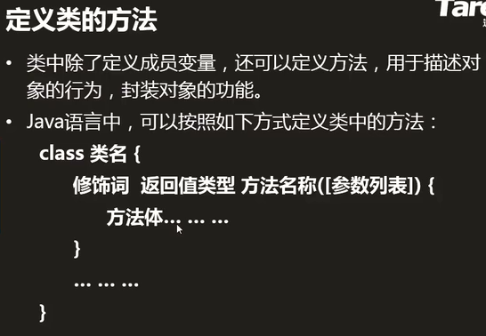


### 创建对象


```java
创建对象
    Student          stu1            	=     new Student();
    类(数据类型)   引用(引用类型变量)     指向     对象
```


### 引用类型变量


### 访问对象的成员变量、调用方法


### 创建类和对象实例

> Java规定：
> 1、成员变量和局部变量是可以同名的
> ​	---使用的时候，默认采取的是就近原则
>
> ---

```java
如何创建类？如何创建对象？如何访问成员？
//学生类
public class Student {
	//成员变量
	String name;
	int age;
	String address;
	//方法
	void sayHi() {
		System.out.println("姓名:"+name+" 年龄:"+age+" 地址:"+address);
	}
}

//测试学生类
public class StudentTest {
	public static void main(String[] args) {
		Student stu1 = new Student();
		stu1.name = "Grant";
		stu1.age = 19;
		stu1.address = "湖北孝感";
		stu1.sayHi();
	}
}
```


### 方法的签名


### 方法的重载

> 1)发生在一个类中，方法名称相同，参数列表不同，方法体不同
>
> 2)编译器在编译时根据方法的签名自动绑定调用的方法
>
> 3)重载和返回值类型也没有关系
>
> ```java
> //重载演示
> /*
>  * 1)同一个文件中，可以包含多个类
>  * 2)public修饰的类只能有一个
>  * 3)public修饰的类必须与文件名相同
>  */
> public class OverloadBemo {
> 	public static void main(String[] args) {
> 		Aoo a = new Aoo();//处于一个包中
>          a.say();
>          a.say("nice");
> 	}
> }
> 
> class Aoo{
> 	void say() {}
> 	void say(String name) {}
> 	void say(int age) {}
> 	//int say(){return 1;}//编译错误，重载与返回值没有关系
> 	//void say(String address){}//编译错误，重载与参数名称无关
> }
> ```
>
> 


### 构造方法


> <h6 color=red>在Java语言中，构造方法与类同名，没有返回值类型，常常用于初始化成员变量</h6>
>
> 在类中除了成员方法之外,还存在一种特殊类型的方法,就是构造方法。构造方法是一个与类名同名的方法，对象的创造就是通过构造方法完成的，每当类实例化一个对象时，类就会自动调用构造方法。构造方法有如下特点
>
> 1) <u>作用就是给成员变量赋值</u>
>
> 2) 与类同名，没有返回值类型
>
> 3) 在创建(new)对象时被自动调用
>
> 4) 若自己不写构造方法，则默认一个无参构造方法
> ​    若自己写了构造方法，则不再默认提供了，如果再调用无参构造方法就会编译错误，可以自己加上一个无参的构造方法
>
> 5) 构造方法可以重载
>
> 6) 没有任何返回类型 即使是void 空返回也不行
>
> 注意：在定义构造方法是,构造方法是没有返回值的,但这与普通方法没有返回值是不一样的。普通没有返回值的方法使用 public void methodEx(){} 这种形式来定义,但构造方法并不需要void关键字来修饰.
>
> ```java
> //构造方法的演示
> public class structDemo {
> 	public static void main(String[] args) {
> 		Stu s1 = new Stu("Grant",19,"湖北孝感");
>         s1.show();
> 	}
> }
> 
> class Stu{
> 	String name;
> 	int age;
> 	String address;
> 	//构造方法
> 	Stu(String name1, int age1, String address1) {
> 		name = name1;
> 		age = age1;
> 		address = address1;
> 	}
> 	void show() {
> 		System.out.println("姓名:"+name+" 年龄:"+age+" 地址:"+address);
> 	}
> }
> ```


### this关键字

- [ ] 只能用在方法中，在方法中访问成员变量之前默认有个this

- [ ] 指代当前对象，哪个对象调用方法指的就是哪个对象

- [ ] 当局部变量和成员变量同名时，this不能省略，不然就会出现指代不明的状况，如下

  

```java
public class structDemo {
	public static void main(String[] args) {
		Stu s1 = new Stu("Grant",19,"湖北孝感");
		s1.show();
	}
}

class Stu{
	String name;//成员变量
	int age;
	String address;
	//构造方法
	Stu(String name, int age, String address) {//局部变量：成员变量和局部变量可以同名，但此时this关键字不可以省略
		this.name = name;//s1.name = "Grant"
		this.age = age;
		this.address = address;
	}
	void show() {
		System.out.println("姓名:"+this.name+" 年龄:"+this.age+" 地址:"+this.address);
	}
}
-------------------------------
this使用方法
    1)this.成员变量名---------------访问成员变量
    2)this.方法名()----------------调用方法（一般不用）
    3)this()----------------------调用构造方法（很少使用），必须放在第一行位置
class Student {
	String name;
	int age;
	String address;
    Student(String name){
        this(name,0,null);//调用构造方法，相当于Student(name,0,null)，都调用了第三个构造方法
        //this(name,0,"暂无");
    }
    Student(String name, int age){
        this(name,age,null);
    }
	Student(String name, int age, String address) {
		this.name = name;//s1.name = "Grant"
		this.age = age;
		this.address = address;
	}
}
```


### null和NullPointerException

> 内存管理：由JVM来管理的
>
> 1) 堆：new出来的对象（包括对象中所有成员变量）
>
> 2) 栈：存储局部变量（包含方法的形式参数），基本类型的变量
>
> 3) 方法区：存储.class字节码文件，静态变量（类变量）
>
> ```java
> /*
> 堆：Aoo对象，a
> 栈：o，b，c （main方法里也是局部变量，所以栈区有o）
> 方法区：Aoo.class文件，show()
> */
> public static void main(String[] args){
> 	Aoo o = new Aoo();
>     	o.show(8);
> }
> class Aoo{
>         int a;
>         void show(int b){
>             int c = 5;
>         }
> }
> ```
>
> 
>
> 

> null：空，没有指向任何对象
>
> ​		若引用的值为null，则该引用不能再进行任何操作了
>
> ​		若操作则发生NullPointerException空指针异常
>
> 


### 引用类型之间画等号

> **引用类型之间画等号：**
>
> 1）指向同一个对象
>
> 2）通过一个引用对数据的修改会影响另一个引用对数据的访问
>
> **基本类型之间画等号**
>
> 1）赋值
>
> 2）对一个变量的修改不会影响另一个变量
>
> 
>
> ```java
> Student zs= new Student();
> Student zss = zs;//实质上是把zs在栈区中的地址赋值给zss
> //两者都是引用类型Student，属于引用类型划等号
> ```


### 引用类型数组（2021.2.28）


> 引用类型数组
>
> ```java
> 1)
> Student[] stus = new Student[2];//创建Student数组对象
> stus[0] = new Student("zhangsan",25,"LF");//创建Student对象
> stus[1] = new Student("lisi",21,"sh");
> ---
> 2)
> Student[] stus = new Student[]{
> 	new Student("zhangsan",25,"LF"),
>     new Student("lisi",21,"sh")
> };
> ---
> 3)
> int[][] arr = new int[3][];
> arr[0] = new int[4];
> arr[1] = new int[4];
> arr[2] = new int[4];//三行四列
> ---
> 4)如果每个数组元素的长度相同，可采用如下方式声明
> int[][] arr = new int[3][4];
> for(int i = 0; i < arr.length; i++){
> 	for(int j = 0; j < arr[i].length; j++){
> 		arr[i][j] = (int)(Math.random()*100);
>     	}
> }
> ```


### 继承


> 1) 作用：代码的复用
>
> 2) 通过extends来实现继承
>
> 3) 超类:所有派生类所共有的属性和行为
> ​    派生类/子类：派生类所特有的属性的行为
>
> 4) 派生类继承超类后，派生类具有：派生类+超类的
>
> 5) 一个超类可以有多个派生类
> ​    一个派生类只能有一个超类--------单一继承
>
> 6) 继承具有传递性
>
> 7) java规定：构造派生类之前必须构造超类
>
> > 派生类继承了超类的什么？
> > ---继承的是成员变量和方法，而不包括构造方法，但是子类能调用超类的构造方法                                                                                                                                                            ---超类的构造方法不是被派生类继承的，而是被派生类通过super来调用的
> 
>```java
> class Person{-------------------超类
>  String name;
>  int age;
>  String address;
>  void eat(){}
>  void sleep(){}
> }
> class Teacher extends Person{-----------派生类
>  double salary;
>  void teach(){}
> }
> ----------------
> //继承具有传递性
> class Aoo{-------------------a
> 	int a;
> }
> class Boo extends Aoo{-------b,a
> 	int b;
> }
> class Coo extends Boo{-------c,b,a
> 	int c;
> }
> ```


### super

> super:指代当前对象的超类对象
>
> super的用法：
>
> 1) super.成员变量---------------------访问超类的成员变量
>
> 2) super.方法名()----------------------调用超类的方法
>
> 3) super()--------------------------------调用超类的构造方法（参见继承章节的第7点）
>
> java规定：构造派生类之前必须构造超类
> ​	在派生类的构造方法中若没有调用超类的构造方法
> ​	---------------------则默认super()调用超类的无参构造方法
>
> ​	在派生类的构造方法中若调用了超类的构造方法
> ​	---------------------则不再默认提供
>
> ​	注意：super()调用超类构造必须位于派生类构造方法的第一行
>
> ```java
> package Y2021M2D28;
> //super演示
> public class SuperDemo {
> 	public static void main(String[] args) {
> 		Boo b = new Boo();
>            //输出结果
>            //超类的构造方法
> 		//派生类的构造方法
> 	}
> }
> class Aoo{
> 	Aoo(){
> 		System.out.println("超类的构造方法");
> 	}
> }
> 
> class Boo extends Aoo{
> 	Boo(){
> 		System.out.println("派生类的构造方法");
> 	}
> }
> ---
> class Coo{
> 	Coo(int a){}//一旦写了有参构造，系统不会再提供无参构造
> }
> 
> class Doo extends Coo{
> 	/*
> 	 * 如下代码为默认，写不写都在
> 	 * Doo(){
> 	 * 	super();//调用超类的无参构造，超类都没有无参构造了，调不着定然报错
> 	 * }
> 	 */
> 	Doo(){
> 		super(5);//调用超类的构造方法
> 	}
> }
> ```


### 综合例子

```java
1、创建Person类，包含：
    1)成员变量：name,age,address
    2)构造方法Person(3个参数){}
	3)方法：sayHi(){输出3个数据}
2、创建Student类，继承Person，包含：
    1)成员变量：stuId
    2)构造方法：Student(4个参数){}
	3)重写方法：sayHi(){输出4个数据}
3、创建Teacher类，继承Person,包含：
    1)成员变量：salary
    2)构造方法：Teacher(4个参数){}
	3)重写方法：sayHi(){输出4个数据}
4、创建Doctor类，继承Person，包含：
    1)成员变量：level
    2)构造方法：Doctor(4个参数){}
5、创建Test类，main中：
    1)创建Student数组ss，填充数据，遍历问好
    2)创建Teacher数组ts，填充数据，遍历问好
    3)创建Doctor数组ds，填充数据，遍历问好
    

public class Person {
	String name;
	int age;
	String address;
	Person(String name,int age,String address){
		this.name = name;
		this.age = age;
		this.address = address;
	}
	void sayHi() {
		System.out.println(name+"向你问好");
	}
}
----

public class Student extends Person {
	//成员变量
	String stuId;
	//构造方法
	public Student(String name,int age,String address,String stuId){
		super(name,age,address);
		this.stuId = stuId;
	}
    public void sayHi(){
        System.out.println(name+" "+age+" "+address+" "+stuId);
    }
	
}
----

public class Teacher extends Person {
	double salary;
	Teacher(String name, int age, String address, double salary){
		super(name,age,address);
		this.salary = salary;
	}
     public void sayHi(){
        System.out.println(name+" "+age+" "+address+" "+salary);
    }
}
----

public class Doctor extends Person{
	int level;
	public Doctor(String name,int age,String address,int level) {
		super(name,age,address);
		this.level = level;
	}
}
----

public class Test {
	public static void main(String[] args) {
		Student[] ss = new Student[] {
				new Student("1",19,"湖北","A1608"),
				new Student("2",21,"湖北","A1609"),
				new Student("3",20,"湖北","A1608")
		};
		for(Student v : ss) {
			v.sayHi();
		}
		
		Teacher[] ts = new Teacher[] {
				new Teacher("1",19,"湖北",9800),
				new Teacher("2",21,"湖北",8900),
				new Teacher("3",20,"湖北",10000)
		};
		for(Teacher v : ts) {
			v.sayHi();
		}
		
		Doctor[] ds = new Doctor[] {
				new Doctor("1",19,"湖北",1),
				new Doctor("2",21,"湖北",2),
				new Doctor("3",20,"湖北",3)
		};
		for(Doctor v : ds) {
			v.sayHi();
		}
	}
}

```


### 向上造型（2021.3.1）

1）超类型的引用指向派生类的对象

2）能点出来什么，看引用的类型(超类)，意思是只能访问引用类型中的变量和方法

好处依然是减少重复

```java
//动物是动物
Animal o = new Animal();
//老虎是老虎
Tiger o = new Tiger();
//一个老虎对象是动物类型，老虎是动物
Animal o = new Tiger();
class Animal{//动物 
}
class Tiger extends Animal{//老虎
}
```


```java
Person p1 = new Student();//向上造型
Person p1 = new Teacher();
---
package Y2021M3D1;
//向上造型演示
public class UploadDemo {
	public static void main(String[] args) {
		Aoo o1 = new Boo();//向上造型
		o1.a = 1;
		o1.show();
		//o1.b = 1;//报错，向上造型的对象不能访问派生类的方法和变量
		//o1.test();
	}
}

class Aoo{
	int a;
	void show() {}
}

class Boo extends Aoo{
	int b;
	void test() {}
}
---
向上造型实例
package Y2021M3D1;
import Y2021M2D28.*;//导入另一个包中的所有内容
//向上造型的应用
public class Test {
	public static void main(String[] args) {
		//上一节综合例子中的类，修改为向上类型的应用
		/*
		Student[] ss = new Student[] {
				new Student("1",19,"湖北","A1608"),
				new Student("2",21,"湖北","A1609"),
				new Student("3",20,"湖北","A1608")
		};
		for(Student v : ss) {
			v.sayHi();
		}
		
		Teacher[] ts = new Teacher[] {
				new Teacher("1",19,"湖北",9800),
				new Teacher("2",21,"湖北",8900),
				new Teacher("3",20,"湖北",10000)
		};
		for(Teacher v : ts) {
			v.sayHi();
		}
		
		Doctor[] ds = new Doctor[] {
				new Doctor("1",19,"湖北",1),
				new Doctor("2",21,"湖北",2),
				new Doctor("3",20,"湖北",3)
		};
		for(Doctor v : ds) {
			v.sayHi();
		}
		*/
		
		Person[] ps = new Person[3];
		ps[0] = new Student("学生",19,"湖北","A1608");//第四个参数使用sayHi()方法就不能访问
		ps[1] = new Teacher("老师",19,"湖北",9800);
		ps[2] = new Doctor("医生",19,"湖北",1);
		
		for(Person v : ps) {
			v.sayHi();//注意，sayHi()是超类中的方法，只能访问输出超类中的成员变量，对于派生类Student、Teacher、Doctor中的成员变量不能访问
		}
	}
}
```


### 方法的重写（override）：重新写、覆盖

当派生类觉得超类方法不够好的时候重写

1）发生在父子类中，方法名称相同，参数列表相同（参数列表不同的是重载），方法体不同

2）重写方法被调用时，看对象的类型(new谁调谁的，即使是向上造型也如此)

3）遵循“两同两小一大”原则：-----------------------了解

​		两同：
​			a）方法名称相同
​			b）参数列表相同

​		两小：
​			a）派生类方法的<u>返回值类型（boolean、int等这些）</u>小于或等于超类方法的						  	
​					a.1）void时，必须相等
​					a.2）基本类型，必须相等
​					a.3）引用类型时，小于或等于
​			b）派生类方法<u>抛出的异常</u>小于或等于超类方法的

​		一大：
​			a）派生类方法的访问权限大于或等于超类方法的


```java
Person{//人类（超类）
	void sayHi(){
        System.out.println(name+" "+age+" "+address);
    }
}
Student{//学生类（派生类）
    void sayHi(){
        System.out.println(name+" "+age+" "+address+" "+stuId);
    }
}
main{
	Person p1 = new Student();
	p1.sayHi();//调Student类的，调用的sayHi()方法是即为Student类中重写的
}
```


### 重写（override）与重载（overload）的区别(常见面试题)

1) 重写override：
​	1.1）发生在<u>父子类</u>中，方法名称相同，参数列表相同，方法体不同
​	1.2）遵循“运行期绑定”，此时已经有对象，<u>看对象的类型来调用方法</u>

2) 重载overload：
​	2.1）发生在<u>一个类</u>中（注意继承中子类会具有父类的方法，如下图），方法名称相同，参数列表不同，方法体不同
​	2.2）遵循“编译期绑定”，此时没有对象，<u>只能看参数/引用的类型来绑定方法</u>
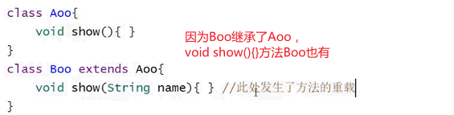

```java
注意：重载看参数/引用类型;重写看对象类型
package Y2021M3D1;
//重写与重载的演示
public class OverrideOverloadDemo {
	public static void main(String[] args) {
		Goo goo = new Goo();
		Eoo o = new Foo();//向上造型
		goo.test(o);//重载看参数/引用类型，重写看对象类型
	}
}
//test()方法是在重载，show()方法是在重写
class Eoo{
	void show() {
		System.out.println("超类show");
	}
}
class Foo extends Eoo{
	void show() {
		System.out.println("派生类show");
	}
}
class Goo{
	void test(Eoo o) {
		System.out.println("超类型参数");
		o.show();//重写看对象类型;如果没有重写的话，向上造型称王
	}
	void test(Foo o) {
		System.out.println("派生类型参数");
		o.show();
	}
}
---
超类型参数
派生类show
```

重写要求方法签名完全相同，返回值类型如果是基本类型或无返回值时必须一致，引用类型则是小于或等于即可
重载要求方法名相同且参数列表必须不同，与返回值类型无关。


### package和import

> #### package
>
> 1) 作用：避免类名的冲突
>
> 2) 包名常常有层次结构， package a.b.c.d;
>
> 3) 类的全称: 包名.类名，同包中的类不能同名
>
> 4) 建议：包含所有字母都小写
>
> 建议：域名反写 . 项目名称 . 模块名称 . 类名
> ​		cn.tedu . aproject . StudentManger . 
> ​		com.taobao . aproject . StudentManger . 
>
> #### import
>
> 1) 同包中的类能直接访问
>
> 2) 不同包中的类不能直接访问，想访问有如下两种方式:
> ​		a) 先import声明类再直接使用类（建议）
> ​		b) 类的全称(太繁琐、不建议)


### 访问控制修饰符public/protected/private

> 1）public ：公开的，任何类可访问，可跨包访问
>
> 2）private：私有的，本类可访问
>
> 3） protected：受保护的，<u>本类、派生类、同包类</u>可访问（超类中的成员变量一般是protected）
> ​	为什么超类成员变量一般都用protected修饰？https://blog.csdn.net/xmu_jupiter/article/details/39997785
>
> 4）默认的：什么也不写，<u>本类、同包类</u>可访问，跨包访问就不行——不推荐
>
> 说明：
> ​	a) 类的访问修饰符只能是public或默认的
> ​	b) 类中成员的访问修饰符如上四种都可以
> ​	c) 超类中的成员变量一般设计为protected，这样子类就可以访问
>
> 
>
> ---
>
> 坚持数据私有化，行为公开化
>
> 数据(变量)：私有（派生类的）、受保护（超类的）
>
> 行为(方法)：公开
>
> ```java
> //超类
> public class FlyingObject{
> 	protected int width;//超类数据(变量)受保护protected
> 	protected int height;
> 	protected int x;
> 	protected int y;
>  public FlyingObject(int width, int height){//行为(方法)公开public
> 		this.width = width;
> 		this.height = height;
> 		x = (int)(Math.random()*(400-this.width));
> 		y = -this.height;
>  }
>  public void step() {//行为(方法)公开public
> 	}
> }
> ----
> //派生类
> public class AirPlane extends FlyingObject{
> 	private int speed;//派生类数据(变量)私有化private
> 	public AirPlane(){//行为(方法)公开public
> 		super(49,36);
> 		speed = 2;
> 	}
> 	//重写step()
> 	public void step() {//行为(方法)公开public
> 	}
> }
> ```


### final关键字

> final：最终的、不可改变的-----------单独应用率低
>
> 1) 修饰变量：变量不能被改变
>    - final修饰成员变量：意为初始化后不可改变，该成员变量必须声明同时初始化，或在构造方法中初始化
> 2) 修饰方法：方法不能被重写
> 3) 修饰类：类不能被继承，但是可以继承别的类
>
> ---
>
> 
<<<<<<< HEAD
>
> 如图为什么会编译错误?
> 本题考查final关键字修饰成员变量。 final关键字修饰成员变量，意为初始化后不可改变。该成员变量必需初始化。<u>可以在声明时初始化或在构造方法中进行初始化</u>。 本题中，首先，在构造方法中给final修饰的成员变量id初始化；然后又在updateId方法中<u>改变</u>id的值，这就违反了final修饰成员变量的语法，因此会在重新为id赋值处出现编译错误。
>
=======
>
> 如图为什么会编译错误?
> 本题考查final关键字修饰成员变量。 final关键字修饰成员变量，意为初始化后不可改变。该成员变量必需初始化。<u>可以在声明时初始化或在构造方法中进行初始化</u>。 本题中，首先，在构造方法中给final修饰的成员变量id初始化；然后又在updateId方法中<u>改变</u>id的值，这就违反了final修饰成员变量的语法，因此会在重新为id赋值处出现编译错误。
>
>>>>>>> 0f914c2513dd87260ad1c611f79cd359148f3b8a
> ---
>
> 


### static关键字及两种成员变量（2021.3.3）

> 1) 静态变量(类变量)
>
> - [ ] 由static修饰
> - [ ] 属于类的，存储在方法区中，只有一份
> - [ ] 常常通过类名+. 来访问，当然用对象+. 访问也可以，但不建议
> - [ ] 何时用：所有对象所共享的数据（图片、音频、视频等【这些数据一定是所有数据共享的】）------------用于共享数据 
>
> ```java
> 了解到这里，我们先来了解一下两种成员变量
> 成员变量
>     1)实例变量：没有static修饰，属于对象的，存储在堆中，有几个对象就有几份
>     2)静态变量：由static修饰，属于类的，存储在方法区中，只有一份
>   	class Aoo{
>         int a;//实例变量，a是属于Aoo的对象的
>         static int b;//静态变量，b是属于Aoo这个类的
>     }
> ```
>
> 
>
> ```java
> package Y2021M3D3;
> //静态变量演示
> public class staticDemo {
> 	public static void main(String[] args) {
> 		Loo o1 = new Loo();
> 		o1.show();
> 		Loo o2 = new Loo();
> 		o2.show();
> 		Loo o3 = new Loo();
> 		o3.show();
> 	}
> }
> 
> class Loo{
> 	int a;//没有初始化，默认值为0
> 	static int b;
> 	Loo(){//构造方法
> 		a++;
> 		b++;
> 	}
> 	void show() {
> 		System.out.println("a="+a+",b="+b);
> 	}
> }
> ---
> a=1,b=1
> a=1,b=2
> a=1,b=3
> 为什么会产生如上结果？
>     先回顾一下内存管理：
>     1)堆：存储new出来的对象（包括实例变量）
>     2)栈：局部变量（包括方法的参数）
>     3)方法区：.class字节码文件（包括方法、静态变量）
> ```
>
> 
>
> 
>
> 
>
> 2) 静态方法
>
> - [ ] 由static修饰
>
> - [ ] 属于类的，存储在方法区中，只有一份
>
> - [ ] 常常通过类名+. 来访问
>
> - [ ] 静态方法可以被继承和隐藏，而不能够被重写，因此也不能实现多态，不能实现父类的引用可以指向不同子类的对象进行多态调用。 后面有个题会具体说明。
>
> - [ ] 静态方法没有隐式this传递（因为静态方法是属于类的，不是属于对象，所以没有this），所以在静态方法中不能直接访问实例变量和普通方法。简单来说，<u>就是没有static修饰的都访问不了，只能new对象访问</u>
>
> - [ ] 何时用：方法的操作仅与参数相关而与对象无关时
>   与对象有关就意味着要操作对象中的数据
>
>   
>   
>
>   ```java
>   Scanner scan = new Scanner(System.in);
>   int a = scan.nextInt();-------------------实例方法(对象+.)
>   <<<<<<< HEAD
>
> =======
>
> >>>>>> 0f914c2513dd87260ad1c611f79cd359148f3b8a
>   double b = Math.random();
>   int[] c = Arrays.copyOf(a,6);
>   Arrays.sort(arr);-------------------------静态方法(类+.)
>   
>   ```
>
>   
>
>
> 3) 静态块
>
> - [ ] 属于类的，在类被加载期间自动执行；类只被加载一次，所以静态块只执行一次
> - [ ] 何时用：用于加载/初始化静态资源（图片、音频、视频等），一般和静态变量搭配使用
> - [ ] 先走静态块，然后调用构造方法
> - [ ] 由static修饰
>
> 
>
> ---
>
> 关于static修饰方法的两个题：
>
> 
>
> 第二个题
>
> ```java
> class Super {
> 	public static void m1() {
> 		System.out.println("m1 in Super");	
>     }
> 	public void m2() {
> 		System.out.println("m2 in Super");	
>     }
> }
> class Sub extends Super {
> 	public static void m1() {
> 		System.out.println("m1 in Sub");	
>     }
> 	public void m2() {
> 		System.out.println("m2 in Sub");	
>     }
> }
> public class TestMain {
> 	public static void main(String args[]) {
> 		Super sup = new Sub();
> 		sup.m1();
> 		sup.m2();
> 		Sub sub = (Sub) sup;
> 		sub.m1();
> 		sub.m2();	
>     }
> }
> /*
> m1 in Super
> m2 in Sub
> m1 in Sub
> m2 in Sub 
> 这一题考察静态方法
> 静态方法可以被继承和隐藏，而不能够被重写，因此不能实现多态，不能实现父类的引用可以指向不同子类的对象进行多态调用。sup.m1()产生的结果就是m1 in Super
>   ```
>
> 
>
> ---
>
> 关于静态块的一个题：
>
> ```java
> class Example{
>     static int i=1;
>     static {
>         ++i;
>     }
>     public static void main (String[]args){
>         increment(i,5);
>         display(i);
>     }
>     static void increment(int n, int m){
>         n+=m;
>     }
>     static void display (int n) {
>         System.out.print(n);
>     }
>     static{
>         ++i;
>     }
> }
> /*
> 正确输出结果是3
> 考查静态代码块。类执行即加载。静态代码块是类加载的时候自动执行。
> 类变量i在静态代码块中自增了2次,结果是3，而调用方法的时候，并没有改变量i的值，只是将i的值传递到方法中。
> ```


### static final常量（2021.3.4）


> **static final常量**
>
> 1)必须声明同时初始化
>
> 2)类名点来访问、不能被改变
>
> 3)建议：常量名所有字母都大写，多个单词之间用_分割
>
> 4)编译器在编译时将常量直接替换为具体的值，效率高
>
> 5)何使用：数据永远不变，并且经常使用的情况下
>
> ```java
> package Y2021M3D4;
> //static final 演示
> public class StaticFinalDemo {
> 	public static void main(String[] args) {
> 		System.out.println(Aoo.PI);//类名点来访问
> 		System.out.println(Boo.num);
> 		/*
> 		 * 1)加载Boo.class到到方法区中
> 		 * 2)静态变量num也存储到方法区中
> 		 * 3)到方法区中获取num并输出
> 		 */
>         
> 		System.out.println(Boo.COUNT);
> 		/*
> 		 * 编译器在编译时将常量直接替换为具体的值，效率高
> 		 * 相当于System.out.println(5);
> 		 */
> 	}
> }
> 
> class Aoo{
> 	public static final double PI = 3.14159;
> 	//public static final int NUM;//编译错误
> }
> class Boo{
> 	public static int num = 5;//静态变量，属于类的，存储在方法区中，只有一份
> 	public static final int COUNT = 5;//常量
> }
> ```


### 抽象方法和抽象类

##### 程序设计规则(抽象类和接口的区别)

> **程序设计规则：**
>
> 1）将派生类共有的属性和行为，抽到超类中--------抽共类
>
> 2）派生类的行为都一样，设计为普通方法
>
> ​	  派生类的行为都不一样，需要各自设计的话，就设计为抽象方法                                                                                                                                                                                                                                                                                                                                                                                                                                                                                                                                                                                                                                                                                                                                                                                                                                                                                                                                                                                                                                                                                                                                                                                                                                                                                                                                                                                                                                                                                                                                                                                                                                                                                                                                                                                                                                                                                                                                                                                                                                                                                                                                                                                                                                                                                                                                                                                                                                                                                                                                                                                                                                                                                                                                                                                                                                                                                                                                                                                                                                                                                                                                                                                                                                                                                                                                                                                                                                                                                                                                                                                                                                                                                                                                                                                                                                                                                                                                                                                                                                                                                                              
>
> 3）将部分派生类所共有的行为，抽到接口中
>
> ​	  符合既是也是原则时，需要使用接口
>
> ​	  接口是对继承单根性的扩展-----------为了实现多继承
>
> ```java
> interface Enemy{//得分接口
>     	int getScore(){}
> }
> interface Award{//奖励接口-----为了后期得扩展
>     	int getAwardType(){}
> }
> class Bee extends FlyingObject implements Award,Enemy{//既是飞行物，也能得分得奖励
> 	int getScore(){}
>     	int getAwardType(){}
> }
> ```
>
> 

> **抽象方法：**
>
> 1）由abstract修饰
>
> 2）只有方法的定义，没有具体的实现（连{}都没有）
>
> ```java
> public abstract void step();//抽象方法
> ```
>
> 
>
> 

> **抽象类：**
>
> 1）由abstract修饰
>
> 2）包含抽象方法的类必须是抽象类;不包含抽象方法的类也可以声明为抽象类（我乐意）
>
> 3）抽象类不能被实例化（只是不让被<u>new</u>对象）（但是如果你重写了抽象类中所有的抽象方法，就可以实例化它）
>
> ```java
> FlyingObject[] oo = new FlyingObject[3];//创建FlyingObject数组--正确
> FlyingObject oo;//-------------正确
> FlyingObject oo = new FlyingObject();//创建FlyingObject对象---错误
> ```
>
> 4）抽象类是需要被继承的，派生类：	
> ​		a）重写抽象类中的所有抽象方法------------建议
> ​		b）也声明为抽象类-----------一般不用（类的意义就是用来创建对象，不能使用就没有意义）
>
> 5）抽象类的意义：
>
> ​		a）封装共有的属性和行为-----------代码复用
> ​		b）为所有派生类提供统一的类型--------------向上造型
> ​		c）可以包含抽象方法，因为派生类的行为不同，所以我们抽象，为所有派生类提供统一的方法入口（即向上造型后能点出来，派生类的具体实现(重写)不同，但是入口都是一致的）
>
> 
>
> 举个例子：
> 在FlyingObject飞行物类这个超类有一个抽象方法step()
> 
> 在其子类中都重写了这个step()方法，当我进行向上造型时，超类型的引用就能点出来step()，但如果我在超类中没有这个抽象方法step()，就点不出来
> 

> 抽象类和接口的区别：https://kb.cnblogs.com/page/42159/


### 成员内部类(2021.3.5)

> 应用率不高
>
> 1）类中套类，外面的称为Outer外部类，里面的称为Inner内部类
>
> 2）内部类通常只能在外部类中使用，对外不具备可见性
>
> ```java
> main(){
> 	Aoo o1 = new Aoo();
> 	Boo o2 = new Boo();//编译错误
> }
> class Aoo{
>   class Boo{//可在Aoo这个类中使用
>   }
> }
> ```
>
> 3）内部类对象通常是在外部类中创建的
>
> 4）内部类中可以直接访问外部类的成员和方法(包括私有的)
>
> ​	  内部类中有个隐式的引用指向了创建它的外部类对象
>
> ​		eg：外部类名.this.
>
> ```java
> main{
> 	Aoo o = new Aoo();
> 	o.show();
> }
> 
> class Aoo{
>   private int a;
>   void show(){//外部类
>       Boo o = new Boo();//内部类对象通常是在外部类中创建的,如果主方法中想访问内部类就通过这种方法
>       o.test();
>   }
>   class Boo{//内部类
>          void test(){
>           System.out.println(a);//正确
>           System.out.println(Aoo.this.a);//正确
>           System.out.println(this.a);//编译错误
>       }
> 	 }
> }
> ```
>
> ---
>
> 
>
> ```java
> 内部类的最重要的一个特点就是它可以直接访问它外部类的成员变量。成员变量是
> 对象身上的。对象创建完成了,才会为成员变量分配空间。能调用成员变量,
> 意味着一定有了实例对象.
> main方法是静态的，它执行的时候可以不用创建那个对象。这就矛盾了。
> main方法运行的时候没有任何外部类的实例对象。我们的内部类的实例对象创建了
> 它又可以访问外部类的成员变量，外部类的实例对象在哪儿了？
> 所以这个原因，要想创建内部类的实例对象，必须创建外部类的实例对象
> ```


### 匿名内部类


>1）若想创建一个类（派生类）的对象，并且对象只创建一个，此时该类不必命名，称为匿名内部类
>
>2）jdk1.8以前，匿名内部类中若想访问外面的变量，该变量必须是final的；但1.8版本之后就不需要这么复杂
>
>3）匿名内部类中不能修改外面变量的值，因为在此处变量会默认为final的
>
>
>
>```java
>package Y2021M3D5;
>//匿名内部类的演示
>public class NstInnerDemo {
>public static void main(String[] args) {
>    		//Coo o1 = new Coo();//编译错误，抽象类不能被实例化，抽象类需要被继承
>	    Coo o1 = new Coo() {//匿名内部类，这种方式创建的对象，只能建一个
>	    };
>    /*上面这句
> 	 * 1）创建了Coo的一个派生类，但是没有名字;与之对应的就是26~27行的创建了Eoo这个继承于Coo的派生类
> 	 * 2）为该派生类创建了一个对象，名为o1
> 	 * 3）大括号中的为派生类的类体
> 	 */
>
>    final int num = 6;//1.8以前需要加上final，匿名内部类才能访问
>	    Doo o2 = new Doo() {
>	        void show() {
>	            System.out.println("你好!"); 
>	            System.out.println(num);
>                //num = 55;//编译错误，在匿名内部类中是不能修改外面变量的值，因为在此处num会默认为final的
>	        }
>	    };
>	    o2.show();
>	    }
>}
>
>class Eoo extends Coo{//正常创建派生类，名为Eoo
>}
>
>abstract class Coo{
>}
>
>abstract class Doo{
>	abstract void show();
>}
>-------------------
>    常见面试题：
>    问：内部类中有独立的.class嘛？
>    答：有,内部类编译后也会有class文件： 外部类名$内部类名
>    	Mama$Baby.class--------内部类
>        NstInnerClassDemo$1.class---------匿名内部类
>```

```java
//没有使用匿名内部类
public class ThreadDemo2 {
    public static void main(String[] args) {
        //实例化线程要执行的任务
        Runnable r1 = new MyRunnable1();
        Runnable r2 = new MyRunnable2();

        //创建两个线程
        Thread t1 = new Thread(r1);
        Thread t2 = new Thread(r2);

        t1.start();
        t2.start();
    }
<<<<<<< HEAD
}
class MyRunnable1 implements Runnable{//匿名内部类的话就不需要创建类然后实现Runnable接口
    public void run(){
        for (int i = 0; i < 100000; i++) {
            System.out.println("你叫什么？**************");
        }
    }
}
class MyRunnable2 implements Runnable{
    public void run(){
        for (int i = 0; i < 100000; i++) {
            System.out.println("那你叫什么？---------------");
        }
    }
}
```

```java
//使用匿名内部类
public class ThreadDemo3 {
    public static void main(String[] args) {
       Runnable r1 = new Runnable() {//匿名内部类，省去了创建子类实现Runnable
            @Override
            public void run() {
                for (int i = 0; i < 100000; i++) {
                    System.out.println("你叫什么？**************");
                }
            }
        };
        Thread t1 = new Thread(r1);
        
        Runnable r2 = new Runnable() {
            @Override
            public void run() {
                for (int i = 0; i < 100000; i++) {
                    System.out.println("那你叫什么？------------");
                }
            }
        };
        Thread t2 = new Thread(r2);
        
        t1.start();
        t2.start();
    }
}

```

```java
//进阶高级版
public class ThreadDemo3 {
    public static void main(String[] args) {
        Thread t1 = new Thread(new Runnable() {
            @Override
            public void run() {
                for (int i = 0; i < 100000; i++) {
                    System.out.println("你叫什么？**************");
                }
            }
        });

        Thread t2 = new Thread(()->{
                for (int i = 0; i < 100000; i++) {
                    System.out.println("那你叫什么？---------------");
                }
        });

        t1.start();
        t2.start();
    }
}

```

---

通过以上学习，有人可能会问，不是说抽象类和接口不能被实例化吗？那么为new一个Runnable接口没有出错呢?


解答一下，匿名内部类其实就是相当于实现接口或者实现抽象类的一个具体类，并且，不是不能new，主要是实现了它的抽象方法就可以new出来（而new Runnable(){}后面这一大块就相当于实现了Runnable接口的一个子类对象），如下图就实现了Runable接口中的run方法，所以就可以new出来


然后看抽象方法中也是一样的。new A(){};就相当于创建了子类继承A，并重写了里面的方法，自然就可以这样写。


如果你想单纯这new出来肯定不行的，而且他也提示你要重写它的一些方法才行（相当于搞了A的一个子类）。


---

总结一下：抽象类和接口是不能被实例化，只能由其子类实例化。他所谓的能实例化方式不是通过new方式来创建对象，而是通过父类的引用来指向子类的实例来间接地实现父类的实例化（因为子类要实例化前，一定会先实例化他的父类。这样创建了继承抽象类的子类的对象，也就把其父类（抽象类）给实例化了）


### 接口（2021.3.8）

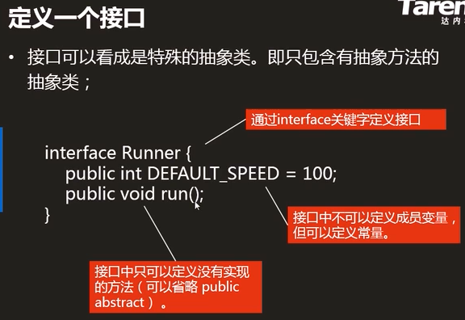

1）是一种数据类型（引用类型）

2）由interface定义

3）只能包含常量和抽象方法

```java
interface Inter1{
	public static final int NUM = 5;
    public abstract void show();
    int COUNT = 5;//默认public static final（接口中所有数据默认都是常量)
    void test();//默认（给你加上）public abstract（接口中所有方法默认都是抽象的）
    
    //int number;//编译错误，常量必须声明同时初始化，这就不属于常量的定义，所以会报错
	//void say(){};//编译错误，抽象方法不能有方法体，这就不属于抽象方法的定义，所以报错
    static void say(){
        System.out.println("sdfasdd");
    }//抽象方法一定没有方法体吗？不一定，得看jdk的版本，1.7之前是一定没有的，1.7之后要求主要是加了static关键字，都必须要有方法体。方法体中写不写内容无所谓，主要是要有{}
=======
>>>>>>> 0f914c2513dd87260ad1c611f79cd359148f3b8a
}
class MyRunnable1 implements Runnable{//匿名内部类的话就不需要创建类然后实现Runnable接口
    public void run(){
        for (int i = 0; i < 100000; i++) {
            System.out.println("你叫什么？**************");
        }
    }
}
class MyRunnable2 implements Runnable{
    public void run(){
        for (int i = 0; i < 100000; i++) {
            System.out.println("那你叫什么？---------------");
        }
    }
}
```

```java
//使用匿名内部类
public class ThreadDemo3 {
    public static void main(String[] args) {
       Runnable r1 = new Runnable() {//匿名内部类，省去了创建子类实现Runnable
            @Override
            public void run() {
                for (int i = 0; i < 100000; i++) {
                    System.out.println("你叫什么？**************");
                }
            }
        };
        Thread t1 = new Thread(r1);
        
        Runnable r2 = new Runnable() {
            @Override
            public void run() {
                for (int i = 0; i < 100000; i++) {
                    System.out.println("那你叫什么？------------");
                }
            }
        };
        Thread t2 = new Thread(r2);
        
        t1.start();
        t2.start();
    }
}

```

```java
//进阶高级版
public class ThreadDemo3 {
    public static void main(String[] args) {
        Thread t1 = new Thread(new Runnable() {
            @Override
            public void run() {
                for (int i = 0; i < 100000; i++) {
                    System.out.println("你叫什么？**************");
                }
            }
        });

        Thread t2 = new Thread(()->{
                for (int i = 0; i < 100000; i++) {
                    System.out.println("那你叫什么？---------------");
                }
        });

        t1.start();
        t2.start();
    }
}

```

---

通过以上学习，有人可能会问，不是说抽象类和接口不能被实例化吗？那么为new一个Runnable接口没有出错呢?


解答一下，匿名内部类其实就是相当于实现接口或者实现抽象类的一个具体类，并且，不是不能new，主要是实现了它的抽象方法就可以new出来（而new Runnable(){}后面这一大块就相当于实现了Runnable接口的一个子类对象），如下图就实现了Runable接口中的run方法，所以就可以new出来


然后看抽象方法中也是一样的。new A(){};就相当于创建了子类继承A，并重写了里面的方法，自然就可以这样写。


如果你想单纯这new出来肯定不行的，而且他也提示你要重写它的一些方法才行（相当于搞了A的一个子类）。


---

总结一下：抽象类和接口是不能被实例化，只能由其子类实例化。他所谓的能实例化方式不是通过new方式来创建对象，而是通过父类的引用来指向子类的实例来间接地实现父类的实例化（因为子类要实例化前，一定会先实例化他的父类。这样创建了继承抽象类的子类的对象，也就把其父类（抽象类）给实例化了）


### 接口（2021.3.8）


1）是一种数据类型（引用类型）

2）由interface定义

3）只能包含常量和抽象方法

```java
interface Inter1{
	public static final int NUM = 5;
    public abstract void show();
    int COUNT = 5;//默认public static final（接口中所有数据默认都是常量)
    void test();//默认（给你加上）public abstract（接口中所有方法默认都是抽象的）
    
    //int number;//编译错误，常量必须声明同时初始化，这就不属于常量的定义，所以会报错
	//void say(){};//编译错误，抽象方法不能有方法体，这就不属于抽象方法的定义，所以报错
    static void say(){
        System.out.println("sdfasdd");
    }//抽象方法一定没有方法体吗？不一定，得看jdk的版本，1.7之前是一定没有的，1.7之后要求主要是加了static关键字，都必须要有方法体。方法体中写不写内容无所谓，主要是要有{}
}
```

4）接口不能被实例化（不能被new出来）

5）接口是需要被实现/继承的，实现类/派生类：

​		必须重写所有抽象方法

6）一个类可以实现多个接口，用逗号分隔

​		若又继承又实现接口时，应先继承后实现接口

```java
interface Inter1{
    void show();
}
interface Inter2{
	void test();
}
abstract class Aoo{
    abstract void say();
}
class Boo extends Aoo implements Inter1,Inter2{
    //void show(){}//编译错误，因为重写的要求有一个是访问权限大于父类
    public void show(){}
    public void test(){}
    void say() {}
}
```

7）接口可以继承接口，一个接口可以继承多个接口

​		类和类-------------------继承

​		接口和接口-------------继承

​		类和接口----------------实现

```java
interface Inter1{
    void show();
}
interface Inter2 extends Inter1{//接口可以继承接口
    void test();
}
class Aoo implements Inter2{//类实现接口
    public void test(){}
    public void show(){}
}
Inter2 o1 = new Inter2();//编译错误
Inter2 o1 = new Aoo();//向上造型:正确的，因为Aoo实现了这个接口
Inter1 o1 = new Aoo();//向上造型

interface Inter3 extends Inter1,Inter2{//一个接口可以继承多个接口
    public void show(){}
    public void test(){}
    void say(){}
} 
```

---

> **使用接口的目的：**
>
> 接口是对继承单根性的扩展--------------实现多继承
>
> **使用接口的好处：**
>
> 适用于所有实现接口的类，以此来提高复用性、扩展性、维护性


### 多态

https://www.runoob.com/java/java-polymorphism.html

#### 1）多态的意义

​	a）同一类型的引用指向不同的对象时，有不同的实现，比如说run，可能是跑、游

​			--------行为的多态：cut()、run()、step()

​			--------所有的抽象方法都是多态的

```java
动物 o1 = new 老虎();//向上造型
动物 o2 = new 鱼();
动物 o3 = new 鸟();
o1.run();//地上跑
o2.run();//水里游
o3.run();//天上飞

abstract class 动物{
	abstract void run();
}
class 老虎 extends 动物{
 	void run(){地上跑}   
}
class 鱼 extends 动物{
 	void run(){水里游}   
}
class 鸟 extends 动物{
 	void run(){天上飞}   
}
```

​	b）同一个对象被造型为不同类型时，有不同功能

​			--------对象的多态：我、你、水

​			--------所有对象都是多态的

```java
我 me = new 我();
讲师 o1 = me;//向上造型，等同于讲师 o1 = new 我();
孩子他妈 o2 = me;
o1.授课();
o2.教育();

interface 讲师{
	void 授课();   
}
interface 孩子他妈{
 	void 教育();   
}
class 我 implements 讲师,孩子他妈{
	public void 授课(){}
    public void 教育(){}
}
```

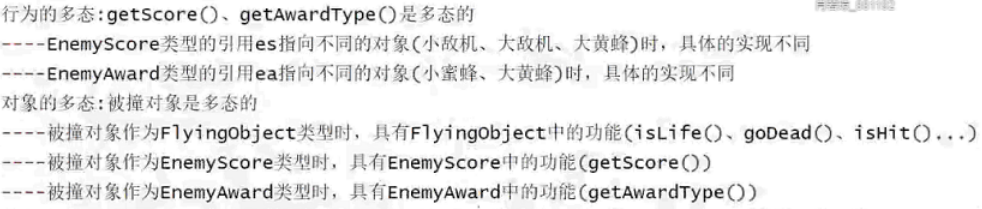


#### 2）向上造型[^ 多态离不开向上造型]

​	a）超类型的引用指向派生类的对象

​	b）能造型成为的类型有：超类+所实现的接口

​	c）能点出来什么，看引用的类型

> 向上造型的好处？
> 将所有敌人造型到FlyingObject数组中，以此为提高复用性、扩展性、维护性


#### 3）强制类型转换

​	成功的条件只有如下两种

​	  a）引用所指向的对象（是new后面的类型，如`Aoo o = new Boo()`，o指向的对象就是Boo类型），就是该类型

​	b）引用所指向的对象，实现了该接口或者继承的该类

```java
**类中java认为：超类大，派生类小
    动物 o1 = new 老虎();//向上造型(自动类型转换)
**基本类型之间强制类型转换，-------一定正确，但有可能溢出或丢失精度
**引用类型之间强制类型转换，-------有可能会失败报错
```

> 为何要强转？
> ---若想访问的东西在超类中有(isLife()\isHit()\goDead()等)，则不需要强转
> ---若想访问的东西在超类中没有(getScore()\getAwardType()等)，则不需要强转


4）强转时若不符合如上3）中的两个条件，则发生ClassCastException类型转换异常，建议在强转之前先通过instanceof来判断引用的对象是否是该类型

```jAVA
Aoo o = new Boo();
Boo o1 = (Boo)o;//符合条件一，o指向的对象就是Boo类型(可强转)
Inter1 o2 = (Inter1)o;//符合条件二，o指向的对象实现了Inter1接口(可强转)
Coo o3 = (Coo)o;//指向对象既不是该类型也没有实现该接口，ClassCastException类型转换异常
System.out.println(o instanceof Boo);//true
System.out.println(o instanceof Inter1);//true
System.out.println(o instanceof Coo);//false

interface Inter1{
}
class Aoo{//超类
}
class Boo extends Aoo implements Inter1{//派生类
}
class Coo extends Aoo{
}
```


### 内存管理


**内存管理：由JVM来管理的**

**1）堆：**

​	1.1）存储new出来的对象（包括实例变量）

​	1.2）垃圾：没有任何引用的指向的对象

​			`垃圾回收器(GC)不定时到内存中清扫垃圾，回收过程中是透明的（看不到的）`								   
​			`不一定一发现垃圾就立刻回收，调用System.gc() 可以建议JVM尽快调度GC来回收`

​	1.3）内存泄漏：不再使用的对象还没有被及时的回收，严重的泄露会导致系统的崩溃

​				`建议：对象不再使用时应及时将引用设置为null`

​	1.4）实例变量的生命周期：

​				`创建对象时存储在堆中，对象被回收时一并被回收`

**2）栈：**

​	2.1）存储<u>正在调用中</u>的方法中的局部变量（包括方法参数）

​	2.2）调用方法时，会为该方法在栈中分配一块对应的栈帧。

​				栈帧中存储局部变量（包括方法参数）

​				当方法调用结束时，栈帧被清除，局部变量一并失效

​	2.3）局部变量的生命周期：

​				调用方法时存储在栈中，方法结束时与栈帧一并被删除

**3）方法区**

​	3.1）存储.class字节码文件（包括方法、静态变量）

​	3.2）方法只有一份，通过this来区分具体的调用对象

​	


### 实例变量&静态变量&局部变量

[链接](https://blog.csdn.net/Gakki_wpt/article/details/94316618?utm_medium=distribute.pc_relevant.none-task-blog-2%7Edefault%7EBlogCommendFromMachineLearnPai2%7Edefault-1.control&depth_1-utm_source=distribute.pc_relevant.none-task-blog-2%7Edefault%7EBlogCommendFromMachineLearnPai2%7Edefault-1.control)

```java
实例变量（也叫成员变量）：
    1)写在类中，方法外
    2)创建对象时存储在堆中，对象被回收时一并被回收
    3)有默认值
    class test{
        int num;//实例变量
    }
静态变量（也叫类变量）：
	1)由static修饰，写在类中，方法外
	2)属于类，编译时存储在方法区中，随着类的消失而消失，只有一份
	3)有默认值
    class test{
        public static int num;//静态变量
    }
局部变量：
    1)写在方法中
    2)调用方法时存储在栈中，方法结束时与栈帧一并被清除
    3)没有默认值
    class test{
        public void fun(){
            int num = 0;//局部变量
        }
    }
    
    Aoo o = new Aoo();//一创建对象，实例对象得默认值就是0了
	o.show(8);//方法传参

	class Aoo{
		int a;
        void show(int b){
			int c;
            System.out.println(a);//0
            System.out.println(b);//8
            System.out.println(c);//编译错误，变量声明的同时必须初始化
        }
    }
```


<<<<<<< HEAD


### 面试题

```java
/**
 * @author Akio
 * @ClassName test
 * @Date 2021/7/24 10:22
 * @Description 这里涉及到了一个问题：就是构造方法了成员变量赋值什么时候执行？
 *              答：先调用构造方法，然后给成员变量赋值，最后执行构造方法（简称调用-赋值-执行）
 *					并且，如果有继承于父类，调用构造方法先调用父类的构造方法，父类构造方法调用
 *					完了才给成员变量赋值
 */
public class Test6 {
    public static void main(String[] args) {
        Child c = new Child();
    }
}

class Parent {
    private int a = 2;
=======
>>>>>>> 0f914c2513dd87260ad1c611f79cd359148f3b8a

    public Parent() {//为什么才到这行就直接跳到15行？？？
        System.out.println("Parent:" + a);
        show();
    }

    public void show() {
        System.out.println("a1:" + a);
    }
}

class Child extends Parent {
    int a = 3;

    public Child() {
        System.out.println("Child:" + a);
    }

    public void show() {
        System.out.println("a2:" + a);
    }
}
---
Parent:2
a2:0
Child:3
```


### 面试题

```java
/**
 * @author Akio
 * @ClassName test
 * @Date 2021/7/24 10:22
 * @Description 这里涉及到了一个问题：就是构造方法了成员变量赋值什么时候执行？
 *              答：先调用构造方法，然后给成员变量赋值，最后执行构造方法（简称调用-赋值-执行）
 *					并且，如果有继承于父类，调用构造方法先调用父类的构造方法，父类构造方法调用
 *					完了才给成员变量赋值
 */
public class Test6 {
    public static void main(String[] args) {
        Child c = new Child();
    }
}

class Parent {
    private int a = 2;

    public Parent() {//为什么才到这行就直接跳到15行？？？
        System.out.println("Parent:" + a);
        show();
    }

    public void show() {
        System.out.println("a1:" + a);
    }
}

class Child extends Parent {
    int a = 3;

    public Child() {
        System.out.println("Child:" + a);
    }

    public void show() {
        System.out.println("a2:" + a);
    }
}
---
Parent:2
a2:0
Child:3
```


###  面向对象三大特征

**1.封装**

​	1）类：封装的是对象的属性和行为

​	2）方法：封装一段特定的业务逻辑功能实现

​	3）访问控制修饰符：封装的是具体的访问权限

**2.继承**

​	1）作用：代码复用

​	2）超类：所有派生类所共有的属性和行为

​	     接口：部分派生类所共有的行为

​	     派生类：派生类所特有的属性和行为

​	3）单一继承、多接口实现、传递性

​		  Object：所有类的鼻祖，所有的类只要没有继承就默认继承Object，而且继承具备传递性

**3.多态**

​	1）意义：

​			1.1）行为的多态（所有抽象方法都是多态的）

​			1.2）对象的多态（所有对象都是多态的）

​	2）向上造型、强制类型转换、instanceof判断

​	3）多态的表现形式：

​			3.1）重写：根据对象的不同来表现多态

​			3.2）重载：根据参数的不同来表现多态


### Debug调试工具

当程序的运行结果与你所预期的结果不同时：

1、打桩：`System.out.println(数据);`

2、Debug调试工具： 首先要添加断点

​		1）掌握四个键：

​				1.1）F5：单步调试（会进入方法中）<u>当你认为方法有错误的时候用</u>

​				1.2）F6：逐过程调试（不会进入到方法中）

​				1.3）F7：结束方法的调试（返回）

​				1.4）F8：直接跳到下一个断点（若后面无断点，则调试结束）

​		2）会看两个东西

​				2.1）会看变量Variables

​						

​				2.2）会添加监视（看表达式，选中表达式右键Watch）

​					


### 面试题

```java
面试题:
1)switch分支语句可以作用在哪些数据类型上?
  ----byte,short,int,char,String,枚举类型
2)简述java的八种基本数据类型:
  ----byte:字节型，1个字节
  ----short:短整型，2个字节
  ----int:整型，4个字节，最常用的整数类型
  ----long:长整型，8个字节，超过int范围时再考虑用long
  ----float:单精度浮点型，4个字节
  ----double:双精度浮点型，8个字节，最常用的小数类型
  ----boolean:布尔型，1个字节，存真或假
  ----char:字符型，2个字节，存储单个符号  
3)重写与重载的区别:
  ----重写(override):发生在父子类中，方法名相同，参数列表相同
  ----重载(overload):发生在同一类中，方法名相同，参数列表不同
4)简述public、private、protected以及默认权限的访问范围:
  ----public:公开的，任何类
  ----private:私有的，本类
  ----protected:受保护的，本类、派生类、同包类
  ----默认的:什么也不写，本类、同包类
5)简述抽象类与接口的区别:
  ----相同点:
      5.1)都是引用数据类型，都可以包含抽象方法，都不能被实例化，都需要继承或实现才有意义
  ----不同点:
      5.1)抽象类中可以包含变量、常量、普通方法和抽象方法，而接口中只能包含常量和抽象方法
      5.2)只能继承一个抽象类，但可以实现多个接口
```


## 12 面向对象之射击游戏

### 射击游戏需求介绍（Project：MyShoot）

> **需求**：
>
> 1）参与角色：英雄机、小敌机、大敌机、小蜜蜂、子弹、天空
>
> 2）关系：英雄机发射子弹
>
> ​				子弹射击敌机（小敌机、大敌机、小蜜蜂）
>
> ​				英雄机与敌机（小敌机、大敌机、小蜜蜂）碰撞
>
> ​				英雄机、小敌机、大敌机、小蜜蜂、子弹均在天空飞行
>
> 3）英雄机发射子弹分单倍活力（火力值=0）和双倍火力（火力值>0）
>
> ​		发射一次双倍火力，则火力值减2
>
> 4）子弹射击敌机：子弹消失、敌人爆破后消失
>
> ​		打掉小敌机，得1分；打掉大敌机，得3分；打掉小蜜蜂，的奖励（1条生命或40火力）
>
> 5）英雄机和敌人碰撞：敌人消失，英雄机减掉1条命，清空火力值
>
> 6）英雄机命数为0，game over
>
> 7）项目四种状态：启动、运行、暂停、游戏结束
>
> 


### **程序设计规则：**

1）将派生类共有的属性和行为，抽到超类中--------抽共类

2）派生类的行为都一样，设计为普通方法

​	  派生类的行为都不一样，需要各自设计的话，就设计为抽象方法                                                                                                                                                                                                                                                                                                                                                                                                                                                                                                                                                                                                                                                                                                                                                                                                                                                                                                                                                                                                                                                                                                                                                                                                                                                                                                                                                                                                                                                                                                                                                                                                                                                                                                                                                                                                                                                                                                                                                                                                                                                                                                                                                                                                                                                                                                                                                                                                                                                                                                                                                                                                                                                                                                                                                                                                                                                                                                                                                                                                                                                                                                                                                                                                                                                                                                                                                                                                                                                                                                                                                                                                                                                                                                                                                                                                                                                                                                                                                                                                                                                                                                                                                                         

3）将部分派生类所共有的行为，抽到接口中

​	  符合既是也是原则时，需要使用接口

​	  接口是堆继承单根性得扩展-----------为了实现多继承


### 射击游戏梗概

#### 设计第1天

创建6个对象类，创建World类测试

**设计射击游戏中的对象类**

1）先找对象：英雄机、小敌机、大敌机、小蜜蜂、子弹、天空

2）抽取类：Hero、AirPlane、BIgAirPlane、Bee、Bullet、Sky

3）设计类中的成员变量和方法


```java
class Hero{
    //成员变量：命、火力值、x坐标、y坐标、宽、高 
    //方法：
    void step(){
            //切换图片，制造出英雄机尾气喷发的假象
    }
    void moveTo(int x, int y){
      //英雄机随着鼠标动
    }
}
```

4）创建对象并测试


#### 设计第2天

给6个对象类添加构造方法，并测试

> **设计构造方法**
>
> 对于项目中的各种对象，其很多属性是固定的，我们可以在构造方法中直接赋固定值
>
> 如：小敌机的构造方法
>
> 


#### 设计第3天

1、设计小敌机数组、大敌机数组、小蜜蜂数组、子弹数组

2、设计超类FlyingObject类设计两个构造方法，6个对象类继承

3、给FlyingObject设计两个构造方法，6个对象类分别调用


#### 设计第4天

```java
1、将小敌机数组、大敌机数组、小蜜蜂数组合为FlyingfObject数组，并测试
2、在6个对象中重写step()
3、画窗口
    JFrame: 框架/窗口---------------相框
	JPanel: 面板------------------------相板
        
1)
 import javax.swing.JFrame;//引入框架
 import javax.swing.JPanel;//引入面板
2)
 World类继承JPanel
3)
 main里面添加
 	JFrame frame = new JFrame();
		World world = new World();
		frame.add(world);

		frame.setDefaultCloseOperation(JFrame.EXIT_ON_CLOSE);
		frame.setSize(WIDTH,HEIGHT);
		frame.setLocationRelativeTo(null);
		frame.setVisible(true);

		world.action();
4）
 修改WIDTH,HEIGHT为400,700
```


#### 设计第5天

```java
1、给类中成员添加访问控制修饰符
2、给6个对象设计图片属性
    每个对象都有图片属性，设计在派生类中
```


#### 设计第6天

1）想画对象得获取对象的图片，每个对象都能获取图片，意味着获取图片行为为共有行为，设计为超类FlyingObject中；每个对象获取图片的行为都是不一样的，所以设计为抽象方法
​	---------在FlyingObject中设计抽象方法getImage()来获取对象的图片

2）获取图片时，要考虑对象的状态，所以要给对象设计状态，每个对象都有状态，所以将状态设计在超类中，而状态一般都是常量
​	----------在FlyingObject中设计三个常量，state常量表示当前状态
​	----------在获取图片时需要先对对象的状态进行判断，每个对象都得判断，所以将判断状态的行为设计在超类中，每个对象判断的方式都是一样的，所以设计为普通方法
​	----------在FlyingObject中设计isLife()、isDead()、isRemove()方法用来判断状态

对象的状态分三种：

- [ ] 活着的
- [ ] 死了的(未删除的，爆破)
- [ ] 删除的

3）重写FlyingObject中的抽象方法getImage()

​		天空Sky，直接返回image即可

​		子弹Bullet：
​			1）若活着，直接返回image即可
​			2）若死了，直接删除(不返回图片)

​		英雄机Hero：
​			1）若活着，返回image[0]和image[1]的来回切换

​		小敌机Airplane：
​			1）若活着，返回image[0]
​			2）若死了，返回bom[0]到bom[3]的轮换，4后则删除

​		大敌机BigAirplane：
​			1）若活着，返回image[0]
​			2）若死了，返回bom[0]到bom[3]的轮换，4后则删除

​		小蜜蜂Bee：
​			1）若活着，返回image[0]
​			2）若死了，返回bom[0]到bom[3]的轮换，4后则删除

4）图片有了就可以画了，每个对象都能画，意味着画为共有行为，所以设计在超类中，每个对象画的方式都是一样的，所以设计为普通方法
​	---------在FlyingObject中设计paintObject()实现画对象

5）天空Sky每次需要画两张图，所以重写超类的paintObject()
​	---------在Sky中重写paintObject()

6）在World类中调用paintObject()实现往窗口上画对象


#### 设计第7天

```java
    1、敌人入场
    	1）敌人是由窗口产生的，所以在World中创建nextOne()生成敌人
    	2）敌人入场为定时发生，所以在run()中调用enterAction()实现敌人入场
    		在enterAction()中：	
    			每400ms，获取敌人对象，扩容并装到最后一个元素上
```

> **匿名内部类案例——设计定时器**
>
> ```java
> import java.util.Timer;//定时器
> import java.util.TimerTask;//定时任务
> ```
>
> 
>
> 

> ---
>
> 功能实现过程（做业务功能的套路）：
>
> 1）先写行为：
>
> - [ ] 若为某个对象所特有的行为，就将方法设计在对应的类中
> - [ ] 若为所有对象所共有的行为，就将方法设计到超类中
>
> 2）页面/窗口调用：
>
> - [ ] 若为定时触发的，则在定时器中调用
> - [ ] 若为事件触发的，则在侦听器中调用
>
>
>
> **敌人入场**
>
> ```java
> 1)敌人是在窗口上产生的，所以在World中创建nextOne()生成敌人对象
> 2)敌人入场为定时发生的，所以在run中调用enterAction()实现敌人入场
> 	在enterAction中：每400ms，获取敌人对象obj，enemies敌人数组扩容，将obj加到enemies的最后一个元素上
> ```
>
> ````java
> //生成敌人（小敌机、大敌机、小蜜蜂）
> public FlyingObject nextOne(){
> 	Random rand = new Random();
>     int type = rand.nextInt(20);//0到19
>     if(type<2){//0~1  使用概率的分散来控制创建各类对象的频率
> 		return new Bee();
>     }else if(type<15){//2~14
>         return new AirPlane();
>     }else{//12~19
> 		return new BigAirPlane();
>     }
> }
> ````
>
> ```java
> 补充一个知识：paint()的调用方式有两种：
> 1、frame.setVisible(true);
> 2、repaint();
> 为什么不直接调用paint()，因为paint()方法需要Graphics画笔参数
> ```
>
> ```java
> /**
>      * 实现敌人（小敌机、大敌机、小蜜蜂）入场
>      */
> 	private int enterIndex = 0;
>     public void enterAction() {//每10ms走一次
>         enterIndex++;//每10ms增1
>         if (enterIndex % 40 == 0) {//每400（10*40）ms走一次
>             FlyingObject obj = nextOne();
>             enemies = Arrays.copyOf(enemies, enemies.length + 1);//扩容
>             enemies[enemies.length-1] = obj;//将obj添加到最后一个元素上
>         }
>     }
> ```
>
>
>
> **子弹入场**
>
> ```java
> 1) 子弹是由英雄机产生的，所以在Hero类中，创建shoot()方法
> 2) 子弹入场为定时发生的，在run()中调用shootAction()实现子弹入场
>     在shootAction()中：
>     	每300ms，获取子弹数组对象bs，扩容并追加数组bullets的末尾
> ```
>
> ```java
> /**
>      * 英雄机发射子弹(生成子弹对象)
>      */
>     public Bullet[] shoot() {
>         int xStep = this.width / 4;//1/4英雄机的宽
>         int yStep = 20;//固定的20,因为子弹的长度就是20
>         if (fire > 0) {//双倍火力
>             Bullet[] bs = new Bullet[2];//一次两发子弹
>             //子弹位置在英雄机的左右翼
>             bs[0] = new Bullet(this.x + 1 * xStep, this.x - yStep);
>             bs[0] = new Bullet(this.x + 3 * xStep, this.x - yStep);
>             fire -= 2;//发射一次双倍火力，则火力值减2
>             return bs;
>         } else {//单倍火力
>             Bullet[] bs = new Bullet[1];//一次一发子弹m
>             //子弹的位置在英雄机的上方中间
>             bs[0] = new Bullet(this.x + 2 * xStep, this.x - yStep);
>             return bs;
>         }
>     }
> ```
>
> 
>
>
>
> **飞行物移动**
>
> ```java
> 1)飞行物移动为所有对象共有的行为，所以设计在FlyingObject类中,派生类中重写step()
> 2)飞行物移动为定时发生，在run()中调用stepAction()实现飞行物移动
>     在stepAction()中:
> 		天空动，遍历敌人敌人动，遍历子弹子弹动
>  
> ```
>
>
>
> ​	所有飞行物都是一张张图片，Sky的左上角坐标是原点坐标，当图片坐标大于700，就立马把图片移到-700的位置，这个操作只需要将图片坐标改为负即可
>
> 
>
> ```java
> /**
>      * 移动
>      */
>     public void step() {
>         y += speed;
>         y1 += speed;
>         if (y >= World.HEIGHT) {//若y>=窗口的高，表示移到最下面了
>             y = -World.HEIGHT;//将y修改为负的窗口的高（移动到最上面去）
>         }
>         if (y1 >= World.HEIGHT) {
>             y1 = -World.HEIGHT;
>         }
>     }
> ```
>
> -
>
> Bee的step()方法，遇到边界就反弹
>
> ```java
> public void step() {
>         x += xSpeed;
>         y += ySpeed;
>         if (x <= 0 || x >= World.WIDTH - width) {//若x<=0或x>=窗口宽-蜜蜂宽，表示蜜蜂触及到了边界
>             xSpeed *= -1;//则切换方向（正变负，负变正）
>         }
>     }
> ```
>
>


#### 设计第8天

> **项目功能**
>
> 1）英雄机随着鼠标动：
>
> ​	a)英雄机随着鼠标动为英雄机的行为，所以在Hero中设计moveTo()实现英雄机随着鼠标移动
>
> ​	b)英雄机随着鼠标动为事件触发的，所以在侦听器中重写mouseMoved()
>
> ​		在mouseMoved()中：
>
> ​		获取鼠标的x和y坐标，调用Hero中的moveTo()方法
>
> ```java
> /**
>      * 英雄机移动
>      * x/y代表鼠标的x坐标和y坐标
>      */
>     public void moveTo(int x, int y) {
>         this.x = x - this.width / 2;//英雄机的x = 鼠标的x-1/2英雄机的宽
>         this.y = y - this.height / 2;
>     }
> ```
>
> ```java
> swing事件触发：
> 1)事件：发生了一件事
> 2)事件处理：发生事之后所做的操作
> 		鼠标点击	启动状态变为运行状态
> 		鼠标移动	英雄机随着鼠标动
> 		鼠标移出	运行状态变为暂停状态
> 		鼠标移入	暂停状态变为运行状态
> 3)侦听器：
> 	a)有一个侦听器对象
> 	b)把侦听器装到你家去
> 	MouseAdapter l = new MouseAdapter(){
> 		重写mouseMoved(){  
> 		}
> 	};
> 	this.addMouseListener(1);
> 	this.addMouseMotionListener(1);		
> ```
>
> 2）删除越界的敌人和子弹：
>
> ​	a）将检测敌人越界行为outOfBounds()设计在FlyingObject中，在Bullet中重写outOfBounds()检测子弹是否越界
> ​	b）删除越界行为为定时发生的，所以在run()中调用outOfBoundsAction()删除越界敌人和子弹
> ​		在outOfBoundsAction()中：
> ​		遍历敌人/子弹数组，判断若越界了，则用最后一个元素去替换出界元素，然后缩容数组
>
> 3）设计Enemy得分接口，AirPlane和BigAirPlane实现；设计Award奖励接口，Bee实现
>
> ```java
> public void outOfBoundsAction() {//每10ms走一次
>         //删除越界敌人
>         for (int i = 0; i < enemies.length; i++) {
>             if (enemies[i].isOutOfBounds()) {//越界了
>                 enemies[i] = enemies[enemies.length - 1];//将越界的元素用最后一个元素来顶替，然后删掉最后一个元素
>                 enemies = Arrays.copyOf(enemies, enemies.length - 1);
>             }
>         }
>         //删除越界子弹
>         for (int i = 0; i < bullets.length; i++) {
>             if (bullets[i].isOutOfBounds()) {//越界了
>                 bullets[i] = bullets[bullets.length - 1];//将越界的元素用最后一个元素来顶替，然后删掉最后一个元素
>                 bullets = Arrays.copyOf(bullets, bullets.length - 1);
>             }
>         }
>     }
> ```


#### 设计第9天

**子弹    与敌人碰撞的设计方法**

**英雄机与敌人碰撞的设计方法**

```java
class FlyingObject{//敌人
    //敌人撞子弹/英雄机
    public boolean hit(FlyingObject other){
		this:敌人
        other：子弹或英雄机
        int x1 = this.x-other.width;//x1:敌人的x-子弹的宽
		int x2 = this.x+this.width;//x2:敌人的x+敌人的宽
		int y1 = this.y-other.height;//y1:敌人的y-子弹的高
		int y2 = this.y+this.height;//y2:敌人的y+敌人的高
		int x = other.x;//子弹的
		int y = other.y;//子弹的y
        return (x>=x1 && x<=x2) && (y>=y1 && y<=y2);
        //x在x1与x2之间，并且，y在y1与y2之间，即为撞上了
    }
}
```


**子弹与敌人碰撞**

1）先写行为：

​	1.1) 在FlyingObject中设计 isHit() 实现敌人与子弹/英雄机的碰撞

​	1.2) 在FlyingObject中设计goDead()实现飞行物的死亡消失

​	1.3) 在Hero中设计addLife() 增命、addDoubleFire() 增火力值

2）窗口调用：

​	敌人与子弹的碰撞为定时发生的，在run() 中调用bulletBangAction()方法

​	在bulletBangAction() 中：

​		遍历子弹得子弹，遍历敌人得敌人，判断若撞上了：

```java
若撞上了：
    1) 子弹去死(DEAD)、敌人去死(DEAD)
    /*
    2) 判断若被撞敌人：
    	2.1)为小敌机，则玩家得1分
    	2.2)为大敌机，则玩家得3分
    	2.3)为小蜜蜂，则英雄机得奖励(命或者火力值)
    	*/
    2)判断被撞对象:
		若是Enemy，则玩家增分
        若是Award，则英雄机增命或增火力
```

```java
/**
     * 检测碰撞 this:敌人     other:子弹/英雄机
     */
    public boolean isHit(FlyingObject other) {
        int x1 = this.x - other.width;//x1：小型敌机的x-英雄机的宽
        int x2 = this.x + this.width;//x1：小型敌机的x+小敌机的宽
        int y1 = this.y - other.height;//y1：小型敌机的y-英雄机的高
        int y2 = this.y + this.height;//y2：小型敌机的y+小型敌机的高
        int x = other.x;//x：英雄机的x
        int y = other.y;//y：英雄机的y
        return x > x1 && x <= x2 && y >= y1 && y <= y2;//x介于x1~x2，y介于y1~y2
    }
```

```java
/**
     * 飞行物去死
     */
    public void goDead(){
        state = DEAD;//将当前状态修改为DEAD死亡状态
    }
```


 **画分和画命：**

​	1) 在Hero中设计getLife() 获取英雄机的命

​	2) 在paint()中：画分和画命

```java
//画分和画命
		g.drawString("SCORE:"+score, 10, 25);//(显示内容,x坐标,y坐标)
		g.drawString("LIFE:"+hero.getLife(),10,45);
```


#### 设计第10天

**1、英雄机与敌人的碰撞**

​	1）借用FlyingObject的isHit() 碰撞、goDead() 去死

​		  在Hero类中设计subtractLife() 减命、clearFire() 清空火力值

​	2）英雄机与敌人碰撞为定时发生的，在run() 中调用heroBangAction()方法

​		  在heroBangAction() 中：

​				遍历敌人得敌人，判断是否与英雄机撞上了，若撞上了：

​				敌人去死、英雄机减命、英雄机清空火力值

```java
对象状态默认认为活着的LIFE
    一旦撞上了，将对象状态修改为DEAD
    DEAD之后，子弹直接将状态修改为REMOVE
    	敌人先爆破再将状态修改为REMOVE
    一旦对象状态为REMOVE，是应该立即将对象从数组中删除
    
现在的效果是----------只要不越界的都留着(包括被子弹击中后的敌机等等)
    真正应该留下的：
    	不越界的，并且，LIFE/DEAD(非REMOVE的)
```


**2、检测游戏结束：**

​	1）借用Hero的getLife() 获取命数

​	2）检测游戏结束为定时发生的，在run()中调用checkGameOverAction()方法

​		  在checkGameOverAction()中：

​				判断当英雄机的命数<=0时，则游戏结束（将当前状态修改为游戏结束状态）

**3、画状态**

​	1）设计四个常量表示4种状态，并设计state表示当前状态（默认为启动状态）

​		  设计三个静态变量表示3个图片，并在static块中初始化

​		  在paint() 中，实现在不同状态下画不同的图片

​	2）将run() 中那一堆action设计为只在运行状态下才执行

​		  将英雄机随着鼠标动设计为只在运行状态下才执行

​	  3）重写mouseClicked() 鼠标点击事件： `启动变运行、游戏结束先清理再变启动`

​		  重写mouseExited() 鼠标移出事件：`运行变暂停`

​		  重写mouseEntered() 鼠标移入事件：`暂停变运行`


# 其他

## 二进制


### 1、什么是二进制

- 逢2进1的计数规则

  

> int是32位二进制数，Integer在输出整数时候，自动省略了高位的0
>
> ```
> 十进制：0
> 二进制：0
> 二进制省略了31个0 ，00000000 00000000 00000000 00000000
> ```

```java
package binary;

/**
 * @author Akio
 * @ClassName Demo1
 * @Description TODO
 * @Date 2021/7/20 9:44
 */
public class Demo1 {
    /**
     * java中显示一个二进制
     * 1、java在编译期间将数字转换为二进制数
     * 2、运行期间i的值始终是二进制
     * 3、显示i的值时候，java将二进制转换为十进制输出
     *      java中除了二进制，其他禁止都用字符串表示
     * 4、java中提供了一个API，Integer.toBinaryString()
     *      此方法可以将一个int在内存中的二进制显示出来
     */
    public static void main(String[] args) {
        int i = 45;
        System.out.println(i);
        System.out.println(Integer.toBinaryString(i));
    }
}
```


### 2、十六进制


```java
package binary;

/**
 * @author Akio
 * @ClassName Demo2
 * @Description TODO
 * @Date 2021/7/20 10:43
 */
public class Demo2 {
    public static void main(String[] args) {
        /**
         * 16进制:16进制用于缩写二进制的
         * - 2进制书写非常繁琐
         * - java7开始提供二进制字面量前缀0b
         *      在数字中使用下划线可以分割数据，但不会影响数值
         * - 16进制用于缩写二进制，从最低位开始，每4位二进制缩写为1位16进制
         *      java中16进制的字面量前缀是0x
         *      如果是long类型，无论什么进制都需要添加后缀L/l
         */
        int i = 0b11011;
        System.out.println(i);
        i = 0b11_1001_1110_0110_1010_1111_0000_1010;
        //  3    9    e     6     a    f    0   a
        System.out.println(Integer.toBinaryString(i));
        i = 0x39e6af0a;
        System.out.println(Integer.toBinaryString(i));


        //练习编写3个位数比较多的二进制数字，然后缩写为16进制
        int n = 0b10_1011_1101_0100_1111_0101_1001_1011;
        //      2    b    d     4   f    5     9    b
        System.out.println(Integer.toBinaryString(n));
        n = 0x2bd4f59b;
        System.out.println(Integer.toBinaryString(n));
    }
}
```


#### 2.1 八进制


<<<<<<< HEAD

### 3、补码

**关于补码**：

- 计算机中用于处理有符号数（正负数）的一种编码

- 其设计思路是将一组固定位数的二进制数分一半作为负数使用

使用4位2进制研究补码的编码原理。然后推广到32位补码（int的编码）

如何将4位数3进制表示正负数，将4位2进制分一半作为负数。基本运算规则：4位运算时候，如果运算结果超过4位数，则自动溢出，保留4位不变。

**计算机处理负数的根本原理**


```java
package binary;

/**
 * @author Akio
 * @ClassName Demo3
 * @Description TODO
 * @Date 2021/7/20 11:59
 */
public class Demo3 {
    public static void main(String[] args) {
        /**
         * int；类型的补码编码
         */
        int max = Integer.MAX_VALUE;
        int min = Integer.MIN_VALUE;
        System.out.println(Integer.toBinaryString(max));
        System.out.println(Integer.toBinaryString(min));

        long lmax = Long.MAX_VALUE;
        long lmin = Long.MIN_VALUE;
        System.out.println(Long.toBinaryString(lmax));
        System.out.println(Long.toBinaryString(lmin));

    }
}
```


#### 3.1 负数的编码规律

如何手工计算负数补码对应的10进制值：记住-1的编码，看负数编码比-1少权对应的数值。

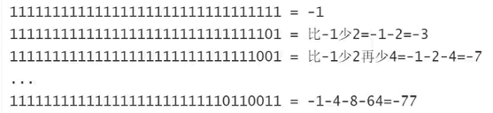

案例：输出-200到0的二进制编码，随机挑选20个数，手工计数其十进制数值，编程验证结果。

```java
package binary;

/**
 * @author Akio
 * @ClassName Demo4
 * @Description TODO
 * @Date 2021/7/20 14:15
 */
public class Demo4 {
    public static void main(String[] args) {
        /*
         *  负数的编码规律
         */
        int i = -1;
        System.out.println(Integer.toBinaryString(i));
        //11111111111111111111111111111111  -- 32个

        for (int j = -200; j <= 0; j++) {
            System.out.println(Integer.toBinaryString(j));
        }
    }
}
```


#### 3.2 互补对称性质

- 按照补码编码的整数，有巧合的互补对称现象！


```java
package binary;

/**
 * @author Akio
 * @ClassName Demo5
 * @Description TODO
 * @Date 2021/7/20 14:58
 */
public class Demo5 {
    public static void main(String[] args) {
        /**
         * 验证补码的互补对称现象
         */
        int n = 160;
        System.out.println(~n+1);//-160
        n = -120;
        System.out.println(~n+1);//120
        n = Integer.MIN_VALUE;
        System.out.println(~n+1);

        System.out.println(Integer.toBinaryString(-120));
        System.out.println(Integer.toBinaryString(~-120));
        System.out.println(Integer.toBinaryString(~-1));
    }
}
```


**经典面试题目**

```java
System.out.println(~130+1);
上述代码输出结果（B）
A、-129	B、-130	C、-131	D、-132
    
System.out.println(~130);
上述代码输出结果（C）
A、-129	B、-130	C、-131	D、-132
    
System.out.println(~-130);
上述代码输出结果（A）
A、129	B、130	C、131	D、132

做这种题，一定要记住-n=~n+1,
对于第二题：
```


### 4、二进制运算

常用2进制运算符：

```java
~	取反
&	与运算
|	或运算
>>>	右移位运算
>>	数学右位移运算
<<	左移位运算
```

#### 4.1 &与运算

基本运算规则：逻辑乘法，有0则0

```java
0 & 0 = 0
0 & 1 = 0
1 & 0 = 0
1 & 1 = 1
```

运算时候将两个整数对齐位，对应的位进行&运算

举个例子：

```java
n	=	01110011 10011111 01101111 10110101
m	=	00000000 00000000 00000000 11111111
k=n&m	00000000 00000000 00000000 10110101
```

上述运算的意义：n的最后8位数，被截取存储到了k
上述运算的本质：将一个整数的最后8位拆分。m数经常是从最低位到最高位连续n个1，将这个数成为“掩码（Mask）”。上述运算也称为”掩码运算“

举个例子：

```java
/**		7	3	 9	 f	  6	  f	   b   5
n	=	01110011 10011111 01101111 10110101
m	=	00000000 00000000 00000000 11111111
k=n&m	00000000 00000000 00000000 10110101
*/
int n = 0x739f6fb5;//十六进制缩写的二进制
int m = 0xff;//
int k = n&m;
//k中存储的是n的最后8位
System.out.println(Integer.toBinaryString(n));
System.out.println(Integer.toBinaryString(m));
System.out.println(Integer.toBinaryString(k));
```


#### 4.2 >>>右移位运算符

运算规则：将二进制数整体向右移动，低位自动溢出，高位补0

举个例子：

```java
n	=	01110111 10010000 00111011 11010101
m=n>>>1 00111011 11001000 00011101 11101010
k=n>>>2 00011101 11100100 00001110 11110101
g=n>>>8 00000000 01110111 10010000 00111011
b3=(n>>>8) & 0xff;
```

代码：

```java
int n = 0x77903bd5;
int m = n>>>1;
int k = n>>>2;
int g = n>>>8;
int b3 = (n>>>8) & 0xff;
System.out.println(Integer.toBinaryString(n));
System.out.println(Integer.toBinaryString(m));
System.out.println(Integer.toBinaryString(k));
System.out.println(Integer.toBinaryString(g));
System.out.println(Integer.toBinaryString(b3));
```


#### 4.3 | 或运算

基本运算规则：逻辑加法，有1则1

```java
0 | 0 = 0
0 | 1 = 1
1 | 0 = 1
1 | 1 = 1
```

运算时候将两个整数对齐位进行或运算

举个例子：

如上运算的意义：错位合并或者错位拼接

代码：

```java
int n = 0xb7;
int m = 0xbe00;
int k = m|n;
System.out.println(Integer.toBinaryString(n));
System.out.println(Integer.toBinaryString(m));
System.out.println(Integer.toBinaryString(k));
```


#### 4.4 <<左移位运算

将二进制数字整体向左移动，高位自动溢出，低位补0

举个例子：


代码：

```java
int n = 0x9e8abf5e;
int m = n << 1;
int k = n << 2;
int g = n << 8;
System.out.println(Integer.toBinaryString(n));
System.out.println(Integer.toBinaryString(m));
System.out.println(Integer.toBinaryString(k));
System.out.println(Integer.toBinaryString(g));
```


#### 4.5 移位运算数学意义

移位运算数学原理分析：

```
16	8	4	2	1
		1	0	1	=1+4=5
	1	0	1	0	=2+8=10
1	0	1	0	0	=4+16=20
```

结论：

- 二进制数字整体向左移动，每移动一位数值扩大2倍。
- 二进制数字整体向右移动，每移动一位数值缩小2倍。

```java
代码验证：
int n = 5;
System.out.println(n<<1);//10
System.out.println(n<<2);//20
System.out.println(n<<3);//40
```


#### 4.6 >>> 与>>的区别

- \>>>称为逻辑右移位：将数字整体向右移动，低位溢出，高位补0，其运算目的就是将数字整体向右移动，不关心是否满足数学除法的结果。

- \>>称为数学右移位：将数字整体向右移动，低位溢出，正数的时候（高位为0）补0，负数时候（高位为1）补1，每移动一次相当于数学除以2然后向小方向取整数

- \>>>和>>正数的时候没有区别
  比较负数的时候有区别：

  ```java
  n   =  11111111 11111111 11111111 11001100=-1-1-2-16-32=-52
  m=n>>1 111111111 11111111 11111111 1100110=-1-1-8-16=-26
  k=n>>2 1111111111 11111111 11111111 110011=-1-4-8=-13
  g=n>>3 11111111111 11111111 11111111 11001=-1-2-4=-7
  
  a=n>>>1 011111111 11111111 11111111 1100110=max-25
  所以可以明显的看出>>>和>>的区别
  ```

  代码：

  ```java
  int n = 0xffffffcc;
  int a = n >>> 1;
  System.out.println(Integer.toBinaryString(a));
  System.out.println(a);//Integer.MAX_VALUE-25
  System.out.println(Integer.MAX_VALUE-25);
  ```

  


  经典面试题：

  ```java
  n*8可以替换为(n<<3)
  n/2(n>0)可以替换为(n>>1)
  ```


### 5、整数int的编解码

如何传送一个int整数

- 发送方：将整数拆分为4个字节（b1 b2 b3 b4）再进行发送
- 接受方：将收到的4个字节（b1 b2 b3 b4）合并为一个整数


**将一个整数拆分为4个字节：**（编码）

```java
int n = 0x77f034d7;//使用十六进制缩写二进制
int b1 = (n>>>24) & 0xff;
int b2 = (n>>>16) & 0xff;
int b3 = (n>>>8) & 0xff;
int b4 = n & 0xff;
//0xff是掩码，不清楚可以看看4.1 &与运算
```

扩展问题：上述代码中n是-1的时候，b1,b2,b3,b4的十进制数值是？

```java
n = 0xffffffff;
b1 = (n>>>24) & 0xff;
b2 = (n>>>16) & 0xff;
b3 = (n>>>8) & 0xff;
b4 = n & 0xff;
System.out.println(Integer.toBinaryString(b1));
System.out.println(Integer.toBinaryString(b2));
System.out.println(Integer.toBinaryString(b3));
System.out.println(Integer.toBinaryString(b4));
```


**思考：如何将4个8位有效位的b1 b2 b3 b4合并为一个int整数？**（解码）

```java
b1	=	00000000 00000000 00000000 01110111
b2	=	00000000 00000000 00000000 11110000
b3	=	00000000 00000000 00000000 00110100
b4	=	00000000 00000000 00000000 11010111
```

```java
int b1 = 0x77;
int b2 = 0xf0;
int b3 = 0x34;
int b4 = 0xd7;
int n = (b1<<24)|(b2<<16)|(b3<<8)|b4;
System.out.println(Integer.toBinaryString(n));
```


=======
>>>>>>> 0f914c2513dd87260ad1c611f79cd359148f3b8a

### 3、补码

**关于补码**：

- 计算机中用于处理有符号数（正负数）的一种编码

- 其设计思路是将一组固定位数的二进制数分一半作为负数使用

使用4位2进制研究补码的编码原理。然后推广到32位补码（int的编码）

如何将4位数3进制表示正负数，将4位2进制分一半作为负数。基本运算规则：4位运算时候，如果运算结果超过4位数，则自动溢出，保留4位不变。

**计算机处理负数的根本原理**


```java
package binary;

/**
 * @author Akio
 * @ClassName Demo3
 * @Description TODO
 * @Date 2021/7/20 11:59
 */
public class Demo3 {
    public static void main(String[] args) {
        /**
         * int；类型的补码编码
         */
        int max = Integer.MAX_VALUE;
        int min = Integer.MIN_VALUE;
        System.out.println(Integer.toBinaryString(max));
        System.out.println(Integer.toBinaryString(min));

        long lmax = Long.MAX_VALUE;
        long lmin = Long.MIN_VALUE;
        System.out.println(Long.toBinaryString(lmax));
        System.out.println(Long.toBinaryString(lmin));

    }
}
```


#### 3.1 负数的编码规律

如何手工计算负数补码对应的10进制值：记住-1的编码，看负数编码比-1少权对应的数值。


案例：输出-200到0的二进制编码，随机挑选20个数，手工计数其十进制数值，编程验证结果。

```java
package binary;

/**
 * @author Akio
 * @ClassName Demo4
 * @Description TODO
 * @Date 2021/7/20 14:15
 */
public class Demo4 {
    public static void main(String[] args) {
        /*
         *  负数的编码规律
         */
        int i = -1;
        System.out.println(Integer.toBinaryString(i));
        //11111111111111111111111111111111  -- 32个

        for (int j = -200; j <= 0; j++) {
            System.out.println(Integer.toBinaryString(j));
        }
    }
}
```


#### 3.2 互补对称性质

- 按照补码编码的整数，有巧合的互补对称现象！


```java
package binary;

/**
 * @author Akio
 * @ClassName Demo5
 * @Description TODO
 * @Date 2021/7/20 14:58
 */
public class Demo5 {
    public static void main(String[] args) {
        /**
         * 验证补码的互补对称现象
         */
        int n = 160;
        System.out.println(~n+1);//-160
        n = -120;
        System.out.println(~n+1);//120
        n = Integer.MIN_VALUE;
        System.out.println(~n+1);

        System.out.println(Integer.toBinaryString(-120));
        System.out.println(Integer.toBinaryString(~-120));
        System.out.println(Integer.toBinaryString(~-1));
    }
}
```


**经典面试题目**

```java
System.out.println(~130+1);
上述代码输出结果（B）
A、-129	B、-130	C、-131	D、-132
    
System.out.println(~130);
上述代码输出结果（C）
A、-129	B、-130	C、-131	D、-132
    
System.out.println(~-130);
上述代码输出结果（A）
A、129	B、130	C、131	D、132

做这种题，一定要记住-n=~n+1,
对于第二题：
```


### 4、二进制运算

常用2进制运算符：

```java
~	取反
&	与运算
|	或运算
>>>	右移位运算
>>	数学右位移运算
<<	左移位运算
```

#### 4.1 &与运算

基本运算规则：逻辑乘法，有0则0

```java
0 & 0 = 0
0 & 1 = 0
1 & 0 = 0
1 & 1 = 1
```

运算时候将两个整数对齐位，对应的位进行&运算

举个例子：

```java
n	=	01110011 10011111 01101111 10110101
m	=	00000000 00000000 00000000 11111111
k=n&m	00000000 00000000 00000000 10110101
```

上述运算的意义：n的最后8位数，被截取存储到了k
上述运算的本质：将一个整数的最后8位拆分。m数经常是从最低位到最高位连续n个1，将这个数成为“掩码（Mask）”。上述运算也称为”掩码运算“

举个例子：

```java
/**		7	3	 9	 f	  6	  f	   b   5
n	=	01110011 10011111 01101111 10110101
m	=	00000000 00000000 00000000 11111111
k=n&m	00000000 00000000 00000000 10110101
*/
int n = 0x739f6fb5;//十六进制缩写的二进制
int m = 0xff;//
int k = n&m;
//k中存储的是n的最后8位
System.out.println(Integer.toBinaryString(n));
System.out.println(Integer.toBinaryString(m));
System.out.println(Integer.toBinaryString(k));
```


#### 4.2 >>>右移位运算符

运算规则：将二进制数整体向右移动，低位自动溢出，高位补0

举个例子：

```java
n	=	01110111 10010000 00111011 11010101
m=n>>>1 00111011 11001000 00011101 11101010
k=n>>>2 00011101 11100100 00001110 11110101
g=n>>>8 00000000 01110111 10010000 00111011
b3=(n>>>8) & 0xff;
```

代码：

```java
int n = 0x77903bd5;
int m = n>>>1;
int k = n>>>2;
int g = n>>>8;
int b3 = (n>>>8) & 0xff;
System.out.println(Integer.toBinaryString(n));
System.out.println(Integer.toBinaryString(m));
System.out.println(Integer.toBinaryString(k));
System.out.println(Integer.toBinaryString(g));
System.out.println(Integer.toBinaryString(b3));
```


#### 4.3 | 或运算

基本运算规则：逻辑加法，有1则1

```java
0 | 0 = 0
0 | 1 = 1
1 | 0 = 1
1 | 1 = 1
```

运算时候将两个整数对齐位进行或运算

举个例子：

如上运算的意义：错位合并或者错位拼接

代码：

```java
int n = 0xb7;
int m = 0xbe00;
int k = m|n;
System.out.println(Integer.toBinaryString(n));
System.out.println(Integer.toBinaryString(m));
System.out.println(Integer.toBinaryString(k));
```


#### 4.4 <<左移位运算

将二进制数字整体向左移动，高位自动溢出，低位补0

举个例子：


代码：

```java
int n = 0x9e8abf5e;
int m = n << 1;
int k = n << 2;
int g = n << 8;
System.out.println(Integer.toBinaryString(n));
System.out.println(Integer.toBinaryString(m));
System.out.println(Integer.toBinaryString(k));
System.out.println(Integer.toBinaryString(g));
```


#### 4.5 移位运算数学意义

移位运算数学原理分析：

```
16	8	4	2	1
		1	0	1	=1+4=5
	1	0	1	0	=2+8=10
1	0	1	0	0	=4+16=20
```

结论：

- 二进制数字整体向左移动，每移动一位数值扩大2倍。
- 二进制数字整体向右移动，每移动一位数值缩小2倍。

```java
代码验证：
int n = 5;
System.out.println(n<<1);//10
System.out.println(n<<2);//20
System.out.println(n<<3);//40
```


#### 4.6 >>> 与>>的区别

- \>>>称为逻辑右移位：将数字整体向右移动，低位溢出，高位补0，其运算目的就是将数字整体向右移动，不关心是否满足数学除法的结果。

- \>>称为数学右移位：将数字整体向右移动，低位溢出，正数的时候（高位为0）补0，负数时候（高位为1）补1，每移动一次相当于数学除以2然后向小方向取整数

- \>>>和>>正数的时候没有区别
  比较负数的时候有区别：

  ```java
  n   =  11111111 11111111 11111111 11001100=-1-1-2-16-32=-52
  m=n>>1 111111111 11111111 11111111 1100110=-1-1-8-16=-26
  k=n>>2 1111111111 11111111 11111111 110011=-1-4-8=-13
  g=n>>3 11111111111 11111111 11111111 11001=-1-2-4=-7
  
  a=n>>>1 011111111 11111111 11111111 1100110=max-25
  所以可以明显的看出>>>和>>的区别
  ```

  代码：

  ```java
  int n = 0xffffffcc;
  int a = n >>> 1;
  System.out.println(Integer.toBinaryString(a));
  System.out.println(a);//Integer.MAX_VALUE-25
  System.out.println(Integer.MAX_VALUE-25);
  ```

  


  经典面试题：

  ```java
  n*8可以替换为(n<<3)
  n/2(n>0)可以替换为(n>>1)
  ```


### 5、整数int的编解码

如何传送一个int整数

- 发送方：将整数拆分为4个字节（b1 b2 b3 b4）再进行发送
- 接受方：将收到的4个字节（b1 b2 b3 b4）合并为一个整数


**将一个整数拆分为4个字节：**（编码）

```java
int n = 0x77f034d7;//使用十六进制缩写二进制
int b1 = (n>>>24) & 0xff;
int b2 = (n>>>16) & 0xff;
int b3 = (n>>>8) & 0xff;
int b4 = n & 0xff;
//0xff是掩码，不清楚可以看看4.1 &与运算
```

扩展问题：上述代码中n是-1的时候，b1,b2,b3,b4的十进制数值是？

```java
n = 0xffffffff;
b1 = (n>>>24) & 0xff;
b2 = (n>>>16) & 0xff;
b3 = (n>>>8) & 0xff;
b4 = n & 0xff;
System.out.println(Integer.toBinaryString(b1));
System.out.println(Integer.toBinaryString(b2));
System.out.println(Integer.toBinaryString(b3));
System.out.println(Integer.toBinaryString(b4));
```


**思考：如何将4个8位有效位的b1 b2 b3 b4合并为一个int整数？**（解码）

```java
b1	=	00000000 00000000 00000000 01110111
b2	=	00000000 00000000 00000000 11110000
b3	=	00000000 00000000 00000000 00110100
b4	=	00000000 00000000 00000000 11010111
```

```java
int b1 = 0x77;
int b2 = 0xf0;
int b3 = 0x34;
int b4 = 0xd7;
int n = (b1<<24)|(b2<<16)|(b3<<8)|b4;
System.out.println(Integer.toBinaryString(n));
```


# Java SE 核心API（20天）

### 什么是API


> JDK内部带来了非常多的API，需要学习最常用的核心API
>
> - 字符串、正则表达式
> - Object
> - 包装类
> - 集合框架
> - 文件和IO
> - 网络编程Socket
> - 线程

项目贯穿：SpringBoot原型


<<<<<<< HEAD


# Java SE 核心API（20天）

### 什么是API


> JDK内部带来了非常多的API，需要学习最常用的核心API
>
> - 字符串、正则表达式
> - Object
> - 包装类
> - 集合框架
> - 文件和IO
> - 网络编程Socket
> - 线程

项目贯穿：SpringBoot原型


=======
>>>>>>> 0f914c2513dd87260ad1c611f79cd359148f3b8a

## 13 API文档 （2021.3.17）


http://doc.canglaoshi.org/jdk6-docs/index.html	API文档


## 14 文档注释


```java
package Y2021M3D17;
/**
 * 	文档注释只在三个地方使用
 *	类、方法、常量
 *	文档注释是功能级注释，用来说明类，方法或常量的设计意图及功能描述
 *	文档注释最终可以被javadoc命令成为手册
 * @author Grant·Vranes
 * @version 1.0 整数部分表示真正的版本更新（功能改变），小数点表示小版本号，只是修饰bug，本身功能没有什么改变
 * @see java.lang.String 参考的类
 * @since JDK1.0 程序最低运行版本
 */
public class ApiDocDemo {
	/**
	 * 	常量注释：
	 * 	INFO代表常量“你好”
	 */
	public static final String INFO = "你好";
	
	/**
	 * 	方法注释：用于解释这个方法的设计意图
	 * 	设计意图：
	 * 	为给定的用户添加问候语	
	 * @param name 要添加问候语的用户名的名字
	 * @return	返回含有问候语的字符串
	 */
	public String sayHello(String name) {
		return INFO+name;
	}
}
```

> **如何导出javadoc文件**
>
> 1、选择项目，右键选择Export，选择Java中的Javadoc
>
> 
>
> 注意：有可能会产生如下图的命令没找到错误，可以直接去JDK的安装目录下的bin目录，找到javadoc.exe
>
> 
>
> 2、点击finish即可，生成很多文件，直接点击index.html即可查看文档
>
> 


## 15 字符串String API

> “字符串”---java中用于处理文字信息的API类
>
> - java中任何一个字符串都是String类型的对象！
>
>   ```java
>   String str = "sa";
>   char[] chs = {'s','a'};//String的底层实现
>   String s = new String(chs);
>   //字符串是类型，   可以使用new String() 创建对象
>   //创建的对象和双引号创建的对象一样
>   System.out.println(str);//sa
>   System.out.println(s);//sa
>   ```
>
>   - 使用“String字面量~使用双引号创建的字符串对象称为“String字面量”~”创建String对象最方便！
>
> - 字符串内部封装了一个字符数组，这个数组内容不可改变！简称：字符串对象是不变的！
>
>   - 字符串对象不可变
>
>   - 字符串引用变量可以改变
>
>   - 
>     ```java
>     String s1 = "ABC";
>     String s2 = "DEF";
>     String s3 = s1;//字符串引用变量可以改变
>     s1 = s1 + s2;//链接字符串
>     System.out.println(s1);//ABCDEF
>     System.out.println(s2);//DEF
>     System.out.println(s3);//ABC
>     ```
>
<<<<<<< HEAD
> 


## 15 字符串String API

> “字符串”---java中用于处理文字信息的API类
>
> - java中任何一个字符串都是String类型的对象！
>
>   ```java
>   String str = "sa";
>   char[] chs = {'s','a'};//String的底层实现
>   String s = new String(chs);
>   //字符串是类型，   可以使用new String() 创建对象
>   //创建的对象和双引号创建的对象一样
>   System.out.println(str);//sa
>   System.out.println(s);//sa
>   ```
>
>   - 使用“String字面量~使用双引号创建的字符串对象称为“String字面量”~”创建String对象最方便！
>
> - 字符串内部封装了一个字符数组，这个数组内容不可改变！简称：字符串对象是不变的！
>
>   - 字符串对象不可变
>
>   - 字符串引用变量可以改变
>
>   - 
>     ```java
>     String s1 = "ABC";
>     String s2 = "DEF";
>     String s3 = s1;//字符串引用变量可以改变
>     s1 = s1 + s2;//链接字符串
>     System.out.println(s1);//ABCDEF
>     System.out.println(s2);//DEF
>     System.out.println(s3);//ABC
>     ```
>
=======
>>>>>>> 0f914c2513dd87260ad1c611f79cd359148f3b8a
>   - 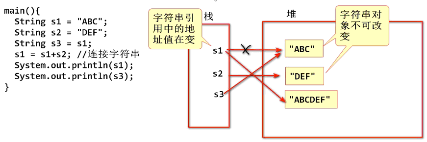

### 什么是字符串？


> String使用final继承，不能被继承，因为它的特权太大
>
> 字符串一旦创建，对象永远无法改变；就算修改后那也是新的字符串对象
>
> ```java
> mian{
>     String str = "hello";//创建字符串，但实际的操作就是3~8行，存数据还是char来存
>     //而且char value[]也是final的，一旦赋值，不可改变
>     char[] array = new char[5];
>     array[0] = 'h';
>     array[1] = 'e';
>     array[2] = 'l';
>     array[3] = 'l';
>     array[4] = 'o';    
> }
> ```
>
> 

> **二进制讲解**
>
> 

> 英文占一个字节（ASC），中文占两个字节（GBK）
>
> （unicode）全球编码：收集全世界的文字
>
> UTF-8只是unicode的一部分内容，存放世界上的主流文字


### 字符串常量池

> Java中利用字符串常量池 优化，重复利用字符串，提升效率优化性能
>
> - 使用双引号（字符串字面量）创建的字符串对象，自动缓存到字符串常量池
>   - 所有相同的字面量会被替换成相同字符串对象的引用
>   - 字符串<u>常量</u>在内容相同时候也会替换为同样的引用
>   - 字符串<u>常量</u>连接结果内容相同时候也会替换为相同的引用
> - 使用new运算创建的字符串，动态字符串连接的结果，不会放到字符串常量池（new运算注意区分）

```java
package Y2021M3D17;
/**
 *	String是不变对象，JVM对其做了一个优化，在内存中开辟了一段区域
 *	 作为常量池，凡是通过“字面量”形式创建的字符串对象都会缓存并重用。
 *	 因为重用对象，所以该对象内容不可变
 * @author Grant·Vranes
 *
 */
public class StringDemo {
    public static final String S = "123abc";//S是个常量,编译的时候会直接将S替换成123abc
    public static final String SS = "123";
	public static void main(String[] args) {
		String s1 = "123abc";//字面量形式创建，不是new出来的
		String s2 = "123abc";//s1重用s1创建的字符串对象
		System.out.println(s1==s2);//true
		
        System.out.println(s1==S);//true
        
		//修改内容会创建并引用新对象
		s1 = s1+"!";
		System.out.println("s1:"+s1);//123abc!
		System.out.println("s2:"+s1);//123abc	不会受影响
        
        String s4 = "123"+"abc";//编译优化为"123abc"
        System.out.println(s1==s4);//true

        String s5 = "123";
        String s6 = "abc";
        String s7 = s5 + s6;//s7 引用新对象，不会字面量复用
        System.out.println(s1==s7);//false
        
        String s8 = SS + "abc";
        System.out.println(s1 == s8);//true
	}
}

```


### 字符串不变特性

```java
		String s2 = "123abc";
		//new一定创建新对象
		String s4 = new String("123abc");
		System.out.println(s2==s4);//false

		/*
		 *	编译器有一个优化措施，当编译源代码时发现一个计算表达式
		 *	所有参数都是字面量时(非变量),会直接进行计算，并将结果编
		 *	译到class文件中。所以，下面代码在class文件中为
		 *	String s5 = "123abc";
		 */
		String s5 = "123" + "abc";
		System.out.println(s2==s5);//true
		
		/*
		 *计算表达式一方为变量，那么会在运行期间拼接，那么会创建新对象
		 */
		String s = "123";
		String s6 = s + "abc";
		System.out.println(s2==s6);//false
```


#### 重要面试题

```java
//如下代码创建了几个对象（字符串对象）
        //要严格来说，创建了3个对象，一个字符数组对象和两个字符串对象
        String str = new String("ABC");
        /**
         * 运算过程分析：
         * 1、Java 创建了字符串对象"ABC",这个对象被缓存到字符串常量池
         * 2、new 运算调用字符串的构造器创建一个新字符串
         *          又会在内存中生成一个新字符串对象"ABC"
         *
         * 结论：上述代码创建了 两个字符串对象
         */
```


### 字符串方法

##### Length()

> 返回字符串中字符的数量，字符串的长度（length）
>
> 注意：数组的长度是属性，字符串的长度是方法
>
> ```java
> int[] arr = {1,2,3};
> for(int i=0;i<arr.length;i++)
>     
> String str = "123";
> for(int i=0;i<str.length();i++)
> ```

```java
package Y2021M3D17_string;
/**
 * int length()
 * @author Grant·Vranes
 */
public class LengthDemo {
	public static void main(String[] args) {
		String str = "我爱java";
		System.out.println(str.length());
	}
}
```


##### equals()

> 两个字符串是否相等？
>
> - \==无法判断对象是否相等，==只能判断是否是同一个对象
> - Java提供了API方法，用于比较两个字符串内容是否一样
> - 如果需要比较两个字符串内容是否相同就必须使用equals方法
> - Java提供了专用的忽略大小写比较相等的方法

```java
String s1 = new String("ABC");
String s2 = new String("ABC");
System.out.println(s1==s2);//false
System.out.println(s1.equals(s2));//true

String s3 = "ABC";
String s4 = "ABC";
System.out.println(s3==s4);//true
System.out.println(s3.equals(s4));//true

String s5 = "Demo";
String s6 = "demo";
System.out.println(s5.equalsIgnoreCase(s6));//true
```

```java
		/*
         * 检查字符串的后缀
         */
        String file1="那些年我们追过的女孩.mp4";
        String file2="战狼.jpg";
        System.out.println(file1.endsWith(".mp4"));
        System.out.println(file2.endsWith(".mp4"));
```


##### indexOf()

> 检查一个字符串在林一个字符中的位置

```java
package Y2021M3D17_string;
/**
 * int indexOf(String str)
 * 返回给定字符串在当前字符串中的位置，若当前
 * 字符串不包含该内容返回值为-1
 * @author Grant·Vranes
 *
 */
public class IndexOfDemo {
	public static void main(String[] args) {
		//			  0123456789
		String str = "thinking in java";
		int index = str.indexOf("in");
		System.out.println(index);//2
		//重载方法：方法名相同，方法参数不同
		//可以从指定位置开始查找
		index = str.indexOf("in",2);
		System.out.println(index);//2
		//查找最后一次出现的位置
		index = str.lastIndexOf("in");
		System.out.println(index);//9		
	}
}
```


##### trim()

```java
package Y2021M3D17_string;
/**
 * String trim()
 * 去除一个字符串前导和后继空白字符，就是去除两边的空白字符
 * @author Grant·Vranes
 *
 */
public class TrimDemo {
	public static void main(String[] args) {
		/**
         * 去掉字符串前后的空白
         * 空白字符：空格 换行 回车等ASCii编码小于等于32的字符
         */
        String name = "  Tom \t \n ";
        String n = name.trim();//创建一个新对象
        System.out.println(n);
        System.out.println(name);
	}
}
```


##### charAt()

```java
package Y2021M3D17_string;
/**
 * char charAt(int index)
 * 用于返回字符串指定位置的字符，参数index表示指定的位置
 * @author Grant·Vranes
 *
 */
public class CharAtDemo {
	public static void main(String[] args) {
		String str = "thinking in java";
		System.out.println(str.charAt(9));//i
	
		/*
		 *	判断回文
		 *	上海自来水来自海上 
		 */
		str = "上海自来水来自海上";
		int i;
		for (i = 0; i < str.length()/2; i++) {
			char c1 = str.charAt(i);
			char c2 = str.charAt(str.length()-1-i);
			if(c1 != c2) {
				System.out.println("不是回文");
				break;
				//return;//结束方法
			}
		}
		if(i == str.length()/2) {//当整体都走完了
			System.out.println("是回文");
		}
	}
}
```


##### startsWith() endsWith()

```java
package Y2021M3D17_string;
/**
 * boolean startsWith(String str)
 * boolean endsWith(String str)
 * 判断当前字符串是否是以给定字符串开始或结束的
 * @author Grant·Vranes
 *
 */
public class StartsWithDemo {
	public static void main(String[] args) {
		String str = "thing";
		
		boolean starts = str.startsWith("th");
		System.out.println(starts);//true
		
		boolean ends = str.endsWith("ing");
		System.out.println(ends);//true
		
		/*	这个可以应用在上传图片文件上，如果检测到你的后缀
		 * 	不是.jpg或者其他图片格式，就不允许上传
		 */	
	}
}
```


##### substring()

```java
package Y2021M3D17_string;
/**
 * String substring(int start, int end)
 * 截取指定范围内的字符串。两个参数为开始到结束的下标
 * 注:java api有一个特点，通常用两个数字表示范围时都是
 * “含头不含尾(左闭右开)”的
 * @author Grant·Vranes
 *
 */
public class SubstringDemo {
	public static void main(String[] args) {
		//			   0123456789
		String host = "www.baidu.com";
		System.out.println(host.substring(4, 9));//baidu
		
		//从参数开始截取到末尾
		System.out.println(host.substring(4));	
	}
}
```

```java
/*
         * 截取子字符串
         * substring 子字符串
         * - 参数是两个整数，第一个是字符开始位置，第二个是结束位置
         *   截取时候，从开始位置到结束位置之前
         * - 此API可以按照长度截取子字符串
         * - 重载方法substring(开始位置)，从开始位置到字符串
         *   的最后，全部截取为子字符串
         */
        //            0123456789012345
        String str = "Thinking In Java";
        String s = str.substring(9, 11);
        System.out.println(s);//In
        //从4开始截取连名个字符 substring(开始,开始+个数
        s = str.substring(4, 4 + 4);
        System.out.println(s);//king
        //重载方法
        s = str.substring(12);
        System.out.println(s);//Java
```


##### toUpperCase()

```java
package Y2021M3D17_string;
/**
 * String toUpperCase()
 * String toLowerCase()
 * 将当前字符串中的英文部分转换为全大写或者全小写
 * @author Grant·Vranes
 *
 */
public class ToUpperCaseDemo {
	public static void main(String[] args) {
		String str = "Java";
		System.out.println(str.toUpperCase());//产生了新字符串
		
		System.out.println(str.toLowerCase());
	}
}
```


##### valueOf()

> String提供了一组静态方法value，作用是将其他类型转换成String类型
>
> 

```java
package Y2021M3D17_string;
/**
 * String提供了一组重载的静态方法:valueOf
 * 可以将给定的内容转换为字符串（将其他类型转换为String）
 * @author Grant·Vranes
 *
 */
public class ValueOfDemo {
	public static void main(String[] args) {
		int d = 1;
		String str = String.valueOf(d);
		System.out.println(str instanceof String);//true
		
		str = d+"";//这种方法也可以转换成字符串，但偶尔用可以，正经的还是用valueOf()	
	}
}
```


##### matches():支持正则表达式

```java
package Y2021M3D17_string;
/**
 * String支持正则表达式方法之一：
 * boolean matches(String regex)	只支持字符串的匹配
 * 用给定的正则表达式验证当前字符串是否符合其格式要求
 * @author Grant·Vranes
 *
 */
public class MatchesDemo {
	public static void main(String[] args) {
		String email = "fancq@tedu.cn";
		/*
		 *验证email格式的正则表达式
		 *用户名@域名，建议先写好，然后在粘贴下去，因为java中转移字符与正则表达式不同，java只认为\n\r\t等，不认识其他的，所有有两个\\
		 *\w+@\w+(\.[a-zA-Z]+)+ 
		 */
		String regex = "\\w+@\\w+(\\.[a-zA-Z]+)+";
		boolean match = email.matches(regex);
		/*
		 * 注意：matches方法指定的的正则表达式就算不指定边界匹配符，也是做全匹配验证的
		 */
		
		if(match) {
			System.out.println("是邮箱的正确格式");
		}else {
			System.out.println("不是邮箱的正确格式");
		}
	}
}

```


##### split()：支持正则表达式

```java
package Y2021M3D17_string;
import java.util.Arrays;
/**
 * String[] split(String regex)
 * 使用给定的正则表达式来拆分当前字符串
 * 并将拆分后的内容以字符串数组形式返回
 * @author Grant·Vranes
 *
 */
public class SplitDemo {
	public static void main(String[] args) {
		String str = "abc123def";
		String regex = "[0-9]+";
		String[] array = str.split(regex);
		System.out.println(array.length);//2
		System.out.println(Arrays.toString(array));//[abc, def]
	
		String regex1 = "[0-9]";
		String[] array1 = str.split(regex1);
		System.out.println(array1.length);//4
		System.out.println(Arrays.toString(array1));//[abc, , , def]
        /**
         * 如果字符串最开始就遇到了可拆分项时，则拆分出的第一个元素为一个空字符串
         * 如果在字符串中间某位置连续遇到了可拆分项，他们之间会拆分出一个空字符串
         * 如果在字符串末尾出现了可拆分项，那么所有拆分出来的空字符串都会被忽略
         */
        str = ".1.2.3..";
        arr = str.split("\\.");//注意这里是正则表达式
        System.out.println(Arrays.toString(arr));
	}
}
```

###### 案例：图片重命名

```java
案例
package Y2021M3D17_string;
/**
 * 	图片重命名
 * @author Grant·Vranes
 *
 */
public class SplitTestDemo {
	public static void main(String[] args) {
		String imageName = "abc.jpg";
		imageName = imageRename(imageName);
		System.out.println(imageName);
		
		/*
		 * 	可以使用如下方式转换为具体时间
		 * 	long time = 1535078983390L;
		 * 	Date date = new Date(time);
		 * 	System.out.println(date);
		 */
	}
	
	public static String imageRename(String imageName) {
		//按照"."拆分
		String[] data = imageName.split("\\.");
		imageName = System.currentTimeMillis()+"."+data[1];
		return imageName;
	}
} 
```


##### replaceAll()：支持正则表达式

```java
package Y2021M3D17_string;
/**
 * String replaceAll(String regex, String str)
 * 将当前字符串中符合正则表达式要求的部分替换为给定内容
 * @author Grant·Vranes
 *
 */
public class ReplaceAllDemo {
	public static void main(String[] args) {
		String str = "abc123def456ghi789jkl";
		/*
		 * 	将数字部分替换为"#NUM#"
		 */
		String regex = "[0-9]+";
		str = str.replaceAll(regex, "#NUM#");
		System.out.println(str);//abc#NUM#def#NUM#ghi#NUM#jkl
	}
}
```

```java
案例
package Y2021M3D17_string;
/**
 * 	和谐用语:将违禁内容替换为*
 * @author Grant·Vranes
 *
 */
public class ReplaceAllTestDemo {
	public static void main(String[] args) {
		String regex = "(wqnmlgdsb|mmp|nc|mdzz|cnm|djb)";
		String message = "wqnmlgdsb!你cnm";
		message = message.replaceAll(regex, "***");
		System.out.println(message);//***!你***
	}
}
```


### 修改字符串的性能问题

```java
/**
 *	字符串频繁修改带来的性能损耗
 */
mian{
	String str = "a";
    for(int i=0; i<1000000000;i++){
		str += "a";//修改字符串，不停创建新对象
    }
    System.out.println("执行完毕");//要执行很长时间，并且Java中的垃圾回收器GC会很繁忙
}
---
使用StringBuilder
mian{
	StringBuilder str = new StringBuilder("a"); 
    for(int i=0; i<1000000000000;i++){
		builder.append("a");
    }
    System.out.println("执行完毕");//执行很快
}
```

为了解决字符串频繁修改带来的性能损耗，java带来了StringBuilder

StringBuilder是可变字符串。有关字符串的内容计算，建议采用StringBuilder实现，这样性能会好一些

```java
package Y2021M3D17_string;
/**
 * StringBuilder专门用来修改字符串内容的API，
 * 其内部维护一个可变的char数组，并提供了用于修改字符串的相关操作：常见的有：增、删、改、插
 * String由于其优化设计导致的问题就是不能频繁修改(每次都创建新对象)
 */
public class StringBuilderDemo {
	public static void main(String[] args) {
		String str = "好好学习";
		
		//默认表示空字符串
		//StringBuilder builder = new StringBuilder();
		StringBuilder builder = new StringBuilder(str);//基于给定的字符串创建StringBuilder对象，值为str的值
	
		/*
		 * append():拼接字符串
		 */
		builder.append("，天天向上");
		//StringBuilder的toString方法用来获取其内部表示的字符串内容
		str = builder.toString();
		System.out.println(str);//好好学习，天天向上
		
		/*
		 * replace():换掉指定位置内容,左闭右开
		 */
		builder.replace(5, 9, "改变世界");
		System.out.println(builder.toString());//好好学习，改变世界
		
		/*
		 * delete():删除字符串中指定位置的元素,左闭右开
		 */
		builder.delete(0, 5);
		System.out.println(builder.toString());//改变世界
		
		/*
		 * insert():插入
		 */
		builder.insert(0, "我");
		System.out.println(builder.toString());//我改变世界
	}
}
```

> **StringBuffer和StringBuilder**
>
> - StringBuffer是线程安全的，同步处理的，性能稍慢
> - StringBuilder是非线程安全的，并发处理的，性能稍快
>
> 注意：StringBuffer和StringBuilder两者方法和参数都相同，区别就是线程的安全与不安全，需要是好东西，不需要是累赘。但一般情况下，我们基本不会在多线程下操作同个字符串，所以基本上遇不到安全问题。所以Java在1.5版本推出了StringBuilder，在多线程下使用StringBuffer，单线程下使用StringBuilder
>
> **StringBuffer和StringBuilder的底层实现**
>
> - https://blog.csdn.net/longfulong/article/details/78700239


### 正则表达式


  


## 16 Object（2021.3.19）


- Class  `Object`是类`Object`结构的根。  每个类都有`Object`作为超类。 所有对象（包括数组）都实现了这个类的方法。 

###### 重写equals方法

```java
package Y2021M3D19_Object;
/**
 * 使用当前类测试重写Object相关方法
 * @author Grant·Vranes
 *
 */
public class Point {
	private int x;//数据私有化，派生类如果要获取或者修改私有化的数据，只能通过get和set方法来进行
	private int y;
	
	//构造方法
	public Point(int x, int y) {
		super();
		this.x = x;
		this.y = y;
	}
	
	//get,set方法:右击选择Source...
	public int getX() {
		return x;
	}
	public void setX(int x) {
		this.x = x;
	}
	public int getY() {
		return y;
	}
	public void setY(int y) {
		this.y = y;
	}
	
	/**
	 *  toString方法会被很多API调用。所以当我们定义
	 *	 一个类时，很常见的操作就是重写这个方法。该方法的
	 *	意义是将当前对象转换为一个字符串形式。该字符串内
	 *	容格式没有严格的要求。
	 *	原则为包含这个对象的相关属性信息。
	 */
	public String toString() {
		return "("+x+","+y+")";
	}
	
	/**
	 * equals的作用时比较当前对象与参数对象的内容是否一致
	 */
	public boolean equals(Object obj) {
		if(obj == null) {
			return false;
		}
		if(this == obj) {
			return true;
		}
		if(obj instanceof Point) {//obj与我同一类型
			Point p = (Point)obj;//先转成一个Point实例出来
			return this.x==p.x&&this.y==p.y;
		}
		return false;
	}
}
-------------
package Y2021M3D19_Object;
/**
 *	 测试Point重写Object相关方法：toString   equals
 * @author Grant·Vranes
 *
 */
public class TestPoint {
	public static void main(String[] args) {
		Point p = new Point(12,13);
		
		 /**
         *  String toString()
         *  该方法返回一个字符串，作用是将当前对象转换为一个字符串。
         *  Object中该方法的默认实现为返回当前对象的地址作为内容
         *  格式：类名@地址
         * 	通常我们定义的类如果需要使用到toString方法时，
         * 	就应当重写这个方法。Object提供的输出的是该对象
         * 	的句柄(相当于该对象的类名+地址)，没什么实际意义。
         */
		String str = p.toString();
		System.out.println(str);//重写前Y2021M3D19_Object.Point@7a5d012c 重写后(12,13)
	
		/*
		 *  System.out.println(Object obj);//默认调用
		 * 	该方法会将给定对象的toString方法返回的字符串输出到控制台
		 */
		System.out.println(p);//(12,13)，看似没有调用toString方法，但实际上java的API默认调用了
        
         /*
            任何内容与字符串链接结果都是字符串。而实际执行时，非字符串的对象
            都会自动调用toString方法，将转换后的字符串进行链接
         */
        String line = "一见生财" + p;
        System.out.println(line);//一见生财(12,13)
	---------------
        //==时判断是否同一个，equals则是比较值
		Point p2 = new Point(12, 13);
		System.out.println(p==p2);//false
		System.out.println(p.equals(p2));//没重写equals方法就是false，写了之后就true
		/*
		 * Object中的equals方法默认是执行==，如下
		 * public boolean equals(Object obj) {
         *		return (this == obj);
    	 * }
    	 * 	自己定义的类中，需要去重写她，不然没有任何意义(与==一样的效果)。
    	 *	但在java已经定义好的类中是可以直接用的(因为它已经重写好了)
		 *	我们定义的类如果使用equals,就应当重写这个方法。Object
		 *	提供的equals方法本身内部就是用“==”进行比较的，没有实际意义
		 *	Java API提供的类，toString，equals方法都妥善进行了重写。
		 */	
	}
}
```


## 17 包装类


```java
为什么会出现包装类呢？
    包装类有8个，对应8个基本类型，因为基本类型是不能直接参与面向对象开发，为了他们具有面向对象的相关特性，为了能让他们以对象的形式参与面向对象的开发，才出现了包装类
```


#### 转换包装类

```java
package Y2021M3D19_integer;
/**
 *	包装类
 *	包装类是为了解决基本类型不能直接参与面向对象开发的问题
 *	其中6个数字类型的包装类继承自Number类
 *	java.lang.Number是一个抽象类，定义了几个抽象方法
 *	要求数字类型的包装类可以将其表示的数字以任意数字类型返回
 */
public class IntegerDemo1{
	public static void main(String[] args) {
		int d = 1;
		/*
		 * 	以下两行转换成包装类不是Java推荐的方法，
		 * 	因为每次调用都会重新new对象
		 */
		Integer i1 = new Integer(d);
		Integer i2 = new Integer(d);
		
		System.out.println(i1==i2);//false
		System.out.println(i1.equals(i2));//true
-----------------------------------------------------
		/*
		 * 	java中推荐使用Integer.valueOf()转换包装类
		 * 	为什么推荐呢？去看源码就知道：valueOf方法使用的时候
		 * 	是不是要new新的对象，他首先要判断你这个要装箱的数是不是
		 * 	在这个整数缓存中，如果在整数缓存中，就重用对象，所以
		 * 	i3==i4就为true，因为指向同一对象。如果超出[-128，127]
		 * 	这个范围，就会重新new对象，所以此时i3和i4就不再指向同一
		 * 	对象，i3==i4就为false。更多了解可以看代码下方的图
		 */
		Integer i3 = Integer.valueOf(d);
		Integer i4 = Integer.valueOf(d);
		
		System.out.println(i3==i4);//true
		System.out.println(i3.equals(i4));//true
------------------------------------------------------
		/*
		 *	 包装类转换为基本类型
		 */
		d = i1.intValue();
		System.out.println(d);
------------------------------------------------------	
		/*
		 *	数字类型的包装类都定义了两个常量
		 *  MAX_VALUE
		 *  MIN_VALUE
		 * 	用于表示该包装类对应的基本类型的取值范围
		 */
		int imax = Integer.MAX_VALUE;
		System.out.println(imax);//2147483647
		int imin = Integer.MIN_VALUE;
		System.out.println(imin);//-2147483648
	}
}
一个字节之内的整数进行重用
整数缓存的最小值为-128，最大值为127，如果要装箱的数超过这个范围就会重新new对象
```


#### JDK1.5的自动拆装箱特性

```java
package Y2021M3D19_integer;
/**
 *  JDK1.5版本推出时推出了一个特性：
 * 	自动拆装箱
 * 	该特性是编译器认可的，当我们在基本类型和其对应的引用
 * 	类型之间相互赋值时，编译器会自动补全拆装箱的代码
 * @author Grant·Vranes
 *
 */
public class AutoBoxingDemo {
	public static void main(String[] args) {
		/*
		 * 	触发了编译器的自动拆箱特性：
		 * 	编译器会补全代码，将包装类转换为基本类型
		 * 	下面的代码会被编译器补充代码为
		 * 	int d = new Integer(1).intValue();
		 */
		int d = new Integer(1);
        
		/*
		 * 	触发自动装箱特性，编译器会补充代码
		 *	将基本类型转换成包装类型
		 * 	Integer i = Integer.valueOf(d);
		 */
		Integer i = d;
	}
}
```


#### 包装类都有提供一个静态方法

```java
package Y2021M3D19_integer;
/**
 *	包装类都提供了一个静态方法
 * 	parseXXX(String str)
 * 	可以将字符串解析为对应的基本类型，但是需要注意，该字符串
 * 	必须能够正确描述该基本类型可以保存的值，否则会抛出异常
 * 	例如：java.lang.NumberFormatException表示
 * 		字符串在转数字的时候格式不对
 * @author Grant·Vranes
 *
 */
public class parseDemo {
	public static void main(String[] args) {
		String str = "123";//123.123或者'a'都会报错,因为他要转换的类型不允许
		int d = Integer.parseInt(str);
		System.out.println(d);
		
		double dou = Double.parseDouble("123.123");
		System.out.println(dou);
	}
}
```


## 18 File（2021.3.20）

**File这个API属于java.io.File包中**，File的每一个实例用于表示硬盘上的一个文件或者目录，但是只是映射

#### File中的基本方法

```java
package Y2021M3D20_file;
import java.io.File;
/**
 * java.io.File;
 * File的每一个实例用于表示硬盘上的一个文件或者目录
 * 使用File可以:
 * 1.访问其表示的文件或目录的属性信息(名字,大小,访问权限等信息)
 * 2.操作文件或目录(创建,删除)
 * 3.访问目录子项
 * 但是不能访问文件数据
 * @author Grant·Vranes
 *
 */
public class FileDemo {
	/*
	 * 创建File时，指定的路径通常使用相对路径，好处在于：可以跨平台
	 * 相对路径到底相对在哪里，要看程序的运行环境指定的位置
	 * 在ecplise中运行java程序时，指定的行对路径中“当前目录”是当前程序所在的项目目录
	 */
	public static void main(String[] args) {
        /*
		 * 	这个file获取的只是文件在硬盘上的一个映射，它不管有没有这个文件
		 */
		File file = new File("./test.txt");
		
		/*
		 * 获取文件名
		 */
		String name = file.getName();
		System.out.println(name);
		
		/*
		 * 获取文件大小(字节量)
		 */
		long length = file.length();
		System.out.println(length);
		
		/*
		 * 获取权限情况
		 */
		boolean cr = file.canRead();//是否可读
		boolean cw = file.canWrite();//是否可写
		System.out.println("可读:"+cr);
		System.out.println("可写:"+cw);
		
		/*
		 * 是否隐藏
		 */
		boolean ih = file.isHidden();
		System.out.println(ih);
	}
}
```

##### 使用File创建一个文件

```java
import java.io.File;
import java.io.IOException;
/**
 * 使用File创建一个文件
 * @author Grant·Vranes
 *
 */
public class CreateNewFileDemo {
	public static void main(String[] args) throws IOException {
		/*
		 * 在当前目录下创建一个名为demo.txt的文件
		 */
		File file = new File("./demo.txt");
		if(!file.exists()) {//检测是否存在该文件
			file.createNewFile();
			System.out.println("文件已创建");
		}else {
			System.out.println("文件已存在");
		}
	}
}
```

##### 删除一个文件

```java
import java.io.File;
/**
 * 删除一个文件
 * @author Grant·Vranes
 *
 */
public class DeleteFileDemo {
	public static void main(String[] args) {
		/*
		 * 将当前目录下的demo.txt文件删除
		 */
		File file = new File("./demo.txt");
		if(file.exists()) {//检测是否存在该文件
			file.delete();
            /*
			 * 	前提要求：该文件存在
			 *	如果不存在，该语句也能执行，但是不会进行实际的删除操作，只会返回一个false
			 *	boolean isDelete = file.delete();//false
			 *	所以说实际的删除不能这么做，要用if判断文件是否存在
			 */
			System.out.println("文件已删除");
		}else {
			System.out.println("文件不存在");
		}
	}
}
```

##### 创建一个目录

```java
import java.io.File;
/**
 * 创建一个目录
 * @author Grant·Vranes
 *
 */
public class MKDirDemo {
	public static void main(String[] args) {
		/*
		 * 将当前目录下创建一个名为demo的目录
		 * 前提条件是父目录要存在
		 */
		File dir = new File("./demo");
		if(!dir.exists()) {//检测是否存在该文件
			dir.mkdir();
			System.out.println("目录创建完毕");
		}else {
			System.out.println("目录已存在");
		}
	}
}
```

> ```
> mkdir()方法在创建目录时要求该目录所在的目录必须存在
> mkdirs()昂发则会将所有不存在的父目录一同创建出来
> ```

##### 创建一个多级目录

```java
import java.io.File;
/**
 * 创建一个多级目录
 * @author Grant·Vranes
 *
 */
public class MKDirsDemo {
	public static void main(String[] args) {
		/*
		 * 在当前目录下创建 a/b/c/d/e/f目录
		 */
		File dir = new File("./a/b/c/d/e/f");
		if(!dir.exists()) {//检测是否存在该文件
			//dir.mkdir();//前提条件：要求创建的目录所在的父目录必须存在,a这个目录就不存在，后面的就更别谈了
			dir.mkdirs();//在创建目录时，会将所有不存在的父目录全部创建
			System.out.println("目录创建完毕");
		}else {
			System.out.println("目录已存在");
		}
	}
}
```

##### 删除目录

```java
import java.io.File;
/**
 * 删除目录
 * @author Grant·Vranes
 *
 */
public class DeleteDirDemo {
	public static void main(String[] args) {
		/*
		 * 删除当前目录下名为demo的目录
		 */
		File dir = new File("./demo");
		if(!dir.exists()) {//检测是否存在该文件
			dir.delete();
            /*
			 * 	前提要求：该目录必须是个空目录
			 *	如果不是空目录，该语句也能执行，但是不会进行实际的删除操作，只会返回一个false
			 *	boolean isDelete = dir.delete();//false
			 *	所以说实际的删除不能这么做，要用if判断delete()方法的返回值是否为true
			 */
			System.out.println("删除完毕");
		}else {
			System.out.println("目录不存在");
		}
	}
}

```

##### 删除多级目录

```java
import java.io.File;
/**
 *	删除多级目录
 * 	完成方法，实现删除给定File所表示的文件或目录
 * @author Grant·Vranes
 *
 */
public class Test {
	public static void main(String[] args) {
		File dir = new File("./a");//a目录下可是有多级目录的
		delete(dir);
	}
	public static void delete(File f) {
		if(f.exists()) {
			if(f.isDirectory()) {//是目录
				//先清空该目录
				File[] subs = f.listFiles();
				for(File file : subs) {
					delete(file);//递归思想
				}
			}
			f.delete();//如果不是目录即文件，直接删除
		}else {
			System.out.println("文件不存在");
		}
	}
}
```

##### 获取当前目录下所有子项

```java
package Y2021M3D20_file;

import java.io.File;

/**
 * 	获取当前目录下的所有子项
 * @author Grant·Vranes
 *
 */
public class ListFilesDemo {
	public static void main(String[] args) {
		File dir = new File(".");
		/*
		 * boolean isFile()
		 * boolean isDirectory()
		 *	判断当前File对象表示的是一个文件还是一个目录
		 */
		if(dir.isDirectory()) {
			File[] subs = dir.listFiles();
			/*
			 * File[] listFiles()
			 * 	该方法会将当前File表示的目录中所有子项返回
			 */
			for(File f : subs) {
				System.out.println(f);
			}
		}
	}
}
```

##### listFiles的重载方法

```java
package file;

import java.io.File;
import java.io.FileFilter;
import java.util.Arrays;

/**
 * @author Akio
 * @ClassName ListFilesDemo2
 * @Date 2021/7/23 14:37
 * @Description 有条件的获取某个目录下的子项
 * listFiles(Filter)	支持传入一个文件过滤器
 */
public class ListFilesDemo2 {
    public static void main(String[] args) {
        //获取当前目录下的所有.txt文件
        File dir = new File(".");
        if (dir.isDirectory()){
            File[] files = dir.listFiles(new FileFilter() {
                @Override
                public boolean accept(File pathname) {
                    return pathname.getName().endsWith(".txt");
                }
            });
            System.out.println(Arrays.toString(files));
        }else{
            System.out.println("非目录");
        }
    }
}
```

##### 实现删除给定File所表示的文件或目录

```java
package Y2021M3D20_file;

import java.io.File;

/**
 * 	完成方法，实现删除给定File所表示的文件或目录
 * @author Grant·Vranes
 *
 */
public class Test {
	public static void main(String[] args) {
		File dir = new File("./a");//a目录下可是有多级目录的
		delete(dir);
	}
	public static void delete(File f) {
		if(f.exists()) {
			if(f.isDirectory()) {//是目录
				//先清空该目录
				File[] subs = f.listFiles();
				for(File file : subs) {
					delete(file);//递归思想
				}
			}
			f.delete();//如果不是目录即文件，直接删除
		}else {
			System.out.println("文件不存在");
		}
	}
}
```

##### 递归思想面试题

```java
package Y2021M3D20_file;
/**
 *	关于递归思想的的小题目
 * 	1、完成1+2+3+4+……+100,并输出结果
 * 		输出每次累加结果
 * 		这段代码中不得出现for，while关键字
 * 	2、一块钱买1瓶汽水，2个空瓶可以换1瓶汽水
 * 		3个瓶盖可以换一瓶汽水。问：20块钱最终可以得到多少瓶汽水
 * @author Grant·Vranes
 *
 */
public class Test2 {
	private static int count = 1;
	public static void main(String[] args) {
		System.out.println("1、前100个数的累加和：" + add(0));
		System.out.println("2、20块可以买：" + cal(20,20,20));
	}
	public static int add(int temp) {//传入的temp一定是累积的和
		int ans = temp;//ans是结果
		if(count>=1 && count<=100) {
			ans += count;
			count++;
			ans = add(ans);
		}
		return ans;
	}
	public static int cal(int sum,int cap,int bottle){
		int add=cap/3+bottle/2;//每次循环所增加的汽水
		sum=sum+add;
		System.out.println(sum);
		cap=cap%3+add;//每次循环后的瓶盖子
		System.out.println(cap);
		bottle=bottle%2+add;//每次循环后的瓶子
		System.out.println(bottle);
		System.out.println("-----------------");
		if(cap<3&&bottle<2){//递归结束的条件
			return sum;
		}else{
			return cal(sum,cap,bottle);//递归调用
		}
	}
}
```


#### FileFilter文件过滤器

```java
import java.io.File;
import java.io.FileFilter;
/**
 * ListFiles提供了一个重载的方法，可以指定一个文件过滤器(FileFilter),
 *	 然后将满足该过滤器要求的子项返回
 * @author Grant·Vranes
 *
 */
public class ListFilesDemo2 {
	public static void main(String[] args) {
		/*
		 *	 获取当前目录中名字以"."开头的子项
		 */
		File dir = new File(".");//当前目录
		FileFilter filter = new FileFilter() {//匿名内部类,因为这个只用一次，重新去入注释掉的地方创建类就很不必要
			//重写过滤器类中accept方法
			public boolean accept(File file) {
				String name = file.getName();
				return name.startsWith(".");
			}
		};
//		MyFilter myFilter = new MyFilter();
//		myFilter.accept(dir);
//		File[] subs = dir.listFiles(myFilter);
		File[] subs = dir.listFiles(filter);
		for(File f : subs) {
			System.out.println(f);
		}
	}
}

//class MyFilter implements FileFilter{
//	@Override
//	public boolean accept(File file) {
//		String name = file.getName();
//		return name.startsWith(".");
//	}
//	
//}
```


#### 初探Lambda表达式

package lambda;

import java.io.File;
import java.io.FileFilter;

/**
 * @author Akio
 * @ClassName LambdaDemo
 * @Date 2021/7/23 15:38
 * @Description JDK8之后推出了一个新的特性：lambda表达式
 *              他可以使用更精简的语法创建匿名内部类
 *              需要注意：只有实现的接口中包含一个抽象方法时
 *              才可以使用lambda表达式创建其匿名内部类
 *              语法：
 *              (参数列表)->{
 *                  方法体
 *              }
 */
public class LambdaDemo {
    public static void main(String[] args) {
        //创建一个文件过滤器，过滤内容：保留文本文件
        FileFilter filter = new FileFilter() {
            @Override
            public boolean accept(File pathname) {
                return pathname.getName().endsWith(".txt");
            }
        };

    ​    //Lambda简洁写法
    ​    FileFilter filter1 = (File pathname) -> {
    ​        return pathname.getName().endsWith(".txt");
    ​    };
    ​    
    ​    //Lambda中参数的类型可以不写
    ​    FileFilter filter2 = (pathname) -> {
    ​        return pathname.getName().endsWith(".txt");
    ​    };

    ​    //如果方法体中只有一句代码，则方法体外围的{}可以忽略不写，如果有return也要一同忽略
    ​    FileFilter filter3 = (pathname) -> pathname.getName().endsWith(".txt");
    ​    
    ​    //如果参数列表中只有一个参数，那么()可以不写
    ​    FileFilter filter4 = pathname -> pathname.getName().endsWith(".txt");
    ​    
    ​    //获取当前目录中所有的文本文件
    ​    File dir = new File(".");
    ​    File[] subs = dir.listFiles(pathname -> pathname.getName().endsWith(".txt"));
    ​    System.out.println(Arrays.toString(subs));
    }
}


## 19 RandomAccessFile(RAF)(2021.3.21)

#### RAF实现文件的读写操作

```java
package Y2021M3D21_raf;
import java.io.FileNotFoundException;
import java.io.IOException;
import java.io.RandomAccessFile;
/**
 * java.io.RandomAccessFile
 * RAF是专门用来读写文件数据的API。其基于指针对文件
 * 	数据进行读写操作，可以灵活的编辑文件数据内容。
 * 	创建RAF时可以指定对该文件的权限，常用的有两种：
 * r:只读模式
 * rw:读写模式
 * @author Grant·Vranes
 *
 */
public class RafDemo {
	public static void main(String[] args) throws IOException {
		/*
		 * 	对当前目录中的raf.dat文件读写
		 * RAF支持两种常用构造方法：
		 * RandomAccessFile(File file, String mode)
		 * RandomAccessFile(String path, String mode)
		 * 	注：相对路径中"./"是可以忽略不写的，因为默认就是从当前目录开始
		 * 
		 * RAF创建时含有写权限的情况下，当指定文件不存在时会自动将其创建出来
		 */
		RandomAccessFile raf = new RandomAccessFile("raf.dat", "rw");
		
		/*
		 * void write(int d)
		 * 	向文件中写入1字节，写的是给定的int值对应的2进制的”低八位“
		 * 	如果这个d=2，也是写入一个字节，不过写的就是2对应2进制的”低八位“
		 * 							  vvvvvvvv
		 * 00000000 00000000 00000000 00000000
		 */
		raf.write(1);
		System.out.println("写出完毕");
		raf.close();//释放资源,每次使用完一定要释放资源
	}
}
```

```java
package Y2021M3D21_raf;
import java.io.FileNotFoundException;
import java.io.IOException;
import java.io.RandomAccessFile;
/**
 * 	读取文件数据
 * @author Grant·Vranes
 *
 */
public class ReadDemo {
	public static void main(String[] args) throws IOException {
		/*
		 *	 读取当前目录中raf.dat文件内容
		 */
		RandomAccessFile raf = new RandomAccessFile("raf.dat", "r");
		/*
		 * int rand()
		 * 	读取一个字节，并以int形式返回
		 * 	若返回值为-1，则表示读取到了文件末尾
		 */
		int d = raf.read();
		System.out.println(d);
		raf.close();
	}
}
```

#### RAF实现文件的复制

```java
package Y2021M3D21_raf;
import java.io.FileNotFoundException;
import java.io.IOException;
import java.io.RandomAccessFile;
/**
 * 	复制文件操作
 * 	对于这个程序中的读写操作属于随机读写，从硬盘中的数据
 * 	读一个出来然后又写到硬盘中的另一个文件中去，这样充分
 * 	利用了硬盘的短板，所以在复制的时候非常慢
 * @author Grant·Vranes
 *
 */
public class CopyDemo {
	public static void main(String[] args) throws IOException {
		/*
		 * 	创建两个RAF，一个用来读原文件，一个用来往复制文件中写。
		 * 	顺序从原文件读取每个字节写入到复制文件中。
		 */
		RandomAccessFile src = new RandomAccessFile("image.JPG", "r");//原文件
		RandomAccessFile desc = new RandomAccessFile("image_cp.JPG", "rw");//待写入文件
		
		//记录每次读取到的字节
		int d = -1;//初始值为-1，说明当前没有读到（未开始读）
		long start = System.currentTimeMillis();
		while((d=src.read()) != -1) {//直到读完，当src.read()=-1时读完
			desc.write(d);
			/*
			 * 	切记，read和write是读一次写一次
			 * 	有的人可能认为
			 * while(src.read() != -1) {//直到读完，当src.read()=-1时读完
			 *	desc.write(src.read());
			 *	这样也是对的，实际上是错的，第一个read读出
			 *	判断是否读完，第二个接着第一个后面读，所以写入的都是后一个元素
			 */
		}
		long end = System.currentTimeMillis();
		System.out.println("复制完毕!,耗时:"+(end-start)+"ms");//复制完毕!,耗时:139747ms
		src.close();
		desc.close();
	}
}
```

```java
import java.io.IOException;
import java.io.RandomAccessFile;
/**
 * 	若希望提高读写效率，可以通过提高每次实际读写的数据量
 * 	，减少实际发生的读写操作来做到。
 * 	单字节读写：随机读写
 * 	一组字节读写：块读写
 * 	机械硬盘（磁盘）的块读写效率还是比较好的，但是随机读
 * 	写效率极差
 * @author Grant·Vranes
 *
 */
public class CopyDemo2 {
	public static void main(String[] args) throws IOException {
		
		RandomAccessFile src = new RandomAccessFile("image.JPG", "r");
		RandomAccessFile desc = new RandomAccessFile("image_cp.JPG", "rw");
		
		/*
		 * RAF提供的块读写操作的方法：
		 * int read(byte[] date)
		 * 	一次性读取给定的字节数组长度的字节量并存入到该数组中。返回值为“实际”
		 *	读取到的字节量，若返回值为-1，表示本次读取是文件末尾（没有读到任何字节）
		 * 
		 * void write(byte[] data)
		 * 	一次性写出给定字节数组中的所有字节
		 * 
		 * void write(byte[] data, int start, int len)
		 * 	一次性写出给定字节数组中从start处开始的len个字节
		 */
		
		//记录每次实际读取到的字节量
		int len = -1;
		//每次要求读取的字节量
        /*
		 * 8位2进制	1byte	1字节
		 * 1024byte	1kb
		 * 1024kb	1mb
		 * 1024mb	1gb
		 * 1024gb	1tb
		 */
		byte[] data = new byte[1024*10];//1024byte*10=10kb
		
		long start = System.currentTimeMillis();
		while((len=src.read(data)) != -1) {
			desc.write(data,0,len);//因为要复制的文件不一定正好是10kb的倍数，所以要注意复制进去的不能多也不能少
		}
		long end = System.currentTimeMillis();
		System.out.println("复制完毕!,耗时:"+(end-start)+"ms");//复制完毕!,耗时:31ms
		src.close();
		desc.close();
	}
}
```

#### RAF写字符串操作

```java
import java.io.FileNotFoundException;
import java.io.IOException;
import java.io.RandomAccessFile;
/**
 * 	写出字符串操作
 * @author Grant·Vranes
 *
 */
public class WriteStringDemo {
	public static void main(String[] args) throws IOException {
		RandomAccessFile raf = new RandomAccessFile("raf.txt", "rw");
		String line = "大家好!";
		/*
		 * String提供了转换为2进制的方法:
		 * byte[] getBytes();
		 */
		//byte[] data = line.getBytes();//不推荐无参的，以后在做网络编程的时候很可能字符集不匹配造成的乱码
		byte[] data = line.getBytes("UTF-8");//指定字符集,UTF-8一个字符占3个字节
		
		raf.write(data);
		System.out.println("写出完毕");
		raf.close();
	}
}
```

```java
import java.io.FileNotFoundException;
import java.io.IOException;
import java.io.RandomAccessFile;

/**
 *	 读取字符串
 * @author Grant·Vranes
 *
 */
public class ReadStringDemo {
	public static void main(String[] args) throws IOException {
		/*
		 *	 将raf.txt文件中的字符读取出来
		 */
		RandomAccessFile raf = new RandomAccessFile("raf.txt", "rw");
		//字符串转换为二进制
		byte[] data = new byte[(int)raf.length()];//这个length方法返回long值
		
		raf.read(data);//读出所有的字节
		
		//二进制转换成字符串.指定转换的字符集
		String str = new String(data,"UTF-8");
		System.out.println(str);
		raf.close();
	}
}
```

```java
import java.io.IOException;
import java.io.RandomAccessFile;
import java.io.UnsupportedEncodingException;
import java.util.Scanner;

/**
 * 	完成简易记事本工具
 * 	程序启动后，要求用户输入文件名，然后使用RAF对该文件读写操作
 * 	之后用户在控制台输入的每行字符串都写入到该文件中。
 * 	当用户输入了”exit“时，程序退出
 * @author Grant·Vranes
 *
 */
public class Test {
	public static void main(String[] args) throws IOException {
		Scanner scanner = new Scanner(System.in);
		System.out.println("输入文件名:");
		String fileName = scanner.nextLine();
		
		RandomAccessFile raf = new RandomAccessFile(fileName, "rw");
		
		System.out.println("请开始输入内容：");
		String line = "";
		while(true) {
			line = scanner.nextLine();
			if("exit".equals(line)) {
				/*
				 * 	注意：
				 * 	因为如果 变量.equals(字面量) 这样写，当变量为null时就会报空指针异常
				 * 	当变量和字面量去equals的时候，推荐用 字面量.equals(变量)
				 * 	这样就算变量为null也不会出错
				 */
				break;
			}
//			byte[] data = line.getBytes("UTF-8");
//			raf.write(data);
			raf.write(line.getBytes("UTF-8"));
		}
		System.out.println("bye");
		raf.close();
	}
}
```

#### RAF读写基本类型数据

```java
import java.io.IOException;
import java.io.RandomAccessFile;
/**
 * RAF读写基本类型数据，以及RAF的指针操作
 * @author Grant·Vranes
 *
 */
public class RafDemo2 {
	public static void main(String[] args) throws IOException {
		RandomAccessFile raf = new RandomAccessFile("raf.dat", "rw");
		
		//写入一个int的最大值到文件中
		int max = Integer.MAX_VALUE;
		/*
		 * int 最大值的2进制形式
		 * 							  vvvvvvvv
		 * 01111111 11111111 11111111 11111111
		 * max>>>24右移24位					   V溢出
		 * 00000000 00000000 00000000 01111111 11111111 11111111 11111111
		 * max>>>16							   V溢出	
		 * 00000000 00000000 01111111 11111111 11111111 11111111
		 * max>>>8							   V溢出
		 * 00000000 01111111 11111111 11111111 11111111
		 * max>>>0
		 * 01111111 11111111 11111111 11111111
		 */
		
		/*
		 * raf.write(max);//写入操作
		 * void write(int d)
		 * 	向文件中写入1字节，写的是给定的int值对应的2进制的”低八位“
		 * 	所以此处写入的并不是正确的int最大值，只是int的低八位
		 * 	知道了write的这个特性，我们就可以使用位运算，一段一段的写入
		 */
		raf.write(max>>>24);
		raf.write(max>>>16);
		raf.write(max>>>8);
		raf.write(max);
		
		/*
		 * void writeInt(int d)
		 * 	连续写出4个字节(32位)，将给定的int值输出
		 * 	等同于上面4行write方法，但本质上还是这个处理过程
		 */
		raf.writeInt(max);
		
		System.out.println("写出完毕！");
		raf.close();
	}
}
```

#### RAF指针操作

```java
import java.io.IOException;
import java.io.RandomAccessFile;
/**
 * RAF读写基本类型数据，以及RAF的指针操作
 * @author Grant·Vranes
 *
 */
public class RafDemo2 {
	public static void main(String[] args) throws IOException {
		RandomAccessFile raf = new RandomAccessFile("raf.dat", "rw");
		
		//获取指针
		long pos = raf.getFilePointer();
		System.out.println("pos:" + pos);//0
		
		//写入一个int的最大值到文件中
		int max = Integer.MAX_VALUE;
		/*
		 * int 最大值的2进制形式
		 * 							  vvvvvvvv
		 * 01111111 11111111 11111111 11111111
		 * max>>>24右移24位					   V溢出
		 * 00000000 00000000 00000000 01111111 11111111 11111111 11111111
		 * max>>>16							   V溢出	
		 * 00000000 00000000 01111111 11111111 11111111 11111111
		 * max>>>8							   V溢出
		 * 00000000 01111111 11111111 11111111 11111111
		 * max>>>0
		 * 01111111 11111111 11111111 11111111
		 */
		
		/*
		 * raf.write(max);//写入操作
		 * void write(int d)
		 * 	向文件中写入1字节，写的是给定的int值对应的2进制的”低八位“
		 * 	所以此处写入的并不是正确的int最大值，只是int的低八位
		 * 	知道了write的这个特性，我们就可以使用位运算，一段一段的写入
		 */
		raf.write(max>>>24);
		System.out.println("pos:" + raf.getFilePointer());
		raf.write(max>>>16);
		System.out.println("pos:" + raf.getFilePointer());
		raf.write(max>>>8);
		System.out.println("pos:" + raf.getFilePointer());
		raf.write(max);
		System.out.println("pos:" + raf.getFilePointer());
		
		/*
		 * void writeInt(int d)
		 * 	连续写出4个字节(32位)，将给定的int值输出
		 * 	等同于上面4行write方法，但本质上还是这个处理过程
		 */
		raf.writeInt(max);
		System.out.println("pos:" + raf.getFilePointer());
		raf.writeLong(123L);
		System.out.println("pos:" + raf.getFilePointer());
		raf.writeDouble(123.123);
		System.out.println("pos:" + raf.getFilePointer());;
		
		System.out.println("写出完毕！");
		
		/*
		 *	 读一个字节，发现其返回值为-1，说明读到了文件末尾，
		 *	这是因为raf中有指针的概念，上面写入操作的的时候，
		 *	指针已经到了文件末尾，所以再次读的时候，从指针开始读
		 *	RandomAccessFile总是在当前指针的位置进行读和写
		 */
		int d = raf.read();
		System.out.println(d);//-1
		
		d = raf.readInt();//读四个字节（32位）
		System.out.println(d);//报错
		/*	java.io.EOFException,(end of file),
		 * 	使用除read()外的readXXX()方法读到末尾都会这样报错
		 */
		
		//移动指针位置
		raf.seek(0);//移动到文件开始的位置
		d = raf.readInt();//读四个字节
		System.out.println(d);
		
		raf.seek(0);
		long l = raf.readLong();//读八个字节
		System.out.println(l);//这个读出来的结果并不是前两个writeInt的值，某种意义上来说也是一种乱码，用什么写的就用什么读
		
		raf.close();
	}
}

```

以上这个程序创建的文件总体数据结构如下


#### RAF实现用户注册/登录

```java
package Y2021M3D21_raf;

import java.io.IOException;
import java.io.RandomAccessFile;
import java.io.UnsupportedEncodingException;
import java.util.Arrays;
import java.util.Scanner;

/**
 * 	完成用户注册功能
 * 	程序开始后，要求用户输入：
 * 	用户名，密码，昵称，年龄
 * 
 * 	将该记录写入到user.dat文件中。
 * 	其中用户名，密码，昵称为字符串。年龄为一个int值
 * 
 * 	每条记录占用100字节，其中：用户名，密码，昵称为字符串
 * 	各占32字节，年龄为int占用4字节
 * @author Grant·Vranes
 *
 */
public class RegDemo {
	public static void main(String[] args) throws IOException {
		System.out.println("欢迎注册");
		Scanner scanner = new Scanner(System.in);
		
		System.out.println("请输入用户名：");
		String userName = scanner.nextLine();
		
		System.out.println("请输入密码：");
		String password = scanner.nextLine();
		
		System.out.println("请输入昵称：");
		String nickName = scanner.nextLine();
		
		System.out.println("请输入年龄：");
		int age = Integer.parseInt(scanner.nextLine());
		
		RandomAccessFile raf = new RandomAccessFile("user.dat", "rw");
		/*	每次执行程序的时候（就是每写入一条数据记录的时候），指针都在开头，就造成每写一次之前写的就会被覆盖
		 *	所以每一次调用程序都重定指针的位置，使其居于末尾,接着后面写
		 */
		raf.seek(raf.length());
		
		//写用户名
		//1先将用户名转成对应的一组字节
		byte[] data = userName.getBytes("UTF-8");
		//2将该数组扩容为32字节，无论用户名多大，多扩容成32字节，为了确保最后能完整的组成100字节
		data = Arrays.copyOf(data, 32);
		//3将该字节数组一次性写入文件
		raf.write(data);
		
		//写密码，data重新赋值
		data = password.getBytes("UTF-8");
		data = Arrays.copyOf(data,32);
		raf.write(data);
		
		//写昵称
		data = nickName.getBytes("UTF-8");
		data = Arrays.copyOf(data,32);
		raf.write(data);
		
		//写年龄writeInt默认写4个字节
		raf.writeInt(age);
		
		System.out.println("注册完毕");
		raf.close();			
	}
}
```

```java
package Y2021M3D21_raf;

import java.io.IOException;
import java.io.RandomAccessFile;
/**
 * 	显示用户列表
 * @author Grant·Vranes
 *
 */
public class ShowAllUserDemo {
	public static void main(String[] args) throws IOException {
		
		RandomAccessFile raf = new RandomAccessFile("user.dat", "r");
		/*
		 * 	循环读取若干个100字节，因为我们就是按照100字节一条记录存储的
		 */
		for (int i = 0; i < raf.length()/100; i++) {
			//读用户名
			//1先读取32字节
			byte[] data = new byte[32];
			raf.read(data);
			//2将字节数组转换为字符串
			String userName = new String(data,"UTF-8").trim();
			
			//读取密码
			raf.read(data);
			String password = new String(data,"UTF-8").trim();
			
			//读昵称z
			raf.read(data);
			String nickName = new String(data,"UTF-8").trim();
			
			//读年龄
			int age = raf.readInt();
			System.out.println(userName+","+password+","+nickName+","+age);	
		}	
		raf.close();
	}
}
```

```java
package Y2021M3D21_raf;

import java.io.IOException;
import java.io.RandomAccessFile;
import java.util.Arrays;
import java.util.Scanner;

/**
 * 	修改昵称
 * 	程序启动后，要求用户输入要修改昵称的用户名以及新的昵称。然后将该用户昵称进行修改操作
 * 	若输入的用户不存在，则提示“无此用户”。
 * @author Grant·Vranes
 *
 */
public class UpdataDemo {
	public static void main(String[] args) throws IOException {
		/*
		 * 1:获取用户输入的用户名及新昵称
		 * 2:使用RAF打开user.dat文件
		 * 3:循环读取每条记录
		 * 	a:将指针移动到该条记录用户名的位置(i*100)
		 * 	b:读取32字节，将用户名读取出来
		 * 	c:判断用户名是否为用户输入的用户
		 * 	d:若是此人，则移动指针到该条记录昵称位置，
		 * 	      将新昵称以32字节写入该位置，覆盖原昵称完成修改，
		 * 	      并停止循环操作
		 * 	e:若不是此人则进入下次循环
		 * 
		 * 	可以添加一个开关，当修改过昵称后，改变其值，最终在循环完毕后，
		 * 	根据开关的值判定是否有修改信息来输出“无此用户”
		 */
		Scanner scanner = new Scanner(System.in);
		System.out.println("输入要查找的用户名:");
		String findName = scanner.nextLine();
		
		
		RandomAccessFile raf = new RandomAccessFile("user.dat", "rw");
		boolean flag = false;
		byte[] data = new byte[32];
		for (int i = 0; i < raf.length()/100; i++) {//因为每条记录都是100字节
			
			raf.read(data);
			String userName = new String(data,"UTF-8").trim();
			
			if(!findName.equals(userName)) {
				raf.seek(i*100+100);//调整指针位置到下一条记录
				//System.out.println(raf.getFilePointer());
				continue;
			}else {
				
				//调整指针位置
				raf.seek(raf.getFilePointer()+32);//移动到要修改的记录的昵称处
				raf.read(data);      
				System.out.println("原昵称："+new String(data,"UTF-8").trim()+"\n输入修改后的昵称：");
				String Name = scanner.nextLine();
				data = Name.getBytes("UTF-8");//转二进制，但不一定是32字节，需要扩容
				raf.seek(raf.getFilePointer()-32);
				data = Arrays.copyOf(data, 32);//把data扩容到32字节
				raf.write(data);
				System.out.println("修改成功");
				flag = true;
				break;
			}
		}
		if(!flag) {
			System.out.println("查无此人");
		}
		raf.close();
	}
}
--------------------
package Y2021M3D21_raf;

import java.io.IOException;
import java.io.RandomAccessFile;
import java.io.UnsupportedEncodingException;
import java.util.Arrays;
import java.util.Scanner;

/**
 * 	修改昵称做法二
 * 	程序启动后，要求用户输入要修改昵称的用户名以及新的昵称。然后将该用户昵称进行修改操作
 * 	若输入的用户不存在，则提示“无此用户”。
 * @author Grant·Vranes
 *
 */
public class UpdataDemo2 {
	public static void main(String[] args) throws IOException {
		Scanner scanner = new Scanner(System.in);
		System.out.println("输入要查找的用户名:");
		String findName = scanner.nextLine();
		System.out.println("输入修改后的昵称:");
		String nickname = scanner.nextLine();
		
		
		RandomAccessFile raf = new RandomAccessFile("user.dat", "rw");
		boolean flag = false;
		
		for (int i = 0; i < raf.length()/100; i++) {
			//先将指针移动到该条记录的开始位置
			raf.seek(i*100);
			//读取用户名
			byte[] data = new byte[32];
			raf.read(data);
			String name = new String(data,"UTF-8").trim();
			if(findName.equals(name)) {
				//修改昵称
				//1先移动指针到昵称的位置
				raf.seek(i*100+64);
				//2重新写昵称32字节
				data = nickname.getBytes("UTF-8");
				data = Arrays.copyOf(data, 32);//把data扩容到32字节
				raf.write(data);
				System.out.println("修改成功");
				flag = true;
				break;
			}
		}
		if(!flag) {
			System.out.println("无此用户！");
		}
		raf.close();
	}
}
```

```java
package Y2021M3D21_raf;

import java.io.IOException;
import java.io.RandomAccessFile;
import java.io.UnsupportedEncodingException;
import java.util.Arrays;
import java.util.Scanner;

/**
 *	 完成登录功能
 * @author Grant·Vranes
 *
 */
public class LoginDemo {
	public static void main(String[] args) throws IOException, IOException {
		Scanner scanner = new Scanner(System.in);
		System.out.println("登录页面\n请输入用户名:");
		String userName = scanner.nextLine();
		System.out.println("输入密码:");
		String password = scanner.nextLine();
		
		
		RandomAccessFile raf = new RandomAccessFile("user.dat", "r");
		boolean flag = false;
		
		for (int i = 0; i < raf.length()/100; i++) {
			//先将指针移动到该条记录的开始位置
			raf.seek(i*100);
			//读取用户名
			byte[] data = new byte[32];
			raf.read(data);
			String name = new String(data,"UTF-8").trim();//获取到文件中的用户名
			raf.seek(i*100+32);//移动到密码的位置
			raf.read(data);
			String pwd = new String(data,"UTF-8").trim();//获取密码
			if(userName.equals(name) && password.equals(pwd)) {
				
				System.out.println("登录成功！");
				flag = true;
				break;
			}
		}
		if(!flag) {
			System.out.println("用户名或密码不正确！");
		}
		raf.close();
	}
}
```


## 20 JavaIO（2021.3.24）


>**节点流**：是真实链接数据源和程序之间的一根管道，也就是说它的数据源明确，你知道它打哪来的，又将发送到哪里去，通过这个流是可以得知的，它也被称为低级流。
>
>**处理流**：不能独立存在，必须连接在其它流上。目的是当数据流经的时候，处理流来进行一些加工，简化数据操作。

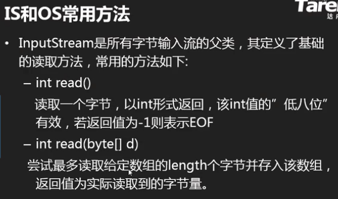


> 注意： OutputStream是向文件中写入数据，InputStream是读取文件数据，从下图App的视角看是这样的。
>
> 

```java
package io;

import java.io.File;
import java.io.FileNotFoundException;
import java.io.FileOutputStream;
import java.io.IOException;

/**
 * @author Akio
 * @ClassName FOSDemo
 * @Date 2021/7/23 16:35
 * @Description JAVA IO JAVA标准的输入与输出
 *              输入与输出的参照方向是我们的程序:
 *              输入:从外界到程序的方向,是用来读取数据的
 *              输出:从程序到外界的方向,是用来写出数据的
 *
 * java用"流"来形容读写,我们可以理解为流是真实链接程序与另一端的"管道",并且可以顺着这个管道
 * 向同一方向顺序流动"字节"
 * 其中
 * 输入流:用来读取数据
 * 输出流:用来写出数据。
 *
 * Java定义了两个超类:java.io.InputStream和OutputStream，这两个类是不能被实例化的
 * InputStream〔字节输入流):是所有字节输入流的超类,规定了读取字节的相关操作。所有实际读取字节的
 * 流都继承自它
 * OutputStream〔字节输出流〕:是所有字节输出流的超类,用于写出字节。
 *
 * 将来读写不同设备会有不同的输入与输出流,但是读写操作都是一样的
 * 例如:文件流java.io.FileInputStream和 FileOutputStream
 * 文件流是实际链接程序与文件的"管道",用于读写文件的流。
 *
 *
 */
public class FOSDemo {//每写一次会将原文件数据覆盖掉
    public static void main(String[] args) throws IOException {
        //向文件fos.dat中写入数据
//        File file = new File("./fos.dat");
//        FileOutputStream fos = new FileOutputStream(file);

        //如果目录下没有文件，这种写法可以自动创建文件，但不会创建目录
        FileOutputStream fos = new FileOutputStream("./fos.dat");

        /*
            void write(int d)
            向文件中写入1个字节，写入的是给定的int值对应的二进制的”低八位“
                                       vvvvvvvv
            00000000 00000000 00000000 00000001

            fos.write(1)完成后文件fos.dat内容
            00000001
         */
        fos.write(1);
        /*                             vvvvvvvv
            00000000 00000000 00000000 00000010

            fos.write(2)完后文件fos.dat内容:
            00000001 00000010
         */
        fos.write(2);
        System.out.println("写出完毕!");
        fos.close();
    }
}
```

```java
package io;

import java.io.FileInputStream;
import java.io.FileNotFoundException;
import java.io.IOException;

/**
 * @author Akio
 * @ClassName FISDemo
 * @Date 2021/7/26 9:06
 * @Description 使用文件输入流从文件中读取字节数据
 */
public class FISDemo {
    public static void main(String[] args) throws IOException {
        FileInputStream fis = new FileInputStream("fos.dat");
        /*
            int read()
            读取1个字节,将读取到的8位2进制存入一个int值的"低8位"上,高24位全部补0
            如果读取到了文件末尾,则返回的int值为-1
            注:int型-1的2进制样子:11111111 11111111 11111111 11111111
            注意：因为他只能读一个字节的低八位，所以数据在0~255才会有意义
                                           8421
            00000000 00000000 00000000 11111111

            fos.dat内容中先存了1，后又存了2,其二进制为
            （前面还有24个0）00000001          （前面还有24个0）00000010
            ^^^^^^^^

            fos.dat文件中读取的第一个字节内容为:"00000001
            返回的int值d对应的2进制为:00000000 00000000 00000000 00000001
         */
        int d = fis.read();
        System.out.println(d);//1
        /*
            fos.dat内容:
            00000001 00000010
                     ^^^^^^^^

            d:00000000 00000000 00000000 00000010
         */
        d = fis.read();//2
        System.out.println(d);
        /*
            fos.dat内容:
            00000001 00000010
                              ^^^^^^^^
         */
        d = fis.read();//-1
        System.out.println(d);

        fis.close();
    }
}
```

```java
package io;

import java.io.FileInputStream;
import java.io.FileOutputStream;
import java.io.IOException;

/**
 * @author Akio
 * @ClassName CopyDemo
 * @Date 2021/7/26 9:37
 * @Description 文件复制(单字节读写/随机读写)
 */
public class CopyDemo {
    public static void main(String[] args) throws IOException {
        FileInputStream fis = new FileInputStream("dino.png");
        FileOutputStream fos = new FileOutputStream("dino_copy.png");
        int d = 0;//用来记录每次读取到的字节
        /*
            dino.png文件数据
            00111100 11110000 10101010 01010101 11111111 00001101
                                                                  ^^^^^^^^
            d:11111111 11111111 11111111 11111111

            dino_copy.png文件数据
            00111100 11110000 10101010 01010101 11111111 00001101
         */
        while((d = fis.read()) != -1){
            fos.write(d);
        }
        System.out.println("复制完毕！");
        fis.close();
        fos.close();
    }
}
```

```java
package io;

import java.io.FileInputStream;
import java.io.FileOutputStream;
import java.io.IOException;

/**
 * @author Akio
 * @ClassName CopyDemo2
 * @Date 2021/7/26 10:31
 * @Description 提高每次实际读写的数据量，减少实际滴写得多次数可以提高读写效率
 *              单字节读写是一种随机读写形式，而一组字节的读写是块读写形式。
 */
public class CopyDemo2 {
    public static void main(String[] args) throws IOException {
        FileInputStream fis = new FileInputStream("dino.png");
        FileOutputStream fos = new FileOutputStream("dino_copy.png");
        /*
            字节流提供了块读写对应的方法
            InputStream中定义了块读操作:
            int read(byte[] data)
            一次性读取给定的字节数组总长度的字节量并存入到该数组中。返回值为实际读取到的字节量。
            如果返回值为-1，则表示本次没有读取到任何字符并且这里已经是流的末尾了。

            以文件流读取文件为例:
            文件数据:
            00001111 01010101 11110000 11010011 11000011

            byte[] data = new byte[3];{00000000,00000000,00000000}
            int len;

            使用文件流块读一次:
            len = fis.read(data);//读取3个字节(原因是data数组长度为3)
            data:{00001111,01010101,11110000}//读取的3个字节存入data数组
            len = 3;//实际读取到了3个字节

            使用文件流块读二次:
            len = fis.read(data);//读取2个字节(原因是文件只剩下2个字节了)
            data:{11010011,11000011,11110000}//读取的2个字节存入data数组的前2个位置
                  ^^^^^^^^ ^^^^^^^^这两个字节是本次读取到的字节
            len = 2;//实际读取到了2个字节

            使用文件流块读三次:
            len = fis.read(data);//读取0个字节(原因是已经是文件末尾了)
            data:{11010011,11000011,11110000}//没读取到数据，数组没变化
            len = -1;//-1表示本次没有读取到字节，已经是文件末尾了

            OutputStream字节输出流中定义了块写操作
            void write(byte[] data)
            一次性将给定的字节数组中所有字节写出
            
            void write(byte[] data,int offset,int len)
            一次性将给定的字节数组从下标offset处开始的连续len个字节写出
         */
        /*
            字节单位:
            00000000 8位2进制称为1byte  1字节
            1024byte   1kb
            1024kb     1mb
            1024mb     1gb
            1024gb     1tb
         */
        byte[] data = new byte[1024*10];//10kb
        int len;//每次实际读取到的字节数量

        long start = System.currentTimeMillis();
        while((len = fis.read(data))!=-1){
            fos.write(data);
        }
        long end = System.currentTimeMillis();
        System.out.println("复制完毕!耗时:"+(end-start)+"毫秒");

        fis.close();
        fos.close();
    }
}
```


### 文件流(低级流)

>  * java IO(input,output) 输入与输出
>
>     IO是我们的程序与外界交换数据的方式
>
>     java提供了一种统一的标准的方式与外界交换数据
>
>  * java将流按照功能划分为读和写，并用不同的方向来表示
>     其中输入流InputStream（外界到程序的方向）用于读取数据
>     输出流OutputStream用于写出数据
>
>  * 文件流：
>
>     文件流是一对低级流，用于读写文件。就功能而言他们和RandomAccessFile一致。但是底层的读写方式有本质区别。
>  
>     - --- RAF是基于指针进行随机（想读哪读哪seek()）读写的，可任意读写文件指定位置的数据。可以做到对文件部分数据的编辑操作。
>      - ---	流是顺序读写方式，所以不能做到任意读写指定位置数据，对此也无法做到对文件数据进行编辑的操作。但是配合高级流，可以更轻松地读写数据。
>

###### 文件流的读写

 ```java
package Y2021M3D24_IO;

import java.io.FileNotFoundException;
import java.io.FileOutputStream;
import java.io.IOException;

/**
 *	使用输出流写出文本数据到文件中
 * @author Grant·Vranes
 *
 */
public class FosDemo {
	public static void main(String[] args) throws IOException {
		/*
		 * 	使用文件流向文件中写出字节
		 * 	FileOutputStream常见构造方法
		 * 	FileOutputStream(String path)
		 * 	FileOutputStream(File file)
		 * 	以上两种方式创建时，默认为覆盖写操作，即：若创建时发现该文件已存在
		 * 	，会先将该文件所有数据清除。然后将通过当前流写出的内容作为该文件数据。
		 * 
		 * 	FileOutputStream(String pat, boolean append)
		 * 	FileOutputStream(File file, boolean append)
		 * 	追加写模式，即：若指定的文件存在，那么数据全保留，通过该流写出的
		 * 	数据会被追加到文件最后
		 */
        /*
            String提供了将字符串转换为一组字节的方法：
            byte[] getBytes(String csn)
            csn:charset name    字符集名字
            支持汉字的字符集有：
            GBK：国标编码，英文1字节，中文2字节
            UTF-8：unicode的变长编码，又称万国码，英文1字节，中文3字节
         */
		FileOutputStream fos = new FileOutputStream("fos.txt");
		
		String line = "红外俄方回家";
		byte[] data = line.getBytes("UTF-8");//转换成字节
		fos.write(data);
		System.out.println("写出完毕");
		fos.close();
	}
}
 ```

```java
package io;

import java.io.FileInputStream;
import java.io.IOException;

/**
 * 因为字节流默认是单字节读取数据，但是当我文件中的数据不再是字母（单字节），而是中文（三字节），默认的读取方式
 * 每次读一个字节就不能够正常读取我文件中的数据，所以我们采用重写的read方法，传入一个字节数组，进行块读操作
 *
 * @author Akio
 * @ClassName ReadStringDemo
 * @Date 2021/7/27 9:27
 * @Description 读取文本数据
 */
public class ReadStringDemo {
    public static void main(String[] args) throws IOException {
        //从fos.txt中写入文本(读)
        FileInputStream fis = new FileInputStream("fos.txt");

        /*
            int read(byte[] buffer)---块读操作
            传入一个字节数组，一次性从文件中读指定字节数组总长度的字节量存入该数组中
            返回实际读取到的字节量，当读到文件末尾时返回-1
         */
        byte[] data = new byte[1000];
        int len = fis.read(data);
        System.out.println("实际读取到了："+len+"个字节");

        /*
            String提供了构造方法可以将一个字节数组还原为字符串
            String(byte[] data, int offset, int len, String charsetName)
            将给定的字节数组data中从下标offset处开始的连续len个字节以指定的字符集转换为字符
            也可以用trim()但是不推荐
         */
//        String str = new String(data,"UTF-8").trim();
        String str = new String(data,0,len,"UTF-8");
        System.out.println("字符串长度："+str.length());
        System.out.println(str);

        fis.close();
    }
}
```

###### 文件流复制操作

```java
package Y2021M3D24_IO;

import java.io.FileInputStream;
import java.io.FileNotFoundException;
import java.io.FileOutputStream;
import java.io.IOException;

/**
 * 	使用文件流完成文件复制操作
 * @author Grant·Vranes
 *
 */
public class CopyDemo {
	public static void main(String[] args) throws IOException {
		/*
		 * 	使用文件输入流读取原文件
		 * 	使用文件输出流向复制文件写数据
		 * 
		 * 	利用块读写操作顺序从原文件将数据读取出来写入到复制文件完成复制操作
		 */
		FileInputStream src = new FileInputStream("pandoc.msi");
		FileOutputStream desc = new FileOutputStream("pandoc_cp.msi");
		
		int len = -1;
		byte[] data = new byte[200];
		while((len=src.read(data))!=-1) {
			desc.write(data,0,len);
		}
		System.out.println("复制完毕,耗时:"+(end-start)+"ms");//2686ms
		src.close();
		desc.close();
	}
}
```

###### 文件流的追加模式

```java
package io;

import java.io.FileNotFoundException;
import java.io.FileOutputStream;
import java.io.IOException;
import java.io.UnsupportedEncodingException;

/**
 * @author Akio
 * @ClassName FOSDemo2
 * @Date 2021/7/26 14:13
 * @Description 文件流的追加模式
 */
public class FOSDemo2 {
    public static void main(String[] args) throws IOException {
        /*
            文件输岀流默认的构造方法创建时如果指定的文件存在,会将该文件数据抹除

            文件流也支持追加模式,就是在实例化时再传入一个 boolean型参数,如果这个值为true则
            是追加模式。即:指定的文件若存在,该文件数据全部保留,当前文件流会从文件末尾开始接着
            写新的数据。
         */
        FileOutputStream fos = new FileOutputStream("fos.txt",true);

        String line = "今天是个好日子";
        byte[] data = line.getBytes("UTF-8");
        fos.write(data);
        System.out.println("写出完毕");
        fos.close();
    }
}
```

###### 读取文本数据

```java
package io;

import java.io.FileInputStream;
import java.io.IOException;

/**
 * @author Akio
 * @ClassName ReadStringDemo
 * @Date 2021/7/27 9:27
 * @Description 读取文本数据
 */
public class ReadStringDemo {
    public static void main(String[] args) throws IOException {
        //从fos.txt中写入文本（读）
        FileInputStream fis = new FileInputStream("fos.txt");

        byte[] data = new byte[1000];
        int len = fis.read(data);
        System.out.println("实际读取到了："+len+"个字节");

        /*
            String提供了构造方法可以将一个字节数组还原为字符串
            String(byte[] data, int offset, int len, String charsetName)
            将给定的字节数组data中从下标offset处开始的连续len个字节以指定的字符集转换为字符串
         */
        String str = new String(data,0,len,"UTF-8");
        System.out.println("字符串长度："+str.length());
        System.out.println(str);

        fis.close();
    }
}
```


### 流连接介绍


> * java将流划分为两大类：节点流，处理流
>
>   - 节点流：也称为低级流，是实际连接程序与数据源的“管道”，
>     负责实际搬运数据。读写一定是建立在节点流（低级流）的基础上进行的
>    - 处理流：也称为高级流，不能独立存在，必须链接在其他流上，
>      目的是当数据流经当前流时对这些数据做某些处理，这样可以简化我们对数据的操作
> * 实际应用中，我们是链接若干高级流，并最终链接低级流，通过低级流读写
>   数据，通过高级流对读写的数据进行某些加工处理，完成一个复杂的读写操作。
>   这个过程称为“流链接”。这也是学习IO的精髓所在。


### 缓冲流（高级流）

> 缓冲流是一对高级流，功能是提高读写效率。
>
> 连接它们以后，无论我们进行随机读写还是块读写，当经过缓冲流时都会被转换为块读写操作


#### 缓冲流的使用

```java
package Y2021M3D24_IO;

import java.io.BufferedInputStream;
import java.io.BufferedOutputStream;
import java.io.FileInputStream;
import java.io.FileOutputStream;
import java.io.IOException;

/**
 *	复制文件操作
 *
 * 	缓冲流
 * 	缓冲流是一对高级流，功能是提高读写效率。
 * 	连接它们以后，无论我们进行随机读写还是块读写，当经过缓冲流时都会被转换为块读写操作
 * 
 * 	java.io.BufferedInputStream	
 * 	java.io.BufferedOutputStream
 *	他们同样继承自InputStream和OutputStream
 * @author Grant·Vranes
 *
 */
public class CopyDemo2 {
	public static void main(String[] args) throws IOException {
		FileInputStream fis = new FileInputStream("pandoc.msi");
		BufferedInputStream bis = new BufferedInputStream(fis);//缓冲流
		
		FileOutputStream fos = new FileOutputStream("pandoc_cp.msi");
		BufferedOutputStream bos = new BufferedOutputStream(fos);//缓冲流
		
		long start = System.currentTimeMillis();
		
		int len = -1;
		while ((len=bis.read())!=-1){//单字节读写
            bos.write(len);
        }
//        byte[] data = new byte[1024*10];//(10KB)块读写，对于块读写，可能小文件看不出来什么，大文件才能体现
//        while((len=bis.read(data))!=-1) {
//            bos.write(data,0,len);
//        }
		long end = System.currentTimeMillis();
		System.out.println("复制完毕,耗时:"+(end-start)+"ms");//194ms
		bis.close();//只需要关最外层的流
		bos.close();
	}
}
```

#### 缓冲流的缓冲区

```java
package Y2021M3D24_IO;

import java.io.BufferedOutputStream;
import java.io.FileOutputStream;
import java.io.IOException;
import java.io.UnsupportedEncodingException;

/**
 * 	缓冲输出流的缓冲区问题
 * @author Grant·Vranes
 *
 */
public class Bos_flushDemo {
	public static void main(String[] args) throws IOException {
		FileOutputStream fos = new FileOutputStream("bos.txt");
		BufferedOutputStream bos = new BufferedOutputStream(fos);
		
		String line = "我喜欢这样看着你，随便你带我到哪里";
		byte[] data = line.getBytes("UTF-8");
		/*
		 * 	缓冲流的write方法并不是立即将数据写出的，而是先将数据存入其内部的数组中，
		 * 	当数组装满时(默认8kb装满写一次)才会做一次真实的写操作。（转化为块写操作的过程）
		 */
		bos.write(data);
		/*
		 * flush方法的意义是强制将缓冲流已经缓存的数据一次性写出。这样做可以让
		 * 	写出的数据有即时性，但是频繁调用会降低写效率。在更关注写出的即时性时应当使用此方法
		 */
		//bos.flush();
		System.out.println("写出完毕");
		/*
		 * close方法中会调用一次flush方法
		 */
		bos.close();
	}
}
```


### 对象流(高级流)

> 对象流也是一对高级流，提供的功能是读写java中的任何对象，在流连接中的作用是进行对象序列化与反序列化
>
> * 对象序列化：将一个Java对象按照其结构转换为一组字节的过程。


```java
package Y2021M3D24_IO;

import java.io.Serializable;
import java.util.Arrays;

/**
 * 	使用当前类实例测试对象流的对象读写操作
 * 
 * 	当一个类的实例希望可以被对象流进行读写，那么该类必须实现：java.io.Serializable接口
 *	与此同时，当前类中所有引用类型的属性，他们对应的类也必须实现该接口	
 * 	
 * 	实现该接口表示该类可以被序列化
 * 
 * 	一般实现接口一定要重写其方法，但是实现这个接口中不需要,因为它是一个签名接口，里面没有任何方法
 * @author Grant·Vranes
 *
 */
public class Person implements Serializable{
	/**
	 * 	当一个类实现了Serializable接口后，要求应当定义一个常量
	 * 	serialVersionUID，即：序列化版本号
	 * 
	 * 	序列化版本号影响反序列化是否成功。当对象输入流在进行对象反序
	 * 	列化时会检查该对象与当前类的版本是否一致，不一致则反序列化时
	 * 	会抛出异常导致反序列化失败。
	 * 	一致则可以进行反序列化，原则是对应的属性进行还原。
	 * 
	 * 	如果我们不定义该版本号，编译器会在编译当前类时根据结构生成一
	 * 	个版本号，那么版本号一定会改变。这样以前的对象一定是不可以反序列化了
	 */
	private static final long serialVersionUID = 1L;
	private String name;
	private int age;
	private String gender;
	private String[] otherInfo;
	public String getName() {
		return name;
	}
	public void setName(String name) {
		this.name = name;
	}
	public int getAge() {
		return age;
	}
	public void setAge(int age) {
		this.age = age;
	}
	public String getGender() {
		return gender;
	}
	public void setGender(String gender) {
		this.gender = gender;
	}
	public String[] getOtherInfo() {
		return otherInfo;
	}
	public void setOtherInfo(String[] otherInfo) {
		this.otherInfo = otherInfo;
	}
	
	//重写toString方法
	public String toString() {
		return name+","+age+","+gender+","+Arrays.toString(otherInfo);
	}
}
```

```java
package Y2021M3D24_IO;

import java.io.FileNotFoundException;
import java.io.FileOutputStream;
import java.io.IOException;
import java.io.ObjectOutputStream;

/**
 * 	对象流
 * 	对象流也是一对高级流，提供的功能是读写java中的任何对象，在流连接中的作用是进行对象序列化与反序列化
 *	对象序列化：将一个Java对象按照其结构转换为一组字节的过程。对象写出到文件中
 * 
 * 	对象输出流：
 * 	java.io.ObjectOutputStream
 * 	它可以将给定的java对象转换为一组字节然后通过其连接的流将这些字节写出
 * 
 * @author Grant·Vranes
 *
 */
public class OosDemo {
	public static void main(String[] args) throws IOException {
		Person  p = new Person();
		p.setName("瀑力汽水");
		p.setAge(20);
		p.setGender("男");
		
		String[] otherInfo = {"好学生","篮球少年"};
		p.setOtherInfo(otherInfo);
		System.out.println(p);
		
		FileOutputStream fos = new FileOutputStream("person.object");
		
		ObjectOutputStream oos = new ObjectOutputStream(fos);
		
		/*
		 * 	通过对象流写出对象这个方法经历了两个步骤：
		 * 	1：对象流先将给定的对象转换为了一组字节，这组字节包含
		 * 	  对象本身保存的数据信息，好包含该对象的结构信息，然后将
		 * 	  这组字节通过其连接的流写出。
		 * 		上述操作的对应术语：对象序列化
		 * 	2：经过文件流时，文件流将这组字节写入到了文件中
		 * 		 将数据写入磁盘做长久保存的过程对应的术语：数据持久化
		 */
		oos.writeObject(p);
		System.out.println("写出完毕");
		
		oos.close();	
	}
}
```


```java
package Y2021M3D24_IO;

import java.io.FileInputStream;
import java.io.IOException;
import java.io.ObjectInputStream;

/**
 * 	对象输入流
 * 	可以进行对象的反序列化操作。
 * 
 * 	使用对象流读取的字节必须是通过对象输出流序列化的一组字节才可以
 * @author Grant·Vranes
 *
 */
public class OisDemo {
	public static void main(String[] args) throws ClassNotFoundException, IOException {
		FileInputStream fis = new FileInputStream("person.object");
		ObjectInputStream ois = new ObjectInputStream(fis);
		/*
            Object readObject()
            对象输入流提供的反序列化方法,将读取的字节还原为java对象

            如果读取的字节不是通过对象输出流序列化对象的一组字节时会抛出异常:
            ClassNotFoundException
         */
		Person p = (Person)ois.readObject();//每次readObject只返回一个Object对象，可以使用while
		System.out.println(p);//瀑力汽水,20,男,[好学生, 篮球少年]
		ois.close();
	}
}
```


#### 序列化相关关键字介绍

**transient**

```java
/*
 * 	 transient关键字修饰的属性在对象序列化时会被忽略。
 *	 忽略不必要的属性可以达到对象瘦身的作用,忽略一些没有必要存的数据
 */
	private transient String[] otherInfo;
```


### 字符流


>  * 字符流
>
>    java将流按照<u>读写单位</u>又进行了一种划分方式
>
>    - 字节流和字符流
>
>      字节流的读写单位是字节，而字符流的读写单位是字符，所以字符流只适合读写文本数据！
>
>  * java.io.Reader	java.io.Writer
>
>    这两个类也是抽象类，是所有字符输入流与字符输出流的父类，规定了读写字符的相关方法
>
>  * ```
>    字符流
>    java将流按照读写单位划分为字节流与字符流。字符流都是高级流。
>    所有的字符流都继承自:java.io.Reader和Writer，这两个不能实例化
>  
>>转换流:java.io.InputStreamReader和 OutputStreamWriter
>    转换流是常用的字符流实现类,实际开发中我们通常不会直接操作他们,
>  但是他们在流连接中是非常重要的一环，一般用他们直接连接字节流，
>    将字节转换为字符，或是将字符转换为字节
>  


#### 字符<u>转换流</u>


> 字符转换流是唯一一个可以接在字节上的字符流，我们一般不直接去用它，他只是起到一个转接的作用，我么用它来连接更高级的字符流，如上图。

```java
package Y2021M3D24_IO;

import java.io.FileOutputStream;
import java.io.IOException;
import java.io.OutputStreamWriter;

/**
 * 
 *	 转换流
 * java.io.InputStreamReader
 * java.io.OutputStreamWriter
 *	 他们是一对常用的字符流实现类，经常在我们做字符数据读写操作中使用。
 * 	并且在流链接中是非常重要的一个环节。但是我们很少直接对他做操作。
 * @author Administrator
 *
 */
public class OswDemo {
	public static void main(String[] args) throws IOException {
		FileOutputStream fos = new FileOutputStream("osw.txt");
		OutputStreamWriter osw = new OutputStreamWriter(fos,"UTF-8");
		
		String line = "我直接好家伙";
		
//		byte[] data = line.getBytes("UTF-8");//转换为字节
//		fos.write(data);//写入
		osw.write(line);//帮助转换为字节，使用字节流可以直接写入字符串，不用像上两句一样转换为字节项
		
		System.out.println("写出完毕");
//		fos.close();
		osw.close();
	}
}
```

```java
package Y2021M3D24_IO;

import java.io.FileInputStream;
import java.io.IOException;
import java.io.InputStreamReader;

/**
 * 	转换流---输入流：用于读操作
 * 	java.io.InputStreamReader
 * @author Grant·Vranes
 *
 */
public class IsrDemo {
	public static void main(String[] args) throws IOException {
		FileInputStream fis = new FileInputStream("osw.txt");
		
		InputStreamReader isr = new InputStreamReader(fis,"UTF-8");
		
		/*
		 * 	字符流的方法：
		 * 	int read()
		 * 	该方法时一次读取一个字符，实际读取的字节量要根据指定的字符集决定。
		 * 	但是当读取到该字符后，在java中都是以一个char形式保存(unicode)占2个字节
		 *	返回-1表示读取到了末尾
		 */
//		int d = -1;
//		while((d=isr.read()) != -1) {//单字节读
//			char c = (char)d;
//			System.out.println(c);
//		}
		
		char[] data = new char[100];//块读
		int len = isr.read(data);
		String str = new String(data,0,len);
		System.out.println(str);
        System.out.println(str.length());
		
		isr.close();
	}
}
```


#### 缓冲字符输出流PrintWriter

> 缓冲字符流
> Java.io.BufferedWriter和BufferedReader
> 缓冲字符流内部也有一个数组〔字符数组),将读写操作同一转换为块读写来保证读写字符的效率
>
> Java.io.PrintWriter是具有自动行刷新的缓冲字符输出流,内部总是连接 BufferedWrite作
> 加速功能。其提供了直接按行写出字符串的相关缲作,写字符串更方便。所以就不介绍BufferedWriter，直接使用PrintWriter和BufferedReader


```java
package Y2021M3D24_IO;

import java.io.FileNotFoundException;
import java.io.IOException;
import java.io.PrintWriter;
import java.io.UnsupportedEncodingException;

/**
 * java.io.PrintWriter
 * 	具有自动行刷新的缓冲字符输出流
 * 	开发中比较常用的字符高级流
 * 
 * 	可以按行写出字符串
 * @author Grant·Vranes
 *
 */
public class PwDemo1 {
	public static void main(String[] args) throws IOException, UnsupportedEncodingException {
		/*
		 *	PW提供了专门针对写文件的构造方法
		 *	PrintWriter(String path)
		 *	PrintWriter(File file)
		 */
		PrintWriter pw = new PrintWriter("pw.txt","UTF-8");
		/*查看源码，实际上PrintWriter也调用了FileOutputStream,
		 * OutputStreamWriter,BufferedWriter和他自身。可以关注第二个例子。
		 * 
		 * 	而这个指定字符集的参数也是给OutputStreamWriter对象的，因
		 * 	为他是用于转换字节和字符的，需要这个参数，如果没有就是默认字符集。
		 */
		
		pw.println("我的爱滴滴点点~");
		pw.println("圆圆圈圈远远~");
		
		System.out.println("写出完毕");
		pw.close();
	}
}
```

```java
package Y2021M3D24_IO;

import java.io.BufferedWriter;
import java.io.FileOutputStream;
import java.io.IOException;
import java.io.OutputStreamWriter;
import java.io.PrintWriter;
import java.io.UnsupportedEncodingException;

/**
 * 	在流链接中使用PW
 * @author Grant·Vranes
 *
 */
public class PwDemo2 {
	public static void main(String[] args) throws IOException {
		//下面是个将数据写入文件的操作
		//将字节写入文件
		FileOutputStream fos = new FileOutputStream("pw.txt");
		//将字符转成字节,支持指定字符集
		OutputStreamWriter osw = new OutputStreamWriter(fos,"UTF-8");
		//块写
		BufferedWriter bw = new BufferedWriter(osw);
		//自动行刷新
		PrintWriter pw = new PrintWriter(bw);
		
		pw.println("一个人的夜，我的心，双手应该放在哪里~");
		System.out.println("写出完毕");
		
		pw.close();//其中已包含flush方法
	}
}
```

```java
package Y2021M3D24_IO;

import java.io.BufferedOutputStream;
import java.io.BufferedWriter;
import java.io.FileNotFoundException;
import java.io.FileOutputStream;
import java.io.IOException;
import java.io.OutputStreamWriter;
import java.io.PrintWriter;
import java.util.Scanner;

/**
 * 	完成简易记事本工具
 * 	程序启动后，要求用户输入文件名，然后对该文件进行写操作。
 * 	之后用户输入的每一行字符串都按行写入到该文件中。
 * 	创建PW时要求使用流链接模式
 * @author Grant·Vranes
 *
 */
public class PwTest {
	public static void main(String[] args) throws IOException {
		Scanner scanner = new Scanner(System.in);
		System.out.print("简易记事本，请输入文件名:");
		String fileName = scanner.nextLine();
		
		FileOutputStream fos = new FileOutputStream(fileName);//文件流
		OutputStreamWriter osw = new OutputStreamWriter(fos,"UTF-8");
        /*	
		 * 	字符输出流，使用该流可以设置字符集，并按照指定的字符集将字符转换为对应字节后通过该流写出
		 */
        
		BufferedWriter bw = new BufferedWriter(osw);
        /*
		 * 	缓冲字符输出流，负责块写，不能直接连文件流，一般和OutputStreamWriter相搭配
		 */
		
		/*
		 * 	当在流链接当中创建PrintWriter时允许指定第二个参数，该参数
		 * 	为一个boolean值，当这个值为true时，当前PW具有自动行刷新功能
		 * 	即：每当调用println方法写出一行字符串时就会自动flush，流做
		 * 	   真实写操作，但一旦真实写操作频繁了，效率就会下降。但用不用看你取
		 * 	   决于什么方向，如果是关注消息的即时性，就要用。
		 * 	注意：print方法是不会自动flush的，println才可以进行自动行刷新
		 */
		PrintWriter pw = new PrintWriter(bw,true);
		
        /**
		 * 	第二种流连接方式
		 * 	FileOutputStream fos = new FileOutputStream(fileName);//文件流
		 * 	BufferedOutputStream bos = new BufferedOutputStream(fos);
		 * 	PrintWriter pw = new PrintWriter(bos,true);
		 */
        
		System.out.println("---------Ins----------");
		String info = null;
		while(true) {
			info = scanner.nextLine();
			if("exit".equals(info)) {
				break;
			}
			pw.println(info);
			//pw.flush();
		}
		System.out.println("编辑完毕");
		pw.close();
	}
}
```

:warning: BufferedWriter BufferedOutputStream 区别:

- BufferedWriter    用于读取文本文件或字符串合适
- BufferedOutputStream   读取二进制流

https://blog.csdn.net/lbake/article/details/7708290


#### 缓冲字符输入流BufferedReader


```java
package Y2021M3D24_IO;

import java.io.BufferedReader;
import java.io.FileInputStream;
import java.io.FileNotFoundException;
import java.io.IOException;
import java.io.InputStreamReader;

/**
 * 	缓冲字符输入流：
 * 	java.io.BufferedReader
 * 	特点：可以按行读取字符串
 * 
 * @author Grant·Vranes
 *
 */
public class BrDemo {
	public static void main(String[] args) throws IOException {
		/*
		 * 	将当前源代码输出到控制台
		 */
		FileInputStream fis = new FileInputStream("./src/Y2021M3D24_IO/BrDemo.java");
		
		InputStreamReader isr = new InputStreamReader(fis);
        /*
		 *	字符输入流，使用该流可以设置字符集，并按照指定的字符集从流中按照该编码
		 *	将字节数据转换为字符并读取 (主要作用)
		 */
		
		BufferedReader br = new BufferedReader(isr);
        /*
		 * 	缓冲字符输入流，负责块读，一般和InputStreamReader相搭配
		 */
		
		/*
		 * 	String readLine()
		 * 	读取一行字符串
		 * 	顺序读取若干字符，当读取到了换行符时停止，并将换行符之前的字符组成一个字符串返回。
		 * 	返回的字符串中是不含有最后的换行符的。若此行仅有换行符，则返回空字符串，即""
		 *	若返回值为null，说明流读取到了末尾。
		 *
		 *	注意：这个方法并不是直接去文件中读一样，而是在BufferedReader的缓冲区中读取的
		 *	 
		 * 	while(true){
		 * 		String line = br.readLine();
		 * 		System.out.println(line);
		 * 	}
		 * 	上面这种写法是有错误的，while(true)是个循环，而br.readLine()读到末尾时，
		 * 	还有返回值null，循环仍在进行，这就成了一个死循环。
		 */
		String line = null;
		while((line=br.readLine()) != null) {
			System.out.println(line);
		}
		br.close();
	}
}
```


### IO总结


## 21 异常处理机制


### 异常的捕获和处理


##### try-catch


```java
package Y2021M3D26_Exception;
/**
 * 	java异常处理机制中的try-catch
 * 	try语句块用来包含可能出错的代码片段，catch
 * 	用来捕获这些错误并针对该错误进行处理。
 * @author Grant·Vranes
 *
 */
public class TryCatchDemo {
	public static void main(String[] args) {
		System.out.println("program start");
		
		/*
		 * 	当JVM执行代码时发现 一个错误时，会根据错误实例化对应的异常实例，
		 * 	并将程序执行过程设置进去，然后将该异常在出错的语句位置抛出。
		 * 	之后try-catch处理，若没有则认为出错的语句所在的方法没有
		 * 	解决异常的能力，随之将异常抛出到该方法之外。
		 */
		try {
			String str = null;
			System.out.println(str.length());
			//try语句块中当某句代码出现了异常，则之后所有的代码均不执行！
			System.out.println("不执行");
		}catch(NullPointerException e) {//括号中是可能出现的错误实例
			System.out.println("出现了空指针");
		}catch(StringIndexOutOfBoundsException e) {
			//通常情况下try中抛出的一场可能不止一个，所以catch可以写多个，但子异常一定要先捕获
			System.out.println("字符串下标越界了");
         /*
            可以使用多个catch分别捕获不同异常。也可以使用一个catch来捕获多个异常。区别在于
            多个catch分别捕获是因为不同异常处理方式不同。而用同一个catch捕获多个异常是因为               			 处理方式相同。
         */
        }catch (NullPointerException | StringIndexOutOfBoundsException e){
            System.out.println("异常已经解决");
     
		}catch(Exception e) {
			/*	真实开发的时候，总有意想不到的错误，所以应当在最后一个catch处捕获
			 * 	Exception，尽量避免一个未捕获异常导致程序中断
			 * 	
			 */
			System.out.println("程序出错");
		}
        
		System.out.println("program end");//---------------------
        /*
        在这里有一个要注意的点，program end还会不会执行？
		若一段代码前有异常抛出，并且这个异常被try...catch所捕获，若此时catch语句中没有抛出新的异常，则这段代码能够被执行
         */
	}
}
```

https://www.cnblogs.com/wangyingli/p/5912269.html

---

```java
package Y2021M3D26_Exception;
/**
 * finally块
 * finally是异常处理机制的的最后一块，可以确保只要程序运行到try语句块中，那么无论是否抛出异常
 *，finally中的代码必定执行
 *
 * finally 可以直接跟在try之后或者最后一个catch之后。
 *
 * 	一般作用：不关心异常，一定要执行的代码，比如流的关闭。一般我们将释放资源的操作放在finlly中。
 * @author Grant·Vranes
 *
 */
public class FinallyDemo {
	public static void main(String[] args) {
		System.out.println("program start");
		try {
			String str = "";
			System.out.println(str.length());
			return;
		}catch(Exception e) {
			System.out.println("程序出错");
		}finally {
			//只要写了finally，并且return在try中包含，finally中的语句必然执行
			System.out.println("必定执行，return都不好使");//除非使用System.exit(0);直接关闭了JVM虚拟机
		}
		
		System.out.println("program end");
	}
}
```

```java
package Y2021M3D26_Exception;

import java.io.FileOutputStream;
import java.io.IOException;

/**
 * 	在IO操作中使用异常处理机制
 * @author Grant·Vranes
 *
 */
public class FinallyDemo2 {
	public static void main(String[] args) {
		FileOutputStream fos = null;
		try {
			fos = new FileOutputStream("fos.dat");
			fos.write(1);
		}catch(IOException e) {
			e.printStackTrace();
		}finally {
			try {
				if(fos != null) {
					fos.close();
				}
			}catch(IOException e) {
				e.printStackTrace();
			}
		}
	}
}
```

```java
package Y2021M3D26_Exception;

import java.io.FileOutputStream;
import java.io.IOException;

/**
 * JDK7之后推出了一个新特性:autoclose
 * 	允许编译器在编译过程中自动处理诸如流的关闭工作。
 * 	就不用像FinallyDemo2中那么繁琐
 * @author Grant·Vranes
 *
 */
/*
jdk7之后，推出了一个新的特性：自动关闭
使得我们在异常处理机制中简化了对IO的关闭操作。
语法：
try(
    这里初始化会在finally中调用close方法关闭的类
){
    ...
} catch (XXXException e){
    ...
}
该特性是编译器认可的，并非虚拟机。编译器将源代码编译为class文件后
会改为在finally中
*/
public class AutoCloseDemo {
	public static void main(String[] args) {
		//这样写完后编译器会自动将代码改成FinallyDemo2的样子
		//一般在try和{之间加一个(),将流的定义放进去，凡是只有需要关闭的东西都放入其中
		try(
			/*
			 *	实现了AutoCloseable接口的类可以在这里定义。
			 *	编译器最终会将代码改变成FinallyDemo2的样子，在finally中将其关闭
			 */
			FileOutputStream fos = new FileOutputStream("fos.dat");
		){
			fos.write(1);
		}catch(IOException e) {
			e.printStackTrace();
		}
	}
}
```

---

注意：我们一般说try后面必须跟catch或者finally，但是请看如下代码，这段代码并不报错。这是因为利用了异常处理机制的自动关闭特性，虚拟机编译的时候会自动把()中的流的关闭放在finally中，所以虽然没写finally，但本质上还是会有finally的。

```java
private  void sendContent() throws IOException{
        try (
                //利用异常处理机制的自动关闭特性，确保文件流使用后被关闭
                FileInputStream fis = new FileInputStream(entity);
                ){//编译完成后，会加一个finally，里面关闭流
            OutputStream out = socket.getOutputStream();
            byte[] data = new byte[1024 * 10];//10kb
            int len;//每次实际读取到的字节数量
            while ((len = fis.read(data)) != -1) {
                out.write(data, 0, len);
            }
        }
    }
/*
为什么要这样写：因为这个方法本身不处理异常而是抛出给他的调用者去处理，所以try-catch中并不用catch异常，但是可以finally
```


##### 笔试题

>  * 请分别说明: final finally finalize的含义
>
>     * final：是关键字，可以修饰在三个地方（类、变量、方法）上
>
>       ​	修饰在类上，该类不可被继承
>
>       ​	修饰在变量上，不能被二次赋值
>
>       ​	修饰在方法上，不能被重写
>
>     * finally：是异常捕获的最后一块，它能保证其内的代码确保执行，通常可以把
>
>       ​	IO里的关闭流放在其中处理
>
>       ```
>       finally块是异常处理机制中的最后一块，他可以保证程序只要执行到try语句块中
>       ，无论是否出现异常，finally块中的代码都必定执行
>       finally可以直接跟在try之后活着最后一个catch之后
>       finally中通常是将释放资源这类操作放在这里,比如IO操作后的流关闭
>       ```
>
>     * finalize：每个类都有finalize方法，因为finalize是Object类中定义
>
>       ​	方法。简单来说，当一个类的实例被GC回收之前，会调用finalize(),
>
>       ​	所以说finalize是一个对象生命周期中的最后一个方法，这意味着这个
>
>       ​	方法一旦被执行完，就会被GC释放掉了。注意：若重写此方法，不能
>       
>       ​	由于耗时操作，否则会影响GC工作。
>       
>       
>
> * 	请写出如下程序结果：
>
>    ```java
>    package Y2021M3D26_Exception;
>    import java.io.IOException;
>    public class FinallyDemo3 {
>    	public static void main(String[] args) {
>    		System.out.println(test("0"));//3
>    		System.out.println(test(null));//3
>    		System.out.println(test(""));//3
>    	}
>    	public static int test(String str) {
>    		try {
>    			return str.charAt(0)-'0';
>    		}catch(NullPointerException e) {
>    			return 1;
>    		}catch(Exception e) {
>    			return 2;
>    		}finally {//如果没有finally，最终结果会是0,1,2
>    			return 3;
>    		}
>    	}
>    }
>    ```
>
>    为什么会这样？
>
>    实际上，我们调用一个方法时，内存实际上隐含着一个参数，或者说是一个变量。这个变量是什么类型呢？取决于你的方法是什么类型/返回值是什么类型。它承载着你的返回值。
>
>    当你在try中return返回一个值，此时将其赋值给内存中这个隐含的参数。然后就要跳出异常处理机制，跳出必执行finally中的语句块，finally中又return一个值，就将内存中隐含的参数的值给覆盖了，所以返回的就是


##### 异常抛出


> throw是个动作，是主动抛出异常
>
> > ```
> > throw关键字，用来主动对外抛出一个异常
> > 通常下列情况我们会主动对外抛出一个异常：
> > 1:当前代码片段出现了一个异常，但是该异常不应当被当前代码片段解决时可以对外抛出。这是责任制问题
> > 2:当前代码出现了满足语法但是不满足业务场景时，可以主动对外抛出异常告知不应当这样做
> > ```
>
> throws是在方法中定义的。用于声明我这个方法可能会抛出什么异常

```java
package Y2021M3D26_Exception;
/**
 * 	使用当前类测试异常的抛出
 * @author Grant·Vranes
 *
 */
public class Person {
	private int age;

	public int getAge() {
		return age;
	}

	/*
	 * 	通常一个方法中使用throw抛出一个异常时就要在方法声明时使用
	 * 	throws声明该异常的抛出以通知调用者解决该异常。
	 * 
	 * 	只有抛出RuntimeException及其子类型异常时可以不要求这样做
	 */
	public void setAge(int age) throws Exception {
		//此时，你方法声明的时候throws了异常，凡是调用这个方法都要进行异常处理，不然就会报错
		if(age<0 || age>100) {
			throw new Exception("年龄不合法");
            //throw new RuntimeException("年龄不合法！");
            //只有RuntimeException极其子类的抛出不是必须写throws声明异常的抛出，因为其是非检查异常
		}
		this.age = age;
	}
}
```

throws声明该异常的抛出以通知调用者解决该异常，如果是RuntimeException及其子类异常就不需要处理


```java
package Y2021M3D26_Exception;
/**
 * 	测试异常的抛出
 * @author Grant·Vranes
 *
 */
public class ThrowDemo {
	public static void main(String[] args) {
		Person p = new Person();
		/*
		 * 	符合语法，但不符合业务逻辑要求，这时setAge方法中可以当作异常抛出
		 * 	要求这里调用时去处理异常
		 * 
		 * 	当调用一个含有throws声明异常抛出的方法时，要求必须处理该异常
		 * 	而处理的方式有两种：
		 * 	1、使用try-catch捕获并解决异常
		 * 	2、再当前方法上继续使用throws声明该异常的抛出
		 * 	注意：一般不要在main方法后throws异常，这是极其不负责任的表现
		 */
		try {
			p.setAge(10000);
		} catch (Exception e) {
			// TODO Auto-generated catch block
			e.printStackTrace();
		}
		System.out.println(p.getAge());
	}
}
```


##### 抛出规律

```java
package Y2021M3D26_Exception;

import java.awt.AWTException;
import java.io.FileNotFoundException;
import java.io.IOException;
import java.sql.SQLException;

/**
 * 	重写超类含有throws声明异常抛出的方法时，对throws的重写规则
 *	看看哪些是允许的，哪些是会报错的
 * @author Grant·Vranes
 *
 */
public class ThrowsDemo {//父类
	public void dosome() throws IOException,AWTException{
	}
}

class Son extends ThrowsDemo{//子类
	//正常抛出所有父类中的异常
//	public void dosome() throws IOException,AWTException{
//	}

	//允许仅抛出部分异常
//	public void dosome() throws IOException{
//	}
	
	//允许不再抛出任何异常
//	public void dosome(){
//	}
	
	//允许抛出超类方法抛出异常的子类型异常
//	public void dosome() throws FileNotFoundException{
//	}
	
	//不允许抛出额外异常
//	public void dosome() throws SQLException{
//	}
	
	//不允许抛出超类方法抛出异常的父类型异常
//	public void dosome() throws Exception{
//	}	
}
```


### 运行时异常介绍


> 至少java中是有两种异常的，一种是检查异常，另一种是非检查异常。注意：只有RuntimeException和他的子类是非检查异常，其他的全部是检查异常（即出现了异常，就要求我们去处理）。


### 异常中常见的API

>1、输出错误信息，最常用
>	e.printStackTrace();
>
>2、获取错误消息，写日志的时候用
>	e.getMessage();
>
>```java
>package Y2021M3D26_Exception;
>/**
> * 	异常处理的常用Api
> * @author Grant·Vranes
> *
> */
>public class ExceptionApiDemo {
>	public static void main(String[] args) {
>		try {
>			String str = "A";
>			System.out.println(Integer.parseInt(str));
>		}catch(Exception e) {
>			//输出异常堆栈信息，最常用
>			e.printStackTrace();
>			//获取错误消息，（常用于记录日志和提示给用户使用）
>			String message = e.getMessage();
>			System.out.println(message);//For input string: "A"
>		}
>		System.out.println("program end");
>	}
>}
>```


### 自定义异常

```java
package Y2021M3D26_Exception;
/**
 * 	自定义异常，通常是用来说明当前项目的某个业务逻辑错误
 * 
 * 	此程序就是关于年龄不合法异常的自定义异常
 * @author Grant·Vranes
 *
 */
/*
	自定义异常常用于那些满足语法但是不满足业务场景时自行结合具体情况定义的异常类型。
	自定义异常要完成以下工作：
	1:类名要见名知义
	2:需要继承自Exception(直接或间接继承）
	3:提供所有种类的构造方法
*/
public class IllegalAgeException extends Exception{
	private static final long serialVersionUID = 1L;
	
	public IllegalAgeException() {
		super();
		// TODO Auto-generated constructor stub
	}
	//以下方法可以通过右键source->Generate Constructors from Superclass
	public IllegalAgeException(String message, Throwable cause, boolean enableSuppression, boolean writableStackTrace) {
		super(message, cause, enableSuppression, writableStackTrace);
		// TODO Auto-generated constructor stub
	}

	public IllegalAgeException(String message, Throwable cause) {
		super(message, cause);
		// TODO Auto-generated constructor stub
	}

	public IllegalAgeException(String message) {
		super(message);
		// TODO Auto-generated constructor stub
	}

	public IllegalAgeException(Throwable cause) {
		super(cause);
		// TODO Auto-generated constructor stub
	}
}
```

所以再Person.java中


ThrowDemo.java中


### 常见异常


## 22 网络通讯介绍(2021.3.27)

https://zhuanlan.zhihu.com/p/24860273

**TCP（Transmission Control Protocol，传输控制协议）**是面向连接的协议，也就是说，在收发数据前，必须和对方建立可靠的连接。 一个TCP连接必须要经过三次“对话”才能建立起来，其中的过程非常复杂， 只简单的描述下这三次对话的简单过程：

1）主机A向主机B发出连接请求数据包：“我想给你发数据，可以吗？”，这是第一次对话；

2）主机B向主机A发送同意连接和要求同步 （同步就是两台主机一个在发送，一个在接收，协调工作）的数据包 ：“可以，你什么时候发？”，这是第二次对话；

3）主机A再发出一个数据包确认主机B的要求同步：“我现在就发，你接着吧！”， 这是第三次对话。

三次“对话”的目的是使数据包的发送和接收同步， 经过三次“对话”之后，主机A才向主机B正式发送数据。


 **UDP（User Data Protocol，用户数据报协议）**

1、UDP是一个非连接的协议，传输数据之前源端和终端不建立连接， 当它想传送时就简单地去抓取来自应用程序的数据，并尽可能快地把它扔到网络上。 在发送端，UDP传送数据的速度仅仅是受应用程序生成数据的速度、 计算机的能力和传输带宽的限制； 在接收端，UDP把每个消息段放在队列中，应用程序每次从队列中读一个消息段。

2、 由于传输数据不建立连接，因此也就不需要维护连接状态，包括收发状态等， 因此一台服务机可同时向多个客户机传输相同的消息。

3、UDP信息包的标题很短，只有8个字节，相对于TCP的20个字节信息包的额外开销很小。

4、吞吐量不受拥挤控制算法的调节，只受应用软件生成数据的速率、传输带宽、 源端和终端主机性能的限制。

5、UDP使用尽最大努力交付，即不保证可靠交付， 因此主机不需要维持复杂的链接状态表（这里面有许多参数）。

6、UDP是面向报文的。发送方的UDP对应用程序交下来的报文， 在添加首部后就向下交付给IP层。既不拆分，也不合并，而是保留这些报文的边界， 因此，应用程序需要选择合适的报文大小。


我们经常使用“ping”命令来测试两台主机之间TCP/IP通信是否正常， 其实“ping”命令的原理就是向对方主机发送UDP数据包，然后对方主机确认收到数据包， 如果数据包是否到达的消息及时反馈回来，那么网络就是通的。


**ping命令**是用来探测主机到主机之间是否可通信，如果不能**ping**到某台主机，表明不能和这台主机建立连接。**ping命令**是使用 IP 和网络控制信息协议 (ICMP)，因而没有涉及到任何传输协议(UDP/TCP) 和应用程序。它发送icmp回送请求消息给目的主机。

ICMP协议规定：目的主机必须返回ICMP回送应答消息给源主机。如果源主机在一定时间内收到应答，则认为主机可达。

---

 **小结TCP与UDP的区别：**

1、基于连接与无连接；

2、对系统资源的要求（TCP较多，UDP少）；

3、UDP程序结构较简单；

4、流模式与数据报模式 ；

5、TCP保证数据正确性，UDP可能丢包；

6、TCP保证数据顺序，UDP不保证。


## 23 Socket介绍

```java
package Y2021M3D27_Socket;

import java.net.Socket;

/**
 * 	聊天室客户端
 * @author Grant·Vranes
 *
 */
public class Client {
	/*
     * 	java.net.Socket 套接字
     * 	Socket封装了TCP协议的通讯细节，使得我们使用它可以很方便的与远端计算机建立连接并
     *  基于两个流(一个输入一个输出)的读写完成与远端计算机的数据交换从而实现对应的网络应用。
     */
	private Socket socket;
	
	/*
	 * 	构造方法，用来初始化客户端
	 */
	public Client() {
		try {
			/*
			 * 	实例化Socket的同时需要传入两个参数：
			 * 	1、服务端的IP地址
			 * 	2、服务端所使用的端口号
			 * 
			 * 	通过IP地址可以找到服务端的计算机，通过端口可以连接
			 * 	到运行在服务端计算机上的服务端应用程序。而我们客户端
			 * 	自身的IP和端口无需指定，系统会分配一个端口，并且连
			 * 	接后会发送给服务端。
			 * 
			 * 	实例化Socket的过程就是发起连接的过程，若服务端没有
			 * 	响应则这里会直接抛出异常。
			 */
			System.out.println("正在连接服务端.........");
			socket = new Socket("localhost",8088);
			System.out.println("已连接服务端!");
		} catch (Exception e) {
			e.printStackTrace();
		}
	}
	
	/*
	 * 	程序开始工作的方法
	 */
	public void start() {
		
	}
	
	public static void main(String[] args) {
		Client client = new Client();
		client.start();
	}
}
```

```java
package Y2021M3D27_Socket;
/**
 * 	聊天室服务端
 * @author Grant·Vranes
 *
 */

import java.net.ServerSocket;
import java.net.Socket;

public class Server {
	/*
	 * 	运行在服务端的ServerSocket
	 * 	有两个作用
	 *	1、向系统申请服务端口，客户端就是通过这个端口与服务端
	 *	       程序建立连接的。
	 *	2、监听服务端口，一旦一个客户端建立连接就会创建一个Socket，使用这个Socket
     *      与该客户端交互
	 * 
	 */
	private ServerSocket server;
	
	/*
	 * 	构造方法，用于初始化服务端
	 */
	public Server() {
		try {
			/*
             * 	实例化ServerSocket的同时向系统申请/指定服务端口，客户端就是通过这个端口与服务端建立链接
             * ，该端口不能与系统申请的其他应用程序相同，否则会抛出地址被占用的异常
             * java.net.BindException:address already in use : JVM
             */
			System.out.println("正在启动服务端............");
			server = new ServerSocket(8088);
			System.out.println("服务端启动成功！");
			
		} catch (Exception e) {
			e.printStackTrace();
		}
	}
	
	/*
	 * 	程序开始工作的方法
	 */
	public void start() {
		try {
			/*
			 * 	ServerSocket有一个重要的方法：
			 * 	Socket accept()
			 * 	该方法是一个“阻塞”方法，调用后程序就在这里“卡住了”，这是开始
			 * 	等待客户端的连接。那么当客户端通过端口尝试连接时，accept会返
			 * 	回一个Socket，通过该Socket就可以与刚建立连接的客户端进行交互了。
			 */
			System.out.println("等待客户端连接......");
			Socket socket = server.accept();
			System.out.println("一个客户端连接了！");
		} catch (Exception e) {
			e.printStackTrace();
		}
	}
	
	public static void main(String[] args) {
		Server server = new Server();
		server.start();
	}
}
```


#### 聊天室项目（1）


```java
package Y2021M3D27_Socket;

import java.io.BufferedWriter;
import java.io.OutputStream;
import java.io.OutputStreamWriter;
import java.io.PrintWriter;
import java.net.Socket;
import java.util.Scanner;

/**
 * 	聊天室客户端
 * @author Grant·Vranes
 *
 */
public class Client {
	/*
	 * java.net.Socket
	 * 	Socket封装了TCP协议的通讯细节，使该过程抽象为通过两个
	 * 	流的读写完成与远端计算机的数据交互。
	 * 
	 * 	Socket的本地翻译为：套接字
	 */
	private Socket socket;
	
	/*
	 * 	构造方法，用来初始化客户端
	 */
	public Client() {
		try {
			/*
			 * 	实例化Socket的同时需要传入两个参数：
			 * 	1、服务端的IP地址
			 * 	2、服务端所使用的端口号
			 * 
			 * 	通过IP地址可以找到服务端的计算机，通过端口可以连接
			 * 	到运行在服务端计算机上的服务端应用程序。而我们客户端
			 * 	自身的IP和端口无需指定，系统会分配一个端口，并且连
			 * 	接后会发送给服务端。
			 * 
			 * 	实例化Socket的过程就是发起连接的过程，若服务端没有
			 * 	响应则这里会直接抛出异常。
			 */
			System.out.println("正在连接服务端.........");
			socket = new Socket("localhost",8088);
			System.out.println("已连接服务端!");
		} catch (Exception e) {
			e.printStackTrace();
		}
	}
	
	/*
	 * 	程序开始工作的方法
	 */
	public void start() {
		try {
			Scanner scanner = new Scanner(System.in);
			/*
			 * Socket提供的方法：
			 * OutputStream getOutputStream()
			 * 	返回一个字节输出流，通过该输出流写出的数据最终会发送给服务端
			 *
			 *	注：该方法无论调用多少次，返回的输出流始终是同一个
			 */
			OutputStream out = socket.getOutputStream();
			OutputStreamWriter osw = new OutputStreamWriter(out,"UTF-8");
			BufferedWriter bw = new BufferedWriter(osw);
			PrintWriter pw = new PrintWriter(bw, true);
			
			System.out.println("_______________INSERT______________");
            while(!"exit".equalsIgnoreCase(line =scan.nextLine())){
                pw.println(line);
                System.out.println(">>>>>>>>>>>>>>>>>Successfully sent ");
            }
        } catch (IOException e) {
            e.printStackTrace();
        } finally {
            try {
                //close操作会给远端计算机发送断开信号。同时关闭对应的输入流和输出流
                socket.close();
            } catch (IOException e) {
                e.printStackTrace();
            }
        }
	}
	
	public static void main(String[] args) {
		Client client = new Client();
		client.start();
	}
}
```

```java
package Y2021M3D27_Socket;
/**
 * 	聊天室服务端
 * @author Grant·Vranes
 *
 */

import java.io.BufferedReader;
import java.io.InputStream;
import java.io.InputStreamReader;
import java.net.ServerSocket;
import java.net.Socket;

public class Server {
	/*
	 * 	运行在服务端的ServerSocket
	 * 	有两个作用
	 *	1、向系统申请服务端口，客户端就是通过这个端口与服务端
	 *	       程序建立连接的。
	 *	2、监听该端口，当客户端通过该端口与服务端建立连接时会
	 *	       自动创建一个Socket。通过这个Socket与客户端进
	 *	       行数据交互。
	 * 
	 */
	private ServerSocket server;
	
	/*
	 * 	构造方法，用于初始化服务端
	 */
	public Server() {
		try {
			/*
			 * 	实例化ServerSocket的同时向系统申请服务端口，该端口不能与
			 * 	系统申请的其他应用程序相同，否则会抛出地址被占用的异常
			 */
			System.out.println("正在启动服务端............");
			server = new ServerSocket(8088);
			System.out.println("服务端启动成功！");
			
		} catch (Exception e) {
			e.printStackTrace();
		}
	}
	
	/*
	 * 	程序开始工作的方法
	 */
	public void start() {
		try {
			/*
			 * 	ServerSocket有一个重要的方法：
			 * 	Socket accept()
			 * 	该方法是一个“阻塞”方法，调用后程序就在这里“卡住了”，这是开始
			 * 	等待客户端的连接。那么当客户端通过端口尝试连接时，accept会返
			 * 	回一个Socket，通过该Socket就可以与刚建立连接的客户端进行交互了。
			 */
            while(true){
                System.out.println("等待客户端连接......");
				Socket socket = server.accept();
				System.out.println("一个客户端连接了！");
				
				/*
				 * 	通过Socket获取输入流，读取客户端发送过来的数据
				 */
				InputStream in = socket.getInputStream();
				InputStreamReader isr = new InputStreamReader(in, "UTF-8");
				BufferedReader br = new BufferedReader(isr);
			
				/*
				 * 	String readLine()
				 * 	读取一行字符串
				 * 	顺序读取若干字符，当读取到了换行符时停止，并将换行符之前的字符组成一个字符串
				 * 	返回。返回的字符串中是不含有最后的换行符的。若返回值为null，说明流读取到了末尾。
				 *	 
				 * 	while(true){
				 * 		String message = br.readLine();
				 * 		System.out.println("Client说：" + message);
				 * 	}
				 * 	上面这种写法是有错误的，while(true)是个循环，而br.readLine()读到末尾时，
				 * 	还有返回值null，循环仍在进行，这就成了一个死循环。
				 */
				String message;
            	/*
            	    客户端如果正常调用了socket.close()与服务端断开连接时，服务端这里读取操作的方法
            	    readLine会返回null,表示客户端断开了连接，流读取到了末尾，正常停止循环。
            	    但是如果客户端强制关闭了客户端，服务端无法正确得知客户端的断开就会抛出异常：
            	    java.net.SocketException:connection reset
            	 */
				while((message=br.readLine()) != null) {
					System.out.println("Client说：" + message);
				}
            }
			
		} catch (Exception e) {
			e.printStackTrace();
		}
	}
	
	public static void main(String[] args) {
		Server server = new Server();
		server.start();
	}
}
```

> 此前，这个项目目前只实现了客户端对服务端的单向聊天，一个人链接上了可以聊天，但是第二个人就不行，非要等第一个断开了才可以，因为这两个while的嵌套循环造成的，如果要实现多个用户与服务端连接后聊天，先要学习多线程知识。


## 24 多线程介绍(2021.3.29)

#### 进程与线程

> 看了一遍排在前面的答案，类似”**进程是资源分配的最小单位，线程是CPU调度的最小单位“**这样的回答感觉太抽象，都不太容易让人理解。
>
> 做个简单的比喻：进程=火车，线程=车厢
>
> - 线程在进程下行进，线程归属于进程（单纯的车厢无法运行）
> - 一个进程可以包含多个线程（一辆火车可以有多个车厢）
> - 不同进程间数据很难共享（一辆火车上的乘客很难换到另外一辆火车，比如站点换乘）
> - 同一进程下不同线程间数据很易共享（A车厢换到B车厢很容易）
> - 进程要比线程消耗更多的计算机资源（采用多列火车相比多个车厢更耗资源）
> - 进程间不会相互影响，但一个线程挂掉将导致整个进程挂掉（一列火车不会影响到另外一列火车，但是如果一列火车上中间的一节车厢着火了，将影响到所有车厢）
> - 进程可以拓展到多机，进程最多适合多核（不同火车可以开在多个轨道上，同一火车的车厢不能在行进的不同的轨道上）
> - 进程使用的内存地址可以上锁，即一个线程使用某些共享内存时，其他线程必须等它结束，才能使用这一块内存。（比如火车上的洗手间）－"互斥锁"
> - 进程使用的内存地址可以限定使用量（比如火车上的餐厅，最多只允许多少人进入，如果满了需要在门口等，等有人出来了才能进去）－“信号量”
>
> 
>
> 


#### 线程的创建方式


```java
package Y2021M3D29_Thread;
/**
 * 多线程将程序的单一顺序执行方式改为可以让多个这样顺序执行的代码片段"同时”执行
 * 这里并非真正的同时，而是并发的。线程是并发运行代码的。
 *
 * 	有两种创建线程的方式：
 * 	方式一：继承Thread并重写run方法,在run方法中定义该线程要执行的代码。run方法中就是希望线程执行的逻辑
 * 		第一种创建线程的方式优点就是结构简单直接，
 *		但是缺点主要有两个：
 * 		1：由于需要继承线程，这导致不能再继承其他类，实际开发中经常要 复用
 * 		  某个超类的功能（因为我们通常继承一个类的主要因素就是为了复用方法）
 *		  ，那么在继承线程后不能再继承其他类，这会又很多不便
 * 		2：定义线程类的同时重写了run方法，这回导致线程与线程要执行的任务
 * 		  有一个必然的耦合关系，不利于线程的重用。
 * 
 * @author Grant·Vranes
 *
 */
public class ThreadDemo1 {
	public static void main(String[] args) {
		Thread t1 = new MyThread1();
		Thread t2 = new MyThread2();
		/*
		 * 	启动线程要调用start方法，而不是直接调用run方法。
		 * 	当start方法调用完毕后，run方法很快会被线程自行调用。
		 */
		t1.start();
		t2.start();
	}
}

class MyThread1 extends Thread{
	public void run() {
		for(int i = 0; i < 1000; i++) {
			System.out.println("线程1");
		}
	}
}

class MyThread2 extends Thread{
	public void run() {
		for(int i = 0; i < 1000; i++) {
			System.out.println("线程2");
		}
	}
}
```

```java
package Y2021M3D29_Thread;
/**
 * 	第二种创建线程的方式：实现Runnable接口，单独定义线程任务
 * @author Grant·Vranes
 *
 */
public class ThreadDemo2 {
	public static void main(String[] args) {
		//实例化线程要执行的任务
		Runnable r1 = new MyRunnable1();//相当于待装材料
		Runnable r2 = new MyRunnable2();
		//创建两个线程并指派任务
		Thread t1 = new Thread(r1);//相当于卡车
		Thread t2 = new Thread(r2);
		
		t1.start();
		t2.start();
	}
}

class MyRunnable1 implements Runnable{
	public void run() {
		for(int i = 0; i < 1000; i++) {
			System.out.println("线程1");
		}
	}
}

class MyRunnable2 implements Runnable{
	public void run() {
		for(int i = 0; i < 1000; i++) {
			System.out.println("线程2");
		}
	}
}
```

```java
//匿名内部类实现创建线程
public class ThreadDemo3 {
    public static void main(String[] args) {
        /*
        Thread t1 = new Thread(new Runnable() {
            @Override
            public void run() {
                for (int i = 0; i < 100000; i++) {
                    System.out.println("你叫什么？**************");
                }
            }
        });
        */
        //上面这个也是正确的，但推荐使用如下，因为Thread实现了Runable接口，所以重写其run方法也能得到同样效果
        Thread t1 = new Thread() {//Thread实现了Runable接口
            @Override
            public void run() {
                for (int i = 0; i < 100000; i++) {
                    System.out.println("你叫什么？**************");
                }
            }
        };

        Thread t2 = new Thread(()->{//lanbda表达式写法
                for (int i = 0; i < 100000; i++) {
                    System.out.println("那你叫什么？---------------");
                }
        });

        t1.start();
        t2.start();

        //普通匿名内部类写法
//        Runnable r1 = new Runnable() {
//            @Override
//            public void run() {
//                for (int i = 0; i < 100000; i++) {
//                    System.out.println("你叫什么？**************");
//                }
//            }
//        };
//        Thread t1 = new Thread(r1);
//
//        t1.start();
    }
}
```

---

而了解线程的创建后，我们使用第二种方式去为Server端添加多线程，使其可以接受多个客户端的申请。

```java
package Y2021M3D27_Socket;
/**
 * 	聊天室服务端
 * @author Grant·Vranes
 *
 */
import java.io.BufferedReader;
import java.io.InputStream;
import java.io.InputStreamReader;
import java.net.ServerSocket;
import java.net.Socket;

public class Server {
	/*
	 * 	运行在服务端的ServerSocket
	 * 	有两个作用
	 *	1、向系统申请服务端口，客户端就是通过这个端口与服务端
	 *	       程序建立连接的。
	 *	2、监听该端口，当客户端通过该端口与服务端建立连接时会
	 *	       自动创建一个Socket。通过这个Socket与客户端进
	 *	       行数据交互。
	 * 
	 */
	private ServerSocket server;
	
	/*
	 * 	构造方法，用于初始化服务端
	 */
	public Server() {
		try {
			/*
			 * 	实例化ServerSocket的同时向系统申请服务端口，该端口不能与
			 * 	系统申请的其他应用程序相同，否则会抛出地址被占用的异常
			 */
			System.out.println("正在启动服务端............");
			server = new ServerSocket(8088);
			System.out.println("服务端启动成功！");
			
		} catch (Exception e) {
			e.printStackTrace();
		}
	}
	
	/*
	 * 	程序开始工作的方法
	 */
	public void start() {
		try {
			/*
			 * 	ServerSocket有一个重要的方法：
			 * 	Socket accept()
			 * 	该方法是一个“阻塞”方法，调用后程序就在这里“卡住了”，这是开始
			 * 	等待客户端的连接。那么当客户端通过端口尝试连接时，accept会返
			 * 	回一个Socket，通过该Socket就可以与刚建立连接的客户端进行交互了。
			 */
			System.out.println("等待客户端连接......");
			Socket socket = server.accept();
			System.out.println("一个客户端连接了！");
			//启动一个线程来处理该客户端
			ClientHandler handler = new ClientHandler(socket);
			Thread t= new Thread(handler);
			t.start();
		} catch (Exception e) {
			e.printStackTrace();
		}
	}
	
	public static void main(String[] args) {
		Server server = new Server();
		server.start();
	}
	
	/*
	 * 	该进程任务是与指定的Socket对应的客户端进行数据交互
	 */
	private class ClientHandler implements Runnable{
        private Socket socket;
        private String host;//记录客户端的IP地址信息

        //定义一个构造方法，用于传socket这个参数
        public ClientHandler(Socket socket){
            this.socket = socket;
            host = socket.getInetAddress().getHostAddress();
        }
        @Override
        public void run() {
            try (
                    InputStream in = socket.getInputStream();
                    InputStreamReader isr = new InputStreamReader(in, "UTF-8");
                    BufferedReader br = new BufferedReader(isr);
            ) {
                //读取客户端发送过来的一行字符串
                String message;
                   /*
                      客户端如果正常调用了socket.close()与服务端断开连接时，服务端这里读取操作的方法
                      readLine会返回null,表示客户端断开了连接，流读取到了末尾，正常停止循环。
                      但是如果客户端强制关闭了客户端，服务端无法正确得知客户端的断开就会抛出异常：
                      java.net.SocketException:connection reset
                    */
                while ((message = br.readLine()) != null) {
                    System.out.println(host +":" + message);
                }
            } catch (IOException e) {
                e.printStackTrace();
            }
        }
	}
}
```


#### CurrentThread介绍（线程操作API）

```java
package Y2021M3D29_Thread;
/**
 * 	线程提供了获取相关信息的方法
 * @author Grant·Vranes
 *
 */
/**
 * java中所有的代码都是有线程执行的，main方法也不例外。JVM启动后会自动创建一条
 * 线程来执行main方法，而JVM给这条线程取名为”main“，所以我们称执行main方法的
 * 线程为”主线程“
 *
 * @author Akio
 * @Create 2021/7/29 14:18
 */
public class ThreadDemo3 {
	public static void main(String[] args) {
		/*
		 * 	线程提供了一个静态方法：
		 * 	static Thread currentThread()
		 * 	该方法用来获取运行这个方法的线程
		 * 	
		 * 	main方法也是靠一个线程运行的，当JVM启动后会自动创建
		 * 	一个线程来执行main方法。而这个线程的名字叫做main，
		 * 	我们称它为主线程
		 * 
		 * 
		 */
		Thread main = Thread.currentThread();
		System.out.println("运行main方法的线程：" + main);
		dosome();//主线程调用dosome方法
		
		Thread t = new Thread() {//匿名内部类
			public void run() {
				Thread t = Thread.currentThread();
				System.out.println("自定义线程:"+t);
				dosome();//自定义线程调用dosome方法
			}
		};
        t.start();
	}
	
	public static void dosome() {
		Thread t = Thread.currentThread();
		System.out.println("运行dosome方法的线程：" + t);
	}
}
```

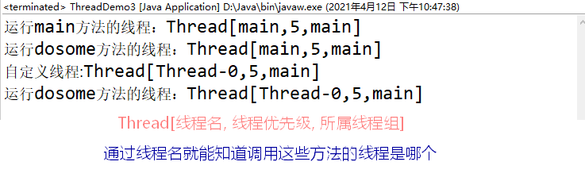


```java
package Y2021M3D29_Thread;
/**
 * 	线程提供了获取自身信息的相关方法
 * @author Grant·Vranes
 *
 */
public class ThreadDemo4 {
	public static void main(String[] args) {
		Thread main = Thread.currentThread();
		//获取线程的名字
		String name = main.getName();
		System.out.println("name:"+name);
		
		//获取线程的唯一标识(id)
		long id = main.getId();
		System.out.println("id:"+id);
		
		//获取线程的优先级
		int priority = main.getPriority();
		System.out.println("优先级："+priority);
		
		//线程是否还处于活动状态
		boolean isAlive = main.isAlive();
		System.out.println("isAlive:"+isAlive);
		
		//线程是否被中断了
		boolean isInterrupted = main.isInterrupted();
		System.out.println("isInterrupted:"+isInterrupted);
		
		//线程是否为守护线程
		boolean isDaemon = main.isDaemon();
		System.out.println("isDaemon:"+isDaemon);
	}
}
```


#### 线程优先级

```java
package Y2021M3D29_Thread;
/**
 * 	线程的优先级
 * 	作用：是用来干涉线程调度器工作的
 * 
 * 	线程优先级越高的，获取cpu次数理论上就越多,但是现在CPU都是多核心，要是分配到不同核心这个就不成立
 * 	优先级分10个等级，1~10，10的优先级最高，默认是5
 * 	
 *  线程start后就纳入线程调度器中统一管理，线程不能主动索取CPU时间片，只能被动被分配。
 *  线程调度器会尽可能均匀分配时间片给每个线程。我们可以通过调整线程的优先级来改善一个
 *  线程获取CPU时间片的概率，线程优先级越高的线程获取CPU时间片的次数越多。
 * @author Grant·Vranes
 *
 */
public class PriorityDemo {
	public static void main(String[] args) {
		Thread min = new Thread() {
			public void run() {
				for (int i = 0; i < 10000; i++) {
					System.out.println("min");
				}
			}
		};
		
		Thread max = new Thread() {
			public void run() {
				for (int i = 0; i < 10000; i++) {
					System.out.println("max");
				}
			}
		};
		
		Thread nor = new Thread() {
			public void run() {
				for (int i = 0; i < 10000; i++) {
					System.out.println("nor");
				}
			}
		};
		
		max.setPriority(Thread.MAX_PRIORITY);
		min.setPriority(Thread.MIN_PRIORITY);
		min.start();
		nor.start();
		max.start();
		//运行的结果就是max最大几率先显示完，但也会后min或者nor抢占先机，但那也是极小概率
	}
}
```


#### sleep阻塞


```java
package Y2021M3D29_Thread;
/**
 * 	线程提供了一个静态方法：
 * 	static void sleep(long ms)
 * 	使运行这个方法的线程阻塞指定毫秒。超时后该线程会自动回到RUNNABLE状态，等待再次CPU分配时间片并发运行。
 * @author Grant·Vranes
 *
 */
public class SleepDemo {
	public static void main(String[] args) {
		System.out.println("程序开始了");
		
		try {
			Thread.sleep(5000);//停顿5000ms=5s
		} catch (Exception e) {
			e.printStackTrace();
		}
		
		System.out.println("程序结束了");
	}
}
```

```java
package Y2021M3D29_Thread;
import java.util.Scanner;
/**
 * 	倒计时程序
 * 	程序启动后，要求输入一个数字，比如:100
 * 	然后每秒输出一次，每次输出数字递减
 * 	输出到0时提示结束，程序退出。
 * @author Grant·Vranes
 *
 */
public class Test {
	public static void main(String[] args) {
		Scanner scanner = new Scanner(System.in);
		System.out.println("请输入一个数字:");
		String line = scanner.nextLine();
		Integer num = Integer.parseInt(line);
		for(;num>0;num--) {
			System.out.println(num);
			try {
				Thread.sleep(1000);
			}catch(InterruptedException e) {
				e.printStackTrace();
			}
		}
		System.out.println("倒计时结束！");
	}
}
或者是如下这种写法：
    /*
    public static void main(String[] args) {
        Scanner scan = new Scanner(System.in);
        int time = scan.nextInt();
        System.out.println("程序开始了");
        try {
            while (time != 0){
                Thread.sleep(1000);
                System.out.println(time);
                time--;
            }
        } catch (InterruptedException e) {
            e.printStackTrace();
        }
        System.out.println("程序结束了");
    }
```

```java
package Y2021M3D29_Thread;
/**
 *	当一个线程调用Thread.sleep()方法处于睡眠阻塞的过程中，若该线程的interrupt()
 *	方法被调用时，会中断该线程的睡眠阻塞，此时该线程会抛出中断异常。
 * 	所以sleep方法要求必须处理中断异常，这时并非是将这个线程直接中断，而是中断了
 * 	它的阻塞状态
 * @author Grant·Vranes
 *
 */
public class SleepDemo2 {
	public static void main(String[] args) {
		/*
		 * 	JDK1.8之前，由于JVM内存分配的问题，有一个要求：
		 * 	当一个方法的局部变量被这个方法的其他局部内部类所引
		 * 	用时，这个变量声明那个必须是final的
		 * 
		 * 	所以有可能这句th1.interrupt();会报错
		 *	因为在main方法中线程th1这个局部对象被main方法中的线程th2的内部类所引用
		 */
		Thread th1 = new Thread() {
			public void run() {
				System.out.println("飞行器预计1000s后到达目的地~");
				try {
					Thread.sleep(1000000);
				} catch (InterruptedException e) {
					System.out.println("飞行器警报，遭遇飞来流星");
				}
			}
		};
		
		Thread th2 = new Thread() {
			public void run() {
				System.out.println("流星解体，碎成10个小流星");
				for(int i = 0; i < 10; i++) {
					System.out.println("飞来流星🌠");
					try {
						Thread.sleep(1000);
					} catch (InterruptedException e) {
						e.printStackTrace();
					}
				}
				System.out.println("🌠击中飞行器");
				System.out.println("发生大爆炸");
				//中断飞行器线程，让飞行器直接被catch捕获
				th1.interrupt();//中断th1线程
			}
		};
		th1.start();
		th2.start();
	}
}
/*
飞行器预计1000s后到达目的地~
流星解体，碎成10个小流星
飞来流星🌠
飞来流星🌠
飞来流星🌠
飞来流星🌠
飞来流星🌠
飞来流星🌠
飞来流星🌠
飞来流星🌠
飞来流星🌠
飞来流星🌠
🌠击中飞行器
发生大爆炸
飞行器警报，遭遇飞来流星
```


#### 守护线程

https://blog.csdn.net/weixin_40087231/article/details/90031253

```java
package Y2021M3D29_Thread;
/**
 * 	守护线程
 * 	守护线程又称为后台线程，默认创建的线程都是普通线程或称为前台线程，线程提供了一个方法：
 * 	void setDaemon(boolean on)
 * 	只有调用该方法并传入参数true时，该线程才会被设置为守护线程
 * 
 * 	守护线程在使用上与普通线程没有差别，但是在结束时机上有一个区别，
 * 	即：线程结束时所有正在运行的守护线程都会被强制停止。
 * 	
 * 	而线程的结束是指：当一个进程中所有的普通线程都结束时，进程即结束。
 * 
 * 	所以守护线程的工作情况一般是：该线程一直存在，不会自动关闭，全程都需要使用，但进程结束后就不需要。
 *
 *	如下这个程序的需求是rose线程执行完后，jack线程也执行完毕
 */
public class DaemonThreadDemo {
	public static void main(String[] args) {
		//模拟杰克和rose的跳船场景，杰克守护rose
		Thread rose = new Thread() {
			public void run() {
				for (int i = 0; i < 5; i++) {
					System.out.println("rose:let me go!");
					try {
						Thread.sleep(1000);//1秒钟喊一次
					} catch (InterruptedException e) {
					}
				}
				System.out.println("rose:aaaaaaaaaaaa");
				System.out.println("落水声");
			}
		};
		
		Thread jack = new Thread() {
			public void run() {
				while(true) {
					System.out.println("jack:you jump , i jump");
					try {
						Thread.sleep(1000);//1秒钟喊一次，一旦rose落水，jack也不喊了
					} catch (InterruptedException e) {
					}
				}
			}
		};
		
		rose.start();
		
		/*
		 * 设置jack为守护线程
		 * 注意，必须在线程启动前进行设置
		 * 普通线程都结束的时候，运行中的守护线程都会被强制停止，rose就是一个普通线程
		 */
		jack.setDaemon(true);
		jack.start();
		
		/*
		 * 注意：mian方法本身也是一个普通线程（前台线程），执行完main方法中所有代码
		 * 就会自动结束，但如果main中有一个死循环，main就一直结束不了，守护线程就一直存在
		 */
	}
}
```


#### 同步和异步

> - 同步运行：运行有顺序，有先来后到~（比如说一个试衣间你进去了，我就在外面等着，也由此衍生出同步块/锁）~
>
> - 异步运行：运行代码无顺序，CPU时间片分配给了谁谁就运行，多线程并发运行就是异步运行~（因为在微观层面并发运行就是你一下我一下的执行，宏观层面才体现出多个任务都是在同时进行）~


#### join阻塞

可以协调我们线程间的同步运行

应用场景：主线程创建并启动了子线程，如果子线程中需要进行大量的耗时运算，主线程往往将早于子线程结束之前结束。如果主线程想等待子线程执行完毕后，获得子线程中的处理完的某个数据，就要用到join方法。join方法的作用是等待线程对象被销毁（执行完毕）。

```java
package Y2021M3D29_Thread;
/**
 * 线程提供了一个方法：
 * void join()
 * 该方法可以协调线程之间的同步运行
 * 
 * @author Grant·Vranes
 
 *	这个程序的需求是，我想让download线程执行完毕后，再执行
 *	show线程（图片下载完毕后，再进行图片展示）
 */

public class JoinDemo {
	//标识图片是否下载完毕
	private static boolean isFinish = false;
	/*
	 * 解惑：isFinish变量只在main方法中使用，为什么不放在main方法中呢？
	 * 因为isFinish如果放在main方法中，当一个方法的局部变量被这个方法的其
	 * 他局部内部类所引用时，这个变量声明那个必须是final的(JDK1.8之后可以不写final
	 * ，但是它还是默认是有一个final），然后声明成final发现，final的值是不可修改的
	 *，这就有悖。所以直接将他设置为一个成员属性。
	 */
	
	public static void main(String[] args) {
		Thread download = new Thread() {
			public void run() {
				System.out.println("down:开始下载图片...");
				for (int i = 0; i <= 100; i++) {
					System.out.println("down:"+i+"%");
					try {
						Thread.sleep(20);
					}catch(InterruptedException e) {
					}
				}
				System.out.println("down:图片下载完毕");
				isFinish = true;
			}
		};
		
		Thread show = new Thread() {
			public void run() {
				System.out.println("show:开始显示图片");
				//加载图片前应该先等待下载线程将图片下载
				//让show等着download把活先干完，所以我们要阻塞show
				
				try {
					/*
					 * show线程在调用download.join()方法后，表明自己跟在了download后面，
					 * 就进入了阻塞状态，直到download线程的run方法执行完毕才会解除阻塞
					 */
					download.join();
				} catch (InterruptedException e) {
					e.printStackTrace();
				}
				
				if(!isFinish) {
					//自定义异常
					throw new RuntimeException("加载图片失败");
				}
				System.out.println("show:显示图片完毕");
			}
		};
		
		download.start();
		show.start();
	}
}
```


#### 并发安全问题介绍

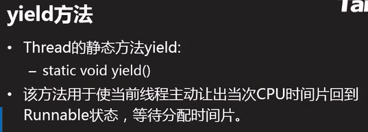

```java
package Y2021M3D29_Thread;
/**
 * 多线程并发的安全问题
 * 产生：当多个线程并发操作同一资源时，由于线程切换实际的不确定性，会导致执行
 * 操作资源的代码顺序未按照设计顺序执行，出现操作混乱的情况，严重时可能导致设计瘫痪
 * 
 * 举个栗子：一个人去银行柜台取钱，他兄弟去提款机取钱，都从同一个账户取钱，假设银行
 * 系统中这两个线程同时进行，同时对于同一账户余额操作，可能就会出现意想不到的事情。
 * 
 * 解决：将并发操作同一资源改为同步操作，即：有先后顺序的操作
 * 
 * @author Grant·Vranes
 * 该程序需求：假设桌子上有20个豆子，两个线程同时拿，当桌子上豆子为0时结束
 */
public class SyncDemo {
	public static void main(String[] args) {
		Table table = new Table();
		Thread t1 = new Thread() {
			public void run() {
				while(true) {
					int bean = table.getBean();
					Thread.yield();
					System.out.println(getName()+":"+bean);
				}
			}
		};
		
		Thread t2 = new Thread() {
			public void run() {
				while(true) {
					int bean = table.getBean();
					Thread.yield();
					System.out.println(getName()+":"+bean);
				}
			}
		};
		
		t1.start();
		t2.start();
	}
}

class Table{
	//现在桌子上有20个豆子
	private int beans = 20;
	public int getBean() {//拿豆子方法
		if(beans == 0) {
			throw new RuntimeException("没有豆子");
		}
		//模拟线程执行到这里没有时间了
		Thread.yield();
		return beans--;
	}
}
```


#### 同步方法

```java
class Table{
	//现在桌子上有20个豆子
	private int beans = 20;
    /*
	 * 
	 * 当一个方法被synchronized修饰后，该方法称为“同步方法”，即：多线程
	 * 不能同时在方法内部运行（必须要有先来后到）。即当有一个线程执行方法的时候，其他线程都在方法外候着
	 * 
	 * 强制让多个线程在执行同一方法时变为同步操作就解决了并发安全问题，但是性能会降低
	 *
	 *	在方法上使用synchronized，那么同步监视器对象就是当前方法所属对象，即：内部看到的this
	 */
    /**
     * 当一个方法使用关键字synchronized修饰后，这个方法称为同步方法，即；多个线程
     * 不能同时在方法内部执行，只能有先后顺序的一个一个执行该方法，一个方法执行进去，
     * 另一个在方法外等待
     * 
     * 将多线程并发操作改为同步排队操作可有效解决多线程并发安全问题
     */
	public synchronized int getBean() {//拿豆子方法
		if(beans == 0) {
			throw new RuntimeException("没有豆子");
		}
		//模拟线程执行到这里1没有时间了
		Thread.yield();
		return beans--;
	}
}
```


#### 同步锁（同步块）

通过学习上节我们初步了解synchronized的基本作用，但是实际应用中并不是所有的代码都需要同步运行，所以这一节我们将介绍同步块，用来缩小同步范围

```java
package Y2021M3D29_Thread;
/**
 * 	同步块
 * 	语法：
 * 	synchronized(同步监视器对象){
 * 		需要同步运行的代码片段
 * 	}
 * 
 * 	同步块可以更精确的控制需要同步运行的代码片段。有效的缩小同步范围
 * 	可以在保证并发安全的前提下提高代码并发运行的效率
 * 	使用同步块控制多线程同步运行必须要求这些线程看到的同步监视器对象
 * 	为【同一个】
 * @author Grant·Vranes
 *
 */
public class SyncDemo2 {
	public static void main(String[] args) {
		Shop shop = new Shop();
		Thread t1 = new Thread() {
			public void run() {
				shop.buy();
			}
		};
		
		Thread t2 = new Thread() {
			public void run() {
				shop.buy();
			}
		};
		
		t1.start();
		t2.start();
	}
}

class Shop{
	public synchronized void buy() {//同步方法
		try {
			Thread t= Thread.currentThread();
			System.out.println(t.getName()+":正在挑衣服");
			Thread.sleep(5000);//休眠5s
			
			System.out.println(t.getName()+":进入试衣间，正在试衣服");
			Thread.sleep(5000);//休眠5s
			
			System.out.println(t.getName()+":结账离开");
			
		} catch (Exception e) {
			// TODO: handle exception
		}
	}
}
```


运行后我们发现进程Thread-1一直在等待Thread-0，直到Thread-0结束买衣服后才开始执行,这样的执行效率就很低，但在实际应用中，我们发现：挑衣服这件事两个线程可以同时进行，仅仅只是试衣服需要排队，即使用同步块。所以我们可以修改成如下样式。

```java
//Shop类中,将类中的buy方法synchronized属性去掉,为需要同步的代码加上同步块
class Shop{
     //在方法上使用synchronized时，同步监视器对象就是当前方法所属对象，即：this
	//public synchronized void buy() {
	public void buy() {
		try {
			Thread t = Thread.currentThread();
			System.out.println(t.getName()+":正在挑衣服");
			Thread.sleep(5000);//休眠5s
			
            /*
                使用同步块时要在（)中指定同步监视器对象，该对象可以是java中任何类的实例，但是
                必须保证多个需要同步执行该代码块的线程看到的这个同步监视器对象是同一个才可以！
             */
            //同步块
            //括号中的输入要保证所有线程看到的是同一个对象
			//this代表同一个Shop类
			synchronized (this) {
				System.out.println(t.getName()+":进入试衣间，正在试衣服");
				Thread.sleep(5000);//休眠5s
			}
			
			System.out.println(t.getName()+":结账离开");
			
		} catch (Exception e) {
			// TODO: handle exception
		}
	}
}
运行结果如下:
```


##### synchronized修饰静态方法

> 在静态方法上使用synchronized后，该静态方法变为同步的，而同步监视器对象为当前类的类对象，即：Class的实例
>
> 注：JVM中每个被加载的类都有且只有一个Class的实例与之对应，静态方法锁的就是这个类对象。而类对象会在后期的反射知识点中介绍。

```java
package Y2021M3D29_Thread;
/**
 * 	静态方法若使用synchronized修饰，那么该方法一定具有同步效果
 * 
 * 	静态方法对应的同步监视器对象为当前类的类对象（Class实例）
 * @author Grant·Vranes
 *
 */
public class SyncDemo3 {
	public static void main(String[] args) {
		Thread t1 = new Thread() {
			public void run() {
				Foo.dosome();
			}
		};
		
		Thread t2 = new Thread() {
			public void run() {
				Foo.dosome();
			}
		};
		t1.start();
		t2.start();
        /*使用对象.dosome()方法也具有同步效果
        Foo f1 = new Foo();
        Foo f2 = new Foo();
        Thread t1 = new Thread() {
            public void run() {
                f1.dosome();
            }
        };

        Thread t2 = new Thread() {
            public void run() {
                f2.dosome();
            }
        };
        t1.start();
        t2.start();
        */
	}
}
class Foo{
    /*
        在静态方法上使用synchronized后，该静态方法变为同步的，而同步监视器对象为
        当前类的类对象，即：Class的实例
        注：JVM中每个被加载的类都有且只有一个Class的实例与之对应，静态方法锁的就是
        这个类对象。而类对象会在后期的反射知识点中介绍。
     */
	public synchronized static void dosome() {
		Thread t = Thread.currentThread();
		System.out.println(t.getName()+":正在运行dosome");
		try {
			Thread.sleep(5000);
		} catch (InterruptedException e) {
			e.printStackTrace();
		}
		System.out.println(t.getName()+":运行dosome方法完毕");
	}
}
运行效果如下:
```


```java
//如何在静态方法中使用同步块呢？
class Foo{
	public static void dosome() {
    //同步块在静态方法中指定的锁对象通常也是当前类的类对象，获取方式：类名.class
        synchronized (Foo.class) {
            Thread t = Thread.currentThread();
            System.out.println(t.getName()+":正在运行dosome");
            try {
                Thread.sleep(5000);
            } catch (InterruptedException e) {
                e.printStackTrace();
            }
            System.out.println(t.getName()+":运行dosome方法完毕");
        }
	}   
}
```

---

小题：

```java
public class Test03 {
	public static int[] array = {};
	public static void main(String[] args) throws InterruptedException {
		Thread t1 = new Thread() {
			public void run() {
//				synchronized (this) {
					for(int i=0;i<100;i++) {
						array = Arrays.copyOf(array, array.length+1);
						System.out.println("t1:"+array.length);
						array[array.length-1]=i;
					}
//				}
			}
		};
		Thread t2 = new Thread() {
			public void run() {
//				synchronized (this) {
					for(int i=100;i<200;i++) {
						array = Arrays.copyOf(array, array.length+1);
						System.out.println("t1:"+array.length);
						array[array.length-1]=i;
					}
//				}
			}
		};
		t1.start();
		t2.start();
		/*
		 * 多执行几次，检查程序可能存在的问题，并尝试自己
		 * 分析为什么会出现这些情况?
		 *
		 * 两个线程各自对数组扩容了100次，按理说数组应当
		 * 有200的长度，并且里面存放着数据才是对的。数据
		 * 的位置无所谓，毕竟是并发的。
		 */
		Thread.sleep(1000);//阻塞1秒是等待上面两个线程干完活
		System.out.println(array.length);
		System.out.println(Arrays.toString(array));
	}
}
```


#### 互斥锁

简单来讲就是多个代码块被synchronized修饰,且上锁对象都是同一个,那么这多个代码块之间就是互斥的.

```java
package Y2021M3D29_Thread;
/**
 * 	互斥锁
 * 	当多个代码片段被synchronized块修饰后，这些同步块的
 * 	同步监听器对象又是同一个时，这些代码片段就是互斥的。多
 * 	个线程不能同时在这些方法中运行。
 * @author Grant·Vranes
 *
 */
public class SyncDemo4 {
	public static void main(String[] args) {
		Boo boo = new Boo();
		Thread t1 = new Thread() {
			public void run() {
				boo.methodA();
			}
		};
		
		Thread t2 = new Thread() {
			public void run() {
				boo.methodB();
			}
		};
		
		t1.start();
		t2.start();
	}
}

class Boo{
	public synchronized void methodA() {
		Thread t = Thread.currentThread();
		try {
			System.out.println(t.getName()+":正在运行方法A");
			Thread.sleep(5000);
			System.out.println(t.getName()+":运行方法A完毕");
		} catch (Exception e) {
			// TODO: handle exception
		}
	}
//    public synchronized void methodB(){
	public void methodB() {
      	synchronized (this) {//加静态块效果都是一样的
            Thread t = Thread.currentThread();
            try {
                System.out.println(t.getName()+":正在运行方法B");
                Thread.sleep(5000);
                System.out.println(t.getName()+":运行方法B完毕");
            } catch (Exception e) {
                // TODO: handle exception
            }
        }
	}
}
解释一下:在Boo类中,有两个被synchronized关键字修饰的方法,此时在main方法中t1线程中调用methodA方法(boo.methodA()),该方法被synchronized修饰,锁的是boo这个被new出来的对象;而线程t2调用methodB方法,该方法也被synchronized修饰,锁的和t1线程一样,都是锁boo对象,但此时就有互斥效果.t1线程调用methodA方法时将boo锁住,当t2线程执行到boo.methodB()时发现boo对象被锁住了,就在这等待,等boo被解锁后再执行.
运行结果如下图:
```


#### 死锁

> **什么是死锁？**
>
> 当两个线程各自持有一个锁的同时都在等待对方先释放锁时就会形成一种僵持状态，导致两个线程卡住。这种现象称为死锁现象。

```java
/**
 * 死锁
 * 当两个线程各自持有一个锁的同时都在等待对方先释放锁时就会形成一种僵持状态，导致
 * 两个线程卡住。这种现象称为死锁现象。
 *
 * @author Akio
 * @Create 2021/7/30 19:06
 */
public class DeadLockDemo {
    private static Object chopsticks = new Object();//筷子
    private static Object spoon = new Object();//勺

    public static void main(String[] args) {
        Thread np = new Thread() {
            @Override
            public void run() {
                try {
                    System.out.println("北方人开始吃饭……");
                    System.out.println("北方人去拿筷子……");
                    synchronized (chopsticks){
                        System.out.println("北方人拿起了筷子开始吃饭……");
                        Thread.sleep(5000);
                        System.out.println("北方人吃完了饭，去拿勺子……");
                        synchronized (spoon){
                            System.out.println("北方人拿起了勺子开始喝汤……");
                            Thread.sleep(5000);
                            System.out.println("北方喝完了汤");
                        }
                        System.out.println("北方人放下了勺");
                    }
                    System.out.println("北方人干完了饭");
                } catch (InterruptedException e) {
                    e.printStackTrace();
                }
            }
        };

        Thread sp = new Thread() {
            @Override
            public void run() {
                try {
                    System.out.println("南方人开始吃饭……");
                    System.out.println("南方人去拿勺子……");
                    synchronized (spoon){
                        System.out.println("南方人拿起了勺子开始喝汤……");
                        Thread.sleep(5000);
                        System.out.println("南方人喝完了汤，去拿筷子……");
                        synchronized (chopsticks){
                            System.out.println("南方人拿起了筷子开始吃饭……");
                            Thread.sleep(5000);
                            System.out.println("南方人吃完了饭");
                        }
                        System.out.println("南方人放下了筷子");
                    }
                    System.out.println("南方人干完了饭");
                } catch (InterruptedException e) {
                    e.printStackTrace();
                }
            }
        };

        np.start();
        sp.start();
    }
}
//运行效果：
```


> **如何避免死锁？**
>
> 避免一个线程在持有一个锁的过程中再去持有另一个锁。原则上持有一个对象锁后将该操作做完就立即释放后再去持有其他的锁，如下：
>
> ```java
> /**
>  * 避免一个线程在持有一个锁的过程中再去持有另一个锁。原则上持有一个对象锁后
>  * 将该操作做完就立即释放后再去持有其他的锁
>  */
> public class DeadLockDemo2 {
>     private static Object chopsticks = new Object();//筷子
>     private static Object spoon = new Object();//勺
> 
>     public static void main(String[] args) {
>         Thread np = new Thread(){
>             public void run(){
>                 try {
>                     System.out.println("北方人开始吃饭...");
>                     System.out.println("北方人去拿筷子...");
>                     synchronized (chopsticks) {
>                         System.out.println("北方人拿起了筷子开始吃饭...");
>                         Thread.sleep(5000);
>                         System.out.println("北方人吃完了饭");
>                     }
>                     System.out.println("北方人放下了筷子");
>                     System.out.println("北方人去拿勺子...");
>                     synchronized (spoon) {
>                         System.out.println("北方人拿起了勺开始喝汤...");
>                         Thread.sleep(5000);
>                         System.out.println("北方人喝完了汤");
>                     }
>                     System.out.println("北方人放下了勺，吃饭完毕");
> 
> 
>                 } catch (InterruptedException e) {
>                     e.printStackTrace();
>                 }
>             }
>         };
> 
>         Thread sp = new Thread(){
>             public void run(){
>                 try {
>                     System.out.println("南方人开始吃饭...");
>                     System.out.println("南方人去拿勺...");
>                     synchronized (spoon) {
>                         System.out.println("南方人拿起了勺开始喝汤...");
>                         Thread.sleep(5000);
>                         System.out.println("南方人喝完了汤");
>                     }
>                     System.out.println("南方人放下了勺");
>                     synchronized (chopsticks) {
>                         System.out.println("南方人拿起了筷子开始吃饭...");
>                         Thread.sleep(5000);
>                         System.out.println("南方人吃完了饭");
>                     }
>                     System.out.println("南方人放下了筷子，吃饭完毕");
> 
>                 } catch (InterruptedException e) {
>                     e.printStackTrace();
>                 }
>             }
>         };
>         np.start();
>         sp.start();
>     }
> }
> ```
>
> 


#### 聊天室项目(2)


```java
package Y2021M3D27_Socket;

import java.io.BufferedReader;
import java.io.BufferedWriter;
import java.io.InputStream;
import java.io.InputStreamReader;
import java.io.OutputStream;
import java.io.OutputStreamWriter;
import java.io.PrintWriter;
import java.net.Socket;
import java.util.Scanner;

/**
 * 	聊天室客户端
 * @author Grant·Vranes
 *
 */
public class Client {
	/*
	 * java.net.Socket
	 * 	Socket封装了TCP协议的通讯细节，使该过程抽象为通过两个
	 * 	流的读写完成与远端计算机的数据交互。
	 * 
	 * 	Socket的本地翻译为：套接字
	 */
	private Socket socket;
	
	/*
	 * 	构造方法，用来初始化客户端
	 */
	public Client() {
		try {
			/*
			 * 	实例化Socket的同时需要传入两个参数：
			 * 	1、服务端的IP地址
			 * 	2、服务端所使用的端口号
			 * 
			 * 	通过IP地址可以找到服务端的计算机，通过端口可以连接
			 * 	到运行在服务端计算机上的服务端应用程序。而我们客户端
			 * 	自身的IP和端口无需指定，系统会分配一个端口，并且连
			 * 	接后会发送给服务端。
			 * 
			 * 	实例化Socket的过程就是发起连接的过程，若服务端没有
			 * 	响应则这里会直接抛出异常。
			 */
			System.out.println("正在连接服务端.........");
			socket = new Socket("localhost",8088);
			System.out.println("已连接服务端!");
		} catch (Exception e) {
			e.printStackTrace();
		}
	}
	
	/*
	 * 	程序开始工作的方法
	 */
	public void start() {
		try {
			Scanner scanner = new Scanner(System.in);
			/*
			 * Socket提供的方法：
			 * OutputStream getOutputStream()
			 * 	返回一个字节输出流，通过该输出流写出的数据最终会发送给服务端
			 */
			OutputStream out = socket.getOutputStream();
			OutputStreamWriter osw = new OutputStreamWriter(out,"UTF-8");
			BufferedWriter bw = new BufferedWriter(osw);
			PrintWriter pw = new PrintWriter(bw, true);
			
			/*
			 * 	通过Socket获取输入流，读取服务端发送过来的消息
			 */
			InputStream in = socket.getInputStream();
			InputStreamReader isr = new InputStreamReader(in,"UTF-8");
			BufferedReader br = new BufferedReader(isr);
			
			String line = null;
			while(true) {
				line = scanner.nextLine();
				pw.println(line);
				
				//读取服务端发送过来的一行字符串
				line = br.readLine();
				System.out.println(line);
			}
			
		} catch (Exception e) {
			e.printStackTrace();
		}
	}
	
	public static void main(String[] args) {
		Client client = new Client();
		client.start();
	}
}
```

```java
package Y2021M3D27_Socket;
/**
 * 	聊天室服务端
 * @author Grant·Vranes
 *
 */

import java.io.BufferedReader;
import java.io.BufferedWriter;
import java.io.InputStream;
import java.io.InputStreamReader;
import java.io.OutputStream;
import java.io.OutputStreamWriter;
import java.io.PrintWriter;
import java.net.ServerSocket;
import java.net.Socket;

public class Server {
	/*
	 * 	运行在服务端的ServerSocket
	 * 	有两个作用
	 *	1、向系统申请服务端口，客户端就是通过这个端口与服务端
	 *	       程序建立连接的。
	 *	2、监听该端口，当客户端通过该端口与服务端建立连接时会
	 *	       自动创建一个Socket。通过这个Socket与客户端进
	 *	       行数据交互。
	 * 
	 */
	private ServerSocket server;
	
	/*
	 * 	构造方法，用于初始化服务端
	 */
	public Server() {
		try {
			/*
			 * 	实例化ServerSocket的同时向系统申请服务端口，该端口不能与
			 * 	系统申请的其他应用程序相同，否则会抛出地址被占用的异常
			 */
			System.out.println("正在启动服务端............");
			server = new ServerSocket(8088);
			System.out.println("服务端启动成功！");
			
		} catch (Exception e) {
			e.printStackTrace();
		}
	}
	
	/*
	 * 	程序开始工作的方法
	 */
	public void start() {
		try {
			/*
			 * 	ServerSocket有一个重要的方法：
			 * 	Socket accept()
			 * 	该方法是一个“阻塞”方法，调用后程序就在这里“卡住了”，这是开始
			 * 	等待客户端的连接。那么当客户端通过端口尝试连接时，accept会返
			 * 	回一个Socket，通过该Socket就可以与刚建立连接的客户端进行交互了。
			 */
            while(true){
                System.out.println("等待客户端连接......");
                Socket socket = server.accept();
                System.out.println("一个客户端连接了！");
                //启动一个线程来处理该客户端
                ClientHandler handler = new ClientHandler(socket);
                Thread t= new Thread(handler);
                t.start();
        	}
		} catch (Exception e) {
			e.printStackTrace();
		}
	}
	
	public static void main(String[] args) {
		Server server = new Server();
		server.start();
	}
	
	/*
	 * 	该进程任务是与指定的Socket对应的客户端进行数据交互
	 */
	private class ClientHandler implements Runnable{
		private Socket socket;
		
		public ClientHandler(Socket socket) {
			this.socket = socket;
		}
		
		public void run() {
			System.out.println("启动了一个线程处理客户端");
			try {
				/*
				 * 	通过Socket获取输入流，读取客户端发送过来的数据
				 */
				InputStream in = socket.getInputStream();
				InputStreamReader isr = new InputStreamReader(in, "UTF-8");
				BufferedReader br = new BufferedReader(isr);
			
				/*
				 * 	通过Socket获取输出流，给该客户端发送消息
				 */
				OutputStream out = socket.getOutputStream();
				OutputStreamWriter osw = new OutputStreamWriter(out,"UTF-8");
				BufferedWriter bw = new BufferedWriter(osw);
				PrintWriter pw = new PrintWriter(bw,true);
				
				
				
				/*
				 * 	String readLine()
				 * 	读取一行字符串
				 * 	顺序读取若干字符，当读取到了换行符时停止，并将换行符之前的字符组成一个字符串
				 * 	返回。返回的字符串中是不含有最后的换行符的。若返回值为null，说明流读取到了末尾。
				 *	 
				 * 	while(true){
				 * 		String message = br.readLine();
				 * 		System.out.println("Client说：" + message);
				 * 	}
				 * 	上面这种写法是有错误的，while(true)是个循环，而br.readLine()读到末尾时，
				 * 	还有返回值null，循环仍在进行，这就成了一个死循环。
				 */
				String message = null;
				while((message=br.readLine()) != null) {
					System.out.println("Client说：" + message);
					//将消息发送给当前客户端
					pw.println("Server说："+message);
				}
			} catch (Exception e) {
				e.printStackTrace();
			}
		}
	}	
}
```


#### 聊天室项目(3)


```java
package Y2021M3D27_Socket;

import java.io.BufferedReader;
import java.io.BufferedWriter;
import java.io.InputStream;
import java.io.InputStreamReader;
import java.io.OutputStream;
import java.io.OutputStreamWriter;
import java.io.PrintWriter;
import java.net.Socket;
import java.util.Scanner;

/**
 * 	聊天室客户端
 * @author Grant·Vranes
 *
 */
public class Client {
	/*
	 * java.net.Socket
	 * 	Socket封装了TCP协议的通讯细节，使该过程抽象为通过两个
	 * 	流的读写完成与远端计算机的数据交互。
	 * 
	 * 	Socket的本地翻译为：套接字
	 */
	private Socket socket;
	
	/*
	 * 	构造方法，用来初始化客户端
	 */
	public Client() {
		try {
			/*
			 * 	实例化Socket的同时需要传入两个参数：
			 * 	1、服务端的IP地址
			 * 	2、服务端所使用的端口号
			 * 
			 * 	通过IP地址可以找到服务端的计算机，通过端口可以连接
			 * 	到运行在服务端计算机上的服务端应用程序。而我们客户端
			 * 	自身的IP和端口无需指定，系统会分配一个端口，并且连
			 * 	接后会发送给服务端。
			 * 
			 * 	实例化Socket的过程就是发起连接的过程，若服务端没有
			 * 	响应则这里会直接抛出异常。
			 */
			System.out.println("正在连接服务端.........");
			socket = new Socket("localhost",8088);
			System.out.println("已连接服务端!");
		} catch (Exception e) {
			e.printStackTrace();
		}
	}
	
	/*
	 * 	程序开始工作的方法
	 */
	public void start() {
		try {
			//启动一个线程用来读取服务端消息
			ServerHandler handler = new ServerHandler();
			Thread t = new Thread(handler);
			t.start();
			
			Scanner scanner = new Scanner(System.in);
			/*
			 * Socket提供的方法：
			 * OutputStream getOutputStream()
			 * 	返回一个字节输出流，通过该输出流写出的数据最终会发送给服务端
			 */
			OutputStream out = socket.getOutputStream();
			OutputStreamWriter osw = new OutputStreamWriter(out,"UTF-8");
			BufferedWriter bw = new BufferedWriter(osw);
			PrintWriter pw = new PrintWriter(bw, true);
			
			String line = null;
			while(true) {
				line = scanner.nextLine();
				pw.println(line);
			}
			
		} catch (Exception e) {
			e.printStackTrace();
		}
	}
	
	//main方法
	public static void main(String[] args) {
		Client client = new Client();
		client.start();
	}
	
	/*
	 * 	该线程负责循环接受服务端发送过来的消息并输出到客户端
	 * 	的控制台
	 */
	private class ServerHandler implements Runnable{
		public void run() {
			try {
				/*
				 * 	通过Socket获取输入流，读取服务端发送过来的消息
				 */
				InputStream in = socket.getInputStream();
				InputStreamReader isr = new InputStreamReader(in,"UTF-8");
				BufferedReader br = new BufferedReader(isr);
				
				String line = null;
				while((line=br.readLine())!=null) {
					System.out.println(line);
				}
			} catch (Exception e) {
				e.printStackTrace();
			}
		}
	}
}
```

```java
package Y2021M3D27_Socket;
/**
 * 	聊天室服务端
 * @author Grant·Vranes
 *
 */

import java.io.BufferedReader;
import java.io.BufferedWriter;
import java.io.IOException;
import java.io.InputStream;
import java.io.InputStreamReader;
import java.io.OutputStream;
import java.io.OutputStreamWriter;
import java.io.PrintWriter;
import java.net.ServerSocket;
import java.net.Socket;
import java.util.Arrays;

public class Server {
	/*
	 * 	运行在服务端的ServerSocket
	 * 	有两个作用
	 *	1、向系统申请服务端口，客户端就是通过这个端口与服务端
	 *	       程序建立连接的。
	 *	2、监听该端口，当客户端通过该端口与服务端建立连接时会
	 *	       自动创建一个Socket。通过这个Socket与客户端进
	 *	       行数据交互。
	 * 
	 */
	private ServerSocket server;
	
	/*
	 * 	该数组用于保存所有ClientHandler内部对应客户端
	 * 	的输出流，以便广播消息。
	 * 	由于内部类可以访问其对应外部类的属性，对此我们在
	 * 	Server中定义该数组，所有的内部类ClientHandler
	 * 	都可以看到它。这样将这些ClientHandler需要共享
	 * 	的数据存入这个数组即可。
	 */
	private PrintWriter[] allOut = {};
	
	/*
	 * 	构造方法，用于初始化服务端
	 */
	public Server() {
		try {
			/*
			 * 	实例化ServerSocket的同时向系统申请服务端口，该端口不能与
			 * 	系统申请的其他应用程序相同，否则会抛出地址被占用的异常
			 */
			System.out.println("正在启动服务端............");
			server = new ServerSocket(8088);
			System.out.println("服务端启动成功！");
			
		} catch (Exception e) {
			e.printStackTrace();
		}
	}
	
	/*
	 * 	程序开始工作的方法
	 */
	public void start() {
		try {
			/*
			 * 	ServerSocket有一个重要的方法：
			 * 	Socket accept()
			 * 	该方法是一个“阻塞”方法，调用后程序就在这里“卡住了”，这是开始
			 * 	等待客户端的连接。那么当客户端通过端口尝试连接时，accept会返
			 * 	回一个Socket，通过该Socket就可以与刚建立连接的客户端进行交互了。
			 */
			while(true) {
				System.out.println("等待客户端连接......");
				Socket socket = server.accept();
				System.out.println("一个客户端连接了！");
				//启动一个线程来处理该客户端
				ClientHandler handler = new ClientHandler(socket);
				Thread t = new Thread(handler);
				t.start();
			}
		} catch (Exception e) {
			e.printStackTrace();
		}
	}
	
	//main方法
	public static void main(String[] args) {
		Server server = new Server();
		server.start();
	}
	
	/*
	 * 	该线程任务是与指定的Socket对应的客户端进行数据交互
	 */
	private class ClientHandler implements Runnable{//线程的第二种创建方式
		private Socket socket;
		
		public ClientHandler(Socket socket) {//有参构造
			this.socket = socket;
		}
		
		public void run() {
			PrintWriter pw = null;
			System.out.println("启动了一个线程处理客户端");
			try {
				/*
				 * 	通过Socket获取输入流，读取客户端发送过来的数据
				 */
				InputStream in = socket.getInputStream();
				InputStreamReader isr = new InputStreamReader(in, "UTF-8");
				BufferedReader br = new BufferedReader(isr);
			
				/*
				 * 	通过Socket获取输出流，给该客户端发送消息
				 */
				OutputStream out = socket.getOutputStream();
				OutputStreamWriter osw = new OutputStreamWriter(out,"UTF-8");
				BufferedWriter bw = new BufferedWriter(osw);
				pw = new PrintWriter(bw,true);
				
				/*
				 * 	将当前ClientHandler对应客户端的输出流存入到allOut数组中。以便其它ClientHandler
				 * 	在接收消息后可以将消息发送给当前客户端
				 */
				synchronized(allOut) {
					//1、先对allOut数组扩容
					allOut = Arrays.copyOf(allOut, allOut.length+1);
					//2、将当前的pw存入到数组最后一个位置上
					allOut[allOut.length-1] = pw;
				}
				
				/*
				 * 	String readLine()
				 * 	读取一行字符串
				 * 	顺序读取若干字符，当读取到了换行符时停止，并将换行符之前的字符组成一个字符串
				 * 	返回。返回的字符串中是不含有最后的换行符的。若返回值为null，说明流读取到了末尾。
				 *	 
				 * 	while(true){
				 * 		String message = br.readLine();
				 * 		System.out.println("Client说：" + message);
				 * 	}
				 * 	上面这种写法是有错误的，while(true)是个循环，而br.readLine()读到末尾时，
				 * 	还有返回值null，循环仍在进行，这就成了一个死循环。
				 */
				String message = null;
				while((message=br.readLine()) != null) {
					System.out.println("Client说：" + message);
					//将消息发送给当前客户端
					//pw.println("Server说："+message);
				
					/*
					 * 遍历allOut操作要和其他线程对该数组的增删互斥(互斥锁)
					 */
					synchronized(allOut) {
						//遍历allOut，将消息发送给所有客户端
						for(int i=0; i<allOut.length; i++) {
							allOut[i].println("客户端说："+message);
						}
					}
				}
			} catch (Exception e) {
				e.printStackTrace();
			} finally {
				//处理客户端断开链接后的操作
				
				synchronized(allOut) {
					//将当前客户端的输出流pw从allOut数组中删除
					for (int i = 0; i < allOut.length; i++) {
						if(allOut[i] == pw) {
							//将最后一个元素放在这里
							allOut[i] = allOut[allOut.length-1];
							//缩容
							allOut = Arrays.copyOf(allOut, allOut.length-1);
							break;
						}
					}
				}
				
				//将socket关闭
				try {
					socket.close();
				} catch (IOException e) {
					e.printStackTrace();
				}
			}
		}
	}
}
```


## 25 Collection集合(2021.4.4)


### 集合常见方法

```java
package Y2021M4D4_Collection;

import java.util.ArrayList;
import java.util.Collection;

/**
 *  集合：只能存放引用类型数据
 *  java.util.Collection接口，该接口是所有集合的顶级接口，里面规定了所有集合都应当具备的功能方法。
 *  集合与数组一样，可以保存一组元素，但是不同种类的集合实现了不同的数据结构，实际开发中选择更多。
 * 	集合元素的相关方法，使用便捷。
 *
 * 	Collection接口下面有两个常见的子接口：
 * 	java.util.List:线性表，可重复集合，并且有序，可以通过下标操作元素
 * 	java.util.Set:不可重复集合，无序，元素是否重复是依靠元素自身equals比较进行判定的
 * @author Grant·Vranes
 */
public class CollectionDemo1 {
	public static void main(String[] args) {
		Collection c = new ArrayList();
		/* 1)
		 * boolean add(E e)  E就相当于一个数据类型,就向Object一样，基本什么类型的元素都可以放入集合
		 * 向当前集合中添加给定元素，当该元素成功添加则返回true
		 */
		c.add("one");
		c.add("two");
		c.add("three");
		c.add("four");
		c.add("five");
		
		System.out.println(c);
		
		/*	2)
		 * 	int size()
		 * 	返回当前集合的元素个数
		 * 
		 * 	注意：size()和length()是两个不同的概念，length返回的是长度，
		 * 	size返回的是个数，如果初始化一个数组大小为10，但只往其中放了3个元素，
		 * 	length=10，size=3
		 * 	但集合没有长度，是随着元素大小而改变的，所以没有对应的length方法
		 */
		int size = c.size();
		System.out.println("size:"+size);
	
		/*	3)
		 * 	boolean isEmpty()
		 * 	判断当前集合是否为空集(不含有任何元素size=0)
		 */
		boolean isEmpty = c.isEmpty();
		System.out.println("isEmpty:"+isEmpty);
	
		/*	4)
		 * 	void clear()
		 * 	清空当前集合
		 */
		c.clear();
		System.out.println(c);
	}
}
```


### contains方法介绍

```java
package Y2021M4D4_Collection;
/**
 * 	使用当前类实例作为集合元素，测试集合相关操作
 * @author Grant·Vranes
 *
 */
public class Point {
	private int x;
	private int y;
	public Point(int x, int y) {
		super();
		this.x = x;
		this.y = y;
	}
	public int getX() {
		return x;
	}
	public void setX(int x) {
		this.x = x;
	}
	public int getY() {
		return y;
	}
	public void setY(int y) {
		this.y = y;
	}
	@Override
	public String toString() {
		return "(" + x + ", " + y + ")";
	}
	
	public boolean equals(Object obj) {
		if(obj == null) {
			return false;
		}
		if(obj == this) {
			return true;
		}
		if(obj instanceof Point) {
			Point p = (Point)obj;
			return this.x==p.x&&this.y==p.y;
		}
		return false;
	}
}
```

```java
package Y2021M4D4_Collection;

import java.util.ArrayList;
import java.util.Collection;

/**
 * 	 集合提供了判断是否包含给定元素的方法：
 * 	boolean contains(E e)
 * @author Grant·Vranes
 *
 */
public class ContainsDemo {
	public static void main(String[] args) {
		Collection c = new ArrayList();
		c.add(new Point(1,2));
		c.add(new Point(3,4));
		c.add(new Point(5,6));
		c.add(new Point(7,8));
		c.add(new Point(9,10));
		/*
		 * 集合的toString方法会将每个元素的toString体现出来
         * 如果Point类中没有重写toString方法的话，这里输出的也不好看
		 */
		System.out.println(c);
		//[(1, 2), (3, 4), (5, 6), (7, 8), (9, 10)]
	
		Point p = new Point(1,2);
		//c.add(p);
		/*
		 * 	 contains方法是依靠元素自身equals比较
		 * 	 的结果判别集合是否包含该元素，但默认的equals
		 * 	方法都是==，不能进行准确判定，所以要重写equals方法
		 */
		boolean contains = c.contains(p);
		System.out.println("包含："+contains);//true
        
        /*
            boolean remove(Object o)
            从集合中删除给定元素,删除的是与集合中 equals比较为true的元素。
            对于List集合而言,如果存在重复元素仅删除第一个比较到的。当有元
            素被删除时方法返回true
         */
        c.remove(p);
        System.out.println(c);
	}
}
```


#### 集合存放的也是元素的引用（地址）

```java
package Y2021M4D4_Collection;

import java.util.ArrayList;
import java.util.Collection;

/**
 * 	集合只能存放引用类型元素，而不能存放基本类型元素，并且存放的也是元素的引用(地址)
 * @author Grant·Vranes
 *
 */
public class CollectionDemo2 {
	public static void main(String[] args) {
		Collection c = new ArrayList();
		Point p = new Point(1,2);
		
		c.add(p);
		System.out.println("c:"+c);//[(1, 2)]
		System.out.println("p:"+p);//(1, 2)
		
		p.setX(2);//此处修改p对象的x值，结果发现集合中元素也跟着变动了，说明集合c中存放的只是p对象的引用
		System.out.println("c:"+c);//[(2, 2)]
		System.out.println("p:"+p);//(2, 2)
	}
}
```


做个引用知识点的面试题

```java
public class CollectionTest {
    public static void main(String[] args) {
        String s = "hello";
        int a = 1;
        Point p = new Point(1,2);
        Collection c = new ArrayList();
        c.add(p);
        test(s,a,p,c);
        System.out.println("s:"+s);//s:hello
        System.out.println("a:"+a);//a:1
        System.out.println("p:"+p);//p:Point{x=3, y=2}
        System.out.println("c:"+c);//c:[Point{x=7, y=5}]
    }
    public static void test(String s, int a, Point p, Collection c){
        a++;
        s = s + "world";
        p.setX(3);
        p = new Point(4,5);
        c.clear();
        c.add(p);
        c = new ArrayList();
        p.setX(7);
        c.add(p);
    }
}
```

执行`test(s, a, p, c);`之前


执行`test(s, a, p, c);`


执行完`test(s, a, p, c);`之后，test方法中创建的局部变量（那一块栈帧）清除，然后GC开始回收对象，但处于引用的对象不能被释放。（main方法中的集合c中仍然引用着test方法创建的对象，因为test方法中的操作使集合中的引用指向了其创建的对象）


---

```java
/**
 * 画内存图，分析程序运行结果
 */
public class Test1 {
	public static void main(String[] args) {
		int a = 1;
		String str = "hello";
		Point p = new Point(1,2);
		String[] arr = {"one","two","three",str};
		int[] arr1 = {1,2,3,4,a};
		Point[] arr2 = {new Point(1,2),new Point(3,4),new Point(5,6),p};
		dosome(a,str,p,arr,arr1,arr2);
		System.out.println("a:"+a);//1
		System.out.println("str:"+str);//hello
		System.out.println("p:"+p);//(4,2)
		System.out.println("arr:"+Arrays.toString(arr));//[one,str,hello,hello]
		System.out.println("arr1:"+Arrays.toString(arr1));//[1,3,3,4,1]
		System.out.println("arr2:"+Arrays.toString(arr2));//[(1,2), (3,4), (12,6), (4,2)]
	}
	
	public static void dosome(int a,String str,Point p,String[] arr,int[] arr1,Point[] arr2) {
		arr1[a] = 3;
		arr[a] = "str";
		arr[a+1] = str;
		str = "world";
		str = arr[2];
		str+="!!";
		p.setX(4);
		p = arr2[2];
		p.setX(6);
		arr2 = Arrays.copyOf(arr2, arr2.length-1);
		arr2[2].setX(8);
		arr2 = new Point[]{new Point(2,2),p};
		arr2[arr2.length-1].setX(12);
	}
}
```

dosome()之前


执行到dosome()，但还未执行方法体


执行完dosome()中的方法体


执行完dosome()方法，所有dosome方法的栈帧和引用都被清除，内存中的没有被引用的对象都被gc回收


### 集合常见操作

```java
package Y2021M4D4_Collection;

import java.util.ArrayList;
import java.util.Collection;

/**
 * 	删除集合元素
 * @author Grant·Vranes
 *
 */
public class RemoveDemo {
	public static void main(String[] args) {
		Collection c = new ArrayList();
		c.add(new Point(1,2));
		c.add(new Point(3,4));
		c.add(new Point(5,6));
		c.add(new Point(1,2));
		System.out.println(c);
		
		Point p = new Point(1,2);
		/*
		 * 	删除元素也是依靠元素equals比较判定，所以Point类中也要重写equals方法
		 * 	只会删除找到的第一个元素
		 */
		c.remove(p);
		System.out.println(c);
	}
}
```

```java
package Y2021M4D4_Collection;

import java.util.ArrayList;
import java.util.Collection;
import java.util.HashSet;

/**
 * 	集合操作
 * @author Grant·Vranes
 *
 */
public class CollectionDemo3 {
	public static void main(String[] args) {
		Collection c1 = new ArrayList();//List是可重复集合
		c1.add("java");
		c1.add("c");
		c1.add("c++");
		System.out.println("c1:"+c1);
		
		Collection c2 = new HashSet();//Set是不可重复集合
		c2.add("php");
		c2.add(".net");
		c2.add("java");
		System.out.println("c2:"+c2);
		
		/*	1)
		 * boolean addAll(Collection c)
		 * 	将给定集合中的所有元素添加到当前集合中
		 */
		
//		c1.addAll(c2);
//		System.out.println("并集c1:"+c1);
		//并集c1:[java, c, c++, java, php, .net]
		//List是允许存在重复的集合，所以才会出现两个java

		c2.addAll(c1);
		System.out.println("并集c2:"+c2);
		//并集c2:[c++, java, c, php, .net]
		//Set是不允许存在重复的集合，所以只会有一个java
		
		Collection c3 = new ArrayList();
		c3.add("c");
		c3.add(".net");
		
		/*	2)
		 *	boolean containsAll(Collection c)
		 *	判断当前集合是否包含给定集合中的所有元素 
		 */
		boolean ca = c2.containsAll(c3);
		System.out.println("c2是否全包含c3:"+ca);//true
	
		/*	3)
		 *	boolean removeAll(Collection c)
		 * 	删除当前集合与给定集合的共有元素
		 */
		c2.removeAll(c3);
		System.out.println(c2);//[c++, java, php]
	}
}
```


### 迭代器介绍

```java
package Y2021M4D4_Collection;

import java.util.ArrayList;
import java.util.Collection;
import java.util.Iterator;


/**
 * 	集合提供了统一的遍历元素方式：迭代器模式
 * 
 * 	对应方法：
 * 	Iterator iterator()
 * 	该方法可以获取一个用来遍历当前集合的迭代器实现类，通过它
 * 	遍历元素
 * 
 * 	java.util.Iterator接口
 * 	迭代器接口，规定了迭代器遍历集合的相关操作不同的集合都
 * 	实现了一个用于遍历自身元素的迭代器实现类。
 * 
 * 	迭代器遍历集合元素遵循的过程：问，取，删
 * 	其中删除操作不是必要的
 * @author Grant·Vranes
 *
 */
public class IteratorDemo {
	public static void main(String[] args) {
		Collection c = new ArrayList();
		c.add("one");
		c.add("#");
		c.add("two");
		c.add("#");
		c.add("three");
		c.add("#");
		c.add("four");
		c.add("#");
		c.add("five");
		System.out.println(c);
		
		//获取集合c的迭代器
		Iterator it = c.iterator();
		/*
		 * 	boolean hasNext()
		 * 	判断集合是否还有元素可以迭代
		 *	这只是一个判断，不会真的往后走
		 */
		while(it.hasNext()) {
			/*
			 * 	E next()
			 * 	迭代集合下一个元素
			 * 	该方法一般返回值都是泛型，但如果知道迭代器中的元素类型是啥，可以直接用该类型接受
			 *	这是一个动作，真实的往后走了一下
			 */
			//Object o = it.next();
			String o = (String)it.next();
			if("#".equals(o)) {//将#全部干掉
				//c.remove(o);
                /*
                    使用迭代器遍历集合的过程中不要通过集合的方法增删元素否则会出现异常：
                    java.util.ConcurrentModificationException
                 */
				/*
                    迭代器提供了remove方法，删除的是本次通过next方法获取的元素
                 */
				it.remove();
			}
			System.out.println(o);
		}
	}
}
```


### 增强循环介绍

```java
package Y2021M4D4_Collection;
/**
 *  JDK5推出时，推出了一个新的特性：
 * 	增强型for循环，也称为新循环，for each
 * 
 * 	新循环不取代传统for循环的工作，他专门设计是用来遍历集合或数组的
 * @author Grant·Vranes
 *
 */
public class NewForDemo1 {
	public static void main(String[] args) {
		String[] array = {"one","two","three"};
		for (int i = 0; i < array.length; i++) {
			System.out.println(array[i]);
		}
		
        //新循环遍历数组会被编译器改回成普通的for循环比例数组
		for(String str : array) {
			System.out.println(str);
		}
	}
}
```

```java
package Y2021M4D4_Collection;

import java.util.ArrayList;
import java.util.Collection;

/**
 * 	使用新循环遍历集合
 * @author Grant·Vranes
 *
 */
public class NewForDemo2 {
	public static void main(String[] args) {
		Collection c = new ArrayList();
		c.add("one");
		c.add("two");
		c.add("three");
		System.out.println(c);
		/*
		 * 	新循环遍历集合会被编译器改为使用迭代器遍历。所以
		 * 	在遍历的过程中时不能通过集合的方法增删元素的。
		 */
		for(Object o : c) {
			String str = (String)o;
			System.out.println(str);
		}
	}
}
```


### 泛型介绍

> 泛型也称为参数化类型,使得我们在使用一个类时可以指定其内部某个属性,方法参数或返回值的类型.

```java
package collection;

import java.util.ArrayList;
import java.util.Collection;
import java.util.Iterator;

/**
 * JDK5推出时,推出了一个新的特性:泛型
 * 泛型也称为参数化类型,使得我们在使用一个类时可以指定其内部某个属性,方法参数或返回值的类型.
 * 这样使用这个类可以更灵活。
 * 泛型在集合中被广泛使用,用于定义集合中的元素类型
 * 泛型是编译器认可的,泛型的原型是Object,指定泛型的类型可以让编译器辅助以下操作:
 * 赋值时,编译器会检查给定的值是否符合泛型指定的类型,不符合则编译不通过
 * 获取值时,编译器会自动补充造型代码,转换为泛型指定的类型
 *
 * @author Akio
 * @Create 2021/8/3 9:33
 */
public class IteratorDemo {
    public static void main(String[] args) {
        //Collection<E>声明时E用于在集合中指定元素类型
        Collection<String> c = new ArrayList<>();
        /*
            boolean add(E e)\
            编译器会将E当成String来检查调用该方法时实际传入的参数类型
         */
        c.add("one");//检查参数类型是否为String
//        c.add(1);//编译不通过，实参类型不是String
        c.add("#");
        c.add("two");
        c.add("#");
        c.add("three");
        c.add("#");
        c.add("four");
        c.add("#");
        c.add("five");
        System.out.println(c);

        //迭代器也支持泛型，指定时与其遍历的集合指定的泛型一致即可
        Iterator<String> it = c.iterator();
        while(it.hasNext()){//hasNext()是一个判断过程，不会真的往后走
//            String str = (String)it.next();//next是一个动作，真的会往后走一个
            //迭代器指定泛型后，next方法获取元素时不需要再造型〔编译器编译成 class文件时会补充造型代码）
            String str = it.next();
            if ("#".equals(str)){
                /*
                    使用迭代器遍历集合的过程中不要通过集合的方法增删元素否则会出现异常：
                    java.util.ConcurrentModificationException
                 */
//                c.remove(str);
                /*
                    迭代器提供了remove方法，删除的是本次通过next方法获取的元素
                 */
                it.remove();
            }
        }
        System.out.println(c);

    }
}
```

```java
package Y2021M4D4_Collection;
/**
 * JDK5推出时,推出了一个新的特性:泛型
 * 泛型也称为参数化类型,使得我们在使用一个类时可以指定其内部某个属性,方法参数或返回值
 * 的类型。这样使用这个类可以更灵活。
 * 泛型在集合中被广泛使用,用于定义集合中的元素类型
 * 泛型是编译器认可的,泛型的原型是Object,指定泛型的类型可以让编译器辅助以下操作:
 * 赋值时,编译器会检查给定的值是否符合泛型指定的类型,不符合则编译不通过
 * 获取值时,编译器会自动补充造型代码,转换为泛型指定的类型
 * @author Grant·Vranes
 *
 */
public class Location<E> {
	//也可以定义多类型Location<E,R>,E,R这两个大些字母没有固定要求
	private E x;//private E x;
	private E y;//private R y;
	public Location(E x, E y) {
		super();
		this.x = x;
		this.y = y;
	}
	public E getX() {
		return x;
	}
	public void setX(E x) {
		this.x = x;
	}
	public E getY() {
		return y;
	}
	public void setY(E y) {
		this.y = y;
	}
	@Override
	public String toString() {
		return "(x=" + x + ", y=" + y + ")";
	}
}
```

```java
package Y2021M4D4_Collection;
/**
 * 	测试泛型
 * @author Grant·Vranes
 *
 */
public class TypeDemo {
	public static void main(String[] args) {
		//自己在<>中定义需要使用的类型
		Location<Integer> loc1 = new Location<Integer>(1,2);
		loc1.setX(2);
		int x1 = loc1.getX();
		System.out.println("loc1:"+loc1);//loc1:(x=2, y=2)
		System.out.println("x1:"+x1);//x1:2
		
		Location<Double> loc2 = new Location(3.0, 5.0);
		loc2.setX(7.0);
		double x2 = loc2.getX();
		System.out.println("loc2:"+loc2);//loc2:(x=7.0, y=5.0)
		System.out.println("x2:"+x2);//x2:7.0
	}
}
```

> 泛型是编译器认可的，并非虚拟机JVM
>
> 编译器会将泛型改为Object。所以泛型的实际类型就是Object
>
> 在使用泛型时，编译器会辅助做两个操作
>
>  * 1：对泛型设置值时，编译器会检查该值的类型是否与泛型一致，不一致则编译不通过
>
>    ​	例如：
>
>    ​	
>
>    ​		在执行`loc1.setX(2);`时，编译器会检查2这个值是否时Integer类型
>
>  * 2：在获取泛型值时，编译器会添加向下造型的代码。
>
>    ​	例如：
>
>    ​	
>
>    ​		在编译器进行编译的时候，会改成如下
>
>    ​	
>
>    ​		然后还会触发自动拆箱，改为
>
>    ​	

看个面试题

```java
package Y2021M4D4_Collection;

public class TypeDemo2 {
	public static void main(String[] args) {
		Location<Integer> loc1 = new Location<Integer>(1,2);
		
		/*
		 * 	泛型可以不指定，不指定则按照默认的Object类型看待
		 */
		Location loc2 = loc1;//loc2中的元素就是Object类型的了
		loc2.setX("三");//意味着原来的Integer实例没了，改成了String类型实例
		System.out.println("loc2:"+loc2);//loc2:(x=三, y=2)
		
		//再次以loc1角度获取x
		int x1 = loc1.getX();//类造型异常,字符串不能转换成Integer
		System.out.println("x1:"+x1);
	}
}
```


#### 泛型在集合中的应用

```java
package Y2021M4D4_Collection;

import java.util.ArrayList;
import java.util.Collection;
import java.util.Iterator;

/**
 * 	泛型在集合当中的应用---约束集合中的元素类型
 * @author Grant·Vranes
 *
 */
public class CollectionDemo4 {
	public static void main(String[] args) {
		Collection<String> c = new ArrayList<String>();
		/*
		 * 	指定后add方法只能传入泛型要求的元素
		 */
		c.add("one");
		c.add("two");
		c.add("three");
		System.out.println(c);
		
		/*
		 * 新循环可以直接用实际类型接收元素
		 * 实际上，新循环的本质就是下面的迭代器循环
		 */
		for(String str : c) {
			System.out.println(str);
		}
		
		/*
		 * 迭代器也支持泛型，指定的类型与集合的泛型一致即可
		 */
		Iterator<String> it = c.iterator();
		while(it.hasNext()) {
			String str = it.next();
			System.out.println(str);
		}
	}
}
```


#### 聊天室项目(4)

将Server类中存储PrintWriter对象的数组替换为集合，可以有效的精简代码，提高效率

```java
package Y2021M3D27_Socket;
/**
 * 	聊天室服务端
 * @author Grant·Vranes
 *
 */

import java.io.BufferedReader;
import java.io.BufferedWriter;
import java.io.IOException;
import java.io.InputStream;
import java.io.InputStreamReader;
import java.io.OutputStream;
import java.io.OutputStreamWriter;
import java.io.PrintWriter;
import java.net.InetAddress;
import java.net.ServerSocket;
import java.net.Socket;
import java.util.ArrayList;
import java.util.Arrays;
import java.util.Collection;

public class Server {
	/*
	 * 	运行在服务端的ServerSocket
	 * 	有两个作用
	 *	1、向系统申请服务端口，客户端就是通过这个端口与服务端
	 *	       程序建立连接的。
	 *	2、监听该端口，当客户端通过该端口与服务端建立连接时会
	 *	       自动创建一个Socket。通过这个Socket与客户端进
	 *	       行数据交互。
	 * 
	 */
	private ServerSocket server;
	
	/*
	 * 	该数组用于保存所有ClientHandler内部对应客户端
	 * 	的输出流，以便广播消息。
	 * 	由于内部类可以访问其对应外部类的属性，对此我们在
	 * 	Server中定义该数组，所有的内部类ClientHandler
	 * 	都可以看到它。这样将这些ClientHandler需要共享
	 * 	的数据存入这个数组即可。
	 */
//	private PrintWriter[] allOut = {};
	private Collection<PrintWriter> allOut = new ArrayList<PrintWriter>();
	/*
	 * 	构造方法，用于初始化服务端
	 */
	public Server() {
		try {
			/*
			 * 	实例化ServerSocket的同时向系统申请服务端口，该端口不能与
			 * 	系统申请的其他应用程序相同，否则会抛出地址被占用的异常
			 */
			System.out.println("正在启动服务端............");
			server = new ServerSocket(8088);
			System.out.println("服务端启动成功！");
			
		} catch (Exception e) {
			e.printStackTrace();
		}
	}
	
	/*
	 * 	程序开始工作的方法
	 */
	public void start() {
		try {
			/*
			 * 	ServerSocket有一个重要的方法：
			 * 	Socket accept()
			 * 	该方法是一个“阻塞”方法，调用后程序就在这里“卡住了”，这是开始
			 * 	等待客户端的连接。那么当客户端通过端口尝试连接时，accept会返
			 * 	回一个Socket，通过该Socket就可以与刚建立连接的客户端进行交互了。
			 */
			while(true) {
				System.out.println("等待客户端连接......");
				Socket socket = server.accept();
				System.out.println("一个客户端连接了！");
				//启动一个线程来处理该客户端
				ClientHandler handler = new ClientHandler(socket);
				Thread t = new Thread(handler);
				t.start();
			}
		} catch (Exception e) {
			e.printStackTrace();
		}
	}
	
	//main方法
	public static void main(String[] args) {
		Server server = new Server();
		server.start();
	}
	
	/*
	 * 	该线程任务是与指定的Socket对应的客户端进行数据交互
	 */
	private class ClientHandler implements Runnable{//线程的第二种创建方式
		private Socket socket;
		//记录当前客户端的地址信息
		private String host;
		
		public ClientHandler(Socket socket) {//有参构造
			this.socket = socket;
			/*
			 * 	通过Socket获取远端计算机地址信息(对于服务端而言，远端就是客户端)
			 */
			InetAddress address = socket.getInetAddress();
			host = address.getHostAddress();
		}
		
		public void run() {
			PrintWriter pw = null;
			System.out.println("启动了一个线程处理客户端");
			try {
				/*
				 * 	通过Socket获取输入流，读取客户端发送过来的数据
				 */
				InputStream in = socket.getInputStream();
				InputStreamReader isr = new InputStreamReader(in, "UTF-8");
				BufferedReader br = new BufferedReader(isr);
			
				/*
				 * 	通过Socket获取输出流，给该客户端发送消息
				 */
				OutputStream out = socket.getOutputStream();
				OutputStreamWriter osw = new OutputStreamWriter(out,"UTF-8");
				BufferedWriter bw = new BufferedWriter(osw);
				pw = new PrintWriter(bw,true);
				
				/*
				 * 	将当前ClientHandler对应客户端的输出流存入到allOut数组中。以便其它ClientHandler
				 * 	在接收消息后可以将消息发送给当前客户端
				 */
				synchronized(allOut) {
//					//1、先对allOut数组扩容
//					allOut = Arrays.copyOf(allOut, allOut.length+1);
//					//2、将当前的pw存入到数组最后一个位置上
//					allOut[allOut.length-1] = pw;
					//集合没有必要做扩容
					allOut.add(pw);
				}
				
				/*
				 * 	String readLine()
				 * 	读取一行字符串
				 * 	顺序读取若干字符，当读取到了换行符时停止，并将换行符之前的字符组成一个字符串
				 * 	返回。返回的字符串中是不含有最后的换行符的。若返回值为null，说明流读取到了末尾。
				 *	 
				 * 	while(true){
				 * 		String message = br.readLine();
				 * 		System.out.println("Client说：" + message);
				 * 	}
				 * 	上面这种写法是有错误的，while(true)是个循环，而br.readLine()读到末尾时，
				 * 	还有返回值null，循环仍在进行，这就成了一个死循环。
				 */
				String message = null;
				while((message=br.readLine()) != null) {
					System.out.println(host+"说：" + message);
					//将消息发送给当前客户端
					//pw.println("Server说："+message);
				
					/*
					 * 遍历allOut操作要和其他线程对该数组的增删互斥(互斥锁)
					 */
					synchronized(allOut) {
//						//遍历allOut，将消息发送给所有客户端
//						for(int i=0; i<allOut.length; i++) {
//							allOut[i].println("客户端说："+message);
//						}
						for(PrintWriter o : allOut) {
							o.println(host+"说:"+message);
						}
					}
				}
			} catch (Exception e) {
				e.printStackTrace();
			} finally {
				//处理客户端断开链接后的操作
				
				synchronized(allOut) {
					//将当前客户端的输出流pw从allOut数组中删除
//					for (int i = 0; i < allOut.length; i++) {
//						if(allOut[i] == pw) {
//							//将最后一个元素放在这里
//							allOut[i] = allOut[allOut.length-1];
//							//缩容
//							allOut = Arrays.copyOf(allOut, allOut.length-1);
//							break;
//						}
//					}
					allOut.remove(pw);
				}
				
				//将socket关闭
				try {
					socket.close();
				} catch (IOException e) {
					e.printStackTrace();
				}
			}
		}
	}
}
```

```java
package Y2021M3D27_Socket;

import java.io.BufferedReader;
import java.io.BufferedWriter;
import java.io.InputStream;
import java.io.InputStreamReader;
import java.io.OutputStream;
import java.io.OutputStreamWriter;
import java.io.PrintWriter;
import java.net.Socket;
import java.util.Scanner;

/**
 * 	聊天室客户端
 * @author Grant·Vranes
 *
 */
public class Client {
	/*
	 * java.net.Socket
	 * 	Socket封装了TCP协议的通讯细节，使该过程抽象为通过两个
	 * 	流的读写完成与远端计算机的数据交互。
	 * 
	 * 	Socket的本地翻译为：套接字
	 */
	private Socket socket;
	
	/*
	 * 	构造方法，用来初始化客户端
	 */
	public Client() {
		try {
			/*
			 * 	实例化Socket的同时需要传入两个参数：
			 * 	1、服务端的IP地址
			 * 	2、服务端所使用的端口号
			 * 
			 * 	通过IP地址可以找到服务端的计算机，通过端口可以连接
			 * 	到运行在服务端计算机上的服务端应用程序。而我们客户端
			 * 	自身的IP和端口无需指定，系统会分配一个端口，并且连
			 * 	接后会发送给服务端。
			 * 
			 * 	实例化Socket的过程就是发起连接的过程，若服务端没有
			 * 	响应则这里会直接抛出异常。
			 */
			System.out.println("正在连接服务端.........");
			socket = new Socket("localhost",8088);
			System.out.println("已连接服务端!");
		} catch (Exception e) {
			e.printStackTrace();
		}
	}
	
	/*
	 * 	程序开始工作的方法
	 */
	public void start() {
		try {
			//启动一个线程用来读取服务端消息
			ServerHandler handler = new ServerHandler();
			Thread t = new Thread(handler);
			t.start();
			
			Scanner scanner = new Scanner(System.in);
			/*
			 * Socket提供的方法：
			 * OutputStream getOutputStream()
			 * 	返回一个字节输出流，通过该输出流写出的数据最终会发送给服务端
			 */
			OutputStream out = socket.getOutputStream();
			OutputStreamWriter osw = new OutputStreamWriter(out,"UTF-8");
			BufferedWriter bw = new BufferedWriter(osw);
			PrintWriter pw = new PrintWriter(bw, true);
			
			String line = null;
			while(true) {
				line = scanner.nextLine();
				pw.println(line);
			}
			
		} catch (Exception e) {
			e.printStackTrace();
		}
	}
	
	//main方法
	public static void main(String[] args) {
		Client client = new Client();
		client.start();
	}
	
	/*
	 * 	该线程负责循环接受服务端发送过来的消息并输出到客户端
	 * 	的控制台
	 */
	private class ServerHandler implements Runnable{
		public void run() {
			try {
				/*
				 * 	通过Socket获取输入流，读取服务端发送过来的消息
				 */
				InputStream in = socket.getInputStream();
				InputStreamReader isr = new InputStreamReader(in,"UTF-8");
				BufferedReader br = new BufferedReader(isr);
				
				String line = null;
				while((line=br.readLine())!=null) {
					System.out.println(line);
				}
			} catch (Exception e) {
				e.printStackTrace();
			}
		}
	}
}
```


### List集合介绍(2021.4.6)


#### List常用方法介绍

##### get，set，reverse

```java
package Y2021M4D6_List;

import java.util.ArrayList;
import java.util.List;

/**
 * 	java.util.List接口
 * 	List继承自Collection
 * 	List的特点：可重复，并且有序，提供了一组可以通过下标操作元素的方法
 * 
 * 	常用实现类：
 * 	java.util.ArrayList:内部由数组实现，查询性能更好。
 * 	java.util.LinkedList:内部由链表实现，增删元素性能更好，尤其首尾增删元素。
 * 	
 * 	在对性能没有特别苛刻要求下，通常使用的是ArrayList即可。
 * @author Grant·Vranes
 *
 */
public class GetSetDemo {
	public static void main(String[] args) {
		//List<String> list = new ArrayList<String>();
		List<String> list = new LinkedList<>();
        list.add("one");
        list.add("two");
        list.add("three");
        list.add("four");
        list.add("five");
        System.out.println(list);
        /*
            E get(int index)
            获取指定下标处对应的元素
         */
        //获取第三个元素
        String str = list.get(2);
        System.out.println(str);
        //可以使用普通的for循环遍历
        for(int i=0;i<list.size();i++){
            str = list.get(i);
            System.out.println(str);
        }

        /*
            E set(int index,E e)
            将给定的元素设置到指定的位置，返回值为该位置原有元素。（替换元素操作）
         */
        //[one,two,three,six,five]
        String old = list.set(3,"six");
        System.out.println(list);
        System.out.println("被替换的元素:"+old);


        //将集合元素反转
//        Collections.reverse(list);

        for(int i=0;i<list.size()/2;i++){
            str = list.get(i);//获取正数位置上的字符
            str = list.set(list.size()-1-i,str);//将正数位置元素放入倒数位置并获取倒数位置元素
            list.set(i,str);
        }

        //[five,six,three,two,one]
        System.out.println(list);
    }
}
```


##### 重载的add，remove

```java
package Y2021M4D6_List;

import java.util.ArrayList;
import java.util.List;

/**
 * 	List提供了一对重载的add,remove方法
 * @author Grant·Vranes
 *
 */
public class AddRemoveDemo {
	public static void main(String[] args) {
		List<String> list = new ArrayList<String>();
		list.add("one");
		list.add("two");
		list.add("three");
		System.out.println(list);
		/*
		 * 	void add(int index, E e)
		 * 	将给定元素插入到指定位置
		 */
		list.add(1, "2");
		System.out.println(list);//[one, 2, two, three]
		
		/*
		 * 	E remove(int index)
		 * 	删除指定位置上的元素，返回值为被删除的元素
		 */
		String old = list.remove(2);
		System.out.println(list);//[one, 2, three]
		System.out.println(old);//two
		
	}
}
```


##### subList

```java
package Y2021M4D6_List;

import java.util.ArrayList;
import java.util.List;

/**
 * 	获取子集操作
 * 	List subList(int start, int end)
 * 	获取当前集合指定 下标 对应范围内的元素(含头不含尾)
 * 	注意：对子集的操作也会映射到原集合，因为子集引用的是原集合元素的地址
 * @author Grant·Vranes
 *
 */
public class SubListDemo {
	public static void main(String[] args) {
		List<Integer> list = new ArrayList<Integer>();
		for(int i=0; i<10; i++) {
			list.add(i);
		}
		System.out.println(list);//[0, 1, 2, 3, 4, 5, 6, 7, 8, 9]
		
		List<Integer> subList = list.subList(3, 8);
		System.out.println(subList);//[3, 4, 5, 6, 7]
		
		/*
		 * 	将子集每个元素扩大10倍
		 */
		for(int i=0; i<subList.size(); i++) {
			subList.set(i, subList.get(i)*10);
            
//            int num = subList.remove(0);
//            num = num * 10;
//            subList.add(num);
		}
		System.out.println(subList);//[30, 40, 50, 60, 70]
        
        
		/*
		 *	如下执行结果发现原集合已经变化了
		 * 	操作子集就是对原集合对应元素的操作
		 */
		System.out.println(list);//[0, 1, 2, 30, 40, 50, 60, 70, 8, 9]
	
		/*
		 * 	将list集合中下标2~8的元素删除
		 */
		list.subList(2, 9).clear();//通过这个操作可以快速删除集合中的元素
		System.out.println(list);//[0, 1, 9]
	}
}
```


### 集合与数组间的转换

```java
package Y2021M4D6_List;

import java.util.ArrayList;
import java.util.Arrays;
import java.util.Collection;

/**
 * 	集合转换为数组
 * 	集合提供了一个方法：toArray，可以将当前集合转换为一个数组
 * @author Grant·Vranes
 *
 */
public class CollectionToArrayDemo {
	public static void main(String[] args) {
		Collection<String> c = new ArrayList<String>();
		c.add("one");
		c.add("two");
		c.add("three");
        
//        Object[] arr = c.toArray();
		/*
		 * 	如果这么写的话，返回值类型一定是Object
		 * 	在JDK1.5之前只有这个方法：c.toArray()只能用object类型接收
		 */
		
		/*
		 * 	JDK1.5版本之后推出了泛型的概念，就有了新方法可以使用
		 * 	T[] toArray(T[] a)
		 * 	它要求你在toArray()的括号中传个数组进来
		 * 
		 * 	new String[c.size()]是为了确定返回值类型和大小，如果数据长度给大了，多的都填充null
		 * 	如果数组长度给小了，他会自动创建一个同类型的数组，返回
		 */
		String[] array = c.toArray(new String[c.size()]);
		System.out.println(Arrays.toString(array));
	}
}
```

```java
package Y2021M4D6_List;

import java.util.ArrayList;
import java.util.Arrays;
import java.util.List;

/**
 * 	数组转换为List集合
 * 	通过数组的工具类：Arrays的静态方法asList可以将一个数组转换为一个List
 * 
 * 	注意：只能数组转List，不能转Set。因为List和Set的本质区别是
 * 	List可重复，Set不可重复。（而有序和无序并不是这两者的区别），
 * 	一个数组中可能会有重复元素，所以只能转List
 * @author Grant·Vranes
 *
 */
public class ArrayToListDemo {
	public static void main(String[] args) {
		String[] array = {"one", "two", "three"};
		//返回一个对应数组类型的集合
		List<String> list = Arrays.asList(array);
		System.out.println(list);//[one, two, three]
	
		/*
		 * 	数组转换的集合对其元素操作就是对原数组对应元素的操作
		 * 	所以使用set方法修改了list集合后，对应的原数组也发生
		 * 	相应变化。
		 *
		 * 	注意：asList方法只适合转换成List之后进行读取的基本操作，
		 * 	虽然转成List集合了，但是底层依然是数组，转换的list只可用
		 * 	来做读取操作，想要修改是不行的
		 */
		list.set(1, "2");
		System.out.println(list);//[one, 2, three]
		System.out.println("array:" + Arrays.toString(array));//array:[one, 2, three]
		
		/*
		 * 	由于数组是定长的，所以不支持集合的增删操作，不然就会抛出异常
		 * 	因为增删就会对原数组扩容或者缩容，但其本质就是创建一个新数组。
		 */
		list.add("four");//UnsupportedOperationException
	
		/*
		 * 	将数组转换成集合本就是为了操作方便，现在不让增删。其实可以再创建一
		 * 	个集合，然后把转换后的集合赋给它。
		 * 	所有的集合都提供了一个参数为Collection的构造方法，作用是在创建
		 * 	当前集合的同时包含给定集合中的所有元素
		 */
		List<String> list2 = new ArrayList<String>(list);
		/*
		 * 	上面这句话就相当于
		 * 	List<String> list2 = new ArrayList<String>();
		 * 	list2.addAll(list);
		 * 	然后就可以对集合增删
		 */
	}
}
```


### 集合的排序

```java
package Y2021M4D6_List;

import java.util.ArrayList;
import java.util.Collections;
import java.util.List;
import java.util.Random;

/**
 * 	集合工具类:java.util.Collections
 * 	其提供一个静态方法：sort, 可以对List集合进行自然排序（从小到大）
 * 	那么为什么不对Set排序呢？
 * 	因为Set是无序的集合，排了之后还是无序的，没有意义。但List是肯定有序的
 * @author Grant·Vranes
 *
 */
public class SortListDemo {
	public static void main(String[] args) {
		List<Integer> list = new ArrayList<Integer>();
		Random random = new Random();
		for (int i = 0; i < 10; i++) {
			list.add(random.nextInt(100));
		}
		System.out.println(list);
		Collections.sort(list);
		System.out.println(list);
	}
}
```


#### 关于排序自定义函数（Comparable接口）

```java
package Y2021M4D6_List;
/**
 * 	使用当前类实例作为集合元素，测试集合相关操作
 * @author Grant·Vranes
 *
 */
public class Point implements Comparable<Point>{
	//此处继承接口，可以添加泛型，不添加默认Object类型
    /*
	 * 	为什么要继承接口?
	 * 	Collections的sort方法排序的集合要求元素必须实现Comparable接口
	 * 	然后重写compareTo方法，在方法中定义比较的规则
	 */
	private int x;
	private int y;
	public Point(int x, int y) {
		super();
		this.x = x;
		this.y = y;
	}
	public int getX() {
		return x;
	}
	public void setX(int x) {
		this.x = x;
	}
	public int getY() {
		return y;
	}
	public void setY(int y) {
		this.y = y;
	}
	@Override
	public String toString() {
		return "(" + x + ", " + y + ")";
	}
	
	public boolean equals(Object obj) {
		if(obj == null) {
			return false;
		}
		if(obj == this) {
			return true;
		}
		if(obj instanceof Point) {
			Point p = (Point)obj;
			return this.x==p.x&&this.y==p.y;
		}
		return false;
	}
	@Override
	/*
	 * 	当一个类实现了Comparable接口后必须重写方法：compareTo
	 * 	该方法的作用是比较当前对象this与方法的参数对象o之间的大小
	 * 
	 * 	返回值不关心具体取值，只关心取值范围
	 * 	当返回值>0:当前对象大于参数对象(this>0)
	 * 	当返回值<0:当前对象小于参数对象
	 * 	当返回值=0:两个对象相等
	 * 
	 * 	比如：p.compareTo(p2)
	 * 	p就是this; p2就是o
	 */
	public int compareTo(Point o) {
		//只需要比较坐标轴中，这个点到原心的距离谁大谁小
		int len = this.x*this.x + this.y*this.y;
		int olen = o.x*o.x + o.y*o.y;
		return len-olen;
	}
}
```

```java
package Y2021M4D6_List;

import java.util.ArrayList;
import java.util.Collections;
import java.util.List;

/**
 * 	排序自定义类型元素
 * @author Grant·Vranes
 *
 */
public class SortListDemo2 {
	public static void main(String[] args) {
		List<Point> list = new ArrayList<Point>();
		list.add(new Point(3,4));
		list.add(new Point(5,6));
		list.add(new Point(3,8));
		list.add(new Point(2,7));
		System.out.println(list);
        /*
            Collections.sort(List list)
            该方法要求集合元素必须实现可比较接口Comparable，否则编译不通过
            这样做对我们的程序具有侵入性。因此当不能使用该方法时就不建议使用

            侵入性：当我们调用某个API的方法时，该方法要求我们为其修改其他地方
            的代码后才能工作时，这样的行为就是侵入性，她不利于代码的后期维护。
         */
		/*
		 * 	Collections的sort方法排序的集合要求元素必须实现Comparable接口
		 * 	然后重写compareTo方法，在方法中定义比较的规则
		 *
		 * 	如果是排序自定义类型元素，强烈建议不使用这种方式，因为这个sort方法对我
		 * 	们的代码有侵入性（它要求Point必须为它实现接口，并重写方法；改的越多侵入		 
		 *  性就越强）
		 * 	由于java API中很多类已经实现了该接口，比如包装类，String等，那么在排		 
		 *  序这样元素的集合时可以直接用 下面这个sort的重载方法，下一段代码介绍
		 */
		Collections.sort(list);//然后就可以按比较规则输出比较后的元素
		System.out.println(list);
	}
}
```


#### Collections重载sort方法

上面的重写

```java
package collection;

import java.util.ArrayList;
import java.util.List;

/**
 * 排序自定义类型元素的集合
 *
 * @author Akio
 * @Create 2021/8/4 9:09
 */
public class SortListDemo2 {
    public static void main(String[] args) {
        List<Point> list = new ArrayList<>();
        list.add(new Point(1,2));
        list.add(new Point(9,9));
        list.add(new Point(12,7));
        list.add(new Point(3,5));
        list.add(new Point(8,6));
        list.add(new Point(1,1));
        System.out.println(list);
        /*
            重载的sort方法要求我们再传入一个比较器（自定义的一个比较规则），然后利用
            该比较器的比较规则排序集合。
            比较器的定义需要实现接口：Comparator并重写方法compare来定义比较规则。
            compare方法用来定义参数o1和o2的大小关系，返回值谁大谁小，具体返回规则为：
            当返回值>0时，表示o1>o2
            当返回值<0时，表示o1<o2
            当返回值=0时，表示o1=o2
            然后默认都是小的排在前面（升序），要是想大的排在前面，直接len2-len1
         */
//        Comparator<Point> c = new Comparator<Point>(){
//            @Override
//            public int compare(Point o1, Point o2) {
//                int len1 = o1.getX()*o1.getX()+o1.getY()*o1.getY();
//                int len2 = o2.getX()*o2.getX()+o2.getY()*o2.getY();
//                return len1-len2;
//            }
//        };
//
//        Collections.sort(list,c);
        
//        Collections.sort(list,new Comparator<Point>(){
//            @Override
//            public int compare(Point o1, Point o2) {
//                return o1.getX()*o1.getX()+o1.getY()*o1.getY()-(o2.getX()*o2.getX()+o2.getY()*o2.getY());
//            }});

        Collections.sort(list,(o1,o2) -> o1.getX()*o1.getX()+o1.getY()*o1.getY()-(o2.getX()*o2.getX()+o2.getY()*o2.getY()));

        System.out.println(list);
    }
}
```


```java
/**
 * 当集合元素已经实现了Comparable接口，但是该比较规则不满足排序需求时，也可以使用重载的sort
 * 方法临时指定一个比较规则进行排序。
 *
 * 例如：排序字符串String,如果是英文字符，她有自己的排序规则首字母顺序排列
 *
 * @author Akio
 * @Create 2021/8/4 10:32
 */
public class SortListDemo3 {
	public static void main(String[] args) {
		List<String> list = new ArrayList<String>();
		list.add("方天画戟");
		list.add("长矛");
		list.add("三胜鞭");
		System.out.println(list);
		//如果我想根据字符长度排序
		
		/*
		 * 	String已经实现了Comparable接口，比较规则为按照每个字符的
		 * 	Unicode编码比较。
		 * 	对于排序中文时，没有什么意义。
		 * 
		 * 	对此，该sort方法的使用相对局限
		 * 	所以当：
		 * 	排序自定义类型元素或java提供的已经实现过Comparable接口的元素
		 * 	但是比较方法不满足我们排序需求时，都不应当使用下面的sort方法
		 */
		Collections.sort(list);//没有按我的意愿比较
		System.out.println(list);//[三胜鞭, 方天画戟, 长矛]
		
		/*	推荐的比较方法，不要使用继承接口的那种，如下图的那两种
		 *
		 * 	Collections提供了一个重载的sort方法，该方法除了要求传入要排序的
		 * 	集合外，还要求再传入一个比较器（Comparator），该比较器可以定义一种 
		 * 	比较规则，该sort方法会用这个比较规则对集合元素比较后进行排序。
		 */
		 Collections.sort(list, new Comparator<String>() {
			 public int compare(String o1, String o2) {
				 //按照字符长度比较大小
				 return o1.length() - o2.length(); 
			 }
		 	}
		 );
        //Collections.sort(list,(o1,o2)->o1.length()-o2.length());
         //以上一大段都是匿名内部类，因为只使用一次，当然还有另两种方式，如下图
		 System.out.println(list);//[长矛, 三胜鞭, 方天画戟]
	}
}
```


### 集合的并发安全

```java
package collection;

import java.util.ArrayList;
import java.util.Collections;
import java.util.List;

/**
 * 常用的集合中ArrayList，LinkedList,HashSet都不是并发安全的
 * 在多线程并发操作时，不要使用他们，除非你自己去维护他们之间的互斥性，
 * 但是Collection提供了将现有的集合转换为并发安全的集合的相关方法
 *
 * @author Akio
 * @Create 2021/8/4 11:23
 */
public class SyncCollectionDemo {
    public static void main(String[] args) {
        List<String> list = new ArrayList<>();
        list.add("one");
        list.add("one");
        list.add("one");
        list.add("one");
        list.add("one");
        System.out.println(list);

        /*
            Collections提供了静态方法
            static List synchronizedList(List list)
            将给定的List集合转换为一个并发安全的List集合并返回

            static Set synchronizedSet(Set set)
            将给定的Set集合转换为一个并发安全的Set集合并返回

            static Collection synchronizedCollection(Collection c)
            将给定的Collection集合转换为一个并发安全的Collection集合并返回
         */
        list = Collections.synchronizedList(list);
        System.out.println(list);
        
        /*
            JDK8之后，集合提供了新的遍历元素方式：forEach方法基于lambda表达式遍历
         */
        list.forEach(//相当于把list中的元素逐个赋给e
                (e) -> System.out.println(e)
        );
        /*
            jdk8之后的更简洁的写法
            containingObject::instanceMethodName
            表示引用特定对象的实例方法
         */
        list.forEach(System.out::println);
    }
}
```


#### 聊天室项目（5）

为了保证集合的并发安全，使用synchronizedList(List list)将所有的集合转换为线程安全的集合，就不需要去在集合的操作中加锁，针对Server类

```java
package socket;

import java.io.*;
import java.net.ServerSocket;
import java.net.Socket;
import java.util.ArrayList;
import java.util.Arrays;
import java.util.Collection;
import java.util.Collections;

/**
 * 聊天室服务端
 *
 * @author Akio
 * @Create 2021/7/28 15:30
 */
public class Server {
    /*
     * 	运行在服务端的ServerSocket有两个作用:
     *	1、向系统申请服务端口，客户端就是通过这个端口与服务端程序建立连接的。
     *	2、监听服务端口，一旦一个客户端建立连接就会创建一个Socket，使用这个Socket
     *      与该客户端交互
     *
     *  如果我们将Socket比喻为”电话“，则ServerSocket相当于是”总机“
     *
     */
    private ServerSocket server;
//    private PrintWriter[] allOut = {};
    private Collection<PrintWriter> allOut = Collections.synchronizedList(new ArrayList<>());
    //转成一个并发安全的集合，然后之后所有关于allOut的同步块/锁都不需要加了，因为他自己会维护并发安全

    public Server() {
        try {
            /*
             * 	实例化ServerSocket的同时向系统申请/指定服务端口，客户端就是通过这个端口与服务端建立链接
             * ，该端口不能与系统申请的其他应用程序相同，否则会抛出地址被占用的异常
             * java.net.BindException:address already in use : JVM
             */
            System.out.println("正在启动服务器>>>>>>>>>>>>>");
            server = new ServerSocket(8088);
            System.out.println("服务器启动完毕》》》》》》》");
        } catch (IOException e) {
            e.printStackTrace();
        }
    }

    public void start() {
        try {
            /*
             * 	ServerSocket有一个重要的方法：
             * 	Socket accept()
             * 	该方法是一个“阻塞”方法，调用后程序就在这里“卡住了”，这是开始
             * 	等待客户端的连接。那么当客户端通过端口尝试连接时，accept会返
             * 	回一个Socket，通过该Socket就可以与刚建立连接的客户端进行交互了。
             */

            while (true) {
                System.out.println("等待客户端连接……");
                Socket socket = server.accept();
                System.out.println("一个客户端连接了！");

                //启动一个线程，来与客户端进行交互
                ClientHandler handler = new ClientHandler(socket);
                Thread thread = new Thread(handler);
                thread.start();
            }

        } catch (IOException e) {
            e.printStackTrace();
        }
    }

    public static void main(String[] args) {
        Server server = new Server();
        server.start();
    }

    /**
     * 成员内部类
     * ClientHandler    客户端处理器
     * 该类是一个线程任务，这意味着每个这样的任务都是由一条线程执行的。
     * 该任务是负责与指定的客户端进行交互
     */
    private class ClientHandler implements Runnable {
        private Socket socket;
        private String host;//记录客户端的IP地址信息

        //定义一个构造方法，用于传socket这个参数
        public ClientHandler(Socket socket) {
            this.socket = socket;
            host = socket.getInetAddress().getHostAddress();
        }

        @Override
        public void run() {
            PrintWriter pw = null;
            try {
                InputStream in = socket.getInputStream();
                InputStreamReader isr = new InputStreamReader(in, "UTF-8");
                BufferedReader br = new BufferedReader(isr);

                OutputStream os = socket.getOutputStream();
                OutputStreamWriter osw = new OutputStreamWriter(os);
                BufferedWriter bw = new BufferedWriter(osw);
                pw = new PrintWriter(bw, true);

                //将该输出流存入共享数组allout中
//                synchronized (allOut) {//为什么不锁allOut，因为做了扩容操作，new了新的数组，锁原来的就不管用了
                    //但现在的allOut将其修改为集合类型，就不再涉及扩容等操作，所以就不需要再锁server.this
//                    allOut = Arrays.copyOf(allOut, allOut.length + 1);
//                    allOut[allOut.length - 1] = pw;
                    allOut.add(pw);
//                }

                //广播该用户上线了
                sendMessage(host+"上线了，当前在线人数："+allOut.size());

                //读取客户端发送过来的一行字符串
                String message;
                            /*
                                客户端如果正常调用了socket.close()与服务端断开连接时，服务端这里读取操作的方法
                                readLine会返回null,表示客户端断开了连接，流读取到了末尾，正常停止循环。
                                但是如果客户端强制关闭了客户端，服务端无法正确得知客户端的断开就会抛出异常：
                                java.net.SocketException:connection reset
                             */
                while ((message = br.readLine()) != null) {
                    sendMessage(message);//发送信息
                }
            } catch (IOException e) {
//                e.printStackTrace();
                System.out.println(host+"强行下线！");
            } finally {
//                synchronized (allOut) {//产生了互斥锁
                    for (PrintWriter p : allOut) {
                        if (p == pw) {
                            allOut.remove(p);
                        }
                        break;
                    }
//                }
                //广播该用户下线了
                sendMessage(host+"下线了，当前在线人数："+allOut.size());
                try {
                    socket.close();//与客户端断开链接释放资源
                } catch (IOException e) {
                    e.printStackTrace();
                }
            }
        }

        /**
         * 用于发送消息
         * @param message
         */
        private void sendMessage(String message){
//            synchronized (allOut) {
//                System.out.println(host + ":" + message);
//                for (PrintWriter p : allOut) {
//                    p.println(host + "说:" + message);
//                }
//            }
            System.out.println(host + ":" + message);
            allOut.forEach(pw->pw.println(message));
        }
    }
}
```


### Queue队列

```java
package Y2021M4D6_List;

import java.util.LinkedList;
import java.util.Queue;

/**
 * 	java.util.Queue
 * 	Queue接口继承自Collection
 * 	队列也可以保存一组元素，但是存取元素必须遵循先进先出模式
 * 	常用实现类：LinkedList
 * @author Grant·Vranes
 *
 */
public class QueueDemo {
	public static void main(String[] args) {
		Queue<String> queue = new LinkedList<String>();
		/*
		 * 	offer是入队操作，向队列末尾追加元素
		 */
		queue.offer("one");
		queue.offer("two");
		queue.offer("three");
		System.out.println(queue);//[one, two, three]
		
		/*
		 * 	poll方法时出队操作
		 * 	获取队首元素后，该元素即从队列中被删除
		 */
		String str = queue.poll();
		System.out.println(str);//one
		System.out.println(queue);//[two, three]
		
		/*
		 * 	peek是引用队首元素，元素不做出队操作
		 */
		str = queue.peek();
		System.out.println(str);//two
		System.out.println(queue);//[two, three]
		
		/*
		 * 	遍历队列
		 * 	使用迭代器遍历，元素不会因此被队列删除，因为一般的for循环
		 * 	遍历都是要一个个出队，然后输出，并且for循环中的i<queue.size()
		 * 	条件也是一直在变的，所以队列中元素不对完全遍历完
		 * 	for(int i=0; i<queue.size(); i++){
		 * 		String s = queue.poll();
		 * 		System.out.println(s);
		 * 	}
		 * 	当然也不是说不能用，
		 * 	for(int i=queue.size(); i>0; i--)
		 * 	while(queue.size()>0)
		 */
		for(String s : queue) {
			System.out.println(s);
		}
		System.out.println(queue);
	}
}
```


#### 双端队列


```java
package Y2021M4D6_List;

import java.util.Deque;
import java.util.LinkedList;

/**
 * 	双端队列
 * 	java.util.Deque接口
 * 	Deque继承自Queue接口
 * 	双端队列是指队列两端都可以做进出队操作
 * 	常用实现类：LinkedList
 * @author Grant·Vranes
 *
 */
public class DequeDemo {
	public static void main(String[] args) {
		Deque<String> deque = new LinkedList<String>();
		deque.offer("one");
		deque.offer("two");
		deque.offerFirst("three");
		deque.offerLast("four");
		System.out.println(deque);//[three, one, two, four]
		
		String str = deque.pollFirst();
		System.out.println(str);//three
		System.out.println(deque);//[one, two, four]
		
		str = deque.pollLast();
		System.out.println(str);//four
		System.out.println(deque);//[one, two]
		
		//当然还有peekFirst()和peekLast()
	}
}
```


#### 双端队列与栈


使用栈可以轻松的实现页面或者文件夹前进和后退

```java
package Y2021M4D6_List;

import java.util.Deque;
import java.util.LinkedList;

/**
 * 	栈结构
 * 	栈也可以保存一组元素，但是存取元素必须遵循先进后出原则
 * 	Deque双端队列可以实现栈，并且为栈专门提供了两个方法push,pop
 * 	通常我们使用栈是为了实现后退，前进这样的功能
 * @author Grant·Vranes
 *
 */
public class StackDemo {
	public static void main(String[] args) {
		Deque<String> stack = new LinkedList<String>();
		stack.push("one");
		stack.push("two");
		stack.push("three");
		System.out.println(stack);//[three, two, one]
		
		String str = stack.pop();
		System.out.println(str);//three
		System.out.println(stack);//[two, one]
	}
}
```


### 集合并发安全问题


```java
package Y2021M4D6_List;

import java.util.ArrayList;
import java.util.Collections;
import java.util.HashSet;
import java.util.List;
import java.util.Set;
import java.util.concurrent.BlockingQueue;
import java.util.concurrent.LinkedBlockingQueue;
import java.util.concurrent.TimeUnit;

/**
 * 	集合有线程安全的实现。
 * 	我们可以借助Collections将现有集合转换为一个线程安全的。
 * @author Grant·Vranes
 *
 */
public class SyncDemo {
	public static void main(String[] args) {
		/*
		 * 	List中常用的实现类：
		 * 	ArrayList，LinkedList他们都不是线程安全的
		 */
		List<String> list = new ArrayList<String>();
		list.add("one");
		list.add("two");
		list.add("three");
		System.out.println(list);
		
		/*
		 * 	将给定的集合转换为一个线程安全的
		 */
		list = Collections.synchronizedList(list);
		System.out.println(list);
		
		/*
		 * 	HashSet同样也不是线程安全的
		 */
		Set<String> set = new HashSet<String>(list);
		set = Collections.synchronizedSet(set);
		System.out.println(set);
		
		/*
		 * 	文档上有注明一个事情：
		 * 	即使是一个线程安全的集合，他也要不同的迭代器遍历做互斥，
		 * 	所以这个操作要自行维护。
		 */
		
		/*
		 * 	队列也有并发安全的实现
		 * 	阻塞队列
		 * 	BlockingQueue，BlockingDeque
		 * 	阻塞队列内部使用双缓冲实现，在保证并发安全的
		 * 	前提下解决了存取互斥问题，所以并发效率更好
		 */
		BlockingQueue<String> queue = new LinkedBlockingQueue<String>();
		
		queue.offer("one");
		
		/*
		 * 	BlockingQueue提供了重载的offer方法
		 * 	offer("",等待时间 , 等待时间单位);
		 */
		try {
            //如果操作不能马上进行，操作会被阻塞指定的时间
			queue.offer("two", 500, TimeUnit.MILLISECONDS);
		} catch (InterruptedException e) {
			e.printStackTrace();
		}
	}
}
```

而BlockingQueue是怎么解决集合中的并发问题的呢？

https://www.jb51.net/article/142626.htm


实际上BlockingQueue中有两个队列，一个负责取，一个负责存，这个队列在取的时候，另一个队列就存。这个队列在存的时候，另一个队列就取。这样基本上就没有互斥操作。

在多线程下，都推荐大家使用队列。


## 26 webserver项目

**什么是web容器？**

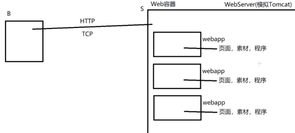


总体蓝图


---

### 1）webserver项目传入

- 选择创建Maven Project项目

  

- 勾选

  

- 填写信息

  

- 创建成功

  


### 2）WebServer主类的搭建（v1版本）

```java
package com.webserver.core;

import java.net.ServerSocket;
import java.net.Socket;

/**
 * 	WebServer主类
 * @author Grant·Vranes
 *
 */
public class WebServer {
	private ServerSocket server;
	
	/*
	 * 	构造方法，用于初始化服务端
	 */
	public WebServer(){
		try {
			System.out.println("正在启动服务端...");
			server = new ServerSocket(8088);
			System.out.println("服务端启动完毕");
		} catch (Exception e) {
			e.printStackTrace();
		}
	}
	
	/*
	 * 	服务端开始工作的方法
	 */
	public void start() {
		try {
			System.out.println("等待客户端连接...");
			Socket socket = server.accept();
			System.out.println("一个客户端连接了！");
			
			
		} catch (Exception e) {
			e.printStackTrace();
		}
	}
	
	public static void main(String[] args) {
		WebServer server = new WebServer();
		server.start();
	}
}
```

```java
package com.webserver.core;

import java.io.InputStream;
import java.net.Socket;

/**
 * 	客户端处理类
 * 	处理客户端请求
 * @author Grant·Vranes
 *
 */
public class ClientHandler implements Runnable{
	private Socket socket;
	
	public ClientHandler(Socket socket) {//有参构造
		this.socket = socket;
	}
	public void run() {
		/*
		 * 	当浏览器连接上我们服务器，就会给我们发送一个标准
		 * 	的http请求内容过来，那么下面就看看客户端浏览器发了什么
		 */
		try {
			InputStream in = socket.getInputStream();
			int d = -1;
			while((d=in.read())!=-1) {
				char c = (char)d;
				System.out.print(c);
			}
		} catch (Exception e) {
			e.printStackTrace();
		}
	}
}
```

运行结果：


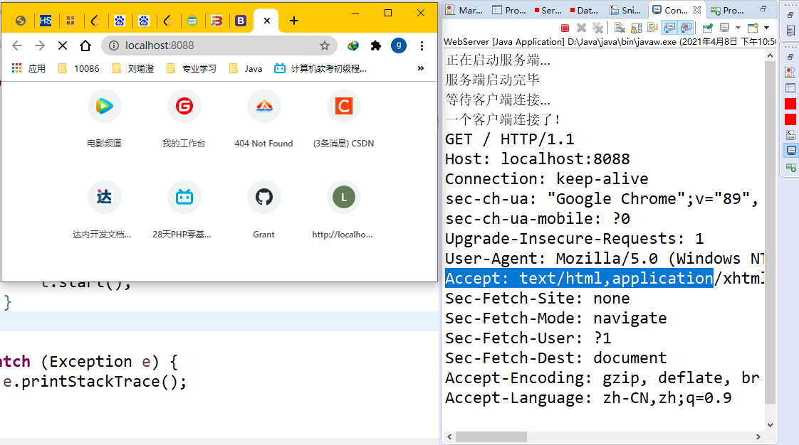


### 3）HTTP协议请求的介绍

TCP/IP的三次握手和四次挥手；https://blog.csdn.net/iteye_13411/article/details/82232222?utm_medium=distribute.pc_relevant.none-task-blog-baidujs_baidulandingword-0&spm=1001.2101.3001.4242

HTTP协议 -----------超文本传输协议
是浏览器与服务器之间通讯的应用层协议。而HTTP歇息要求底层
的传输层协议为可靠传输歇息，通常使用的就是TCP协议。

HTTP协议规定了客户端与服务端之间的通讯方式，以及数据格式等定义
其中，HTTP协议要求客户端与服务端发送的数据中的字符部分所允许的字符
集为：ISO8859-1，这是一个欧洲编码集，其中不支持中文。所以我们在
HTTP协议使用中客户端与服务端发送的数据都不会直接包含中文字符。

通讯方式的规则：
HTTP协议要求客户端与服务端的通讯为：一问一答的方式，即：
​	客户端发起请求（request），服务端处理请求后予以响应（response）
​	所以在HTTP协议中，服务端永远不会主动发送数据给客户端。
​	
HTTP1.0协议中，通讯为：
​	客户端发起TCP与服务端建立连接，然后发送一个请求，当服务端处理该请求并予以
​	响应后即刻断开TCP连接。（一问一答）
HTTP1.1协议则该改变为建立TCP连接后，可以进行多次请求与响应后再最终断开连接。
对于现在的网络应用中，构建一个复杂页面需要客户端经历多次请求才能得到，对此HTTP1.1
协议更高效并节约资源开销。（N问N答）

HTTP请求（request）
请求是客户端发送给服务端的内容。
如下就是一个标准的HTTP请求

```java
GET / HTTP/1.1
Host: localhost:8088
Connection: keep-alive
Cache-Control: max-age=0
sec-ch-ua: "Google Chrome";v="89", "Chromium";v="89", ";Not A Brand";v="99"
sec-ch-ua-mobile: ?0
Upgrade-Insecure-Requests: 1
User-Agent: Mozilla/5.0 (Windows NT 10.0; Win64; x64) AppleWebKit/537.36 (KHTML, like Gecko) Chrome/89.0.4389.114 Safari/537.36
Accept: text/html,application/xhtml+xml,application/xml;q=0.9,image/avif,image/webp,image/apng,*/*;q=0.8,application/signed-exchange;v=b3;q=0.9
Sec-Fetch-Site: none
Sec-Fetch-Mode: navigate
Sec-Fetch-User: ?1
Sec-Fetch-Dest: document
Accept-Encoding: gzip, deflate, br
Accept-Language: zh-CN,zh;q=0.9
```

一个请求由三部分组成：
请求行，消息头，消息正文

请求行：
​	请求行是一行字符串，HTTP协议规定一行字符串的介乎是以（CRLF）结尾
​	CR:回车符 ASC编码对应值：13 ----------光标回到最开始
​	LF:换行符 ASC编码对应值：10 ----------光标换到下一行

	请求行内容分为三部分：
	Method  Url     Protocol（CRLF）
	请求方式	资源路径	协议版本
	例如：
	GET /index.html HTTP/1.1(CRLF)

消息头：
​	消息头是由若干行组成，是客户端发送给服务端的一些附加信息。有的是用来告知
​	服务端当前客户端自身的信息（比如使用什么浏览器，我的操作系统是什么等），
​	有的是用来维持通讯的一些处理操作信息等等。

	每一个消息头由一行组成，格式：
	name:value（CRLF）
	
	注：消息头结束是以单独的CRLF表示，即：最后一个消息头发送完毕后，客户端
	会单独再发送一个CRLF表示消息头 部分结束
	例如：
	Host: localhost:8088(CRLF)
	Connection: keep-alive(CRLF)
	Cache-Control: max-age=0(CRLF)
	sec-ch-ua: "Google Chrome";v="89", "Chromium";v="89", ";Not A Brand";v="99"(CRLF)
	sec-ch-ua-mobile: ?0(CRLF)
	Upgrade-Insecure-Requests: 1(CRLF)
	User-Agent: Mozilla/5.0 (Windows NT 10.0; Win64; x64) AppleWebKit/537.36 (KHTML, like Gecko) Chrome/89.0.4389.114 Safari/537.36(CRLF)
	Accept: text/html,application/xhtml+xml,application/xml;q=0.9,image/avif,image/webp,image/apng,*/*;q=0.8,application/signed-exchange;v=b3;q=0.9(CRLF)
	Sec-Fetch-Site: none(CRLF)
	Sec-Fetch-Mode: navigate(CRLF)
	Sec-Fetch-User: ?1(CRLF)
	Sec-Fetch-Dest: document(CRLF)
	Accept-Encoding: gzip, deflate, br(CRLF)
	Accept-Language: zh-CN,zh;q=0.9(CRLF)(CRLF)

消息正文：
​	一个请求中可以不含由信息正文。消息正文是2进制数据，使用户提交给服务端的数据。
​	他可能是一个表单数据（用户在页面输入的注册信息等），也可能是附件等
​	


### 4）读取HTTP请求操作（v2版本）


这个版本只有ClientHandler进行了更改，此处只展示ClientHandler的代码，其新增需求是

> 实现一个方法：readLine
> 该方法可以读取一行字符串，因为一个请求中的请求行和消息头
> 都是一行一行的字符串（以CRLF结尾）
>
> 在ClientHandler中定义readLine方法，并测试其读取一行的功能

```java
package com.webserver.core;

import java.io.IOException;
import java.io.InputStream;
import java.net.Socket;

/**
 * 	客户端处理类
 * 	处理客户端请求
 * @author Grant·Vranes
 *
 */
public class ClientHandler implements Runnable{
	private Socket socket;
	
	public ClientHandler(Socket socket) {//有参构造
		this.socket = socket;
	}
	public void run() {
		/*
		 * 	当浏览器连接上我们服务器，就会给我们发送一个标准
		 * 	的http请求内容过来，那么下面就看看客户端浏览器发了什么
		 */
		try {
			InputStream in = socket.getInputStream();
			String line = readLine(in);
			System.out.println(line);
			
		} catch (Exception e) {
			e.printStackTrace();
		}
	}
	
	/**
	 * 	读取一行字符串，当连续读取CR，LF时停止并将之前的内容
	 * 	以一行字符串形式返回
	 */
	private String readLine(InputStream in) throws IOException {
		//创建一个StringBuilder对象准备做字符串拼接
		StringBuilder builder = new StringBuilder();
		//本次读取的字节
		int d = -1;
		//c1表示上次读取的字符，c2表示本次读取的字符
		char c1 = 'a', c2 = 'a';
		while((d=in.read())!=-1) {
			c2 = (char)d;
			/*
			 * 	CR:回车符 ASC编码对应值：13 ----------光标回到最开始
	         *	LF:换行符 ASC编码对应值：10 ----------光标换到下一行
			 */
			if(c1==13 && c2==10) {//此时读到CR，LF说明一行读到了末尾
				break;
			}
			builder.append(c2);
			c1 = c2;//把本次字符赋给上一次字符
		}
		//CR和LF都算是空格，最后trim()可以去除
		return builder.toString().trim();
	}
}

```


### 5）创建HttpRequest对象（v3版本）


> 解析请求
> 将客户端发送过来的请求以一个HttpRequest对象的形式保存，
> 以便于后期处理时可以方便的取到请求中各个信息。
>
> 实现：
> 1：新建一个包com.webserver.http
> 2：在该包中定义一个类:HttpRequest
> 3：在该类中定义请求中各部分信息对应的属性
> 4：定义构造方法用来初始化（解析）请求。


#### 查找表Map（2021.4.10）

**HashMap的底层就是Entry组成的数组**


```java
package Y2021M4D10_map;

import java.util.HashMap;
import java.util.Map;

/**
 * 	java.util.Map
 * 	Map 查找表，结构看起来像是一个多行两列的表格。
 * 	左列称为key，右列称为value
 * 	所以Map总是以key-value对的形式保存元素。
 * 	并且总是根据key去获取对应的value
 * 	对此我们经常将“查询条件”作为key，将要查询的数据
 * 	作为value进行保存。
 * 	
 * 	Map本身是一个接口，规定了Map操作的相关方法。
 * 	常用实现类：java.util.HashMap
 * 
 * 	HashMap又称为散列表，哈希表
 * 	使用散列算法实现的Map，当今世界上查询速度最快的数据结构
 * @author Grant·Vranes
 *
 */
public class MapDemo {
	public static void main(String[] args) {
		Map<String, Integer> map = new HashMap<String,Integer>();
		
		/*	1)存方法----------------------------------
		 *	V put(K k, V v)
		 *	将给定的一组键值对存入到Map中
		 *
		 *	Map有一个要求，即：key不允许重复，
		 *	是否重复是依靠key自身equals比较的结果。
		 *	如果使用map中已有的key保存value，则这个
		 *	操作为替换value操作，那么这时put方法会将
		 *	被替换的value返回。如果不是做替换操作则
		 *	返回值为null
		 */
		map.put("语文", 99);
		map.put("数学", 99);
		Integer d = map.put("英语", 99);
		/*
		 * 	如果value是个包装类，那么接收时应当避免直接使用基本类型。
		 * 	因为使用基本类型接收会导致自动拆箱，若没有做替换操作，返回的value就为
		 * 	null，这时对null拆箱就引发了空指针异常。
		 */
		System.out.println(d);//null
		System.out.println(map);//{数学=99, 语文=99, 英语=99}
		
		//替换操作的返回值为被替换的value
		d = map.put("语文",100);
		System.out.println(d);//99
		System.out.println(map);//{数学=99, 语文=100, 英语=99}
	
	
		/*	2)获取方法--------------------------
		 * 	V get(Object key)
		 * 	根据给定的key获取对应的value，若给定的key不存在，则返回值为null
		 */
		d = map.get("数学");
		System.out.println("数学："+ d);//数学：99
		
		/*	3)元素（键值对）个数-------------------
		 * 	int size()
		 * 	获取Map中的元素个数，每组键值对算一个元素
		 */
		int size = map.size();
		System.out.println("size:"+size);//size:3
		
		/*	4)删除操作---------------------------
		 * 	V remove(K k)
		 * 	将给定的key所对应的键值对删除，返回值为该key对应的value
		 */
		d = map.remove("语文");
		System.out.println(map);//{数学=99, 英语=99}
		System.out.println(d);//100
        
        //包含集合中的方法
	}
}
```

```java
package Y2021M4D10_map;

import java.util.Collection;
import java.util.HashMap;
import java.util.Map;
import java.util.Map.Entry;
import java.util.Set;

/**
 * 	Map的遍历
 * 	遍历Map有三种方式
 * 	1：遍历所有的key
 * 	2：遍历每一组键值对
 * 	3：遍历所有的value(相对不常用)
 * @author Grant·Vranes
 *
 */
public class MapDemo2 {
	public static void main(String[] args) {
		Map<String, Integer> map = new HashMap<String,Integer>();
		map.put("语文", 99);
		map.put("数学", 99);
		map.put("英语", 99);
		
		/*
		 * 	1)遍历所有的key---------------------------
		 * 	Set<K> keySet() 方法     key不允许重复，用Set接收
		 * 	将当前Map中所有的key以一个Set集合形式返回。
		 * 	遍历这个集合就等同于遍历了所有的key
		 */
		Set<String> keySet = map.keySet();
		for(String key : keySet) {
			System.out.println(key+":"+map.get(key));
		}
		
		/*
		 * 	2)遍历每一组键值对---------------------------
		 * 	Set<Entry> entrySet() 方法
		 *	将当前Map中每组键值对以一个Entry实例表示并存入Set集合将其返回
		 * 
		 * 	java.util.Map.Entry
		 * 	Entry的每一个实例用于表示当前Map中的一组键值对.Entry其实是Map中的一个内部类
		 * 	其中由两个常用的方法：
		 * 	getKey(), getValue()分贝是用于获取对应的key和value
		 */
		Set<Entry<String, Integer>> entrySet = map.entrySet();
		for(Entry<String, Integer> e : entrySet) {
			String key = e.getKey();
			Integer value = e.getValue();
			System.out.println(key+":"+value);
		}
        /*
        Set<Map.Entry<String, Integer>> entries = map.entrySet();
        for (Map.Entry<String, Integer> e : entries) {
            String key = e.getKey();
            Integer value = e.getValue();
            System.out.println(key + ":" + value);
        }
        */
		
		/*
		 * 	3)遍历所有的value---------------------------
		 * 	Collection<K> values() 方法
		 * 	value允许重复，用Collection接收
		 */
		Collection<Integer> values = map.values();
		for(Integer value : values) {
			System.out.println("value:" + value);
		}
        //values.forEach(System.out::println);
        
        /*
            4)Map也支持使用forEach方法遍历键值对---------------------------
         */
        map.forEach((k, v) -> System.out.println(k + ":" + v));
    
	}
}
```

```java
package Y2021M4D10_map;

import java.util.HashMap;
import java.util.Map;

/**
 * 	判断Map是否包含给定元素。
 * 	可以分别判断是否包含key和value
 * 	boolean containsKey(Object k)
 * 	boolean containsValue(Object v)
 * @author Grant·Vranes
 *
 */
public class MapDemo3 {
	public static void main(String[] args) {
		Map<String, Integer> map = new HashMap<String,Integer>();
		map.put("语文", 99);
		map.put("数学", 99);
		map.put("英语", 99);
		
		boolean ck = map.containsKey("语文");
		System.out.println("包含key："+ck);//true
		
		boolean cv = map.containsValue(99);
		System.out.println("包含value："+cv);//true
		
		/*
		 * 	注意：这两种方法判断包含的时候都是根据equals方法进行判断的
		 * 	如果再使用自定义类型元素的时候，一定要妥善重写equals
		 */
	}
}
```


#### 解析HTTP中的消息头（v4版本）


```java
package com.webserver.http;

import java.io.IOException;
import java.io.InputStream;
import java.net.Socket;
import java.util.HashMap;
import java.util.Map;

/**
 * 	请求对象
 * 	每个实例表示客户端发送过来的一个具体请求
 * @author Grant·Vranes
 *
 */
public class HttpRequest {
	/*
	 * 	请求行相关信息定义
	 */
	//请求方式
	private String method;
	//资源路径
	private String url;
	//协议版本
	private String protocol;
	
	/*
	 * 	消息头相关信息定义
	 */
	private Map<String, String> headers = new HashMap<String, String>();
		
	/*
	 * 	消息正文相关信息定义
	 */
	
	
	//客户端连接相关信息
	private Socket socket;
	private InputStream in;
	
	/**
	 * 	初始化请求
	 */
	public HttpRequest(Socket socket) {
		try {
			this.socket = socket;
			this.in = socket.getInputStream();
			/*
			 * 	解析请求
			 * 	1：解析请求行
			 * 	2：解析消息头
			 * 	3：解析消息正文
			 */
			parseRequestLine();
			parseHeaders();
			parseContent();
		} catch (Exception e) {
			e.printStackTrace();
		}
	}
	
	/**
	 * 	解析请求行
	 */
	private void parseRequestLine() {
		System.out.println("开始解析请求行...");
		try {
			String line = readLine();
			System.out.println("请求行" + line);
			/*
			 * 	将请求行进行拆分，将每部分内容对应的设置到属性上
			 * 	字符串的split方法就可以拆
			 * 
			 * 	以下代码在后期运行过程中可能会出现数组下标越界的情况。
			 * 	这是由于HTTP协议允许客户端发送一个空请求过来，而这时
			 * 	通过空格拆分后是得不到三项内容的。
			 */
			String[] data = line.split("\\s");//  \s表示空格
			method = data[0];
			url = data[1];
			protocol = data[2];
			System.out.println("method:"+method);
			System.out.println("url:"+url);
			System.out.println("protocol:"+protocol);
		} catch (IOException e) {
			e.printStackTrace();
		}
		System.out.println("请求行解析完毕！");
	}
	
	/**
	 * 	解析消息头
	 */
	private void parseHeaders() {
		System.out.println("开始解析消息头...");
		try {
			 /*
			  * 	解析消息头的流程：
			  * 	循环调用readLine()方法，读取每一个消息头
			  * 	当readLine方法返回值为空字符串时停止循环
			  * 	（因为返回空字符串说明连续读取到了CRLF CRLF，但是
			  * 	之前什么字符也没有读到，而这是作为消息头结束的标志）
			  * 	比如：
			  * 	Accept-Language: zh-CN,zh;q=0.9(CRLF)(CRLF)
			  * 
			  * 	在读取到每个消息头后，根据": "（冒号空格）进行拆分，
			  * 	并将消息头的名字作为key，消息头对应的值作为value
			  * 	保存到属性headers这个Map中完成解析工作
			  */
			while(true) {	
				String line = readLine();
				if("".equals(line)) {
					break;
				}
				String[] data = line.split(":\\s");
				headers.put(data[0], data[1]);
			}
			System.out.println("headers:" + headers);
		} catch (Exception e) {
			e.printStackTrace();
		}
		System.out.println("请求消息头解析完毕！");
	}
	
	/**
	 * 	解析消息正文
	 */
	private void parseContent() {
		System.out.println("开始解析消息正文...");
		
		System.out.println("请求消息正文解析完毕！");
	}
	
	/**
	 * 	读取一行字符串，当连续读取CR，LF时停止并将之前的内容
	 * 	以一行字符串形式返回
	 */
	private String readLine() throws IOException {
		//创建一个StringBuilder对象准备做字符串拼接
		StringBuilder builder = new StringBuilder();
		//本次读取的字节
		int d = -1;
		//c1表示上次读取的字符，c2表示本次读取的字符
		char c1 = 'a', c2 = 'a';
		while((d=in.read())!=-1) {
			c2 = (char)d;
			/*
			 * 	CR:回车符 ASC编码对应值：13 ----------光标回到最开始
	         *	LF:换行符 ASC编码对应值：10 ----------光标换到下一行
			 */
			if(c1==13 && c2==10) {//此时读到CR，LF说明一行读到了末尾
				break;
			}
			builder.append(c2);
			c1 = c2;//把本次字符赋给上一次字符
		}
		//CR和LF都算是空格，最后trim()可以去除
		return builder.toString().trim();
	}

	/*	设置get方法，可以让别的类获取信息；但不提供set方法，
	 * 	因为这些信息都来自客户端发送的请求，一般不修改
	 */
	public String getMethod() {
		return method;
	}

	public String getUrl() {
		return url;
	}

	public String getProtocol() {
		return protocol;
	}
	/**
	 * 	根据给定的消息头的名字获取对应消息头的值
	 * 	因为消息头相关信息headers是private的，所以外界想要获取可以给一个get方法
	 * @param name
	 * @return
	 */
	public String getHeader(String name) {
		return headers.get(name);
	}
}
```

```java
package com.webserver.core;

import java.io.IOException;
import java.io.InputStream;
import java.net.Socket;

import com.webserver.http.HttpRequest;

/**
 * 	客户端处理类
 * 	处理客户端请求
 * @author Grant·Vranes
 *
 */
public class ClientHandler implements Runnable{
	private Socket socket;
	
	public ClientHandler(Socket socket) {//有参构造
		this.socket = socket;
	}
	public void run() {
		/*
		 * 	当浏览器连接上我们服务器，就会给我们发送一个标准
		 * 	的http请求内容过来，那么下面就看看客户端浏览器发了什么
		 */
		try {
			/*
			 * 	主流程：
			 * 	1：解析请求
			 * 	2：处理请求
			 * 	3：发送响应
			 */
			//1:解析请求
			HttpRequest request = new HttpRequest(socket);	
		} catch (Exception e) {
			e.printStackTrace();
		}
	}	
}
```

```java
package com.webserver.core;

import java.net.ServerSocket;
import java.net.Socket;

/**
 * 	WebServer主类
 * @author Grant·Vranes
 *
 */
public class WebServer {
	private ServerSocket server;
	
	/*
	 * 	构造方法，用于初始化服务端
	 */
	public WebServer(){
		try {
			System.out.println("正在启动服务端...");
			server = new ServerSocket(8088);
			System.out.println("服务端启动完毕");
		} catch (Exception e) {
			e.printStackTrace();
		}
	}
	
	/*
	 * 	服务端开始工作的方法
	 */
	public void start() {
		try {
			//暂时只处理客户端的一次请求，看看效果，所以while注释掉
//			while(true) {
				System.out.println("等待客户端连接...");
				Socket socket = server.accept();
				System.out.println("一个客户端连接了！");
				//启动一个线程处理该客户端请求
				ClientHandler handler = new ClientHandler(socket);
				Thread t = new Thread(handler);
				t.start();
//			}
		} catch (Exception e) {
			e.printStackTrace();
		}
	}
	public static void main(String[] args) {
		WebServer server = new WebServer();
		server.start();
	}
}
```


### 6）散列表原理

307-3.7散列表原理（上）建议回听----面试可能经常会问到

https://www.jianshu.com/p/9579133fac92	不怕面试再问HashMap，一次彻底地梳理（原理+手写实现）

https://www.jianshu.com/p/4fc5a2f23f2b	面试官再问你 HashMap 底层原理，就把这篇文章甩给他看


```java
 * 	注意这个散列算法：她有两个决定值：key.hashcode()值和hashMap中数组的长度
 *    
 *  HashMap是查询速度最快的数据结构，内部使用数组实现，
 * 	它通过Key的hashcode值计算该元素在数组中的下标位置，
 * 	从而避免了遍历数组的操作，从而避免了遍历数组的操作，从
 * 	而查询不受元素多少影响。
 * 
 * 	但是有个问题，就是当两个键值对的key计算出来的hashcode值都相同的时候，
 *	假如计算出来的值都是5的时候，两者就冲突了，众所周知，数组中一个位置是不可以
 *  同时存储两个元素的；但是一组键值对往map中存放的时候是一个Entry，其除了有
 * 	，表示它的下一个元素是谁。也就是说，当我们发现两个key计算出来的hashcode值相同的
 *	时候，后计算的键值对会把next指向前一个已经存在着的键值对，也就说这是一个链表
 *    
 *  当获取这个key对应的value的时候，就会去比较这个链表中的key，所以就多了一个遍历操作
 *	这样就会降低散列表的查询性能    
```

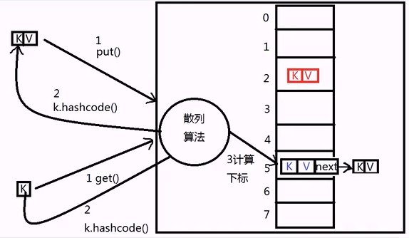

```java
 * 	由于Key的hashcode方法（决定其在HashMap内部数组的位置）
 * 	和equals方法（决定Key是否为重复）直接影响HashMap是否会出现
 * 	链表，对此这两个方法在Object类中有明确的重写说明。
 * 
 * 	当一个HashMap内部出现链表时，会降低其查询性能，应当尽量避免。
 * 	而出现链表的情况在于：当两个Key的hashcode值相同，而equals
 * 	比较不为true时就会形成。
 * 
 * API手册中在Object类里说明了这两个方法的重写规则：
 * 	1：成对重写
 * 		当我们需要重写一个类的equals方法时，就应当连同重写
 * 		hashcode方法
 * 	2：一致性
 * 		当两个对象的equals比较为true时，hashcode方法返回的数字
 * 		必须相等。反之则不是必须的，但是应当尽量保证当两个对象hashcode
 * 		值相同时equals方法比较为true，否则在HashMap中作为Key使用时会
 * 		出现链表！
 * 	3：稳定性
 * 		当一个对象参与equals比较的属性值没有发生过改变的前提下，多次调用
 * 		hashcode方法返回的数字应当相同。
```

> HashMap是查询速度最快的数据结构，内部使用数组实现，它通过Key的hashcode值计算该元素在数组中的下标位置，从而避免了遍历数组的操作，从而避免了遍历数组的操作，从而查询不受元素多少影响。
>
> 散列表的注意事项？
>
> 作为key这个元素，我们要妥善的重写hashcode()和equals()方法，因为我们要尽量避免在HashMap中出现链表，出现链表会降低散列表的查询性能。
>
> 这两个方法的重写规则？
>
> 1：成对重写
>
> ​	当我们需要重写一个类的equals方法时，就应当连同重写hashcode方法
>
> 2：一致性
>
> ​	当两个对象的equals比较为true时，hashcode方法返回的数字必须相等。反之则不是必须的，但是应当尽量保证当两个对象hashcode值相同时equals方法比较为true，否则在HashMap中作为Key使用时会出现链表！
>
> 3：稳定性
>
> ​	当一个对象参与equals比较的属性值没有发生过改变的前提下，多次调用hashcode方法返回的数字应当相同。

---


就算我们妥善的重写了hashcode和equals方法还不够，因为我们还要考虑另一个容积问题，根据散列算法的性质，当key.hashcode()相同，此时你hashMap中数组范围越大，它根据散列算法计算出的下标相同的的机率就越小。

但经过大量的测算，我们发现当加载因子为0.75的时候性价比最高，即我们实际往map中存入的元素应当只占我们map长度的3/4，此时出现链表的机率比较低，而且浪费也不多。

这里有另外一个问题：就是hashMap中数组的扩容，即你存入的实际元素个数达到或超过这个加载因子这个比值的时候，数组会自动扩容，你原先存储的键值对就会根据你key.hashcode()和数组新长度这两个参数重新根据散列算法算出你该存储的新位置，换个位置存储。这么一来，如果我数据量非常大的话，假设有75万条数据，数组一扩容，75万条数据都要重新根据散列表算法调整存储位置，这就非常可怕了。所以想提高散列表的使用性能的话，就要避免扩容。也就是实际存储元素永远不要占够数组长度的3/4。

散列表的数组长度默认为16，其在我们创建对象的时候可以指定


:warning:重申一下，两个点：

- [ ]  hashcode和equals方法妥善重写
- [ ] 确保这个加载因子，让这个hashMap总是有1/4的空闲率，这样能尽量保证在可选范围少出现链表的情况
- [ ] 如果想提高散列表的使用性能的话，就要避免扩容


最后再说一个有序的Map


> 就是可以让你put元素的顺序和你遍历元素的顺序一致
>
> ```java
> //没有使用LinkedHashMap
> Map<String, Integer> map = new HashMap<String,Integer>();
> map.put("语文", 99);
> map.put("数学", 99);
> map.put("英语", 99);
> //遍历
> Set<String> keySet = map.keySet();
> for(String key : keySet) {
> 	System.out.println(key+":"+map.get(key));
> }
> /*输出
> 数学:99
> 语文:99
> 英语:99
> */
> //使用LinkedHashMap
> Map<String, Integer> map = new HashMap<String,Integer>();
> map.put("语文", 99);
> map.put("数学", 99);
> map.put("英语", 99);
> //遍历
> Set<String> keySet = map.keySet();
> for(String key : keySet) {
> 	System.out.println(key+":"+map.get(key));
> }
> /*输出
> 语文:99
> 数学:99
> 英语:99
> */
> ```


7）处理请求（v4版本）

> 根据请求将客户端需要的资源响应回去
>
> 1、在项目中新建一个存放各个“网站资源”的总目录webapps
> ​	Toncat中也是这样做的，每个网站被称为一个webapps，
> ​	它包含该网站的资源（页面，图片等...）还包含处理业务的
> ​	java程序。而每个webapp都以一个子目录的形式保存在
> ​	webapps中呗Tomcat统一管理。
> 2、在webapps下建立一个子目录：myweb，作为我们测试使用的
> ​	web应用
> 3、在myweb目录中新建第一个页面：index.html
> 4、在ClientHandler中根据request获取客户端请求的资源路
> ​	径，然后对应的去webapps下找到该资源并做好分支判断。


启动WebServer，在浏览器输入对应地址的时候


控制台就会收到请求


```java
ClientHandler类中			
/*
			 * 	主流程：
			 * 	1：解析请求
			 * 	2：处理请求
			 * 	3：发送响应
			 */
			//1:解析请求
			HttpRequest request = new HttpRequest(socket);
			
			//2:处理请求
			//2.1：获取请求的资源路径
			String url = request.getUrl();
			//2.2:根据资源路径去webapps目录中寻找该资源
			File file = new File("webapps"+url);
			if(file.exists()) {
				System.out.println("找到该资源");
			}else {
				System.out.println("该资源不存在");
			}
```


#### Http响应

HTTP响应（Response）
响应是服务器发送给客户端的内容，HTTP协议对响应也有格式上的定义。

一个响应应当包含的内容有三部分：
​	状态行，响应头，响应正文

	1：状态行
	状态行也是一行字符串（以CRLF结尾），包含三部分信息：
	protocol   status_code   status_reason(CRLF)
	协议版本	  状态代码		  状态描述(CRLF)
	
	其中代码状态是一个由三位数组成，分为5类：
	1xx:保留
	2xx:成功，指服务端成功处理请求，如200：客户端处理并予以响应
	3xx:重定向，指服务端要求客户端再次发起请求到指定资源
	4xx:客户端错误，如404：客户端请求错误
	5xx:服务端错误，如500：服务端在处理请求时发生了错误
	
	例如一个响应行:HTTP/1.1 200 OK(CRLF)
	Status-Code    		= 	"200"   ; OK
	                      | "201"   ; Created
	                      | "202"   ; Accepted
	                      | "204"   ; No Content
	                      | "301"   ; Moved Permanently
	                      | "302"   ; Moved Temporarily
	                      | "304"   ; Not Modified
	                      | "400"   ; Bad Request
	                      | "401"   ; Unauthorized
	                      | "403"   ; Forbidden
	                      | "404"   ; Not Found
	                      | "500"   ; Internal Server Error
	                      | "501"   ; Not Implemented
	                      | "502"   ; Bad Gateway
	                      | "503"   ; Service Unavailable
	                      | extension-code
	----------------
	2:响应头
		响应头的格式与请求中的消息头一致，一行为一个响应头信息，并且在所有响应头发送
		完毕后要单独发送一个CRLF表示响应头部分结束。
		响应头是服务端发送给客户端的一些附加信息
	----------------
	3：相应正文
		相应正文也是二进制数据，是服务端发送给客户端的数据，通常是客户端实际请求的资源(页面，图片等)
		
		请求是否含有消息正文 和 响应是否包含响应正文的标志都是看头信息中是否包含两个头：
		Content-Type和Content-Length
		Content-Type是用来说明正文的数据类型	
		Content-Length是用来说明正文的数据长度共多少字节
		
		一个响应内容大致如下：
		HTTP/1.1 200 OK(CRLF)
		Content-Type：text/html(CRLF)
		Content-Length:245(CRLF)
		1101010100101010……
V4版本中只需要在ClientHandler中添加处理请求的部分

```java
package com.webserver.core;

import java.io.File;
import java.io.FileInputStream;
import java.io.IOException;
import java.io.InputStream;
import java.io.OutputStream;
import java.net.Socket;

import com.webserver.http.HttpRequest;

/**
 * 	客户端处理类
 * 	处理客户端请求
 * @author Grant·Vranes
 *
 */
public class ClientHandler implements Runnable{
	private Socket socket;
	
	public ClientHandler(Socket socket) {//有参构造
		this.socket = socket;
	}
	public void run() {
		/*
		 * 	当浏览器连接上我们服务器，就会给我们发送一个标准
		 * 	的http请求内容过来，那么下面就看看客户端浏览器发了什么
		 */
		try {
			/*
			 * 	主流程：
			 * 	1：解析请求
			 * 	2：处理请求
			 * 	3：发送响应
			 */
			//1:解析请求
			HttpRequest request = new HttpRequest(socket);
			
			//2:处理请求
			//2.1：获取请求的资源路径
			String url = request.getUrl();
			//2.2:根据资源路径去webapps目录中寻找该资源
			File file = new File("webapps"+url);
			if(file.exists()) {
				System.out.println("找到该资源");
				//响应客户端该资源
				OutputStream out = socket.getOutputStream();
				
				//发送状态行
				String line = "HTTP/1.1 200 OK";
				out.write(line.getBytes("ISO8859-1"));
				out.write(13);//written CR
				out.write(10);//written LF
				
				//发送响应头
				line = "Content-Type: text/html";
				out.write(line.getBytes("ISO8859-1"));
				out.write(13);//written CR
				out.write(10);//written LF
				
				line = "Content-Length:" + file.length();//文件的字节量
				out.write(line.getBytes("ISO8859-1"));
				out.write(13);//written CR
				out.write(10);//written LF
				//单独发送CRLF，表示响应头部分结束
				out.write(13);//written CR
				out.write(10);//written LF
				
				//发送响应正文
				FileInputStream fis = new FileInputStream(file);
				byte[] data = new byte[1024*10];
				int len = -1;
				while((len = fis.read(data))!=-1) {
					out.write(data, 0, len);
				}
				
			}else {
				System.out.println("该资源不存在");
			}
		} catch (Exception e) {
			e.printStackTrace();
		} finally {
			//与客户端断开链接
			try {
				socket.close();
			} catch(IOException e) {
				e.printStackTrace();
			}
		}
	}	
}
```


### 7）抽象HttpResponse（V5版本）


```java
重构项目
将ClientHandler中响应客户端的操作进行重构

设计一个类：HttpResponse，用它的每一个实例表示服务端发送给
客户端的一个具体响应内容。

1、在http包中添加类：HttpResponse

2、在HttpResponse类中定义方法：flush，用来将当前响应
	发送给客户端
	flush方法需要做三件事：
	1：发送状态行
	2：发送响应头
	3：发送响应正文
	
3、将ClientHandler中响应客户端的操作
	移动到HttpResponse对应方法中
	
4、在ClientHandler中实例化HttpResponse，并设置要
	响应的内容后调用flush方法响应客户端
```

```java
HttpResponse类
package com.webserver.http;

import java.io.File;
import java.io.FileInputStream;
import java.io.OutputStream;
import java.net.Socket;

/**
 * 	响应对象
 * 	该类中的每一个实例用于表示一个具体要给客户端响应的内容
 * 	一个响应包含：
 * 	状态行，响应头，响应正文
 * @author Grant·Vranes
 *
 */
public class HttpResponse {
	/*
	 * 	状态行相关信息定义
	 */
	
	/*
	 * 	响应头相关信息定义
	 */
	
	/*
	 * 	响应正文相关信息定义
	 */
	//响应的实体文件
	private File entity;
	
	//连接相关信息定义
	private Socket socket;
	private OutputStream out;
	public HttpResponse(Socket socket) {
		try {
			this.socket = socket;
			this.out = socket.getOutputStream();
		} catch (Exception e) {
			e.printStackTrace();
		}
	}
	
	/**
	 * 	将当前响应内容发送给客户端
	 */
	public void flush() {
		/*
		 * 	响应客户端
		 * 	1：发送状态行
		 *	2：发送响应头
		 *	3：发送响应正文
		 */
		try {
			sendStatusLine();
			sendHeaders();
			sendContent();
		} catch (Exception e) {
			e.printStackTrace();
		}
	}
	
	/*
	 * 	发送状态行
	 */
	private void sendStatusLine() {
		try {
			String line = "HTTP/1.1 200 OK";
			out.write(line.getBytes("ISO8859-1"));
			out.write(13);//written CR
			out.write(10);//written LF
		} catch (Exception e) {
			e.printStackTrace();
		}
	}
	
	/*
	 * 	发送响应头
	 */
	private void sendHeaders() {
		try {
			String line = "Content-Type: text/html";
			out.write(line.getBytes("ISO8859-1"));
			out.write(13);//written CR
			out.write(10);//written LF
			
			line = "Content-Length:" + entity.length();//文件的字节量
			out.write(line.getBytes("ISO8859-1"));
			out.write(13);//written CR
			out.write(10);//written LF
			//单独发送CRLF，表示响应头部分结束
			out.write(13);//written CR
			out.write(10);//written LF
		} catch (Exception e) {
			e.printStackTrace();
		}
	}
	
	/*
	 * 	发送响应正文
	 */
	private void sendContent() {
		try (//用完就关闭的流放在这里
				FileInputStream fis = new FileInputStream(entity);	
				){
			byte[] data = new byte[1024*10];
			int len = -1;
			while((len = fis.read(data))!=-1) {
				out.write(data, 0, len);
			}
		} catch (Exception e) {
			e.printStackTrace();
		}
	}

	public File getEntity() {
		return entity;
	}

	public void setEntity(File entity) {
		this.entity = entity;
	}	
}
```

```java
对应的ClientHandler中做出修改，只需要调用HttpResponse中的方法
package com.webserver.core;

import java.io.File;
import java.io.FileInputStream;
import java.io.IOException;
import java.io.InputStream;
import java.io.OutputStream;
import java.net.Socket;

import com.webserver.http.HttpRequest;
import com.webserver.http.HttpResponse;

/**
 * 	客户端处理类
 * 	处理客户端请求
 * @author Grant·Vranes
 *
 */
public class ClientHandler implements Runnable{
	private Socket socket;
	
	public ClientHandler(Socket socket) {//有参构造
		this.socket = socket;
	}
	public void run() {
		/*
		 * 	当浏览器连接上我们服务器，就会给我们发送一个标准
		 * 	的http请求内容过来，那么下面就看看客户端浏览器发了什么
		 */
		try {
			/*
			 * 	主流程：
			 * 	1：解析请求
			 * 	2：处理请求
			 * 	3：发送响应
			 */
			//1:准备工作
			//1.1解析请求，创建请求对象
			HttpRequest request = new HttpRequest(socket);
			//1.2创建响应对象
			HttpResponse response = new HttpResponse(socket);
			
			//2:处理请求
			//2.1：获取请求的资源路径
			String url = request.getUrl();
			//2.2:根据资源路径去webapps目录中寻找该资源
			File file = new File("webapps"+url);
			if(file.exists()) {
				System.out.println("找到该资源");
				//向响应对象中设置要响应的资源内容
				response.setEntity(file);
			}else {
				System.out.println("资源不存在");
			}
			//响应客户端
			response.flush();
			
		} catch (Exception e) {
			e.printStackTrace();
		} finally {
			//与客户端断开链接
			try {
				socket.close();
			} catch(IOException e) {
				e.printStackTrace();
			}
		}
	}
}
```

​                                                                                                                                                                                                                                                                                                                                                                                                                                                                                                                                                                                                                                                                                                                                                                                                                                                                                                                                                                                                                                                                                                                                                                                                                                                                                                                                                                                                                                                                                                                                                                                                                                                                                                                                                        

### 8）响应状态代码（v6版本)


```java
添加响应404页面的操作
当客户端请求的资源不存在时，应当响应给客户端404页面。
并且状态代码与描述也要对应。

1、在HttpResponse中定义属性：
	int statusCode	表示状态代码
	String statusReason表示状态描述
	他们的默认值分别为200，‘OK’。这样做的好处在于
	正常响应时可以不设置这两个值。
	
2、修改 sendStatusLine方法，将发送状态行的代码改为
	发送对应属性statusCode，statusReason。
	
3、在http包中新建一个类：HttpContext
	使用这个类来定义相关Http协议中的内容。
	
	定义一个静态属性：status_code_reason_mapping
	它是一个Map类型的，其中key存放状态代码，value存放
	对应的状态描述。这样百年与我们将来根据状态代码直接获取到
	对应的描述信息。
	
4、在HttpResponse的设置状态代码的方法中添加根据状态代码
	去HttpContext获取对应的状态描述并设置到状态描述属性上。
	这样的好处在于，将来外面对response设置状态代码时就无需
	再单独设置状态描述了。

5、再webapps目录下新建一个目录root，在里面创建页面：404.html。
	这个页面是一个公共页面，无论请求我们哪个应用中的资源，只要不
	存在都会响应这个页面。
	
6、在ClientHandler处理请求的分支中，如果资源没有找到，则设置
	response的状态代码为404，并且将webapps/root/404.html
	页面设置好，这样就会将该页面响应给客户端了。
```

```java
HttpResponse类
package com.webserver.http;

import java.io.File;
import java.io.FileInputStream;
import java.io.OutputStream;
import java.net.Socket;

/**
 * 	响应对象
 * 	该类中的每一个实例用于表示一个具体要给客户端响应的内容
 * 	一个响应包含：
 * 	状态行，响应头，响应正文
 * @author Grant·Vranes
 *
 */
public class HttpResponse {
	/*
	 * 	状态行相关信息定义
	 */
	//状态代码
	private int statusCode = 200;
	//状态描述
	private String statusReason = "OK";
	/*
	 * 	响应头相关信息定义
	 */
	
	/*
	 * 	响应正文相关信息定义
	 */
	//响应的实体文件
	private File entity;
	
	//连接相关信息定义
	private Socket socket;
	private OutputStream out;
	public HttpResponse(Socket socket) {
		try {
			this.socket = socket;
			this.out = socket.getOutputStream();
		} catch (Exception e) {
			e.printStackTrace();
		}
	}
	
	/**
	 * 	将当前响应内容发送给客户端
	 */
	public void flush() {
		/*
		 * 	响应客户端
		 * 	1：发送状态行
		 *	2：发送响应头
		 *	3：发送响应正文
		 */
		try {
			sendStatusLine();
			sendHeaders();
			sendContent();
		} catch (Exception e) {
			e.printStackTrace();
		}
	}
	
	/*
	 * 	发送状态行
	 */
	private void sendStatusLine() {
		try {
			String line = "HTTP/1.1 " + statusCode + " " + statusReason;
			out.write(line.getBytes("ISO8859-1"));
			out.write(13);//written CR
			out.write(10);//written LF
		} catch (Exception e) {
			e.printStackTrace();
		}
	}
	
	/*
	 * 	发送响应头
	 */
	private void sendHeaders() {
		try {
			String line = "Content-Type: text/html";
			out.write(line.getBytes("ISO8859-1"));
			out.write(13);//written CR
			out.write(10);//written LF
			
			line = "Content-Length:" + entity.length();//文件的字节量
			out.write(line.getBytes("ISO8859-1"));
			out.write(13);//written CR
			out.write(10);//written LF
			//单独发送CRLF，表示响应头部分结束
			out.write(13);//written CR
			out.write(10);//written LF
		} catch (Exception e) {
			e.printStackTrace();
		}
	}
	
	/*
	 * 	发送响应正文
	 */
	private void sendContent() {
		try (//用完就关闭的流放在这里
				FileInputStream fis = new FileInputStream(entity);	
				){
			byte[] data = new byte[1024*10];
			int len = -1;
			while((len = fis.read(data))!=-1) {
				out.write(data, 0, len);
			}
		} catch (Exception e) {
			e.printStackTrace();
		}
	}

	//以下是一些get和set方法
	public File getEntity() {
		return entity;
	}

	public void setEntity(File entity) {
		this.entity = entity;
	}

	public int getStatusCode() {
		return statusCode;
	}

	/**
	 * 	 设置状态代码，设置后会自动将对应的描述设置好
	 * @param statusCode
	 */
	public void setStatusCode(int statusCode) {
		this.statusCode = statusCode;
		this.statusReason = HttpContext.getStatusReason(statusCode);
	}

	public String getStatusReason() {
		return statusReason;
	}

	public void setStatusReason(String statusReason) {
		this.statusReason = statusReason;
	}	
}
```

```java
ClientHandler类
package com.webserver.core;

import java.io.File;
import java.io.FileInputStream;
import java.io.IOException;
import java.io.InputStream;
import java.io.OutputStream;
import java.net.Socket;

import com.webserver.http.HttpRequest;
import com.webserver.http.HttpResponse;

/**
 * 	客户端处理类
 * 	处理客户端请求
 * @author Grant·Vranes
 *
 */
public class ClientHandler implements Runnable{
	private Socket socket;
	 
	public ClientHandler(Socket socket) {//有参构造
		this.socket = socket;
	}
	public void run() {
		/*
		 * 	当浏览器连接上我们服务器，就会给我们发送一个标准
		 * 	的http请求内容过来，那么下面就看看客户端浏览器发了什么
		 */
		try {
			/*
			 * 	主流程：
			 * 	1：解析请求
			 * 	2：处理请求
			 * 	3：发送响应
			 */
			//1:准备工作
			//1.1解析请求，创建请求对象
			HttpRequest request = new HttpRequest(socket);
			//1.2创建响应对象
			HttpResponse response = new HttpResponse(socket);
			
			//2:处理请求
			//2.1：获取请求的资源路径
			String url = request.getUrl();
			//2.2:根据资源路径去webapps目录中寻找该资源
			File file = new File("webapps"+url);
			if(file.exists()) {
				System.out.println("找到该资源");
				//向响应对象中设置要响应的资源内容
				response.setEntity(file);
			}else {
				//设置状态代码404
				response.setStatusCode(404);
				//设置404页面
				response.setEntity(new File("webapps/root/404.html"));
				System.out.println("资源不存在");
			}
			//响应客户端
			response.flush();
			
		} catch (Exception e) {
			e.printStackTrace();
		} finally {
			//与客户端断开链接
			try {
				socket.close();
			} catch(IOException e) {
				e.printStackTrace();
			}
		}
	}
}
```


### 9）解决空请求问题（V7版本）


```java
处理空请求
	HTTP协议允许客户端发送空请求。就是客户端与服务端连接后，
	实际没有发送任何内容，但是我们现在的处理是要解析请求，这
	会导致HttpRequest解析异常。对此，当我们解析请求时发现
	一个空请求时，我们将异常最终抛给ClientHandler，并且
	ClientHandler在接收到这个异常后就不再做后续任何处理，
	直接与服务端断开连接即可。
	
	1、在core包中添加一个自定义异常：
		EmptyRequestException 空请求异常
		
	2、在HttpRequest解析请求行若是发现是空请求时则实例化
		空请求异常并将其抛出给构造方法，再经构造方法继续抛出
		给ClientHandler。
	
	3、ClientHandler的run方法中添加一个空请求的捕获操作，
		以达到当实例化HttpRequst出现空请求后跳过其他所有
		处理操作的目的。
```

```java
//自定义的异常
package com.webserver.core;
/**
 * 	空请求异常
 * @author Grant·Vranes
 *
 */
public class EmptyRequestException extends Exception{
	private static final long serialVersionUID = 1L;

	//鼠标右键选择source，选择倒数第二个Generate Constructors from SuperClass
	public EmptyRequestException() {
		super();
		// TODO Auto-generated constructor stub
	}

	public EmptyRequestException(String message, Throwable cause, boolean enableSuppression,
			boolean writableStackTrace) {
		super(message, cause, enableSuppression, writableStackTrace);
		// TODO Auto-generated constructor stub
	}

	public EmptyRequestException(String message, Throwable cause) {
		super(message, cause);
		// TODO Auto-generated constructor stub
	}

	public EmptyRequestException(String message) {
		super(message);
		// TODO Auto-generated constructor stub
	}

	public EmptyRequestException(Throwable cause) {
		super(cause);
		// TODO Auto-generated constructor stub
	}	
}
```


当在解析请求行的时候遇到了空请求的异常就将异常抛回给HttpRequest，然后又抛给ClientHandler，最后ClientHandler处理该异常


### 10）重构响应头（V8版本）


> 修改响应头，使得响应中的响应头变为可以进行设置的。
> 这样才能根据实际情况响应不同的内容。
>
> 1、在HttpResponse中定义一个属性：Map headers
> ​	其中key保存响应头的名字，value保存对应的值
> ​	
> 2、对外提供get、set方法
>
> 3、修改sendHeaders方法，将原有的代码改变为根据
> ​	headers中实际保存的响应头来进行发送。
> ​	
> 4、由于一个响应中包含响应正文时一定会在响应头中包含
> ​	Content-Type与Content-Length。对此我们
> ​	直接在HttpResponse的setEntity方法中添加
> ​	代码：根据给定的文件自动设置这两个头。这样免去了
> ​	外界在设置响应正文后还要额外添加这两个头的麻烦。
> ​	
> 5、由于不同的文件对应的Content-Type值都是不同的，并且
> ​	W3C中都有规定，对此我们可以在HttpContext中再定义
> ​	一个Map。其中key保存文件的后缀名，而value保存其介
> ​	质类型。这样将来我们可以根据文件的后缀来获取到对应的值
> ​	设置到响应头中。

详情请看V8版本


### 11）阶段性重构（V9版本）

> 重构代码
>
> 1、HttpResponse中发送状态行与响应头都使用了相同的代码，
> ​	应当复用。对此 我们在HttpResponse中定义一个方法：
> ​	println来复用这个功能。
> ​	
> 2、在HttpContext中将CR，LF定义为常量，这样在HttpRequest
> ​	和HttpResponse中都去引用。

详细可参考V9版本


### 12）XML

##### 初识XML


> **什么是XML**
>
> - 可扩展标记语言
> - 基于标记的通用可扩展文件格式
> - 利用XML可以统一数据文件格式，可以方便文件的交换，文件的读写。
> - XML还有相关的API，方便编程使用。
>
> 
>
> **标签、标记（tag）**
>
> - 开始符号`<`	结束符号`>`	中间的内容叫标签名
>   - 如：`<demo>`此时标签名为demo
>   - 标签名可以任意定义
> - 开始标签`<demo>`  结束标签`</demo>`
> - 开始和结束标签必须配对使用
> - 可以嵌套，但是不能交叉嵌套
> - XML文件只能有一个唯一的根标签
>   
>
> 
>
> **XML声明**
>
> `<?xml version="1.0" encoding="UTF-8" ?>`
>
> - 可以不写，但是推荐使用
> - 如果要写，必须在第一行
> - version="1.0"是XML的版本，目前没有任何新版本，一直是1.0
> - encoding="UTF-8"设置后续XML文件的编码，建议使用"UTF-8"
>
> 
>
> **内容（content）**
>
> - 开始标签和结束标签中的部分称为内容
> - 内容可以是：文本、子标签、文本和子标签
>
> 
>
> **元素（Element）**
>
> - 开始标签+内容+结束标签=元素
> - 标签也是元素的名
>
> 
>
> **属性（Attribute）**
>
> - 在开始标签上定义
> - 格式：属性名=属性值，等号前后不能写空格
>   `<book id="book1" language="EN">`
> - 属性名不能重复，属性名没有顺序，属性之间必须有空格
> - 属性值必须有引导
>
> 
>
> **实体（Entity）**
>
> - 特殊字符的转译写法
> - 如：
>   - `<`替换为`&lt;`
>   - `>`替换为`&gt;`
>   - `&`替换为`&amp;`
>   - ……
>
> 
>
> **CDATA**
>
> - 未解析文本字符，用于处理大量的特殊字符问题
>
> - 语法：
>
>   - ```xml
>     <name>
>     	<![CDATA[
>     	内容
>     	]]>
>     </name>
>     ```
>
> 
>
> **注释（Comment）**
>
> - `<!-- 注释 -->`
> - 多行注释，且不能嵌套注释
>
> 
>
> **关于“可以扩展”**
>
> - 标记名称可以任意扩展
> - 元素的嵌套关系可以任意扩展
> - 元素的属性可以任意扩展


##### 基础语法


或者简写<Letter/>


---


以上就表示1<3>2

---


这点就不需要实体引用


##### 什么是DOM4J

是第三方提供的XML读写API https://dom4j.github.io/

使用Dom4J读写XML相对于使用IO流读写XML要更加方便：


##### XML DOM

- DOM 文档对象模型：是指将XML文件解析到内存中的数据对象
- XML API 读取XML 文件，并且将XML文件，按照XML的语法解析为Dom对象，Dom对象中包含XML的全部信息。
- Dom对象结构是树形结构，也称为Dom树

Dom对象结构：


##### XML解析方式

```java
emplist.xml
<?xml version="1.0" encoding="UTF-8"?>
<list><!-- 这些标签名可以自己命名，不是固定的 -->
	<emp id = "1">
		<name>张三</name>
		<age>22</age>
		<gender>男</gender>
		<salary>5000</salary>
	</emp>
	<emp id = "2">
		<name>李四</name>
		<age>21</age>
		<gender>男</gender>
		<salary>5000</salary>
	</emp>
	<emp id = "3">
		<name>王五</name>
		<age>23</age>
		<gender>男</gender>
		<salary>5000</salary>
	</emp>
</list>
```


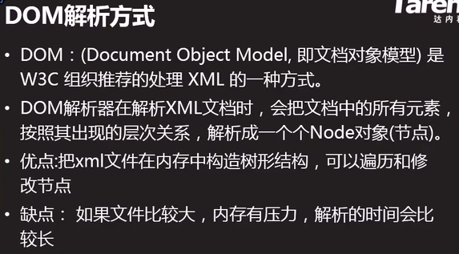

---


注意：这个dom4j一定要读成dom for j，因为dom4j是指dom for java，4是音译，代之for

如何导入dom4j-full.jar包?我们创建Maven项目就是因为Maven项目有一个中央文件库，里面存放着所有的jar文件，解决了依赖关系。

> 推荐阅读：http://doc.canglaoshi.org/doc/maven.html在Ecplise中配置使用Maven

**导入dom4j-full.jar包?**（方法1）


注意：如果用的是阿里云的镜像，这个功能是不能支持的；因为阿里云镜像不支持在本地查找索引，只能去官网下载。

**导入dom4j-full.jar包?**（方法2）

- 在https://mvnrepository.com/ 中查找对应的jar包，选取对应版本，就可以看到该jar包对应的xml坐标

  

- 在pom.xml文件中写入如下代码，这些代码的作用就是为了导入dom4j的jar包

  ```java
  <dependencies>
    	<dependency>
    		<groupId>dom4j</groupId>
   		<artifactId>dom4j</artifactId>
   		<version>1.6.1</version>
    	</dependency>
    </dependencies>
  ```

- 

- 保存一下，路径上就会出现这个Maven库

  


##### DOM4J解析XML文件操作


```java
package xml;

/**
 * 	使用DOM4J解析XML文件
 * @author Grant·Vranes
 *
 */
public class ParseXmlDemo {
	public static void main(String[] args) {
		/*
		 * 	将emplist.xml文件中的所有员工信息读取出来，存入list集合
		 */
		List<Emp> list = new ArrayList<Emp>();
		/*
		 * 	使用dom4j解析XML的大致步骤：
		 * 	1：创建SAXReader（为什么用SAX，他不是用SAX解析，而是用SAX读）
		 * 	2：使用SAXReader读取xml文档并生成Document对象。
		 * 		这一步也是dom解析耗时耗资源的地方，因为要先将
		 * 		文档所有数据读取完毕，并且以一个Document对象
		 * 		形式保存在内存中
		 * 	3：通过Document对象获取根元素
		 * 	4：按照XML文档结构从根元素开始逐级获取子元素已达到遍历
		 * 	  XML文档数据的目的
		 */
		try {
			//1：创建一个SAXReader对象用来读
			SAXReader reader = new SAXReader();
			//2：无论是读文件还是文件输入流都是可以的
//			Document doc = reader.read(new File("emplist.xml"));
			Document doc = reader.read(
				new FileInputStream("emplist.xml")
			);
			/*
			 * 3
			 * Document提供了获取根元素的方法：
			 * Element getRootElement()
			 * 
			 * 	而Element的每个实例用于表示当前xml文档中的一个元素
			 * 	（一对标签）
			 * 	它提供了获取其表示的元素的相关信息的方法：
			 * 	String getName()
			 * 	获取当前标签的名字
			 * 
			 * 	String getText()
			 * 	获取当前标签中间的文本
			 *	
			 *	String getTextTrim()
			 *	获取元素文本信息，同时去除前后空白，更具有实用价值
			 *
			 *	String asXML()
			 *	指的是这个节点(元素)的开始到结束包含的内容组成的String字符串
			 * 
			 * 	Element element(String name)
			 * 	获取当前标签下指定名字name的子标签
			 *
			 *	String elementTextTrim(String name)
			 *	直接获取当前标签中子标签name中的文本 
			 *
			 * 	List elements()
			 * 	获取当前标签下所有子标签
			 * 
			 * 	List elements(String name)
			 * 	获取当前标签下指定名字的所有name同名子标签（常用）
			 * 	
			 * 	Attribute attribute(String name)
			 * 	获取当前标签下指定名字的属性
			 * 	Attribute的每个实例表示一个属性
			 * 	它有两个常用方法：
			 * 	String getName()获取属性名
			 * 	String getValue()获取属性值
			 */
			Element root = doc.getRootElement();
			
			/*
			 * 	获取根标签<list>下的所有员工标签<emp>
			 */
			List<Element> empList = root.elements("emp");

			/*
			 * 	遍历获取每个员工信息
			 */
			for (Element empEle : empList) {
				//获取名字
				//1获取<name>标签
				Element nameEle = empEle.element("name");
				//2获取<name>标签中间的文本
				String name = nameEle.getText();
				
				//获取年龄
				Element ageEle = empEle.element("age");
				int age = Integer.parseInt(
					ageEle.getText()
				);
				
				//获取性别
//				String gender = empEle.element("gender").getText();
				String gender = empEle.elementText("gender");
				
				//获取工资
				int salary = Integer.parseInt(
					empEle.elementText("salary")
				);
				
				//获取id
				//1获取id属性
//				Attribute attr = empEle.attribute("id");
//				//2获取对应的属性值
//				int id = Integer.parseInt(attr.getValue());
				
//				int id = Integer.parseInt(
//					empEle.attribute("id").getValue()
//				);
				
				int id = Integer.parseInt(
					empEle.attributeValue("id")
				);
				
				Emp emp = new Emp(id, name, age, gender, salary);
				System.out.println(emp);
				list.add(emp);//解析出来的数据都放到了这个集合里
			}
			System.out.println("解析完毕");
		} catch(Exception e) {
			e.printStackTrace();
		}	
	}
}
```

```java
//如果上面没看好，再看下面这个案例
public class Dom4JDemo {
    public static void main(String[] args)
        throws Exception{
        /*
         * 利用Dom4J读取xml文件
         * SAXReader 提供了读取XML的API方法
         * read(文件) 读取结果是一个Document对象
         * 简称 doc 对象，doc对象内部封装了全部
         * 解析以后的XML数据
         */
        File file = new File("demo.xml");
        SAXReader reader = new SAXReader();
        Document doc = reader.read(file);
        //doc.asXML() 输出读取的结果
        //System.out.println(doc.asXML());
        /*
         * 读取根元素的方法
         *   doc.getRootElement()
         * 返回唯一的根元素
         * Root 根
         * Element 元素
         */
        Element root = doc.getRootElement();
        //System.out.println(root.asXML());

        /*
         * 获取指定名字的第一个子元素
         *  books -> demo
         *  root.element("demo");
         */
        Element demo = root.element("demo");
        System.out.println(demo.asXML());
        /*
         * 获取元素中的文本信息: 将元素包裹的全部文字读取
         * 到一个字符串中，元素中包含文字，就返回字符串
         * 如果元素没有文字，就返回空字符串
         */
        String text = demo.getText();
        System.out.println(text);
        /*
         * 获取元素文本信息，同时去除前后的空白, 更具实用价值
         */
        text = demo.getTextTrim();
        System.out.println(text);
        /*
         * 获取一个元素的一组子元素
         *   e.elements() 获取全部子元素，如果没有子元素返回空集合
         *   e.elements(元素名称) 获取全部自定名称的子元素
         */
        List<Element> list = root.elements();
        List<Element> list1 = root.elements("book");
        list.forEach(e->System.out.println(e.asXML()));
        list1.forEach(e->System.out.println(e.asXML()));

        /*
         * 案例：输出全部书的书名
         */
        list1.forEach(e -> System.out.println(e.element("name").getTextTrim()));

        /*
         * Dom4j 提供了直接获取子元素中文本的方法
         *  e.elementTextTrim(元素名)
         * 等价于
         *  e.element(元素名).getTextTrim()
         */
        list1.forEach(e -> System.out.println(e.elementTextTrim("name")));

        /*
         * 元素上包含读取元素属性的方法
         *  e.attributeValue()
         * attribute: 属性
         * value 值，价值
         *
         * 输出所有书的ID属性
         */
        list1.forEach(e -> System.out.println(e.attributeValue("id")));
    }
}
```


##### 使用DOM4J生成一个XML文档

```java
package xml;

import java.io.FileOutputStream;
import java.util.ArrayList;
import java.util.List;

import org.dom4j.Document;
import org.dom4j.DocumentHelper;
import org.dom4j.Element;
import org.dom4j.io.OutputFormat;
import org.dom4j.io.XMLWriter;

/**
 * 	使用DOM4J生成一个xml文档
 * @author Grant·Vranes
 *
 */
public class WriteXmlDemo {
	public static void main(String[] args) {
		List<Emp> list = new ArrayList<Emp>();
		list.add(new Emp(1,"张三",20,"男",5000));
		list.add(new Emp(2,"李四",22,"男",9000));
		list.add(new Emp(3,"王五",21,"男",6000));
		list.add(new Emp(4,"赵六",22,"男",8000));
		list.add(new Emp(5,"钱七",22,"男",7000));
		
		/*
		 * 	生成XML的大致步骤：
		 * 	1：创建一个Document对象，表示一个空白文档
		 * 	2：向Document中添加根元素
		 * 	3：按照XML文档结构从根标签开始逐级添加子标签及对应数据
		 * 	4：创建XmlWriter
		 * 	5：使用XmlWriter写出Document以生成文档
		 */
		try {
			//1
			Document doc = DocumentHelper.createDocument();
			/*
			 * 2
			 * 	Document提供了添加根元素的方法:
			 * 	Element addElement(String name)
			 * 	添加后会将根标签以一个Element实例形式返回，以便于
			 * 	我们对其继续操作。注意：这个方法只能被调用一次。
			 */
			Element root = doc.addElement("list");
			
			/*
			 * 3
			 * 	Element也提供了添加相关信息的方法：
			 * 	Element addElement(String name)
			 * 	像当前标签中添加给定名字的子标签，它同样也会
			 * 	将子标签标签以一个Element实例形式返回
			 * 
			 * 	Element addText(String text)
			 * 	向当前标签中间添加指定文本。返回值还是标签（这样
			 * 	返回的好处是可以连续操作当前标签）
			 * 
			 * 	Element addAttribute(arg0, arg1)
			 * 	向当前标签中添加属性，arg0属性，arg1属性值
			 */
			for (Emp emp : list) {
				//向根标签中添加员工<emp>子标签
				Element empEle = root.addElement("emp");
				//给<emp>标签添加属性id
				empEle.addAttribute("id", emp.getId()+"");
				
				//添加姓名
				//往子标签中添加姓名<name>子标签（套娃）
				Element nameEle = empEle.addElement("name");
				//向标签中添加文本<name>Text</name>
				nameEle.addText(emp.getName());
				
				//添加年龄
				empEle.addElement("age").addText(emp.getAge()+"");
				
				//添加性别
				empEle.addElement("gender").addText(emp.getGender());
				
				//添加薪资
				empEle.addElement("salary").addText(emp.getSalary()+"");
			}
			/*
			 * 	XMLWriter符合java高级流用法。她负责将Document对象以XML文档格式进行写出，
			 * 	并通过其连接的文件流写入到文件中。
			 */
			XMLWriter writer = new XMLWriter(
				new FileOutputStream("myEmp.xml")
				//,OutputFormat.createPrettyPrint()
			);
			writer.write(doc);
			System.out.println("写出完毕");
			writer.close();
		} catch (Exception e) {
			e.printStackTrace();
		}
	}
}
```

运行后结果：


这里我们可以看到结果xml文档所有数据都成了一行，这是为了计算机读取方便。但如果人看的话我们可以使用`Ctrl+Shift+F`格式化代码，或者鼠标右键Source-Format去格式化代码


格式化之后就成了


当然XMLWriter中也提供了一个重载方法，可以一运行就是完美格式的代码


但是如果只是计算机来看这个文件，还是建议一行打印即可。


### 13）写出XML（V10版本）

> 使用Tomcat安装目录中的conf/web.xml文件，将里面
> 配置的所有介质类型解析出来并初始化HttpContext中的
> mime_mapping这个Map，使我们的WebServer也能支持
> 所有的介质类型。
>
> 1：在项目目录下创建一个目录conf，然后将Tomcat中的
> ​	web.xml文件复制过来
> 2：修改HttpContext中的initMimeMapping方法，通过
> ​	解析web.xml文件来初始化mime_mapping

- 首先完成上述第一步后，需要将dom4j的jar包导入，导入方法参见上节

  

- 然后修改HttpContext中的initMimeMapping方法

  ```java
  private static void initMimeMapping() {
  		/*
  		 * 	解析conf/web.xml文件，将标签中所有名为<mime-mapping>
  		 * 	的子标签获取到，并将该标签中的子标签<extension>中间的文本
  		 * 	作为key，子标签<mime-type>中间的文本作为value保存到mime-mapping
  		 * 	这个Map中完成初始化工作。
  		 */
  		try {
  			SAXReader reader = new SAXReader();
  			//Document doc = reader.read(new FileInputStream("conf/web.xml"));
  			Document doc = reader.read(new File("conf/web.xml"));
  			Element root = doc.getRootElement();
  			List<Element> mimeList = root.elements("mime-mapping");
  			for (Element mimeEle: mimeList) {
  				String extensionEle = mimeEle.elementText("extension");
  				String mime_typeEle = mimeEle.elementText("mime-type");
  				mime_mapping.put(extensionEle, mime_typeEle);
  			}
  //			System.out.println(mime_mapping.size());
  		} catch(Exception e) {
  			e.printStackTrace();
  		}
  	}
  ```


### 14）完成注册业务(V11版本)

> 完成注册业务
>
> 用户打开注册页面，输入注册信息后点击注册按钮，服务端在接收到
> 这些数据后写入文件并响应注册成功页面，完成注册流程。
>
> 这里主要设计的知识点：
> 1：理解页面上表单的提交（GET，POST两种提交方式）
> ​	GET：地址栏形式提交，数据会包含在URL中
> ​	POST：打包提交，数据会包含在请求的消息正文中
> 2：理解URL中提交数据的格式
> 3：如何解析请求中用户提交的数据
>
> 实现过程：
> 1：在webapps/myweb下新建一个注册页面：reg.html
> ​	页面中表单提交的地址指定为：reg
>
> 2:由于请求的URL中可能含有用户提交的数据，对此我们在解析
> ​	请求时要对url进一步解析。将其拆分为两部分：请求路径与
> ​	参数部分。并且再对参数部分进行进一步解析，得到每个具体
> ​	的参数。
> ​	重构HttpRequest解析请求行的代码。
> ​	2.1:首先在HttpRequest中定义三个属性：
> ​		String requestURI:用于保存url中的请求部分
> ​		String queryString:用于保存url中的参数部分
> ​		Map parameters:用于保存具体的每个参数
> ​						key:参数名	value:参数值
> ​	2.2：提供一个方法：parseURL，该方法要对url进行进一步解析
> ​			，并将解析出的内容分别设置到2.1步骤定义的对应属性中。
>
> ​	2.3:在原解析请求行的方法：parseRequestLine中党得到url
> ​			 后，就调用parseURL方法，对其进一步解析。
>
> ​	2.4：最后为2.1定义的属性提供对外的get方法。
>
> 3:创建一个包:servlets
> ​	定义一个用于处理注册业务的类:RegServlet,并定义一个用于处理
> ​	注册的方法:service
> 4：在ClientHandler处理请求的地方再添加一个分支，先判断请求是否
> ​	为请求注册业务，如果是请求注册业务则实例化一个RegServlet并调用
> ​	其service方法处理；如果不是再执行原流程，判断是否请求一个资源。
>
> 5:在webapps/myweb目录中添加注册成功页面：reg_success.html
>
> 6:完成RegServlet的service方法，在该方法中首先获取用户提交的注册信息，
> ​	并写入到user.dat文件之后设置response响应注册成功页面

:night_with_stars:URL和URI:https://m.php.cn/article/413616.html

> URI 在于I(Identifier)是统一资源标示符，可以唯一标识一个资源。
> URL在于Locater，一般来说（URL）统一资源定位符，可以提供找到该资源的路径，比如http://www.zhihu.com/question/21950864，但URL又是URI，因为它可以标识一个资源，所以URL又是URI的子集。
> URN在于Name，是统一资源名称
>
> 统一资源标志符URI就是在某一规则下能把一个资源独一无二地标识出来。
> 拿人做例子，假设这个世界上所有人的名字都不能重复，那么名字就是URI的一个实例，通过名字这个字符串就可以标识出唯一的一个人。
> 现实当中名字当然是会重复的，所以身份证号才是URI，通过身份证号能让我们能且仅能确定一个人。
> 那统一资源定位符URL是什么呢。也拿人做例子然后跟HTTP的URL做类比，就可以有：
>
> 动物住址协议://地球/中国/浙江省/杭州市/西湖区/某大学/14号宿舍楼/525号寝/张三.人
>
> 可以看到，这个字符串同样标识出了唯一的一个人，起到了URI的作用，所以URL是URI的子集。URL是以描述人的位置来唯一确定一个人的。
> 在上文我们用身份证号也可以唯一确定一个人。对于这个在杭州的张三，我们也可以用：
> 身份证号：[123456789](tel:123456789)，来标识他。
> 所以不论是用定位的方式还是用编号的方式，我们都可以唯一确定一个人，都是URl的一种实现，而URL就是用定位的方式实现的URI。
>
> 


#### form表单的简单介绍

form表单
​				表单的作用是可以将用户输入的信息提交到服务端。form里面可以
​				包含若干个输入域，注意：只有被form标签包含的输入域中的内容
​				才会被提交到服务端。
form有两个属性：
​			method：指定form表单以何种方式提交，有GET,POST两种
​							get方式提交会把所有提交的数据都拼到地址栏的后面
​							若不写，默认方式是get
​			action：表单提交的地址，这个地址通常使用相对路径
​			注：页面上的相对路径中，“当前目录”指的是当前页面所在的目录。


​		

		例如：action="reg"，那么服务端提交位置：
		请求当前页面路径：
		http://localhost:8088/myweb/reg.html
		浏览器判断当前目录为:
		http://localhost:8088/myweb/
		于是表单提交路径为:
		http://localhost:8088/myweb/reg

---

运行`WebServer.java`程序后，在服务器搜索`http://localhost:8088/myweb/reg.html`

显示如下：


此时输入完成后点击注册，会跳转到404.html页面


为什么呢？

因为这是点击后资源的请求路径，但是我的myweb路径下没有reg?username=....这个文件，注意此时服务器把reg后面这一条都当成了一个文件。归根结底还是我们没有根据这个情况写对应的方法。


---

**URL的GET请求**


---

如此我们需要实现 实现过程中的第二步

> 2:由于请求的URL中可能含有用户提交的数据，对此我们在解析
> ​	请求时要对url进一步解析。将其拆分为两部分：请求路径与
> ​	参数部分。并且再对参数部分进行进一步解析，得到每个具体
> ​	的参数。
> ​	重构HttpRequest解析请求行的代码。
> ​	2.1:首先在HttpRequest中定义三个属性：
> ​		String requestURI:用于保存url中的请求部分
> ​		String queryString:用于保存url中的参数部分
> ​		Map parameters:用于保存具体的每个参数
> ​						key:参数名	value:参数值
> ​	2.2：提供一个方法：parseURL，该方法要对url进行进一步解析
> ​			，并将解析出的内容分别设置到2.1步骤定义的对应属性中。
>
> ​	2.3:在原解析请求行的方法：parseRequestLine中党得到url后，就调用parseURL方法，对其进一步解析。
>
> ​	2.4：最后为2.1定义的属性提供对外的get方法。	
>
> 


#### 注册业务的实现

> 3:创建一个包:servlets
> ​	定义一个用于处理注册业务的类:RegServlet,并定义一个用于处理
> ​	注册的方法:service
> 4：在ClientHandler处理请求的地方再添加一个分支，先判断请求是否
> ​	为请求注册业务，如果是请求注册业务则实例化一个RegServlet并调用
> ​	其service方法处理；如果不是再执行原流程，判断是否请求一个资源。
>
> 

```java
package com.webserver.servlets;

import com.webserver.http.HttpRequest;
import com.webserver.http.HttpResponse;

/**
 * 	处理注册业务
 * @author Grant·Vranes
 *
 */
public class RegServlet {
	public void service(HttpRequest request, HttpResponse response) {
		/*
		 * 	注册大致流程:
		 * 	1:获取用户提交的注册信息
		 * 	2：将注册信息写入文件user.dat
		 * 	3:响应客户端注册成功的页面
		 */
		System.out.println("开始处理注册业务！！！");
		/*
		 * 	1
		 * 	通过request.getParameter()方法获取用户提交上来的数据时，传递的参数
		 * 	这个字符串的值应当是页面中form表单里对应的输入框的名字(name属性的值)
		 */
		String username = request.getParameter("username");
		String password = request.getParameter("password");
		String nickname = request.getParameter("nickname");
		int age = Integer.parseInt(request.getParameter("age"));
		System.out.println(username+password+nickname+age);
	}
}
```


### 15）完成登录业务(V12版本)

> 完成登录业务
>
> 用户打开登陆页面，输入登录信息后点击登录按钮，服务端在接收到这些数据后
> 对比user.dat文件中所有的注册用户信息，若有与之匹配的记录则响应登录成
> 功页面，否则响应登录失败页面
>
> 实现步驟：
> 1：在webapps/myweb目录下创建三个页面:
> ​	login.html	登录页面
> ​	其中form表单action="login"
> ​	需要两个输入框：用户名及密码
> ​	login_success.html	登录成功提示页面
> ​	login_fail.html	登录失败提示页面
>
> 2：在servlets包中添加LoginServlet并定义好对应的service方法
> ​	2.1：通过request获取用户名及密码
> ​	2.2：使用RandomAccessFile读取user.dat文件，读取每条记录
> ​		的用户名和密码。若匹配上则设置response响应登录成功页面。
> ​		若最终没有一条记录匹配或对应用户的密码不对时设置response
> ​		响应登录失败页面。
> ​		
> 3：在ClientHandler判断请求是否为注册业务之下再添加一个分支，判断请求
> ​	是否为登录。而登录的请求路径应当为：/myweb/login
> ​	如果该请求是登陆业务，则实例化LoginServlet并调用其service方法
> ​	处理登录操作。

```java
package com.webserver.servlets;

import java.io.File;
import java.io.RandomAccessFile;

import com.webserver.http.HttpRequest;
import com.webserver.http.HttpResponse;
/**
 * 	处理登录业务
 * @author Grant·Vranes
 *
 */
public class LoginServlet {
	public void service(HttpRequest request, HttpResponse response) {
		System.out.println("处理登录业务！！！");
		/*
		 * 	注册大致流程:
		 * 	1:获取用户提交的登录信息
		 * 	2：查询文件user.dat，若找到对应信息并验证正确，响应客户端登录成功的页面
		 * 	3:若找不到对应信息，则响应客户端登录失败的页面
		 */
		//1
		String username = request.getParameter("username");
		String password = request.getParameter("password");
		System.out.println("登录信息:"+username+":"+password);
		
		//2
		try (
			RandomAccessFile raf = new RandomAccessFile("user.dat", "r");
		){
			//默认登陆失败
			boolean flag = false;
			//遍历每条记录
			for (int i = 0; i < raf.length()/100; i++) {
				//移动指针到当前记录的开始位置
				raf.seek(i*100);
				//读取用户名
				byte[] data = new byte[32];
				raf.read(data);
				String username_true = new String(data, "UTF-8").trim();
				
				if(username.equals(username_true)) {
					//读取密码
					raf.read(data);
					String password_true = new String(data, "UTF-8").trim();
					if(password_true.equals(password)) {
						//登陆成功
						flag = true;
					}
					//用户名唯一，只要用户名对上了，不管密码对不对，都会返回
					break;
				} 
			}
			if(!flag) {
				response.setEntity(new File("webapps/myweb/login_fail.html"));
			} else {
				response.setEntity(new File("webapps/myweb/login_success.html"));
			}
			raf.close();
		} catch (Exception e) {
			e.printStackTrace();
		}
	}
}
```


### 16）完成修改密码操作（V13版本）

> 完成修改密码业务
>
> 用户打开修改密码页面，然后输入要修改的用户名，原密码以及新密码，之后点击修改
> 提交内容。服务端接收到数据后检查user.dat文件中对应用户的密码是否与输入的
> 原密码一致，若不一致则响应原密码输入错误页面，否则覆盖原密码为新密码来完成
> 修改操作并响应修改结果。若输入的用户名不存在，则响应查无此人页面。
>
> 实现步骤：
> 1：在webapps/myweb目录下新建对应页面：
> ​	update.html	修改页面
> ​	update_success.html	修改成功提示页
> ​	update_fail.html	修改失败提示页
> ​	no_user.html	查无此人提示页
> ​	
> 2：在servlets包中新建处理修改密码业务的类：
> ​	UpdateServlet并实现service方法
> ​	
> 3：修改ClientHandler的分支，若url请求地址为修改操作，
> ​	则实例化UpdateServlet并调用其service方法。

```java
package com.webserver.servlets;

import java.io.File;
import java.io.RandomAccessFile;
import java.util.Arrays;

import com.webserver.http.HttpRequest;
import com.webserver.http.HttpResponse;

/**
 * 	修改密码业务
 * @author Grant·Vranes
 *
 */
public class UpdateServlet {
	public void service(HttpRequest request, HttpResponse response) {
		/*
		 * 	1
		 * 	获取用户信息
		 */
		String username = request.getParameter("username");
		String password = request.getParameter("password");
		String newPassword = request.getParameter("newpassword");
		
		/*
		 * 	2修改
		 */
		try(
			RandomAccessFile raf = new RandomAccessFile("user.dat", "rw")	
		){
			boolean flag = false;
			for (int i = 0; i < raf.length()/100; i++) {
				raf.seek(i*100);
				//读取用户名
				byte[] data = new byte[32];
				raf.read(data);
				String name = new String(data,"UTF-8").trim();
				if(name.equals(username)) {
					flag = true;
					//找到此用户，开始匹配密码
					raf.read(data);
					String pwd = new String(data,"UTF-8").trim();
					if(pwd.equals(password)) {
						//匹配上后修改密码
						//1先将指针移动到密码位置
						raf.seek(i*100+32);
						//2将新密码重新写入
						data = newPassword.getBytes("UTF-8");
						data = Arrays.copyOf(data, 32);
						raf.write(data);
						//3响应修改完毕页面
						response.setEntity(new File("webapps/myweb/update_success.html"));
					} else {
						//原密码输入有误
						response.setEntity(new File("webapps/myweb/update_fail.html"));
					}
					break;
				}
			}
			if(!flag) {
				response.setEntity(new File("webapps/myweb/no_user.html"));
			}
		} catch(Exception e) {
			e.printStackTrace();
		}
	}
}
```


### 17）URL传递中文问题（V14版本）

> 1：重构代码
> ​	在servlets包中定义一个超类：HttpServlet，并定义抽象
> ​	方法：service。然后要求所有的Servlet都必须继承该类。
> ​	这样可以规定所有的Servlet都必须具有service方法去实现各自的业务。
> ​	将响应页面的的逻辑提取成一个方法，将相同部分重用。
>
> 2:使服务端支持POST请求
> ​	页面上的form表单提交的数据如果含有用户隐私信息或者上传附件时，那么
> ​	提交形式就不能使用GET，而应当使用POST请求。
> ​	POST请求会将form表单中的数据包含在请求的信息正文中。
> ​	对此我们要支持POST请求就要解析请求中的消息正文部分。这里我们先实现解析
> ​	form表单提交的用户输入的数据（不包含附件）
>
> 	以登录为例：
> 	1：修改登录页面中form表单提交方式为POST
<<<<<<< HEAD
> 																				
=======
> 																			
>>>>>>> 0f914c2513dd87260ad1c611f79cd359148f3b8a
> 	2：当form表单以POST请求提交时，该请求的消息头中会出现Content-Length
> 		与Content-Type，我们可以在解析请求的消息正文部分根据请求中是否含有
> 		这两个头来断定这个请求是否有消息正文从而进行解析工作。
> 		如果form表单提交的是用户输入的数据，那么Content-Type对应的值为：
> 		application/x-www-form-urlencoded
<<<<<<< HEAD
> 																					
=======
> 																				
>>>>>>> 0f914c2513dd87260ad1c611f79cd359148f3b8a
> 		完成HttpRequest的parseContent方法，解析正文
>
> 3：无论GET还是PosT请求，使服务端支持中文由于HTTP协议要求，传递的字符数据都必须使用ISO8859-1编码，这意味着本身以HTTP协议传递的内容都不能直接包含中文。
> ​	对此的处理办法是：
> ​	浏览器首先将要提交的中文数据按照UTF-8编码转换为对应的一组字节，在将每个字节
> ​	的8位2进制以2位16进制的字符形式表示，前面以%开始。那么每个字节传递时的格式就
> ​	是：%XX	如：%E3
> ​	注："%"和16进制的字符（数字和A-F）他们都是：
> ​		ISO8859-1编码所支持的
> ​		服务端在得到这样的字符串后，再对%XX这样的内容做解析，得到每个字节的
> ​		2位16进制，再将其还原为对应的字节，从而得到所有字节，最后以UTF-8编码
> ​		形式还原为字符串。


**客户端传递中文给服务端的过程**


在HttpRequest类中的parseParameter方法中添加代码

```java
/*
		 * 	先将参数中的"%XX"的内容按照对应字符集（浏览器通常用UTF-8）还原为对应文字
		 */
		try {
			/*
			 * 	URLDecoder的 decode方法可以将给定的字符串中
			 * 	的"%XX"内容转为对应2进制字节然后按照给定的字符集
			 * 	将这些字节还原为对应字符并替换这些"%XX"部分，然后
			 * 	将换好的字符串返回
			 * 	比如line的内容为：
			 * 	username=%E5%88%98%E7%91%9C%E6%BE%84&password=123
			 * 	转码完毕后为：
			 * 	username=刘瑜澄&password=123
			 */
			System.out.println("对参数转码前:"+line);
			line = URLDecoder.decode(line, "UTF-8");
			System.out.println("对参数转码后:"+line);
		} catch (UnsupportedEncodingException e) {
			e.printStackTrace();
		}
```


### 18）反射reflect

简单介绍：https://blog.csdn.net/Afterflow_s/article/details/116134965

​					https://caoju.blog.csdn.net/article/details/90578678


```java
package Y2021M5D16_Reflect;
/**
 * 	测试反射功能的类
 * @author Grant·Vranes
 *
 */
public class Person {
	public void sayHello() {
		System.out.println("Hello!");
	}
	
	public void sayHello(String name) {
		System.out.println("Hello! " + name);
	}
	
	public void sayHello(String name, int age) {
		System.out.println("Hello! " + name + ",age:" + age);
	}
	
	public void satHi() {
		System.out.println("Hi!");
	}
}
```

```java
package Y2021M5D16_Reflect;

import java.lang.reflect.Method;

/**
 * 	java的反射机制
 * 	反射机制可以允许我们实例化一个类，调用方法操作属性从编码期
 * 	改为在运行期决定。并且也可以在运行期间动态的得知一个类的情
 * 	况（它有哪些方法，属性等反射机制可以大大提高代码的灵活度，
 * 	但是实际开发中使用要适度。过度使用反射会降低代码的运行效率。
 * @author Grant·Vranes
 *
 */
public class ReflectDemo1 {
	public static void main(String[] args) throws ClassNotFoundException {
		/*
		 * 	反射的第一步：获取要操作的类的类对象
		 * 
		 * 	java中每个被JVM载的类在JVM内部都有且
		 * 	只有一个类对象（class的实例）与之对应。
		 * 	通过某个类的类对象可以得知这个类的信息
		 * 	（有哪些方法，哪些属性等等信息）
		 * 	并且可以进行实例化等操作。
		 * 
		 * 	想获取一个类的类对象的方式：
		 * 	1：类名，c1ass每个类都有一个静态属性：c1ass，可以
		 * 		直接获取这个类的类对象。
		 * 		当我们明确需要获取某个类的类对象时可以使用这种方式。
		 * 	2：通过c1ass的静态方法：forName，这种方式我们可以指定
		 * 		想加载的类的名字来获取该类的类对象
		 * 	3：通过类加载器ClassLoader
		 */
		
		//查看Person类的信息
		/*
		 * 	1:先获取Person的类对象
		 */
//		Class cls = Person.class;
		/*
		 * 	Class.forName(String className)
		 * 	这里在加载一个类时指定的字符串为加载类的完全限定名: 包名.类名
		 */
		Class cls = Class.forName("Y2021M5D16_Reflect.Person");
		String name = cls.getName();
		System.out.println(name);
		
		//getDeclaredMethods()获取自己定义的方法
		Method[] methods = cls.getDeclaredMethods();
		for (Method method : methods) {
			System.out.println(method.getName());
		}
	}
}
```

```java
package Y2021M5D16_Reflect;

import java.util.Scanner;

/**
 * 	通过类对象快速创建实例
 * @author Grant·Vranes
 *
 */
public class ReflectDemo2 {
	public static void main(String[] args) throws ClassNotFoundException, InstantiationException, IllegalAccessException {
		/*
		 * 	实例化Person
		 */
		Person p = new Person();
		System.out.println(p);
		
		/*
		 * 	利用反射,可以在程序运行的时候选择需要实例化的类
		 */
		Scanner scanner = new Scanner(System.in);
		Class cls = Class.forName(scanner.nextLine());
		/*
		 * 	Class有一个快速实例化对象的方法：
		 * 	newInstance()
		 * 	但需要注意，该Class实例表示的类必须要包含无参构造方法，
		 * 	否则不能使用这种方法实例化。
		 */
		Object obj = cls.newInstance();
		System.out.println(obj);
	}
}
```

```java
package Y2021M5D16_Reflect;

import java.lang.reflect.InvocationTargetException;
import java.lang.reflect.Method;

/**
 * 	利用反射调用方法
 * @author Grant·Vranes
 *
 */
public class ReflectDemo3 {
	public static void main(String[] args) throws ClassNotFoundException, InstantiationException, IllegalAccessException, NoSuchMethodException, SecurityException, IllegalArgumentException, InvocationTargetException {
		/*
		 * 	正常情况下实例化一个对象调用其方法
		 */
		Person p = new Person();
		p.sayHello();
		
		/*
		 * 	利用反射
		 */
		//1加载类对象
		Class cls = Class.forName("Y2021M5D16_Reflect");
		//2实例化
		Object o = cls.newInstance();
		/*
		 * 	3通过类对象获取其定义的方法
		 * 	Method的每一个实例用于表示一个类中的一个具体的方法
		 * 	Method(方法名,参数类型)
		 */
		Method method = cls.getMethod("sayHello", null);
		/*
		 * 	4调用该方法
		 * 		invoke(obj, args)中obj表示调用的是哪个实例的方法， args是方法的参数
		 */
		method.invoke(o, null);	
	}	
}
```

```java
package Y2021M5D16_Reflect;

import java.lang.reflect.InvocationTargetException;
import java.lang.reflect.Method;

/**
 * 	调用有参方法
 * @author Grant·Vranes
 *
 */
public class ReflectDemo4 {
	public static void main(String[] args) throws InstantiationException, IllegalAccessException, ClassNotFoundException, NoSuchMethodException, SecurityException, IllegalArgumentException, InvocationTargetException {
		/*
		 * 	Person p = new Person();
		 */
		Class cls = Class.forName("Y2021M5D16_Reflect.Person");
		Object o = cls.newInstance();
		
		/*
		 * 	p.sayHello("张三");
		 * 	
		 * 	1：获取Person的sayHello方法	void sayHello(String)
		 */
//		Method method = cls.getMethod("sayHello", Class.forName("java.lang.String"));
		Method method = cls.getMethod("sayHello", String.class);
		/*
		 * 	2:调用o这个对象的sayHello方法并传入实际参数
		 */
		method.invoke(o, "张三");
		
		
		/*
		 * 	p.sayHello("李四",22);
		 */
		Method method2 = cls.getMethod("sayHello", String.class,int.class);
		method2.invoke(o, "李四",22);
	}
}
```

关于以上代码中出现的`Method method2 = cls.getMethod("sayHello", String.class,int.class);`多参数知识，解释如下：

```java
package Y2021M5D16_Reflect;
/**
 * 	JDK5之后推出了一个新的特性:
 * 	可变参数
 * 	注意：可变参数在同一个方法中只能出现一次并且是在参数列表的末尾
 * @author Grant·Vranes
 *
 */
public class ArgDemo {
	public static void main(String[] args) {
		dosome("a"); //1
		dosome("a","b");//2
		dosome("a","b","c");//3
		/*
		 * 	实质上
		 * 	dosome(new String[]{"a"});
		 * 	dosome(new String[]{"a","b"});
		 * 	dosome(new String[]{"a","b","c"});
		 */
	}
	
	public static void dosome(String... s) {
		System.out.println(s.length);
	}
}
```


### 19）利用反射整合代码（V15版本）

> 利用反射机制加载 Servlet来解决添加不同业务时每次
> 对 ClientHandler的修改。
>
> 思路：
> 我们设计一个Map,key保存请求路径，value保存对应
> 的servlet的名字。然后clientHandler在得到一个请
> 求路径后先作为key在该Map中查看是否对应servlet,若
> 有时则获取该Serv1et的名字，利用反射机制加载这个类并
> 实例化，然后调用其 service方法进行处理。
>
> 而这个Map的数据可以来源于一个xml文件。从而做到请求与
> 对应 Servlet可以进行配置。

本节编辑了一下三个文件


### 20) 线程池

在原来的代码中，WebServer.java程序是根据客户端请求来分配一个线程执行。但如果我一个页面有100个图片，客户端就会请求100次，此时服务端就会分配100个线程处理这些请求，这就会造成内存的剧烈消耗。

使用场景：1、线程在频繁的创建和销毁	2、线程的数量特别多时

所以这一节我们引入线程池的概念。


```java
package Y2021M5D17_threadpool;

import java.util.concurrent.ExecutorService;
import java.util.concurrent.Executors;

/**
 * 	线程池
 * 	线程池主要有两个作用：
 * 	1：控制线程数量
 * 	2：重用线程
 * @author Grant·Vranes
 *
 */
public class ThreadPoolDemo {
	public static void main(String[] args) {
		ExecutorService threadPool = Executors.newFixedThreadPool(2);
		
		for (int i = 0; i < 5; i++) {
			Runnable runn = new Runnable() {//匿名内部类
				public void run() {
					Thread t = Thread.currentThread();
					try {
						System.out.println(t.getName()+"正在运行任务。。。");
						Thread.sleep(5000);
						System.out.println(t.getName()+"运行任务结束");
					} catch (Exception e) {
						e.printStackTrace();
					}
				}
			};
			//将任务指派给线程池
			threadPool.execute(runn);
			System.out.println("指派了一个任务给线程池");
			/*
			 * 	此时我有5个线程任务，但是我线程池中只可以同时运行两个线程，所以运行会是2-2-1的模式
			 * 	先运行2个，这两个运行结束后又会接收两个线程任务来运行，最后谁先运行完谁去运行最后一个
			 * 	线程任务
			 * 
			 * 	但是所有线程任务运行完毕后，这个程序并不会停止，（程序中，当所有前台线程运行结束时，进程才会结束）
			 * 	但这个程序仍在运行，说明仍有前台线程或者，就是线程池中的这两个线程。
			 * 
			 * 	当线程池中任务执行完毕后，他不会运行结束，而是仍然等着你给他分配任务
			 */
		}//此时for循环结束
		
		/*
		 * 	停止线程池
		 * 	shutdown()方法调用后，线程池不再接受新任务，并且会将线程池中所有的任务执行后自动停止
		 * 	shutdownNow()方法调用后，线程池会强制中断所有线程立即停止
		 */
		threadPool.shutdown();
		System.out.println("线程池停止了！");	
	}
}
```


### 21）利用线程池重构WebServer（V16版本）

> 重构WebServer类，使用线程池来管理处理客户端请求的ClientHandler

```java
package com.webserver.core;
//后来烟雨入盛京，一人撑伞两人行
import java.net.ServerSocket;
import java.net.Socket;
import java.util.concurrent.ExecutorService;
import java.util.concurrent.Executors;

/**
 *	网页上输入http://localhost:8088/myweb/index.html
 * 	WebServer主类
 * @author Grant·Vranes
 *
 */
public class WebServer {
	private ServerSocket server;
	private ExecutorService threadPool;//加入线程池
	
	/*
	 * 	构造方法，用于初始化服务端
	 */
	public WebServer(){
		try {
			System.out.println("正在启动服务端...");
			server = new ServerSocket(8088);
			//初始化线程池
			threadPool = Executors.newFixedThreadPool(50); 
			System.out.println("服务端启动完毕");
		} catch (Exception e) {
			e.printStackTrace();
		}
	}
	
	/*
	 * 	服务端开始工作的方法
	 */
	public void start() {
		try {
			//暂时只处理客户端的一次请求，看看效果，所以while注释掉
			while(true) {
				System.out.println("等待客户端连接...");
				Socket socket = server.accept();
				System.out.println("一个客户端连接了！");
				//启动一个线程处理该客户端请求
				ClientHandler handler = new ClientHandler(socket);
				//将任务加入线程池
				threadPool.execute(handler);
			}
			
		} catch (Exception e) {
			e.printStackTrace();
		}
	}
	
	public static void main(String[] args) {
		WebServer server = new WebServer();
		server.start();
	}
}
```


## 26 WebServer项目（复）

### 1）建立项目(webserver_v1)

#### 1.1）使用idea创建一个聚合项目

- 什么是聚合项目：简单来说就是一个项目中包含多个子项目，如下图
  


- 如何创建聚合项目？

  - 首先new一个Maven工程
    

  - 然后注意，因为maven工程默认使用的是外网的本地库，访问很难，所以我们将其本地库调整为阿里云或者华为云。windows系统下找到`.m2`文件夹
    

    为什么是这个文件夹，如下图，maven的初始配置就是这样的
    
    
    
    
  - 访问http://doc.canglaoshi.org/，选取一个仓库配置，下载解压后将settings.xml这个文件放到上一步路径文件夹下
    
    
  
    
  
  - 其实去看这个setting.xml文件，其实就是对本地库的一些配置
  
    ```xml
    <?xml version="1.0" encoding="UTF-8"?>
    
    <settings xmlns="http://maven.apache.org/SETTINGS/1.0.0"
    	xmlns:xsi="http://www.w3.org/2001/XMLSchema-instance"
    	xsi:schemaLocation="http://maven.apache.org/SETTINGS/1.0.0 http://maven.apache.org/xsd/settings-1.0.0.xsd">
    
    	<pluginGroups>
    	</pluginGroups>
    
    	<proxies>
    	</proxies>
    
    	<servers>
    	</servers>
    
    	<mirrors>
    
    		<mirror>
    			<id>ali</id>
    			<name>ali Maven</name>
    			<mirrorOf>*</mirrorOf>
    			<url>https://maven.aliyun.com/repository/public/</url>
    		</mirror>
    
    	</mirrors>
    	<profiles>
    
    	</profiles>
    	<activeProfiles>
    	</activeProfiles>
    </settings>
    ```

  - 完成后回到Maven项目，找到右侧边栏的Maven，去刷新她的配置
    
  
  - 注意：在建完项目后，应该设置一下pom.xml文件，在其中设置一下JDK版本
    
    ```xml
     <properties>
            <!-- 设置 JDK 版本为 1.8 -->
            <maven.compiler.target>1.8</maven.compiler.target>
            <maven.compiler.source>1.8</maven.compiler.source>
            <!-- 设置编码为 UTF-8 -->
            <project.build.sourceEncoding>UTF-8</project.build.sourceEncoding>
            <project.reporting.outputEncoding>UTF-8</project.reporting.outputEncoding>
            <maven.compiler.encoding>UTF-8</maven.compiler.encoding>
        </properties>
    ```
    
    
    
    
    
  - 然后在该Maven项目上右键添加Module，这个操作将相当于添加子项目
    
  
  - 同样也是一个Maven项目
    
    
  
  - 最后效果如下图
    
  
  - 注意，点击这个pom.xml文件可以看到，发现两个子项目v1,v2都已经集成托管了
    


#### 1.2）使用git将代码托管到gitee

- 首先gitee创建一个仓库，复制到.git为结尾的仓库地址

- 然后VCS->Import into Version Control->Create Git Pepository，通过此操作将该项目创建成为一个本地库（必要操作），因为这个操作会将该项目进行git init，然后就可以通过git托管这个项目到云端仓库
  
  

- 随后，该项目状态栏就会出现git的操作指令
  

  


#### 1.3）关于报错端口被占用

关于报错端口被占用，一般可以去替换其他端口，但是实际中并不建议，我觉得这是短暂的妥协，我们遇到这种情况，应该立即杀死使用该端口的进程

cmd命令行下：

查看端口被占用：`netstat -ano | findstr 8080`

杀死被占用的端口：`taskkill /f /t /im pid`


#### 1.4） DNS解析


#### 1.5）webserver_v1的代码结构


```java
package com.webserver.core;

import java.io.IOException;
import java.net.ServerSocket;
import java.net.Socket;

/**
 * WebServer主类
 * WebServer是一个Web容器，模拟Tomcat的基础功能。可以管理部署在这里的所有网络应用
 * （若干webapp），并且可以与客户端（浏览器）进行TCP链接并基于HTTP协议进行交互。从而
 * 使得浏览器可以访问当前容器中的所有网络应用中的资源
 *
 * webapp：网络应用，就是俗称的一个“网站”，每个网络应用的组成通常都包含：页面，素材
 * （图片、视频等）以及用于处理业务的逻辑代码。
 *
 * @author Akio
 * @Create 2021/8/4 16:53
 */
public class WebServer {
    private ServerSocket serverSocket;

    public WebServer(){
        try {
            System.out.println("正在启动服务端。。。");
            serverSocket = new ServerSocket(8080);
            System.out.println("服务端启动完毕");

        } catch (IOException e) {
            e.printStackTrace();
        }
    }

    public void start(){
        try {
            System.out.println("等待客户端连接》》》");
            Socket socket = serverSocket.accept();
            System.out.println("一个客户端连接了");
            //启动一个线程处理该客户端交互
            ClientHandler handler = new ClientHandler(socket);
            Thread t = new Thread(handler);
            t.start();

        } catch (IOException e) {
            e.printStackTrace();
        }
    }

    public static void main(String[] args) {
        WebServer server = new WebServer();
        server.start();
    }
}
```

```java
package com.webserver.core;

import java.io.IOException;
import java.io.InputStream;
import java.net.Socket;

/**
 * 处理与指定客户端的一次HTTP交互
 *
 * @author Akio
 * @Create 2021/8/5 9:03
 */
public class ClientHandler implements Runnable{
    private Socket socket;

    public ClientHandler(Socket socket){
        this.socket = socket;
    }

    public void run() {
        try {
            InputStream in = socket.getInputStream();
            int d;
            while((d=in.read()) != -1){
                System.out.print((char) d);
            }
            /*
                上述内容写好后，打开浏览器输入网址：http://localhost:8080/index.html
                测试读取浏览器发过来的请求内容并在控制台上确认内容
             */
        } catch (IOException e) {
            e.printStackTrace();
        }
    }
}
```

在浏览器端，访问http://localhost:8080，可以得到响应


### 2）webserver_v2


> ```
> WebServer遵循HTTP协议的要求与客户端采取一问一答的交互方式。
> 因此处理每次与客户端的请求（ClientHandler的工作）我们都分三步来完成：
> 1：解析请求
> 2：处理请求
> 3：发送响应
> 处理流程可参考项目目录下的WebServer流程图.png
> 
> 此版本开始在ClientHandler中完成第一步：解析请求
> 解析请求的目的：将客户端发送过来的一个完整请求读取出来，并将请求中各部分信息分别
> 保存。以便于第二步处理请求时可以根据这些信息来进行操作。
> 
> HTTP协议中一个请求由三部分构成：请求行，消息头，消息正文
> 其中请求行和消息头有一个共通之处就是都是以行为单位的字符串(CRLF结尾),因此本版本
> 先在 ClientHandler中完成读取一行字符串的逻辑,从而将请求行和消息头读取出来。
> ```

```java
package com.webserver.core;

import java.io.IOException;
import java.net.ServerSocket;
import java.net.Socket;

public class WebServer {
    private ServerSocket serverSocket;

    public WebServer(){
        try {
            System.out.println("正在启动服务端。。。");
            serverSocket = new ServerSocket(8080);
            System.out.println("服务端启动完毕");
        } catch (IOException e) {
            e.printStackTrace();
        }
    }

    public void start(){
        try {
            System.out.println("等待客户端连接》》》");
            Socket socket = serverSocket.accept();
            System.out.println("一个客户端连接了");
            //启动一个线程处理该客户端交互
            ClientHandler handler = new ClientHandler(socket);
            Thread t = new Thread(handler);
            t.start();
        } catch (IOException e) {
            e.printStackTrace();
        }
    }

    public static void main(String[] args) {
        WebServer server = new WebServer();
        server.start();
    }
}
```

```java
package com.webserver.core;

import java.io.IOException;
import java.io.InputStream;
import java.net.Socket;

/**
 * 处理与指定客户端的一次HTTP交互
 * 完成一次交互由三步构成：
 * 1：解析请求
 * 2：处理请求
 * 3：发送响应
 *
 * @author Akio
 * @Create 2021/8/5 9:03
 */
public class ClientHandler implements Runnable{
    private Socket socket;

    public ClientHandler(Socket socket){
        this.socket = socket;
    }

    public void run() {
        try {
            //1：解析请求
            //1.1读取请求行
            InputStream in = socket.getInputStream();
            int d;
            StringBuilder builder = new StringBuilder();
            char pre = 'a',cur = 'a';//pre表示上一次读取到的值
            while((d=in.read()) != -1){
                cur = (char)d;
                if (pre==13 && cur==10){
                    break;
                }
                builder.append(cur);
                pre = cur;
            }
            //CR和LF都算是空格，最后trim()可以去除
            String line = builder.toString().trim();
            System.out.println("line = " + line);

            //请求行相关信息
            String method;//请求方式
            String uri;//抽象路径
            String protocol;//协议版本

            String[] data = line.split("\\s");
            method = data[0];
            uri = data[1];//这里后期会出现数组下标越界异常，这是由于空请求造成的
            protocol = data[2];

            System.out.println(method+","+uri+"," + protocol);

            //1.2 解析消息头

            //2：处理请求

            //3：发送响应


        } catch (IOException e) {
            e.printStackTrace();
        } finally {
            //一次HTTP交互完毕后要与客户端断开连接（HTTP协议要求111）
            try {
                socket.close();
            } catch (IOException e) {
                e.printStackTrace();
            }
        }
    }
}
```


### 3）webserver_v3

> ```
> 上一版本中在ClientHandler第一步解析请求的环节完成了读取一行字符串的操作并成功解析了请求行。
> 但是当解析消息头时发现，读取一行字符串的操作需要再次使用，因此我们需要将这个操作提取成一个方法
> 以便在解析消息头时重用。
> 
> 
> 实现：
> 1：在ClientHandler中定义一个方法：
>     String readLine()
>     该方法用于重用读取一行字符串的操作。
> 
> 2：将原解析请求行读取一行字符串的操作改为使用readLine()
> 3：接续完成后解析消息头的工作
> 
> 前提条件：
> 学习了哈希表（查找表）
> ```

```java
package com.webserver.core;

import java.io.IOException;
import java.net.ServerSocket;
import java.net.Socket;

/**
 * WebServer主类
 *
 * @author Akio
 * @Create 2021/8/4 16:53
 */
public class WebServer {
    private ServerSocket serverSocket;

    public WebServer(){
        try {
            System.out.println("正在启动服务端。。。");
            serverSocket = new ServerSocket(8080);
            System.out.println("服务端启动完毕");

        } catch (IOException e) {
            e.printStackTrace();
        }
    }

    public void start(){
        try {
            System.out.println("等待客户端连接》》》");
            Socket socket = serverSocket.accept();
            System.out.println("一个客户端连接了");
            //启动一个线程处理该客户端交互
            ClientHandler handler = new ClientHandler(socket);
            Thread t = new Thread(handler);
            t.start();

        } catch (IOException e) {
            e.printStackTrace();
        }
    }

    public static void main(String[] args) {
        WebServer server = new WebServer();
        server.start();
    }
}
```

```java
package com.webserver.core;

import java.io.IOException;
import java.io.InputStream;
import java.net.Socket;
import java.util.HashMap;
import java.util.Map;

/**
 * 处理与指定客户端的一次HTTP交互
 * 完成一次交互由三步构成：
 * 1：解析请求
 * 2：处理请求
 * 3：发送响应
 *
 * @author Akio
 * @Create 2021/8/5 9:03
 */
public class ClientHandler implements Runnable {
    private Socket socket;

    public ClientHandler(Socket socket) {
        this.socket = socket;
    }

    public void run() {
        try {
            //1：解析请求-----------------------------------------
            //1.1读取请求行============================
            String line = readLine();
            System.out.println("line = " + line);

            //请求行相关信息
            String method;//请求方式
            String uri;//抽象路径
            String protocol;//协议版本

            String[] data = line.split("\\s");
            method = data[0];
            uri = data[1];//这里后期会出现数组下标越界异常，这是由于空请求造成的
            protocol = data[2];

            System.out.println(method + "," + uri + "," + protocol);

            //1.2 解析消息头========================
            Map<String,String> headers = new HashMap<>();

            while (true) {
                line = readLine();
                /*
                    因为在消息头的结束位置是有两个回车换行(CRLF)(CRLF)
                    在readLine()方法中是根据一个回车换行来确定读到的一行消息头
                    当再次读到CRLF的时候，line=""，line获取到的是一个空字符串
                    所以表示读到了消息的末尾位置
                    if("".equals(line)){}
                 */
                if (line.isEmpty()) {//单独读取到了CRLF
                    break;
                }
                data = line.split(":\\s");
                headers.put(data[0],data[1]);
                System.out.println("消息头：" + line);
            }
            System.out.println(headers);

            //2：处理请求

            //3：发送响应


        } catch (IOException e) {
            e.printStackTrace();
        } finally {
            //一次HTTP交互完毕后要与客户端断开连接（HTTP协议要求111）
            try {
                socket.close();
            } catch (IOException e) {
                e.printStackTrace();
            }
        }
    }

    //在方法中一般将异常直接抛出，不直接处理异常，异常交给控制流程的类去处理
    /**
     *	读取一行请求行信息的方法
     */
    private String readLine() throws IOException {
        /*
            当socket对象时同一个时，无论调用多少次她的getInputStream()
            方法获取的输入流始终是同一个输入流，输出流也是一样的。
         */
        InputStream in = socket.getInputStream();
        int d;
        StringBuilder builder = new StringBuilder();
        char pre = 'a', cur = 'a';//pre表示
        while ((d = in.read()) != -1) {
            cur = (char) d;
            if (pre == 13 && cur == 10) {
                break;
            }
            builder.append(cur);
            pre = cur;
        }
        //CR和LF都算是空格，最后trim()可以去除
        return builder.toString().trim();
    }
}
```


### 4）webserver_v4

当前项目结构：


> ```
> 本版本对请求进行重构
> 将解析请求的工作从ClienttHandler中拆分出去，使得ClienttHandler仅关注处理一次
> HTTP请求的流程控制，而每一个环节的细节将来都拆分到其他的类上来完成
> 
> 设计一个类HttpRequest    请求对象
> 该类的每一个实例用于表示客户端发送过来的一个HTTP请求。并在这个类实例化时完成解析
> 工作。然后 ClientHandler第一步通过实例化请求对象完成解析请求
> ```

```java
package com.webserver.core;

import com.webserver.http.HttpRequest;

import java.io.IOException;
import java.io.InputStream;
import java.net.Socket;
import java.util.HashMap;
import java.util.Map;

/**
 * 现在这类只负责流程控制
 * 处理与指定客户端的一次HTTP交互
 * 完成一次交互由三步构成：
 * 1：解析请求
 * 2：处理请求
 * 3：发送响应
 *
 * @author Akio
 * @Create 2021/8/5 9:03
 */
public class ClientHandler implements Runnable {
    private Socket socket;

    public ClientHandler(Socket socket) {
        this.socket = socket;
    }

    public void run() {
        try {
            //1：解析请求-----------------------------------------
            HttpRequest request = new HttpRequest(socket);


            //2：处理请求-----------------------------------------

            //3：发送响应-----------------------------------------

        } catch (IOException e) {
            e.printStackTrace();
        } finally {
            //一次HTTP交互完毕后要与客户端断开连接（HTTP协议要求111）
            try {
                socket.close();
            } catch (IOException e) {
                e.printStackTrace();
            }
        }
    }
}
```

```java
package com.webserver.http;

import java.io.IOException;
import java.io.InputStream;
import java.net.Socket;
import java.util.HashMap;
import java.util.Map;

/**
 * 请求对象
 * 该类的每一个实例用于表示HTTP协议规定的一个请求内容。
 * 每个请求由三部分构成
 * 请求行、消息头、消息正文
 */
public class HttpRequest {
    private Socket socket;
    //请求行相关信息
    private String method;//请求方式
    private String uri;//抽象路径
    private String protocol;//协议版本
    //消息头相关信息
    private Map<String,String> headers = new HashMap<>();
    //消息正文相关信息

    public HttpRequest(Socket socket) throws IOException {
        this.socket = socket;

        //1.1读取请求行
        parseRequestLine();
        //1.2解析消息头
        parseHanders();
        //1.3解析消息正文
        parseContent();
    }

    /**
     * 读取请求行
     */
    private void parseRequestLine() throws IOException {
        String line = readLine();
        System.out.println("line = " + line);

        String[] data = line.split("\\s");
        method = data[0];
        uri = data[1];//这里后期会出现数组下标越界异常，这是由于空请求造成的
        protocol = data[2];

        System.out.println(method + "," + uri + "," + protocol);
    }

    /**
     * 解析消息头
     */
    private void parseHanders() throws IOException {
        while (true) {
            String line = readLine();
                /*
                    因为在消息头的结束位置是有两个回车换行(CRLF)(CRLF)
                    在readLine()方法中是根据一个回车换行来确定读到的一行消息头
                    当再次读到CRLF的时候，line=""，line获取到的是一个空字符串
                    所以表示读到了消息的末尾位置
                    if("".equals(line)){}
                 */
            if (line.isEmpty()) {//单独读取到了CRLF
                break;
            }
            String[] data = line.split(":\\s");
            headers.put(data[0],data[1]);
            System.out.println("消息头：" + line);
        }
        System.out.println(headers);
    }

    /**
     * 解析消息正文
     */
    private void parseContent(){}

    private String readLine() throws IOException {
        /*
            当socket对象时同一个时，无论调用多少次她的getInputStream()
            方法获取的输入流始终是同一个输入流，输出流也是一样的。
         */
        InputStream in = socket.getInputStream();
        int d;
        StringBuilder builder = new StringBuilder();
        char pre = 'a', cur = 'a';//pre表示
        while ((d = in.read()) != -1) {
            cur = (char) d;
            if (pre == 13 && cur == 10) {
                break;
            }
            builder.append(cur);
            pre = cur;
        }
        //CR和LF都算是空格，最后trim()可以去除
        return builder.toString().trim();
    }

    public String getMethod() {
        return method;
    }

    public String getUri() {
        return uri;
    }

    public String getProtocol() {
        return protocol;
    }

    //这里不直接去返回整个map，而是只返回key，别人就不能修改你的map，但同时别人也可以根据key获取value
    public String getHander(String name){
        return headers.get(name);
    }
}
```


### 5）webserver_v5

项目结构


> ```
> 比版本开始完成响应客户端的工作( CLienthandler处理请求的环节后面完成）
> 目标:当浏览器发送请求后,我们先响应一个固定的页面给浏览器进行显示,从中了解
> 两方面的知识:
> 1、HTML的基本语法
> 2、HTTP响应格式
> 
> HTML为超文本标记语言,是构成一个"网页"的语言。因此先创建一个"首页"
> 实现：
> 1:在项目目录下新建一个目录: webapps,使用这个目录存放当前服务端下部署的所有
>     网络应用,每个网络应用以一个单独的子目录保存在这里,目录名就是该网络应用
>     的名字
> 2:新建第一个网络应用(网站)- myweb,在 webapps下新建一个子目录 myweb
> 3:在 myweb目录下新建该网站的首页: index.html
> 
> 
> 将index.html页面响应给浏览器
> 在ClientHandler第三部发送响应的环节，按照HTTP协议要求的响应格式将index.html
> 包含在响应的响应正文发送给浏览器
> 
> 
> 在处理请求的环节，根据浏览器上用户输入的URL中的抽象路径（HttpRequest中uri
> 属性的值）从webapps下定位该文件，将其响应给浏览器
> ```

该版本仅仅修改了ClientHandler

```java
package com.webserver.core;

import com.webserver.http.HttpRequest;

import java.io.File;
import java.io.FileInputStream;
import java.io.IOException;
import java.io.OutputStream;
import java.net.Socket;

/**
 * 现在这类只负责流程控制
 * 处理与指定客户端的一次HTTP交互
 * 完成一次交互由三步构成：
 * 1：解析请求
 * 2：处理请求
 * 3：发送响应
 *
 * @author Akio
 * @Create 2021/8/5 9:03
 */
public class ClientHandler implements Runnable {
    private Socket socket;

    public ClientHandler(Socket socket) {
        this.socket = socket;
    }

    public void run() {
        try {
            //1：解析请求-----------------------------------------
            HttpRequest request = new HttpRequest(socket);


            /*
                http://localhost:8080/myweb/index.html
             */
            //2：处理请求-----------------------------------------
            String path = request.getUri();
            File file = new File("./webapps"+path);
            if (file.exists()){

            }

            //3：发送响应-----------------------------------------
            /*
                HTTP/1.1 200 OK(CRLF)
                Content-Type: text/html(CRLF)
                Content-Length: 2546(CRLF)(CRLF)
                1011101010101010101......
             */
            OutputStream out = socket.getOutputStream();
            //3.1:发送状态行
            String line = "HTTP/1.1 200 OK";
            byte[] data = line.getBytes("ISO8859-1");
            out.write(data);
            out.write(13);//发送一个回车符
            out.write(10);//发送一个换行符

            //3.2：发送响应头
            line = "Content-Type: text/html";
            data = line.getBytes("ISO8859-1");
            out.write(data);
            out.write(13);//发送一个回车符
            out.write(10);//发送一个换行符

            line = "Content-Length: " + file.length();
            data = line.getBytes("ISO8859-1");
            out.write(data);
            out.write(13);//发送一个回车符
            out.write(10);//发送一个换行符

            //单独发送CRLF表示响应头发送完毕
            out.write(13);//发送一个回车符
            out.write(10);//发送一个换行符

            //3.3：发送消息正文
            FileInputStream fis = new FileInputStream(file);
            data = new byte[1024*10];//10kb
            int len;//每次实际读取到的字节数量
            while((len = fis.read(data)) != -1){
                out.write(data, 0, len);
            }
            System.out.println("响应发送完毕!");

        } catch (IOException e) {
            e.printStackTrace();
        } finally {
            //一次HTTP交互完毕后要与客户端断开连接（HTTP协议要求111）
            try {
                socket.close();
            } catch (IOException e) {
                e.printStackTrace();
            }
        }
    }
}
/*
现在这些状态行、响应头都写死了，只能访问html这种文件，其他类型的文件都加载不出来，产生页面报错，所以下一个版本我们会新增一个404.html页面，将所有不能访问的资源都指向这个页面
```


### 6）webserver_v6


> ```
> 完成404的响应
> 上一个版本中我们已经实现了根据浏览器中用户在地址栏输入的URL中的抽象路径去
> webapps下寻找对应资源进行响应的工作。
> 
> 但是会存在路径输入有误，导致定位不对（要么定位的是一个目录，要么该文件不存在）
> 此时再发送响应的响应正文时使用文件输入流读取就会出现异常提示该资源不存在。
> 
> 这是一个典型的404情况，因此我们在ClientHandler处理请求的环节，在实例化File
> 对象根据抽象路径定位webapps下的资源后，要添加一个分支，若该资源存在则将其中
> 响应回去，如果不存在则要响应404状态代码和404页面提示用户
> 
> 实现：
> 1：在webapps下新建一个子目录root
>     该目录用于保存当前服务端所有网络应用公用的资源，比如404页面，因为无论请
>     求哪个网络应用中的资源都有可能发生不存在的情况
> 2：在root目录下新建页面：404.html
>     该页面居中显示一行字即可：404，资源不存在！
> 3:在 CLientHandler处理请求的环节,当实例化File对象后添加一个分支,如果该File
>     对象存在且表示的是一个文件则将其响应给浏览器
>     否则发送的响应做如下变化
>     1:状态行中的状态代码改为404,状态描述改为 NotFound
>     2:响应头 Content- Length发送的是404页面的长度
>     3:响应正文为404页面内容
>     完成后,在浏览器地址栏输入一个不存在的资源地址,检查服务端是否正确响应
> ```

```java
package com.webserver.core;

import com.webserver.http.HttpRequest;

import java.io.File;
import java.io.FileInputStream;
import java.io.IOException;
import java.io.OutputStream;
import java.net.Socket;

/**
 * 现在这类只负责流程控制
 * 处理与指定客户端的一次HTTP交互
 * 完成一次交互由三步构成：
 * 1：解析请求
 * 2：处理请求
 * 3：发送响应
 *
 * @author Akio
 * @Create 2021/8/5 9:03
 */
public class ClientHandler implements Runnable {
    private Socket socket;

    public ClientHandler(Socket socket) {
        this.socket = socket;
    }

    public void run() {
        try {
            //1：解析请求-----------------------------------------
            HttpRequest request = new HttpRequest(socket);


            /*
                http://localhost:8080/myweb/index.html
             */
            //2：处理请求-----------------------------------------
            String path = request.getUri();
            File file = new File("./webapps" + path);
            int statusCode = 200;
            String statusReason = "OK";
            //如果请求的资源存在且是一个文件则正确
            if (file.exists() && file.isFile()) {
                //正常情况,statusCode/statusReason都是默认的
            } else {//否则资源是不存在的，响应404页面
                statusCode = 404;
                statusReason = "NotFound";
                file = new File("./webapps/root/404.html");
            }

            //3：发送响应-----------------------------------------
            /*
                HTTP/1.1 200 OK(CRLF)
                Content-Type: text/html(CRLF)
                Content-Length: 2546(CRLF)(CRLF)
                1011101010101010101......
             */
            OutputStream out = socket.getOutputStream();
            //3.1:发送状态行
            String line = "HTTP/1.1 " + statusCode + " " + statusReason;
            byte[] data = line.getBytes("ISO8859-1");
            out.write(data);
            out.write(13);//发送一个回车符
            out.write(10);//发送一个换行符

            //3.2：发送响应头
            line = "Content-Type: text/html";
            data = line.getBytes("ISO8859-1");
            out.write(data);
            out.write(13);//发送一个回车符
            out.write(10);//发送一个换行符

            line = "Content-Length: " + file.length();
            data = line.getBytes("ISO8859-1");
            out.write(data);
            out.write(13);//发送一个回车符
            out.write(10);//发送一个换行符

            //单独发送CRLF表示响应头发送完毕
            out.write(13);//发送一个回车符
            out.write(10);//发送一个换行符

            //3.3：发送消息正文
            FileInputStream fis = new FileInputStream(file);
            data = new byte[1024 * 10];//10kb
            int len;//每次实际读取到的字节数量
            while ((len = fis.read(data)) != -1) {
                out.write(data, 0, len);
            }
            System.out.println("响应发送完毕!");

        } catch (IOException e) {
            e.printStackTrace();
        } finally {
            //一次HTTP交互完毕后要与客户端断开连接（HTTP协议要求111）
            try {
                socket.close();
            } catch (IOException e) {
                e.printStackTrace();
            }
        }
    }
}
```


### 7）webserver_v7


> ```
> 本版本对发送相应的工作进行重构，完成ClientHandler对这部分工作的功能拆分
> 与请求的想法一致，设计一个响应对象HttpResponse，使用该类的每一个实例表示
> 一个响应内容，并将发送该响应的工作也移动到这个类中。
> 
> 实现：
> 1：在com.webserver.http包下新建类：HttpResponse
> 2：在响应对象中定义相应的属性来表示相应的内容
> 3：定义方法flush，用于发送响应内容
>     这个方法就是将ClientHandler发送响应的代码拆分到这里。
> ```

```java
package com.webserver.core;

/**
 * 现在这类只负责流程控制
 * 处理与指定客户端的一次HTTP交互
 * 完成一次交互由三步构成：
 * 1：解析请求
 * 2：处理请求
 * 3：发送响应
 *
 * @author Akio
 * @Create 2021/8/5 9:03
 */
public class ClientHandler implements Runnable {
    private Socket socket;

    public ClientHandler(Socket socket) {
        this.socket = socket;
    }

    public void run() {
        try {
            //1：解析请求-----------------------------------------
            HttpRequest request = new HttpRequest(socket);
            HttpResponse response = new HttpResponse(socket);


            /*
                http://localhost:8080/myweb/index.html
             */
            //2：处理请求-----------------------------------------
            String path = request.getUri();
            //响应正文相关文件
            File file = new File("./webapps" + path);
            //如果请求的资源存在且是一个文件则正确
            if (file.exists() && file.isFile()) {
                //正常情况
                response.setEntity(file);
            } else {//否则资源是不存在的，响应404页面
                response.setStatusCode(404);
                response.setStatusReason("NotFound");
                response.setEntity(new File("./webapps/root/404.html"));
            }

            //3：发送响应-----------------------------------------
            response.flush();
            System.out.println("响应发送完毕!");

        } catch (IOException e) {
            e.printStackTrace();
        } finally {
            //一次HTTP交互完毕后要与客户端断开连接（HTTP协议要求111）
            try {
                socket.close();
            } catch (IOException e) {
                e.printStackTrace();
            }
        }
    }
}
```

```java
package com.webserver.http;

import java.io.File;
import java.io.FileInputStream;
import java.io.IOException;
import java.io.OutputStream;
import java.net.Socket;

/**
 * 响应对象
 * 该类的每一个实例用于表示服务端给客户端发送到一个HTTP响应内容。每一个响应由三部分构成：
 * 状态行，响应头，响应正文
 *
 * @author Akio
 * @Create 2021/8/9 9:35
 */
public class HttpResponse {
    private Socket socket;

    public HttpResponse(Socket socket) {
        this.socket = socket;
    }

    //状态行相关内容
    int statusCode = 200;//默认值200
    String statusReason = "OK";//默认值OK

    //响应头相关信息

    //响应正文相关文件
    private File entity;//响应正文对应的实体文件

    /**
     * 将当前响应对象内容以标准的响应给是发送给客户端
     */
    public void flush() throws IOException {
        //1：发送状态行
        sendStatusLine();
        //2：发送响应头
        sendHeader();
        //3：发送响应正文
        sendContent();
    }

    private void sendStatusLine() throws IOException {
        String line = "HTTP/1.1 " + statusCode + " " + statusReason;
        println(line);
    }

    private void sendHeader() throws IOException {
        String line = "Content-Type: text/html";
        println(line);

        line = "Content-Length: " + entity.length();
        println(line);

        //单独发送CRLF表示响应头发送完毕
//        out.write(13);//发送一个回车符
//        out.write(10);//发送一个换行符
        println("");
    }

    private  void sendContent() throws IOException{
        try (
                //利用异常处理机制的自动关闭特性，确保文件流使用后被关闭
                FileInputStream fis = new FileInputStream(entity);
                ){//编译完成后，会加一个finally，里面关闭流
            OutputStream out = socket.getOutputStream();
            byte[] data = new byte[1024 * 10];//10kb
            int len;//每次实际读取到的字节数量
            while ((len = fis.read(data)) != -1) {
                out.write(data, 0, len);
            }
        }
    }

    private void println(String line) throws IOException {
        OutputStream out = socket.getOutputStream();
        //3.1:发送状态行
        byte[] data = line.getBytes("ISO8859-1");
        out.write(data);
        out.write(13);//发送一个回车符
        out.write(10);//发送一个换行符
    }

    public int getStatusCode() {
        return statusCode;
    }

    public void setStatusCode(int statusCode) {
        this.statusCode = statusCode;
    }

    public String getStatusReason() {
        return statusReason;
    }

    public void setStatusReason(String statusReason) {
        this.statusReason = statusReason;
    }

    public File getEntity() {
        return entity;
    }

    public void setEntity(File entity) {
        this.entity = entity;
    }
}
```


### 8）webserver_v8


> ```
> 本版本进行功能拆分，将ClientHandler处理请求的环节拆分出去
> 
> 实现：
> 1：在com.webserver.core包下新建一个类：DispatcherServlet
> 2：在DispatcherServlet中定义service方法用来完成处理请求的环节
> 3：ClientHandler处理请求时调用DispatcherServlet的service即可
> ```

```java
package com.webserver.core;

/**
 * 现在这类只负责流程控制
 * 处理与指定客户端的一次HTTP交互
 * 完成一次交互由三步构成：
 * 1：解析请求
 * 2：处理请求
 * 3：发送响应
 *
 * @author Akio
 * @Create 2021/8/5 9:03
 */
public class ClientHandler implements Runnable {
    private Socket socket;

    public ClientHandler(Socket socket) {
        this.socket = socket;
    }

    public void run() {
        try {
            //1：解析请求-----------------------------------------
            HttpRequest request = new HttpRequest(socket);
            HttpResponse response = new HttpResponse(socket);

            //2：处理请求-----------------------------------------
            DispatcherServlet servlet = new DispatcherServlet();
            servlet.service(request, response);

            //3：发送响应-----------------------------------------
            response.flush();
            System.out.println("响应发送完毕!");

        } catch (IOException e) {
            e.printStackTrace();
        } finally {
            //一次HTTP交互完毕后要与客户端断开连接（HTTP协议要求111）
            try {
                socket.close();
            } catch (IOException e) {
                e.printStackTrace();
            }
        }
    }
}
```

```java
package com.webserver.core;

import com.webserver.http.HttpRequest;
import com.webserver.http.HttpResponse;
import java.io.File;
/**
 * 用于处理请求
 *
 * @author Akio
 * @Create 2021/8/9 11:04
 */
public class DispatcherServlet {
    public void service(HttpRequest request, HttpResponse response){
        String path = request.getUri();
        //响应正文相关文件
        File file = new File("./webapps" + path);
        //如果请求的资源存在且是一个文件则正确
        if (file.exists() && file.isFile()) {
            //正常情况
            response.setEntity(file);
        } else {//否则资源是不存在的，响应404页面
            response.setStatusCode(404);
            response.setStatusReason("NotFound");
            response.setEntity(new File("./webapps/root/404.html"));
        }
    }
}
```


### 9）webserver_v9


> ```
> 修改 webapps/myweb/index,htmL页面,在上面添加一张图片后进行测试,
> 发现浏览器无法正确显示图片,通过在浏览器上按F12跟踪浏览器与服务端的交
> 互过程发现,当贝面上需要加载其他资源时,浏览器会自动再次发起请求去下载
> 该资源并使用。由于我们的服务端仅接受一次连接,因此无法显示该页面上需要
> 的其他资源
> 
> 解决办法：
> 由于服务端已经完成了一问一答的流程,因此可以在 WebServer类的start方法
> 中添加死循环,来支持重复接受客户端的连接,此时就可以让浏览器请求到页面上需
> 要的资源了
> 
> 将学习商城项目资源导入webapps后访问其页面，发现页面无法正确完整显示，通过
> 跟踪交互发现，服务端在响应客户端请求的资源时用于告知浏览器该资源的类型的响应头
> Content-Type发送的是固定值text/html,这导致浏览器无法正确理解其请求的
> 资源进而无法发挥该资源的实际作用。
> 
> 解决：
> 服务端在找到浏览器请求的资源后，应当根据资源的后缀设置对应的响应头
> Content-Type的值进行响应。
> 
> 这里分两步完成该工作：
> 1：解决HttpResponse发送响应头时只固定发送两个响应头的问题，实际上服务端
>     可结合实际情况有选择的发送响应头
> 2：响应头Content-Type的值不能是固定的text/html，应当是结合实际相应的
>     正文类型去设置
>     
> 实现：
> 解决发送多个响应头问题
> 1：在HttpResponse中添加一个Map类型的属性用于保存所有需要给浏览器发送的响应头。
>     其中Key为响应头的名字，value为该响应头的值。
> 2：在HttpResponse中添加一个putHeander方法，允许外界设置要发送的响应头。该方
>     法就是将这个响应头存入Map中
> 3：重构sendHeader这个方法，将原有的固定发送两个响应头改为遍历Map，将所有设置的
>     响应头发送出去
> 4：在DispatcherServlet的service方法处理请求时，设置要发送的响应头。
>     这样一来，最终发送响应时就可以发送需要的响应头给浏览器了。
> ```

```java
package com.webserver.http;

/**
 * 响应对象
 * 该类的每一个实例用于表示服务端给客户端发送到一个HTTP响应内容。每一个响应由三部分构成：
 * 状态行，响应头，响应正文
 *
 * @author Akio
 * @Create 2021/8/9 9:35
 */
public class HttpResponse {
    private Socket socket;

    public HttpResponse(Socket socket) {
        this.socket = socket;
    }

    //状态行相关内容
    int statusCode = 200;//默认值200
    String statusReason = "OK";//默认值OK

    //响应头相关信息
    private Map<String, String> headers = new HashMap<>();

    //响应正文相关文件
    private File entity;//响应正文对应的实体文件

    /**
     * 将当前响应对象内容以标准的响应给是发送给客户端
     */
    public void flush() throws IOException {
        //1：发送状态行
        sendStatusLine();
        //2：发送响应头
        sendHeader();
        //3：发送响应正文
        sendContent();
    }

    private void sendStatusLine() throws IOException {
        String line = "HTTP/1.1 " + statusCode + " " + statusReason;
        println(line);
    }

    private void sendHeader() throws IOException {
        /*
            Map headers
            Key             value
            Content-Type    text/html
            Content-Length  1101
            XXXX            XXXX
         */

        Set<Map.Entry<String, String>> entrySet = headers.entrySet();
        for (Map.Entry<String, String> e : entrySet) {
            String name = e.getKey();//响应头的名字
            String value = e.getValue();//响应头对应的值
            String line = name + ": " + value;
            println(line);
        }

//        String line = "Content-Type: text/html";
//        println(line);
//
//        line = "Content-Length: " + entity.length();
//        println(line);


        //单独发送CRLF表示响应头发送完毕
//        out.write(13);//发送一个回车符
//        out.write(10);//发送一个换行符
        println("");
    }

    private void sendContent() throws IOException {
        try (
                //利用异常处理机制的自动关闭特性，确保文件流使用后被关闭
                FileInputStream fis = new FileInputStream(entity);
        ) {//编译完成后，会加一个finally，里面关闭流
            OutputStream out = socket.getOutputStream();
            byte[] data = new byte[1024 * 10];//10kb
            int len;//每次实际读取到的字节数量
            while ((len = fis.read(data)) != -1) {
                out.write(data, 0, len);
            }
        }
    }

    private void println(String line) throws IOException {
        OutputStream out = socket.getOutputStream();
        //3.1:发送状态行
        byte[] data = line.getBytes("ISO8859-1");
        out.write(data);
        out.write(13);//发送一个回车符
        out.write(10);//发送一个换行符
    }

    public int getStatusCode() {
        return statusCode;
    }

    public void setStatusCode(int statusCode) {
        this.statusCode = statusCode;
    }

    public String getStatusReason() {
        return statusReason;
    }

    public void setStatusReason(String statusReason) {
        this.statusReason = statusReason;
    }

    public File getEntity() {
        return entity;
    }

    public void setEntity(File entity) {
        this.entity = entity;
    }

    /**
     * 添加一个要发送的响应头
     *
     * @param name
     * @param value
     */
    public void putHeader(String name, String value) {
        this.headers.put(name, value);
    }
}
```

```java
package com.webserver.core;

import com.webserver.http.HttpRequest;
import com.webserver.http.HttpResponse;

import java.io.File;

/**
 * 用于处理请求
 *
 * @author Akio
 * @Create 2021/8/9 11:04
 */
public class DispatcherServlet {
    public void service(HttpRequest request, HttpResponse response){
        String path = request.getUri();
        //响应正文相关文件
        File file = new File("./webapps" + path);
        //如果请求的资源存在且是一个文件则正确
        if (file.exists() && file.isFile()) {
            //正常情况
            response.setEntity(file);
            //设置响应头，暂时先设置这两个
            response.putHeader("Content-Type","text/html");
            response.putHeader("Content-Length",file.length()+"");


        } else {//否则资源是不存在的，响应404页面
            response.setStatusCode(404);
            response.setStatusReason("NotFound");
            file = new File("./webapps/root/404.html");
            response.setEntity(file);
            response.putHeader("Content-Type","text/html");
            response.putHeader("Content-Length",file.length()+"");
        }

        //该响应头是告知浏览器服务端是谁
        response.putHeader("Server","WebServer");
    }
}
```


---

截止此刻：整个项目的流程图完善如下，不清楚可以点击https://gitee.com/Grantr/java_-flag/tree/master/Java_NoteBook.assets/WebServer流程图_2.png


### 10）webserver_v10


> ```
> 上一个版本已经实现了可以按照需求在处理请求环节发送需要的响应头
> 此版本完成根据实际响应的资源类型设置Content-Type的值
> 
> 实现：
> 重用设置响应头Conent-Type和Content-Length的代码，之前在
> DispatcherServlet的处理分支中无论是找到资源还是响应404，都有
> 存在设置这两个响应头的工作。而这两个响应头是用来说明响应正文的，
> 这意味着只要当前响应包含正文就应当包含这两个响应头，因此可以将设
> 置这两个响应头的工作移动到HttpResponse的设置响应正文方法setEntity
> 中即可。这样一来，设置了正文文件的同时就自动设置了两个响应头。
> 
> 利用tomcat提供的web.xml文件将所有的资源类型与对应的Content-Type
> 的值加载到WebServer中使得我们的服务器可以支持所有资源类型的正确响应。
> 
> 实现：
> 1：在com.webserver.http包下新建一个类：HttpContext
>     在这里定义一个静态属性Map mimeMapping用于存放所有资源后缀与
>     Content-Type对应的值并在静态块中完成初始化
> 2：提供静态方法getMimeType()可以根据资源后缀名获取到对应的
>     Content-Type的值
> 3：在HttpResponse的setEntity方法中获取正文文件的资源后缀名后，通过
>     HttpContext的getMimeType方法获取到对应的Content-Type的值来
>     添加这个响应头。
> ```

```java
package com.webserver.core;

/**
 * 用于处理请求
 *
 * @author Akio
 * @Create 2021/8/9 11:04
 */
public class DispatcherServlet {
    public void service(HttpRequest request, HttpResponse response){
        String path = request.getUri();
        //响应正文相关文件
        File file = new File("./webapps" + path);
        //如果请求的资源存在且是一个文件则正确
        if (file.exists() && file.isFile()) {
            //正常情况
            response.setEntity(file);
        } else {//否则资源是不存在的，响应404页面
            response.setStatusCode(404);
            response.setStatusReason("NotFound");
            file = new File("./webapps/root/404.html");
            response.setEntity(file);
        }

        //该响应头是告知浏览器服务端是谁
        response.putHeader("Server","WebServer");
    }
}
```

```java
package com.webserver.http;

/**
 * 响应对象
 * 该类的每一个实例用于表示服务端给客户端发送到一个HTTP响应内容。每一个响应由三部分构成：
 * 状态行，响应头，响应正文
 *
 * @author Akio
 * @Create 2021/8/9 9:35
 */
public class HttpResponse {
    private Socket socket;

    public HttpResponse(Socket socket) {
        this.socket = socket;
    }

    //状态行相关内容
    int statusCode = 200;//默认值200
    String statusReason = "OK";//默认值OK

    //响应头相关信息
    private Map<String, String> headers = new HashMap<>();

    //响应正文相关文件
    private File entity;//响应正文对应的实体文件

    /**
     * 将当前响应对象内容以标准的响应给是发送给客户端
     */
    public void flush() throws IOException {
        //1：发送状态行
        sendStatusLine();
        //2：发送响应头
        sendHeader();
        //3：发送响应正文
        sendContent();
    }

    private void sendStatusLine() throws IOException {
        String line = "HTTP/1.1 " + statusCode + " " + statusReason;
        println(line);
    }

    private void sendHeader() throws IOException {
        /*
            Map headers
            Key             value
            Content-Type    text/html
            Content-Length  1101
            XXXX            XXXX
         */

        Set<Map.Entry<String, String>> entrySet = headers.entrySet();
        for (Map.Entry<String, String> e : entrySet) {
            String name = e.getKey();//响应头的名字
            String value = e.getValue();//响应头对应的值
            String line = name + ": " + value;
            println(line);
        }

//        String line = "Content-Type: text/html";
//        println(line);
//
//        line = "Content-Length: " + entity.length();
//        println(line);


        //单独发送CRLF表示响应头发送完毕
//        out.write(13);//发送一个回车符
//        out.write(10);//发送一个换行符
        println("");
    }

    private void sendContent() throws IOException {
        try (
                //利用异常处理机制的自动关闭特性，确保文件流使用后被关闭
                FileInputStream fis = new FileInputStream(entity);
        ) {//编译完成后，会加一个finally，里面关闭流
            OutputStream out = socket.getOutputStream();
            byte[] data = new byte[1024 * 10];//10kb
            int len;//每次实际读取到的字节数量
            while ((len = fis.read(data)) != -1) {
                out.write(data, 0, len);
            }
        }
    }

    private void println(String line) throws IOException {
        OutputStream out = socket.getOutputStream();
        //3.1:发送状态行
        byte[] data = line.getBytes("ISO8859-1");
        out.write(data);
        out.write(13);//发送一个回车符
        out.write(10);//发送一个换行符
    }

    public int getStatusCode() {
        return statusCode;
    }

    public void setStatusCode(int statusCode) {
        this.statusCode = statusCode;
    }

    public String getStatusReason() {
        return statusReason;
    }

    public void setStatusReason(String statusReason) {
        this.statusReason = statusReason;
    }

    public File getEntity() {
        return entity;
    }

    /**
     * 添加响应正文对应的实体文件
     * 添加该文件的同时会根据实体文件自动添加两个说明正文的响应头
     * Content-Type和Content-Length
     * @param entity
     */
    public void setEntity(File entity) {
        this.entity = entity;

        //设置响应头
        //1：根据entity获取改正文文件的文件名
        String fileName = entity.getName();
        //2：根据文件名获取到资源后缀名
        String ext = fileName.substring(fileName.lastIndexOf(".")+1);
//        Map<String,String> mimeMapping = new HashMap();//使用Map比分支要好
//        mimeMapping.put("html","text/html");
//        mimeMapping.put("css","text/css");
//        mimeMapping.put("js","application/javascript");
//        mimeMapping.put("png","image/png");
//        mimeMapping.put("gif","image/gif");
//        mimeMapping.put("jpg","image/jpeg");
//        String type = mimeMapping.get(ext);
        //但上面这种方式不太通用，学习了xml知识后可以将其修改
        String type = HttpContext.getMimeType(ext);
        //3：根据资源后缀名设置Content-Type的值
        putHeader("Content-Type",type);
        putHeader("Content-Length",entity.length()+"");
    }

    /**
     * 添加一个要发送的响应头
     *
     * @param name
     * @param value
     */
    public void putHeader(String name, String value) {
        this.headers.put(name, value);
    }
}
```

```java
package com.webserver.http;

/**
 * HttpContext 封装当前服务器的有关的静态环境信息
 * 文件类型映射(mime-mapping) 是静态环境信息
 *
 * @author Akio
 * @Create 2021/8/10 17:13
 */
public class HttpContext {
    /**
     * 全部用户共享的 文件类型映射 集合
     */
    private static Map<String,String> mimeMapping = new HashMap<>();
    static {
        initMimeMapping();
    }

    /**
     * 定义初始化方法，封装mimeMapping集合的初始化过程
     */
    private static void initMimeMapping(){
        try {
            File file = new File("./config/web.xml");
            SAXReader saxReader = new SAXReader();
            Document doc = saxReader.read(file);
            Element root = doc.getRootElement();
            List<Element> elements = root.elements("mime-mapping");
            for (Element e : elements) {
                mimeMapping.put(e.elementTextTrim("extension"), e.elementTextTrim("mime-type"));
            }

        } catch (Exception e) {
            e.printStackTrace();
            throw new RuntimeException(e);
        }
    }

    /**
     * 根据文件的扩展名，检查其对应的 媒体类型(mime type)
     * 如：ext是png 则返回 image/png
     * @param ext
     * @return
     */
    public static String getMimeType(String ext){
        return mimeMapping.get(ext);
    }

    public static void main(String[] args) {
        //JVM 加载 HttpContext 时候就会自动初始化 mimeMapping
        System.out.println(mimeMapping);
    }
}
```


### 11）webserver_v11

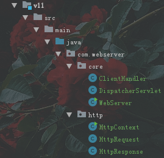

> ```
> 从本版本开始，完成服务端对业务的支持
> 以“用户注册”为例，完成处理一个业务的流程
> 
> 用户注册：
> 1：用户访问注册页面
> 2：用户输入注册信息并点击注册按钮提交
> 3：浏览器将数据包含在HTTP的请求中传递给服务器
> 4：服务端通过解析请求得到用户提交的数据
> 5：感觉请求路径判定并进行注册业务操作
> 6：响应用户注册结果页面（成功或失败）
> 
> 整体业务处理分为两个版本实现，此版本先完成页面提交数据，以及服务
> 端解析提交的的数据。
> 这里需要了解两方面的知识：
> 1：html中的form（表单）的使用
> 2：GET请求提交表单数据后，HTTP请求格式的变化以及解析
> 
> 实现：
> 1：在webapps/myweb下新建一个注册页面reg.html，并在页面中使用form
>     表单将用户注册信息提交给服务端
> 2：在HttpRequest中添加三个属性：requestUri，queryString，parameters
>     并定义parseUri方法，对uri进一步解析。
>     有表单提交时，抽象路径的格式可以参考目录下的图：form表单提交的各部分内容.png
> ```


```html
<!DOCTYPE html>
<html lang="en">
<head>
    <meta charset="UTF-8">
    <title>注册页面</title>
</head>
<body>
    <center>
        <h1>用户注册</h1>
        <!--
            form标签：表单
                用于将form中定义的所有输入框中用户输入的信息提交给服务端使用的重要组件
                注：只有包含在form中的输入框才会被提交给服务端！
                form上有两个重要的属性：
                action：用于指定表单提交的路径
                method：用于指定表单的提交方式：有两种：GET，POST
                    GET：地址栏形式提交数据，表单数据都会被包含在URL中提交
                    POST：打包提交，数据都会被包含在请求的消息正文中进行提交，
                        如果提交的数据包含用户隐私信息或有附件需要上传时要使用POST形式提交
                        method可以不指定，我认为GET形式提交。
        -->
        <form action="./regUser" method="get">
            <table border="1">
                <tr>
                    <td>用户名</td>
                    <td><input name="userName" type="text"></td>
                </tr>
                <tr>
                    <td>密码</td>
                    <td><input name="password" type="text"></td>
                </tr>
                <tr>
                    <td>昵称</td>
                    <td><input name="nickName" type="text"></td>
                </tr>
                <tr>
                    <td>年龄</td>
                    <td><input name="age" type="text"></td>
                </tr>
                <tr>
                    <td colspan="2" align="center"><input type="submit" value="注册"/></td>
                </tr>
            </table>
        </form>
    </center>
</body>
</html>
```

```java
package com.webserver.http;

/**
 * 请求对象
 * 该类的每一个实例用于表示HTTP协议规定的一个请求内容。
 * 每个请求由三部分构成
 * 请求行、消息头、消息正文
 */
public class HttpRequest {
    private Socket socket;
    //请求行相关信息
    private String method;//请求方式
    private String uri;//抽象路径
    private String protocol;//协议版本

    ///myweb/regUser?username=xxx&password=xxx&……
    private String requestURI;//uri中?左侧的请求部分
    private String queryString;//uri中?右侧的参数部分
    /*
        保存每一组客户端提交的参数
        key：参数名     value：参数值
     */
    private Map<String,String> parameters = new HashMap<>();

    //消息头相关信息
    private Map<String,String> headers = new HashMap<>();
    //消息正文相关信息


    public HttpRequest(Socket socket) throws IOException {
        this.socket = socket;

        //1.1读取请求行
        parseRequestLine();
        //1.2解析消息头
        parseHanders();
        //1.3解析消息正文
        parseContent();
    }

    /**
     * 读取请求行
     */
    private void parseRequestLine() throws IOException {
        String line = readLine();
        System.out.println("line = " + line);

        String[] data = line.split("\\s");//空格分隔
        method = data[0];
        uri = data[1];//这里后期会出现数组下标越界异常，这是由于空请求造成的
        protocol = data[2];

        parseUri(uri);//进一步解析uri

        System.out.println(method + "," + uri + "," + protocol);
    }

    /**
     *  进一步解析URI
     */
    private void parseUri(String uri){
        /*
            uri存在两种情况：有参数和无参数
            无参数时：
                如：/myweb/index.html
                只需要直接将uri的值赋值给requestURI即可

            有参数时：
                如：/myweb/regUser?username=xxx&password=xxx&……
                需要做如下操作：
                1：将uri按照“？”分隔为请求和参数部分，并将请求部分赋值给requestURI，
                    将参数部分赋值给queryString
                2：进一步拆分参数部分，首先将参数部分按照“&”拆分初每一组参数，然后每组
                    参数再按照“=“拆分出参数名和参数值，并将参数名作为key，参数值作为
                    value存入parameters这个Map中即可。
            注：上述提及的requestURI，queryString，parameters为HttpRequest中
                定义的属性
         */
        String[] data = uri.split("\\?");
        requestURI =data[0];
        if(data.length > 1){
            queryString = data[1];
            String[] paras = queryString.split("&");
            for(String para : paras){
                String[] arr = para.split("=");
                parameters.put(arr[0],arr.length>1?arr[1]:null);
            }
        }
        System.out.println("parameters = " + parameters);
    }

    /**
     * 解析消息头
     */
    private void parseHanders() throws IOException {
        while (true) {
            String line = readLine();
                /*
                    因为在消息头的结束位置是有两个回车换行(CRLF)(CRLF)
                    在readLine()方法中是根据一个回车换行来确定读到的一行消息头
                    当再次读到CRLF的时候，line=""，line获取到的是一个空字符串
                    所以表示读到了消息的末尾位置
                    if("".equals(line)){}
                 */
            if (line.isEmpty()) {//单独读取到了CRLF
                break;
            }
            String[] data = line.split(":\\s");
            headers.put(data[0],data[1]);
            System.out.println("消息头：" + line);
        }
        System.out.println(headers);
    }

    /**
     * 解析消息正文
     */
    private void parseContent(){}

    private String readLine() throws IOException {
        /*
            当socket对象时同一个时，无论调用多少次她的getInputStream()
            方法获取的输入流始终是同一个输入流，输出流也是一样的。
         */
        InputStream in = socket.getInputStream();
        int d;
        StringBuilder builder = new StringBuilder();
        char pre = 'a', cur = 'a';//pre表示前一个元素，cur表示当前元素，初始值都为a
        while ((d = in.read()) != -1) {
            cur = (char) d;
            if (pre == 13 && cur == 10) {//遇到CRLF就跳出
                break;
            }
            builder.append(cur);
            pre = cur;
        }
        //CR和LF都算是空格，最后trim()可以去除
        return builder.toString().trim();
    }

    public String getMethod() {
        return method;
    }

    public String getUri() {
        return uri;
    }

    public String getProtocol() {
        return protocol;
    }

    //这里不直接去返回整个map，而是只返回key，别人就不能修改你的map，但同时别人也可以根据key获取value
    public String getHander(String name){
        return headers.get(name);
    }

    public String getRequestURI() {
        return requestURI;
    }

    public String getQueryString() {
        return queryString;
    }

    /**
     * 获取给定的参数对应的值
     * @param name
     * @return
     */
    public String getParameter(String name){
        return parameters.get(name);
    }
}
```


### 12）webserver_v12


> ```
> 本版本完成注册用户的业务处理功能
> 
> 首先在处理请求环节（DispatcherServlet的servlet方法）中添加一个分支判断
> 如果请求路径为：/myweb/regUser，则说明这次请求是reg.html页面上form表单
> 提交的请求，那么就要进行用户注册操作。
> 
> 由于HttpRequest的uri属性（抽象路径）保存的内容可能含有参数，而非纯粹的请求
> 路径，因此我们在处理请求的环节判断路径时要改用requestURI这个属性（因为它一
> 定保存的是uri中的请求部分）
> 
> 实现：
> 1：新建包：com.webserver.controller
> 2：在controller包中新建和用户操作相关的业务处理类：UserController
> 3：在UserController中定义方法：reg，用于完成用户注册业务
> 4：DispatcherServlet处理请求环节如果通过HttpRequest获取本次请求路径为：
>     /myweb/regUser，则实例化UserController并调用reg方法处理业务逻辑。
> ```

````java
package com.webserver.controller;

/**
 * 用来处理和用户相关的业务操作
 *
 * @author Akio
 * @Create 2021/8/11 15:54
 */
public class UserController {
    //保存所有用户信息的目录  的名字
    private static String userDirName = "./users/";
    static {
        //程序加载时判断一下保存所有用户信息的目录是否存在，不存在先自动创建出来
        File userDir = new File(userDirName);
        if (!userDir.exists()){
            userDir.mkdir();
        }
    }
    public void reg(HttpRequest request, HttpResponse response) {
        System.out.println("开始处理用户注册……");
        //1从request中获取用户表单上提交的注册信息
        String userName = request.getParameter("userName");
        String password = request.getParameter("password");
        String nickName = request.getParameter("nickName");
        int age = Integer.parseInt(request.getParameter("age"));
        System.out.println(userName + "," + password + "." + nickName + "," + age);

        //2将该用户信息写入磁盘保存
        User user = new User(userName, password, nickName, age);
        try (
            //注意使用对象流的时候，User类必须实现Serializable接口
                ObjectOutputStream oos = new ObjectOutputStream(new FileOutputStream(userDirName + userName + ".obj"));
                ){
            oos.writeObject(user);
            System.out.println("注册成功");
            } catch (IOException e) {
            e.printStackTrace();
        }

        //3设置response响应注册结果页面
        response.setEntity(new File("./webapps/myweb/reg_success.html"));
        System.out.println("处理注册完毕！！！！");
    }
}
````

```java
package com.webserver.core;

/**
 * 用于处理请求
 *
 * @author Akio
 * @Create 2021/8/9 11:04
 */
public class DispatcherServlet {
    public void service(HttpRequest request, HttpResponse response) {
        String path = request.getRequestURI();
        System.out.println("path--------------"+path);
        //拦截：首先判断该请求是否为请求一个业务
        if ("/myweb/regUser".equals(path)) {
            //处理注册
            UserController controller = new UserController();
            controller.reg(request, response);
            System.out.println("-------------------------");

        } else {
            //响应正文相关文件
            File file = new File("./webapps" + path);
            //如果请求的资源存在且是一个文件则正确
            if (file.exists() && file.isFile()) {
                //正常情况
                response.setEntity(file);
            } else {//否则资源是不存在的，响应404页面
                response.setStatusCode(404);
                response.setStatusReason("NotFound");
                file = new File("./webapps/root/404.html");
                response.setEntity(file);
            }
        }
        //该响应头是告知浏览器服务端是谁
        response.putHeader("Server", "WebServer");
    }
}
```

注意运行过程中会出现如下空指针的问题


定位到HttpResponse中，如果entity不为null时则执行


---


---

截止此刻：整个项目的流程图完善如下，不清楚可以点击https://gitee.com/Grantr/java_-flag/tree/master/Java_NoteBook.assets/WebServer流程图_3.png


## 27 Date类（API）


```java
package Y2021M5D18_Date;

import java.util.Date;

/**
 * 	java.util. Date 
 * 	Date的每一个实例用于表示一个时间点
 * 	内部维护一个long值，该值记录的时自1970年
 * 	1月1日00:00:00到当前Date表示的时间之间
 * 	所经过的毫秒.
 * 	由于Date存在时区以及千年虫问题，所以大部分
 * 	操作时间的方法都被声明为过时的不再建议使用
 * @author Grant·Vranes
 *
 */
public class DateDemo {
	public static void main(String[] args) {
		//默认创建当前系统时间
		Date date = new Date();
		System.out.println(date);
		
		//获取Date内部维护的long值
		long time = date.getTime();
		System.out.println(time);
		
		time = time+1000*60*60*24;
		date.setTime(time);
		System.out.println(date);
		
		date.setTime(0);//里面可以传入long值
		System.out.println(date);
	}
}
```


#### SimpleDateFormat


```java
package Y2021M5D18_Date;

import java.text.SimpleDateFormat;
import java.util.Date;

/**
 * 	java.text.SimpleDateFormat
 * 	该类可以将Date与 String之间互转。依靠的是
 * 	一个日期格式字符串。
 * @author Grant·Vranes
 *
 */
public class SimleDateFormat_format {
	public static void main(String[] args) {
		Date now = new Date();
		System.out.println(now);//Tue May 18 09:30:53 CST 2021
		
		/*
		 * 	2021-05-18 10:26:33   <-我想要的格式
		 * 	yyyy-MM-dd HH:mm:ss		
		 */
		SimpleDateFormat sdf = new SimpleDateFormat("yyyy-MM-dd HH:mm:ss");
		/*
		 * 	String format(Date date)
		 *	将给定的Date按照sdf指定的日期格式转换为一个字符串
		 */
		String line = sdf.format(now);
		System.out.println(line);//2021-05-18 09:30:53
	}
}
```

```java
package Y2021M5D18_Date;

import java.text.ParseException;
import java.text.SimpleDateFormat;
import java.util.Date;

/**
 * 	将一个字符串解析为一个Date
 * @author Grant·Vranes
 *
 */
public class SimpleDateFormat_parse {
	public static void main(String[] args) throws ParseException {
		String str = "2008-08-08 20:08:08";
		SimpleDateFormat sdf = new SimpleDateFormat("yyyy-MM-dd HH:mm:ss");
		
		Date date = sdf.parse(str);
		System.out.println(date);//Fri Aug 08 20:08:08 CST 2008
	}
}
```

---

```java
package Y2021M5D18_Date;

import java.text.ParseException;
import java.text.SimpleDateFormat;
import java.util.Date;
import java.util.Scanner;

/**
 * 	编写一个程序，要求用户输入自己的生日，格式
 * 	为：yyyy-MM-dd
 * 	然后经过程序运算，输出到今天为止一共活了多少天。
 * 	再输出其出生10000天的纪念日是哪天，输出格式同样
 * 	为：yyyy-MM-dd
 * @author Grant·Vranes
 *
 */
public class Test {
	public static void main(String[] args) throws ParseException {
		Scanner sc = new Scanner(System.in);
		System.out.println("请输入自己的生日(格式为yyyy-MM-dd):");
		String bir = sc.nextLine();
		SimpleDateFormat sdf = new SimpleDateFormat("yyyy-MM-dd");
		Date birDate = sdf.parse(bir);//获取出生日期的Date
		
		Date now = new Date();//当前时间
		
		System.out.println("到今天为止一共活了" + (birDate.getTime()-now.getTime())/1000/60/60/24 + "天");
		
		Long niceTime = birDate.getTime() + 10000L*1000*60*60*24;//注意：数字运算都是默认int型，但当运算数据超过int的表示范围可以加个L转成long
		Date niceDate = new Date(niceTime);
		System.out.println("出生10000天的纪念日是:" + sdf.format(niceDate));	
	}
}
```


## 28）Calendar类


```java
package Y2021M5D18_Date;

import java.util.Calendar;
import java.util.Date;

/**
 * 	java.util.Calendar
 * 	日历类
 * 	Calendar是用来操作时间的API，使用非常的方便。
 * 	但本身是一个抽象类，提供了一个用于获取实现类的静
 * 	态方法：getInstance()，该方法可以根据当前系统
 * 	所在地区获取一个适用的实现类
 * 	大部分地区获取回来的都是：GregorianCalendar
 * 	即：阳历
 * @author Grant·Vranes
 *
 */
public class CalendarDemo1 {
	public static void main(String[] args) {
		//Calendar默认也表示当前系统时间
		Calendar calendar = Calendar.getInstance();
		/*
		 * 	Calendar的toString输出的信息很多，但是不能直观的看出具体日期
		 */
		System.out.println(calendar);
		
		/*
		 * 	Date getTime()
		 * 	Calendar提供的 getTime方法可以获取一个Date，
		 * 	该实例表示的就是当前calendar所表示的日期
		 */
		Date date = calendar.getTime();
		System.out.println(date);
		
		/*
		 * 	Calendar另一个方法：
		 * 	void setTime(Datedate)
		 * 	该方法可以让当前 Calendar表示给定的Date所表示的日期
		 */
	}
}
```

```java
package Y2021M5D18_Date;

import java.util.Calendar;

/**
 * 	Calendar提供了获取各时间分量信息的方法：
 * 	int get(int field)
 * 	参数为一个int值，不同的值表示不同的时间分量，
 * 	而我们无需记忆这些数字， Calendar把这些数定
 * 	义为了常量
 * @author Grant·Vranes
 *
 */
public class CalendarDemo2 {
	public static void main(String[] args) {
		Calendar calendar = Calendar.getInstance();
		//获取年
		int year = calendar.get(Calendar.YEAR);
		//获取月(月从0开始)
		int month = calendar.get(Calendar.MONTH)+1;
		/*
		 * 	获取日
		 * 	常量				表示
		 * 	DAY_OF_MONTH	月中的天	
		 * 	DATE			月中的天
		 * 	DAY_OF_WEEK		周中的天
		 * 	DAY_OF_YEAR		年中的天
		 */
		int day = calendar.get(Calendar.DATE);
		System.out.println(year+"-"+month+"-"+day);
		
		//获取时分秒
		int h = calendar.get(Calendar.HOUR_OF_DAY);
		int m = calendar.get(Calendar.MINUTE);
		int s = calendar.get(Calendar.SECOND);
		System.out.println(h+":"+m+":"+s);
		
		//查看今天是今年的第几天？
		int days = calendar.get(Calendar.DAY_OF_YEAR);
		System.out.println(days);
		
		//今天是周几？
		int dow = calendar.get(Calendar.DAY_OF_WEEK);
		String[] data = {"日","一","二","三","四","五","六"};
		System.out.println("周" + data[dow-1]);//因为老外认为星期天是一周的开始
		
		/*
		 * 	获取指定的时间分量所允许的最大值
		 */
		days = calendar.getActualMaximum(Calendar.DAY_OF_MONTH);
		System.out.println(month+"月中最多有"+days+"天");//5月中最多有31天
	}
}
```

```java
package Y2021M5D18_Date;

import java.util.Calendar;

/**
 * 	void set(int field, int value)
 * 	对指定的时间分量设置指定的值
 * @author Grant·Vranes
 *
 */
public class CalendarDemo3 {
	public static void main(String[] args) {
		Calendar calendar = Calendar.getInstance();
		/*
		 * 	表示2008-08-08 20:08:08
		 */
		//可以直接全部设置
//		calendar.set(year, month, date, hourOfDay, minute, second);
		//也可以单独设置
		calendar.set(Calendar.YEAR, 2008);
		calendar.set(Calendar.MONDAY, Calendar.AUGUST);
		calendar.set(Calendar.DATE, 8);
		calendar.set(Calendar.HOUR_OF_DAY, 20);
		calendar.set(Calendar.MINUTE, 8);
		calendar.set(Calendar.SECOND, 8);
		//下面的getTime输出如果注释掉，后面的输出结果不同
		System.out.println(calendar.getTime());
		
		/*
		 * 	上面设置日期为8号，但是set方法并非在每次设置后就真的将时间
		 * 	分量改为该对对应值，而是在getTime时进行实际计算，但是下面
		 * 	的代码在设置星期几时会影响月中的天，这会导致刚才设置的8号被
		 * 	覆盖等于没做。
		 * 	对此的解决办法是，当设置出现相互影响时，可以在之前设置过后主
		 * 	动调用一次 getTime方法让 Calendar进行一次调整运算后再设
		 * 	置就没有问题了。可以取消上面的注释看看前后效果
		 */
		calendar.set(Calendar.DAY_OF_WEEK, Calendar.SUNDAY);
		System.out.println(calendar.getTime());
		
		
	}
}
```

```java
package Y2021M5D18_Date;

import java.util.Calendar;

/**
 * 	void add(int field, int amount)
 * 	对指定的时间分量累加给定值。若给定的值为负数则是减去。
 * 	该计算与set不同，调用一次后就会真实进行一次计算操作。
 * @author Grant·Vranes
 *
 */
public class CalendarDemo4 {
	public static void main(String[] args) {
		Calendar calendar = Calendar.getInstance();
		/*
		 * 	3年5个月零25天以后是哪一天?
		 */
		//加3年
		calendar.add(Calendar.YEAR, 3);
		//加5个月
		calendar.add(Calendar.MONTH, 5);
		//加25天
		calendar.add(Calendar.DAY_OF_YEAR, 25);
		System.out.println(calendar.getTime());//Tue Nov 12 15:56:00 CST 2024
		
		/*
		 * 	查看当周的周六是哪天？
		 */
		calendar.set(Calendar.DAY_OF_WEEK, Calendar.SATURDAY);
		System.out.println(calendar.getTime());//Sat Nov 16 15:57:26 CST 2024		
	}
}
```

```java
package Y2021M5D18_Date;

import java.text.ParseException;
import java.text.SimpleDateFormat;
import java.util.Calendar;
import java.util.Date;
import java.util.Scanner;

/**
 * 	计算商品促销日：
 * 	输入一个商品的生产日期，格式（yyyy-MM-d）
 * 	再输入保质期的天数。
 * 	然后经过程序运算输出该商品促销日期，格式也是：yyyy-MM-dd
 * 	促销日计算规则：商品过期日前两周的周彐
 * @author Grant·Vranes
 *
 */
public class Test2 {
	public static void main(String[] args) throws ParseException {
		Scanner sc = new Scanner(System.in);
		System.out.println("请输入生产日期:");
		String dateStr = sc.nextLine();
		
		System.out.println("请输入保质期:");
		int days = Integer.parseInt(sc.nextLine());
		SimpleDateFormat sdf = new SimpleDateFormat("yyyy-MM-dd");
		Date date = sdf.parse(dateStr);
		Calendar calendar = Calendar.getInstance();
		calendar.setTime(date);
		
		//计算促销日
		//1计算过期日期
		calendar.add(Calendar.DAY_OF_YEAR, days);
		//2前两周
		calendar.add(Calendar.DAY_OF_YEAR, -14);
		//3设置为当周的周三
		calendar.set(Calendar.DAY_OF_WEEK, Calendar.WEDNESDAY);
		
		date = calendar.getTime();
		String line = sdf.format(date);
		System.out.println("促销日为：" + line);
	}
}
```


## 29）Lambda表达式

```java
package Y2021M5D18_Lambda;
/**
 * 	Lambda表达式
 *  Lambda可以让java以函数式编程。
 * 	该特性是自JDK8之后推出的。
 *	使用Lambda可以方便快捷创建匿名内部类
 *	语法：
 *	(参数列表)->{
 *		方法体
 *	}
 *	使用Lambda创建的匿名内部类实际所属的接口必须
 *	只能有一个方法。否则编译不通过
 * 	
 * @author Grant·Vranes
 *
 */
public class LambdaDemo1 {
	public static void main(String[] args) {
		Runnable r1 = new Runnable() {
			public void run() {
				System.out.println("hello");
			}
		};
		
		Runnable r2 = ()->{
			System.out.println("hello");
		};
		
		/*
		 * 	当方法中只有一句话时。方法的"{}"可以省略
		 */
		Runnable r3 = ()->System.out.println("hello");
	}
}
```

```java
package Y2021M5D18_Lambda;

import java.util.ArrayList;
import java.util.Collections;
import java.util.Comparator;
import java.util.List;

public class LambdaDemo2 {
	public static void main(String[] args) {
		List<String> list = new ArrayList<String>();
		list.add("近朱者赤近墨者黑");
		list.add("时间");
		list.add("空间几何");
		System.out.println(list);
		//比较器写法
//		Comparator<String> com = new Comparator<String>() {
//			public int compare(String o1, String o2) {
//				return o1.length()-o2.length();
//			}
//		};
		
		/*
		 * 	方法中的参数类型可以不再指定，编译器会结合程序自行分析参数类型
		 */
//		Comparator<String> com = (o1, o2)->{
//			return o1.length()-o2.length();
//		};
		
		/*
		 * 	如果只有一句代码，那么在忽略"{}"号的同时，return关键字也要忽略
		 */
		Comparator<String> com = (o1, o2)-> o1.length()-o2.length();
		
		Collections.sort(list, com);
		System.out.println(list);
	}
}
```

```java
package Y2021M5D18_Lambda;

import java.util.ArrayList;
import java.util.HashMap;
import java.util.List;
import java.util.Map;

/**
 * 	JDK8之后集合和Map都支持了一个新的方法：
 * 	forEach，可以使用 lambda遍历集合元素。
 * 	由于该方法是集合自行提供的，那么在使用一个线程安全
 * 	的集合或Map时，该种遍历方式也是并发安全的（原迭代
 * 	器模式不与集合方法互斥，并发需要自行维护）
 * @author Grant·Vranes
 *
 */
public class LambdaDemo3 {
	public static void main(String[] args) {
		List<String> list = new ArrayList<String>();
		list.add("one");
		list.add("three");
		list.add("two");
		list.add("four");
		for(String str : list) {
			System.out.println(str);
		}
		
		//JDK8支持的新方式
		list.forEach(
			(str)->System.out.println(str)
		);
		
		Map<String,Integer> map = new HashMap<String,Integer>();
		map.put("语文", 99);
		map.put("数学", 98);
		map.put("英语", 97);
		
		map.forEach(
			(k,v)->System.out.println(k + ":" + v)
		);
	}
}
```

