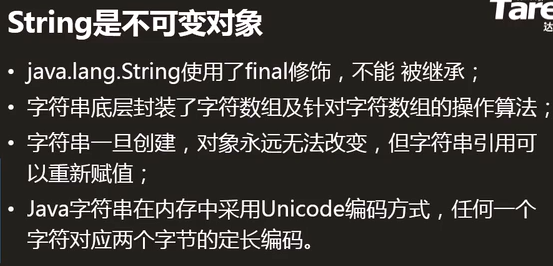
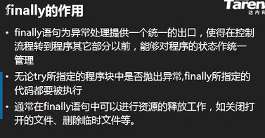
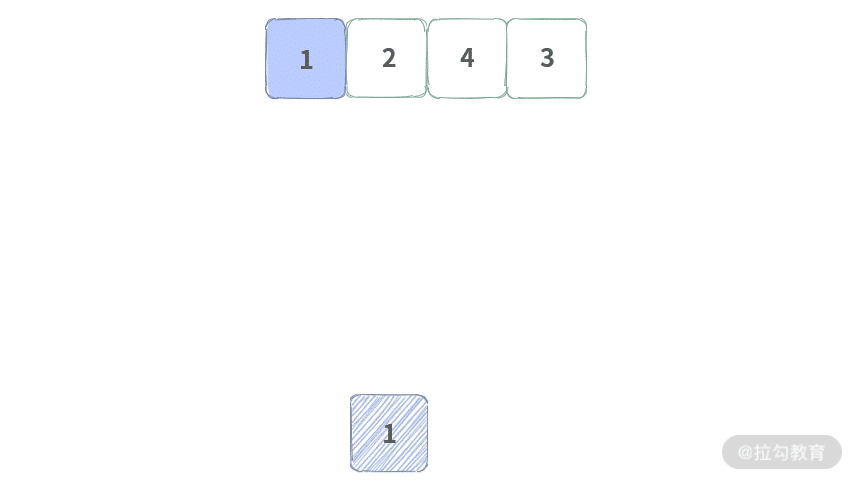
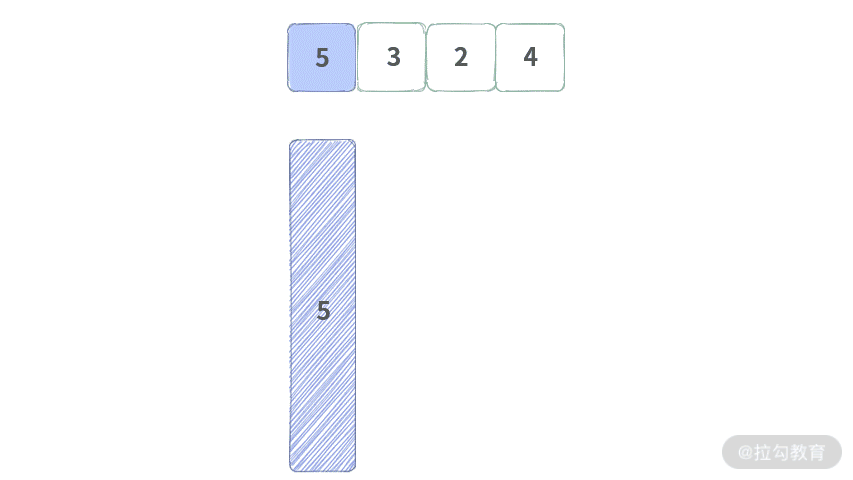
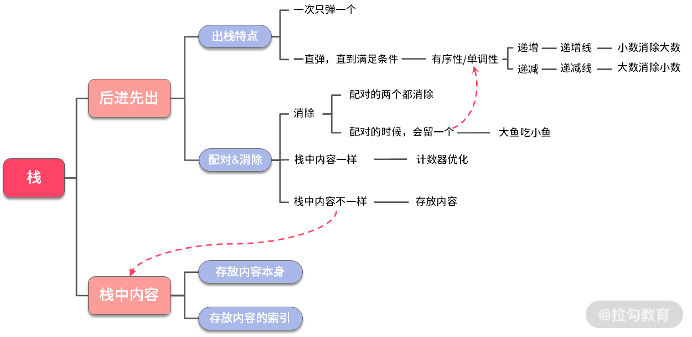
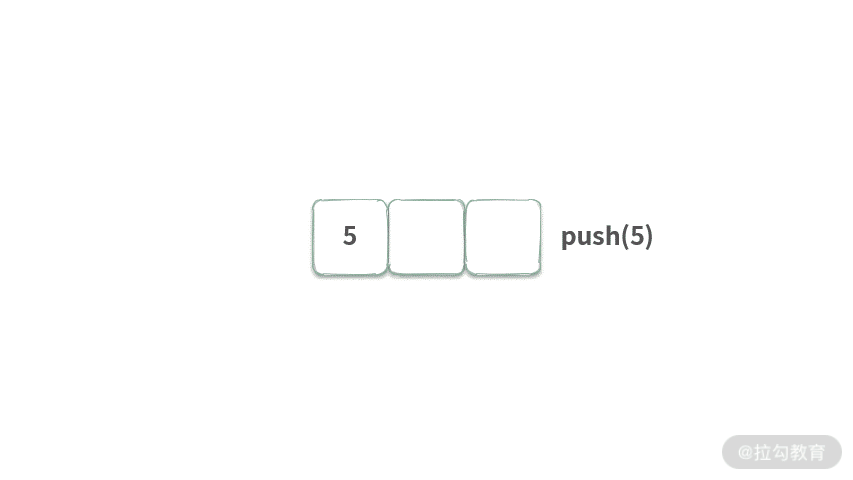

<p align = center><font size = 9>Java</font></p>

<p align = center>writen by Grant·Vranes</p>

---

课程来源https://www.bilibili.com/video/BV1RV41147yJ?from=search&seid=4932318903875319779

---

Code为代码文件夹，也为Eclipse工作目录

其下项目PartOne代表模块一-----------语言基础（7天）学习中的所有代码

PartTwo代表模块二-----------面向对象（10天）学习中的所有代码

PartThree代表模块三------------API（20天）

---

- [Java语言基础（7天）+ 面向对象（10天）+ API（20天）](#java语言基础7天-面向对象10天-api20天)
- [Java语言基础](#java语言基础)
	- [1 课程前序(2021.2.18)](#1-课程前序2021218)
	- [2 Java编译运行过程](#2-java编译运行过程)
			- [每日练习：](#每日练习)
	- [3 变量 （2021.2.19）](#3-变量-2021219)
		- [1）声明](#1声明)
		- [2）初始化（第一次赋值）](#2初始化第一次赋值)
		- [3） 使用](#3-使用)
		- [4）命名](#4命名)
	- [4 基本数据类型（四类八种）](#4-基本数据类型四类八种)
	- [5 基本数据类型间的转换](#5-基本数据类型间的转换)
		- [两点规则](#两点规则)
		- [Scanner接受输入](#scanner接受输入)
	- [6 运算符和表达式（2021.2.20）](#6-运算符和表达式2021220)
		- [算数运算符（易混淆）](#算数运算符易混淆)
		- [关系运算符](#关系运算符)
		- [逻辑运算符（注意短路效果）](#逻辑运算符注意短路效果)
		- [赋值、字符串连接运算符](#赋值字符串连接运算符)
		- [三目运算符](#三目运算符)
		- [运算符经典案例（闰年的判断）](#运算符经典案例闰年的判断)
	- [7 分支结构](#7-分支结构)
	- [8 循环结构](#8-循环结构)
			- [循环问题定义](#循环问题定义)
			- [嵌套循环](#嵌套循环)
	- [9 数组](#9-数组)
		- [数组（上）](#数组上)
		- [数组（下）](#数组下)
		- [引用类型数组](#引用类型数组)
	- [10 方法(2021.2.21)](#10-方法2021221)
	- [阶段项目：猜字符小游戏](#阶段项目猜字符小游戏)
	- [脑图总结](#脑图总结)
- [面向对象（10天）](#面向对象10天)
		- [面向对象课程安排](#面向对象课程安排)
	- [11 面向对象 （2021.2.22）](#11-面向对象-2021222)
		- [面向过程和面向对象](#面向过程和面向对象)
		- [什么是类？什么是对象？](#什么是类什么是对象)
		- [定义类的方法](#定义类的方法)
		- [创建对象](#创建对象)
		- [引用类型变量](#引用类型变量)
		- [访问对象的成员变量、调用方法](#访问对象的成员变量调用方法)
		- [创建类和对象实例](#创建类和对象实例)
		- [方法的签名](#方法的签名)
		- [方法的重载](#方法的重载)
		- [构造方法](#构造方法)
		- [this关键字](#this关键字)
		- [null和NullPointerException](#null和nullpointerexception)
		- [引用类型之间画等号](#引用类型之间画等号)
		- [引用类型数组（2021.2.28）](#引用类型数组2021228)
		- [继承](#继承)
		- [super](#super)
		- [综合例子](#综合例子)
		- [向上造型（2021.3.1）](#向上造型202131)
		- [方法的重写（override）：重新写、覆盖](#方法的重写override重新写覆盖)
		- [重写（override）与重载（overload）的区别(常见面试题)](#重写override与重载overload的区别常见面试题)
		- [package和import](#package和import)
		- [访问控制修饰符public/protected/private](#访问控制修饰符publicprotectedprivate)
		- [final关键字](#final关键字)
		- [static关键字（2021.3.3）](#static关键字202133)
		- [static final常量（2021.3.4）](#static-final常量202134)
		- [抽象方法和抽象类](#抽象方法和抽象类)
		- [成员内部类(2021.3.5)](#成员内部类202135)
		- [匿名内部类](#匿名内部类)
		- [接口（2021.3.8）](#接口202138)
		- [多态](#多态)
		- [内存管理](#内存管理)
		- [实例变量和局部变量](#实例变量和局部变量)
		- [面向对象三大特征](#面向对象三大特征)
		- [Debug调试工具](#debug调试工具)
	- [12 面向对象之射击游戏](#12-面向对象之射击游戏)
		- [射击游戏需求介绍（Project：MyShoot）](#射击游戏需求介绍projectmyshoot)
		- [**程序设计规则：**](#程序设计规则)
		- [射击游戏梗概](#射击游戏梗概)
			- [设计第1天](#设计第1天)
			- [设计第2天](#设计第2天)
			- [设计第3天](#设计第3天)
			- [设计第4天](#设计第4天)
			- [设计第5天](#设计第5天)
			- [设计第6天](#设计第6天)
			- [设计第7天](#设计第7天)
			- [设计第8天](#设计第8天)
			- [设计第9天](#设计第9天)
			- [设计第10天](#设计第10天)
- [API（20天）](#api20天)
	- [13 API文档 （2021.3.17）](#13-api文档-2021317)
	- [14 文档注释](#14-文档注释)
	- [15 字符串（第一个API）](#15-字符串第一个api)
		- [什么是字符串？](#什么是字符串)
		- [字符串常量池](#字符串常量池)
		- [字符串不变特性](#字符串不变特性)
		- [字符串方法](#字符串方法)
				- [Length()](#length)
				- [indexOf()](#indexof)
				- [trim()](#trim)
				- [charAt()](#charat)
				- [startsWith() endsWith()](#startswith-endswith)
				- [substring()](#substring)
				- [toUpperCase()](#touppercase)
				- [valueOf()](#valueof)
				- [matches():支持正则表达式](#matches支持正则表达式)
				- [split()：支持正则表达式](#split支持正则表达式)
				- [replaceAll()：支持正则表达式](#replaceall支持正则表达式)
		- [修改字符串的性能问题](#修改字符串的性能问题)
		- [正则表达式](#正则表达式)
	- [16 Object（2021.3.19）](#16-object2021319)
	- [17 包装类](#17-包装类)
			- [转换包装类](#转换包装类)
			- [JDK1.5的自动拆装箱特性](#jdk15的自动拆装箱特性)
			- [包装类都有提供一个静态方法](#包装类都有提供一个静态方法)
	- [18 File（2021.3.20）](#18-file2021320)
			- [File中的基本方法](#file中的基本方法)
				- [使用File创建一个文件](#使用file创建一个文件)
				- [删除一个文件](#删除一个文件)
				- [创建一个目录](#创建一个目录)
				- [创建一个多级目录](#创建一个多级目录)
				- [删除目录](#删除目录)
				- [删除多级目录](#删除多级目录)
				- [获取当前目录下所有子项](#获取当前目录下所有子项)
				- [实现删除给定File所表示的文件或目录](#实现删除给定file所表示的文件或目录)
				- [递归思想面试题](#递归思想面试题)
			- [FileFilter文件过滤器](#filefilter文件过滤器)
	- [19 RandomAccessFile(RAF)(2021.3.21)](#19-randomaccessfileraf2021321)
			- [RAF实现文件的读写操作](#raf实现文件的读写操作)
			- [RAF实现文件的复制](#raf实现文件的复制)
			- [RAF写字符串操作](#raf写字符串操作)
			- [RAF读写基本类型数据](#raf读写基本类型数据)
			- [RAF指针操作](#raf指针操作)
			- [RAF实现用户注册/登录](#raf实现用户注册登录)
	- [20 JavaIO（2021.3.24）](#20-javaio2021324)
		- [文件流(低级流)](#文件流低级流)
		- [流连接介绍](#流连接介绍)
		- [缓冲流（高级流）](#缓冲流高级流)
			- [缓冲流的使用](#缓冲流的使用)
			- [缓冲流的缓冲区](#缓冲流的缓冲区)
		- [对象流(高级流)](#对象流高级流)
			- [序列化相关关键字介绍](#序列化相关关键字介绍)
		- [字符流](#字符流)
			- [字符转换流](#字符转换流)
			- [PrintWriter](#printwriter)
			- [缓冲字符输入流](#缓冲字符输入流)
	- [21 异常处理机制](#21-异常处理机制)
		- [异常的捕获和处理](#异常的捕获和处理)
				- [try-catch](#try-catch)
				- [异常抛出](#异常抛出)
		- [运行时异常介绍](#运行时异常介绍)
		- [异常中常见的API](#异常中常见的api)
		- [自定义异常](#自定义异常)
	- [22 网络通讯介绍(2021.3.27)](#22-网络通讯介绍2021327)
	- [23 Socket介绍](#23-socket介绍)
			- [聊天室项目（1）](#聊天室项目1)
	- [24 多线程介绍(2021.3.29)](#24-多线程介绍2021329)
			- [进程与线程](#进程与线程)
			- [线程的创建方式](#线程的创建方式)
			- [CurrentThread介绍（线程操作API）](#currentthread介绍线程操作api)
			- [线程优先级](#线程优先级)
			- [sleep阻塞](#sleep阻塞)
			- [守护线程](#守护线程)
			- [join阻塞](#join阻塞)
			- [并发安全问题介绍](#并发安全问题介绍)
			- [同步锁（同步块）](#同步锁同步块)
			- [互斥锁](#互斥锁)
			- [聊天室项目(2)](#聊天室项目2)
			- [聊天室项目(3)](#聊天室项目3)
	- [25 Collection集合(2021.4.4)](#25-collection集合202144)
		- [集合常见方法](#集合常见方法)
		- [contains方法介绍](#contains方法介绍)
			- [集合存放的也是元素的引用（地址）](#集合存放的也是元素的引用地址)
		- [集合常见操作](#集合常见操作)
		- [迭代器介绍](#迭代器介绍)
		- [增强循环介绍](#增强循环介绍)
		- [泛型介绍](#泛型介绍)
			- [泛型在集合中的应用](#泛型在集合中的应用)
			- [聊天室项目(4)](#聊天室项目4)
		- [List集合介绍(2021.4.6)](#list集合介绍202146)
			- [List常用方法介绍](#list常用方法介绍)
		- [集合与数组间的转换](#集合与数组间的转换)
		- [集合的排序](#集合的排序)
			- [Collections重载sort方法](#collections重载sort方法)
		- [Queue队列](#queue队列)
			- [双端队列](#双端队列)
			- [双端队列与栈](#双端队列与栈)
		- [集合并发安全问题](#集合并发安全问题)
	- [26 webserver项目](#26-webserver项目)
		- [1）webserver项目传入](#1webserver项目传入)
		- [2）WebServer主类的搭建（v1版本）](#2webserver主类的搭建v1版本)
		- [3）HTTP协议请求的介绍](#3http协议请求的介绍)
		- [4）读取HTTP请求操作（v2版本）](#4读取http请求操作v2版本)
		- [5）创建HttpRequest对象（v3版本）](#5创建httprequest对象v3版本)
			- [查找表Map（2021.4.10）](#查找表map2021410)
			- [解析HTTP中的消息头](#解析http中的消息头)
- [数据结构与算法面试](#数据结构与算法面试)
	- [01 栈](#01-栈)
		- [例1：判断字符串括号是否合法?](#例1判断字符串括号是否合法)
		- [例2：大鱼吃小鱼](#例2大鱼吃小鱼)
		- [单调栈的解题技巧](#单调栈的解题技巧)
		- [例 3：找出数组中右边比我小的元素](#例-3找出数组中右边比我小的元素)
		- [例4：字典序最小的 k 个数的子序列](#例4字典序最小的-k-个数的子序列)
	- [02 | 队列：FIFO 队列与单调队列的深挖与扩展](#02--队列fifo-队列与单调队列的深挖与扩展)
		- [FIFO 队列](#fifo-队列)
			- [例 1：二叉树的层次遍历（两种方法）](#例-1二叉树的层次遍历两种方法)

---


# Java语言基础（7天）+ 面向对象（10天）+ API（20天）


# Java语言基础


## 1 课程前序(2021.2.18)

语言基础------多练

面向对象------多想

---

java：是一门计算机语言------------做程序/软件的（*淘宝/京东/饿了么/摩拜/银行系统/ATM机系统都是用Java开发*）


## 2 Java编译运行过程


- C语言编译过程

  

- Java语言编译过程

  ```java
  步骤：-------（面试题）
  1）.java源文件，经过编译，生成.class字节码文件
  2)JVM(虚拟机)加载.class并运行.class（0和1）
      
  假如QQ是用Java语言写的：
      java版的qq，经过编译，生成.class字节码文件
      Windows版的JVM---------运行在Windows上
      Linux版的JVM---------运行在Linux上
      IOS版的JVM---------运行在IOS上
      ？？？版的JVM---------运行在？？？上
      需要什么平台的qq只需要安装对应平台的JVM就行，不需要像C语言编写的QQ一样（要为每个平台都写一套qq系统）
      这个特性：跨平台，一次编程到处运行
  ```

  

  


- 涉及名词解释：-------常见面试题

  1) JVM : <u>java虚拟机</u>

  ​				加载.class并运行.class

  2) JRE : <u>java运行环境</u>--------运行Java程序的最小环境

  ​				除了包含JVM以外还包含运行java程序所必需的环境

  ​				JRE = JVM + java系统类库（小零件/小功能）

  3) JDK : <u>java开发工具包</u>----------开发Java程序的最小环境

  ​				除了包含JRE意外还包含开发java程序所必需的的命令工具

  ​				JDK = JRE+编译、运行等命令工具

  ---

  

  

  

- 配置环境变量---------了解（现在借助eclipse等工具可以不用配置）

  

  

  ```java
  配置三个东西：
      1)JAVA_HOME：指向jdk的安装目录,输入安装路径
      2)CLASSPATH：表示类的搜索路径，一般简写为(.)表示当前路径，写.
      3)PATH：指向jdk下的bin目录，一般写%JAVA_HOME%\bin
  -------------------
  配置方法：
  	1、右键点击【计算机】，选择【属性】，点击【高级系统设置】，打开环境变量设置；
      2、新建【JAVA_HOME】变量，并编辑【Path】变量；
      3、新建【Classpath】变量并编辑即可。
  -------------------
  检验方法：CMD中输入java和javac，有反应就说明成功。
  ```


- Eclipse简介

  

  

  

- 开发步骤

  1）新建java项目/工程--------------小区

  2） 新建java包------------------------楼+单元

  3）新建java类-------------------------房子


- 注释：解释性文本

  1）单行注释：//

  2）多行注释：/* */

  3）文档注释：/** */


- 第一个HelloWorld程序

  ```java
  package Y2021M2D18;//声明包
  public class HelloWorld_1 {//声明类
  	//主方法main，为程序的入口
  	//程序的执行从main开始，main结束则程序结束
  	public static void main(String[] args) {
          //输出
          //1)严格区分大小写
          //2)所有符号必须是英文模式
          //3)每句话必须以;结尾
  		System.out.println("Hello , 2021.2.18");
  	}
  }
  ```

  

- 命令行编译运行java程序

  - cd到对应目录，使用javac编译.java文件成字节码文件

    

  - 然后使用`java HelloWorld_1`

    

    ---

    :warning:注意：可能会遇到无法加载主类的问题，可以参考https://www.cnblogs.com/wangxiaoha/p/6293340.html

    

    

    ---

 #### 每日练习：

```java
1、简述Java编译及运行过程
    
2、名词解释JVM、JRE、JDK
    
3、下列关于Eclipse说法正确的是？ABCD
    A.在源文件编写的同时Ecplise会自动的调用Java编译器编译该文件，如果出现任何编译错误，Ecplise会立即发现，并提示给用户
    B.Ecplise中的Workspace是用于储存工程的路径
    C.Ecplise下载完成后，不需要特殊的安装，仅需解压即可
    D.Ecplise是开放源代码的Java开发平台
    
4、java实现helloworld
```


---


## 3 变量 （2021.2.19）

**变量就是指代在内存中开辟的存储空间，用于存放运算过程中需要用到的数据**

```java
int a = 5;
int b = 6;
int c = a + b;
```


### 1）声明


```java
int a;
int b,c,d;
```


### 2）初始化（第一次赋值）

```java
int a = 266;
int b;
b = 299;
```


### 3） 使用

- 对变量的操作就是对它所存储的数据的操作

- 变量的使用必须与数据类型匹配

- 变量在用之前必须声明并初始化

  

### 4）命名

```java
1） 只能包含字母、数字、_、$,并且不能以数字开头
2） 严格区分大小写
3） 不能使用关键字
4） 可以中文命名，但不建议
    建议用翻译成英文，忌用拼音
5）推荐使用驼峰命名法/帕斯卡命名法
    驼峰命名法：第一个单词小写，后面的单词首字母全大写
    帕斯卡命名法：所有单词首字母均大写
```


## 4 基本数据类型（四类八种）


```java
Java语言提供了八种基本类型。六种数字类型（四个整数型，两个浮点型），一种字符类型，还有一种布尔型。

byte：---------=1byte = 8 bit(位)
    byte 数据类型是8位、有符号的，以二进制补码表示的整数；
    最小值是 -128（-2^7）；
    最大值是 127（2^7-1）；
    默认值是 0；
    byte 类型用在大型数组中节约空间，主要代替整数，因为 byte 变量占用的空间只有 int 类型的四分之一；
    例子：byte a = 100，byte b = -50。
    
short：-----------=2byte = 16bit
    short 数据类型是 16 位、有符号的以二进制补码表示的整数
    最小值是 -32768（-2^15）；
    最大值是 32767（2^15 - 1）；
    Short 数据类型也可以像 byte 那样节省空间。一个short变量是int型变量所占空间的二分之一；
    默认值是 0；
    例子：short s = 1000，short r = -20000。
    
int：----------=4byte = 32bit
    int 数据类型是32位、有符号的以二进制补码表示的整数；
    最小值是 -2,147,483,648（-2^31）；
    最大值是 2,147,483,647（2^31 - 1）；
    一般地整型变量默认为 int 类型；
    默认值是 0 ；
    例子：int a = 100000, int b = -200000。
    
long：-----------=8byte = 64bit
    long 数据类型是 64 位、有符号的以二进制补码表示的整数；
    最小值是 -9,223,372,036,854,775,808（-2^63）；
    最大值是 9,223,372,036,854,775,807（2^63 -1）；
    这种类型主要使用在需要比较大整数的系统上；
    默认值是 0L；
    例子： long a = 100000L，Long b = -200000L。
    "L"理论上不分大小写，但是若写成"l"容易与数字"1"混淆，不容易分辩。所以最好大写。
    使用long类型后面必须要加L，否则认为是int类型
    ------******
    通过时间毫秒数来存储日期和时间
    JDK提供System.currentTimeMillis()方法，返回1970年1月1日零点到此时此刻所经历的毫秒数，其数据类型为long，该方法经常用于计时操作。
    long time = System.currentTimeMillis();
	System.out.println(time);
	
float：----------=4byte = 32bit
    float 数据类型是单精度、32位、符合IEEE 754标准的浮点数；
    float 在储存大型浮点数组的时候可节省内存空间；
    默认值是 0.0f；
    使用float后面必须加上F/f，否则认为是double类型
    浮点数不能用来表示精确的值，如货币；
    例子：float f1 = 234.5f。
    
double：-----------=8byte = 64bit
    double 数据类型是双精度、64 位、符合IEEE 754标准的浮点数；
    浮点数的默认类型为double类型；
    double类型同样不能表示精确的值，如货币；
    默认值是 0.0d；
    例子：double d1 = 123.4。
    
boolean：-----------=1byte = 8bit
    boolean数据类型表示一位的信息；
    只有两个取值：true 和 false；
    这种类型只作为一种标志来记录 true/false 情况；
    默认值是 false；
    例子：boolean one = true。
    
char：-----------=2byte = 16bit
    char类型是一个单一的 16 位 Unicode 字符；
    最小值是 \u0000（即为 0）；
    最大值是 \uffff（即为65、535）；
    char 数据类型可以储存任何字符；
    特殊符号需要用\来转义
    例子：char letter = 'A';。
        char ch = '';//编译错误，不允许空字符
```


---

**判断编译错误和溢出**

```java
直接量超范围是编译错误
运算时超范围为溢出，溢出不是错误，但要避免
    int a = 10000000000;   //百亿，直接量超范围，编译错误
	int a = 1000000000*10; //十亿*10，运算时超范围，为溢出
```

---


```java
double a = 3, b = 2.9;
System.out.println(a-b); //0.100000000000000009
```

---


## 5 基本数据类型间的转换

基本数据类型从小到大依次为

​	byte,short,int/char,long,float,double,

两种方式：

1） 自动类型转换：小类型到大类型（不会溢出和丢失精度）

2）强制类型转换：大类型到小类型（强转有可能溢出或丢失精度）

```java
//基本数据类型间的转换：
		int a = 5;
		long b = a;//自动类型转换
		int c = (int)b;//强制类型转换
		
		long d = 5;//自动类型转换
		double e = 5;//自动类型转换
		System.out.println(e);//5.0
		
		long f = 10000000000L;
		int g = (int)f;
		System.out.println(g);//强转有可能溢出
		
		double h = 25.8716;
		int i = (int)h;
		System.out.println(i);//强转有可能丢失精度
```

---

### 两点规则

1）整数直接量可以直接赋值给byte，short，char，但不能超出范围

```java
byte b1 = 5;
byte b2 = 98;//错误超范围
```

2）byte，short，char型数据参与运算时，先一律转换为int再运算（重要）

```java
byte a1 = 5;
byte a2 = 6;
byte sum = (byte)(a1+a2);//因为a1,a2参与运算时转换成了int进行运算，最后int->byte大类型转小类型需要用强制类型转换

System.out.println(2+2);//4
System.out.println('2' + '2');//100，char类型转换为对应的int值后进行运算，'2'的码为50
System.out.println('我' + '们');//45309，汉字也同理
```


---


---

### Scanner接受输入

给变量赋值方法：

1）赋一个固定的值：

​		`int a = 5;`

2）接收用户输入的值：-----------Scanner

​		a）导入`import java.util.Scanner;`

​		b）main方法中`Scanner scan = new Scanner(System.in);`

​		c）`数据类型 变量名 = Scanner类对象名.方法();`

```java
import java.util.Scanner;//1
public class Demo_7 {
	public static void main(String[] args) {
		Scanner scan = new Scanner(System.in);//2
		System.out.println("请输入年龄：");
		int age = scan.nextInt();//3
		System.out.println("我输入的值：" + age);
	}
}
```
3）系统随机的值:

​		`int a = ?;`


## 6 运算符和表达式（2021.2.20）


### 算数运算符（易混淆）

```java
/*
		 * 1.算数运算符：+，-，*，/，%，++，--
		 * 		1）%：取模/取余运算，余数为0即为整除
		 * 		2）++/--：自增1/自减1，可在变量前也可在后
		 * 			a）单独使用时，在前在后都一样
		 * 			b）被使用时，在前在后不一样
		 * 				a++的值为a
		 * 				++a的值为a+1			
		 * 	
		 */
		//++/--单独使用
		int a = 5, b = 5;
		a++;//相当于a = a + 1;
		++b;//相当于b = b + 1;
		System.out.println(a);//6
		System.out.println(b);//6
		
		//++/--被使用
		int c = 5, d = 5;
		//1）将c++的值5赋值给e
		//2）c自增1变成6
		//---先用后加---
		int e = c++;
		//1）++d先自增1变成6
		//2）将++d的值6赋值给f
		//---先加后用---
		int f = ++d;
		System.out.println(c);//6
		System.out.println(d);//6
		System.out.println(e);//5
		System.out.println(f);//6

		int g = 5, h = 5;
		System.out.println(g++);//5
		System.out.println(g);//6
		System.out.println(++h);//6
		System.out.println(h);//6
```


### 关系运算符


```java
int a=5, b=10,c=5;
boolean end = a>b;
System.ouot.println(end);//false
```


### 逻辑运算符（注意短路效果）


> &&：逻辑与（并且），两边都为真则真，见false则false
>
> ​			------若第一个数为false，则发生短路（后面不执行）
>
> ||：逻辑或（或者），有一边为真则为真，见true则true
>
> ​			------若第一个数为true，则发生短路（后面不执行）
>
> ！：逻辑非（取反），！true = false  ，  ！false = true
>
> **逻辑运算是建立在关系运算的基础之上的，逻辑运算的结果为boolean类型**
>
> ```java
> 	逻辑运算符的短路效果	
> 		int a = 5, b = 10, c = 5;
> 		boolean enp = a>b && c++>2;
> 		System.out.println(enp);//false
> 		System.out.println(c);//5,发生短路
> 		
> 		int a1 = 5, b1 = 10, c1 = 5;
> 		boolean enp1 = a<b || c1++>2;
> 		System.out.println(enp1);//true
> 		System.out.println(c1);//5,发生短路
> ```


### 赋值、字符串连接运算符

- 赋值

  

```java
1）简单赋值运算符：=
2）扩展赋值运算符：+=,-=,*=,/=,%/
    ----自带强转换
    a *= 2 相当于a = a*2;

---
常见面试题
    short s = 5;
	s += 10;//相当于s = (short)(s+10);ok的
	s = s + 10;//报错，因为byte，short，char型数据参与运算时，先一律转换为int再运算，而s+10就是int类型了不能赋值给short类型的s
	
```


- 字符串连接运算符

  ```java
  1）若两边为数字，则作加法运算
  2）若两边出现了字符串，则作字符串连接
      
      System.out.println(10+20+""+30);//3030(String)
  	System.out.println(""+10+20+30);//102030(String)
  	System.out.println(10+20+30+"");//60(String)
  ```

  

### 三目运算符

```java
1)语法
    (boolean判断表达式)?值1:值2;
2)执行过程
    计算表达式的值：
    	true，整个表达式的值为值1
    	false，整个表达式的值为值2
    
int a = 5;
int flag = a>0 ? 1:-1;
System.out.print(flag);//1
```


### 运算符经典案例（闰年的判断）

```java
/**
	 * 闰年的判断
	 * 判断公式：
	 * 1）能被4整除，并且，不能被100整除
	 * 或者
	 * 2）能被400整除
	 */
	public static void main(String[] args) {
		Scanner scan = new Scanner(System.in);
		System.out.println("输入年份");
		int year = scan.nextInt();
		boolean flag = (year%4==0 && year%100 != 0) || year%400==0;
		String str = flag ? year+"是闰年" : year+"不是闰年";
		System.out.println(str);
	}
```


## 7 分支结构

> 任何复杂的程序逻辑都可以通过三种结构来实现
>
> 1）顺序结构：从上往下逐行执行，每一句都执行
>
> 2）分支结构：有条件的执行某语句，并非每句必走
>
> 3）循环结构

> 分支结构
>
> 1）if ：满足条件执行，不满足不执行
>
> ```java
> if (逻辑表达式) {
>  	语句1;
>     ……
> }
> ```
>
> 
>
> 
>
> 2）if……else：满足条件执行，不满足执行其他的
>
> ```java
> if (逻辑表达式) {
>  	语句1;
>     ……
> } else {
>     语句1;
>     ……
> }
> ```
>
> 
>
> 
>
> 3) switch……case：整数判断首选
>
> ​	优点：效率高、结构清晰
>
> ​	缺点：整数、相等
>
> ```java
> int num = 2;
> switch(num){//括号中的数据类型只能是byte,short,int,char,String(JDK1.7开始就可以)
>     case 1://相当于if(num == 1)
>         System.out.println(111);
>         break;
>     case 2:
>         System.out.println(222);
>         break;
>     default:
>         System.out.println("NULL");
> }
> ```
>
> 


## 8 循环结构

> 有条件的执行某语句多次，并非每句必走
>
> 
>
> 
>
> 
>
> 循环三要素：
>
> 1）循环变量的初始化（循环变量：在整个循环过程中所反复改变的那个数）
>
> 2）循环的条件（以循环变量为基础）
>
> 3）循环变量的改变（向着循环的结束变）

> 
>
> - while循环：先判断后执行
>
> ```java
> while(boolean){
>     语句块;
> }
> //break用在循环体中用于跳出循环
> 
> //while循环经典案例：猜数字
> import java.util.Scanner;
> public class Demo_7 {
> 	public static void main(String[] args) {
> 		//while循环经典案例：猜数字游戏
> 		Scanner scan = new Scanner(System.in);
> 		int number = (int)(Math.random()*100+1);
> 		int guess = scan.nextInt();
> 		while(guess != number) {
> 			if(guess > number) {
> 				System.out.println("过大");
> 			} else {
> 				System.out.println("过小");
> 			}
> 			guess = scan.nextInt();
> 		}
> 		System.out.println("恭喜你猜对了，number="+number);
> 	}
> }
> 
> //Math.random():生成随机数0.0到0.999999999……
> ```
>
> 
>
> 
>
> - do……while循环：先执行后判断，用于处理循环逻辑
>
>   
>
>   ```java
>   do{
>       语句块;
>   }while(boolean);
>   //要素1与要素3相同时，首选
>   ```
>
> 
>
> - for循环
>
>   ```java
>   //死循环
>   for(;;){
>       语句块;
>   }
>   ---
>   /*for循环经典案例：随机加法运算器
>       1）程序一次出10道加法题目，由用户输入题目的答案
>       2）用户每答完一道题，程序判断对错，并提示“答对”或“答错”
>       3）10道题目答完之后，系统计算得分并输出
>       4）希望用户提前结束，可以输入-1提前退出
>       */
>   		Scanner scan = new Scanner(System.in);
>   		int score = 0;
>   		for (int i = 1; i <= 10; i++) {
>   			//1、出题		2、答题	3、判题
>   			int a = (int)(Math.random()*100);
>   			int b = (int)(Math.random()*100);
>   			int result = a + b;
>   			System.out.print("("+i+")"+a+"+"+b+"=");
>   			
>   			int answer = scan.nextInt();
>   			
>   			if(answer == -1) {
>   				break;
>   			}
>   			if(answer == result) {
>   				score += 10;
>   				System.out.println("right");
>   			}else {
>   				System.out.println("wrong");
>   			}
>   		}
>   		System.out.println("得分为"+score);
>   	}
>   ```
>
>   
>
>   


#### 循环问题定义


#### 嵌套循环

```java
1）循环中嵌套循环，一般多行多列时使用，外层控制行，内层控制列
2）执行过程：外层循环走一次，内层循环走多次
3）建议：嵌套层数越少越好，能一不二，能二不三，若需求必须三层嵌套循环才能解决，说明设计有问题
4）break只能跳出一层循环

//九九乘法表
		for(int i = 1; i <= 9; i++) {
			for(int j = 1; j <= i; j++) {
				System.out.print(j+"x"+i+"="+(i*j)+"\t");
			}
			System.out.println();
		}
```


## 9 数组

### 数组（上）


> 程序 = 算法 + 数据结构
>
> 【算法】：解决问题的流程/步骤（顺序、分支、循环）
>
> 【数据结构】：将数据按照某种特定的结构来保存(数怎么存)
>
> ----设计良好的/合理的数据结构会导致好的算法，先设计【数据结构】，然后设计算法


> **数组：**
>
> 1）是一种数据类型（引用类型）
>
> 2）相同数据类型元素的集合
>
> 3）数组的定义
>
> 
>
> ```java
> int a;//声明整型变量a
> int[] b;//声明整型数组变量b
> int[] c = new int[5];//声明整型数组变量c，包含10个元素，默认值为0
> ```
>
> 4）数组的初始化
>
> 
>
> ```java
> int[] arr = new int[4];//0,0,0,0
> int[] arr = {3,5,7,9};
> int[] arr = new int[]{3,5,7,9};
> ----
> int[] arr;
> arr = {3,5,7,9};//编译错误，此方式必须声明同时初始化
> arr = new int[]{3,5,7,9};//正确
> ```
>
> 5）数组的访问
>
> ​	a）`数组名.length`可以获取数组长度（元素的个数）
>
> ​	b）通过下标/索引来访问数组中的元素（下标从0开始到最大【数组长度-1】）
>
> ​	
>
> 6）数组的遍历
>
> ​	

```java
//数组案例：找出数组中的最大值
int[] arr = new int[10];
for(int i = 0; i < arr.length; i++) {
	arr[i] = (int)(Math.random()*100);
	System.out.print(arr[i] + " ");
}
		
int max = arr[0];
for(int i = 1; i < arr.length; i++) {
	if(arr[i] > max) {
		max = arr[i];
	}
}
System.out.println("\n"+max);
```


### 数组（下）


> - 数组的复制：
>
> 1) `System.arraycopy()`
>
> ```java
> //数组的复制
> 		int[] a = {10,20,30,40,50};
> 		int[] a1 = new int[6];
> 		System.arraycopy(a,1,a1,0,4);
> 		/*
> 		 * a:源数组
> 		 * 1:源数组的起始下标
> 		 * a1:目标数组
> 		 * 0:目标数组的起始下标
> 		 * 4:要复制的元素个数
> 		 */
> 		for(int v : a1) {
> 			System.out.print(v+"\t");
> 		}
> //20	30	40	50	0	0
> ```
>
> 
>
> 2)`Arrays.copyOf()`
>
> ```java
> 		int[] a = {10,20,30,40,50};
> 		int[] a2 = Arrays.copyOf(a, 8);//效率低，灵活性差
> 		/*
> 		 * a:源数组
> 		 * a2:目标数组
> 		 * 8:目标数组长度
> 		 */
> 		for(int v:a2) {
> 			System.out.print(v+"\t");
> 		}
> //10	20	30	40	50	0	0	0
> //此方法效率低，灵活性差，但是常用于数组的扩容和缩容
> //注意：扩容/缩容的本质是创建了一个新的数组并将源数组复制过去，不是在原来的数组上增加或减少
> arr = Arrays.copyOf(arr,arr.length+1);
> ```
>
> 
>
> 
>
> ---
>
> - 数组的排序
>
>   ```java
>   JDK提供的Arrays.sort();最快
>       long start = System.currentTimeMillis();//sort开始排序
>   	Arrays.sort(arr);
>   	long end = System.currentTimeMillis();//sort结束排序
>   	System.out.println(end-start);
>   ----    
>   //冒泡排序(特点)：
>       1)n个数冒n-1轮
>       2)每一轮都是从第一个元素开始冒
>       3)冒出来的数不参与下一轮冒泡
>       ---
>       int[] arr = {67,23,4,56};
>   	for(int i = 0; i < arr.length-1; i++) {//控制轮数
>   		for(int j = 0; j < arr.length-1-i;j++) {//控制次数,i每加一轮，一轮中的比较次数少一次
>   			if(arr[j]>arr[j+1]) {
>   				int temp = arr[j];
>   				arr[j] = arr[j+1];
>   				arr[j+1] = temp;
>   			}
>   		}
>   	}
>   	for (int v:arr) {
>   		System.out.print(v+"\t");
>   	}
>   ```
>
>   
>
>   


### 引用类型数组


```java
引用类型各种使用情况
1)
    Student[] stus = new Student[3];//创建Student数组对象
    stus[0] = new Student("zs",12,"asd");
    stus[1] = new Student("ls",19,"asd");
    stus[2] = new Student("wu",17,"asd");
2)
    Student[] stus = new Student[]{
        new Student("zs",12,"asd"),
        new Student("ls",19,"asd"),
        new Student("wu",17,"asd")
    };
3)
    int[][] arr = new int[3][];
    arr[0] = new int[4];
    arr[1] = new int[4];
    arr[2] = new int[4];
4)
    int[][] arr = new int[3][];
	for(int i = 0; i < arr.length; i++){
		for(int j = 0; j < arr[i].length; j++){
            arr[i][j] = (int)(Math.random()*10);
        }
    }
```


## 10 方法(2021.2.21)


> - 方法:
>
>   
>
>   1)封装一段特定的业务逻辑功能
>
>   2)尽可能的独立，一个方法只干一件事
>
>   3) 反复调用多次
>
>   4)可以减少代码重复，有利于代码的维护，有利于团队协作
>
> ---
>
> - 方法的定义与调用
>
>   
>
>   > 方法可以有返回值(返回值类型)，也可以没有返回值(void)
>   >
>   > 方法可以有参数也可以没有参数--------（有参可以使方法更灵活）
>   >
>   > ```java
>   > 	public static void main(String[] args) {
>   > 		say();
>   > 		say("Grant");//实参（实际参数）
>   > 		System.out.println(getNum());
>   > 		System.out.println(getNum(89.2));//实参（实际参数）
>   > 	}
>   > 	
>   > 	//无参无返回值
>   > 	public static void say() {
>   > 		System.out.println("Java_Flag");
>   > 	}
>   > 	
>   > 	//有参无返回值
>   > 	public static void say(String name) {//形参（形式参数）
>   > 		System.out.println(name + " is the Learner");
>   > 	}
>   > 	
>   > 	//无参有返回值
>   > 	public static double getNum() {
>   > 		return 89757.8;
>   > 	}
>   > 	
>   > 	//有参有返回值
>   > 	public static double getNum(double number) {//形参（形式参数）
>   > 		return number;
>   > 	}
>   >     
>   > ```
>   >
>   > ---
>   >
>   > return 值;	1)结束方法的执行 2)返回结果给调用方--------用在有返回值的方法中
>   >
>   > return;	1)结束方法的执行-----------用在无返回值的方法中(void)
>   >
>   > 
>   >
>   > ```java
>   > public static void fun(double num){
>   >     if(num > 60){
>   >         return;
>   >     }
>   >     System.out.println("---");
>   > }
>   > ```


## 阶段项目：猜字符小游戏

```java
目的：
    1)对前面几天知识熟练掌握
    2)了解开发一个程序的步骤
    猜字符游戏：
    1.设计数据结构
    	1)char[] chs;//待猜随机字符数组
		2)char[] input;//输入
		3)int letterRight;//字符对的个数
		4)int position;//位置对的个数
		5)int[] result;//对比结果
		6)int score;//得分
    2.设计程序结构：方法
        1)main();//主方法
		2)public static char[] generate(){//生成随机数组
            char[] chs = new char[5];
            ...
            return chs;
          }
		3)public static int[] check(char[] chs,char[] input){
            //对比：随机数组chs与用户输入的字符数组input
            int[] result = new int[2];
            ...
            return result;
          }
    3.设计算法:方法体
---
import java.util.Scanner;
public class Demo_2 {
    //main方法
	public static void main(String[] args) {
		Scanner scan = new Scanner(System.in);
		char[] chs = generate();//获取待猜的随机数组
		while(true) {
			System.out.println("please guess");
			String str = scan.next().toUpperCase();//小写转大写
			if(str.equals("EXIT")) {//退出
				System.out.println("exit");
				break;
			}
			char[] input = str.toCharArray();
			int[] result = check(chs,input);
			int wrongCount = 0;//猜错次数
			if(result[0] == chs.length) {//对
				int score = 100*chs.length-10*wrongCount;//
				System.out.println("恭喜,得分:"+score);
			}else {
				wrongCount++;
				System.out.println("字符对个数:"+result[1]+" 位置对个数:"+result[0]);
			}
		}
	}
	
	//生成随机数组的generate()方法
	public static char[] generate() {
		char[] chs = new char[5];//随机字符数组
		char[] letters = new char[] {'A','B','C','D','E','F'
				,'G','H','I','J','K','L','M','N','O','P','Q'
				,'R','S','T','U','V','W','X','Y','Z'};
		boolean[] flags = new boolean[letters.length];//开关数组，标记已被随机选出的字符
		for(int i = 0; i < chs.length; i++) {
			int index;
			do {
				index = (int)(Math.random()*letters.length);//随即下标（0，25）
			}while(flags[index]);//当为true说明这个字符已经生成过，重新生成
			chs[i] = letters[index];//将随机出来的一个字符存入chs
			flags[index] = true;//将选出的数组标记为true，下次不能再选
		}
		return chs;
	}
	
	//对比方法check()：随机数组chs与用户输入的字符数组input
	public static int[] check(char[] chs,char[] input){
        int[] result = new int[2];//result[0]为位置答对计数，result[1]为字符答对计数
        for(int i = 0; i < chs.length; i++) {
        	for(int j = 0; j < input.length; j++) {
        		if(chs[i] == input[j]) {//字符对
        			result[1]++;
        			if(i == j) {//位置对
        				result[0]++;
        			}
        			break;//找到了对应的，剩下input不在参与
        		}
        	}
        }
        return result;
     }
}
```


## 脑图总结

https://gitee.com/Grantr/java_-flag/tree/master/Mind_images


# 面向对象（10天）

### 面向对象课程安排

**第一天：**

​		理论：

​			1.什么是类？什么是对象？

​			2.如何创建类？如何创建对象？如何访问成员？

​		实践：

​			1.创建了6个类，并创建World类测试

**第二天：**

​		理论：

​			1.方法的重载

​			2.构造方法

​			3.this

​			4.null和NullPointerException

​			5.引用类型之间画等号

​		实践：

​			1.给6个对象类添加构造方法，并测试

**第三天：**

​		理论：

​			1.引用类型数组

​			2.继承

​			3.super

​		实践：

​			1.设计小敌机数组、大敌机数组、小蜜蜂数组、子弹数组，并测试

​			2.设计FlyingObject超类，6个对象类继承

​			3.给FlyingObject超类设计两个构造方法，6个对象类分别调用

**第四天：**

​		理论：

​			1.向上造型

​			2.方法的重写

​			3.重写与重载的区别

​		实践：

​			1.将小敌机数组、大敌机数组、小蜜蜂数组合为FlyingObject数组，并测试

​			2.在6个派生类中重写超累的step()方法

​			3.画窗口

**第五天：**

​		理论：

​			1.package和import

​			2.访问控制修饰符

​			3.final

​			4.static

​		实践：

​			1.给类中成员添加访问控制修饰符

​			2.给6个对象设计图片属性

**第六天：**

​		理论：

​			1.static final 常量

​			2.抽象方法

​			3.抽象类

​		实践：

​			1.设计窗口的宽和高为常量，适当地方做修改

​			2.画对象

**第七天：**

​		理论：

​			1.成员内部类

​			2.匿名内部类

​		实践：

​			1.敌人入场

​			2.子弹入场

​			3.飞行物移动

**第八天：**

​		理论：

​			1.接口

​		实践：

​			1.英雄机随着鼠标移动

​			2.删除越界的敌人和子弹

**第九天：**

​		理论：

​			1.多态

​		实践：

​			1.子弹与敌人的碰撞

​			2.画分和画命

**第十天：**

​		理论：

​			1.内存管理

​		实践：

​			1.英雄机与敌人的碰撞

​			2.检测游戏结束

​			3.画状态


## 11 面向对象 （2021.2.22）

> OO:面向对象
>
> OOA:面向对象分析
>
> OOD:面向对象设计
>
> OOAD:面向对象分析和设计
>
> OOP:面向对象编程
>
> ---
>
> 好质量的代码：
>
> ​	复用性好、扩展性好、维护性好、可以执行好、健壮性好、可读性好、效率高 
>
> ---
>
> 
>
> 


### 面向过程和面向对象


###  什么是类？什么是对象？

>1）现实世界是由很多对象组成（基于对象抽出了类）
>
>2）对象：真实存在的单个的个体
>
>​	  类：类别/类型，代表一类个体
>
>3）类中包含：
>
>​		a)所有对象所共有的属性/特征-------------变量
>
>​		b)所有对象所共有的行为--------------------方法
>
>4）一个类可以创建多个对象（同一类型创建的对象，结构相同，数据不同）
>
>5）类是对象的模板，对象是类的具体的实例


### 定义类的方法


### 创建对象


```java
创建对象
    Student          stu1            =      new Student();
    类（数据类型）   引用（引用类型变量）  指向     对象
```


### 引用类型变量


### 访问对象的成员变量、调用方法


### 创建类和对象实例

```java
如何创建类？如何创建对象？如何访问成员？
//学生类
public class Student {
	//成员变量
	String name;
	int age;
	String address;
	//方法
	void sayHi() {
		System.out.println("姓名:"+name+" 年龄:"+age+" 地址:"+address);
	}
}

//测试学生类
public class StudentTest {
	public static void main(String[] args) {
		Student stu1 = new Student();
		stu1.name = "Grant";
		stu1.age = 19;
		stu1.address = "湖北孝感";
		stu1.sayHi();
	}
}
```


### 方法的签名


### 方法的重载

> 1)发生在一个类中，方法名称相同，参数列表不同，方法体不同
>
> 2)编译器在编译时根据方法的签名自动绑定调用的方法
>
> ```java
> //重载演示
> /*
>  * 1)同一个文件中，可以包含多个类
>  * 2)public修饰的类只能有一个
>  * 3)public修饰的类必须与文件名相同
>  */
> public class OverloadBemo {
> 	public static void main(String[] args) {
> 		Aoo a = new Aoo();//处于一个包中
>         a.say();
>         a.say("nice");
> 	}
> }
> 
> class Aoo{
> 	void say() {}
> 	void say(String name) {}
> 	void say(int age) {}
> 	//int say(){return 1;}//编译错误，重载与返回值没有关系
> 	//void say(String address){}//编译错误，重载与参数名称无关
> }
> ```
>
> 


### 构造方法


> 在类中除了成员方法之外,还存在一种特殊类型的方法,就是构造方法。构造方法是一个与类名同名的方法，对象的创造就是通过构造方法完成的，每当类实例化一个对象时，类就会自动调用构造方法。构造方法有如下特点
>
> 1) 作用就是给成员变量赋值
>
> 2) 与类同名，没有返回值类型
>
> 3) 在创建(new)对象时被自动调用
>
> 4) 若自己不写构造方法，则默认一个无参构造方法
>
> ​	若自己写了构造方法，则不再默认提供了，如果再调用无参构造方法就会编译错误，可以自己加上一个无参的构造方法
>
> 5) 构造方法可以重载
>
> 6) 没有任何返回类型 即使是void 空返回也不行
>
> 注意：在定义构造方法是,构造方法是没有返回值的,但这与普通方法没有返回值是不一样的。普通没有返回值的方法使用 public void methodEx(){} 这种形式来定义,但构造方法并不需要void关键字来修饰.
>
> ```java
> //构造方法的演示
> public class structDemo {
> 	public static void main(String[] args) {
> 		Stu s1 = new Stu("Grant",19,"湖北孝感");
>         s1.show();
> 	}
> }
> 
> class Stu{
> 	String name;
> 	int age;
> 	String address;
> 	//构造方法
> 	Stu(String name1, int age1, String address1) {
> 		name = name1;
> 		age = age1;
> 		address = address1;
> 	}
> 	void show() {
> 		System.out.println("姓名:"+name+" 年龄:"+age+" 地址:"+address);
> 	}
> }
> ```
>


### this关键字

- [x] 只能用在方法中，在方法中访问成员变量之前默认有个this

- [x] 指代当前对象，哪个对象调用方法指的就是哪个对象

- [x] 当局部变量和成员变量同名时，this不能省略，不然就会出现指代不明的状况，如下

  

```java
public class structDemo {
	public static void main(String[] args) {
		Stu s1 = new Stu("Grant",19,"湖北孝感");
		s1.show();
	}
}

class Stu{
	String name;//成员变量
	int age;
	String address;
	//构造方法
	Stu(String name, int age, String address) {//局部变量：成员变量和局部变量可以同名，但此时this关键字不可以省略
		this.name = name;//s1.name = "Grant"
		this.age = age;
		this.address = address;
	}
	void show() {
		System.out.println("姓名:"+this.name+" 年龄:"+this.age+" 地址:"+this.address);
	}
}
-------------------------------
this使用方法
    1)this.成员变量名---------------访问成员变量
    2)this.方法名()----------------调用方法（一般不用）
    3)this()----------------------调用构造方法（常用）
class Student {
	String name;
	int age;
	String address;
    Student(String name){
        this(name,0,null);//调用构造方法，相当于Student(name,0,null)，都调用了第三个构造方法
        //this(name,0,"暂无");
    }
    Student(String name, int age){
        this(name,age,null);
    }
	Student(String name, int age, String address) {
		this.name = name;//s1.name = "Grant"
		this.age = age;
		this.address = address;
	}
}
```


### null和NullPointerException

> 内存管理：由JVM来管理的
>
> 1) 堆：new出来的对象（包括对象中所有成员变量）
>
> 2) 栈：存储局部变量（包含方法的参数）
>
> 3) 方法区：存储.class字节码文件
>
> ```java
> /*
> 堆：Aoo对象，a
> 栈：o，b，c （main方法里也是局部变量，所以栈区有o）
> 方法区：Aoo.class文件，show()
> */
> public static void main(String[] args){
> 	Aoo o = new Aoo();
>     	o.show(8);
> }
> class Aoo{
>         int a;
>         void show(int b){
>             int c = 5;
>         }
> }
> ```
>
> 
>
> 

> null：空，没有指向任何对象
>
> ​		若引用的值为null，则该引用不能再进行任何操作了
>
> ​		若操作则发生NullPointerException空指针异常
>
> 


### 引用类型之间画等号

> **引用类型之间画等号：**
>
> 1）指向同一个对象
>
> 2）通过一个引用对数据的修改会影响另一个引用对数据的访问
>
> **基本类型之间画等号**
>
> 1）赋值
>
> 2）对一个变量的修改不会影响另一个变量
>
> 
>
> ```java
> Student zs= new Student();
> Student zss = zs;//实质上是把zs在栈区中的地址赋值给zss
> //两者都是引用类型Student，属于引用类型划等号
> ```


### 引用类型数组（2021.2.28）


> 引用类型数组
>
> ```java
> 1)
> Student[] stus = new Student[2];//创建Student数组对象
> stus[0] = new Student("zhangsan",25,"LF");//创建Student对象
> stus[1] = new Student("lisi",21,"sh");
> ---
> 2)
> Student[] stus = new Student[]{
> 	new Student("zhangsan",25,"LF"),
>     	new Student("lisi",21,"sh")
> };
> ---
> 3)
> int[][] arr = new int[3][];
> arr[0] = new int[4];
> arr[1] = new int[4];
> arr[2] = new int[4];//三行四列
> ---
> 4)如果每个数组元素的长度相同，可采用如下方式声明
> int[][] arr = new int[3][4];
> for(int i = 0; i < arr.length; i++){
> 	for(int j = 0; j < arr[i].length; j++){
> 		arr[i][j] = (int)(Math.random()*100);
>     	}
> }
> ```


### 继承


> 1) 作用：代码的复用
>
> 2) 通过extends来实现继承
>
> 3) 超类:所有派生类所共有的属性和行为
>
> ​	派生类/子类：派生类所特有的属性的行为
>
> 4) 派生类继承超类后，派生类具有：派生类+超类的
>
> 5) 一个超类可以有多个派生类
>
> ​	一个派生类只能有一个超类--------单一继承
>
> 6) 继承具有传递性
>
> 7) java规定：构造派生类之前必须构造超类
>
> ​	
>
> ```java
> class Person{-------------------超类
> 	String name;
>  int age;
>  String address;
>  void eat(){}
>  void sleep(){}
> }
> class Teacher extends Person{-----------派生类
>  double salary;
>  void teach(){}
> }
> ----------------
> //继承具有传递性
> class Aoo{-------------------a
> 	int a;
> }
> class Boo extends Aoo{-------b,a
> 	int b;
> }
> class Coo extends Boo{-------c,b,a
> 	int c;
> }
> ```


### super

> super:指代当前对象的超类对象
>
> super的用法：
>
> 1) super.成员变量---------------------访问超类的成员变量
>
> 2) super.方法名()----------------------调用超类的方法
>
> 3) super()--------------------------------调用超类的构造方法（参见继承章节的第7点）
>
> java规定：构造派生类之前必须构造超类
>
> ​	在派生类的构造方法中若没有调用超类的构造方法
>
> ​	---------------------则默认super()调用超类的无参构造方法
>
> ​	在派生类的构造方法中若调用了超类的构造方法
>
> ​	---------------------则不再默认提供
>
> ​	注意：super()调用超类构造必须位于派生类构造方法的第一行
>
> ```java
> package Y2021M2D28;
> //super演示
> public class SuperDemo {
> 	public static void main(String[] args) {
> 		Boo b = new Boo();
>            //输出结果
>            //超类的构造方法
> 		//派生类的构造方法
> 	}
> }
> class Aoo{
> 	Aoo(){
> 		System.out.println("超类的构造方法");
> 	}
> }
> 
> class Boo extends Aoo{
> 	Boo(){
> 		System.out.println("派生类的构造方法");
> 	}
> }
> ---
> class Coo{
> 	Coo(int a){}//一旦写了有参构造，系统不会再提供无参构造
> }
> 
> class Doo extends Coo{
> 	/*
> 	 * 如下代码为默认，写不写都在
> 	 * Doo(){
> 	 * 	super();//调用超类的无参构造，超类都没有无参构造了，调不着定然报错
> 	 * }
> 	 */
> 	Doo(){
> 		super(5);
> 	}
> }
> ```


### 综合例子

```java
1、创建Person类，包含：
    1)成员变量：name,age,address
    2)构造方法Person(3个参数){}
	3)方法：sayHi(){输出3个数据}
2、创建Student类，继承Person，包含：
    1)成员变量：stuId
    2)构造方法：Student(4个参数){}
	3)重写方法：sayHi(){输出4个数据}
3、创建Teacher类，继承Person,包含：
    1)成员变量：salary
    2)构造方法：Teacher(4个参数){}
	3)重写方法：sayHi(){输出4个数据}
4、创建Doctor类，继承Person，包含：
    1)成员变量：level
    2)构造方法：Doctor(4个参数){}
5、创建Test类，main中：
    1)创建Student数组ss，填充数据，遍历问好
    2)创建Teacher数组ts，填充数据，遍历问好
    3)创建Doctor数组ds，填充数据，遍历问好
    

public class Person {
	String name;
	int age;
	String address;
	Person(String name,int age,String address){
		this.name = name;
		this.age = age;
		this.address = address;
	}
	void sayHi() {
		System.out.println(name+"向你问好");
	}
}
----

public class Student extends Person {
	//成员变量
	String stuId;
	//构造方法
	public Student(String name,int age,String address,String stuId){
		super(name,age,address);
		this.stuId = stuId;
	}
    public void sayHi(){
        System.out.println(name+" "+age+" "+address+" "+stuId);
    }
	
}
----

public class Teacher extends Person {
	double salary;
	Teacher(String name, int age, String address, double salary){
		super(name,age,address);
		this.salary = salary;
	}
     public void sayHi(){
        System.out.println(name+" "+age+" "+address+" "+salary);
    }
}
----

public class Doctor extends Person{
	int level;
	public Doctor(String name,int age,String address,int level) {
		super(name,age,address);
		this.level = level;
	}
}
----

public class Test {
	public static void main(String[] args) {
		Student[] ss = new Student[] {
				new Student("1",19,"湖北","A1608"),
				new Student("2",21,"湖北","A1609"),
				new Student("3",20,"湖北","A1608")
		};
		for(Student v : ss) {
			v.sayHi();
		}
		
		Teacher[] ts = new Teacher[] {
				new Teacher("1",19,"湖北",9800),
				new Teacher("2",21,"湖北",8900),
				new Teacher("3",20,"湖北",10000)
		};
		for(Teacher v : ts) {
			v.sayHi();
		}
		
		Doctor[] ds = new Doctor[] {
				new Doctor("1",19,"湖北",1),
				new Doctor("2",21,"湖北",2),
				new Doctor("3",20,"湖北",3)
		};
		for(Doctor v : ds) {
			v.sayHi();
		}
	}
}

```


### 向上造型（2021.3.1）

1）超类型的引用指向派生类的对象

2）能点出来什么，看引用的类型(超类)，意思是只能访问引用类型中的变量和方法

好处依然是减少重复

```java
Person p1 = new Student();//向上造型
Person p1 = new Teacher();
---
package Y2021M3D1;
//向上造型演示
public class UploadDemo {
	public static void main(String[] args) {
		Aoo o1 = new Boo();
		o1.a = 1;
		o1.show();
		//o1.b = 1;//报错，向上造型的对象不能访问派生类的方法和变量
		//o1.test();
	}
}

class Aoo{
	int a;
	void show() {}
}

class Boo extends Aoo{
	int b;
	void test() {}
}
---
向上造型实例
package Y2021M3D1;
import Y2021M2D28.*;//导入另一个包中的所有内容
//向上造型的应用
public class Test {
	public static void main(String[] args) {
		//上一节综合例子中的类，修改为向上类型的应用
		/*
		Student[] ss = new Student[] {
				new Student("1",19,"湖北","A1608"),
				new Student("2",21,"湖北","A1609"),
				new Student("3",20,"湖北","A1608")
		};
		for(Student v : ss) {
			v.sayHi();
		}
		
		Teacher[] ts = new Teacher[] {
				new Teacher("1",19,"湖北",9800),
				new Teacher("2",21,"湖北",8900),
				new Teacher("3",20,"湖北",10000)
		};
		for(Teacher v : ts) {
			v.sayHi();
		}
		
		Doctor[] ds = new Doctor[] {
				new Doctor("1",19,"湖北",1),
				new Doctor("2",21,"湖北",2),
				new Doctor("3",20,"湖北",3)
		};
		for(Doctor v : ds) {
			v.sayHi();
		}
		*/
		
		Person[] ps = new Person[3];
		ps[0] = new Student("学生",19,"湖北","A1608");//第四个参数使用sayHi()方法就不能访问
		ps[1] = new Teacher("老师",19,"湖北",9800);
		ps[2] = new Doctor("医生",19,"湖北",1);
		
		for(Person v : ps) {
			v.sayHi();//注意，sayHi()是超类中的方法，只能访问输出超类中的成员变量，对于派生类Student、Teacher、Doctor中的成员变量不能访问
		}
	}
}
```


### 方法的重写（override）：重新写、覆盖

当派生类觉得超类方法不够好的时候重写

1）发生在父子类中，方法名称相同，参数列表相同（参数列表不同的是重载），方法体不同

2）重写方法被调用时，看对象的类型

3）遵循“两同两小一大”原则：-----------------------了解

​		两同：

​				a）方法名称相同

​				b）参数列表相同

​		两小：

​				a）派生类方法的<u>返回值类型（boolean、int等这些）</u>小于或等于超类方法的

​							a.1）void时，必须相等

​							a.2）基本类型，必须相等

​							a.3）引用类型时，小于或等于

​				b）派生类方法抛出的异常小于或等于超类方法的

​		一大：

​				a）派生类方法的访问权限大于或等于超类方法的


```java
Person{//人类（超类）
	void sayHi(){
        System.out.println(name+" "+age+" "+address);
    }
}
Student{//学生类（派生类）
    void sayHi(){
        System.out.println(name+" "+age+" "+address+" "+stuId);
    }
}
main{
	Person p1 = new Student();
	p1.sayHi();//调Student类的，调用的sayHi()方法是即为Student类中重写的
}
```


### 重写（override）与重载（overload）的区别(常见面试题)

1) 重写override：

​	1.1）发生在<u>父子类</u>中，方法名称相同，参数列表相同，方法体不同

​	1.2）遵循“运行期绑定”，此时已经有对象，<u>看对象的类型来调用方法</u>

2) 重载overload：

​	2.1）发生在<u>一个类</u>中，方法名称相同，参数列表不同，方法体不同

​	2.2）遵循“编译期绑定”，此时没有对象，<u>只能看参数/引用的类型来绑定方法</u>

```java
注意：重载看参数/引用类型;重写看对象类型
package Y2021M3D1;
//重写与重载的演示
public class OverrideOverloadDemo {
	public static void main(String[] args) {
		Goo goo = new Goo();
		Eoo o = new Foo();//向上造型
		goo.test(o);//重载看参数/引用类型
	}
}
class Eoo{
	void show() {
		System.out.println("超类show");
	}
}
class Foo extends Eoo{
	void show() {
		System.out.println("派生类show");
	}
}
class Goo{
	void test(Eoo o) {
		System.out.println("超类型参数");
		o.show();//重写看对象类型;如果没有重写的话，向上造型称王
	}
	void test(Foo o) {
		System.out.println("派生类型参数");
		o.show();
	}
}
---
超类型参数
派生类show
```


### package和import

> #### package
>
> 1) 作用：避免类名的冲突
>
> 2) 包名可以有层次结构
>
> 3) 类的全称: 包名.类名，同包中的类不能同名
>
> 4) 建议：包含所有字母都小写
>
> 建议：域名反写 . 项目名称 . 模块名称 . 类名
>
> ​			cn.tedu . aproject . StudentManger . 
>
> ​			com.taobao . aproject . StudentManger . 
>
> #### import
>
> 1) 同包中的类能直接访问
>
> 2) 不同包中的类不能直接访问，想访问有如下两种方式:
>
> ​		a) 先import声明类再直接使用类（建议）
>
> ​		b) 类的全称(太繁琐、不建议)


### 访问控制修饰符public/protected/private

> 1）public ：公开的，任何类可访问，可跨包访问
>
> 2）private：私有的，本类可访问
>
> 3） protected：受保护的，本类、派生类、同包类可访问
>
> 4）默认的：什么也不写，本类、同包类可访问，跨包访问就不行
>
> 说明：
>
> ​		a) 类的访问修饰符只能是public或默认的
>
> ​		b) 类中成员的访问修饰符如上四种都可以
>
> 
>
> ---
>
> 坚持数据私有化，行为公开化
>
> 数据(变量)：私有（派生类的）、受保护（超类的）
>
> 行为(方法)：公开
>
> ```java
> //超类
> public class FlyingObject{
> 	protected int width;//超类数据(变量)受保护protected
> 	protected int height;
> 	protected int x;
> 	protected int y;
>  public FlyingObject(int width, int height){//行为(方法)公开public
> 		this.width = width;
> 		this.height = height;
> 		x = (int)(Math.random()*(400-this.width));
> 		y = -this.height;
>  }
>  public void step() {//行为(方法)公开public
> 	}
> }
> ----
> //派生类
> public class AirPlane extends FlyingObject{
> 	private int speed;//派生类数据(变量)私有化private
> 	public AirPlane(){//行为(方法)公开public
> 		super(49,36);
> 		speed = 2;
> 	}
> 	//重写step()
> 	public void step() {//行为(方法)公开public
> 	}
> }
> ```
>


### final关键字

> final：最终的、不可改变的-----------应用率低
>
> 1) 修饰变量：变量不能被改变
>
> 2) 修饰方法：方法不能被重写
>
> 3) 修饰类：类不能被继承


### static关键字（2021.3.3）

> 1) 静态变量
>
> - [ ] 由static修饰
> - [ ] 属于类的，存储在方法区中，只有一份
> - [ ] 常常通过类名+. 来访问，当然用对象+. 访问也可以，但不建议
> - [ ] 何时用：所有对象所共享的数据（图片、音频、视频等【这些数据一定是所有数据共享的】）------------用于共享数据 
>
> ```java
> 成员变量
>     1)实例变量：没有static修饰，属于对象的，存储在堆中，有几个对象就有几份
>     2)静态变量：由static修饰，属于类的，存储在方法区中，只有一份
> ```
>
> ```java
> package Y2021M3D3;
> //静态变量演示
> public class staticDemo {
> 	public static void main(String[] args) {
> 		Loo o1 = new Loo();
> 		o1.show();
> 		Loo o2 = new Loo();
> 		o2.show();
> 		Loo o3 = new Loo();
> 		o3.show();
> 	}
> }
> 
> class Loo{
> 	int a;//没有初始化，默认值为0
> 	static int b;
> 	Loo(){//构造方法
> 		a++;
> 		b++;
> 	}
> 	void show() {
> 		System.out.println("a="+a+",b="+b);
> 	}
> }
> ---
> a=1,b=1
> a=1,b=2
> a=1,b=3
> 为什么会产生如上结果？
>     先回顾一下内存管理：
>     1)堆：存储new出来的对象（包括实例变量）
>     2)栈：局部变量（包括方法的参数）
>     3)方法区：.class字节码文件（包括方法、静态变量）
> ```
>
> 
>
> 
>
> 
>
> 2) 静态方法
>
> - [ ] 由static修饰
>
> - [ ] 属于类的，存储在方法区中，只有一份
>
> - [ ] 常常通过类名+. 来访问
>
> - [ ] 静态方法没有隐式this传递，所以在静态方法中不能直接访问实例
>
> - [ ] 何时用：方法的操作仅与参数相关而与对象无关时
>
>   ```java
>   Scanner scan = new Scanner(System.in);
>   int a = scan.nextInt();-------------------实例方法(对象+.)
>   
>   double b = Math.random();
>   int[] c = Arrays.copyOf(a,6);
>   Arrays.sort(arr);-------------------------静态方法(类+.)
>   ```
>
>   
>
>   
>
> 3) 静态块
>
> - [ ] 属于类的，在类被加载期间自动执行；类只被加载一次，所以静态块只执行一次
> - [ ] 何时用：用于加载/初始化静态资源（图片、音频、视频等），一般和静态变量搭配使用
>
> 


### static final常量（2021.3.4）


> static final常量
>
> 1)必须声明同时初始化
>
> 2)类名点来访问、不能被改变
>
> 3)建议：常量名所有字母都大写，多个单词之间用_分割
>
> 4)编译器在编译时将常量直接替换为具体的值，效率高
>
> 5)何使用：数据永远不变，并且经常使用的情况下
>
> ```java
> package Y2021M3D4;
> //static final 演示
> public class StaticFinalDemo {
> 	public static void main(String[] args) {
> 		System.out.println(Aoo.PI);//类名点来访问
> 		System.out.println(Boo.num);
> 		/*
> 		 * 1)加载Boo.class到到方法区中
> 		 * 2)静态变量num也存储到方法区中
> 		 * 3)到方法区中获取num并输出
> 		 */
> 		System.out.println(Boo.COUNT);
> 		/*
> 		 * 编译器在编译时将常量直接替换为具体的值，效率高
> 		 * 相当于System.out.println(5);
> 		 */
> 	}
> }
> 
> class Aoo{
> 	public static final double PI = 3.14159;
> 	//public static final int NUM;//编译错误
> }
> class Boo{
> 	public static int num = 5;//静态变量
> 	public static final int COUNT = 5;//常量
> }
> ```


### 抽象方法和抽象类

> **程序设计规则：**
>
> 1）将派生类共有的属性和行为，抽到超类中--------抽共类
>
> 2）派生类的行为都一样，设计为普通方法
>
> ​	  派生类的行为都不一样，需要各自设计的话，就设计为抽象方法                                                                                                                                                                                                                                                                                                                                                                                                                                                                                                                                                                                                                                                                                                                                                                                                                                                                                                                                                                                                                                                                                                                                                                                                                                                                                                                                                                                                                                                                                                                                                                                                                                                                                                                                                                                                                                                                                                                                                                                                                                                                                                                                                                                                                                                                                                                                                                                                                                                                                                                                                                                                                                                                                                                                                                                                                                                                                                                                                                                                                                                                                                                                                                                                                                                                                                                                                                                                                                                                                                                                                                                                                                                                                                                                                                                                                                                                                                                                                                                                                                                                                                              
>
> 3）将部分派生类所共有的行为，抽到接口中
>
> ​	  符合既是也是原则时，需要使用接口
>
> ​	  接口是对继承单根性的扩展-----------为了实现多继承
>
> ```java
> interface Enemy{//得分接口
>     int getScore(){}
> }
> interface Award{//奖励接口-----为了后期得扩展
>     int getAwardType(){}
> }
> class Bee extends FlyingObject implements Award,Enemy{//既是飞行物，也能得分得奖励
> 	int getScore(){}
>     int getAwardType(){}
> }
> ```
>
> 

> **抽象方法：**
>
> 1）由abstract修饰
>
> 2）只有方法的定义，没有具体的实现（连{}都没有）
>
> ```java
> public abstract void step();//抽象方法
> ```

> **抽象类：**
>
> 1）由abstract修饰
>
> 2）包含抽象方法的类必须是抽象类;不包含抽象方法的类也可以声明为抽象类（我乐意）
>
> 3）抽象类不能被实例化（只是不让被new对象）
>
> ```java
> FlyingObject[] oo = new FlyingObject[3];//创建FlyingObject数组--正确
> FlyingObject oo;//-------------正确
> FlyingObject oo = new FlyingObject();//创建FlyingObject对象---错误
> ```
>
> 4）抽象类是需要被继承的，派生类：	
>
> ​		a）重写抽象类中的所有抽象方法------------建议
>
> ​		b）也声明为抽象类-----------一般不用（类的意义就是用来创建对象，不能使用就没有意义）
>
> 5）抽象类的意义：
>
> ​		a）封装共有的属性和行为-----------代码复用
>
> ​		b）为所有派生类提供统一的类型--------------向上造型
>
> ​		c）可以包含抽象方法，为所有派生类提供统一的入口


### 成员内部类(2021.3.5)

> 应用率不高
>
> 1）类中套类，外面的称为Outer外部类，里面的称为Inner内部类
>
> 2）内部类通常只能在外部类中使用，对外不具备可见性
>
> ```java
> main(){
> 	Aoo o1 = new Aoo();
>  	Boo o2 = new Boo();//编译错误
> }
> class Aoo{
>      class Boo{//可在Aoo这个类中使用
>      }
> }
> ```
>
> 3）内部类对象通常是在外部类中创建的
>
> 4）内部类中可以直接访问外部类的成员和方法(包括私有的)
>
> ​	  内部类中有个隐式的引用指向了创建它的外部类对象
>
> ​		eg：外部类名.this.
>
> ```java
> main{
> 	Aoo o = new Aoo();
>  	o.show();
> }
> 
> class Aoo{
>      private int a;
>      void show(){//外部类
>          Boo o = new Boo();//内部类对象通常是在外部类中创建的,如果主方法中想访问内部类就通过这种方法
>          o.test();
>      }
>      class Boo{//内部类
>             void test(){
>              System.out.println(a);//正确
>              System.out.println(Aoo.this.a);//正确
>              System.out.println(this.a);//编译错误
>          }
> 	 }
> }
> ```


### 匿名内部类


>1）若想创建一个类（派生类）的对象，并且对象只创建一个，此时该类不必命名，称为匿名内部类
>
>2）jdk1.8以前，匿名内部类中若想访问外面的变量，该变量必须是final的；但1.8版本之后就不需要这么复杂
>
>
>
>```java
>package Y2021M3D5;
>//匿名内部类的演示
>public class NstInnerDemo {
>	public static void main(String[] args) {
>        //Coo o1 = new Coo();//编译错误，抽象类不能被实例化，抽象类需要被继承
>		Coo o1 = new Coo() {//匿名内部类，这种方式创建的对象，只能建一个
>
>		};
>        /*上面这句
>		 * 1）创建了Coo的一个派生类，但是没有名字;与之对应的就是26~27行的创建了Eoo这个继承于Coo的派生类
>					 * 2）为该派生类创建了一个对象，名为o1
>		 * 3）大括号中的为派生类的类体
>				 */
>
>		final int num = 6;//1.8以前需要加上final，匿名内部类才能访问
>		Doo o2 = new Doo() {
>			void show() {
>				System.out.println("你好!"); 
>				System.out.println(num);
>			}
>		};
>		o2.show();
>	}
>}
>
>class Eoo extends Coo{//正常创建派生类，名为Eoo
>}
>
>	abstract class Coo{
>}
>
>abstract class Doo{
>	abstract void show();
>}
>-------------------
>    常见面试题：
>    问：内部类中有独立的.class嘛？
>    答：有,内部类编译后也会有class文件： 外部类名$内部类名
>    	Mama$Baby.class--------内部类
>        NstInnerClassDemo$1.class---------匿名内部类
>```


### 接口（2021.3.8）


1）是一种数据类型（引用类型）

2）由interface定义

3）只能包含常量和抽象方法

```java
interface Inter1{
	public static final int NUM = 5;
    public abstract void show();
    int COUNT = 5;//默认public static final
    void test();//默认public abstract
    
    int number;//编译错误，常量必须声明同时初始化，这就不属于常量的定义，所以会报错
	void say(){};//编译错误，抽象方法不能有方法体，这就不属于抽象方法的定义，所以报错
}
```

4）接口不能被实例化（不能被new出来）

5）接口是需要被实现/继承的，实现类/派生类：

​		必须重写所有抽象方法

6）一个类可以实现多个接口，用逗号分隔

​		若又继承又实现接口时，应先继承后实现接口

```java
interface Inter1{
    void show();
}
interface Inter2{
	void test();
}
abstract class Aoo{
    abstract void say();
}
class Boo extends Aoo implements Inter1,Inter2{
    public void show(){}
    public void test(){}
    void say() {}
}
```

7）接口可以继承接口，一个接口可以继承多个接口

​		类和类-------------------继承

​		接口和接口-------------继承

​		类和接口----------------实现

```java
interface Inter1{
    void show();
}
interface Inter2 extends Inter2{//接口可以继承接口
    void test();
}
class Aoo implements Inter2{//类实现接口
    public void test(){}
    public void show(){}
}
Inter2 o1 = new Inter2();//编译错误
Inter2 o1 = new Aoo();//向上造型:正确的，因为Aoo实现了这个接口
Inter1 o1 = new Aoo();//向上造型

interface Inter3 extends Inter1,Inter2{//一个接口可以继承多个接口
    public void show(){}
    public void test(){}
    void say(){}
} 
```


### 多态

1）多态的意义：

​	a）同一类型的引用指向不同的对象时，有不同的实现

​			--------行为的多态：cut()、run()、step()

```java
动物 o1 = new 老虎();
动物 o2 = new 鱼();
动物 o3 = new 鸟();
o1.run();//地上跑
o2.run();//水里游
o3.run();//天上飞

abstract class 动物{
	abstract void run();
}
class 老虎 extends 动物{
 	void run(){地上跑}   
}
class 鱼 extends 动物{
 	void run(){水里游}   
}
class 鸟 extends 动物{
 	void run(){天上飞}   
}
```

​	b）同一个对象被造型为不同对象时，有不同功能

​			--------对象的多态：我、你、水

```java
我 me = new 我();
讲师 o1 = me;
孩子他妈 o2 = me;
o1.授课();
o2.教育();

interface 讲师{
	void 授课();   
}
interface 孩子他妈{
 	void 教育();   
}
class 我 implements 讲师,孩子他妈{
	public void 授课(){}
    public void 教育(){}
}
```

2）向上造型：

​	a）超类型的引用指向派生类的对象

​	b）能造型成为的类型有：超类+所实现的接口

​	c）能点出来什么，看引用的类型

3）强制类型转换，成功的条件只有如下两种

​	a）引用所指向的对象（是new后面的类型，如`Aoo o = new Boo()`o指向的对象就是Boo类型），就是该类型

​	b）引用所指向的对象，实现了该接口或者继承的该类

```java
**类中java认为：超类大，派生类小
    动物 o1 = new 老虎();//向上造型(自动类型转换)
**基本类型之间强制类型转换，-------一定正确，但有可能溢出或丢失精度
**引用类型之间强制类型转换，-------有可能会失败报错
```

4）强转时若不符合如上3)中的两个条件，则发生ClassCastException类型转换异常，建议在强转之前先通过instanceof来判断引用的对象是否是该类型

```jAVA
Aoo o = new Boo();
Boo o1 = (Boo)o;//符合条件一，o指向的对象就是Boo类型(可强转)
Inter1 o2 = (Inter1)o;//符合条件二，o指向的对象实现了Inter1接口(可强转)
Coo o3 = (Coo)o;//指向对象既不是该类型也没有实现该接口，ClassCastException类型转换异常
System.out.println(o instanceof Boo);//true
System.out.println(o instanceof Inter1);//true
System.out.println(o instanceof Coo);//false

interface Inter1{
}
class Aoo{//超类
}
class Boo extends Aoo implements Inter1{//派生类
}
class Coo extends Aoo{
}
```


### 内存管理


**内存管理：由JVM来管理的**

**1）堆：**

​	1.1）存储new出来的对象（包括实例变量）

​	1.2）垃圾：没有任何引用的指向的对象

​				`垃圾回收器(GC)不定时到内存中清扫垃圾，回收过程中是透明的（看不到的）`

​				`不一定一发现垃圾就立刻回收，调用System.gc() 可以建议JVM尽快调度GC来回收`

​	1.3）内存泄漏：不再使用的对象还没有被及时的回收

​				`建议：对象不再使用时应及时将引用设置为null`

​	1.4）实例变量的生命周期：

​				`创建对象时存储在堆中，对象被回收时一并被回收`

**2）栈：**

​	2.1）存储正在调用中的方法中的局部变量（包括方法参数）

​	2.2）调用方法时，会为该方法在栈中分配一块对应的栈帧。

​				栈帧中存储局部变量（包括方法参数）

​				当方法调用结束时，栈帧被清除，局部变量一并失效

​	2.3）局部变量的生命周期：

​				调用方法时存储在栈中，方法结束时与栈帧一并被删除

**3）方法区**

​	3.1）存储.class字节码文件（包括方法、静态变量）

​	3.2）方法只有一份，通过this来区分具体的调用对象

​	


### 实例变量和局部变量

```java
实例变量：
    1)写在类中，方法外
    2)创建对象时存储在堆中，对象被回收时一并被回收
    3)有默认值
局部变量：
    1)写在方法中
    2)调用方法时存储在栈中，方法结束时与栈帧一并被清除
    3)没有默认值
    
    Aoo o = new Aoo();//一创建对象，实例对象得默认值就是0了
	o.show(8);//方法传参

	class Aoo{
		int a;
        void show(int b){
			int c;
            System.out.println(a);//0
            System.out.println(b);//8
            System.out.println(c);//编译错误，变量声明的同时必须初始化
        }
    }
```


###  面向对象三大特征

**1.封装**

​	1）类：封装的是对象的属性和行为

​	2）方法：封装一段特定的业务逻辑功能实现

​	3）访问控制修饰符：封装的是具体的访问权限

**2.继承**

​	1）作用：代码复用

​	2）超类：所有派生类所共有的属性和行为

​		  接口：部分派生类所共有的行为

​		  派生类：派生类所特有的属性和行为

​	3）单一继承、多接口实现、传递性

​		  Object：所有类的鼻祖，所有的类只要没有继承就默认继承Object，而且继承具备传递性

**3.多态**

​	1）意义：

​			1.1）行为的多态（所有抽象方法都是多态的）

​			1.2）对象的多态（所有对象都是多态的）

​	2）向上造型、强制类型转换、instanceof判断

​	3）多态的表现形式：

​			3.1）重写：根据对象的不同来表现多态

​			3.2）重载：根据参数的不同来表现多态


### Debug调试工具

当程序的运行结果与你所预期的结果不同时：

1、打桩：`System.out.println(数据);`

2、Debug调试工具： 首先要添加断点

​		1）掌握四个键：

​				1.1）F5：单步调试（会进入方法中）<u>当你认为方法有错误的时候用</u>

​				1.2）F6：逐过程调试（不会进入到方法中）

​				1.3）F7：结束方法的调试（返回）

​				1.4）F8：直接跳到下一个断点（若后面无断点，则调试结束）

​		2）会看两个东西

​				2.1）会看变量Variables

​						

​				2.2）会添加监视（看表达式，选中表达式右键Watch）

​					


## 12 面向对象之射击游戏

### 射击游戏需求介绍（Project：MyShoot）

> **需求**：
>
> 1）参与角色：英雄机、小敌机、大敌机、小蜜蜂、子弹、天空
>
> 2）关系：英雄机发射子弹
>
> ​				子弹射击敌机（小敌机、大敌机、小蜜蜂）
>
> ​				英雄机与敌机（小敌机、大敌机、小蜜蜂）碰撞
>
> ​				英雄机、小敌机、大敌机、小蜜蜂、子弹均在天空飞行
>
> 3）英雄机发射子弹分单倍活力（火力值=0）和双倍火力（火力值>0）
>
> ​		发射一次双倍火力，则火力值减2
>
> 4）子弹射击敌机：子弹消失、敌人爆破后消失
>
> ​		打掉小敌机，得1分；打掉大敌机，得3分；打掉小蜜蜂，的奖励（1条生命或40火力）
>
> 5）英雄机和敌人碰撞：敌人消失，英雄机减掉1条命，清空火力值
>
> 6）英雄机命数为0，game over
>
> 7）项目四种状态：启动、运行、暂停、游戏结束


### **程序设计规则：**

1）将派生类共有的属性和行为，抽到超类中--------抽共类

2）派生类的行为都一样，设计为普通方法

​	  派生类的行为都不一样，需要各自设计的话，就设计为抽象方法                                                                                                                                                                                                                                                                                                                                                                                                                                                                                                                                                                                                                                                                                                                                                                                                                                                                                                                                                                                                                                                                                                                                                                                                                                                                                                                                                                                                                                                                                                                                                                                                                                                                                                                                                                                                                                                                                                                                                                                                                                                                                                                                                                                                                                                                                                                                                                                                                                                                                                                                                                                                                                                                                                                                                                                                                                                                                                                                                                                                                                                                                                                                                                                                                                                                                                                                                                                                                                                                                                                                                                                                                                                                                                                                                                                                                                                                                                                                                                                                                                                                                                                                                                         

3）将部分派生类所共有的行为，抽到接口中

​	  符合既是也是原则时，需要使用接口

​	  接口是堆继承单根性得扩展-----------为了实现多继承


### 射击游戏梗概

#### 设计第1天

创建6个对象类，创建World类测试

**设计射击游戏中的对象类**

1）先找对象：英雄机、小敌机、大敌机、小蜜蜂、子弹、天空

2）抽取类：Hero、AirPlane、BIgAirPlane、Bee、Bullet、Sky

3）设计类中的成员变量和方法


```java
class Hero{
    //成员变量：命、火力值、x坐标、y坐标、宽、高 
    //方法：
    void step(){
            //切换图片，制造出英雄机尾气喷发的假象
    }
    void moveTo(int x, int y){
      //英雄机随着鼠标动
    }
}
```

4）创建对象并测试


#### 设计第2天

给6个对象类添加构造方法，并测试

> **设计构造方法**
>
> 对于项目中的各种对象，其很多属性是固定的，我们可以在构造方法中直接赋固定值
>
> 如：小敌机的构造方法
>
> 


#### 设计第3天

1、设计小敌机数组、大敌机数组、小蜜蜂数组、子弹数组

2、设计超类FlyingObject类设计两个构造方法，6个对象类继承

3、给FlyingObject设计两个构造方法，6个对象类分别调用


#### 设计第4天

```java
1、将小敌机数组、大敌机数组、小蜜蜂数组合为FlyingfObject数组，并测试
2、在6个对象中重写step()
3、画窗口
    JFrame: 框架/窗口---------------相框
	JPanel: 面板------------------------相板
        
1)
 import javax.swing.JFrame;//引入框架
 import javax.swing.JPanel;//引入面板
2)
 World类继承JPanel
3)
 main里面添加
 	JFrame frame = new JFrame();
		World world = new World();
		frame.add(world);

		frame.setDefaultCloseOperation(JFrame.EXIT_ON_CLOSE);
		frame.setSize(WIDTH,HEIGHT);
		frame.setLocationRelativeTo(null);
		frame.setVisible(true);

		world.action();
4）
 修改WIDTH,HEIGHT为400,700
```


#### 设计第5天

```java
1、给类中成员添加访问控制修饰符
2、给6个对象设计图片属性
    每个对象都有图片属性，设计在派生类中
```


#### 设计第6天

1）想画对象得获取对象的图片，每个对象都能获取图片，意味着获取图片行为为共有行为，设计为超类FlyingObject中；每个对象获取图片的行为都是不一样的，所以设计为抽象方法

---------在FlyingObject中设计抽象方法getImage()来获取对象的图片

2）获取图片时，要考虑对象的状态，所以要给对象设计状态，每个对象都有状态，所以将状态设计在超类中，而状态一般都是常量

----------在FlyingObject中设计三个常量，state常量表示当前状态

----------在获取图片时需要先对对象的状态进行判断，每个对象都得判断，所以将判断状态的行为设计在超类中，每个对象判断的方式都是一样的，所以设计为普通方法

----------在FlyingObject中设计isLife()、isDead()、isRemove()方法

对象得状态分三种：

- [ ] 活着的
- [ ] 死了的(未删除的，爆破)
- [ ] 删除的

3）重写FlyingObject中的抽象方法getImage()

​		天空Sky，直接返回image即可

​		子弹Bullet：

​				1）若活着，直接返回image即可

​				2）若死了，直接删除

​		英雄机Hero：

​				1）若活着，返回image[0]和image[1]的来回切换

​		小敌机Airplane：

​				1）若活着，返回image[0]

​				2）若死了，返回bom[0]到bom[3]的轮换，4后则删除

​		大敌机BigAirplane：

​				1）若活着，返回image[0]

​				2）若死了，返回bom[0]到bom[3]的轮换，4后则删除

​		小蜜蜂Bee：

​				1）若活着，返回image[0]

​				2）若死了，返回bom[0]到bom[3]的轮换，4后则删除

4）图片有了就可以画了，每个对象都能画，意味着画为共有行为，所以设计在超类中，每个对象画的方式都是一样的，所以设计为普通方法

---------在FlyingObject中设计paintObject()实现画对象

5）天空Sky每次需要画两张图，所以重写超类的paintObject()

---------在Sky中重写paintObject()

6）在World类中调用paintObject()实现往窗口上画对象


#### 设计第7天

```java
    1、敌人入场
    	1）敌人是由窗口产生的，所以在World中创建nextOne()生成敌人
    	2）敌人入场为定时发生，所以在run()中调用enterAction()实现敌人入场
    		在enterAction()中：	
    			每400ms，获取敌人对象，扩容并装到最后一个元素上
```

> **匿名内部类案例——设计定时器**
>
> ```java
> import java.util.Timer;//定时器
> import java.util.TimerTask;//定时任务
> ```
>
> 
>
> 

> ---
>
> 功能实现过程：
>
> 1）先写行为：
>
> - [ ] 若为某个对象所特有的行为，就将方法设计在对应的类中
> - [ ] 若为所有对象所共有的行为，就将方法设计到超类中
>
> 2）页面/窗口调用：
>
> - [ ] 若为定时触发的，则在定时器中调用
> - [ ] 若为事件触发的，则在侦听器中调用
>
> 
>
> **敌人入场**
>
> ​	敌人是在窗口上产生的，所以创建敌人行为设计在World类中
>
> ````java
> //生成敌人（小敌机、大敌机、小蜜蜂）
> public FlyingObject nextOne(){
> 	Random rand = new Random();
>     int type = rand.nextInt(20);//0到19
>     if(type<2){//0~1  使用概率的分散来控制创建各类对象的频率
> 		return new Bee();
>     }else if(type<15){//2~14
>         return new AirPlane();
>     }else{//12~19
> 		return new BigAirPlane();
>     }
> }
> ````
>
> 
>
> **子弹入场**
>
> ```java
> 1) 子弹是由英雄机产生的，所以创建子弹行为设计在Hero类中
> 2) 子弹入场为定时发生的，在run()中调用shootAction()实现子弹入场
>     在shootAction()中：
>     	每300ms，获取子弹对象，扩容并追加数组
> ```
>
> 
>
> **飞行物移动**
>
> ```java
> 1)飞行物移动为所有对象共有的行为，所以设计在FlyingObject类中,派生类中重写step()
> 2)飞行物移动为定时发生，在run()中调用stepAction()实现飞行物移动
>     在stepAction()中:
> 		天空动，遍历敌人敌人动，遍历子弹子弹动
>     
> ```
>
> 
>
> ​	所有飞行物都是一张张图片，Sky的左上角坐标是原点坐标
>
> 


#### 设计第8天

> **项目功能**
>
> 1）英雄机随着鼠标动：
>
> ​	a)英雄机随着鼠标动为英雄机的行为，所以在Hero中设计moveTo()实现英雄机随着鼠标移动
>
> ​	b)英雄机随着鼠标动为事件触发的，所以在侦听器中重写mouseMoved()
>
> ​		在mouseMoved()中：
>
> ​		获取鼠标的x和y坐标，英雄机随着动
>
> ```java
> swing事件触发：
> 1)事件：发生了一件事
> 2)事件处理：发生事之后所做的操作
> 		鼠标点击	启动状态变为运行状态
> 		鼠标移动	英雄机随着鼠标动
> 		鼠标移出	运行状态变为暂停状态
> 		鼠标移入	暂停状态变为运行状态
> 3)侦听器：
> 	a)有一个侦听器对象
> 	b)把侦听器装到你家去
> 	MouseAdapter l = new MouseAdapter(){
> 		重写mouseMoved(){  
> 		}
> 	};
> 	this.addMouseListener(1);
> 	this.addMouseMotionListener(1);		
> ```
>
> 2）删除越界的敌人和子弹：
>
> ​	a）将检测敌人越界行为outOfBounds()设计在FlyingObject中，在Bullet中重写outOfBounds()
>
> ​	b）删除越界行为为定时发生的，所以在run()中调用outOfBounds()
>
> ​			在outOfBounds()中：
>
> ​				声明不越界数组，遍历敌人/子弹数组，判断若不越界，则将不越界对象添加到不越界数组中，最后将不越界数组复制到enemies/bullets中
>
> 3）设计Enemy得分接口，AirPlane和BigAirPlane实现；设计Award奖励接口，Bee实现


#### 设计第9天

**子弹    与敌人碰撞的设计方法**

**英雄机与敌人碰撞的设计方法**

```java
class FlyingObject{//敌人
    //敌人撞子弹/英雄机
    public boolean hit(FlyingObject other){
		this:敌人
        other：子弹或英雄机
        int x1 = this.x-other.width;//x1:敌人的x-子弹的宽
		int x2 = this.x+this.width;//x2:敌人的x+敌人的宽
		int y1 = this.y-other.height;//y1:敌人的y-子弹的高
		int y2 = this.y+this.height;//y2:敌人的y+敌人的高
		int x = other.x;//子弹的
		int y = other.y;//子弹的y
        return (x>=x1 && x<=x2) && (y>=y1 && y<=y2);
        //x在x1与x2之间，并且，y在y1与y2之间，即为撞上了
    }
}
```


**子弹与敌人碰撞**

1）先写行为：

​	1.1) 在FlyingObject中设计 hit() 实现敌人与子弹/英雄机的碰撞

​	1.2) 在FlyingObject中设计goDead()实现飞行物的死亡消失

​	1.3) 在Hero中设计addLife() 增命、addDoubleFire() 增火力值

2）窗口调用：

​	敌人与子弹的碰撞为定时发生的，在run() 中调用bulletBangAction()方法

​	在bulletBangAction() 中：

​		遍历子弹得子弹，遍历敌人得敌人，判断若撞上了：

```java
若撞上了：
    1) 子弹去死(DEAD)、敌人去死(DEAD)
    /*
    2) 判断若被撞敌人：
    	2.1)为小敌机，则玩家得1分
    	2.2)为大敌机，则玩家得3分
    	2.3)为小蜜蜂，则英雄机得奖励(命或者火力值)
    	*/
    2)判断被撞对象:
		若是Enemy，则玩家增分
        若是Award，则英雄机增命或增火力
```


 **画分和画命：**

​	1) 在Hero中设计getLife() 获取英雄机的命

​	2) 在paint()中：画分和画命

```java
//画分和画命
		g.drawString("SCORE:"+score, 10, 25);//(显示内容,x坐标,y坐标)
		g.drawString("LIFE:"+hero.getLife(),10,45);
```


#### 设计第10天

**1、英雄机与敌人的碰撞**

​	1）借用FlyingObject的hit() 碰撞、goDead() 去死

​		  在Hero类中设计subtractLife() 减命、clearDoubleFire() 清口火力值

​	2）英雄机与敌人碰撞为定时发生的，在run() 中调用heroBangAction()方法

​		  在heroBangAction() 中：

​				遍历敌人得敌人，判断是否与英雄机撞上了，若撞上了：

​				敌人去死、英雄机减命、英雄机清口火力值

```java
对象状态默认认为活着的LIFE
    一旦撞上了，将对象状态修改为DEAD
    DEAD之后，子弹直接将状态修改为REMOVE
    	敌人先爆破再将状态修改为REMOVE
    一旦对象状态为REMOVE，是应该立即将对象从数组中删除
    
现在的效果是----------只要不越界的都留着(包括被子弹击中后的敌机等等)
    真正应该留下的：
    	不越界的，并且，LIFE/DEAD(非REMOVE的)
```


**2、检测游戏结束：**

​	1）借用Hero的getLife() 获取命数

​	2）检测游戏结束为定时发生的，在run()中调用checkGameOverAction()方法

​		  在checkGameOverAction()中：

​				判断当英雄机的命数<=0时，则游戏结束（将当前状态修改为游戏结束状态）

**3、画状态**

​	1）设计四个常量表示4种状态，并设计state表示当前状态（默认为启动状态）

​		  设计三个静态变量表示3个图片，并在static块中初始化

​		  在paint() 中，实现在不同状态下画不同的图片

​	2）将run() 中那一堆action设计为只在运行状态下才执行

​		  将英雄机随着鼠标动设计为只在运行状态下才执行

​	3）重写mouseClicked() 鼠标点击事件： `启动变运行、游戏结束先清理再变启动`

​		  重写mouseExited() 鼠标移出事件：`运行变暂停`

​		  重写mouseEntered() 数百哦移入事件：`暂停变运行`


# API（20天）

## 13 API文档 （2021.3.17）


http://doc.canglaoshi.org/jdk6-docs/index.html	API文档


## 14 文档注释


```java
package Y2021M3D17;
/**
 * 	文档注释只在三个地方使用
 *	类、方法、常量
 *	文档注释是功能级注释，用来说明类，方法或常量的设计意图及功能描述
 *	文档注释最终可以被javadoc命令成为手册
 * @author Grant·Vranes
 * @version 1.0 整数部分表示真正的版本更新（功能改变），小数点表示小版本号，只是修饰bug，本身功能没有什么改变
 * @see java.lang.String 参考的类
 * @since JDK1.0 程序最低运行版本
 */
public class ApiDocDemo {
	/**
	 * 	常量注释：
	 * 	INFO代表常量“你好”
	 */
	public static final String INFO = "你好";
	
	/**
	 * 	方法注释：用于解释这个方法的设计意图
	 * 	设计意图：
	 * 	为给定的用户添加问候语	
	 * @param name 要添加问候语的用户名的名字
	 * @return	返回含有问候语的字符串
	 */
	public String sayHello(String name) {
		return INFO+name;
	}
}
```

> **如何导出javadoc文件**
>
> 1、选择项目，右键选择Export，选择Java中的Javadoc
>
> 
>
> 注意：有可能会产生如下图的命令没找到错误，可以直接去JDK的安装目录下的bin目录，找到javadoc.exe
>
> 
>
> 2、点击finish即可，生成很多文件，直接点击index.html即可查看文档
>
> 


## 15 字符串（第一个API）

### 什么是字符串？



> String使用final继承，不能被继承，因为它的特权太大
>
> 字符串一旦创建，对象永远无法改变；就算修改后那也是新的字符串对象
>
> ```java
> mian{
>     String str = "hello";//创建字符串，但实际的操作就是3~8行，存数据还是char来存
>     //而且char value[]也是final的，一旦赋值，不可改变
>     char[] array = new char[5];
>     array[0] = 'h';
>     array[1] = 'e';
>     array[2] = 'l';
>     array[3] = 'l';
>    	array[4] = 'o';    
> }
> ```
>
> 

> **二进制讲解**
>
> 

> 英文占一个字节（ASC），中文占两个字节（GBK）
>
> （unicode）全球编码：收集全世界的文字
>
> UTF-8只是unicode的一部分内容，存放世界上的主流文字


### 字符串常量池

```java
package Y2021M3D17;
/**
 *	String是不变对象，JVM对其做了一个优化，在内存中开辟了一段区域
 *	 作为常量池，凡是通过“字面量”形式创建的字符串对象都会缓存并重用。
 *	 因为重用对象，所以该对象内容不可变
 * @author Grant·Vranes
 *
 */
public class StringDemo {
	public static void main(String[] args) {
		String s1 = "123abc";//字面量形式创建，不是new出来的
		String s2 = "123abc";//s1重用s1创建的字符串对象
		System.out.println(s1==s2);//true
		
		//修改内容会创建并引用新对象
		s1 = s1+"!";
		System.out.println("s1:"+s1);//123abc!
		System.out.println("s2:"+s1);//123abc	不会受影响
	}
}

```


### 字符串不变特性

```java
		String s2 = "123abc";
		//new一定创建新对象
		String s4 = new String("123abc");
		System.out.println(s2==s4);//false

		/*
		 *	编译器有一个优化措施，当编译源代码时发现一个计算表达式
		 *	所有参数都是字面量时(非变量),会直接进行计算，并将结果编
		 *	译到class文件中。所以，下面代码在class文件中为
		 *	String s5 = "123abc";
		 */
		String s5 = "123" + "abc";
		System.out.println(s2==s5);//true
		
		/*
		 *计算表达式一方为变量，那么会在运行期间拼接，那么会创建新对象
		 */
		String s = "123";
		String s6 = s + "abc";
		System.out.println(s2==s6);//false
```


### 字符串方法

##### Length()

```java
package Y2021M3D17_string;
/**
 * int length()
 * @author Grant·Vranes
 *
 */
public class LengthDemo {
	public static void main(String[] args) {
		String str = "我爱java";
		System.out.println(str.length());
	}
}
```


##### indexOf()

```java
package Y2021M3D17_string;
/**
 * int indexOf(String str)
 * 返回给定字符串在当前字符串中的位置，若当前
 * 字符串不包含该内容返回值为-1
 * @author Grant·Vranes
 *
 */
public class IndexOfDemo {
	public static void main(String[] args) {
		//			  0123456789
		String str = "thinking in java";
		int index = str.indexOf("in");
		System.out.println(index);//2
		//重载方法：方法名相同，方法参数不同
		//可以从指定位置开始查找
		index = str.indexOf("in",2);
		System.out.println(index);//2
		//查找最后一次出现的位置
		index = str.lastIndexOf("in");
		System.out.println(index);//9		
	}
}
```


##### trim()

```java
package Y2021M3D17_string;
/**
 * String trim()
 * 去除一个字符串前导和后继空白字符，就是去除两边的空白字符
 * @author Grant·Vranes
 *
 */
public class TrimDemo {
	public static void main(String[] args) {
		String str = "    hello   ";
		System.out.println(str.trim());
	}
}
```


##### charAt()

```java
package Y2021M3D17_string;
/**
 * char charAt(int index)
 * 用于返回字符串指定位置的字符，参数index表示指定的位置
 * @author Grant·Vranes
 *
 */
public class CharAtDemo {
	public static void main(String[] args) {
		String str = "thinking in java";
		System.out.println(str.charAt(9));//i
	
		/*
		 *	判断回文
		 *	上海自来水来自海上 
		 */
		str = "上海自来水来自海上";
		int i;
		for (i = 0; i < str.length()/2; i++) {
			char c1 = str.charAt(i);
			char c2 = str.charAt(str.length()-1-i);
			if(c1 != c2) {
				System.out.println("不是回文");
				break;
				//return;//结束方法
			}
		}
		if(i == str.length()/2) {//当整体都走完了
			System.out.println("是回文");
		}
	}
}
```


##### startsWith() endsWith()

```java
package Y2021M3D17_string;
/**
 * boolean startsWith(String str)
 * boolean endsWith(String str)
 * 判断当前字符串是否是以给定字符串开始或结束的
 * @author Grant·Vranes
 *
 */
public class StartsWithDemo {
	public static void main(String[] args) {
		String str = "thing";
		
		boolean starts = str.startsWith("th");
		System.out.println(starts);//true
		
		boolean ends = str.endsWith("ing");
		System.out.println(ends);//true
		
		/*	这个可以应用在上传图片文件上，如果检测到你的后缀
		 * 	不是.jpg或者其他图片格式，就不允许上传
		 */	
	}
}
```


##### substring()

```java
package Y2021M3D17_string;
/**
 * String substring(int start, int end)
 * 截取指定范围内的字符串。两个参数为开始到结束的下标
 * 注:java api有一个特点，通常用两个数字表示范围时都是
 * “含头不含尾(左闭右开)”的
 * @author Grant·Vranes
 *
 */
public class SubstringDemo {
	public static void main(String[] args) {
		//			   0123456789
		String host = "www.baidu.com";
		System.out.println(host.substring(4, 9));//baidu
		
		//从参数开始截取到末尾
		System.out.println(host.substring(4));	
	}
}
```


##### toUpperCase()

```java
package Y2021M3D17_string;
/**
 * String toUpperCase()
 * String toLowerCase()
 * 将当前字符串中的英文部分转换为全大写或者全小写
 * @author Grant·Vranes
 *
 */
public class ToUpperCaseDemo {
	public static void main(String[] args) {
		String str = "Java";
		System.out.println(str.toUpperCase());
		
		System.out.println(str.toLowerCase());
	}
}
```


##### valueOf()

```java
package Y2021M3D17_string;
/**
 * String提供了一组重载的静态方法:valueOf
 * 可以将给定的内容转换为字符串
 * @author Grant·Vranes
 *
 */
public class ValueOfDemo {
	public static void main(String[] args) {
		int d = 1;
		String str = String.valueOf(d);
		System.out.println(str);
		
		str = d+"";//这种方法也可以转换成字符串，但偶尔用可以，正经的还是用valueOf()	
	}
}
```


##### matches():支持正则表达式

```java
package Y2021M3D17_string;
/**
 * String支持正则表达式方法之一：
 * boolean matches(String regex)
 * 用给定的正则表达式验证当前字符串是否符合其格式要求
 * @author Grant·Vranes
 *
 */
public class MatchesDemo {
	public static void main(String[] args) {
		String email = "fancq@tedu.cn";
		/*
		 *验证email格式的正则表达式
		 *\w+@\w+(\.[a-zA-Z]+)+ 
		 */
		String regex = "\\w+@\\w+(\\.[a-zA-Z]+)+";
		boolean match = email.matches(regex);
		/*
		 * 注意：matches方法指定的的正则表达式就算不指定边界匹配符，也是做全匹配验证的
		 */
		
		if(match) {
			System.out.println("是邮箱的正确格式");
		}else {
			System.out.println("不是邮箱的正确格式");
		}
	}
}

```


##### split()：支持正则表达式

```java
package Y2021M3D17_string;
import java.util.Arrays;
/**
 * String[] split(String regex)
 * 使用给定的正则表达式来拆分当前字符串
 * 并将拆分后的内容以字符串数组形式返回
 * @author Grant·Vranes
 *
 */
public class SplitDemo {
	public static void main(String[] args) {
		String str = "abc123def";
		String regex = "[0-9]+";
		String[] array = str.split(regex);
		System.out.println(array.length);//2
		System.out.println(Arrays.toString(array));//[abc, def]
	
		String regex1 = "[0-9]";
		String[] array1 = str.split(regex1);
		System.out.println(array1.length);//4
		System.out.println(Arrays.toString(array1));//[abc, , , def]
	}
}
```

```java
案例
package Y2021M3D17_string;
/**
 * 	图片重命名
 * @author Grant·Vranes
 *
 */
public class SplitTestDemo {
	public static void main(String[] args) {
		String imageName = "abc.jpg";
		imageName = imageRename(imageName);
		System.out.println(imageName);
		
		/*
		 * 	可以使用如下方式转换为具体时间
		 * 	long time = 1535078983390L;
		 * 	Date date = new Date(time);
		 * 	System.out.println(date);
		 */
	}
	
	public static String imageRename(String imageName) {
		//按照"."拆分
		String[] data = imageName.split("\\.");
		imageName = System.currentTimeMillis()+"."+data[1];
		return imageName;
	}
} 
```


##### replaceAll()：支持正则表达式

```java
package Y2021M3D17_string;
/**
 * String replaceAll(String regex, String str)
 * 将当前字符串中符合正则表达式要求的部分替换为给定内容
 * @author Grant·Vranes
 *
 */
public class ReplaceAllDemo {
	public static void main(String[] args) {
		String str = "abc123def456ghi789jkl";
		/*
		 * 	将数字部分替换为"#NUM#"
		 */
		String regex = "[0-9]+";
		str = str.replaceAll(regex, "#NUM#");
		System.out.println(str);//abc#NUM#def#NUM#ghi#NUM#jkl
	}
}
```

```java
案例
package Y2021M3D17_string;
/**
 * 	和谐用语:将违禁内容替换为*
 * @author Grant·Vranes
 *
 */
public class ReplaceAllTestDemo {
	public static void main(String[] args) {
		String regex = "(wqnmlgdsb|mmp|nc|mdzz|cnm|djb)";
		String message = "wqnmlgdsb!你cnm";
		message = message.replaceAll(regex, "***");
		System.out.println(message);//***!你***
	}
}
```


### 修改字符串的性能问题

```java
/**
 *	字符串频繁修改带来的性能损耗
 */
mian{
	String str = "a";
    for(int i=0; i<1000000000000;i++){
		str += "a";//修改字符串，不停创建新对象
    }
    System.out.println("执行完毕");//要执行很长时间，并且Java中的垃圾回收器GC会很繁忙
}
---
使用StringBuilder
mian{
	StringBuilder str = new StringBuilder("a"); 
    for(int i=0; i<1000000000000;i++){
		builder.append("a");
    }
    System.out.println("执行完毕");//执行很快
}
```

为了解决字符串频繁修改带来的性能损耗，java带来了StringBuilder

StringBuilder是可变字符串。有关字符串的内容计算，建议采用StringBuilder实现，这样性能会好一些

```java
package Y2021M3D17_string;
/**
 * StringBuilder专门用来修改字符串内容的API，
 * String由于其优化设计导致的问题就是不能频繁修改(每次都创建新对象)
 * @author Grant·Vranes
 */
public class StringBuilderDemo {
	public static void main(String[] args) {
		String str = "好好学习";
		
		//默认表示空字符串
		//StringBuilder builder = new StringBuilder();
		StringBuilder builder = new StringBuilder(str);//创建StringBuilder对象，值为str的值
	
		/*
		 * append():拼接字符串
		 */
		builder.append("，天天向上");
		//StringBuilder的toString方法用来获取其内部表示的字符串内容
		str = builder.toString();
		System.out.println(str);//好好学习，天天向上
		
		/*
		 * replace():换掉指定位置内容,左闭右开
		 */
		builder.replace(5, 9, "改变世界");
		System.out.println(builder.toString());//好好学习，改变世界
		
		/*
		 * delete():删除字符串中指定位置的元素,左闭右开
		 */
		builder.delete(0, 5);
		System.out.println(builder.toString());//改变世界
		
		/*
		 * insert():插入
		 */
		builder.insert(0, "我");
		System.out.println(builder.toString());//我改变世界
	}
}
```

> **StringBuffer和StringBuilder**
>
> - StringBuffer是线程安全的，同步处理的，性能稍慢
> - StringBuilder是非线程安全的，并发处理的，性能稍快
>
> 注意：StringBuffer和StringBuilder两者方法和参数都相同，区别就是线程的安全与不安全，需要是好东西，不需要是累赘。但一般情况下，我们基本不会在多线程下操作同个字符串，所以基本上遇不到安全问题。所以Java在1.5版本推出了StringBuilder，在多线程下使用StringBuffer，单线程下使用StringBuilder


### 正则表达式


## 16 Object（2021.3.19）


- Class  `Object`是类`Object`结构的根。  每个类都有`Object`作为超类。 所有对象（包括数组）都实现了这个类的方法。 

```java
package Y2021M3D19_Object;
/**
 * 使用当前类测试重写Object相关方法
 * @author Grant·Vranes
 *
 */
public class Point {
	private int x;//数据私有化，派生类如果要获取或者修改私有化的数据，只能通过get和set方法来进行
	private int y;
	
	//构造方法
	public Point(int x, int y) {
		super();
		this.x = x;
		this.y = y;
	}
	
	//get,set方法:右击选择Source...
	public int getX() {
		return x;
	}
	public void setX(int x) {
		this.x = x;
	}
	public int getY() {
		return y;
	}
	public void setY(int y) {
		this.y = y;
	}
	
	/**
	 *  toString方法会被很多API调用。所以当我们定义
	 *	 一个类时，很常见的操作就是重写这个方法。该方法的
	 *	意义是将当前对象转换为一个字符串形式。该字符串内
	 *	容格式没有严格的要求。
	 *	原则为包含这个对象的相关属性信息。
	 */
	public String toString() {
		return "("+x+","+y+")";
	}
	
	/**
	 * equals的作用时比较当前对象与参数对象的内容是否一致
	 */
	public boolean equals(Object obj) {
		if(obj == null) {
			return false;
		}
		if(this == obj) {
			return true;
		}
		if(obj instanceof Point) {//obj与我同一类型
			Point p = (Point)obj;//先转成一个Point实例出来
			return this.x==p.x&&this.y==p.y;
		}
		return false;
	}
}
-------------
package Y2021M3D19_Object;
/**
 *	 测试Point重写Object相关方法：toString   equals
 * @author Grant·Vranes
 *
 */
public class TestPoint {
	public static void main(String[] args) {
		Point p = new Point(12,13);
		
		/*
		 * 	通常我们定义的类如果需要使用到toString方法时，
		 * 	就应当重写这个方法。Object提供的输出的是该对象
		 * 	的句柄(相当于该对象的类名+地址)，没什么实际意义。
		 */
		String str = p.toString();
		System.out.println(str);//重写前Y2021M3D19_Object.Point@7a5d012c 重写后(12,13)
	
		/*
		 *  System.out.println(Object obj);
		 * 	该方法会将给定对象的toString方法返回的字符串
		 * 	输出到控制台
		 */
		System.out.println(p);//(12,13)，看似没有调用toString方法，但实际上java的API默认调用了
	---------------
        //==时判断是否同一个，equals则是比较值
		Point p2 = new Point(12, 13);
		System.out.println(p==p2);//false
		System.out.println(p.equals(p2));//没重写equals方法就是false，写了之后就true
		/*
		 * Object中的equals方法默认是执行==，如下
		 * public boolean equals(Object obj) {
         *		return (this == obj);
    	 * }
    	 * 	自己定义的类中，需要去重写她，不然没有任何意义(与==一样的效果)。
    	 *	但在java已经定义好的类中是可以直接用的(因为它已经重写好了)
		 *	我们定义的类如果使用equals,就应当重写这个方法。Object
		 *	提供的equals方法本身内部就是用“==”进行比较的，没有实际意义
		 *	Java API提供的类，toString，equals方法都妥善进行了重写。
		 */	
	}
}
```


## 17 包装类


```java
为什么会出现包装类呢？
    包装类有8个，对应8个基本类型，因为基本类型是不能直接参与面向对象开发，为了能让他们以对象的形式参与面向对象的开发，才出现了包装类
```


#### 转换包装类

```java
package Y2021M3D19_integer;
/**
 *	包装类
 *	包装类是为了解决基本类型不能直接参与面向对象开发的问题
 *	其中6个数字类型的包装类继承自Number类
 *	java.lang.Number是一个抽象类，定义了几个抽象方法
 *	要求数字类型的包装类可以将其表示的数字以任意数字类型返回
 */
public class IntegerDemo1{
	public static void main(String[] args) {
		int d = 1;
		/*
		 * 	以下两行转换成包装类不是Java推荐的方法，
		 * 	因为每次调用都会重新new对象
		 */
		Integer i1 = new Integer(d);
		Integer i2 = new Integer(d);
		
		System.out.println(i1==i2);//false
		System.out.println(i1.equals(i2));//true
		
		/*
		 * 	java中推荐使用Integer.valueOf()转换包装类
		 * 	为什么推荐呢？去看源码就知道：valueOf方法使用的时候
		 * 	是不是要new新的对象，他首先要判断你这个要装箱的数是不是
		 * 	在这个整数缓存中，如果在整数缓存中，就重用对象，所以
		 * 	i3==i4就为true，因为指向同一对象。如果超出[-128，127]
		 * 	这个范围，就会重新new对象，所以此时i3和i4就不再指向同一
		 * 	对象，i3==i4就为false。更多了解可以看代码下方的图
		 */
		Integer i3 = Integer.valueOf(d);
		Integer i4 = Integer.valueOf(d);
		
		System.out.println(i3==i4);//true
		System.out.println(i3.equals(i4));//true
	
		/*
		 *	 包装类转换为基本类型
		 */
		d = i1.intValue();
		System.out.println(d);
		
		/*
		 *	数字类型的包装类都定义了两个常量
		 *  MAX_VALUE
		 *  MIN_VALUE
		 * 	用于表示该包装类对应的基本类型的取值范围
		 */
		int imax = Integer.MAX_VALUE;
		System.out.println(imax);//2147483647
		int imin = Integer.MIN_VALUE;
		System.out.println(imin);//-2147483648
	}
}

整数缓存的最小值为-128，最大值为127，如果要装箱的数超过这个范围就会重新new对象
```


#### JDK1.5的自动拆装箱特性

```java
package Y2021M3D19_integer;
/**
 * JDK1.5版本推出时推出了一个特性：
 * 	自动拆装箱
 * 	该特性是编译器认可的，当我们在基本类型和其对应的引用
 * 	类型之间相互赋值时，编译器会自动补全拆装箱的代码
 * @author Grant·Vranes
 *
 */
public class AutoBoxingDemo {
	public static void main(String[] args) {
		/*
		 * 	触发了编译器的自动拆箱特性：
		 * 	编译器会补全代码，将包装类转换为基本类型
		 * 	下面的代码会被编译器补充代码为
		 * 	int d = new Integer(1).intValue();
		 */
        
		int d = new Integer(1);
		/*
		 * 	触发自动装箱特性，编译器会补充代码
		 * 	Integer i = Integer.valueOf(d);
		 */
		Integer i = d;
	}
}
```


#### 包装类都有提供一个静态方法

```java
package Y2021M3D19_integer;
/**
 *	 包装类都提供了一个静态方法
 * 	parseXXX(String str)
 * 	可以将字符串解析为对应的基本类型，但是需要注意，该字符串
 * 	必须能够正确描述该基本类型可以保存的值，否则会抛出异常
 * 	例如：java.lang.NumberFormatException表示
 * 		字符串在转数字的时候格式不对
 * @author Grant·Vranes
 *
 */
public class parseDemo {
	public static void main(String[] args) {
		String str = "123";//123.123或者'a'都会报错,因为他要转换的类型不允许
		int d = Integer.parseInt(str);
		System.out.println(d);
		
		double dou = Double.parseDouble("123.123");
		System.out.println(dou);
	}
}
```


## 18 File（2021.3.20）

**File这个API属于java.io.File包中**，File的每一个实例用于表示硬盘上的一个文件或者目录，但是只是映射

#### File中的基本方法

```java
package Y2021M3D20_file;
import java.io.File;
/**
 * java.io.File;
 * File的每一个实例用于表示硬盘上的一个文件或者目录
 * 使用File可以:
 * 1.访问其表示的文件或目录的属性信息(名字,大小,访问权限等信息)
 * 2.操作文件或目录(创建,删除)
 * 3.访问目录子项
 * 但是不能访问文件数据
 * @author Grant·Vranes
 *
 */
public class FileDemo {
	/*
	 * 创建File时，指定的路径通常使用相对路径，好处在于：可以跨平台
	 * 相对路径到底相对在哪里，要看程序的运行环境指定的位置
	 * 在ecplise中运行java程序时，指定的行对路径中“当前目录”是当前程序所在的项目目录
	 */
	public static void main(String[] args) {
        /*
		 * 	这个file获取的只是文件在硬盘上的一个映射，它不管有没有这个文件
		 */
		File file = new File("./test.txt");
		
		/*
		 * 获取文件名
		 */
		String name = file.getName();
		System.out.println(name);
		
		/*
		 * 获取文件大小(字节量)
		 */
		long length = file.length();
		System.out.println(length);
		
		/*
		 * 获取权限情况
		 */
		boolean cr = file.canRead();//是否可读
		boolean cw = file.canWrite();//是否可写
		System.out.println("可读:"+cr);
		System.out.println("可写:"+cw);
		
		/*
		 * 是否隐藏
		 */
		boolean ih = file.isHidden();
		System.out.println(ih);
	}
}
```

##### 使用File创建一个文件

```java
import java.io.File;
import java.io.IOException;
/**
 * 使用File创建一个文件
 * @author Grant·Vranes
 *
 */
public class CreateNewFileDemo {
	public static void main(String[] args) throws IOException {
		/*
		 * 在当前目录下创建一个名为demo.txt的文件
		 */
		File file = new File("./demo.txt");
		if(!file.exists()) {//检测是否存在该文件
			file.createNewFile();
			System.out.println("文件已创建");
		}else {
			System.out.println("文件已存在");
		}
	}
}
```

##### 删除一个文件

```java
import java.io.File;
/**
 * 删除一个文件
 * @author Grant·Vranes
 *
 */
public class DeleteFileDemo {
	public static void main(String[] args) {
		/*
		 * 将当前目录下的demo.txt文件删除
		 */
		File file = new File("./demo.txt");
		if(file.exists()) {//检测是否存在该文件
			file.delete();
            /*
			 * 	前提要求：该文件存在
			 *	如果不存在，该语句也能执行，但是不会进行实际的删除操作，只会返回一个false
			 *	boolean isDelete = file.delete();//false
			 *	所以说实际的删除不能这么做，要用if判断文件是否存在
			 */
			System.out.println("文件已删除");
		}else {
			System.out.println("文件不存在");
		}
	}
}
```

##### 创建一个目录

```java
import java.io.File;
/**
 * 创建一个目录
 * @author Grant·Vranes
 *
 */
public class MKDirDemo {
	public static void main(String[] args) {
		/*
		 * 将当前目录下创建一个名为demo的目录
		 */
		File dir = new File("./demo");
		if(!dir.exists()) {//检测是否存在该文件
			dir.mkdir();
			System.out.println("目录创建完毕");
		}else {
			System.out.println("目录已存在");
		}
	}
}
```

##### 创建一个多级目录

```java
import java.io.File;
/**
 * 创建一个多级目录
 * @author Grant·Vranes
 *
 */
public class MKDirsDemo {
	public static void main(String[] args) {
		/*
		 * 在当前目录下创建 a/b/c/d/e/f目录
		 */
		File dir = new File("./a/b/c/d/e/f");
		if(!dir.exists()) {//检测是否存在该文件
			dir.mkdir();//前提条件：要求创建的目录所在的父目录必须存在,a这个目录就不存在，后面的就更别谈了
			dir.mkdirs();//在创建目录时，会将所有不存在的父目录全部创建
			System.out.println("目录创建完毕");
		}else {
			System.out.println("目录已存在");
		}
	}
}
```

##### 删除目录

```java
import java.io.File;
/**
 * 删除目录
 * @author Grant·Vranes
 *
 */
public class DeleteDirDemo {
	public static void main(String[] args) {
		/*
		 * 删除当前目录下名为demo的目录
		 */
		File dir = new File("./demo");
		if(!dir.exists()) {//检测是否存在该文件
			dir.delete();
            /*
			 * 	前提要求：该目录必须是个空目录
			 *	如果不是空目录，该语句也能执行，但是不会进行实际的删除操作，只会返回一个false
			 *	boolean isDelete = dir.delete();//false
			 *	所以说实际的删除不能这么做，要用if判断delete()方法的返回值是否为true
			 */
			System.out.println("删除完毕");
		}else {
			System.out.println("目录不存在");
		}
	}
}

```

##### 删除多级目录

```java
import java.io.File;
/**
 *	删除多级目录
 * 	完成方法，实现删除给定File所表示的文件或目录
 * @author Grant·Vranes
 *
 */
public class Test {
	public static void main(String[] args) {
		File dir = new File("./a");//a目录下可是有多级目录的
		delete(dir);
	}
	public static void delete(File f) {
		if(f.exists()) {
			if(f.isDirectory()) {//是目录
				//先清空该目录
				File[] subs = f.listFiles();
				for(File file : subs) {
					delete(file);//递归思想
				}
			}
			f.delete();//如果不是目录即文件，直接删除
		}else {
			System.out.println("文件不存在");
		}
	}
}
```

##### 获取当前目录下所有子项

```java
package Y2021M3D20_file;

import java.io.File;

/**
 * 	获取当前目录下的所有子项
 * @author Grant·Vranes
 *
 */
public class ListFilesDemo {
	public static void main(String[] args) {
		File dir = new File(".");
		/*
		 * boolean isFile()
		 * boolean isDirectory()
		 *	判断当前File对象表示的是一个文件还是一个目录
		 */
		if(dir.isDirectory()) {
			File[] subs = dir.listFiles();
			/*
			 * File[] listFiles()
			 * 	该方法会将当前File表示的目录中所有子项返回
			 */
			for(File f : subs) {
				System.out.println(f);
			}
		}
	}
}
```

##### 实现删除给定File所表示的文件或目录

```java
package Y2021M3D20_file;

import java.io.File;

/**
 * 	完成方法，实现删除给定File所表示的文件或目录
 * @author Grant·Vranes
 *
 */
public class Test {
	public static void main(String[] args) {
		File dir = new File("./a");//a目录下可是有多级目录的
		delete(dir);
	}
	public static void delete(File f) {
		if(f.exists()) {
			if(f.isDirectory()) {//是目录
				//先清空该目录
				File[] subs = f.listFiles();
				for(File file : subs) {
					delete(file);//递归思想
				}
			}
			f.delete();//如果不是目录即文件，直接删除
		}else {
			System.out.println("文件不存在");
		}
	}
}
```

##### 递归思想面试题

```java
package Y2021M3D20_file;
/**
 *	关于递归思想的的小题目
 * 	1、完成1+2+3+4+……+100,并输出结果
 * 		输出每次累加结果
 * 		这段代码中不得出现for，while关键字
 * 	2、一块钱买1瓶汽水，2个空瓶可以换1瓶汽水
 * 		3个瓶盖可以换一瓶汽水。问：20块钱最终可以得到多少瓶汽水
 * @author Grant·Vranes
 *
 */
public class Test2 {
	private static int count = 1;
	public static void main(String[] args) {
		System.out.println("1、前100个数的累加和：" + add(0));
		System.out.println("2、20块可以买：" + cal(20,20,20));
	}
	public static int add(int temp) {//传入的temp一定是累积的和
		int ans = temp;//ans是结果
		if(count>=1 && count<=100) {
			ans += count;
			count++;
			ans = add(ans);
		}
		return ans;
	}
	public static int cal(int sum,int cap,int bottle){
		int add=cap/3+bottle/2;//每次循环所增加的汽水
		sum=sum+add;
		System.out.println(sum);
		cap=cap%3+add;//每次循环后的瓶盖子
		System.out.println(cap);
		bottle=bottle%2+add;//每次循环后的瓶子
		System.out.println(bottle);
		System.out.println("-----------------");
		if(cap<3&&bottle<2){//递归结束的条件
			return sum;
		}else{
			return cal(sum,cap,bottle);//递归调用
		}
	}
}
```


#### FileFilter文件过滤器

```java
import java.io.File;
import java.io.FileFilter;
/**
 * ListFiles提供了一个重载的方法，可以指定一个文件过滤器(FileFilter),
 *	 然后将满足该过滤器要求的子项返回
 * @author Grant·Vranes
 *
 */
public class ListFilesDemo2 {
	public static void main(String[] args) {
		/*
		 *	 获取当前目录中名字以"."开头的子项
		 */
		File dir = new File(".");//当前目录
		FileFilter filter = new FileFilter() {//匿名内部类,因为这个只用一次，重新去入注释掉的地方创建类就很不必要
			//重写过滤器类中accept方法
			public boolean accept(File file) {
				String name = file.getName();
				return name.startsWith(".");
			}
		};
//		MyFilter myFilter = new MyFilter();
//		myFilter.accept(dir);
//		File[] subs = dir.listFiles(myFilter);
		File[] subs = dir.listFiles(filter);
		for(File f : subs) {
			System.out.println(f);
		}
	}
}

//class MyFilter implements FileFilter{
//	@Override
//	public boolean accept(File file) {
//		String name = file.getName();
//		return name.startsWith(".");
//	}
//	
//}
```


## 19 RandomAccessFile(RAF)(2021.3.21)

#### RAF实现文件的读写操作

```java
package Y2021M3D21_raf;
import java.io.FileNotFoundException;
import java.io.IOException;
import java.io.RandomAccessFile;
/**
 * java.io.RandomAccessFile
 * RAF是专门用来读写文件数据的API。其基于指针对文件
 * 	数据进行读写操作，可以灵活的编辑文件数据内容。
 * 	创建RAF时可以指定对该文件的权限，常用的有两种：
 * r:只读模式
 * rw:读写模式
 * @author Grant·Vranes
 *
 */
public class RafDemo {
	public static void main(String[] args) throws IOException {
		/*
		 * 	对当前目录中的raf.dat文件读写
		 * RAF支持两种常用构造方法：
		 * RandomAccessFile(File file, String mode)
		 * RandomAccessFile(String path, String mode)
		 * 	注：相对路径中"./"是可以忽略不写的，因为默认就是从当前目录开始
		 * 
		 * RAF创建时含有写权限的情况下，当指定文件不存在时会自动将其创建出来
		 */
		RandomAccessFile raf = new RandomAccessFile("raf.dat", "rw");
		
		/*
		 * void write(int d)
		 * 	向文件中写入1字节，写的是给定的int值对应的2进制的”低八位“
		 * 	如果这个d=2，也是写入一个字节，不过写的就是2对应2进制的”低八位“
		 * 							  vvvvvvvv
		 * 00000000 00000000 00000000 00000000
		 */
		raf.write(1);
		System.out.println("写出完毕");
		raf.close();//释放资源,每次使用完一定要释放资源
	}
}
```

```java
package Y2021M3D21_raf;
import java.io.FileNotFoundException;
import java.io.IOException;
import java.io.RandomAccessFile;
/**
 * 	读取文件数据
 * @author Grant·Vranes
 *
 */
public class ReadDemo {
	public static void main(String[] args) throws IOException {
		/*
		 *	 读取当前目录中raf.dat文件内容
		 */
		RandomAccessFile raf = new RandomAccessFile("raf.dat", "r");
		/*
		 * int rand()
		 * 	读取一个字节，并以int形式返回
		 * 	若返回值为-1，则表示读取到了文件末尾
		 */
		int d = raf.read();
		System.out.println(d);
		raf.close();
	}
}
```

#### RAF实现文件的复制

```java
package Y2021M3D21_raf;
import java.io.FileNotFoundException;
import java.io.IOException;
import java.io.RandomAccessFile;
/**
 * 	复制文件操作
 * 	对于这个程序中的读写操作属于随机读写，从硬盘中的数据
 * 	读一个出来然后又写到硬盘中的另一个文件中去，这样充分
 * 	利用了硬盘的短板，所以在复制的时候非常慢
 * @author Grant·Vranes
 *
 */
public class CopyDemo {
	public static void main(String[] args) throws IOException {
		/*
		 * 	创建两个RAF，一个用来读原文件，一个用来往复制文件中写。
		 * 	顺序从原文件读取每个字节写入到复制文件中。
		 */
		RandomAccessFile src = new RandomAccessFile("image.JPG", "r");//原文件
		RandomAccessFile desc = new RandomAccessFile("image_cp.JPG", "rw");//待写入文件
		
		//记录每次读取到的字节
		int d = -1;//初始值为-1，说明当前没有读到（未开始读）
		long start = System.currentTimeMillis();
		while((d=src.read()) != -1) {//直到读完，当src.read()=-1时读完
			desc.write(d);
			/*
			 * 	切记，read和write是读一次写一次
			 * 	有的人可能认为
			 * while(src.read() != -1) {//直到读完，当src.read()=-1时读完
			 *	desc.write(src.read());
			 *	这样也是对的，实际上是错的，第一个read读出
			 *	判断是否读完，第二个接着第一个后面读，所以写入的都是后一个元素
			 */
		}
		long end = System.currentTimeMillis();
		System.out.println("复制完毕!,耗时:"+(end-start)+"ms");//复制完毕!,耗时:139747ms
		src.close();
		desc.close();
	}
}
```

```java
import java.io.IOException;
import java.io.RandomAccessFile;
/**
 * 	若希望提高读写效率，可以通过提高每次实际读写的数据量
 * 	，减少实际发生的读写操作来做到。
 * 	单字节读写：随机读写
 * 	一组字节读写：块读写
 * 	机械硬盘（磁盘）的块读写效率还是比较好的，但是随机读
 * 	写效率极差
 * @author Grant·Vranes
 *
 */
public class CopyDemo2 {
	public static void main(String[] args) throws IOException {
		
		RandomAccessFile src = new RandomAccessFile("image.JPG", "r");
		RandomAccessFile desc = new RandomAccessFile("image_cp.JPG", "rw");
		
		/*
		 * RAF提供的块读写操作的方法：
		 * int read(byte[] date)
		 * 	一次性读取给定的字节数组长度的字节量并存入到该数组中。返回值为实际
		 *	读取到的字节量，若返回值为-1，表示本次读取是文件末尾（没有读到任何字节）
		 * 
		 * void write(byte[] data)
		 * 	一次性写出给定字节数组中的所有字节
		 * 
		 * void write(byte[] data, int start, int len)
		 * 	一次性写出给定字节数组中从start处开始的len个字节
		 */
		
		//记录每次实际读取到的字节量
		int len = -1;
		//每次要求读取的字节量
        /*
		 * 8位2进制	1byte	1字节
		 * 1024byte	1kb
		 * 1024kb	1mb
		 * 1024mb	1gb
		 * 1024gb	1tb
		 */
		byte[] data = new byte[1024*10];//1024byte*10=10kb
		
		long start = System.currentTimeMillis();
		while((len=src.read(data)) != -1) {
			desc.write(data,0,len);//因为要复制的文件不一定正好是10kb的倍数，所以要注意复制进去的不能多也不能少
		}
		long end = System.currentTimeMillis();
		System.out.println("复制完毕!,耗时:"+(end-start)+"ms");//复制完毕!,耗时:31ms
		src.close();
		desc.close();
	}
}
```

#### RAF写字符串操作

```java
import java.io.FileNotFoundException;
import java.io.IOException;
import java.io.RandomAccessFile;
/**
 * 	写出字符串操作
 * @author Grant·Vranes
 *
 */
public class WriteStringDemo {
	public static void main(String[] args) throws IOException {
		RandomAccessFile raf = new RandomAccessFile("raf.txt", "rw");
		String line = "大家好!";
		/*
		 * String提供了转换为2进制的方法:
		 * byte[] getBytes();
		 */
		//byte[] data = line.getBytes();//不推荐无参的，以后在做网络编程的时候很可能字符集不匹配造成的乱码
		byte[] data = line.getBytes("UTF-8");//指定字符集,UTF-8一个字符占3个字节
		
		raf.write(data);
		System.out.println("写出完毕");
		raf.close();
	}
}
```

```java
import java.io.FileNotFoundException;
import java.io.IOException;
import java.io.RandomAccessFile;

/**
 *	 读取字符串
 * @author Grant·Vranes
 *
 */
public class ReadStringDemo {
	public static void main(String[] args) throws IOException {
		/*
		 *	 将raf.txt文件中的字符读取出来
		 */
		RandomAccessFile raf = new RandomAccessFile("raf.txt", "rw");
		//字符串转换为二进制
		byte[] data = new byte[(int)raf.length()];//这个length方法返回long值
		
		raf.read(data);//读出所有的字节
		
		//二进制转换成字符串.指定转换的字符集
		String str = new String(data,"UTF-8");
		System.out.println(str);
		raf.close();
	}
}
```

```java
import java.io.IOException;
import java.io.RandomAccessFile;
import java.io.UnsupportedEncodingException;
import java.util.Scanner;

/**
 * 	完成简易记事本工具
 * 	程序启动后，要求用户输入文件名，然后使用RAF对该文件读写操作
 * 	之后用户在控制台输入的每行字符串都写入到该文件中。
 * 	当用户输入了”exit“时，程序退出
 * @author Grant·Vranes
 *
 */
public class Test {
	public static void main(String[] args) throws IOException {
		Scanner scanner = new Scanner(System.in);
		System.out.println("输入文件名:");
		String fileName = scanner.nextLine();
		
		RandomAccessFile raf = new RandomAccessFile(fileName, "rw");
		
		System.out.println("请开始输入内容：");
		String line = "";
		while(true) {
			line = scanner.nextLine();
			if("exit".equals(line)) {
				/*
				 * 	注意：
				 * 	因为如果 变量.equals(字面量) 这样写，当变量为null时就会报空指针异常
				 * 	当变量和字面量去equals的时候，推荐用 字面量.equals(变量)
				 * 	这样就算变量为null也不会出错
				 */
				break;
			}
//			byte[] data = line.getBytes("UTF-8");
//			raf.write(data);
			raf.write(line.getBytes("UTF-8"));
		}
		System.out.println("bye");
		raf.close();
	}
}
```

#### RAF读写基本类型数据

```java
import java.io.IOException;
import java.io.RandomAccessFile;
/**
 * RAF读写基本类型数据，以及RAF的指针操作
 * @author Grant·Vranes
 *
 */
public class RafDemo2 {
	public static void main(String[] args) throws IOException {
		RandomAccessFile raf = new RandomAccessFile("raf.dat", "rw");
		
		//写入一个int的最大值到文件中
		int max = Integer.MAX_VALUE;
		/*
		 * int 最大值的2进制形式
		 * 							  vvvvvvvv
		 * 01111111 11111111 11111111 11111111
		 * max>>>24右移24位					   V溢出
		 * 00000000 00000000 00000000 01111111 11111111 11111111 11111111
		 * max>>>16							   V溢出	
		 * 00000000 00000000 01111111 11111111 11111111 11111111
		 * max>>>8							   V溢出
		 * 00000000 01111111 11111111 11111111 11111111
		 * max>>>0
		 * 01111111 11111111 11111111 11111111
		 */
		
		/*
		 * raf.write(max);//写入操作
		 * void write(int d)
		 * 	向文件中写入1字节，写的是给定的int值对应的2进制的”低八位“
		 * 	所以此处写入的并不是正确的int最大值，只是int的低八位
		 * 	知道了write的这个特性，我们就可以使用位运算，一段一段的写入
		 */
		raf.write(max>>>24);
		raf.write(max>>>16);
		raf.write(max>>>8);
		raf.write(max);
		
		/*
		 * void writeInt(int d)
		 * 	连续写出4个字节(32位)，将给定的int值输出
		 * 	等同于上面4行write方法，但本质上还是这个处理过程
		 */
		raf.writeInt(max);
		
		System.out.println("写出完毕！");
		raf.close();
	}
}
```

#### RAF指针操作

```java
import java.io.IOException;
import java.io.RandomAccessFile;
/**
 * RAF读写基本类型数据，以及RAF的指针操作
 * @author Grant·Vranes
 *
 */
public class RafDemo2 {
	public static void main(String[] args) throws IOException {
		RandomAccessFile raf = new RandomAccessFile("raf.dat", "rw");
		
		//获取指针
		long pos = raf.getFilePointer();
		System.out.println("pos:" + pos);//0
		
		//写入一个int的最大值到文件中
		int max = Integer.MAX_VALUE;
		/*
		 * int 最大值的2进制形式
		 * 							  vvvvvvvv
		 * 01111111 11111111 11111111 11111111
		 * max>>>24右移24位					   V溢出
		 * 00000000 00000000 00000000 01111111 11111111 11111111 11111111
		 * max>>>16							   V溢出	
		 * 00000000 00000000 01111111 11111111 11111111 11111111
		 * max>>>8							   V溢出
		 * 00000000 01111111 11111111 11111111 11111111
		 * max>>>0
		 * 01111111 11111111 11111111 11111111
		 */
		
		/*
		 * raf.write(max);//写入操作
		 * void write(int d)
		 * 	向文件中写入1字节，写的是给定的int值对应的2进制的”低八位“
		 * 	所以此处写入的并不是正确的int最大值，只是int的低八位
		 * 	知道了write的这个特性，我们就可以使用位运算，一段一段的写入
		 */
		raf.write(max>>>24);
		System.out.println("pos:" + raf.getFilePointer());
		raf.write(max>>>16);
		System.out.println("pos:" + raf.getFilePointer());
		raf.write(max>>>8);
		System.out.println("pos:" + raf.getFilePointer());
		raf.write(max);
		System.out.println("pos:" + raf.getFilePointer());
		
		/*
		 * void writeInt(int d)
		 * 	连续写出4个字节(32位)，将给定的int值输出
		 * 	等同于上面4行write方法，但本质上还是这个处理过程
		 */
		raf.writeInt(max);
		System.out.println("pos:" + raf.getFilePointer());
		raf.writeLong(123L);
		System.out.println("pos:" + raf.getFilePointer());
		raf.writeDouble(123.123);
		System.out.println("pos:" + raf.getFilePointer());;
		
		System.out.println("写出完毕！");
		
		/*
		 *	 读一个字节，发现其返回值为-1，说明读到了文件末尾，
		 *	这是因为raf中有指针的概念，上面写入操作的的时候，
		 *	指针已经到了文件末尾，所以再次读的时候，从指针开始读
		 *	RandomAccessFile总是在当前指针的位置进行读和写
		 */
		int d = raf.read();
		System.out.println(d);//-1
		
		d = raf.readInt();//读四个字节（32位）
		System.out.println(d);//报错
		/*	java.io.EOFException,(end of file),
		 * 	使用除read()外的readXXX()方法读到末尾都会这样报错
		 */
		
		//移动指针位置
		raf.seek(0);//移动到文件开始的位置
		d = raf.readInt();//读四个字节
		System.out.println(d);
		
		raf.seek(0);
		long l = raf.readLong();//读八个字节
		System.out.println(l);//这个读出来的结果并不是前两个writeInt的值，某种意义上来说也是一种乱码，用什么写的就用什么读
		
		raf.close();
	}
}

```

以上这个程序创建的文件总体数据结构如下


#### RAF实现用户注册/登录

```java
package Y2021M3D21_raf;

import java.io.IOException;
import java.io.RandomAccessFile;
import java.io.UnsupportedEncodingException;
import java.util.Arrays;
import java.util.Scanner;

/**
 * 	完成用户注册功能
 * 	程序开始后，要求用户输入：
 * 	用户名，密码，昵称，年龄
 * 
 * 	将该记录写入到user.dat文件中。
 * 	其中用户名，密码，昵称为字符串。年龄为一个int值
 * 
 * 	每条记录占用100字节，其中：用户名，密码，昵称为字符串
 * 	各占32字节，年龄为int占用4字节
 * @author Grant·Vranes
 *
 */
public class RegDemo {
	public static void main(String[] args) throws IOException {
		System.out.println("欢迎注册");
		Scanner scanner = new Scanner(System.in);
		
		System.out.println("请输入用户名：");
		String userName = scanner.nextLine();
		
		System.out.println("请输入密码：");
		String password = scanner.nextLine();
		
		System.out.println("请输入昵称：");
		String nickName = scanner.nextLine();
		
		System.out.println("请输入年龄：");
		int age = Integer.parseInt(scanner.nextLine());
		
		RandomAccessFile raf = new RandomAccessFile("user.dat", "rw");
		/*	每次执行程序的时候（就是每写入一条数据记录的时候），指针都在开头，就造成每写一次之前写的就会被覆盖
		 *	所以每一次调用程序都重定指针的位置，使其居于末尾,接着后面写
		 */
		raf.seek(raf.length());
		
		//写用户名
		//1先将用户名转成对应的一组字节
		byte[] data = userName.getBytes("UTF-8");
		//2将该数组扩容为32字节，无论用户名多大，多扩容成32字节，为了确保最后能完整的组成100字节
		data = Arrays.copyOf(data, 32);
		//3将该字节数组一次性写入文件
		raf.write(data);
		
		//写密码，data重新赋值
		data = password.getBytes("UTF-8");
		data = Arrays.copyOf(data,32);
		raf.write(data);
		
		//写昵称
		data = nickName.getBytes("UTF-8");
		data = Arrays.copyOf(data,32);
		raf.write(data);
		
		//写年龄
		raf.writeInt(age);
		
		System.out.println("注册完毕");
		raf.close();			
	}
}
```

```java
package Y2021M3D21_raf;

import java.io.IOException;
import java.io.RandomAccessFile;
/**
 * 	显示用户列表
 * @author Grant·Vranes
 *
 */
public class ShowAllUserDemo {
	public static void main(String[] args) throws IOException {
		
		RandomAccessFile raf = new RandomAccessFile("user.dat", "r");
		/*
		 * 	循环读取若干个100字节，因为我们就是按照100字节一条记录存储的
		 */
		for (int i = 0; i < raf.length()/100; i++) {
			//读用户名
			//1先读取32字节
			byte[] data = new byte[32];
			raf.read(data);
			//2将字节数组转换为字符串
			String userName = new String(data,"UTF-8").trim();
			
			//读取密码
			raf.read(data);
			String password = new String(data,"UTF-8").trim();
			
			//读昵称z
			raf.read(data);
			String nickName = new String(data,"UTF-8").trim();
			
			//读年龄
			int age = raf.readInt();
			System.out.println(userName+","+password+","+nickName+","+age);	
		}	
		raf.close();
	}
}
```

```java
package Y2021M3D21_raf;

import java.io.IOException;
import java.io.RandomAccessFile;
import java.util.Arrays;
import java.util.Scanner;

/**
 * 	修改昵称
 * 	程序启动后，要求用户输入要修改昵称的用户名以及新的昵称。然后将该用户昵称进行修改操作
 * 	若输入的用户不存在，则提示“无此用户”。
 * @author Grant·Vranes
 *
 */
public class UpdataDemo {
	public static void main(String[] args) throws IOException {
		/*
		 * 1:获取用户输入的用户名及新昵称
		 * 2:使用RAF打开user.dat文件
		 * 3:循环读取每条记录
		 * 	a:将指针移动到该条记录用户名的位置(i*100)
		 * 	b:读取32字节，将用户名读取出来
		 * 	c:判断用户名是否为用户输入的用户
		 * 	d:若是此人，则移动指针到该条记录昵称位置，
		 * 	      将新昵称以32字节写入该位置，覆盖原昵称完成修改，
		 * 	      并停止循环操作
		 * 	e:若不是此人则进入下次循环
		 * 
		 * 	可以添加一个开关，当修改过昵称后，改变其值，最终在循环完毕后，
		 * 	根据开关的值判定是否有修改信息来输出“无此用户”
		 */
		Scanner scanner = new Scanner(System.in);
		System.out.println("输入要查找的用户名:");
		String findName = scanner.nextLine();
		
		
		RandomAccessFile raf = new RandomAccessFile("user.dat", "rw");
		boolean flag = false;
		byte[] data = new byte[32];
		for (int i = 0; i < raf.length()/100; i++) {//因为每条记录都是100字节
			
			raf.read(data);
			String userName = new String(data,"UTF-8").trim();
			
			if(!findName.equals(userName)) {
				raf.seek(i*100+100);//调整指针位置到下一条记录
				//System.out.println(raf.getFilePointer());
				continue;
			}else {
				
				//调整指针位置
				raf.seek(raf.getFilePointer()+32);//移动到要修改的记录的昵称处
				raf.read(data);      
				System.out.println("原昵称："+new String(data,"UTF-8").trim()+"\n输入修改后的昵称：");
				String Name = scanner.nextLine();
				data = Name.getBytes("UTF-8");//转二进制，但不一定是32字节，需要扩容
				raf.seek(raf.getFilePointer()-32);
				data = Arrays.copyOf(data, 32);//把data扩容到32字节
				raf.write(data);
				System.out.println("修改成功");
				flag = true;
				break;
			}
		}
		if(!flag) {
			System.out.println("查无此人");
		}
		raf.close();
	}
}
--------------------
package Y2021M3D21_raf;

import java.io.IOException;
import java.io.RandomAccessFile;
import java.io.UnsupportedEncodingException;
import java.util.Arrays;
import java.util.Scanner;

/**
 * 	修改昵称做法二
 * 	程序启动后，要求用户输入要修改昵称的用户名以及新的昵称。然后将该用户昵称进行修改操作
 * 	若输入的用户不存在，则提示“无此用户”。
 * @author Grant·Vranes
 *
 */
public class UpdataDemo2 {
	public static void main(String[] args) throws IOException {
		Scanner scanner = new Scanner(System.in);
		System.out.println("输入要查找的用户名:");
		String findName = scanner.nextLine();
		System.out.println("输入修改后的昵称:");
		String nickname = scanner.nextLine();
		
		
		RandomAccessFile raf = new RandomAccessFile("user.dat", "rw");
		boolean flag = false;
		
		for (int i = 0; i < raf.length()/100; i++) {
			//先将指针移动到该条记录的开始位置
			raf.seek(i*100);
			//读取用户名
			byte[] data = new byte[32];
			raf.read(data);
			String name = new String(data,"UTF-8").trim();
			if(findName.equals(name)) {
				//修改昵称
				//1先移动指针到昵称的位置
				raf.seek(i*100+64);
				//2重新写昵称32字节
				data = nickname.getBytes("UTF-8");
				data = Arrays.copyOf(data, 32);//把data扩容到32字节
				raf.write(data);
				System.out.println("修改成功");
				flag = true;
				break;
			}
		}
		if(!flag) {
			System.out.println("无此用户！");
		}
		raf.close();
	}
}
```

```java
package Y2021M3D21_raf;

import java.io.IOException;
import java.io.RandomAccessFile;
import java.io.UnsupportedEncodingException;
import java.util.Arrays;
import java.util.Scanner;

/**
 *	 完成登录功能
 * @author Grant·Vranes
 *
 */
public class LoginDemo {
	public static void main(String[] args) throws IOException, IOException {
		Scanner scanner = new Scanner(System.in);
		System.out.println("登录页面\n请输入用户名:");
		String userName = scanner.nextLine();
		System.out.println("输入密码:");
		String password = scanner.nextLine();
		
		
		RandomAccessFile raf = new RandomAccessFile("user.dat", "r");
		boolean flag = false;
		
		for (int i = 0; i < raf.length()/100; i++) {
			//先将指针移动到该条记录的开始位置
			raf.seek(i*100);
			//读取用户名
			byte[] data = new byte[32];
			raf.read(data);
			String name = new String(data,"UTF-8").trim();//获取到文件中的用户名
			raf.seek(i*100+32);//移动到密码的位置
			raf.read(data);
			String pwd = new String(data,"UTF-8").trim();//获取密码
			if(userName.equals(name) && password.equals(pwd)) {
				
				System.out.println("登录成功！");
				flag = true;
				break;
			}
		}
		if(!flag) {
			System.out.println("用户名或密码不正确！");
		}
		raf.close();
	}
}
```


## 20 JavaIO（2021.3.24）


>**节点流**：是真实链接数据源和程序之间的一根管道，也就是说它的数据源明确，你知道它打哪来的，又将发送到哪里去，通过这个流是可以得知的，它也被称为低级流。
>
>**处理流**：不能独立存在，必须连接在其它流上。目的是当数据流经的时候，处理流来进行一些加工，简化数据操作。


> 注意： OutputStream是向文件中写入数据，InputStream是读取文件数据，从下图App的视角看是这样的。
>
> 


### 文件流(低级流)

>  * java IO(input,output) 输入与输出
>
>     IO是我们的程序与外界交换数据的方式
>
>     java提供了一种统一的标准的方式与外界交换数据
>
>     
>  * java将流按照功能划分为读和写，并用不同的方向来表示
>     其中输入流（外借到程序的方向）用于读取数据
>     输出流用于写出数据
>
>     
>  * java将流划分为两大类：节点流，处理流
>
>     - 节点流：也成为低级流，是实际连接程序与数据源的“管道”，
>       负责实际搬运数据。读写一定是建立在节点流（低级流）的基础上进行的
>      - 处理流：也成为高级流，不能独立存在，必须链接在其他流上，
>        目的是当数据流经当前流时对这些数据做某些处理，这样可以简化我们对数据的操作
>
>     
>  * 实际应用中，我们是链接若干高级流，并最终链接低级流，通过低级流读写
>     数据，通过高级流对读写的数据进行某些加工处理，完成一个复杂的读写操作。
>     这个过程称为“流链接”。这也是学习IO的精髓所在。
>
>     
>  * 文件流：
>
>     文件流是一对低级流，用于读写文件。就功能而言他们和RandomAccessFile一致。但是底层的读写方式有本质区别。
>
>     - --- RAF是基于指针进行随机（想读哪读哪seek()）读写的，可任意读写文件指定位置的数据。可以做到对文件部分数据的编辑操作。
>   - ---	流是顺序读写方式，所以不能做到任意读写指定位置数据，对此也无法做到对文件数据进行编辑的操作。但是配合高级流，可以更轻松地读写数据。
>     
>  

 ```java
package Y2021M3D24_IO;

import java.io.FileNotFoundException;
import java.io.FileOutputStream;
import java.io.IOException;

/**
 *	使用输出流写出数据到文件中
 * @author Grant·Vranes
 *
 */
public class FosDemo {
	public static void main(String[] args) throws IOException {
		/*
		 * 	使用文件流向文件中写出字节
		 * 	FileOutputStream常见构造方法
		 * 	FileOutputStream(String path)
		 * 	FileOutputStream(File file)
		 * 	以上两种方式创建时，默认为覆盖写操作，即：若创建时发现该文件已存在
		 * 	，会先将该文件所有数据清除。然后将通过当前流写出的内容作为该文件数据。
		 * 
		 * 	FileOutputStream(String pat, boolean append)
		 * 	FileOutputStream(File file, boolean append)
		 * 	追加写模式，即：若指定的文件存在，那么数据全保留，通过该流写出的
		 * 	数据会被追加到文件最后
		 */
		FileOutputStream fos = new FileOutputStream("fos.txt");
		
		String line = "红外俄方回家";
		byte[] data = line.getBytes("UTF-8");//转换成字节
		fos.write(data);
		System.out.println("写出完毕");
		fos.close();
	}
}
 ```

```java
package Y2021M3D24_IO;

import java.io.FileInputStream;
import java.io.IOException;

/**
 * 	使用文件输入；流读取文件数据
 * @author Grant·Vranes
 *
 */
public class FisDemo {
	public static void main(String[] args) throws IOException {
		FileInputStream fis = new FileInputStream("fos.txt");
		
		byte[] data = new byte[200];
		int len = fis.read(data);

		String str = new String(data,0,len,"UTF-8");//也可以使用后trim消除空格，但是这种要更好
		System.out.println(str);
		fis.close();
	}
}
```

```java
package Y2021M3D24_IO;

import java.io.FileInputStream;
import java.io.FileNotFoundException;
import java.io.FileOutputStream;
import java.io.IOException;

/**
 * 	使用文件流完成文件复制操作
 * @author Grant·Vranes
 *
 */
public class CopyDemo {
	public static void main(String[] args) throws IOException {
		/*
		 * 	使用文件输入流读取原文件
		 * 	使用文件输出流向复制文件写数据
		 * 
		 * 	利用块读写操作顺序从原文件将数据读取出来写入到复制文件完成复制操作
		 */
		FileInputStream src = new FileInputStream("pandoc.msi");
		FileOutputStream desc = new FileOutputStream("pandoc_cp.msi");
		
		int len = -1;
		byte[] data = new byte[200];
		while((len=src.read(data))!=-1) {
			desc.write(data,0,len);
		}
		System.out.println("复制完毕,耗时:"+(end-start)+"ms");//2686ms
		src.close();
		desc.close();
	}
}
```


### 流连接介绍


### 缓冲流（高级流）


#### 缓冲流的使用

```java
package Y2021M3D24_IO;

import java.io.BufferedInputStream;
import java.io.BufferedOutputStream;
import java.io.FileInputStream;
import java.io.FileOutputStream;
import java.io.IOException;

/**
 *	复制文件操作
 * 	缓冲流
 * 	缓冲流是一对高级流，功能时提高读写效率。
 * 	连接它们以后，无论我们进行随机读写还是块
 * 	读写，当经过缓冲流时都会被转换为块读写操作
 * 
 * 	java.io.BufferedInputStream
 * 	java.io.BufferedOutputStream
 * @author Grant·Vranes
 *
 */
public class CopyDemo2 {
	public static void main(String[] args) throws IOException {
		FileInputStream fis = new FileInputStream("pandoc.msi");
		BufferedInputStream bis = new BufferedInputStream(fis);//缓冲流
		
		FileOutputStream fos = new FileOutputStream("pandoc_cp.msi");
		BufferedOutputStream bos = new BufferedOutputStream(fos);//缓冲流
		
		long start = System.currentTimeMillis();
		
		int len = -1;
		byte[] data = new byte[200];
		while((len=bis.read(data))!=-1) {
			bos.write(data,0,len);
		}
		long end = System.currentTimeMillis();
		System.out.println("复制完毕,耗时:"+(end-start)+"ms");//194ms
		bis.close();
		bos.close();
	}
}
```

#### 缓冲流的缓冲区

```java
package Y2021M3D24_IO;

import java.io.BufferedOutputStream;
import java.io.FileOutputStream;
import java.io.IOException;
import java.io.UnsupportedEncodingException;

/**
 * 	缓冲输出流的缓冲区问题
 * @author Grant·Vranes
 *
 */
public class Bos_flushDemo {
	public static void main(String[] args) throws IOException {
		FileOutputStream fos = new FileOutputStream("bos.txt");
		BufferedOutputStream bos = new BufferedOutputStream(fos);
		
		String line = "我喜欢这样看着你，随便你带我到哪里";
		byte[] data = line.getBytes("UTF-8");
		/*
		 * 	缓冲流的write方法并不是立即将数据写出的，而是先将数据存入其内部的数组中，
		 * 	当数组装满时(默认8kb装满写一次)才会做一次真实的写操作。（转化为块写操作的过程）
		 */
		bos.write(data);
		/*
		 * flush方法的意义是强制将缓冲流已经缓存的数据一次性写出。这样做可以让
		 * 	写出的数据有即时性，但是频繁调用会降低写效率。在更关注写出的即时性时应当使用此方法
		 */
		//bos.flush();
		System.out.println("写出完毕");
		/*
		 * close方法中会调用一次flush方法
		 */
		bos.close();
	}
}
```


### 对象流(高级流)


```java
package Y2021M3D24_IO;

import java.io.Serializable;
import java.util.Arrays;

/**
 * 	使用当前类实例测试对象流的对象读写操作
 * 
 * 	当一个类的实例希望可以被对象流进行读写，那么
 * 	该类必须实现：java.io.Serializable接口
 *	与此同时，当前类中所有引用类型的属性，他们对应的类也必须实现该接口	
 * 	
 * 	实现该接口表示该类可以被序列化
 * 
 * 	一般实现接口一定要重写其方法，但是实现这个接口中不需要，
 * 	因为它是一个签名接口，里面没有任何方法
 * @author Grant·Vranes
 *
 */
public class Person implements Serializable{
	/**
	 * 	当一个类实现了Serializable接口后，要求应当定义一个常量
	 * 	serialVersionUID，即：序列化版本号
	 * 
	 * 	序列化版本号影响反序列化是否成功。当对象输入流在进行对象反序
	 * 	列化时会检查该对象与当前类的版本是否一致，不一致则反序列化时
	 * 	会抛出异常导致反序列化失败。
	 * 	一致则可以进行反序列化，原则是对应的属性进行还原。
	 * 
	 * 	如果我们不定义该版本号，编译器会在编译当前类时根据结构生成一
	 * 	个版本号，那么版本号一定会改变。这样以前的对象一定是不可以反序列化了
	 */
	private static final long serialVersionUID = 1L;
	private String name;
	private int age;
	private String gender;
	private String[] otherInfo;
	public String getName() {
		return name;
	}
	public void setName(String name) {
		this.name = name;
	}
	public int getAge() {
		return age;
	}
	public void setAge(int age) {
		this.age = age;
	}
	public String getGender() {
		return gender;
	}
	public void setGender(String gender) {
		this.gender = gender;
	}
	public String[] getOtherInfo() {
		return otherInfo;
	}
	public void setOtherInfo(String[] otherInfo) {
		this.otherInfo = otherInfo;
	}
	
	//重写toString方法
	public String toString() {
		return name+","+age+","+gender+","+Arrays.toString(otherInfo);
	}
}
```

```java
package Y2021M3D24_IO;

import java.io.FileNotFoundException;
import java.io.FileOutputStream;
import java.io.IOException;
import java.io.ObjectOutputStream;

/**
 * 	对象流
 * 	对象流也是一对高级流，提供的功能是读写java中的任何对象
 * 
 * 	对象输出流：
 * 	java.io.ObjectOutputStream
 * 	它可以将给定的java对象转换为一组字节然后通过其连接的流将这些字节写出
 * 
 * @author Grant·Vranes
 *
 */
public class OosDemo {
	public static void main(String[] args) throws IOException {
		Person  p = new Person();
		p.setName("瀑力汽水");
		p.setAge(20);
		p.setGender("男");
		
		String[] otherInfo = {"好学生","篮球少年"};
		p.setOtherInfo(otherInfo);
		System.out.println(p);
		
		FileOutputStream fos = new FileOutputStream("person.object");
		
		ObjectOutputStream oos = new ObjectOutputStream(fos);
		
		/*
		 * 	通过对象流写出对象这个方法经历了两个步骤：
		 * 	1：对象流先将给定的对象转换为了一组字节，这组字节包含
		 * 	  对象本身保存的数据信息，好包含该对象的结构信息，然后将
		 * 	  这组字节通过其连接的流写出。
		 * 		上述操作的对应术语：对象序列化
		 * 	2：经过文件流时，文件流将这组字节写入到了文件中
		 * 		 将数据写入磁盘做长久保存的过程对应的术语：数据持久化
		 */
		oos.writeObject(p);
		System.out.println("写出完毕");
		
		oos.close();	
	}
}
```


```java
package Y2021M3D24_IO;

import java.io.FileInputStream;
import java.io.IOException;
import java.io.ObjectInputStream;

/**
 * 	对象输入流
 * 	可以进行对象的反序列化操作。
 * 
 * 	使用对象流读取的字节必须是通过对象输出流序列化的一组字节才可以
 * @author Grant·Vranes
 *
 */
public class OisDemo {
	public static void main(String[] args) throws ClassNotFoundException, IOException {
		FileInputStream fis = new FileInputStream("person.object");
		ObjectInputStream ois = new ObjectInputStream(fis);
		
		Person p = (Person)ois.readObject();//每次readObject只返回一个对象，可以使用while
		System.out.println(p);//瀑力汽水,20,男,[好学生, 篮球少年]
		ois.close();
	}
}
```


#### 序列化相关关键字介绍

**transient**

```java
/*
 * 	 transient关键字修饰的属性在对象序列化时会被忽略。
 *	 忽略不必要的属性可以达到对象瘦身的作用,忽略一些没有必要存的数据
 */
	private transient String[] otherInfo;
```


### 字符流


>  * 字符流
>
>    java将流按照读写单位又进行了一种划分方式
>
>    - 字节流和字符流
>
>      字节流的读写单位是字节，而字符流的读写单位是字符，所以字符流只适合读写文本数据！
>
>    
>
>  * java.io.Reader	java.io.Writer
>
>    这两个类也是抽象类，是所有字符输入流与字符输出流的父类，规定了读写字符的相关方法


#### 字符转换流


> 字符转换流是唯一一个可以接在字节上的字符流，我们一般不直接去用它，他只是起到一个转接的作用，我么用它来连接更高级的字符流，如上图。

```java
package Y2021M3D24_IO;

import java.io.FileOutputStream;
import java.io.IOException;
import java.io.OutputStreamWriter;

/**
 * 
 *	 转换流
 * java.io.InputStreamReader
 * java.io.OutputStreamWriter
 *	 他们是一对常用的字符流实习类，经常在我们做字符数据读写操作中使用。
 * 	并且在流链接中是非常重要的一个环节。但是我们很少直接对他做操作。
 * @author Administrator
 *
 */
public class OswDemo {
	public static void main(String[] args) throws IOException {
		FileOutputStream fos = new FileOutputStream("osw.txt");
		OutputStreamWriter osw = new OutputStreamWriter(fos,"UTF-8");
		
		String line = "我直接好家伙";
		
//		byte[] data = line.getBytes("UTF-8");//转换为字节
//		fos.write(data);//写入
		osw.write(line);//帮助转换为字节，使用字节流可以直接写入字符串，不用像上两句一样转换为字节想
		
		System.out.println("写出完毕");
//		fos.close();
		osw.close();
	}
}

```


#### PrintWriter


```java
package Y2021M3D24_IO;

import java.io.FileNotFoundException;
import java.io.IOException;
import java.io.PrintWriter;
import java.io.UnsupportedEncodingException;

/**
 * java.io.PrintWriter
 * 	具有自动行刷新的缓冲字符输出流
 * 	开发中比较常用的字符高级流
 * 
 * 	可以按行写出字符串
 * @author Grant·Vranes
 *
 */
public class PwDemo1 {
	public static void main(String[] args) throws IOException, UnsupportedEncodingException {
		/*
		 *	PW提供了专门针对写文件的构造方法
		 *	PrintWriter(String path)
		 *	PrintWriter(File file)
		 */
		PrintWriter pw = new PrintWriter("pw.txt","UTF-8");
		/*查看源码，实际上PrintWriter也调用了FileOutputStream,
		 * OutputStreamWriter,BufferedWriter和他自身。可以关注第二个例子。
		 * 
		 * 	而这个指定字符集的参数也是给OutputStreamWriter对象的，因
		 * 	为他是用于转换字节和字符的，需要这个参数，如果没有就是默认字符集。
		 */
		
		pw.println("我的爱滴滴点点~");
		pw.println("圆圆圈圈远远~");
		
		System.out.println("写出完毕");
		pw.close();
	}
}
```

```java
package Y2021M3D24_IO;

import java.io.BufferedWriter;
import java.io.FileOutputStream;
import java.io.IOException;
import java.io.OutputStreamWriter;
import java.io.PrintWriter;
import java.io.UnsupportedEncodingException;

/**
 * 	在流链接中使用PW
 * @author Grant·Vranes
 *
 */
public class PwDemo2 {
	public static void main(String[] args) throws IOException {
		//下面是个将数据写入文件的操作
		//将字节写入文件
		FileOutputStream fos = new FileOutputStream("pw.txt");
		//将字符转成字节,支持指定字符集
		OutputStreamWriter osw = new OutputStreamWriter(fos,"UTF-8");
		//块写
		BufferedWriter bw = new BufferedWriter(osw);
		//自动行刷新
		PrintWriter pw = new PrintWriter(bw);
		
		pw.println("一个人的夜，我的心，双手应该放在哪里~");
		System.out.println("写出完毕");
		
		pw.close();//其中已包含flush方法
	}
}
```

```java
package Y2021M3D24_IO;

import java.io.BufferedOutputStream;
import java.io.BufferedWriter;
import java.io.FileNotFoundException;
import java.io.FileOutputStream;
import java.io.IOException;
import java.io.OutputStreamWriter;
import java.io.PrintWriter;
import java.util.Scanner;

/**
 * 	完成简易记事本工具
 * 	程序启动后，要求用户输入文件名，然后对该文件进行写操作。
 * 	之后用户输入的每一行字符串都按行写入到该文件中。
 * 	创建PW时要求使用流链接模式
 * @author Grant·Vranes
 *
 */
public class PwTest {
	public static void main(String[] args) throws IOException {
		Scanner scanner = new Scanner(System.in);
		System.out.print("简易记事本，请输入文件名:");
		String fileName = scanner.nextLine();
		
		FileOutputStream fos = new FileOutputStream(fileName);
		OutputStreamWriter osw = new OutputStreamWriter(fos,"UTF-8");
		BufferedWriter bw = new BufferedWriter(osw);
		
		/*
		 * 	当在流链接当中创建PrintWriter时允许指定第二个参数，该参数
		 * 	为一个boolean值，当这个值为true时，当前PW具有自动行刷新功能
		 * 	即：每当调用println方法写出一行字符串时就会自动flush，流做
		 * 	   真实写操作，但一旦真实写操作频繁了，效率就会下降。但用不用看你取
		 * 	   决于什么方向，如果是关注消息的即时性，就要用。
		 * 	注意：print方法是不会自动flush的
		 */
		PrintWriter pw = new PrintWriter(bw,true);
		
		System.out.println("---------Ins----------");
		String info = null;
		while(true) {
			info = scanner.nextLine();
			if("exit".equals(info)) {
				break;
			}
			pw.println(info);
			pw.flush();
		}
		System.out.println("编辑完毕");
		pw.close();
	}
}
```


#### 缓冲字符输入流


```java
package Y2021M3D24_IO;

import java.io.BufferedReader;
import java.io.FileInputStream;
import java.io.FileNotFoundException;
import java.io.IOException;
import java.io.InputStreamReader;

/**
 * 	缓冲字符输入流：
 * 	java.io.BufferedReader
 * 	特点：可以按行读取字符串
 * 
 * @author Grant·Vranes
 *
 */
public class BrDemo {
	public static void main(String[] args) throws IOException {
		/*
		 * 	将当前源代码输出到控制台
		 */
		FileInputStream fis = new FileInputStream("src/Y2021M3D24_IO/BrDemo.java");
		
		InputStreamReader isr = new InputStreamReader(fis);
		
		BufferedReader br = new BufferedReader(isr);
		
		/*
		 * 	String readLine()
		 * 	读取一行字符串
		 * 	顺序读取若干字符，当读取到了换行符时停止，并将换行符之前的字符组成一个字符串
		 * 	返回。返回的字符串中是不含有最后的换行符的。若返回值为null，说明流读取到了末尾。
		 *	 
		 * 	while(true){
		 * 		String line = br.readLine();
		 * 		System.out.println(line);
		 * 	}
		 * 	上面这种写法是有错误的，while(true)是个循环，而br.readLine()读到末尾时，
		 * 	还有返回值null，循环仍在进行，这就成了一个死循环。
		 */
		String line = null;
		while((line=br.readLine()) != null) {
			System.out.println(line);
		}
		br.close();
	}
}
```


## 21 异常处理机制


### 异常的捕获和处理


##### try-catch




```java
package Y2021M3D26_Exception;
/**
 * 	java异常处理机制中的try-catch
 * 	try语句块用来包含可能出错的代码片段，catch
 * 	用来捕获这些错误并针对该错误进行处理。
 * @author Grant·Vranes
 *
 */
public class TryCatchDemo {
	public static void main(String[] args) {
		System.out.println("program start");
		
		/*
		 * 	当JVM执行代码时发现 一个错误时，会根据错误实例化对应的异常实例，
		 * 	并将程序执行过程设置进去，然后将该异常在出错的语句位置抛出。
		 * 	之后try-catch处理，若没有则认为出错的语句所在的方法没有
		 * 	解决异常的能力，随之将异常抛出到该方法之外。
		 */
		try {
			String str = null;
			System.out.println(str.length());
			//try语句块中出错代码以下内容不执行
			System.out.println("不执行");
		}catch(NullPointerException e) {//括号中是可能出现的错误实例
			System.out.println("出现了空指针");
		}catch(StringIndexOutOfBoundsException e) {
			//通常情况下try中抛出的一场可能不止一个，所以catch可以写多个，但子异常一定要先捕获
			System.out.println("字符串下标越界了");
		}catch(Exception e) {
			/*	真实开发的时候，总有意想不到的错误，所以应当在最后一个catch处捕获
			 * 	Exception，尽量避免一个未捕获异常导致程序中断
			 * 	
			 */
			System.out.println("程序出错");
		}
        
		System.out.println("program end");
	}
}
```

```java
package Y2021M3D26_Exception;
/**
 * finally块
 * finally是异常处理机制的的最后一块，可以直接跟在try之后或者最后一个catch之后。
 * finally可以确保只要程序运行到try语句块中，那么无论是否抛出异常，finally中的代码必定执行。
 * 	一般作用：不关心异常，一定要执行的代码，比如流的关闭。一般我们将释放资源的操作放在finlly中。
 * @author Grant·Vranes
 *
 */
public class FinallyDemo {
	public static void main(String[] args) {
		System.out.println("program start");
		try {
			String str = "";
			System.out.println(str.length());
			return;
		}catch(Exception e) {
			System.out.println("程序出错");
		}finally {
			//只要写了finally，并且return在try中包含，finally中的语句必然执行
			System.out.println("必定执行，return都不好使");
		}
		
		System.out.println("program end");
	}
}
```

```java
package Y2021M3D26_Exception;

import java.io.FileOutputStream;
import java.io.IOException;

/**
 * 	在IO操作中使用异常处理机制
 * @author Grant·Vranes
 *
 */
public class FinallyDemo2 {
	public static void main(String[] args) {
		FileOutputStream fos = null;
		try {
			fos = new FileOutputStream("fos.dat");
			fos.write(1);
		}catch(IOException e) {
			e.printStackTrace();
		}finally {
			try {
				if(fos != null) {
					fos.close();
				}
			}catch(IOException e) {
				e.printStackTrace();
			}
		}
	}
}
```

```java
package Y2021M3D26_Exception;

import java.io.FileOutputStream;
import java.io.IOException;

/**
 * JDK7之后推出了一个新特性:autoclose
 * 	允许编译器在编译过程中自动处理诸如流的关闭工作。
 * 	就不用像FinallyDemo2中那么繁琐
 * @author Grant·Vranes
 *
 */
public class AutoCloseDemo {
	public static void main(String[] args) {
		//这样写完后编译器会自动将代码改成FinallyDemo2的样子
		//一般在try和{之间加一个(),将流的定义放进去，凡是只有需要关闭的东西都放入其中
		try(
			/*
			 *	实现了AutoCloseable接口的类可以在这里定义。
			 *	编译器最终会将代码改变成FinallyDemo2的样子，在finally中将其关闭
			 */
			FileOutputStream fos = new FileOutputStream("fos.dat");
		){
			fos.write(1);
		}catch(IOException e) {
			e.printStackTrace();
		}
	}
}
```


> **笔试题**
>
>  * 请分别说明: final finally finalize的含义
>
>     * final：是关键字，可以修饰在三个地方（类、变量、方法）上
>
>       ​	修饰在类上，该类不可被继承
>
>       ​	修饰在变量上，不能被二次赋值
>
>       ​	修饰在方法上，不能被重写
>
>     * finally：是异常捕获的最后一块，它能保证其内的代码确保执行，通常可以把
>
>       ​	IO里的关闭流放在其中处理
>
>     * finalize：每个类都有finalize方法，因为finalize是Object类中定义
>
>       ​	方法。简单来说，当一个类的实例被GC回收之前，会调用finalize(),
>
>       ​	所以说finalize是一个对象生命周期中的最后一个方法，这意味着这个
>
>       ​	方法一旦被执行完，就会被GC释放掉了。文档说finalize方法不应当做耗时操作
>
> * 	请写出如下程序结果：
>
>    ```java
>    package Y2021M3D26_Exception;
>    import java.io.IOException;
>    public class FinallyDemo3 {
>    	public static void main(String[] args) {
>    		System.out.println(test("0"));//3
>    		System.out.println(test(null));//3
>    		System.out.println(test(""));//3
>    	}
>    	public static int test(String str) {
>    		try {
>    			return str.charAt(0)-'0';
>    		}catch(NullPointerException e) {
>    			return 1;
>    		}catch(Exception e) {
>    			return 2;
>    		}finally {
>    			return 3;
>    		}
>    	}
>    }
>    ```
>
>    为什么会这样？
>
>    实际上，我们调用一个方法时，内存实际上隐含着一个参数，或者说是一个变量。这个变量是什么类型呢？取决于你的方法是什么类型/返回值是什么类型。它承载着你的返回值。
>
>    当你在try中return返回一个值，此时将其赋值给内存中这个隐含的参数。然后就要跳出异常处理机制，跳出必执行finally中的语句块，finally中又return一个值，就将内存中隐含的参数的值给覆盖了，所以返回的就是3


##### 异常抛出


> throw是个动作，是主动抛出异常
>
> throws是在方法中定义的。用于声明我这个方法可能会抛出什么异常

```java
package Y2021M3D26_Exception;
/**
 * 	使用当前类测试异常的抛出
 * @author Grant·Vranes
 *
 */
public class Person {
	private int age;

	public int getAge() {
		return age;
	}

	/*
	 * 	通常一个方法中使用throw抛出一个异常时就要在方法声明时使用
	 * 	throws声明该异常的抛出以通知调用者解决该异常。
	 * 
	 * 	只有抛出RuntimeException及其子类型异常时可以不要求这样做
	 */
	public void setAge(int age) throws Exception {
		//此时，你方法声明的时候throws了异常，凡是调用这个方法都要进行异常处理，不然就会报错
		if(age<0 || age>100) {
			throw new Exception("年龄不合法");
		}
		this.age = age;
	}
}
```

```java
package Y2021M3D26_Exception;
/**
 * 	测试异常的抛出
 * @author Grant·Vranes
 *
 */
public class ThrowDemo {
	public static void main(String[] args) {
		Person p = new Person();
		/*
		 * 	符合语法，但不符合业务逻辑要求，这时setAge方法中可以当作异常抛出
		 * 	要求这里调用时去处理异常
		 * 
		 * 	当调用一个含有throws声明异常抛出的方法时，要求必须处理该异常
		 * 	而处理的方式有两种：
		 * 	1、使用try-catch捕获并解决异常
		 * 	2、再当前方法上继续使用throws声明该异常的抛出
		 * 	注意：一般不要在main方法后throws异常，这是极其不负责任的表现
		 */
		try {
			p.setAge(10000);
		} catch (Exception e) {
			// TODO Auto-generated catch block
			e.printStackTrace();
		}
		System.out.println(p.getAge());
	}
}
```

```java
package Y2021M3D26_Exception;

import java.awt.AWTException;
import java.io.FileNotFoundException;
import java.io.IOException;
import java.sql.SQLException;

/**
 * 	重写超类含有throws声明异常抛出的方法时，对throws的重写规则
 *	看看哪些是允许的，哪些是会报错的
 * @author Grant·Vranes
 *
 */
public class ThrowsDemo {
	public void dosome() throws IOException,AWTException{
	}
}

class Son extends ThrowsDemo{
	//正常抛出所有父类中的异常
//	public void dosome() throws IOException,AWTException{
//	}

	//允许仅抛出部分异常
//	public void dosome() throws IOException{
//	}
	
	//允许不再抛出任何异常
//	public void dosome(){
//	}
	
	//允许抛出超类方法抛出异常的子类型异常
//	public void dosome() throws FileNotFoundException{
//	}
	
	//不允许抛出额外异常
//	public void dosome() throws SQLException{
//	}
	
	//不允许抛出超类方法抛出异常的父类型异常
//	public void dosome() throws Exception{
//	}	
}
```


### 运行时异常介绍


> 至少java中是有两种异常的，一种是检查异常，另一种是非检查异常。注意：只有RuntimeException和他的子类是非检查异常，其他的全部是检查异常（即出现了异常，就要求我们去处理）。


### 异常中常见的API

>1、输出错误信息，最常用
>	e.printStackTrace();
>
>2、获取错误消息
>	e.getMessage();
>
>```java
>package Y2021M3D26_Exception;
>/**
> * 	异常处理的常用Api
> * @author Grant·Vranes
> *
> */
>public class ExceptionApiDemo {
>	public static void main(String[] args) {
>		try {
>			String str = "A";
>			System.out.println(Integer.parseInt(str));
>		}catch(Exception e) {
>			//输出错误信息，最常用
>			e.printStackTrace();
>			//获取错误消息
>			String message = e.getMessage();
>			System.out.println(message);//For input string: "A"
>		}
>		System.out.println("program end");
>	}
>}
>```


### 自定义异常

```java
package Y2021M3D26_Exception;
/**
 * 	自定义异常，通常是用来说明当前项目的某个业务逻辑错误
 * 
 * 	此程序就是关于年龄不合法异常的自定义异常
 * @author Grant·Vranes
 *
 */
public class IllegalAgeException extends Exception{
	private static final long serialVersionUID = 1L;
	
	public IllegalAgeException() {
		super();
		// TODO Auto-generated constructor stub
	}
	//以下方法可以通过右键source->Generate Constructors from Superclass
	public IllegalAgeException(String message, Throwable cause, boolean enableSuppression, boolean writableStackTrace) {
		super(message, cause, enableSuppression, writableStackTrace);
		// TODO Auto-generated constructor stub
	}

	public IllegalAgeException(String message, Throwable cause) {
		super(message, cause);
		// TODO Auto-generated constructor stub
	}

	public IllegalAgeException(String message) {
		super(message);
		// TODO Auto-generated constructor stub
	}

	public IllegalAgeException(Throwable cause) {
		super(cause);
		// TODO Auto-generated constructor stub
	}
}
```

所以再Person.java中


ThrowDemo.java中


## 22 网络通讯介绍(2021.3.27)

https://zhuanlan.zhihu.com/p/24860273

**TCP（Transmission Control Protocol，传输控制协议）**是面向连接的协议，也就是说，在收发数据前，必须和对方建立可靠的连接。 一个TCP连接必须要经过三次“对话”才能建立起来，其中的过程非常复杂， 只简单的描述下这三次对话的简单过程：

1）主机A向主机B发出连接请求数据包：“我想给你发数据，可以吗？”，这是第一次对话；

2）主机B向主机A发送同意连接和要求同步 （同步就是两台主机一个在发送，一个在接收，协调工作）的数据包 ：“可以，你什么时候发？”，这是第二次对话；

3）主机A再发出一个数据包确认主机B的要求同步：“我现在就发，你接着吧！”， 这是第三次对话。

三次“对话”的目的是使数据包的发送和接收同步， 经过三次“对话”之后，主机A才向主机B正式发送数据。


 **UDP（User Data Protocol，用户数据报协议）**

1、UDP是一个非连接的协议，传输数据之前源端和终端不建立连接， 当它想传送时就简单地去抓取来自应用程序的数据，并尽可能快地把它扔到网络上。 在发送端，UDP传送数据的速度仅仅是受应用程序生成数据的速度、 计算机的能力和传输带宽的限制； 在接收端，UDP把每个消息段放在队列中，应用程序每次从队列中读一个消息段。

2、 由于传输数据不建立连接，因此也就不需要维护连接状态，包括收发状态等， 因此一台服务机可同时向多个客户机传输相同的消息。

3、UDP信息包的标题很短，只有8个字节，相对于TCP的20个字节信息包的额外开销很小。

4、吞吐量不受拥挤控制算法的调节，只受应用软件生成数据的速率、传输带宽、 源端和终端主机性能的限制。

5、UDP使用尽最大努力交付，即不保证可靠交付， 因此主机不需要维持复杂的链接状态表（这里面有许多参数）。

6、UDP是面向报文的。发送方的UDP对应用程序交下来的报文， 在添加首部后就向下交付给IP层。既不拆分，也不合并，而是保留这些报文的边界， 因此，应用程序需要选择合适的报文大小。


我们经常使用“ping”命令来测试两台主机之间TCP/IP通信是否正常， 其实“ping”命令的原理就是向对方主机发送UDP数据包，然后对方主机确认收到数据包， 如果数据包是否到达的消息及时反馈回来，那么网络就是通的。


**ping命令**是用来探测主机到主机之间是否可通信，如果不能**ping**到某台主机，表明不能和这台主机建立连接。**ping命令**是使用 IP 和网络控制信息协议 (ICMP)，因而没有涉及到任何传输协议(UDP/TCP) 和应用程序。它发送icmp回送请求消息给目的主机。

ICMP协议规定：目的主机必须返回ICMP回送应答消息给源主机。如果源主机在一定时间内收到应答，则认为主机可达。

---

 **小结TCP与UDP的区别：**

1、基于连接与无连接；

2、对系统资源的要求（TCP较多，UDP少）；

3、UDP程序结构较简单；

4、流模式与数据报模式 ；

5、TCP保证数据正确性，UDP可能丢包；

6、TCP保证数据顺序，UDP不保证。


## 23 Socket介绍

```java
package Y2021M3D27_Socket;

import java.net.Socket;

/**
 * 	聊天室客户端
 * @author Grant·Vranes
 *
 */
public class Client {
	/*
	 * java.net.Socket
	 * 	Socket封装了TCP协议的通讯细节，使该过程抽象为通过两个
	 * 	流的读写完成与远端计算机的数据交互。
	 * 
	 * 	Socket的本地翻译为：套接字
	 */
	private Socket socket;
	
	/*
	 * 	构造方法，用来初始化客户端
	 */
	public Client() {
		try {
			/*
			 * 	实例化Socket的同时需要传入两个参数：
			 * 	1、服务端的IP地址
			 * 	2、服务端所使用的端口号
			 * 
			 * 	通过IP地址可以找到服务端的计算机，通过端口可以连接
			 * 	到运行在服务端计算机上的服务端应用程序。而我们客户端
			 * 	自身的IP和端口无需指定，系统会分配一个端口，并且连
			 * 	接后会发送给服务端。
			 * 
			 * 	实例化Socket的过程就是发起连接的过程，若服务端没有
			 * 	响应则这里会直接抛出异常。
			 */
			System.out.println("正在连接服务端.........");
			socket = new Socket("localhost",8088);
			System.out.println("已连接服务端!");
		} catch (Exception e) {
			e.printStackTrace();
		}
	}
	
	/*
	 * 	程序开始工作的方法
	 */
	public void start() {
		
	}
	
	public static void main(String[] args) {
		Client client = new Client();
		client.start();
	}
}
```

```java
package Y2021M3D27_Socket;
/**
 * 	聊天室服务端
 * @author Grant·Vranes
 *
 */

import java.net.ServerSocket;
import java.net.Socket;

public class Server {
	/*
	 * 	运行在服务端的ServerSocket
	 * 	有两个作用
	 *	1、向系统申请服务端口，客户端就是通过这个端口与服务端
	 *	       程序建立连接的。
	 *	2、监听该端口，当客户端通过该端口与服务端建立连接时会
	 *	       自动创建一个Socket。通过这个Socket与客户端进
	 *	       行数据交互。
	 * 
	 */
	private ServerSocket server;
	
	/*
	 * 	构造方法，用于初始化服务端
	 */
	public Server() {
		try {
			/*
			 * 	实例化ServerSocket的同时向系统申请服务端口，该端口不能与
			 * 	系统申请的其他应用程序相同，否则会抛出地址被占用的异常
			 */
			System.out.println("正在启动服务端............");
			server = new ServerSocket(8088);
			System.out.println("服务端启动成功！");
			
		} catch (Exception e) {
			e.printStackTrace();
		}
	}
	
	/*
	 * 	程序开始工作的方法
	 */
	public void start() {
		try {
			/*
			 * 	ServerSocket有一个重要的方法：
			 * 	Socket accept()
			 * 	该方法是一个“阻塞”方法，调用后程序就在这里“卡住了”，这是开始
			 * 	等待客户端的连接。那么当客户端通过端口尝试连接时，accept会返
			 * 	回一个Socket，通过该Socket就可以与刚建立连接的客户端进行交互了。
			 */
			System.out.println("等待客户端连接......");
			Socket socket = server.accept();
			System.out.println("一个客户端连接了！");
		} catch (Exception e) {
			e.printStackTrace();
		}
	}
	
	public static void main(String[] args) {
		Server server = new Server();
		server.start();
	}
}
```


#### 聊天室项目（1）


```java
package Y2021M3D27_Socket;

import java.io.BufferedWriter;
import java.io.OutputStream;
import java.io.OutputStreamWriter;
import java.io.PrintWriter;
import java.net.Socket;
import java.util.Scanner;

/**
 * 	聊天室客户端
 * @author Grant·Vranes
 *
 */
public class Client {
	/*
	 * java.net.Socket
	 * 	Socket封装了TCP协议的通讯细节，使该过程抽象为通过两个
	 * 	流的读写完成与远端计算机的数据交互。
	 * 
	 * 	Socket的本地翻译为：套接字
	 */
	private Socket socket;
	
	/*
	 * 	构造方法，用来初始化客户端
	 */
	public Client() {
		try {
			/*
			 * 	实例化Socket的同时需要传入两个参数：
			 * 	1、服务端的IP地址
			 * 	2、服务端所使用的端口号
			 * 
			 * 	通过IP地址可以找到服务端的计算机，通过端口可以连接
			 * 	到运行在服务端计算机上的服务端应用程序。而我们客户端
			 * 	自身的IP和端口无需指定，系统会分配一个端口，并且连
			 * 	接后会发送给服务端。
			 * 
			 * 	实例化Socket的过程就是发起连接的过程，若服务端没有
			 * 	响应则这里会直接抛出异常。
			 */
			System.out.println("正在连接服务端.........");
			socket = new Socket("localhost",8088);
			System.out.println("已连接服务端!");
		} catch (Exception e) {
			e.printStackTrace();
		}
	}
	
	/*
	 * 	程序开始工作的方法
	 */
	public void start() {
		try {
			Scanner scanner = new Scanner(System.in);
			/*
			 * Socket提供的方法：
			 * OutputStream getOutputStream()
			 * 	返回一个字节输出流，通过该输出流写出的数据最终会发送给服务端
			 */
			OutputStream out = socket.getOutputStream();
			OutputStreamWriter osw = new OutputStreamWriter(out,"UTF-8");
			BufferedWriter bw = new BufferedWriter(osw);
			PrintWriter pw = new PrintWriter(bw, true);
			
			String line = null;
			while(true) {
				line = scanner.nextLine();
				pw.println(line);
			}
			
		} catch (Exception e) {
			e.printStackTrace();
		}
	}
	
	public static void main(String[] args) {
		Client client = new Client();
		client.start();
	}
}
```

```java
package Y2021M3D27_Socket;
/**
 * 	聊天室服务端
 * @author Grant·Vranes
 *
 */

import java.io.BufferedReader;
import java.io.InputStream;
import java.io.InputStreamReader;
import java.net.ServerSocket;
import java.net.Socket;

public class Server {
	/*
	 * 	运行在服务端的ServerSocket
	 * 	有两个作用
	 *	1、向系统申请服务端口，客户端就是通过这个端口与服务端
	 *	       程序建立连接的。
	 *	2、监听该端口，当客户端通过该端口与服务端建立连接时会
	 *	       自动创建一个Socket。通过这个Socket与客户端进
	 *	       行数据交互。
	 * 
	 */
	private ServerSocket server;
	
	/*
	 * 	构造方法，用于初始化服务端
	 */
	public Server() {
		try {
			/*
			 * 	实例化ServerSocket的同时向系统申请服务端口，该端口不能与
			 * 	系统申请的其他应用程序相同，否则会抛出地址被占用的异常
			 */
			System.out.println("正在启动服务端............");
			server = new ServerSocket(8088);
			System.out.println("服务端启动成功！");
			
		} catch (Exception e) {
			e.printStackTrace();
		}
	}
	
	/*
	 * 	程序开始工作的方法
	 */
	public void start() {
		try {
			/*
			 * 	ServerSocket有一个重要的方法：
			 * 	Socket accept()
			 * 	该方法是一个“阻塞”方法，调用后程序就在这里“卡住了”，这是开始
			 * 	等待客户端的连接。那么当客户端通过端口尝试连接时，accept会返
			 * 	回一个Socket，通过该Socket就可以与刚建立连接的客户端进行交互了。
			 */
			System.out.println("等待客户端连接......");
			Socket socket = server.accept();
			System.out.println("一个客户端连接了！");
			
			/*
			 * 	通过Socket获取输入流，读取客户端发送过来的数据
			 */
			InputStream in = socket.getInputStream();
			InputStreamReader isr = new InputStreamReader(in, "UTF-8");
			BufferedReader br = new BufferedReader(isr);
		
			/*
			 * 	String readLine()
			 * 	读取一行字符串
			 * 	顺序读取若干字符，当读取到了换行符时停止，并将换行符之前的字符组成一个字符串
			 * 	返回。返回的字符串中是不含有最后的换行符的。若返回值为null，说明流读取到了末尾。
			 *	 
			 * 	while(true){
			 * 		String message = br.readLine();
			 * 		System.out.println("Client说：" + message);
			 * 	}
			 * 	上面这种写法是有错误的，while(true)是个循环，而br.readLine()读到末尾时，
			 * 	还有返回值null，循环仍在进行，这就成了一个死循环。
			 */
			String message = null;
			while((message=br.readLine()) != null) {
				System.out.println("Client说：" + message);
			}
			
		} catch (Exception e) {
			e.printStackTrace();
		}
	}
	
	public static void main(String[] args) {
		Server server = new Server();
		server.start();
	}
}
```

> 此前，这个项目目前只实现了，一对一的聊天，如果要实现多个用户与服务端连接后聊天，先要学习多线程知识。


## 24 多线程介绍(2021.3.29)

#### 进程与线程

> 看了一遍排在前面的答案，类似”**进程是资源分配的最小单位，线程是CPU调度的最小单位“**这样的回答感觉太抽象，都不太容易让人理解。
>
> 做个简单的比喻：进程=火车，线程=车厢
>
> - 线程在进程下行进，线程归属于进程（单纯的车厢无法运行）
> - 一个进程可以包含多个线程（一辆火车可以有多个车厢）
> - 不同进程间数据很难共享（一辆火车上的乘客很难换到另外一辆火车，比如站点换乘）
> - 同一进程下不同线程间数据很易共享（A车厢换到B车厢很容易）
> - 进程要比线程消耗更多的计算机资源（采用多列火车相比多个车厢更耗资源）
> - 进程间不会相互影响，一个线程挂掉将导致整个进程挂掉（一列火车不会影响到另外一列火车，但是如果一列火车上中间的一节车厢着火了，将影响到所有车厢）
> - 进程可以拓展到多机，进程最多适合多核（不同火车可以开在多个轨道上，同一火车的车厢不能在行进的不同的轨道上）
> - 进程使用的内存地址可以上锁，即一个线程使用某些共享内存时，其他线程必须等它结束，才能使用这一块内存。（比如火车上的洗手间）－"互斥锁"
> - 进程使用的内存地址可以限定使用量（比如火车上的餐厅，最多只允许多少人进入，如果满了需要在门口等，等有人出来了才能进去）－“信号量”


#### 线程的创建方式


```java
package Y2021M3D29_Thread;
/**
 * 	线程是并发运行代码的。
 * 	有两种创建线程的方式：
 * 	方式一：继承Thread并重写run方法。run方法中就是希望线程执行的逻辑
 * 		第一种创建线程的方式比较简单直接，但是缺点主要有两个：
 * 		1：由于需要继承线程，这导致不能再继承其他类，实际开发中经常要 复用
 * 		  某个超累的功能，那么在继承线程后不能再继承其他类，这会又很多不便
 * 		2：定义线程类的同时重写了run方法，这回导致线程与线程要执行的任务
 * 		  有一个必然的耦合关系，不利于线程的重用。
 * 
 * @author Grant·Vranes
 *
 */
public class ThreadDemo1 {
	public static void main(String[] args) {
		Thread t1 = new MyThread1();
		Thread t2 = new MyThread2();
		/*
		 * 	启动线程要调用start方法，而不是直接调用run方法。
		 * 	当start方法调用完毕后，run方法很快会被线程自行调用。
		 */
		t1.start();
		t2.start();
	}
}

class MyThread1 extends Thread{
	public void run() {
		for(int i = 0; i < 1000; i++) {
			System.out.println("线程1");
		}
	}
}

class MyThread2 extends Thread{
	public void run() {
		for(int i = 0; i < 1000; i++) {
			System.out.println("线程2");
		}
	}
}
```

```java
package Y2021M3D29_Thread;
/**
 * 	第二种创建线程的方式
 * 	实现Runnable接口，单独定义线程任务
 * @author Grant·Vranes
 *
 */
public class ThreadDemo2 {
	public static void main(String[] args) {
		//实例化两个任务
		Runnable r1 = new MyRunnable1();
		Runnable r2 = new MyRunnable2();
		//创建两个线程并指派任务
		Thread t1 = new Thread(r1);
		Thread t2 = new Thread(r2);
		
		t1.start();
		t2.start();
	}
}

class MyRunnable1 implements Runnable{
	public void run() {
		for(int i = 0; i < 1000; i++) {
			System.out.println("线程1");
		}
	}
}

class MyRunnable2 implements Runnable{
	public void run() {
		for(int i = 0; i < 1000; i++) {
			System.out.println("线程2");
		}
	}
}
```

---

而了解线程的创建后，我们使用第二种方式去为Server端添加多线程，使其可以接受多个客户端的申请。

```java
package Y2021M3D27_Socket;
/**
 * 	聊天室服务端
 * @author Grant·Vranes
 *
 */
import java.io.BufferedReader;
import java.io.InputStream;
import java.io.InputStreamReader;
import java.net.ServerSocket;
import java.net.Socket;

public class Server {
	/*
	 * 	运行在服务端的ServerSocket
	 * 	有两个作用
	 *	1、向系统申请服务端口，客户端就是通过这个端口与服务端
	 *	       程序建立连接的。
	 *	2、监听该端口，当客户端通过该端口与服务端建立连接时会
	 *	       自动创建一个Socket。通过这个Socket与客户端进
	 *	       行数据交互。
	 * 
	 */
	private ServerSocket server;
	
	/*
	 * 	构造方法，用于初始化服务端
	 */
	public Server() {
		try {
			/*
			 * 	实例化ServerSocket的同时向系统申请服务端口，该端口不能与
			 * 	系统申请的其他应用程序相同，否则会抛出地址被占用的异常
			 */
			System.out.println("正在启动服务端............");
			server = new ServerSocket(8088);
			System.out.println("服务端启动成功！");
			
		} catch (Exception e) {
			e.printStackTrace();
		}
	}
	
	/*
	 * 	程序开始工作的方法
	 */
	public void start() {
		try {
			/*
			 * 	ServerSocket有一个重要的方法：
			 * 	Socket accept()
			 * 	该方法是一个“阻塞”方法，调用后程序就在这里“卡住了”，这是开始
			 * 	等待客户端的连接。那么当客户端通过端口尝试连接时，accept会返
			 * 	回一个Socket，通过该Socket就可以与刚建立连接的客户端进行交互了。
			 */
			System.out.println("等待客户端连接......");
			Socket socket = server.accept();
			System.out.println("一个客户端连接了！");
			//启动一个线程来处理该客户端
			ClientHandler handler = new ClientHandler(socket);
			Thread t= new Thread(handler);
			t.start();
		} catch (Exception e) {
			e.printStackTrace();
		}
	}
	
	public static void main(String[] args) {
		Server server = new Server();
		server.start();
	}
	
	/*
	 * 	该进程任务是与指定的Socket对应的客户端进行数据交互
	 */
	private class ClientHandler implements Runnable{
		private Socket socket;
		
		public ClientHandler(Socket socket) {
			this.socket = socket;
		}
		
		public void run() {
			System.out.println("启动了一个线程处理客户端");
			try {
				/*
				 * 	通过Socket获取输入流，读取客户端发送过来的数据
				 */
				InputStream in = socket.getInputStream();
				InputStreamReader isr = new InputStreamReader(in, "UTF-8");
				BufferedReader br = new BufferedReader(isr);
			
				/*
				 * 	String readLine()
				 * 	读取一行字符串
				 * 	顺序读取若干字符，当读取到了换行符时停止，并将换行符之前的字符组成一个字符串
				 * 	返回。返回的字符串中是不含有最后的换行符的。若返回值为null，说明流读取到了末尾。
				 *	 
				 * 	while(true){
				 * 		String message = br.readLine();
				 * 		System.out.println("Client说：" + message);
				 * 	}
				 * 	上面这种写法是有错误的，while(true)是个循环，而br.readLine()读到末尾时，
				 * 	还有返回值null，循环仍在进行，这就成了一个死循环。
				 */
				String message = null;
				while((message=br.readLine()) != null) {
					System.out.println("Client说：" + message);
				}
			} catch (Exception e) {
				e.printStackTrace();
			}
		}
	}
}
```


#### CurrentThread介绍（线程操作API）

```java
package Y2021M3D29_Thread;
/**
 * 	线程提供了获取相关信息的方法
 * @author Grant·Vranes
 *
 */
public class ThreadDemo3 {
	public static void main(String[] args) {
		/*
		 * 	线程提供了一个静态方法：
		 * 	static Thread currentThread()
		 * 	该方法用来获取运行这个方法的线程
		 * 	
		 * 	main方法也是靠一个线程运行的，当JVM启动后会自动创建
		 * 	一个线程来执行main方法。而这个线程的名字叫做main，
		 * 	我们称它为主线程
		 * 
		 * 
		 */
		Thread main = Thread.currentThread();
		System.out.println("运行main方法的线程：" + main);
		dosome();
		
		Thread t = new Thread() {
			public void run() {
				Thread t = Thread.currentThread();
				System.out.println("自定义线程:"+t);
				dosome();
			}
		};
	}
	
	public static void dosome() {
		Thread t = Thread.currentThread();
		System.out.println("运行dosome方法的线程：" + t);
	}
}
```

```java
package Y2021M3D29_Thread;
/**
 * 	线程提供了获取自身信息的相关方法
 * @author Grant·Vranes
 *
 */
public class ThreadDemo4 {
	public static void main(String[] args) {
		Thread main = Thread.currentThread();
		//获取现成的名字
		String name = main.getName();
		System.out.println("name:"+name);
		
		//获取线程的唯一标识(id)
		long id = main.getId();
		System.out.println("id:"+id);
		
		//获取线程的优先级
		int priority = main.getPriority();
		System.out.println("优先级："+priority);
		
		//线程是否还处于活动状态
		boolean isAlive = main.isAlive();
		System.out.println("isAlive:"+isAlive);
		
		//线程是否被中断了
		boolean isInterrupted = main.isInterrupted();
		System.out.println("isInterrupted:"+isInterrupted);
		
		//线程是否为守护线程
		boolean isDaemon = main.isDaemon();
		System.out.println("isDaemon"+isDaemon);
	}
}
```


#### 线程优先级

```java
package Y2021M3D29_Thread;
/**
 * 	线程的优先级
 * 	作用：是用来干涉线程调度器工作的
 * 
 * 	线程优先级越高的，获取cpu次数理论上就越多
 * 	优先级分10个等级，1~10，10的优先级最高，默认是5
 * 
 * 	线程不能主动获取CPU时间片，只能被动的被线程调度器分配
 * 	调整线程的优先级可以最大程度的改善某个线程获取CPU时间片的次数
 * 	
 * @author Grant·Vranes
 *
 */
public class PriorityDemo {
	public static void main(String[] args) {
		Thread min = new Thread() {
			public void run() {
				for (int i = 0; i < 10000; i++) {
					System.out.println("min");
				}
			}
		};
		
		Thread max = new Thread() {
			public void run() {
				for (int i = 0; i < 10000; i++) {
					System.out.println("max");
				}
			}
		};
		
		Thread nor = new Thread() {
			public void run() {
				for (int i = 0; i < 10000; i++) {
					System.out.println("nor");
				}
			}
		};
		
		max.setPriority(Thread.MAX_PRIORITY);
		min.setPriority(Thread.MIN_PRIORITY);
		min.start();
		nor.start();
		max.start();
		//运行的结果就是先max显示在最前面，并且大部分最先显示完
	}
}
```


#### sleep阻塞

```java
package Y2021M3D29_Thread;
/**
 * 	线程提供了一个静态方法：
 * 	static void sleep(long ms)
 * 	使运行这个方法的线程阻塞指定毫秒。超时后该线程会自动回到RUNNABLE
 * 	状态，等待再次并发运行。
 * @author Grant·Vranes
 *
 */
public class SleepDemo {
	public static void main(String[] args) {
		System.out.println("程序开始了");
		
		try {
			Thread.sleep(5000);//停顿5000ms=5s
		} catch (Exception e) {
			e.printStackTrace();
		}
		
		System.out.println("程序结束了");
	}
}
```

```java
package Y2021M3D29_Thread;
import java.util.Scanner;
/**
 * 	倒计时程序
 * 	程序启动后，要求输入一个数字，比如:100
 * 	然后每秒输出一次，每次输出数字递减
 * 	输出到0时提示结束，程序退出。
 * @author Grant·Vranes
 *
 */
public class Test {
	public static void main(String[] args) {
		Scanner scanner = new Scanner(System.in);
		System.out.println("请输入一个数字:");
		String line = scanner.nextLine();
		Integer num = Integer.parseInt(line);
		for(;num>0;num--) {
			System.out.println(num);
			try {
				Thread.sleep(1000);
			}catch(InterruptedException e) {
				e.printStackTrace();
			}
		}
		System.out.println("倒计时结束！");
	}
}
```

```java
package Y2021M3D29_Thread;
/**
 * 	sleep方法要求必须处理中断异常，原因在于当一个线程调用了sleep方法
 * 	处于阻塞状态的过程中若被调用了它的interrupt()方法中断时，他就会
 * 	在sleep方法中抛出中断异常。这时并非时将这个线程直接中断，而是中断了
 * 	它的阻塞状态
 * @author Grant·Vranes
 *
 */
public class SleepDemo2 {
	public static void main(String[] args) {
		/*
		 * 	JDK1.8之前，由于JVM内存分配的问题，有一个要求：
		 * 	当一个方法的局部变量被这个方法的其他局部内部类所引
		 * 	用时，这个变量声明那个必须是final的
		 * 
		 * 	所以有可能这句th1.interrupt();会报错
		 */
		final Thread th1 = new Thread() {
			public void run() {
				System.out.println("飞行器预计1000s后到达目的地~");
				try {
					Thread.sleep(1000000);
				} catch (InterruptedException e) {
					System.out.println("飞行器警报，遭遇飞来流星");
				}
			}
		};
		
		Thread th2 = new Thread() {
			public void run() {
				System.out.println("流星解体，碎成10个小流星");
				for(int i = 0; i < 10; i++) {
					System.out.println("飞来流星🌠");
					try {
						Thread.sleep(1000);
					} catch (InterruptedException e) {
						e.printStackTrace();
					}
				}
				System.out.println("🌠击中飞行器");
				System.out.println("发生大爆炸");
				//中断飞行器线程，让飞行器直接被catch捕获
				th1.interrupt();//中断th1线程
			}
		};
		th1.start();
		th2.start();
	}
}
```


#### 守护线程

https://blog.csdn.net/weixin_40087231/article/details/90031253

```java
package Y2021M3D29_Thread;
/**
 * 	守护线程
 * 	守护线程又称为后台线程，默认创建的线程都是普通线程或称为
 * 	前台线程，线程提供了一个方法：
 * 	void setDaemon(noolean on)
 * 	只有调用该方法并传入参数true时，该线程才会被设置为守护线程
 * 
 * 	守护线程在使用上与普通线程没有差别，但是在结束时机上有一个区别，
 * 	即：线程结束时所有正在运行的守护线程都会被强制停止。
 * 	
 * 	而线程的结束是指：当一个进程中所有的普通线程都结束时，进程即结束。
 * 
 * 	所以守护线程的工作情况一般是：该线程一直存在，不会自动关闭，全程都需要使用，但进程结束后就不需要。
 * @author Grant·Vranes
 *	这个程序的需求是rose线程执行完后，jack线程也执行完毕
 */
public class DaemonThreadDemo {
	public static void main(String[] args) {
		//模拟杰克和rose的跳船场景，杰克守护rose
		Thread rose = new Thread() {
			public void run() {
				for (int i = 0; i < 5; i++) {
					System.out.println("rose:let me go!");
					try {
						Thread.sleep(1000);//1秒钟喊一次
					} catch (InterruptedException e) {
					}
				}
				System.out.println("rose:aaaaaaaaaaaa");
				System.out.println("落水声");
			}
		};
		
		Thread jack = new Thread() {
			public void run() {
				while(true) {
					System.out.println("jack:you jump , i jump");
					try {
						Thread.sleep(1000);//1秒钟喊一次
					} catch (InterruptedException e) {
					}
				}
			}
		};
		
		rose.start();
		
		/*
		 * 设置jack为守护线程
		 * 注意，必须在线程启动前进行设置
		 * 普通线程都结束的时候，运行中的守护线程都会被强制停止，rose就是一个普通线程
		 */
		jack.setDaemon(true);
		jack.start();
		
		/*
		 * 注意：mian方法本身也是一个普通线程（前台线程），执行完main方法中所有代码
		 * 就会自动结束，但如果main中有一个死循环，main就一直结束不了，守护线程就一直存在
		 */
	}
}
```


#### join阻塞

可以协调我们线程间的同步运行

应用场景：主线程创建并启动了子线程，如果子线程中需要进行大量的耗时运算，主线程往往将早于子线程结束之前结束。如果主线程想等待子线程执行完毕后，获得子线程中的处理完的某个数据，就要用到join方法。join方法的作用是等待线程对象被销毁（执行完毕）。

```java
package Y2021M3D29_Thread;
/**
 * 线程提供了一个方法：
 * void join()
 * 该方法可以协调线程之间的同步运行
 * 
 * 同步与异步：
 * 同步运行：运行有顺序
 * 异步运行：运行代码无顺序，多线程并发运行就是异步运行
 * @author Grant·Vranes
 
 *	这个程序的需求是，我想让download线程执行完毕后，再执行
 *	show线程（图片下载完毕后，再进行图片展示）
 */

public class JoinDemo {
	//标识图片是否下载完毕
	private static boolean isFinish = false;
	/*
	 * 解惑：isFinish变量只在main方法中使用，为什么不放在main方法中呢？
	 * 因为isFinish如果放在main方法中，当一个方法的局部变量被这个方法的其
	 * 他局部内部类所引用时，这个变量声明那个必须是final的，然后声明成final
	 * 发现，final的值是不可修改的，这就有悖。所以直接将他设置为一个成员属性。
	 */
	
	public static void main(String[] args) {
		Thread download = new Thread() {
			public void run() {
				System.out.println("down:开始下载图片...");
				for (int i = 0; i <= 100; i++) {
					System.out.println("down:"+i+"%");
					try {
						Thread.sleep(20);
					}catch(InterruptedException e) {
					}
				}
				System.out.println("down:图片下载完毕");
				isFinish = true;
			}
		};
		
		Thread show = new Thread() {
			public void run() {
				System.out.println("show:开始显示图片");
				//加载图片前应该先等待下载线程将图片下载
				//让show等着download把活先干完，所以我们要阻塞show
				
				try {
					/*
					 * show线程在调用download.join()方法后，表明自己跟在了download后面，
					 * 就进入了阻塞状态，直到download线程的run方法执行完毕才会解除阻塞
					 */
					download.join();
				} catch (InterruptedException e) {
					e.printStackTrace();
				}
				
				if(!isFinish) {
					//自定义异常
					throw new RuntimeException("加载图片失败");
				}
				System.out.println("show:显示图片完毕");
			}
		};
		
		download.start();
		show.start();
	}
}
```


#### 并发安全问题介绍


```java
package Y2021M3D29_Thread;
/**
 * 多线程并发的安全问题
 * 产生：当多个线程并发操作同一资源时，由于线程切换实际的不确定性，会导致执行
 * 操作资源的代码顺序未按照设计顺序执行，出现操作混乱的情况，严重时可能导致设计瘫痪
 * 
 * 举个栗子：一个人去银行柜台取钱，他兄弟去提款机取钱，都从同一个账户取钱，假设银行
 * 系统中这两个线程同时进行，同时对于同一账户余额操作，可能就会出现意想不到的事情。
 * 
 * 解决：将并发操作同一资源改为同步操作，即：有先后顺序的操作
 * 
 * @author Grant·Vranes
 * 该程序需求：假设桌子上有20个豆子，两个线程同时拿，当桌子上豆子为0时结束
 */
public class SyncDemo {
	public static void main(String[] args) {
		Table table = new Table();
		Thread t1 = new Thread() {
			public void run() {
				while(true) {
					int bean = table.getBean();
					Thread.yield();
					System.out.println(getName()+":"+bean);
				}
			}
		};
		
		Thread t2 = new Thread() {
			public void run() {
				while(true) {
					int bean = table.getBean();
					Thread.yield();
					System.out.println(getName()+":"+bean);
				}
			}
		};
		
		t1.start();
		t2.start();
	}
}

class Table{
	//现在桌子上有20个豆子
	private int beans = 20;
	/*
	 * 
	 * 当一个方法被synchronized修饰后，该方法称为“同步方法”，即：多线程
	 * 不能同时在方法内部运行。即当有一个线程执行方法的时候，其他线程都在方法外候着
	 * 
	 * 强制让多个线程在执行同一方法时变为同步操作就解决了并发安全问题
	 * 但是性能会降低
	 *
	 *	在方法上使用synchronized，那么同步监视器对象就是当前方法所属对象，即：
	 * 	内部看到的this
	 */
	public synchronized int getBean() {//拿豆子方法
		if(beans == 0) {
			throw new RuntimeException("没有豆子");
		}
		//模拟线程执行到这里没有时间了
		Thread.yield();
		return beans--;
	}
}
```


#### 同步锁（同步块）

通过学习上节我们初步了解synchronized的基本作用，但是实际应用中并不是所有的代码都需要同步运行，所以这一节我们将介绍同步块，用来缩小同步范围

```java
package Y2021M3D29_Thread;
/**
 * 	同步块
 * 	语法：
 * 	synchronized(同步监视器对象){
 * 		需要同步运行的代码片段
 * 	}
 * 
 * 	同步块可以更精确的控制需要同步运行的代码片段。有效的缩小同步范围
 * 	可以在保证并发安全的前提下提高代码并发运行的效率
 * 	使用同步块控制多线程同步运行必须要求这些线程看到的同步监视器对象
 * 	为【同一个】
 * @author Grant·Vranes
 *
 */
public class SyncDemo2 {
	public static void main(String[] args) {
		Shop shop = new Shop();
		Thread t1 = new Thread() {
			public void run() {
				shop.buy();
			}
		};
		
		Thread t2 = new Thread() {
			public void run() {
				shop.buy();
			}
		};
		
		t1.start();
		t2.start();
	}
}

class Shop{
	public synchronized void buy() {
		try {
			Thread t= Thread.currentThread();
			System.out.println(t.getName()+":正在挑衣服");
			Thread.sleep(5000);//休眠5s
			
			System.out.println(t.getName()+":进入试衣间，正在试衣服");
			Thread.sleep(5000);//休眠5s
			
			System.out.println(t.getName()+":结账离开");
			
		} catch (Exception e) {
			// TODO: handle exception
		}
	}
}
```


运行后我们发现进程Thread-1一直在等待Thread-0，直到Thread-0结束买衣服后才开始执行,这样的执行效率就很低，但在实际应用中，我们发现：挑衣服这件事两个线程可以同时进行，仅仅只是试衣服需要排队，即使用同步块。所以我们可以修改成如下样式。

```java
//Shop类中,将类中的buy方法synchronized属性去掉,为需要同步的代码加上同步块
class Shop{
	//public synchronized void buy() {
	public void buy() {
		try {
			Thread t = Thread.currentThread();
			System.out.println(t.getName()+":正在挑衣服");
			Thread.sleep(5000);//休眠5s
			
            //同步块
            //括号中的输入要保证所有线程看到的是同一个对象
			//this代表同一个Shop类
			synchronized (this) {
				System.out.println(t.getName()+":进入试衣间，正在试衣服");
				Thread.sleep(5000);//休眠5s
			}
			
			System.out.println(t.getName()+":结账离开");
			
		} catch (Exception e) {
			// TODO: handle exception
		}
	}
}
运行结果如下:
```


```java
package Y2021M3D29_Thread;
/**
 * 	静态方法若使用synchronized修饰，那么该方法
 * 	一定具有同步效果
 * 
 * 	静态方法对应的同步监视器对象为当前类的类对象（Class实例）
 * @author Grant·Vranes
 *
 */
public class SyncDemo3 {
	public static void main(String[] args) {
		Thread t1 = new Thread() {
			public void run() {
				Foo.dosome();
			}
		};
		
		Thread t2 = new Thread() {
			public void run() {
				Foo.dosome();
			}
		};
		t1.start();
		t2.start();
	}
}
class Foo{
	public synchronized static void dosome() {
		Thread t = Thread.currentThread();
		System.out.println(t.getName()+":正在运行dosome");
		try {
			Thread.sleep(5000);
		} catch (InterruptedException e) {
			e.printStackTrace();
		}
		System.out.println(t.getName()+":运行dosome方法完毕");
	}
}
运行效果如下:
```


#### 互斥锁

简单来讲就是多个代码块被synchronized修饰,且上锁对象都是同一个,那么这多个代码块之间就是互斥的.

```java
package Y2021M3D29_Thread;
/**
 * 	互斥锁
 * 	当多个代码片段被synchronized块修饰后，这些同步块的
 * 	同步监听器对象又是同一个时，这些代码片段就是互斥的。多
 * 	个线程不能同时在这些方法中运行。
 * @author Grant·Vranes
 *
 */
public class SyncDemo4 {
	public static void main(String[] args) {
		Boo boo = new Boo();
		Thread t1 = new Thread() {
			public void run() {
				boo.methodA();
			}
		};
		
		Thread t2 = new Thread() {
			public void run() {
				boo.methodB();
			}
		};
		
		t1.start();
		t2.start();
	}
}

class Boo{
	public synchronized void methodA() {
		Thread t = Thread.currentThread();
		try {
			System.out.println(t.getName()+":正在运行方法A");
			Thread.sleep(5000);
			System.out.println(t.getName()+":运行方法A完毕");
		} catch (Exception e) {
			// TODO: handle exception
		}
	}
	public synchronized void methodB() {
		Thread t = Thread.currentThread();
		try {
			System.out.println(t.getName()+":正在运行方法B");
			Thread.sleep(5000);
			System.out.println(t.getName()+":运行方法B完毕");
		} catch (Exception e) {
			// TODO: handle exception
		}
	}
}
解释一下:在Boo类中,有两个被synchronized关键字修饰的方法,此时在main方法中t1线程中调用methodA方法(boo.methodA()),该方法被synchronized修饰,锁的是boo这个被new出来的对象;而线程t2调用methodB方法,该方法也被synchronized修饰,锁的和t1线程一样,都是锁boo对象,但此时就有互斥效果.t1线程调用methodA方法时将boo锁住,当t2线程执行到boo.methodB()时发现boo对象被锁住了,就在这等待,等boo被解锁后再执行.
运行结果如下图:
```


#### 聊天室项目(2)


```java
package Y2021M3D27_Socket;

import java.io.BufferedReader;
import java.io.BufferedWriter;
import java.io.InputStream;
import java.io.InputStreamReader;
import java.io.OutputStream;
import java.io.OutputStreamWriter;
import java.io.PrintWriter;
import java.net.Socket;
import java.util.Scanner;

/**
 * 	聊天室客户端
 * @author Grant·Vranes
 *
 */
public class Client {
	/*
	 * java.net.Socket
	 * 	Socket封装了TCP协议的通讯细节，使该过程抽象为通过两个
	 * 	流的读写完成与远端计算机的数据交互。
	 * 
	 * 	Socket的本地翻译为：套接字
	 */
	private Socket socket;
	
	/*
	 * 	构造方法，用来初始化客户端
	 */
	public Client() {
		try {
			/*
			 * 	实例化Socket的同时需要传入两个参数：
			 * 	1、服务端的IP地址
			 * 	2、服务端所使用的端口号
			 * 
			 * 	通过IP地址可以找到服务端的计算机，通过端口可以连接
			 * 	到运行在服务端计算机上的服务端应用程序。而我们客户端
			 * 	自身的IP和端口无需指定，系统会分配一个端口，并且连
			 * 	接后会发送给服务端。
			 * 
			 * 	实例化Socket的过程就是发起连接的过程，若服务端没有
			 * 	响应则这里会直接抛出异常。
			 */
			System.out.println("正在连接服务端.........");
			socket = new Socket("localhost",8088);
			System.out.println("已连接服务端!");
		} catch (Exception e) {
			e.printStackTrace();
		}
	}
	
	/*
	 * 	程序开始工作的方法
	 */
	public void start() {
		try {
			Scanner scanner = new Scanner(System.in);
			/*
			 * Socket提供的方法：
			 * OutputStream getOutputStream()
			 * 	返回一个字节输出流，通过该输出流写出的数据最终会发送给服务端
			 */
			OutputStream out = socket.getOutputStream();
			OutputStreamWriter osw = new OutputStreamWriter(out,"UTF-8");
			BufferedWriter bw = new BufferedWriter(osw);
			PrintWriter pw = new PrintWriter(bw, true);
			
			/*
			 * 	通过Socket获取输入流，读取服务端发送过来的消息
			 */
			InputStream in = socket.getInputStream();
			InputStreamReader isr = new InputStreamReader(in,"UTF-8");
			BufferedReader br = new BufferedReader(isr);
			
			String line = null;
			while(true) {
				line = scanner.nextLine();
				pw.println(line);
				
				//读取服务端发送过来的一行字符串
				line = br.readLine();
				System.out.println(line);
			}
			
		} catch (Exception e) {
			e.printStackTrace();
		}
	}
	
	public static void main(String[] args) {
		Client client = new Client();
		client.start();
	}
}
```

```java
package Y2021M3D27_Socket;
/**
 * 	聊天室服务端
 * @author Grant·Vranes
 *
 */

import java.io.BufferedReader;
import java.io.BufferedWriter;
import java.io.InputStream;
import java.io.InputStreamReader;
import java.io.OutputStream;
import java.io.OutputStreamWriter;
import java.io.PrintWriter;
import java.net.ServerSocket;
import java.net.Socket;

public class Server {
	/*
	 * 	运行在服务端的ServerSocket
	 * 	有两个作用
	 *	1、向系统申请服务端口，客户端就是通过这个端口与服务端
	 *	       程序建立连接的。
	 *	2、监听该端口，当客户端通过该端口与服务端建立连接时会
	 *	       自动创建一个Socket。通过这个Socket与客户端进
	 *	       行数据交互。
	 * 
	 */
	private ServerSocket server;
	
	/*
	 * 	构造方法，用于初始化服务端
	 */
	public Server() {
		try {
			/*
			 * 	实例化ServerSocket的同时向系统申请服务端口，该端口不能与
			 * 	系统申请的其他应用程序相同，否则会抛出地址被占用的异常
			 */
			System.out.println("正在启动服务端............");
			server = new ServerSocket(8088);
			System.out.println("服务端启动成功！");
			
		} catch (Exception e) {
			e.printStackTrace();
		}
	}
	
	/*
	 * 	程序开始工作的方法
	 */
	public void start() {
		try {
			/*
			 * 	ServerSocket有一个重要的方法：
			 * 	Socket accept()
			 * 	该方法是一个“阻塞”方法，调用后程序就在这里“卡住了”，这是开始
			 * 	等待客户端的连接。那么当客户端通过端口尝试连接时，accept会返
			 * 	回一个Socket，通过该Socket就可以与刚建立连接的客户端进行交互了。
			 */
            while(true){
                System.out.println("等待客户端连接......");
                Socket socket = server.accept();
                System.out.println("一个客户端连接了！");
                //启动一个线程来处理该客户端
                ClientHandler handler = new ClientHandler(socket);
                Thread t= new Thread(handler);
                t.start();
        	}
		} catch (Exception e) {
			e.printStackTrace();
		}
	}
	
	public static void main(String[] args) {
		Server server = new Server();
		server.start();
	}
	
	/*
	 * 	该进程任务是与指定的Socket对应的客户端进行数据交互
	 */
	private class ClientHandler implements Runnable{
		private Socket socket;
		
		public ClientHandler(Socket socket) {
			this.socket = socket;
		}
		
		public void run() {
			System.out.println("启动了一个线程处理客户端");
			try {
				/*
				 * 	通过Socket获取输入流，读取客户端发送过来的数据
				 */
				InputStream in = socket.getInputStream();
				InputStreamReader isr = new InputStreamReader(in, "UTF-8");
				BufferedReader br = new BufferedReader(isr);
			
				/*
				 * 	通过Socket获取输出流，给该客户端发送消息
				 */
				OutputStream out = socket.getOutputStream();
				OutputStreamWriter osw = new OutputStreamWriter(out,"UTF-8");
				BufferedWriter bw = new BufferedWriter(osw);
				PrintWriter pw = new PrintWriter(bw,true);
				
				
				
				/*
				 * 	String readLine()
				 * 	读取一行字符串
				 * 	顺序读取若干字符，当读取到了换行符时停止，并将换行符之前的字符组成一个字符串
				 * 	返回。返回的字符串中是不含有最后的换行符的。若返回值为null，说明流读取到了末尾。
				 *	 
				 * 	while(true){
				 * 		String message = br.readLine();
				 * 		System.out.println("Client说：" + message);
				 * 	}
				 * 	上面这种写法是有错误的，while(true)是个循环，而br.readLine()读到末尾时，
				 * 	还有返回值null，循环仍在进行，这就成了一个死循环。
				 */
				String message = null;
				while((message=br.readLine()) != null) {
					System.out.println("Client说：" + message);
					//将消息发送给当前客户端
					pw.println("Server说："+message);
				}
			} catch (Exception e) {
				e.printStackTrace();
			}
		}
	}	
}
```


#### 聊天室项目(3)


```java
package Y2021M3D27_Socket;

import java.io.BufferedReader;
import java.io.BufferedWriter;
import java.io.InputStream;
import java.io.InputStreamReader;
import java.io.OutputStream;
import java.io.OutputStreamWriter;
import java.io.PrintWriter;
import java.net.Socket;
import java.util.Scanner;

/**
 * 	聊天室客户端
 * @author Grant·Vranes
 *
 */
public class Client {
	/*
	 * java.net.Socket
	 * 	Socket封装了TCP协议的通讯细节，使该过程抽象为通过两个
	 * 	流的读写完成与远端计算机的数据交互。
	 * 
	 * 	Socket的本地翻译为：套接字
	 */
	private Socket socket;
	
	/*
	 * 	构造方法，用来初始化客户端
	 */
	public Client() {
		try {
			/*
			 * 	实例化Socket的同时需要传入两个参数：
			 * 	1、服务端的IP地址
			 * 	2、服务端所使用的端口号
			 * 
			 * 	通过IP地址可以找到服务端的计算机，通过端口可以连接
			 * 	到运行在服务端计算机上的服务端应用程序。而我们客户端
			 * 	自身的IP和端口无需指定，系统会分配一个端口，并且连
			 * 	接后会发送给服务端。
			 * 
			 * 	实例化Socket的过程就是发起连接的过程，若服务端没有
			 * 	响应则这里会直接抛出异常。
			 */
			System.out.println("正在连接服务端.........");
			socket = new Socket("localhost",8088);
			System.out.println("已连接服务端!");
		} catch (Exception e) {
			e.printStackTrace();
		}
	}
	
	/*
	 * 	程序开始工作的方法
	 */
	public void start() {
		try {
			//启动一个线程用来读取服务端消息
			ServerHandler handler = new ServerHandler();
			Thread t = new Thread(handler);
			t.start();
			
			Scanner scanner = new Scanner(System.in);
			/*
			 * Socket提供的方法：
			 * OutputStream getOutputStream()
			 * 	返回一个字节输出流，通过该输出流写出的数据最终会发送给服务端
			 */
			OutputStream out = socket.getOutputStream();
			OutputStreamWriter osw = new OutputStreamWriter(out,"UTF-8");
			BufferedWriter bw = new BufferedWriter(osw);
			PrintWriter pw = new PrintWriter(bw, true);
			
			String line = null;
			while(true) {
				line = scanner.nextLine();
				pw.println(line);
			}
			
		} catch (Exception e) {
			e.printStackTrace();
		}
	}
	
	//main方法
	public static void main(String[] args) {
		Client client = new Client();
		client.start();
	}
	
	/*
	 * 	该线程负责循环接受服务端发送过来的消息并输出到客户端
	 * 	的控制台
	 */
	private class ServerHandler implements Runnable{
		public void run() {
			try {
				/*
				 * 	通过Socket获取输入流，读取服务端发送过来的消息
				 */
				InputStream in = socket.getInputStream();
				InputStreamReader isr = new InputStreamReader(in,"UTF-8");
				BufferedReader br = new BufferedReader(isr);
				
				String line = null;
				while((line=br.readLine())!=null) {
					System.out.println(line);
				}
			} catch (Exception e) {
				e.printStackTrace();
			}
		}
	}
}
```

```java
package Y2021M3D27_Socket;
/**
 * 	聊天室服务端
 * @author Grant·Vranes
 *
 */

import java.io.BufferedReader;
import java.io.BufferedWriter;
import java.io.IOException;
import java.io.InputStream;
import java.io.InputStreamReader;
import java.io.OutputStream;
import java.io.OutputStreamWriter;
import java.io.PrintWriter;
import java.net.ServerSocket;
import java.net.Socket;
import java.util.Arrays;

public class Server {
	/*
	 * 	运行在服务端的ServerSocket
	 * 	有两个作用
	 *	1、向系统申请服务端口，客户端就是通过这个端口与服务端
	 *	       程序建立连接的。
	 *	2、监听该端口，当客户端通过该端口与服务端建立连接时会
	 *	       自动创建一个Socket。通过这个Socket与客户端进
	 *	       行数据交互。
	 * 
	 */
	private ServerSocket server;
	
	/*
	 * 	该数组用于保存所有ClientHandler内部对应客户端
	 * 	的输出流，以便广播消息。
	 * 	由于内部类可以访问其对应外部类的属性，对此我们在
	 * 	Server中定义该数组，所有的内部类ClientHandler
	 * 	都可以看到它。这样将这些ClientHandler需要共享
	 * 	的数据存入这个数组即可。
	 */
	private PrintWriter[] allOut = {};
	
	/*
	 * 	构造方法，用于初始化服务端
	 */
	public Server() {
		try {
			/*
			 * 	实例化ServerSocket的同时向系统申请服务端口，该端口不能与
			 * 	系统申请的其他应用程序相同，否则会抛出地址被占用的异常
			 */
			System.out.println("正在启动服务端............");
			server = new ServerSocket(8088);
			System.out.println("服务端启动成功！");
			
		} catch (Exception e) {
			e.printStackTrace();
		}
	}
	
	/*
	 * 	程序开始工作的方法
	 */
	public void start() {
		try {
			/*
			 * 	ServerSocket有一个重要的方法：
			 * 	Socket accept()
			 * 	该方法是一个“阻塞”方法，调用后程序就在这里“卡住了”，这是开始
			 * 	等待客户端的连接。那么当客户端通过端口尝试连接时，accept会返
			 * 	回一个Socket，通过该Socket就可以与刚建立连接的客户端进行交互了。
			 */
			while(true) {
				System.out.println("等待客户端连接......");
				Socket socket = server.accept();
				System.out.println("一个客户端连接了！");
				//启动一个线程来处理该客户端
				ClientHandler handler = new ClientHandler(socket);
				Thread t = new Thread(handler);
				t.start();
			}
		} catch (Exception e) {
			e.printStackTrace();
		}
	}
	
	//main方法
	public static void main(String[] args) {
		Server server = new Server();
		server.start();
	}
	
	/*
	 * 	该线程任务是与指定的Socket对应的客户端进行数据交互
	 */
	private class ClientHandler implements Runnable{//线程的第二种创建方式
		private Socket socket;
		
		public ClientHandler(Socket socket) {//有参构造
			this.socket = socket;
		}
		
		public void run() {
			PrintWriter pw = null;
			System.out.println("启动了一个线程处理客户端");
			try {
				/*
				 * 	通过Socket获取输入流，读取客户端发送过来的数据
				 */
				InputStream in = socket.getInputStream();
				InputStreamReader isr = new InputStreamReader(in, "UTF-8");
				BufferedReader br = new BufferedReader(isr);
			
				/*
				 * 	通过Socket获取输出流，给该客户端发送消息
				 */
				OutputStream out = socket.getOutputStream();
				OutputStreamWriter osw = new OutputStreamWriter(out,"UTF-8");
				BufferedWriter bw = new BufferedWriter(osw);
				pw = new PrintWriter(bw,true);
				
				/*
				 * 	将当前ClientHandler对应客户端的输出流存入到allOut数组中。以便其它ClientHandler
				 * 	在接收消息后可以将消息发送给当前客户端
				 */
				synchronized(allOut) {
					//1、先对allOut数组扩容
					allOut = Arrays.copyOf(allOut, allOut.length+1);
					//2、将当前的pw存入到数组最后一个位置上
					allOut[allOut.length-1] = pw;
				}
				
				/*
				 * 	String readLine()
				 * 	读取一行字符串
				 * 	顺序读取若干字符，当读取到了换行符时停止，并将换行符之前的字符组成一个字符串
				 * 	返回。返回的字符串中是不含有最后的换行符的。若返回值为null，说明流读取到了末尾。
				 *	 
				 * 	while(true){
				 * 		String message = br.readLine();
				 * 		System.out.println("Client说：" + message);
				 * 	}
				 * 	上面这种写法是有错误的，while(true)是个循环，而br.readLine()读到末尾时，
				 * 	还有返回值null，循环仍在进行，这就成了一个死循环。
				 */
				String message = null;
				while((message=br.readLine()) != null) {
					System.out.println("Client说：" + message);
					//将消息发送给当前客户端
					//pw.println("Server说："+message);
				
					/*
					 * 遍历allOut操作要和其他线程对该数组的增删互斥(互斥锁)
					 */
					synchronized(allOut) {
						//遍历allOut，将消息发送给所有客户端
						for(int i=0; i<allOut.length; i++) {
							allOut[i].println("客户端说："+message);
						}
					}
				}
			} catch (Exception e) {
				e.printStackTrace();
			} finally {
				//处理客户端断开链接后的操作
				
				synchronized(allOut) {
					//将当前客户端的输出流pw从allOut数组中删除
					for (int i = 0; i < allOut.length; i++) {
						if(allOut[i] == pw) {
							//将最后一个元素放在这里
							allOut[i] = allOut[allOut.length-1];
							//缩容
							allOut = Arrays.copyOf(allOut, allOut.length-1);
							break;
						}
					}
				}
				
				//将socket关闭
				try {
					socket.close();
				} catch (IOException e) {
					e.printStackTrace();
				}
			}
		}
	}
}
```


## 25 Collection集合(2021.4.4)


### 集合常见方法

```java
package Y2021M4D4_Collection;

import java.util.ArrayList;
import java.util.Collection;

/**
 * 	java.util.Collection
 * 	集合
 * 	集合与数组相似，可以保存一组元素，并且提供了操作
 * 	集合元素的相关方法，使用便捷。
 * 	Collection接口下面右两个常见的子接口：
 * 	java.util.List:可重复集合，并且有序，可以通过下标操作元素
 * 	java.util.Set:不可重复集合，元素是否重复时依靠元素自身equals比较进行判定的
 * @author Grant·Vranes
 *
 */
public class CollectionDemo1 {
	public static void main(String[] args) {
		Collection c = new ArrayList();
		/* 1)
		 * boolean add(E e)  E就相当于一个数据类型,就向Object一样，基本什么类型的元素都可以放入集合
		 * 向当前集合中添加给定元素，当该元素成功添加则返回true
		 */
		c.add("one");
		c.add("two");
		c.add("three");
		c.add("four");
		c.add("five");
		
		System.out.println(c);
		
		/*	1)
		 * 	int size()
		 * 	返回当前集合的元素个数
		 * 
		 * 	注意：size()和length()是两个不同的概念，length返回的是长度，
		 * 	size返回的是个数，如果初始化一个数组大小为10，但只往其中放了3个元素，
		 * 	length=10，size=3
		 * 	但集合没有长度，是随着元素大小而改变的，所以没有对应的length方法
		 */
		int size = c.size();
		System.out.println("size:"+size);
	
		/*	3)
		 * 	boolean isEmpty()
		 * 	判断当前集合是否为空集(不含有任何元素size=0)
		 */
		boolean isEmpty = c.isEmpty();
		System.out.println("isEmpty:"+isEmpty);
	
		/*	4)
		 * 	void clear()
		 * 	清空当前集合
		 */
		c.clear();
		System.out.println(c);
	}
}
```


### contains方法介绍

```java
package Y2021M4D4_Collection;
/**
 * 	使用当前类实例作为集合元素，测试集合相关操作
 * @author Grant·Vranes
 *
 */
public class Point {
	private int x;
	private int y;
	public Point(int x, int y) {
		super();
		this.x = x;
		this.y = y;
	}
	public int getX() {
		return x;
	}
	public void setX(int x) {
		this.x = x;
	}
	public int getY() {
		return y;
	}
	public void setY(int y) {
		this.y = y;
	}
	@Override
	public String toString() {
		return "(" + x + ", " + y + ")";
	}
	
	public boolean equals(Object obj) {
		if(obj == null) {
			return false;
		}
		if(obj == this) {
			return true;
		}
		if(obj instanceof Point) {
			Point p = (Point)obj;
			return this.x==p.x&&this.y==p.y;
		}
		return false;
	}
}
```

```java
package Y2021M4D4_Collection;

import java.util.ArrayList;
import java.util.Collection;

/**
 * 	 集合提供了判断是否包含给定元素的方法：
 * 	boolean contains(E e)
 * @author Grant·Vranes
 *
 */
public class ContainsDemo {
	public static void main(String[] args) {
		Collection c = new ArrayList();
		c.add(new Point(1,2));
		c.add(new Point(3,4));
		c.add(new Point(5,6));
		c.add(new Point(7,8));
		c.add(new Point(9,10));
		/*
		 * 集合的toString方法会将每个元素的toString体现出来
		 * 如果Point类中没有重写toString方法的话，这里输出的
		 * 也不好看
		 */
		System.out.println(c);
		//[(1, 2), (3, 4), (5, 6), (7, 8), (9, 10)]
	
		Point p = new Point(1,2);
		//c.add(p);
		/*
		 * 	 contains方法是依靠元素自身equals比较
		 * 	 的结果判别集合是否包含该元素，但默认的equals
		 * 	方法都是==，不能进行准确判定，所以要重写equals方法
		 */
		boolean contains = c.contains(p);
		System.out.println("包含："+contains);//true
	}
}
```


#### 集合存放的也是元素的引用（地址）


```java
package Y2021M4D4_Collection;

import java.util.ArrayList;
import java.util.Collection;

/**
 * 	集合只能存放引用类型元素，并且存放的也是元素的引用(地址)
 * @author Grant·Vranes
 *
 */
public class CollectionDemo2 {
	public static void main(String[] args) {
		Collection c = new ArrayList();
		Point p = new Point(1,2);
		
		c .add(p);
		System.out.println("c:"+c);//[(1, 2)]
		System.out.println("p:"+p);//(1, 2)
		
		p.setX(2);//集合c中存放的只是p对象的引用
		System.out.println("c:"+c);//[(2, 2)]
		System.out.println("p:"+p);//(2, 2)
	}
}
```

做个引用知识点的面试题

```java
package Y2021M4D4_Collection;

import java.util.ArrayList;
import java.util.Collection;

/**
 * 	面试题
 * @author Grant·Vranes
 *
 */
public class Test {
	public static void main(String[] args) {
		int a = 1;
		String b = "hello";
		Point p = new Point(1,2);//借用上节的Point类
		Collection c = new ArrayList();
		c.add(p);
		test(a, b, p, c);
		System.out.println("a:"+a);//1
		System.out.println("b:"+b);//hello
		System.out.println("p:"+p);//(3,2)
		System.out.println("c:"+c);//[(5,7)]
	}
	public static void test(int a, String b, Point p, Collection c) {
		a = 2;
		b = b + "world";
		p.setX(3);
		p = new Point(5,6);
		c.clear();
		c.add(p);
		p.setY(7);
		c = new ArrayList();
		c.add(p);
	}
}
```

执行`test(a, b, p, c);`之前


执行`test(a, b, p, c);`之后


执行完`test(a, b, p, c);`之后，test方法中创建的局部变量清除，然后GC开始回收对象，但处于引用的对象不能被释放。


### 集合常见操作

```java
package Y2021M4D4_Collection;

import java.util.ArrayList;
import java.util.Collection;

/**
 * 	删除集合元素
 * @author Grant·Vranes
 *
 */
public class RemoveDemo {
	public static void main(String[] args) {
		Collection c = new ArrayList();
		c.add(new Point(1,2));
		c.add(new Point(3,4));
		c.add(new Point(5,6));
		c.add(new Point(1,2));
		System.out.println(c);
		
		Point p = new Point(1,2);
		/*
		 * 	删除元素也是依靠元素equals比较判定，所以Point类中也要重写equals方法
		 * 	只会删除找到的第一个元素
		 */
		c.remove(p);
		System.out.println(c);
	}
}
```

```java
package Y2021M4D4_Collection;

import java.util.ArrayList;
import java.util.Collection;
import java.util.HashSet;

/**
 * 	集合操作
 * @author Grant·Vranes
 *
 */
public class CollectionDemo3 {
	public static void main(String[] args) {
		Collection c1 = new ArrayList();
		c1.add("java");
		c1.add("c");
		c1.add("c++");
		System.out.println("c1:"+c1);
		
		Collection c2 = new HashSet();//Set是不可重复集合
		c2.add("php");
		c2.add(".net");
		c2.add("java");
		System.out.println("c2:"+c2);
		
		/*	1)
		 * boolean addAll(Collection c)
		 * 	将给定集合中的所有元素添加到当前集合中
		 */
		
//		c1.addAll(c2);
//		System.out.println("并集c1:"+c1);
		//并集c1:[java, c, c++, java, php, .net]
		//List是允许存在重复的集合，所以才会出现两个java

		c2.addAll(c1);
		System.out.println("并集c2:"+c2);
		//并集c2:[c++, java, c, php, .net]
		//Set是不允许存在重复的集合
		
		Collection c3 = new ArrayList();
		c3.add("c");
		c3.add(".net");
		
		/*	2)
		 *	boolean containsAll(Collection c)
		 *	判断当前集合是否包含给定集合中的所有元素 
		 */
		boolean ca = c2.containsAll(c3);
		System.out.println("c2是否全包含c3:"+ca);//true
	
		/*	3)
		 * 	删除当前集合与给定集合的共有元素
		 */
		c2.removeAll(c3);
		System.out.println(c2);//[c++, java, php]
	}
}
```


### 迭代器介绍

```java
package Y2021M4D4_Collection;

import java.util.ArrayList;
import java.util.Collection;
import java.util.Iterator;


/**
 * 	集合提供了统一的遍历元素方式：迭代器模式
 * 
 * 	对应方法：
 * 	Iterator iterator()
 * 	该方法可以获取一个用来遍历当前集合的迭代器实现类，通过它
 * 	遍历元素
 * 
 * 	java.util.Iterator接口
 * 	迭代器接口，规定了迭代器遍历集合的相关操作不同的集合都
 * 	实现了一个用于遍历自身元素的迭代器实现类。
 * 
 * 	迭代器遍历集合元素遵循的过程：问，取，删
 * 	其中删除操作不是必要的
 * @author Grant·Vranes
 *
 */
public class IteratorDemo {
	public static void main(String[] args) {
		Collection c = new ArrayList();
		c.add("one");
		c.add("#");
		c.add("two");
		c.add("#");
		c.add("three");
		c.add("#");
		c.add("four");
		c.add("#");
		c.add("five");
		System.out.println(c);
		
		//获取迭代器
		Iterator it = c.iterator();
		/*
		 * 	boolean hasNext()
		 * 	判断集合是否还有元素可以迭代
		 */
		while(it.hasNext()) {
			/*
			 * E next()
			 * 迭代集合下一个元素
			 */
			//Object o = it.next();
			String o = (String)it.next();
			if("#".equals(o)) {//将#全部干掉
				//c.remove(o);
				/*
				 * 	迭代器遍历过程中是不允许使用集合的方法去删除元素的
				 *	只能用迭代器自己的方法去删除元素
				 *
				 * 	删除的是通过next方法去除的元素
				 */
				it.remove();
			}
			System.out.println(o);
		}
	}
}
```


### 增强循环介绍

```java
package Y2021M4D4_Collection;
/**
 * JDK5推出时，推出了一个新的特性：
 * 	增强型for循环，也称为新循环，for each
 * 
 * 	新循环不取代传统for循环的工作，他专门设计是用来遍历集合或数组的
 * @author Grant·Vranes
 *
 */
public class NewForDemo1 {
	public static void main(String[] args) {
		String[] array = {"one","two","three"};
		for (int i = 0; i < array.length; i++) {
			System.out.println(array[i]);
		}
		
		for(String str : array) {
			System.out.println(str);
		}
	}
}
```

```java
package Y2021M4D4_Collection;

import java.util.ArrayList;
import java.util.Collection;

/**
 * 	使用新循环遍历集合
 * @author Grant·Vranes
 *
 */
public class NewForDemo2 {
	public static void main(String[] args) {
		Collection c = new ArrayList();
		c.add("one");
		c.add("two");
		c.add("three");
		System.out.println(c);
		/*
		 * 	新循环遍历集合会被编译器改为使用迭代器遍历。所以
		 * 	在遍历的过程中时不能通过集合的方法增删元素的。
		 */
		for(Object o : c) {
			String str = (String)o;
			System.out.println(str);
		}
	}
}
```


### 泛型介绍

```java
package Y2021M4D4_Collection;
/**
 * 	泛型
 * 	泛型是JDK5推出的特性，也称为参数化类型
 * 	它允许将一个类中属性的类型、方法参数的类型
 * 	以及方法返回值类型等的定义权移交给使用者。
 * 	这使得实际应用中使用这个类更加灵活便捷。
 * @author Grant·Vranes
 *
 */
public class Location<E> {
	//也可以定义多类型Location<E,R>,E,R这两个大些字母没有固定要求
	private E x;//private E x;
	private E y;//private R y;
	public Location(E x, E y) {
		super();
		this.x = x;
		this.y = y;
	}
	public E getX() {
		return x;
	}
	public void setX(E x) {
		this.x = x;
	}
	public E getY() {
		return y;
	}
	public void setY(E y) {
		this.y = y;
	}
	@Override
	public String toString() {
		return "(x=" + x + ", y=" + y + ")";
	}
}
```

```java
package Y2021M4D4_Collection;
/**
 * 	测试泛型
 * @author Grant·Vranes
 *
 */
public class TypeDemo {
	public static void main(String[] args) {
		//自己在<>中定义需要使用的类型
		Location<Integer> loc1 = new Location<Integer>(1,2);
		loc1.setX(2);
		int x1 = loc1.getX();
		System.out.println("loc1:"+loc1);//loc1:(x=2, y=2)
		System.out.println("x1:"+x1);//x1:2
		
		Location<Double> loc2 = new Location(3.0, 5.0);
		loc2.setX(7.0);
		double x2 = loc2.getX();
		System.out.println("loc2:"+loc2);//loc2:(x=7.0, y=5.0)
		System.out.println("x2:"+x2);//x2:7.0
	}
}
```

> 泛型是编译器认可的，并非虚拟机JVM
>
> 编译器会将泛型改为Object。所以泛型的实际类型就是Object
>
> 在使用泛型时，编译器会辅助做两个操作
>
>  * 1：对泛型设置值时，编译器会检查该值的类型是否与泛型一致，不一致则编译不通过
>
>    ​	例如：
>
>    ​	
>
>    ​		在执行`loc1.setX(2);`时，编译器会检查2这个值是否时Integer类型
>
>  * 2：在获取泛型值时，编译器会添加向下造型的代码。
>
>    ​	例如：
>
>    ​	
>
>    ​		在编译器进行编译的时候，会改成如下
>
>    ​	
>
>    ​		然后还会触发自动拆箱，改为
>
>    ​	

看个面试题

```java
package Y2021M4D4_Collection;

public class TypeDemo2 {
	public static void main(String[] args) {
		Location<Integer> loc1 = new Location<Integer>(1,2);
		
		/*
		 * 	泛型可以不指定，不指定则按照默认的Object类型看待
		 */
		Location loc2 = loc1;
		loc2.setX("三");//意味着原来的Integer实例没了，改成了String类型实例
		System.out.println("loc2:"+loc2);
		
		//再次以loc1角度获取x
		int x1 = loc1.getX();//类造型异常,字符串不能转换成Integer
		System.out.println("x1:"+x1);
	}
}
```


#### 泛型在集合中的应用

```java
package Y2021M4D4_Collection;

import java.util.ArrayList;
import java.util.Collection;
import java.util.Iterator;

/**
 * 	泛型在集合当中的应用---约束集合中的元素类型
 * @author Grant·Vranes
 *
 */
public class CollectionDemo4 {
	public static void main(String[] args) {
		Collection<String> c = new ArrayList<String>();
		/*
		 * 	指定后add方法只能传入泛型要求的元素
		 */
		c.add("one");
		c.add("two");
		c.add("three");
		System.out.println(c);
		
		/*
		 * 新循环可以直接用实际类型接收元素
		 * 实际上，新循环的本质就是下面的迭代器循环
		 */
		for(String str : c) {
			System.out.println(str);
		}
		
		/*
		 * 迭代器也支持泛型，指定的类型与集合的泛型一致即可
		 */
		Iterator<String> it = c.iterator();
		while(it.hasNext()) {
			String str = it.next();
			System.out.println(str);
		}
	}
}
```


#### 聊天室项目(4)

将Server类中存储PrintWriter对象的数组替换为集合，可以有效的精简代码，提高效率

```java
package Y2021M3D27_Socket;
/**
 * 	聊天室服务端
 * @author Grant·Vranes
 *
 */

import java.io.BufferedReader;
import java.io.BufferedWriter;
import java.io.IOException;
import java.io.InputStream;
import java.io.InputStreamReader;
import java.io.OutputStream;
import java.io.OutputStreamWriter;
import java.io.PrintWriter;
import java.net.InetAddress;
import java.net.ServerSocket;
import java.net.Socket;
import java.util.ArrayList;
import java.util.Arrays;
import java.util.Collection;

public class Server {
	/*
	 * 	运行在服务端的ServerSocket
	 * 	有两个作用
	 *	1、向系统申请服务端口，客户端就是通过这个端口与服务端
	 *	       程序建立连接的。
	 *	2、监听该端口，当客户端通过该端口与服务端建立连接时会
	 *	       自动创建一个Socket。通过这个Socket与客户端进
	 *	       行数据交互。
	 * 
	 */
	private ServerSocket server;
	
	/*
	 * 	该数组用于保存所有ClientHandler内部对应客户端
	 * 	的输出流，以便广播消息。
	 * 	由于内部类可以访问其对应外部类的属性，对此我们在
	 * 	Server中定义该数组，所有的内部类ClientHandler
	 * 	都可以看到它。这样将这些ClientHandler需要共享
	 * 	的数据存入这个数组即可。
	 */
//	private PrintWriter[] allOut = {};
	private Collection<PrintWriter> allOut = new ArrayList<PrintWriter>();
	/*
	 * 	构造方法，用于初始化服务端
	 */
	public Server() {
		try {
			/*
			 * 	实例化ServerSocket的同时向系统申请服务端口，该端口不能与
			 * 	系统申请的其他应用程序相同，否则会抛出地址被占用的异常
			 */
			System.out.println("正在启动服务端............");
			server = new ServerSocket(8088);
			System.out.println("服务端启动成功！");
			
		} catch (Exception e) {
			e.printStackTrace();
		}
	}
	
	/*
	 * 	程序开始工作的方法
	 */
	public void start() {
		try {
			/*
			 * 	ServerSocket有一个重要的方法：
			 * 	Socket accept()
			 * 	该方法是一个“阻塞”方法，调用后程序就在这里“卡住了”，这是开始
			 * 	等待客户端的连接。那么当客户端通过端口尝试连接时，accept会返
			 * 	回一个Socket，通过该Socket就可以与刚建立连接的客户端进行交互了。
			 */
			while(true) {
				System.out.println("等待客户端连接......");
				Socket socket = server.accept();
				System.out.println("一个客户端连接了！");
				//启动一个线程来处理该客户端
				ClientHandler handler = new ClientHandler(socket);
				Thread t = new Thread(handler);
				t.start();
			}
		} catch (Exception e) {
			e.printStackTrace();
		}
	}
	
	//main方法
	public static void main(String[] args) {
		Server server = new Server();
		server.start();
	}
	
	/*
	 * 	该线程任务是与指定的Socket对应的客户端进行数据交互
	 */
	private class ClientHandler implements Runnable{//线程的第二种创建方式
		private Socket socket;
		//记录当前客户端的地址信息
		private String host;
		
		public ClientHandler(Socket socket) {//有参构造
			this.socket = socket;
			/*
			 * 	通过Socket获取远端计算机地址信息(对于服务端而言，远端就是客户端)
			 */
			InetAddress address = socket.getInetAddress();
			host = address.getHostAddress();
		}
		
		public void run() {
			PrintWriter pw = null;
			System.out.println("启动了一个线程处理客户端");
			try {
				/*
				 * 	通过Socket获取输入流，读取客户端发送过来的数据
				 */
				InputStream in = socket.getInputStream();
				InputStreamReader isr = new InputStreamReader(in, "UTF-8");
				BufferedReader br = new BufferedReader(isr);
			
				/*
				 * 	通过Socket获取输出流，给该客户端发送消息
				 */
				OutputStream out = socket.getOutputStream();
				OutputStreamWriter osw = new OutputStreamWriter(out,"UTF-8");
				BufferedWriter bw = new BufferedWriter(osw);
				pw = new PrintWriter(bw,true);
				
				/*
				 * 	将当前ClientHandler对应客户端的输出流存入到allOut数组中。以便其它ClientHandler
				 * 	在接收消息后可以将消息发送给当前客户端
				 */
				synchronized(allOut) {
//					//1、先对allOut数组扩容
//					allOut = Arrays.copyOf(allOut, allOut.length+1);
//					//2、将当前的pw存入到数组最后一个位置上
//					allOut[allOut.length-1] = pw;
					//集合没有必要做扩容
					allOut.add(pw);
				}
				
				/*
				 * 	String readLine()
				 * 	读取一行字符串
				 * 	顺序读取若干字符，当读取到了换行符时停止，并将换行符之前的字符组成一个字符串
				 * 	返回。返回的字符串中是不含有最后的换行符的。若返回值为null，说明流读取到了末尾。
				 *	 
				 * 	while(true){
				 * 		String message = br.readLine();
				 * 		System.out.println("Client说：" + message);
				 * 	}
				 * 	上面这种写法是有错误的，while(true)是个循环，而br.readLine()读到末尾时，
				 * 	还有返回值null，循环仍在进行，这就成了一个死循环。
				 */
				String message = null;
				while((message=br.readLine()) != null) {
					System.out.println(host+"说：" + message);
					//将消息发送给当前客户端
					//pw.println("Server说："+message);
				
					/*
					 * 遍历allOut操作要和其他线程对该数组的增删互斥(互斥锁)
					 */
					synchronized(allOut) {
//						//遍历allOut，将消息发送给所有客户端
//						for(int i=0; i<allOut.length; i++) {
//							allOut[i].println("客户端说："+message);
//						}
						for(PrintWriter o : allOut) {
							o.println(host+"说:"+message);
						}
					}
				}
			} catch (Exception e) {
				e.printStackTrace();
			} finally {
				//处理客户端断开链接后的操作
				
				synchronized(allOut) {
					//将当前客户端的输出流pw从allOut数组中删除
//					for (int i = 0; i < allOut.length; i++) {
//						if(allOut[i] == pw) {
//							//将最后一个元素放在这里
//							allOut[i] = allOut[allOut.length-1];
//							//缩容
//							allOut = Arrays.copyOf(allOut, allOut.length-1);
//							break;
//						}
//					}
					allOut.remove(pw);
				}
				
				//将socket关闭
				try {
					socket.close();
				} catch (IOException e) {
					e.printStackTrace();
				}
			}
		}
	}
}
```

```java
package Y2021M3D27_Socket;

import java.io.BufferedReader;
import java.io.BufferedWriter;
import java.io.InputStream;
import java.io.InputStreamReader;
import java.io.OutputStream;
import java.io.OutputStreamWriter;
import java.io.PrintWriter;
import java.net.Socket;
import java.util.Scanner;

/**
 * 	聊天室客户端
 * @author Grant·Vranes
 *
 */
public class Client {
	/*
	 * java.net.Socket
	 * 	Socket封装了TCP协议的通讯细节，使该过程抽象为通过两个
	 * 	流的读写完成与远端计算机的数据交互。
	 * 
	 * 	Socket的本地翻译为：套接字
	 */
	private Socket socket;
	
	/*
	 * 	构造方法，用来初始化客户端
	 */
	public Client() {
		try {
			/*
			 * 	实例化Socket的同时需要传入两个参数：
			 * 	1、服务端的IP地址
			 * 	2、服务端所使用的端口号
			 * 
			 * 	通过IP地址可以找到服务端的计算机，通过端口可以连接
			 * 	到运行在服务端计算机上的服务端应用程序。而我们客户端
			 * 	自身的IP和端口无需指定，系统会分配一个端口，并且连
			 * 	接后会发送给服务端。
			 * 
			 * 	实例化Socket的过程就是发起连接的过程，若服务端没有
			 * 	响应则这里会直接抛出异常。
			 */
			System.out.println("正在连接服务端.........");
			socket = new Socket("localhost",8088);
			System.out.println("已连接服务端!");
		} catch (Exception e) {
			e.printStackTrace();
		}
	}
	
	/*
	 * 	程序开始工作的方法
	 */
	public void start() {
		try {
			//启动一个线程用来读取服务端消息
			ServerHandler handler = new ServerHandler();
			Thread t = new Thread(handler);
			t.start();
			
			Scanner scanner = new Scanner(System.in);
			/*
			 * Socket提供的方法：
			 * OutputStream getOutputStream()
			 * 	返回一个字节输出流，通过该输出流写出的数据最终会发送给服务端
			 */
			OutputStream out = socket.getOutputStream();
			OutputStreamWriter osw = new OutputStreamWriter(out,"UTF-8");
			BufferedWriter bw = new BufferedWriter(osw);
			PrintWriter pw = new PrintWriter(bw, true);
			
			String line = null;
			while(true) {
				line = scanner.nextLine();
				pw.println(line);
			}
			
		} catch (Exception e) {
			e.printStackTrace();
		}
	}
	
	//main方法
	public static void main(String[] args) {
		Client client = new Client();
		client.start();
	}
	
	/*
	 * 	该线程负责循环接受服务端发送过来的消息并输出到客户端
	 * 	的控制台
	 */
	private class ServerHandler implements Runnable{
		public void run() {
			try {
				/*
				 * 	通过Socket获取输入流，读取服务端发送过来的消息
				 */
				InputStream in = socket.getInputStream();
				InputStreamReader isr = new InputStreamReader(in,"UTF-8");
				BufferedReader br = new BufferedReader(isr);
				
				String line = null;
				while((line=br.readLine())!=null) {
					System.out.println(line);
				}
			} catch (Exception e) {
				e.printStackTrace();
			}
		}
	}
}
```


### List集合介绍(2021.4.6)


#### List常用方法介绍

```java
package Y2021M4D6_List;

import java.util.ArrayList;
import java.util.List;

/**
 * 	java.util.List接口
 * 	List继承自Collection
 * 	List的特点：可重复，并且有序，提供了一组可以通过下标操作元素的方法
 * 
 * 	常用实现类：
 * 	java.util.ArrayList:内部由数组实现，查询性能更好。
 * 	java.util.LinkedList:内部由链表实现，增删元素性能更好，尤其首尾增删元素。
 * 	
 * 	在对性能没有特别苛刻要求下，通常使用的是ArrayList即可。
 * @author Grant·Vranes
 *
 */
public class GetSetDemo {
	public static void main(String[] args) {
		List<String> list = new ArrayList<String>();
		list.add("one");
		list.add("two");
		list.add("three");
		System.out.println(list);
		
		/*
		 * 	E get(int index)
		 * 	获取给定下标对应的元素
		 */
		String str = list.get(1);//two
		System.out.println(str);
		//List可以用普通的for循环遍历
		for(int i=0; i<list.size(); i++) {
			str = list.get(i);
			System.out.println(str);
		}
		
		/*
		 * 	E set(int index, E e)
		 * 	将给定元素设置到指定位置，返回值为原位置对应元素。所以set方法的
		 * 	意义是替换元素操作，并且它只能在已有元素上操作，不能越界。
		 */
		String old = list.set(1, "2");
		System.out.println(list);//[one, 2, three]
		System.out.println(old);//two
		
	}
}
```

```java
package Y2021M4D6_List;

import java.util.ArrayList;
import java.util.List;

/**
 * 	List提供了一对重载的add,remove方法
 * @author Grant·Vranes
 *
 */
public class AddRemoveDemo {
	public static void main(String[] args) {
		List<String> list = new ArrayList<String>();
		list.add("one");
		list.add("two");
		list.add("three");
		System.out.println(list);
		/*
		 * 	void add(int index, E e)
		 * 	将给定元素插入到指定位置
		 */
		list.add(1, "2");
		System.out.println(list);//[one, 2, two, three]
		
		/*
		 * 	E remove(int index)
		 * 	删除并返回给定位置对应的元素
		 */
		String old = list.remove(2);
		System.out.println(list);//[one, 2, three]
		System.out.println(old);//two
		
	}
}
```

```java
package Y2021M4D6_List;

import java.util.ArrayList;
import java.util.List;

/**
 * 	获取子集操作
 * 	List subLis(int start, int end)
 * 	获取当前集合指定下标对应范围内的元素(含头不含尾)
 * @author Grant·Vranes
 *
 */
public class SubListDemo {
	public static void main(String[] args) {
		List<Integer> list = new ArrayList<Integer>();
		for(int i=0; i<10; i++) {
			list.add(i);
		}
		System.out.println(list);//[0, 1, 2, 3, 4, 5, 6, 7, 8, 9]
		
		List<Integer> subList = list.subList(3, 8);
		System.out.println(subList);//[3, 4, 5, 6, 7]
		
		/*
		 * 	将子集每个元素扩大10倍
		 */
		for(int i=0; i<subList.size(); i++) {
			subList.set(i, subList.get(i)*10);
		}
		System.out.println(subList);//[30, 40, 50, 60, 70]
		/*
		 * 	操作子集就是对原集合对应元素的操作
		 */
		System.out.println(list);//[0, 1, 2, 30, 40, 50, 60, 70, 8, 9]
	
		/*
		 * 	将list集合中下标2~8的元素删除
		 */
		list.subList(2, 9).clear();//通 过这个操作可以快速删除集合中的元素
		System.out.println(list);//[0, 1, 9]
	}
}
```


### 集合与数组间的转换

```java
package Y2021M4D6_List;

import java.util.ArrayList;
import java.util.Arrays;
import java.util.Collection;

/**
 * 	集合转换为数组
 * 	集合提供了一个方法：toArray，可以将当前集合转换为一个数组
 * @author Grant·Vranes
 *
 */
public class CollectionToArrayDemo {
	public static void main(String[] args) {
		Collection<String> c = new ArrayList<String>();
		c.add("one");
		c.add("two");
		c.add("three");
		
		/*
		 * 	如果这么写的话，返回值类型一定是Object
		 */
		//Object[] array = c.toArray();
		
		/*
		 * 	new String[c.size()]是为了确定返回值类型和大小，如果数组长度给小了
		 * 	他会自动创建一个同类型的数组，返回
		 */
		String[] array = c.toArray(new String[c.size()]);
		System.out.println(Arrays.toString(array));
	}
}
```

```java
package Y2021M4D6_List;

import java.util.ArrayList;
import java.util.Arrays;
import java.util.List;

/**
 * 	数组转换为List集合
 * 	通过数组的工具类：Arrays的静态方法asList可以
 * 	将一个数组转换为一个List
 * 
 * 	注意：只能数组转List，不能转Set。因为List和Set的本质区别是
 * 	List可重复，Set不可重复。（而有序和无序并不是这两者的区别），
 * 	一个数组中可能会有重复元素，所以只能转List
 * @author Grant·Vranes
 *
 */
public class ArrayToListDemo {
	public static void main(String[] args) {
		String[] array = {"one", "two", "three"};
		//返回一个对应数组类型的集合
		List<String> list = Arrays.asList(array);
		System.out.println(list);//[one, two, three]
	
		/*
		 * 	数组转换的集合对其元素操作就是对原数组对应元素的操作
		 * 	所以使用set方法修改了list集合后，对应的原数组也发生
		 * 	相应变化。
		 */
		list.set(1, "2");
		System.out.println(list);//[one, 2, three]
		System.out.println("array:" + Arrays.toString(array));//array:[one, 2, three]
		
		/*
		 * 	由于数组是定长的，所以不支持集合的增删操作，不然就会抛出异常
		 * 	因为增删就会对原数组扩容或者缩容，但其本质就是创建一个新数组。
		 */
		list.add("four");//UnsupportedOperationException
	
		/*
		 * 	将数组转换成集合本就是为了操作方便，现在不让增删。其实可以再创建一
		 * 	个集合，然后把转换后的集合赋给它。
		 * 	所有的集合都提供了一个参数为Collection的构造方法，作用是在创建
		 * 	当前集合的同时包含给定集合中的所有元素
		 */
		List<String> list2 = new ArrayList<String>(list);
		/*
		 * 	上面这句话就相当于
		 * 	List<String> list2 = new ArrayList<String>();
		 * 	list2.addAll(list);
		 * 	然后就可以对集合增删
		 */
	}
}
```


### 集合的排序

```java
package Y2021M4D6_List;

import java.util.ArrayList;
import java.util.Collections;
import java.util.List;
import java.util.Random;

/**
 * 	集合工具类:java.util.Collections
 * 	其提供一个静态方法：sort, 可以对List集合进行自然排序（从小到大）
 * 	那么为什么不对Set排序呢？
 * 	因为Set是无序的集合，排了之后还是无序的，没有意义。但List是肯定有序的
 * @author Grant·Vranes
 *
 */
public class SortListDemo {
	public static void main(String[] args) {
		List<Integer> list = new ArrayList<Integer>();
		Random random = new Random();
		for (int i = 0; i < 10; i++) {
			list.add(random.nextInt(100));
		}
		System.out.println(list);
		Collections.sort(list);
		System.out.println(list);
	}
}
```

```java
package Y2021M4D6_List;
/**
 * 	使用当前类实例作为集合元素，测试集合相关操作
 * @author Grant·Vranes
 *
 */
public class Point implements Comparable<Point>{
	//				此处继承接口，可以添加泛型，不添加默认Object类型
	private int x;
	private int y;
	public Point(int x, int y) {
		super();
		this.x = x;
		this.y = y;
	}
	public int getX() {
		return x;
	}
	public void setX(int x) {
		this.x = x;
	}
	public int getY() {
		return y;
	}
	public void setY(int y) {
		this.y = y;
	}
	@Override
	public String toString() {
		return "(" + x + ", " + y + ")";
	}
	
	public boolean equals(Object obj) {
		if(obj == null) {
			return false;
		}
		if(obj == this) {
			return true;
		}
		if(obj instanceof Point) {
			Point p = (Point)obj;
			return this.x==p.x&&this.y==p.y;
		}
		return false;
	}
	@Override
	/*
	 * 	当一个类实现了Comparable接口后必须重写方法：compareTo
	 * 	该方法的作用是比较当前对象this与方法的参数对象o之间的大小
	 * 
	 * 	返回值不关心具体取值，只关心取值范围
	 * 	当返回值>0:当前对象大于参数对象(this>0)
	 * 	当返回值<0:当前对象小于参数对象
	 * 	当返回值=0:两个对象相等
	 * 
	 * 	比如：p.compareTo(p2)
	 * 	p就是this; p2就是o
	 */
	public int compareTo(Point o) {
		//只需要比较坐标轴中，这个点到原心的距离谁大谁小
		int len = this.x*this.x + this.y*this.y;
		int olen = o.x*o.x + o.y*o.y;
		return len-olen;
	}
}
```

```java
package Y2021M4D6_List;

import java.util.ArrayList;
import java.util.Collections;
import java.util.List;

/**
 * 	排序自定义类型元素
 * @author Grant·Vranes
 *
 */
public class SortListDemo2 {
	public static void main(String[] args) {
		List<Point> list = new ArrayList<Point>();
		list.add(new Point(3,4));
		list.add(new Point(5,6));
		list.add(new Point(3,8));
		list.add(new Point(2,7));
		System.out.println(list);
		/*
		 * 	Collections的sort方法排序的集合要求元素必须实现Comparable接口
		 * 	然后重写compareTo方法，在方法中定义比较的规则
		 *
		 * 	如果是排序自定义类型元素，强烈建议不使用这种方式，因为这个sort方法对我
		 * 	们的代码有侵入性（它要求Point必须为它实现接口，并重写方法；改的越多侵入		   *  性就越强）
		 * 	由于java API中很多类已经实现了该接口，比如包装类，String等，那么在排		  *  序这样元素的集合时可以直接用 下面这个sort的重载方法，下一段代码介绍
		 */
		Collections.sort(list);//然后就可以按比较规则输出比较后的元素
		System.out.println(list);
	}
}
```


#### Collections重载sort方法

```java
package Y2021M4D6_List;

import java.util.ArrayList;
import java.util.Collections;
import java.util.Comparator;
import java.util.List;

/**
 * 	排序字符串
 * @author Grant·Vranes
 *
 */
public class SortListDemo3 {
	public static void main(String[] args) {
		List<String> list = new ArrayList<String>();
		list.add("方天画戟");
		list.add("长矛");
		list.add("三胜鞭");
		System.out.println(list);
		//如果我想根据字符长度排序
		
		/*
		 * 	String已经实现了Comparable接口，比较规则为按照每个字符的
		 * 	Unicode编码比较。
		 * 	对于排序中文时，没有什么意义。
		 * 
		 * 	对此，该sort方法的使用相对局限
		 * 	所以当：
		 * 	排序自定义类型元素或java提供的已经实现过Comparable接口的元素
		 * 	但是比较方法不满足我们排序需求时，都不应当使用下面的sort方法
		 */
		Collections.sort(list);//没有按我的意愿比较
		System.out.println(list);
		
		/*	推荐的比较方法，不要使用继承接口的那种
		 *
		 * 	Collections提供了一个重载的sort方法，该方法除了要求传入要排序的
		 * 	集合外，还要求再传入一个比较器（Comparator），该比较器可以定义一种 
		 * 	比较规则，该sort方法会用这个比较规则对集合元素比较后进行排序。
		 */
		 Collections.sort(list, new Comparator<String>() {
			 public int compare(String o1, String o2) {
				 //按照字符长度比较大小
				 return o1.length() - o2.length(); 
			 }
		 	}
		 );  
         //以上一大段都是匿名内部类，因为只使用一次，当然还有另两种方式，如下图
		 System.out.println(list);//[长矛, 三胜鞭, 方天画戟]
	}
}
```


### Queue队列

```java
package Y2021M4D6_List;

import java.util.LinkedList;
import java.util.Queue;

/**
 * 	java.util.Queue
 * 	Queue接口继承自Collection
 * 	队列也可以保存一组元素，但是存取元素必须遵循先进先出模式
 * 	常用实现类：LinkedList
 * @author Grant·Vranes
 *
 */
public class QueueDemo {
	public static void main(String[] args) {
		Queue<String> queue = new LinkedList<String>();
		/*
		 * 	offer是入队操作，向队列末尾追加元素
		 */
		queue.offer("one");
		queue.offer("two");
		queue.offer("three");
		System.out.println(queue);//[one, two, three]
		
		/*
		 * 	poll方法时出队操作
		 * 	获取队首元素后，该元素即从队列中被删除
		 */
		String str = queue.poll();
		System.out.println(str);//one
		System.out.println(queue);//[two, three]
		
		/*
		 * 	peek是引用队首元素，元素不做出队操作
		 */
		str = queue.peek();
		System.out.println(str);//two
		System.out.println(queue);//[two, three]
		
		/*
		 * 	遍历队列
		 * 	使用迭代器遍历，元素不会因此被队列删除，因为一般的for循环
		 * 	遍历都是要一个个出队，然后输出，并且for循环中的i<queue.size()
		 * 	条件也是一直在变的，所以队列中元素不对完全遍历完
		 * 	for(int i=0; i<queue.size(); i++){
		 * 		String s = queue.poll();
		 * 		System.out.println(s);
		 * 	}
		 * 	当然也不是说不能用，
		 * 	for(int i=queue.size(); i>0; i--)
		 * 	while(queue.size()>0)
		 */
		for(String s : queue) {
			System.out.println(s);
		}
		System.out.println(queue);
	}
}
```


#### 双端队列


```java
package Y2021M4D6_List;

import java.util.Deque;
import java.util.LinkedList;

/**
 * 	双端队列
 * 	java.util.Deque接口
 * 	Deque继承自Queue接口
 * 	双端队列是指队列两端都可以做进出队操作
 * 	常用实现类：LinkedList
 * @author Grant·Vranes
 *
 */
public class DequeDemo {
	public static void main(String[] args) {
		Deque<String> deque = new LinkedList<String>();
		deque.offer("one");
		deque.offer("two");
		deque.offerFirst("three");
		deque.offerLast("four");
		System.out.println(deque);//[three, one, two, four]
		
		String str = deque.pollFirst();
		System.out.println(str);//three
		System.out.println(deque);//[one, two, four]
		
		str = deque.pollLast();
		System.out.println(str);//four
		System.out.println(deque);//[one, two]
		
		//当然还有peekFirst()和peekLast()
	}
}
```


#### 双端队列与栈


使用栈可以轻松的实现页面或者文件夹前进和后退

```java
package Y2021M4D6_List;

import java.util.Deque;
import java.util.LinkedList;

/**
 * 	栈结构
 * 	栈也可以保存一组元素，但是存取元素必须遵循先进后出原则
 * 	Deque双端队列可以实现栈，并且为栈专门提供了两个方法push,pop
 * 	通常我们使用栈是为了实现后退，前进这样的功能
 * @author Grant·Vranes
 *
 */
public class StackDemo {
	public static void main(String[] args) {
		Deque<String> stack = new LinkedList<String>();
		stack.push("one");
		stack.push("two");
		stack.push("three");
		System.out.println(stack);//[three, two, one]
		
		String str = stack.pop();
		System.out.println(str);//three
		System.out.println(stack);//[two, one]
	}
}
```


### 集合并发安全问题


```java
package Y2021M4D6_List;

import java.util.ArrayList;
import java.util.Collections;
import java.util.HashSet;
import java.util.List;
import java.util.Set;
import java.util.concurrent.BlockingQueue;
import java.util.concurrent.LinkedBlockingQueue;
import java.util.concurrent.TimeUnit;

/**
 * 	集合有线程安全的实现。
 * 	我们可以借助Collections将现有集合转换为一个线程安全的。
 * @author Grant·Vranes
 *
 */
public class SyncDemo {
	public static void main(String[] args) {
		/*
		 * 	List中常用的实现类：
		 * 	ArrayList，LinkedList他们都不是线程安全的
		 */
		List<String> list = new ArrayList<String>();
		list.add("one");
		list.add("two");
		list.add("three");
		System.out.println(list);
		
		/*
		 * 	将给定的集合转换为一个线程安全的
		 */
		list = Collections.synchronizedList(list);
		System.out.println(list);
		
		/*
		 * 	HashSet同样也不是线程安全的
		 */
		Set<String> set = new HashSet<String>(list);
		set = Collections.synchronizedSet(set);
		System.out.println(set);
		
		/*
		 * 	文档上有注明一个事情：
		 * 	即使是一个线程安全的集合，他也要不同的迭代器遍历做互斥，
		 * 	所以这个操作要自行维护。
		 */
		
		/*
		 * 	队列也有并发安全的实现
		 * 	阻塞队列
		 * 	BlockingQueue，BlockingDeque
		 * 	阻塞队列内部使用双缓冲实现，在保证并发安全的
		 * 	前提下解决了存取互斥问题，所以并发效率更好
		 */
		BlockingQueue<String> queue = new LinkedBlockingQueue<String>();
		
		queue.offer("one");
		
		/*
		 * 	BlockingQueue提供了重载的offer方法
		 * 	offer("",等待时间 , 等待时间单位);
		 */
		try {
            //如果操作不能马上进行，操作会被阻塞指定的时间
			queue.offer("two", 500, TimeUnit.MILLISECONDS);
		} catch (InterruptedException e) {
			e.printStackTrace();
		}
	}
}
```

而BlockingQueue是怎么解决集合中的并发问题的呢？

https://www.jb51.net/article/142626.htm


实际上BlockingQueue中有两个队列，一个负责取，一个负责存，这个队列在取的时候，另一个队列就存。这个队列在存的时候，另一个队列就取。这样基本上就没有互斥操作。

在多线程下，都推荐大家使用队列。


## 26 webserver项目

### 1）webserver项目传入

- 选择创建Maven Project项目

  

- 勾选

  

- 填写信息

  

- 创建成功

  

  


### 2）WebServer主类的搭建（v1版本）

```java
package com.webserver.core;

import java.net.ServerSocket;
import java.net.Socket;

/**
 * 	WebServer主类
 * @author Grant·Vranes
 *
 */
public class WebServer {
	private ServerSocket server;
	
	/*
	 * 	构造方法，用于初始化服务端
	 */
	public WebServer(){
		try {
			System.out.println("正在启动服务端...");
			server = new ServerSocket(8088);
			System.out.println("服务端启动完毕");
		} catch (Exception e) {
			e.printStackTrace();
		}
	}
	
	/*
	 * 	服务端开始工作的方法
	 */
	public void start() {
		try {
			System.out.println("等待客户端连接...");
			Socket socket = server.accept();
			System.out.println("一个客户端连接了！");
			
			
		} catch (Exception e) {
			e.printStackTrace();
		}
	}
	
	public static void main(String[] args) {
		WebServer server = new WebServer();
		server.start();
	}
}
```

```java
package com.webserver.core;

import java.io.InputStream;
import java.net.Socket;

/**
 * 	客户端处理类
 * 	处理客户端请求
 * @author Grant·Vranes
 *
 */
public class ClientHandler implements Runnable{
	private Socket socket;
	
	public ClientHandler(Socket socket) {//有参构造
		this.socket = socket;
	}
	public void run() {
		/*
		 * 	当浏览器连接上我们服务器，就会给我们发送一个标准
		 * 	的http请求内容过来，那么下面就看看客户端浏览器发了什么
		 */
		try {
			InputStream in = socket.getInputStream();
			int d = -1;
			while((d=in.read())!=-1) {
				char c = (char)d;
				System.out.print(c);
			}
		} catch (Exception e) {
			e.printStackTrace();
		}
	}
}
```

运行结果：


### 3）HTTP协议请求的介绍

HTTP协议 -----------超文本传输协议
是浏览器与服务器之间通讯的应用层协议。而HTTP歇息要求底层
的传输层协议为可靠传输歇息，通常使用的就是TCP协议。

HTTP协议规定了客户端与服务端之间的通讯方式，以及数据格式等定义
其中，HTTP协议要求客户端与服务端发送的数据中的字符部分所允许的字符
集为：ISO8859-1，这是一个欧洲编码集，其中不支持中文。所以我们在
HTTP协议使用中客户端与服务端发送的数据都不会直接包含中文字符。

通讯方式的规则：
HTTP协议要求客户端与服务端的通讯为：一问一答的方式，即：
	客户端发起请求（request），服务端处理请求后予以响应（response）
	所以在HTTP协议中，服务端永远不会主动发送数据给客户端。
	
HTTP1.0协议中，通讯为：
	客户端发起TCP与服务端建立连接，然后发送一个请求，当服务端处理该请求并予以
	响应后即刻断开TCP连接。（一问一答）
HTTP1.1协议则该改变为建立TCP连接后，可以进行多次请求与响应后再最终断开连接。
对于现在的网络应用中，构建一个复杂页面需要客户端经历多次请求才能得到，对此HTTP1.1
协议更高效并节约资源开销。（N问N答）

HTTP请求（request）
请求是客户端发送给服务端的内容。
如下就是一个标准的HTTP请求

```java
GET / HTTP/1.1
Host: localhost:8088
Connection: keep-alive
Cache-Control: max-age=0
sec-ch-ua: "Google Chrome";v="89", "Chromium";v="89", ";Not A Brand";v="99"
sec-ch-ua-mobile: ?0
Upgrade-Insecure-Requests: 1
User-Agent: Mozilla/5.0 (Windows NT 10.0; Win64; x64) AppleWebKit/537.36 (KHTML, like Gecko) Chrome/89.0.4389.114 Safari/537.36
Accept: text/html,application/xhtml+xml,application/xml;q=0.9,image/avif,image/webp,image/apng,*/*;q=0.8,application/signed-exchange;v=b3;q=0.9
Sec-Fetch-Site: none
Sec-Fetch-Mode: navigate
Sec-Fetch-User: ?1
Sec-Fetch-Dest: document
Accept-Encoding: gzip, deflate, br
Accept-Language: zh-CN,zh;q=0.9
```

一个请求由三部分组成：
请求行，消息头，消息正文

请求行：
	请求行是一行字符串，HTTP协议规定一行字符串的介乎是以（CRLF）结尾
	CR:回车符 ASC编码对应值：13 ----------光标回到最开始
	LF:换行符 ASC编码对应值：10 ----------光标换到下一行

	请求行内容分为三部分：
	Method  Url     Protocol（CRLF）
	请求方式	资源路径	协议版本
	例如：
	GET /index.html HTTP/1.1(CRLF)

消息头：
	消息头是由若干行组成，是客户端发送给服务端的一些附加信息。有的是用来告知
	服务端当前客户端自身的信息（比如使用什么浏览器，我的操作系统是什么等），
	有的是用来维持通讯的一些处理操作信息等等。

	每一个消息头由一行组成，格式：
	name:value（CRLF）
	
	注：消息头结束是以单独的CRLF表示，即：最后一个消息头发送完毕后，客户端
	会单独再发送一个CRLF表示消息头 部分结束
	例如：
	Host: localhost:8088(CRLF)
	Connection: keep-alive(CRLF)
	Cache-Control: max-age=0(CRLF)
	sec-ch-ua: "Google Chrome";v="89", "Chromium";v="89", ";Not A Brand";v="99"(CRLF)
	sec-ch-ua-mobile: ?0(CRLF)
	Upgrade-Insecure-Requests: 1(CRLF)
	User-Agent: Mozilla/5.0 (Windows NT 10.0; Win64; x64) AppleWebKit/537.36 (KHTML, like Gecko) Chrome/89.0.4389.114 Safari/537.36(CRLF)
	Accept: text/html,application/xhtml+xml,application/xml;q=0.9,image/avif,image/webp,image/apng,*/*;q=0.8,application/signed-exchange;v=b3;q=0.9(CRLF)
	Sec-Fetch-Site: none(CRLF)
	Sec-Fetch-Mode: navigate(CRLF)
	Sec-Fetch-User: ?1(CRLF)
	Sec-Fetch-Dest: document(CRLF)
	Accept-Encoding: gzip, deflate, br(CRLF)
	Accept-Language: zh-CN,zh;q=0.9(CRLF)(CRLF)

消息正文：
	一个请求中可以不含由信息正文。消息正文是2进制数据，使用户提交给服务端的数据。
	他可能是一个表单数据（用户在页面输入的注册信息等），也可能是附件等
	


### 4）读取HTTP请求操作（v2版本）


这个版本只有ClientHandler进行了更改，此处只展示ClientHandler的代码，其新增需求是

> 实现一个方法：readLine
> 该方法可以读取一行字符串，因为一个请求中的请求行和消息头
> 都是一行一行的字符串（以CRLF结尾）
>
> 在ClientHandler中定义readLine方法，并测试其读取一行的功能

```java
package com.webserver.core;

import java.io.IOException;
import java.io.InputStream;
import java.net.Socket;

/**
 * 	客户端处理类
 * 	处理客户端请求
 * @author Grant·Vranes
 *
 */
public class ClientHandler implements Runnable{
	private Socket socket;
	
	public ClientHandler(Socket socket) {//有参构造
		this.socket = socket;
	}
	public void run() {
		/*
		 * 	当浏览器连接上我们服务器，就会给我们发送一个标准
		 * 	的http请求内容过来，那么下面就看看客户端浏览器发了什么
		 */
		try {
			InputStream in = socket.getInputStream();
			String line = readLine(in);
			System.out.println(line);
			
		} catch (Exception e) {
			e.printStackTrace();
		}
	}
	
	/**
	 * 	读取一行字符串，当连续读取CR，LF时停止并将之前的内容
	 * 	以一行字符串形式返回
	 */
	private String readLine(InputStream in) throws IOException {
		//创建一个StringBuilder对象准备做字符串拼接
		StringBuilder builder = new StringBuilder();
		//本次读取的字节
		int d = -1;
		//c1表示上次读取的字符，c2表示本次读取的字符
		char c1 = 'a', c2 = 'a';
		while((d=in.read())!=-1) {
			c2 = (char)d;
			/*
			 * 	CR:回车符 ASC编码对应值：13 ----------光标回到最开始
	         *	LF:换行符 ASC编码对应值：10 ----------光标换到下一行
			 */
			if(c1==13 && c2==10) {//此时读到CR，LF说明一行读到了末尾
				break;
			}
			builder.append(c2);
			c1 = c2;//把本次字符赋给上一次字符
		}
		//CR和LF都算是空格，最后trim()可以去除
		return builder.toString().trim();
	}
}

```


### 5）创建HttpRequest对象（v3版本）


> 解析请求
> 将客户端发送过来的请求以一个HttpRequest对象的形式保存，
> 以便于后期处理时可以方便的取到请求中各个信息。
>
> 实现：
> 1：新建一个包com.webserver.http
> 2：在该包中定义一个类:HttpRequest
> 3：在该类中定义请求中各部分信息对应的属性
> 4：定义构造方法用来初始化（解析）请求。


#### 查找表Map（2021.4.10）


```java
package Y2021M4D10_map;

import java.util.HashMap;
import java.util.Map;

/**
 * 	java.util.Map
 * 	Map 查找表，结构看起来像是一个多行两列的表格。
 * 	左列称为key，右列称为value
 * 	所以Map总是以key-value对的形式保存元素。
 * 	并且总是根据key去获取对应的value
 * 	对此我们经常将“查询条件”作为key，将要查询的数据
 * 	作为value进行保存。
 * 	
 * 	Map本身是一个接口，规定了Map操作的相关方法。
 * 	常用实现类：java.util.HashMap
 * 
 * 	HashMap又称为散列表，哈希表
 * 	使用散列算法实现的Map，当今世界上查询速度最快的数据结构
 * @author Grant·Vranes
 *
 */
public class MapDemo {
	public static void main(String[] args) {
		Map<String, Integer> map = new HashMap<String,Integer>();
		
		/*	1)存方法
		 *	V put(K k, V v)
		 *	将给定的一组键值对存入到Map中
		 *
		 *	Map有一个要求，即：key不允许重复，
		 *	是否重复是依靠key自身equals比较的结果。
		 *	如果使用map中已有的key保存value，则这个
		 *	操作为替换value操作，那么这时put方法会将
		 *	被替换的value返回。如果不是做替换操作则
		 *	返回值为null
		 */
		map.put("语文", 99);
		map.put("数学", 99);
		Integer d = map.put("英语", 99);
		/*
		 * 	如果value是个包装类，那么接收时应当避免直接使用基本类型。
		 * 	因为这会导致自动拆箱，若没有做替换操作，返回的value就为
		 * 	null，这时对null拆箱就引发了空指针异常。
		 */
		System.out.println(d);//null
		System.out.println(map);//{数学=99, 语文=99, 英语=99}
		
		//替换操作的返回值为被替换的value
		d = map.put("语文",100);
		System.out.println(d);//9
		System.out.println(map);//{数学=99, 语文=100, 英语=99}
	
	
		/*	2)获取方法
		 * 	V get(Object key)
		 * 	根据给定的key获取对应的value，若给定的key不存在，则返回值为null
		 */
		d = map.get("数学");
		System.out.println("数学："+ d);//数学：99
		
		/*	3)元素（键值对）个数
		 * 	int size()
		 * 	获取Map中的元素个数，每组键值对算一个元素
		 */
		int size = map.size();
		System.out.println("size:"+size);//size:3
		
		/*	4)删除操作
		 * 	V remove(K k)
		 * 	将给定的key所对应的键值对删除，返回值为该key对应的value
		 */
		d = map.remove("语文");
		System.out.println(map);//{数学=99, 英语=99}
		System.out.println(d);//100
	}
}
```

```java
package Y2021M4D10_map;

import java.util.Collection;
import java.util.HashMap;
import java.util.Map;
import java.util.Map.Entry;
import java.util.Set;

/**
 * 	Map的遍历
 * 	遍历Map有三种方式
 * 	1：遍历所有的key
 * 	2：遍历每一组键值对
 * 	3：遍历所有的value(相对不常用)
 * @author Grant·Vranes
 *
 */
public class MapDemo2 {
	public static void main(String[] args) {
		Map<String, Integer> map = new HashMap<String,Integer>();
		map.put("语文", 99);
		map.put("数学", 99);
		map.put("英语", 99);
		
		/*
		 * 	1)遍历所有的key
		 * 	Set<K> keySet() 方法     key不允许重复，用Set接收
		 * 	将当前Map中所有的key以一个Set集合形式返回。
		 * 	遍历这个集合就等同于遍历了所有的key
		 */
		Set<String> keySet = map.keySet();
		for(String key : keySet) {
			System.out.println(key+":"+map.get(key));
		}
		
		/*
		 * 	2)遍历每一组键值对
		 * 	Set<Entry> entrySet() 方法
		 * 
		 * 	java.util.Map.Entry
		 * 	Entry的每一个实例用于表示当前Map中的一组键值对.
		 * 	其中由两个常用的方法：
		 * 	getKey(), getValue()分贝是用于获取对应的
		 * 	key和value
		 */
		Set<Entry<String, Integer>> entrySet = map.entrySet();
		for(Entry<String, Integer> e : entrySet) {
			String key = e.getKey();
			Integer value = e.getValue();
			System.out.println(key+":"+value);
		}
		
		/*
		 * 	3)遍历所有的value
		 * 	Collection<K> values() 方法
		 * 	value允许重复，用Collection接收
		 */
		Collection<Integer> values = map.values();
		for(Integer value : values) {
			System.out.println("value:" + value);
		}
	}
}
```

```java
package Y2021M4D10_map;

import java.util.HashMap;
import java.util.Map;

/**
 * 	判断Map是否包含给定元素。
 * 	可以分别判断是否包含key和value
 * 	boolean containsKey(Object k)
 * 	boolean containsValue(Object v)
 * @author Grant·Vranes
 *
 */
public class MapDemo3 {
	public static void main(String[] args) {
		Map<String, Integer> map = new HashMap<String,Integer>();
		map.put("语文", 99);
		map.put("数学", 99);
		map.put("英语", 99);
		
		boolean ck = map.containsKey("语文");
		System.out.println("包含key："+ck);//true
		
		boolean cv = map.containsValue(99);
		System.out.println("包含value："+cv);//true
		
		/*
		 * 	注意：这两种方法判断包含的时候都是根据equals方法进行判断的
		 * 	如果再使用自定义类型元素的时候，一定要妥善重写equals
		 */
	}
}
```


#### 解析HTTP中的消息头


```java
package com.webserver.http;

import java.io.IOException;
import java.io.InputStream;
import java.net.Socket;
import java.util.HashMap;
import java.util.Map;

/**
 * 	请求对象
 * 	每个实例表示客户端发送过来的一个具体请求
 * @author Grant·Vranes
 *
 */
public class HttpRequest {
	/*
	 * 	请求行相关信息定义
	 */
	//请求方式
	private String method;
	//资源路径
	private String url;
	//协议版本
	private String protocol;
	
	/*
	 * 	消息头相关信息定义
	 */
	private Map<String, String> headers = new HashMap<String, String>();
		
	/*
	 * 	消息正文相关信息定义
	 */
	
	
	//客户端连接相关信息
	private Socket socket;
	private InputStream in;
	
	/**
	 * 	初始化请求
	 */
	public HttpRequest(Socket socket) {
		try {
			this.socket = socket;
			this.in = socket.getInputStream();
			/*
			 * 	解析请求
			 * 	1：解析请求行
			 * 	2：解析消息头
			 * 	3：解析消息正文
			 */
			parseRequestLine();
			parseHeaders();
			parseContent();
		} catch (Exception e) {
			e.printStackTrace();
		}
	}
	
	/**
	 * 	解析请求行
	 */
	private void parseRequestLine() {
		System.out.println("开始解析请求行...");
		try {
			String line = readLine();
			System.out.println("请求行" + line);
			/*
			 * 	将请求行进行拆分，将每部分内容对应的设置到属性上
			 * 	字符串的split方法就可以拆
			 * 
			 * 	以下代码在后期运行过程中可能会出现数组下标越界的情况。
			 * 	这是由于HTTP协议允许客户端发送一个空请求过来，而这时
			 * 	通过空格拆分后是得不到三项内容的。
			 */
			String[] data = line.split("\\s");//  \s表示空格
			method = data[0];
			url = data[1];
			protocol = data[2];
			System.out.println("method:"+method);
			System.out.println("url:"+url);
			System.out.println("protocol:"+protocol);
		} catch (IOException e) {
			e.printStackTrace();
		}
		System.out.println("请求行解析完毕！");
	}
	
	/**
	 * 	解析消息头
	 */
	private void parseHeaders() {
		System.out.println("开始解析消息头...");
		try {
			 /*
			  * 	解析消息头的流程：
			  * 	循环调用readLine()方法，读取每一个消息头
			  * 	当readLine方法返回值为空字符串时停止循环
			  * 	（因为返回空字符串说明连续读取到了CRLF CRLF，但是
			  * 	之前什么字符也没有读到，而这是作为消息头结束的标志）
			  * 	比如：
			  * 	Accept-Language: zh-CN,zh;q=0.9(CRLF)(CRLF)
			  * 
			  * 	在读取到每个消息头后，根据": "（冒号空格）进行拆分，
			  * 	并将消息头的名字作为key，消息头对应的值作为value
			  * 	保存到属性headers这个Map中完成解析工作
			  */
			while(true) {	
				String line = readLine();
				if("".equals(line)) {
					break;
				}
				String[] data = line.split(":\\s");
				headers.put(data[0], data[1]);
			}
			System.out.println("headers:" + headers);
		} catch (Exception e) {
			e.printStackTrace();
		}
		System.out.println("请求消息头解析完毕！");
	}
	
	/**
	 * 	解析消息正文
	 */
	private void parseContent() {
		System.out.println("开始解析消息正文...");
		
		System.out.println("请求消息正文解析完毕！");
	}
	
	/**
	 * 	读取一行字符串，当连续读取CR，LF时停止并将之前的内容
	 * 	以一行字符串形式返回
	 */
	private String readLine() throws IOException {
		//创建一个StringBuilder对象准备做字符串拼接
		StringBuilder builder = new StringBuilder();
		//本次读取的字节
		int d = -1;
		//c1表示上次读取的字符，c2表示本次读取的字符
		char c1 = 'a', c2 = 'a';
		while((d=in.read())!=-1) {
			c2 = (char)d;
			/*
			 * 	CR:回车符 ASC编码对应值：13 ----------光标回到最开始
	         *	LF:换行符 ASC编码对应值：10 ----------光标换到下一行
			 */
			if(c1==13 && c2==10) {//此时读到CR，LF说明一行读到了末尾
				break;
			}
			builder.append(c2);
			c1 = c2;//把本次字符赋给上一次字符
		}
		//CR和LF都算是空格，最后trim()可以去除
		return builder.toString().trim();
	}

	/*	设置get方法，可以让别的类获取信息；但不提供set方法，
	 * 	因为这些信息都来自客户端发送的请求，一般不修改
	 */
	public String getMethod() {
		return method;
	}

	public String getUrl() {
		return url;
	}

	public String getProtocol() {
		return protocol;
	}
	/**
	 * 	根据给定的消息头的名字获取对应消息头的值
	 * 	因为消息头相关信息headers是private的，所以外界想要获取可以给一个get方法
	 * @param name
	 * @return
	 */
	public String getHeader(String name) {
		return headers.get(name);
	}
}
```

```java
package com.webserver.core;

import java.io.IOException;
import java.io.InputStream;
import java.net.Socket;

import com.webserver.http.HttpRequest;

/**
 * 	客户端处理类
 * 	处理客户端请求
 * @author Grant·Vranes
 *
 */
public class ClientHandler implements Runnable{
	private Socket socket;
	
	public ClientHandler(Socket socket) {//有参构造
		this.socket = socket;
	}
	public void run() {
		/*
		 * 	当浏览器连接上我们服务器，就会给我们发送一个标准
		 * 	的http请求内容过来，那么下面就看看客户端浏览器发了什么
		 */
		try {
			/*
			 * 	主流程：
			 * 	1：解析请求
			 * 	2：处理请求
			 * 	3：发送响应
			 */
			//1:解析请求
			HttpRequest request = new HttpRequest(socket);	
		} catch (Exception e) {
			e.printStackTrace();
		}
	}	
}
```

```java
package com.webserver.core;

import java.net.ServerSocket;
import java.net.Socket;

/**
 * 	WebServer主类
 * @author Grant·Vranes
 *
 */
public class WebServer {
	private ServerSocket server;
	
	/*
	 * 	构造方法，用于初始化服务端
	 */
	public WebServer(){
		try {
			System.out.println("正在启动服务端...");
			server = new ServerSocket(8088);
			System.out.println("服务端启动完毕");
		} catch (Exception e) {
			e.printStackTrace();
		}
	}
	
	/*
	 * 	服务端开始工作的方法
	 */
	public void start() {
		try {
			//暂时只处理客户端的一次请求，看看效果，所以while注释掉
//			while(true) {
				System.out.println("等待客户端连接...");
				Socket socket = server.accept();
				System.out.println("一个客户端连接了！");
				//启动一个线程处理该客户端请求
				ClientHandler handler = new ClientHandler(socket);
				Thread t = new Thread(handler);
				t.start();
//			}
		} catch (Exception e) {
			e.printStackTrace();
		}
	}
	public static void main(String[] args) {
		WebServer server = new WebServer();
		server.start();
	}
}
```


# 数据结构与算法面试

## 01 栈

**先进后出，后进先出**

---

### 例1：判断字符串括号是否合法?

```java
字符串中只有字符'('和')'，合法字符串需要括号可以配对，比如：(),(())
像((,)),)( 等等都是不合法的
```

一般做算法题遵循四步分析法：

- [ ] 模拟：模拟题目的运行

- [ ] 规律：尝试总结出题目的一般规律和特点

- [ ] 匹配：找到符合这些特点的数据结构与算法

- [ ] 边界：考虑一些特殊情况

  ```java
  规律:1)每个左括号或者右括号都要完成配对，才是合法的
      2)配对可通过消除来消掉合法的括号，如果最后没有任何字符，就是合法字符串
      3)奇数长度的字符串总是非法的
  匹配：用栈进行消除法的模拟
  边界：1)字符串为空	2)字符串只有1个或者奇数个	3)字符串嵌套多层
      
  当遇到左括号的时候'('时，进行压栈操作
  当遇到右括号的时候')'时，进行弹栈操作
      
  ```

  ```java
基本解法：
  	public boolean isValid(String s){
      	//当字符串本来就是空的时候，我们可以快速返回true
          if(s==null || s.length()==0){
          return true;
      	}
      	//当字符串长度为奇数时，不可能是一个有效的合法字符串
          if(s.length()%2 == 1){
          return false;
     		}
      	//消除法的主要核心逻辑
          Stack<Character> t = new Stack<Character>();
          for(int i=0; i<s.length(); i++){
              char c = s.charAt(i);
              if(c=='('){//压栈
                  t.push(c);
              }else if(c==')'){//弹栈
                  if(t.empty()){
                      return false;
                  }
                  t.pop();
              }
          }
          return t.empty();

      }
  --------------------------
深度扩展优化解法：
    栈中元素都一样的时候，只需要记录栈中元素的个数；实际就是把入栈和出栈变成了leftBraceNumber的加和减
      public boolean isValid(String s){
          //当字符串本来就是空的时候，我们可以快速返回true
          if(s==null || s.length()==0){
              return true;
          }
          //当字符串长度为奇数时，不可能是一个有效的合法字符串
          if(s.length()%2 == 1){
              return false;
          }
          //消除法的主要核心逻辑
          int leftBraceNumber = 0;
          for(int i=0; i<s.length(); i++){
              //取出字符
              char c = s.charAt(i);
              if(c=='('){//压栈
                  leftBraceNumber++;
              }
              if(c==')'){//弹栈
                  if(leftBraceNumber<=0){
                      return false;//如果弹栈失败
                  }
                  --leftBraceNumber;
              }
          }
          return leftBraceNumber==0;//
    }
  ----------
  广度扩展普适性:
    	给定一个只包括'(',')','{','}','[',']'的字符串，判断字符串是否有效。有效字符串需满足：
            1)左括号必须用相同类型的右括号闭合
            2)左括号必须以正确的顺序闭合
            3)注意空字符串可被认为是有效字符串
          
  import java.util.Stack;
  public class Demo2 {
      public static void main(String[] args) {
          Demo2 o = new Demo2();
          System.out.println(o.isValid("{)(}"));
      }
  
      public boolean isValid(String s){
          //当字符串为空时，认为是有效字符串
          if(s.length()==0 || s.isEmpty() || s==null){
              return true;
          }
          //如果字符串奇数个，不可能是一个有效的合法字符串
          if(s.length()%2==1){
              return false;
          }
          //核心逻辑
          Stack<Character> t = new Stack<Character>();
          for (int i = 0; i < s.length(); i++) {
              char c= s.charAt(i);
              if(c=='(') {
                  t.push(c);
              }else if(c==')' && t.peek()=='('){//peek()查看栈顶元素
                  if(t.empty()){
                      return false;
                  }
                  t.pop();
              }
  
              if(c=='{') {
                  t.push(c);
              }else if(c=='}' && t.peek()=='{'){
                  if(t.empty()){
                      return false;
                  }
                  t.pop();
              }
  
              if(c=='[') {
                  t.push(c);
              }else if(c==']' && t.peek()=='['){
                  if(t.empty()){
                      return false;
                  }
                  t.pop();
              }
          }
          return t.empty();
     		--------------------
          //简洁周到的核心逻辑
          Stack<Character> t = new Stack<Character>();
  
          for (int i = 0; i < s.length(); i++) {
              char c = s.charAt(i);
              if (c == '{' || c == '(' || c == '[') {
                  t.push(c);
              } else if (c == '}') {
                  if (t.empty() || t.peek() != '{') {
                      return false;
                  }
                  t.pop();
              } else if (c == ']') {
                  if (t.empty() || t.peek() != '[') {
                      return false;
                  }
                  t.pop();
              } else if (c == ')') {
                  if (t.empty() || t.peek() != '(') {
                      return false;
                  }
                  t.pop();
              } else {
                  return false;
              }
          }
          return t.empty();
      }
  }
  ```


### 例2：大鱼吃小鱼

```java
在水中有许多鱼，可以认为这些鱼停放在 x 轴上。
再给定两个数组 Size，Dir，Size[i] 表示第 i 条鱼的大小，Dir[i] 表示鱼的方向 （0 表示向左游，1 表示向右游）。
这两个数组分别表示鱼的大小和游动的方向，并且两个数组的长度相等。鱼的行为符合以下几个条件:
	1)所有的鱼都同时开始游动，每次按照鱼的方向，都游动一个单位距离；
	2)当方向相对时，大鱼会吃掉小鱼；
    3)鱼的大小都不一样。

输入：Size = [4, 2, 5, 3, 1], Dir = [1, 1, 0, 0, 0]
输出：3

请问还剩下几条鱼？
```


【分析】对于这道题而言，大鱼吃掉小鱼的时候，可以认为是一种消除行为。只不过与括号匹配时的行为不一样：

   - 括号匹配是会同时把左括号与右括号消除掉；

   - 大鱼吃小鱼，只会把小鱼吃掉。

     :warning:注意：当🐟的游动方向相同，或者相反时，并不会相遇，此时大鱼不能吃掉小鱼


【规律】

通过模拟，可以发现如下规律:

- 如果两条鱼相对而游时，那么较小的鱼会被吃掉；

- 其他情况没有鱼被吃掉。


【匹配】

我们发现，下面活下来的鱼的行为（上图红框部分）就是一个栈。每当有新的鱼要进来的时候，就会与栈顶的鱼进行比较。那么我们匹配到的算法就是栈了。


【边界】

在正式开始求解之前，我们还是想一想两种边界：

- 所有的鱼都朝着一个方向游；

- 一条鱼吃掉了其他的所有鱼。

我们在后面设计算法的时候，这些情况都需要考虑到。


【画图】

这道题的关键仍然是如何使用栈来模拟鱼的消除行为，画图演示一下思路


```java
import java.util.Stack;

public class Demo3 {
    public static void main(String[] args) {
        Demo3 d = new Demo3();
        int[] Size = {4, 2, 5, 3, 1};
        int[] Dir = {1,1,0,0,0};
        System.out.println(d.solution(Size,Dir));
    }
    public int solution(int[] fishSize, int[] fishDirection){
        //首先拿到鱼的数量
        final int fishNumber = fishSize.length;
        //如果鱼的数量小于等于1，直接返回鱼的数量
        if(fishNumber <= 1){
            return fishNumber;
        }

        //0表示鱼向左游动,1表示向右游动
        final int left = 0;
        final int right = 1;

        //创建一个栈，用于存放鱼的索引
        Stack<Integer> t = new Stack();
        for (int i = 0; i < fishNumber; i++) {
            //获取当前遍历到的鱼的情况
            final int curFishSize = fishSize[i];
            final int curFishDeirction = fishDirection[i];
            //用hasEat变量当前鱼是否被吃掉
            boolean hasEat = false;
            //如果栈中还有鱼，并且栈中鱼向右，当前的鱼向左，那么就会有相遇的可能
            while(!t.empty() && fishDirection[t.peek()]==right && curFishDeirction==left){
                //如果栈顶的鱼比较大，那么就把新来的吃掉
                if(fishSize[t.peek()] > curFishSize){
                    hasEat = true;//新来的鱼被吃掉了
                    break;
                }
                //如果栈中的鱼较小，那么会把栈中的鱼吃掉，栈中的鱼被消除，所以需要弹栈
                t.pop();
            }
            //如果新来的鱼，没有被吃掉，那么压入栈中
            if(!hasEat){
                t.push(i);
            }
        }
        return t.size();//返回栈中的元素
    }
}
```

**复杂度分析**：每只鱼只入栈一次，出栈一次，所以时间复杂度 为 O(N)，而空间复杂度为 O(N)，因为最差情况下可能把所有的鱼都入栈。

【小结】接下来我们一起对这道题做一下归纳。可以发现，与例 1 相比，它们的消除行为有所不同：

​		在例 1 中，消除行为表现为配对的两者都会消除；

​		在例 2 中，消除行为表现为配对的两者中有一个会被消除。

​		此外，在与 例 1 的比较中，可以发现，栈中的内容也有所不同：

​		在例 1 中，栈中的存放的就是内容本身；

​		在例 2 中，栈中存放的只是内容的索引，可以通过索引得到内容。

再者，我们也发现，在弹栈的时候，不再像以前那样，每次只弹一个元素，而是采用了 while 循环，要一直弹到满足某个条件为止。所以我们总结出，弹栈的时候有两种情况：

1、弹一个元素就可以；

2、用 while 语句一直弹，直到满足某个条件为止。

因此，这道题的考点我们也挖掘出来了：

​	是否会用栈来存放索引？

​	是否想到在弹栈的时候一定要满足某个条件才停止弹栈？

到这里栈的特点更丰富了，通过我们不断地浇灌也让栈这棵“萌芽”长出了更多的叶子，总结如下图所示：


### 单调栈的解题技巧
大部分数据结构书上都不太会讲单调栈的知识，但是在面试中却经常考察这一类题，这就非常考验你的知识储备了。

首先我们看一下单调栈的定义：单调栈就是指栈中的元素必须是按照升序排列的栈，或者是降序排列的栈。对于这两种排序方式的栈，还给它们各自取了小名。

升序排列的栈称为递增栈，如下图所示：


降序排列的栈称为递减栈，如下图所示：


*注意：示意图所展示的这两种栈是横向排列的。栈中元素的值，分别用不同高度的矩形来表示，值越大，矩形越高。*

接下来我们介绍一下递增栈的有序性，一句话：“任何时候都需要保证栈的有序性”。

递增栈的特性可以演示如下（上方数组是要依次入栈的元素）：



递减栈的特性可以演示如下：



通过这两个动图，我们可以总结出单调栈的特点，如下图所示：


### 例 3：找出数组中右边比我小的元素
```java
【题目】一个整数数组 A，找到每个元素：右边第一个比我小的下标位置，没有则用 -1 表示。

输入：[5, 2]

输出：[1, -1]

解释：因为元素 5 的右边离我最近且比我小的位置应该是 A[1]，最后一个元素 2 右边没有比 2 小的元素，所以应该输出 -1。
```

【分析】每次开始分析题意时，记得要拿出我们的“四步分析法”，通过一步步分析找到题目相应的解法。

【**模拟**】

​	在正式开始上手之后，我们先拿两个例子演示一下，看看能不能发现题目中隐藏的一些有趣规律，动图如下所示：


【**规律**】

这里我们是照着题意去寻找一个右边比它小的数的下标。可以发现，A[4] = 4 及 A[5] = 0，这两个数字多次被用到。并且：

- A[4] 发现有左边 A[3]，A[3] 就匹配成功；

- 结合 A[5] = 0 的例子，我们发现它会把比它大的数都进行匹配成功，但是 A[3] 除外； 

- A[3] 可以认为是匹配成功之后，被 A[4]消除了。 

这时可以总结出：一个数总是想与左边比它大的数进行匹配，匹配到了之后，小的数会消除掉大的数。

【**匹配**】

当你发现要解决的题目有两个特点：

- 小的数要与大的数配对 

- 小的数会消除大的数

你的脑海里应该联想到关于单调栈的特性。下面我们看看如何利用单调栈解决这道题目。

【画图】在这里，依然需要画一个图来描述一下我们的思路及想法，如下图所示：（红色部分表示栈，我们只将下标绿色值放到栈中，为了看图方便，把下标对应的值也标在了相应位置。）


- [ ] Step 1. 首先将 A[0] = 1 的下标 0 入栈。

- [ ] Step 2. 将 A[1] = 2 的下标 1 入栈。满足单调栈。

- [ ] Step 3. 将 A[2] = 4 的下标 2 入栈。满足单调栈。

- [ ] Step 4. 将 A[3] = 9 的下标 3 入栈。满足单调栈。

- [ ] Step 5. 将 A[4] = 4 的下标 4 入栈时，不满足单调性，需要将 A[3] = 9 从栈中弹出去。下标 4 将栈中下标 3 弹出栈，记录 A[3] 右边更小的是 index = 4。

- [ ] Step 6. 将 A[5] = 0 的下标 5 入栈时，不满足单调性，需要将 A[4] = 4 从栈中弹出去。下标 5 将下标 4 弹出栈，记录 A[4] 右边更小的是 index = 5。A[5] = 0 会将栈中的下标 0, 1, 2 都弹出栈，因此也需要记录相应下标右边比其小的下标为 5，再将 A[5] = 0 的下标 5 放入栈中。

- [ ] Step 7. 将 A[6] = 5 的下标 6 放入栈中。满足单调性。

- [ ] Step 8. 此时，再也没有元素要入栈了，那么栈中的元素右边没有比其更小的元素。因此设置为 -1.

  

【代码】

```java
import java.util.Arrays;
import java.util.Stack;

public class Demo4 {
    public static void main(String[] args) {
        int[] a = {1,2,4,9,4,0,5};
//        for (int c : d.findRightSmall(a)) {
//            System.out.print(c+",");
//        }
        System.out.println(Arrays.toString(findRightSmall(a)));
    }
    public static int[] findRightSmall(int[] A) {
        // 结果数组
        int[] ans = new int[A.length];
        // 注意，栈中的元素记录的是下标
        Stack<Integer> t = new Stack();
        for (int i = 0; i < A.length; i++) {
            // 当前元素
            final int x = A[i];
            // t.peek()表示在栈顶存的【A数组元素的索引值】
            while (!t.empty() && A[t.peek()] > x) {
                // 其实ans数组存储的索引位置与A数组的索引对应的，如下第一次执行时[0,0,0,4,0,0]
                ans[t.peek()] = i;
                // 找到了右边第一个比我小的下标位置，然后就将我弹栈，我已经不需要再找了，在我前面的还在栈中的元素继续寻找
                t.pop();
            }
            // 剩下的入栈
            t.push(i);
        }
        // 栈中剩下的元素，由于没有人能消除他们，因此，只能将结果设置为-1。
        while (!t.empty()) {
            ans[t.peek()] = -1;
            t.pop();
        }
        return ans;
    }
}

```

**复杂度分析**：每个元素只入栈一次，出栈一次，所以时间复杂度为 O(N)，而空间复杂度为 O(N)，因为最差情况可能会把所有的元素都入栈。

**【小结】**到这里我们可以得到一个有趣且非常有用的结论：数组中右边第一个比我小的元素的位置，求解用递增栈。

```java
相似例子：
1.数组中右边第一个比我大的元素的位置
import java.util.Arrays;
import java.util.Stack;
/**
 * 1.数组中右边第一个比我大的元素的位置
 * 输入[1, 2, 4, 9, 4, 0, 5]
 * 输出[1, 2, 3, -1, 6, 6, -1]
 */
public class Demo5 {
    public static void main(String[] args) {
        int[] A = {1,2,4,9,4,0,5};
        System.out.println(Arrays.toString(findRightBig(A)));
    }
    public static int[] findRightBig(int[] A) {
        // 结果数组,与A的索引位置一一对应
        int[] ans = new int[A.length];

        Stack<Integer> t = new Stack<>();
        for (int i = 0; i < A.length; i++) {
            final int x = A[i];
            while(!t.empty() && A[t.peek()] < x){
                ans[t.peek()] = i;
                t.pop();
            }
            t.push(i);
        }
        while (!t.empty()) {
            ans[t.peek()] = -1;
            t.pop();
        }
        return ans;
    }
}
------------------------
2.数组中元素左边离我最近且比我小的元素的位置
import java.util.Arrays;
import java.util.Stack;
/**
 * 2.数组中元素左边离我最近且比我小的元素的位置
 *	输入[1, 2, 4, 9, 4, 0, 5]
 *	输出[-1, 0, 1, 2, 1, -1, 5]
 */
public class Demo6 {
    public static void main(String[] args) {
        int[] A = {1,2,4,9,4,0,5};
        System.out.println(Arrays.toString(findLeftSmall(A)));
    }
    public static int[] findLeftSmall(int[] A){
        //结果集
        int[] ans = new int[A.length];
        Stack<Integer> t = new Stack();
        //遍历数组
        for (int i = A.length-1; i >=0 ; i--) {
            final int x = A[i];//获取当前元素
            while(!t.empty() && A[t.peek()] > x){
                ans[t.peek()] = i;
                t.pop();
            }
            t.push(i);
        }
        while(!t.empty()){
            ans[t.peek()] = -1;
            t.pop();
        }
        return ans;
    }
}
----------------------
3.数组中元素左边离我最近且比我大的元素的位置
import java.util.Arrays;
import java.util.Stack;
/**
 * 3.数组中元素左边离我最近且比我大的元素的位置
 * 输入[1, 2, 4, 9, 4, 0, 5]
 * 输出[-1, -1, -1, -1, 3, 4, 3]
 */
public class Demo7 {
    public static void main(String[] args) {
        int[] A = {1,2,4,9,4,0,5};
        System.out.println(Arrays.toString(findLeftBig(A)));
    }
    public static int[] findLeftBig(int[] A){
        //结果集
        int[] ans = new int[A.length];
        Stack<Integer> t = new Stack<>();
        //遍历数组
        for (int i = A.length-1; i >= 0; i--) {
            //获取当前遍历值
            final int x = A[i];
            while(!t.empty() && A[t.peek()] < x){
                ans[t.peek()] = i;
                t.pop();
            }
            t.push(i);
        }
        while(!t.empty()){
            ans[t.peek()] = -1;
            t.pop();
        }
        return ans;
    }
}
```

如果我们进一步归纳，会发现消除的时候，这里仍然是消除一个元素，保留一个元素。弹栈的时候，仍然是**一直弹栈，直到满足某个条件为止**。只是条件变成了直到元素大于栈顶元素。为了方便你理解，我把内容总结到了一张大图里：




### 例4：字典序最小的 k 个数的子序列

```java
【题目】给定一个正整数数组和 k，要求依次取出 k 个数，输出其中数组的一个子序列，需要满足：
    1. 长度为 k
    2. 字典序最小

输入：nums = [3,5,2,6], k = 2
输出：[2,6]

解释：在所有可能的解：{[3,5], [3,2], [3,6], [5,2], [5,6], [2,6]} 中，[2,6] 字典序最小。

所谓字典序就是，给定两个数组：x = [x1,x2,x3,x4]，y = [y1,y2,y3,y4]，如果 0 ≤ p < i，xp == yp 且 xi < yi，那么我们认为 x 的字典序小于 y。
```

**【分析】**根据“四步分析法”，我们一步一步拆解题目。

【**模拟**】

首先应该拿例子来模拟一下题目所述的过程，动图如下所示：


**【规律】**

通过模拟，我们发现一个特点：一旦发现更小的数时，就可以把前面已经放好的数扔掉，然后把这个最小的数放在最前面。

如果机智一点，就会发现这里与例 2 的“大鱼吃小鱼”结果很像。区别在于消除的过程中，大鱼吃小鱼是大鱼留下来了，而这里较小的数和较大的数相遇时，是较小的数留下来了。

**【匹配】**

到这里，我们已经发现了题目的特点——较小数消除掉较大数。根据例 3 总结出来的规律，此时就可以用上单调栈。并且，由于是较小的数消除掉较大的数，所以应该使用递增栈。

**【边界】**

不过我们还是需要小心题目的边界。

Case 1：假设数组右边有一个最小的数，这个最小的数会把左边的数全部都消掉，然后递增栈里面就只剩下这 1 个数了。这跟题意有点不符合，题意需要的是找到 k = 2 个出来。`输入：nums = [3,5,2,1], k = 2`


解决办法：不过你可以想一想，是不是可以控制一下消去的数目。当剩下的数字个数与栈中的元素刚好能凑够 k 个数时，就不能再消除了，代码如下 :

`rightLeftNumber + stack.size() == k`

此时，如果还要进行消除，就不能凑够 k 个数了。这样操作可以保证我们取的序列是最小的 k 个数。

Case 2：如果数组是一个升序的数组，那么此时所有的元素都会被压栈。栈中的数目有可能远远超出 k 个。


解决办法：只需要把栈中的多出来的数字弹出来即可。

【画图】假定输入为[9, 2, 4, 5, 1, 2, 3, 0], k = 3.输出能构成的最小的序列。


Step 1. 首先将 9 加入栈中。

Step 2. 当 2 要入栈时，不满足单调栈(递增栈)，需要将数字 9 出栈。由于后面还有足够多的元素，可以把 9 弹栈，再将 2 入栈。

Step 3. 将 4 入栈，满足单调性。

Step 4. 再将元素 5 入栈，满足单调性。

Step 5. 将要入栈的元素 1，会弹出栈中所有元素。

Step 6. 将元素 1 入栈。

Step 7. 将元素 2 入栈，满足单调性。

Step 8. 将元素 3 入栈，满足单调性。

Step 9. 将 0 入栈时，需要将栈顶元素 3 弹出。

Step 10. 将 0 入栈，不满足单调性。这是因为，如果 0 将前面的元素再弹栈，余下的元素个数就小于 k = 3 个了。所以不能再利用单调性来弹出栈中元素了。

【代码】到这里，相信你已经可以根据思路写出代码了，代码如下（解析在注释里）：

```java
import java.util.Stack;
import java.util.Arrays;
/**
 *  【题目】给定一个正整数数组和 k，要求依次取出 k 个数，输出其中数组的一个子序列，需要满足：
 *     1. 长度为 k
 *     2. 字典序最小
 *  输入：nums = [3,5,2,6], k = 2
 *  输出：[2,6]
 *
 *  特性：递增栈
 */
public class Demo8 {
    public static void main(String[] args) {
        int[] A = {1,2,4,9,4,0,5};
        System.out.println(Arrays.toString(findSmallSeq(A,3)));
    }
    public static int[] findSmallSeq(int[] nums, int k) {
         //最后输出的结果数组一定要在长度上满足length=k
         int[] ans = new int[k];
         // 这里生成单调栈
         Stack<Integer> s = new Stack();
         //遍历数组中元素
         for (int i = 0; i < nums.length; i++) {
              //获取当前遍历到的元素
              final int x = nums[i];
              //left指数组中未被遍历到的数的个数
              final int left = nums.length - i;
              // 注意我们想要提取出k个数，所以注意控制扔掉的数的个数
              //如果栈中的元素个数与未被遍历到的元素的个数之和大于k，为了避免弹栈最后出现结果集的个数不满足k的情况
              while (!s.empty() && (s.size() + left > k) && s.peek() > x) {
                 s.pop();
              }
              s.push(x);
         }
         // 如果递增栈里面的数太多，那么我们只需要取出前k个就可以了。
         // 多余的栈中的元素需要扔掉。
         while (s.size() > k) {
            s.pop();
         }
         // 把k个元素取出来，注意这里取的顺序!
         // 因为栈的特性是先进后出，而结果集ans与栈的大小和位置都是对应的
         for (int i = k - 1; i >= 0; i--) {
              ans[i] = s.peek();
              s.pop();
         }
         return ans;
    }
}

```

复杂度分析：每个元素只入栈一次，出栈一次，所以时间复杂度为 O(N)，而空间复杂度为 O(N)，因为最差情况可能会把所有元素都入栈。

【小结】写完代码之后，我们需要对代码和题目做一个小结：

​	较小的数消除掉较大的数的时候，使用递增栈；

​	要注意控制剩下的元素的个数；

​	如果更进一步推而广之，会发现从简单栈到单调栈，层层推进的过程中，不停变化就是入栈与出栈的时机。

那么，到这里，这个题目的考点也就非常明了了：	

- [ ] 递增栈

- [ ] 个数控制，我们只需要取 k 个数出来。

总结与延伸
在本讲我带你一起剖析了栈相关的知识和题目，经过我们不断地“浇灌”，栈这棵“萌芽”开始抽枝散叶，终于长成了一棵枝繁叶茂的“大树”。回到知识层面，我把本讲重点介绍、且需要你掌握的内容总结在一张思维导图中，如下图所示：


除了带你学习知识本身，我还介绍了题目的变形和演进，希望能够帮助你建立深度分析的能力。在学习算法与数据结构的过程中，作为“刷题过来人”，我非常建议你加强总结和归纳 ，建立自己的学习方法论。

虽然栈很有趣，不过我们的介绍就要到这里了，我对于栈的总结和归纳只是个开头，期待你还能发现更多栈的特点和巧妙用法，并且将它们总结下来。也欢迎在评论区和我交流，期待看到你的奇思妙想。

思考题
我再给你留一道思考题：给定一个数组，数组中的元素代表木板的高度。请你求出相邻木板能剪出的最大矩形面积。


这道题会涉及一个非常重要且有用的单调栈的性质，希望你能找到它。你可以把答案写在评论区，我们一起讨论。

```java
方法一：
import java.util.Stack;
/**
 * 给定一个数组，数组中的元素代表木板的高度。请你求出相邻木板能剪出的最大矩形面积。
 * 输入[2,1,5,6,2,3]
 * 输出10
 */
public class Demo9 {
    public static void main(String[] args) {
		int[] A = {2,1,5,6,2,3};
        System.out.println(largestRectangleArea(A));
    }
    /**
     * 思路1：
     * 在选择的时候，由于要构造出最大的矩形。一种暴力的做法是：
     * for (int i = 0; i < N; i++) {
     *     ans = max(ans, A[i]参与构造的最大矩形面积);
     * }
     * 那么在求A[i]参与构造的最大矩形的时候。A[i]左边与右边的值
     * 肯定都要 >= A[i]才可以。
     *
     * 那么也就是说，我们需要找到左边第一个比A[i]小的数, leftPos
     * 也需要找到右边第一个比A[i]小的数。rightPos
     *
     * 那么前面暴力的代码就可以写成：
     *
     * for (int i = 0; i < N; i++) {
     *     leftPos = findLeftSmall(A[i]);
     *     rightPos = findRightSmall(A[i]);
     *     ans = max(ans, A[i] * (rightPos - leftPos - 1));
     * }
     *
     * 而leftPos和rightPos我们都可以先通过单调栈得到。那么到这里，问题就解决了。
     */
    public static int largestRectangleArea(int[] A) {
        final int N = A == null ? 0 : A.length;

        int[] leftSmall = LeftSmall.findLeftSmall(A);
        int[] rightSmall = RightSmall.findRightSmall(A);

        int ans = 0;

        for (int i = 0; i < N; i++) {
            final int height = A[i];
            // 左边比我小的位置
            // 右边比我小的位置
            final int leftPos = leftSmall[i];
            final int rightPos = rightSmall[i] == -1 ? N : rightSmall[i];

            // 现在我们确定区间(leftPos, rightPos)
            // 注意两边都是开区间。在这个区间里面，所有的数肯定都是 >= A[i]的。
            // 那么底部的宽度就是
            final int width = rightPos - leftPos - 1;
            final int area = height * width;

            ans = Math.max(ans, area);
        }
        return ans;
    }
}

class LeftSmall {
    // 当我们要找左边比我小的元素的时候，需要用递增栈
    public static int[] findLeftSmall(int[] A) {
        if (A == null || A.length == 0) {
            return new int[0];
        }
        // 结果数组
        int[] ans = new int[A.length];
        // 注意，栈中的元素记录的是下标
        Stack<Integer> t = new Stack<>();

        // 注意这里的遍历方向发生了变化，因为我们是要找到左边比我小的元素的位置
        for (int i = A.length - 1; i >= 0; i--) {
            final int x = A[i];
            // 每个元素都遍历栈中的元素完成消除动作
            // 这里是递减栈
            // 如果发现进来的元素x与栈中元素相比
            // 如果大于栈中的元素，那么要把栈中的元素弹出去
            while (!t.empty() && A[t.peek()] > x) {
                // 消除的时候，记录一下被谁消除了
                ans[t.peek()] = i;
                // 消除时候，值更大的需要从栈中消失
                t.pop();
            }
            // 剩下的入栈
            t.push(i);
        }
        // 栈中剩下的元素，由于没有人能消除他们，因此，只能将结果设置为-1。
        while (!t.empty()) {
            ans[t.peek()] = -1;
            t.pop();
        }

        return ans;
    }
}

class RightSmall {
    public static int[] findRightSmall(int[] A) {
        // 结果数组
        int[] ans = new int[A.length];
        // 注意，栈中的元素记录的是下标
        Stack<Integer> t = new Stack<>();

        for (int i = 0; i < A.length; i++) {
            final int x = A[i];
            // 每个元素都向左遍历栈中的元素完成消除动作
            while (!t.empty() && A[t.peek()] > x) {
                // 消除的时候，记录一下被谁消除了
                ans[t.peek()] = i;
                // 消除时候，值更大的需要从栈中消失
                t.pop();
            }
            // 剩下的入栈
            t.push(i);
        }
        // 栈中剩下的元素，由于没有人能消除他们，因此，只能将结果设置为-1。
        while (!t.empty()) {
            ans[t.peek()] = -1;
            t.pop();
        }
        return ans;
    }
}
```

```java
方法二：
import java.util.Stack;
/**
 * 给定一个数组，数组中的元素代表木板的高度。请你求出相邻木板能剪出的最大矩形面积。
 * 输入[2,1,5,6,2,3]
 * 输出10
 */
public class Demo10 {
    public static void main(String[] args) {
		int[] A = {2,1,5,6,2,3};
        System.out.println(largestRectangleArea(A));
    }
    /*
     * 思路：
     * 2个重要的性质：
     *
     * 一个递增栈里面存放的是数组的下标 stack = [i, j]
     *
     * 性质1: 对于j而言，下标[i+1 ... j-1] 这里面的元素的A[x]值都 >= A[j]
     *       对于i而言，(-1, i-1] 这里面元素的值都 >= A[i];
     *
     * 如果此时A[k]要入栈。并且A[k] < A[j]，要将A[j]出栈。
     *
     * 性质2: A[j+1 ... k-1]这个区间里面的元素都大于A[j]
     *
     */
    public static int largestRectangleArea(int[] A) {
        final int N = (A == null ? 0 : A.length);

        // 虽然可以用Stack<Integer>，但是这里我们为了更快地操作，我们用
        // 数组模拟栈来运行，因为我们知道最多存放的内容实际上就是N个
        int top = 0;
        // s[top-1]表示栈顶元素
        int[] s = new int[N];

        int ans = 0;

        // 注意，这里我们取到了i == N
        // 按理说，不应该取到i == N的。但是这时候，主要是为了处理这种数组
        // A = [1, 2, 3]
        // 没有任何元素会出栈。
        // 那么最后我们用一个0元素，把所有的元素都削出栈。
        // 这样代码就可以统一处理掉。
        for (int i = 0; i <= N; i++) {
            // 注意：当i == N的时候，x = -1;
            // 比数组中的元素都要小。
            final int x = i == N ? -1 : A[i];
            while (top > 0 && A[s[top - 1]] > x) {
                // 计算以A[s[top]]的元素的高度的矩形。
                final int height = A[s[--top]];
                // i元素要将index = s[top-1]的元素出栈。
                // 那么根据性质2：
                // 此时A[s[top-1] .... i) 这个区间里面的元素都是
                // 大于A[s[top-1]]的
                final int rightPos = i;
                // 这里需要使用性质1.
                // 注意：当栈中一个元素都没有的时候，要取-1
                final int leftPos = top > 0 ? s[top - 1] : -1;
                final int width = rightPos - leftPos - 1;
                final int area = height * width;
                ans = Math.max(ans, area);
            }

            s[top++] = i;
        }

        return ans;
    }

}

```


## 02 | 队列：FIFO 队列与单调队列的深挖与扩展

队列在日常生活中很常见，当我们排队买票看电影的时候，排在队列前面的人先入场，排在队列后面的人只能后入场。在计算机系统中常用先进先出（First In First Out）的队列来表示这种场景。

但是除了这种 FIFO 队列以外，还有一种队列需要注意，就是<u>单调队列</u>，由于课本上不常讲，面试中又容易出现，因此需要格外注意。让我们一起把这个数据结构的知识图谱丰富起来。


下面我要介绍的内容在实际的工程应用中也经常会用到，比如：

- Redis 的消息队列，用来搭建秒杀系统； 

- LevelDB 的写入队列，可以保证数据写入的顺序； 

- Qemu 的 Ring Buffer，用来完成数据的高效传输。

它们是很多基础设施的基本算法，比如操作系统、数据库、TCP/IP 协议栈等。OK, Let's Go!


### FIFO 队列

我们先从基本的 FIFO 队列入手，其特点用动画表示如下：



可以发现 FIFO 有两个特点：

- push 元素时，总是将元素放在队列尾部；

- pop 元素时，总是将队列首部的元素扔掉。

但只知道 FIFO 的特性，并不能从容地应对复杂的面试。因此我们还需要进一步对FIFO 加以深挖，力求在面试中游刃有余。接下来我将通过大厂面试题，带你学习这块重点知识。

#### 例 1：二叉树的层次遍历（两种方法）

【题目】从上到下按层打印二叉树，同一层结点按从左到右的顺序打印，每一层打印到一行。

输入：


输出：[[3], [9, 8], [6, 7]]

```java
// 二叉树结点的定义
public class TreeNode {
  // 树结点中的元素值
  int val = 0;
  // 二叉树结点的左子结点
  TreeNode left = null;
  // 二叉树结点的右子结点
  TreeNode right = null;
}
```

【**分析**】这道题已经在非常多的大厂面试中出现过了，比如微软，美团，腾讯等，因此你务必要掌握题目涉及的思想和原理。在真正开始写代码之前，我们还是参考“[第 01 讲](https://kaiwu.lagou.com/course/courseInfo.htm?courseId=685#/detail/pc?id=6690)”中给出的深度思考的路线，从分析题目到写出代码“走”一遍。

**1. 模拟**
首先我们在这棵树上进行模拟，动图演示效果如下所示：


**2. 规律**
通过运行的模拟，可以总结出以下两个特点。

**（1）广度遍历**（**层次遍历**）：由于二叉树的特点，当我们拿到第 N 层的结点 A 之后，可以通过 A 的 left 和 right 指针拿到下一层的结点。

**（2）顺序输出**：每层输出时，排在**左边的结点**，它的**子结点同样**排在**下一层最左边**。

**3. 匹配**

当你发现题目具备**广度遍历**（**分层遍历**）**和顺序输出的特点，\**就应该想到用\**FIFO 队列**来试一试。

**4.. 边界**

关于二叉树的边界，需要考虑一种空二叉树的情况。当遇到一棵空的二叉树，有两种解决办法。

（1）**特殊判断**：如果发现是一棵空二叉树，就直接返回空结果。

（2）**制定一个规则**：不要让空指针进入到 FIFO 队列。

我个人比较喜欢第 2 种方案，因为代码一致性更好（一致性是指不需要为各种特殊情况再添加额外的 if/else 来处理）。所以接下来我将从“**制定一个规则：不要让空指针进入队列**”上考虑代码的实现。

【**画图**】当我们拿到一道题，脑海中已经关联了相应的数据结构：FIFO 队列，下面就可以利用它来画图了。

不过，二叉树的层次遍历与标准的 FIFO 队列不太一样，需要在每一层开始处理之前，记录一下 Queue Size（当前层里面结点的个数），演示如下图所示：


Step1. 在一开始首先将根结点 3 加入队列中。

Step 2. 开始**新一层遍历**，记录下当前队列长度 QSize=1，初始化当前层存放结果的[]。

Step 3. 将结点 3 出队，然后将其放到当前层中。

Step 4. 再将结点 3 的左右子结点分别入队。QSize = 1 的这一层已经处理完毕。

Step 5. **开始新一层的遍历**。记录下新一层的 QSize = 2，初始化新的当前层存放当前层结果的[]。

Step 6. 从队列中取出 9，放到当前层结果中。结点 9 没有左右子结点，不需要继续处理左右子结点。

Step 7. 从队列中取出 8，放到当前层结果中。

Step 8. 将结点 8 的左右子结点分别入队。此时，QSize = 2 的部分已经全部处理完成。

Step 9.**开始新一层的遍历**，记录下当前队列中的结点数 QSize = 2，并且生成存放当前层结果的 list[]。

Step 10. 将队首结点 6 出队放到当前层结果中。结点 6 没有左右子结点，没有元素要入队。

Step 11. 将队首结点 7 出队，放到当前层结果中。结点 7 没有左右子结点，没有元素要入队。

结束，返回我们层次遍历的结果。

【**代码**】现在我们有解题思路，也有运行图，接下来就可以写出以下核心代码（解析在注释里）：