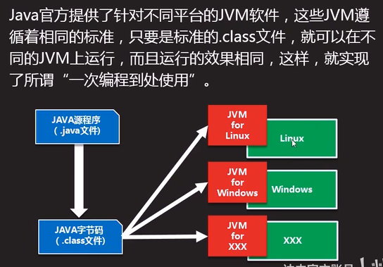
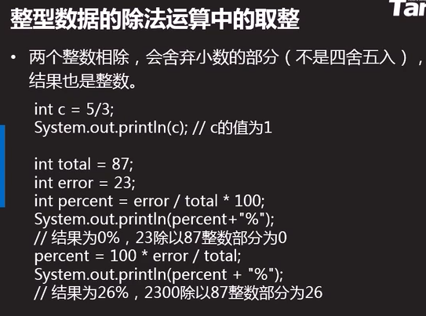
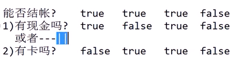
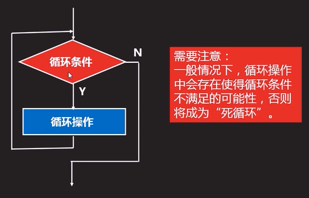
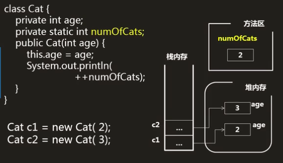

<p align = center><font size = 9>Java</font></p>

<p align = center>writen by Grant·Vranes</p>

---

课程来源https://www.bilibili.com/video/BV1RV41147yJ?from=search&seid=4932318903875319779

---

Code为代码文件夹，也为Eclipse工作目录

其下项目PartOne代表模块一-----------语言基础（7天）学习中的所有代码

PartTwo代表模块二-----------面向对象（10天）学习中的所有代码

---

- [Java语言基础（7天）+ 面向对象（10天）+ API（20天）](#java语言基础7天-面向对象10天-api20天)
- [Java语言基础](#java语言基础)
	- [1 课程前序(2021.2.18)](#1-课程前序2021218)
	- [2 Java编译运行过程](#2-java编译运行过程)
			- [每日练习：](#每日练习)
	- [3 变量 （2021.2.19）](#3-变量-2021219)
		- [1）声明](#1声明)
		- [2）初始化（第一次赋值）](#2初始化第一次赋值)
		- [3） 使用](#3-使用)
		- [4）命名](#4命名)
	- [4 基本数据类型（四类八种）](#4-基本数据类型四类八种)
	- [5 基本数据类型间的转换](#5-基本数据类型间的转换)
		- [两点规则](#两点规则)
		- [Scanner接受输入](#scanner接受输入)
	- [6 运算符和表达式（2021.2.20）](#6-运算符和表达式2021220)
		- [算数运算符（易混淆）](#算数运算符易混淆)
		- [关系运算符](#关系运算符)
		- [逻辑运算符（注意短路效果）](#逻辑运算符注意短路效果)
		- [赋值、字符串连接运算符](#赋值字符串连接运算符)
		- [三目运算符](#三目运算符)
		- [运算符经典案例（闰年的判断）](#运算符经典案例闰年的判断)
	- [7 分支结构](#7-分支结构)
	- [8 循环结构](#8-循环结构)
			- [循环问题定义](#循环问题定义)
			- [嵌套循环](#嵌套循环)
	- [9 数组](#9-数组)
		- [数组（上）](#数组上)
		- [数组（下）](#数组下)
		- [引用类型数组](#引用类型数组)
	- [10 方法(2021.2.21)](#10-方法2021221)
	- [阶段项目：猜字符小游戏](#阶段项目猜字符小游戏)
	- [脑图总结](#脑图总结)
- [面向对象（10天）](#面向对象10天)
	- [11 面向对象 （2021.2.22）](#11-面向对象-2021222)
		- [面向过程和面向对象](#面向过程和面向对象)
		- [什么是类？什么是对象？](#什么是类什么是对象)
		- [定义类的方法](#定义类的方法)
		- [创建对象](#创建对象)
		- [引用类型变量](#引用类型变量)
		- [访问对象的成员变量、调用方法](#访问对象的成员变量调用方法)
		- [创建类和对象实例](#创建类和对象实例)
		- [方法的签名](#方法的签名)
		- [方法的重载](#方法的重载)
		- [构造方法](#构造方法)
		- [this关键字](#this关键字)
		- [null和NullPointerException](#null和nullpointerexception)
		- [引用类型之间画等号](#引用类型之间画等号)
		- [引用类型数组（2021.2.28）](#引用类型数组2021228)
		- [继承](#继承)
		- [super](#super)
		- [综合例子](#综合例子)
		- [向上造型（2021.3.1）](#向上造型202131)
		- [方法的重写（override）：重新写、覆盖](#方法的重写override重新写覆盖)
		- [重写（override）与重载（overload）的区别(常见面试题)](#重写override与重载overload的区别常见面试题)
		- [package和import](#package和import)
		- [访问控制修饰符public/protected/private](#访问控制修饰符publicprotectedprivate)
		- [final关键字](#final关键字)
		- [static关键字（2021.3.3）](#static关键字202133)
		- [static final常量（2021.3.4）](#static-final常量202134)
		- [抽象方法和抽象类](#抽象方法和抽象类)
		- [成员内部类(2021.3.5)](#成员内部类202135)
		- [匿名内部类](#匿名内部类)
		- [](#)
	- [12 面向对象之射击游戏](#12-面向对象之射击游戏)
		- [射击游戏需求介绍（Project：MyShoot）](#射击游戏需求介绍projectmyshoot)
		- [射击游戏梗概](#射击游戏梗概)
			- [设计第1天](#设计第1天)
			- [设计第2天](#设计第2天)
			- [设计第3天](#设计第3天)
			- [设计第4天](#设计第4天)
			- [设计第5天](#设计第5天)
			- [设计第6天](#设计第6天)
			- [设计第7天](#设计第7天)
			- [设计第8天](#设计第8天)

---


# Java语言基础（7天）+ 面向对象（10天）+ API（20天）


# Java语言基础


## 1 课程前序(2021.2.18)

语言基础------多练

面向对象------多想

---

java：是一门计算机语言------------做程序/软件的（*淘宝/京东/饿了么/摩拜/银行系统/ATM机系统都是用Java开发*）


## 2 Java编译运行过程


- C语言编译过程

  

- Java语言编译过程

  ```java
  步骤：-------（面试题）
  1）.java源文件，经过编译，生成.class字节码文件
  2)JVM(虚拟机)加载.class并运行.class（0和1）
      
  假如QQ是用Java语言写的：
      java版的qq，经过编译，生成.class字节码文件
      Windows版的JVM---------运行在Windows上
      Linux版的JVM---------运行在Linux上
      IOS版的JVM---------运行在IOS上
      ？？？版的JVM---------运行在？？？上
      需要什么平台的qq只需要安装对应平台的JVM就行，不需要像C语言编写的QQ一样（要为每个平台都写一套qq系统）
      这个特性：跨平台，一次编程到处运行
  ```

  

  


- 涉及名词解释：-------常见面试题

  1) JVM : <u>java虚拟机</u>

  ​				加载.class并运行.class

  2) JRE : <u>java运行环境</u>--------运行Java程序的最小环境

  ​				除了包含JVM以外还包含运行java程序所必需的环境

  ​				JRE = JVM + java系统类库（小零件/小功能）

  3) JDK : <u>java开发工具包</u>----------开发Java程序的最小环境

  ​				除了包含JRE意外还包含开发java程序所必需的的命令工具

  ​				JDK = JRE+编译、运行等命令工具

  ---

  

  

  

- 配置环境变量---------了解（现在借助eclipse等工具可以不用配置）

  

  

  ```java
  配置三个东西：
      1)JAVA_HOME：指向jdk的安装目录,输入安装路径
      2)CLASSPATH：表示类的搜索路径，一般简写为(.)表示当前路径，写.
      3)PATH：指向jdk下的bin目录，一般写%JAVA_HOME%\bin
  -------------------
  配置方法：
  	1、右键点击【计算机】，选择【属性】，点击【高级系统设置】，打开环境变量设置；
      2、新建【JAVA_HOME】变量，并编辑【Path】变量；
      3、新建【Classpath】变量并编辑即可。
  -------------------
  检验方法：CMD中输入java和javac，有反应就说明成功。
  ```


- Eclipse简介

  

  

  

- 开发步骤

  1）新建java项目/工程--------------小区

  2） 新建java包------------------------楼+单元

  3）新建java类-------------------------房子


- 注释：解释性文本

  1）单行注释：//

  2）多行注释：/* */

  3）文档注释：/** */


- 第一个HelloWorld程序

  ```java
  package Y2021M2D18;//声明包
  public class HelloWorld_1 {//声明类
  	//主方法main，为程序的入口
  	//程序的执行从main开始，main结束则程序结束
  	public static void main(String[] args) {
          //输出
          //1)严格区分大小写
          //2)所有符号必须是英文模式
          //3)每句话必须以;结尾
  		System.out.println("Hello , 2021.2.18");
  	}
  }
  ```

  

- 命令行编译运行java程序

  - cd到对应目录，使用javac编译.java文件成字节码文件

    

  - 然后使用`java HelloWorld_1`

    

    ---

    :warning:注意：可能会遇到无法加载主类的问题，可以参考https://www.cnblogs.com/wangxiaoha/p/6293340.html

    

    

    ---

 #### 每日练习：

```java
1、简述Java编译及运行过程
    
2、名词解释JVM、JRE、JDK
    
3、下列关于Eclipse说法正确的是？ABCD
    A.在源文件编写的同时Ecplise会自动的调用Java编译器编译该文件，如果出现任何编译错误，Ecplise会立即发现，并提示给用户
    B.Ecplise中的Workspace是用于储存工程的路径
    C.Ecplise下载完成后，不需要特殊的安装，仅需解压即可
    D.Ecplise是开放源代码的Java开发平台
    
4、java实现helloworld
```


---


## 3 变量 （2021.2.19）

**变量就是指代在内存中开辟的存储空间，用于存放运算过程中需要用到的数据**

```java
int a = 5;
int b = 6;
int c = a + b;
```


### 1）声明


```java
int a;
int b,c,d;
```


### 2）初始化（第一次赋值）

```java
int a = 266;
int b;
b = 299;
```


### 3） 使用

- 对变量的操作就是对它所存储的数据的操作

- 变量的使用必须与数据类型匹配

- 变量在用之前必须声明并初始化

  

### 4）命名

```java
1） 只能包含字母、数字、_、$,并且不能以数字开头
2） 严格区分大小写
3） 不能使用关键字
4） 可以中文命名，但不建议
    建议用翻译成英文，忌用拼音
5）推荐使用驼峰命名法/帕斯卡命名法
    驼峰命名法：第一个单词小写，后面的单词首字母全大写
    帕斯卡命名法：所有单词首字母均大写
```


## 4 基本数据类型（四类八种）


```java
Java语言提供了八种基本类型。六种数字类型（四个整数型，两个浮点型），一种字符类型，还有一种布尔型。

byte：---------=1byte = 8 bit(位)
    byte 数据类型是8位、有符号的，以二进制补码表示的整数；
    最小值是 -128（-2^7）；
    最大值是 127（2^7-1）；
    默认值是 0；
    byte 类型用在大型数组中节约空间，主要代替整数，因为 byte 变量占用的空间只有 int 类型的四分之一；
    例子：byte a = 100，byte b = -50。
    
short：-----------=2byte = 16bit
    short 数据类型是 16 位、有符号的以二进制补码表示的整数
    最小值是 -32768（-2^15）；
    最大值是 32767（2^15 - 1）；
    Short 数据类型也可以像 byte 那样节省空间。一个short变量是int型变量所占空间的二分之一；
    默认值是 0；
    例子：short s = 1000，short r = -20000。
    
int：----------=4byte = 32bit
    int 数据类型是32位、有符号的以二进制补码表示的整数；
    最小值是 -2,147,483,648（-2^31）；
    最大值是 2,147,483,647（2^31 - 1）；
    一般地整型变量默认为 int 类型；
    默认值是 0 ；
    例子：int a = 100000, int b = -200000。
    
long：-----------=8byte = 64bit
    long 数据类型是 64 位、有符号的以二进制补码表示的整数；
    最小值是 -9,223,372,036,854,775,808（-2^63）；
    最大值是 9,223,372,036,854,775,807（2^63 -1）；
    这种类型主要使用在需要比较大整数的系统上；
    默认值是 0L；
    例子： long a = 100000L，Long b = -200000L。
    "L"理论上不分大小写，但是若写成"l"容易与数字"1"混淆，不容易分辩。所以最好大写。
    使用long类型后面必须要加L，否则认为是int类型
    ------******
    通过时间毫秒数来存储日期和时间
    JDK提供System.currentTimeMillis()方法，返回1970年1月1日零点到此时此刻所经历的毫秒数，其数据类型为long，该方法经常用于计时操作。
    long time = System.currentTimeMillis();
	System.out.println(time);
	
float：----------=4byte = 32bit
    float 数据类型是单精度、32位、符合IEEE 754标准的浮点数；
    float 在储存大型浮点数组的时候可节省内存空间；
    默认值是 0.0f；
    使用float后面必须加上F/f，否则认为是double类型
    浮点数不能用来表示精确的值，如货币；
    例子：float f1 = 234.5f。
    
double：-----------=8byte = 64bit
    double 数据类型是双精度、64 位、符合IEEE 754标准的浮点数；
    浮点数的默认类型为double类型；
    double类型同样不能表示精确的值，如货币；
    默认值是 0.0d；
    例子：double d1 = 123.4。
    
boolean：-----------=1byte = 8bit
    boolean数据类型表示一位的信息；
    只有两个取值：true 和 false；
    这种类型只作为一种标志来记录 true/false 情况；
    默认值是 false；
    例子：boolean one = true。
    
char：-----------=2byte = 16bit
    char类型是一个单一的 16 位 Unicode 字符；
    最小值是 \u0000（即为 0）；
    最大值是 \uffff（即为65、535）；
    char 数据类型可以储存任何字符；
    特殊符号需要用\来转义
    例子：char letter = 'A';。
        char ch = '';//编译错误，不允许空字符
```





---

**判断编译错误和溢出**

```java
直接量超范围是编译错误
运算时超范围为溢出，溢出不是错误，但要避免
    int a = 10000000000;   //百亿，直接量超范围，编译错误
	int a = 1000000000*10; //十亿*10，运算时超范围，为溢出
```

---


```java
double a = 3, b = 2.9;
System.out.println(a-b); //0.100000000000000009
```

---


## 5 基本数据类型间的转换

基本数据类型从小到大依次为

​	byte,short,int/char,long,float,double,

两种方式：

1） 自动类型转换：小类型到大类型（不会溢出和丢失精度）

2）强制类型转换：大类型到小类型（强转有可能溢出或丢失精度）

```java
//基本数据类型间的转换：
		int a = 5;
		long b = a;//自动类型转换
		int c = (int)b;//强制类型转换
		
		long d = 5;//自动类型转换
		double e = 5;//自动类型转换
		System.out.println(e);//5.0
		
		long f = 10000000000L;
		int g = (int)f;
		System.out.println(g);//强转有可能溢出
		
		double h = 25.8716;
		int i = (int)h;
		System.out.println(i);//强转有可能丢失精度
```

---

### 两点规则

1）整数直接量可以直接赋值给byte，short，char，但不能超出范围

```java
byte b1 = 5;
byte b2 = 98;//错误超范围
```

2）byte，short，char型数据参与运算时，先一律转换为int再运算（重要）

```java
byte a1 = 5;
byte a2 = 6;
byte sum = (byte)(a1+a2);//因为a1,a2参与运算时转换成了int进行运算，最后int->byte大类型转小类型需要用强制类型转换

System.out.println(2+2);//4
System.out.println('2' + '2');//100，char类型转换为对应的int值后进行运算，'2'的码为50
System.out.println('我' + '们');//45309，汉字也同理
```


---


---

### Scanner接受输入

给变量赋值方法：

1）赋一个固定的值：

​		`int a = 5;`

2）接收用户输入的值：-----------Scanner

​		a）导入`import java.util.Scanner;`

​		b）main方法中`Scanner scan = new Scanner(System.in);`

​		c）`数据类型 变量名 = Scanner类对象名.方法();`

```java
import java.util.Scanner;//1
public class Demo_7 {
	public static void main(String[] args) {
		Scanner scan = new Scanner(System.in);//2
		System.out.println("请输入年龄：");
		int age = scan.nextInt();//3
		System.out.println("我输入的值：" + age);
	}
}
```
3）系统随机的值:

​		`int a = ?;`


## 6 运算符和表达式（2021.2.20）


### 算数运算符（易混淆）

```java
/*
		 * 1.算数运算符：+，-，*，/，%，++，--
		 * 		1）%：取模/取余运算，余数为0即为整除
		 * 		2）++/--：自增1/自减1，可在变量前也可在后
		 * 			a）单独使用时，在前在后都一样
		 * 			b）被使用时，在前在后不一样
		 * 				a++的值为a
		 * 				++a的值为a+1			
		 * 	
		 */
		//++/--单独使用
		int a = 5, b = 5;
		a++;//相当于a = a + 1;
		++b;//相当于b = b + 1;
		System.out.println(a);//6
		System.out.println(b);//6
		
		//++/--被使用
		int c = 5, d = 5;
		//1）将c++的值5赋值给e
		//2）c自增1变成6
		//---先用后加---
		int e = c++;
		//1）++d先自增1变成6
		//2）将++d的值6赋值给f
		//---先加后用---
		int f = ++d;
		System.out.println(c);//6
		System.out.println(d);//6
		System.out.println(e);//5
		System.out.println(f);//6

		int g = 5, h = 5;
		System.out.println(g++);//5
		System.out.println(g);//6
		System.out.println(++h);//6
		System.out.println(h);//6
```


### 关系运算符


```java
int a=5, b=10,c=5;
boolean end = a>b;
System.ouot.println(end);//false
```


### 逻辑运算符（注意短路效果）


> &&：逻辑与（并且），两边都为真则真，见false则false
>
> ​			------若第一个数为false，则发生短路（后面不执行）
>
> ||：逻辑或（或者），有一边为真则为真，见true则true
>
> ​			------若第一个数为true，则发生短路（后面不执行）
>
> ！：逻辑非（取反），！true = false  ，  ！false = true
>
> **逻辑运算是建立在关系运算的基础之上的，逻辑运算的结果为boolean类型**
>
> ```java
> 	逻辑运算符的短路效果	
> 		int a = 5, b = 10, c = 5;
> 		boolean enp = a>b && c++>2;
> 		System.out.println(enp);//false
> 		System.out.println(c);//5,发生短路
> 		
> 		int a1 = 5, b1 = 10, c1 = 5;
> 		boolean enp1 = a<b || c1++>2;
> 		System.out.println(enp1);//true
> 		System.out.println(c1);//5,发生短路
> ```





### 赋值、字符串连接运算符

- 赋值

  

```java
1）简单赋值运算符：=
2）扩展赋值运算符：+=,-=,*=,/=,%/
    ----自带强转换
    a *= 2 相当于a = a*2;

---
常见面试题
    short s = 5;
	s += 10;//相当于s = (short)(s+10);ok的
	s = s + 10;//报错，因为byte，short，char型数据参与运算时，先一律转换为int再运算，而s+10就是int类型了不能赋值给short类型的s
	
```


- 字符串连接运算符

  ```java
  1）若两边为数字，则作加法运算
  2）若两边出现了字符串，则作字符串连接
      
      System.out.println(10+20+""+30);//3030(String)
  	System.out.println(""+10+20+30);//102030(String)
  	System.out.println(10+20+30+"");//60(String)
  ```

  

### 三目运算符

```java
1)语法
    (boolean判断表达式)?值1:值2;
2)执行过程
    计算表达式的值：
    	true，整个表达式的值为值1
    	false，整个表达式的值为值2
    
int a = 5;
int flag = a>0 ? 1:-1;
System.out.print(flag);//1
```


### 运算符经典案例（闰年的判断）

```java
/**
	 * 闰年的判断
	 * 判断公式：
	 * 1）能被4整除，并且，不能被100整除
	 * 或者
	 * 2）能被400整除
	 */
	public static void main(String[] args) {
		Scanner scan = new Scanner(System.in);
		System.out.println("输入年份");
		int year = scan.nextInt();
		boolean flag = (year%4==0 && year%100 != 0) || year%400==0;
		String str = flag ? year+"是闰年" : year+"不是闰年";
		System.out.println(str);
	}
```


## 7 分支结构

> 任何复杂的程序逻辑都可以通过三种结构来实现
>
> 1）顺序结构：从上往下逐行执行，每一句都执行
>
> 2）分支结构：有条件的执行某语句，并非每句必走
>
> 3）循环结构

> 分支结构
>
> 1）if ：满足条件执行，不满足不执行
>
> ```java
> if (逻辑表达式) {
>  	语句1;
>     ……
> }
> ```
>
> 
>
> 
>
> 2）if……else：满足条件执行，不满足执行其他的
>
> ```java
> if (逻辑表达式) {
>  	语句1;
>     ……
> } else {
>     语句1;
>     ……
> }
> ```
>
> 
>
> 
>
> 3) switch……case：整数判断首选
>
> ​	优点：效率高、结构清晰
>
> ​	缺点：整数、相等
>
> ```java
> int num = 2;
> switch(num){//括号中的数据类型只能是byte,short,int,char,String(JDK1.7开始就可以)
>     case 1://相当于if(num == 1)
>         System.out.println(111);
>         break;
>     case 2:
>         System.out.println(222);
>         break;
>     default:
>         System.out.println("NULL");
> }
> ```
>
> 


## 8 循环结构

> 有条件的执行某语句多次，并非每句必走
>
> 
>
> 
>
> 
>
> 循环三要素：
>
> 1）循环变量的初始化（循环变量：在整个循环过程中所反复改变的那个数）
>
> 2）循环的条件（以循环变量为基础）
>
> 3）循环变量的改变（向着循环的结束变）

> 
>
> - while循环：先判断后执行
>
> ```java
> while(boolean){
>     语句块;
> }
> //break用在循环体中用于跳出循环
> 
> //while循环经典案例：猜数字
> import java.util.Scanner;
> public class Demo_7 {
> 	public static void main(String[] args) {
> 		//while循环经典案例：猜数字游戏
> 		Scanner scan = new Scanner(System.in);
> 		int number = (int)(Math.random()*100+1);
> 		int guess = scan.nextInt();
> 		while(guess != number) {
> 			if(guess > number) {
> 				System.out.println("过大");
> 			} else {
> 				System.out.println("过小");
> 			}
> 			guess = scan.nextInt();
> 		}
> 		System.out.println("恭喜你猜对了，number="+number);
> 	}
> }
> 
> //Math.random():生成随机数0.0到0.999999999……
> ```
>
> 
>
> 
>
> - do……while循环：先执行后判断，用于处理循环逻辑
>
>   
>
>   ```java
>   do{
>       语句块;
>   }while(boolean);
>   //要素1与要素3相同时，首选
>   ```
>
> 
>
> - for循环
>
>   ```java
>   //死循环
>   for(;;){
>       语句块;
>   }
>   ---
>   /*for循环经典案例：随机加法运算器
>       1）程序一次出10道加法题目，由用户输入题目的答案
>       2）用户每答完一道题，程序判断对错，并提示“答对”或“答错”
>       3）10道题目答完之后，系统计算得分并输出
>       4）希望用户提前结束，可以输入-1提前退出
>       */
>   		Scanner scan = new Scanner(System.in);
>   		int score = 0;
>   		for (int i = 1; i <= 10; i++) {
>   			//1、出题		2、答题	3、判题
>   			int a = (int)(Math.random()*100);
>   			int b = (int)(Math.random()*100);
>   			int result = a + b;
>   			System.out.print("("+i+")"+a+"+"+b+"=");
>   			
>   			int answer = scan.nextInt();
>   			
>   			if(answer == -1) {
>   				break;
>   			}
>   			if(answer == result) {
>   				score += 10;
>   				System.out.println("right");
>   			}else {
>   				System.out.println("wrong");
>   			}
>   		}
>   		System.out.println("得分为"+score);
>   	}
>   ```
>
>   
>
>   


#### 循环问题定义


#### 嵌套循环

```java
1）循环中嵌套循环，一般多行多列时使用，外层控制行，内层控制列
2）执行过程：外层循环走一次，内层循环走多次
3）建议：嵌套层数越少越好，能一不二，能二不三，若需求必须三层嵌套循环才能解决，说明设计有问题
4）break只能跳出一层循环

//九九乘法表
		for(int i = 1; i <= 9; i++) {
			for(int j = 1; j <= i; j++) {
				System.out.print(j+"x"+i+"="+(i*j)+"\t");
			}
			System.out.println();
		}
```


## 9 数组

### 数组（上）


> 程序 = 算法 + 数据结构
>
> 【算法】：解决问题的流程/步骤（顺序、分支、循环）
>
> 【数据结构】：将数据按照某种特定的结构来保存(数怎么存)
>
> ----设计良好的/合理的数据结构会导致好的算法，先设计【数据结构】，然后设计算法


> **数组：**
>
> 1）是一种数据类型（引用类型）
>
> 2）相同数据类型元素的集合
>
> 3）数组的定义
>
> 
>
> ```java
> int a;//声明整型变量a
> int[] b;//声明整型数组变量b
> int[] c = new int[5];//声明整型数组变量c，包含10个元素，默认值为0
> ```
>
> 4）数组的初始化
>
> 
>
> ```java
> int[] arr = new int[4];//0,0,0,0
> int[] arr = {3,5,7,9};
> int[] arr = new int[]{3,5,7,9};
> ----
> int[] arr;
> arr = {3,5,7,9};//编译错误，此方式必须声明同时初始化
> arr = new int[]{3,5,7,9};//正确
> ```
>
> 5）数组的访问
>
> ​	a）`数组名.length`可以获取数组长度（元素的个数）
>
> ​	b）通过下标/索引来访问数组中的元素（下标从0开始到最大【数组长度-1】）
>
> ​	
>
> 6）数组的遍历
>
> ​	

```java
//数组案例：找出数组中的最大值
int[] arr = new int[10];
for(int i = 0; i < arr.length; i++) {
	arr[i] = (int)(Math.random()*100);
	System.out.print(arr[i] + " ");
}
		
int max = arr[0];
for(int i = 1; i < arr.length; i++) {
	if(arr[i] > max) {
		max = arr[i];
	}
}
System.out.println("\n"+max);
```


### 数组（下）


> - 数组的复制：
>
> 1) `System.arraycopy()`
>
> ```java
> //数组的复制
> 		int[] a = {10,20,30,40,50};
> 		int[] a1 = new int[6];
> 		System.arraycopy(a,1,a1,0,4);
> 		/*
> 		 * a:源数组
> 		 * 1:源数组的起始下标
> 		 * a1:目标数组
> 		 * 0:目标数组的起始下标
> 		 * 4:要复制的元素个数
> 		 */
> 		for(int v : a1) {
> 			System.out.print(v+"\t");
> 		}
> //20	30	40	50	0	0
> ```
>
> 
>
> 2)`Arrays.copyOf()`
>
> ```java
> 		int[] a = {10,20,30,40,50};
> 		int[] a2 = Arrays.copyOf(a, 8);//效率低，灵活性差
> 		/*
> 		 * a:源数组
> 		 * a2:目标数组
> 		 * 8:目标数组长度
> 		 */
> 		for(int v:a2) {
> 			System.out.print(v+"\t");
> 		}
> //10	20	30	40	50	0	0	0
> //此方法效率低，灵活性差，但是常用于数组的扩容和缩容
> //注意：扩容/缩容的本质是创建了一个新的数组并将源数组复制过去，不是在原来的数组上增加或减少
> arr = Arrays.copyOf(arr,arr.length+1);
> ```
>
> 
>
> 
>
> ---
>
> - 数组的排序
>
>   ```java
>   JDK提供的Arrays.sort();最快
>       long start = System.currentTimeMillis();//sort开始排序
>   	Arrays.sort(arr);
>   	long end = System.currentTimeMillis();//sort结束排序
>   	System.out.println(end-start);
>   ----    
>   //冒泡排序(特点)：
>       1)n个数冒n-1轮
>       2)每一轮都是从第一个元素开始冒
>       3)冒出来的数不参与下一轮冒泡
>       ---
>       int[] arr = {67,23,4,56};
>   	for(int i = 0; i < arr.length-1; i++) {//控制轮数
>   		for(int j = 0; j < arr.length-1-i;j++) {//控制次数,i每加一轮，一轮中的比较次数少一次
>   			if(arr[j]>arr[j+1]) {
>   				int temp = arr[j];
>   				arr[j] = arr[j+1];
>   				arr[j+1] = temp;
>   			}
>   		}
>   	}
>   	for (int v:arr) {
>   		System.out.print(v+"\t");
>   	}
>   ```
>
>   
>
>   


### 引用类型数组


```java
引用类型各种使用情况
1)
    Student[] stus = new Student[3];//创建Student数组对象
    stus[0] = new Student("zs",12,"asd");
    stus[1] = new Student("ls",19,"asd");
    stus[2] = new Student("wu",17,"asd");
2)
    Student[] stus = new Student[]{
        new Student("zs",12,"asd"),
        new Student("ls",19,"asd"),
        new Student("wu",17,"asd")
    };
3)
    int[][] arr = new int[3][];
    arr[0] = new int[4];
    arr[1] = new int[4];
    arr[2] = new int[4];
4)
    int[][] arr = new int[3][];
	for(int i = 0; i < arr.length; i++){
		for(int j = 0; j < arr[i].length; j++){
            arr[i][j] = (int)(Math.random()*10);
        }
    }
```


## 10 方法(2021.2.21)


> - 方法:
>
>   
>
>   1)封装一段特定的业务逻辑功能
>
>   2)尽可能的独立，一个方法只干一件事
>
>   3) 反复调用多次
>
>   4)可以减少代码重复，有利于代码的维护，有利于团队协作
>
> ---
>
> - 方法的定义与调用
>
>   
>
>   > 方法可以有返回值(返回值类型)，也可以没有返回值(void)
>   >
>   > 方法可以有参数也可以没有参数--------（有参可以使方法更灵活）
>   >
>   > ```java
>   > 	public static void main(String[] args) {
>   > 		say();
>   > 		say("Grant");//实参（实际参数）
>   > 		System.out.println(getNum());
>   > 		System.out.println(getNum(89.2));//实参（实际参数）
>   > 	}
>   > 	
>   > 	//无参无返回值
>   > 	public static void say() {
>   > 		System.out.println("Java_Flag");
>   > 	}
>   > 	
>   > 	//有参无返回值
>   > 	public static void say(String name) {//形参（形式参数）
>   > 		System.out.println(name + " is the Learner");
>   > 	}
>   > 	
>   > 	//无参有返回值
>   > 	public static double getNum() {
>   > 		return 89757.8;
>   > 	}
>   > 	
>   > 	//有参有返回值
>   > 	public static double getNum(double number) {//形参（形式参数）
>   > 		return number;
>   > 	}
>   >     
>   > ```
>   >
>   > ---
>   >
>   > return 值;	1)结束方法的执行 2)返回结果给调用方--------用在有返回值的方法中
>   >
>   > return;	1)结束方法的执行-----------用在无返回值的方法中(void)
>   >
>   > 
>   >
>   > ```java
>   > public static void fun(double num){
>   >     if(num > 60){
>   >         return;
>   >     }
>   >     System.out.println("---");
>   > }
>   > ```


## 阶段项目：猜字符小游戏

```java
目的：
    1)对前面几天知识熟练掌握
    2)了解开发一个程序的步骤
    猜字符游戏：
    1.设计数据结构
    	1)char[] chs;//待猜随机字符数组
		2)char[] input;//输入
		3)int letterRight;//字符对的个数
		4)int position;//位置对的个数
		5)int[] result;//对比结果
		6)int score;//得分
    2.设计程序结构：方法
        1)main();//主方法
		2)public static char[] generate(){//生成随机数组
            char[] chs = new char[5];
            ...
            return chs;
          }
		3)public static int[] check(char[] chs,char[] input){
            //对比：随机数组chs与用户输入的字符数组input
            int[] result = new int[2];
            ...
            return result;
          }
    3.设计算法:方法体
---
import java.util.Scanner;
public class Demo_2 {
    //main方法
	public static void main(String[] args) {
		Scanner scan = new Scanner(System.in);
		char[] chs = generate();//获取待猜的随机数组
		while(true) {
			System.out.println("please guess");
			String str = scan.next().toUpperCase();//小写转大写
			if(str.equals("EXIT")) {//退出
				System.out.println("exit");
				break;
			}
			char[] input = str.toCharArray();
			int[] result = check(chs,input);
			int wrongCount = 0;//猜错次数
			if(result[0] == chs.length) {//对
				int score = 100*chs.length-10*wrongCount;//
				System.out.println("恭喜,得分:"+score);
			}else {
				wrongCount++;
				System.out.println("字符对个数:"+result[1]+" 位置对个数:"+result[0]);
			}
		}
	}
	
	//生成随机数组的generate()方法
	public static char[] generate() {
		char[] chs = new char[5];//随机字符数组
		char[] letters = new char[] {'A','B','C','D','E','F'
				,'G','H','I','J','K','L','M','N','O','P','Q'
				,'R','S','T','U','V','W','X','Y','Z'};
		boolean[] flags = new boolean[letters.length];//开关数组，标记已被随机选出的字符
		for(int i = 0; i < chs.length; i++) {
			int index;
			do {
				index = (int)(Math.random()*letters.length);//随即下标（0，25）
			}while(flags[index]);//当为true说明这个字符已经生成过，重新生成
			chs[i] = letters[index];//将随机出来的一个字符存入chs
			flags[index] = true;//将选出的数组标记为true，下次不能再选
		}
		return chs;
	}
	
	//对比方法check()：随机数组chs与用户输入的字符数组input
	public static int[] check(char[] chs,char[] input){
        int[] result = new int[2];//result[0]为位置答对计数，result[1]为字符答对计数
        for(int i = 0; i < chs.length; i++) {
        	for(int j = 0; j < input.length; j++) {
        		if(chs[i] == input[j]) {//字符对
        			result[1]++;
        			if(i == j) {//位置对
        				result[0]++;
        			}
        			break;//找到了对应的，剩下input不在参与
        		}
        	}
        }
        return result;
     }
}
```


## 脑图总结

https://gitee.com/Grantr/java_-flag/tree/master/Mind_images


# 面向对象（10天）

## 11 面向对象 （2021.2.22）

> OO:面向对象
>
> OOA:面向对象分析
>
> OOD:面向对象设计
>
> OOAD:面向对象分析和设计
>
> OOP:面向对象编程
>
> ---
>
> 好质量的代码：
>
> ​	复用性好、扩展性好、维护性好、可以执行好、健壮性好、可读性好、效率高 
>
> ---
>
> 
>
> 


### 面向过程和面向对象


###  什么是类？什么是对象？

>1）现实世界是由很多对象组成（基于对象抽出了类）
>
>2）对象：真实存在的单个的个体
>
>​	  类：类别/类型，代表一类个体
>
>3）类中包含：
>
>​		a)所有对象所共有的属性/特征-------------变量
>
>​		b)所有对象所共有的行为--------------------方法
>
>4）一个类可以创建多个对象（同一类型创建的对象，结构相同，数据不同）
>
>5）类是对象的模板，对象是类的具体的实例


### 定义类的方法


### 创建对象


```java
创建对象
    Student          stu1            =      new Student();
    类（数据类型）   引用（引用类型变量）  指向     对象
```


### 引用类型变量


### 访问对象的成员变量、调用方法


### 创建类和对象实例

```java
如何创建类？如何创建对象？如何访问成员？
//学生类
public class Student {
	//成员变量
	String name;
	int age;
	String address;
	//方法
	void sayHi() {
		System.out.println("姓名:"+name+" 年龄:"+age+" 地址:"+address);
	}
}

//测试学生类
public class StudentTest {
	public static void main(String[] args) {
		Student stu1 = new Student();
		stu1.name = "Grant";
		stu1.age = 19;
		stu1.address = "湖北孝感";
		stu1.sayHi();
	}
}
```


### 方法的签名


### 方法的重载

> 1)发生在一个类中，方法名称相同，参数列表不同，方法体不同
>
> 2)编译器在编译时根据方法的签名自动绑定调用的方法
>
> ```java
> //重载演示
> /*
>  * 1)同一个文件中，可以包含多个类
>  * 2)public修饰的类只能有一个
>  * 3)public修饰的类必须与文件名相同
>  */
> public class OverloadBemo {
> 	public static void main(String[] args) {
> 		Aoo a = new Aoo();
>         a.say();
>         a.say("nice");
> 	}
> }
> 
> class Aoo{
> 	void say() {}
> 	void say(String name) {}
> 	void say(int age) {}
> 	//int say(){return 1;}//编译错误，重载与返回值没有关系
> 	//void say(String address){}//编译错误，重载与参数名称无关
> }
> ```
>
> 


### 构造方法


> 在类中除了成员方法之外,还存在一种特殊类型的方法,就是构造方法。构造方法是一个与类名同名的方法，对象的创造就是通过构造方法完成的，每当类实例化一个对象时，类就会自动调用构造方法。构造方法有如下特点
>
> 1) 作用就是给成员变量赋值
>
> 2) 与类同名，没有返回值类型
>
> 3) 在创建(new)对象时被自动调用
>
> 4) 若自己不写构造方法，则默认一个无参构造方法
>
> ​	若自己写了构造方法，则不再默认提供了，如果再调用无参构造方法就会编译错误，可以自己加上一个无参的构造方法
>
> 5) 构造方法可以重载
>
> 6) 没有任何返回类型 即使是void 空返回也不行
>
> 注意：在定义构造方法是,构造方法是没有返回值的,但这与普通方法没有返回值是不一样的。普通没有返回值的方法使用 public void methodEx(){} 这种形式来定义,但构造方法并不需要void关键字来修饰.
>
> ```java
> //构造方法的演示
> public class structDemo {
> 	public static void main(String[] args) {
> 		Stu s1 = new Stu("Grant",19,"湖北孝感");
>         s1.show();
> 	}
> }
> 
> class Stu{
> 	String name;
> 	int age;
> 	String address;
> 	//构造方法
> 	Stu(String name1, int age1, String address1) {
> 		name = name1;
> 		age = age1;
> 		address = address1;
> 	}
> 	void show() {
> 		System.out.println("姓名:"+name+" 年龄:"+age+" 地址:"+address);
> 	}
> }
> ```
>


### this关键字

- [x] 只能用在方法中，在方法中访问成员变量之前默认有个this

- [x] 指代当前对象，哪个对象调用方法指的就是哪个对象

- [x] 当局部变量和成员变量同名时，this不能省略，不然就会出现指代不明的状况，如下

  

```java
public class structDemo {
	public static void main(String[] args) {
		Stu s1 = new Stu("Grant",19,"湖北孝感");
		s1.show();
	}
}

class Stu{
	String name;//成员变量
	int age;
	String address;
	//构造方法
	Stu(String name, int age, String address) {//局部变量：成员变量和局部变量可以同名，但此时this关键字不可以省略
		this.name = name;//s1.name = "Grant"
		this.age = age;
		this.address = address;
	}
	void show() {
		System.out.println("姓名:"+this.name+" 年龄:"+this.age+" 地址:"+this.address);
	}
}
-------------------------------
this使用方法
    1)this.成员变量名---------------访问成员变量
    2)this.方法名()----------------调用方法（一般不用）
    3)this()----------------------调用构造方法（常用）
class Student {
	String name;
	int age;
	String address;
    Student(String name){
        this(name,0,null);//调用构造方法，相当于Stu(name,0,null)
        //this(name,0,"暂无");
    }
    Student(String name, int age){
        this(name,age,null);
    }
	Stu(String name, int age, String address) {
		this.name = name;//s1.name = "Grant"
		this.age = age;
		this.address = address;
	}
}
```


### null和NullPointerException

> 内存管理：由JVM来管理的
>
> 1) 堆：new出来的对象（包括对象中所有成员变量）
>
> 2) 栈：存储局部变量（包含方法的参数）
>
> 3) 方法区：存储.class字节码文件
>
> ```java
> /*
> 堆：Aoo对象，a
> 栈：o，b，c （main方法里也是局部变量，所以栈区有o）
> 方法区：Aoo.class文件，show()
> */
> public static void main(String[] args){
> 	Aoo o = new Aoo();
>     o.show(8);
> }
> class Aoo{
>     int a;
>     void show(int b){
> 		int c = 5;
>     }
> }
> ```
>
> 
>
> 

> null：空，没有指向任何对象
>
> ​		若引用的值为null，则该引用不能再进行任何操作了
>
> ​		若操作则发生NullPointerException空指针异常
>
> 


### 引用类型之间画等号

> **引用类型之间画等号：**
>
> 1）指向同一个对象
>
> 2）通过一个引用对数据的修改会影响另一个引用对数据的访问
>
> **基本类型之间画等号**
>
> 1）赋值
>
> 2）对一个变量的修改不会影响另一个变量
>
> 
>
> ```java
> Student zs= new Student();
> Student zss = zs;//实质上是把zs在栈区中的地址赋值给zss
> //两者都是引用类型Student，属于引用类型划等号
> ```


### 引用类型数组（2021.2.28）


> 引用类型数组
>
> ```java
> 1)
> Student[] stus = new Student[2];//创建Student数组对象
> stus[0] = new Student("zhangsan",25,"LF");//创建Student对象
> stus[1] = new Student("lisi",21,"sh");
> ---
> 2)
> Student[] stus = new Student[]{
> 	new Student("zhangsan",25,"LF"),
>     new Student("lisi",21,"sh")
> };
> ---
> 3)
> int[][] arr = new int[3][];
> arr[0] = new int[4];
> arr[1] = new int[4];
> arr[2] = new int[4];//三行四列
> ---
> 4)如果每个数组元素的长度相同，可采用如下方式声明
> int[][] arr = new int[3][4];
> for(int i = 0; i < arr.length; i++){
> 	for(int j = 0; j < arr[i].length; j++){
> 		arr[i][j] = (int)(Math.random()*100);
>     }
> }
> ```


### 继承


> 1) 作用：代码的复用
>
> 2) 通过extends来实现继承
>
> 3) 超类:所有派生类所共有的属性和行为
>
> ​	派生类/子类：派生类所特有的属性的行为
>
> 4) 派生类继承超类后，派生类具有：派生类+超类的
>
> 5) 一个超类可以有多个派生类
>
> ​	一个派生类只能有一个超类--------单一继承
>
> 6) 继承具有传递性
>
> 7) java规定：构造派生类之前必须构造超类
>
> ​	
>
> ```java
> class Person{-------------------超类
> 	String name;
>  int age;
>  String address;
>  void eat(){}
>  void sleep(){}
> }
> class Teacher extends Person{-----------派生类
>  double salary;
>  void teach(){}
> }
> ----------------
> //继承具有传递性
> class Aoo{-------------------a
> 	int a;
> }
> class Boo extends Aoo{-------b,a
> 	int b;
> }
> class Coo extends Boo{-------c,b,a
> 	int c;
> }
> ```


### super

> super:指代当前对象的超类对象
>
> super的用法：
>
> 1) super.成员变量---------------------访问超类的成员变量
>
> 2) super.方法名()----------------------调用超类的方法
>
> 3) super()--------------------------------调用超类的构造方法（参见继承章节的第7点）
>
> java规定：构造派生类之前必须构造超类
>
> ​	在派生类的构造方法中若没有调用超类的构造方法
>
> ​	---------------------则默认super()调用超类的无参构造方法
>
> ​	在派生类的构造方法中若调用了超类的构造方法
>
> ​	---------------------则不再默认提供
>
> ​	注意：super()调用超类构造必须位于派生类构造的第一行
>
> ```java
> package Y2021M2D28;
> //super演示
> public class SuperDemo {
> 	public static void main(String[] args) {
> 		Boo b = new Boo();
>         //输出结果
>         //超类的构造方法
> 		//派生类的构造方法
> 	}
> }
> class Aoo{
> 	Aoo(){
> 		System.out.println("超类的构造方法");
> 	}
> }
> 
> class Boo extends Aoo{
> 	Boo(){
> 		System.out.println("派生类的构造方法");
> 	}
> }
> ---
> class Coo{
> 	Coo(int a){}//一旦写了有参构造，系统不会再提供无参构造
> }
> 
> class Doo extends Coo{
> 	/*
> 	 * 如下代码为默认，写不写都在
> 	 * Doo(){
> 	 * 	super();//调用超类的无参构造，超类都没有无参构造了，调不着定然报错
> 	 * }
> 	 */
> 	Doo(){
> 		super(5);
> 	}
> }
> ```


### 综合例子

```java
1、创建Person类，包含：
    1)成员变量：name,age,address
    2)构造方法Person(3个参数){}
	3)方法：sayHi(){输出3个数据}
2、创建Student类，继承Person，包含：
    1)成员变量：stuId
    2)构造方法：Student(4个参数){}
	3)重写方法：sayHi(){输出4个数据}
3、创建Teacher类，继承Person,包含：
    1)成员变量：salary
    2)构造方法：Teacher(4个参数){}
	3)重写方法：sayHi(){输出4个数据}
4、创建Doctor类，继承Person，包含：
    1)成员变量：level
    2)构造方法：Doctor(4个参数){}
5、创建Test类，main中：
    1)创建Student数组ss，填充数据，遍历问好
    2)创建Teacher数组ts，填充数据，遍历问好
    3)创建Doctor数组ds，填充数据，遍历问好
    

public class Person {
	String name;
	int age;
	String address;
	Person(String name,int age,String address){
		this.name = name;
		this.age = age;
		this.address = address;
	}
	void sayHi() {
		System.out.println(name+"向你问好");
	}
}
----

public class Student extends Person {
	//成员变量
	String stuId;
	//构造方法
	public Student(String name,int age,String address,String stuId){
		super(name,age,address);
		this.stuId = stuId;
	}
    public void sayHi(){
        System.out.println(name+" "+age+" "+address+" "+stuId);
    }
	
}
----

public class Teacher extends Person {
	double salary;
	Teacher(String name, int age, String address, double salary){
		super(name,age,address);
		this.salary = salary;
	}
     public void sayHi(){
        System.out.println(name+" "+age+" "+address+" "+salary);
    }
}
----

public class Doctor extends Person{
	int level;
	public Doctor(String name,int age,String address,int level) {
		super(name,age,address);
		this.level = level;
	}
}
----

public class Test {
	public static void main(String[] args) {
		Student[] ss = new Student[] {
				new Student("1",19,"湖北","A1608"),
				new Student("2",21,"湖北","A1609"),
				new Student("3",20,"湖北","A1608")
		};
		for(Student v : ss) {
			v.sayHi();
		}
		
		Teacher[] ts = new Teacher[] {
				new Teacher("1",19,"湖北",9800),
				new Teacher("2",21,"湖北",8900),
				new Teacher("3",20,"湖北",10000)
		};
		for(Teacher v : ts) {
			v.sayHi();
		}
		
		Doctor[] ds = new Doctor[] {
				new Doctor("1",19,"湖北",1),
				new Doctor("2",21,"湖北",2),
				new Doctor("3",20,"湖北",3)
		};
		for(Doctor v : ds) {
			v.sayHi();
		}
	}
}

```


### 向上造型（2021.3.1）

1）超类型的引用指向派生类的对象

2）能点出来什么，看引用的类型(超类)，意思是只能访问引用类型中的变量和方法

好处依然是减少重复

```java
Person p1 = new Student();//向上造型
Person p1 = new Teacher();
---
package Y2021M3D1;
//向上造型演示
public class UploadDemo {
	public static void main(String[] args) {
		Aoo o1 = new Boo();
		o1.a = 1;
		o1.show();
		//o1.b = 1;//报错，向上造型的对象不能访问派生类的方法和变量
		//o1.test();
	}
}

class Aoo{
	int a;
	void show() {}
}

class Boo extends Aoo{
	int b;
	void test() {}
}
---
向上造型实例
package Y2021M3D1;
import Y2021M2D28.*;//导入另一个包中的所有内容
//向上造型的应用
public class Test {
	public static void main(String[] args) {
		//上一节综合例子中的类，修改为向上类型的应用
		/*
		Student[] ss = new Student[] {
				new Student("1",19,"湖北","A1608"),
				new Student("2",21,"湖北","A1609"),
				new Student("3",20,"湖北","A1608")
		};
		for(Student v : ss) {
			v.sayHi();
		}
		
		Teacher[] ts = new Teacher[] {
				new Teacher("1",19,"湖北",9800),
				new Teacher("2",21,"湖北",8900),
				new Teacher("3",20,"湖北",10000)
		};
		for(Teacher v : ts) {
			v.sayHi();
		}
		
		Doctor[] ds = new Doctor[] {
				new Doctor("1",19,"湖北",1),
				new Doctor("2",21,"湖北",2),
				new Doctor("3",20,"湖北",3)
		};
		for(Doctor v : ds) {
			v.sayHi();
		}
		*/
		
		Person[] ps = new Person[3];
		ps[0] = new Student("学生",19,"湖北","A1608");//第四个参数使用sayHi()方法就不能访问
		ps[1] = new Teacher("老师",19,"湖北",9800);
		ps[2] = new Doctor("医生",19,"湖北",1);
		
		for(Person v : ps) {
			v.sayHi();//注意，sayHi()是超类中的方法，只能访问输出超类中的成员变量，对于派生类Student、Teacher、Doctor中的成员变量不能访问
		}
	}
}
```


### 方法的重写（override）：重新写、覆盖

当派生类觉得超类方法不够好的时候重写

1）发生在父子类中，方法名称相同，参数列表相同（参数列表不同的是重载），方法体不同

2）重写方法被调用时，看对象的类型

3）遵循“两同两小一大”原则：-----------------------了解

​		两同：

​				a）方法名称相同

​				b）参数列表相同

​		两小：

​				a）派生类方法的返回值类型小于或等于超类方法的

​							a.1）void时，必须相等

​							a.2）基本类型，必须相等

​							a.3）引用类型时，小于或等于

​				b）派生类方法抛出的异常小于或等于超类方法的

​		一大：

​				a）派生类方法的访问权限大于或等于超类方法的


```java
Person{//人类（超类）
	void sayHi(){
        System.out.println(name+" "+age+" "+address);
    }
}
Student{//学生类（派生类）
    void sayHi(){
        System.out.println(name+" "+age+" "+address+" "+stuId);
    }
}
main{
	Person p1 = new Student();
	p1.sayHi();//调Student类的，调用的sayHi()方法是即为Student类中重写的
}
```


### 重写（override）与重载（overload）的区别(常见面试题)

1) 重写override：

​	1.1）发生在<u>父子类</u>中，方法名称相同，参数列表相同，方法体不同

​	1.2）遵循“运行期绑定”，此时已经有对象，<u>看对象的类型来调用方法</u>

2) 重载overload：

​	2.1）发生在<u>一个类</u>中，方法名称相同，参数列表不同，方法体不同

​	2.2）遵循“编译期绑定”，此时没有对象，<u>只能看参数/引用的类型来绑定方法</u>

```java
注意：重载看参数/引用类型;重写看对象类型
package Y2021M3D1;
//重写与重载的演示
public class OverrideOverloadDemo {
	public static void main(String[] args) {
		Goo goo = new Goo();
		Eoo o = new Foo();
		goo.test(o);//重载看参数/引用类型
	}
}
class Eoo{
	void show() {
		System.out.println("超类show");
	}
}
class Foo extends Eoo{
	void show() {
		System.out.println("派生类show");
	}
}
class Goo{
	void test(Eoo o) {
		System.out.println("超类型参数");
		o.show();//重写看对象类型
	}
	void test(Foo o) {
		System.out.println("派生类型参数");
		o.show();
	}
}
---
超类型参数
派生类show
```


### package和import

> #### package
>
> 1) 作用：避免类名的冲突
>
> 2) 包名可以有层次结构
>
> 3) 类的全称: 包名.类名，同包中的类不能同名
>
> 4) 建议：包含所有字母都小写
>
> 建议：域名反写 . 项目名称 . 模块名称 . 类名
>
> ​			cn.tedu . aproject . StudentManger . 
>
> ​			com.taobao . aproject . StudentManger . 
>
> #### import
>
> 1) 同包中的类能直接访问
>
> 2) 不同包中的类不能直接访问，想访问有如下两种方式:
>
> ​		a) 先import声明类再直接使用类（建议）
>
> ​		b) 类的全称(太繁琐、不建议)


### 访问控制修饰符public/protected/private

> 1）public ：公开的，任何类可访问，可跨包访问
>
> 2）private：私有的，本类可访问
>
> 3） protected：受保护的，本类、派生类、同包类可访问
>
> 4）默认的：什么也不写，本类、同包类可访问，跨包访问就不行
>
> 说明：
>
> ​		a) 类的访问修饰符只能是public或默认的
>
> ​		b) 类中成员的访问修饰符如上四种都可以
>
> 
>
> ---
>
> 坚持数据私有化，行为公开化
>
> 数据(变量)：私有（派生类的）、受保护（超类的）
>
> 行为(方法)：公开
>
> ```java
> //超类
> public class FlyingObject{
> 	protected int width;//超类数据(变量)受保护protected
> 	protected int height;
> 	protected int x;
> 	protected int y;
>  public FlyingObject(int width, int height){//行为(方法)公开public
> 		this.width = width;
> 		this.height = height;
> 		x = (int)(Math.random()*(400-this.width));
> 		y = -this.height;
>  }
>  public void step() {//行为(方法)公开public
> 	}
> }
> ----
> //派生类
> public class AirPlane extends FlyingObject{
> 	private int speed;//派生类数据(变量)私有化private
> 	public AirPlane(){//行为(方法)公开public
> 		super(49,36);
> 		speed = 2;
> 	}
> 	//重写step()
> 	public void step() {//行为(方法)公开public
> 	}
> }
> ```
>


### final关键字

> final：最终的、不可改变的-----------应用率低
>
> 1) 修饰变量：变量不能被改变
>
> 2) 修饰方法：方法不能被重写
>
> 3)修饰类：类不能被继承


### static关键字（2021.3.3）

> 1) 静态变量
>
> - [ ] 由static修饰
> - [ ] 属于类的，存储在方法区中，只有一份
> - [ ] 常常通过类名+. 来访问，当然用对象+. 访问也可以，但不建议
> - [ ] 何时用：所有对象所共享的数据（图片、音频、视频等【这些数据一定是所有数据共享的】）------------用于共享数据 
>
> ```java
> 成员变量
>     1)实例变量：没有static修饰，属于对象的，存储在堆中，有几个对象就有几份
>     2)静态变量：由static修饰，属于类的，存储在方法区中，只有一份
> ```
>
> ```java
> package Y2021M3D3;
> //静态变量演示
> public class staticDemo {
> 	public static void main(String[] args) {
> 		Loo o1 = new Loo();
> 		o1.show();
> 		Loo o2 = new Loo();
> 		o2.show();
> 		Loo o3 = new Loo();
> 		o3.show();
> 	}
> }
> 
> class Loo{
> 	int a;
> 	static int b;
> 	Loo(){
> 		a++;
> 		b++;
> 	}
> 	void show() {
> 		System.out.println("a="+a+",b="+b);
> 	}
> }
> ---
> a=1,b=1
> a=1,b=2
> a=1,b=3
> 为什么会产生如上结果？
>     先回顾一下内存管理：
>     1)堆：存储new出来的对象（包括实例变量）
>     2)栈：局部变量（包括方法的参数）
>     3)方法区：.class字节码文件（包括方法、静态变量）
> ```
>
> 
>
> 
>
> 
>
> 2) 静态方法
>
> - [ ] 由static修饰
>
> - [ ] 属于类的，存储在方法区中，只有一份
>
> - [ ] 常常通过类名+. 来访问
>
> - [ ] 静态方法没有隐式this传递，所以在静态方法中不能直接访问实例
>
> - [ ] 何时用：方法的操作仅与参数相关而与对象无关时
>
>   ```java
>   Scanner scan = new Scanner(System.in);
>   int a = scan.nextInt();-------------------实例方法(对象+.)
>   
>   double b = Math.random();
>   int[] c = Arrays.copyOf(a,6);
>   Arrays.sort(arr);-------------------------静态方法(类+.)
>   ```
>
>   
>
>   
>
> 3) 静态块
>
> - [ ] 属于类的，在类被加载期间自动执行；类制备加载一次，所以静态块只执行一次
> - [ ] 何时用：用于加载/初始化静态资源（图片、音频、视频等），一般和静态变量搭配使用
>
> 


### static final常量（2021.3.4）


> static final常量
>
> 1)必须声明同时初始化
>
> 2)类名点来访问、不能被改变
>
> 3)建议：常量名所有字母都大写，多个单词之间用_分割
>
> 4)编译器在编译时将常量直接替换为具体的值，效率高
>
> 5)何使用：数据永远不变，并且经常使用的情况下
>
> ```java
> package Y2021M3D4;
> //static final 演示
> public class StaticFinalDemo {
> 	public static void main(String[] args) {
> 		System.out.println(Aoo.PI);//类名点来访问
> 		System.out.println(Boo.num);
> 		/*
> 		 * 1)加载Boo.class到到方法区中
> 		 * 2)静态变量num也存储到方法区中
> 		 * 3)到方法区中获取num并输出
> 		 */
> 		System.out.println(Boo.COUNT);
> 		/*
> 		 * 编译器在编译时将常量直接替换为具体的值，效率高
> 		 * 相当于System.out.println(5);
> 		 */
> 	}
> }
> 
> class Aoo{
> 	public static final double PI = 3.14159;
> 	//public static final int NUM;//编译错误
> }
> class Boo{
> 	public static int num = 5;//静态变量
> 	public static final int COUNT = 5;//常量
> }
> ```


### 抽象方法和抽象类

> **程序设计规则：**
>
> 1）将派生类共有的属性和行为，抽到超类中--------抽共类
>
> 2）派生类的行为都一样，设计为普通方法
>
> ​	  派生类的行为都不一样，需要各自设计的话，就设计为抽象方法                                                                                                                                                                                                                                                                                                                                                                                                                                                                                                                                                                                                                                                                                                                                                                                                                                                                                                                                                                                                                                                                                                                                                                                                                                                                                                                                                                                                                                                                                                                                                                                                                                                                                                                                                                                                                                                                                                                                                                                                                                                                                                                                                                                                                                                                                                                                                                                                                                                                                                                                                                                                                                                                                                                                                                                                                                                                                                                                                                                                                                                                                                                                                                                                                                                                                                                                                                                                                                                                                                                                                                                                                                                                                                                                                                                                                                                                                                                                                                                                                                                                                                                                                                         
>
> 3）

> **抽象方法：**
>
> 1）由abstract修饰
>
> 2）只有方法的定义，没有具体的实现（连{}都没有）
>
> ```java
> public abstract void step();//抽象方法
> ```

> **抽象类：**
>
> 1）由abstract修饰
>
> 2）包含抽象方法的类必须是抽象类;不包含抽象方法的类也可以声明为抽象类（我乐意）
>
> 3）抽象类不能被实例化（只是不让被new对象）
>
> ```java
> FlyingObject[] oo = new FlyingObject[3];//创建FlyingObject数组--正确
> FlyingObject oo;//-------------正确
> FlyingObject oo = new FlyingObject();//创建FlyingObject对象---错误
> ```
>
> 4）抽象类是需要被继承的，派生类：	
>
> ​		a）重写抽象类中的所有抽象方法------------建议
>
> ​		b）也声明为抽象类-----------一般不用（类的意义就是用来创建对象，不能使用就没有意义）
>
> 5）抽象类的意义：
>
> ​		a）封装共有的属性和行为-----------代码复用
>
> ​		b）为所有派生类提供统一的类型--------------向上造型
>
> ​		c）可以包含抽象方法，为所有派生类提供统一的入口


### 成员内部类(2021.3.5)

> 应用率不高
>
> 1）类中套类，外面的称为Outer外部类，里面的称为Inner内部类
>
> 2）内部类通常只能在外部类中使用，对外不具备可见性
>
> ```java
> main(){
> 	Aoo o1 = new Aoo();
>     Boo o2 = new Boo();//编译错误
> }
> class Aoo{
>     class Boo{//可在Aoo这个类中使用
>     }
> }
> ```
>
> 3）内部类对象通常是在外部类中创建的
>
> 4）内部类中可以直接访问外部类的成员和方法(包括私有的)
>
> ​	  内部类中有个隐式的引用指向了创建它的外部类对象
>
> ​		eg：外部类名.this.
>
> ```java
> main{
> 	Aoo o = new Aoo();
>     o.show();
> }
> class Aoo{
>     private int a;
>     void show(){//外部类
> 		Boo o = new Boo();//内部类对象通常是在外部类中创建的,如果主方法中想访问内部类就通过这种方法
>         o.test();
>     }
>     class Boo{//内部类
> 		void test(){
>             System.out.println(a);//正确
>             System.out.println(Aoo.this.a);//正确
>             System.out.println(this.a);//编译错误
>         }
>     }
> }
> ```


### 匿名内部类


>1）若想创建一个类（派生类）的对象，并且对象只创建一个，此时该类不必命名，称为匿名内部类
>
>2）jdk1.8以前，匿名内部类中若想访问外面的变量，该变量必须是final的；但1.8版本之后就不需要这么复杂
>
>
>
>```java
>package Y2021M3D5;
>//匿名内部类的演示
>public class NstInnerDemo {
>	public static void main(String[] args) {
>		/*
>		 * 1）创建了Coo的一个派生类，但是没有名字
>		 * 2）为该派生类创建了一个对象，名为o1
>		 * 3）大括号中的为派生类的类体
>		 */
>		Coo o1 = new Coo() {//匿名内部类
>			
>		};
>		
>		final int num = 6;//1.8以前需要加上final，匿名内部类才能访问
>		Doo o2 = new Doo() {
>			void show() {
>				System.out.println("你好!"); 
>				System.out.println(num);
>			}
>		};
>		o2.show();
>	}
>}
>
>class Eoo extends Coo{//正常创建派生类，名为Eoo
>}
>
>abstract class Coo{
>	
>}
>
>abstract class Doo{
>	abstract void show();
>}
>-------------------
>    常见面试题：
>    问：内部类中有独立的.class嘛？
>    答：有,内部类编译后也会有class文件： 外部类名$内部类名
>    	Mama$Baby.class--------内部类
>        NstInnerClassDemo$1.class---------匿名内部类
>```


### 


## 12 面向对象之射击游戏

### 射击游戏需求介绍（Project：MyShoot）

> **需求**：
>
> 1）参与角色：英雄机、小敌机、大敌机、小蜜蜂、子弹、天空
>
> 2）关系：英雄机发射子弹
>
> ​				子弹射击敌机（小敌机、大敌机、小蜜蜂）
>
> ​				英雄机与敌机（小敌机、大敌机、小蜜蜂）碰撞
>
> ​				英雄机、小敌机、大敌机、小蜜蜂、子弹均在天空飞行
>
> 3）英雄机发射子弹分单倍活力（火力值=0）和双倍火力（火力值>0）
>
> ​		发射一次双倍火力，则火力值减2
>
> 4）子弹射击敌机：子弹消失、敌人爆破后消失
>
> ​		打掉小敌机，得1分；打掉大敌机，得3分；打掉小蜜蜂，的奖励（1条生命或40火力）
>
> 5）英雄机和敌人碰撞：敌人消失，英雄机减掉1条命，清空火力值
>
> 6）英雄机命数为0，game over
>
> 7）项目四种状态：启动、运行、暂停、游戏结束
>
> 

### 射击游戏梗概

#### 设计第1天

创建6个对象类，创建World类测试

**设计射击游戏中的对象类**

1）先找对象：英雄机、小敌机、大敌机、小蜜蜂、子弹、天空

2）抽取类：Hero、AirPlane、BIgAirPlane、Bee、Bullet、Sky

3）设计类中的成员变量和方法


```java
class Hero{
//成员变量：命、火力值、x坐标、y坐标、宽、高 
//方法：
void step(){
		//切换图片，制造出英雄机尾气喷发的假象
}
void moveTo(int x, int y){
  //英雄机随着鼠标动
}
}
```

4）创建对象并测试


#### 设计第2天

给6个对象类添加构造方法，并测试

> **设计构造方法**
>
> 对于项目中的各种对象，其很多属性是固定的，我们可以在构造方法中直接赋固定值
>
> 如：小敌机的构造方法
>
> 


#### 设计第3天

1、设计小敌机数组、大敌机数组、小蜜蜂数组、子弹数组

2、设计超类FlyingObject类设计两个构造方法，6个对象类继承

3、给FlyingObject设计两个构造方法，6个对象类分别调用


#### 设计第4天

```java
1、将小敌机数组、大敌机数组、小蜜蜂数组合为FlyingfObject数组，并测试
2、在6个对象中重写step()
3、画窗口
    JFrame: 框架/窗口---------------相框
	JPanel: 面板------------------------相板
        
1)
 import javax.swing.JFrame;
 import javax.swing.JPanel;
2)
 World类继承JPanel
3)
 main里面添加
 	JFrame frame = new JFrame();
		World world = new World();
		frame.add(world);

		frame.setDefaultCloseOperation(JFrame.EXIT_ON_CLOSE);
		frame.setSize(WIDTH,HEIGHT);
		frame.setLocationRelativeTo(null);
		frame.setVisible(true);

		world.action();
4）
 修改WIDTH,HEIGHT为400,700
```


#### 设计第5天

```java
1、给类中成员添加访问控制修饰符
2、给6个对象设计图片属性
    每个对象都有图片属性，设计在派生类中
```


#### 设计第6天

1）想画对象得获取对象的图片，每个对象都能获取图片，意味着获取图片行为为共有行为，设计为超类FlyingObject中；每个对象获取图片的行为都是不一样的，所以设计为抽象方法

---------在FlyingObject中设计抽象方法getImage()来获取对象的图片

2）获取图片时，要考虑对象的状态，所以要给对象设计状态，每个对象都有状态，所以将状态设计在超类中，而状态一般都是常量

----------在FlyingObject中设计三个常量，state常量表示当前状态

----------在获取图片时需要先对对象的状态进行判断，每个对象都得判断，所以将判断状态的行为设计在超类中，每个对象判断的方式都是一样的，所以设计为普通方法

----------在FlyingObject中设计isLife()、isDead()、isRemove()方法

对象得状态分三种：

- [ ] 活着的
- [ ] 死了的(未删除的，爆破)
- [ ] 删除的

3）重写FlyingObject中的抽象方法getImage()

​		天空Sky，直接返回image即可

​		子弹Bullet：

​				1）若活着，直接返回image即可

​				2）若死了，直接删除

​		英雄机Hero：

​				1）若活着，返回image[0]和image[1]的来回切换

​		小敌机Airplane：

​				1）若活着，返回image[0]

​				2）若死了，返回image[1]到image[4]的轮换，4后则删除

​		大敌机BigAirplane：

​				1）若活着，返回image[0]

​				2）若死了，返回image[1]到image[4]的轮换，4后则删除

​		小蜜蜂Bee：

​				1）若活着，返回image[0]

​				2）若死了，返回image[1]到image[4]的轮换，4后则删除

4）图片有了就可以画了，每个对象都能画，意味着画为共有行为，所以设计在超类中，每个对象画的方式都是一样的，所以设计为普通方法

---------在FlyingObject中设计paintObject()实现画对象

5）天空Sky每次需要画两张图，所以重写超累的paintObject()

---------在Sky中重写paintObject()

6）在World类中调用paintObject()实现往窗口上画对象


#### 设计第7天

```java
    1、敌人入场
    	1）敌人是由窗口产生的，所以在World中创建nextOne()生成敌人
    	2）敌人入场为定时发生，所以在run()中调用enterAction()实现敌人入场
    		在enterAction()中：	
    			每400ms，获取敌人对象，扩容并装到最后一个元素上
```

> **匿名内部类案例——设计定时器**
>
> ```java
> import java.util.Timer;//定时器
> import java.util.TimerTask;//定时任务
> ```
>
> 
>
> 

> ---
>
> 功能实现过程：
>
> 1）先写行为：
>
> - [ ] 若为某个对象所特有的行为，就将方法设计在对应的类中
> - [ ] 若为所有对象所共有的行为，就将方法设计到超类中
>
> 2）页面/窗口调用：
>
> - [ ] 若为定时触发的，则在定时器中调用
> - [ ] 若为事件触发的，则在侦听器中调用
>
> 
>
> **敌人入场**
>
> ​	敌人是在窗口上产生的，所以创建敌人行为设计在World类中
>
> ````java
> //生成敌人（小敌机、大敌机、小蜜蜂）
> public FlyingObject nextOne(){
> 	Random rand = new Random();
>     int type = rand.nextInt(20);//0到19
>     if(type<2){//0~1  使用概率的分散来控制创建各类对象的频率
> 		return new Bee();
>     }else if(type<15){//2~14
>         return new AirPlane();
>     }else{//12~19
> 		return new BigAirPlane();
>     }
> }
> ````
>
> 
>
> **子弹入场**
>
> ```java
> 1) 子弹是由英雄机产生的，所以创建子弹行为设计在Hero类中
> 2) 子弹入场为定时发生的，在run()中调用shootAction()实现子弹入场
>     在shootAction()中：
>     	每300ms，获取子弹对象，扩容并追加数组
> ```
>
> 
>
> **飞行物移动**
>
> ```java
> 1)飞行物移动为所有对象共有的行为，所以设计在FlyingObject类中,派生类中重写step()
> 2)飞行物移动为定时发生，在run()中调用stepAction()实现飞行物移动
>     在stepAction()中:
> 		天空动，遍历敌人敌人动，遍历子弹子弹动
>     
> ```
>
> 
>
> ​	所有飞行物都是一张张图片，Sky的左上角坐标是原点坐标
>
> 


#### 设计第8天

> **项目功能**
>
> 1）英雄机随着鼠标动：
>
> ​	a)英雄机随着鼠标动为英雄机的行为，所以在Hero中设计moveTo()实现英雄机随着鼠标移动
>
> ​	b)英雄机随着鼠标动为事件触发的，所以在侦听器中重写mouseMoved()
>
> ​		在mouseMoved()中：
>
> ​		获取鼠标的x和y坐标，英雄机随着动
>
> ```java
> swing事件触发：
>  1)事件：发生了一件事
>  2)事件处理：发生事之后所做的操作
>  		鼠标点击	启动状态变为运行状态
>  		鼠标移动	英雄机随着鼠标动
>  		鼠标移出	运行状态变为暂停状态
>  		鼠标移入	暂停状态变为运行状态
>  3)侦听器：
>  	a)有一个侦听器对象
>  	b)把侦听器装到你家去
>  	MouseAdapter l = new MouseAdapter(){
>  		重写mouseMoved(){  
> 		}
> 	};
> 	this.addMouseListener(1);
> 	this.addMouseMotionListener(1);		
> ```
>
> 2）删除越界的敌人和子弹：
>
> ​	a）将检测敌人越界行为outOfBounds()设计在FlyingObject中，在Bullet中重写outOfBounds()
>
> ​	b）删除越界行为为定时发生的，所以在run()中调用outOfBounds()
>
> ​			在outOfBounds()中：
>
> ​				声明不越界数组，遍历敌人/子弹数组，判断若不越界，则将不越界对象添加到不越界数组中，最后将不越界数组复制到enemies/bullets中
>
> 


