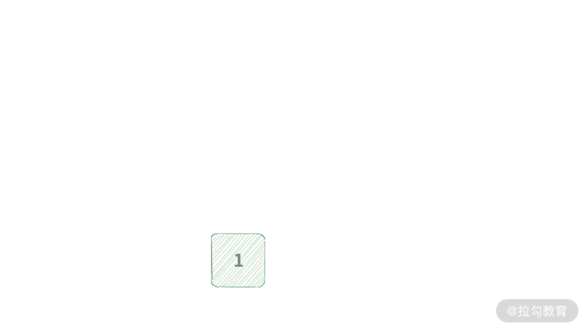
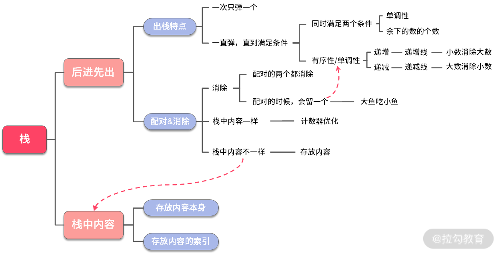

<p align = center><font size = 9>LeetCode</font></p>

<p align = center>瀑力汽水</p>


---

[toc]

---


## 1 两数之和(简单)

链接：https://leetcode-cn.com/problems/two-sum

给定一个整数数组 nums 和一个整数目标值 target，请你在该数组中找出 和为目标值 的那 两个 整数，并返回它们的数组下标。

你可以假设每种输入只会<u>对应一个答案</u>。但是，数组中同一个元素<u>不能使用两遍</u>。

你可以按任意顺序返回答案。

 ```java
示例 1：
    输入：nums = [2,7,11,15], target = 9
    输出：[0,1]
    解释：因为 nums[0] + nums[1] == 9 ，返回 [0, 1] 。
    
示例 2：
    输入：nums = [3,2,4], target = 6
    输出：[1,2]
    
示例 3：
    输入：nums = [3,3], target = 6
    输出：[0,1]

提示：
    2 <= nums.length <= 103
    -109 <= nums[i] <= 109
    -109 <= target <= 109
    只会存在一个有效答案
 ```

```java
public int[] twoSum(int[] nums, int target) {
        /*暴力破解法*/
        int len = nums.length;//避免每次进入for循环都会执行length方法
        for (int i = 0; i < len; i++) {//i只需要遍历到倒数第二个数，因为最后j=i+1会获取最后一个值，如果i遍历到倒数第一个数，就没有必要
            for (int j = i + 1; j < len; j++) {
                if (target == nums[i] + nums[j])
                    return new int[]{i,j};
            }
        }
        return new int[]{};
}
-------------------------------------------------------------------------
import java.util.HashMap;
import java.util.Map;

public int[] twoSum(int[] nums, int target){
	/**哈希表法:内存换时间*/
        int len = nums.length;
        Map<Integer,Integer> hashMap = new HashMap<>(len-1);//使用hash表尽量指定大小，以避免hash表扩容所带来的性能消耗
        hashMap.put(nums[0],0);//第一个元素必然存入hash表
        for (int i = 1; i < len; i++) {
            int another = target-nums[i];
            if(hashMap.containsKey(another)){
                return new int[]{i,hashMap.get(another)};
            }
            hashMap.put(nums[i],i);//将数据存入hash表
        }
        //return new int[]{};
        throw new IllegalArgumentException("No two sum solution");
}
```

<video src="LeetCode.assets/twosum_1.mp4"></video>


## 20 有效的括号

链接：https://leetcode-cn.com/problems/valid-parentheses

**考察知识点：栈**

给定一个只包括 '('，')'，'{'，'}'，'['，']' 的字符串 s ，判断字符串是否有效。

有效字符串需满足：
	左括号必须用相同类型的右括号闭合。
	左括号必须以正确的顺序闭合。

示例 1：
	输入：s = "()"
	输出：true

示例 2：
	输入：s = "()[]{}"
	输出：true

示例 3：
	输入：s = "(]"
	输出：false
示例 4：
	输入：s = "([)]"
	输出：false
示例 5：
	输入：s = "{[]}"
	输出：true

提示：
	1 <= s.length <= 104
	s 仅由括号 '()[]{}' 组成

```java
import java.util.Stack;
public class 有效的括号_20 {
    public static void main(String[] args) {
        String s = "([}}])";
        System.out.println(isValid(s));
    }
    public static boolean isValid(String s) {
        //当字符串为空，直接返回true
        if(s==null || s.length()==0){
            return true;
        }
        //当字符串长度为奇数时，肯定不成立，直接返回false
        if(s.length()%2 == 1){
            return false;
        }
        Stack<Character> t = new Stack();
        for(int i = 0; i < s.length(); i++){
            //取出字符
            char c = s.charAt(i);
            if(c=='(' || c=='{' || c=='['){
                t.push(c);
            }else if(!t.empty()){
                if(c==')' && t.peek()!='('){//当前字符与栈顶字符一定要配对才能pop，不配对，又不是({[中的一个，自然就是(}这种情况，必然返回false
                    return false;
                }
                if(c==']' && t.peek()!='['){
                    return false;
                }
                if(c=='}' && t.peek()!='{'){
                    return false;
                }
                t.pop();//思考一下"([}}])"这种情况
            }else if(t.empty()){
                return false;
            }
        }
        return t.empty();
    }
}
```


## 71 简化路径

链接：https://leetcode-cn.com/problems/simplify-path
**考察知识点：栈**

给你一个字符串 path ，表示指向某一文件或目录的 Unix 风格 绝对路径 （以 '/' 开头），请你将其转化为更加简洁的规范路径。

在 Unix 风格的文件系统中，一个点（.）表示当前目录本身；此外，两个点 （..） 表示将目录切换到上一级（指向父目录）；两者都可以是复杂相对路径的组成部分。任意多个连续的斜杠（即，'//'）都被视为单个斜杠 '/' 。 对于此问题，任何其他格式的点（例如，'...'）均被视为文件/目录名称。

请注意，返回的 规范路径 必须遵循下述格式：

- 始终以斜杠 '/' 开头。
- 两个目录名之间必须只有一个斜杠 '/' 。
- 最后一个目录名（如果存在）不能 以 '/' 结尾。
- 此外，路径仅包含从根目录到目标文件或目录的路径上的目录（即，不含 '.' 或 '..'）。

返回简化后得到的 规范路径 。

示例 1：

```
输入：path = "/home/"
输出："/home"
解释：注意，最后一个目录名后面没有斜杠。 
```

示例 2：

```
输入：path = "/../"
输出："/"
解释：从根目录向上一级是不可行的，因为根目录是你可以到达的最高级。
```

示例 3：

```
输入：path = "/home//foo/"
输出："/home/foo"
解释：在规范路径中，多个连续斜杠需要用一个斜杠替换。
```

示例 4：

```
输入：path = "/a/./b/../../c/"
输出："/c"
```

提示：

- 1 <= path.length <= 3000
- path 由英文字母，数字，'.'，'/' 或 '_' 组成。
- path 是一个有效的 Unix 风格绝对路径。

```java
import java.util.Stack;

public class 简化路径_71 {
    public static void main(String[] args) {
        String s = "/a/./b/../../c/";
        System.out.println(simplifyPath(s));
    }

    public static String simplifyPath(String path) {
        //先把字符串以"/"为分隔符分割成数组,此时数组有"路径"、""、"."、".."这四种情况
        String[] str = path.split("/");
        Stack<String> t = new Stack<>();

        for (int i = 0; i < str.length; i++) {
            if(!t.empty() && str[i].equals("..")) {//返回上一目录，要把栈中路径出一个栈
                t.pop();
            }else if(!str[i].equals("") && !str[i].equals(".") & !str[i].equals("..")){//此时即路径入栈
                t.push(str[i]);
            }
        }
        if(t.empty()){//如果栈空，说明最后的结果只能是/
            return "/";
        }

        StringBuffer res = new StringBuffer();//StringBuffer做字符串连接
        for (int i = 0; i < t.size(); i++){
            res.append("/" + t.get(i));
        }
        return res.toString();
    }
}
```


## [84  柱状图中最大的矩形](https://leetcode-cn.com/problems/largest-rectangle-in-histogram/)

链接：https://leetcode-cn.com/problems/largest-rectangle-in-histogram

给定 n 个非负整数，用来表示柱状图中各个柱子的高度。每个柱子彼此相邻，且宽度为 1 。

求在该柱状图中，能够勾勒出来的矩形的最大面积。

 

以上是柱状图的示例，其中每个柱子的宽度为 1，给定的高度为 [2,1,5,6,2,3]。

 

图中阴影部分为所能勾勒出的最大矩形面积，其面积为 10 个单位。

示例:
`输入: [2,1,5,6,2,3]
输出: 10`

---

#### 方法一：暴力方法


依次遍历柱形的高度，对于每一个高度分别向两边扩散，求出以当前高度为矩形的最大宽度多少。


为此，我们需要：

- 左边看一下，看最多能向左延伸多长，找到大于等于当前柱形高度的最左边元素的下标；

- 右边看一下，看最多能向右延伸多长；找到大于等于当前柱形高度的最右边元素的下标。

对于每一个位置，我们都这样操作，得到一个矩形面积，求出它们的最大值。

```java
public class 柱状图中最大的矩形_84 {
    public static void main(String[] args){
        int[] arr = new int[]{2,1,5,6,2,3};
        System.out.println(largestRectangleArea(arr));//10
    }
    //暴力破解，leetcode会超时
    public static int largestRectangleArea(int[] heights) {
        int len = heights.length;
        int ans = 0;
        //枚举高
        for (int mid = 0; mid < len; mid++) {
            int high = heights[mid];
            int left = mid, right = mid;
            //确定左边界，如果左边界存在，并且左边界的高度大于等于当前high，向左扩张
            while(left-1 >= 0 && heights[left-1] >= high){
                left--;
            }
            //确定右边界，如果有边界存在，并且右边界的高度大于等于当前high，向右扩张
            while(right+1 < len && heights[right+1] >= high){
                right++;
            }
            //计算面积，比较最大值，并将最大值赋给ans
            ans = Math.max(ans,(right-left+1)*high);
        }
        return ans;
    }
}
```


#### 方法二：以空间换时间，用到的数据结构是栈

单调栈解法

题解：https://leetcode-cn.com/problems/largest-rectangle-in-histogram/solution/dong-hua-yan-shi-dan-diao-zhan-84zhu-zhu-03w3/


```java
import java.util.Stack;

public class 柱状图中最大的矩形2_84 {
    public static void main(String[] args){
        int[] arr = new int[]{2,1,5,6,2,3};
        System.out.println(largestRectangleArea(arr));//10
    }
    //单调栈解法
    public static int largestRectangleArea(int[] heights) {
        // 初始化最终结果为0
        int res = 0;
        Stack<Integer> stack = new Stack<>();//存储数组索引

        // 将给定的原数组左右各添加一个元素0
        int[] newHeights = new int[heights.length + 2];
        newHeights[0] = 0;
        newHeights[newHeights.length-1] = 0;
        for (int i = 1; i < heights.length + 1; i++) {
            newHeights[i] = heights[i - 1];
        }

        // 开始遍历
        for (int i = 0; i < newHeights.length; i++) {
            // 如果栈不为空且当前考察的元素值小于栈顶元素值，
            // 则表示以栈顶元素值为高的矩形面积可以确定
            while (!stack.isEmpty() && newHeights[i] < newHeights[stack.peek()]) {
                // 弹出栈顶元素
                int cur = stack.pop();
                // 获取栈顶元素对应的高
                int curHeight = newHeights[cur];

                // 栈顶元素弹出后，新的栈顶元素就是其左侧边界
                int leftIndex = stack.peek();
                // 右侧边界是当前考察的索引
                int rightIndex = i;
                // 计算矩形宽度，实际画图就知道，这是单调递增栈特性
                int curWidth = rightIndex - leftIndex - 1;

                // 计算面积
                res = Math.max(res, curWidth * curHeight);
            }

            // 当前考察索引入栈
            stack.push(i);
        }

        return res;
    }
}
```


## [102. 二叉树的层序遍历](https://leetcode-cn.com/problems/binary-tree-level-order-traversal/)

链接：https://leetcode-cn.com/problems/binary-tree-level-order-traversal/

给你一个二叉树，请你返回其按 层序遍历 得到的节点值。 （即逐层地，从左到右访问所有节点）。

示例：
二叉树：[3,9,20,null,null,15,7],

​     3
​    / \
  9  20
​      /  \
   15    7
返回其层序遍历结果：

[
  [3],
  [9,20],
  [15,7]
]

```java
/**
 * Definition for a binary tree node.
 * public class TreeNode {
 *     int val;
 *     TreeNode left;
 *     TreeNode right;
 *     TreeNode() {}
 *     TreeNode(int val) { this.val = val; }
 *     TreeNode(int val, TreeNode left, TreeNode right) {
 *         this.val = val;
 *         this.left = left;
 *         this.right = right;
 *     }
 * }
 */
class Solution {
    //定义这种类型List<List<Integer>>，因为要返回的结果都是这种[[3], [9, 8], [6, 7]]
    public List<List<Integer>> levelOrder(TreeNode root) {
        // 生成FIFO队列，队列中存储的是TreeNode类型的数据
        Queue<TreeNode> Q = new LinkedList<>();
        // 如果结点不为空，那么加入FIFO队列
        if (root != null) {
            Q.offer(root);//入队
        }
        // ans用于保存层次遍历的结果
        List<List<Integer>> ans = new LinkedList<>();
        // 开始利用FIFO队列进行层次遍历
        while (Q.size() > 0) {
            // 取出当前层里面元素的个数
            final int qSize = Q.size();
            // 当前层的结果存放于tmp链表中
            List<Integer> tmp = new LinkedList<>();//每一次遍历获得的都是每一层的数据元素
            // 遍历当前层的每个结点
            for ( int i = 0; i < qSize; i++) {
                // 当前层前面的结点先出队
                TreeNode cur = Q.poll();
                // 把结果存放当于当前层中
                tmp.add(cur.val);
                // 把下一层的结点入队，注意入队时需要非空才可以入队。
                if (cur.left != null) {
                    Q.offer(cur.left);
                }
                if (cur.right != null) {
                    Q.offer(cur.right);
                }
            }
            // 把当前层的结果放到返回值里面。
            ans.add(tmp);
        }
        return ans;
    }
}
```


# 数据结构与算法面试

## 01 栈

**先进后出，后进先出**

---

### 例1：判断字符串括号是否合法?

```java
字符串中只有字符'('和')'，合法字符串需要括号可以配对，比如：(),(())
像((,)),)( 等等都是不合法的
```

一般做算法题遵循四步分析法：

- [ ] 模拟：模拟题目的运行

- [ ] 规律：尝试总结出题目的一般规律和特点

- [ ] 匹配：找到符合这些特点的数据结构与算法

- [ ] 边界：考虑一些特殊情况

  ```java
  规律:1)每个左括号或者右括号都要完成配对，才是合法的
      2)配对可通过消除来消掉合法的括号，如果最后没有任何字符，就是合法字符串
      3)奇数长度的字符串总是非法的
  匹配：用栈进行消除法的模拟
  边界：1)字符串为空	2)字符串只有1个或者奇数个	3)字符串嵌套多层
      
  当遇到左括号的时候'('时，进行压栈操作
  当遇到右括号的时候')'时，进行弹栈操作
      
  ```

  ```java
  基本解法：
  	public boolean isValid(String s){
      	//当字符串本来就是空的时候，我们可以快速返回true
          if(s==null || s.length()==0){
          return true;
      	}
      	//当字符串长度为奇数时，不可能是一个有效的合法字符串
          if(s.length()%2 == 1){
          return false;
     		}
      	//消除法的主要核心逻辑
          Stack<Character> t = new Stack<Character>();
          for(int i=0; i<s.length(); i++){
              char c = s.charAt(i);
              if(c=='('){//压栈
                  t.push(c);
              }else if(c==')'){//弹栈
                  if(t.empty()){
                      return false;
                  }
                  t.pop();
              }
          }
          return t.empty();
  
      }
  --------------------------
  深度扩展优化解法：
    栈中元素都一样的时候，只需要记录栈中元素的个数；实际就是把入栈和出栈变成了leftBraceNumber的加和减
      public boolean isValid(String s){
          //当字符串本来就是空的时候，我们可以快速返回true
          if(s==null || s.length()==0){
              return true;
          }
          //当字符串长度为奇数时，不可能是一个有效的合法字符串
          if(s.length()%2 == 1){
              return false;
          }
          //消除法的主要核心逻辑
          int leftBraceNumber = 0;
          for(int i=0; i<s.length(); i++){
              //取出字符
              char c = s.charAt(i);
              if(c=='('){//压栈
                  leftBraceNumber++;
              }
              if(c==')'){//弹栈
                  if(leftBraceNumber<=0){
                      return false;//如果弹栈失败
                  }
                  --leftBraceNumber;
              }
          }
          return leftBraceNumber==0;//
    }
  ----------
  广度扩展普适性:
    	给定一个只包括'(',')','{','}','[',']'的字符串，判断字符串是否有效。有效字符串需满足：
            1)左括号必须用相同类型的右括号闭合
            2)左括号必须以正确的顺序闭合
            3)注意空字符串可被认为是有效字符串
          
  import java.util.Stack;
  public class Demo2 {
      public static void main(String[] args) {
          Demo2 o = new Demo2();
          System.out.println(o.isValid("{)(}"));
      }
  
      public boolean isValid(String s){
          //当字符串为空时，认为是有效字符串
          if(s.length()==0 || s.isEmpty() || s==null){
              return true;
          }
          //如果字符串奇数个，不可能是一个有效的合法字符串
          if(s.length()%2==1){
              return false;
          }
          //核心逻辑
          Stack<Character> t = new Stack<Character>();
          for (int i = 0; i < s.length(); i++) {
              char c= s.charAt(i);
              if(c=='(') {
                  t.push(c);
              }else if(c==')' && t.peek()=='('){//peek()查看栈顶元素
                  if(t.empty()){
                      return false;
                  }
                  t.pop();
              }
  
              if(c=='{') {
                  t.push(c);
              }else if(c=='}' && t.peek()=='{'){
                  if(t.empty()){
                      return false;
                  }
                  t.pop();
              }
  
              if(c=='[') {
                  t.push(c);
              }else if(c==']' && t.peek()=='['){
                  if(t.empty()){
                      return false;
                  }
                  t.pop();
              }
          }
          return t.empty();
     		--------------------
          //简洁周到的核心逻辑
          Stack<Character> t = new Stack<Character>();
  
          for (int i = 0; i < s.length(); i++) {
              char c = s.charAt(i);
              if (c == '{' || c == '(' || c == '[') {
                  t.push(c);
              } else if (c == '}') {
                  if (t.empty() || t.peek() != '{') {
                      return false;
                  }
                  t.pop();
              } else if (c == ']') {
                  if (t.empty() || t.peek() != '[') {
                      return false;
                  }
                  t.pop();
              } else if (c == ')') {
                  if (t.empty() || t.peek() != '(') {
                      return false;
                  }
                  t.pop();
              } else {
                  return false;
              }
          }
          return t.empty();
      }
  }
  ```


### 例2：大鱼吃小鱼

```java
在水中有许多鱼，可以认为这些鱼停放在 x 轴上。
再给定两个数组 Size，Dir，Size[i] 表示第 i 条鱼的大小，Dir[i] 表示鱼的方向 （0 表示向左游，1 表示向右游）。
这两个数组分别表示鱼的大小和游动的方向，并且两个数组的长度相等。鱼的行为符合以下几个条件:
	1)所有的鱼都同时开始游动，每次按照鱼的方向，都游动一个单位距离；
	2)当方向相对时，大鱼会吃掉小鱼；
    3)鱼的大小都不一样。

输入：Size = [4, 2, 5, 3, 1], Dir = [1, 1, 0, 0, 0]
输出：3

请问还剩下几条鱼？
```


【分析】对于这道题而言，大鱼吃掉小鱼的时候，可以认为是一种消除行为。只不过与括号匹配时的行为不一样：

   - 括号匹配是会同时把左括号与右括号消除掉；

   - 大鱼吃小鱼，只会把小鱼吃掉。

     :warning:注意：当🐟的游动方向相同，或者相反时，并不会相遇，此时大鱼不能吃掉小鱼


【规律】

通过模拟，可以发现如下规律:

- 如果两条鱼相对而游时，那么较小的鱼会被吃掉；

- 其他情况没有鱼被吃掉。


【匹配】

我们发现，下面活下来的鱼的行为（上图红框部分）就是一个栈。每当有新的鱼要进来的时候，就会与栈顶的鱼进行比较。那么我们匹配到的算法就是栈了。


【边界】

在正式开始求解之前，我们还是想一想两种边界：

- 所有的鱼都朝着一个方向游；

- 一条鱼吃掉了其他的所有鱼。

我们在后面设计算法的时候，这些情况都需要考虑到。


【画图】

这道题的关键仍然是如何使用栈来模拟鱼的消除行为，画图演示一下思路


```java
import java.util.Stack;

public class Demo3 {
    public static void main(String[] args) {
        Demo3 d = new Demo3();
        int[] Size = {4, 2, 5, 3, 1};
        int[] Dir = {1,1,0,0,0};
        System.out.println(d.solution(Size,Dir));
    }
    public int solution(int[] fishSize, int[] fishDirection){
        //首先拿到鱼的数量
        final int fishNumber = fishSize.length;
        //如果鱼的数量小于等于1，直接返回鱼的数量
        if(fishNumber <= 1){
            return fishNumber;
        }

        //0表示鱼向左游动,1表示向右游动
        final int left = 0;
        final int right = 1;

        //创建一个栈，用于存放鱼的索引
        Stack<Integer> t = new Stack();
        for (int i = 0; i < fishNumber; i++) {
            //获取当前遍历到的鱼的情况
            final int curFishSize = fishSize[i];
            final int curFishDeirction = fishDirection[i];
            //用hasEat变量当前鱼是否被吃掉
            boolean hasEat = false;
            //如果栈中还有鱼，并且栈中鱼向右，当前的鱼向左，那么就会有相遇的可能
            while(!t.empty() && fishDirection[t.peek()]==right && curFishDeirction==left){
                //如果栈顶的鱼比较大，那么就把新来的吃掉
                if(fishSize[t.peek()] > curFishSize){
                    hasEat = true;//新来的鱼被吃掉了
                    break;
                }
                //如果栈中的鱼较小，那么会把栈中的鱼吃掉，栈中的鱼被消除，所以需要弹栈
                t.pop();
            }
            //如果新来的鱼，没有被吃掉，那么压入栈中
            if(!hasEat){
                t.push(i);
            }
        }
        return t.size();//返回栈中的元素
    }
}
```

**复杂度分析**：每只鱼只入栈一次，出栈一次，所以时间复杂度 为 O(N)，而空间复杂度为 O(N)，因为最差情况下可能把所有的鱼都入栈。

【小结】接下来我们一起对这道题做一下归纳。可以发现，与例 1 相比，它们的消除行为有所不同：

​		在例 1 中，消除行为表现为配对的两者都会消除；

​		在例 2 中，消除行为表现为配对的两者中有一个会被消除。

​		此外，在与 例 1 的比较中，可以发现，栈中的内容也有所不同：

​		在例 1 中，栈中的存放的就是内容本身；

​		在例 2 中，栈中存放的只是内容的索引，可以通过索引得到内容。

再者，我们也发现，在弹栈的时候，不再像以前那样，每次只弹一个元素，而是采用了 while 循环，要一直弹到满足某个条件为止。所以我们总结出，弹栈的时候有两种情况：

1、弹一个元素就可以；

2、用 while 语句一直弹，直到满足某个条件为止。

因此，这道题的考点我们也挖掘出来了：

​	是否会用栈来存放索引？

​	是否想到在弹栈的时候一定要满足某个条件才停止弹栈？

到这里栈的特点更丰富了，通过我们不断地浇灌也让栈这棵“萌芽”长出了更多的叶子，总结如下图所示：


### 单调栈的解题技巧

大部分数据结构书上都不太会讲单调栈的知识，但是在面试中却经常考察这一类题，这就非常考验你的知识储备了。

首先我们看一下单调栈的定义：单调栈就是指栈中的元素必须是按照升序排列的栈，或者是降序排列的栈。对于这两种排序方式的栈，还给它们各自取了小名。

升序排列的栈称为递增栈，如下图所示：



降序排列的栈称为递减栈，如下图所示：


*注意：示意图所展示的这两种栈是横向排列的。栈中元素的值，分别用不同高度的矩形来表示，值越大，矩形越高。*

接下来我们介绍一下递增栈的有序性，一句话：“任何时候都需要保证栈的有序性”。

递增栈的特性可以演示如下（上方数组是要依次入栈的元素）：


递减栈的特性可以演示如下：


通过这两个动图，我们可以总结出单调栈的特点，如下图所示：


### 例 3：找出数组中右边比我小的元素

```java
【题目】一个整数数组 A，找到每个元素：右边第一个比我小的下标位置，没有则用 -1 表示。

输入：[5, 2]

输出：[1, -1]

解释：因为元素 5 的右边离我最近且比我小的位置应该是 A[1]，最后一个元素 2 右边没有比 2 小的元素，所以应该输出 -1。
```

【分析】每次开始分析题意时，记得要拿出我们的“四步分析法”，通过一步步分析找到题目相应的解法。

【**模拟**】

​	在正式开始上手之后，我们先拿两个例子演示一下，看看能不能发现题目中隐藏的一些有趣规律，动图如下所示：


【**规律**】

这里我们是照着题意去寻找一个右边比它小的数的下标。可以发现，A[4] = 4 及 A[5] = 0，这两个数字多次被用到。并且：

- A[4] 发现有左边 A[3]，A[3] 就匹配成功；

- 结合 A[5] = 0 的例子，我们发现它会把比它大的数都进行匹配成功，但是 A[3] 除外； 

- A[3] 可以认为是匹配成功之后，被 A[4]消除了。 

这时可以总结出：一个数总是想与左边比它大的数进行匹配，匹配到了之后，小的数会消除掉大的数。

【**匹配**】

当你发现要解决的题目有两个特点：

- 小的数要与大的数配对 

- 小的数会消除大的数

你的脑海里应该联想到关于单调栈的特性。下面我们看看如何利用单调栈解决这道题目。

【画图】在这里，依然需要画一个图来描述一下我们的思路及想法，如下图所示：（红色部分表示栈，我们只将下标绿色值放到栈中，为了看图方便，把下标对应的值也标在了相应位置。）


- [ ] Step 1. 首先将 A[0] = 1 的下标 0 入栈。

- [ ] Step 2. 将 A[1] = 2 的下标 1 入栈。满足单调栈。

- [ ] Step 3. 将 A[2] = 4 的下标 2 入栈。满足单调栈。

- [ ] Step 4. 将 A[3] = 9 的下标 3 入栈。满足单调栈。

- [ ] Step 5. 将 A[4] = 4 的下标 4 入栈时，不满足单调性，需要将 A[3] = 9 从栈中弹出去。下标 4 将栈中下标 3 弹出栈，记录 A[3] 右边更小的是 index = 4。

- [ ] Step 6. 将 A[5] = 0 的下标 5 入栈时，不满足单调性，需要将 A[4] = 4 从栈中弹出去。下标 5 将下标 4 弹出栈，记录 A[4] 右边更小的是 index = 5。A[5] = 0 会将栈中的下标 0, 1, 2 都弹出栈，因此也需要记录相应下标右边比其小的下标为 5，再将 A[5] = 0 的下标 5 放入栈中。

- [ ] Step 7. 将 A[6] = 5 的下标 6 放入栈中。满足单调性。

- [ ] Step 8. 此时，再也没有元素要入栈了，那么栈中的元素右边没有比其更小的元素。因此设置为 -1.


【代码】

```java
import java.util.Arrays;
import java.util.Stack;

public class Demo4 {
    public static void main(String[] args) {
        int[] a = {1,2,4,9,4,0,5};
//        for (int c : d.findRightSmall(a)) {
//            System.out.print(c+",");
//        }
        System.out.println(Arrays.toString(findRightSmall(a)));
    }
    public static int[] findRightSmall(int[] A) {
        // 结果数组
        int[] ans = new int[A.length];
        // 注意，栈中的元素记录的是下标
        Stack<Integer> t = new Stack();
        for (int i = 0; i < A.length; i++) {
            // 当前元素
            final int x = A[i];
            // t.peek()表示在栈顶存的【A数组元素的索引值】
            while (!t.empty() && A[t.peek()] > x) {
                // 其实ans数组存储的索引位置与A数组的索引对应的，如下第一次执行时[0,0,0,4,0,0]
                ans[t.peek()] = i;
                // 找到了右边第一个比我小的下标位置，然后就将我弹栈，我已经不需要再找了，在我前面的还在栈中的元素继续寻找
                t.pop();
            }
            // 剩下的入栈
            t.push(i);
        }
        // 栈中剩下的元素，由于没有人能消除他们，因此，只能将结果设置为-1。
        while (!t.empty()) {
            ans[t.peek()] = -1;
            t.pop();
        }
        return ans;
    }
}

```

**复杂度分析**：每个元素只入栈一次，出栈一次，所以时间复杂度为 O(N)，而空间复杂度为 O(N)，因为最差情况可能会把所有的元素都入栈。

**【小结】**到这里我们可以得到一个有趣且非常有用的结论：数组中右边第一个比我小的元素的位置，求解用递增栈。

```java
相似例子：
1.数组中右边第一个比我大的元素的位置
import java.util.Arrays;
import java.util.Stack;
/**
 * 1.数组中右边第一个比我大的元素的位置
 * 输入[1, 2, 4, 9, 4, 0, 5]
 * 输出[1, 2, 3, -1, 6, 6, -1]
 */
public class Demo5 {
    public static void main(String[] args) {
        int[] A = {1,2,4,9,4,0,5};
        System.out.println(Arrays.toString(findRightBig(A)));
    }
    public static int[] findRightBig(int[] A) {
        // 结果数组,与A的索引位置一一对应
        int[] ans = new int[A.length];

        Stack<Integer> t = new Stack<>();
        for (int i = 0; i < A.length; i++) {
            final int x = A[i];
            while(!t.empty() && A[t.peek()] < x){
                ans[t.peek()] = i;
                t.pop();
            }
            t.push(i);
        }
        while (!t.empty()) {
            ans[t.peek()] = -1;
            t.pop();
        }
        return ans;
    }
}
------------------------
2.数组中元素左边离我最近且比我小的元素的位置
import java.util.Arrays;
import java.util.Stack;
/**
 * 2.数组中元素左边离我最近且比我小的元素的位置
 *	输入[1, 2, 4, 9, 4, 0, 5]
 *	输出[-1, 0, 1, 2, 1, -1, 5]
 */
public class Demo6 {
    public static void main(String[] args) {
        int[] A = {1,2,4,9,4,0,5};
        System.out.println(Arrays.toString(findLeftSmall(A)));
    }
    public static int[] findLeftSmall(int[] A){
        //结果集
        int[] ans = new int[A.length];
        Stack<Integer> t = new Stack();
        //遍历数组
        for (int i = A.length-1; i >=0 ; i--) {
            final int x = A[i];//获取当前元素
            while(!t.empty() && A[t.peek()] > x){
                ans[t.peek()] = i;
                t.pop();
            }
            t.push(i);
        }
        while(!t.empty()){
            ans[t.peek()] = -1;
            t.pop();
        }
        return ans;
    }
}
----------------------
3.数组中元素左边离我最近且比我大的元素的位置
import java.util.Arrays;
import java.util.Stack;
/**
 * 3.数组中元素左边离我最近且比我大的元素的位置
 * 输入[1, 2, 4, 9, 4, 0, 5]
 * 输出[-1, -1, -1, -1, 3, 4, 3]
 */
public class Demo7 {
    public static void main(String[] args) {
        int[] A = {1,2,4,9,4,0,5};
        System.out.println(Arrays.toString(findLeftBig(A)));
    }
    public static int[] findLeftBig(int[] A){
        //结果集
        int[] ans = new int[A.length];
        Stack<Integer> t = new Stack<>();
        //遍历数组
        for (int i = A.length-1; i >= 0; i--) {
            //获取当前遍历值
            final int x = A[i];
            while(!t.empty() && A[t.peek()] < x){
                ans[t.peek()] = i;
                t.pop();
            }
            t.push(i);
        }
        while(!t.empty()){
            ans[t.peek()] = -1;
            t.pop();
        }
        return ans;
    }
}
```

如果我们进一步归纳，会发现消除的时候，这里仍然是消除一个元素，保留一个元素。弹栈的时候，仍然是**一直弹栈，直到满足某个条件为止**。只是条件变成了直到元素大于栈顶元素。为了方便你理解，我把内容总结到了一张大图里：


### 例4：字典序最小的 k 个数的子序列

```java
【题目】给定一个正整数数组和 k，要求依次取出 k 个数，输出其中数组的一个子序列，需要满足：
    1. 长度为 k
    2. 字典序最小

输入：nums = [3,5,2,6], k = 2
输出：[2,6]

解释：在所有可能的解：{[3,5], [3,2], [3,6], [5,2], [5,6], [2,6]} 中，[2,6] 字典序最小。

所谓字典序就是，给定两个数组：x = [x1,x2,x3,x4]，y = [y1,y2,y3,y4]，如果 0 ≤ p < i，xp == yp 且 xi < yi，那么我们认为 x 的字典序小于 y。
```

**【分析】**根据“四步分析法”，我们一步一步拆解题目。

【**模拟**】

首先应该拿例子来模拟一下题目所述的过程，动图如下所示：


**【规律】**

通过模拟，我们发现一个特点：一旦发现更小的数时，就可以把前面已经放好的数扔掉，然后把这个最小的数放在最前面。

如果机智一点，就会发现这里与例 2 的“大鱼吃小鱼”结果很像。区别在于消除的过程中，大鱼吃小鱼是大鱼留下来了，而这里较小的数和较大的数相遇时，是较小的数留下来了。

**【匹配】**

到这里，我们已经发现了题目的特点——较小数消除掉较大数。根据例 3 总结出来的规律，此时就可以用上单调栈。并且，由于是较小的数消除掉较大的数，所以应该使用递增栈。

**【边界】**

不过我们还是需要小心题目的边界。

Case 1：假设数组右边有一个最小的数，这个最小的数会把左边的数全部都消掉，然后递增栈里面就只剩下这 1 个数了。这跟题意有点不符合，题意需要的是找到 k = 2 个出来。`输入：nums = [3,5,2,1], k = 2`


解决办法：不过你可以想一想，是不是可以控制一下消去的数目。当剩下的数字个数与栈中的元素刚好能凑够 k 个数时，就不能再消除了，代码如下 :

`rightLeftNumber + stack.size() == k`

此时，如果还要进行消除，就不能凑够 k 个数了。这样操作可以保证我们取的序列是最小的 k 个数。

Case 2：如果数组是一个升序的数组，那么此时所有的元素都会被压栈。栈中的数目有可能远远超出 k 个。


解决办法：只需要把栈中的多出来的数字弹出来即可。

【画图】假定输入为[9, 2, 4, 5, 1, 2, 3, 0], k = 3.输出能构成的最小的序列。


Step 1. 首先将 9 加入栈中。

Step 2. 当 2 要入栈时，不满足单调栈(递增栈)，需要将数字 9 出栈。由于后面还有足够多的元素，可以把 9 弹栈，再将 2 入栈。

Step 3. 将 4 入栈，满足单调性。

Step 4. 再将元素 5 入栈，满足单调性。

Step 5. 将要入栈的元素 1，会弹出栈中所有元素。

Step 6. 将元素 1 入栈。

Step 7. 将元素 2 入栈，满足单调性。

Step 8. 将元素 3 入栈，满足单调性。

Step 9. 将 0 入栈时，需要将栈顶元素 3 弹出。

Step 10. 将 0 入栈，不满足单调性。这是因为，如果 0 将前面的元素再弹栈，余下的元素个数就小于 k = 3 个了。所以不能再利用单调性来弹出栈中元素了。

【代码】到这里，相信你已经可以根据思路写出代码了，代码如下（解析在注释里）：

```java
import java.util.Stack;
import java.util.Arrays;
/**
 *  【题目】给定一个正整数数组和 k，要求依次取出 k 个数，输出其中数组的一个子序列，需要满足：
 *     1. 长度为 k
 *     2. 字典序最小
 *  输入：nums = [3,5,2,6], k = 2
 *  输出：[2,6]
 *
 *  特性：递增栈
 */
public class Demo8 {
    public static void main(String[] args) {
        int[] A = {1,2,4,9,4,0,5};
        System.out.println(Arrays.toString(findSmallSeq(A,3)));
    }
    public static int[] findSmallSeq(int[] nums, int k) {
         //最后输出的结果数组一定要在长度上满足length=k
         int[] ans = new int[k];
         // 这里生成单调栈
         Stack<Integer> s = new Stack();
         //遍历数组中元素
         for (int i = 0; i < nums.length; i++) {
              //获取当前遍历到的元素
              final int x = nums[i];
              //left指数组中未被遍历到的数的个数
              final int left = nums.length - i;
              // 注意我们想要提取出k个数，所以注意控制扔掉的数的个数
              //如果栈中的元素个数与未被遍历到的元素的个数之和大于k，为了避免弹栈最后出现结果集的个数不满足k的情况
              while (!s.empty() && (s.size() + left > k) && s.peek() > x) {
                 s.pop();
              }
              s.push(x);
         }
         // 如果递增栈里面的数太多，那么我们只需要取出前k个就可以了。
         // 多余的栈中的元素需要扔掉。
         while (s.size() > k) {
            s.pop();
         }
         // 把k个元素取出来，注意这里取的顺序!
         // 因为栈的特性是先进后出，而结果集ans与栈的大小和位置都是对应的
         for (int i = k - 1; i >= 0; i--) {
              ans[i] = s.peek();
              s.pop();
         }
         return ans;
    }
}

```

复杂度分析：每个元素只入栈一次，出栈一次，所以时间复杂度为 O(N)，而空间复杂度为 O(N)，因为最差情况可能会把所有元素都入栈。

【小结】写完代码之后，我们需要对代码和题目做一个小结：

​	较小的数消除掉较大的数的时候，使用递增栈；

​	要注意控制剩下的元素的个数；

​	如果更进一步推而广之，会发现从简单栈到单调栈，层层推进的过程中，不停变化就是入栈与出栈的时机。

那么，到这里，这个题目的考点也就非常明了了：	

- [ ] 递增栈

- [ ] 个数控制，我们只需要取 k 个数出来。

总结与延伸
在本讲我带你一起剖析了栈相关的知识和题目，经过我们不断地“浇灌”，栈这棵“萌芽”开始抽枝散叶，终于长成了一棵枝繁叶茂的“大树”。回到知识层面，我把本讲重点介绍、且需要你掌握的内容总结在一张思维导图中，如下图所示：



除了带你学习知识本身，我还介绍了题目的变形和演进，希望能够帮助你建立深度分析的能力。在学习算法与数据结构的过程中，作为“刷题过来人”，我非常建议你加强总结和归纳 ，建立自己的学习方法论。

虽然栈很有趣，不过我们的介绍就要到这里了，我对于栈的总结和归纳只是个开头，期待你还能发现更多栈的特点和巧妙用法，并且将它们总结下来。也欢迎在评论区和我交流，期待看到你的奇思妙想。

思考题
我再给你留一道思考题：给定一个数组，数组中的元素代表木板的高度。请你求出相邻木板能剪出的最大矩形面积。


这道题会涉及一个非常重要且有用的单调栈的性质，希望你能找到它。你可以把答案写在评论区，我们一起讨论。

```java
方法一：
import java.util.Stack;
/**
 * 给定一个数组，数组中的元素代表木板的高度。请你求出相邻木板能剪出的最大矩形面积。
 * 输入[2,1,5,6,2,3]
 * 输出10
 */
public class Demo9 {
    public static void main(String[] args) {
		int[] A = {2,1,5,6,2,3};
        System.out.println(largestRectangleArea(A));
    }
    /**
     * 思路1：
     * 在选择的时候，由于要构造出最大的矩形。一种暴力的做法是：
     * for (int i = 0; i < N; i++) {
     *     ans = max(ans, A[i]参与构造的最大矩形面积);
     * }
     * 那么在求A[i]参与构造的最大矩形的时候。A[i]左边与右边的值
     * 肯定都要 >= A[i]才可以。
     *
     * 那么也就是说，我们需要找到左边第一个比A[i]小的数, leftPos
     * 也需要找到右边第一个比A[i]小的数。rightPos
     *
     * 那么前面暴力的代码就可以写成：
     *
     * for (int i = 0; i < N; i++) {
     *     leftPos = findLeftSmall(A[i]);
     *     rightPos = findRightSmall(A[i]);
     *     ans = max(ans, A[i] * (rightPos - leftPos - 1));
     * }
     *
     * 而leftPos和rightPos我们都可以先通过单调栈得到。那么到这里，问题就解决了。
     */
    public static int largestRectangleArea(int[] A) {
        final int N = A == null ? 0 : A.length;

        int[] leftSmall = LeftSmall.findLeftSmall(A);
        int[] rightSmall = RightSmall.findRightSmall(A);

        int ans = 0;

        for (int i = 0; i < N; i++) {
            final int height = A[i];
            // 左边比我小的位置
            // 右边比我小的位置
            final int leftPos = leftSmall[i];
            final int rightPos = rightSmall[i] == -1 ? N : rightSmall[i];

            // 现在我们确定区间(leftPos, rightPos)
            // 注意两边都是开区间。在这个区间里面，所有的数肯定都是 >= A[i]的。
            // 那么底部的宽度就是
            final int width = rightPos - leftPos - 1;
            final int area = height * width;

            ans = Math.max(ans, area);
        }
        return ans;
    }
}

class LeftSmall {
    // 当我们要找左边比我小的元素的时候，需要用递增栈
    public static int[] findLeftSmall(int[] A) {
        if (A == null || A.length == 0) {
            return new int[0];
        }
        // 结果数组
        int[] ans = new int[A.length];
        // 注意，栈中的元素记录的是下标
        Stack<Integer> t = new Stack<>();

        // 注意这里的遍历方向发生了变化，因为我们是要找到左边比我小的元素的位置
        for (int i = A.length - 1; i >= 0; i--) {
            final int x = A[i];
            // 每个元素都遍历栈中的元素完成消除动作
            // 这里是递减栈
            // 如果发现进来的元素x与栈中元素相比
            // 如果大于栈中的元素，那么要把栈中的元素弹出去
            while (!t.empty() && A[t.peek()] > x) {
                // 消除的时候，记录一下被谁消除了
                ans[t.peek()] = i;
                // 消除时候，值更大的需要从栈中消失
                t.pop();
            }
            // 剩下的入栈
            t.push(i);
        }
        // 栈中剩下的元素，由于没有人能消除他们，因此，只能将结果设置为-1。
        while (!t.empty()) {
            ans[t.peek()] = -1;
            t.pop();
        }

        return ans;
    }
}

class RightSmall {
    public static int[] findRightSmall(int[] A) {
        // 结果数组
        int[] ans = new int[A.length];
        // 注意，栈中的元素记录的是下标
        Stack<Integer> t = new Stack<>();

        for (int i = 0; i < A.length; i++) {
            final int x = A[i];
            // 每个元素都向左遍历栈中的元素完成消除动作
            while (!t.empty() && A[t.peek()] > x) {
                // 消除的时候，记录一下被谁消除了
                ans[t.peek()] = i;
                // 消除时候，值更大的需要从栈中消失
                t.pop();
            }
            // 剩下的入栈
            t.push(i);
        }
        // 栈中剩下的元素，由于没有人能消除他们，因此，只能将结果设置为-1。
        while (!t.empty()) {
            ans[t.peek()] = -1;
            t.pop();
        }
        return ans;
    }
}
```

```java
方法二：
import java.util.Stack;
/**
 * 给定一个数组，数组中的元素代表木板的高度。请你求出相邻木板能剪出的最大矩形面积。
 * 输入[2,1,5,6,2,3]
 * 输出10
 */
public class Demo10 {
    public static void main(String[] args) {
		int[] A = {2,1,5,6,2,3};
        System.out.println(largestRectangleArea(A));
    }
    /*
     * 思路：
     * 2个重要的性质：
     *
     * 一个递增栈里面存放的是数组的下标 stack = [i, j]
     *
     * 性质1: 对于j而言，下标[i+1 ... j-1] 这里面的元素的A[x]值都 >= A[j]
     *       对于i而言，(-1, i-1] 这里面元素的值都 >= A[i];
     *
     * 如果此时A[k]要入栈。并且A[k] < A[j]，要将A[j]出栈。
     *
     * 性质2: A[j+1 ... k-1]这个区间里面的元素都大于A[j]
     *
     */
    public static int largestRectangleArea(int[] A) {
        final int N = (A == null ? 0 : A.length);

        // 虽然可以用Stack<Integer>，但是这里我们为了更快地操作，我们用
        // 数组模拟栈来运行，因为我们知道最多存放的内容实际上就是N个
        int top = 0;
        // s[top-1]表示栈顶元素
        int[] s = new int[N];

        int ans = 0;

        // 注意，这里我们取到了i == N
        // 按理说，不应该取到i == N的。但是这时候，主要是为了处理这种数组
        // A = [1, 2, 3]
        // 没有任何元素会出栈。
        // 那么最后我们用一个0元素，把所有的元素都削出栈。
        // 这样代码就可以统一处理掉。
        for (int i = 0; i <= N; i++) {
            // 注意：当i == N的时候，x = -1;
            // 比数组中的元素都要小。
            final int x = i == N ? -1 : A[i];
            while (top > 0 && A[s[top - 1]] > x) {
                // 计算以A[s[top]]的元素的高度的矩形。
                final int height = A[s[--top]];
                // i元素要将index = s[top-1]的元素出栈。
                // 那么根据性质2：
                // 此时A[s[top-1] .... i) 这个区间里面的元素都是
                // 大于A[s[top-1]]的
                final int rightPos = i;
                // 这里需要使用性质1.
                // 注意：当栈中一个元素都没有的时候，要取-1
                final int leftPos = top > 0 ? s[top - 1] : -1;
                final int width = rightPos - leftPos - 1;
                final int area = height * width;
                ans = Math.max(ans, area);
            }

            s[top++] = i;
        }

        return ans;
    }

}

```


## 02 | 队列：FIFO 队列与单调队列的深挖与扩展

队列在日常生活中很常见，当我们排队买票看电影的时候，排在队列前面的人先入场，排在队列后面的人只能后入场。在计算机系统中常用先进先出（First In First Out）的队列来表示这种场景。

但是除了这种 FIFO 队列以外，还有一种队列需要注意，就是<u>单调队列</u>，由于课本上不常讲，面试中又容易出现，因此需要格外注意。让我们一起把这个数据结构的知识图谱丰富起来。


下面我要介绍的内容在实际的工程应用中也经常会用到，比如：

- Redis 的消息队列，用来搭建秒杀系统； 

- LevelDB 的写入队列，可以保证数据写入的顺序； 

- Qemu 的 Ring Buffer，用来完成数据的高效传输。

它们是很多基础设施的基本算法，比如操作系统、数据库、TCP/IP 协议栈等。OK, Let's Go!


### FIFO 队列

我们先从基本的 FIFO 队列入手，其特点用动画表示如下：


可以发现 FIFO 有两个特点：

- push 元素时，总是将元素放在队列尾部；

- pop 元素时，总是将队列首部的元素扔掉。

但只知道 FIFO 的特性，并不能从容地应对复杂的面试。因此我们还需要进一步对FIFO 加以深挖，力求在面试中游刃有余。接下来我将通过大厂面试题，带你学习这块重点知识。

#### 例 1：二叉树的层次遍历（两种方法）

【题目】从上到下按层打印二叉树，同一层结点按从左到右的顺序打印，每一层打印到一行。

输入：


输出：[[3], [9, 8], [6, 7]]

```java
// 二叉树结点的定义
public class TreeNode {
  // 树结点中的元素值
  int val = 0;
  // 二叉树结点的左子结点
  TreeNode left = null;
  // 二叉树结点的右子结点
  TreeNode right = null;
}
```

【**分析**】这道题已经在非常多的大厂面试中出现过了，比如微软，美团，腾讯等，因此你务必要掌握题目涉及的思想和原理。在真正开始写代码之前，我们还是参考“[第 01 讲](https://kaiwu.lagou.com/course/courseInfo.htm?courseId=685#/detail/pc?id=6690)”中给出的深度思考的路线，从分析题目到写出代码“走”一遍。

**1. 模拟**
首先我们在这棵树上进行模拟，动图演示效果如下所示：


**2. 规律**
通过运行的模拟，可以总结出以下两个特点。

**（1）广度遍历**（**层次遍历**）：由于二叉树的特点，当我们拿到第 N 层的结点 A 之后，可以通过 A 的 left 和 right 指针拿到下一层的结点。

**（2）顺序输出**：每层输出时，排在**左边的结点**，它的**子结点同样**排在**下一层最左边**。

**3. 匹配**

当你发现题目具备**广度遍历**（**分层遍历**）**和顺序输出的特点，\**就应该想到用\**FIFO 队列**来试一试。

**4.. 边界**

关于二叉树的边界，需要考虑一种空二叉树的情况。当遇到一棵空的二叉树，有两种解决办法。

（1）**特殊判断**：如果发现是一棵空二叉树，就直接返回空结果。

（2）**制定一个规则**：不要让空指针进入到 FIFO 队列。

我个人比较喜欢第 2 种方案，因为代码一致性更好（一致性是指不需要为各种特殊情况再添加额外的 if/else 来处理）。所以接下来我将从“**制定一个规则：不要让空指针进入队列**”上考虑代码的实现。

【**画图**】当我们拿到一道题，脑海中已经关联了相应的数据结构：FIFO 队列，下面就可以利用它来画图了。

不过，二叉树的层次遍历与标准的 FIFO 队列不太一样，需要在每一层开始处理之前，记录一下 Queue Size（当前层里面结点的个数），演示如下图所示：


Step1. 在一开始首先将根结点 3 加入队列中。

Step 2. 开始**新一层遍历**，记录下当前队列长度 QSize=1，初始化当前层存放结果的[]。

Step 3. 将结点 3 出队，然后将其放到当前层中。

Step 4. 再将结点 3 的左右子结点分别入队。QSize = 1 的这一层已经处理完毕。

Step 5. **开始新一层的遍历**。记录下新一层的 QSize = 2，初始化新的当前层存放当前层结果的[]。

Step 6. 从队列中取出 9，放到当前层结果中。结点 9 没有左右子结点，不需要继续处理左右子结点。

Step 7. 从队列中取出 8，放到当前层结果中。

Step 8. 将结点 8 的左右子结点分别入队。此时，QSize = 2 的部分已经全部处理完成。

Step 9.**开始新一层的遍历**，记录下当前队列中的结点数 QSize = 2，并且生成存放当前层结果的 list[]。

Step 10. 将队首结点 6 出队放到当前层结果中。结点 6 没有左右子结点，没有元素要入队。

Step 11. 将队首结点 7 出队，放到当前层结果中。结点 7 没有左右子结点，没有元素要入队。

结束，返回我们层次遍历的结果。

【**代码**】现在我们有解题思路，也有运行图，接下来就可以写出以下核心代码（解析在注释里）：

```java
	// 二叉树结点的定义
    public class TreeNode {
        // 树结点中的元素值
        int val = 0;//当前元素的值
        // 二叉树结点的左子结点
        TreeNode left = null;
        // 二叉树结点的右子结点
        TreeNode right = null;
    }

    //定义这种类型List<List<Integer>>，因为要返回的结果都是这种[[3], [9, 8], [6, 7]]
    public List<List<Integer>> levelOrder(TreeNode root){
        // 生成FIFO队列，队列中存储的是TreeNode类型的数据
        Queue<TreeNode> Q = new LinkedList<>();
        // 如果结点不为空，那么加入FIFO队列
        if (root != null) {
            Q.offer(root);//入队
        }
        // ans用于保存层次遍历的结果
        List<List<Integer>> ans = new LinkedList<>();
        // 开始利用FIFO队列进行层次遍历
        while (Q.size() > 0) {
            // 取出当前层里面元素的个数
            final int qSize = Q.size();
            // 当前层的结果存放于tmp链表中
            List<Integer> tmp = new LinkedList<>();//每一次遍历获得的都是每一层的数据元素
            // 遍历当前层的每个结点
            for ( int i = 0; i < qSize; i++) {
                // 当前层前面的结点先出队
                TreeNode cur = Q.poll();
                // 把结果存放当于当前层中
                tmp.add(cur.val);
                // 把下一层的结点入队，注意入队时需要非空才可以入队。
                if (cur.left != null) {
                    Q.offer(cur.left);
                }
                if (cur.right != null) {
                    Q.offer(cur.right);
                }
            }
            // 把当前层的结果放到返回值里面。
            ans.add(tmp);
        }
        return ans;
    }
```

**复杂度分析**：由于二叉树的每个结点，我们都只访问了一遍，所以时间复杂度为 O(n)。如果不算返回的数组，那么空间复杂度为 O(k)，这里的 k 表示二叉树横向最宽的那一层的结点数目。

**【小结】**写完代码之后，对 FIFO 队列进行一轮总结。现在除了知道先进先出的特点之外，还可以进一步细化知识点，如下图所示：


这道题是很多高频面试题的“母题”，可以衍生出很多子题出来，因此建议你把这道题研究透彻。如果还有哪里不理解，可以在留言区提问。

在依靠 FIFO 队列的解法中，我们利用 QSize 得到当前层的元素个数，然后再开始执行 FIFO 是处理分层遍历的关键。下面我再向你介绍另外一种更直观的思路。

【解法二】再来回顾一下题目的特点：

分层遍历

顺序遍历

那么我们是不是可以用 List 来表示每一层，把下一层的结点统一放到一个新生成的 List 里面。示意图如下：


Step 1. 首先将结点 3 加入 cur,，形成 cur=[3]。

Step 2. 开始依次遍历当前层 cur, 这里 cur 只有结点 3，依次把结点 3 的左子结点和右子结点加入 next，形成 [9, 8]。

Step 3. 将 cur 指向 next，并且 next 设置为 []

Step 4. 依次遍历 cur，并将每个结点的左右子结点放到 next 中。

Step 5. 将 cur 指向 next。并依次遍历。由于这是最后一层，所以不会再生成 next。

Step 6. 最后得到层次遍历的结果。

根据这个思路，写出的代码如下（解析在注释里）：

```java

```

