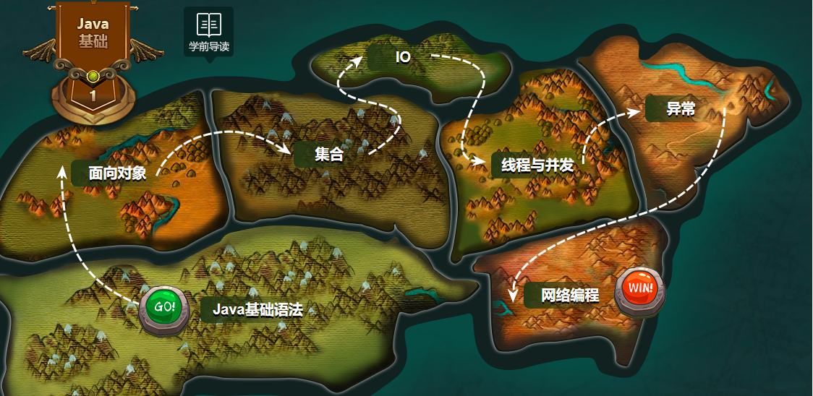

# Java_Flag

Java_NoteBook.md------------------笔记 
Java_NoteBook.assets--------------笔记图片 
Code--------------------------------------代码,ecplise工作目录，可直接在ecplise中运行 

Mind_images--------------------------阶段脑图

## 此计划更新于2021.2.21

## 参考路线

- http://yun.itheima.com/map/javaeetree

- https://www.bilibili.com/read/cv5216534?spm_id_from=333.788.b_636f6d6d656e74.5 （重要）

## 参考视频

- https://www.bilibili.com/video/BV1RV41147yJ?from=search&seid=4932318903875319779    （主）

- https://www.bilibili.com/video/BV1Rx411876f?from=search&seid=11001336243633980397  （辅助）

  

## 每日学习计划
使用Typora工具记录笔记，每日上传或多日上传一次笔记到gitee，当一个阶段完成，使用Xmind脑图工具进行全篇梳理。