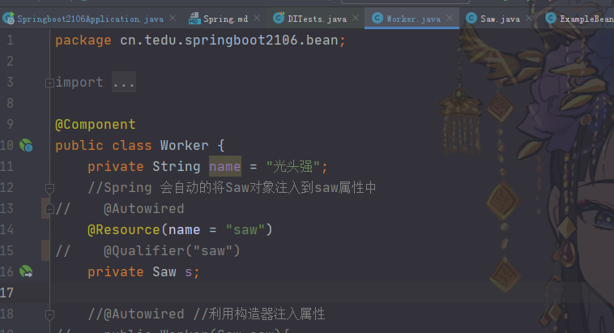

<h1 align="center">Spring</h1>

## 软件框架

软件框架是半成品软件, 框架提供软件的大部分技术功能, 使用者只需要关注软件功能, 添加功能代码就可以快速实现软件.

Spring 是目前最广泛的框架.


## Spring框架

Spring 两大核心功能

- `IoC/DI`: 控制反转和依赖注入 https://www.jianshu.com/p/1635658dc446 （如何理解IoC和DI）
- `AOP`: 面向切面(儿)编程


### IoC控制反转

将对象的管理控制权交给容器(Spring)处理的一种编程思路， 使用的时候从容器获取对象使用即可。


### Spring HelloWorld

使用原生的Spring框架去获取对象，后面介绍使用SpringBoot去获取对象

步骤：

- 创建Maven项目

- 声明一个Hello World类

  

- 导入Spring核心组件，导入后刷新

  http://doc.canglaoshi.org/config/maven_pom.html

  

- 编写一个配置类：告诉Spring启动时候创建HelloWorld对象

  这里是在方法上使用@Bean，后面会介绍@Component，用在类上

  

- 创建一个Demo用于启动Spring， ApplicationContext（Spring核心容器）

- 从Spring获取对象，测试对象

  

  


## SpringBoot

SpringBoot封装了Spring框架, 提供了自动化的配置\启动功能. 简化了Spring框架的应用.

- 提供了自动化配置, 实现了开箱即用

- 自动提供了Spring组件导入（就是pom.xml中的配置依赖导入）

- 自动提供的单元测试功能

  

SpringBoot让Spring更加简单.


### JavaBean

JavaBean: Java类的编写规范.

- 必须有包 package
- 需要有无参数构造器
- 需要实现序列化接口
- 属性访问方法(get set 方法)

Spring 建议, 被Spring管理的对象, 符合JavaBean规范, Spring称呼被管理的对象为Bean.


### Spring组件扫描功能

自动扫描package, 找到标注了特定注解的类, 自动创建类的实例.

- SpringBoot启动时候会自动扫描当前包和子包中的组件注解, 找到后会自动创建组件对象.

  

  

  

- SpringBoot会自动扫描子包

  

- 可以自定义扫描范围，例如我要扫描包外的组件

  

  

  

- Spring提供了多个组件注解，用法都是一样的

  - @Component 表示通用组件
  - @Service 业务层组件, 封装软件业务功能
  - @Controller 界面控制器, 处理界面逻辑
  - @Repository 仓库, 标注数据库访问层
  - ... ...


### Bean ID

Spring 默认情况下会为JavaBean指定唯一Bean ID(也称为Bean Name)

- @Component 注解时候
  - 类名首字母小写：`如类名： DemoBean 则BeanID为demoBean`
  - 类名连续两个大写字母, 则就是类名：`如类名MYDemoBean 则BeanID为MYDemoBean`
  - `@Component("myBean") 自定义Bean ID为myBean`
- @Bean 
  - 默认是 方法名称作为Bean ID
  - `@Bean("myBean") 自定义Bean ID 为myBean`
- Bean ID 不能重复！！！


关于Bean ID

- 在匹配JavaBean对象时候， 如果一个类型的Bean是唯一的， 会自动按照匹配
- 当匹配JavaBean对象时候， 如果一个类型的Bean有多个实例， 则需要按照ID 匹配


### ApplicationContext

SpringBoot 会自动创建ApplicationContext，可以注入到测试案例中

```java
  @Autowired
  ApplicationContext applicationContext;
```


### 单例Singleton

单例：在软件运行期间某个对象的实例始终唯一.

Spring中默认情况下, JavaBean是单例的!

多次获取同一个Bean的 引用， 是同一个对象的引用。


#### 创建多个实例

`@Scope("prototype")`使用此注释后Spring按照多个实例规则创建JavaBean对象，即每次使用对象时候，都会创建一个对象实例


### DI 依赖注入

依赖： 一个组件在处理业务时候需要使用另外一个组件，则称为依赖关系。（比如光头强要砍树需要电锯）

在处理业务**之前**，将依赖的组件注入到合适位置， 称为依赖注入。

Spring 支持3种注入方式:

- 字段(属性)注入: Spring 5 不推荐使用了, 但是还是很受欢迎的.

  - ```java
    @Autowired 
    private Saw saw;
    ```

- 方法注入: 需要定义一个方法, 将注解标注在方法上

  - ```java
    @Autowired //利用方法（set方法）注入属性
    public void setSaw(Saw saw) {
        this.saw = saw;
    }
    ```

- 构造器参数注入

  - ```java
    @Autowired //利用构造器注入属性
    public Worker(Saw saw){
        this.saw = saw;
    }
    ```


？？？？？




### @Resource 和 @Autowired

- @Resource 是Java 提供的注解, Spring支持其功能
- @Autowired 是Spring的注解
- 它们基本功能类似

区别:

- @Resource 支持 属性注入和方法注入, 但不支持构造器注入, @Autowired三种注解方式都支持
- @Autowired 的Bean匹配规则: 先类型匹配, 再名字匹配
  - 在注入属性时候, 首先在Spring查找类型唯一的一个java bean, 如果匹配成功就注入, 如果找到多个同类型的Java Bean, 则再按照name匹配
  - 按照名字匹配: 检查Bean ID 是否与当前注入变量名一致, 如果一致, 则注入成功, 否则出现异常!
- @Resource 的Bean匹配规则: 先名字匹配, 再类型匹配
  - 先按照名字唯一的原则匹配唯一的Bean对象, 如果一样则注入, 如果没有找到名字一样的JavaBean, 再按照类型匹配
  - 按照类型匹配: 查找类型相同唯一的JavaBean, 如果找到一个bean就注入成功, 找到多个就抛出异常.
- 他们的功能基本一样!


### 利用BeanID解决注入冲突问题？？？？

当有多个同类型的Bean, 并且按照类型匹配冲突时候, 可以利用Bean ID解决注入冲突:

