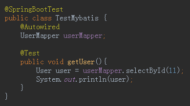
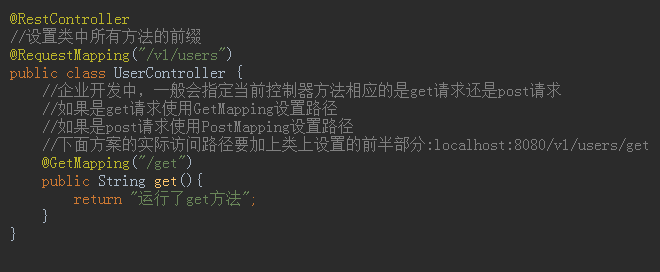
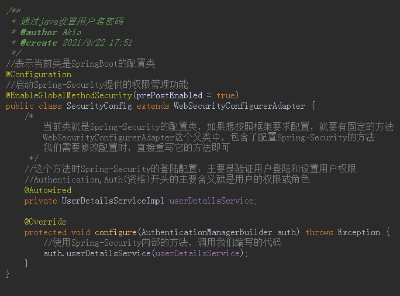
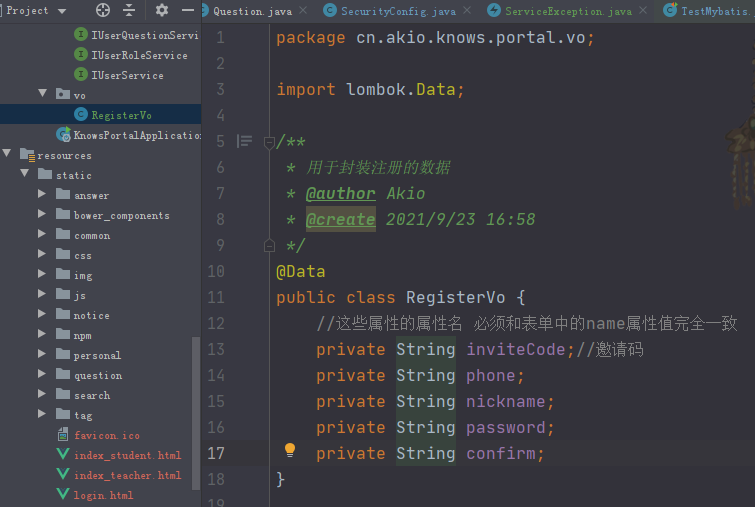
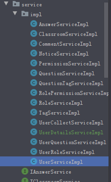
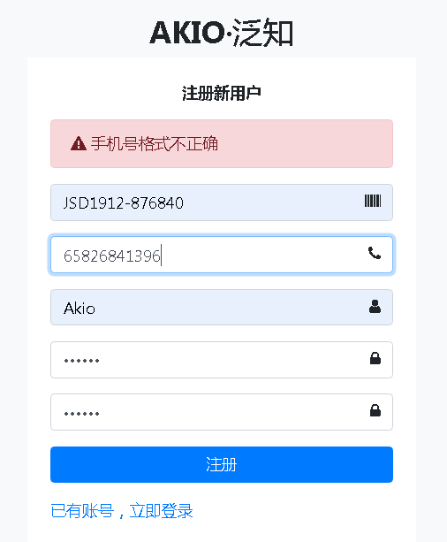
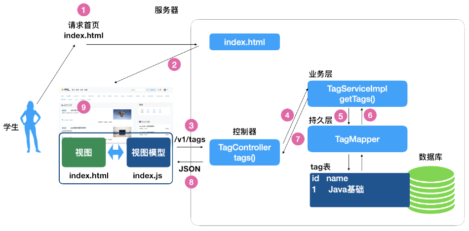
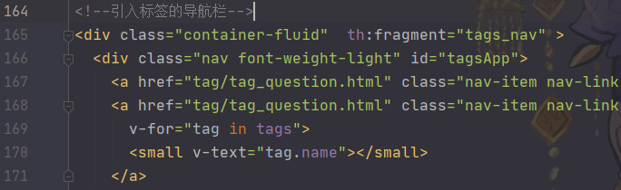
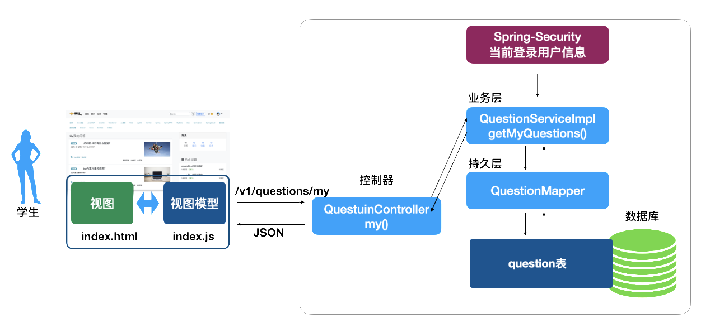

<h1 align="center">Spring</h1>

## 软件框架

软件框架是半成品软件, 框架提供软件的大部分技术功能, 使用者只需要关注软件功能, 添加功能代码就可以快速实现软件.

Spring 是目前最广泛的框架.


## Spring框架

Spring 两大核心功能

- `IoC/DI`: 控制反转和依赖注入 https://www.jianshu.com/p/1635658dc446 （如何理解IoC和DI）
- `AOP`: 面向切面(儿)编程


### IoC控制反转

将对象的管理控制权交给容器(Spring)处理的一种编程思路， 使用的时候从容器获取对象使用即可。


### Spring HelloWorld

使用原生的Spring框架去获取对象，后面介绍使用SpringBoot去获取对象

步骤：

- 创建Maven项目

- 声明一个Hello World类

  

- 导入Spring核心组件，导入后刷新

  http://doc.canglaoshi.org/config/maven_pom.html

  

- 编写一个配置类：告诉Spring启动时候创建HelloWorld对象

  这里是在方法上使用@Bean，后面会介绍@Component，用在类上

  

- 创建一个Demo用于启动Spring， ApplicationContext（Spring核心容器）

- 从Spring获取对象，测试对象

  

  


## SpringBoot

SpringBoot封装了Spring框架, 提供了自动化的配置\启动功能. 简化了Spring框架的应用.

- 提供了自动化配置, 实现了开箱即用

- 自动提供了Spring组件导入（就是pom.xml中的配置依赖导入）

- 自动提供的单元测试功能

  

SpringBoot让Spring更加简单.


### JavaBean

JavaBean: Java类的编写规范.

- 必须有包 package
- 需要有无参数构造器
- 需要实现序列化接口
- 属性访问方法(get set 方法)

Spring 建议, 被Spring管理的对象, 符合JavaBean规范, Spring称呼被管理的对象为Bean.


### Spring组件扫描功能

自动扫描package, 找到标注了特定注解的类, 自动创建类的实例.

- SpringBoot启动时候会自动扫描当前包和子包中的组件注解, 找到后会自动创建组件对象.

  

  

  

- SpringBoot会自动扫描子包

  

- 可以自定义扫描范围，例如我要扫描包外的组件

  

  

  

- Spring提供了多个组件注解，用法都是一样的

  - @Component 表示通用组件
  - @Service 业务层组件, 封装软件业务功能
  - @Controller 界面控制器, 处理界面逻辑
  - @Repository 仓库, 标注数据库访问层
  - ... ...


### Bean ID

Spring 默认情况下会为JavaBean指定唯一Bean ID(也称为Bean Name)

- @Component 注解时候
  - 类名首字母小写：`如类名： DemoBean 则BeanID为demoBean`
  - 类名连续两个大写字母, 则就是类名：`如类名MYDemoBean 则BeanID为MYDemoBean`
  - `@Component("myBean") 自定义Bean ID为myBean`
- @Bean 
  - 默认是 方法名称作为Bean ID
  - `@Bean("myBean") 自定义Bean ID 为myBean`
- Bean ID 不能重复！！！


关于Bean ID

- 在匹配JavaBean对象时候， 如果一个类型的Bean是唯一的， 会自动按照匹配
- 当匹配JavaBean对象时候， 如果一个类型的Bean有多个实例， 则需要按照ID 匹配


### ApplicationContext

SpringBoot 会自动创建ApplicationContext，如果需要使用可以注入到测试案例中

```java
  @Autowired
  ApplicationContext applicationContext;
```


### 单例Singleton

单例：在软件运行期间某个对象的实例始终唯一。例如在飞机大战中始终如一的天空背景图

注意：单例和单例模式是两个东西

Spring中默认情况下, JavaBean是单例的!  

多次获取同一个Bean的 引用， 是同一个对象的引用。


#### 创建多个实例

`@Scope("prototype")`使用此注释后Spring按照多个实例规则创建JavaBean对象，即每次使用对象时候，都会创建一个对象实例


### DI 依赖注入

依赖： 一个组件在处理业务时候需要使用另外一个组件，则称为依赖关系。（比如光头强要砍树需要电锯）

在处理业务**之前**，将依赖的组件注入到合适位置， 称为依赖注入。

Spring 支持3种注入方式:

- 字段(属性)注入: Spring 5 不推荐使用了, 但是还是很受欢迎的.

  - ```java
    @Autowired 
    private Saw saw;
    ```

- 方法注入: 需要定义一个方法, 将注解标注在方法上

  - ```java
    @Autowired //利用方法（set方法）注入属性
    public void setSaw(Saw saw) {
        this.saw = saw;
    }
    ```

- 构造器参数注入

  - ```java
    @Autowired //利用构造器注入属性
    public Worker(Saw saw){
        this.saw = saw;
    }
    ```


### @Resource 和 @Autowired（面试题）

- @Resource 是Java 提供的注解, Spring支持其功能
- @Autowired 是Spring的注解
- 它们基本功能类似

区别:

- @Resource 支持 <u>属性注入</u>和<u>方法注入</u>, 但不支持构造器注入, @Autowired三种注解方式都支持
- @Autowired 的Bean匹配规则: 先类型匹配, 再名字匹配
  - 在注入属性时候, 首先在Spring查找类型唯一的一个java bean, 如果匹配成功就注入, 如果找到多个同类型的Java Bean, 则再按照name匹配
  
  - 按照名字匹配: 检查Bean ID 是否与当前注入变量名一致, 如果一致, 则注入成功, 否则出现异常!
  
    
  
    现在要注入的变量名我故意写成s，但是我一个Bean ID叫Saw，另一个叫saw1
  
    
  
    
  
    
  
    这时候可以更改这个两个Bean ID的其中一个为s就可以成功运行，但是一般不会这么做，我们可以在`@Autowired`的基础上添加`@Qualifier(BeanID)`注解来标定我们要使用那个Bean ID
  
    
  
- @Resource 的Bean匹配规则: 先名字匹配, 再类型匹配
  - 先按照名字唯一的原则匹配唯一的Bean对象, 如果一样则注入, 如果没有找到名字一样的JavaBean, 再按照类型匹配
  
  - 按照类型匹配: 查找类型相同唯一的JavaBean, 如果找到一个bean就注入成功, 找到多个就抛出异常.
  
    
  
    上图也能解决上节点的问题
- 他们的功能基本一样!


### 利用BeanID解决注入冲突问题

当有多个同类型的Bean, 并且按照类型匹配冲突时候, 可以利用Bean ID解决注入冲突:


## 创建聚合项目

聚合项目是Maven提供的一个功能

能够创建一个父项目,一个父项目中能够创建多个子项目

好处是同一个项目,可以有多个不同的模块

每个子项目充当一个模块,在一个Idea界面中切换维护

并且每个模块专心编写自己的代码,和其他模块不干扰,方便开发或维护


### 创建父项目


### 创建子项目


### 父子相认

创建了父项目和子项目后，需要去手动的配置两者的关系

在父项目的pom.xml中

因为现在开发中比较常用的是Spring 2.3.x的版本，所以我们需要把原来的2.5.x的版本修改一下


```xml
<?xml version="1.0" encoding="UTF-8"?>
<project xmlns="http://maven.apache.org/POM/4.0.0" xmlns:xsi="http://www.w3.org/2001/XMLSchema-instance"
         xsi:schemaLocation="http://maven.apache.org/POM/4.0.0 https://maven.apache.org/xsd/maven-4.0.0.xsd">
    <modelVersion>4.0.0</modelVersion>
    <parent>
        <groupId>org.springframework.boot</groupId>
        <artifactId>spring-boot-starter-parent</artifactId>
        <version>2.3.12.RELEASE</version> <!-- 修改初始的2.5.x版本为2.3.x版本 -->
        <relativePath/> <!-- lookup parent from repository -->
    </parent>
    <groupId>cn.tedu</groupId>
    <artifactId>jd</artifactId>
    <version>0.0.1-SNAPSHOT</version>
    <name>jd</name>
    <description>Demo project for Spring Boot</description>
    <!-- 这个配置表示当前项目没有java代码就是一个pom文件 -->
    <packaging>pom</packaging>
    <!-- 这个标签配置当前父项目的所有子项目-->
    <modules>
        <module>jd-shop</module>
    </modules>
    
    <properties>
        <java.version>1.8</java.version>
    </properties>
    <!--这里有很多配置删掉了，因为父项目只负责管理所有子项目，这些配置子项目配置就可以了-->
</project>
```

在子项目的pom.xml中


```xml
<?xml version="1.0" encoding="UTF-8"?>
<project xmlns="http://maven.apache.org/POM/4.0.0" xmlns:xsi="http://www.w3.org/2001/XMLSchema-instance"
         xsi:schemaLocation="http://maven.apache.org/POM/4.0.0 https://maven.apache.org/xsd/maven-4.0.0.xsd">
    <modelVersion>4.0.0</modelVersion>
    <parent>
        <!-- 从父项目的第11行到第13行复制而来  -->
        <groupId>cn.tedu</groupId>
        <artifactId>jd</artifactId>
        <version>0.0.1-SNAPSHOT</version>
        <relativePath/> <!-- lookup parent from repository -->
    </parent>
    <groupId>cn.tedu</groupId>
    <artifactId>jd-shop</artifactId>
    <version>0.0.1-SNAPSHOT</version>
    <name>jd-shop</name>
    <description>Demo project for Spring Boot</description>
    <!-- 父项目有的配置, 子项目不用再写 -->
<!--    <properties>-->
<!--        <java.version>1.8</java.version>-->
<!--    </properties>-->
    <dependencies>
        <!--  下面的依赖是SpringBoot加SpringMvc的依赖  -->
        <dependency>
            <groupId>org.springframework.boot</groupId>
            <artifactId>spring-boot-starter-web</artifactId>
        </dependency>
        <!--
        下面的依赖是测试依赖,因为是创建项目生成的,匹配2.5.4的springBoot
        和当前项目2.3.12.RELEASE不匹配,要更换
          -->
<!--        <dependency>-->
<!--            <groupId>org.springframework.boot</groupId>-->
<!--            <artifactId>spring-boot-starter-test</artifactId>-->
<!--            <scope>test</scope>-->
<!--        </dependency>-->
        <!-- 2.3.x版本支持的测试依赖 -->
        <dependency>
            <groupId>org.springframework.boot</groupId>
            <artifactId>spring-boot-starter-test</artifactId>
            <scope>test</scope>
            <exclusions>
                <exclusion>
                    <groupId>org.junit.vintage</groupId>
                    <artifactId>junit-vintage-engine</artifactId>
                </exclusion>
            </exclusions>
        </dependency>
    </dependencies>
        <!--  下面的依赖是用于将我们编写的java程序打包成jar的依赖,
                我们并不需要,删除即可   -->
<!--    <build>-->
<!--        <plugins>-->
<!--            <plugin>-->
<!--                <groupId>org.springframework.boot</groupId>-->
<!--                <artifactId>spring-boot-maven-plugin</artifactId>-->
<!--            </plugin>-->
<!--        </plugins>-->
<!--    </build>-->

</project>
```


## 终极问答项目

### 简介


项目分为学生和讲师两种角色

学生主要是提问和其他功能,讲师主要是回答学生的提问和其他功能


​	项目结构


### 创建问答项目的父项目

此次的项目采用聚合项目来做，所以我们先创建父项目并进行配置


创建项目后修改pom.xml文件如下

```xml
<?xml version="1.0" encoding="UTF-8"?>
<project xmlns="http://maven.apache.org/POM/4.0.0" xmlns:xsi="http://www.w3.org/2001/XMLSchema-instance"
         xsi:schemaLocation="http://maven.apache.org/POM/4.0.0 https://maven.apache.org/xsd/maven-4.0.0.xsd">
    <modelVersion>4.0.0</modelVersion>
    <parent>
        <groupId>org.springframework.boot</groupId>
        <artifactId>spring-boot-starter-parent</artifactId>
        <version>2.3.12.RELEASE</version><!-- 修改初始的2.5.x版本为2.3.x -->
        <relativePath/> <!-- lookup parent from repository -->
    </parent>
    <groupId>cn.tedu</groupId>
    <artifactId>knows</artifactId>
    <version>0.0.1-SNAPSHOT</version>
    <name>knows</name>
    <description>Demo project for Spring Boot</description>
    
    <packaging>pom</packaging><!-- 证明自己是父项目 -->
    <modules>
    	<!-- 等待后期添加module -->
    </modules>
    
    <properties>
        <java.version>1.8</java.version>
    </properties>

</project>
```

父项目创建完成,下面创建子项目knows-portal，这是该项目的门户	


### 数据库

数据库表主要分为两大模块

- 用户管理模块
- 问答管理模块


###  使用lombok简化数据类

我们先项目中创建一个vo包

vo(Value Object)值对象,一般指包含一些属性的Java类

例如我们创建一个类,这个类代码如下


```java
public class Message {

    private Integer id;
    private String name;
    private String content;

    public Integer getId() {
        return id;
    }

    public void setId(Integer id) {
        this.id = id;
    }

    public String getName() {
        return name;
    }

    public void setName(String name) {
        this.name = name;
    }

    public String getContent() {
        return content;
    }

    public void setContent(String content) {
        this.content = content;
    }

    @Override
    public String toString() {
        return "Message{" +
                "id=" + id +
                ", name='" + name + '\'' +
                ", content='" + content + '\'' +
                '}';
    }

    @Override
    public boolean equals(Object o) {
        if (this == o) return true;
        if (o == null || getClass() != o.getClass()) return false;
        Message message = (Message) o;
        return Objects.equals(id, message.id) &&
                Objects.equals(name, message.name) &&
                Objects.equals(content, message.content);
    }

    @Override
    public int hashCode() {
        return Objects.hash(id, name, content);
    }
}
```

这样的值对象,在我们的java程序中非常常见,例如我们创建的和数据库表对相应的实体类,也属于这种类型

大家看到,这个代码量非常大,虽然大多数由快捷键生成,但是仍然占用的java代码的篇幅

我们可以使用lombok简化这个过程


使用lombok前后代码篇幅的变化如图


#### 使用

要想使用lombok需要如下步骤

- 步骤1:添加lombok插件


注意：如果不安装插件，Idea无法识别由lombok提供的get\set等方法

> 如果安装过程中无法搜索lombok,可以重启idea重试,或者过一段时间再搜索,如果各种办法不能搜索到,就需要使用离线安装的方式安装这个插件了,离线安装插件资料下面链接:
>
> https://blog.csdn.net/shmily_lsl/article/details/80689307
>
> 

- 步骤2:

  在父项目pom.xml文件中添加依赖

  ```xml
  <dependency>
      <groupId>org.projectlombok</groupId>
      <artifactId>lombok</artifactId>
  </dependency>
  ---
  注意：为什么SpringBoot框架中不需要写版本号<version></version>?
  因为SpringBoot框架中已经把大部分常用的依赖的版本信息都配置好了
  ```

- 步骤3:

  在Vo类上添加@Data注解

  代码如下

  ```java
  @Data
  public class Message {
      private Integer id;
      private String name;
      private String content;
  }
  ```


#### lombok常用注解

- @Getter/@Setter:注解添加在类上，表示为这个类中的所有属性添加get\set方法
  								如果添加在单个属性上，表示单独为这个属性添加get\set方法

- @ToString:添加这个注解在类上，会自动重写这个类的toString方法,方法中按照固定格式输出这个对象中的所有属性值

- @EqualsAndHashCode:添加在类上,为这个类重写equals方法和hashCode方法

- @Data:这个注解的功能是@Setter+@Getter+@ToString+@EqualsAndHashCode功能的总和

- @AllArgsConstructor:为当前类生成包含全部属性参数的构造方法(全参构造)，添加后无参构造会消失

- @NoArgsConstructor:为当前类生成一个无参构造方法

- @Accessors(chain = true):为当前类的所有set方法添加当前对象作为返回值,以支持链式set赋值，如下图

  

  为什么这个`new Messages()`后面能`.setId()`呢，正常的set方法是void修饰的，不能返回值，但支持链式set赋值后，实体类中set方法就变成如下图的了

  

  

- @Slf4j:在类上添加这个注解,会自动在当前类中添加一个可以记录日志的log对象,在方法中可以使用它为当前程序记录日志，后面详解

Lombok使用注意事项

有些公司禁止使用lombok,原因是有人认为这种看不到代码的编写方式,会埋下程序异常\错误的隐患,只有看得到的代码才是可靠的


###  MyBatis Plus

####  什么是MyBatis Plus

​	MyBatis Plus框架是在MyBatis框架基础上扩展的框架,又新增了很多实用的功能,方便程序员编写程序


MyBatis Plus框架包含了MyBatis的所有功能

使用时只需要添加MyBatis Plus的pom依赖就可以了


#### 添加MyBatis Plus依赖

我们需要知道SpringBoot框架下,有很多依赖是不需要添加版本就可以成功的引入的，原因是我们继承的2.3.12.RELEASE SpringBoot版本包含了很多常用依赖的版本，但没有为MyBatis Plus提供常用版本，因为SpringBoot提供了一套自己的，就没有为其提供。

如果我们也想在我们自己的父项目中定义版本（因为父项目中的pom.xml文件定义，子项目中所有引用这个依赖的版本号都会一致）,可以编写如下代码

父项目的pom.xml文件修改为

```xml
<?xml version="1.0" encoding="UTF-8"?>
<project xmlns="http://maven.apache.org/POM/4.0.0" xmlns:xsi="http://www.w3.org/2001/XMLSchema-instance"
         xsi:schemaLocation="http://maven.apache.org/POM/4.0.0 https://maven.apache.org/xsd/maven-4.0.0.xsd">
    <modelVersion>4.0.0</modelVersion>
    <parent>
        <groupId>org.springframework.boot</groupId>
        <artifactId>spring-boot-starter-parent</artifactId>
        <version>2.3.12.RELEASE</version>
        <relativePath/> <!-- lookup parent from repository -->
    </parent>
    <groupId>cn.tedu</groupId>
    <artifactId>knows</artifactId>
    <version>0.0.1-SNAPSHOT</version>
    <name>knows</name>
    <description>Demo project for Spring Boot</description>
    <packaging>pom</packaging>
    <modules>
        <module>knows-portal</module>
    </modules>
    <properties>
        <java.version>1.8</java.version>
        <!--定义mybatis.plus的版本--><!--------------------------->
        <mybatis.plus.version>3.3.1</mybatis.plus.version>
    </properties>
    <!------------------------------------------------------------
    dependencyManagement 标签中<dependency>标签的不是要添加依赖到当前项目
    而是定义子项目中使用这个依赖时取用的版本
    ${mybatis.plus.version}的意思就是获取<properties>标签中mybatis.plus.version的值
     -->
    <dependencyManagement>
        <dependencies>
            <dependency>
                <groupId>com.baomidou</groupId>
                <artifactId>mybatis-plus-extension</artifactId>
                <version>${mybatis.plus.version}</version>
            </dependency>
            <dependency>
                <groupId>com.baomidou</groupId>
                <artifactId>mybatis-plus-boot-starter</artifactId>
                <version>${mybatis.plus.version}</version>
            </dependency>
            <dependency>
                <groupId>com.baomidou</groupId>
                <artifactId>mybatis-plus-generator</artifactId>
                <version>${mybatis.plus.version}</version>
            </dependency>
        </dependencies>
    </dependencyManagement>

</project>
```

子项目中为其添加依赖即可

```xml
<dependency>
    <groupId>com.baomidou</groupId>
    <artifactId>mybatis-plus-boot-starter</artifactId>
</dependency>
```


### 配置MyBatisPlus

上面我们配置了父项目的MyBatisPlus版本,在子项目中添加引用

但是只是一个MyBatisPlus依赖还不能连接数据库

我们需要Mysql的依赖

所以在子项目的pom.xml继续添加依赖如下

```xml
<dependency>
    <groupId>mysql</groupId>
    <artifactId>mysql-connector-java</artifactId>
</dependency>
```

SpringBoot启动类添加一个扫描mapper包中接口的注解

代码如下


注意：application.properties中需要添加连接数据库的配置

```properties
#数据库驱动
spring.datasource.driver-class-name=com.mysql.cj.jdbc.Driver
spring.datasource.url=jdbc:mysql://localhost:3306/knows?characterEncoding=utf8&useSSL=false&serverTimezone=Asia/Shanghai&rewriteBatchedStatements=true
spring.datasource.username=root
spring.datasource.password=root
```


### 开始进行MyBatisPlus测试

我们先创建一个和数据库连接的实体类对象Tag


MyBatisPlus框架增强的功能之一就是在Mapper接口中,继承一个父接口,会自动生成基本的增删改查方法


下面对TagMapper进行常用功能测试：注意其中的修改update操作需要遵循三步


### 将MyBatisPlus执行的Sql语句显示

之前我们一直是自己编写sql语句执行，现在MyBatisPlus提供了基本的CURD(增删改查)操作

但是我们看不到它执行的Sql语句,这样有些不利于我们的学习

我们想看到它执行的Sql语句。首先我们需要了解一下SpringBoot框架下的日志系统


#### 什么是日志

日志就类似于程序的日记,记录了程序运行过程中发生了什么，是高级的System.out.println

因为它可以分级记录信息,还可以将信息保存在硬盘的文件上，记录日志的好处主要是当程序发生异常时，技术人员可以根据日志内容追踪到出现错误的原因，方便排除错误

**SpringBoot日志分五级**

从最不重要的级别开始

1. `trace` 级别低(不重要)
2. `debug`
3. `info` SpringBoot默认info及以上级别才显示在控制台
4. `warn`
5. `error` 级别高(重要\严重)

我们可以通过application文件的配置,修改SpringBoot默认输出到控制台的日志信息级别

#### 修改项目的application文件

修改 application.properties文件,添加配置如下

```properties
# 下面的配置设置了debug级别及以上级别的信息会输出到SpringBoot控制台
# 配置含义为cn.tedu.knows.portal包下的所有类的输出日志级别设置为debug,即debug级别以上的都显示
# MyBatisPlus将运行的sql语句设置在了debug,所以控制台会出现sql语句了
logging.level.cn.tedu.knows.portal=debug
```

我们就可以在MyBatis运行时在控制台看到Sql语句了


### MyBatisPlus代码生成器

#### 什么是代码生成器

代码生成器就是一个能够按指定要求生成代码的代码片段

MyBatisPlus框架支持我们按照现有的数据库表生成一个表对应的5个类

- Controller
- Mapper
- 实体类
- Service
- ServiceImpl

这样一个中型项目40张表正常200个类,只需要使用代码生成器就可以快速完成,无需我们自己创建,大大提升效率


#### 创建knows-generator项目

因为代码生成器是一次性的运行,所以建议大家单独创建一个项目来实现


#### 父子相认

父项目pom.xml

```xml
<modules>
    <module>knows-portal</module>
    <!--  下面新加的 -->
    <module>knows-generator</module>
</modules>
```

子项目knows-generator的pom.xml

```xml
<?xml version="1.0" encoding="UTF-8"?>
<project xmlns="http://maven.apache.org/POM/4.0.0" xmlns:xsi="http://www.w3.org/2001/XMLSchema-instance"
         xsi:schemaLocation="http://maven.apache.org/POM/4.0.0 https://maven.apache.org/xsd/maven-4.0.0.xsd">
    <modelVersion>4.0.0</modelVersion>
    <parent>
        <groupId>cn.akio</groupId>
        <artifactId>knows</artifactId>
        <version>0.0.1-SNAPSHOT</version>
        <relativePath/> <!-- lookup parent from repository -->
    </parent>
    <groupId>cn.akio</groupId>
    <artifactId>knows-generator</artifactId>
    <version>0.0.1-SNAPSHOT</version>
    <name>knows-generator</name>
    <description>Demo project for Spring Boot</description>

    <dependencies>
        <!--MybatisPlus 核心依赖-->
        <dependency>
            <groupId>com.baomidou</groupId>
            <artifactId>mybatis-plus-boot-starter</artifactId>
        </dependency>
        <!--freemarker 核心依赖，用于按指定格式生成代码-->
        <dependency>
            <groupId>org.springframework.boot</groupId>
            <artifactId>spring-boot-starter-freemarker</artifactId>
        </dependency>
        <!--支持SpringBoot启动的依赖-->
        <dependency>
            <groupId>org.springframework.boot</groupId>
            <artifactId>spring-boot-starter</artifactId>
        </dependency>
        <!--MybatisPlus 代码生成器核心依赖-->
        <dependency>
            <groupId>com.baomidou</groupId>
            <artifactId>mybatis-plus-generator</artifactId>
        </dependency>
        <!--MybatisPlus 辅助工具包-->
        <dependency>
            <groupId>com.baomidou</groupId>
            <artifactId>mybatis-plus-extension</artifactId>
        </dependency>
        <!--MySql驱动类-->
        <dependency>
            <groupId>mysql</groupId>
            <artifactId>mysql-connector-java</artifactId>
        </dependency>
        <!--lombok代码生成到实体类中-->
        <dependency>
            <groupId>org.projectlombok</groupId>
            <artifactId>lombok</artifactId>
        </dependency>
        <!--2.3.x版本支持的测试依赖--><!--因为这个项目主要用于一次性生成代码，所以对于test测试文件夹可以删掉，所以这个依赖就不是必须-->
        <dependency>
            <groupId>org.springframework.boot</groupId>
            <artifactId>spring-boot-starter-test</artifactId>
            <scope>test</scope>
            <exclusions>
                <exclusion>
                    <groupId>org.junit.vintage</groupId>
                    <artifactId>junit-vintage-engine</artifactId>
                </exclusion>
            </exclusions>
        </dependency>
    </dependencies>

    <build>
        <plugins>
            <plugin>
                <groupId>org.springframework.boot</groupId>
                <artifactId>spring-boot-maven-plugin</artifactId>
            </plugin>
        </plugins>
    </build>

</project>
```


#### 代码生成器的配置

因为当前generator项目有删除了测试的依赖，所以必须删除test文件夹，否则运行时报错：说缺少依赖


然后项目下创建CodeGenerator，下买呢这套代码都是固定的，只需要修改数据信息

注意，下面代码30~50行的成员变量中有一些配置要根据自己的项目进行更改


```java
package cn.akio.knows.generator;

import java.util.ArrayList;
import java.util.List;
import java.util.Scanner;
import com.baomidou.mybatisplus.core.exceptions.MybatisPlusException;
import com.baomidou.mybatisplus.core.toolkit.StringPool;
import com.baomidou.mybatisplus.core.toolkit.StringUtils;
import com.baomidou.mybatisplus.generator.AutoGenerator;
import com.baomidou.mybatisplus.generator.InjectionConfig;
import com.baomidou.mybatisplus.generator.config.DataSourceConfig;
import com.baomidou.mybatisplus.generator.config.FileOutConfig;
import com.baomidou.mybatisplus.generator.config.GlobalConfig;
import com.baomidou.mybatisplus.generator.config.PackageConfig;
import com.baomidou.mybatisplus.generator.config.StrategyConfig;
import com.baomidou.mybatisplus.generator.config.TemplateConfig;
import com.baomidou.mybatisplus.generator.config.po.TableInfo;
import com.baomidou.mybatisplus.generator.config.rules.DateType;
import com.baomidou.mybatisplus.generator.config.rules.NamingStrategy;
import com.baomidou.mybatisplus.generator.engine.FreemarkerTemplateEngine;

/**
 * @Description: 代码生成类
 * @author Akio
 * @create 2021/9/22 14:41
 */

public class CodeGenerator {
    //数据库连接参数
    public static String driver = "com.mysql.cj.jdbc.Driver";
    public static String url = "jdbc:mysql://localhost:3306/knows?characterEncoding=utf8&useSSL=false&serverTimezone=Asia/Shanghai&rewriteBatchedStatements=true";//<
    public static String username="root";
    public static String password="root";
    //父级别包名称
    public static String parentPackage = "cn.akio.knows";//<
    //代码生成的目标路径
    public static String generateTo = "/knows-generator/src/main/java";//<
    //mapper.xml的生成路径
    public static String mapperXmlPath = "/knows-generator/src/main/resources/mapper";//<
    //控制器的公共基类，用于抽象控制器的公共方法，null值表示没有父类
    public static String baseControllerClassName ;// = "cn.akio.knows.portal.base.BaseController";
    //业务层的公共基类，用于抽象公共方法
    public static String baseServiceClassName ;   // = "cn.akio.knows.portal.base.BaseServiceImpl";
    //作者名
    public static String author = "akio";//<
    //模块名称，用于组成包名
    public static String modelName = "portal";//<
    //Mapper接口的模板文件，不用写后缀 .ftl
    public static String mapperTempalte = "/ftl/mapper.java";

    /**
     * <p>
     * 读取控制台内容
     * </p>
     */
    public static String scanner(String tip) {
        Scanner scanner = new Scanner(System.in);
        StringBuilder help = new StringBuilder();
        help.append("请输入" + tip + "：");
        System.out.println(help.toString());
        if (scanner.hasNext()) {
            String ipt = scanner.next();
            if (StringUtils.isNotEmpty(ipt)) {
                return ipt;
            }
        }
        throw new MybatisPlusException("请输入正确的" + tip + "！");
    }

    /**
     * RUN THIS
     */
    public static void main(String[] args) {
        // 代码生成器
        AutoGenerator mpg = new AutoGenerator();

        // 全局配置
        GlobalConfig gc = new GlobalConfig();
        String projectPath = System.getProperty("user.dir");
        gc.setOutputDir(projectPath + generateTo);
        gc.setAuthor(author);
        gc.setOpen(false);
        //设置时间类型为Date
        gc.setDateType(DateType.TIME_PACK);
        //开启swagger
        //gc.setSwagger2(true);
        //设置mapper.xml的resultMap
        gc.setBaseResultMap(true);
        mpg.setGlobalConfig(gc);

        // 数据源配置
        DataSourceConfig dsc = new DataSourceConfig();
        dsc.setUrl(url);
        // dsc.setSchemaName("public");
        dsc.setDriverName(driver);
        dsc.setUsername(username);
        dsc.setPassword(password);
        mpg.setDataSource(dsc);

        // 包配置
        PackageConfig pc = new PackageConfig();
        pc.setEntity("model");
        //pc.setModuleName(scanner("模块名"));
        pc.setModuleName(modelName);
        pc.setParent(parentPackage);
        mpg.setPackageInfo(pc);

        // 自定义配置
        InjectionConfig cfg = new InjectionConfig() {
            @Override
            public void initMap() {
                // to do nothing
            }
        };
        List<FileOutConfig> focList = new ArrayList<>();
        focList.add(new FileOutConfig("/templates/mapper.xml.ftl") {
            @Override
            public String outputFile(TableInfo tableInfo) {
                // 自定义输入文件名称
                return projectPath + mapperXmlPath
                        + "/" + tableInfo.getEntityName() + "Mapper" + StringPool.DOT_XML;
            }
        });
        cfg.setFileOutConfigList(focList);
        mpg.setCfg(cfg);
        mpg.setTemplate(new TemplateConfig().setXml(null));
        mpg.setTemplate(new TemplateConfig().setMapper(mapperTempalte));

        // 策略配置
        StrategyConfig strategy = new StrategyConfig();
        strategy.setNaming(NamingStrategy.underline_to_camel);
        //字段驼峰命名
        strategy.setColumnNaming(NamingStrategy.underline_to_camel);
        //设置实体类的lombok
        strategy.setEntityLombokModel(true);
        //设置controller的父类
        if (baseControllerClassName!=null) strategy.setSuperControllerClass(baseControllerClassName);
        //设置服务类的父类
        if (baseServiceClassName !=null ) strategy.setSuperServiceImplClass(baseServiceClassName);
        // strategy.
        //设置实体类属性对应表字段的注解
        strategy.setEntityTableFieldAnnotationEnable(true);
        //设置表名
        String tableName = scanner("表名, all全部表");
        if(! "all".equalsIgnoreCase(tableName)){
            strategy.setInclude(tableName);
        }
        strategy.setTablePrefix(pc.getModuleName() + "_");
        strategy.setRestControllerStyle(true);
        mpg.setStrategy(strategy);

        // 选择 freemarker 引擎需要指定如下加，注意 pom 依赖必须有！
        mpg.setTemplateEngine(new FreemarkerTemplateEngine());
        mpg.execute();
    }
}
```

最后还要指定代码生成器的格式


在资源文件夹resources下创建ftl文件夹，其中创建`mapper.java.ftl`文件

```java
import ${package.Entity}.${entity};
import ${superMapperClassPackage};
import org.springframework.stereotype.Repository;

/**
 * <p>
 * ${table.comment!} Mapper 接口
 * </p>
 *
 * @author ${author}
 * @since ${date}
 */
<#if kotlin>
interface ${table.mapperName} : ${superMapperClass}<${entity}>
<#else>
@Repository
public interface ${table.mapperName} extends ${superMapperClass}<${entity}> {

}
</#if>
```

运行现在CodeGenerator类中的main方法，运行后在控制台输如all表示生成所有表对应的代码


**将生成好的controller\mapper\model\service四个包复制到portal项目，之后将generator项目的portal包删除,防止报错**


#### 测试生成的代码

测试1：在测试类中




测试2：在UserController中



运行项目


### Spring安全框架

#### 什么是Spring安全框架

Spring-Security是Spring提供的安全管理框架

主要功能是企业级的用户管理和权限控制,实现安全的登录和健全的用户角色\权限的判断

菜鸟程序员也能写出企业级安全的登录流程

相对于我们自己写登录,Spring-Security更加注重登录的封装,我们只能编写Spring-Security需要你我们提供的部分配置


#### 开始使用Spring-Security

只需要添加portal项目pom.xml依赖就可以开始使用Spring-Security，导入后记得刷新maven

```xml
<!-- Spring Security 依赖-->
        <dependency>
            <groupId>org.springframework.boot</groupId>
            <artifactId>spring-boot-starter-security</artifactId>
        </dependency>
```

只要当前添加了Spring-Security的依赖,当前项目所有资源(页面\文件\图片等)都会被保护起来,既必须登录才能访问网站中的内容


我们需要访问任何资源时,都会看见如上图的要求登陆页面

我们要登录默认用户名:**user**

默认密码在启动portal项目的控制台中,这个值是随机的


按照上述用户名密码输入,即可登录

如果想自定义用户名和密码

application.properties文件中编写代码如下

```properties
#设置Spring-Security自定义登录用户
spring.security.user.name=Grant
spring.security.user.password=123
```

再重启服务,就不会生成随机的密码了

因为我们需要使用这套信息登录


#### 密码加密

上面的配置中,我们使用了相对不安全的明文密码来设置密码字符

任何可以看到配置文件的人都可以看到明文密码进行登录

我们必须对它进行加密，我们推荐使用bcrypt加密算法，将我们的登录密码进行加密

配置文件中保存加密后的字符串，这样即使被看到了加密的密码，也不知道正确密码是什么


在测试类中测试加密算法

```java
@SpringBootTest
public class PasswordTest {
    //加密测试
    //声明并创建一个加密对象
    PasswordEncoder encode = new BCryptPasswordEncoder();

    @Test
    public void encodeWork(){
        String pwd = encode.encode("123");//将123进行加密
        System.out.println(pwd);
        //每次生成的密码都是不同的， 为了安全考虑
        //我们将加密结果每次不同称之为:"随机加盐技术"
        //$2a$10$6/Uu88kKb4glqcXBxzYOJ.CxfnWfNHIYVhVFCm/7xIIyDP2Ip5nvq
    }

    //验证密码是否匹配
    @Test
    public void match(){
        //bcrypt提供了一个matches方法，验证一个字符串是否匹配一个加密结果，返回boolean
        //是否匹配=matches([明文字符串],[加密结果])
        boolean matches = encode.matches("123", "$2a$10$6/Uu88kKb4glqcXBxzYOJ.CxfnWfNHIYVhVFCm/7xIIyDP2Ip5nvq");
        System.out.println(matches);
    }
}
```

然后将这个加密后的字符串配置到application.properties中,这样就可以使用用户名和密码访问网站的资源页面了

```properties
#设置Spring-Security自定义登录用户
spring.security.user.name=Grant
#告知Spring，这是使用bcrypt加密的结果，要加上{bcrypt}标示说明这是加密代码
spring.security.user.password={bcrypt}$2a$10$6/Uu88kKb4glqcXBxzYOJ.CxfnWfNHIYVhVFCm/7xIIyDP2Ip5nvq
```

做到这个地步，不是我们的最终目的，我们需要的是将数据库中中存放的用户密码进行加密，如下


#### 权限管理

上面的配置实际上主要为了让大家理解加密的原理和流程

实际开发中我们登录的用户都是来自数据库的,至少应该把用户配置在java代码中,才有可能连接数据库,

我们需要编写的配置如下

创建一个security包


包中创建SecurityConfig类代码如下

```java
/**
 * 通过java设置用户名密码
 * @author Akio
 * @create 2021/9/22 17:51
 */
//表示当前类是SpringBoot的配置类
@Configuration
//启动Spring-Security提供的权限管理功能
@EnableGlobalMethodSecurity(prePostEnabled = true)
public class SecurityConfig extends WebSecurityConfigurerAdapter {
    /*
        当前类就是Spring-Security的配置类，如果想按照框架要求配置，就要有固定的方法
        WebSecurityConfigurerAdapter这个父类中，包含了配置Spring-Security的方法
        我们需要修改配置时，直接重写它的方法即可
     */
    //这个方法时Spring-Security的登陆配置：主要是验证用户登陆和设置用户权限
    //Authentication,Auth(资格)开头的主要含义就是用户的权限或角色
    @Override
    protected void configure(AuthenticationManagerBuilder auth) throws Exception {
        //这一堆在后面要删掉的，因为保存用户名和密码不会在这，这只是实验
        auth.inMemoryAuthentication()   //在内存中保存一个用户的资格
                .withUser("Akio")   //用户名
                .password("{bcrypt}$2a$10$6/Uu88kKb4glqcXBxzYOJ.CxfnWfNHIYVhVFCm/7xIIyDP2Ip5nvq")
                .authorities("/teacher");  //这个用户有什么资格，资格名称随意写，不要/也可以
        		//.authorities("/teacher","/admin"); 可以设置多个权限
    }
}
```

然后就可以通过用户名Akio和密码123进行登陆访问资源页面，但原来application.properites中设置的用户名和密码就会失效


实际上,这个代码中,不但设置了用户,还设置了用户的权限

为了测试用户的权限效果,我们在UserController类中再添加两个方法

代码如下


我们上面设置的用户可以访问answer但是不能访问close

因为Akio拥有/teacher权限,但是没有/admin权限


#### 实现user表中的用户登陆

我们看到了,Spring-Security框架登录需要用户名,密码和权限

现在我们的数据库中用户和权限的关系如下图


```sql
SELECT u.username,u.nickname,r.name,p.name
FROM
user u LEFT JOIN user_role ur ON u.id=ur.user_id 
LEFT JOIN role r ON ur.role_id=r.id
LEFT JOIN role_permission rp ON r.id=rp.role_id
LEFT JOIN permission p ON rp.permission_id=p.id
where u.id=11
```


我们实际需要进行查询的,是UserMapper接口中

需要能够根据用户名查询出用户的信息和用户的所有权限

所以我们在UserMapper中编写两个方法

代码如下

```java
@Repository//标注数据访问层，将当前类对象保存到Spring容器
public interface UserMapper extends BaseMapper<User> {
    /**
     * 根据用户名查询出用户对象
     * @param username
     * @return
     */
    @Select("select * from user where username=#{username}")
    User findUserByUsername(String username);

    /**
     *
     * @param id
     * @return
     */
    @Select("SELECT p.id,p.name\n" +
            "FROM\n" +
            "user u LEFT JOIN user_role ur ON u.id=ur.user_id \n" +
            "LEFT JOIN role r ON ur.role_id=r.id\n" +
            "LEFT JOIN role_permission rp ON r.id=rp.role_id\n" +
            "LEFT JOIN permission p ON rp.permission_id=p.id\n" +
            "where u.id=#{id}")
    List<Permission> findUserPermissionsById(Integer id);
}
```

在测试类中


---

接下来我们要编写一个连接数据库的登录

需要根据Spring-Security框架要求我们编写的内容框架去编写

简单来说就是我们需要编写一个类实现Spring-Security提供的一个接口叫UserDetailService,这个接口中提供了一个方法叫loadUserByUsername

这个方法返回Spring-Security提供的一个保存用户信息的类型UserDetails（这个类型中就包含了所需要的用户名、密码、权限等用户登陆所需要的操作）

我们在service包下的impl包中,创建一个UserDetailsServiceImpl类,在这个类中编写代码如下


然后 去修改SecurityConfig




重启服务器后，就可以根据数据库中实际存在的用户进行登陆了


#### 设置限制访问的页面

默认情况下,一旦添加Spring-Security依赖

当前网站所有资源都需要登录之后才能访问

但是市面上大多数网站都有不登录就能访问的页面，例如首页，登陆页，注册页

如果我们想将网站学生首页index_student.html设置为不登录就能访问的页面需要在SecurityConfig类中添加一个方法,代码如下


重启服务器，就可以不登录直接访问学生首页了!


#### 自定义登录页面

我们希望我们的项目需要登录时,显示我们自己编写设置的登录页面

这个功能更也是通过配置Spring-Security即可

我们需要继续在上面章节编写的方法中配置,代码如下


重启服务,我们就可以使用自定义的登录页面来显示了

到此为止,登录功能更的所有步骤全部完成!


### 学生注册功能

登陆功能可以根据Spring-Security提供的框架来实现，但是对于注册功能需要我们从头到尾的去实现


#### 学生注册流程分析

我们使用三层结构开发后面所有的功能，这里就有一个点：三层结构和MVC，这两者没有关系

```
MVC
M:Model:java中除控制器之外的其他类
V:View:页面
C:Controller:控制器
我们学习的SpringMvc实际上只处理V和C之间的关系

我们学习的控制器中的各种技术,都是由SpringMvc提供的

三层指
控制层Controller 业务逻辑层Service 和 数据访问层Mapper
```


步骤：

1.学生填写好注册信息点击注册按钮,将注册请求发送给控制器SystemController

2.SystemController中编写一个接收注册表单信息的方法,这个方法接受信息后调用业务逻辑层的注册方法

3.业务逻辑层的注册方法,接收到控制器的参数,处理业务逻辑层例如验证邀请码,验证手机号,密码加密最后将要新增的学生通过数据访问层新增到数据库

4.控制层根据运行结果反馈注册结果信息到页面上


#### 注册准备工作

##### 放行设置

首先注册整体需要访问的资源是不需要登录就能访问的,先添加放行的路径

SecurityConfig放行路径修改为


##### 值对象准备

我们需要编写一个类，来封装注册表单提交过来的信息

因为这个类不和数据库表对应，所以属于值对象(ValueObject)(vo)

新建一个vo包

包中新建一个RegisterVo类专门封装注册表单中的数据




##### 自定义异常类

如果我们编写的程序出现了不能继续运行的情况

例如用户有输入的邀请码错误\用户输入了已经注册过的手机号

上面的情况都会导致注册终止

那么最好使用异常机制反馈给程序

而反馈的异常类型,java是不会提供的,我们需要自己编写异常表示我们的程序逻辑出现问题

创建一个exception包

包中新建自定义异常类ServiceException


代码如下

```java
/**
 * @author Akio
 * @create 2021/9/23 17:33
 */

public class ServiceException extends RuntimeException{
    private int code = 500;

    public ServiceException() { }

    public ServiceException(String message) {
        super(message);
    }

    public ServiceException(String message, Throwable cause) {
        super(message, cause);
    }

    public ServiceException(Throwable cause) {
        super(cause);
    }

    public ServiceException(String message, Throwable cause,
                            boolean enableSuppression, boolean writableStackTrace) {
        super(message, cause, enableSuppression, writableStackTrace);
    }

    public ServiceException(int code) {
        this.code = code;
    }

    public ServiceException(String message, int code) {
        super(message);
        this.code = code;
    }

    public ServiceException(String message, Throwable cause,
                            int code) {
        super(message, cause);
        this.code = code;
    }

    public ServiceException(Throwable cause, int code) {
        super(cause);
        this.code = code;
    }

    public ServiceException(String message, Throwable cause,
                            boolean enableSuppression, boolean writableStackTrace, int code) {
        super(message, cause, enableSuppression, writableStackTrace);
        this.code = code;
    }

    public int getCode() {
        return code;
    }
}
```

有了上面的自定义异常,我么就可以在程序逻辑发生问题时,使用自定义异常抛出终止方法的运行了


##### QueryWrapper执行查询操作

MyBatisPlus框架除了提供基本的增删改查方法之外 还提供了一套可以不写sql语句按要求进行条件查询的Api

主要的对象就是QueryWrapper,这个对象可以设置各种常见的查询条件

再编写代码让mapper按照这个条件查询就可以实现

下面测试使用QueryWrapper按邀请码查询班级教室信息Classroom

测试类中


QueryWrapper类常用方法：

eq（equals）：判断相等

gt（great than）：大于

lt（less than）：小于

ge（great equals）：大于等于

le（less equals）：小于等于

ne（not equals）：不等于


#### 注册功能实现

##### 控制器接收表单信息

我们为学生注册功能新建一个类SystemController

类中定义一个方法,接受注册页面发送过来的信息

代码如下

```java
@RestController
//下面的注解是lombok提供的
// 这个注解的作用是会自动在当前类中声明一个log对象,该对象可以记录日志
@Slf4j
public class SystemController {

    @PostMapping("/register")
    public String registerStudent(RegisterVo registerVo){
        log.debug("接收到注册信息:{}",registerVo);//{}是占位符，registerVo的内容会存储其中
        return "测试完成";
    }
}
```

重启服务器，填写注册表单，可以成功看到后台出现的日志


##### 编写业务逻辑层

上面完成了注册控制器信息的接收

这个信息要想完成注册,还需要一系列的逻辑判断和数据处理

我们先编写IUserService接口, 在该接口中编写一个方法


在UserServiceImpl实现类中编写注册的业务逻辑



代码如下


这么复杂的业务逻辑层需要测试才能使用

测试代码如下


运行测试后可以成功在数据库中看到添加的用户


##### 控制器调用业务逻辑层方法

经过上面的编码,控制器可以接收到RegisterVo对象

业务逻辑层可以根据RegisterVo对象进行注册

那么就只剩下在控制层中调用业务逻辑层方法了

SystemController类中的registerStudent方法代码修改为

、


#### 注册功能小结

开发注册的功能基本顺序

1.设置注册相关资源的放行

2.自定义异常类(只需要编写一次,之后的其他业务也可以使用)

3.创建接收表单信息的Vo类

4.表单提交到控制器,控制器接收表单信息

5.编写业务逻辑层

- 先编写接口,定义注册方法
- 再编写实现类,实现注册功能
- 测试

6.控制器中编写代码调用业务逻辑层(包含异常处理)


### Vue+Axios实现异步注册

上面使用同步完成了学生注册，现在将其改为异步注册，能够在页面中显示相对应的信息，不轻易跳转页面

编写的控制器以及业务逻辑层代码,无需因为异步的操作而进行改变

异步的请求的变化只在于html和匹配它进行异步操作的js文件

我们先来编写vue对页面的绑定


然后是register.js


然后 重启服务器


### 表单验证

#### 什么是表单验证

表单验证就是针对表单中的信息是否满足基本格式的一系列判断

表单验证的好处是

在客户端就阻止一些一定无法注册的信息发送到服务器,减少服务器压力

我们现在的html页面中包含了表单验证

实现方式是html5提供的代码

但是这个验证只能阻止使用表单进行注册的用户将错误信息发送到服务器


上面的图片表示黑客可以直接绕开浏览器直接向服务器发送请求

如果一般的表单验证就无法生效了

我们需要在服务器端也添加表单验证,才能确保安全

简单来说,客户端验证是减轻服务器压力,服务器端验证是确保安全


#### Spring验证框架

经过上面章节的分析,得知我们必须在服务器端进行表单中信息的验证

这个验证如果使用常规的if判断会非常的麻烦

我们可以借助Spring Validation框架实现快速高效的验证过程

首先添加依赖

```xml
<!-- 验证框架 -->
<dependency>
    <groupId>org.springframework.boot</groupId>
    <artifactId>spring-boot-starter-validation</artifactId>
</dependency>
```

添加完依赖之后要想使用Spring-Validation进行验证我们需要编写两个部分的内容

1.对RegisterVo类的所有属性,进行格式的规定

2.在控制器中启动验证,判断验证结果

- 1、RegisterVo代码修改如下


常用的Spring-Validation框架验证属性的注解有

```java
@NotBlank:只能使用在字符串类型上,判断不能为null,而且会对字符串值调用trim()方法后检查字符串长度是不是0,如果是0也会发送错误信息
@Pattern:只能使用在字符串类型上,规定一个正则表达式,如果字符串值不满足这个正则表达式,会发送错误信息
@NotNull: 可以作用在任何引用类型上,判断这个对象的值不能为空,否则发送错误信息
@NotEmpty:专门作用在集合或数组类型上,判断这个集合或数组不能为null且至少有一个元素,否则发送错误信息
```


- 2、上面的操作只是规定了格式,最重要的是在控制器中启动验证,判断结果

  SystemController的registerStudent方法

  代码如下

  

  


### 开发学生首页

#### 显示标签列表


运行流程



1. 在学生首页显示并加载完毕的时候，触发vue的方法进行axios的请求
2. axios请求/v1/tags的路径,这个路径指向TagController类的一个方法
3. TagController的这个方法会调用TagService获取所有标签集合
4. TagService中连接数据库查询所有标签返回给Controller
5. 控制层将所有标签集合返回给页面,将所有标签安装Vue绑定显示出来


**开发业务逻辑层**

ITagService.java接口

```java
public interface ITagService extends IService<Tag> {

    //查询所有标签的业务逻辑层方法
    List<Tag> getTags();
}
```

TagServiceImpl.java接口实现类

```java
@Service
public class TagServiceImpl extends ServiceImpl<TagMapper, Tag> implements ITagService {
    @Autowired
    private TagMapper tagMapper;

    @Override
    public List<Tag> getTags() {
        List<Tag> tags = tagMapper.selectList(null);
        return tags;
    }
}
```


**开发控制层**

TagController类中编写一个方法调用上面的业务逻辑层获得所有标签并返回给前端


编写完控制器,建议重启服务进行一个同步测试

在浏览器地址栏输入:localhost:8080/v1/tags

观察结果


**进行前端html绑定**

tag_nav.js

```java
let tagsApp = new Vue({
    el:'#tagsApp',
    data:{
        tags:[]
    },
    methods:{
        loadTags:function () {
            console.log('执行了 loadTags');
            axios({
                url:'/v1/tags',
                method:'GET'
            }).then(function(r){
                if(r.status==OK){
                    tagsApp.tags=r.data;
                }
            })
        }
    },
    created:function () {
        this.loadTags();
    }
});
```




#### 标签的缓存设置

#####  什么是缓存

所谓缓存就是将数据临时保存在内存中的做法,一般是为了下次更方便的访问

缓存就是用内存提高运行速度的措施


##### 为什么需要缓存

如果我们要提高查询速度,可以将数据保存在内存中,需要时从内存中获得,这样比从数据库(硬盘)中获取效率高上万倍

什么样的数据适合放在缓存中呢?

同时具有下面3个特征的,就可以放在缓存中

1. 数据量不能太大
2. 被频繁访问的数据
3. 数据不经常变化,或变化不敏感

我们的标签列表就是符合上面条件的对象

下面就将标签列表保存到缓存中

TagServiceImpl实现类代码修改如下


重启服务,我们可以通过观察控制台输出的信息发现,除了第一次访问连接了数据库之外,之后的每次访问都没有连接数据库了,这就是使用了缓存的效果


#### 显示问题列表


上面的图片中画出的位置就是学生首页的问题列表

这个问题列表的内容是当前登录学生提问的所有问题

如果是st2学生登录,就要查询这个学生当前的所有的问题

sql语句如

```sql
SELECT * FROM question WHERE user_id=11
```


##### 业务流程分析



1. 页面加载完毕时向QuestionController发送一个异步请求
2. QuestionController从Spring-Security中获得当前登录的用户名
3. 调用业务逻辑层方法,传入登录的用户名
4. 业务逻辑层方法根据用户名查询出该用户当前问题的列表返回
5. 控制层接收到返回值,响应给页面

**开始流程之前,需要先将学生首页的放行从Spring-Security配置中删除**

因为当前学生首页是根据登录用户决定显示问题列表的


##### 业务逻辑层编写

IQuestionService接口中添加一个查询当前学生问题列表的方法


业务逻辑层实现类QuestionServiceImpl


##### 控制层编写

QuestionController类中编写一个方法查询登录用户问题列表

代码如下


重启服务

浏览器输入`localhost:8080/v1/questions/my`，可以查询到数据


##### html绑定和js代码

index.js文件


index_student.html页面

```html
<script src="js/index.js"></script><!--导入js文件-->
```

```html
181行开始
<div class="media bg-white m-2 p-3"
  v-for="question in questions">
  <div class="media-body w-50">
    <div class="row">
      <div class="col-md-12 col-lg-2">
        <span class="badge badge-pill badge-warning" style="display: none">未回复</span>
        <span class="badge badge-pill badge-info" style="display: none">已回复</span>
        <span class="badge badge-pill badge-success">已解决</span>
      </div>
      <div class="col-md-12 col-lg-10">
        <h5 class="mt-0 mb-1 text-truncate">
          <a class="text-dark" href="question/detail.html"
             v-text="question.title">
            eclipse 如何导入项目？
          </a>
        </h5>
      </div>
    </div>
    <div class="font-weight-light text-truncate text-wrap text-justify mb-2" style="height: 70px;">
      <p v-html="question.content">
        eclipse 如何导入项目？
      </p>
    </div>
    <div class="row">
      <div class="col-12 mt-1 text-info">
        <i class="fa fa-tags" aria-hidden="true"></i>
        <a class="text-info badge badge-pill bg-light" href="tag/tag_question.html"><small >Java基础 &nbsp;</small></a>
      </div>
    </div>
    <div class="row">
      <div class="col-12 text-right">
        <div class="list-inline mb-1 ">
          <small class="list-inline-item" 
            v-text="question.userNickName">
            风继续吹
          </small>
          <small class="list-inline-item">
            <span v-text="question.pageViews">12</span>
            浏览</small>
          <small class="list-inline-item" v-text="question.duration">13分钟前</small>
        </div>
      </div>
    </div>

  </div>
  <!-- / class="media-body"-->
  
</div>
```


#### 显示每个问题的标签列表(冗余存储)


上面的图片中表示了这个问题的所有标签

而实际情况下,每个问题都有不同的标签,我们要将每个问题的标签显示出来

这就要先明确问题和标签的关系


问题和标签是多对多的关系

这样要想根据问题的id查询所有标签,就需要连表查询了

但是连表查询从性能和开发便利性出发,都不是最好的

那么我们可能会采取冗余存储的方式避免连接查询


##### tag_names列的分割处理

以106号问题为例

```
"Java基础,Java SE,面试题"

我们可以使用字符串拆分的api:split获得一个数组

{"Java基础","Java SE","面试题"}
```

上面只是一个字符串数组

页面上的标签是可以点击的,要根据标签的id查询这个标签的所有问题,所以只有标签名称不够

需要查询标签名称和标签id也就是Tag对象

如果根据标签名称在List中遍历寻找,效率太低了

我们推荐使用Map进行处理,

在ITagService业务逻辑层接口中添加一个返回Map类型的方法


在TagServiceImpl类中修改


这样我们的缓存中多了一个包含所有标签的Map对象,可以随时取出使用

上面代码准备好了根据标签名称获得标签对象

但是获得了所有的标签对象之后保存在哪呢?

保存在当前问题对象中,这样就要去Question实体类能够保存一个Tag的集合

转到Question实体类,在最后添加一个属性如下


上面准备好了所有的前提

下面我们要到QuestionServiceImpl类中编写一个方法

根据tag_names的字符串返回字符串代表的List<Tag>方法

QuestionServiceImpl类中代码修改如下


##### 显示问题的配图

现在每个问题的配图是一样的

我们达内知道项目设计每个问题的配图是依据当前问题的第一个标签的id决定的

具体实现代码已经在index.js中的updateTagImage中了

我们需要做的仅仅是修改index_student.html的240行附近

img标签的vue绑定


